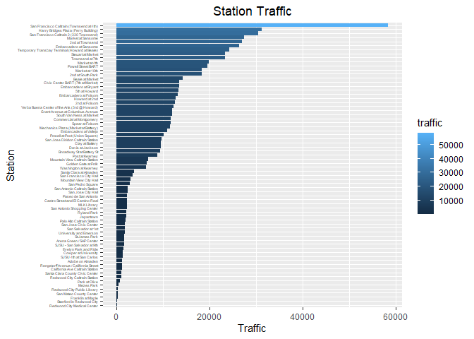
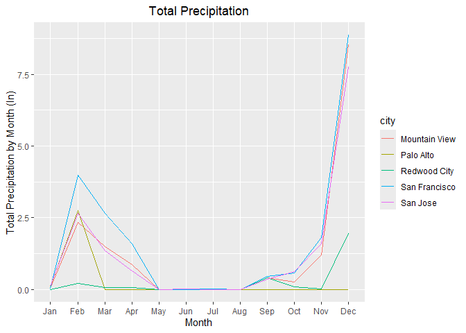
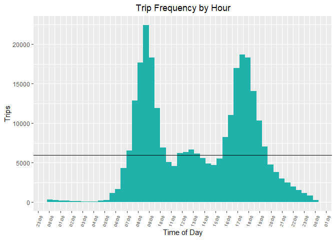
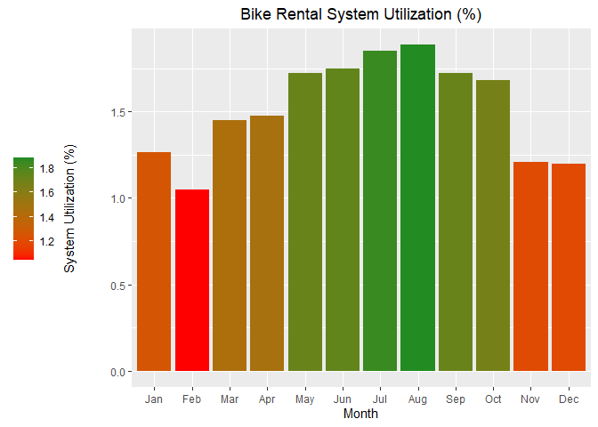
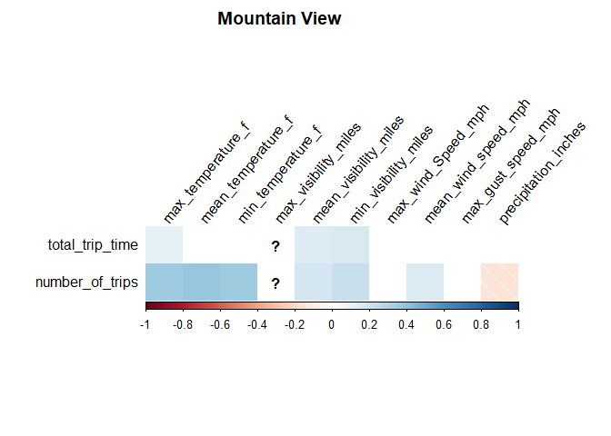
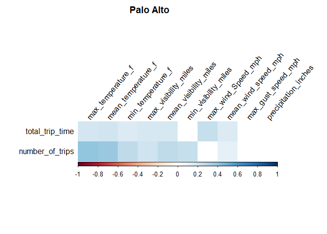
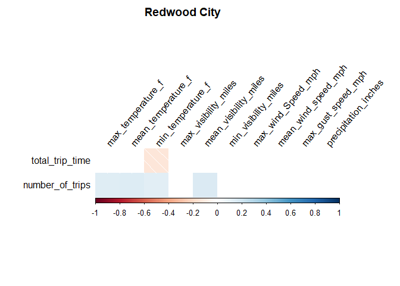
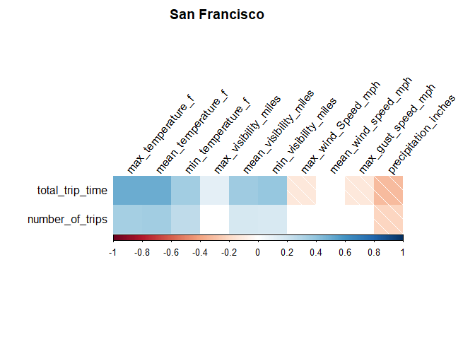
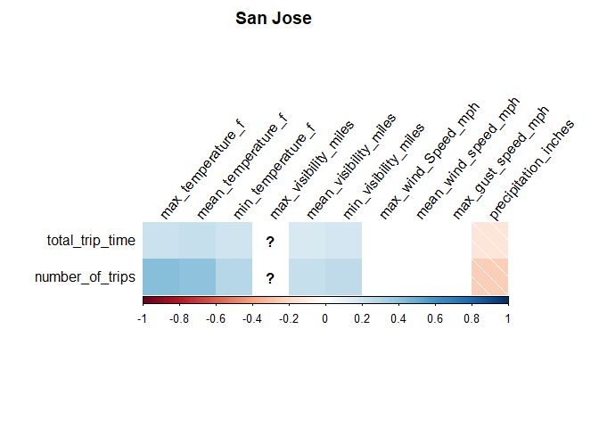

Report Findings
================
Youssef Emam
2024-08-04

## Data Overview

------------------------------------------------------------------------

## EDA

### Station Data

Once I loaded the data the next step was to look at it. To do this I
completed a basic exploratory data analysis. I created plots that
summarized the data to get an idea of the distribution across the
different data sets.

Firstly I summarized each station by the amount of traffic that it gets.
In this case I defined traffic as how many times a trip starts or stops
at a station. The plot can be seen below:

<!-- -->

It can be seen that there is quite a large variance in how much traffic
each station gets.

### Trip Data

Next I summarized the trip data by identifying the average cycling
duration over the course of each month. The plot can be seen below:

<!-- -->

Unexpectedly, the highest mean duration occurs during December. This is
likely due to the presence of an outlier which we will investigate
later. Aside from this, as expected the usage seems to increase in the
summer months and decrease slightly in the winter months.

### Weather data

To summarize the weather data, I identified how the precipitation levels
change over the course of the year with respect to each city represented
in the data:

<!-- -->

As expected, the precipitation peaks in the winter months, and becomes
insignificant during the summer months.

------------------------------------------------------------------------

## Data Cleaning

As seen earlier, the data contains outliers and requires significant
amounts of preprocessing.

This is a list of changes that were made to each dataset, and the
reasons behind them:

### Stations

Dates were converted to POSIXct format ~ Enables easier manipulation and
comparison later on

### Trips

Dates were converted to POSIXct format ~ Enables easier manipulation and
comparison later on

Character fields were converted to factors ~ Enables grouping, and
allows us to compare trends later on

Zip Code outliers were removed ~ Any value beyond the valid zip code
range of 00501- 99950 was removed. Any blank values were converted to
NAs, and the column was turned into integer data

Cancelled trips were identified ~ Any trip that lasted less than 3
minutes and started/ended at the same station was considered cancelled.
These trips were removed from the data set and stored in a separate
file. A snapshot of this file can be seen below (see the HTML version of
this document to use an interactive version of the complete table):

  &#10;  

    
Cancelled Trips

    

  

  

  <script type="application/json" data-for="ckiyrovzeq">{"x":{"tag":{"name":"Reactable","attribs":{"data":{"X":[1,2,3,4,5,6,7,8,9,10,11,12,13,14,15,16,17,18,19,20,21,22,23,24,25,26,27,28,29,30,31,32,33,34,35,36,37,38,39,40,41,42,43,44,45,46,47,48,49,50,51,52,53,54,55,56,57,58,59,60,61,62,63,64,65,66,67,68,69,70,71,72,73,74,75,76,77,78,79,80,81,82,83,84,85,86,87,88,89,90,91,92,93,94,95,96,97,98,99,100,101,102,103,104,105,106,107,108,109,110,111,112,113,114,115,116,117,118,119,120,121,122,123,124,125,126,127,128,129,130,131,132,133,134,135,136,137,138,139,140,141,142,143,144,145,146,147,148,149,150,151,152,153,154,155,156,157,158,159,160,161,162,163,164,165,166,167,168,169,170,171,172,173,174,175,176,177,178,179,180,181,182,183,184,185,186,187,188,189,190,191,192,193,194,195,196,197,198,199,200,201,202,203,204,205,206,207,208,209,210,211,212,213,214,215,216,217,218,219,220,221,222,223,224,225,226,227,228,229,230,231,232,233,234,235,236,237,238,239,240,241,242,243,244,245,246,247,248,249,250,251,252,253,254,255,256,257,258,259,260,261,262,263,264,265,266,267,268,269,270,271,272,273,274,275,276,277,278,279,280,281,282,283,284,285,286,287,288,289,290,291,292,293,294,295,296,297,298,299,300,301,302,303,304,305,306,307,308,309,310,311,312,313,314,315,316,317,318,319,320,321,322,323,324,325,326,327,328,329,330,331,332,333,334,335,336,337,338,339,340,341,342,343,344,345,346,347,348,349,350,351,352,353,354,355,356,357,358,359,360,361,362,363,364,365,366,367,368,369,370,371,372,373,374,375,376,377,378,379,380,381,382,383,384,385,386,387,388,389,390,391,392,393,394,395,396,397,398,399,400,401,402,403,404,405,406,407,408,409,410,411,412,413,414,415,416,417,418,419,420,421,422,423,424,425,426,427,428,429,430,431,432,433,434,435,436,437,438,439,440,441,442,443,444,445,446,447,448,449,450,451,452,453,454,455,456,457,458,459,460,461,462,463,464,465,466,467,468,469,470,471,472,473,474,475,476,477,478,479,480,481,482,483,484,485,486,487,488,489,490,491,492,493,494,495,496,497,498,499,500,501,502,503,504,505,506,507,508,509,510,511,512,513,514,515,516,517,518,519,520,521,522,523,524,525,526,527,528,529,530,531,532,533,534,535,536,537,538,539,540,541,542,543,544,545,546,547,548,549,550,551,552,553,554,555,556,557,558,559,560,561,562,563,564,565,566,567,568,569,570,571,572,573,574,575,576,577,578,579,580,581,582,583,584,585,586,587,588,589,590,591,592,593,594,595,596,597,598,599,600,601,602,603,604,605,606,607,608,609,610,611,612,613,614,615,616,617,618,619,620,621,622,623,624,625,626,627,628,629,630,631,632,633,634,635,636,637,638,639,640,641,642,643,644,645,646,647,648,649,650,651,652,653,654,655,656,657,658,659,660,661,662,663,664,665,666,667,668,669,670,671,672,673,674,675,676,677,678,679,680,681,682,683,684,685,686,687,688,689,690,691,692,693,694,695,696,697,698,699,700,701,702,703,704,705,706,707,708,709,710,711,712,713,714,715,716,717,718,719,720,721,722,723,724,725,726,727,728,729,730,731,732,733,734,735,736,737,738,739,740,741,742,743,744,745,746,747,748,749,750,751,752,753,754,755,756,757,758,759,760,761,762,763,764,765,766,767,768,769,770,771,772,773,774,775,776,777,778,779,780,781,782,783,784,785,786,787,788,789,790,791,792,793,794,795,796,797,798,799,800,801,802,803,804,805,806,807,808,809,810,811,812,813,814,815,816,817,818,819,820,821,822,823,824,825,826,827,828,829,830,831,832,833,834,835,836,837,838,839,840,841,842,843,844,845,846,847,848,849,850,851,852,853,854,855,856,857,858,859,860,861,862,863,864,865,866,867,868,869,870,871,872,873,874,875,876,877,878,879,880,881,882,883,884,885,886,887,888,889,890,891,892,893,894,895,896,897,898,899,900,901,902,903,904,905,906,907,908,909,910,911,912,913,914,915,916,917,918,919,920,921,922,923,924,925,926,927,928,929,930,931,932,933,934,935,936,937,938,939,940,941,942,943,944,945,946,947,948,949,950,951,952,953,954,955,956,957,958,959,960,961,962,963,964,965,966,967,968,969,970,971,972,973,974,975,976,977,978,979,980,981,982,983,984,985,986,987,988,989,990,991,992,993,994,995,996,997,998,999,1000,1001,1002,1003,1004,1005,1006,1007,1008,1009,1010,1011,1012,1013,1014,1015,1016,1017,1018,1019,1020,1021,1022,1023,1024,1025,1026,1027,1028,1029,1030,1031,1032,1033,1034,1035,1036,1037,1038,1039,1040,1041,1042,1043,1044,1045,1046,1047,1048,1049,1050,1051,1052,1053,1054,1055,1056,1057,1058,1059,1060,1061,1062,1063,1064,1065,1066,1067,1068,1069,1070,1071,1072,1073,1074,1075,1076,1077,1078,1079,1080,1081,1082],"id":[139945,139967,140179,140429,140484,140715,140734,141227,141388,142332,143075,143707,144838,145292,146812,147756,147842,148495,148593,148609,150138,150244,151208,151489,151958,153060,153181,153206,153280,154409,154445,155376,155643,155761,156239,156344,157057,157297,157594,157847,157986,158111,158872,159323,159739,160325,160479,160856,160925,161966,162375,162797,163324,163932,164656,164657,164720,165284,165305,165599,165696,166129,169232,169559,169578,169778,169902,170269,170510,170547,171346,171508,171804,171822,172777,172816,172914,173120,173131,174470,175373,175484,175725,176175,176920,177630,178595,178626,178766,178887,178901,179528,182355,182906,183794,184113,184316,184703,185232,185480,185714,185761,185802,185899,186437,186779,186884,186999,187141,188209,188339,189973,190379,191927,192405,192613,192695,192705,192774,192886,193025,193114,193120,193362,193374,193477,193638,194285,196859,196913,197796,197960,432795,432753,432708,432584,432473,432417,432304,432164,431886,431885,431877,431872,431764,431692,429029,427340,427006,426408,426231,426115,425916,425355,424820,423272,421797,421417,421267,420691,419506,419504,419290,419199,418587,417880,417561,417074,416452,414736,412441,412246,412121,412119,412004,411589,411516,411312,411033,410597,410162,410102,410101,409979,409345,407303,407302,406512,405485,405130,405126,404833,404794,404133,403886,403304,403141,402968,402714,402529,402193,402148,401877,401640,401561,401470,401302,401293,401171,401167,400943,400902,400122,399593,399551,399515,399150,398598,398360,398084,397931,396985,396749,395646,395535,395071,395068,395053,395037,395023,394843,393905,393524,393517,393324,392709,392591,391985,391854,391795,391635,391628,391515,391124,390458,390373,390245,389771,389034,388866,388558,387043,386598,385913,385761,385728,385595,384644,384269,383893,383292,383130,383034,382721,382648,382631,382561,382334,382260,382259,382082,381793,381791,381670,381660,381478,381342,381273,380912,380584,380498,380231,380026,379667,379466,378420,377777,376936,376699,376698,376560,376352,376204,372630,372314,371977,371573,371186,371048,370872,370852,370850,370656,370513,369931,369909,369545,369264,369128,369120,369068,368785,368498,368161,366075,365458,363454,362788,362685,362449,362273,361865,361584,361379,360744,360471,360102,360073,358911,358605,358195,357966,355819,355410,354472,354444,354287,353955,353765,353684,353374,352973,352936,352741,352572,352169,352099,352094,352036,351951,351711,351551,351540,351174,350760,350599,350523,350302,348975,348468,347798,344472,344450,344383,344218,344094,343996,343925,343771,343567,343456,343349,343277,343176,343175,343072,342954,342931,341966,341663,341495,341122,340859,340214,339326,339173,339052,338716,338661,337907,337782,337101,337040,335861,335857,335844,334921,334622,334371,334313,333981,333960,333844,333595,333215,332961,331918,331195,330840,330309,330130,330099,329734,329580,329502,329263,328091,326559,326126,326010,325463,324936,324325,324025,323841,323341,323016,322786,322396,322176,321159,320873,319962,319259,318992,318967,317774,317135,315209,314762,314750,314677,314471,313970,313474,313345,312777,312214,311841,311450,311359,310914,310532,310001,309883,309804,308734,308592,308587,308366,308033,307926,306877,306110,305977,305806,305723,305672,305546,305545,304933,304840,304228,302876,301625,301483,299569,299438,299073,298396,297935,297172,296833,296408,296241,296201,296143,294403,294291,293764,293518,292903,291949,291473,290642,290467,290162,289781,289457,289037,288952,288760,288691,288105,288104,287923,287774,287092,286897,286523,286070,285544,285052,284638,284451,284299,283927,283786,282184,281807,281042,280602,280089,279584,279488,279373,279347,279246,278460,278384,277755,277534,277504,277198,277157,276039,275629,275628,275326,274634,274516,273733,272822,272807,272103,271822,271332,271037,270573,270032,269987,269974,269891,269562,269343,269098,268806,268540,268377,268078,267034,266570,266461,266377,263518,262706,262290,261926,261795,261530,261528,261376,261034,260619,260560,260102,259654,259419,258697,258387,258076,257724,257643,257020,256150,255654,255026,254867,254576,254433,254415,254142,253642,253218,253076,251392,251024,250175,250085,249769,249707,249352,249101,248922,248735,248632,248309,247901,247879,247874,246580,246482,246462,246120,246119,246118,246114,246039,245823,245737,245096,244131,244068,243962,243243,242643,242555,242479,242264,241904,241881,241602,241582,241543,240270,239947,239649,239048,238371,238139,237630,237624,236909,236112,236039,235972,234023,233220,233107,232739,232485,232070,231607,231388,231381,231361,230923,230772,229300,229245,229194,228094,227988,227435,227059,225578,225174,224999,224844,224291,224016,223755,223118,222017,220932,220770,220759,220600,220378,219959,219892,219891,219873,219786,219001,218776,216178,216129,215902,215853,215807,215593,215209,215189,215107,214690,214630,214626,214074,213275,212843,212224,211814,211671,211523,211327,211319,210353,210138,210028,208647,208463,208063,207182,206452,206392,206339,206008,204677,202979,202211,201676,200593,199497,199465,199464,198940,198827,588746,587995,587637,586820,586774,586772,585973,585938,585815,585184,584667,584536,583659,583654,583345,583153,582391,582153,581661,581557,581153,580968,580497,580048,578946,578518,578171,577492,577063,577025,576472,576265,576216,575912,575620,575455,575437,575425,575350,574993,574684,574497,574356,574197,574024,573825,572848,570544,570229,569966,569847,569702,569620,569426,569340,568350,568115,567482,567207,567134,567050,567033,565941,565934,565858,565586,565561,565478,565469,564874,564588,564369,564275,563347,562072,561899,561167,560855,560805,560468,559566,558803,558722,558712,558630,558228,558163,557768,557603,556714,556685,556115,555232,554606,554044,553840,553283,552929,552825,552273,552255,552062,550693,550568,550513,549322,549254,548002,547684,547516,547248,547063,545959,545958,545812,544292,542614,541591,541396,541197,540874,539607,537670,537618,536782,536757,536436,536124,536026,535928,535862,534449,534424,534343,534156,534037,533816,533716,533583,532407,530596,530279,529785,529441,529256,528588,526831,525505,525133,525093,524733,524083,523786,523746,523538,523346,522990,522970,522908,522072,521346,521269,520896,520600,519313,518413,517976,517593,516957,516939,516843,516152,515776,515552,515506,515475,515387,515264,515169,514922,514464,513826,513635,513385,513329,511866,511355,511062,508466,508274,506553,506025,505787,505634,505421,505370,505213,504253,503600,503274,501895,501474,500680,500610,499837,499699,499601,498760,496767,496263,495875,495775,495464,494793,494455,494087,493794,493488,493403,492897,490742,490617,490450,490118,488684,488522,487577,486575,486533,486056,485772,485313,484986,484835,484774,484701,484550,484031,483786,483333,483052,483046,482797,482653,482404,481969,481968,481389,481078,479988,479062,478914,478357,477997,475884,475748,475648,475256,474749,473925,473603,473451,473167,473041,472778,472776,472737,472554,472159,472039,471928,471731,471521,470918,470640,470442,469842,469707,469393,469300,469069,468592,467735,467291,466704,465668,464706,464484,463972,462473,462252,462215,462176,461472,461167,461023,460187,459844,459269,458714,458592,457859,456019,455810,455595,455199,453959,453812,452769,452285,451626,451372,451263,450653,450330,450166,449307,448687,448467,448186,447710,447438,447200,446254,446144,445950,444327,444107,443058,442288,441265,441241,441034,440433,440398,440042,439970,439933,439101,439100,439099,438629,438041,437650,437154,437027,436927,436006,435667,435560,435122,434778,433166,433135],"duration":[73,160,63,126,114,69,64,123,66,64,135,64,108,152,148,121,90,71,86,68,105,75,178,73,107,110,111,128,62,166,172,82,116,124,85,127,74,154,124,62,95,111,97,67,62,88,60,71,101,85,118,83,111,170,135,82,131,176,74,64,86,74,168,99,69,133,93,104,70,77,115,119,84,60,83,127,110,100,72,62,64,173,77,114,71,102,166,133,70,61,152,130,72,92,77,103,96,110,119,80,74,75,88,131,89,142,80,98,64,111,160,70,114,157,88,166,67,72,122,127,116,143,158,123,72,72,101,127,65,93,105,164,79,168,138,64,114,103,85,122,174,159,62,83,121,62,66,77,95,120,68,99,78,139,179,75,64,97,62,116,104,64,98,78,74,97,90,72,64,115,64,110,147,158,61,93,167,171,138,60,64,71,79,63,62,85,84,69,85,174,122,103,117,179,70,117,117,148,71,61,176,144,83,69,95,120,124,128,71,99,73,66,107,153,83,88,76,112,93,90,85,71,72,63,128,76,72,117,144,100,123,86,112,91,77,71,134,168,110,65,100,74,68,74,76,80,66,110,113,173,97,91,74,107,123,72,133,98,77,65,98,86,70,166,169,123,72,125,71,65,102,103,126,89,94,66,145,161,83,60,67,88,171,121,132,100,118,100,101,108,114,82,80,67,63,72,73,161,63,82,76,147,80,115,107,69,144,142,73,145,167,164,64,160,97,72,65,60,68,85,122,124,152,168,73,68,75,140,82,61,115,118,115,115,124,97,73,95,62,98,67,84,104,62,104,169,68,137,104,115,119,130,171,128,64,133,158,139,162,95,61,114,81,109,102,72,69,101,70,113,64,165,69,166,178,101,115,82,133,82,109,74,122,135,66,129,82,100,67,92,65,144,119,142,153,60,156,86,152,144,104,103,168,130,67,66,82,91,79,154,177,83,177,66,66,109,75,168,84,61,70,68,61,160,76,125,92,72,154,102,64,136,129,68,102,82,104,81,91,129,163,66,71,152,112,70,120,126,65,157,95,76,124,134,69,99,123,66,102,69,66,85,73,137,84,75,62,118,107,145,102,63,64,169,96,157,71,75,121,167,72,115,111,63,71,72,109,95,86,106,71,101,67,80,162,71,165,169,136,168,128,107,125,148,85,92,83,96,110,154,103,94,71,60,118,111,96,131,125,109,73,85,75,74,135,130,94,64,140,134,145,118,99,114,101,133,91,91,95,61,143,87,99,95,120,62,124,65,160,73,71,135,126,134,67,70,138,67,104,112,71,89,74,157,84,132,125,73,173,106,62,80,146,74,62,98,71,96,79,84,65,128,107,79,102,71,153,126,94,90,61,73,77,69,108,173,128,93,98,122,96,70,101,96,105,66,148,65,101,95,172,141,98,64,136,110,70,72,103,61,67,137,85,75,95,175,131,111,131,107,96,109,118,66,85,164,72,70,97,116,139,136,87,136,102,70,100,77,155,136,149,69,79,71,130,79,76,65,102,114,74,91,150,89,97,67,64,66,122,150,64,104,150,63,94,84,64,75,108,92,64,81,70,67,120,60,144,121,84,159,166,147,105,170,171,99,69,114,75,74,153,94,133,94,116,62,63,62,66,137,94,92,89,157,87,100,179,64,107,75,167,70,91,79,91,125,119,66,62,89,106,89,79,67,135,92,167,74,72,178,76,86,61,116,70,157,100,75,75,108,113,116,82,74,70,131,66,148,135,75,75,66,82,78,97,174,88,86,70,74,122,85,93,168,86,71,98,73,127,60,84,66,92,144,66,69,95,81,179,68,76,69,89,146,62,86,120,86,67,92,90,85,105,106,150,150,177,85,140,146,145,87,78,100,171,75,70,65,111,84,92,116,172,119,75,132,87,78,115,133,89,155,102,171,65,81,172,105,131,63,108,131,133,67,72,106,73,135,95,82,122,121,70,166,155,67,85,83,73,140,89,60,70,124,65,139,163,64,175,152,104,112,92,73,121,73,91,125,174,96,102,88,84,74,165,113,94,62,139,71,100,168,104,72,101,108,91,116,129,64,92,125,97,178,75,140,73,85,80,80,138,117,143,161,64,170,97,60,148,60,70,137,160,84,163,75,165,84,115,72,154,123,101,78,73,89,150,116,69,100,126,172,77,109,106,80,101,104,96,159,84,113,155,123,72,118,65,161,160,80,144,83,128,78,123,118,80,60,81,68,65,62,174,74,114,65,93,91,84,166,109,91,75,71,73,113,69,69,66,60,79,70,163,97,67,78,130,91,90,123,126,93,70,144,146,68,83,81,61,105,101,94,134,179,68,157,68,91,80,119,72,140,105,133,114,102,67,106,69,138,125,117,171,70,113,79,66,70,179,90,75,75,178,88,80,132,147,61,77,61,127,156,102,103,69,72,79,170,96,163,140,140,68,144,72,140,140,130,150,85,60,74,84,108,67,71,82,85,174,150,103,87],"start_date":["2014-01-01 17:57:00","2014-01-01 19:11:00","2014-01-02 08:32:00","2014-01-02 11:49:00","2014-01-02 12:49:00","2014-01-02 16:25:00","2014-01-02 16:32:00","2014-01-03 08:02:00","2014-01-03 09:15:00","2014-01-04 10:02:00","2014-01-05 16:23:00","2014-01-06 11:18:00","2014-01-07 08:47:00","2014-01-07 15:32:00","2014-01-08 17:24:00","2014-01-09 12:05:00","2014-01-09 13:09:00","2014-01-09 19:26:00","2014-01-09 22:08:00","2014-01-09 23:20:00","2014-01-11 13:57:00","2014-01-11 18:53:00","2014-01-13 09:16:00","2014-01-13 12:43:00","2014-01-13 18:10:00","2014-01-14 16:12:00","2014-01-14 17:05:00","2014-01-14 17:13:00","2014-01-14 17:39:00","2014-01-15 14:28:00","2014-01-15 15:13:00","2014-01-16 08:51:00","2014-01-16 11:24:00","2014-01-16 12:53:00","2014-01-16 18:00:00","2014-01-16 18:38:00","2014-01-17 11:37:00","2014-01-17 15:23:00","2014-01-17 17:36:00","2014-01-17 21:29:00","2014-01-18 10:56:00","2014-01-18 12:57:00","2014-01-19 16:10:00","2014-01-20 11:56:00","2014-01-20 18:38:00","2014-01-21 10:05:00","2014-01-21 13:01:00","2014-01-21 17:26:00","2014-01-21 17:54:00","2014-01-22 14:09:00","2014-01-22 18:19:00","2014-01-23 08:07:00","2014-01-23 12:32:00","2014-01-23 18:31:00","2014-01-24 11:23:00","2014-01-24 11:23:00","2014-01-24 12:23:00","2014-01-24 18:31:00","2014-01-24 18:44:00","2014-01-25 10:39:00","2014-01-25 12:19:00","2014-01-26 09:36:00","2014-01-28 21:30:00","2014-01-29 08:46:00","2014-01-29 08:51:00","2014-01-29 10:48:00","2014-01-29 12:52:00","2014-01-29 17:32:00","2014-01-29 19:32:00","2014-01-29 20:12:00","2014-01-30 15:15:00","2014-01-30 17:04:00","2014-01-30 21:02:00","2014-01-30 21:51:00","2014-01-31 18:23:00","2014-01-31 18:58:00","2014-02-01 02:23:00","2014-02-01 12:24:00","2014-02-01 12:43:00","2014-02-03 16:11:00","2014-02-04 09:35:00","2014-02-04 10:54:00","2014-02-04 15:46:00","2014-02-04 20:04:00","2014-02-05 13:40:00","2014-02-06 10:55:00","2014-02-07 16:31:00","2014-02-07 17:02:00","2014-02-07 20:21:00","2014-02-08 14:28:00","2014-02-08 15:23:00","2014-02-10 12:11:00","2014-02-12 16:37:00","2014-02-13 07:06:00","2014-02-13 17:03:00","2014-02-13 20:35:00","2014-02-14 08:12:00","2014-02-14 11:59:00","2014-02-14 18:01:00","2014-02-15 07:24:00","2014-02-15 13:51:00","2014-02-15 15:16:00","2014-02-15 15:55:00","2014-02-15 17:59:00","2014-02-16 17:12:00","2014-02-17 11:54:00","2014-02-17 14:33:00","2014-02-17 16:43:00","2014-02-17 19:22:00","2014-02-18 17:21:00","2014-02-18 18:13:00","2014-02-20 06:57:00","2014-02-20 10:15:00","2014-02-21 15:36:00","2014-02-21 22:42:00","2014-02-22 11:57:00","2014-02-22 13:27:00","2014-02-22 13:42:00","2014-02-22 14:46:00","2014-02-22 16:31:00","2014-02-22 22:28:00","2014-02-23 10:42:00","2014-02-23 10:49:00","2014-02-23 16:23:00","2014-02-23 17:01:00","2014-02-23 22:56:00","2014-02-24 08:03:00","2014-02-24 15:59:00","2014-02-27 06:30:00","2014-02-27 07:36:00","2014-02-27 18:21:00","2014-02-27 20:20:00","2014-08-31 17:38:00","2014-08-31 16:58:00","2014-08-31 16:05:00","2014-08-31 13:18:00","2014-08-31 11:37:00","2014-08-31 10:33:00","2014-08-30 22:44:00","2014-08-30 17:30:00","2014-08-30 11:54:00","2014-08-30 11:52:00","2014-08-30 11:47:00","2014-08-30 11:34:00","2014-08-30 09:40:00","2014-08-29 23:35:00","2014-08-28 12:11:00","2014-08-27 15:10:00","2014-08-27 10:32:00","2014-08-27 07:40:00","2014-08-26 22:32:00","2014-08-26 19:59:00","2014-08-26 18:27:00","2014-08-26 15:57:00","2014-08-26 09:46:00","2014-08-25 15:18:00","2014-08-23 23:13:00","2014-08-23 12:40:00","2014-08-23 09:21:00","2014-08-22 16:27:00","2014-08-21 20:03:00","2014-08-21 20:00:00","2014-08-21 18:09:00","2014-08-21 17:37:00","2014-08-21 11:41:00","2014-08-21 07:31:00","2014-08-20 18:56:00","2014-08-20 16:21:00","2014-08-20 08:55:00","2014-08-19 09:25:00","2014-08-17 22:37:00","2014-08-17 16:37:00","2014-08-17 14:03:00","2014-08-17 14:00:00","2014-08-17 11:41:00","2014-08-16 15:16:00","2014-08-16 14:02:00","2014-08-16 09:48:00","2014-08-15 18:17:00","2014-08-15 15:15:00","2014-08-15 09:26:00","2014-08-15 09:05:00","2014-08-15 09:05:00","2014-08-15 08:37:00","2014-08-14 17:37:00","2014-08-13 15:38:00","2014-08-13 15:38:00","2014-08-13 08:09:00","2014-08-12 16:28:00","2014-08-12 12:20:00","2014-08-12 12:20:00","2014-08-12 09:25:00","2014-08-12 09:10:00","2014-08-11 20:48:00","2014-08-11 18:14:00","2014-08-11 14:56:00","2014-08-11 12:00:00","2014-08-11 09:41:00","2014-08-11 08:36:00","2014-08-11 07:43:00","2014-08-10 18:21:00","2014-08-10 17:15:00","2014-08-10 12:49:00","2014-08-09 18:41:00","2014-08-09 16:37:00","2014-08-09 14:49:00","2014-08-09 10:41:00","2014-08-09 10:35:00","2014-08-08 23:01:00","2014-08-08 22:28:00","2014-08-08 18:18:00","2014-08-08 18:06:00","2014-08-08 10:30:00","2014-08-08 05:43:00","2014-08-07 21:56:00","2014-08-07 20:50:00","2014-08-07 17:37:00","2014-08-07 12:38:00","2014-08-07 10:03:00","2014-08-07 08:44:00","2014-08-07 07:55:00","2014-08-06 16:09:00","2014-08-06 12:37:00","2014-08-05 19:16:00","2014-08-05 18:36:00","2014-08-05 16:00:00","2014-08-05 15:58:00","2014-08-05 15:50:00","2014-08-05 15:44:00","2014-08-05 15:39:00","2014-08-05 12:49:00","2014-08-04 20:06:00","2014-08-04 17:30:00","2014-08-04 17:28:00","2014-08-04 16:21:00","2014-08-04 08:51:00","2014-08-04 08:19:00","2014-08-03 14:13:00","2014-08-03 11:21:00","2014-08-03 09:47:00","2014-08-02 18:22:00","2014-08-02 18:13:00","2014-08-02 16:02:00","2014-08-01 22:06:00","2014-08-01 15:14:00","2014-08-01 13:56:00","2014-08-01 12:14:00","2014-08-01 08:08:00","2014-07-31 17:03:00","2014-07-31 16:01:00","2014-07-31 11:49:00","2014-07-30 16:10:00","2014-07-30 10:18:00","2014-07-29 22:25:00","2014-07-29 19:52:00","2014-07-29 19:25:00","2014-07-29 18:31:00","2014-07-29 09:28:00","2014-07-29 07:50:00","2014-07-28 19:26:00","2014-07-28 16:16:00","2014-07-28 13:46:00","2014-07-28 12:28:00","2014-07-28 09:15:00","2014-07-28 08:56:00","2014-07-28 08:52:00","2014-07-28 08:36:00","2014-07-28 07:15:00","2014-07-28 04:31:00","2014-07-28 04:30:00","2014-07-27 16:54:00","2014-07-27 10:50:00","2014-07-27 10:50:00","2014-07-27 05:17:00","2014-07-27 02:52:00","2014-07-26 18:02:00","2014-07-26 15:47:00","2014-07-26 14:28:00","2014-07-25 21:28:00","2014-07-25 17:30:00","2014-07-25 17:00:00","2014-07-25 14:19:00","2014-07-25 11:51:00","2014-07-25 08:47:00","2014-07-25 07:46:00","2014-07-24 13:31:00","2014-07-24 08:12:00","2014-07-23 17:21:00","2014-07-23 15:59:00","2014-07-23 15:59:00","2014-07-23 13:54:00","2014-07-23 11:35:00","2014-07-23 10:13:00","2014-07-21 14:10:00","2014-07-21 09:21:00","2014-07-21 07:44:00","2014-07-20 14:22:00","2014-07-19 17:29:00","2014-07-19 14:45:00","2014-07-19 11:40:00","2014-07-19 11:29:00","2014-07-19 11:27:00","2014-07-18 22:23:00","2014-07-18 18:57:00","2014-07-18 14:13:00","2014-07-18 13:56:00","2014-07-18 09:22:00","2014-07-18 07:59:00","2014-07-17 23:00:00","2014-07-17 22:17:00","2014-07-17 20:42:00","2014-07-17 17:40:00","2014-07-17 16:13:00","2014-07-17 12:13:00","2014-07-16 09:43:00","2014-07-15 20:38:00","2014-07-14 18:52:00","2014-07-14 14:09:00","2014-07-14 12:06:00","2014-07-14 09:28:00","2014-07-14 08:43:00","2014-07-13 19:23:00","2014-07-13 15:05:00","2014-07-13 09:58:00","2014-07-12 08:18:00","2014-07-11 18:15:00","2014-07-11 16:10:00","2014-07-11 15:57:00","2014-07-10 18:06:00","2014-07-10 16:34:00","2014-07-10 11:27:00","2014-07-10 09:17:00","2014-07-09 07:52:00","2014-07-08 18:35:00","2014-07-08 09:21:00","2014-07-08 09:16:00","2014-07-08 08:39:00","2014-07-07 22:32:00","2014-07-07 18:59:00","2014-07-07 18:20:00","2014-07-07 16:58:00","2014-07-07 11:05:00","2014-07-07 10:26:00","2014-07-07 08:55:00","2014-07-07 08:16:00","2014-07-06 16:58:00","2014-07-06 15:25:00","2014-07-06 15:18:00","2014-07-06 14:34:00","2014-07-06 12:12:00","2014-07-05 18:48:00","2014-07-05 15:54:00","2014-07-05 15:39:00","2014-07-04 22:13:00","2014-07-04 11:19:00","2014-07-03 21:54:00","2014-07-03 19:31:00","2014-07-03 17:04:00","2014-07-02 18:21:00","2014-07-02 13:56:00","2014-07-02 08:03:00","2014-06-30 08:03:00","2014-06-30 07:59:00","2014-06-30 07:36:00","2014-06-29 21:01:00","2014-06-29 17:54:00","2014-06-29 16:12:00","2014-06-29 14:59:00","2014-06-29 10:57:00","2014-06-28 19:22:00","2014-06-28 16:42:00","2014-06-28 14:51:00","2014-06-28 13:31:00","2014-06-28 11:19:00","2014-06-28 11:18:00","2014-06-28 07:53:00","2014-06-27 20:45:00","2014-06-27 20:21:00","2014-06-27 09:53:00","2014-06-27 07:59:00","2014-06-26 23:47:00","2014-06-26 17:49:00","2014-06-26 16:15:00","2014-06-26 08:56:00","2014-06-25 17:18:00","2014-06-25 16:24:00","2014-06-25 14:58:00","2014-06-25 09:54:00","2014-06-25 09:32:00","2014-06-24 18:51:00","2014-06-24 18:10:00","2014-06-24 12:21:00","2014-06-24 11:35:00","2014-06-23 17:37:00","2014-06-23 17:35:00","2014-06-23 17:31:00","2014-06-23 08:22:00","2014-06-22 20:47:00","2014-06-22 15:37:00","2014-06-22 14:31:00","2014-06-21 22:36:00","2014-06-21 20:58:00","2014-06-21 17:06:00","2014-06-21 10:54:00","2014-06-20 17:56:00","2014-06-20 16:39:00","2014-06-19 20:47:00","2014-06-19 14:29:00","2014-06-19 09:38:00","2014-06-18 21:31:00","2014-06-18 18:49:00","2014-06-18 18:35:00","2014-06-18 16:43:00","2014-06-18 14:55:00","2014-06-18 13:14:00","2014-06-18 10:00:00","2014-06-17 17:03:00","2014-06-16 17:42:00","2014-06-16 14:54:00","2014-06-16 12:22:00","2014-06-16 08:07:00","2014-06-15 14:42:00","2014-06-14 12:44:00","2014-06-13 19:47:00","2014-06-13 18:06:00","2014-06-13 14:08:00","2014-06-13 09:44:00","2014-06-13 08:33:00","2014-06-12 20:10:00","2014-06-12 17:50:00","2014-06-12 08:02:00","2014-06-11 19:50:00","2014-06-11 11:02:00","2014-06-10 21:34:00","2014-06-10 18:18:00","2014-06-10 18:10:00","2014-06-10 07:45:00","2014-06-09 17:32:00","2014-06-08 00:34:00","2014-06-07 11:37:00","2014-06-07 11:08:00","2014-06-07 09:29:00","2014-06-06 19:02:00","2014-06-06 15:40:00","2014-06-06 09:09:00","2014-06-06 08:38:00","2014-06-05 18:19:00","2014-06-05 13:25:00","2014-06-05 08:56:00","2014-06-04 22:07:00","2014-06-04 19:49:00","2014-06-04 17:05:00","2014-06-04 12:55:00","2014-06-04 08:07:00","2014-06-04 07:38:00","2014-06-04 06:35:00","2014-06-03 12:03:00","2014-06-03 10:05:00","2014-06-03 10:03:00","2014-06-03 08:48:00","2014-06-03 06:15:00","2014-06-02 20:17:00","2014-06-02 10:52:00","2014-06-01 18:42:00","2014-06-01 16:05:00","2014-06-01 13:35:00","2014-06-01 12:03:00","2014-06-01 11:05:00","2014-05-31 20:59:00","2014-05-31 20:59:00","2014-05-30 21:32:00","2014-05-30 18:43:00","2014-05-30 12:10:00","2014-05-29 15:18:00","2014-05-28 17:53:00","2014-05-28 17:15:00","2014-05-27 15:08:00","2014-05-27 12:24:00","2014-05-27 08:50:00","2014-05-26 14:58:00","2014-05-25 19:19:00","2014-05-24 18:27:00","2014-05-24 09:50:00","2014-05-23 17:04:00","2014-05-23 15:50:00","2014-05-23 15:21:00","2014-05-23 14:22:00","2014-05-22 11:29:00","2014-05-22 09:49:00","2014-05-21 22:46:00","2014-05-21 18:21:00","2014-05-21 12:09:00","2014-05-20 17:58:00","2014-05-20 13:11:00","2014-05-19 20:44:00","2014-05-19 18:43:00","2014-05-19 17:12:00","2014-05-19 12:19:00","2014-05-19 08:45:00","2014-05-18 19:15:00","2014-05-18 16:54:00","2014-05-18 12:47:00","2014-05-18 11:31:00","2014-05-17 12:24:00","2014-05-17 12:23:00","2014-05-17 09:04:00","2014-05-16 19:55:00","2014-05-16 13:05:00","2014-05-16 10:43:00","2014-05-16 08:05:00","2014-05-15 18:27:00","2014-05-15 13:59:00","2014-05-15 08:46:00","2014-05-14 20:11:00","2014-05-14 18:10:00","2014-05-14 17:24:00","2014-05-14 13:00:00","2014-05-14 10:53:00","2014-05-13 11:35:00","2014-05-13 08:37:00","2014-05-12 17:33:00","2014-05-12 12:14:00","2014-05-12 08:11:00","2014-05-11 12:59:00","2014-05-11 10:54:00","2014-05-10 18:36:00","2014-05-10 17:56:00","2014-05-10 15:40:00","2014-05-09 16:53:00","2014-05-09 16:21:00","2014-05-09 08:31:00","2014-05-09 06:33:00","2014-05-08 21:36:00","2014-05-08 17:21:00","2014-05-08 17:05:00","2014-05-07 19:46:00","2014-05-07 16:58:00","2014-05-07 16:58:00","2014-05-07 12:49:00","2014-05-07 06:40:00","2014-05-06 20:33:00","2014-05-06 13:01:00","2014-05-05 19:05:00","2014-05-05 18:55:00","2014-05-05 12:20:00","2014-05-05 09:10:00","2014-05-04 19:26:00","2014-05-04 13:53:00","2014-05-03 14:42:00","2014-05-02 18:05:00","2014-05-02 17:47:00","2014-05-02 17:44:00","2014-05-02 17:10:00","2014-05-02 13:09:00","2014-05-02 09:56:00","2014-05-02 08:24:00","2014-05-01 20:11:00","2014-05-01 17:54:00","2014-05-01 17:01:00","2014-05-01 13:04:00","2014-04-30 17:56:00","2014-04-30 13:38:00","2014-04-30 12:12:00","2014-04-30 11:07:00","2014-04-28 16:48:00","2014-04-28 07:42:00","2014-04-27 13:11:00","2014-04-26 16:42:00","2014-04-26 13:18:00","2014-04-25 22:14:00","2014-04-25 22:14:00","2014-04-25 18:29:00","2014-04-25 12:18:00","2014-04-24 19:21:00","2014-04-24 18:36:00","2014-04-24 13:43:00","2014-04-24 08:32:00","2014-04-23 23:41:00","2014-04-23 13:34:00","2014-04-23 09:12:00","2014-04-23 07:05:00","2014-04-22 18:05:00","2014-04-22 17:34:00","2014-04-22 09:14:00","2014-04-21 17:13:00","2014-04-21 09:33:00","2014-04-20 15:54:00","2014-04-20 12:09:00","2014-04-19 17:09:00","2014-04-19 14:18:00","2014-04-19 14:03:00","2014-04-18 22:06:00","2014-04-18 15:24:00","2014-04-18 09:19:00","2014-04-18 08:30:00","2014-04-16 21:43:00","2014-04-16 17:43:00","2014-04-16 09:03:00","2014-04-16 08:38:00","2014-04-15 21:25:00","2014-04-15 20:09:00","2014-04-15 17:20:00","2014-04-15 14:54:00","2014-04-15 12:00:00","2014-04-15 09:30:00","2014-04-15 08:55:00","2014-04-14 23:56:00","2014-04-14 17:34:00","2014-04-14 17:27:00","2014-04-14 17:24:00","2014-04-13 14:58:00","2014-04-13 12:51:00","2014-04-13 12:19:00","2014-04-12 16:10:00","2014-04-12 16:10:00","2014-04-12 16:10:00","2014-04-12 16:04:00","2014-04-12 14:47:00","2014-04-12 09:49:00","2014-04-12 04:28:00","2014-04-11 14:10:00","2014-04-10 17:30:00","2014-04-10 17:10:00","2014-04-10 16:21:00","2014-04-10 07:56:00","2014-04-09 17:06:00","2014-04-09 16:37:00","2014-04-09 15:57:00","2014-04-09 12:25:00","2014-04-09 08:46:00","2014-04-09 08:38:00","2014-04-08 23:28:00","2014-04-08 22:42:00","2014-04-08 21:00:00","2014-04-08 08:49:00","2014-04-08 00:01:00","2014-04-07 18:07:00","2014-04-07 12:14:00","2014-04-06 18:49:00","2014-04-06 13:46:00","2014-04-05 14:40:00","2014-04-05 14:34:00","2014-04-04 17:15:00","2014-04-03 22:47:00","2014-04-03 19:47:00","2014-04-03 18:49:00","2014-04-02 13:12:00","2014-04-01 16:07:00","2014-04-01 12:05:00","2014-04-01 00:10:00","2014-03-31 17:55:00","2014-03-31 09:06:00","2014-03-30 17:50:00","2014-03-30 13:39:00","2014-03-30 13:33:00","2014-03-30 13:01:00","2014-03-28 23:49:00","2014-03-28 19:05:00","2014-03-27 18:09:00","2014-03-27 17:48:00","2014-03-27 17:34:00","2014-03-26 21:03:00","2014-03-26 19:16:00","2014-03-26 12:25:00","2014-03-25 19:33:00","2014-03-24 17:36:00","2014-03-24 12:58:00","2014-03-24 10:08:00","2014-03-24 08:50:00","2014-03-23 14:21:00","2014-03-22 19:26:00","2014-03-22 14:08:00","2014-03-21 16:56:00","2014-03-20 19:11:00","2014-03-20 08:37:00","2014-03-20 07:43:00","2014-03-20 07:34:00","2014-03-19 21:13:00","2014-03-19 18:19:00","2014-03-19 15:32:00","2014-03-19 14:23:00","2014-03-19 14:23:00","2014-03-19 14:07:00","2014-03-19 12:50:00","2014-03-18 19:28:00","2014-03-18 17:50:00","2014-03-16 21:27:00","2014-03-16 19:13:00","2014-03-16 15:14:00","2014-03-16 14:35:00","2014-03-16 13:58:00","2014-03-16 08:51:00","2014-03-15 14:32:00","2014-03-15 14:04:00","2014-03-15 12:48:00","2014-03-14 19:09:00","2014-03-14 18:25:00","2014-03-14 18:24:00","2014-03-14 13:03:00","2014-03-13 19:08:00","2014-03-13 16:17:00","2014-03-13 08:56:00","2014-03-12 20:29:00","2014-03-12 18:37:00","2014-03-12 17:41:00","2014-03-12 16:38:00","2014-03-12 16:36:00","2014-03-11 20:01:00","2014-03-11 18:08:00","2014-03-11 17:30:00","2014-03-10 18:16:00","2014-03-10 17:12:00","2014-03-10 12:21:00","2014-03-09 15:13:00","2014-03-08 14:05:00","2014-03-08 13:13:00","2014-03-08 12:06:00","2014-03-07 19:18:00","2014-03-06 20:02:00","2014-03-05 17:21:00","2014-03-05 08:42:00","2014-03-04 18:07:00","2014-03-03 19:38:00","2014-03-02 17:40:00","2014-03-02 16:38:00","2014-03-02 16:38:00","2014-03-01 12:12:00","2014-03-01 08:56:00","2014-12-31 15:12:00","2014-12-30 11:47:00","2014-12-29 20:10:00","2014-12-29 01:19:00","2014-12-28 17:56:00","2014-12-28 17:54:00","2014-12-26 15:46:00","2014-12-26 15:03:00","2014-12-26 11:57:00","2014-12-24 10:52:00","2014-12-23 16:31:00","2014-12-23 15:23:00","2014-12-22 18:31:00","2014-12-22 18:27:00","2014-12-22 16:19:00","2014-12-22 13:45:00","2014-12-21 18:24:00","2014-12-21 09:31:00","2014-12-19 21:19:00","2014-12-19 18:32:00","2014-12-19 09:04:00","2014-12-19 06:42:00","2014-12-18 16:56:00","2014-12-18 10:48:00","2014-12-17 13:21:00","2014-12-17 08:37:00","2014-12-17 04:01:00","2014-12-16 09:19:00","2014-12-15 22:12:00","2014-12-15 20:32:00","2014-12-15 11:19:00","2014-12-15 08:39:00","2014-12-15 08:13:00","2014-12-14 12:36:00","2014-12-13 16:53:00","2014-12-13 13:23:00","2014-12-13 12:58:00","2014-12-13 12:42:00","2014-12-13 11:23:00","2014-12-12 17:48:00","2014-12-12 15:21:00","2014-12-12 09:54:00","2014-12-12 07:54:00","2014-12-11 09:42:00","2014-12-10 19:30:00","2014-12-10 17:50:00","2014-12-10 08:55:00","2014-12-08 18:52:00","2014-12-08 17:16:00","2014-12-08 15:53:00","2014-12-08 14:15:00","2014-12-08 11:38:00","2014-12-08 10:09:00","2014-12-08 09:00:00","2014-12-08 08:47:00","2014-12-06 17:09:00","2014-12-06 12:11:00","2014-12-05 16:03:00","2014-12-05 10:58:00","2014-12-05 10:05:00","2014-12-05 09:26:00","2014-12-05 09:19:00","2014-12-04 16:04:00","2014-12-04 16:02:00","2014-12-04 14:28:00","2014-12-04 10:07:00","2014-12-04 09:49:00","2014-12-04 09:22:00","2014-12-04 09:17:00","2014-12-03 19:26:00","2014-12-03 17:09:00","2014-12-03 14:31:00","2014-12-03 10:25:00","2014-12-02 10:44:00","2014-12-01 10:17:00","2014-12-01 09:05:00","2014-11-30 09:11:00","2014-11-29 12:45:00","2014-11-29 11:41:00","2014-11-28 14:09:00","2014-11-26 15:05:00","2014-11-25 20:36:00","2014-11-25 18:56:00","2014-11-25 18:47:00","2014-11-25 18:09:00","2014-11-25 15:57:00","2014-11-25 15:11:00","2014-11-25 09:42:00","2014-11-25 08:49:00","2014-11-24 17:19:00","2014-11-24 17:12:00","2014-11-24 10:53:00","2014-11-23 14:54:00","2014-11-22 12:37:00","2014-11-21 17:08:00","2014-11-21 16:03:00","2014-11-21 09:07:00","2014-11-21 07:22:00","2014-11-20 23:06:00","2014-11-20 11:13:00","2014-11-20 10:50:00","2014-11-20 09:01:00","2014-11-19 08:57:00","2014-11-19 08:11:00","2014-11-19 07:56:00","2014-11-18 12:34:00","2014-11-18 11:40:00","2014-11-17 17:43:00","2014-11-17 16:12:00","2014-11-17 14:05:00","2014-11-17 09:48:00","2014-11-17 08:56:00","2014-11-15 14:24:00","2014-11-15 14:24:00","2014-11-15 11:01:00","2014-11-14 08:23:00","2014-11-13 08:26:00","2014-11-12 15:45:00","2014-11-12 12:14:00","2014-11-12 09:49:00","2014-11-12 08:29:00","2014-11-11 11:59:00","2014-11-10 11:03:00","2014-11-10 10:19:00","2014-11-09 17:13:00","2014-11-09 16:31:00","2014-11-09 09:45:00","2014-11-08 17:05:00","2014-11-08 15:26:00","2014-11-08 13:55:00","2014-11-08 12:56:00","2014-11-07 10:52:00","2014-11-07 10:34:00","2014-11-07 09:45:00","2014-11-07 08:49:00","2014-11-07 08:24:00","2014-11-07 07:05:00","2014-11-06 21:24:00","2014-11-06 18:56:00","2014-11-06 09:17:00","2014-11-05 10:00:00","2014-11-05 08:39:00","2014-11-04 21:24:00","2014-11-04 17:48:00","2014-11-04 17:02:00","2014-11-04 09:59:00","2014-11-03 11:46:00","2014-11-02 10:18:00","2014-11-01 14:17:00","2014-11-01 13:14:00","2014-10-31 18:22:00","2014-10-31 09:09:00","2014-10-30 21:23:00","2014-10-30 20:28:00","2014-10-30 18:07:00","2014-10-30 17:17:00","2014-10-30 14:25:00","2014-10-30 13:56:00","2014-10-30 12:54:00","2014-10-30 06:58:00","2014-10-29 17:00:00","2014-10-29 16:42:00","2014-10-29 12:36:00","2014-10-29 09:19:00","2014-10-28 16:36:00","2014-10-28 08:29:00","2014-10-27 19:47:00","2014-10-27 17:38:00","2014-10-27 11:19:00","2014-10-27 10:59:00","2014-10-27 10:00:00","2014-10-27 06:44:00","2014-10-26 14:46:00","2014-10-26 10:14:00","2014-10-26 08:11:00","2014-10-25 23:53:00","2014-10-25 18:38:00","2014-10-25 15:40:00","2014-10-25 13:19:00","2014-10-24 22:09:00","2014-10-24 17:10:00","2014-10-24 11:30:00","2014-10-24 09:28:00","2014-10-24 08:31:00","2014-10-24 08:18:00","2014-10-23 10:36:00","2014-10-23 08:00:00","2014-10-22 20:25:00","2014-10-21 14:39:00","2014-10-21 11:57:00","2014-10-20 14:09:00","2014-10-20 08:16:00","2014-10-20 06:38:00","2014-10-19 17:15:00","2014-10-19 13:08:00","2014-10-19 12:13:00","2014-10-19 06:40:00","2014-10-17 17:50:00","2014-10-17 11:24:00","2014-10-17 08:58:00","2014-10-16 14:29:00","2014-10-16 09:22:00","2014-10-15 19:33:00","2014-10-15 18:43:00","2014-10-15 12:18:00","2014-10-15 10:38:00","2014-10-15 09:46:00","2014-10-14 19:20:00","2014-10-13 20:43:00","2014-10-13 17:07:00","2014-10-13 12:27:00","2014-10-13 11:14:00","2014-10-13 08:54:00","2014-10-12 16:16:00","2014-10-12 09:37:00","2014-10-11 15:47:00","2014-10-11 11:58:00","2014-10-10 19:19:00","2014-10-10 18:23:00","2014-10-10 15:36:00","2014-10-09 12:47:00","2014-10-09 11:19:00","2014-10-09 09:27:00","2014-10-09 08:03:00","2014-10-08 10:34:00","2014-10-08 09:24:00","2014-10-07 18:25:00","2014-10-07 10:17:00","2014-10-07 09:54:00","2014-10-07 08:00:00","2014-10-06 21:13:00","2014-10-06 17:19:00","2014-10-06 15:01:00","2014-10-06 12:30:00","2014-10-06 11:45:00","2014-10-06 10:39:00","2014-10-06 09:32:00","2014-10-06 07:21:00","2014-10-05 16:42:00","2014-10-04 19:21:00","2014-10-04 13:52:00","2014-10-04 13:50:00","2014-10-04 07:50:00","2014-10-03 19:07:00","2014-10-03 17:35:00","2014-10-03 13:58:00","2014-10-03 13:55:00","2014-10-03 08:27:00","2014-10-02 22:24:00","2014-10-02 12:35:00","2014-10-01 22:13:00","2014-10-01 19:22:00","2014-10-01 16:32:00","2014-10-01 12:07:00","2014-09-30 10:00:00","2014-09-30 09:07:00","2014-09-30 08:48:00","2014-09-30 06:47:00","2014-09-29 17:47:00","2014-09-29 09:49:00","2014-09-29 08:26:00","2014-09-29 07:38:00","2014-09-28 17:28:00","2014-09-28 14:56:00","2014-09-28 08:26:00","2014-09-28 08:23:00","2014-09-28 00:14:00","2014-09-27 16:38:00","2014-09-27 09:04:00","2014-09-26 21:56:00","2014-09-26 18:57:00","2014-09-26 17:50:00","2014-09-26 16:59:00","2014-09-26 10:00:00","2014-09-26 08:38:00","2014-09-26 07:23:00","2014-09-25 17:22:00","2014-09-25 16:55:00","2014-09-25 13:07:00","2014-09-25 11:35:00","2014-09-25 09:18:00","2014-09-24 19:41:00","2014-09-24 12:50:00","2014-09-24 08:48:00","2014-09-23 19:11:00","2014-09-23 10:19:00","2014-09-22 18:54:00","2014-09-22 17:50:00","2014-09-22 14:58:00","2014-09-20 19:54:00","2014-09-20 15:25:00","2014-09-20 14:44:00","2014-09-20 13:59:00","2014-09-19 17:15:00","2014-09-19 14:49:00","2014-09-19 12:42:00","2014-09-19 06:24:00","2014-09-18 17:56:00","2014-09-18 13:21:00","2014-09-18 08:35:00","2014-09-18 07:53:00","2014-09-17 17:00:00","2014-09-16 17:33:00","2014-09-16 16:48:00","2014-09-16 14:55:00","2014-09-16 09:43:00","2014-09-15 17:13:00","2014-09-15 16:45:00","2014-09-15 08:15:00","2014-09-14 16:13:00","2014-09-13 16:57:00","2014-09-13 12:11:00","2014-09-13 10:11:00","2014-09-12 17:12:00","2014-09-12 14:55:00","2014-09-12 12:55:00","2014-09-11 23:24:00","2014-09-11 16:16:00","2014-09-11 14:30:00","2014-09-11 11:13:00","2014-09-11 08:11:00","2014-09-10 22:24:00","2014-09-10 18:32:00","2014-09-10 10:11:00","2014-09-10 09:21:00","2014-09-10 08:41:00","2014-09-09 09:48:00","2014-09-09 08:49:00","2014-09-08 17:00:00","2014-09-08 08:51:00","2014-09-06 18:00:00","2014-09-06 17:37:00","2014-09-06 13:14:00","2014-09-05 17:28:00","2014-09-05 17:18:00","2014-09-05 14:15:00","2014-09-05 13:05:00","2014-09-05 12:29:00","2014-09-04 20:16:00","2014-09-04 20:16:00","2014-09-04 20:16:00","2014-09-04 17:02:00","2014-09-04 10:53:00","2014-09-04 08:32:00","2014-09-03 19:21:00","2014-09-03 18:23:00","2014-09-03 18:00:00","2014-09-03 09:26:00","2014-09-03 08:07:00","2014-09-03 07:43:00","2014-09-02 18:20:00","2014-09-02 17:03:00","2014-09-01 13:26:00","2014-09-01 12:55:00"],"start_station_name":["5th at Howard","California Ave Caltrain Station","2nd at Folsom","San Francisco Caltrain (Townsend at 4th)","Harry Bridges Plaza (Ferry Building)","Mountain View City Hall","South Van Ness at Market","South Van Ness at Market","Powell Street BART","Mechanics Plaza (Market at Battery)","Mountain View Caltrain Station","Embarcadero at Folsom","San Francisco Caltrain (Townsend at 4th)","Mountain View City Hall","Embarcadero at Sansome","Embarcadero at Sansome","Mechanics Plaza (Market at Battery)","Howard at 2nd","Townsend at 7th","Howard at 2nd","Embarcadero at Sansome","2nd at Townsend","San Francisco Caltrain 2 (330 Townsend)","2nd at South Park","2nd at Folsom","San Jose Diridon Caltrain Station","Market at 10th","Embarcadero at Vallejo","Yerba Buena Center of the Arts (3rd @ Howard)","Harry Bridges Plaza (Ferry Building)","Grant Avenue at Columbus Avenue","Mountain View City Hall","San Jose Diridon Caltrain Station","Powell Street BART","Embarcadero at Folsom","Market at 4th","South Van Ness at Market","Yerba Buena Center of the Arts (3rd @ Howard)","Washington at Kearney","San Francisco Caltrain (Townsend at 4th)","Civic Center BART (7th at Market)","Embarcadero at Vallejo","San Jose Civic Center","Market at 10th","2nd at Folsom","San Francisco Caltrain (Townsend at 4th)","2nd at Townsend","Redwood City Caltrain Station","Davis at Jackson","Howard at 2nd","2nd at South Park","2nd at South Park","Market at Sansome","San Francisco Caltrain 2 (330 Townsend)","California Ave Caltrain Station","California Ave Caltrain Station","South Van Ness at Market","San Francisco Caltrain (Townsend at 4th)","2nd at South Park","Broadway St at Battery St","Washington at Kearney","Yerba Buena Center of the Arts (3rd @ Howard)","Harry Bridges Plaza (Ferry Building)","Temporary Transbay Terminal (Howard at Beale)","Santa Clara at Almaden","SJSU - San Salvador at 9th","San Francisco Caltrain 2 (330 Townsend)","2nd at Townsend","2nd at Folsom","Spear at Folsom","2nd at Folsom","2nd at Townsend","Market at 4th","2nd at Townsend","San Jose City Hall","Mountain View Caltrain Station","San Francisco City Hall","Market at 4th","South Van Ness at Market","Civic Center BART (7th at Market)","San Francisco City Hall","Steuart at Market","2nd at Townsend","Embarcadero at Sansome","San Francisco Caltrain (Townsend at 4th)","2nd at Folsom","Powell Street BART","2nd at Folsom","2nd at South Park","San Francisco Caltrain (Townsend at 4th)","Townsend at 7th","Embarcadero at Sansome","Temporary Transbay Terminal (Howard at Beale)","Temporary Transbay Terminal (Howard at Beale)","San Francisco City Hall","Market at 4th","Temporary Transbay Terminal (Howard at Beale)","Harry Bridges Plaza (Ferry Building)","Davis at Jackson","San Pedro Square","Townsend at 7th","Townsend at 7th","2nd at Townsend","San Francisco Caltrain (Townsend at 4th)","Embarcadero at Sansome","Embarcadero at Sansome","Market at 4th","Market at 10th","Market at 4th","Yerba Buena Center of the Arts (3rd @ Howard)","Townsend at 7th","San Jose Diridon Caltrain Station","Steuart at Market","San Pedro Square","Clay at Battery","San Pedro Square","University and Emerson","Harry Bridges Plaza (Ferry Building)","2nd at Townsend","Embarcadero at Vallejo","Market at 10th","San Pedro Square","Powell at Post (Union Square)","Palo Alto Caltrain Station","Market at 4th","San Jose Diridon Caltrain Station","Market at 4th","Market at Sansome","Harry Bridges Plaza (Ferry Building)","San Jose Diridon Caltrain Station","Embarcadero at Sansome","2nd at South Park","Washington at Kearny","Embarcadero at Sansome","Market at Sansome","Davis at Jackson","Powell Street BART","Powell Street BART","Market at 4th","San Antonio Shopping Center","2nd at South Park","2nd at South Park","Mechanics Plaza (Market at Battery)","Embarcadero at Sansome","Harry Bridges Plaza (Ferry Building)","Commercial at Montgomery","Civic Center BART (7th at Market)","San Francisco Caltrain (Townsend at 4th)","San Francisco Caltrain 2 (330 Townsend)","2nd at Folsom","Grant Avenue at Columbus Avenue","Market at 4th","South Van Ness at Market","South Van Ness at Market","San Salvador at 1st","Embarcadero at Folsom","San Francisco City Hall","Powell at Post (Union Square)","Post at Kearny","Davis at Jackson","Embarcadero at Bryant","San Francisco Caltrain (Townsend at 4th)","Santa Clara County Civic Center","Embarcadero at Sansome","Market at 10th","Ryland Park","Townsend at 7th","Embarcadero at Sansome","Steuart at Market","Powell at Post (Union Square)","MLK Library","Powell Street BART","Embarcadero at Folsom","Embarcadero at Folsom","Powell Street BART","Civic Center BART (7th at Market)","2nd at Townsend","Spear at Folsom","2nd at Townsend","Broadway St at Battery St","Temporary Transbay Terminal (Howard at Beale)","Grant Avenue at Columbus Avenue","Grant Avenue at Columbus Avenue","Powell Street BART","Townsend at 7th","2nd at Townsend","2nd at Townsend","San Salvador at 1st","Howard at 2nd","Howard at 2nd","Howard at 2nd","San Francisco Caltrain 2 (330 Townsend)","San Francisco Caltrain (Townsend at 4th)","Spear at Folsom","Davis at Jackson","Embarcadero at Vallejo","Embarcadero at Vallejo","Broadway St at Battery St","Market at 10th","San Francisco Caltrain (Townsend at 4th)","Grant Avenue at Columbus Avenue","Civic Center BART (7th at Market)","Yerba Buena Center of the Arts (3rd @ Howard)","Grant Avenue at Columbus Avenue","Commercial at Montgomery","SJSU 4th at San Carlos","Grant Avenue at Columbus Avenue","Commercial at Montgomery","Embarcadero at Bryant","San Salvador at 1st","Broadway St at Battery St","Market at Sansome","Powell Street BART","Grant Avenue at Columbus Avenue","Howard at 2nd","Market at 4th","Washington at Kearny","Powell at Post (Union Square)","Grant Avenue at Columbus Avenue","Civic Center BART (7th at Market)","Washington at Kearny","Temporary Transbay Terminal (Howard at Beale)","Golden Gate at Polk","Townsend at 7th","San Jose City Hall","2nd at Townsend","2nd at Townsend","2nd at Townsend","Davis at Jackson","2nd at Townsend","Commercial at Montgomery","Market at 4th","Steuart at Market","Steuart at Market","California Ave Caltrain Station","Grant Avenue at Columbus Avenue","Powell at Post (Union Square)","Civic Center BART (7th at Market)","Market at 10th","Powell at Post (Union Square)","Townsend at 7th","Market at 4th","Redwood City Caltrain Station","Howard at 2nd","Market at 10th","Powell at Post (Union Square)","Harry Bridges Plaza (Ferry Building)","Harry Bridges Plaza (Ferry Building)","Embarcadero at Vallejo","Santa Clara County Civic Center","Powell Street BART","MLK Library","Embarcadero at Sansome","2nd at Townsend","2nd at Folsom","Embarcadero at Folsom","California Ave Caltrain Station","MLK Library","Civic Center BART (7th at Market)","Embarcadero at Bryant","Howard at 2nd","Harry Bridges Plaza (Ferry Building)","Market at Sansome","Civic Center BART (7th at Market)","Howard at 2nd","Civic Center BART (7th at Market)","2nd at Townsend","Civic Center BART (7th at Market)","Civic Center BART (7th at Market)","Civic Center BART (7th at Market)","Howard at 2nd","San Francisco Caltrain 2 (330 Townsend)","San Francisco Caltrain 2 (330 Townsend)","South Van Ness at Market","San Pedro Square","Harry Bridges Plaza (Ferry Building)","Mechanics Plaza (Market at Battery)","Powell at Post (Union Square)","Castro Street and El Camino Real","Castro Street and El Camino Real","Grant Avenue at Columbus Avenue","Market at Sansome","2nd at Townsend","Washington at Kearny","San Francisco Caltrain 2 (330 Townsend)","San Francisco Caltrain 2 (330 Townsend)","Mechanics Plaza (Market at Battery)","Davis at Jackson","Grant Avenue at Columbus Avenue","Grant Avenue at Columbus Avenue","Broadway St at Battery St","Paseo de San Antonio","San Francisco Caltrain 2 (330 Townsend)","Clay at Battery","SJSU - San Salvador at 9th","Market at 10th","Civic Center BART (7th at Market)","San Francisco Caltrain 2 (330 Townsend)","Embarcadero at Sansome","Embarcadero at Bryant","Embarcadero at Vallejo","Embarcadero at Vallejo","Steuart at Market","2nd at Townsend","Temporary Transbay Terminal (Howard at Beale)","Spear at Folsom","2nd at Townsend","Steuart at Market","Grant Avenue at Columbus Avenue","Commercial at Montgomery","Castro Street and El Camino Real","Harry Bridges Plaza (Ferry Building)","2nd at Townsend","Civic Center BART (7th at Market)","Harry Bridges Plaza (Ferry Building)","Yerba Buena Center of the Arts (3rd @ Howard)","Temporary Transbay Terminal (Howard at Beale)","Powell Street BART","Embarcadero at Sansome","San Francisco Caltrain (Townsend at 4th)","Market at 10th","San Francisco Caltrain (Townsend at 4th)","South Van Ness at Market","Palo Alto Caltrain Station","Harry Bridges Plaza (Ferry Building)","Townsend at 7th","Spear at Folsom","Embarcadero at Sansome","Redwood City Public Library","San Francisco Caltrain (Townsend at 4th)","Mechanics Plaza (Market at Battery)","San Francisco Caltrain (Townsend at 4th)","SJSU 4th at San Carlos","Mechanics Plaza (Market at Battery)","San Francisco Caltrain (Townsend at 4th)","Davis at Jackson","Grant Avenue at Columbus Avenue","Market at 4th","Townsend at 7th","Market at 10th","Mechanics Plaza (Market at Battery)","Civic Center BART (7th at Market)","2nd at Townsend","Temporary Transbay Terminal (Howard at Beale)","Paseo de San Antonio","Harry Bridges Plaza (Ferry Building)","Mechanics Plaza (Market at Battery)","Redwood City Caltrain Station","Beale at Market","University and Emerson","Washington at Kearny","2nd at Townsend","Harry Bridges Plaza (Ferry Building)","Commercial at Montgomery","Embarcadero at Sansome","SJSU 4th at San Carlos","Embarcadero at Bryant","San Francisco City Hall","Townsend at 7th","San Mateo County Center","2nd at Townsend","San Francisco Caltrain 2 (330 Townsend)","San Francisco Caltrain 2 (330 Townsend)","Commercial at Montgomery","Washington at Kearny","San Francisco Caltrain 2 (330 Townsend)","2nd at Townsend","San Jose Diridon Caltrain Station","Townsend at 7th","2nd at Townsend","Embarcadero at Sansome","California Ave Caltrain Station","San Jose City Hall","Embarcadero at Sansome","Embarcadero at Sansome","Beale at Market","Harry Bridges Plaza (Ferry Building)","San Francisco Caltrain (Townsend at 4th)","Embarcadero at Folsom","Yerba Buena Center of the Arts (3rd @ Howard)","Embarcadero at Sansome","South Van Ness at Market","Grant Avenue at Columbus Avenue","Market at Sansome","Palo Alto Caltrain Station","San Francisco Caltrain (Townsend at 4th)","Embarcadero at Bryant","Civic Center BART (7th at Market)","Civic Center BART (7th at Market)","Embarcadero at Bryant","San Jose Diridon Caltrain Station","Davis at Jackson","Embarcadero at Folsom","Townsend at 7th","San Francisco Caltrain 2 (330 Townsend)","Powell Street BART","Temporary Transbay Terminal (Howard at Beale)","Mountain View Caltrain Station","Embarcadero at Sansome","Embarcadero at Sansome","Market at 4th","Market at 4th","Washington at Kearny","San Francisco Caltrain 2 (330 Townsend)","SJSU - San Salvador at 9th","Townsend at 7th","Embarcadero at Bryant","Powell Street BART","Palo Alto Caltrain Station","Evelyn Park and Ride","2nd at South Park","Embarcadero at Vallejo","Market at 10th","University and Emerson","Market at Sansome","2nd at Folsom","Townsend at 7th","2nd at Townsend","Embarcadero at Sansome","Commercial at Montgomery","San Francisco Caltrain (Townsend at 4th)","Cowper at University","Powell Street BART","Yerba Buena Center of the Arts (3rd @ Howard)","Yerba Buena Center of the Arts (3rd @ Howard)","Market at 10th","Evelyn Park and Ride","Harry Bridges Plaza (Ferry Building)","Mechanics Plaza (Market at Battery)","Civic Center BART (7th at Market)","Civic Center BART (7th at Market)","SJSU - San Salvador at 9th","Paseo de San Antonio","2nd at South Park","San Jose Diridon Caltrain Station","Redwood City Public Library","5th at Howard","Broadway St at Battery St","SJSU 4th at San Carlos","Steuart at Market","San Francisco Caltrain (Townsend at 4th)","Powell Street BART","San Francisco Caltrain (Townsend at 4th)","Mechanics Plaza (Market at Battery)","San Francisco Caltrain (Townsend at 4th)","San Jose Civic Center","Grant Avenue at Columbus Avenue","Market at 4th","San Francisco Caltrain (Townsend at 4th)","Embarcadero at Vallejo","Market at 4th","2nd at Townsend","Embarcadero at Vallejo","San Francisco Caltrain 2 (330 Townsend)","Santa Clara County Civic Center","Spear at Folsom","2nd at Townsend","2nd at Folsom","2nd at Folsom","Townsend at 7th","Embarcadero at Folsom","Mountain View Caltrain Station","Townsend at 7th","Yerba Buena Center of the Arts (3rd @ Howard)","Market at 4th","Powell at Post (Union Square)","Harry Bridges Plaza (Ferry Building)","Market at Sansome","Market at Sansome","Market at Sansome","5th at Howard","University and Emerson","Market at 4th","Embarcadero at Vallejo","Santa Clara County Civic Center","Davis at Jackson","Mechanics Plaza (Market at Battery)","Embarcadero at Sansome","San Francisco Caltrain 2 (330 Townsend)","2nd at Townsend","Embarcadero at Bryant","Clay at Battery","Cowper at University","5th at Howard","San Francisco Caltrain (Townsend at 4th)","San Antonio Shopping Center","San Francisco Caltrain 2 (330 Townsend)","Market at 4th","San Francisco Caltrain (Townsend at 4th)","Washington at Kearny","Yerba Buena Center of the Arts (3rd @ Howard)","University and Emerson","Market at 10th","Market at 10th","Temporary Transbay Terminal (Howard at Beale)","Post at Kearny","2nd at Folsom","Powell Street BART","Harry Bridges Plaza (Ferry Building)","Spear at Folsom","Embarcadero at Sansome","Embarcadero at Folsom","Civic Center BART (7th at Market)","Washington at Kearny","Washington at Kearny","Embarcadero at Sansome","Embarcadero at Sansome","Powell Street BART","University and Emerson","Evelyn Park and Ride","Clay at Battery","Clay at Battery","Beale at Market","Market at 10th","San Francisco Caltrain (Townsend at 4th)","Washington at Kearny","Embarcadero at Bryant","Market at Sansome","Powell at Post (Union Square)","South Van Ness at Market","Townsend at 7th","Market at 10th","Steuart at Market","Redwood City Public Library","2nd at South Park","Civic Center BART (7th at Market)","Powell Street BART","Embarcadero at Vallejo","Market at 4th","Market at 4th","Ryland Park","San Francisco Caltrain (Townsend at 4th)","Embarcadero at Folsom","San Jose City Hall","Mechanics Plaza (Market at Battery)","Beale at Market","Market at 10th","Market at 10th","Embarcadero at Sansome","Harry Bridges Plaza (Ferry Building)","Davis at Jackson","Embarcadero at Sansome","Townsend at 7th","Washington at Kearny","Embarcadero at Folsom","Embarcadero at Sansome","Embarcadero at Folsom","Civic Center BART (7th at Market)","San Pedro Square","San Jose City Hall","Steuart at Market","Palo Alto Caltrain Station","San Jose Diridon Caltrain Station","Temporary Transbay Terminal (Howard at Beale)","Harry Bridges Plaza (Ferry Building)","Temporary Transbay Terminal (Howard at Beale)","Harry Bridges Plaza (Ferry Building)","Embarcadero at Vallejo","Market at Sansome","Market at Sansome","Beale at Market","5th at Howard","Adobe on Almaden","Spear at Folsom","2nd at Townsend","Market at 10th","Ryland Park","Harry Bridges Plaza (Ferry Building)","Powell Street BART","2nd at Townsend","Grant Avenue at Columbus Avenue","San Francisco Caltrain (Townsend at 4th)","Davis at Jackson","Powell Street BART","Market at Sansome","Grant Avenue at Columbus Avenue","5th at Howard","Embarcadero at Bryant","Market at 4th","San Francisco Caltrain 2 (330 Townsend)","San Francisco Caltrain 2 (330 Townsend)","5th at Howard","Market at 4th","Civic Center BART (7th at Market)","San Francisco Caltrain 2 (330 Townsend)","Civic Center BART (7th at Market)","Harry Bridges Plaza (Ferry Building)","Embarcadero at Folsom","Paseo de San Antonio","Market at Sansome","San Jose Civic Center","Market at 4th","Powell Street BART","San Francisco Caltrain (Townsend at 4th)","Powell Street BART","Beale at Market","Broadway St at Battery St","Embarcadero at Bryant","Embarcadero at Bryant","2nd at Townsend","Broadway St at Battery St","San Pedro Square","Arena Green / SAP Center","Grant Avenue at Columbus Avenue","Palo Alto Caltrain Station","San Francisco Caltrain 2 (330 Townsend)","2nd at Folsom","Mechanics Plaza (Market at Battery)","Beale at Market","Steuart at Market","2nd at Folsom","Washington at Kearny","Grant Avenue at Columbus Avenue","South Van Ness at Market","Embarcadero at Sansome","South Van Ness at Market","Mechanics Plaza (Market at Battery)","Yerba Buena Center of the Arts (3rd @ Howard)","South Van Ness at Market","South Van Ness at Market","Harry Bridges Plaza (Ferry Building)","Golden Gate at Polk","San Antonio Caltrain Station","Yerba Buena Center of the Arts (3rd @ Howard)","Clay at Battery","5th at Howard","Market at 4th","Harry Bridges Plaza (Ferry Building)","California Ave Caltrain Station","Clay at Battery","Temporary Transbay Terminal (Howard at Beale)","Embarcadero at Vallejo","Market at 10th","Grant Avenue at Columbus Avenue","San Francisco Caltrain (Townsend at 4th)","Embarcadero at Sansome","Broadway St at Battery St","Grant Avenue at Columbus Avenue","Townsend at 7th","Embarcadero at Vallejo","San Francisco Caltrain 2 (330 Townsend)","San Francisco Caltrain (Townsend at 4th)","Market at Sansome","South Van Ness at Market","San Francisco Caltrain 2 (330 Townsend)","San Antonio Caltrain Station","San Francisco Caltrain 2 (330 Townsend)","Commercial at Montgomery","Mechanics Plaza (Market at Battery)","San Antonio Caltrain Station","Market at 10th","San Francisco Caltrain (Townsend at 4th)","Beale at Market","Washington at Kearny","Davis at Jackson","Steuart at Market","Market at 4th","San Antonio Shopping Center","2nd at Townsend","2nd at Townsend","San Pedro Square","Embarcadero at Bryant","San Jose Diridon Caltrain Station","Powell Street BART","Market at 10th","Market at 10th","Townsend at 7th","San Jose Diridon Caltrain Station","San Francisco Caltrain 2 (330 Townsend)","Japantown","Embarcadero at Sansome","Redwood City Caltrain Station","San Salvador at 1st","Post at Kearny","St James Park","Castro Street and El Camino Real","Harry Bridges Plaza (Ferry Building)","Spear at Folsom","Market at Sansome","Embarcadero at Folsom","Powell at Post (Union Square)","Powell at Post (Union Square)","San Francisco Caltrain (Townsend at 4th)","Market at Sansome","South Van Ness at Market","Mechanics Plaza (Market at Battery)","Mechanics Plaza (Market at Battery)","2nd at South Park","2nd at Townsend","Powell Street BART","Harry Bridges Plaza (Ferry Building)","Civic Center BART (7th at Market)","Civic Center BART (7th at Market)","Embarcadero at Sansome","Townsend at 7th","Embarcadero at Bryant","Steuart at Market","San Jose Diridon Caltrain Station","Spear at Folsom","Steuart at Market","Commercial at Montgomery","Embarcadero at Folsom","St James Park","San Jose Diridon Caltrain Station","Mechanics Plaza (Market at Battery)","San Francisco Caltrain (Townsend at 4th)","Townsend at 7th","Davis at Jackson","Townsend at 7th","San Francisco Caltrain (Townsend at 4th)","2nd at Folsom","Steuart at Market","Embarcadero at Sansome","St James Park","Powell at Post (Union Square)","Harry Bridges Plaza (Ferry Building)","San Francisco Caltrain (Townsend at 4th)","Spear at Folsom","San Francisco Caltrain 2 (330 Townsend)","Commercial at Montgomery","Palo Alto Caltrain Station","Townsend at 7th","San Francisco Caltrain (Townsend at 4th)","Spear at Folsom","Rengstorff Avenue / California Street","Rengstorff Avenue / California Street","Grant Avenue at Columbus Avenue","Market at 10th","Embarcadero at Vallejo","San Francisco Caltrain (Townsend at 4th)","Mechanics Plaza (Market at Battery)","Powell Street BART","Market at 10th","Market at 10th","2nd at Townsend","Golden Gate at Polk","Civic Center BART (7th at Market)","Yerba Buena Center of the Arts (3rd @ Howard)","Harry Bridges Plaza (Ferry Building)","Harry Bridges Plaza (Ferry Building)","Spear at Folsom","Yerba Buena Center of the Arts (3rd @ Howard)","Mechanics Plaza (Market at Battery)","2nd at South Park","Townsend at 7th","Howard at 2nd","Market at Sansome","San Francisco Caltrain (Townsend at 4th)","Broadway St at Battery St","Townsend at 7th","Embarcadero at Sansome","Embarcadero at Bryant","Embarcadero at Folsom","Commercial at Montgomery","Market at Sansome","Harry Bridges Plaza (Ferry Building)","Embarcadero at Bryant","Spear at Folsom","Steuart at Market","Golden Gate at Polk","Market at 10th","Harry Bridges Plaza (Ferry Building)","Powell Street BART","Powell Street BART","Powell Street BART","Arena Green / SAP Center","San Francisco City Hall","Steuart at Market","Steuart at Market","Steuart at Market","San Francisco Caltrain 2 (330 Townsend)","Paseo de San Antonio","Powell Street BART","Mountain View Caltrain Station","Embarcadero at Folsom","Temporary Transbay Terminal (Howard at Beale)","Powell Street BART","Embarcadero at Folsom","Powell at Post (Union Square)","2nd at South Park","Civic Center BART (7th at Market)","Steuart at Market","Temporary Transbay Terminal (Howard at Beale)","Embarcadero at Sansome","Civic Center BART (7th at Market)","San Pedro Square","San Francisco Caltrain 2 (330 Townsend)","San Francisco Caltrain 2 (330 Townsend)","2nd at South Park","Powell at Post (Union Square)","Mountain View Caltrain Station","Townsend at 7th","Post at Kearny","Embarcadero at Bryant","Embarcadero at Bryant","Steuart at Market","Steuart at Market","San Francisco Caltrain (Townsend at 4th)","Commercial at Montgomery","Commercial at Montgomery","Market at Sansome","Yerba Buena Center of the Arts (3rd @ Howard)","Embarcadero at Bryant","Civic Center BART (7th at Market)","Temporary Transbay Terminal (Howard at Beale)","Steuart at Market","Commercial at Montgomery","Temporary Transbay Terminal (Howard at Beale)","Embarcadero at Folsom","Market at 4th","2nd at South Park","Spear at Folsom","Steuart at Market","San Francisco Caltrain 2 (330 Townsend)","Clay at Battery","San Francisco Caltrain 2 (330 Townsend)","Temporary Transbay Terminal (Howard at Beale)","Powell Street BART","San Jose Diridon Caltrain Station","2nd at South Park","Townsend at 7th","Redwood City Public Library","2nd at South Park","Post at Kearny","Broadway St at Battery St","SJSU - San Salvador at 9th","Grant Avenue at Columbus Avenue","Embarcadero at Bryant","Embarcadero at Bryant","San Francisco Caltrain 2 (330 Townsend)","Davis at Jackson","San Francisco Caltrain (Townsend at 4th)","San Francisco Caltrain (Townsend at 4th)","Temporary Transbay Terminal (Howard at Beale)","Ryland Park","Embarcadero at Bryant","Clay at Battery","Market at Sansome","Powell at Post (Union Square)","South Van Ness at Market","Davis at Jackson","Davis at Jackson","Powell Street BART","San Francisco Caltrain (Townsend at 4th)","Harry Bridges Plaza (Ferry Building)","San Francisco Caltrain (Townsend at 4th)","Powell at Post (Union Square)","Redwood City Public Library","San Francisco Caltrain (Townsend at 4th)","Harry Bridges Plaza (Ferry Building)","San Mateo County Center","Castro Street and El Camino Real","Market at 4th","San Antonio Shopping Center","South Van Ness at Market","San Francisco Caltrain 2 (330 Townsend)","5th at Howard","2nd at Folsom","Embarcadero at Bryant","San Mateo County Center","Temporary Transbay Terminal (Howard at Beale)","Temporary Transbay Terminal (Howard at Beale)","San Francisco Caltrain 2 (330 Townsend)","San Francisco Caltrain 2 (330 Townsend)","Paseo de San Antonio","Market at 4th","Powell Street BART","San Francisco Caltrain (Townsend at 4th)","Powell at Post (Union Square)","San Jose Diridon Caltrain Station","Grant Avenue at Columbus Avenue","San Francisco Caltrain 2 (330 Townsend)","Yerba Buena Center of the Arts (3rd @ Howard)","Civic Center BART (7th at Market)","Mezes Park","Washington at Kearny","Civic Center BART (7th at Market)","Japantown","Market at 10th","San Francisco Caltrain (Townsend at 4th)","San Francisco Caltrain 2 (330 Townsend)","Powell Street BART","Commercial at Montgomery","San Jose Civic Center","2nd at Townsend","Steuart at Market","2nd at Townsend","San Jose Diridon Caltrain Station","Golden Gate at Polk","Market at Sansome","Commercial at Montgomery","San Jose Diridon Caltrain Station","Townsend at 7th","Commercial at Montgomery","Temporary Transbay Terminal (Howard at Beale)","Civic Center BART (7th at Market)","Civic Center BART (7th at Market)","Civic Center BART (7th at Market)","Powell Street BART","Townsend at 7th","2nd at Townsend","Harry Bridges Plaza (Ferry Building)","Powell at Post (Union Square)","2nd at Townsend","Powell at Post (Union Square)","MLK Library","Grant Avenue at Columbus Avenue","Powell at Post (Union Square)","San Francisco Caltrain (Townsend at 4th)","San Francisco Caltrain (Townsend at 4th)","Yerba Buena Center of the Arts (3rd @ Howard)","South Van Ness at Market","2nd at Folsom","Townsend at 7th","Market at 10th","Market at 10th","Embarcadero at Sansome","San Francisco Caltrain 2 (330 Townsend)","Yerba Buena Center of the Arts (3rd @ Howard)","Market at Sansome","Embarcadero at Bryant","Embarcadero at Sansome","Civic Center BART (7th at Market)","California Ave Caltrain Station","Powell Street BART","2nd at South Park","Market at 10th","Steuart at Market","Harry Bridges Plaza (Ferry Building)","Powell Street BART","Redwood City Caltrain Station","Palo Alto Caltrain Station","Harry Bridges Plaza (Ferry Building)","South Van Ness at Market","San Francisco Caltrain (Townsend at 4th)","Townsend at 7th","Market at 4th","Redwood City Caltrain Station","Market at 10th","Market at 4th","Harry Bridges Plaza (Ferry Building)","Broadway St at Battery St","Clay at Battery","Embarcadero at Bryant","Harry Bridges Plaza (Ferry Building)","Commercial at Montgomery","Market at 4th","Broadway St at Battery St","Market at 10th","Commercial at Montgomery","Harry Bridges Plaza (Ferry Building)","San Francisco Caltrain 2 (330 Townsend)","2nd at Townsend","San Francisco Caltrain 2 (330 Townsend)","Embarcadero at Vallejo","2nd at South Park","2nd at Townsend","Steuart at Market","2nd at Townsend","2nd at Townsend","Powell at Post (Union Square)","Market at Sansome","Spear at Folsom","Mountain View Caltrain Station","Palo Alto Caltrain Station","Powell Street BART","2nd at Townsend","Yerba Buena Center of the Arts (3rd @ Howard)","Harry Bridges Plaza (Ferry Building)","Harry Bridges Plaza (Ferry Building)","San Francisco Caltrain (Townsend at 4th)","Market at 10th","Powell Street BART","Market at 10th","Market at 10th","Civic Center BART (7th at Market)","San Francisco Caltrain (Townsend at 4th)","2nd at South Park","Davis at Jackson","2nd at South Park","Broadway St at Battery St","Mechanics Plaza (Market at Battery)","Harry Bridges Plaza (Ferry Building)","San Francisco Caltrain 2 (330 Townsend)","San Francisco Caltrain (Townsend at 4th)","Townsend at 7th","Townsend at 7th","Civic Center BART (7th at Market)","Civic Center BART (7th at Market)","Civic Center BART (7th at Market)","Civic Center BART (7th at Market)","Mountain View Caltrain Station","Embarcadero at Folsom","Embarcadero at Folsom","Ryland Park","Embarcadero at Bryant","Ryland Park","Mountain View Caltrain Station","Temporary Transbay Terminal (Howard at Beale)","Arena Green / SAP Center","Embarcadero at Sansome","San Francisco Caltrain 2 (330 Townsend)","Embarcadero at Sansome","Temporary Transbay Terminal (Howard at Beale)","Powell Street BART","Broadway St at Battery St","Commercial at Montgomery","5th at Howard","Powell Street BART","2nd at South Park","2nd at South Park","San Francisco Caltrain (Townsend at 4th)","Beale at Market","Civic Center BART (7th at Market)","Powell Street BART","2nd at South Park","San Francisco Caltrain 2 (330 Townsend)","Temporary Transbay Terminal (Howard at Beale)","St James Park","2nd at South Park","Market at Sansome","2nd at South Park","Civic Center BART (7th at Market)","Broadway St at Battery St","Harry Bridges Plaza (Ferry Building)","2nd at Townsend","Howard at 2nd","2nd at Townsend","2nd at Townsend","Harry Bridges Plaza (Ferry Building)","Embarcadero at Folsom","Embarcadero at Folsom","Temporary Transbay Terminal (Howard at Beale)","MLK Library","2nd at South Park","San Francisco Caltrain 2 (330 Townsend)","2nd at Townsend","Embarcadero at Bryant","Embarcadero at Sansome","2nd at Townsend","Redwood City Caltrain Station","Spear at Folsom","Market at Sansome","Powell at Post (Union Square)","Townsend at 7th","2nd at Folsom","Harry Bridges Plaza (Ferry Building)","2nd at South Park","Civic Center BART (7th at Market)","2nd at Townsend","Embarcadero at Vallejo","San Jose City Hall","Market at Sansome","2nd at South Park","San Francisco Caltrain (Townsend at 4th)","Steuart at Market","Embarcadero at Sansome","5th at Howard","Market at 10th","Civic Center BART (7th at Market)","Embarcadero at Sansome","Clay at Battery","Temporary Transbay Terminal (Howard at Beale)","Embarcadero at Vallejo","Harry Bridges Plaza (Ferry Building)","Broadway St at Battery St","Market at 4th","Market at 4th","Market at 4th","Spear at Folsom","Civic Center BART (7th at Market)","Broadway St at Battery St","San Jose City Hall","Mountain View Caltrain Station","Mountain View Caltrain Station","Market at 10th","California Ave Caltrain Station","Steuart at Market","Mountain View Caltrain Station","San Francisco Caltrain (Townsend at 4th)","Beale at Market","Post at Kearny"],"start_station_id":[57,36,62,70,50,27,66,66,39,75,28,51,70,27,60,60,75,63,65,63,60,61,69,64,62,2,67,48,68,50,73,27,2,39,51,76,66,68,46,70,72,48,3,67,62,70,61,22,42,63,64,64,77,69,36,36,66,70,64,82,46,68,50,55,4,16,69,61,62,49,62,61,76,61,10,28,58,76,66,72,58,74,61,60,70,62,39,62,64,70,65,60,55,55,58,76,55,50,42,6,65,65,61,70,60,60,76,67,76,68,65,2,74,6,41,6,35,50,61,48,67,6,71,34,76,2,76,77,50,2,60,64,46,60,77,42,39,39,76,31,64,64,75,60,50,45,72,70,69,62,73,76,66,66,8,51,58,71,47,42,54,70,80,60,67,84,65,60,74,71,11,39,51,51,39,72,61,49,61,82,55,73,73,39,65,61,61,8,63,63,63,69,70,49,42,48,48,82,67,70,73,72,68,73,45,12,73,45,54,8,82,77,39,73,63,76,46,71,73,72,46,55,59,65,10,61,61,61,42,61,45,76,74,74,36,73,71,72,67,71,65,76,22,63,67,71,50,50,48,80,39,11,60,61,62,51,36,11,72,54,63,50,77,72,63,72,61,72,72,72,63,69,69,66,6,50,75,71,32,32,73,77,61,46,69,69,75,42,73,73,82,7,69,41,16,67,72,69,60,54,48,48,74,61,55,49,61,74,73,45,32,50,61,72,50,68,55,39,60,70,67,70,66,34,50,65,49,60,24,70,75,70,12,75,70,42,73,76,65,67,75,72,61,55,7,50,75,22,56,35,46,61,50,45,60,12,54,58,65,23,61,69,69,45,46,69,61,2,65,61,60,36,10,60,60,56,50,70,51,68,60,66,73,77,34,70,54,72,72,54,2,42,51,65,69,39,55,28,60,60,76,76,46,69,16,65,54,39,34,30,64,48,67,35,77,62,65,61,60,45,70,37,39,68,68,67,30,50,75,72,72,16,7,64,2,24,57,82,12,74,70,39,70,75,70,3,73,76,70,48,76,61,48,69,80,49,61,62,62,65,51,28,65,68,76,71,50,77,77,77,57,35,76,48,80,42,75,60,69,61,54,41,37,57,70,31,69,76,70,46,68,35,67,67,55,47,62,39,50,49,60,51,72,46,46,60,60,39,35,30,41,41,56,67,70,46,54,77,71,66,65,67,74,24,64,72,39,48,76,76,84,70,51,10,75,56,67,67,60,50,42,60,65,46,51,60,51,72,6,10,74,34,2,55,50,55,50,48,77,77,56,57,5,49,61,67,84,50,39,61,73,70,42,39,77,73,57,54,76,69,69,57,76,72,69,72,50,51,7,77,3,76,39,70,39,56,82,54,54,61,82,6,14,73,34,69,62,75,56,74,62,46,73,66,60,66,75,68,66,66,50,59,29,68,41,57,76,50,36,41,55,48,67,73,70,60,82,73,65,48,69,70,77,66,69,29,69,45,75,29,67,70,56,46,42,74,76,31,61,61,6,54,2,39,67,67,65,2,69,9,60,22,8,47,13,32,50,49,77,51,71,71,70,77,66,75,75,64,61,39,50,72,72,60,65,54,74,2,49,74,45,51,13,2,75,70,65,42,65,70,62,74,60,13,71,50,70,49,69,45,34,65,70,49,33,33,73,67,48,70,75,39,67,67,61,59,72,68,50,50,49,68,75,64,65,63,77,70,82,65,60,54,51,45,77,50,54,49,74,59,67,50,39,39,39,14,58,74,74,74,69,7,39,28,51,55,39,51,71,64,72,74,55,60,72,6,69,69,64,71,28,65,47,54,54,74,74,70,45,45,77,68,54,72,55,74,45,55,51,76,64,49,74,69,41,69,55,39,2,64,65,24,64,47,82,16,73,54,54,69,42,70,70,55,84,54,41,77,71,66,42,42,39,70,50,70,71,24,70,50,23,32,76,31,66,69,57,62,54,23,55,55,69,69,7,76,39,70,71,2,73,69,68,72,83,46,72,9,67,70,69,39,45,3,61,74,61,2,59,77,45,2,65,45,55,72,72,72,39,65,61,50,71,61,71,11,73,71,70,70,68,66,62,65,67,67,60,69,68,77,54,60,72,36,39,64,67,74,50,39,22,34,50,66,70,65,76,22,67,76,50,82,41,54,50,45,76,82,67,45,50,69,61,69,48,64,61,74,61,61,71,77,49,28,34,39,61,68,50,50,70,67,39,67,67,72,70,64,42,64,82,75,50,69,70,65,65,72,72,72,72,28,51,51,84,54,84,28,55,14,60,69,60,55,39,82,45,57,39,64,64,70,56,72,39,64,69,55,13,64,77,64,72,82,50,61,63,61,61,50,51,51,55,11,64,69,61,54,60,61,22,49,77,71,65,62,50,64,72,61,48,10,77,64,70,74,60,57,67,72,60,41,55,48,50,82,76,76,76,49,72,82,10,28,28,67,36,74,28,70,56,47],"end_date":["2014-01-01 17:59:00","2014-01-01 19:13:00","2014-01-02 08:33:00","2014-01-02 11:51:00","2014-01-02 12:51:00","2014-01-02 16:26:00","2014-01-02 16:33:00","2014-01-03 08:04:00","2014-01-03 09:16:00","2014-01-04 10:03:00","2014-01-05 16:26:00","2014-01-06 11:19:00","2014-01-07 08:49:00","2014-01-07 15:35:00","2014-01-08 17:26:00","2014-01-09 12:07:00","2014-01-09 13:10:00","2014-01-09 19:27:00","2014-01-09 22:09:00","2014-01-09 23:21:00","2014-01-11 13:59:00","2014-01-11 18:54:00","2014-01-13 09:19:00","2014-01-13 12:44:00","2014-01-13 18:12:00","2014-01-14 16:14:00","2014-01-14 17:06:00","2014-01-14 17:15:00","2014-01-14 17:40:00","2014-01-15 14:31:00","2014-01-15 15:16:00","2014-01-16 08:52:00","2014-01-16 11:26:00","2014-01-16 12:55:00","2014-01-16 18:02:00","2014-01-16 18:40:00","2014-01-17 11:38:00","2014-01-17 15:25:00","2014-01-17 17:38:00","2014-01-17 21:30:00","2014-01-18 10:58:00","2014-01-18 12:58:00","2014-01-19 16:11:00","2014-01-20 11:57:00","2014-01-20 18:39:00","2014-01-21 10:07:00","2014-01-21 13:02:00","2014-01-21 17:27:00","2014-01-21 17:56:00","2014-01-22 14:10:00","2014-01-22 18:21:00","2014-01-23 08:09:00","2014-01-23 12:34:00","2014-01-23 18:34:00","2014-01-24 11:26:00","2014-01-24 11:25:00","2014-01-24 12:25:00","2014-01-24 18:34:00","2014-01-24 18:45:00","2014-01-25 10:41:00","2014-01-25 12:20:00","2014-01-26 09:37:00","2014-01-28 21:33:00","2014-01-29 08:48:00","2014-01-29 08:52:00","2014-01-29 10:50:00","2014-01-29 12:54:00","2014-01-29 17:34:00","2014-01-29 19:33:00","2014-01-29 20:13:00","2014-01-30 15:17:00","2014-01-30 17:06:00","2014-01-30 21:03:00","2014-01-30 21:52:00","2014-01-31 18:24:00","2014-01-31 19:00:00","2014-02-01 02:24:00","2014-02-01 12:26:00","2014-02-01 12:44:00","2014-02-03 16:12:00","2014-02-04 09:36:00","2014-02-04 10:57:00","2014-02-04 15:47:00","2014-02-04 20:06:00","2014-02-05 13:41:00","2014-02-06 10:57:00","2014-02-07 16:34:00","2014-02-07 17:04:00","2014-02-07 20:22:00","2014-02-08 14:29:00","2014-02-08 15:26:00","2014-02-10 12:13:00","2014-02-12 16:38:00","2014-02-13 07:08:00","2014-02-13 17:04:00","2014-02-13 20:37:00","2014-02-14 08:14:00","2014-02-14 12:01:00","2014-02-14 18:03:00","2014-02-15 07:26:00","2014-02-15 13:53:00","2014-02-15 15:17:00","2014-02-15 15:56:00","2014-02-15 18:01:00","2014-02-16 17:14:00","2014-02-17 11:56:00","2014-02-17 14:34:00","2014-02-17 16:45:00","2014-02-17 19:23:00","2014-02-18 17:23:00","2014-02-18 18:16:00","2014-02-20 06:58:00","2014-02-20 10:17:00","2014-02-21 15:39:00","2014-02-21 22:44:00","2014-02-22 12:00:00","2014-02-22 13:28:00","2014-02-22 13:44:00","2014-02-22 14:48:00","2014-02-22 16:33:00","2014-02-22 22:30:00","2014-02-23 10:44:00","2014-02-23 10:52:00","2014-02-23 16:26:00","2014-02-23 17:03:00","2014-02-23 22:57:00","2014-02-24 08:05:00","2014-02-24 16:01:00","2014-02-27 06:31:00","2014-02-27 07:37:00","2014-02-27 18:23:00","2014-02-27 20:23:00","2014-08-31 17:39:00","2014-08-31 17:00:00","2014-08-31 16:07:00","2014-08-31 13:19:00","2014-08-31 11:39:00","2014-08-31 10:35:00","2014-08-30 22:46:00","2014-08-30 17:32:00","2014-08-30 11:57:00","2014-08-30 11:54:00","2014-08-30 11:48:00","2014-08-30 11:35:00","2014-08-30 09:42:00","2014-08-29 23:37:00","2014-08-28 12:12:00","2014-08-27 15:12:00","2014-08-27 10:34:00","2014-08-27 07:42:00","2014-08-26 22:33:00","2014-08-26 20:00:00","2014-08-26 18:28:00","2014-08-26 15:59:00","2014-08-26 09:49:00","2014-08-25 15:20:00","2014-08-23 23:14:00","2014-08-23 12:41:00","2014-08-23 09:22:00","2014-08-22 16:29:00","2014-08-21 20:05:00","2014-08-21 20:01:00","2014-08-21 18:11:00","2014-08-21 17:39:00","2014-08-21 11:42:00","2014-08-21 07:33:00","2014-08-20 18:57:00","2014-08-20 16:22:00","2014-08-20 08:57:00","2014-08-19 09:26:00","2014-08-17 22:38:00","2014-08-17 16:39:00","2014-08-17 14:06:00","2014-08-17 14:02:00","2014-08-17 11:42:00","2014-08-16 15:18:00","2014-08-16 14:05:00","2014-08-16 09:51:00","2014-08-15 18:19:00","2014-08-15 15:16:00","2014-08-15 09:27:00","2014-08-15 09:06:00","2014-08-15 09:06:00","2014-08-15 08:38:00","2014-08-14 17:38:00","2014-08-13 15:39:00","2014-08-13 15:39:00","2014-08-13 08:10:00","2014-08-12 16:29:00","2014-08-12 12:23:00","2014-08-12 12:22:00","2014-08-12 09:26:00","2014-08-12 09:12:00","2014-08-11 20:51:00","2014-08-11 18:15:00","2014-08-11 14:58:00","2014-08-11 12:02:00","2014-08-11 09:44:00","2014-08-11 08:37:00","2014-08-11 07:44:00","2014-08-10 18:24:00","2014-08-10 17:17:00","2014-08-10 12:50:00","2014-08-09 18:42:00","2014-08-09 16:39:00","2014-08-09 14:51:00","2014-08-09 10:43:00","2014-08-09 10:37:00","2014-08-08 23:02:00","2014-08-08 22:29:00","2014-08-08 18:19:00","2014-08-08 18:07:00","2014-08-08 10:31:00","2014-08-08 05:46:00","2014-08-07 21:57:00","2014-08-07 20:52:00","2014-08-07 17:38:00","2014-08-07 12:40:00","2014-08-07 10:05:00","2014-08-07 08:45:00","2014-08-07 07:57:00","2014-08-06 16:10:00","2014-08-06 12:38:00","2014-08-05 19:17:00","2014-08-05 18:38:00","2014-08-05 16:01:00","2014-08-05 16:00:00","2014-08-05 15:52:00","2014-08-05 15:46:00","2014-08-05 15:41:00","2014-08-05 12:51:00","2014-08-04 20:07:00","2014-08-04 17:32:00","2014-08-04 17:29:00","2014-08-04 16:22:00","2014-08-04 08:52:00","2014-08-04 08:21:00","2014-08-03 14:16:00","2014-08-03 11:22:00","2014-08-03 09:48:00","2014-08-02 18:24:00","2014-08-02 18:14:00","2014-08-02 16:03:00","2014-08-01 22:07:00","2014-08-01 15:15:00","2014-08-01 13:58:00","2014-08-01 12:15:00","2014-08-01 08:10:00","2014-07-31 17:05:00","2014-07-31 16:04:00","2014-07-31 11:51:00","2014-07-30 16:11:00","2014-07-30 10:19:00","2014-07-29 22:27:00","2014-07-29 19:55:00","2014-07-29 19:26:00","2014-07-29 18:33:00","2014-07-29 09:30:00","2014-07-29 07:51:00","2014-07-28 19:27:00","2014-07-28 16:18:00","2014-07-28 13:48:00","2014-07-28 12:29:00","2014-07-28 09:17:00","2014-07-28 08:59:00","2014-07-28 08:54:00","2014-07-28 08:37:00","2014-07-28 07:17:00","2014-07-28 04:32:00","2014-07-28 04:31:00","2014-07-27 16:55:00","2014-07-27 10:52:00","2014-07-27 10:52:00","2014-07-27 05:18:00","2014-07-27 02:53:00","2014-07-26 18:03:00","2014-07-26 15:49:00","2014-07-26 14:31:00","2014-07-25 21:30:00","2014-07-25 17:31:00","2014-07-25 17:01:00","2014-07-25 14:21:00","2014-07-25 11:54:00","2014-07-25 08:49:00","2014-07-25 07:49:00","2014-07-24 13:33:00","2014-07-24 08:14:00","2014-07-23 17:22:00","2014-07-23 16:01:00","2014-07-23 16:01:00","2014-07-23 13:56:00","2014-07-23 11:37:00","2014-07-23 10:15:00","2014-07-21 14:11:00","2014-07-21 09:22:00","2014-07-21 07:45:00","2014-07-20 14:23:00","2014-07-19 17:31:00","2014-07-19 14:46:00","2014-07-19 11:41:00","2014-07-19 11:30:00","2014-07-19 11:30:00","2014-07-18 22:24:00","2014-07-18 18:59:00","2014-07-18 14:15:00","2014-07-18 13:57:00","2014-07-18 09:24:00","2014-07-18 08:01:00","2014-07-17 23:01:00","2014-07-17 22:19:00","2014-07-17 20:45:00","2014-07-17 17:42:00","2014-07-17 16:14:00","2014-07-17 12:16:00","2014-07-16 09:44:00","2014-07-15 20:39:00","2014-07-14 18:53:00","2014-07-14 14:10:00","2014-07-14 12:07:00","2014-07-14 09:29:00","2014-07-14 08:45:00","2014-07-13 19:25:00","2014-07-13 15:08:00","2014-07-13 10:01:00","2014-07-12 08:20:00","2014-07-11 18:16:00","2014-07-11 16:11:00","2014-07-11 15:59:00","2014-07-10 18:07:00","2014-07-10 16:35:00","2014-07-10 11:29:00","2014-07-10 09:19:00","2014-07-09 07:54:00","2014-07-08 18:37:00","2014-07-08 09:23:00","2014-07-08 09:17:00","2014-07-08 08:41:00","2014-07-07 22:34:00","2014-07-07 19:00:00","2014-07-07 18:22:00","2014-07-07 16:59:00","2014-07-07 11:06:00","2014-07-07 10:28:00","2014-07-07 08:56:00","2014-07-07 08:17:00","2014-07-06 17:01:00","2014-07-06 15:26:00","2014-07-06 15:20:00","2014-07-06 14:36:00","2014-07-06 12:14:00","2014-07-05 18:50:00","2014-07-05 15:57:00","2014-07-05 15:42:00","2014-07-04 22:15:00","2014-07-04 11:20:00","2014-07-03 21:56:00","2014-07-03 19:34:00","2014-07-03 17:06:00","2014-07-02 18:23:00","2014-07-02 13:58:00","2014-07-02 08:04:00","2014-06-30 08:05:00","2014-06-30 08:00:00","2014-06-30 07:37:00","2014-06-29 21:03:00","2014-06-29 17:55:00","2014-06-29 16:13:00","2014-06-29 15:01:00","2014-06-29 10:59:00","2014-06-28 19:24:00","2014-06-28 16:43:00","2014-06-28 14:54:00","2014-06-28 13:32:00","2014-06-28 11:21:00","2014-06-28 11:21:00","2014-06-28 07:55:00","2014-06-27 20:47:00","2014-06-27 20:23:00","2014-06-27 09:55:00","2014-06-27 08:01:00","2014-06-26 23:49:00","2014-06-26 17:50:00","2014-06-26 16:17:00","2014-06-26 08:58:00","2014-06-25 17:19:00","2014-06-25 16:26:00","2014-06-25 14:59:00","2014-06-25 09:56:00","2014-06-25 09:33:00","2014-06-24 18:52:00","2014-06-24 18:11:00","2014-06-24 12:23:00","2014-06-24 11:37:00","2014-06-23 17:40:00","2014-06-23 17:37:00","2014-06-23 17:32:00","2014-06-23 08:24:00","2014-06-22 20:48:00","2014-06-22 15:40:00","2014-06-22 14:33:00","2014-06-21 22:38:00","2014-06-21 21:00:00","2014-06-21 17:09:00","2014-06-21 10:57:00","2014-06-20 17:57:00","2014-06-20 16:40:00","2014-06-19 20:49:00","2014-06-19 14:30:00","2014-06-19 09:39:00","2014-06-18 21:33:00","2014-06-18 18:52:00","2014-06-18 18:37:00","2014-06-18 16:46:00","2014-06-18 14:56:00","2014-06-18 13:16:00","2014-06-18 10:02:00","2014-06-17 17:04:00","2014-06-16 17:45:00","2014-06-16 14:55:00","2014-06-16 12:23:00","2014-06-16 08:08:00","2014-06-15 14:43:00","2014-06-14 12:45:00","2014-06-13 19:49:00","2014-06-13 18:08:00","2014-06-13 14:10:00","2014-06-13 09:46:00","2014-06-13 08:35:00","2014-06-12 20:13:00","2014-06-12 17:51:00","2014-06-12 08:03:00","2014-06-11 19:52:00","2014-06-11 11:04:00","2014-06-10 21:35:00","2014-06-10 18:19:00","2014-06-10 18:11:00","2014-06-10 07:47:00","2014-06-09 17:33:00","2014-06-08 00:35:00","2014-06-07 11:39:00","2014-06-07 11:10:00","2014-06-07 09:30:00","2014-06-06 19:03:00","2014-06-06 15:42:00","2014-06-06 09:11:00","2014-06-06 08:40:00","2014-06-05 18:21:00","2014-06-05 13:27:00","2014-06-05 08:57:00","2014-06-04 22:09:00","2014-06-04 19:50:00","2014-06-04 17:07:00","2014-06-04 12:57:00","2014-06-04 08:10:00","2014-06-04 07:39:00","2014-06-04 06:37:00","2014-06-03 12:05:00","2014-06-03 10:06:00","2014-06-03 10:05:00","2014-06-03 08:49:00","2014-06-03 06:16:00","2014-06-02 20:19:00","2014-06-02 10:53:00","2014-06-01 18:44:00","2014-06-01 16:07:00","2014-06-01 13:36:00","2014-06-01 12:04:00","2014-06-01 11:07:00","2014-05-31 21:01:00","2014-05-31 21:01:00","2014-05-30 21:33:00","2014-05-30 18:44:00","2014-05-30 12:11:00","2014-05-29 15:21:00","2014-05-28 17:54:00","2014-05-28 17:18:00","2014-05-27 15:09:00","2014-05-27 12:26:00","2014-05-27 08:52:00","2014-05-26 15:01:00","2014-05-25 19:20:00","2014-05-24 18:29:00","2014-05-24 09:52:00","2014-05-23 17:05:00","2014-05-23 15:51:00","2014-05-23 15:23:00","2014-05-23 14:24:00","2014-05-22 11:30:00","2014-05-22 09:51:00","2014-05-21 22:48:00","2014-05-21 18:22:00","2014-05-21 12:10:00","2014-05-20 18:00:00","2014-05-20 13:13:00","2014-05-19 20:47:00","2014-05-19 18:44:00","2014-05-19 17:15:00","2014-05-19 12:22:00","2014-05-19 08:47:00","2014-05-18 19:17:00","2014-05-18 16:56:00","2014-05-18 12:49:00","2014-05-18 11:33:00","2014-05-17 12:26:00","2014-05-17 12:25:00","2014-05-17 09:06:00","2014-05-16 19:56:00","2014-05-16 13:07:00","2014-05-16 10:44:00","2014-05-16 08:07:00","2014-05-15 18:29:00","2014-05-15 14:01:00","2014-05-15 08:47:00","2014-05-14 20:12:00","2014-05-14 18:12:00","2014-05-14 17:26:00","2014-05-14 13:02:00","2014-05-14 10:55:00","2014-05-13 11:37:00","2014-05-13 08:39:00","2014-05-12 17:34:00","2014-05-12 12:16:00","2014-05-12 08:12:00","2014-05-11 13:01:00","2014-05-11 10:57:00","2014-05-10 18:38:00","2014-05-10 17:58:00","2014-05-10 15:41:00","2014-05-09 16:56:00","2014-05-09 16:23:00","2014-05-09 08:33:00","2014-05-09 06:35:00","2014-05-08 21:38:00","2014-05-08 17:23:00","2014-05-08 17:06:00","2014-05-07 19:48:00","2014-05-07 17:00:00","2014-05-07 17:00:00","2014-05-07 12:50:00","2014-05-07 06:41:00","2014-05-06 20:36:00","2014-05-06 13:03:00","2014-05-05 19:07:00","2014-05-05 18:57:00","2014-05-05 12:22:00","2014-05-05 09:11:00","2014-05-04 19:28:00","2014-05-04 13:54:00","2014-05-03 14:45:00","2014-05-02 18:06:00","2014-05-02 17:48:00","2014-05-02 17:46:00","2014-05-02 17:12:00","2014-05-02 13:11:00","2014-05-02 09:57:00","2014-05-02 08:25:00","2014-05-01 20:14:00","2014-05-01 17:55:00","2014-05-01 17:03:00","2014-05-01 13:06:00","2014-04-30 17:58:00","2014-04-30 13:39:00","2014-04-30 12:13:00","2014-04-30 11:09:00","2014-04-28 16:50:00","2014-04-28 07:44:00","2014-04-27 13:13:00","2014-04-26 16:44:00","2014-04-26 13:21:00","2014-04-25 22:15:00","2014-04-25 22:15:00","2014-04-25 18:30:00","2014-04-25 12:21:00","2014-04-24 19:23:00","2014-04-24 18:37:00","2014-04-24 13:45:00","2014-04-24 08:33:00","2014-04-23 23:43:00","2014-04-23 13:35:00","2014-04-23 09:14:00","2014-04-23 07:06:00","2014-04-22 18:07:00","2014-04-22 17:35:00","2014-04-22 09:15:00","2014-04-21 17:14:00","2014-04-21 09:35:00","2014-04-20 15:57:00","2014-04-20 12:11:00","2014-04-19 17:11:00","2014-04-19 14:20:00","2014-04-19 14:04:00","2014-04-18 22:07:00","2014-04-18 15:25:00","2014-04-18 09:20:00","2014-04-18 08:32:00","2014-04-16 21:46:00","2014-04-16 17:45:00","2014-04-16 09:04:00","2014-04-16 08:39:00","2014-04-15 21:27:00","2014-04-15 20:11:00","2014-04-15 17:21:00","2014-04-15 14:56:00","2014-04-15 12:02:00","2014-04-15 09:32:00","2014-04-15 08:57:00","2014-04-14 23:58:00","2014-04-14 17:35:00","2014-04-14 17:29:00","2014-04-14 17:26:00","2014-04-13 15:01:00","2014-04-13 12:53:00","2014-04-13 12:21:00","2014-04-12 16:11:00","2014-04-12 16:12:00","2014-04-12 16:12:00","2014-04-12 16:06:00","2014-04-12 14:48:00","2014-04-12 09:51:00","2014-04-12 04:29:00","2014-04-11 14:11:00","2014-04-10 17:32:00","2014-04-10 17:11:00","2014-04-10 16:23:00","2014-04-10 07:58:00","2014-04-09 17:09:00","2014-04-09 16:39:00","2014-04-09 15:58:00","2014-04-09 12:27:00","2014-04-09 08:48:00","2014-04-09 08:40:00","2014-04-08 23:30:00","2014-04-08 22:44:00","2014-04-08 21:01:00","2014-04-08 08:51:00","2014-04-08 00:03:00","2014-04-07 18:08:00","2014-04-07 12:15:00","2014-04-06 18:51:00","2014-04-06 13:47:00","2014-04-05 14:42:00","2014-04-05 14:37:00","2014-04-04 17:16:00","2014-04-03 22:50:00","2014-04-03 19:49:00","2014-04-03 18:50:00","2014-04-02 13:14:00","2014-04-01 16:09:00","2014-04-01 12:08:00","2014-04-01 00:12:00","2014-03-31 17:57:00","2014-03-31 09:07:00","2014-03-30 17:52:00","2014-03-30 13:40:00","2014-03-30 13:35:00","2014-03-30 13:02:00","2014-03-28 23:50:00","2014-03-28 19:07:00","2014-03-27 18:11:00","2014-03-27 17:50:00","2014-03-27 17:35:00","2014-03-26 21:05:00","2014-03-26 19:18:00","2014-03-26 12:26:00","2014-03-25 19:35:00","2014-03-24 17:38:00","2014-03-24 12:59:00","2014-03-24 10:09:00","2014-03-24 08:52:00","2014-03-23 14:23:00","2014-03-22 19:27:00","2014-03-22 14:09:00","2014-03-21 16:59:00","2014-03-20 19:12:00","2014-03-20 08:39:00","2014-03-20 07:44:00","2014-03-20 07:35:00","2014-03-19 21:14:00","2014-03-19 18:21:00","2014-03-19 15:33:00","2014-03-19 14:24:00","2014-03-19 14:24:00","2014-03-19 14:08:00","2014-03-19 12:51:00","2014-03-18 19:30:00","2014-03-18 17:51:00","2014-03-16 21:29:00","2014-03-16 19:15:00","2014-03-16 15:16:00","2014-03-16 14:37:00","2014-03-16 14:01:00","2014-03-16 08:53:00","2014-03-15 14:33:00","2014-03-15 14:07:00","2014-03-15 12:51:00","2014-03-14 19:10:00","2014-03-14 18:26:00","2014-03-14 18:25:00","2014-03-14 13:04:00","2014-03-13 19:09:00","2014-03-13 16:20:00","2014-03-13 08:57:00","2014-03-12 20:31:00","2014-03-12 18:39:00","2014-03-12 17:43:00","2014-03-12 16:39:00","2014-03-12 16:38:00","2014-03-11 20:02:00","2014-03-11 18:10:00","2014-03-11 17:32:00","2014-03-10 18:17:00","2014-03-10 17:14:00","2014-03-10 12:22:00","2014-03-09 15:15:00","2014-03-08 14:07:00","2014-03-08 13:15:00","2014-03-08 12:09:00","2014-03-07 19:19:00","2014-03-06 20:03:00","2014-03-05 17:22:00","2014-03-05 08:45:00","2014-03-04 18:08:00","2014-03-03 19:40:00","2014-03-02 17:42:00","2014-03-02 16:40:00","2014-03-02 16:40:00","2014-03-01 12:14:00","2014-03-01 08:57:00","2014-12-31 15:13:00","2014-12-30 11:49:00","2014-12-29 20:12:00","2014-12-29 01:20:00","2014-12-28 17:57:00","2014-12-28 17:55:00","2014-12-26 15:48:00","2014-12-26 15:05:00","2014-12-26 12:00:00","2014-12-24 10:53:00","2014-12-23 16:32:00","2014-12-23 15:26:00","2014-12-22 18:32:00","2014-12-22 18:28:00","2014-12-22 16:20:00","2014-12-22 13:47:00","2014-12-21 18:26:00","2014-12-21 09:34:00","2014-12-19 21:21:00","2014-12-19 18:33:00","2014-12-19 09:05:00","2014-12-19 06:44:00","2014-12-18 16:57:00","2014-12-18 10:50:00","2014-12-17 13:22:00","2014-12-17 08:38:00","2014-12-17 04:02:00","2014-12-16 09:21:00","2014-12-15 22:13:00","2014-12-15 20:34:00","2014-12-15 11:22:00","2014-12-15 08:40:00","2014-12-15 08:14:00","2014-12-14 12:37:00","2014-12-13 16:54:00","2014-12-13 13:24:00","2014-12-13 12:59:00","2014-12-13 12:45:00","2014-12-13 11:25:00","2014-12-12 17:49:00","2014-12-12 15:22:00","2014-12-12 09:55:00","2014-12-12 07:56:00","2014-12-11 09:43:00","2014-12-10 19:32:00","2014-12-10 17:53:00","2014-12-10 08:56:00","2014-12-08 18:53:00","2014-12-08 17:17:00","2014-12-08 15:55:00","2014-12-08 14:17:00","2014-12-08 11:39:00","2014-12-08 10:10:00","2014-12-08 09:01:00","2014-12-08 08:49:00","2014-12-06 17:12:00","2014-12-06 12:12:00","2014-12-05 16:04:00","2014-12-05 11:00:00","2014-12-05 10:06:00","2014-12-05 09:29:00","2014-12-05 09:20:00","2014-12-04 16:05:00","2014-12-04 16:03:00","2014-12-04 14:29:00","2014-12-04 10:10:00","2014-12-04 09:50:00","2014-12-04 09:23:00","2014-12-04 09:19:00","2014-12-03 19:27:00","2014-12-03 17:10:00","2014-12-03 14:33:00","2014-12-03 10:26:00","2014-12-02 10:45:00","2014-12-01 10:19:00","2014-12-01 09:07:00","2014-11-30 09:13:00","2014-11-29 12:48:00","2014-11-29 11:44:00","2014-11-28 14:10:00","2014-11-26 15:07:00","2014-11-25 20:38:00","2014-11-25 18:58:00","2014-11-25 18:49:00","2014-11-25 18:10:00","2014-11-25 15:59:00","2014-11-25 15:14:00","2014-11-25 09:43:00","2014-11-25 08:50:00","2014-11-24 17:20:00","2014-11-24 17:14:00","2014-11-24 10:54:00","2014-11-23 14:55:00","2014-11-22 12:39:00","2014-11-21 17:11:00","2014-11-21 16:05:00","2014-11-21 09:09:00","2014-11-21 07:24:00","2014-11-20 23:07:00","2014-11-20 11:14:00","2014-11-20 10:52:00","2014-11-20 09:03:00","2014-11-19 08:59:00","2014-11-19 08:13:00","2014-11-19 07:58:00","2014-11-18 12:37:00","2014-11-18 11:41:00","2014-11-17 17:45:00","2014-11-17 16:15:00","2014-11-17 14:07:00","2014-11-17 09:51:00","2014-11-17 08:57:00","2014-11-15 14:26:00","2014-11-15 14:26:00","2014-11-15 11:03:00","2014-11-14 08:24:00","2014-11-13 08:28:00","2014-11-12 15:46:00","2014-11-12 12:16:00","2014-11-12 09:52:00","2014-11-12 08:31:00","2014-11-11 12:01:00","2014-11-10 11:05:00","2014-11-10 10:21:00","2014-11-09 17:14:00","2014-11-09 16:34:00","2014-11-09 09:48:00","2014-11-08 17:07:00","2014-11-08 15:27:00","2014-11-08 13:57:00","2014-11-08 12:58:00","2014-11-07 10:55:00","2014-11-07 10:36:00","2014-11-07 09:46:00","2014-11-07 08:50:00","2014-11-07 08:27:00","2014-11-07 07:06:00","2014-11-06 21:26:00","2014-11-06 18:59:00","2014-11-06 09:19:00","2014-11-05 10:03:00","2014-11-05 08:41:00","2014-11-04 21:26:00","2014-11-04 17:50:00","2014-11-04 17:03:00","2014-11-04 10:00:00","2014-11-03 11:48:00","2014-11-02 10:19:00","2014-11-01 14:19:00","2014-11-01 13:16:00","2014-10-31 18:25:00","2014-10-31 09:11:00","2014-10-30 21:25:00","2014-10-30 20:30:00","2014-10-30 18:09:00","2014-10-30 17:18:00","2014-10-30 14:27:00","2014-10-30 13:58:00","2014-10-30 12:56:00","2014-10-30 06:59:00","2014-10-29 17:03:00","2014-10-29 16:43:00","2014-10-29 12:38:00","2014-10-29 09:22:00","2014-10-28 16:38:00","2014-10-28 08:30:00","2014-10-27 19:48:00","2014-10-27 17:40:00","2014-10-27 11:20:00","2014-10-27 11:01:00","2014-10-27 10:02:00","2014-10-27 06:46:00","2014-10-26 14:47:00","2014-10-26 10:16:00","2014-10-26 08:13:00","2014-10-25 23:56:00","2014-10-25 18:39:00","2014-10-25 15:43:00","2014-10-25 13:20:00","2014-10-24 22:11:00","2014-10-24 17:11:00","2014-10-24 11:31:00","2014-10-24 09:30:00","2014-10-24 08:33:00","2014-10-24 08:21:00","2014-10-23 10:39:00","2014-10-23 08:01:00","2014-10-22 20:28:00","2014-10-21 14:41:00","2014-10-21 11:58:00","2014-10-20 14:12:00","2014-10-20 08:17:00","2014-10-20 06:39:00","2014-10-19 17:17:00","2014-10-19 13:10:00","2014-10-19 12:14:00","2014-10-19 06:43:00","2014-10-17 17:51:00","2014-10-17 11:26:00","2014-10-17 08:59:00","2014-10-16 14:31:00","2014-10-16 09:23:00","2014-10-15 19:36:00","2014-10-15 18:45:00","2014-10-15 12:20:00","2014-10-15 10:39:00","2014-10-15 09:47:00","2014-10-14 19:21:00","2014-10-13 20:45:00","2014-10-13 17:09:00","2014-10-13 12:28:00","2014-10-13 11:15:00","2014-10-13 08:56:00","2014-10-12 16:19:00","2014-10-12 09:39:00","2014-10-11 15:49:00","2014-10-11 12:00:00","2014-10-10 19:21:00","2014-10-10 18:25:00","2014-10-10 15:38:00","2014-10-09 12:48:00","2014-10-09 11:21:00","2014-10-09 09:29:00","2014-10-09 08:05:00","2014-10-08 10:37:00","2014-10-08 09:26:00","2014-10-07 18:27:00","2014-10-07 10:19:00","2014-10-07 09:55:00","2014-10-07 08:02:00","2014-10-06 21:15:00","2014-10-06 17:20:00","2014-10-06 15:03:00","2014-10-06 12:31:00","2014-10-06 11:47:00","2014-10-06 10:41:00","2014-10-06 09:34:00","2014-10-06 07:23:00","2014-10-05 16:43:00","2014-10-04 19:22:00","2014-10-04 13:53:00","2014-10-04 13:51:00","2014-10-04 07:52:00","2014-10-03 19:08:00","2014-10-03 17:38:00","2014-10-03 13:59:00","2014-10-03 13:57:00","2014-10-03 08:28:00","2014-10-02 22:26:00","2014-10-02 12:36:00","2014-10-01 22:15:00","2014-10-01 19:25:00","2014-10-01 16:34:00","2014-10-01 12:09:00","2014-09-30 10:01:00","2014-09-30 09:08:00","2014-09-30 08:49:00","2014-09-30 06:48:00","2014-09-29 17:48:00","2014-09-29 09:50:00","2014-09-29 08:27:00","2014-09-29 07:39:00","2014-09-28 17:30:00","2014-09-28 14:57:00","2014-09-28 08:29:00","2014-09-28 08:25:00","2014-09-28 00:15:00","2014-09-27 16:39:00","2014-09-27 09:06:00","2014-09-26 21:57:00","2014-09-26 18:58:00","2014-09-26 17:52:00","2014-09-26 17:01:00","2014-09-26 10:02:00","2014-09-26 08:39:00","2014-09-26 07:25:00","2014-09-25 17:25:00","2014-09-25 16:57:00","2014-09-25 13:09:00","2014-09-25 11:36:00","2014-09-25 09:19:00","2014-09-24 19:43:00","2014-09-24 12:52:00","2014-09-24 08:50:00","2014-09-23 19:13:00","2014-09-23 10:22:00","2014-09-22 18:55:00","2014-09-22 17:52:00","2014-09-22 14:59:00","2014-09-20 19:55:00","2014-09-20 15:27:00","2014-09-20 14:46:00","2014-09-20 14:00:00","2014-09-19 17:17:00","2014-09-19 14:51:00","2014-09-19 12:44:00","2014-09-19 06:25:00","2014-09-18 17:58:00","2014-09-18 13:23:00","2014-09-18 08:37:00","2014-09-18 07:54:00","2014-09-17 17:02:00","2014-09-16 17:35:00","2014-09-16 16:50:00","2014-09-16 14:58:00","2014-09-16 09:44:00","2014-09-15 17:15:00","2014-09-15 16:46:00","2014-09-15 08:16:00","2014-09-14 16:14:00","2014-09-13 17:00:00","2014-09-13 12:13:00","2014-09-13 10:12:00","2014-09-12 17:14:00","2014-09-12 14:58:00","2014-09-12 12:57:00","2014-09-11 23:25:00","2014-09-11 16:19:00","2014-09-11 14:33:00","2014-09-11 11:14:00","2014-09-11 08:12:00","2014-09-10 22:25:00","2014-09-10 18:34:00","2014-09-10 10:14:00","2014-09-10 09:23:00","2014-09-10 08:42:00","2014-09-09 09:49:00","2014-09-09 08:50:00","2014-09-08 17:02:00","2014-09-08 08:54:00","2014-09-06 18:02:00","2014-09-06 17:39:00","2014-09-06 13:16:00","2014-09-05 17:30:00","2014-09-05 17:19:00","2014-09-05 14:18:00","2014-09-05 13:06:00","2014-09-05 12:32:00","2014-09-04 20:19:00","2014-09-04 20:18:00","2014-09-04 20:19:00","2014-09-04 17:04:00","2014-09-04 10:54:00","2014-09-04 08:33:00","2014-09-03 19:22:00","2014-09-03 18:25:00","2014-09-03 18:01:00","2014-09-03 09:27:00","2014-09-03 08:09:00","2014-09-03 07:45:00","2014-09-02 18:23:00","2014-09-02 17:05:00","2014-09-01 13:28:00","2014-09-01 12:56:00"],"end_station_name":["5th at Howard","California Ave Caltrain Station","2nd at Folsom","San Francisco Caltrain (Townsend at 4th)","Harry Bridges Plaza (Ferry Building)","Mountain View City Hall","South Van Ness at Market","South Van Ness at Market","Powell Street BART","Mechanics Plaza (Market at Battery)","Mountain View Caltrain Station","Embarcadero at Folsom","San Francisco Caltrain (Townsend at 4th)","Mountain View City Hall","Embarcadero at Sansome","Embarcadero at Sansome","Mechanics Plaza (Market at Battery)","Howard at 2nd","Townsend at 7th","Howard at 2nd","Embarcadero at Sansome","2nd at Townsend","San Francisco Caltrain 2 (330 Townsend)","2nd at South Park","2nd at Folsom","San Jose Diridon Caltrain Station","Market at 10th","Embarcadero at Vallejo","Yerba Buena Center of the Arts (3rd @ Howard)","Harry Bridges Plaza (Ferry Building)","Grant Avenue at Columbus Avenue","Mountain View City Hall","San Jose Diridon Caltrain Station","Powell Street BART","Embarcadero at Folsom","Market at 4th","South Van Ness at Market","Yerba Buena Center of the Arts (3rd @ Howard)","Washington at Kearney","San Francisco Caltrain (Townsend at 4th)","Civic Center BART (7th at Market)","Embarcadero at Vallejo","San Jose Civic Center","Market at 10th","2nd at Folsom","San Francisco Caltrain (Townsend at 4th)","2nd at Townsend","Redwood City Caltrain Station","Davis at Jackson","Howard at 2nd","2nd at South Park","2nd at South Park","Market at Sansome","San Francisco Caltrain 2 (330 Townsend)","California Ave Caltrain Station","California Ave Caltrain Station","South Van Ness at Market","San Francisco Caltrain (Townsend at 4th)","2nd at South Park","Broadway St at Battery St","Washington at Kearney","Yerba Buena Center of the Arts (3rd @ Howard)","Harry Bridges Plaza (Ferry Building)","Temporary Transbay Terminal (Howard at Beale)","Santa Clara at Almaden","SJSU - San Salvador at 9th","San Francisco Caltrain 2 (330 Townsend)","2nd at Townsend","2nd at Folsom","Spear at Folsom","2nd at Folsom","2nd at Townsend","Market at 4th","2nd at Townsend","San Jose City Hall","Mountain View Caltrain Station","San Francisco City Hall","Market at 4th","South Van Ness at Market","Civic Center BART (7th at Market)","San Francisco City Hall","Steuart at Market","2nd at Townsend","Embarcadero at Sansome","San Francisco Caltrain (Townsend at 4th)","2nd at Folsom","Powell Street BART","2nd at Folsom","2nd at South Park","San Francisco Caltrain (Townsend at 4th)","Townsend at 7th","Embarcadero at Sansome","Temporary Transbay Terminal (Howard at Beale)","Temporary Transbay Terminal (Howard at Beale)","San Francisco City Hall","Market at 4th","Temporary Transbay Terminal (Howard at Beale)","Harry Bridges Plaza (Ferry Building)","Davis at Jackson","San Pedro Square","Townsend at 7th","Townsend at 7th","2nd at Townsend","San Francisco Caltrain (Townsend at 4th)","Embarcadero at Sansome","Embarcadero at Sansome","Market at 4th","Market at 10th","Market at 4th","Yerba Buena Center of the Arts (3rd @ Howard)","Townsend at 7th","San Jose Diridon Caltrain Station","Steuart at Market","San Pedro Square","Clay at Battery","San Pedro Square","University and Emerson","Harry Bridges Plaza (Ferry Building)","2nd at Townsend","Embarcadero at Vallejo","Market at 10th","San Pedro Square","Powell at Post (Union Square)","Palo Alto Caltrain Station","Market at 4th","San Jose Diridon Caltrain Station","Market at 4th","Market at Sansome","Harry Bridges Plaza (Ferry Building)","San Jose Diridon Caltrain Station","Embarcadero at Sansome","2nd at South Park","Washington at Kearny","Embarcadero at Sansome","Market at Sansome","Davis at Jackson","Powell Street BART","Powell Street BART","Market at 4th","San Antonio Shopping Center","2nd at South Park","2nd at South Park","Mechanics Plaza (Market at Battery)","Embarcadero at Sansome","Harry Bridges Plaza (Ferry Building)","Commercial at Montgomery","Civic Center BART (7th at Market)","San Francisco Caltrain (Townsend at 4th)","San Francisco Caltrain 2 (330 Townsend)","2nd at Folsom","Grant Avenue at Columbus Avenue","Market at 4th","South Van Ness at Market","South Van Ness at Market","San Salvador at 1st","Embarcadero at Folsom","San Francisco City Hall","Powell at Post (Union Square)","Post at Kearny","Davis at Jackson","Embarcadero at Bryant","San Francisco Caltrain (Townsend at 4th)","Santa Clara County Civic Center","Embarcadero at Sansome","Market at 10th","Ryland Park","Townsend at 7th","Embarcadero at Sansome","Steuart at Market","Powell at Post (Union Square)","MLK Library","Powell Street BART","Embarcadero at Folsom","Embarcadero at Folsom","Powell Street BART","Civic Center BART (7th at Market)","2nd at Townsend","Spear at Folsom","2nd at Townsend","Broadway St at Battery St","Temporary Transbay Terminal (Howard at Beale)","Grant Avenue at Columbus Avenue","Grant Avenue at Columbus Avenue","Powell Street BART","Townsend at 7th","2nd at Townsend","2nd at Townsend","San Salvador at 1st","Howard at 2nd","Howard at 2nd","Howard at 2nd","San Francisco Caltrain 2 (330 Townsend)","San Francisco Caltrain (Townsend at 4th)","Spear at Folsom","Davis at Jackson","Embarcadero at Vallejo","Embarcadero at Vallejo","Broadway St at Battery St","Market at 10th","San Francisco Caltrain (Townsend at 4th)","Grant Avenue at Columbus Avenue","Civic Center BART (7th at Market)","Yerba Buena Center of the Arts (3rd @ Howard)","Grant Avenue at Columbus Avenue","Commercial at Montgomery","SJSU 4th at San Carlos","Grant Avenue at Columbus Avenue","Commercial at Montgomery","Embarcadero at Bryant","San Salvador at 1st","Broadway St at Battery St","Market at Sansome","Powell Street BART","Grant Avenue at Columbus Avenue","Howard at 2nd","Market at 4th","Washington at Kearny","Powell at Post (Union Square)","Grant Avenue at Columbus Avenue","Civic Center BART (7th at Market)","Washington at Kearny","Temporary Transbay Terminal (Howard at Beale)","Golden Gate at Polk","Townsend at 7th","San Jose City Hall","2nd at Townsend","2nd at Townsend","2nd at Townsend","Davis at Jackson","2nd at Townsend","Commercial at Montgomery","Market at 4th","Steuart at Market","Steuart at Market","California Ave Caltrain Station","Grant Avenue at Columbus Avenue","Powell at Post (Union Square)","Civic Center BART (7th at Market)","Market at 10th","Powell at Post (Union Square)","Townsend at 7th","Market at 4th","Redwood City Caltrain Station","Howard at 2nd","Market at 10th","Powell at Post (Union Square)","Harry Bridges Plaza (Ferry Building)","Harry Bridges Plaza (Ferry Building)","Embarcadero at Vallejo","Santa Clara County Civic Center","Powell Street BART","MLK Library","Embarcadero at Sansome","2nd at Townsend","2nd at Folsom","Embarcadero at Folsom","California Ave Caltrain Station","MLK Library","Civic Center BART (7th at Market)","Embarcadero at Bryant","Howard at 2nd","Harry Bridges Plaza (Ferry Building)","Market at Sansome","Civic Center BART (7th at Market)","Howard at 2nd","Civic Center BART (7th at Market)","2nd at Townsend","Civic Center BART (7th at Market)","Civic Center BART (7th at Market)","Civic Center BART (7th at Market)","Howard at 2nd","San Francisco Caltrain 2 (330 Townsend)","San Francisco Caltrain 2 (330 Townsend)","South Van Ness at Market","San Pedro Square","Harry Bridges Plaza (Ferry Building)","Mechanics Plaza (Market at Battery)","Powell at Post (Union Square)","Castro Street and El Camino Real","Castro Street and El Camino Real","Grant Avenue at Columbus Avenue","Market at Sansome","2nd at Townsend","Washington at Kearny","San Francisco Caltrain 2 (330 Townsend)","San Francisco Caltrain 2 (330 Townsend)","Mechanics Plaza (Market at Battery)","Davis at Jackson","Grant Avenue at Columbus Avenue","Grant Avenue at Columbus Avenue","Broadway St at Battery St","Paseo de San Antonio","San Francisco Caltrain 2 (330 Townsend)","Clay at Battery","SJSU - San Salvador at 9th","Market at 10th","Civic Center BART (7th at Market)","San Francisco Caltrain 2 (330 Townsend)","Embarcadero at Sansome","Embarcadero at Bryant","Embarcadero at Vallejo","Embarcadero at Vallejo","Steuart at Market","2nd at Townsend","Temporary Transbay Terminal (Howard at Beale)","Spear at Folsom","2nd at Townsend","Steuart at Market","Grant Avenue at Columbus Avenue","Commercial at Montgomery","Castro Street and El Camino Real","Harry Bridges Plaza (Ferry Building)","2nd at Townsend","Civic Center BART (7th at Market)","Harry Bridges Plaza (Ferry Building)","Yerba Buena Center of the Arts (3rd @ Howard)","Temporary Transbay Terminal (Howard at Beale)","Powell Street BART","Embarcadero at Sansome","San Francisco Caltrain (Townsend at 4th)","Market at 10th","San Francisco Caltrain (Townsend at 4th)","South Van Ness at Market","Palo Alto Caltrain Station","Harry Bridges Plaza (Ferry Building)","Townsend at 7th","Spear at Folsom","Embarcadero at Sansome","Redwood City Public Library","San Francisco Caltrain (Townsend at 4th)","Mechanics Plaza (Market at Battery)","San Francisco Caltrain (Townsend at 4th)","SJSU 4th at San Carlos","Mechanics Plaza (Market at Battery)","San Francisco Caltrain (Townsend at 4th)","Davis at Jackson","Grant Avenue at Columbus Avenue","Market at 4th","Townsend at 7th","Market at 10th","Mechanics Plaza (Market at Battery)","Civic Center BART (7th at Market)","2nd at Townsend","Temporary Transbay Terminal (Howard at Beale)","Paseo de San Antonio","Harry Bridges Plaza (Ferry Building)","Mechanics Plaza (Market at Battery)","Redwood City Caltrain Station","Beale at Market","University and Emerson","Washington at Kearny","2nd at Townsend","Harry Bridges Plaza (Ferry Building)","Commercial at Montgomery","Embarcadero at Sansome","SJSU 4th at San Carlos","Embarcadero at Bryant","San Francisco City Hall","Townsend at 7th","San Mateo County Center","2nd at Townsend","San Francisco Caltrain 2 (330 Townsend)","San Francisco Caltrain 2 (330 Townsend)","Commercial at Montgomery","Washington at Kearny","San Francisco Caltrain 2 (330 Townsend)","2nd at Townsend","San Jose Diridon Caltrain Station","Townsend at 7th","2nd at Townsend","Embarcadero at Sansome","California Ave Caltrain Station","San Jose City Hall","Embarcadero at Sansome","Embarcadero at Sansome","Beale at Market","Harry Bridges Plaza (Ferry Building)","San Francisco Caltrain (Townsend at 4th)","Embarcadero at Folsom","Yerba Buena Center of the Arts (3rd @ Howard)","Embarcadero at Sansome","South Van Ness at Market","Grant Avenue at Columbus Avenue","Market at Sansome","Palo Alto Caltrain Station","San Francisco Caltrain (Townsend at 4th)","Embarcadero at Bryant","Civic Center BART (7th at Market)","Civic Center BART (7th at Market)","Embarcadero at Bryant","San Jose Diridon Caltrain Station","Davis at Jackson","Embarcadero at Folsom","Townsend at 7th","San Francisco Caltrain 2 (330 Townsend)","Powell Street BART","Temporary Transbay Terminal (Howard at Beale)","Mountain View Caltrain Station","Embarcadero at Sansome","Embarcadero at Sansome","Market at 4th","Market at 4th","Washington at Kearny","San Francisco Caltrain 2 (330 Townsend)","SJSU - San Salvador at 9th","Townsend at 7th","Embarcadero at Bryant","Powell Street BART","Palo Alto Caltrain Station","Evelyn Park and Ride","2nd at South Park","Embarcadero at Vallejo","Market at 10th","University and Emerson","Market at Sansome","2nd at Folsom","Townsend at 7th","2nd at Townsend","Embarcadero at Sansome","Commercial at Montgomery","San Francisco Caltrain (Townsend at 4th)","Cowper at University","Powell Street BART","Yerba Buena Center of the Arts (3rd @ Howard)","Yerba Buena Center of the Arts (3rd @ Howard)","Market at 10th","Evelyn Park and Ride","Harry Bridges Plaza (Ferry Building)","Mechanics Plaza (Market at Battery)","Civic Center BART (7th at Market)","Civic Center BART (7th at Market)","SJSU - San Salvador at 9th","Paseo de San Antonio","2nd at South Park","San Jose Diridon Caltrain Station","Redwood City Public Library","5th at Howard","Broadway St at Battery St","SJSU 4th at San Carlos","Steuart at Market","San Francisco Caltrain (Townsend at 4th)","Powell Street BART","San Francisco Caltrain (Townsend at 4th)","Mechanics Plaza (Market at Battery)","San Francisco Caltrain (Townsend at 4th)","San Jose Civic Center","Grant Avenue at Columbus Avenue","Market at 4th","San Francisco Caltrain (Townsend at 4th)","Embarcadero at Vallejo","Market at 4th","2nd at Townsend","Embarcadero at Vallejo","San Francisco Caltrain 2 (330 Townsend)","Santa Clara County Civic Center","Spear at Folsom","2nd at Townsend","2nd at Folsom","2nd at Folsom","Townsend at 7th","Embarcadero at Folsom","Mountain View Caltrain Station","Townsend at 7th","Yerba Buena Center of the Arts (3rd @ Howard)","Market at 4th","Powell at Post (Union Square)","Harry Bridges Plaza (Ferry Building)","Market at Sansome","Market at Sansome","Market at Sansome","5th at Howard","University and Emerson","Market at 4th","Embarcadero at Vallejo","Santa Clara County Civic Center","Davis at Jackson","Mechanics Plaza (Market at Battery)","Embarcadero at Sansome","San Francisco Caltrain 2 (330 Townsend)","2nd at Townsend","Embarcadero at Bryant","Clay at Battery","Cowper at University","5th at Howard","San Francisco Caltrain (Townsend at 4th)","San Antonio Shopping Center","San Francisco Caltrain 2 (330 Townsend)","Market at 4th","San Francisco Caltrain (Townsend at 4th)","Washington at Kearny","Yerba Buena Center of the Arts (3rd @ Howard)","University and Emerson","Market at 10th","Market at 10th","Temporary Transbay Terminal (Howard at Beale)","Post at Kearny","2nd at Folsom","Powell Street BART","Harry Bridges Plaza (Ferry Building)","Spear at Folsom","Embarcadero at Sansome","Embarcadero at Folsom","Civic Center BART (7th at Market)","Washington at Kearny","Washington at Kearny","Embarcadero at Sansome","Embarcadero at Sansome","Powell Street BART","University and Emerson","Evelyn Park and Ride","Clay at Battery","Clay at Battery","Beale at Market","Market at 10th","San Francisco Caltrain (Townsend at 4th)","Washington at Kearny","Embarcadero at Bryant","Market at Sansome","Powell at Post (Union Square)","South Van Ness at Market","Townsend at 7th","Market at 10th","Steuart at Market","Redwood City Public Library","2nd at South Park","Civic Center BART (7th at Market)","Powell Street BART","Embarcadero at Vallejo","Market at 4th","Market at 4th","Ryland Park","San Francisco Caltrain (Townsend at 4th)","Embarcadero at Folsom","San Jose City Hall","Mechanics Plaza (Market at Battery)","Beale at Market","Market at 10th","Market at 10th","Embarcadero at Sansome","Harry Bridges Plaza (Ferry Building)","Davis at Jackson","Embarcadero at Sansome","Townsend at 7th","Washington at Kearny","Embarcadero at Folsom","Embarcadero at Sansome","Embarcadero at Folsom","Civic Center BART (7th at Market)","San Pedro Square","San Jose City Hall","Steuart at Market","Palo Alto Caltrain Station","San Jose Diridon Caltrain Station","Temporary Transbay Terminal (Howard at Beale)","Harry Bridges Plaza (Ferry Building)","Temporary Transbay Terminal (Howard at Beale)","Harry Bridges Plaza (Ferry Building)","Embarcadero at Vallejo","Market at Sansome","Market at Sansome","Beale at Market","5th at Howard","Adobe on Almaden","Spear at Folsom","2nd at Townsend","Market at 10th","Ryland Park","Harry Bridges Plaza (Ferry Building)","Powell Street BART","2nd at Townsend","Grant Avenue at Columbus Avenue","San Francisco Caltrain (Townsend at 4th)","Davis at Jackson","Powell Street BART","Market at Sansome","Grant Avenue at Columbus Avenue","5th at Howard","Embarcadero at Bryant","Market at 4th","San Francisco Caltrain 2 (330 Townsend)","San Francisco Caltrain 2 (330 Townsend)","5th at Howard","Market at 4th","Civic Center BART (7th at Market)","San Francisco Caltrain 2 (330 Townsend)","Civic Center BART (7th at Market)","Harry Bridges Plaza (Ferry Building)","Embarcadero at Folsom","Paseo de San Antonio","Market at Sansome","San Jose Civic Center","Market at 4th","Powell Street BART","San Francisco Caltrain (Townsend at 4th)","Powell Street BART","Beale at Market","Broadway St at Battery St","Embarcadero at Bryant","Embarcadero at Bryant","2nd at Townsend","Broadway St at Battery St","San Pedro Square","Arena Green / SAP Center","Grant Avenue at Columbus Avenue","Palo Alto Caltrain Station","San Francisco Caltrain 2 (330 Townsend)","2nd at Folsom","Mechanics Plaza (Market at Battery)","Beale at Market","Steuart at Market","2nd at Folsom","Washington at Kearny","Grant Avenue at Columbus Avenue","South Van Ness at Market","Embarcadero at Sansome","South Van Ness at Market","Mechanics Plaza (Market at Battery)","Yerba Buena Center of the Arts (3rd @ Howard)","South Van Ness at Market","South Van Ness at Market","Harry Bridges Plaza (Ferry Building)","Golden Gate at Polk","San Antonio Caltrain Station","Yerba Buena Center of the Arts (3rd @ Howard)","Clay at Battery","5th at Howard","Market at 4th","Harry Bridges Plaza (Ferry Building)","California Ave Caltrain Station","Clay at Battery","Temporary Transbay Terminal (Howard at Beale)","Embarcadero at Vallejo","Market at 10th","Grant Avenue at Columbus Avenue","San Francisco Caltrain (Townsend at 4th)","Embarcadero at Sansome","Broadway St at Battery St","Grant Avenue at Columbus Avenue","Townsend at 7th","Embarcadero at Vallejo","San Francisco Caltrain 2 (330 Townsend)","San Francisco Caltrain (Townsend at 4th)","Market at Sansome","South Van Ness at Market","San Francisco Caltrain 2 (330 Townsend)","San Antonio Caltrain Station","San Francisco Caltrain 2 (330 Townsend)","Commercial at Montgomery","Mechanics Plaza (Market at Battery)","San Antonio Caltrain Station","Market at 10th","San Francisco Caltrain (Townsend at 4th)","Beale at Market","Washington at Kearny","Davis at Jackson","Steuart at Market","Market at 4th","San Antonio Shopping Center","2nd at Townsend","2nd at Townsend","San Pedro Square","Embarcadero at Bryant","San Jose Diridon Caltrain Station","Powell Street BART","Market at 10th","Market at 10th","Townsend at 7th","San Jose Diridon Caltrain Station","San Francisco Caltrain 2 (330 Townsend)","Japantown","Embarcadero at Sansome","Redwood City Caltrain Station","San Salvador at 1st","Post at Kearny","St James Park","Castro Street and El Camino Real","Harry Bridges Plaza (Ferry Building)","Spear at Folsom","Market at Sansome","Embarcadero at Folsom","Powell at Post (Union Square)","Powell at Post (Union Square)","San Francisco Caltrain (Townsend at 4th)","Market at Sansome","South Van Ness at Market","Mechanics Plaza (Market at Battery)","Mechanics Plaza (Market at Battery)","2nd at South Park","2nd at Townsend","Powell Street BART","Harry Bridges Plaza (Ferry Building)","Civic Center BART (7th at Market)","Civic Center BART (7th at Market)","Embarcadero at Sansome","Townsend at 7th","Embarcadero at Bryant","Steuart at Market","San Jose Diridon Caltrain Station","Spear at Folsom","Steuart at Market","Commercial at Montgomery","Embarcadero at Folsom","St James Park","San Jose Diridon Caltrain Station","Mechanics Plaza (Market at Battery)","San Francisco Caltrain (Townsend at 4th)","Townsend at 7th","Davis at Jackson","Townsend at 7th","San Francisco Caltrain (Townsend at 4th)","2nd at Folsom","Steuart at Market","Embarcadero at Sansome","St James Park","Powell at Post (Union Square)","Harry Bridges Plaza (Ferry Building)","San Francisco Caltrain (Townsend at 4th)","Spear at Folsom","San Francisco Caltrain 2 (330 Townsend)","Commercial at Montgomery","Palo Alto Caltrain Station","Townsend at 7th","San Francisco Caltrain (Townsend at 4th)","Spear at Folsom","Rengstorff Avenue / California Street","Rengstorff Avenue / California Street","Grant Avenue at Columbus Avenue","Market at 10th","Embarcadero at Vallejo","San Francisco Caltrain (Townsend at 4th)","Mechanics Plaza (Market at Battery)","Powell Street BART","Market at 10th","Market at 10th","2nd at Townsend","Golden Gate at Polk","Civic Center BART (7th at Market)","Yerba Buena Center of the Arts (3rd @ Howard)","Harry Bridges Plaza (Ferry Building)","Harry Bridges Plaza (Ferry Building)","Spear at Folsom","Yerba Buena Center of the Arts (3rd @ Howard)","Mechanics Plaza (Market at Battery)","2nd at South Park","Townsend at 7th","Howard at 2nd","Market at Sansome","San Francisco Caltrain (Townsend at 4th)","Broadway St at Battery St","Townsend at 7th","Embarcadero at Sansome","Embarcadero at Bryant","Embarcadero at Folsom","Commercial at Montgomery","Market at Sansome","Harry Bridges Plaza (Ferry Building)","Embarcadero at Bryant","Spear at Folsom","Steuart at Market","Golden Gate at Polk","Market at 10th","Harry Bridges Plaza (Ferry Building)","Powell Street BART","Powell Street BART","Powell Street BART","Arena Green / SAP Center","San Francisco City Hall","Steuart at Market","Steuart at Market","Steuart at Market","San Francisco Caltrain 2 (330 Townsend)","Paseo de San Antonio","Powell Street BART","Mountain View Caltrain Station","Embarcadero at Folsom","Temporary Transbay Terminal (Howard at Beale)","Powell Street BART","Embarcadero at Folsom","Powell at Post (Union Square)","2nd at South Park","Civic Center BART (7th at Market)","Steuart at Market","Temporary Transbay Terminal (Howard at Beale)","Embarcadero at Sansome","Civic Center BART (7th at Market)","San Pedro Square","San Francisco Caltrain 2 (330 Townsend)","San Francisco Caltrain 2 (330 Townsend)","2nd at South Park","Powell at Post (Union Square)","Mountain View Caltrain Station","Townsend at 7th","Post at Kearny","Embarcadero at Bryant","Embarcadero at Bryant","Steuart at Market","Steuart at Market","San Francisco Caltrain (Townsend at 4th)","Commercial at Montgomery","Commercial at Montgomery","Market at Sansome","Yerba Buena Center of the Arts (3rd @ Howard)","Embarcadero at Bryant","Civic Center BART (7th at Market)","Temporary Transbay Terminal (Howard at Beale)","Steuart at Market","Commercial at Montgomery","Temporary Transbay Terminal (Howard at Beale)","Embarcadero at Folsom","Market at 4th","2nd at South Park","Spear at Folsom","Steuart at Market","San Francisco Caltrain 2 (330 Townsend)","Clay at Battery","San Francisco Caltrain 2 (330 Townsend)","Temporary Transbay Terminal (Howard at Beale)","Powell Street BART","San Jose Diridon Caltrain Station","2nd at South Park","Townsend at 7th","Redwood City Public Library","2nd at South Park","Post at Kearny","Broadway St at Battery St","SJSU - San Salvador at 9th","Grant Avenue at Columbus Avenue","Embarcadero at Bryant","Embarcadero at Bryant","San Francisco Caltrain 2 (330 Townsend)","Davis at Jackson","San Francisco Caltrain (Townsend at 4th)","San Francisco Caltrain (Townsend at 4th)","Temporary Transbay Terminal (Howard at Beale)","Ryland Park","Embarcadero at Bryant","Clay at Battery","Market at Sansome","Powell at Post (Union Square)","South Van Ness at Market","Davis at Jackson","Davis at Jackson","Powell Street BART","San Francisco Caltrain (Townsend at 4th)","Harry Bridges Plaza (Ferry Building)","San Francisco Caltrain (Townsend at 4th)","Powell at Post (Union Square)","Redwood City Public Library","San Francisco Caltrain (Townsend at 4th)","Harry Bridges Plaza (Ferry Building)","San Mateo County Center","Castro Street and El Camino Real","Market at 4th","San Antonio Shopping Center","South Van Ness at Market","San Francisco Caltrain 2 (330 Townsend)","5th at Howard","2nd at Folsom","Embarcadero at Bryant","San Mateo County Center","Temporary Transbay Terminal (Howard at Beale)","Temporary Transbay Terminal (Howard at Beale)","San Francisco Caltrain 2 (330 Townsend)","San Francisco Caltrain 2 (330 Townsend)","Paseo de San Antonio","Market at 4th","Powell Street BART","San Francisco Caltrain (Townsend at 4th)","Powell at Post (Union Square)","San Jose Diridon Caltrain Station","Grant Avenue at Columbus Avenue","San Francisco Caltrain 2 (330 Townsend)","Yerba Buena Center of the Arts (3rd @ Howard)","Civic Center BART (7th at Market)","Mezes Park","Washington at Kearny","Civic Center BART (7th at Market)","Japantown","Market at 10th","San Francisco Caltrain (Townsend at 4th)","San Francisco Caltrain 2 (330 Townsend)","Powell Street BART","Commercial at Montgomery","San Jose Civic Center","2nd at Townsend","Steuart at Market","2nd at Townsend","San Jose Diridon Caltrain Station","Golden Gate at Polk","Market at Sansome","Commercial at Montgomery","San Jose Diridon Caltrain Station","Townsend at 7th","Commercial at Montgomery","Temporary Transbay Terminal (Howard at Beale)","Civic Center BART (7th at Market)","Civic Center BART (7th at Market)","Civic Center BART (7th at Market)","Powell Street BART","Townsend at 7th","2nd at Townsend","Harry Bridges Plaza (Ferry Building)","Powell at Post (Union Square)","2nd at Townsend","Powell at Post (Union Square)","MLK Library","Grant Avenue at Columbus Avenue","Powell at Post (Union Square)","San Francisco Caltrain (Townsend at 4th)","San Francisco Caltrain (Townsend at 4th)","Yerba Buena Center of the Arts (3rd @ Howard)","South Van Ness at Market","2nd at Folsom","Townsend at 7th","Market at 10th","Market at 10th","Embarcadero at Sansome","San Francisco Caltrain 2 (330 Townsend)","Yerba Buena Center of the Arts (3rd @ Howard)","Market at Sansome","Embarcadero at Bryant","Embarcadero at Sansome","Civic Center BART (7th at Market)","California Ave Caltrain Station","Powell Street BART","2nd at South Park","Market at 10th","Steuart at Market","Harry Bridges Plaza (Ferry Building)","Powell Street BART","Redwood City Caltrain Station","Palo Alto Caltrain Station","Harry Bridges Plaza (Ferry Building)","South Van Ness at Market","San Francisco Caltrain (Townsend at 4th)","Townsend at 7th","Market at 4th","Redwood City Caltrain Station","Market at 10th","Market at 4th","Harry Bridges Plaza (Ferry Building)","Broadway St at Battery St","Clay at Battery","Embarcadero at Bryant","Harry Bridges Plaza (Ferry Building)","Commercial at Montgomery","Market at 4th","Broadway St at Battery St","Market at 10th","Commercial at Montgomery","Harry Bridges Plaza (Ferry Building)","San Francisco Caltrain 2 (330 Townsend)","2nd at Townsend","San Francisco Caltrain 2 (330 Townsend)","Embarcadero at Vallejo","2nd at South Park","2nd at Townsend","Steuart at Market","2nd at Townsend","2nd at Townsend","Powell at Post (Union Square)","Market at Sansome","Spear at Folsom","Mountain View Caltrain Station","Palo Alto Caltrain Station","Powell Street BART","2nd at Townsend","Yerba Buena Center of the Arts (3rd @ Howard)","Harry Bridges Plaza (Ferry Building)","Harry Bridges Plaza (Ferry Building)","San Francisco Caltrain (Townsend at 4th)","Market at 10th","Powell Street BART","Market at 10th","Market at 10th","Civic Center BART (7th at Market)","San Francisco Caltrain (Townsend at 4th)","2nd at South Park","Davis at Jackson","2nd at South Park","Broadway St at Battery St","Mechanics Plaza (Market at Battery)","Harry Bridges Plaza (Ferry Building)","San Francisco Caltrain 2 (330 Townsend)","San Francisco Caltrain (Townsend at 4th)","Townsend at 7th","Townsend at 7th","Civic Center BART (7th at Market)","Civic Center BART (7th at Market)","Civic Center BART (7th at Market)","Civic Center BART (7th at Market)","Mountain View Caltrain Station","Embarcadero at Folsom","Embarcadero at Folsom","Ryland Park","Embarcadero at Bryant","Ryland Park","Mountain View Caltrain Station","Temporary Transbay Terminal (Howard at Beale)","Arena Green / SAP Center","Embarcadero at Sansome","San Francisco Caltrain 2 (330 Townsend)","Embarcadero at Sansome","Temporary Transbay Terminal (Howard at Beale)","Powell Street BART","Broadway St at Battery St","Commercial at Montgomery","5th at Howard","Powell Street BART","2nd at South Park","2nd at South Park","San Francisco Caltrain (Townsend at 4th)","Beale at Market","Civic Center BART (7th at Market)","Powell Street BART","2nd at South Park","San Francisco Caltrain 2 (330 Townsend)","Temporary Transbay Terminal (Howard at Beale)","St James Park","2nd at South Park","Market at Sansome","2nd at South Park","Civic Center BART (7th at Market)","Broadway St at Battery St","Harry Bridges Plaza (Ferry Building)","2nd at Townsend","Howard at 2nd","2nd at Townsend","2nd at Townsend","Harry Bridges Plaza (Ferry Building)","Embarcadero at Folsom","Embarcadero at Folsom","Temporary Transbay Terminal (Howard at Beale)","MLK Library","2nd at South Park","San Francisco Caltrain 2 (330 Townsend)","2nd at Townsend","Embarcadero at Bryant","Embarcadero at Sansome","2nd at Townsend","Redwood City Caltrain Station","Spear at Folsom","Market at Sansome","Powell at Post (Union Square)","Townsend at 7th","2nd at Folsom","Harry Bridges Plaza (Ferry Building)","2nd at South Park","Civic Center BART (7th at Market)","2nd at Townsend","Embarcadero at Vallejo","San Jose City Hall","Market at Sansome","2nd at South Park","San Francisco Caltrain (Townsend at 4th)","Steuart at Market","Embarcadero at Sansome","5th at Howard","Market at 10th","Civic Center BART (7th at Market)","Embarcadero at Sansome","Clay at Battery","Temporary Transbay Terminal (Howard at Beale)","Embarcadero at Vallejo","Harry Bridges Plaza (Ferry Building)","Broadway St at Battery St","Market at 4th","Market at 4th","Market at 4th","Spear at Folsom","Civic Center BART (7th at Market)","Broadway St at Battery St","San Jose City Hall","Mountain View Caltrain Station","Mountain View Caltrain Station","Market at 10th","California Ave Caltrain Station","Steuart at Market","Mountain View Caltrain Station","San Francisco Caltrain (Townsend at 4th)","Beale at Market","Post at Kearny"],"end_station_id":[57,36,62,70,50,27,66,66,39,75,28,51,70,27,60,60,75,63,65,63,60,61,69,64,62,2,67,48,68,50,73,27,2,39,51,76,66,68,46,70,72,48,3,67,62,70,61,22,42,63,64,64,77,69,36,36,66,70,64,82,46,68,50,55,4,16,69,61,62,49,62,61,76,61,10,28,58,76,66,72,58,74,61,60,70,62,39,62,64,70,65,60,55,55,58,76,55,50,42,6,65,65,61,70,60,60,76,67,76,68,65,2,74,6,41,6,35,50,61,48,67,6,71,34,76,2,76,77,50,2,60,64,46,60,77,42,39,39,76,31,64,64,75,60,50,45,72,70,69,62,73,76,66,66,8,51,58,71,47,42,54,70,80,60,67,84,65,60,74,71,11,39,51,51,39,72,61,49,61,82,55,73,73,39,65,61,61,8,63,63,63,69,70,49,42,48,48,82,67,70,73,72,68,73,45,12,73,45,54,8,82,77,39,73,63,76,46,71,73,72,46,55,59,65,10,61,61,61,42,61,45,76,74,74,36,73,71,72,67,71,65,76,22,63,67,71,50,50,48,80,39,11,60,61,62,51,36,11,72,54,63,50,77,72,63,72,61,72,72,72,63,69,69,66,6,50,75,71,32,32,73,77,61,46,69,69,75,42,73,73,82,7,69,41,16,67,72,69,60,54,48,48,74,61,55,49,61,74,73,45,32,50,61,72,50,68,55,39,60,70,67,70,66,34,50,65,49,60,24,70,75,70,12,75,70,42,73,76,65,67,75,72,61,55,7,50,75,22,56,35,46,61,50,45,60,12,54,58,65,23,61,69,69,45,46,69,61,2,65,61,60,36,10,60,60,56,50,70,51,68,60,66,73,77,34,70,54,72,72,54,2,42,51,65,69,39,55,28,60,60,76,76,46,69,16,65,54,39,34,30,64,48,67,35,77,62,65,61,60,45,70,37,39,68,68,67,30,50,75,72,72,16,7,64,2,24,57,82,12,74,70,39,70,75,70,3,73,76,70,48,76,61,48,69,80,49,61,62,62,65,51,28,65,68,76,71,50,77,77,77,57,35,76,48,80,42,75,60,69,61,54,41,37,57,70,31,69,76,70,46,68,35,67,67,55,47,62,39,50,49,60,51,72,46,46,60,60,39,35,30,41,41,56,67,70,46,54,77,71,66,65,67,74,24,64,72,39,48,76,76,84,70,51,10,75,56,67,67,60,50,42,60,65,46,51,60,51,72,6,10,74,34,2,55,50,55,50,48,77,77,56,57,5,49,61,67,84,50,39,61,73,70,42,39,77,73,57,54,76,69,69,57,76,72,69,72,50,51,7,77,3,76,39,70,39,56,82,54,54,61,82,6,14,73,34,69,62,75,56,74,62,46,73,66,60,66,75,68,66,66,50,59,29,68,41,57,76,50,36,41,55,48,67,73,70,60,82,73,65,48,69,70,77,66,69,29,69,45,75,29,67,70,56,46,42,74,76,31,61,61,6,54,2,39,67,67,65,2,69,9,60,22,8,47,13,32,50,49,77,51,71,71,70,77,66,75,75,64,61,39,50,72,72,60,65,54,74,2,49,74,45,51,13,2,75,70,65,42,65,70,62,74,60,13,71,50,70,49,69,45,34,65,70,49,33,33,73,67,48,70,75,39,67,67,61,59,72,68,50,50,49,68,75,64,65,63,77,70,82,65,60,54,51,45,77,50,54,49,74,59,67,50,39,39,39,14,58,74,74,74,69,7,39,28,51,55,39,51,71,64,72,74,55,60,72,6,69,69,64,71,28,65,47,54,54,74,74,70,45,45,77,68,54,72,55,74,45,55,51,76,64,49,74,69,41,69,55,39,2,64,65,24,64,47,82,16,73,54,54,69,42,70,70,55,84,54,41,77,71,66,42,42,39,70,50,70,71,24,70,50,23,32,76,31,66,69,57,62,54,23,55,55,69,69,7,76,39,70,71,2,73,69,68,72,83,46,72,9,67,70,69,39,45,3,61,74,61,2,59,77,45,2,65,45,55,72,72,72,39,65,61,50,71,61,71,11,73,71,70,70,68,66,62,65,67,67,60,69,68,77,54,60,72,36,39,64,67,74,50,39,22,34,50,66,70,65,76,22,67,76,50,82,41,54,50,45,76,82,67,45,50,69,61,69,48,64,61,74,61,61,71,77,49,28,34,39,61,68,50,50,70,67,39,67,67,72,70,64,42,64,82,75,50,69,70,65,65,72,72,72,72,28,51,51,84,54,84,28,55,14,60,69,60,55,39,82,45,57,39,64,64,70,56,72,39,64,69,55,13,64,77,64,72,82,50,61,63,61,61,50,51,51,55,11,64,69,61,54,60,61,22,49,77,71,65,62,50,64,72,61,48,10,77,64,70,74,60,57,67,72,60,41,55,48,50,82,76,76,76,49,72,82,10,28,28,67,36,74,28,70,56,47],"bike_id":[509,51,632,321,407,98,525,368,424,573,161,430,481,136,427,391,515,545,314,396,426,627,427,335,372,108,569,361,505,353,573,662,175,400,375,517,427,330,367,383,556,350,643,424,260,284,320,215,627,329,292,520,529,627,165,298,574,499,384,335,600,621,575,598,211,91,418,578,332,521,332,269,563,404,21,650,637,265,514,443,451,270,399,453,496,388,560,271,584,615,637,561,361,456,624,379,531,493,561,107,623,470,609,428,610,526,434,355,506,599,626,648,357,44,472,715,681,516,510,527,589,660,285,670,598,193,285,513,292,308,493,506,599,418,587,273,280,424,477,249,448,448,429,334,567,437,273,454,607,527,281,877,541,592,199,393,66,614,375,618,283,352,32,517,452,142,624,340,340,395,223,546,527,393,424,189,598,363,598,516,427,410,515,609,554,489,403,80,349,300,309,629,629,317,566,566,566,532,477,311,623,529,320,429,495,132,477,564,620,11,546,67,622,383,488,411,610,491,387,410,610,594,568,69,658,422,421,422,455,421,420,452,483,483,60,536,426,417,632,426,619,469,125,545,97,426,347,515,451,127,329,664,334,453,421,409,28,58,609,677,429,356,567,289,366,289,413,491,709,463,366,436,463,335,45,449,555,521,155,155,483,438,630,347,877,428,405,541,292,273,404,713,614,652,226,598,442,271,622,320,563,489,400,572,348,475,483,535,496,370,16,677,325,335,430,625,449,372,391,222,322,504,575,217,602,490,283,447,641,622,370,342,132,418,417,468,402,326,287,548,368,349,581,597,142,490,546,38,372,9,406,317,276,687,592,708,559,310,289,108,270,274,274,502,546,877,591,44,520,595,342,192,146,337,594,559,325,383,595,513,503,432,477,546,686,595,420,431,431,420,18,595,483,595,350,407,377,43,636,564,562,282,384,482,207,519,475,598,52,19,357,602,546,147,352,288,327,390,608,380,528,643,429,289,359,491,657,266,420,327,357,178,99,415,667,641,522,137,132,416,488,498,267,537,337,15,677,620,407,505,447,414,618,597,688,372,596,438,506,355,444,296,390,617,556,435,579,300,878,300,394,210,471,445,193,422,580,507,541,525,876,624,22,328,513,111,414,623,637,352,356,295,589,627,313,513,459,310,340,259,331,529,284,457,601,607,607,401,97,212,317,317,385,372,469,345,519,467,530,560,360,542,361,38,576,417,621,325,267,267,656,629,591,257,557,627,470,277,624,391,450,558,474,495,515,620,515,522,143,61,437,111,65,270,477,539,623,387,541,280,380,274,205,365,267,617,49,495,625,333,542,531,594,310,376,470,469,339,582,634,526,443,585,321,398,422,397,528,263,635,15,625,279,540,278,545,378,608,608,277,340,257,147,568,212,320,458,522,518,328,136,381,548,447,332,514,372,309,471,540,591,365,194,468,472,637,380,534,298,357,573,285,364,321,474,582,373,332,636,605,538,442,468,447,433,647,511,369,496,40,436,330,274,455,510,329,350,647,355,355,74,610,184,470,412,449,383,184,420,682,509,174,643,612,14,250,470,461,320,572,487,447,455,428,551,334,634,557,385,610,401,429,420,443,523,266,402,177,523,408,377,621,668,182,375,404,448,309,384,269,624,388,277,182,328,596,578,367,407,489,81,456,409,546,126,97,605,594,317,480,587,571,354,424,412,629,511,442,534,270,534,442,570,598,429,374,633,406,403,56,406,367,604,382,281,267,288,481,471,508,633,421,372,372,517,22,381,522,471,471,451,138,607,218,547,534,300,589,552,659,326,260,374,611,537,200,562,562,16,590,157,614,438,358,358,371,371,585,598,518,401,315,368,300,434,268,520,441,507,16,85,373,611,398,618,400,491,375,716,372,447,252,222,687,69,198,282,275,275,495,578,520,373,331,28,393,510,524,634,339,430,514,439,428,395,282,417,225,278,574,643,654,576,386,97,464,604,468,315,643,29,300,329,329,678,312,334,531,567,716,677,321,524,475,78,327,467,230,397,430,374,600,314,665,634,282,545,716,109,427,625,716,368,328,622,191,191,191,358,503,600,209,27,600,27,152,633,27,43,530,76,464,465,339,536,536,556,578,502,109,489,530,191,638,637,526,275,589,209,515,225,699,382,453,514,329,214,225,538,404,634,329,541,520,569,619,593,629,687,464,191,100,542,69,282,579,367,419,367,367,267,447,489,182,128,557,570,560,306,273,430,212,425,376,376,415,596,279,401,598,275,600,498,447,300,423,627,495,878,358,630,57,624,555,122,465,233,684,594,679,357,273,292,390,552,438,283,212,513,651,134,428,373,542,401,395,383,515,160,451,432,512,613,488,592,469,629,318,276,100,16,16,354,180,420,597,391,545,344,607,165,330,512,461,604,571,413,281,580,406,480,710,348,468,426,291,310,472,338,576,878,600,359,580,474,67,636,419,395,574,291,292,108,298,57,483,190,501,298,436,589,443],"subscription_type":["Subscriber","Customer","Subscriber","Customer","Subscriber","Subscriber","Subscriber","Customer","Subscriber","Subscriber","Subscriber","Subscriber","Subscriber","Subscriber","Customer","Customer","Subscriber","Subscriber","Subscriber","Subscriber","Customer","Subscriber","Subscriber","Subscriber","Subscriber","Customer","Subscriber","Subscriber","Subscriber","Subscriber","Customer","Subscriber","Customer","Subscriber","Subscriber","Subscriber","Customer","Customer","Customer","Subscriber","Customer","Customer","Customer","Customer","Subscriber","Subscriber","Subscriber","Subscriber","Subscriber","Subscriber","Subscriber","Subscriber","Subscriber","Subscriber","Customer","Customer","Subscriber","Subscriber","Customer","Subscriber","Customer","Customer","Subscriber","Subscriber","Subscriber","Subscriber","Subscriber","Subscriber","Subscriber","Subscriber","Subscriber","Subscriber","Customer","Subscriber","Subscriber","Subscriber","Subscriber","Customer","Subscriber","Customer","Subscriber","Customer","Subscriber","Customer","Subscriber","Subscriber","Subscriber","Customer","Subscriber","Customer","Subscriber","Subscriber","Subscriber","Subscriber","Subscriber","Subscriber","Subscriber","Subscriber","Subscriber","Subscriber","Subscriber","Subscriber","Subscriber","Subscriber","Subscriber","Customer","Customer","Customer","Subscriber","Customer","Subscriber","Subscriber","Subscriber","Subscriber","Subscriber","Subscriber","Customer","Customer","Customer","Customer","Subscriber","Subscriber","Customer","Subscriber","Subscriber","Subscriber","Subscriber","Subscriber","Customer","Subscriber","Subscriber","Subscriber","Customer","Customer","Customer","Customer","Customer","Customer","Subscriber","Customer","Subscriber","Subscriber","Customer","Customer","Subscriber","Customer","Subscriber","Customer","Subscriber","Subscriber","Customer","Subscriber","Customer","Subscriber","Subscriber","Subscriber","Customer","Customer","Customer","Subscriber","Subscriber","Subscriber","Subscriber","Customer","Subscriber","Subscriber","Subscriber","Subscriber","Subscriber","Customer","Customer","Customer","Customer","Customer","Customer","Customer","Subscriber","Subscriber","Subscriber","Subscriber","Subscriber","Customer","Customer","Customer","Subscriber","Subscriber","Subscriber","Customer","Subscriber","Subscriber","Subscriber","Subscriber","Subscriber","Subscriber","Subscriber","Subscriber","Subscriber","Subscriber","Subscriber","Subscriber","Customer","Customer","Customer","Customer","Customer","Customer","Subscriber","Subscriber","Subscriber","Subscriber","Subscriber","Subscriber","Subscriber","Subscriber","Customer","Subscriber","Subscriber","Customer","Subscriber","Customer","Subscriber","Subscriber","Subscriber","Subscriber","Subscriber","Customer","Customer","Customer","Subscriber","Customer","Subscriber","Subscriber","Customer","Customer","Customer","Subscriber","Customer","Customer","Customer","Subscriber","Subscriber","Customer","Subscriber","Customer","Subscriber","Subscriber","Subscriber","Subscriber","Subscriber","Subscriber","Customer","Customer","Customer","Subscriber","Subscriber","Customer","Subscriber","Subscriber","Subscriber","Subscriber","Subscriber","Customer","Subscriber","Subscriber","Subscriber","Subscriber","Subscriber","Subscriber","Subscriber","Subscriber","Subscriber","Subscriber","Subscriber","Subscriber","Subscriber","Customer","Customer","Customer","Customer","Subscriber","Customer","Subscriber","Subscriber","Customer","Subscriber","Subscriber","Subscriber","Subscriber","Customer","Customer","Subscriber","Subscriber","Subscriber","Subscriber","Subscriber","Subscriber","Customer","Subscriber","Customer","Subscriber","Customer","Customer","Customer","Customer","Subscriber","Subscriber","Subscriber","Subscriber","Subscriber","Subscriber","Subscriber","Subscriber","Subscriber","Customer","Subscriber","Subscriber","Subscriber","Subscriber","Subscriber","Subscriber","Subscriber","Subscriber","Customer","Subscriber","Subscriber","Subscriber","Subscriber","Subscriber","Subscriber","Subscriber","Subscriber","Subscriber","Subscriber","Customer","Subscriber","Subscriber","Subscriber","Subscriber","Subscriber","Subscriber","Subscriber","Subscriber","Subscriber","Subscriber","Subscriber","Customer","Customer","Subscriber","Customer","Customer","Customer","Customer","Subscriber","Subscriber","Customer","Subscriber","Customer","Customer","Subscriber","Customer","Subscriber","Subscriber","Subscriber","Customer","Customer","Subscriber","Customer","Subscriber","Subscriber","Subscriber","Subscriber","Customer","Customer","Customer","Customer","Subscriber","Customer","Subscriber","Subscriber","Customer","Customer","Subscriber","Subscriber","Subscriber","Customer","Subscriber","Customer","Subscriber","Subscriber","Subscriber","Subscriber","Subscriber","Customer","Subscriber","Subscriber","Subscriber","Subscriber","Customer","Customer","Customer","Subscriber","Subscriber","Customer","Customer","Subscriber","Subscriber","Subscriber","Subscriber","Subscriber","Customer","Customer","Subscriber","Customer","Customer","Subscriber","Subscriber","Subscriber","Subscriber","Subscriber","Subscriber","Subscriber","Subscriber","Subscriber","Subscriber","Subscriber","Customer","Subscriber","Subscriber","Customer","Customer","Subscriber","Subscriber","Subscriber","Customer","Subscriber","Subscriber","Subscriber","Subscriber","Customer","Customer","Customer","Customer","Customer","Customer","Subscriber","Customer","Subscriber","Customer","Customer","Customer","Subscriber","Subscriber","Customer","Subscriber","Subscriber","Subscriber","Customer","Subscriber","Subscriber","Subscriber","Customer","Subscriber","Subscriber","Subscriber","Subscriber","Subscriber","Customer","Customer","Customer","Customer","Subscriber","Customer","Subscriber","Customer","Subscriber","Customer","Subscriber","Subscriber","Subscriber","Customer","Subscriber","Subscriber","Subscriber","Subscriber","Subscriber","Subscriber","Subscriber","Subscriber","Subscriber","Subscriber","Subscriber","Customer","Subscriber","Subscriber","Subscriber","Customer","Subscriber","Subscriber","Subscriber","Subscriber","Customer","Subscriber","Customer","Customer","Customer","Customer","Customer","Subscriber","Customer","Subscriber","Subscriber","Subscriber","Subscriber","Subscriber","Subscriber","Subscriber","Subscriber","Customer","Customer","Subscriber","Subscriber","Customer","Subscriber","Subscriber","Subscriber","Subscriber","Customer","Subscriber","Subscriber","Subscriber","Subscriber","Subscriber","Customer","Subscriber","Subscriber","Subscriber","Subscriber","Subscriber","Customer","Subscriber","Subscriber","Customer","Customer","Subscriber","Subscriber","Customer","Subscriber","Subscriber","Customer","Subscriber","Subscriber","Subscriber","Subscriber","Subscriber","Subscriber","Subscriber","Customer","Subscriber","Subscriber","Subscriber","Subscriber","Customer","Subscriber","Subscriber","Subscriber","Customer","Subscriber","Subscriber","Subscriber","Subscriber","Subscriber","Subscriber","Subscriber","Subscriber","Subscriber","Subscriber","Subscriber","Subscriber","Subscriber","Subscriber","Customer","Subscriber","Subscriber","Subscriber","Customer","Subscriber","Subscriber","Subscriber","Subscriber","Customer","Customer","Subscriber","Subscriber","Subscriber","Customer","Customer","Subscriber","Subscriber","Subscriber","Subscriber","Subscriber","Subscriber","Subscriber","Customer","Subscriber","Subscriber","Subscriber","Customer","Subscriber","Customer","Customer","Customer","Subscriber","Customer","Customer","Customer","Subscriber","Customer","Subscriber","Subscriber","Customer","Subscriber","Subscriber","Subscriber","Customer","Subscriber","Customer","Customer","Customer","Subscriber","Subscriber","Subscriber","Subscriber","Subscriber","Subscriber","Customer","Subscriber","Customer","Subscriber","Customer","Customer","Customer","Subscriber","Subscriber","Subscriber","Subscriber","Subscriber","Subscriber","Customer","Customer","Subscriber","Subscriber","Subscriber","Customer","Customer","Subscriber","Subscriber","Customer","Subscriber","Subscriber","Customer","Customer","Customer","Subscriber","Subscriber","Subscriber","Subscriber","Subscriber","Subscriber","Customer","Customer","Subscriber","Subscriber","Subscriber","Subscriber","Subscriber","Subscriber","Subscriber","Subscriber","Subscriber","Customer","Customer","Subscriber","Subscriber","Subscriber","Subscriber","Customer","Subscriber","Subscriber","Customer","Customer","Customer","Subscriber","Customer","Customer","Subscriber","Subscriber","Subscriber","Subscriber","Subscriber","Subscriber","Subscriber","Subscriber","Subscriber","Subscriber","Subscriber","Subscriber","Subscriber","Subscriber","Subscriber","Subscriber","Subscriber","Subscriber","Subscriber","Subscriber","Customer","Customer","Subscriber","Subscriber","Subscriber","Subscriber","Subscriber","Subscriber","Subscriber","Customer","Customer","Subscriber","Customer","Customer","Subscriber","Customer","Customer","Customer","Customer","Customer","Customer","Customer","Subscriber","Customer","Customer","Subscriber","Subscriber","Subscriber","Subscriber","Subscriber","Subscriber","Subscriber","Subscriber","Subscriber","Subscriber","Customer","Subscriber","Subscriber","Subscriber","Subscriber","Subscriber","Subscriber","Subscriber","Subscriber","Subscriber","Subscriber","Subscriber","Subscriber","Subscriber","Customer","Subscriber","Subscriber","Subscriber","Subscriber","Subscriber","Subscriber","Subscriber","Subscriber","Subscriber","Subscriber","Subscriber","Customer","Subscriber","Customer","Subscriber","Subscriber","Subscriber","Subscriber","Customer","Customer","Subscriber","Subscriber","Subscriber","Subscriber","Subscriber","Subscriber","Subscriber","Customer","Subscriber","Subscriber","Subscriber","Subscriber","Subscriber","Subscriber","Subscriber","Subscriber","Subscriber","Subscriber","Subscriber","Subscriber","Subscriber","Subscriber","Customer","Subscriber","Customer","Subscriber","Subscriber","Subscriber","Subscriber","Customer","Subscriber","Subscriber","Subscriber","Subscriber","Subscriber","Subscriber","Subscriber","Subscriber","Subscriber","Subscriber","Subscriber","Subscriber","Subscriber","Subscriber","Subscriber","Subscriber","Subscriber","Subscriber","Subscriber","Subscriber","Subscriber","Subscriber","Subscriber","Subscriber","Subscriber","Customer","Customer","Customer","Subscriber","Subscriber","Subscriber","Subscriber","Customer","Subscriber","Subscriber","Subscriber","Customer","Subscriber","Subscriber","Customer","Subscriber","Customer","Subscriber","Customer","Subscriber","Subscriber","Subscriber","Subscriber","Customer","Subscriber","Subscriber","Subscriber","Subscriber","Customer","Subscriber","Subscriber","Subscriber","Subscriber","Subscriber","Subscriber","Customer","Customer","Subscriber","Subscriber","Subscriber","Subscriber","Subscriber","Subscriber","Subscriber","Subscriber","Subscriber","Subscriber","Subscriber","Subscriber","Subscriber","Subscriber","Subscriber","Subscriber","Subscriber","Subscriber","Subscriber","Subscriber","Subscriber","Subscriber","Subscriber","Customer","Subscriber","Subscriber","Customer","Customer","Customer","Subscriber","Subscriber","Subscriber","Customer","Customer","Subscriber","Subscriber","Subscriber","Subscriber","Subscriber","Subscriber","Subscriber","Subscriber","Subscriber","Subscriber","Customer","Customer","Customer","Customer","Subscriber","Customer","Subscriber","Subscriber","Subscriber","Subscriber","Subscriber","Subscriber","Subscriber","Subscriber","Subscriber","Customer","Subscriber","Subscriber","Customer","Subscriber","Customer","Customer","Subscriber","Subscriber","Subscriber","Customer","Subscriber","Subscriber","Subscriber","Subscriber","Subscriber","Subscriber","Subscriber","Subscriber","Subscriber","Subscriber","Customer","Subscriber","Subscriber","Customer","Subscriber","Customer","Subscriber","Subscriber","Subscriber","Customer","Customer","Customer","Customer","Subscriber","Subscriber","Subscriber","Customer","Customer","Subscriber","Subscriber","Subscriber","Subscriber","Subscriber","Subscriber","Customer","Subscriber","Subscriber","Subscriber","Subscriber","Subscriber","Subscriber","Subscriber","Subscriber","Subscriber","Customer","Subscriber","Subscriber","Subscriber","Customer","Customer","Subscriber","Subscriber","Customer","Customer","Subscriber","Subscriber","Subscriber","Subscriber","Subscriber","Subscriber","Subscriber","Subscriber","Subscriber","Customer","Subscriber","Customer","Customer","Subscriber","Subscriber","Subscriber","Subscriber","Subscriber","Subscriber","Customer","Subscriber","Customer","Subscriber","Subscriber","Subscriber","Subscriber","Subscriber","Subscriber","Customer","Subscriber","Customer","Subscriber","Subscriber","Subscriber","Subscriber","Subscriber","Subscriber","Subscriber","Subscriber","Customer","Subscriber","Subscriber","Subscriber","Subscriber","Subscriber","Customer","Subscriber","Subscriber","Subscriber","Customer","Customer","Subscriber","Subscriber","Subscriber","Subscriber","Subscriber","Subscriber","Customer","Subscriber","Customer","Subscriber","Subscriber","Customer","Subscriber","Subscriber","Subscriber","Subscriber","Subscriber","Subscriber","Subscriber","Subscriber","Subscriber","Subscriber","Subscriber","Subscriber","Customer","Subscriber","Customer","Subscriber","Subscriber","Customer"],"zip_code":[94103,6877,94107,61801,94131,94102,94612,94114,94116,94105,94040,94109,95014,94105,"NA",46074,94117,94111,94103,94158,"NA",94044,94107,94158,94102,38478,94109,94107,94044,94556,95762,94102,"NA",94117,95014,94107,94105,"NA",97816,94002,94704,92882,"NA",94103,94105,94301,94115,94043,94111,94117,94608,94107,94115,94102,5401,5401,94117,94105,94114,94133,57106,60654,94107,94609,95110,95112,94107,94103,94133,94109,94111,94706,94015,94107,95112,95032,94102,91506,94102,95818,94117,91206,94501,"NA",94114,94105,94102,94133,94107,94117,94107,94111,94061,94611,94707,94114,94501,94103,94111,95112,94107,94107,94107,94127,94301,63445,91104,94107,94104,"NA",94107,95020,94301,95014,94114,94114,94025,90503,94131,94110,94115,95110,10973,94010,94105,95110,94102,94105,22314,94502,94111,94103,"NA",98257,"NA",60565,80797,95519,94158,94704,94107,94107,94598,30535,94133,94109,94501,94949,94107,94107,"NA",94109,10011,94703,95112,94568,"NA",69004,748,95125,94105,94133,95018,93277,94103,95112,94103,94131,94110,91402,95127,22557,94044,92011,"NA","NA",94107,94602,94123,94107,94108,"NA","NA","NA",94133,94002,94002,92025,94618,94105,94105,94404,94086,94501,95129,94043,94114,94133,94131,94025,7076,21409,"NA","NA","NA","NA",94133,94133,94105,95112,94107,94402,94103,94133,"NA",94158,94115,94108,94104,80129,94133,94121,94103,94066,94041,11365,11365,11365,95125,11365,94107,94107,"NA","NA",94301,94133,11215,"NA",82718,94111,94402,97223,94109,"NA",95112,94107,94705,94546,94086,95116,"NA",95112,10110,94133,94107,95927,94402,95113,94111,94122,94107,94110,94608,94103,94702,94551,94025,94122,94118,94118,2139,94107,94107,94117,95112,60061,95051,10547,"NA",94133,"NA",94965,94117,63104,94040,94107,94590,94132,75063,75063,94606,95113,94066,94107,95112,94103,89109,94103,3660,94107,95060,95066,"NA",94158,94105,94111,94107,94941,94102,94107,94041,94703,94611,"NA",94103,94941,94608,94102,94109,94040,94102,94133,85016,94117,94546,94105,94028,94109,94041,94706,94804,94158,95112,94134,94122,94111,94133,94301,94122,94108,94121,94107,94107,94618,95113,95660,"NA",94609,"NA","NA",94158,94103,94618,94132,"NA",94086,92506,93230,94121,94025,94107,94402,94070,30309,84065,94105,94121,95112,94043,94131,94546,"NA",94043,92663,92663,94546,80302,94549,94107,94087,94066,94403,94606,94804,94306,94086,94965,94102,94618,94609,95113,94111,92124,94403,94014,94102,94610,11362,60624,12245,94107,94104,97214,30039,95126,94925,94105,94602,95608,94041,94404,94105,94102,14850,94611,94804,95120,94105,94028,94122,94402,94116,94117,94131,94117,92620,94089,94546,91107,7722,94103,95112,95113,53711,95113,94041,94103,94109,94041,94123,95112,"NA",94709,"NA",95129,75068,94111,94010,90803,"NA",94110,94044,"NA",94402,95110,94105,"NA",94804,94804,94103,30189,94041,94044,94105,95126,94105,"NA",11111,91765,91765,94598,11374,94121,94109,95112,98115,94010,94133,94041,91505,94111,94402,94301,94103,94104,94040,94107,94501,95129,94123,94087,57186,94103,94102,95131,91387,94105,94501,94591,94105,53707,94105,55117,95110,95110,94133,"NA",94109,"NA",94022,94123,94111,94703,94107,94530,94122,94549,"NA",23556,94114,94707,"NA",94121,94070,95815,94102,94588,94111,94109,94109,95112,95125,2445,94041,94107,94110,94103,94103,91438,94111,94108,94121,94102,94133,94105,"NA",94107,94103,91360,94010,94158,94301,94133,94158,94579,94133,"NA",94114,94104,94131,94404,94039,95136,94105,94606,"NA",95112,94107,94105,94117,94133,94107,94111,94103,91405,94109,94103,94105,94062,94158,"NA",94133,94608,94103,94110,94103,94401,94133,94611,80482,"NA",94134,94025,94158,85044,94704,95130,94105,94105,94124,94111,95377,95120,"NA",94708,94010,94103,"NA",94107,29910,"NA",90277,94111,"NA",20152,"NA",94102,"NA",94107,94110,"NA",94117,94133,94104,4901,94102,"NA",20011,11249,94111,94107,94102,94102,94111,95014,95204,95130,"NA",94131,94002,"NA","NA",95118,94115,94598,94040,94103,94111,"NA",94022,94102,94158,95113,30066,90277,94105,94103,98028,94960,94706,30218,94114,90036,94610,94108,94103,94114,94117,94930,95134,"NA",94105,94303,94104,95112,94040,94960,94114,94122,94105,"NA","NA",94158,94112,94115,94104,95204,94104,94107,886,"NA","NA",94114,60068,94107,94111,94103,94709,94112,94158,94105,94105,95112,95112,94111,94105,94903,94111,94107,95608,94703,94133,94133,95112,94109,95121,94086,94105,94107,94105,94131,94901,94107,94105,94040,94040,94133,"NA",30097,95129,7310,92646,45227,45227,"NA","NA",60614,94105,"NA",94530,94107,94102,94102,94107,94107,94107,94107,94133,94107,94107,10009,94107,94117,94133,94111,94590,94105,94107,94551,94102,94107,94404,94107,94103,92102,95113,94107,94111,94109,94612,94301,95113,94103,94103,94110,94118,"NA",94070,"NA",94107,94111,94612,94618,98121,"NA",94110,94107,94103,94107,94115,94107,94526,92109,94111,94107,94708,94708,94133,94041,94105,94611,94107,94111,94518,94107,94131,94107,94704,94105,92078,94107,94110,94133,94107,95673,94107,94610,94107,95112,94107,94105,94002,94107,94102,94107,95112,94133,94107,94105,94577,94111,94089,95126,94107,95112,94110,94310,94107,94109,94110,10038,10038,2020,94107,94903,95112,94107,27312,92084,94709,94118,95054,94105,94040,90027,94107,93940,94107,94105,94118,94105,94107,95112,94087,95113,94566,94107,95125,3006,94041,94133,94102,94903,94547,94063,"NA",94107,94110,94403,95125,94105,94107,94610,5112,94061,94105,94133,95020,94305,94107,94117,94105,94501,94133,94107,94611,94103,94547,94103,94107,94703,94105,94107,94925,"NA","NA",94403,94110,94087,3755,"NA",94110,94107,94107,94103,94303,94121,94107,94107,94114,94109,94579,"NA",95060,"NA",94107,68102,94607,94105,94109,94022,95111,95008,94107,94086,94133,59718,94061,94103,1617,94133,95118,"NA",94109,94066,94107,94904,94602,94103,94122,94116,94002,94002,94063,94116,94107,94105,94606,94107,94611,92571,94112,"NA",94133,94301,94605,94107,"NA","NA","NA",95112,94403,94107,10025,10025,94609,94107,94303,94111,94107,94107,55414,94925,94086,94158,94107,94107,94102,94609,94062,94102,94041,94111,94111,95110,94509,95134,95831,94111,"NA","NA",94107,94133,94602,94114,94089,94703,94103,94544,94110,95112,95126,"NA","NA",94130,94107,94107,94130,95110,94558,32301,94105,"NA",94536,94939,94121,94111,94025,94107,80202,94610,98027,94107,94107,94127,94703,95148,94111,94703,94107,94541,94070,94107,94109,94111,94105,22304,94107,94117,94107,8854,11106,94702,94107,95050,94618,94703,94606,97008,94103,94022,94602,94130,"NA",94107,94133,94103,94103,94103,94028,94117,94107,95051,94041,94089,94102,30298,94601,94043,94306,94114,94501]},"columns":[{"id":"X","name":"X","type":"numeric","minWidth":125,"style":"function(rowInfo, colInfo) {\nconst rowIndex = rowInfo.index + 1\n}","html":true,"align":"right","headerStyle":{"font-weight":"normal"}},{"id":"id","name":"id","type":"numeric","minWidth":125,"style":"function(rowInfo, colInfo) {\nconst rowIndex = rowInfo.index + 1\n}","html":true,"align":"right","headerStyle":{"font-weight":"normal"}},{"id":"duration","name":"duration","type":"numeric","minWidth":125,"style":"function(rowInfo, colInfo) {\nconst rowIndex = rowInfo.index + 1\n}","html":true,"align":"right","headerStyle":{"font-weight":"normal"}},{"id":"start_date","name":"start_date","type":"character","minWidth":125,"style":"function(rowInfo, colInfo) {\nconst rowIndex = rowInfo.index + 1\n}","html":true,"align":"right","headerStyle":{"font-weight":"normal"}},{"id":"start_station_name","name":"start_station_name","type":"character","minWidth":125,"style":"function(rowInfo, colInfo) {\nconst rowIndex = rowInfo.index + 1\n}","html":true,"align":"left","headerStyle":{"font-weight":"normal"}},{"id":"start_station_id","name":"start_station_id","type":"numeric","minWidth":125,"style":"function(rowInfo, colInfo) {\nconst rowIndex = rowInfo.index + 1\n}","html":true,"align":"right","headerStyle":{"font-weight":"normal"}},{"id":"end_date","name":"end_date","type":"character","minWidth":125,"style":"function(rowInfo, colInfo) {\nconst rowIndex = rowInfo.index + 1\n}","html":true,"align":"right","headerStyle":{"font-weight":"normal"}},{"id":"end_station_name","name":"end_station_name","type":"character","minWidth":125,"style":"function(rowInfo, colInfo) {\nconst rowIndex = rowInfo.index + 1\n}","html":true,"align":"left","headerStyle":{"font-weight":"normal"}},{"id":"end_station_id","name":"end_station_id","type":"numeric","minWidth":125,"style":"function(rowInfo, colInfo) {\nconst rowIndex = rowInfo.index + 1\n}","html":true,"align":"right","headerStyle":{"font-weight":"normal"}},{"id":"bike_id","name":"bike_id","type":"numeric","minWidth":125,"style":"function(rowInfo, colInfo) {\nconst rowIndex = rowInfo.index + 1\n}","html":true,"align":"right","headerStyle":{"font-weight":"normal"}},{"id":"subscription_type","name":"subscription_type","type":"character","minWidth":125,"style":"function(rowInfo, colInfo) {\nconst rowIndex = rowInfo.index + 1\n}","html":true,"align":"left","headerStyle":{"font-weight":"normal"}},{"id":"zip_code","name":"zip_code","type":"numeric","minWidth":125,"style":"function(rowInfo, colInfo) {\nconst rowIndex = rowInfo.index + 1\n}","html":true,"align":"right","headerStyle":{"font-weight":"normal"}}],"filterable":true,"defaultPageSize":10,"showPageSizeOptions":false,"pageSizeOptions":[10,25,50,100],"paginationType":"numbers","showPagination":true,"showPageInfo":true,"minRows":1,"height":"auto","theme":{"color":"#333333","backgroundColor":"#FFFFFF","stripedColor":"rgba(128,128,128,0.05)","style":{"fontFamily":"system-ui, 'Segoe UI', Roboto, Helvetica, Arial, sans-serif"},"tableStyle":{"borderTopStyle":"solid","borderTopWidth":"2px","borderTopColor":"#D3D3D3"},"headerStyle":{"borderBottomStyle":"solid","borderBottomWidth":"2px","borderBottomColor":"#D3D3D3"}},"elementId":"ckiyrovzeq","dataKey":"6f690122aaf713481f73ecf9e67d9886"},"children":[]},"class":"reactR_markup"},"evals":["tag.attribs.columns.0.style","tag.attribs.columns.1.style","tag.attribs.columns.2.style","tag.attribs.columns.3.style","tag.attribs.columns.4.style","tag.attribs.columns.5.style","tag.attribs.columns.6.style","tag.attribs.columns.7.style","tag.attribs.columns.8.style","tag.attribs.columns.9.style","tag.attribs.columns.10.style","tag.attribs.columns.11.style"],"jsHooks":[]}</script>

Outliers were removed from the duration field ~ Any trip lasting longer
than 1 day were removed from the data. It is assumed that any trip
lasting longer than 1 day likely means that the customer forgot to
return the bike.

### Weather

Date ~ Converted to POSIXct. This enables easier manipulation and
comparison later on, as well as enables us to join to other data sets
using date values as a common column

Events ~ Converted to factor

City ~ Converted to factor

Cloud_Cover~ Converted to factor

Precipitation ~ Replaced trace values denoted by “T” with a small
numeric value (0.005). Converted the column to be an integer field. This
enables us to identify and compare precipitation trends.

------------------------------------------------------------------------

## Rush Hour Analysis

### Identifying Rush Hours:

To identify rush hour, the frequency of trips in each hour was plotted.
In order to prevent biasing the “rush hour” to earlier or later times,
the midpoint between the start and end time of each trip was calculated.
This was chosen to give a representative estimate of peak hours.
Further, rush hour can be defined as times of the day where trip
frequency is above average. As such the mean frequency of trips was
calculated (black line) and added to the plot for comparison’s sake, as
well as a means for objective identification of rush hours. Plotting the
the frequency of trips by hour of the day shows us:

<!-- -->

Analyzing the plot, it is evident that the first set of rush hours are
in the morning hours of 7am - 10:30pm. These hours see a large uptick in
trip frequency, followed by the lunch rush from 11:30am - 1:30pm. The
evening rush hour spans from about 6pm - 8pm.

### Busiest Stations During Rush Hours:

To identify the busiest stations during rush hours the data can be
grouped by station, filtered by time (within rush hour boundaries
established above), and the frequency of trips beginning at that station
can be counted. These results can be visualized below:

  &#10;  <table class="gt_table" data-quarto-disable-processing="false" data-quarto-bootstrap="false" style="-webkit-font-smoothing: antialiased; -moz-osx-font-smoothing: grayscale; font-family: system-ui, 'Segoe UI', Roboto, Helvetica, Arial, sans-serif, 'Apple Color Emoji', 'Segoe UI Emoji', 'Segoe UI Symbol', 'Noto Color Emoji'; display: table; border-collapse: collapse; line-height: normal; margin-left: auto; margin-right: auto; color: #333333; font-size: 16px; font-weight: normal; font-style: normal; background-color: #FFFFFF; width: auto; border-top-style: solid; border-top-width: 2px; border-top-color: #A8A8A8; border-right-style: none; border-right-width: 2px; border-right-color: #D3D3D3; border-bottom-style: solid; border-bottom-width: 2px; border-bottom-color: #A8A8A8; border-left-style: none; border-left-width: 2px; border-left-color: #D3D3D3;" bgcolor="#FFFFFF">
  <thead style="border-style: none;">
    <tr class="gt_heading" style="border-style: none; background-color: #FFFFFF; text-align: center; border-bottom-color: #FFFFFF; border-left-style: none; border-left-width: 1px; border-left-color: #D3D3D3; border-right-style: none; border-right-width: 1px; border-right-color: #D3D3D3;" bgcolor="#FFFFFF" align="center">
      <td colspan="2" class="gt_heading gt_title gt_font_normal" style="border-style: none; color: #333333; font-size: 125%; padding-top: 4px; padding-bottom: 4px; padding-left: 5px; padding-right: 5px; border-bottom-width: 0; background-color: #FFFFFF; text-align: center; border-bottom-color: #FFFFFF; border-left-style: none; border-left-width: 1px; border-left-color: #D3D3D3; border-right-style: none; border-right-width: 1px; border-right-color: #D3D3D3; font-weight: normal;" bgcolor="#FFFFFF" align="center">Most Frequent Starting Locations</td>
    </tr>
    <tr class="gt_heading" style="border-style: none; background-color: #FFFFFF; text-align: center; border-bottom-color: #FFFFFF; border-left-style: none; border-left-width: 1px; border-left-color: #D3D3D3; border-right-style: none; border-right-width: 1px; border-right-color: #D3D3D3;" bgcolor="#FFFFFF" align="center">
      <td colspan="2" class="gt_heading gt_subtitle gt_font_normal gt_bottom_border" style="border-style: none; color: #333333; font-size: 85%; padding-top: 3px; padding-bottom: 5px; padding-left: 5px; padding-right: 5px; border-top-color: #FFFFFF; border-top-width: 0; background-color: #FFFFFF; text-align: center; border-left-style: none; border-left-width: 1px; border-left-color: #D3D3D3; border-right-style: none; border-right-width: 1px; border-right-color: #D3D3D3; border-bottom-style: solid; border-bottom-width: 2px; border-bottom-color: #D3D3D3; font-weight: normal;" bgcolor="#FFFFFF" align="center">During Rush Hours</td>
    </tr>
    <tr class="gt_col_headings" style="border-style: none; border-top-style: solid; border-top-width: 2px; border-top-color: #D3D3D3; border-bottom-style: solid; border-bottom-width: 2px; border-bottom-color: #D3D3D3; border-left-style: none; border-left-width: 1px; border-left-color: #D3D3D3; border-right-style: none; border-right-width: 1px; border-right-color: #D3D3D3;">
      <th class="gt_col_heading gt_columns_bottom_border gt_center" rowspan="1" colspan="1" scope="col" id="start_station_name" style="border-style: none; color: #333333; background-color: #FFFFFF; font-size: 100%; font-weight: normal; text-transform: inherit; border-left-style: none; border-left-width: 1px; border-left-color: #D3D3D3; border-right-style: none; border-right-width: 1px; border-right-color: #D3D3D3; vertical-align: bottom; padding-top: 5px; padding-bottom: 6px; padding-left: 5px; padding-right: 5px; overflow-x: hidden; text-align: center;" bgcolor="#FFFFFF" valign="bottom" align="center">start_station_name</th>
      <th class="gt_col_heading gt_columns_bottom_border gt_right" rowspan="1" colspan="1" scope="col" id="number" style="border-style: none; color: #333333; background-color: #FFFFFF; font-size: 100%; font-weight: normal; text-transform: inherit; border-left-style: none; border-left-width: 1px; border-left-color: #D3D3D3; border-right-style: none; border-right-width: 1px; border-right-color: #D3D3D3; vertical-align: bottom; padding-top: 5px; padding-bottom: 6px; padding-left: 5px; padding-right: 5px; overflow-x: hidden; text-align: right; font-variant-numeric: tabular-nums;" bgcolor="#FFFFFF" valign="bottom" align="right">number</th>
    </tr>
  </thead>
  <tbody class="gt_table_body" style="border-style: none; border-top-style: solid; border-top-width: 2px; border-top-color: #D3D3D3; border-bottom-style: solid; border-bottom-width: 2px; border-bottom-color: #D3D3D3;">
    <tr style="border-style: none;"><td headers="start_station_name" class="gt_row gt_center" style="border-style: none; padding-top: 8px; padding-bottom: 8px; padding-left: 5px; padding-right: 5px; margin: 10px; border-top-style: solid; border-top-width: 1px; border-top-color: #D3D3D3; border-left-style: none; border-left-width: 1px; border-left-color: #D3D3D3; border-right-style: none; border-right-width: 1px; border-right-color: #D3D3D3; vertical-align: middle; overflow-x: hidden; text-align: center;" valign="middle" align="center">San Francisco Caltrain (Townsend at 4th)</td>
<td headers="number" class="gt_row gt_right" style="border-style: none; padding-top: 8px; padding-bottom: 8px; padding-left: 5px; padding-right: 5px; margin: 10px; border-top-style: solid; border-top-width: 1px; border-top-color: #D3D3D3; border-left-style: none; border-left-width: 1px; border-left-color: #D3D3D3; border-right-style: none; border-right-width: 1px; border-right-color: #D3D3D3; vertical-align: middle; overflow-x: hidden; text-align: right; font-variant-numeric: tabular-nums;" valign="middle" align="right">19804</td></tr>
    <tr style="border-style: none;"><td headers="start_station_name" class="gt_row gt_center" style="border-style: none; padding-top: 8px; padding-bottom: 8px; padding-left: 5px; padding-right: 5px; margin: 10px; border-top-style: solid; border-top-width: 1px; border-top-color: #D3D3D3; border-left-style: none; border-left-width: 1px; border-left-color: #D3D3D3; border-right-style: none; border-right-width: 1px; border-right-color: #D3D3D3; vertical-align: middle; overflow-x: hidden; text-align: center;" valign="middle" align="center">San Francisco Caltrain 2 (330 Townsend)</td>
<td headers="number" class="gt_row gt_right" style="border-style: none; padding-top: 8px; padding-bottom: 8px; padding-left: 5px; padding-right: 5px; margin: 10px; border-top-style: solid; border-top-width: 1px; border-top-color: #D3D3D3; border-left-style: none; border-left-width: 1px; border-left-color: #D3D3D3; border-right-style: none; border-right-width: 1px; border-right-color: #D3D3D3; vertical-align: middle; overflow-x: hidden; text-align: right; font-variant-numeric: tabular-nums;" valign="middle" align="right">11412</td></tr>
    <tr style="border-style: none;"><td headers="start_station_name" class="gt_row gt_center" style="border-style: none; padding-top: 8px; padding-bottom: 8px; padding-left: 5px; padding-right: 5px; margin: 10px; border-top-style: solid; border-top-width: 1px; border-top-color: #D3D3D3; border-left-style: none; border-left-width: 1px; border-left-color: #D3D3D3; border-right-style: none; border-right-width: 1px; border-right-color: #D3D3D3; vertical-align: middle; overflow-x: hidden; text-align: center;" valign="middle" align="center">Temporary Transbay Terminal (Howard at Beale)</td>
<td headers="number" class="gt_row gt_right" style="border-style: none; padding-top: 8px; padding-bottom: 8px; padding-left: 5px; padding-right: 5px; margin: 10px; border-top-style: solid; border-top-width: 1px; border-top-color: #D3D3D3; border-left-style: none; border-left-width: 1px; border-left-color: #D3D3D3; border-right-style: none; border-right-width: 1px; border-right-color: #D3D3D3; vertical-align: middle; overflow-x: hidden; text-align: right; font-variant-numeric: tabular-nums;" valign="middle" align="right">10093</td></tr>
    <tr style="border-style: none;"><td headers="start_station_name" class="gt_row gt_center" style="border-style: none; padding-top: 8px; padding-bottom: 8px; padding-left: 5px; padding-right: 5px; margin: 10px; border-top-style: solid; border-top-width: 1px; border-top-color: #D3D3D3; border-left-style: none; border-left-width: 1px; border-left-color: #D3D3D3; border-right-style: none; border-right-width: 1px; border-right-color: #D3D3D3; vertical-align: middle; overflow-x: hidden; text-align: center;" valign="middle" align="center">Harry Bridges Plaza (Ferry Building)</td>
<td headers="number" class="gt_row gt_right" style="border-style: none; padding-top: 8px; padding-bottom: 8px; padding-left: 5px; padding-right: 5px; margin: 10px; border-top-style: solid; border-top-width: 1px; border-top-color: #D3D3D3; border-left-style: none; border-left-width: 1px; border-left-color: #D3D3D3; border-right-style: none; border-right-width: 1px; border-right-color: #D3D3D3; vertical-align: middle; overflow-x: hidden; text-align: right; font-variant-numeric: tabular-nums;" valign="middle" align="right">8511</td></tr>
    <tr style="border-style: none;"><td headers="start_station_name" class="gt_row gt_center" style="border-style: none; padding-top: 8px; padding-bottom: 8px; padding-left: 5px; padding-right: 5px; margin: 10px; border-top-style: solid; border-top-width: 1px; border-top-color: #D3D3D3; border-left-style: none; border-left-width: 1px; border-left-color: #D3D3D3; border-right-style: none; border-right-width: 1px; border-right-color: #D3D3D3; vertical-align: middle; overflow-x: hidden; text-align: center;" valign="middle" align="center">2nd at Townsend</td>
<td headers="number" class="gt_row gt_right" style="border-style: none; padding-top: 8px; padding-bottom: 8px; padding-left: 5px; padding-right: 5px; margin: 10px; border-top-style: solid; border-top-width: 1px; border-top-color: #D3D3D3; border-left-style: none; border-left-width: 1px; border-left-color: #D3D3D3; border-right-style: none; border-right-width: 1px; border-right-color: #D3D3D3; vertical-align: middle; overflow-x: hidden; text-align: right; font-variant-numeric: tabular-nums;" valign="middle" align="right">7938</td></tr>
    <tr style="border-style: none;"><td headers="start_station_name" class="gt_row gt_center" style="border-style: none; padding-top: 8px; padding-bottom: 8px; padding-left: 5px; padding-right: 5px; margin: 10px; border-top-style: solid; border-top-width: 1px; border-top-color: #D3D3D3; border-left-style: none; border-left-width: 1px; border-left-color: #D3D3D3; border-right-style: none; border-right-width: 1px; border-right-color: #D3D3D3; vertical-align: middle; overflow-x: hidden; text-align: center;" valign="middle" align="center">Steuart at Market</td>
<td headers="number" class="gt_row gt_right" style="border-style: none; padding-top: 8px; padding-bottom: 8px; padding-left: 5px; padding-right: 5px; margin: 10px; border-top-style: solid; border-top-width: 1px; border-top-color: #D3D3D3; border-left-style: none; border-left-width: 1px; border-left-color: #D3D3D3; border-right-style: none; border-right-width: 1px; border-right-color: #D3D3D3; vertical-align: middle; overflow-x: hidden; text-align: right; font-variant-numeric: tabular-nums;" valign="middle" align="right">7865</td></tr>
    <tr style="border-style: none;"><td headers="start_station_name" class="gt_row gt_center" style="border-style: none; padding-top: 8px; padding-bottom: 8px; padding-left: 5px; padding-right: 5px; margin: 10px; border-top-style: solid; border-top-width: 1px; border-top-color: #D3D3D3; border-left-style: none; border-left-width: 1px; border-left-color: #D3D3D3; border-right-style: none; border-right-width: 1px; border-right-color: #D3D3D3; vertical-align: middle; overflow-x: hidden; text-align: center;" valign="middle" align="center">Market at Sansome</td>
<td headers="number" class="gt_row gt_right" style="border-style: none; padding-top: 8px; padding-bottom: 8px; padding-left: 5px; padding-right: 5px; margin: 10px; border-top-style: solid; border-top-width: 1px; border-top-color: #D3D3D3; border-left-style: none; border-left-width: 1px; border-left-color: #D3D3D3; border-right-style: none; border-right-width: 1px; border-right-color: #D3D3D3; vertical-align: middle; overflow-x: hidden; text-align: right; font-variant-numeric: tabular-nums;" valign="middle" align="right">7456</td></tr>
    <tr style="border-style: none;"><td headers="start_station_name" class="gt_row gt_center" style="border-style: none; padding-top: 8px; padding-bottom: 8px; padding-left: 5px; padding-right: 5px; margin: 10px; border-top-style: solid; border-top-width: 1px; border-top-color: #D3D3D3; border-left-style: none; border-left-width: 1px; border-left-color: #D3D3D3; border-right-style: none; border-right-width: 1px; border-right-color: #D3D3D3; vertical-align: middle; overflow-x: hidden; text-align: center;" valign="middle" align="center">Townsend at 7th</td>
<td headers="number" class="gt_row gt_right" style="border-style: none; padding-top: 8px; padding-bottom: 8px; padding-left: 5px; padding-right: 5px; margin: 10px; border-top-style: solid; border-top-width: 1px; border-top-color: #D3D3D3; border-left-style: none; border-left-width: 1px; border-left-color: #D3D3D3; border-right-style: none; border-right-width: 1px; border-right-color: #D3D3D3; vertical-align: middle; overflow-x: hidden; text-align: right; font-variant-numeric: tabular-nums;" valign="middle" align="right">7184</td></tr>
    <tr style="border-style: none;"><td headers="start_station_name" class="gt_row gt_center" style="border-style: none; padding-top: 8px; padding-bottom: 8px; padding-left: 5px; padding-right: 5px; margin: 10px; border-top-style: solid; border-top-width: 1px; border-top-color: #D3D3D3; border-left-style: none; border-left-width: 1px; border-left-color: #D3D3D3; border-right-style: none; border-right-width: 1px; border-right-color: #D3D3D3; vertical-align: middle; overflow-x: hidden; text-align: center;" valign="middle" align="center">Market at 10th</td>
<td headers="number" class="gt_row gt_right" style="border-style: none; padding-top: 8px; padding-bottom: 8px; padding-left: 5px; padding-right: 5px; margin: 10px; border-top-style: solid; border-top-width: 1px; border-top-color: #D3D3D3; border-left-style: none; border-left-width: 1px; border-left-color: #D3D3D3; border-right-style: none; border-right-width: 1px; border-right-color: #D3D3D3; vertical-align: middle; overflow-x: hidden; text-align: right; font-variant-numeric: tabular-nums;" valign="middle" align="right">6181</td></tr>
    <tr style="border-style: none;"><td headers="start_station_name" class="gt_row gt_center" style="border-style: none; padding-top: 8px; padding-bottom: 8px; padding-left: 5px; padding-right: 5px; margin: 10px; border-top-style: solid; border-top-width: 1px; border-top-color: #D3D3D3; border-left-style: none; border-left-width: 1px; border-left-color: #D3D3D3; border-right-style: none; border-right-width: 1px; border-right-color: #D3D3D3; vertical-align: middle; overflow-x: hidden; text-align: center;" valign="middle" align="center">Embarcadero at Sansome</td>
<td headers="number" class="gt_row gt_right" style="border-style: none; padding-top: 8px; padding-bottom: 8px; padding-left: 5px; padding-right: 5px; margin: 10px; border-top-style: solid; border-top-width: 1px; border-top-color: #D3D3D3; border-left-style: none; border-left-width: 1px; border-left-color: #D3D3D3; border-right-style: none; border-right-width: 1px; border-right-color: #D3D3D3; vertical-align: middle; overflow-x: hidden; text-align: right; font-variant-numeric: tabular-nums;" valign="middle" align="right">6024</td></tr>
  </tbody>
  &#10;  
</table>

  &#10;  <table class="gt_table" data-quarto-disable-processing="false" data-quarto-bootstrap="false" style="-webkit-font-smoothing: antialiased; -moz-osx-font-smoothing: grayscale; font-family: system-ui, 'Segoe UI', Roboto, Helvetica, Arial, sans-serif, 'Apple Color Emoji', 'Segoe UI Emoji', 'Segoe UI Symbol', 'Noto Color Emoji'; display: table; border-collapse: collapse; line-height: normal; margin-left: auto; margin-right: auto; color: #333333; font-size: 16px; font-weight: normal; font-style: normal; background-color: #FFFFFF; width: auto; border-top-style: solid; border-top-width: 2px; border-top-color: #A8A8A8; border-right-style: none; border-right-width: 2px; border-right-color: #D3D3D3; border-bottom-style: solid; border-bottom-width: 2px; border-bottom-color: #A8A8A8; border-left-style: none; border-left-width: 2px; border-left-color: #D3D3D3;" bgcolor="#FFFFFF">
  <thead style="border-style: none;">
    <tr class="gt_heading" style="border-style: none; background-color: #FFFFFF; text-align: center; border-bottom-color: #FFFFFF; border-left-style: none; border-left-width: 1px; border-left-color: #D3D3D3; border-right-style: none; border-right-width: 1px; border-right-color: #D3D3D3;" bgcolor="#FFFFFF" align="center">
      <td colspan="2" class="gt_heading gt_title gt_font_normal" style="border-style: none; color: #333333; font-size: 125%; padding-top: 4px; padding-bottom: 4px; padding-left: 5px; padding-right: 5px; border-bottom-width: 0; background-color: #FFFFFF; text-align: center; border-bottom-color: #FFFFFF; border-left-style: none; border-left-width: 1px; border-left-color: #D3D3D3; border-right-style: none; border-right-width: 1px; border-right-color: #D3D3D3; font-weight: normal;" bgcolor="#FFFFFF" align="center">Most Frequent Ending Stations</td>
    </tr>
    <tr class="gt_heading" style="border-style: none; background-color: #FFFFFF; text-align: center; border-bottom-color: #FFFFFF; border-left-style: none; border-left-width: 1px; border-left-color: #D3D3D3; border-right-style: none; border-right-width: 1px; border-right-color: #D3D3D3;" bgcolor="#FFFFFF" align="center">
      <td colspan="2" class="gt_heading gt_subtitle gt_font_normal gt_bottom_border" style="border-style: none; color: #333333; font-size: 85%; padding-top: 3px; padding-bottom: 5px; padding-left: 5px; padding-right: 5px; border-top-color: #FFFFFF; border-top-width: 0; background-color: #FFFFFF; text-align: center; border-left-style: none; border-left-width: 1px; border-left-color: #D3D3D3; border-right-style: none; border-right-width: 1px; border-right-color: #D3D3D3; border-bottom-style: solid; border-bottom-width: 2px; border-bottom-color: #D3D3D3; font-weight: normal;" bgcolor="#FFFFFF" align="center">During Rush Hours</td>
    </tr>
    <tr class="gt_col_headings" style="border-style: none; border-top-style: solid; border-top-width: 2px; border-top-color: #D3D3D3; border-bottom-style: solid; border-bottom-width: 2px; border-bottom-color: #D3D3D3; border-left-style: none; border-left-width: 1px; border-left-color: #D3D3D3; border-right-style: none; border-right-width: 1px; border-right-color: #D3D3D3;">
      <th class="gt_col_heading gt_columns_bottom_border gt_center" rowspan="1" colspan="1" scope="col" id="end_station_name" style="border-style: none; color: #333333; background-color: #FFFFFF; font-size: 100%; font-weight: normal; text-transform: inherit; border-left-style: none; border-left-width: 1px; border-left-color: #D3D3D3; border-right-style: none; border-right-width: 1px; border-right-color: #D3D3D3; vertical-align: bottom; padding-top: 5px; padding-bottom: 6px; padding-left: 5px; padding-right: 5px; overflow-x: hidden; text-align: center;" bgcolor="#FFFFFF" valign="bottom" align="center">end_station_name</th>
      <th class="gt_col_heading gt_columns_bottom_border gt_right" rowspan="1" colspan="1" scope="col" id="number" style="border-style: none; color: #333333; background-color: #FFFFFF; font-size: 100%; font-weight: normal; text-transform: inherit; border-left-style: none; border-left-width: 1px; border-left-color: #D3D3D3; border-right-style: none; border-right-width: 1px; border-right-color: #D3D3D3; vertical-align: bottom; padding-top: 5px; padding-bottom: 6px; padding-left: 5px; padding-right: 5px; overflow-x: hidden; text-align: right; font-variant-numeric: tabular-nums;" bgcolor="#FFFFFF" valign="bottom" align="right">number</th>
    </tr>
  </thead>
  <tbody class="gt_table_body" style="border-style: none; border-top-style: solid; border-top-width: 2px; border-top-color: #D3D3D3; border-bottom-style: solid; border-bottom-width: 2px; border-bottom-color: #D3D3D3;">
    <tr style="border-style: none;"><td headers="end_station_name" class="gt_row gt_center" style="border-style: none; padding-top: 8px; padding-bottom: 8px; padding-left: 5px; padding-right: 5px; margin: 10px; border-top-style: solid; border-top-width: 1px; border-top-color: #D3D3D3; border-left-style: none; border-left-width: 1px; border-left-color: #D3D3D3; border-right-style: none; border-right-width: 1px; border-right-color: #D3D3D3; vertical-align: middle; overflow-x: hidden; text-align: center;" valign="middle" align="center">San Francisco Caltrain (Townsend at 4th)</td>
<td headers="number" class="gt_row gt_right" style="border-style: none; padding-top: 8px; padding-bottom: 8px; padding-left: 5px; padding-right: 5px; margin: 10px; border-top-style: solid; border-top-width: 1px; border-top-color: #D3D3D3; border-left-style: none; border-left-width: 1px; border-left-color: #D3D3D3; border-right-style: none; border-right-width: 1px; border-right-color: #D3D3D3; vertical-align: middle; overflow-x: hidden; text-align: right; font-variant-numeric: tabular-nums;" valign="middle" align="right">25520</td></tr>
    <tr style="border-style: none;"><td headers="end_station_name" class="gt_row gt_center" style="border-style: none; padding-top: 8px; padding-bottom: 8px; padding-left: 5px; padding-right: 5px; margin: 10px; border-top-style: solid; border-top-width: 1px; border-top-color: #D3D3D3; border-left-style: none; border-left-width: 1px; border-left-color: #D3D3D3; border-right-style: none; border-right-width: 1px; border-right-color: #D3D3D3; vertical-align: middle; overflow-x: hidden; text-align: center;" valign="middle" align="center">San Francisco Caltrain 2 (330 Townsend)</td>
<td headers="number" class="gt_row gt_right" style="border-style: none; padding-top: 8px; padding-bottom: 8px; padding-left: 5px; padding-right: 5px; margin: 10px; border-top-style: solid; border-top-width: 1px; border-top-color: #D3D3D3; border-left-style: none; border-left-width: 1px; border-left-color: #D3D3D3; border-right-style: none; border-right-width: 1px; border-right-color: #D3D3D3; vertical-align: middle; overflow-x: hidden; text-align: right; font-variant-numeric: tabular-nums;" valign="middle" align="right">11252</td></tr>
    <tr style="border-style: none;"><td headers="end_station_name" class="gt_row gt_center" style="border-style: none; padding-top: 8px; padding-bottom: 8px; padding-left: 5px; padding-right: 5px; margin: 10px; border-top-style: solid; border-top-width: 1px; border-top-color: #D3D3D3; border-left-style: none; border-left-width: 1px; border-left-color: #D3D3D3; border-right-style: none; border-right-width: 1px; border-right-color: #D3D3D3; vertical-align: middle; overflow-x: hidden; text-align: center;" valign="middle" align="center">2nd at Townsend</td>
<td headers="number" class="gt_row gt_right" style="border-style: none; padding-top: 8px; padding-bottom: 8px; padding-left: 5px; padding-right: 5px; margin: 10px; border-top-style: solid; border-top-width: 1px; border-top-color: #D3D3D3; border-left-style: none; border-left-width: 1px; border-left-color: #D3D3D3; border-right-style: none; border-right-width: 1px; border-right-color: #D3D3D3; vertical-align: middle; overflow-x: hidden; text-align: right; font-variant-numeric: tabular-nums;" valign="middle" align="right">9073</td></tr>
    <tr style="border-style: none;"><td headers="end_station_name" class="gt_row gt_center" style="border-style: none; padding-top: 8px; padding-bottom: 8px; padding-left: 5px; padding-right: 5px; margin: 10px; border-top-style: solid; border-top-width: 1px; border-top-color: #D3D3D3; border-left-style: none; border-left-width: 1px; border-left-color: #D3D3D3; border-right-style: none; border-right-width: 1px; border-right-color: #D3D3D3; vertical-align: middle; overflow-x: hidden; text-align: center;" valign="middle" align="center">Market at Sansome</td>
<td headers="number" class="gt_row gt_right" style="border-style: none; padding-top: 8px; padding-bottom: 8px; padding-left: 5px; padding-right: 5px; margin: 10px; border-top-style: solid; border-top-width: 1px; border-top-color: #D3D3D3; border-left-style: none; border-left-width: 1px; border-left-color: #D3D3D3; border-right-style: none; border-right-width: 1px; border-right-color: #D3D3D3; vertical-align: middle; overflow-x: hidden; text-align: right; font-variant-numeric: tabular-nums;" valign="middle" align="right">9055</td></tr>
    <tr style="border-style: none;"><td headers="end_station_name" class="gt_row gt_center" style="border-style: none; padding-top: 8px; padding-bottom: 8px; padding-left: 5px; padding-right: 5px; margin: 10px; border-top-style: solid; border-top-width: 1px; border-top-color: #D3D3D3; border-left-style: none; border-left-width: 1px; border-left-color: #D3D3D3; border-right-style: none; border-right-width: 1px; border-right-color: #D3D3D3; vertical-align: middle; overflow-x: hidden; text-align: center;" valign="middle" align="center">Temporary Transbay Terminal (Howard at Beale)</td>
<td headers="number" class="gt_row gt_right" style="border-style: none; padding-top: 8px; padding-bottom: 8px; padding-left: 5px; padding-right: 5px; margin: 10px; border-top-style: solid; border-top-width: 1px; border-top-color: #D3D3D3; border-left-style: none; border-left-width: 1px; border-left-color: #D3D3D3; border-right-style: none; border-right-width: 1px; border-right-color: #D3D3D3; vertical-align: middle; overflow-x: hidden; text-align: right; font-variant-numeric: tabular-nums;" valign="middle" align="right">8590</td></tr>
    <tr style="border-style: none;"><td headers="end_station_name" class="gt_row gt_center" style="border-style: none; padding-top: 8px; padding-bottom: 8px; padding-left: 5px; padding-right: 5px; margin: 10px; border-top-style: solid; border-top-width: 1px; border-top-color: #D3D3D3; border-left-style: none; border-left-width: 1px; border-left-color: #D3D3D3; border-right-style: none; border-right-width: 1px; border-right-color: #D3D3D3; vertical-align: middle; overflow-x: hidden; text-align: center;" valign="middle" align="center">Harry Bridges Plaza (Ferry Building)</td>
<td headers="number" class="gt_row gt_right" style="border-style: none; padding-top: 8px; padding-bottom: 8px; padding-left: 5px; padding-right: 5px; margin: 10px; border-top-style: solid; border-top-width: 1px; border-top-color: #D3D3D3; border-left-style: none; border-left-width: 1px; border-left-color: #D3D3D3; border-right-style: none; border-right-width: 1px; border-right-color: #D3D3D3; vertical-align: middle; overflow-x: hidden; text-align: right; font-variant-numeric: tabular-nums;" valign="middle" align="right">8363</td></tr>
    <tr style="border-style: none;"><td headers="end_station_name" class="gt_row gt_center" style="border-style: none; padding-top: 8px; padding-bottom: 8px; padding-left: 5px; padding-right: 5px; margin: 10px; border-top-style: solid; border-top-width: 1px; border-top-color: #D3D3D3; border-left-style: none; border-left-width: 1px; border-left-color: #D3D3D3; border-right-style: none; border-right-width: 1px; border-right-color: #D3D3D3; vertical-align: middle; overflow-x: hidden; text-align: center;" valign="middle" align="center">Townsend at 7th</td>
<td headers="number" class="gt_row gt_right" style="border-style: none; padding-top: 8px; padding-bottom: 8px; padding-left: 5px; padding-right: 5px; margin: 10px; border-top-style: solid; border-top-width: 1px; border-top-color: #D3D3D3; border-left-style: none; border-left-width: 1px; border-left-color: #D3D3D3; border-right-style: none; border-right-width: 1px; border-right-color: #D3D3D3; vertical-align: middle; overflow-x: hidden; text-align: right; font-variant-numeric: tabular-nums;" valign="middle" align="right">8251</td></tr>
    <tr style="border-style: none;"><td headers="end_station_name" class="gt_row gt_center" style="border-style: none; padding-top: 8px; padding-bottom: 8px; padding-left: 5px; padding-right: 5px; margin: 10px; border-top-style: solid; border-top-width: 1px; border-top-color: #D3D3D3; border-left-style: none; border-left-width: 1px; border-left-color: #D3D3D3; border-right-style: none; border-right-width: 1px; border-right-color: #D3D3D3; vertical-align: middle; overflow-x: hidden; text-align: center;" valign="middle" align="center">Steuart at Market</td>
<td headers="number" class="gt_row gt_right" style="border-style: none; padding-top: 8px; padding-bottom: 8px; padding-left: 5px; padding-right: 5px; margin: 10px; border-top-style: solid; border-top-width: 1px; border-top-color: #D3D3D3; border-left-style: none; border-left-width: 1px; border-left-color: #D3D3D3; border-right-style: none; border-right-width: 1px; border-right-color: #D3D3D3; vertical-align: middle; overflow-x: hidden; text-align: right; font-variant-numeric: tabular-nums;" valign="middle" align="right">7842</td></tr>
    <tr style="border-style: none;"><td headers="end_station_name" class="gt_row gt_center" style="border-style: none; padding-top: 8px; padding-bottom: 8px; padding-left: 5px; padding-right: 5px; margin: 10px; border-top-style: solid; border-top-width: 1px; border-top-color: #D3D3D3; border-left-style: none; border-left-width: 1px; border-left-color: #D3D3D3; border-right-style: none; border-right-width: 1px; border-right-color: #D3D3D3; vertical-align: middle; overflow-x: hidden; text-align: center;" valign="middle" align="center">Embarcadero at Sansome</td>
<td headers="number" class="gt_row gt_right" style="border-style: none; padding-top: 8px; padding-bottom: 8px; padding-left: 5px; padding-right: 5px; margin: 10px; border-top-style: solid; border-top-width: 1px; border-top-color: #D3D3D3; border-left-style: none; border-left-width: 1px; border-left-color: #D3D3D3; border-right-style: none; border-right-width: 1px; border-right-color: #D3D3D3; vertical-align: middle; overflow-x: hidden; text-align: right; font-variant-numeric: tabular-nums;" valign="middle" align="right">5980</td></tr>
    <tr style="border-style: none;"><td headers="end_station_name" class="gt_row gt_center" style="border-style: none; padding-top: 8px; padding-bottom: 8px; padding-left: 5px; padding-right: 5px; margin: 10px; border-top-style: solid; border-top-width: 1px; border-top-color: #D3D3D3; border-left-style: none; border-left-width: 1px; border-left-color: #D3D3D3; border-right-style: none; border-right-width: 1px; border-right-color: #D3D3D3; vertical-align: middle; overflow-x: hidden; text-align: center;" valign="middle" align="center">2nd at South Park</td>
<td headers="number" class="gt_row gt_right" style="border-style: none; padding-top: 8px; padding-bottom: 8px; padding-left: 5px; padding-right: 5px; margin: 10px; border-top-style: solid; border-top-width: 1px; border-top-color: #D3D3D3; border-left-style: none; border-left-width: 1px; border-left-color: #D3D3D3; border-right-style: none; border-right-width: 1px; border-right-color: #D3D3D3; vertical-align: middle; overflow-x: hidden; text-align: right; font-variant-numeric: tabular-nums;" valign="middle" align="right">5433</td></tr>
  </tbody>
  &#10;  
</table>

The same methodology can be employed to identify the busiest stations on
weekends:

  &#10;  <table class="gt_table" data-quarto-disable-processing="false" data-quarto-bootstrap="false" style="-webkit-font-smoothing: antialiased; -moz-osx-font-smoothing: grayscale; font-family: system-ui, 'Segoe UI', Roboto, Helvetica, Arial, sans-serif, 'Apple Color Emoji', 'Segoe UI Emoji', 'Segoe UI Symbol', 'Noto Color Emoji'; display: table; border-collapse: collapse; line-height: normal; margin-left: auto; margin-right: auto; color: #333333; font-size: 16px; font-weight: normal; font-style: normal; background-color: #FFFFFF; width: auto; border-top-style: solid; border-top-width: 2px; border-top-color: #A8A8A8; border-right-style: none; border-right-width: 2px; border-right-color: #D3D3D3; border-bottom-style: solid; border-bottom-width: 2px; border-bottom-color: #A8A8A8; border-left-style: none; border-left-width: 2px; border-left-color: #D3D3D3;" bgcolor="#FFFFFF">
  <thead style="border-style: none;">
    <tr class="gt_heading" style="border-style: none; background-color: #FFFFFF; text-align: center; border-bottom-color: #FFFFFF; border-left-style: none; border-left-width: 1px; border-left-color: #D3D3D3; border-right-style: none; border-right-width: 1px; border-right-color: #D3D3D3;" bgcolor="#FFFFFF" align="center">
      <td colspan="2" class="gt_heading gt_title gt_font_normal" style="border-style: none; color: #333333; font-size: 125%; padding-top: 4px; padding-bottom: 4px; padding-left: 5px; padding-right: 5px; border-bottom-width: 0; background-color: #FFFFFF; text-align: center; border-bottom-color: #FFFFFF; border-left-style: none; border-left-width: 1px; border-left-color: #D3D3D3; border-right-style: none; border-right-width: 1px; border-right-color: #D3D3D3; font-weight: normal;" bgcolor="#FFFFFF" align="center">Most Frequent Starting Stations</td>
    </tr>
    <tr class="gt_heading" style="border-style: none; background-color: #FFFFFF; text-align: center; border-bottom-color: #FFFFFF; border-left-style: none; border-left-width: 1px; border-left-color: #D3D3D3; border-right-style: none; border-right-width: 1px; border-right-color: #D3D3D3;" bgcolor="#FFFFFF" align="center">
      <td colspan="2" class="gt_heading gt_subtitle gt_font_normal gt_bottom_border" style="border-style: none; color: #333333; font-size: 85%; padding-top: 3px; padding-bottom: 5px; padding-left: 5px; padding-right: 5px; border-top-color: #FFFFFF; border-top-width: 0; background-color: #FFFFFF; text-align: center; border-left-style: none; border-left-width: 1px; border-left-color: #D3D3D3; border-right-style: none; border-right-width: 1px; border-right-color: #D3D3D3; border-bottom-style: solid; border-bottom-width: 2px; border-bottom-color: #D3D3D3; font-weight: normal;" bgcolor="#FFFFFF" align="center">Weekends</td>
    </tr>
    <tr class="gt_col_headings" style="border-style: none; border-top-style: solid; border-top-width: 2px; border-top-color: #D3D3D3; border-bottom-style: solid; border-bottom-width: 2px; border-bottom-color: #D3D3D3; border-left-style: none; border-left-width: 1px; border-left-color: #D3D3D3; border-right-style: none; border-right-width: 1px; border-right-color: #D3D3D3;">
      <th class="gt_col_heading gt_columns_bottom_border gt_center" rowspan="1" colspan="1" scope="col" id="start_station_name" style="border-style: none; color: #333333; background-color: #FFFFFF; font-size: 100%; font-weight: normal; text-transform: inherit; border-left-style: none; border-left-width: 1px; border-left-color: #D3D3D3; border-right-style: none; border-right-width: 1px; border-right-color: #D3D3D3; vertical-align: bottom; padding-top: 5px; padding-bottom: 6px; padding-left: 5px; padding-right: 5px; overflow-x: hidden; text-align: center;" bgcolor="#FFFFFF" valign="bottom" align="center">start_station_name</th>
      <th class="gt_col_heading gt_columns_bottom_border gt_right" rowspan="1" colspan="1" scope="col" id="number" style="border-style: none; color: #333333; background-color: #FFFFFF; font-size: 100%; font-weight: normal; text-transform: inherit; border-left-style: none; border-left-width: 1px; border-left-color: #D3D3D3; border-right-style: none; border-right-width: 1px; border-right-color: #D3D3D3; vertical-align: bottom; padding-top: 5px; padding-bottom: 6px; padding-left: 5px; padding-right: 5px; overflow-x: hidden; text-align: right; font-variant-numeric: tabular-nums;" bgcolor="#FFFFFF" valign="bottom" align="right">number</th>
    </tr>
  </thead>
  <tbody class="gt_table_body" style="border-style: none; border-top-style: solid; border-top-width: 2px; border-top-color: #D3D3D3; border-bottom-style: solid; border-bottom-width: 2px; border-bottom-color: #D3D3D3;">
    <tr style="border-style: none;"><td headers="start_station_name" class="gt_row gt_center" style="border-style: none; padding-top: 8px; padding-bottom: 8px; padding-left: 5px; padding-right: 5px; margin: 10px; border-top-style: solid; border-top-width: 1px; border-top-color: #D3D3D3; border-left-style: none; border-left-width: 1px; border-left-color: #D3D3D3; border-right-style: none; border-right-width: 1px; border-right-color: #D3D3D3; vertical-align: middle; overflow-x: hidden; text-align: center;" valign="middle" align="center">Harry Bridges Plaza (Ferry Building)</td>
<td headers="number" class="gt_row gt_right" style="border-style: none; padding-top: 8px; padding-bottom: 8px; padding-left: 5px; padding-right: 5px; margin: 10px; border-top-style: solid; border-top-width: 1px; border-top-color: #D3D3D3; border-left-style: none; border-left-width: 1px; border-left-color: #D3D3D3; border-right-style: none; border-right-width: 1px; border-right-color: #D3D3D3; vertical-align: middle; overflow-x: hidden; text-align: right; font-variant-numeric: tabular-nums;" valign="middle" align="right">3178</td></tr>
    <tr style="border-style: none;"><td headers="start_station_name" class="gt_row gt_center" style="border-style: none; padding-top: 8px; padding-bottom: 8px; padding-left: 5px; padding-right: 5px; margin: 10px; border-top-style: solid; border-top-width: 1px; border-top-color: #D3D3D3; border-left-style: none; border-left-width: 1px; border-left-color: #D3D3D3; border-right-style: none; border-right-width: 1px; border-right-color: #D3D3D3; vertical-align: middle; overflow-x: hidden; text-align: center;" valign="middle" align="center">Embarcadero at Sansome</td>
<td headers="number" class="gt_row gt_right" style="border-style: none; padding-top: 8px; padding-bottom: 8px; padding-left: 5px; padding-right: 5px; margin: 10px; border-top-style: solid; border-top-width: 1px; border-top-color: #D3D3D3; border-left-style: none; border-left-width: 1px; border-left-color: #D3D3D3; border-right-style: none; border-right-width: 1px; border-right-color: #D3D3D3; vertical-align: middle; overflow-x: hidden; text-align: right; font-variant-numeric: tabular-nums;" valign="middle" align="right">3134</td></tr>
    <tr style="border-style: none;"><td headers="start_station_name" class="gt_row gt_center" style="border-style: none; padding-top: 8px; padding-bottom: 8px; padding-left: 5px; padding-right: 5px; margin: 10px; border-top-style: solid; border-top-width: 1px; border-top-color: #D3D3D3; border-left-style: none; border-left-width: 1px; border-left-color: #D3D3D3; border-right-style: none; border-right-width: 1px; border-right-color: #D3D3D3; vertical-align: middle; overflow-x: hidden; text-align: center;" valign="middle" align="center">Market at 4th</td>
<td headers="number" class="gt_row gt_right" style="border-style: none; padding-top: 8px; padding-bottom: 8px; padding-left: 5px; padding-right: 5px; margin: 10px; border-top-style: solid; border-top-width: 1px; border-top-color: #D3D3D3; border-left-style: none; border-left-width: 1px; border-left-color: #D3D3D3; border-right-style: none; border-right-width: 1px; border-right-color: #D3D3D3; vertical-align: middle; overflow-x: hidden; text-align: right; font-variant-numeric: tabular-nums;" valign="middle" align="right">1667</td></tr>
    <tr style="border-style: none;"><td headers="start_station_name" class="gt_row gt_center" style="border-style: none; padding-top: 8px; padding-bottom: 8px; padding-left: 5px; padding-right: 5px; margin: 10px; border-top-style: solid; border-top-width: 1px; border-top-color: #D3D3D3; border-left-style: none; border-left-width: 1px; border-left-color: #D3D3D3; border-right-style: none; border-right-width: 1px; border-right-color: #D3D3D3; vertical-align: middle; overflow-x: hidden; text-align: center;" valign="middle" align="center">Embarcadero at Bryant</td>
<td headers="number" class="gt_row gt_right" style="border-style: none; padding-top: 8px; padding-bottom: 8px; padding-left: 5px; padding-right: 5px; margin: 10px; border-top-style: solid; border-top-width: 1px; border-top-color: #D3D3D3; border-left-style: none; border-left-width: 1px; border-left-color: #D3D3D3; border-right-style: none; border-right-width: 1px; border-right-color: #D3D3D3; vertical-align: middle; overflow-x: hidden; text-align: right; font-variant-numeric: tabular-nums;" valign="middle" align="right">1608</td></tr>
    <tr style="border-style: none;"><td headers="start_station_name" class="gt_row gt_center" style="border-style: none; padding-top: 8px; padding-bottom: 8px; padding-left: 5px; padding-right: 5px; margin: 10px; border-top-style: solid; border-top-width: 1px; border-top-color: #D3D3D3; border-left-style: none; border-left-width: 1px; border-left-color: #D3D3D3; border-right-style: none; border-right-width: 1px; border-right-color: #D3D3D3; vertical-align: middle; overflow-x: hidden; text-align: center;" valign="middle" align="center">2nd at Townsend</td>
<td headers="number" class="gt_row gt_right" style="border-style: none; padding-top: 8px; padding-bottom: 8px; padding-left: 5px; padding-right: 5px; margin: 10px; border-top-style: solid; border-top-width: 1px; border-top-color: #D3D3D3; border-left-style: none; border-left-width: 1px; border-left-color: #D3D3D3; border-right-style: none; border-right-width: 1px; border-right-color: #D3D3D3; vertical-align: middle; overflow-x: hidden; text-align: right; font-variant-numeric: tabular-nums;" valign="middle" align="right">1556</td></tr>
    <tr style="border-style: none;"><td headers="start_station_name" class="gt_row gt_center" style="border-style: none; padding-top: 8px; padding-bottom: 8px; padding-left: 5px; padding-right: 5px; margin: 10px; border-top-style: solid; border-top-width: 1px; border-top-color: #D3D3D3; border-left-style: none; border-left-width: 1px; border-left-color: #D3D3D3; border-right-style: none; border-right-width: 1px; border-right-color: #D3D3D3; vertical-align: middle; overflow-x: hidden; text-align: center;" valign="middle" align="center">Powell Street BART</td>
<td headers="number" class="gt_row gt_right" style="border-style: none; padding-top: 8px; padding-bottom: 8px; padding-left: 5px; padding-right: 5px; margin: 10px; border-top-style: solid; border-top-width: 1px; border-top-color: #D3D3D3; border-left-style: none; border-left-width: 1px; border-left-color: #D3D3D3; border-right-style: none; border-right-width: 1px; border-right-color: #D3D3D3; vertical-align: middle; overflow-x: hidden; text-align: right; font-variant-numeric: tabular-nums;" valign="middle" align="right">1499</td></tr>
    <tr style="border-style: none;"><td headers="start_station_name" class="gt_row gt_center" style="border-style: none; padding-top: 8px; padding-bottom: 8px; padding-left: 5px; padding-right: 5px; margin: 10px; border-top-style: solid; border-top-width: 1px; border-top-color: #D3D3D3; border-left-style: none; border-left-width: 1px; border-left-color: #D3D3D3; border-right-style: none; border-right-width: 1px; border-right-color: #D3D3D3; vertical-align: middle; overflow-x: hidden; text-align: center;" valign="middle" align="center">San Francisco Caltrain (Townsend at 4th)</td>
<td headers="number" class="gt_row gt_right" style="border-style: none; padding-top: 8px; padding-bottom: 8px; padding-left: 5px; padding-right: 5px; margin: 10px; border-top-style: solid; border-top-width: 1px; border-top-color: #D3D3D3; border-left-style: none; border-left-width: 1px; border-left-color: #D3D3D3; border-right-style: none; border-right-width: 1px; border-right-color: #D3D3D3; vertical-align: middle; overflow-x: hidden; text-align: right; font-variant-numeric: tabular-nums;" valign="middle" align="right">1368</td></tr>
    <tr style="border-style: none;"><td headers="start_station_name" class="gt_row gt_center" style="border-style: none; padding-top: 8px; padding-bottom: 8px; padding-left: 5px; padding-right: 5px; margin: 10px; border-top-style: solid; border-top-width: 1px; border-top-color: #D3D3D3; border-left-style: none; border-left-width: 1px; border-left-color: #D3D3D3; border-right-style: none; border-right-width: 1px; border-right-color: #D3D3D3; vertical-align: middle; overflow-x: hidden; text-align: center;" valign="middle" align="center">Grant Avenue at Columbus Avenue</td>
<td headers="number" class="gt_row gt_right" style="border-style: none; padding-top: 8px; padding-bottom: 8px; padding-left: 5px; padding-right: 5px; margin: 10px; border-top-style: solid; border-top-width: 1px; border-top-color: #D3D3D3; border-left-style: none; border-left-width: 1px; border-left-color: #D3D3D3; border-right-style: none; border-right-width: 1px; border-right-color: #D3D3D3; vertical-align: middle; overflow-x: hidden; text-align: right; font-variant-numeric: tabular-nums;" valign="middle" align="right">1303</td></tr>
    <tr style="border-style: none;"><td headers="start_station_name" class="gt_row gt_center" style="border-style: none; padding-top: 8px; padding-bottom: 8px; padding-left: 5px; padding-right: 5px; margin: 10px; border-top-style: solid; border-top-width: 1px; border-top-color: #D3D3D3; border-left-style: none; border-left-width: 1px; border-left-color: #D3D3D3; border-right-style: none; border-right-width: 1px; border-right-color: #D3D3D3; vertical-align: middle; overflow-x: hidden; text-align: center;" valign="middle" align="center">Market at Sansome</td>
<td headers="number" class="gt_row gt_right" style="border-style: none; padding-top: 8px; padding-bottom: 8px; padding-left: 5px; padding-right: 5px; margin: 10px; border-top-style: solid; border-top-width: 1px; border-top-color: #D3D3D3; border-left-style: none; border-left-width: 1px; border-left-color: #D3D3D3; border-right-style: none; border-right-width: 1px; border-right-color: #D3D3D3; vertical-align: middle; overflow-x: hidden; text-align: right; font-variant-numeric: tabular-nums;" valign="middle" align="right">1101</td></tr>
    <tr style="border-style: none;"><td headers="start_station_name" class="gt_row gt_center" style="border-style: none; padding-top: 8px; padding-bottom: 8px; padding-left: 5px; padding-right: 5px; margin: 10px; border-top-style: solid; border-top-width: 1px; border-top-color: #D3D3D3; border-left-style: none; border-left-width: 1px; border-left-color: #D3D3D3; border-right-style: none; border-right-width: 1px; border-right-color: #D3D3D3; vertical-align: middle; overflow-x: hidden; text-align: center;" valign="middle" align="center">Powell at Post (Union Square)</td>
<td headers="number" class="gt_row gt_right" style="border-style: none; padding-top: 8px; padding-bottom: 8px; padding-left: 5px; padding-right: 5px; margin: 10px; border-top-style: solid; border-top-width: 1px; border-top-color: #D3D3D3; border-left-style: none; border-left-width: 1px; border-left-color: #D3D3D3; border-right-style: none; border-right-width: 1px; border-right-color: #D3D3D3; vertical-align: middle; overflow-x: hidden; text-align: right; font-variant-numeric: tabular-nums;" valign="middle" align="right">1096</td></tr>
  </tbody>
  &#10;  
</table>

  &#10;  <table class="gt_table" data-quarto-disable-processing="false" data-quarto-bootstrap="false" style="-webkit-font-smoothing: antialiased; -moz-osx-font-smoothing: grayscale; font-family: system-ui, 'Segoe UI', Roboto, Helvetica, Arial, sans-serif, 'Apple Color Emoji', 'Segoe UI Emoji', 'Segoe UI Symbol', 'Noto Color Emoji'; display: table; border-collapse: collapse; line-height: normal; margin-left: auto; margin-right: auto; color: #333333; font-size: 16px; font-weight: normal; font-style: normal; background-color: #FFFFFF; width: auto; border-top-style: solid; border-top-width: 2px; border-top-color: #A8A8A8; border-right-style: none; border-right-width: 2px; border-right-color: #D3D3D3; border-bottom-style: solid; border-bottom-width: 2px; border-bottom-color: #A8A8A8; border-left-style: none; border-left-width: 2px; border-left-color: #D3D3D3;" bgcolor="#FFFFFF">
  <thead style="border-style: none;">
    <tr class="gt_heading" style="border-style: none; background-color: #FFFFFF; text-align: center; border-bottom-color: #FFFFFF; border-left-style: none; border-left-width: 1px; border-left-color: #D3D3D3; border-right-style: none; border-right-width: 1px; border-right-color: #D3D3D3;" bgcolor="#FFFFFF" align="center">
      <td colspan="2" class="gt_heading gt_title gt_font_normal" style="border-style: none; color: #333333; font-size: 125%; padding-top: 4px; padding-bottom: 4px; padding-left: 5px; padding-right: 5px; border-bottom-width: 0; background-color: #FFFFFF; text-align: center; border-bottom-color: #FFFFFF; border-left-style: none; border-left-width: 1px; border-left-color: #D3D3D3; border-right-style: none; border-right-width: 1px; border-right-color: #D3D3D3; font-weight: normal;" bgcolor="#FFFFFF" align="center">Most Frequent Starting Stations</td>
    </tr>
    <tr class="gt_heading" style="border-style: none; background-color: #FFFFFF; text-align: center; border-bottom-color: #FFFFFF; border-left-style: none; border-left-width: 1px; border-left-color: #D3D3D3; border-right-style: none; border-right-width: 1px; border-right-color: #D3D3D3;" bgcolor="#FFFFFF" align="center">
      <td colspan="2" class="gt_heading gt_subtitle gt_font_normal gt_bottom_border" style="border-style: none; color: #333333; font-size: 85%; padding-top: 3px; padding-bottom: 5px; padding-left: 5px; padding-right: 5px; border-top-color: #FFFFFF; border-top-width: 0; background-color: #FFFFFF; text-align: center; border-left-style: none; border-left-width: 1px; border-left-color: #D3D3D3; border-right-style: none; border-right-width: 1px; border-right-color: #D3D3D3; border-bottom-style: solid; border-bottom-width: 2px; border-bottom-color: #D3D3D3; font-weight: normal;" bgcolor="#FFFFFF" align="center">Weekends</td>
    </tr>
    <tr class="gt_col_headings" style="border-style: none; border-top-style: solid; border-top-width: 2px; border-top-color: #D3D3D3; border-bottom-style: solid; border-bottom-width: 2px; border-bottom-color: #D3D3D3; border-left-style: none; border-left-width: 1px; border-left-color: #D3D3D3; border-right-style: none; border-right-width: 1px; border-right-color: #D3D3D3;">
      <th class="gt_col_heading gt_columns_bottom_border gt_center" rowspan="1" colspan="1" scope="col" id="end_station_name" style="border-style: none; color: #333333; background-color: #FFFFFF; font-size: 100%; font-weight: normal; text-transform: inherit; border-left-style: none; border-left-width: 1px; border-left-color: #D3D3D3; border-right-style: none; border-right-width: 1px; border-right-color: #D3D3D3; vertical-align: bottom; padding-top: 5px; padding-bottom: 6px; padding-left: 5px; padding-right: 5px; overflow-x: hidden; text-align: center;" bgcolor="#FFFFFF" valign="bottom" align="center">end_station_name</th>
      <th class="gt_col_heading gt_columns_bottom_border gt_right" rowspan="1" colspan="1" scope="col" id="number" style="border-style: none; color: #333333; background-color: #FFFFFF; font-size: 100%; font-weight: normal; text-transform: inherit; border-left-style: none; border-left-width: 1px; border-left-color: #D3D3D3; border-right-style: none; border-right-width: 1px; border-right-color: #D3D3D3; vertical-align: bottom; padding-top: 5px; padding-bottom: 6px; padding-left: 5px; padding-right: 5px; overflow-x: hidden; text-align: right; font-variant-numeric: tabular-nums;" bgcolor="#FFFFFF" valign="bottom" align="right">number</th>
    </tr>
  </thead>
  <tbody class="gt_table_body" style="border-style: none; border-top-style: solid; border-top-width: 2px; border-top-color: #D3D3D3; border-bottom-style: solid; border-bottom-width: 2px; border-bottom-color: #D3D3D3;">
    <tr style="border-style: none;"><td headers="end_station_name" class="gt_row gt_center" style="border-style: none; padding-top: 8px; padding-bottom: 8px; padding-left: 5px; padding-right: 5px; margin: 10px; border-top-style: solid; border-top-width: 1px; border-top-color: #D3D3D3; border-left-style: none; border-left-width: 1px; border-left-color: #D3D3D3; border-right-style: none; border-right-width: 1px; border-right-color: #D3D3D3; vertical-align: middle; overflow-x: hidden; text-align: center;" valign="middle" align="center">Embarcadero at Sansome</td>
<td headers="number" class="gt_row gt_right" style="border-style: none; padding-top: 8px; padding-bottom: 8px; padding-left: 5px; padding-right: 5px; margin: 10px; border-top-style: solid; border-top-width: 1px; border-top-color: #D3D3D3; border-left-style: none; border-left-width: 1px; border-left-color: #D3D3D3; border-right-style: none; border-right-width: 1px; border-right-color: #D3D3D3; vertical-align: middle; overflow-x: hidden; text-align: right; font-variant-numeric: tabular-nums;" valign="middle" align="right">3386</td></tr>
    <tr style="border-style: none;"><td headers="end_station_name" class="gt_row gt_center" style="border-style: none; padding-top: 8px; padding-bottom: 8px; padding-left: 5px; padding-right: 5px; margin: 10px; border-top-style: solid; border-top-width: 1px; border-top-color: #D3D3D3; border-left-style: none; border-left-width: 1px; border-left-color: #D3D3D3; border-right-style: none; border-right-width: 1px; border-right-color: #D3D3D3; vertical-align: middle; overflow-x: hidden; text-align: center;" valign="middle" align="center">Harry Bridges Plaza (Ferry Building)</td>
<td headers="number" class="gt_row gt_right" style="border-style: none; padding-top: 8px; padding-bottom: 8px; padding-left: 5px; padding-right: 5px; margin: 10px; border-top-style: solid; border-top-width: 1px; border-top-color: #D3D3D3; border-left-style: none; border-left-width: 1px; border-left-color: #D3D3D3; border-right-style: none; border-right-width: 1px; border-right-color: #D3D3D3; vertical-align: middle; overflow-x: hidden; text-align: right; font-variant-numeric: tabular-nums;" valign="middle" align="right">3190</td></tr>
    <tr style="border-style: none;"><td headers="end_station_name" class="gt_row gt_center" style="border-style: none; padding-top: 8px; padding-bottom: 8px; padding-left: 5px; padding-right: 5px; margin: 10px; border-top-style: solid; border-top-width: 1px; border-top-color: #D3D3D3; border-left-style: none; border-left-width: 1px; border-left-color: #D3D3D3; border-right-style: none; border-right-width: 1px; border-right-color: #D3D3D3; vertical-align: middle; overflow-x: hidden; text-align: center;" valign="middle" align="center">Market at 4th</td>
<td headers="number" class="gt_row gt_right" style="border-style: none; padding-top: 8px; padding-bottom: 8px; padding-left: 5px; padding-right: 5px; margin: 10px; border-top-style: solid; border-top-width: 1px; border-top-color: #D3D3D3; border-left-style: none; border-left-width: 1px; border-left-color: #D3D3D3; border-right-style: none; border-right-width: 1px; border-right-color: #D3D3D3; vertical-align: middle; overflow-x: hidden; text-align: right; font-variant-numeric: tabular-nums;" valign="middle" align="right">1885</td></tr>
    <tr style="border-style: none;"><td headers="end_station_name" class="gt_row gt_center" style="border-style: none; padding-top: 8px; padding-bottom: 8px; padding-left: 5px; padding-right: 5px; margin: 10px; border-top-style: solid; border-top-width: 1px; border-top-color: #D3D3D3; border-left-style: none; border-left-width: 1px; border-left-color: #D3D3D3; border-right-style: none; border-right-width: 1px; border-right-color: #D3D3D3; vertical-align: middle; overflow-x: hidden; text-align: center;" valign="middle" align="center">Powell Street BART</td>
<td headers="number" class="gt_row gt_right" style="border-style: none; padding-top: 8px; padding-bottom: 8px; padding-left: 5px; padding-right: 5px; margin: 10px; border-top-style: solid; border-top-width: 1px; border-top-color: #D3D3D3; border-left-style: none; border-left-width: 1px; border-left-color: #D3D3D3; border-right-style: none; border-right-width: 1px; border-right-color: #D3D3D3; vertical-align: middle; overflow-x: hidden; text-align: right; font-variant-numeric: tabular-nums;" valign="middle" align="right">1690</td></tr>
    <tr style="border-style: none;"><td headers="end_station_name" class="gt_row gt_center" style="border-style: none; padding-top: 8px; padding-bottom: 8px; padding-left: 5px; padding-right: 5px; margin: 10px; border-top-style: solid; border-top-width: 1px; border-top-color: #D3D3D3; border-left-style: none; border-left-width: 1px; border-left-color: #D3D3D3; border-right-style: none; border-right-width: 1px; border-right-color: #D3D3D3; vertical-align: middle; overflow-x: hidden; text-align: center;" valign="middle" align="center">San Francisco Caltrain (Townsend at 4th)</td>
<td headers="number" class="gt_row gt_right" style="border-style: none; padding-top: 8px; padding-bottom: 8px; padding-left: 5px; padding-right: 5px; margin: 10px; border-top-style: solid; border-top-width: 1px; border-top-color: #D3D3D3; border-left-style: none; border-left-width: 1px; border-left-color: #D3D3D3; border-right-style: none; border-right-width: 1px; border-right-color: #D3D3D3; vertical-align: middle; overflow-x: hidden; text-align: right; font-variant-numeric: tabular-nums;" valign="middle" align="right">1664</td></tr>
    <tr style="border-style: none;"><td headers="end_station_name" class="gt_row gt_center" style="border-style: none; padding-top: 8px; padding-bottom: 8px; padding-left: 5px; padding-right: 5px; margin: 10px; border-top-style: solid; border-top-width: 1px; border-top-color: #D3D3D3; border-left-style: none; border-left-width: 1px; border-left-color: #D3D3D3; border-right-style: none; border-right-width: 1px; border-right-color: #D3D3D3; vertical-align: middle; overflow-x: hidden; text-align: center;" valign="middle" align="center">2nd at Townsend</td>
<td headers="number" class="gt_row gt_right" style="border-style: none; padding-top: 8px; padding-bottom: 8px; padding-left: 5px; padding-right: 5px; margin: 10px; border-top-style: solid; border-top-width: 1px; border-top-color: #D3D3D3; border-left-style: none; border-left-width: 1px; border-left-color: #D3D3D3; border-right-style: none; border-right-width: 1px; border-right-color: #D3D3D3; vertical-align: middle; overflow-x: hidden; text-align: right; font-variant-numeric: tabular-nums;" valign="middle" align="right">1603</td></tr>
    <tr style="border-style: none;"><td headers="end_station_name" class="gt_row gt_center" style="border-style: none; padding-top: 8px; padding-bottom: 8px; padding-left: 5px; padding-right: 5px; margin: 10px; border-top-style: solid; border-top-width: 1px; border-top-color: #D3D3D3; border-left-style: none; border-left-width: 1px; border-left-color: #D3D3D3; border-right-style: none; border-right-width: 1px; border-right-color: #D3D3D3; vertical-align: middle; overflow-x: hidden; text-align: center;" valign="middle" align="center">Embarcadero at Bryant</td>
<td headers="number" class="gt_row gt_right" style="border-style: none; padding-top: 8px; padding-bottom: 8px; padding-left: 5px; padding-right: 5px; margin: 10px; border-top-style: solid; border-top-width: 1px; border-top-color: #D3D3D3; border-left-style: none; border-left-width: 1px; border-left-color: #D3D3D3; border-right-style: none; border-right-width: 1px; border-right-color: #D3D3D3; vertical-align: middle; overflow-x: hidden; text-align: right; font-variant-numeric: tabular-nums;" valign="middle" align="right">1390</td></tr>
    <tr style="border-style: none;"><td headers="end_station_name" class="gt_row gt_center" style="border-style: none; padding-top: 8px; padding-bottom: 8px; padding-left: 5px; padding-right: 5px; margin: 10px; border-top-style: solid; border-top-width: 1px; border-top-color: #D3D3D3; border-left-style: none; border-left-width: 1px; border-left-color: #D3D3D3; border-right-style: none; border-right-width: 1px; border-right-color: #D3D3D3; vertical-align: middle; overflow-x: hidden; text-align: center;" valign="middle" align="center">Steuart at Market</td>
<td headers="number" class="gt_row gt_right" style="border-style: none; padding-top: 8px; padding-bottom: 8px; padding-left: 5px; padding-right: 5px; margin: 10px; border-top-style: solid; border-top-width: 1px; border-top-color: #D3D3D3; border-left-style: none; border-left-width: 1px; border-left-color: #D3D3D3; border-right-style: none; border-right-width: 1px; border-right-color: #D3D3D3; vertical-align: middle; overflow-x: hidden; text-align: right; font-variant-numeric: tabular-nums;" valign="middle" align="right">1226</td></tr>
    <tr style="border-style: none;"><td headers="end_station_name" class="gt_row gt_center" style="border-style: none; padding-top: 8px; padding-bottom: 8px; padding-left: 5px; padding-right: 5px; margin: 10px; border-top-style: solid; border-top-width: 1px; border-top-color: #D3D3D3; border-left-style: none; border-left-width: 1px; border-left-color: #D3D3D3; border-right-style: none; border-right-width: 1px; border-right-color: #D3D3D3; vertical-align: middle; overflow-x: hidden; text-align: center;" valign="middle" align="center">Market at Sansome</td>
<td headers="number" class="gt_row gt_right" style="border-style: none; padding-top: 8px; padding-bottom: 8px; padding-left: 5px; padding-right: 5px; margin: 10px; border-top-style: solid; border-top-width: 1px; border-top-color: #D3D3D3; border-left-style: none; border-left-width: 1px; border-left-color: #D3D3D3; border-right-style: none; border-right-width: 1px; border-right-color: #D3D3D3; vertical-align: middle; overflow-x: hidden; text-align: right; font-variant-numeric: tabular-nums;" valign="middle" align="right">1114</td></tr>
    <tr style="border-style: none;"><td headers="end_station_name" class="gt_row gt_center" style="border-style: none; padding-top: 8px; padding-bottom: 8px; padding-left: 5px; padding-right: 5px; margin: 10px; border-top-style: solid; border-top-width: 1px; border-top-color: #D3D3D3; border-left-style: none; border-left-width: 1px; border-left-color: #D3D3D3; border-right-style: none; border-right-width: 1px; border-right-color: #D3D3D3; vertical-align: middle; overflow-x: hidden; text-align: center;" valign="middle" align="center">Grant Avenue at Columbus Avenue</td>
<td headers="number" class="gt_row gt_right" style="border-style: none; padding-top: 8px; padding-bottom: 8px; padding-left: 5px; padding-right: 5px; margin: 10px; border-top-style: solid; border-top-width: 1px; border-top-color: #D3D3D3; border-left-style: none; border-left-width: 1px; border-left-color: #D3D3D3; border-right-style: none; border-right-width: 1px; border-right-color: #D3D3D3; vertical-align: middle; overflow-x: hidden; text-align: right; font-variant-numeric: tabular-nums;" valign="middle" align="right">1102</td></tr>
  </tbody>
  &#10;  
</table>

------------------------------------------------------------------------

### Utilization

In order to identify the degree of utilization of bikes, I decided to
represent utilization as a percentage of the systems total utilization.
This is calculated by identifying the total duration of rides in a month
and expressing it as a proportion of the maximum duration the system can
support. It should be noted that to calculate the total number of bikes
in the system at a given time, the number of unique bike IDs in the
trips data set were counted. This assumes that any bike that is not in
use does not contribute to the total capacity of the system. It is
likely that if a bike is not used at all in a given month, it is either
broken, or being serviced. Another way to identify the number of bikes
is to sum the number of docks at each station. The downside of this
method is that it assumes that each station has as many bikes as there
are docks, and that each of the bikes is used every month. For this
reason I opted to calculate the value using the former method. The
results of this analysis are visualized below:

<!-- -->

From this figure it is evident that the system is more than capable of
supporting the biking needs of it’s population, as the maximum
utilization is less than 2% of the total which occurs in the August.
Consistent with the EDA data seen above, utilization peaks in the summer
months and decreases in the winter months. To identify specifically how
much each bike is used, I created an interactive table which summarizes
each bike by the total duration of use (This can be accessed by cloning
the repo and interacting with the table through the HTML file, otherwise
the table below will just be a snapshot image). A specific ID can be
searched and the usage per month can be identified. The table can also
be sorted by pressing on the headers to identify bikes with the lowest
usage that might be broken, lost or need servicing:

  &#10;  

    
Total Bike Usage

    

  

  

  <script type="application/json" data-for="drqybsinqu">{"x":{"tag":{"name":"Reactable","attribs":{"data":{"bike_id":[9,9,9,9,9,9,9,9,9,9,10,10,10,10,10,10,10,10,10,10,10,10,11,11,11,11,11,11,11,11,11,11,11,12,12,12,12,12,12,12,12,12,12,12,12,13,13,13,13,13,13,13,13,13,13,14,14,14,14,14,14,14,14,14,14,14,15,15,15,15,15,15,15,15,15,15,16,16,16,16,16,16,16,16,16,16,17,17,17,17,17,17,17,17,17,17,17,17,18,18,18,18,18,18,18,18,18,18,18,19,19,19,19,19,19,19,19,19,19,20,20,20,20,20,20,20,20,20,20,20,20,21,21,21,21,21,21,21,21,21,21,21,21,22,22,22,22,22,22,22,22,22,22,22,23,23,23,23,23,23,23,23,23,23,23,24,24,24,24,24,24,24,24,24,24,24,25,25,25,25,25,25,25,25,25,25,26,26,26,26,26,26,26,26,26,26,27,27,27,27,27,27,27,27,27,27,27,28,28,28,28,28,28,28,28,28,28,29,29,29,29,29,29,29,29,29,29,29,29,30,30,30,30,30,30,30,30,30,30,30,30,31,31,31,31,31,31,31,31,31,31,31,31,32,32,32,32,32,32,32,32,32,32,32,33,33,33,33,33,33,33,33,35,35,35,35,35,35,36,36,36,36,36,36,36,36,36,36,36,36,37,37,37,37,37,37,37,37,37,37,37,37,38,38,38,38,38,38,38,38,38,38,39,39,39,39,39,39,39,39,39,39,39,40,40,40,40,40,40,40,40,40,41,41,41,41,41,41,41,41,41,41,41,41,42,42,42,42,42,42,42,42,42,42,42,43,43,43,43,43,43,43,43,43,43,43,44,44,44,44,44,44,44,44,44,44,44,44,45,45,45,45,45,45,45,45,45,45,46,46,46,46,46,46,46,46,46,46,46,46,47,47,47,47,47,47,47,47,47,47,48,48,48,48,48,48,48,48,48,49,49,49,49,49,49,49,49,50,50,50,50,50,50,50,50,50,51,51,51,51,51,51,51,51,51,51,51,51,52,52,52,52,52,52,52,52,52,52,52,52,53,53,53,53,53,53,53,53,53,53,53,53,54,54,54,54,54,54,54,54,54,54,54,55,55,55,55,55,55,55,55,55,56,56,56,56,56,56,56,56,56,56,56,57,57,57,57,57,57,57,57,57,57,57,58,58,58,58,58,58,58,58,58,58,58,58,59,59,59,59,59,59,59,59,59,59,60,60,60,60,60,60,60,60,60,60,60,60,61,61,61,61,61,61,61,61,61,61,62,62,62,62,62,62,62,62,63,63,63,63,63,63,63,63,63,63,63,63,64,64,64,64,64,64,64,64,64,64,65,65,65,65,65,65,65,65,65,65,66,66,66,66,66,66,66,66,66,67,67,67,67,67,67,67,67,67,67,67,67,68,68,68,68,68,68,68,68,68,68,68,68,69,69,69,69,69,69,69,69,69,70,70,70,70,70,70,70,70,70,70,70,71,71,71,71,71,71,71,71,71,71,71,72,72,72,72,72,72,72,72,72,72,72,74,74,74,74,74,74,74,74,74,74,74,74,75,75,75,75,75,75,75,75,75,75,75,76,76,76,76,76,76,76,76,76,76,76,77,77,77,77,77,77,77,77,77,77,77,77,78,78,78,78,78,78,79,79,79,79,79,79,79,79,79,79,79,79,80,80,80,80,80,80,80,80,80,80,80,81,81,81,81,81,81,81,81,81,81,81,82,82,82,82,82,82,82,82,82,82,82,83,83,83,83,83,83,83,83,83,83,83,83,84,84,84,84,84,84,84,84,84,84,84,85,85,85,85,85,85,85,85,85,85,85,85,86,86,86,86,86,86,86,86,86,86,86,86,87,87,87,87,87,87,87,87,87,87,87,87,88,88,88,88,88,88,88,88,88,88,88,89,89,89,89,89,89,89,89,89,89,89,89,90,90,90,90,90,90,90,90,90,90,91,91,91,91,91,91,91,91,92,92,92,92,92,92,92,92,92,92,92,93,93,93,93,93,93,93,93,93,93,93,93,94,94,94,94,94,94,94,94,94,94,94,95,95,95,95,95,95,95,95,95,95,95,96,96,96,96,96,96,96,96,96,96,96,96,97,97,97,97,97,97,97,97,97,97,97,98,98,98,98,98,98,98,98,98,98,98,99,99,99,99,99,99,99,99,99,99,99,99,100,100,100,100,100,100,100,100,100,100,100,100,101,101,101,101,101,101,101,101,101,102,102,102,102,102,102,102,102,102,102,102,102,103,103,103,103,103,103,103,103,103,104,104,104,104,104,104,104,104,104,104,104,104,105,105,105,105,105,105,105,105,105,106,106,106,106,106,106,106,106,106,106,106,107,107,107,107,107,107,107,107,107,107,107,107,108,108,108,108,108,108,108,108,108,108,108,108,109,109,109,109,109,109,109,109,109,109,109,109,110,110,110,110,110,110,110,110,110,111,111,111,111,111,111,111,111,111,112,112,112,112,112,112,112,112,112,112,112,112,116,116,116,116,116,116,116,116,116,116,116,117,117,117,117,117,117,117,117,117,117,117,117,118,118,118,118,118,118,118,118,118,118,119,119,119,119,119,119,119,119,119,119,119,119,120,120,120,120,120,120,120,120,120,120,120,120,121,121,121,121,121,121,121,121,121,121,122,122,122,122,122,122,122,122,122,122,122,123,123,123,123,123,123,123,123,123,123,123,124,124,124,124,124,124,124,124,124,124,124,125,125,125,125,125,125,126,126,126,126,126,126,126,126,126,126,126,126,127,127,127,127,127,127,127,127,127,127,127,127,128,128,128,128,128,128,128,128,128,128,128,129,129,129,129,129,129,129,129,129,130,130,130,130,130,130,130,130,130,131,131,131,131,131,131,131,131,131,131,131,131,132,132,132,132,132,132,132,132,132,132,132,132,133,133,133,133,133,133,133,133,133,133,133,134,134,134,134,134,134,134,134,134,134,135,135,135,135,135,135,135,135,135,135,136,136,136,136,136,136,136,136,136,136,136,136,137,137,137,137,137,137,137,137,137,138,138,138,138,138,138,138,138,138,138,138,138,139,139,139,139,139,139,140,140,140,140,140,140,140,140,140,140,140,141,141,141,141,141,141,141,141,141,141,142,142,142,142,142,142,142,142,142,142,142,143,143,143,143,143,143,143,143,143,143,143,143,144,144,144,144,144,144,144,144,144,144,144,144,145,145,145,145,145,145,145,145,145,145,145,145,146,146,146,146,146,146,146,146,146,146,146,146,147,147,147,147,147,147,147,147,147,148,148,148,148,148,148,148,148,148,148,148,148,149,149,149,149,149,149,149,149,149,149,149,149,150,150,150,150,150,150,150,150,150,150,150,151,151,151,151,151,151,151,151,151,151,152,152,152,152,152,153,153,153,153,153,153,153,153,153,153,153,154,154,154,154,154,154,154,154,154,154,154,155,155,155,155,155,155,155,155,155,155,155,155,156,156,156,156,156,156,156,156,156,156,157,157,157,157,157,157,157,157,157,157,157,157,158,158,158,158,158,158,158,158,158,158,158,159,159,159,159,159,159,159,159,159,159,159,159,160,160,160,160,160,160,160,160,160,160,160,160,161,161,161,161,161,161,161,161,161,161,161,161,162,162,162,162,162,162,162,162,163,163,163,163,163,163,163,163,163,163,163,164,164,164,164,164,164,164,164,164,165,165,165,165,165,165,165,165,165,165,167,167,167,167,167,167,167,167,167,167,168,168,168,168,168,168,168,168,168,174,174,174,174,174,174,174,174,174,175,175,175,175,175,175,175,175,175,175,175,175,176,176,176,176,176,176,176,176,176,176,176,176,177,177,177,177,177,177,177,177,177,177,177,177,178,178,178,178,178,178,178,178,178,178,178,179,179,179,179,179,179,179,179,179,179,179,179,180,180,180,180,180,180,180,180,180,180,180,180,181,181,181,181,181,181,181,182,182,182,182,182,182,182,182,182,182,182,183,183,183,183,183,183,183,183,183,183,184,184,184,184,184,184,184,184,185,185,185,185,185,185,185,185,185,185,185,185,186,186,186,186,186,186,186,186,186,186,187,187,187,187,187,187,187,187,187,188,188,188,188,188,188,188,188,188,188,188,188,189,189,189,189,189,189,189,189,190,190,190,190,190,190,190,190,190,190,190,191,191,191,191,191,191,191,191,191,191,191,191,192,192,192,192,192,192,192,192,192,192,192,192,193,193,193,193,193,193,193,193,193,193,193,194,194,194,194,194,194,194,194,194,194,194,194,195,195,195,195,195,195,195,195,195,196,196,196,196,196,196,196,196,196,197,197,197,197,197,197,197,197,197,197,197,198,198,198,198,198,198,198,198,198,198,198,199,199,199,199,199,199,199,199,199,199,199,199,200,200,200,200,200,200,200,200,200,200,200,201,201,201,201,201,201,201,201,201,201,201,202,202,202,202,202,202,202,202,202,202,202,202,203,203,203,203,203,203,203,203,203,203,203,205,205,205,205,205,205,205,205,205,206,206,206,206,206,206,206,206,206,206,206,206,207,207,207,207,207,207,207,207,207,207,207,207,208,208,208,208,208,208,208,208,208,208,208,209,209,209,209,209,209,209,209,209,209,209,209,210,210,210,210,210,210,210,210,210,210,211,211,211,211,211,211,212,212,212,212,212,212,212,212,212,213,213,213,213,213,213,213,213,214,214,214,214,214,214,214,214,214,214,214,215,215,215,215,215,215,215,215,215,216,216,216,216,216,216,217,217,217,217,217,217,217,217,217,217,217,218,218,218,218,218,218,218,218,218,218,218,219,219,219,219,219,219,219,219,219,219,219,221,221,221,221,221,221,221,221,221,221,221,221,222,222,222,222,222,222,222,222,222,222,222,222,223,223,223,223,223,223,223,223,223,223,223,225,225,225,225,225,225,225,225,225,225,226,226,226,226,226,226,226,226,226,227,227,227,227,227,227,227,227,227,227,228,228,228,228,228,228,228,228,228,229,229,229,229,229,229,229,229,229,230,230,230,230,230,230,230,230,230,230,230,231,231,231,231,232,232,232,232,232,232,232,232,232,232,232,233,233,233,233,233,233,233,233,233,233,233,233,235,235,235,235,235,235,235,235,235,235,235,235,236,236,236,236,236,237,237,238,238,238,238,238,238,238,238,239,239,239,239,239,239,239,239,239,239,239,239,240,240,240,240,240,240,240,240,240,240,240,241,241,241,241,241,241,241,241,241,241,241,241,242,242,242,242,242,242,242,242,242,242,242,242,243,243,243,243,243,243,243,243,243,244,244,244,244,244,244,244,244,245,245,245,245,245,245,245,245,245,245,245,245,246,246,246,246,246,246,246,246,246,246,246,246,247,247,247,247,247,247,247,247,247,247,247,248,248,248,248,248,248,248,249,249,249,249,249,249,249,249,249,249,249,249,250,250,250,250,250,250,250,250,250,250,250,250,251,251,251,251,251,251,251,251,251,251,251,251,252,252,252,252,252,252,252,253,253,253,253,253,253,253,253,253,253,253,254,254,254,254,254,254,254,254,254,254,254,254,255,255,255,255,255,255,255,255,255,255,256,256,256,256,256,256,256,256,256,256,257,257,257,257,257,257,257,257,257,257,257,257,258,258,258,258,258,258,258,258,258,258,258,258,259,259,259,259,259,259,259,259,259,259,259,260,260,260,260,260,260,260,260,260,260,260,260,261,261,261,261,261,261,261,261,261,262,262,262,262,262,262,262,262,262,262,262,262,263,263,263,263,263,263,263,263,263,263,263,264,264,264,264,264,264,264,264,265,265,265,265,265,265,265,265,265,265,265,265,266,266,266,266,266,266,266,266,266,266,266,266,267,267,267,267,267,267,267,267,267,267,267,267,268,268,268,268,268,268,268,268,268,268,268,269,269,269,269,269,269,269,269,269,269,269,269,270,270,270,270,270,270,270,270,270,270,270,270,271,271,271,271,271,271,271,271,271,271,271,271,273,273,273,273,273,273,273,273,273,273,273,273,274,274,274,274,274,274,274,274,274,274,274,274,275,275,275,275,275,275,275,275,275,275,275,275,276,276,276,276,276,276,276,276,276,276,276,277,277,277,277,277,277,277,277,277,277,277,278,278,278,278,278,278,278,278,278,278,278,278,279,279,279,279,279,279,279,279,279,279,279,280,280,280,280,280,280,280,280,280,280,280,280,281,281,281,281,281,281,281,281,281,281,281,281,282,282,282,282,282,282,282,282,282,282,282,282,283,283,283,283,283,283,283,283,283,283,283,283,284,284,284,284,284,284,284,284,284,284,284,284,285,285,285,285,285,285,285,285,285,285,285,285,286,286,286,286,286,286,286,286,286,286,286,287,287,287,287,287,287,287,287,287,287,287,287,288,288,288,288,288,288,288,288,288,288,288,288,289,289,289,289,289,289,289,289,289,289,289,289,290,290,290,290,290,290,290,290,290,290,290,290,291,291,291,291,291,291,291,291,291,291,291,291,292,292,292,292,292,292,292,292,292,292,292,292,293,293,293,293,293,293,293,293,294,294,294,294,294,294,294,294,294,294,295,295,295,295,295,295,295,295,295,295,295,296,296,296,296,296,296,296,296,296,296,296,296,297,297,297,297,297,297,297,297,297,297,297,297,298,298,298,298,298,298,298,298,298,299,299,299,299,299,299,299,299,299,299,299,299,300,300,300,300,300,300,300,300,300,300,300,300,301,301,301,301,301,301,301,301,302,302,302,302,302,302,302,302,302,302,302,302,303,303,303,303,303,303,303,303,303,303,303,304,304,304,304,304,304,304,304,304,304,305,305,305,305,305,305,305,305,305,306,306,306,306,306,306,306,306,306,307,307,307,307,307,307,307,307,307,307,307,307,308,308,308,308,308,308,308,308,308,308,308,308,309,309,309,309,309,309,309,309,309,309,309,309,310,310,310,310,310,310,310,310,310,310,310,310,311,311,311,311,311,311,311,311,311,311,311,311,312,312,312,312,312,312,312,312,312,312,312,312,313,313,313,313,313,313,313,313,313,313,313,313,314,314,314,314,314,314,314,314,314,314,314,315,315,315,315,315,315,315,315,315,315,315,315,317,317,317,317,317,317,317,317,317,317,317,317,318,318,318,318,318,318,318,318,318,318,318,318,319,319,319,319,319,319,320,320,320,320,320,320,320,320,320,320,320,320,321,321,321,321,321,321,321,321,321,321,321,321,322,322,322,322,322,322,322,322,322,322,322,322,324,324,324,324,324,324,324,324,324,324,324,324,325,325,325,325,325,325,325,325,325,325,325,325,326,326,326,326,326,326,326,326,326,326,326,326,327,327,327,327,327,327,327,327,327,327,327,327,328,328,328,328,328,328,328,328,328,328,328,328,329,329,329,329,329,329,329,329,329,329,329,329,330,330,330,330,330,330,330,330,330,330,330,330,331,331,331,331,331,331,331,331,331,331,331,332,332,332,332,332,332,332,332,332,332,332,332,333,333,333,333,333,333,333,333,333,334,334,334,334,334,334,334,334,334,334,334,334,335,335,335,335,335,335,335,335,335,335,335,335,336,336,336,336,336,336,336,336,336,336,336,336,337,337,337,337,337,337,337,338,338,338,338,338,338,338,338,338,338,338,338,339,339,339,339,339,339,339,339,339,339,339,339,340,340,340,340,340,340,340,340,340,340,340,340,341,341,341,341,341,341,342,342,342,342,342,342,342,342,342,342,342,342,343,343,343,343,343,343,343,343,343,343,343,343,344,344,344,344,344,344,344,344,344,344,345,345,345,345,345,345,345,345,345,345,345,345,347,347,347,347,347,347,347,347,347,347,347,348,348,348,348,348,348,348,348,348,348,348,348,349,349,349,349,349,349,349,349,349,349,349,349,350,350,350,350,350,350,350,350,350,350,350,350,351,351,351,351,351,351,351,351,351,351,351,351,352,352,352,352,352,352,352,352,352,352,352,352,353,353,353,353,353,353,353,353,353,353,353,353,354,354,354,354,354,354,354,354,354,354,354,354,355,355,355,355,355,355,355,355,355,355,355,355,356,356,356,356,356,356,356,356,356,356,356,356,357,357,357,357,357,357,357,357,357,357,357,357,358,358,358,358,358,358,358,358,358,358,358,358,359,359,359,359,359,359,359,359,359,359,359,359,360,360,360,360,360,360,360,360,360,360,360,360,361,361,361,361,361,361,361,361,361,361,361,361,362,362,362,362,362,362,362,362,362,362,362,362,363,363,363,363,363,363,363,363,363,363,364,364,364,364,364,364,364,364,364,365,365,365,365,365,365,366,366,366,366,366,366,366,366,366,366,366,366,367,367,367,367,367,367,367,367,367,367,367,367,368,368,368,368,368,368,368,368,368,368,368,368,369,369,369,369,370,370,370,370,370,370,370,370,370,370,370,370,371,371,371,371,371,371,371,371,371,371,371,371,372,372,372,372,372,372,372,372,372,372,372,373,373,373,373,373,373,373,373,373,373,373,373,374,374,374,374,374,374,374,374,374,374,374,374,375,375,375,375,375,375,375,375,375,375,375,375,376,376,376,376,376,376,376,376,376,376,376,376,377,377,377,377,377,377,377,377,377,377,377,377,378,378,378,378,378,378,378,378,378,378,378,378,379,379,379,379,379,379,379,379,379,379,379,379,380,380,380,380,380,380,380,380,380,380,380,381,381,381,381,381,381,381,381,381,381,381,381,382,382,382,382,382,382,382,382,382,382,382,382,383,383,383,383,383,383,383,383,383,383,383,383,384,384,384,384,384,384,384,384,384,384,384,384,385,385,385,385,385,385,385,385,385,385,385,385,386,386,386,386,386,386,386,386,386,386,386,386,387,387,387,387,387,387,387,387,387,387,387,387,388,388,388,388,388,388,388,388,388,388,388,388,389,389,389,389,389,389,389,389,389,389,389,389,390,390,390,390,390,390,390,390,390,390,390,390,391,391,391,391,391,391,391,391,391,391,391,391,392,392,392,392,392,392,392,392,392,392,392,392,393,393,393,393,393,393,393,393,393,393,393,393,394,394,394,394,394,394,394,394,394,394,394,394,395,395,395,395,395,395,395,395,395,395,395,395,396,396,397,397,397,397,397,397,397,397,397,397,397,398,398,398,398,398,398,398,398,398,398,398,398,399,399,399,399,399,399,399,399,399,399,400,400,400,400,400,400,400,400,400,400,400,400,401,401,401,401,401,401,401,401,401,401,401,401,402,402,402,402,402,402,402,402,402,402,402,402,403,403,403,403,403,403,403,403,404,404,404,404,404,404,404,404,404,404,404,404,405,405,405,405,405,405,405,405,405,405,405,405,406,406,406,406,406,406,406,406,406,406,406,406,407,407,407,407,407,407,407,407,407,407,407,407,408,408,408,408,408,408,408,408,408,408,408,408,409,409,409,409,409,409,409,409,409,409,409,409,410,410,410,410,410,410,410,410,410,410,410,411,411,411,411,411,411,411,411,411,411,411,411,412,412,412,412,412,412,412,412,412,412,412,412,413,413,413,413,413,413,413,413,413,413,413,414,414,414,414,414,414,415,415,415,415,415,415,415,415,415,415,415,415,416,416,416,416,416,416,416,416,416,416,416,417,417,417,417,417,417,417,417,417,417,417,417,418,418,418,418,418,418,418,418,418,418,418,418,419,419,419,419,419,419,419,419,419,419,419,419,420,420,420,420,420,420,420,420,420,420,420,420,421,421,421,421,421,421,421,421,421,421,421,421,422,422,422,422,422,422,422,422,422,422,422,423,423,423,423,423,423,423,423,423,423,423,423,424,424,424,424,424,424,424,424,424,424,424,424,425,425,425,425,425,425,425,425,425,425,425,425,426,426,426,426,426,426,426,426,426,426,426,426,427,427,427,427,427,427,427,427,427,427,427,427,428,428,428,428,428,428,428,428,428,428,428,428,429,429,429,429,429,429,429,429,429,429,429,429,430,430,430,430,430,430,430,430,430,431,431,431,431,431,431,431,431,431,431,431,431,432,432,432,432,432,432,432,432,432,432,432,432,433,433,433,433,433,434,434,434,434,434,434,434,434,434,434,434,434,435,435,435,435,435,435,436,436,436,436,436,436,436,436,436,436,436,436,437,437,437,437,437,437,437,437,437,437,437,437,438,438,438,438,438,438,438,438,438,438,438,438,439,439,439,439,439,439,439,439,439,439,439,439,440,440,440,440,440,440,440,440,440,441,441,441,441,441,441,441,441,441,441,441,441,442,442,442,442,442,442,442,442,442,442,442,442,443,443,443,443,443,443,443,443,443,443,443,443,444,444,444,444,444,444,444,444,444,444,444,444,445,445,445,445,445,445,446,446,446,446,446,446,446,446,446,446,446,446,447,447,447,447,447,447,447,447,447,447,447,447,448,448,448,448,448,448,448,448,448,448,448,448,449,449,449,449,449,449,449,449,449,449,449,449,450,450,450,450,450,450,450,450,450,450,450,450,451,451,451,451,451,451,451,451,451,451,451,451,452,452,452,452,452,452,452,452,452,452,452,452,453,453,453,453,453,453,453,453,453,453,453,453,454,454,454,454,454,454,454,454,454,454,454,454,455,455,455,455,455,455,455,455,455,455,455,455,456,456,456,456,456,456,456,456,456,456,456,456,457,457,457,457,457,457,457,457,457,457,457,457,458,458,458,458,458,458,458,458,458,458,458,458,459,459,459,459,459,459,459,459,459,459,459,459,461,461,461,461,461,461,461,461,461,461,461,461,462,462,462,462,462,462,462,462,462,462,462,462,463,463,463,463,463,463,463,463,463,463,463,463,464,464,464,464,464,464,464,464,464,464,464,464,465,465,465,465,465,465,465,465,465,465,465,465,466,466,466,466,466,466,466,466,466,466,466,466,467,467,467,467,467,467,467,467,467,467,467,468,468,468,468,468,468,468,468,468,468,468,468,469,469,469,469,469,469,469,469,469,469,469,469,470,470,470,470,470,470,470,470,470,470,470,470,471,471,471,471,471,471,471,471,471,471,471,471,472,472,472,472,472,472,472,472,472,472,472,472,473,473,473,473,473,473,473,473,473,473,474,474,474,474,474,474,474,474,474,474,474,474,475,475,475,475,475,475,475,475,477,477,477,477,477,477,477,477,477,477,477,477,478,478,478,478,478,478,478,478,478,478,478,479,479,479,479,479,479,479,479,479,479,479,479,480,480,480,480,480,480,480,480,480,480,480,480,481,481,481,481,481,481,481,481,481,481,481,481,482,482,482,482,482,482,482,482,482,482,482,483,483,483,483,483,483,483,483,483,483,483,483,484,484,484,484,484,484,484,484,484,484,484,484,485,485,485,485,485,485,485,485,485,485,485,485,486,486,486,487,487,487,487,487,487,487,487,487,487,487,487,488,488,488,488,488,488,488,488,488,488,488,488,489,489,489,489,489,489,489,489,489,489,489,489,490,490,490,490,490,490,490,490,490,490,490,490,491,491,491,491,491,491,491,491,491,491,491,491,492,492,492,492,492,492,492,492,492,492,492,492,493,493,493,493,493,493,493,493,493,493,493,493,494,494,494,494,494,494,494,494,494,494,494,494,495,495,495,495,495,495,495,495,495,495,495,495,496,496,496,496,496,496,496,496,496,496,496,496,497,497,497,497,497,497,497,497,497,497,497,497,498,498,498,498,498,498,498,498,498,498,498,499,499,499,500,500,500,500,500,500,500,500,500,500,500,501,501,501,501,501,501,501,501,501,501,501,501,502,502,502,502,502,502,502,502,502,502,502,502,503,503,503,503,503,503,503,503,503,503,503,503,504,504,504,504,504,504,504,504,504,504,504,504,505,505,505,505,505,505,505,505,505,505,505,505,506,506,506,506,506,506,506,506,506,506,506,506,507,507,507,507,507,507,507,507,507,507,507,507,508,508,508,508,508,508,508,508,508,508,508,508,509,509,509,509,509,509,509,509,509,509,509,509,510,510,510,510,510,510,510,510,510,510,511,511,511,511,511,511,511,511,511,511,511,511,512,512,512,512,512,512,512,512,512,512,512,512,513,513,513,513,513,513,513,513,513,513,513,513,514,514,514,514,514,514,514,514,514,514,514,514,515,515,515,515,515,515,515,515,515,515,515,515,516,516,516,516,516,516,516,516,516,516,516,516,517,517,517,517,517,517,517,517,517,517,517,517,518,518,518,518,518,518,518,518,518,518,518,518,519,519,519,519,519,519,519,519,519,519,519,519,520,520,520,520,520,520,520,520,520,520,520,520,521,521,521,521,521,521,521,521,521,521,521,522,522,522,522,522,522,522,522,522,522,522,522,523,523,523,523,523,523,523,523,523,523,523,523,524,524,524,524,524,524,524,524,524,524,524,524,525,525,525,525,525,525,525,525,525,525,525,525,526,526,526,526,526,526,526,526,526,526,526,526,527,527,527,527,527,527,527,527,527,527,527,527,528,528,528,528,528,528,528,528,528,528,528,528,529,529,529,529,529,529,529,529,529,529,529,529,530,530,530,530,530,530,530,530,530,530,530,530,531,531,531,531,531,531,531,531,531,531,531,531,532,532,532,532,532,532,532,532,532,532,532,532,533,534,534,534,534,534,534,534,534,534,534,534,534,535,535,535,535,535,535,535,535,535,535,535,535,536,536,536,536,536,536,536,536,536,536,536,536,537,537,537,537,537,537,537,537,537,537,537,537,538,538,538,538,538,538,538,538,538,538,538,539,539,539,539,539,539,539,539,539,539,539,539,540,540,540,540,540,540,540,540,540,540,540,540,541,541,541,541,541,541,541,541,541,541,541,541,542,542,542,542,542,542,542,542,542,542,542,542,544,544,544,544,544,544,544,544,544,544,544,544,545,545,545,545,545,545,545,545,545,545,545,545,546,546,546,546,546,546,546,546,546,546,546,546,547,547,547,547,547,547,547,547,547,547,547,547,548,548,548,548,548,548,548,548,548,548,548,548,549,549,549,549,549,549,549,549,549,549,549,549,550,550,550,550,551,551,551,551,551,551,551,551,551,551,551,551,552,552,552,552,552,552,552,552,552,552,552,552,553,553,553,553,553,553,553,553,553,553,553,553,554,554,554,554,554,554,554,554,554,554,554,555,555,555,555,555,555,555,555,555,555,555,555,556,556,556,556,556,556,556,556,556,556,556,556,557,557,557,557,557,557,557,557,557,557,557,557,558,558,558,558,558,558,558,558,558,558,558,558,559,559,559,559,559,559,559,559,559,559,559,559,560,560,560,560,560,560,560,560,560,560,560,560,561,561,561,561,561,561,561,561,561,561,561,561,562,562,562,562,562,562,562,562,562,562,562,562,563,563,563,563,563,563,563,563,563,563,563,563,564,564,564,564,564,564,564,564,564,564,564,564,566,566,566,566,566,566,566,566,566,566,566,566,567,567,567,567,567,567,567,567,567,567,567,567,568,568,568,568,568,568,568,568,568,568,568,568,569,569,569,569,569,569,569,569,569,569,569,569,570,570,570,570,570,570,570,570,570,570,570,570,571,571,571,571,571,571,571,571,572,572,572,572,572,572,572,572,572,572,572,572,573,573,573,573,573,573,573,573,573,573,573,573,574,574,574,574,574,574,574,574,574,574,574,574,575,575,575,575,575,575,575,575,575,575,575,575,576,576,576,576,576,576,576,576,576,576,576,576,577,577,577,577,577,577,577,577,577,577,577,577,578,578,578,578,578,578,578,578,578,578,578,578,579,579,579,579,579,579,579,579,579,579,579,579,580,580,580,580,580,580,580,580,580,581,581,581,581,581,581,581,581,581,581,581,581,582,582,582,582,582,582,582,582,582,582,582,582,583,583,583,583,583,583,583,583,583,583,583,583,584,584,584,584,584,584,584,584,584,584,584,584,585,585,585,585,585,585,585,585,585,585,585,585,586,586,586,586,586,586,586,586,586,586,586,586,587,587,587,587,587,587,587,587,587,587,587,587,588,588,589,589,589,589,589,589,589,589,589,589,589,589,590,590,590,590,590,590,590,590,590,590,590,590,591,591,591,591,591,591,591,591,591,591,591,591,592,592,592,592,592,592,592,592,592,592,592,592,593,593,593,593,593,593,593,593,593,593,593,593,594,594,594,594,594,594,594,594,594,594,594,594,595,596,596,596,596,596,596,596,596,596,596,596,596,597,597,597,597,597,597,597,597,597,597,597,597,598,598,598,598,598,598,598,598,598,598,598,598,599,599,599,599,599,599,599,599,599,599,599,599,600,600,600,600,600,600,600,600,600,600,600,600,601,601,601,601,601,601,601,601,601,601,601,601,602,602,602,602,602,602,602,602,602,602,602,602,603,603,603,603,603,603,603,603,603,603,603,603,604,604,604,604,604,604,604,604,604,604,604,605,605,605,605,605,605,605,606,606,606,606,606,606,606,606,607,607,607,607,607,607,607,607,607,607,607,607,608,608,608,608,608,608,608,608,608,608,608,608,609,609,609,609,609,609,609,609,609,609,609,609,610,610,610,610,610,610,610,610,610,610,610,610,611,611,611,611,611,611,611,611,611,611,611,611,612,612,612,612,613,613,613,613,613,613,613,613,613,613,613,613,614,614,614,614,614,614,614,614,614,614,614,614,615,615,617,617,617,617,617,617,617,617,617,617,617,617,618,618,618,618,618,618,618,618,618,618,618,618,619,619,619,619,619,619,619,619,619,619,619,619,620,620,620,620,620,620,620,620,620,620,620,620,621,621,621,621,621,621,621,621,621,621,621,621,622,622,622,622,622,622,622,622,622,622,622,622,623,623,623,623,623,623,623,623,623,623,623,623,624,624,624,624,624,624,624,624,624,624,624,624,625,625,625,625,625,625,625,625,625,625,625,625,626,626,626,626,626,626,626,626,626,626,626,627,627,627,627,627,627,627,627,627,627,628,628,628,628,628,628,628,628,628,628,628,628,629,629,629,629,629,629,629,629,629,629,629,629,630,630,630,630,630,630,630,630,630,630,630,630,631,631,631,631,631,631,631,631,631,631,631,631,632,632,632,632,632,632,632,632,632,632,632,632,633,633,633,633,633,633,633,633,633,633,634,634,634,634,634,634,634,634,634,634,634,635,635,635,635,635,635,635,635,635,635,635,635,636,636,636,636,636,636,636,636,636,636,636,636,637,637,637,637,637,637,637,637,637,637,638,638,638,638,638,638,638,638,638,638,639,639,639,639,639,639,639,640,641,641,641,641,641,641,642,642,642,642,642,642,642,642,642,642,643,643,643,643,643,643,643,643,643,644,644,644,644,644,644,644,644,644,644,644,644,645,645,645,645,645,645,645,645,645,645,645,646,646,646,646,646,646,646,646,646,646,647,647,647,647,647,647,647,647,647,648,648,648,648,648,648,648,648,648,648,648,648,649,649,649,649,649,649,649,649,649,649,649,649,650,650,650,650,650,650,650,650,650,650,650,651,651,651,651,651,651,651,651,651,651,651,652,652,652,652,652,652,652,653,653,653,653,653,653,653,653,653,653,654,654,654,654,654,654,654,654,654,654,654,654,655,655,655,655,656,656,656,656,656,656,656,656,656,656,657,657,657,657,657,657,657,657,657,657,657,658,658,658,658,658,658,658,658,658,658,658,659,659,659,659,659,659,659,659,659,659,659,660,660,660,660,660,660,660,660,660,660,661,661,661,661,661,661,661,661,661,661,662,662,662,662,662,662,662,662,662,662,662,663,663,663,663,663,663,663,663,663,663,663,663,664,664,664,664,664,664,664,664,664,665,665,665,665,665,665,665,665,665,665,665,666,666,666,666,666,666,666,666,666,667,667,667,667,667,667,667,667,667,667,667,668,668,668,668,668,668,668,668,668,668,669,669,669,669,669,669,669,669,669,669,669,670,670,670,670,670,670,670,670,670,670,670,670,671,671,671,671,671,671,671,671,671,671,671,672,672,672,672,672,672,672,672,672,672,672,673,673,673,673,673,674,674,674,674,674,674,674,674,674,674,675,675,675,675,675,675,675,675,675,675,675,675,676,676,676,676,676,676,676,676,676,676,677,677,677,677,677,677,677,677,678,678,678,678,678,678,678,678,678,678,678,679,679,679,679,679,679,679,679,679,679,679,679,680,680,680,680,680,680,680,680,681,681,681,681,681,681,681,681,681,681,681,681,682,682,682,682,682,682,682,682,682,683,683,683,683,683,683,683,683,683,683,683,683,684,684,684,684,684,684,684,684,684,684,685,685,685,685,685,685,685,685,685,685,685,685,686,686,686,686,686,686,686,686,686,687,687,687,687,687,687,687,687,687,688,688,688,688,688,688,688,688,688,688,689,689,689,689,689,689,689,689,689,689,689,690,690,690,690,690,690,690,690,691,691,691,691,691,691,691,691,691,691,691,692,692,692,692,692,692,693,693,693,693,693,693,693,693,693,694,694,694,694,694,694,694,694,694,694,694,695,695,695,695,695,695,696,696,696,696,696,696,696,696,696,696,698,698,698,698,698,698,698,698,698,698,698,698,699,699,699,699,699,699,699,699,699,699,699,699,700,700,700,700,700,700,700,700,701,701,701,701,701,701,701,701,701,701,701,701,702,702,702,702,702,702,702,702,702,702,703,703,703,703,703,703,703,703,703,704,704,704,704,704,704,704,704,704,704,704,705,705,705,705,705,705,705,705,705,705,705,705,706,706,706,706,706,706,706,706,706,706,706,707,707,707,707,707,707,707,707,707,707,708,708,708,708,708,708,708,708,708,708,708,708,709,709,709,709,709,709,709,709,709,709,709,709,710,710,710,710,710,710,710,710,710,710,710,710,711,711,711,711,711,711,711,711,711,711,712,712,712,712,712,712,712,713,713,713,713,713,713,713,713,713,713,713,713,714,714,714,714,714,714,714,714,714,715,715,715,715,715,715,715,715,715,715,715,715,716,716,716,716,716,716,716,716,716,716,716,716,717,717,717,717,717,876,877,877,877,877,877,877,877,877,878,878,878,878,878,878,878,878],"month":["Mar","Apr","May","Jun","Jul","Aug","Sep","Oct","Nov","Dec","Jan","Feb","Mar","Apr","May","Jun","Jul","Aug","Sep","Oct","Nov","Dec","Jan","Feb","Mar","May","Jun","Jul","Aug","Sep","Oct","Nov","Dec","Jan","Feb","Mar","Apr","May","Jun","Jul","Aug","Sep","Oct","Nov","Dec","Jan","Mar","Apr","May","Jun","Jul","Aug","Sep","Oct","Nov","Jan","Feb","Mar","Apr","May","Jun","Jul","Aug","Sep","Oct","Nov","Feb","Mar","Apr","May","Jun","Aug","Sep","Oct","Nov","Dec","Jan","Feb","Mar","Apr","Jul","Aug","Sep","Oct","Nov","Dec","Jan","Feb","Mar","Apr","May","Jun","Jul","Aug","Sep","Oct","Nov","Dec","Jan","Mar","Apr","May","Jun","Jul","Aug","Sep","Oct","Nov","Dec","Jan","Apr","May","Jun","Jul","Aug","Sep","Oct","Nov","Dec","Jan","Feb","Mar","Apr","May","Jun","Jul","Aug","Sep","Oct","Nov","Dec","Jan","Feb","Mar","Apr","May","Jun","Jul","Aug","Sep","Oct","Nov","Dec","Jan","Mar","Apr","May","Jun","Jul","Aug","Sep","Oct","Nov","Dec","Jan","Feb","Mar","Apr","May","Jun","Jul","Aug","Sep","Oct","Nov","Jan","Feb","Mar","Apr","May","Jun","Jul","Aug","Sep","Oct","Nov","Feb","Mar","May","Jun","Jul","Aug","Sep","Oct","Nov","Dec","Jan","Feb","Mar","Apr","May","Jun","Jul","Sep","Oct","Dec","Jan","Feb","Apr","May","Jun","Jul","Aug","Sep","Oct","Nov","Dec","Jan","Mar","Apr","May","Jun","Jul","Aug","Sep","Nov","Dec","Jan","Feb","Mar","Apr","May","Jun","Jul","Aug","Sep","Oct","Nov","Dec","Jan","Feb","Mar","Apr","May","Jun","Jul","Aug","Sep","Oct","Nov","Dec","Jan","Feb","Mar","Apr","May","Jun","Jul","Aug","Sep","Oct","Nov","Dec","Jan","Feb","Mar","Apr","May","Jun","Jul","Aug","Sep","Oct","Nov","May","Jun","Jul","Aug","Sep","Oct","Nov","Dec","Jan","Mar","May","Jul","Aug","Oct","Jan","Feb","Mar","Apr","May","Jun","Jul","Aug","Sep","Oct","Nov","Dec","Jan","Feb","Mar","Apr","May","Jun","Jul","Aug","Sep","Oct","Nov","Dec","Jan","Feb","Mar","May","Jun","Jul","Aug","Sep","Oct","Nov","Jan","Feb","Mar","Apr","May","Jun","Jul","Aug","Sep","Oct","Nov","Jan","Feb","Mar","Apr","May","Jun","Jul","Aug","Oct","Jan","Feb","Mar","Apr","May","Jun","Jul","Aug","Sep","Oct","Nov","Dec","Jan","Mar","Apr","May","Jun","Jul","Aug","Sep","Oct","Nov","Dec","Jan","Feb","Mar","Apr","May","Jun","Jul","Aug","Sep","Oct","Nov","Jan","Feb","Mar","Apr","May","Jun","Jul","Aug","Sep","Oct","Nov","Dec","Jan","Feb","Mar","Apr","Jun","Jul","Aug","Sep","Nov","Dec","Jan","Feb","Mar","Apr","May","Jun","Jul","Aug","Sep","Oct","Nov","Dec","Jan","Feb","Mar","Jun","Jul","Aug","Sep","Oct","Nov","Dec","Mar","May","Jun","Jul","Aug","Sep","Oct","Nov","Dec","Jan","Feb","Apr","May","Jun","Jul","Aug","Sep","Jan","Mar","Apr","May","Aug","Sep","Oct","Nov","Dec","Jan","Feb","Mar","Apr","May","Jun","Jul","Aug","Sep","Oct","Nov","Dec","Jan","Feb","Mar","Apr","May","Jun","Jul","Aug","Sep","Oct","Nov","Dec","Jan","Feb","Mar","Apr","May","Jun","Jul","Aug","Sep","Oct","Nov","Dec","Feb","Mar","Apr","May","Jun","Jul","Aug","Sep","Oct","Nov","Dec","Jan","Feb","Mar","Apr","Aug","Sep","Oct","Nov","Dec","Jan","Feb","Apr","May","Jun","Jul","Aug","Sep","Oct","Nov","Dec","Jan","Feb","Mar","Apr","May","Jun","Jul","Aug","Sep","Oct","Dec","Jan","Feb","Mar","Apr","May","Jun","Jul","Aug","Sep","Oct","Nov","Dec","Jan","Feb","Mar","Apr","Jun","Jul","Aug","Sep","Oct","Nov","Jan","Feb","Mar","Apr","May","Jun","Jul","Aug","Sep","Oct","Nov","Dec","Jan","Feb","Mar","Apr","May","Jun","Jul","Aug","Sep","Oct","Feb","Mar","Apr","May","Jun","Jul","Aug","Sep","Jan","Feb","Mar","Apr","May","Jun","Jul","Aug","Sep","Oct","Nov","Dec","Jan","Feb","Mar","Apr","May","Aug","Sep","Oct","Nov","Dec","Jan","Feb","Apr","May","Jun","Jul","Aug","Sep","Nov","Dec","Feb","Mar","Apr","Jul","Aug","Sep","Oct","Nov","Dec","Jan","Feb","Mar","Apr","May","Jun","Jul","Aug","Sep","Oct","Nov","Dec","Jan","Feb","Mar","Apr","May","Jun","Jul","Aug","Sep","Oct","Nov","Dec","Feb","Apr","May","Jul","Aug","Sep","Oct","Nov","Dec","Jan","Feb","Mar","Apr","May","Jun","Jul","Aug","Sep","Oct","Nov","Jan","Feb","Mar","Apr","Jun","Jul","Aug","Sep","Oct","Nov","Dec","Jan","Feb","Mar","Apr","May","Jun","Jul","Aug","Sep","Oct","Nov","Jan","Feb","Mar","Apr","May","Jun","Jul","Aug","Sep","Oct","Nov","Dec","Jan","Mar","Apr","May","Jun","Jul","Aug","Sep","Oct","Nov","Dec","Jan","Feb","Mar","May","Jun","Jul","Aug","Sep","Oct","Nov","Dec","Jan","Feb","Mar","Apr","May","Jun","Jul","Aug","Sep","Oct","Nov","Dec","Jan","Feb","Mar","Jun","Jul","Nov","Jan","Feb","Mar","Apr","May","Jun","Jul","Aug","Sep","Oct","Nov","Dec","Jan","Feb","Mar","Apr","May","Jun","Jul","Aug","Sep","Oct","Dec","Jan","Feb","Mar","Apr","May","Jun","Jul","Aug","Sep","Oct","Nov","Jan","Feb","Mar","Apr","Jun","Jul","Aug","Sep","Oct","Nov","Dec","Jan","Feb","Mar","Apr","May","Jun","Jul","Aug","Sep","Oct","Nov","Dec","Jan","Feb","Mar","May","Jun","Jul","Aug","Sep","Oct","Nov","Dec","Jan","Feb","Mar","Apr","May","Jun","Jul","Aug","Sep","Oct","Nov","Dec","Jan","Feb","Mar","Apr","May","Jun","Jul","Aug","Sep","Oct","Nov","Dec","Jan","Feb","Mar","Apr","May","Jun","Jul","Aug","Sep","Oct","Nov","Dec","Jan","Feb","Mar","Apr","Jun","Jul","Aug","Sep","Oct","Nov","Dec","Jan","Feb","Mar","Apr","May","Jun","Jul","Aug","Sep","Oct","Nov","Dec","Feb","Mar","May","Jun","Jul","Aug","Sep","Oct","Nov","Dec","Jan","Mar","Apr","May","Aug","Sep","Oct","Nov","Jan","Feb","Mar","Apr","May","Jun","Jul","Aug","Sep","Oct","Nov","Jan","Feb","Mar","Apr","May","Jun","Jul","Aug","Sep","Oct","Nov","Dec","Feb","Mar","Apr","May","Jun","Jul","Aug","Sep","Oct","Nov","Dec","Feb","Mar","Apr","May","Jun","Jul","Aug","Sep","Oct","Nov","Dec","Jan","Feb","Mar","Apr","May","Jun","Jul","Aug","Sep","Oct","Nov","Dec","Jan","Feb","Mar","Apr","May","Jul","Aug","Sep","Oct","Nov","Dec","Jan","Feb","Mar","Apr","May","Jun","Jul","Aug","Sep","Nov","Dec","Jan","Feb","Mar","Apr","May","Jun","Jul","Aug","Sep","Oct","Nov","Dec","Jan","Feb","Mar","Apr","May","Jun","Jul","Aug","Sep","Oct","Nov","Dec","Apr","May","Jun","Jul","Aug","Sep","Oct","Nov","Dec","Jan","Feb","Mar","Apr","May","Jun","Jul","Aug","Sep","Oct","Nov","Dec","Jan","Feb","Mar","Apr","May","Aug","Sep","Oct","Nov","Jan","Feb","Mar","Apr","May","Jun","Jul","Aug","Sep","Oct","Nov","Dec","Mar","May","Jun","Jul","Aug","Sep","Oct","Nov","Dec","Jan","Mar","Apr","May","Jun","Jul","Aug","Sep","Oct","Nov","Dec","Jan","Feb","Mar","Apr","May","Jun","Jul","Aug","Sep","Oct","Nov","Dec","Jan","Feb","Mar","Apr","May","Jun","Jul","Aug","Sep","Oct","Nov","Dec","Jan","Feb","Mar","Apr","May","Jun","Jul","Aug","Sep","Oct","Nov","Dec","Mar","Apr","May","Jun","Jul","Aug","Sep","Oct","Nov","Mar","Apr","May","Jul","Aug","Sep","Oct","Nov","Dec","Jan","Feb","Mar","Apr","May","Jun","Jul","Aug","Sep","Oct","Nov","Dec","Jan","Feb","Mar","Apr","May","Jul","Aug","Sep","Oct","Nov","Dec","Jan","Feb","Mar","Apr","May","Jun","Jul","Aug","Sep","Oct","Nov","Dec","Jan","Feb","Mar","Apr","May","Aug","Sep","Oct","Nov","Dec","Jan","Feb","Mar","Apr","May","Jun","Jul","Aug","Sep","Oct","Nov","Dec","Jan","Feb","Mar","Apr","May","Jun","Jul","Aug","Sep","Oct","Nov","Dec","Jan","Feb","Apr","May","Jun","Jul","Aug","Sep","Oct","Nov","Feb","Mar","Apr","May","Jun","Jul","Aug","Sep","Oct","Nov","Dec","Jan","Feb","Mar","Apr","May","Jun","Aug","Sep","Oct","Nov","Dec","Feb","Mar","Apr","May","Jun","Jul","Aug","Sep","Oct","Nov","Dec","Mar","May","Jun","Aug","Sep","Nov","Jan","Feb","Mar","Apr","May","Jun","Jul","Aug","Sep","Oct","Nov","Dec","Jan","Feb","Mar","Apr","May","Jun","Jul","Aug","Sep","Oct","Nov","Dec","Jan","Feb","Apr","May","Jun","Jul","Aug","Sep","Oct","Nov","Dec","Jan","Feb","Mar","Apr","May","Jun","Jul","Aug","Sep","Jan","Feb","Mar","Apr","May","Jun","Sep","Nov","Dec","Jan","Feb","Mar","Apr","May","Jun","Jul","Aug","Sep","Oct","Nov","Dec","Jan","Feb","Mar","Apr","May","Jun","Jul","Aug","Sep","Oct","Nov","Dec","Jan","Feb","Mar","Apr","May","Jun","Jul","Aug","Sep","Oct","Nov","Jan","Feb","Mar","May","Jul","Aug","Sep","Oct","Nov","Dec","Feb","Mar","Apr","May","Jun","Jul","Aug","Oct","Nov","Dec","Jan","Feb","Mar","Apr","May","Jun","Jul","Aug","Sep","Oct","Nov","Dec","Apr","May","Jun","Jul","Aug","Sep","Oct","Nov","Dec","Jan","Feb","Mar","Apr","May","Jun","Jul","Aug","Sep","Oct","Nov","Dec","Jan","Feb","Mar","Apr","May","Jun","Jan","Feb","Mar","Apr","Jun","Jul","Aug","Sep","Oct","Nov","Dec","Feb","Apr","May","Jun","Jul","Aug","Sep","Oct","Nov","Dec","Jan","Mar","Apr","May","Jun","Jul","Aug","Sep","Oct","Nov","Dec","Jan","Feb","Mar","Apr","May","Jun","Jul","Aug","Sep","Oct","Nov","Dec","Jan","Feb","Mar","Apr","May","Jun","Jul","Aug","Sep","Oct","Nov","Dec","Jan","Feb","Mar","Apr","May","Jun","Jul","Aug","Sep","Oct","Nov","Dec","Jan","Feb","Mar","Apr","May","Jun","Jul","Aug","Sep","Oct","Nov","Dec","Apr","May","Jun","Jul","Aug","Sep","Oct","Nov","Dec","Jan","Feb","Mar","Apr","May","Jun","Jul","Aug","Sep","Oct","Nov","Dec","Jan","Feb","Mar","Apr","May","Jun","Jul","Aug","Sep","Oct","Nov","Dec","Jan","Feb","Mar","Apr","May","Jun","Jul","Aug","Sep","Oct","Nov","Feb","Mar","Apr","May","Jun","Aug","Sep","Oct","Nov","Dec","Mar","Jul","Oct","Nov","Dec","Jan","Feb","Mar","Apr","Jun","Jul","Aug","Sep","Oct","Nov","Dec","Jan","Feb","Mar","Apr","May","Jun","Jul","Aug","Sep","Oct","Dec","Jan","Feb","Mar","Apr","May","Jun","Jul","Aug","Sep","Oct","Nov","Dec","Feb","Mar","Apr","May","Jun","Jul","Aug","Sep","Nov","Dec","Jan","Feb","Mar","Apr","May","Jun","Jul","Aug","Sep","Oct","Nov","Dec","Jan","Feb","Mar","Apr","May","Jul","Aug","Sep","Oct","Nov","Dec","Jan","Feb","Mar","Apr","May","Jun","Jul","Aug","Sep","Oct","Nov","Dec","Jan","Feb","Mar","Apr","May","Jun","Jul","Aug","Sep","Oct","Nov","Dec","Jan","Feb","Mar","Apr","May","Jun","Jul","Aug","Sep","Oct","Nov","Dec","Mar","Apr","Jul","Aug","Sep","Oct","Nov","Dec","Jan","Feb","Mar","Apr","May","Jun","Jul","Aug","Sep","Oct","Nov","Jan","Apr","May","Jun","Jul","Aug","Sep","Oct","Nov","Jan","Feb","Mar","Apr","May","Jul","Aug","Sep","Nov","Dec","Jan","Mar","Apr","May","Jun","Jul","Aug","Sep","Oct","Nov","Jan","Feb","Mar","Apr","May","Sep","Oct","Nov","Dec","Jan","Feb","Mar","Apr","Jun","Sep","Oct","Nov","Dec","Jan","Feb","Mar","Apr","May","Jun","Jul","Aug","Sep","Oct","Nov","Dec","Jan","Feb","Mar","Apr","May","Jun","Jul","Aug","Sep","Oct","Nov","Dec","Jan","Feb","Mar","Apr","May","Jun","Jul","Aug","Sep","Oct","Nov","Dec","Jan","Feb","Mar","Apr","May","Jun","Jul","Aug","Sep","Oct","Nov","Jan","Feb","Mar","Apr","May","Jun","Jul","Aug","Sep","Oct","Nov","Dec","Jan","Feb","Mar","Apr","May","Jun","Jul","Aug","Sep","Oct","Nov","Dec","Mar","Apr","Aug","Sep","Oct","Nov","Dec","Jan","Mar","Apr","May","Jun","Jul","Aug","Sep","Oct","Nov","Dec","Mar","Apr","May","Jun","Jul","Aug","Sep","Oct","Nov","Dec","Mar","Apr","May","Aug","Sep","Oct","Nov","Dec","Jan","Feb","Mar","Apr","May","Jun","Jul","Aug","Sep","Oct","Nov","Dec","Jan","Feb","Mar","Apr","May","Aug","Sep","Oct","Nov","Dec","Jan","Feb","Mar","Apr","May","Jul","Aug","Sep","Oct","Jan","Feb","Mar","Apr","May","Jun","Jul","Aug","Sep","Oct","Nov","Dec","May","Jun","Jul","Aug","Sep","Oct","Nov","Dec","Feb","Mar","Apr","May","Jun","Jul","Aug","Sep","Oct","Nov","Dec","Jan","Feb","Mar","Apr","May","Jun","Jul","Aug","Sep","Oct","Nov","Dec","Jan","Feb","Mar","Apr","May","Jun","Jul","Aug","Sep","Oct","Nov","Dec","Jan","Feb","Mar","Apr","May","Jul","Aug","Sep","Oct","Nov","Dec","Jan","Feb","Mar","Apr","May","Jun","Jul","Aug","Sep","Oct","Nov","Dec","Jan","Mar","Apr","Jul","Aug","Sep","Oct","Nov","Dec","Jan","Feb","Mar","Apr","Jun","Jul","Sep","Nov","Dec","Jan","Mar","Apr","May","Jun","Jul","Aug","Sep","Oct","Nov","Dec","Feb","Mar","Apr","May","Jun","Jul","Aug","Sep","Oct","Nov","Dec","Jan","Feb","Mar","Apr","May","Jun","Jul","Aug","Sep","Oct","Nov","Dec","Jan","Mar","Apr","May","Jun","Jul","Aug","Sep","Oct","Nov","Dec","Feb","Mar","Apr","May","Jun","Jul","Aug","Sep","Oct","Nov","Dec","Jan","Feb","Mar","Apr","May","Jun","Jul","Aug","Sep","Oct","Nov","Dec","Jan","Mar","Apr","May","Jun","Jul","Aug","Sep","Oct","Nov","Dec","Jan","Feb","Mar","Apr","Jul","Aug","Sep","Oct","Nov","Jan","Feb","Mar","Apr","May","Jun","Jul","Aug","Sep","Oct","Nov","Dec","Jan","Feb","Mar","Apr","May","Jun","Jul","Aug","Sep","Oct","Nov","Dec","Jan","Feb","Mar","Apr","May","Jul","Aug","Sep","Oct","Nov","Dec","Jan","Feb","Mar","Apr","May","Jun","Jul","Aug","Sep","Oct","Nov","Dec","Feb","Mar","Apr","May","Jun","Jul","Aug","Sep","Oct","Nov","Jan","Feb","Jul","Sep","Oct","Dec","Jan","Apr","May","Jul","Aug","Sep","Oct","Nov","Dec","Mar","Apr","May","Jun","Aug","Sep","Oct","Nov","Jan","Feb","Mar","Apr","May","Jul","Aug","Sep","Oct","Nov","Dec","Jan","Feb","Apr","May","Jun","Aug","Sep","Oct","Nov","Feb","Mar","Apr","Aug","Sep","Oct","Jan","Feb","Apr","May","Jun","Jul","Aug","Sep","Oct","Nov","Dec","Jan","Mar","Apr","May","Jun","Jul","Aug","Sep","Oct","Nov","Dec","Jan","Feb","Mar","Apr","May","Jun","Jul","Aug","Sep","Nov","Dec","Jan","Feb","Mar","Apr","May","Jun","Jul","Aug","Sep","Oct","Nov","Dec","Jan","Feb","Mar","Apr","May","Jun","Jul","Aug","Sep","Oct","Nov","Dec","Feb","Mar","Apr","May","Jun","Jul","Aug","Sep","Oct","Nov","Dec","Jan","Feb","Mar","Apr","May","Jun","Aug","Sep","Oct","Nov","Mar","Apr","Jun","Jul","Aug","Sep","Oct","Nov","Dec","Feb","Apr","May","Jun","Jul","Aug","Sep","Oct","Nov","Dec","Jan","Feb","Mar","Apr","May","Jun","Oct","Nov","Dec","Jan","Feb","Mar","Apr","Jun","Jul","Aug","Sep","Dec","Jan","Feb","Mar","Apr","May","Jun","Jul","Aug","Sep","Oct","Nov","Jan","Apr","Jul","Nov","Jan","Feb","Mar","Apr","May","Jul","Aug","Sep","Oct","Nov","Dec","Jan","Feb","Mar","Apr","May","Jun","Jul","Aug","Sep","Oct","Nov","Dec","Jan","Feb","Mar","Apr","May","Jun","Jul","Aug","Sep","Oct","Nov","Dec","Jan","Feb","Oct","Nov","Dec","Jan","Feb","Apr","May","Jun","Jul","Aug","Sep","Oct","Nov","Jan","Feb","Mar","Apr","May","Jun","Jul","Aug","Sep","Oct","Nov","Dec","Jan","Mar","Apr","May","Jun","Jul","Aug","Sep","Oct","Nov","Dec","Jan","Feb","Mar","Apr","May","Jun","Jul","Aug","Sep","Oct","Nov","Dec","Jan","Feb","Mar","Apr","May","Jun","Jul","Aug","Sep","Oct","Nov","Dec","Feb","Mar","May","Jul","Aug","Sep","Oct","Nov","Dec","Jan","Jun","Jul","Aug","Sep","Oct","Nov","Dec","Jan","Feb","Mar","Apr","May","Jun","Jul","Aug","Sep","Oct","Nov","Dec","Jan","Feb","Mar","Apr","May","Jun","Jul","Aug","Sep","Oct","Nov","Dec","Feb","Mar","Apr","May","Jun","Jul","Aug","Sep","Oct","Nov","Dec","Mar","May","Jul","Aug","Sep","Oct","Dec","Jan","Feb","Mar","Apr","May","Jun","Jul","Aug","Sep","Oct","Nov","Dec","Jan","Feb","Mar","Apr","May","Jun","Jul","Aug","Sep","Oct","Nov","Dec","Jan","Feb","Mar","Apr","May","Jun","Jul","Aug","Sep","Oct","Nov","Dec","Feb","Jul","Aug","Sep","Oct","Nov","Dec","Feb","Mar","Apr","May","Jun","Jul","Aug","Sep","Oct","Nov","Dec","Jan","Feb","Mar","Apr","May","Jun","Jul","Aug","Sep","Oct","Nov","Dec","Jan","Feb","Mar","Apr","May","Jun","Jul","Aug","Sep","Nov","Jan","Mar","Apr","Jun","Jul","Aug","Sep","Oct","Nov","Dec","Jan","Feb","Mar","Apr","May","Jun","Jul","Aug","Sep","Oct","Nov","Dec","Jan","Feb","Mar","Apr","May","Jun","Jul","Aug","Sep","Oct","Nov","Dec","Jan","Feb","Mar","Apr","May","Jun","Jul","Aug","Sep","Oct","Nov","Jan","Feb","Mar","Apr","May","Jun","Jul","Aug","Sep","Oct","Nov","Dec","Jan","Feb","Mar","Apr","May","Aug","Oct","Nov","Dec","Jan","Feb","Mar","Apr","May","Jun","Jul","Aug","Sep","Oct","Nov","Dec","Jan","Feb","Mar","Apr","Jun","Jul","Aug","Sep","Oct","Nov","Dec","Feb","Mar","Apr","May","Jul","Oct","Nov","Dec","Jan","Feb","Mar","Apr","May","Jun","Jul","Aug","Sep","Oct","Nov","Dec","Jan","Feb","Mar","Apr","May","Jun","Jul","Aug","Sep","Oct","Nov","Dec","Jan","Feb","Mar","Apr","May","Jun","Jul","Aug","Sep","Oct","Nov","Dec","Jan","Feb","Mar","Apr","May","Jun","Jul","Sep","Oct","Nov","Dec","Jan","Feb","Mar","Apr","May","Jun","Jul","Aug","Sep","Oct","Nov","Dec","Jan","Feb","Mar","Apr","May","Jun","Jul","Aug","Sep","Oct","Nov","Dec","Jan","Feb","Mar","Apr","May","Jun","Jul","Aug","Sep","Oct","Nov","Dec","Jan","Feb","Mar","Apr","May","Jun","Jul","Aug","Sep","Oct","Nov","Dec","Jan","Feb","Mar","Apr","May","Jun","Jul","Aug","Sep","Oct","Nov","Dec","Jan","Feb","Mar","Apr","May","Jun","Jul","Aug","Sep","Oct","Nov","Dec","Jan","Feb","Mar","Apr","May","Jun","Jul","Aug","Sep","Oct","Nov","Jan","Feb","Mar","Apr","May","Jun","Aug","Sep","Oct","Nov","Dec","Jan","Feb","Mar","Apr","May","Jun","Jul","Aug","Sep","Oct","Nov","Dec","Jan","Feb","Mar","Apr","May","Jun","Jul","Sep","Oct","Nov","Dec","Jan","Feb","Mar","Apr","May","Jun","Jul","Aug","Sep","Oct","Nov","Dec","Jan","Feb","Mar","Apr","May","Jun","Jul","Aug","Sep","Oct","Nov","Dec","Jan","Feb","Mar","Apr","May","Jun","Jul","Aug","Sep","Oct","Nov","Dec","Jan","Feb","Mar","Apr","May","Jun","Jul","Aug","Sep","Oct","Nov","Dec","Jan","Feb","Mar","Apr","May","Jun","Jul","Aug","Sep","Oct","Nov","Dec","Jan","Feb","Mar","Apr","May","Jun","Jul","Aug","Sep","Oct","Nov","Dec","Jan","Feb","Mar","Apr","Jun","Jul","Aug","Sep","Oct","Nov","Dec","Jan","Feb","Mar","Apr","May","Jun","Jul","Aug","Sep","Oct","Nov","Dec","Jan","Feb","Mar","Apr","May","Jun","Jul","Aug","Sep","Oct","Nov","Dec","Jan","Feb","Mar","Apr","May","Jun","Jul","Aug","Sep","Oct","Nov","Dec","Jan","Feb","Mar","Apr","May","Jun","Jul","Aug","Sep","Oct","Nov","Dec","Jan","Feb","Mar","Apr","May","Jun","Jul","Aug","Sep","Oct","Nov","Dec","Jan","Feb","Mar","Apr","May","Jun","Jul","Aug","Sep","Oct","Nov","Dec","Jan","Feb","Mar","Jul","Aug","Oct","Nov","Dec","Feb","Mar","Apr","May","Jun","Jul","Aug","Sep","Oct","Nov","Jan","Feb","Apr","May","Jun","Jul","Aug","Sep","Oct","Nov","Dec","Jan","Feb","Mar","Apr","May","Jun","Jul","Aug","Sep","Oct","Nov","Dec","Jan","Feb","Mar","Apr","May","Jun","Jul","Aug","Sep","Oct","Nov","Dec","Jan","Apr","May","Jun","Jul","Aug","Sep","Oct","Nov","Jan","Feb","Mar","Apr","May","Jun","Jul","Aug","Sep","Oct","Nov","Dec","Jan","Feb","Mar","Apr","May","Jun","Jul","Aug","Sep","Oct","Nov","Dec","Jan","Feb","Mar","Apr","May","Sep","Oct","Nov","Jan","Feb","Mar","Apr","May","Jun","Jul","Aug","Sep","Oct","Nov","Dec","Feb","Mar","Apr","May","Jun","Jul","Aug","Sep","Oct","Nov","Dec","Mar","Apr","May","Jun","Jul","Aug","Sep","Oct","Nov","Dec","Jan","Feb","Jun","Jul","Aug","Sep","Oct","Nov","Dec","Apr","May","Jun","Jul","Aug","Sep","Oct","Nov","Dec","Jan","Feb","Mar","Apr","May","Jun","Jul","Aug","Sep","Oct","Nov","Dec","Jan","Feb","Mar","Apr","May","Jun","Jul","Aug","Sep","Oct","Nov","Dec","Jan","Feb","Mar","Apr","May","Jun","Jul","Aug","Sep","Oct","Nov","Dec","Jan","Feb","Mar","Apr","May","Jun","Jul","Aug","Sep","Oct","Nov","Dec","Jan","Feb","Mar","Apr","May","Jun","Jul","Aug","Sep","Oct","Nov","Dec","Jan","Feb","Mar","Apr","May","Jun","Jul","Aug","Sep","Oct","Nov","Dec","Jan","Feb","Mar","Apr","May","Jun","Jul","Aug","Sep","Oct","Nov","Dec","Jan","Feb","Mar","Apr","Jun","Jul","Aug","Sep","Oct","Nov","Dec","Jan","Feb","Mar","Apr","May","Jun","Jul","Aug","Sep","Oct","Nov","Dec","Jan","Feb","Mar","Apr","May","Jun","Jul","Aug","Sep","Oct","Nov","Dec","Jan","Feb","Mar","Apr","May","Jun","Jul","Aug","Sep","Oct","Nov","Dec","Jan","Feb","Mar","Apr","Nov","Dec","Jan","Feb","Mar","Apr","May","Jun","Jul","Aug","Sep","Oct","Nov","Dec","Jan","Feb","Mar","Apr","May","Jun","Jul","Aug","Sep","Oct","Nov","Dec","Jan","Feb","Mar","Apr","May","Jun","Jul","Aug","Sep","Oct","Nov","Dec","Jan","Feb","Mar","Apr","May","Jun","Jul","Aug","Sep","Oct","Nov","Dec","Jan","Feb","Mar","Apr","May","Jun","Jul","Aug","Sep","Oct","Nov","Dec","Jan","Feb","Mar","Apr","May","Jun","Jul","Aug","Sep","Oct","Nov","Dec","Jan","Feb","Mar","Apr","May","Jun","Jul","Aug","Sep","Oct","Nov","Dec","Jan","Feb","Mar","Apr","May","Jun","Jul","Aug","Sep","Oct","Nov","Dec","Jan","Feb","Mar","Apr","May","Jun","Jul","Aug","Sep","Oct","Nov","Dec","Jan","Feb","Mar","Apr","May","Jun","Jul","Aug","Sep","Oct","Nov","Dec","Jan","Mar","Apr","May","Jun","Jul","Aug","Sep","Oct","Nov","Dec","Jan","Feb","Mar","Apr","May","Jun","Jul","Aug","Sep","Oct","Nov","Dec","Jan","Feb","Mar","Apr","May","Jun","Jul","Aug","Sep","Jan","Feb","Mar","Apr","May","Jun","Jul","Aug","Sep","Oct","Nov","Dec","Jan","Feb","Mar","Apr","May","Jun","Jul","Aug","Sep","Oct","Nov","Dec","Jan","Feb","Mar","Apr","May","Jun","Jul","Aug","Sep","Oct","Nov","Dec","Jan","Feb","Mar","Apr","May","Jun","Jul","Jan","Feb","Mar","Apr","May","Jun","Jul","Aug","Sep","Oct","Nov","Dec","Jan","Feb","Mar","Apr","May","Jun","Jul","Aug","Sep","Oct","Nov","Dec","Jan","Feb","Mar","Apr","May","Jun","Jul","Aug","Sep","Oct","Nov","Dec","Jan","Feb","Mar","Apr","May","Jun","Jan","Feb","Mar","Apr","May","Jun","Jul","Aug","Sep","Oct","Nov","Dec","Jan","Feb","Mar","Apr","May","Jun","Jul","Aug","Sep","Oct","Nov","Dec","Jan","Feb","Mar","Apr","Jul","Aug","Sep","Oct","Nov","Dec","Jan","Feb","Mar","Apr","May","Jun","Jul","Aug","Sep","Oct","Nov","Dec","Jan","Feb","Mar","Apr","May","Jun","Jul","Aug","Sep","Oct","Nov","Jan","Feb","Mar","Apr","May","Jun","Jul","Aug","Sep","Oct","Nov","Dec","Jan","Feb","Mar","Apr","May","Jun","Jul","Aug","Sep","Oct","Nov","Dec","Jan","Feb","Mar","Apr","May","Jun","Jul","Aug","Sep","Oct","Nov","Dec","Jan","Feb","Mar","Apr","May","Jun","Jul","Aug","Sep","Oct","Nov","Dec","Jan","Feb","Mar","Apr","May","Jun","Jul","Aug","Sep","Oct","Nov","Dec","Jan","Feb","Mar","Apr","May","Jun","Jul","Aug","Sep","Oct","Nov","Dec","Jan","Feb","Mar","Apr","May","Jun","Jul","Aug","Sep","Oct","Nov","Dec","Jan","Feb","Mar","Apr","May","Jun","Jul","Aug","Sep","Oct","Nov","Dec","Jan","Feb","Mar","Apr","May","Jun","Jul","Aug","Sep","Oct","Nov","Dec","Jan","Feb","Mar","Apr","May","Jun","Jul","Aug","Sep","Oct","Nov","Dec","Jan","Feb","Mar","Apr","May","Jun","Jul","Aug","Sep","Oct","Nov","Dec","Jan","Feb","Mar","Apr","May","Jun","Jul","Aug","Sep","Oct","Nov","Dec","Jan","Feb","Mar","Apr","May","Jun","Jul","Aug","Sep","Oct","Nov","Dec","Jan","Feb","Mar","Apr","May","Jun","Jul","Aug","Sep","Oct","Nov","Dec","Jan","Feb","Mar","Apr","May","Jun","Jul","Aug","Sep","Oct","Nov","Dec","Jan","Apr","May","Jun","Jul","Aug","Sep","Oct","Nov","Dec","Jan","Feb","Mar","Apr","May","Jun","Oct","Nov","Dec","Jan","Feb","Mar","Apr","May","Jun","Jan","Feb","Mar","Apr","May","Jun","Jul","Aug","Sep","Oct","Nov","Dec","Jan","Feb","Mar","Apr","May","Jun","Jul","Aug","Sep","Oct","Nov","Dec","Jan","Feb","Mar","Apr","May","Jun","Jul","Aug","Sep","Oct","Nov","Dec","Jan","Feb","Mar","Apr","Jan","Feb","Mar","Apr","May","Jun","Jul","Aug","Sep","Oct","Nov","Dec","Jan","Feb","Mar","Apr","May","Jun","Jul","Aug","Sep","Oct","Nov","Dec","Jan","Feb","Mar","Apr","May","Jun","Jul","Sep","Oct","Nov","Dec","Jan","Feb","Mar","Apr","May","Jun","Jul","Aug","Sep","Oct","Nov","Dec","Jan","Feb","Mar","Apr","May","Jun","Jul","Aug","Sep","Oct","Nov","Dec","Jan","Feb","Mar","Apr","May","Jun","Jul","Aug","Sep","Oct","Nov","Dec","Jan","Feb","Mar","Apr","May","Jun","Jul","Aug","Sep","Oct","Nov","Dec","Jan","Feb","Mar","Apr","May","Jun","Jul","Aug","Sep","Oct","Nov","Dec","Jan","Feb","Mar","Apr","May","Jun","Jul","Aug","Sep","Oct","Nov","Dec","Jan","Feb","Mar","Apr","May","Jun","Jul","Aug","Sep","Oct","Nov","Dec","Jan","Feb","Mar","Apr","May","Jun","Jul","Sep","Oct","Nov","Dec","Jan","Feb","Mar","Apr","May","Jun","Jul","Aug","Sep","Oct","Nov","Dec","Jan","Feb","Mar","Apr","May","Jun","Jul","Aug","Sep","Oct","Nov","Dec","Jan","Feb","Mar","Apr","May","Jun","Jul","Aug","Sep","Oct","Nov","Dec","Jan","Feb","Mar","Apr","May","Jun","Jul","Aug","Sep","Oct","Nov","Dec","Jan","Feb","Mar","Apr","May","Jun","Jul","Aug","Sep","Oct","Nov","Dec","Jan","Feb","Mar","Apr","May","Jun","Jul","Aug","Sep","Oct","Nov","Dec","Jan","Feb","Mar","Apr","May","Jun","Jul","Aug","Sep","Oct","Nov","Dec","Jan","Feb","Mar","Apr","May","Jun","Jul","Aug","Sep","Oct","Nov","Dec","Jan","Feb","Mar","Apr","May","Jun","Jul","Aug","Sep","Oct","Nov","Dec","Jan","Feb","Mar","Apr","May","Jun","Jul","Aug","Sep","Oct","Nov","Dec","Jan","Feb","Mar","Apr","May","Jun","Jul","Aug","Sep","Oct","Nov","Dec","Jan","Feb","Mar","Apr","May","Jun","Jul","Aug","Sep","Oct","Nov","Dec","Jan","Feb","Mar","Apr","May","Jun","Jul","Aug","Sep","Oct","Nov","Dec","Jan","Feb","Mar","Apr","May","Jun","Jul","Aug","Sep","Oct","Nov","Dec","Jan","Feb","Mar","Apr","May","Jun","Jul","Aug","Sep","Oct","Nov","Dec","Jan","Feb","Jan","Feb","Mar","Apr","May","Jun","Jul","Sep","Oct","Nov","Dec","Jan","Feb","Mar","Apr","May","Jun","Jul","Aug","Sep","Oct","Nov","Dec","Jan","Feb","Mar","Apr","May","Jun","Sep","Oct","Nov","Dec","Jan","Feb","Mar","Apr","May","Jun","Jul","Aug","Sep","Oct","Nov","Dec","Jan","Feb","Mar","Apr","May","Jun","Jul","Aug","Sep","Oct","Nov","Dec","Jan","Feb","Mar","Apr","May","Jun","Jul","Aug","Sep","Oct","Nov","Dec","May","Jun","Jul","Aug","Sep","Oct","Nov","Dec","Jan","Feb","Mar","Apr","May","Jun","Jul","Aug","Sep","Oct","Nov","Dec","Jan","Feb","Mar","Apr","May","Jun","Jul","Aug","Sep","Oct","Nov","Dec","Jan","Feb","Mar","Apr","May","Jun","Jul","Aug","Sep","Oct","Nov","Dec","Jan","Feb","Mar","Apr","May","Jun","Jul","Aug","Sep","Oct","Nov","Dec","Jan","Feb","Mar","Apr","May","Jun","Jul","Aug","Sep","Oct","Nov","Dec","Jan","Feb","Mar","Apr","May","Jun","Jul","Aug","Sep","Oct","Nov","Dec","Jan","Feb","Mar","Apr","May","Jun","Jul","Aug","Sep","Oct","Nov","Jan","Feb","Mar","Apr","May","Jun","Jul","Aug","Sep","Oct","Nov","Dec","Jan","Feb","Mar","Apr","May","Jun","Jul","Aug","Sep","Oct","Nov","Dec","Jan","Feb","Mar","Apr","Jun","Jul","Aug","Sep","Oct","Nov","Dec","Jan","Feb","Mar","Apr","May","Jun","Jan","Feb","Mar","Apr","May","Jun","Jul","Aug","Sep","Oct","Nov","Dec","Jan","Feb","Mar","Apr","May","Jun","Aug","Sep","Oct","Nov","Dec","Jan","Feb","Mar","Apr","May","Jun","Jul","Aug","Sep","Oct","Nov","Dec","Jan","Feb","Mar","Apr","May","Jun","Jul","Aug","Sep","Oct","Nov","Dec","Jan","Feb","Mar","Apr","May","Jun","Jul","Aug","Sep","Oct","Nov","Dec","Jan","Feb","Mar","Apr","May","Jun","Jul","Aug","Sep","Oct","Nov","Dec","Jan","Feb","Mar","Apr","May","Jun","Jul","Aug","Sep","Oct","Nov","Dec","Jan","Mar","Apr","May","Jun","Jul","Aug","Sep","Oct","Nov","Dec","Jan","Feb","Mar","Apr","May","Jun","Jul","Aug","Sep","Oct","Nov","Dec","Jan","Feb","Mar","Apr","May","Jun","Jul","Aug","Sep","Oct","Nov","Dec","Jan","Feb","Mar","Apr","May","Jun","Jul","Aug","Sep","Oct","Nov","Dec","Jan","Feb","Mar","Apr","May","Jun","Jul","Aug","Sep","Oct","Nov","Dec","Jan","Feb","Mar","Apr","May","Jun","Jul","Aug","Sep","Oct","Nov","Dec","Jan","Feb","Mar","Apr","May","Jun","Jul","Aug","Sep","Oct","Nov","Dec","Jan","Feb","Mar","Apr","May","Jun","Jul","Aug","Sep","Oct","Nov","Dec","Jan","Apr","May","Jun","Jul","Aug","Sep","Oct","Nov","Jan","Feb","Mar","Apr","May","Jun","Jul","Aug","Sep","Oct","Nov","Dec","Jan","Feb","Mar","Apr","May","Jun","Jul","Aug","Sep","Oct","Nov","Dec","Jan","Feb","Mar","Apr","May","Jan","Feb","Mar","Apr","May","Jun","Jul","Aug","Sep","Oct","Nov","Dec","Jan","Feb","Mar","Apr","May","Jun","Jan","Feb","Mar","Apr","May","Jun","Jul","Aug","Sep","Oct","Nov","Dec","Jan","Feb","Mar","Apr","May","Jun","Jul","Aug","Sep","Oct","Nov","Dec","Jan","Feb","Mar","Apr","May","Jun","Jul","Aug","Sep","Oct","Nov","Dec","Jan","Feb","Mar","Apr","May","Jun","Jul","Aug","Sep","Oct","Nov","Dec","Apr","May","Jun","Jul","Aug","Sep","Oct","Nov","Dec","Jan","Feb","Mar","Apr","May","Jun","Jul","Aug","Sep","Oct","Nov","Dec","Jan","Feb","Mar","Apr","May","Jun","Jul","Aug","Sep","Oct","Nov","Dec","Jan","Feb","Mar","Apr","May","Jun","Jul","Aug","Sep","Oct","Nov","Dec","Jan","Feb","Mar","Apr","May","Jun","Jul","Aug","Sep","Oct","Nov","Dec","Jan","Feb","Mar","Apr","May","Jun","Jan","Feb","Mar","Apr","May","Jun","Jul","Aug","Sep","Oct","Nov","Dec","Jan","Feb","Mar","Apr","May","Jun","Jul","Aug","Sep","Oct","Nov","Dec","Jan","Feb","Mar","Apr","May","Jun","Jul","Aug","Sep","Oct","Nov","Dec","Jan","Feb","Mar","Apr","May","Jun","Jul","Aug","Sep","Oct","Nov","Dec","Jan","Feb","Mar","Apr","May","Jun","Jul","Aug","Sep","Oct","Nov","Dec","Jan","Feb","Mar","Apr","May","Jun","Jul","Aug","Sep","Oct","Nov","Dec","Jan","Feb","Mar","Apr","May","Jun","Jul","Aug","Sep","Oct","Nov","Dec","Jan","Feb","Mar","Apr","May","Jun","Jul","Aug","Sep","Oct","Nov","Dec","Jan","Feb","Mar","Apr","May","Jun","Jul","Aug","Sep","Oct","Nov","Dec","Jan","Feb","Mar","Apr","May","Jun","Jul","Aug","Sep","Oct","Nov","Dec","Jan","Feb","Mar","Apr","May","Jun","Jul","Aug","Sep","Oct","Nov","Dec","Jan","Feb","Mar","Apr","May","Jun","Jul","Aug","Sep","Oct","Nov","Dec","Jan","Feb","Mar","Apr","May","Jun","Jul","Aug","Sep","Oct","Nov","Dec","Jan","Feb","Mar","Apr","May","Jun","Jul","Aug","Sep","Oct","Nov","Dec","Jan","Feb","Mar","Apr","May","Jun","Jul","Aug","Sep","Oct","Nov","Dec","Jan","Feb","Mar","Apr","May","Jun","Jul","Aug","Sep","Oct","Nov","Dec","Jan","Feb","Mar","Apr","May","Jun","Jul","Aug","Sep","Oct","Nov","Dec","Jan","Feb","Mar","Apr","May","Jun","Jul","Aug","Sep","Oct","Nov","Dec","Jan","Feb","Mar","Apr","May","Jun","Jul","Aug","Sep","Oct","Nov","Dec","Jan","Feb","Mar","Apr","May","Jun","Jul","Aug","Sep","Oct","Nov","Dec","Feb","Mar","Apr","May","Jun","Jul","Aug","Sep","Oct","Nov","Dec","Jan","Feb","Mar","Apr","May","Jun","Jul","Aug","Sep","Oct","Nov","Dec","Jan","Feb","Mar","Apr","May","Jun","Jul","Aug","Sep","Oct","Nov","Dec","Jan","Feb","Mar","Apr","May","Jun","Jul","Aug","Sep","Oct","Nov","Dec","Jan","Feb","Mar","Apr","May","Jun","Jul","Aug","Sep","Oct","Nov","Dec","Jan","Feb","Mar","Apr","May","Jun","Jul","Aug","Sep","Oct","Nov","Dec","Jan","Feb","Mar","Apr","May","Jun","Jul","Aug","Sep","Oct","Jan","Feb","Mar","Apr","May","Jun","Jul","Aug","Sep","Oct","Nov","Dec","May","Jun","Jul","Aug","Sep","Oct","Nov","Dec","Jan","Feb","Mar","Apr","May","Jun","Jul","Aug","Sep","Oct","Nov","Dec","Jan","Feb","Mar","Apr","May","Jun","Jul","Sep","Oct","Nov","Dec","Jan","Feb","Mar","Apr","May","Jun","Jul","Aug","Sep","Oct","Nov","Dec","Jan","Feb","Mar","Apr","May","Jun","Jul","Aug","Sep","Oct","Nov","Dec","Jan","Feb","Mar","Apr","May","Jun","Jul","Aug","Sep","Oct","Nov","Dec","Jan","Feb","Mar","Apr","May","Jun","Jul","Sep","Oct","Nov","Dec","Jan","Feb","Mar","Apr","May","Jun","Jul","Aug","Sep","Oct","Nov","Dec","Jan","Feb","Mar","Apr","May","Jun","Jul","Aug","Sep","Oct","Nov","Dec","Jan","Feb","Mar","Apr","May","Jun","Jul","Aug","Sep","Oct","Nov","Dec","Jan","Feb","Mar","Jan","Feb","Mar","Apr","May","Jun","Jul","Aug","Sep","Oct","Nov","Dec","Jan","Feb","Mar","Apr","May","Jun","Jul","Aug","Sep","Oct","Nov","Dec","Jan","Feb","Mar","Apr","May","Jun","Jul","Aug","Sep","Oct","Nov","Dec","Jan","Feb","Mar","Apr","May","Jun","Jul","Aug","Sep","Oct","Nov","Dec","Jan","Feb","Mar","Apr","May","Jun","Jul","Aug","Sep","Oct","Nov","Dec","Jan","Feb","Mar","Apr","May","Jun","Jul","Aug","Sep","Oct","Nov","Dec","Jan","Feb","Mar","Apr","May","Jun","Jul","Aug","Sep","Oct","Nov","Dec","Jan","Feb","Mar","Apr","May","Jun","Jul","Aug","Sep","Oct","Nov","Dec","Jan","Feb","Mar","Apr","May","Jun","Jul","Aug","Sep","Oct","Nov","Dec","Jan","Feb","Mar","Apr","May","Jun","Jul","Aug","Sep","Oct","Nov","Dec","Jan","Feb","Mar","Apr","May","Jun","Jul","Aug","Sep","Oct","Nov","Dec","Jan","Feb","Mar","Apr","May","Jun","Aug","Sep","Oct","Nov","Dec","Jan","Feb","Mar","Jan","Feb","Mar","Apr","May","Jun","Aug","Sep","Oct","Nov","Dec","Jan","Feb","Mar","Apr","May","Jun","Jul","Aug","Sep","Oct","Nov","Dec","Jan","Feb","Mar","Apr","May","Jun","Jul","Aug","Sep","Oct","Nov","Dec","Jan","Feb","Mar","Apr","May","Jun","Jul","Aug","Sep","Oct","Nov","Dec","Jan","Feb","Mar","Apr","May","Jun","Jul","Aug","Sep","Oct","Nov","Dec","Jan","Feb","Mar","Apr","May","Jun","Jul","Aug","Sep","Oct","Nov","Dec","Jan","Feb","Mar","Apr","May","Jun","Jul","Aug","Sep","Oct","Nov","Dec","Jan","Feb","Mar","Apr","May","Jun","Jul","Aug","Sep","Oct","Nov","Dec","Jan","Feb","Mar","Apr","May","Jun","Jul","Aug","Sep","Oct","Nov","Dec","Jan","Feb","Mar","Apr","May","Jun","Jul","Aug","Sep","Oct","Nov","Dec","Jan","Feb","Mar","Apr","May","Jun","Sep","Oct","Nov","Dec","Jan","Feb","Mar","Apr","May","Jun","Jul","Aug","Sep","Oct","Nov","Dec","Jan","Feb","Mar","Apr","May","Jun","Jul","Aug","Sep","Oct","Nov","Dec","Jan","Feb","Mar","Apr","May","Jun","Jul","Aug","Sep","Oct","Nov","Dec","Jan","Feb","Mar","Apr","May","Jun","Jul","Aug","Sep","Oct","Nov","Dec","Jan","Feb","Mar","Apr","May","Jun","Jul","Aug","Sep","Oct","Nov","Dec","Jan","Feb","Mar","Apr","May","Jun","Jul","Aug","Sep","Oct","Nov","Dec","Jan","Feb","Mar","Apr","May","Jun","Jul","Aug","Sep","Oct","Nov","Dec","Jan","Feb","Mar","Apr","May","Jun","Jul","Aug","Sep","Oct","Nov","Dec","Jan","Feb","Mar","Apr","May","Jun","Jul","Aug","Sep","Oct","Nov","Dec","Jan","Feb","Mar","Apr","May","Jun","Jul","Aug","Sep","Oct","Nov","Dec","Jan","Feb","Mar","Apr","May","Jun","Jul","Aug","Sep","Oct","Nov","Jan","Feb","Mar","Apr","May","Jun","Jul","Aug","Sep","Oct","Nov","Dec","Jan","Feb","Mar","Apr","May","Jun","Jul","Aug","Sep","Oct","Nov","Dec","Jan","Feb","Mar","Apr","May","Jun","Jul","Aug","Sep","Oct","Nov","Dec","Jan","Feb","Mar","Apr","May","Jun","Jul","Aug","Sep","Oct","Nov","Dec","Jan","Feb","Mar","Apr","May","Jun","Jul","Aug","Sep","Oct","Nov","Dec","Jan","Feb","Mar","Apr","May","Jun","Jul","Aug","Sep","Oct","Nov","Dec","Jan","Feb","Mar","Apr","May","Jun","Jul","Aug","Sep","Oct","Nov","Dec","Jan","Feb","Mar","Apr","May","Jun","Jul","Aug","Sep","Oct","Nov","Dec","Jan","Feb","Mar","Apr","May","Jun","Jul","Aug","Sep","Oct","Nov","Dec","Jan","Feb","Mar","Apr","May","Jun","Jul","Aug","Sep","Oct","Nov","Dec","Jan","Feb","Mar","Apr","May","Jun","Jul","Aug","Sep","Oct","Nov","Dec","Jan","Jan","Feb","Mar","Apr","May","Jun","Jul","Aug","Sep","Oct","Nov","Dec","Jan","Feb","Mar","Apr","May","Jun","Jul","Aug","Sep","Oct","Nov","Dec","Jan","Feb","Mar","Apr","May","Jun","Jul","Aug","Sep","Oct","Nov","Dec","Jan","Feb","Mar","Apr","May","Jun","Jul","Aug","Sep","Oct","Nov","Dec","Jan","Mar","Apr","May","Jun","Jul","Aug","Sep","Oct","Nov","Dec","Jan","Feb","Mar","Apr","May","Jun","Jul","Aug","Sep","Oct","Nov","Dec","Jan","Feb","Mar","Apr","May","Jun","Jul","Aug","Sep","Oct","Nov","Dec","Jan","Feb","Mar","Apr","May","Jun","Jul","Aug","Sep","Oct","Nov","Dec","Jan","Feb","Mar","Apr","May","Jun","Jul","Aug","Sep","Oct","Nov","Dec","Jan","Feb","Mar","Apr","May","Jun","Jul","Aug","Sep","Oct","Nov","Dec","Jan","Feb","Mar","Apr","May","Jun","Jul","Aug","Sep","Oct","Nov","Dec","Jan","Feb","Mar","Apr","May","Jun","Jul","Aug","Sep","Oct","Nov","Dec","Jan","Feb","Mar","Apr","May","Jun","Jul","Aug","Sep","Oct","Nov","Dec","Jan","Feb","Mar","Apr","May","Jun","Jul","Aug","Sep","Oct","Nov","Dec","Jan","Feb","Mar","Apr","May","Jun","Jul","Aug","Sep","Oct","Nov","Dec","Jan","Feb","Mar","Apr","Jan","Feb","Mar","Apr","May","Jun","Jul","Aug","Sep","Oct","Nov","Dec","Jan","Feb","Mar","Apr","May","Jun","Jul","Aug","Sep","Oct","Nov","Dec","Jan","Feb","Mar","Apr","May","Jun","Jul","Aug","Sep","Oct","Nov","Dec","Jan","Feb","Mar","Apr","Jun","Jul","Aug","Sep","Oct","Nov","Dec","Jan","Feb","Mar","Apr","May","Jun","Jul","Aug","Sep","Oct","Nov","Dec","Jan","Feb","Mar","Apr","May","Jun","Jul","Aug","Sep","Oct","Nov","Dec","Jan","Feb","Mar","Apr","May","Jun","Jul","Aug","Sep","Oct","Nov","Dec","Jan","Feb","Mar","Apr","May","Jun","Jul","Aug","Sep","Oct","Nov","Dec","Jan","Feb","Mar","Apr","May","Jun","Jul","Aug","Sep","Oct","Nov","Dec","Jan","Feb","Mar","Apr","May","Jun","Jul","Aug","Sep","Oct","Nov","Dec","Jan","Feb","Mar","Apr","May","Jun","Jul","Aug","Sep","Oct","Nov","Dec","Jan","Feb","Mar","Apr","May","Jun","Jul","Aug","Sep","Oct","Nov","Dec","Jan","Feb","Mar","Apr","May","Jun","Jul","Aug","Sep","Oct","Nov","Dec","Jan","Feb","Mar","Apr","May","Jun","Jul","Aug","Sep","Oct","Nov","Dec","Jan","Feb","Mar","Apr","May","Jun","Jul","Aug","Sep","Oct","Nov","Dec","Jan","Feb","Mar","Apr","May","Jun","Jul","Aug","Sep","Oct","Nov","Dec","Jan","Feb","Mar","Apr","May","Jun","Jul","Aug","Sep","Oct","Nov","Dec","Jan","Feb","Mar","Apr","May","Jun","Jul","Aug","Sep","Oct","Nov","Dec","Jan","Feb","Mar","Apr","May","Jun","Jul","Aug","Sep","Oct","Nov","Dec","May","Jun","Jul","Aug","Sep","Oct","Nov","Dec","Jan","Feb","Mar","Apr","May","Jun","Jul","Aug","Sep","Oct","Nov","Dec","Jan","Feb","Mar","Apr","May","Jun","Jul","Aug","Sep","Oct","Nov","Dec","Jan","Feb","Mar","Apr","May","Jun","Jul","Aug","Sep","Oct","Nov","Dec","Jan","Feb","Mar","Apr","May","Jun","Jul","Aug","Sep","Oct","Nov","Dec","Jan","Feb","Mar","Apr","May","Jun","Jul","Aug","Sep","Oct","Nov","Dec","Jan","Feb","Mar","Apr","May","Jun","Jul","Aug","Sep","Oct","Nov","Dec","Jan","Feb","Mar","Apr","May","Jun","Jul","Aug","Sep","Oct","Nov","Dec","Jan","Feb","Mar","Apr","May","Jun","Jul","Aug","Sep","Oct","Nov","Dec","Jan","Feb","Mar","Apr","May","Jun","Jul","Aug","Sep","Jan","Feb","Mar","Apr","May","Jun","Jul","Aug","Sep","Oct","Nov","Dec","Jan","Feb","Mar","Apr","May","Jun","Jul","Aug","Sep","Oct","Nov","Dec","Jan","Feb","Mar","Apr","May","Jun","Jul","Aug","Sep","Oct","Nov","Dec","Jan","Feb","Mar","Apr","May","Jun","Jul","Aug","Sep","Oct","Nov","Dec","Jan","Feb","Mar","Apr","May","Jun","Jul","Aug","Sep","Oct","Nov","Dec","Jan","Feb","Mar","Apr","May","Jun","Jul","Aug","Sep","Oct","Nov","Dec","Jan","Feb","Mar","Apr","May","Jun","Jul","Aug","Sep","Oct","Nov","Dec","Jan","Feb","Jan","Feb","Mar","Apr","May","Jun","Jul","Aug","Sep","Oct","Nov","Dec","Jan","Feb","Mar","Apr","May","Jun","Jul","Aug","Sep","Oct","Nov","Dec","Jan","Feb","Mar","Apr","May","Jun","Jul","Aug","Sep","Oct","Nov","Dec","Jan","Feb","Mar","Apr","May","Jun","Jul","Aug","Sep","Oct","Nov","Dec","Jan","Feb","Mar","Apr","May","Jun","Jul","Aug","Sep","Oct","Nov","Dec","Jan","Feb","Mar","Apr","May","Jun","Jul","Aug","Sep","Oct","Nov","Dec","Jun","Jan","Feb","Mar","Apr","May","Jun","Jul","Aug","Sep","Oct","Nov","Dec","Jan","Feb","Mar","Apr","May","Jun","Jul","Aug","Sep","Oct","Nov","Dec","Jan","Feb","Mar","Apr","May","Jun","Jul","Aug","Sep","Oct","Nov","Dec","Jan","Feb","Mar","Apr","May","Jun","Jul","Aug","Sep","Oct","Nov","Dec","Jan","Feb","Mar","Apr","May","Jun","Jul","Aug","Sep","Oct","Nov","Dec","Jan","Feb","Mar","Apr","May","Jun","Jul","Aug","Sep","Oct","Nov","Dec","Jan","Feb","Mar","Apr","May","Jun","Jul","Aug","Sep","Oct","Nov","Dec","Jan","Feb","Mar","Apr","May","Jun","Jul","Aug","Sep","Oct","Nov","Dec","Jan","Feb","Mar","Apr","Jun","Jul","Aug","Sep","Oct","Nov","Dec","Jan","Feb","Mar","Apr","May","Jun","Jul","Jan","Feb","Mar","Apr","May","Jun","Jul","Aug","Jan","Feb","Mar","Apr","May","Jun","Jul","Aug","Sep","Oct","Nov","Dec","Jan","Feb","Mar","Apr","May","Jun","Jul","Aug","Sep","Oct","Nov","Dec","Jan","Feb","Mar","Apr","May","Jun","Jul","Aug","Sep","Oct","Nov","Dec","Jan","Feb","Mar","Apr","May","Jun","Jul","Aug","Sep","Oct","Nov","Dec","Jan","Feb","Mar","Apr","May","Jun","Jul","Aug","Sep","Oct","Nov","Dec","Jan","Feb","Mar","Apr","Jan","Feb","Mar","Apr","May","Jun","Jul","Aug","Sep","Oct","Nov","Dec","Jan","Feb","Mar","Apr","May","Jun","Jul","Aug","Sep","Oct","Nov","Dec","Jan","Feb","Jan","Feb","Mar","Apr","May","Jun","Jul","Aug","Sep","Oct","Nov","Dec","Jan","Feb","Mar","Apr","May","Jun","Jul","Aug","Sep","Oct","Nov","Dec","Jan","Feb","Mar","Apr","May","Jun","Jul","Aug","Sep","Oct","Nov","Dec","Jan","Feb","Mar","Apr","May","Jun","Jul","Aug","Sep","Oct","Nov","Dec","Jan","Feb","Mar","Apr","May","Jun","Jul","Aug","Sep","Oct","Nov","Dec","Jan","Feb","Mar","Apr","May","Jun","Jul","Aug","Sep","Oct","Nov","Dec","Jan","Feb","Mar","Apr","May","Jun","Jul","Aug","Sep","Oct","Nov","Dec","Jan","Feb","Mar","Apr","May","Jun","Jul","Aug","Sep","Oct","Nov","Dec","Jan","Feb","Mar","Apr","May","Jun","Jul","Aug","Sep","Oct","Nov","Dec","Jan","Feb","Mar","Apr","May","Jun","Jul","Aug","Sep","Oct","Nov","Jan","Feb","Mar","Apr","May","Jun","Jul","Aug","Sep","Oct","Jan","Feb","Mar","Apr","May","Jun","Jul","Aug","Sep","Oct","Nov","Dec","Jan","Feb","Mar","Apr","May","Jun","Jul","Aug","Sep","Oct","Nov","Dec","Jan","Feb","Mar","Apr","May","Jun","Jul","Aug","Sep","Oct","Nov","Dec","Jan","Feb","Mar","Apr","May","Jun","Jul","Aug","Sep","Oct","Nov","Dec","Jan","Feb","Mar","Apr","May","Jun","Jul","Aug","Sep","Oct","Nov","Dec","Jan","Feb","Mar","Apr","May","Jun","Sep","Oct","Nov","Dec","Jan","Feb","Mar","Apr","May","Jun","Jul","Sep","Oct","Nov","Dec","Jan","Feb","Mar","Apr","May","Jun","Jul","Aug","Sep","Oct","Nov","Dec","Jan","Feb","Mar","Apr","May","Jun","Jul","Aug","Sep","Oct","Nov","Dec","Jan","Feb","Mar","Apr","May","Jun","Jul","Aug","Sep","Oct","Jan","Feb","Mar","May","Jun","Jul","Aug","Sep","Oct","Nov","Jan","Feb","Mar","Apr","May","Nov","Dec","Mar","Apr","May","Jun","Jul","Oct","Nov","Jan","Feb","Mar","Jun","Jul","Aug","Sep","Oct","Nov","Dec","Jan","Feb","Mar","Apr","Jun","Jul","Aug","Oct","Nov","Jan","Feb","Mar","Apr","May","Jun","Jul","Aug","Sep","Oct","Nov","Dec","Jan","Feb","Mar","Apr","Jun","Jul","Aug","Sep","Oct","Nov","Dec","Jan","Mar","Apr","May","Jun","Aug","Sep","Oct","Nov","Dec","Jan","Feb","Mar","Apr","Jul","Aug","Sep","Oct","Nov","Jan","Feb","Mar","Apr","May","Jun","Jul","Aug","Sep","Oct","Nov","Dec","Jan","Feb","Mar","Apr","May","Jun","Jul","Aug","Sep","Oct","Nov","Dec","Jan","Feb","Mar","Apr","May","Jul","Aug","Sep","Oct","Nov","Dec","Jan","Feb","Mar","May","Jun","Jul","Aug","Sep","Oct","Nov","Dec","May","Jun","Jul","Aug","Sep","Oct","Dec","Feb","Apr","May","Jun","Jul","Aug","Sep","Oct","Nov","Dec","Jan","Feb","Mar","Apr","May","Jun","Jul","Aug","Sep","Oct","Nov","Dec","Jun","Jul","Sep","Nov","Jan","Feb","Mar","Apr","May","Aug","Sep","Oct","Nov","Dec","Jan","Feb","Mar","Apr","May","Jun","Jul","Aug","Sep","Oct","Nov","Feb","Mar","Apr","May","Jun","Jul","Aug","Sep","Oct","Nov","Dec","Jan","Mar","Apr","May","Jun","Jul","Aug","Sep","Oct","Nov","Dec","Jan","Feb","Mar","Apr","May","Jul","Aug","Sep","Oct","Nov","Jan","Feb","Mar","Apr","May","Jul","Aug","Oct","Nov","Dec","Jan","Feb","Mar","Apr","May","Jun","Jul","Sep","Oct","Nov","Dec","Jan","Feb","Mar","Apr","May","Jun","Jul","Aug","Sep","Oct","Nov","Dec","Mar","Apr","Jun","Jul","Aug","Sep","Oct","Nov","Dec","Jan","Feb","Mar","Apr","May","Jun","Jul","Aug","Sep","Oct","Nov","Feb","Mar","Apr","Jun","Aug","Sep","Oct","Nov","Dec","Feb","Mar","Apr","May","Jun","Jul","Aug","Sep","Oct","Nov","Dec","Mar","Apr","May","Jun","Jul","Aug","Sep","Oct","Nov","Dec","Feb","Mar","Apr","May","Jun","Jul","Aug","Sep","Oct","Nov","Dec","Jan","Feb","Mar","Apr","May","Jun","Jul","Aug","Sep","Oct","Nov","Dec","Jan","Feb","Apr","May","Jun","Jul","Aug","Sep","Oct","Nov","Dec","Jan","Feb","Mar","Apr","May","Jul","Aug","Sep","Oct","Nov","Dec","Jan","Apr","May","Aug","Oct","Feb","Apr","May","Jun","Jul","Aug","Sep","Oct","Nov","Dec","Jan","Feb","Mar","Apr","May","Jun","Jul","Aug","Sep","Oct","Nov","Dec","Jan","Mar","May","Jun","Jul","Aug","Sep","Oct","Nov","Dec","May","Jun","Jul","Aug","Sep","Oct","Nov","Dec","Jan","Feb","Mar","Apr","Jun","Jul","Aug","Sep","Oct","Nov","Dec","Jan","Feb","Mar","Apr","May","Jun","Jul","Aug","Sep","Oct","Nov","Dec","Jan","Feb","Mar","Apr","Sep","Oct","Nov","Dec","Jan","Feb","Mar","Apr","May","Jun","Jul","Aug","Sep","Oct","Nov","Dec","Jan","Feb","Mar","Apr","May","Jun","Oct","Nov","Dec","Jan","Feb","Mar","Apr","May","Jun","Jul","Aug","Sep","Oct","Nov","Dec","Jan","Feb","Mar","Apr","May","Jun","Sep","Oct","Nov","Dec","Jan","Feb","Mar","Apr","May","Jun","Jul","Aug","Sep","Oct","Nov","Dec","Feb","Mar","Apr","May","Jun","Jul","Aug","Nov","Dec","Apr","May","Jun","Jul","Aug","Sep","Oct","Nov","Dec","Feb","Mar","Apr","May","Jun","Jul","Aug","Sep","Oct","Nov","Jan","Feb","Mar","Apr","May","Jun","Jul","Aug","Sep","Oct","Dec","Feb","Mar","Apr","May","Jun","Aug","Sep","Dec","Jan","Feb","Mar","Apr","May","Jun","Jul","Aug","Sep","Nov","Dec","Jun","Aug","Sep","Oct","Nov","Dec","Jan","Feb","Mar","Apr","May","Sep","Oct","Nov","Dec","Jan","Feb","Mar","Apr","May","Jun","Jul","Aug","Sep","Oct","Nov","Feb","Mar","May","Jul","Aug","Nov","Jan","Feb","Mar","Apr","May","Jun","Jul","Aug","Sep","Oct","Jan","Feb","Mar","Apr","May","Jun","Jul","Aug","Sep","Oct","Nov","Dec","Jan","Feb","Mar","Apr","May","Jun","Jul","Aug","Sep","Oct","Nov","Dec","Jan","Feb","Mar","Jul","Aug","Sep","Oct","Dec","Jan","Feb","Mar","Apr","May","Jun","Jul","Aug","Sep","Oct","Nov","Dec","Mar","Apr","May","Jun","Jul","Aug","Sep","Oct","Nov","Dec","Apr","May","Jun","Jul","Aug","Sep","Oct","Nov","Dec","Jan","Feb","Mar","Apr","May","Jun","Jul","Aug","Sep","Nov","Dec","Jan","Feb","Mar","Apr","May","Jun","Jul","Aug","Sep","Oct","Nov","Dec","Jan","Mar","Apr","May","Jun","Jul","Aug","Sep","Oct","Nov","Dec","Jan","Feb","Mar","Apr","May","Jun","Sep","Oct","Nov","Dec","Jan","Feb","Mar","Apr","May","Jun","Jul","Aug","Sep","Oct","Nov","Dec","Jan","Feb","Mar","Apr","May","Jun","Jul","Aug","Sep","Oct","Nov","Dec","Jan","Feb","Mar","Apr","May","Jun","Jul","Aug","Sep","Oct","Nov","Dec","Mar","Apr","May","Jun","Jul","Aug","Sep","Oct","Nov","Dec","Jan","Feb","Jun","Sep","Oct","Nov","Dec","Jan","Feb","Mar","Apr","May","Jun","Jul","Aug","Sep","Oct","Nov","Dec","Jan","Feb","Mar","Apr","May","Jun","Jul","Aug","Sep","Jan","Feb","Mar","Apr","May","Jun","Jul","Aug","Sep","Oct","Nov","Dec","Jan","Feb","Mar","Apr","May","Jun","Jul","Aug","Sep","Oct","Nov","Dec","Jan","Feb","Mar","Apr","May","May","May","Jun","Jul","Aug","Sep","Oct","Nov","Dec","May","Jun","Jul","Aug","Sep","Oct","Nov","Dec"],"Usage":[38818,5276,3323,9201,30238,15484,7168,7298,4485,6472,4580,5506,9006,44212,13222,14076,49606,7146,6884,92385,7815,1761,18477,2829,204,7385,5399,7548,12556,3185,13609,607,3537,7815,2124,4643,7165,5227,3024,22374,1529,19460,19529,963,2073,513,1491,16796,28909,38492,23065,756,8024,2517,2422,5389,7392,5479,2200,95654,1318,30878,20192,8727,14398,2816,20229,12098,5784,80904,2276,15819,289,13520,5832,1609,15175,34626,5186,10768,6820,166863,118539,133526,77275,70733,723,2571,5946,3879,4582,14942,9250,91340,2927,4360,13231,38198,1569,61812,12675,91430,14247,3434,25438,8207,10342,9167,264,2160,6425,16138,15644,1646,25203,88867,11671,10090,5005,6450,11052,815,4535,35715,19789,36331,33623,9074,6046,4723,4538,4088,4306,24215,4217,72859,4617,13274,20386,30302,22881,3337,2096,14141,4460,28623,18340,3062,144538,34084,3379,11383,5845,1688,4962,658,1555,15381,8553,7566,8739,6702,22260,7618,1615,905,7004,28930,15358,30927,95995,16383,7809,11297,15446,14795,758,585,60709,8080,32781,4934,17853,18819,4198,3024,82770,529,5740,21854,204,6603,1082,2023,25888,6851,1346,3364,944,26239,70202,94104,86952,4429,1311,4787,4548,792,12690,41419,4320,29704,28423,23689,15972,6630,2739,1271,704,6471,3490,62452,1741,28670,122667,91696,75955,66274,72658,438,774,2664,971,10923,10801,7215,7535,9322,15561,5318,4184,9588,22569,10329,19764,13472,88143,10794,8214,7981,14840,41913,1380,1845,11258,2871,2699,57685,16760,20041,22797,8502,1951,10750,82497,89339,68228,82283,83895,133623,57977,31938,5558,1297,899,992,197,618,16408,12936,12664,9723,13310,12348,123639,27604,1975,21935,6429,3447,13942,44562,4968,3998,32354,5623,10457,15894,6694,4977,1005,265,28425,6466,28942,1422,817,296,4675,1686,819,594,11433,5981,5586,6499,2499,10115,10661,4516,14706,1254,3943,603,2651,57325,22856,10290,87582,2496,369,239,5366,1519,21084,32980,6044,42272,15501,17012,3948,14383,2807,5342,5043,88563,4170,19024,100790,22691,12348,14383,10466,4715,3964,964,2770,90806,11391,76940,76413,24415,5980,5405,16571,23371,996,4661,1514,1904,45187,21084,37043,14605,15837,14531,3531,1225,3682,722,882,16749,9030,7988,4565,4017,31833,9111,1093,2361,6039,20277,28911,17979,24049,2123,1203,5459,2105,5172,3395,1197,534,281,34607,3620,3614,8514,3144,7150,12177,3360,93888,30078,4944,38314,109552,8581,3103,3493,1920,15032,4428,10266,11082,24381,1943,3390,1442,8579,357,3069,29922,3925,13092,7545,19348,3007,34829,5542,52182,51880,1235,15191,6381,9641,4148,2040,3119,6252,6124,5178,19137,17621,20338,1871,17107,7655,1737,1647,3864,7390,15565,5295,7737,19875,13411,15671,3171,2118,55544,6133,2442,1485,3080,17583,7902,32532,5742,105662,10154,1334,20472,6434,3155,1211,5004,1053,14718,7304,7921,8489,5698,506,1799,18777,4938,45369,67437,23939,104034,45973,76496,529,14254,11036,9523,17853,6668,1419,1584,18847,8198,3653,7420,22878,33641,31798,10104,13554,3392,492,712,325,1163,16106,8383,2623,24976,3673,12156,20600,4949,8417,3850,13276,20803,10560,21476,7896,7507,6689,16755,9828,48796,3969,2496,28686,2331,134038,6845,3367,535,1960,11266,16268,12898,569,1226,21595,23845,8417,32806,20108,3545,5853,88266,2455,7353,26378,32259,11659,9291,16225,18886,26543,20985,21767,7740,3058,24684,49035,6034,588,4788,12596,11392,1033,6105,3179,5044,8211,14794,7067,14372,7361,13082,7699,13252,6617,5957,19058,89507,80211,100349,52986,54203,10379,5005,1873,15892,9326,7486,11694,80427,69522,66738,67847,59187,7505,445,7820,3633,13243,7018,123195,25038,1620,7440,2914,5051,695,22672,1692,21784,10542,24560,53328,80499,39351,7344,7502,1754,14214,3490,76838,8859,9471,2058,4477,5951,44355,11509,73230,7320,15720,21006,69079,12737,19165,23875,5535,1312,5753,7482,3102,19734,6620,6525,3263,14151,6251,4664,1714,721,12539,8118,2144,583,13690,47699,10315,17349,4708,3476,8336,4322,5915,5241,85836,87760,14018,12825,7606,1032,1390,8130,288,1412,74592,13287,4041,20996,73430,473,1661,548,36485,2448,3716,8495,12955,8854,13380,3809,7942,5965,1373,3070,7076,2657,2019,235,225,895,39769,17750,13185,11458,4544,2832,26725,13291,11402,12555,967,5102,10048,1183,14287,22890,4897,15952,14680,7612,2014,9656,1084,13534,1613,3740,80875,7181,11956,89768,16990,2954,1767,3347,4884,9569,15518,56709,2227,21065,12757,14507,4523,5347,79636,13763,201,1904,19403,4984,5056,4694,3603,2995,51984,25062,234,14229,17086,17450,8612,16943,87100,14765,10194,7557,5676,2289,5232,1049,20889,3710,7309,671,14929,61455,63243,44295,38405,20422,69035,5822,7528,2534,81077,9359,20430,137359,157656,61299,50326,37079,2854,2895,125090,23325,13951,6943,14556,10200,4701,13151,689,1302,7104,3220,45980,1623,2562,33104,49442,24056,1695,2873,2898,983,19468,8995,64656,2196,4117,106253,17229,6678,15043,30529,428,83114,13388,2336,99809,85799,15243,15212,2132,5153,3177,4243,459,7319,452,1199,9007,597,1687,28143,2698,682,10140,21570,11462,14381,28327,3700,1593,747,1547,6771,8394,1209,14793,79535,87594,22058,11924,12617,10560,406,558,15357,15945,19524,14318,19430,14796,12950,16350,8718,5282,4072,4961,6813,16978,12308,24737,8289,2927,3065,20373,4495,5892,19086,4561,12316,1403,13014,24967,67779,47536,70255,33202,35517,3727,4394,18173,39022,3903,31577,82375,74783,54773,44840,4913,68554,1531,9870,8562,15263,4138,67680,15331,1835,2918,224,3326,3542,17011,6052,5077,25081,9859,2995,14191,9394,5929,6581,634,14379,2750,13017,15905,191431,10491,96459,50838,52812,18897,71220,10519,3721,3724,19880,28100,22632,8706,4678,320,8150,1635,28576,6489,3099,36366,19204,18148,13281,28424,24310,10395,24525,195,1464,399,400,241,1976,7440,10594,8616,57801,14891,5433,12719,31637,40547,38789,88428,7894,12131,2124,1202,199,564,554,16153,10922,14246,24541,3178,1203,24812,7193,8237,52159,6972,4055,17315,2151,9891,4375,289,3401,4337,3679,13420,21490,42723,6796,478,8368,3814,1133,2168,2671,863,463,5827,5897,43077,17464,2750,6632,7776,7080,16346,11575,6813,1812,27672,12131,31987,89880,113761,42049,102818,47514,1195,10727,16771,9598,14981,9266,3715,5681,6942,3212,4975,4643,18922,135575,54120,5819,4507,3760,17534,8546,7780,12281,4914,18772,9622,13045,5494,242,1968,218,209,12641,27278,6178,18408,10112,11209,13530,9292,3966,788,4925,2214,282,239,197,182,898,1470,911,2884,2415,4469,22570,45495,9744,3464,640,1600,2613,6030,7479,1753,7015,485,11430,18520,16703,10552,4503,13472,5288,22560,4204,3391,35900,1494,2465,6700,7404,3329,14894,31188,4536,6527,4311,3051,5905,1278,1374,11477,49484,16854,20053,8333,4604,283,835,2102,2652,24756,19497,7305,18699,22993,5494,3902,3310,1086,2536,993,6289,111287,30727,8650,10867,47886,28491,3084,1813,9405,2561,22355,1994,17438,18330,11611,9979,1369,767,4099,1875,708,540,374,1281,8213,18196,10475,1942,16935,16393,15961,93199,2582,1341,4018,5791,2694,8983,8236,12678,9421,5787,13733,16706,64479,16858,5886,8773,2815,2984,8191,7470,18066,14063,81935,7203,14115,686,37522,16940,25324,604,1153,10677,6881,8710,5092,3210,2165,6166,7447,5170,18717,89307,1453,5432,3413,18172,5730,5206,8498,7143,12820,3134,8569,10287,14345,10133,1784,76915,11387,8764,7177,6880,3409,115,21158,3310,16531,9948,2606,5493,5508,16632,23295,1904,1254,3011,226,3496,15026,575,5686,20705,22949,4770,24464,82553,72834,64784,76826,106998,524,15459,30115,2599,2335,14314,12892,10794,4007,2920,385,5648,771,122288,11228,7741,14141,10189,1616,2563,23225,849,99993,77056,49027,70920,127879,72440,115170,42089,27959,1356,1185,3285,6935,6540,13440,11454,27196,18100,6492,4498,3890,15035,4936,3706,142862,38525,2822,1887,74350,15169,6266,16044,45350,8754,20906,56845,10261,2252,379,106620,555,83952,6695,6185,56019,17483,6696,3383,5865,5689,9066,3842,15620,13617,21952,7435,1746,1350,3873,3572,734,7239,9661,33217,12539,13238,17683,36756,10614,1564,2646,4433,2113,5648,3290,5265,14559,11229,14165,85751,17606,11740,155,9830,996,10996,10275,9900,8801,5186,5474,9618,3738,12756,284,83739,12841,9956,18785,79138,10526,5084,3227,11829,30319,6705,26344,6118,11113,6244,969,10269,26612,9604,1781,5401,2711,11615,14485,6977,6653,25379,9508,12532,13894,10958,6948,1003,11087,1090,8810,4811,32569,7259,7552,7506,4771,20654,12045,4220,4526,3019,5547,6075,23089,22764,9119,25934,15914,9782,1293,6204,14857,65724,1219,3491,16145,8726,11100,2981,6620,2502,1669,4626,11400,12467,5526,3802,3820,109656,24990,36863,33000,4601,2140,75893,8616,23445,778,6097,6010,6251,18197,14769,22122,3686,4971,1448,1374,6993,7723,9305,79133,107311,15118,449,29401,15323,21030,9776,2741,955,13634,9588,22685,24438,4260,16861,27157,3913,14871,8019,2789,247,9524,8879,6778,3784,44344,12709,8921,7403,44389,84589,17359,8776,11619,21142,76911,58581,58753,76492,87721,10246,7669,261,3680,1049,14517,12977,24008,10308,9495,2418,1373,1059,1768,6585,4738,17380,26544,68814,10056,7596,16430,14955,772,15511,563,1105,1262,8863,6261,5134,4932,14833,4722,11823,4894,8927,16659,30919,23110,62075,12266,41037,3783,275,468,8285,13070,25320,21116,10854,1605,6608,3229,202,42313,6606,106006,16808,13727,4494,5652,2746,8271,36583,78211,3041,677,4136,6833,2149,372,6267,6487,16380,1647,12078,4357,21484,4837,60119,427,13328,4521,2365,17396,3981,36211,11522,1340,6647,7507,23732,11067,3965,104,210,198,1525,206,5826,422,7179,3334,4997,5461,8483,4431,90176,5945,2132,4288,8458,319,7111,3526,10529,23515,8631,18703,7609,6522,16675,8144,5314,3437,16865,857,4659,75883,365,623,637,17305,6743,11212,9885,2038,44896,407,41467,12781,7248,13421,13453,65237,2891,3690,1986,4739,9849,4341,24391,55228,5648,26960,7857,22525,3437,2331,2260,7195,1597,16232,65122,20697,12175,3809,8084,15113,5982,14156,36692,718,85258,7303,2214,182,1853,241,4630,104836,5988,3462,18860,6112,6378,13209,335,1669,1494,11148,7870,13145,69595,11009,3845,11910,8987,5773,1285,7445,8397,9303,18038,11914,61637,8584,4091,4946,6039,3556,5525,4801,5864,16654,18461,10520,8113,5799,7213,4255,4105,5561,1020,1472,15552,14182,30112,4856,520,2975,8214,5447,12694,3952,25972,126168,66754,89603,24197,2722,8109,4517,8236,46101,29832,18591,8467,12166,7577,2106,94008,76287,75299,117001,84473,57369,27655,82533,7092,1763,4441,13090,18987,3553,20656,4699,7533,5148,3685,12601,5559,11435,23193,17231,7259,607,178837,84043,33131,45636,45768,2958,23777,4700,6310,3580,3609,51531,43393,5871,17386,2000,2609,821,33672,24922,4051,5329,31169,96005,232073,57219,66390,42026,3503,7204,29241,95336,9418,21980,4373,2732,89467,1164,19357,4713,2906,94689,2178,8830,20841,10808,9784,5011,3116,67057,14239,10316,12469,1640,1039,25965,13489,261,1446,3964,5333,4829,40701,8670,4501,8315,12080,7015,1185,590,16256,3157,6284,1275,13045,28728,7799,12772,452,2135,4803,10254,5721,15421,4233,779,7794,14824,5482,29497,2486,16423,11425,98744,25769,27867,72963,7395,3305,10020,4300,10022,479,89227,589,1385,15442,82158,22747,2904,36564,2094,3531,1452,9284,21614,5406,7798,37248,57092,44637,3791,34432,23726,4832,2458,14116,3826,7815,14702,5111,68534,20023,10985,43253,8706,1506,5901,3490,3619,334,508,5243,10558,15309,8640,2902,17604,39397,2643,20243,15182,15971,3760,15214,6226,5081,520,6891,7660,3550,31502,2364,29331,6945,8855,15036,4939,3168,13186,28337,9706,8234,2011,1219,7795,26467,3759,13455,1511,177,11847,11670,10087,4267,4863,96027,51333,78267,115483,81197,78099,46844,305,20069,314,92066,11226,20203,67176,2119,5475,4241,19217,5560,1153,181,6858,8702,2514,11928,6421,22443,100855,58118,40690,36071,29255,773,1083,38241,1235,1136,445,11196,248,3692,3925,8565,1653,4169,21394,69502,118293,60475,96384,51729,285,80214,637,5820,1501,4143,3742,122499,3953,7383,1443,600,1445,3112,186,2163,1452,299,1537,38956,13003,19364,4083,6288,1879,23382,1475,7978,610,10631,11953,8752,5316,3110,6596,3310,4439,5699,1618,14050,11244,2043,45801,56285,27186,4343,3098,272,1214,2724,13384,3708,6988,17910,88914,4187,5772,29018,2131,86992,15050,41532,96857,69868,67396,117385,87440,105052,66172,68463,37270,71229,1421,8988,6107,4497,2604,6030,25043,17120,16240,9109,33259,5742,4540,15544,1570,274,25893,6741,6442,9036,135,211,22647,9703,36816,3553,5815,864,68738,789,12744,2923,23523,17858,4119,21270,3980,6908,25389,2997,5376,3864,76008,241,358,85,1794,3937,4503,62908,5846,3118,109,227,175,1852,831,209,2288,14149,13613,198180,5408,14169,64662,10863,11878,3000,10072,13683,4011,9700,165,13727,16173,78556,888,718,849,54374,26843,10018,21994,82802,18007,15324,5601,5547,7746,49350,18278,18387,7399,6967,11235,964,2231,1552,9709,2479,2443,1254,505,99107,1553,2615,13889,15482,453,232,6932,43116,46365,3720,530,4650,81419,99317,99133,66965,95115,113586,69849,3978,1655,1044,4097,11381,4574,10568,13201,13286,25655,5720,5585,7705,195,35874,99116,17436,86032,75372,6973,136208,13713,1376,1694,2466,5675,16433,20801,5223,5292,52510,25122,730,9245,38406,8729,6742,13540,19339,5817,101716,78573,43474,3473,52675,10670,5377,9098,7219,951,793,2105,15019,5916,19461,263,38194,21042,4012,3106,86592,2000,2733,2084,22179,15028,6730,14298,16516,19820,1634,6163,12903,4537,2759,30276,2779,779,28399,18375,19347,85871,24758,52571,16927,2458,48298,1108,1774,5676,28380,5231,4596,23875,27818,6801,50565,21880,4912,3180,1555,5317,1478,1137,224,854,7358,4312,21363,81218,2286,30569,9632,8561,1359,79084,1774,2704,19175,10536,10675,9754,25385,3953,7962,9487,5401,5887,1991,3190,7380,100852,29862,9882,4859,5446,2798,13270,3858,15133,89236,2128,668,607,1692,2316,2310,1054,189,929,711,3738,30387,18966,49687,11411,1500,2079,10858,4928,6937,20227,4377,5110,15319,19114,20410,54570,3253,2726,44158,8155,15672,3313,26605,1888,11486,69924,86142,13717,2719,1706,4586,105974,15635,6644,7227,14088,15118,10342,6890,3621,8914,3962,9068,1772,14473,5756,8346,5174,9236,55299,2418,5400,5645,2498,1749,2546,77792,32460,14620,13510,7647,6848,36350,4752,75748,38116,73038,63760,44297,53151,64366,77544,94926,57135,6997,28212,33175,74916,100395,52513,39074,51501,98134,50499,69747,19730,16029,16296,889,13236,1306,357,768,21855,62722,2415,26057,4446,2343,4120,1908,42378,32450,5747,8511,6107,7572,6373,2330,3054,10384,11705,24986,13985,18075,3543,6500,10501,3577,238,982,2384,2625,853,3434,5404,2772,40313,42465,42849,74398,118193,95829,100308,89273,40874,89189,57938,80189,54602,146655,40250,99987,49058,62083,77788,182816,73248,61682,42579,25057,36077,55978,79031,46696,75261,86457,49680,94123,68431,66652,71225,108017,82562,28819,44179,67742,89650,84818,6241,34878,93620,60968,73942,131257,40174,32199,35441,56032,93259,84750,51523,44115,71342,110674,72867,46007,16884,13769,26516,142355,73693,67759,78600,49700,66715,40091,49657,44234,36638,130006,58133,90235,48586,53245,42325,92062,78815,63909,33359,35566,55586,32448,61467,95886,71818,61632,79297,74598,32265,35772,10368,52121,35793,60096,68170,58858,59672,37920,89796,48367,60226,70246,34200,37956,19814,63666,83208,103867,63018,180122,121202,45982,66126,52832,70929,54407,46485,38680,39974,60159,42789,158212,130347,65736,72308,7180,98359,48610,63788,47334,57979,79580,32719,61125,49395,43908,16398,76170,40250,38423,36439,49906,19404,88536,115270,36013,84014,79258,45744,54915,48994,65972,47730,107148,42530,56890,13738,87648,62257,102588,26914,49775,101663,219742,112,32911,90724,93081,62542,44228,60361,49426,76688,46327,34007,116260,46117,58647,89195,85475,96235,84837,76003,116028,40092,46444,41324,111670,53967,48070,115842,86809,53203,43025,25149,62089,59172,58905,63268,39346,78747,74721,43392,72824,60841,99753,53257,95192,102444,58336,74591,48686,64773,53745,62079,44026,86390,47260,36177,36427,73060,43635,47759,33105,74301,50558,90590,84325,49111,58806,22739,98912,7576,12776,29337,61397,16910,90321,115123,56918,112180,27129,56244,51128,48964,59651,103665,126760,99299,97560,70415,56730,93632,77583,56187,56730,36152,54123,34348,32086,86430,51842,87955,60101,82566,42248,26355,38754,17479,75981,54786,81080,42987,99884,107854,55750,42196,43538,98789,51156,60909,70684,34225,100618,102337,56216,60062,113720,90538,25824,30174,70267,54633,36024,54330,55632,36855,66270,125439,42882,69282,41778,29363,36185,36549,48047,37726,90813,60708,90732,75269,47677,64651,46179,36657,3011,2049,180,7770,8267,957,270,1464,16897,9475,14402,3513,18353,18619,8011,27838,5099,3327,7977,6959,9336,42433,1278,96176,33806,88281,11060,5276,644,1965,1014,5984,536,39120,126355,6389,9942,23856,15734,21534,9818,6804,4670,9553,6889,24727,25574,95320,11995,28714,12832,27726,1540,12318,2405,101531,12253,23246,29222,85475,25982,9363,659,58224,21379,1842,100580,67577,2425,4269,5048,14685,12428,4239,24120,53763,43115,42225,104439,81698,57270,74968,36926,54406,47541,35025,5982,8245,3871,2591,5985,75753,7417,3169,8202,9127,7704,4631,15075,68668,13760,2963,6907,24204,11967,3888,779,6378,5163,17077,32027,28621,4325,4878,14314,4675,1438,27315,4183,15632,5817,30564,2010,91634,915,2119,10391,2405,1045,280,6733,94594,45200,6188,5271,1451,1784,105110,67074,54275,89914,115074,71605,78817,40822,16027,9482,19352,13806,6146,30885,60686,5620,5474,9048,7333,3090,40071,13307,11539,5291,100371,28567,10176,2471,8660,2304,26316,5707,73779,56910,58916,67166,51393,48854,69422,94587,40400,80580,67233,19657,70055,58265,60462,43578,173763,44856,74967,101469,104566,38821,79222,77729,34836,13852,48861,117107,29449,75002,71328,26653,53851,49704,14640,56723,7996,24850,55679,33683,87556,57493,106499,71804,79410,72136,44400,47614,96124,15782,66446,38245,75084,180871,76705,66089,51424,38676,53897,58807,119217,23691,35072,3607,54389,86219,44195,45080,88575,40328,54369,125121,62140,48435,128391,84133,123681,23029,1986,88037,40921,8119,113121,47193,41378,71842,50428,67028,34936,85162,101078,67164,44528,65606,55668,29105,55862,26358,45086,58468,64681,114675,75347,38194,14807,58095,92254,53688,25796,33242,1423,4474,28939,23003,41652,40356,46432,59392,70477,81257,71363,141270,73643,34318,51722,65587,76758,33346,48910,26507,31293,104056,86046,52502,57106,48457,37534,44440,22140,37434,67410,74462,81011,162841,102558,72136,79915,49935,57384,6752,20848,48341,83817,81434,112883,84043,64439,70380,84413,37800,69454,66529,31287,59847,64240,90751,120716,52664,82311,25740,76985,40510,32318,52025,34923,61105,65701,111206,92279,53226,89327,101269,80428,51260,96317,124151,72285,34852,82147,119419,50851,72107,70088,81827,108623,56589,30878,46941,45997,77212,78139,70813,87530,62092,87515,41858,58231,63368,58009,28389,37901,68845,64152,60705,56654,67353,52438,99590,50869,39719,47274,30972,33757,136741,43947,52907,128163,110025,62013,169481,39015,98581,36236,17245,74416,126016,85717,70392,34797,90176,42384,70217,41659,91918,43169,28626,48912,110327,113338,80570,66130,63954,36829,92564,42862,73117,42062,113364,35465,51916,76899,50750,66881,83710,111288,47256,31566,76846,64715,28869,68588,113530,167637,125457,61649,49943,35998,39805,51494,55723,58562,44761,77152,114306,149129,67905,45301,73477,26616,47231,59018,30227,35611,158056,66285,90129,91610,56393,77805,53191,51832,39812,26273,71790,39449,57259,81234,24715,43076,28512,79818,53588,52659,93183,108932,64558,54958,62926,43437,16018,66301,39460,42378,60116,52928,60825,96058,58325,74483,81732,43519,42142,24938,41490,105969,63868,105482,62811,69639,39024,53568,85592,42875,36321,49836,40228,70953,82712,131549,42907,50132,24785,73855,82002,118855,63858,72912,69013,59155,207261,45900,53033,50221,30966,33320,43595,57797,62930,76327,95609,51968,55006,49973,108642,4749,66088,53172,23705,107780,99638,86691,82725,46613,119896,63914,69661,40154,62276,19080,60662,62823,63711,75128,70928,38330,81497,47568,27944,52322,72478,102984,57143,74800,23377,13406,47440,8024,52647,64863,71467,54046,72364,79417,74405,35669,50501,45008,58141,31331,40385,46806,65385,60193,57622,44127,102771,155645,62922,109058,48093,70738,93710,29222,50255,103833,39246,131327,43080,64931,67074,77239,31884,49683,34936,27350,55304,79465,53109,27728,64338,97291,85189,111598,50828,68704,47135,40628,49945,70867,86122,56043,86078,82178,40280,55800,66308,32575,48485,19385,36339,70310,48115,68975,79952,72522,107648,73726,68366,16350,28488,32194,46314,34785,126407,45557,64318,51509,48970,55145,37500,119434,52658,30668,126509,68228,103718,40764,79179,88415,67567,88065,51918,16451,103580,13163,59297,80883,48770,99433,78599,131415,72341,78991,59790,41645,31692,23503,39659,42458,56659,50869,63576,127589,116802,45309,68761,135585,41352,31930,45802,66898,90809,66512,102323,79430,76366,57044,20346,23679,34597,65517,38186,40466,43995,31732,56446,103125,34881,73722,45245,103768,65473,66751,50673,91706,57181,53676,56838,204641,42554,86296,53291,41485,43800,49371,50457,38579,15392,37912,93007,62930,98317,82196,64326,33637,63692,43718,77128,61407,160134,54966,81274,63806,54890,53730,63899,32178,3662,48424,53403,88566,66255,34147,57779,85112,42286,58188,94635,66026,42562,139184,145693,7560,4943,67611,72181,37867,53015,46706,69604,98949,43746,52630,57948,55579,54125,93718,54294,82602,55871,114248,50303,62893,12743,47749,33286,48682,66026,91605,50927,52647,57703,70156,50416,42359,18709,70216,35015,63677,31142,60126,44731,137478,122728,68861,67607,57360,48610,92468,39428,47742,26691,127148,35467,59088,71982,74405,72146,133952,103563,57962,70640,114506,36343,76372,48410,90526,48420,84309,40184,85412,80489,109929,36593,51258,50291,136846,30936,48246,65363,184293,131655,22161,69637,65877,30306,92265,28307,24043,47291,49440,44034,67572,160210,72552,91419,55155,33940,81675,87014,53558,94698,48839,61703,90745,112701,34444,85558,171785,22906,96005,47820,31656,116936,66630,49974,176135,102963,92162,44972,98688,82310,80607,98425,79348,57798,44141,38076,89023,101742,103724,63390,58673,61093,42870,38282,131492,64073,56891,74816,110319,56518,47825,62592,56999,41797,43350,45893,44956,43703,34107,179758,97184,130813,80424,64112,66196,67002,49224,73654,40686,80127,86941,71004,173903,63955,48573,26487,83394,56301,29265,54041,38431,46776,25476,52951,104493,41135,9434,62690,58066,67410,36872,31352,179849,62236,109399,86296,74026,165502,89236,75805,55160,36255,68728,26088,50336,47872,58066,75793,136327,65274,67026,89105,63848,81637,36342,21652,69748,84030,73819,94006,66189,52521,66325,100041,62264,47171,26433,50794,50844,148140,41575,67595,82374,77489,54401,84094,94438,66715,53906,27021,60943,31952,86879,60047,69172,137261,41116,44093,74279,25530,45677,48991,51582,68395,56538,104203,68768,24576,5691,2740,2241,34001,54040,38155,56941,61566,73342,74078,146649,54143,137798,67532,46836,99721,76892,31795,49113,62986,49894,128881,78579,119637,129505,70409,48833,32946,55697,95169,57316,77863,57779,98416,123799,156961,100059,104280,31079,77816,60260,26410,95787,67470,87824,45627,44045,27456,56140,55978,67193,126056,31721,25680,38655,95204,81253,49505,119167,118559,52735,67614,50797,64077,70084,38342,55456,50616,53082,47960,78912,92125,112421,115170,57058,59726,36198,28030,38688,36172,76481,59043,55922,50530,48171,33466,40396,85212,85192,34059,23599,84478,76364,120987,52063,40987,59438,47642,50762,37195,122334,50766,61337,40678,60554,85228,98039,52459,148526,62857,23344,53297,55929,24868,65705,65171,33018,95695,195188,14909,4874,147904,59060,69614,13755,86205,23940,38352,74681,72943,57648,86690,62087,55533,119096,55892,31882,45179,26223,44386,97863,69639,56099,5218,201066,87637,25022,36066,36744,46742,34709,49475,145945,111505,47019,116172,54669,50105,50097,64295,29671,114897,53119,40573,43152,60272,9179,77950,61671,50419,55584,66128,34308,34958,67727,71905,92984,28964,30977,52871,36962,32454,95023,7926,24974,131760,86923,88513,55185,73524,87665,28874,52410,47735,50662,50352,63040,93080,51782,75208,109202,47817,16984,96261,26069,42382,62721,62327,87151,37224,101541,39191,88665,41073,58888,31294,25104,33031,123994,154603,52319,60097,90729,70625,99250,108415,150715,94128,104663,82262,34876,29861,145421,143546,80161,24222,104541,12268,60628,56648,93347,53277,55177,77244,62332,66557,56908,37402,57216,54236,24857,42960,33491,78730,55353,63859,66689,69124,86801,88840,85708,27607,47315,44261,41293,34909,70644,120684,13570,22869,56773,38480,107792,27390,46260,37664,48869,52826,61011,66246,95933,160798,44812,97279,43965,15840,63875,43677,112244,106362,97679,56939,44453,75916,48357,60534,29671,16460,47148,132706,137547,89660,35481,79380,76318,37377,76629,39872,55458,58656,104443,94160,70883,58898,6504,62021,63234,67404,62118,74365,107402,86244,80190,60763,69420,49009,92089,35872,50127,61644,39411,59524,42307,44542,75301,80087,61075,113359,82494,23643,45927,47219,90723,54247,126481,6738,37252,59830,47569,136227,96547,52615,104401,78453,50911,65804,83689,63179,96101,121587,14657,56455,32804,43736,84491,54182,43745,15047,83392,87787,142284,79792,52886,121791,86674,30575,35898,83996,66041,69138,85621,94507,170271,32861,42818,59322,59142,69967,54825,54079,76331,86803,70273,64893,86293,90528,37618,46338,18255,6506,101608,96037,58034,76184,80968,97131,87992,27021,42456,60547,50453,52675,75773,56536,97995,52904,77068,76379,124068,54552,53631,50396,26283,98480,133950,69661,47064,68440,51327,40731,114947,85087,95097,37891,33787,88239,62850,174893,64238,158212,72972,126026,54387,63383,31243,72905,95264,41018,36168,55564,88839,86908,39947,49929,79529,53508,118057,52325,41011,133342,52895,60525,47461,89677,91801,128478,58803,36096,27170,71424,32747,125342,53151,71847,44940,135930,85493,91374,87941,50013,41502,34669,62890,46118,106643,101724,94216,58304,52306,124840,90542,55806,82038,19054,36148,92658,83648,64814,73231,68358,76838,32829,74055,34349,29450,106328,93584,44035,70537,101666,44230,38265,52561,15777,85476,24092,116435,65376,123726,49373,68397,70009,58670,48674,52001,19536,108275,42640,98315,59838,58854,27729,36860,50750,42441,43032,53263,102225,78866,125471,71561,48532,34445,44550,27082,81428,58257,94919,2812,56390,38065,39256,31536,78074,100939,73940,42349,74729,47186,58511,85351,26281,44949,29433,96339,78965,96194,70094,80080,87525,133522,58679,100575,47924,23830,67617,45309,56933,41558,46951,54433,56362,92870,92345,57888,50553,50202,67315,131926,82302,43375,103761,58126,55068,82403,37777,80293,1237,112240,118261,84656,121600,120480,62619,53761,86211,56135,48715,103764,75354,63173,83684,99648,96379,49447,51167,102102,145254,70300,94142,160747,45799,60484,60367,55909,98145,77749,111321,24186,100998,52170,35921,96147,53193,14899,137778,156268,68652,37174,50509,140016,12610,28623,104131,52942,132200,59774,114766,93552,89992,76256,21655,52779,69142,46701,112219,73757,84326,62572,131682,67513,24626,71719,13814,73132,44783,86170,52309,104168,83062,38303,14042,70336,42092,61372,51617,49999,31981,48213,78859,77091,91951,111647,107030,41966,94841,86032,36096,182065,77463,54518,123115,84779,50396,18425,72476,91945,34515,138524,95002,84140,71783,136904,64707,70013,74925,21183,51906,70629,35360,30406,63288,79691,98078,5100,77452,49865,115161,47179,29499,72293,32872,84080,68905,45268,121322,45159,67979,70055,67871,91491,31835,56149,110974,54671,49163,64299,112892,68210,76460,73978,101907,77051,50840,30379,21766,85951,63714,74049,38471,23341,52614,47740,84707,48256,71545,30062,60687,56649,50774,86470,59765,61264,63902,95103,57013,104606,30215,72267,34160,72870,85765,69209,42294,143923,49527,42449,89533,41693,33704,53584,36727,43751,53328,45839,89690,91699,117928,81625,75210,37140,33586,82191,73078,44148,61202,83935,86702,77915,65560,48883,28615,61118,74769,45309,31447,26215,77714,51377,148416,113627,79709,51580,95310,31559,31052,33163,27790,55187,101555,71331,95781,40102,38894,68965,63720,39998,38599,46762,49498,61748,50813,66937,79207,43385,74166,72008,99338,46109,42203,56829,50500,52225,48014,70872,57956,74792,105722,120028,87515,47606,74499,42519,58874,74196,45859,63968,56067,90448,92445,48530,108070,62171,130327,57577,30398,50684,40682,126648,108890,6770,64278,72121,197846,80836,44923,58257,43845,38794,57914,67411,127270,111933,99717,67237,43764,53116,59750,44981,36028,47809,53343,70625,41888,70647,40631,44270,85461,30745,23974,15197,79552,70314,73016,78886,64921,52248,52294,99642,67983,10908,103762,27090,72617,57665,100152,82918,87399,111712,60849,71931,58735,74314,51602,59994,95170,53781,101621,28498,51075,100906,57754,92959,84199,44055,55591,71012,187469,124345,46184,43768,134618,119473,100215,61507,30769,31180,34272,23000,67089,53518,126539,83729,120970,80576,71123,144793,47563,47081,36965,42754,82853,80855,90922,76037,78610,63446,56613,86870,30794,26459,43618,39884,78920,52856,30242,77675,52656,43627,61086,11279,44204,28954,45824,42047,106905,83809,81577,60368,94396,86660,47124,23398,72194,124392,59779,74558,70786,47170,56157,58293,115216,26867,49070,65990,59701,82617,54064,90320,39383,100949,20859,38966,142930,29862,83110,34934,60447,51854,92156,59249,81550,55120,26468,37818,57516,181543,150387,38788,110974,88653,81858,55098,61269,53297,63899,53725,53481,85734,85040,39592,58095,85569,101956,69182,32479,119402,39227,62439,119798,118091,79415,95106,98877,81589,82357,45811,100656,70092,25971,73867,30126,36767,55065,104472,49045,28579,50826,27788,45849,44206,41991,36044,64089,62437,69827,81076,109356,51381,55331,52894,22498,70908,40959,29225,38079,36465,101747,62237,77191,68481,123439,63321,63922,36909,32036,13089,41746,58165,114550,61837,49020,74164,72511,51445,39431,54163,38268,23492,73992,120918,12537,77914,95930,78011,38143,82588,88898,52872,33416,37731,45011,35575,65245,98913,47872,120431,118530,104737,78220,146418,109147,50864,33105,49413,34156,73288,60941,78473,74849,144241,127291,56880,67358,53056,63550,22372,33526,63429,54511,65847,78431,75581,67781,73515,52302,33132,63482,103626,36135,67186,67285,81300,77863,47913,83996,94160,49824,63699,39951,39643,47512,49347,55382,44543,99560,56998,75248,69887,65221,73106,29668,46481,45261,51850,66877,67514,63332,65870,61397,110813,34390,55186,27178,36341,62969,57908,45318,88858,74511,86869,51645,48590,59058,41981,33673,40487,78006,99210,56778,74877,64993,85485,48554,44924,83695,24762,75134,32514,15398,56461,63085,38674,74635,158492,80024,71549,74344,12838,140955,78203,34110,133292,77702,63754,64353,50864,87982,133639,95778,49824,33090,48811,24826,33960,44454,94394,62132,38009,55142,78154,84260,28412,43606,31032,31210,66715,30465,93962,81343,17475,58891,969,82725,55977,75986,47740,49146,47953,43437,42512,117217,67125,49143,75368,53325,51108,50480,51545,104166,46492,71626,47822,33762,102022,102708,46395,141716,49911,34070,31345,53704,97497,105959,46538,73504,62234,95244,74709,113882,98481,29728,33654,31406,55186,116100,51349,36073,46164,100392,72157,55955,42970,48316,18712,102450,21492,161491,54105,93371,72278,52544,52852,28607,121163,32134,136825,29300,32515,59805,44806,60037,46208,75276,103983,54834,84757,43047,32492,52999,30841,47826,93487,129017,76046,77861,110502,45091,76771,59356,80104,34152,34970,55770,117527,64991,66211,49983,57625,30382,39708,78560,9259,61333,35112,65759,54079,71656,67671,86470,45822,49058,64001,22572,74594,50204,35710,49300,66550,44950,82679,31539,61237,42853,43469,47049,34494,32431,97677,58500,56229,108522,96579,45757,49070,73831,13579,38384,29713,59745,120957,53286,67852,106090,128636,96673,60536,63073,91133,25276,29911,127653,104628,57737,142074,60779,89674,74358,124415,35885,63249,54796,82449,58811,69561,50359,47082,41397,33442,82927,45419,23571,59764,87202,35882,51553,101460,57083,130810,75883,90955,46891,55830,60534,122828,35846,19455,146910,51393,73021,92653,71694,66337,100396,73539,125607,60902,32125,34725,79984,47429,75242,98229,124857,89271,105269,56689,126396,57024,69406,40494,137831,98665,118030,90450,80084,146509,168559,65888,41530,51532,42761,49274,51871,46368,80277,61169,103964,37959,111509,78609,81207,28935,29902,28472,50836,36532,78679,46328,55678,100620,111084,75040,61393,75537,46141,105264,55712,34226,26089,62455,79013,118313,97638,103240,55192,33561,57309,38499,66593,75341,90163,47674,50957,72987,79715,39800,75166,53969,81768,46859,33863,52637,2172,35815,1148,94978,23924,44324,63822,58116,34398,32358,80314,48354,67435,63717,97370,95513,137974,28500,48285,43579,56767,53091,49215,65112,50331,88746,152435,144382,73021,34044,97151,33830,29792,88882,77660,73561,74375,150165,102872,84826,128831,59305,36154,82196,60183,65874,55331,73521,76531,42689,85152,67371,124999,60487,31706,38821,30320,47066,75509,94889,103156,102868,75998,60756,52664,53871,28849,63282,45753,58326,138630,102963,73352,77169,122962,51847,65423,70649,51111,60132,73157,62384,70998,44462,51930,14538,39255,63421,119222,46550,30888,29827,11468,11256,108898,121597,58108,48948,56274,52921,76496,46332,92602,42241,102227,51803,57501,64731,63112,91425,104410,109305,55099,49366,68090,14473,41186,53042,50687,67259,50968,70874,75331,131389,83221,89394,48406,39339,57445,56678,56528,61051,85816,88594,31942,107310,85138,124623,69657,3785,37570,47968,42352,49845,102203,56481,128156,63717,48379,37544,50062,8911,47341,31759,33474,81272,50124,35859,85079,56410,85290,100702,39754,127688,10461,27048,57281,66487,61806,89210,120083,75495,73416,36244,31144,73642,38390,32284,59608,40288,66626,63445,81809,21693,93160,51958,4753,51452,33036,68778,52020,57452,49413,146535,58644,64318,65481,65586,63689,27197,52667,46137,46262,74147,90533,49976,63801,44390,130135,35531,96950,52155,34372,78829,107866,42778,74399,88014,85259,45216,66895,60702,89827,36772,93904,42048,44559,66306,63590,63911,50426,72518,58560,29150,14884,91112,35252,71470,62591,46427,45317,63202,59612,82701,45238,44278,115897,50607,20519,93682,39364,86826,71709,112124,84490,80905,94896,22493,25160,148560,56593,58979,59446,85292,106494,61167,36883,93574,43782,31498,54587,53660,110215,45419,37290,62671,94076,96310,68321,149997,47983,39714,89382,49270,45447,13381,41757,78105,8443,47051,94347,118659,66506,33391,39666,37334,26765,34421,9888,58535,84126,49778,34049,159822,53397,81724,80596,86791,57180,68822,82973,30082,42347,61694,126025,71167,47632,90513,77877,64581,57948,46889,39160,87343,30783,29529,48053,88899,95362,114104,103028,53714,89682,106021,33078,79029,31169,32252,65448,54911,160763,111439,74013,55805,56143,18346,49102,38037,164552,49991,72269,91371,73123,76959,54490,52141,54504,57109,37185,32741,104259,113994,36230,91992,52571,53466,72198,59086,26655,35541,63929,48496,79971,66172,67079,38259,122779,53517,34698,109457,28723,25955,15015,22178,68774,56674,116328,129991,68702,88152,73357,126508,77623,53948,13874,39998,63407,53232,145658,92719,48317,54492,63371,64488,26875,21406,36526,32919,55264,23789,44010,143460,54814,51696,47519,35313,55576,42293,43490,27664,57295,100774,44206,163800,70891,102061,80625,31294,86148,25528,30903,54033,42384,77171,65374,62701,104095,72264,62569,39755,64907,59424,128094,91818,113009,50404,37914,115960,45586,111964,57587,82031,40286,20141,165381,34825,72847,132117,91651,71337,105039,63392,53969,76591,61789,58814,32659,35610,42079,48413,78018,56060,65964,70460,68929,36875,71257,36127,35542,43108,75702,56040,40064,142359,66434,99375,99587,72860,84308,54222,58733,34876,58632,69208,112351,48342,67573,75980,105016,70186,37021,31499,43638,64639,43385,79076,35230,51270,111022,168530,44237,100004,53476,56518,75641,79141,18552,33907,53555,144951,55847,110764,126044,30955,125623,60060,101331,80072,82828,82421,76064,54007,51137,46749,57990,58652,56179,56289,125044,56830,96095,162324,70902,80543,48671,64328,57140,39497,92060,151725,72927,42223,61378,74018,49588,43530,58815,66547,87228,153022,47393,82281,91864,83002,68720,50616,79478,95624,32931,31652,47835,49788,68799,41178,70015,86114,60405,93803,58713,78826,42232,44655,45101,37312,69764,129267,99478,41496,75524,72657,60127,43387,46968,29690,27013,36931,50148,47710,41318,23860,61405,156607,75973,47319,45713,116681,42189,21870,61743,107919,80393,96225,35005,76127,26139,85220,40315,35049,54322,50256,39643,61354,76769,83096,159462,98641,67185,97360,29851,51895,28461,54502,41855,133306,93555,75277,87720,115223,37897,46018,31167,38733,61323,59912,59562,87851,87159,95821,60110,54245,64517,65628,62983,105090,68915,69096,79905,92772,5014,41728,62802,54063,40096,24069,114647,167126,61377,94357,42918,65183,55371,45318,86145,56070,46538,178701,62668,46295,41015,89434,69051,78670,71335,84225,98524,39365,40786,52798,48033,45208,42317,78770,93134,57054,96092,59389,37511,53594,55543,41242,39687,69506,70473,126115,67063,52032,140644,97411,118112,58310,69039,80090,32339,110430,54000,96923,63005,48675,103233,91498,107173,64843,111067,69361,27078,68750,46937,129601,45543,78455,51400,126543,76011,102628,51700,51386,128086,77488,56183,12592,90953,64053,83940,56278,86325,107087,48767,36080,47179,69932,36691,148570,67841,6105,19532,81677,96914,101493,67934,51904,69923,152719,63212,63920,54201,69946,70250,64714,79262,70931,74713,76385,34996,40008,39457,50419,39359,61085,103870,61248,95333,53930,40240,43736,42571,57504,50889,68400,119400,46423,103071,53292,55176,64393,58360,46612,54416,51176,56917,46634,45398,60168,85930,36822,77174,100808,121434,81464,56812,51119,40728,25644,59854,40096,59641,53857,64318,101109,71533,63654,51295,58289,52068,51276,47459,32191,95030,70920,100859,70254,71768,152096,62274,19277,51285,55928,58910,46334,41561,50149,89695,55237,103071,105764,51435,60001,112174,49644,46719,31815,66413,103286,142798,46961,47777,59873,65170,44680,29420,48906,54220,89855,48167,65024,78216,35667,87221,43381,46408,143898,98522,33898,117609,35734,40278,95670,49115,43646,79719,32510,65589,64685,45005,20272,52918,89752,148019,39664,160561,107128,87714,85618,51094,57444,60789,31015,54380,62679,19308,50274,54092,65299,75640,97866,75421,54493,29481,41936,87590,108394,36728,26730,4908,35358,35245,97526,160500,48698,123082,24066,40651,103273,75523,70619,47828,73738,66880,73867,58925,65692,58640,66333,67085,27439,52478,52255,72712,43642,72349,142806,65525,56680,38128,94760,53350,92436,85260,62854,87039,43827,110022,61966,92627,101464,57642,42331,91496,54555,80432,45492,65243,33254,66582,71001,46161,106659,36990,72142,36361,52560,69550,50027,75194,51374,116001,87124,64767,34758,39603,37659,57815,71969,43418,9207,71565,60621,43832,147397,53277,73823,81400,164538,93998,99720,34894,69204,47519,48403,70961,72996,120878,75633,45193,58473,144984,72743,28687,61924,60981,119531,61717,23670,63546,61262,80728,75299,55141,101956,70669,59200,43170,57957,22762,37242,75447,82653,88528,97409,72171,166982,138985,43844,127350,73114,53866,94557,53196,42301,51925,59332,114850,69854,23870,88227,50684,17901,33462,67234,87560,61735,59755,80142,107027,49759,46874,59892,66492,53371,38948,12737,97545,47189,53941,45867,94072,134364,103854,104800,44023,52001,51150,27820,70126,76043,83642,76378,94381,73376,76479,112416,42698,33334,23113,115720,47170,74521,64572,96781,45895,93434,141774,96586,50382,85600,97243,52728,34510,82177,63656,20224,15417,46534,31708,53180,33528,24826,56672,30678,93257,66633,165987,59181,67568,101591,117760,85627,56800,60841,39001,24241,45661,68665,67639,114119,148130,92511,63167,86034,4458,45513,31826,88262,43261,56052,42842,86678,148285,47543,28734,132097,66980,67238,28520,45043,74076,54411,71011,70962,31495,65582,41958,38922,20498,46115,34192,67465,72085,65164,58096,43443,79562,78765,57322,57264,52373,80398,129123,166900,144074,166750,72890,67849,52091,36992,80065,73417,29373,86590,106374,62535,61717,100751,129749,52172,59631,23158,78123,39084,44512,63908,50091,55901,116790,50396,33203,12231,164654,41575,45456,55169,35752,47298,37009,63217,24152,772,67789,47298,61923,74445,19791,58638,46423,31737,68256,67270,34269,95509,34679,62538,117560,39797,94240,60327,63296,37158,107226,67207,50804,96305,42157,21700,74143,62516,73381,65937,98166,64392,67183,155736,49296,15604,51966,57135,86237,35671,93049,43011,69685,61332,59404,75516,92269,64873,16454,10952,14609,4950,3823,14627,45722,10636,8749,3546,8758,523,4795,1348,400,656,258,1128,1685,1262,82,1807,13008,7554,10435,5808,267,26329,5153,16529,705,13523,14521,54591,10126,1401,12829,8270,19972,6037,1804,4764,760,16669,5071,244,2091,16282,25818,17541,2069,13235,11825,8228,5965,10131,7153,7807,6401,72137,313,6493,33888,14627,7340,1796,1663,16032,20283,6115,38066,11661,3646,6165,1969,2447,4461,7987,91470,8357,213,3998,9171,5161,6179,15165,13991,25155,21713,7900,46939,8191,7039,32996,5397,8186,1239,7243,6616,7568,20280,37942,14109,71679,12061,17906,5541,5007,3698,17228,4088,1775,7316,7723,7493,1530,5852,10390,3293,79607,32776,2130,59618,13862,1246,33343,147561,56405,56650,59199,75285,23918,137912,62892,37860,27035,1372,61349,132,66,7465,6339,12844,5748,7125,7760,13338,3833,6409,6153,17664,2061,6343,4129,15496,806,3433,2394,40190,2074,19720,2383,6343,202,5630,5149,6009,4797,3261,601,7597,44132,2872,2640,11070,4966,22247,6930,10803,18458,31624,17615,11607,4270,14183,268,13561,16156,28258,7575,92407,14071,38390,2307,21688,2825,182,386,11428,21505,5987,7866,105617,63983,155283,41599,20291,8416,3693,2784,8505,597,5906,346,228,290,715,32044,17281,59295,633,411,25495,10162,13289,3818,2062,6879,12556,21144,13525,24520,18733,3795,5693,5469,3048,3140,23171,22741,17350,4083,1694,3075,7936,91870,27636,7073,24309,13116,18973,8970,9338,4428,7629,14676,4682,7071,2789,10173,3626,5350,20578,38277,2301,24241,11250,1908,8836,3108,1662,32285,13363,2219,7018,887,10096,1600,2332,1966,12621,5292,13893,13027,3787,23846,12815,7881,3579,36564,15881,5146,5904,10374,32583,10376,15581,9148,8410,3092,281,16430,98316,4832,13594,9778,11660,10901,10426,1878,3986,20737,123,210,35021,8645,12112,9435,17772,25635,10893,7154,8751,2765,1853,3233,63505,9501,30481,4154,104003,1087,10402,3249,8833,5837,9268,6529,5178,21762,139746,119370,94788,58403,25298,2478,5055,884,719,907,10533,9181,24859,11577,2676,485,12949,6743,5084,2572,6636,3855,5283,6392,93704,13463,1383,541,642,5646,1759,1608,26632,1422,10107,1468,1198,293,2159,16057,4666,3770,134494,103408,54951,105045,125394,91638,36514,25782,3421,726,4385,9999,19870,12570,19050,2048,9565,8562,2814,89624,17384,4065,6380,17773,7327,13943,6478,115023,6146,34503,726,1924,3423,3547,3797,14182,6412,4197,5979,18451,3540,26220,1588,8761,83619,4726,6473,6165,685,871,204,8737,5335,5430,12795,1871,1163,2763,3871,13813,433,251,4987,14913,2557,16915,4596,17819,2765,16339,38538,1941,3992,3900,3210,2449,349,6411,11939,10399,8231,10832,6778,85823,679,15930,5794,48000,10365,3903,2862,3002,294,6548,228,7776,10907,10716,4772,35144,35823,88,236,2367,51162,107324,80194,74428,52049,80141,65285,23180,3374,9808,3666,36220,14627,1323,823,2292,513,241,10066,4859,2604,473,8512,1295,2484,153,200,482,6130,69612,30876,6781,8801,51463,814,1782,5224,4734,83780,17535,15758,20402,15950,4644,13049,5617,17047,36426,721,11545,2297,462,1114,19215,6727,3500,7852,8540,6585,529,578,3335,1839,4397,6017,3196,13646,15790,24392,18978,11131,25076,1680,6990,6139,1901,1871,1262,431,267,9606,63684,18248,43270,9066,11918,13529,23917,7760,805,5158,6646,2409,4197,10088,1172,8850,8018,13793,3722,19813,1884,11676,1984,3000,3801,12976,96604,19547,16761,2072,19319,11303,6989,2131,78280,8816,33206,5881,9786,5135,2607,4438,6939,10063,9053,6184,10975,4634,6109,91524,11144,7216,1458,16133,16007,22521,115126,14590,32387,13977,16798,3694,7183,4684,1964,8460,12435,12000,576,28347,5334,5104,15665,16382,4245,1537,940,1623,95872,318,916,196,12213,4406,4981,7531,2918,1792,3991,44418,45621,35516,15645,13772,3973,608,3094,3693,3454,5685,80407,17170,530,12254,5825,3959,74629,7268,2793,5871,12000,1232,30537,4283,164,5009,2532,872,3202,2710,4180,7015,11541,15731,8105,4639,24160,5325,8246,8513,1214,1576,9854,14973,29052,50550,67266,54251,42168,52336,8720,6871,18829,6875,9345,7921,8695,5402,11588,24894,37354,75965,3248,3134,101448,62008,10301,4662,5294,6138,16498,52423,1160,78294,2265,92288,804,8637,755,90622,5577,31559,1393,8578,15688,18387,14467,13914,17450,2839,528,7487,3025,9491,10633,1478,4966,31275,154538,16232,5487,4744,2846,2639,7887,26163,10702,12175,5562,6854,91589,3689,492,3633,5032,9695,7026,6707,9469,1814,5112,8077,3046,5575,12701,2751,4334,22545,2589,3304,18977,116742,49819,159187,28373,63433,38816,40745,25115,98962,123773,88458,116849,72015,45333,112956]},"columns":[{"id":"bike_id","name":"bike_id","type":"numeric","minWidth":125,"style":"function(rowInfo, colInfo) {\nconst rowIndex = rowInfo.index + 1\n}","html":true,"align":"right","headerStyle":{"font-weight":"normal"}},{"id":"month","name":"month","type":["ordered","factor"],"minWidth":125,"style":"function(rowInfo, colInfo) {\nconst rowIndex = rowInfo.index + 1\n}","html":true,"align":"center","headerStyle":{"font-weight":"normal"}},{"id":"Usage","name":"Usage","type":"numeric","minWidth":125,"style":"function(rowInfo, colInfo) {\nconst rowIndex = rowInfo.index + 1\n}","html":true,"align":"right","headerStyle":{"font-weight":"normal"}}],"filterable":true,"defaultPageSize":10,"showPageSizeOptions":false,"pageSizeOptions":[10,25,50,100],"paginationType":"numbers","showPagination":true,"showPageInfo":true,"minRows":1,"height":"auto","theme":{"color":"#333333","backgroundColor":"#FFFFFF","stripedColor":"rgba(128,128,128,0.05)","style":{"fontFamily":"system-ui, 'Segoe UI', Roboto, Helvetica, Arial, sans-serif"},"tableStyle":{"borderTopStyle":"solid","borderTopWidth":"2px","borderTopColor":"#D3D3D3"},"headerStyle":{"borderBottomStyle":"solid","borderBottomWidth":"2px","borderBottomColor":"#D3D3D3"}},"elementId":"drqybsinqu","dataKey":"c43cecb95409f8829aa1343fc199346e"},"children":[]},"class":"reactR_markup"},"evals":["tag.attribs.columns.0.style","tag.attribs.columns.1.style","tag.attribs.columns.2.style"],"jsHooks":[]}</script>

------------------------------------------------------------------------

## Weather Analysis

To identify how the weather might impact ride patterns, data from the
weather data set was joined to the trip data. For each city and date for
which trip data exists, I joined with the weather conditions for that
date/city. I then summarized each city/date with the total number of
trips on that day as well as the total ride duration. I then created
correlation matrices to identify how changes in weather conditions
affected the total ride duration and total number of trips on a given
day. These correlation plots identify the strength of linear correlation
between 2 variables. A correlation may exist but this does not imply
that it is statistically significant. For each correlation matrix, a
p-value matrix was calculated to determine if a given correlation was
statistically significant. Any results that were found to be
insignificant (p \> 0.05 were removed from the plot. The results can be
visualized for each city:  

<!-- --><!-- --><!-- --><!-- --><!-- -->

The general trends that can be observed from the data are as follows:  
Total trip time and number of trips tend to correlate positively with
better weather conditions. (i.e higher temperatures, better visibility
and lower wind speeds). There seems to be a negative correlation between
trip time, and trip frequency and precipitation. This is consistent with
expectations as more rain likely discourages people from biking as
opposed to other methods of transportation. It should be noted that the
question marks on some of the plots represent correlations that could
not be calculated. Notably the max visibility index often had a standard
deviation of 0 preventing any meaningful correlation from being
determined.
