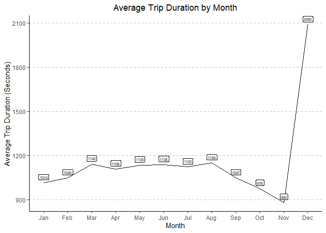

Report Findings
================
Youssef Emam
2024-08-04

## Data Overview

------------------------------------------------------------------------

## EDA

### Station Data

Once I loaded the data the next step was to look at it. To do this I
completed a basic exploratory data analysis. I created plots that
summarized the data to get an idea of the distribution across the
different data sets.

Firstly I summarized each station by the amount of traffic that it gets.
In this case I defined traffic as how many times a trip starts or stops
at a station. The plot can be seen below:

<!-- -->

It can be seen that there is quite a large variance in how much traffic
each station gets.

### Trip Data

Next I summarized the trip data by identifying the average cycling
duration over the course of each month. The plot can be seen below:

<!-- -->

Unexpectedly, the highest mean duration occurs during December. This is
likely due to the presence of an outlier which we will investigate
later. Aside from this, as expected the usage seems to increase in the
summer months and decrease slightly in the winter months.

### Weather data

To summarize the weather data, I identified how the precipitation levels
change over the course of the year with respect to each city represented
in the data:

<!-- -->

As expected, the precipitation peaks in the winter months, and becomes
insignificant during the summer months.

------------------------------------------------------------------------

## Data Cleaning

As seen earlier, the data contains outliers and requires significant
amounts of preprocessing.

This is a list of changes that were made to each dataset, and the
reasons behind them:

### Stations

Dates were converted to POSIXct format ~ Enables easier manipulation and
comparison later on

### Trips

Dates were converted to POSIXct format ~ Enables easier manipulation and
comparison later on

Character fields were converted to factors ~ Enables grouping, and
allows us to compare trends later on

Zip Code outliers were removed ~ Any value beyond the valid zip code
range of 00501- 99950 was removed. Any blank values were converted to
NAs, and the column was turned into integer data

Cancelled trips were identified ~ Any trip that lasted less than 3
minutes and started/ended at the same station was considered cancelled.
These trips were removed from the data set and stored in a separate
file. A snapshot of this file can be seen below:

<table class="gt_table" data-quarto-disable-processing="false" data-quarto-bootstrap="false">
  <thead>
    <tr class="gt_heading">
      <td colspan="12" class="gt_heading gt_title gt_font_normal gt_bottom_border" style>Cancelled Trips</td>
    </tr>
    &#10;    <tr class="gt_col_headings">
      <th class="gt_col_heading gt_columns_bottom_border gt_right" rowspan="1" colspan="1" scope="col" id="X">X</th>
      <th class="gt_col_heading gt_columns_bottom_border gt_right" rowspan="1" colspan="1" scope="col" id="id">id</th>
      <th class="gt_col_heading gt_columns_bottom_border gt_right" rowspan="1" colspan="1" scope="col" id="duration">duration</th>
      <th class="gt_col_heading gt_columns_bottom_border gt_right" rowspan="1" colspan="1" scope="col" id="start_date">start_date</th>
      <th class="gt_col_heading gt_columns_bottom_border gt_left" rowspan="1" colspan="1" scope="col" id="start_station_name">start_station_name</th>
      <th class="gt_col_heading gt_columns_bottom_border gt_right" rowspan="1" colspan="1" scope="col" id="start_station_id">start_station_id</th>
      <th class="gt_col_heading gt_columns_bottom_border gt_right" rowspan="1" colspan="1" scope="col" id="end_date">end_date</th>
      <th class="gt_col_heading gt_columns_bottom_border gt_left" rowspan="1" colspan="1" scope="col" id="end_station_name">end_station_name</th>
      <th class="gt_col_heading gt_columns_bottom_border gt_right" rowspan="1" colspan="1" scope="col" id="end_station_id">end_station_id</th>
      <th class="gt_col_heading gt_columns_bottom_border gt_right" rowspan="1" colspan="1" scope="col" id="bike_id">bike_id</th>
      <th class="gt_col_heading gt_columns_bottom_border gt_left" rowspan="1" colspan="1" scope="col" id="subscription_type">subscription_type</th>
      <th class="gt_col_heading gt_columns_bottom_border gt_right" rowspan="1" colspan="1" scope="col" id="zip_code">zip_code</th>
    </tr>
  </thead>
  <tbody class="gt_table_body">
    <tr><td headers="X" class="gt_row gt_right">1</td>
<td headers="id" class="gt_row gt_right">139945</td>
<td headers="duration" class="gt_row gt_right">73</td>
<td headers="start_date" class="gt_row gt_right">2014-01-01 17:57:00</td>
<td headers="start_station_name" class="gt_row gt_left">5th at Howard</td>
<td headers="start_station_id" class="gt_row gt_right">57</td>
<td headers="end_date" class="gt_row gt_right">2014-01-01 17:59:00</td>
<td headers="end_station_name" class="gt_row gt_left">5th at Howard</td>
<td headers="end_station_id" class="gt_row gt_right">57</td>
<td headers="bike_id" class="gt_row gt_right">509</td>
<td headers="subscription_type" class="gt_row gt_left">Subscriber</td>
<td headers="zip_code" class="gt_row gt_right">94103</td></tr>
    <tr><td headers="X" class="gt_row gt_right">2</td>
<td headers="id" class="gt_row gt_right">139967</td>
<td headers="duration" class="gt_row gt_right">160</td>
<td headers="start_date" class="gt_row gt_right">2014-01-01 19:11:00</td>
<td headers="start_station_name" class="gt_row gt_left">California Ave Caltrain Station</td>
<td headers="start_station_id" class="gt_row gt_right">36</td>
<td headers="end_date" class="gt_row gt_right">2014-01-01 19:13:00</td>
<td headers="end_station_name" class="gt_row gt_left">California Ave Caltrain Station</td>
<td headers="end_station_id" class="gt_row gt_right">36</td>
<td headers="bike_id" class="gt_row gt_right">51</td>
<td headers="subscription_type" class="gt_row gt_left">Customer</td>
<td headers="zip_code" class="gt_row gt_right">6877</td></tr>
    <tr><td headers="X" class="gt_row gt_right">3</td>
<td headers="id" class="gt_row gt_right">140179</td>
<td headers="duration" class="gt_row gt_right">63</td>
<td headers="start_date" class="gt_row gt_right">2014-01-02 08:32:00</td>
<td headers="start_station_name" class="gt_row gt_left">2nd at Folsom</td>
<td headers="start_station_id" class="gt_row gt_right">62</td>
<td headers="end_date" class="gt_row gt_right">2014-01-02 08:33:00</td>
<td headers="end_station_name" class="gt_row gt_left">2nd at Folsom</td>
<td headers="end_station_id" class="gt_row gt_right">62</td>
<td headers="bike_id" class="gt_row gt_right">632</td>
<td headers="subscription_type" class="gt_row gt_left">Subscriber</td>
<td headers="zip_code" class="gt_row gt_right">94107</td></tr>
    <tr><td headers="X" class="gt_row gt_right">4</td>
<td headers="id" class="gt_row gt_right">140429</td>
<td headers="duration" class="gt_row gt_right">126</td>
<td headers="start_date" class="gt_row gt_right">2014-01-02 11:49:00</td>
<td headers="start_station_name" class="gt_row gt_left">San Francisco Caltrain (Townsend at 4th)</td>
<td headers="start_station_id" class="gt_row gt_right">70</td>
<td headers="end_date" class="gt_row gt_right">2014-01-02 11:51:00</td>
<td headers="end_station_name" class="gt_row gt_left">San Francisco Caltrain (Townsend at 4th)</td>
<td headers="end_station_id" class="gt_row gt_right">70</td>
<td headers="bike_id" class="gt_row gt_right">321</td>
<td headers="subscription_type" class="gt_row gt_left">Customer</td>
<td headers="zip_code" class="gt_row gt_right">61801</td></tr>
    <tr><td headers="X" class="gt_row gt_right">5</td>
<td headers="id" class="gt_row gt_right">140484</td>
<td headers="duration" class="gt_row gt_right">114</td>
<td headers="start_date" class="gt_row gt_right">2014-01-02 12:49:00</td>
<td headers="start_station_name" class="gt_row gt_left">Harry Bridges Plaza (Ferry Building)</td>
<td headers="start_station_id" class="gt_row gt_right">50</td>
<td headers="end_date" class="gt_row gt_right">2014-01-02 12:51:00</td>
<td headers="end_station_name" class="gt_row gt_left">Harry Bridges Plaza (Ferry Building)</td>
<td headers="end_station_id" class="gt_row gt_right">50</td>
<td headers="bike_id" class="gt_row gt_right">407</td>
<td headers="subscription_type" class="gt_row gt_left">Subscriber</td>
<td headers="zip_code" class="gt_row gt_right">94131</td></tr>
    <tr><td headers="X" class="gt_row gt_right">6</td>
<td headers="id" class="gt_row gt_right">140715</td>
<td headers="duration" class="gt_row gt_right">69</td>
<td headers="start_date" class="gt_row gt_right">2014-01-02 16:25:00</td>
<td headers="start_station_name" class="gt_row gt_left">Mountain View City Hall</td>
<td headers="start_station_id" class="gt_row gt_right">27</td>
<td headers="end_date" class="gt_row gt_right">2014-01-02 16:26:00</td>
<td headers="end_station_name" class="gt_row gt_left">Mountain View City Hall</td>
<td headers="end_station_id" class="gt_row gt_right">27</td>
<td headers="bike_id" class="gt_row gt_right">98</td>
<td headers="subscription_type" class="gt_row gt_left">Subscriber</td>
<td headers="zip_code" class="gt_row gt_right">94102</td></tr>
    <tr><td headers="X" class="gt_row gt_right">7</td>
<td headers="id" class="gt_row gt_right">140734</td>
<td headers="duration" class="gt_row gt_right">64</td>
<td headers="start_date" class="gt_row gt_right">2014-01-02 16:32:00</td>
<td headers="start_station_name" class="gt_row gt_left">South Van Ness at Market</td>
<td headers="start_station_id" class="gt_row gt_right">66</td>
<td headers="end_date" class="gt_row gt_right">2014-01-02 16:33:00</td>
<td headers="end_station_name" class="gt_row gt_left">South Van Ness at Market</td>
<td headers="end_station_id" class="gt_row gt_right">66</td>
<td headers="bike_id" class="gt_row gt_right">525</td>
<td headers="subscription_type" class="gt_row gt_left">Subscriber</td>
<td headers="zip_code" class="gt_row gt_right">94612</td></tr>
    <tr><td headers="X" class="gt_row gt_right">8</td>
<td headers="id" class="gt_row gt_right">141227</td>
<td headers="duration" class="gt_row gt_right">123</td>
<td headers="start_date" class="gt_row gt_right">2014-01-03 08:02:00</td>
<td headers="start_station_name" class="gt_row gt_left">South Van Ness at Market</td>
<td headers="start_station_id" class="gt_row gt_right">66</td>
<td headers="end_date" class="gt_row gt_right">2014-01-03 08:04:00</td>
<td headers="end_station_name" class="gt_row gt_left">South Van Ness at Market</td>
<td headers="end_station_id" class="gt_row gt_right">66</td>
<td headers="bike_id" class="gt_row gt_right">368</td>
<td headers="subscription_type" class="gt_row gt_left">Customer</td>
<td headers="zip_code" class="gt_row gt_right">94114</td></tr>
    <tr><td headers="X" class="gt_row gt_right">9</td>
<td headers="id" class="gt_row gt_right">141388</td>
<td headers="duration" class="gt_row gt_right">66</td>
<td headers="start_date" class="gt_row gt_right">2014-01-03 09:15:00</td>
<td headers="start_station_name" class="gt_row gt_left">Powell Street BART</td>
<td headers="start_station_id" class="gt_row gt_right">39</td>
<td headers="end_date" class="gt_row gt_right">2014-01-03 09:16:00</td>
<td headers="end_station_name" class="gt_row gt_left">Powell Street BART</td>
<td headers="end_station_id" class="gt_row gt_right">39</td>
<td headers="bike_id" class="gt_row gt_right">424</td>
<td headers="subscription_type" class="gt_row gt_left">Subscriber</td>
<td headers="zip_code" class="gt_row gt_right">94116</td></tr>
    <tr><td headers="X" class="gt_row gt_right">10</td>
<td headers="id" class="gt_row gt_right">142332</td>
<td headers="duration" class="gt_row gt_right">64</td>
<td headers="start_date" class="gt_row gt_right">2014-01-04 10:02:00</td>
<td headers="start_station_name" class="gt_row gt_left">Mechanics Plaza (Market at Battery)</td>
<td headers="start_station_id" class="gt_row gt_right">75</td>
<td headers="end_date" class="gt_row gt_right">2014-01-04 10:03:00</td>
<td headers="end_station_name" class="gt_row gt_left">Mechanics Plaza (Market at Battery)</td>
<td headers="end_station_id" class="gt_row gt_right">75</td>
<td headers="bike_id" class="gt_row gt_right">573</td>
<td headers="subscription_type" class="gt_row gt_left">Subscriber</td>
<td headers="zip_code" class="gt_row gt_right">94105</td></tr>
  </tbody>
  &#10;  
</table>

Outliers were removed from the duration field ~ Any trip lasting longer
than 1 day were removed from the data. It is assumed that any trip
lasting longer than 1 day likely means that the customer forgot to
return the bike.

### Weather

Date ~ Converted to POSIXct. This enables easier manipulation and
comparison later on, as well as enables us to join to other data sets
using date values as a common column

Events ~ Converted to factor

City ~ Converted to factor

Cloud_Cover~ Converted to factor

Precipitation ~ Replaced trace values denoted by “T” with a small
numeric value (0.005). Converted the column to be an integer field. This
enables us to identify and compare precipitation trends.

------------------------------------------------------------------------

## Rush Hour Analysis

### Identifying Rush Hours:

To identify rush hour, the frequency of trips in each hour was plotted.
In order to prevent biasing the “rush hour” to earlier or later times,
the midpoint between the start and end time of each trip was calculated.
This was chosen to give a representative estimate of peak hours.
Further, rush hour can be defined as times of the day where trip
frequency is above average. As such the mean frequency of trips was
calculated (black line) and added to the plot for comparison’s sake, as
well as a means for objective identification of rush hours. Plotting the
the frequency of trips by hour of the day shows us:

<!-- -->

Analyzing the plot, it is evident that the first set of rush hours are
in the morning hours of 7am - 10:30pm. These hours see a large uptick in
trip frequency, followed by the lunch rush from 11:30am - 1:30pm. The
evening rush hour spans from about 6pm - 8pm.

### Busiest Stations During Rush Hours:

To identify the busiest stations during rush hours the data can be
grouped by station, filtered by time (within rush hour boundaries
established above), and the frequency of trips beginning at that station
can be counted. These results can be visualized below:

<table class="gt_table" data-quarto-disable-processing="false" data-quarto-bootstrap="false">
  <thead>
    <tr class="gt_heading">
      <td colspan="2" class="gt_heading gt_title gt_font_normal" style>Most Frequent Starting Locations</td>
    </tr>
    <tr class="gt_heading">
      <td colspan="2" class="gt_heading gt_subtitle gt_font_normal gt_bottom_border" style>During Rush Hours</td>
    </tr>
    <tr class="gt_col_headings">
      <th class="gt_col_heading gt_columns_bottom_border gt_center" rowspan="1" colspan="1" scope="col" id="start_station_name">start_station_name</th>
      <th class="gt_col_heading gt_columns_bottom_border gt_right" rowspan="1" colspan="1" scope="col" id="number">number</th>
    </tr>
  </thead>
  <tbody class="gt_table_body">
    <tr><td headers="start_station_name" class="gt_row gt_center">San Francisco Caltrain (Townsend at 4th)</td>
<td headers="number" class="gt_row gt_right">19804</td></tr>
    <tr><td headers="start_station_name" class="gt_row gt_center">San Francisco Caltrain 2 (330 Townsend)</td>
<td headers="number" class="gt_row gt_right">11412</td></tr>
    <tr><td headers="start_station_name" class="gt_row gt_center">Temporary Transbay Terminal (Howard at Beale)</td>
<td headers="number" class="gt_row gt_right">10093</td></tr>
    <tr><td headers="start_station_name" class="gt_row gt_center">Harry Bridges Plaza (Ferry Building)</td>
<td headers="number" class="gt_row gt_right">8511</td></tr>
    <tr><td headers="start_station_name" class="gt_row gt_center">2nd at Townsend</td>
<td headers="number" class="gt_row gt_right">7938</td></tr>
    <tr><td headers="start_station_name" class="gt_row gt_center">Steuart at Market</td>
<td headers="number" class="gt_row gt_right">7865</td></tr>
    <tr><td headers="start_station_name" class="gt_row gt_center">Market at Sansome</td>
<td headers="number" class="gt_row gt_right">7456</td></tr>
    <tr><td headers="start_station_name" class="gt_row gt_center">Townsend at 7th</td>
<td headers="number" class="gt_row gt_right">7184</td></tr>
    <tr><td headers="start_station_name" class="gt_row gt_center">Market at 10th</td>
<td headers="number" class="gt_row gt_right">6181</td></tr>
    <tr><td headers="start_station_name" class="gt_row gt_center">Embarcadero at Sansome</td>
<td headers="number" class="gt_row gt_right">6024</td></tr>
  </tbody>
  &#10;  
</table>

<table class="gt_table" data-quarto-disable-processing="false" data-quarto-bootstrap="false">
  <thead>
    <tr class="gt_heading">
      <td colspan="2" class="gt_heading gt_title gt_font_normal" style>Most Frequent Ending Stations</td>
    </tr>
    <tr class="gt_heading">
      <td colspan="2" class="gt_heading gt_subtitle gt_font_normal gt_bottom_border" style>During Rush Hours</td>
    </tr>
    <tr class="gt_col_headings">
      <th class="gt_col_heading gt_columns_bottom_border gt_center" rowspan="1" colspan="1" scope="col" id="end_station_name">end_station_name</th>
      <th class="gt_col_heading gt_columns_bottom_border gt_right" rowspan="1" colspan="1" scope="col" id="number">number</th>
    </tr>
  </thead>
  <tbody class="gt_table_body">
    <tr><td headers="end_station_name" class="gt_row gt_center">San Francisco Caltrain (Townsend at 4th)</td>
<td headers="number" class="gt_row gt_right">25520</td></tr>
    <tr><td headers="end_station_name" class="gt_row gt_center">San Francisco Caltrain 2 (330 Townsend)</td>
<td headers="number" class="gt_row gt_right">11252</td></tr>
    <tr><td headers="end_station_name" class="gt_row gt_center">2nd at Townsend</td>
<td headers="number" class="gt_row gt_right">9073</td></tr>
    <tr><td headers="end_station_name" class="gt_row gt_center">Market at Sansome</td>
<td headers="number" class="gt_row gt_right">9055</td></tr>
    <tr><td headers="end_station_name" class="gt_row gt_center">Temporary Transbay Terminal (Howard at Beale)</td>
<td headers="number" class="gt_row gt_right">8590</td></tr>
    <tr><td headers="end_station_name" class="gt_row gt_center">Harry Bridges Plaza (Ferry Building)</td>
<td headers="number" class="gt_row gt_right">8363</td></tr>
    <tr><td headers="end_station_name" class="gt_row gt_center">Townsend at 7th</td>
<td headers="number" class="gt_row gt_right">8251</td></tr>
    <tr><td headers="end_station_name" class="gt_row gt_center">Steuart at Market</td>
<td headers="number" class="gt_row gt_right">7842</td></tr>
    <tr><td headers="end_station_name" class="gt_row gt_center">Embarcadero at Sansome</td>
<td headers="number" class="gt_row gt_right">5980</td></tr>
    <tr><td headers="end_station_name" class="gt_row gt_center">2nd at South Park</td>
<td headers="number" class="gt_row gt_right">5433</td></tr>
  </tbody>
  &#10;  
</table>

The same methodology can be employed to identify the busiest stations on
weekends:

<table class="gt_table" data-quarto-disable-processing="false" data-quarto-bootstrap="false">
  <thead>
    <tr class="gt_heading">
      <td colspan="2" class="gt_heading gt_title gt_font_normal" style>Most Frequent Starting Stations</td>
    </tr>
    <tr class="gt_heading">
      <td colspan="2" class="gt_heading gt_subtitle gt_font_normal gt_bottom_border" style>Weekends</td>
    </tr>
    <tr class="gt_col_headings">
      <th class="gt_col_heading gt_columns_bottom_border gt_center" rowspan="1" colspan="1" scope="col" id="start_station_name">start_station_name</th>
      <th class="gt_col_heading gt_columns_bottom_border gt_right" rowspan="1" colspan="1" scope="col" id="number">number</th>
    </tr>
  </thead>
  <tbody class="gt_table_body">
    <tr><td headers="start_station_name" class="gt_row gt_center">Harry Bridges Plaza (Ferry Building)</td>
<td headers="number" class="gt_row gt_right">3178</td></tr>
    <tr><td headers="start_station_name" class="gt_row gt_center">Embarcadero at Sansome</td>
<td headers="number" class="gt_row gt_right">3134</td></tr>
    <tr><td headers="start_station_name" class="gt_row gt_center">Market at 4th</td>
<td headers="number" class="gt_row gt_right">1667</td></tr>
    <tr><td headers="start_station_name" class="gt_row gt_center">Embarcadero at Bryant</td>
<td headers="number" class="gt_row gt_right">1608</td></tr>
    <tr><td headers="start_station_name" class="gt_row gt_center">2nd at Townsend</td>
<td headers="number" class="gt_row gt_right">1556</td></tr>
    <tr><td headers="start_station_name" class="gt_row gt_center">Powell Street BART</td>
<td headers="number" class="gt_row gt_right">1499</td></tr>
    <tr><td headers="start_station_name" class="gt_row gt_center">San Francisco Caltrain (Townsend at 4th)</td>
<td headers="number" class="gt_row gt_right">1368</td></tr>
    <tr><td headers="start_station_name" class="gt_row gt_center">Grant Avenue at Columbus Avenue</td>
<td headers="number" class="gt_row gt_right">1303</td></tr>
    <tr><td headers="start_station_name" class="gt_row gt_center">Market at Sansome</td>
<td headers="number" class="gt_row gt_right">1101</td></tr>
    <tr><td headers="start_station_name" class="gt_row gt_center">Powell at Post (Union Square)</td>
<td headers="number" class="gt_row gt_right">1096</td></tr>
  </tbody>
  &#10;  
</table>

<table class="gt_table" data-quarto-disable-processing="false" data-quarto-bootstrap="false">
  <thead>
    <tr class="gt_heading">
      <td colspan="2" class="gt_heading gt_title gt_font_normal" style>Most Frequent Starting Stations</td>
    </tr>
    <tr class="gt_heading">
      <td colspan="2" class="gt_heading gt_subtitle gt_font_normal gt_bottom_border" style>Weekends</td>
    </tr>
    <tr class="gt_col_headings">
      <th class="gt_col_heading gt_columns_bottom_border gt_center" rowspan="1" colspan="1" scope="col" id="end_station_name">end_station_name</th>
      <th class="gt_col_heading gt_columns_bottom_border gt_right" rowspan="1" colspan="1" scope="col" id="number">number</th>
    </tr>
  </thead>
  <tbody class="gt_table_body">
    <tr><td headers="end_station_name" class="gt_row gt_center">Embarcadero at Sansome</td>
<td headers="number" class="gt_row gt_right">3386</td></tr>
    <tr><td headers="end_station_name" class="gt_row gt_center">Harry Bridges Plaza (Ferry Building)</td>
<td headers="number" class="gt_row gt_right">3190</td></tr>
    <tr><td headers="end_station_name" class="gt_row gt_center">Market at 4th</td>
<td headers="number" class="gt_row gt_right">1885</td></tr>
    <tr><td headers="end_station_name" class="gt_row gt_center">Powell Street BART</td>
<td headers="number" class="gt_row gt_right">1690</td></tr>
    <tr><td headers="end_station_name" class="gt_row gt_center">San Francisco Caltrain (Townsend at 4th)</td>
<td headers="number" class="gt_row gt_right">1664</td></tr>
    <tr><td headers="end_station_name" class="gt_row gt_center">2nd at Townsend</td>
<td headers="number" class="gt_row gt_right">1603</td></tr>
    <tr><td headers="end_station_name" class="gt_row gt_center">Embarcadero at Bryant</td>
<td headers="number" class="gt_row gt_right">1390</td></tr>
    <tr><td headers="end_station_name" class="gt_row gt_center">Steuart at Market</td>
<td headers="number" class="gt_row gt_right">1226</td></tr>
    <tr><td headers="end_station_name" class="gt_row gt_center">Market at Sansome</td>
<td headers="number" class="gt_row gt_right">1114</td></tr>
    <tr><td headers="end_station_name" class="gt_row gt_center">Grant Avenue at Columbus Avenue</td>
<td headers="number" class="gt_row gt_right">1102</td></tr>
  </tbody>
  &#10;  
</table>

------------------------------------------------------------------------

### Utilization

In order to identify the degree of utilization of bikes, I decided to
represent utilization as a percentage of the systems total utilization.
This is calculated by identifying the total duration of rides in a month
and expressing it as a proportion of the maximum duration the system can
support. It should be noted that to calculate the total number of bikes
in the system at a given time, the number of unique bike IDs in the
trips data set were counted. This assumes that any bike that is not in
use does not contribute to the total capacity of the system. It is
likely that if a bike is not used at all in a given month, it is either
broken, or being serviced. Another way to identify the number of bikes
is to sum the number of docks at each station. The downside of this
method is that it assumes that each station has as many bikes as there
are docks, and that each of the bikes is used every month. For this
reason I opted to calculate the value using the former method. The
results of this analysis are visualized below:

<!-- -->

From this figure it is evident that the system is more than capable of
supporting the biking needs of it’s population, as the maximum
utilization is less than 2% of the total which occurs in the August.
Consistent with the EDA data seen above, utilization peaks in the summer
months and decreases in the winter months. To identify specifically how
much each bike is used, I created an interactive table which summarizes
each bike by the total duration of use. A specific ID can be searched
and the usage per month can be identified. The table can also be sorted
by pressing on the headers to identify bikes with the lowest usage that
might be broken, lost or need servicing:

<table class="gt_table" data-quarto-disable-processing="false" data-quarto-bootstrap="false">
  <thead>
    <tr class="gt_heading">
      <td colspan="3" class="gt_heading gt_title gt_font_normal gt_bottom_border" style>Total Bike Usage</td>
    </tr>
    &#10;    <tr class="gt_col_headings">
      <th class="gt_col_heading gt_columns_bottom_border gt_right" rowspan="1" colspan="1" scope="col" id="bike_id">bike_id</th>
      <th class="gt_col_heading gt_columns_bottom_border gt_center" rowspan="1" colspan="1" scope="col" id="month">month</th>
      <th class="gt_col_heading gt_columns_bottom_border gt_right" rowspan="1" colspan="1" scope="col" id="Usage">Usage</th>
    </tr>
  </thead>
  <tbody class="gt_table_body">
    <tr><td headers="bike_id" class="gt_row gt_right">9</td>
<td headers="month" class="gt_row gt_center">Mar</td>
<td headers="Usage" class="gt_row gt_right">38818</td></tr>
    <tr><td headers="bike_id" class="gt_row gt_right">9</td>
<td headers="month" class="gt_row gt_center">Apr</td>
<td headers="Usage" class="gt_row gt_right">5276</td></tr>
    <tr><td headers="bike_id" class="gt_row gt_right">9</td>
<td headers="month" class="gt_row gt_center">May</td>
<td headers="Usage" class="gt_row gt_right">3323</td></tr>
    <tr><td headers="bike_id" class="gt_row gt_right">9</td>
<td headers="month" class="gt_row gt_center">Jun</td>
<td headers="Usage" class="gt_row gt_right">9201</td></tr>
    <tr><td headers="bike_id" class="gt_row gt_right">9</td>
<td headers="month" class="gt_row gt_center">Jul</td>
<td headers="Usage" class="gt_row gt_right">30238</td></tr>
    <tr><td headers="bike_id" class="gt_row gt_right">9</td>
<td headers="month" class="gt_row gt_center">Aug</td>
<td headers="Usage" class="gt_row gt_right">15484</td></tr>
    <tr><td headers="bike_id" class="gt_row gt_right">9</td>
<td headers="month" class="gt_row gt_center">Sep</td>
<td headers="Usage" class="gt_row gt_right">7168</td></tr>
    <tr><td headers="bike_id" class="gt_row gt_right">9</td>
<td headers="month" class="gt_row gt_center">Oct</td>
<td headers="Usage" class="gt_row gt_right">7298</td></tr>
    <tr><td headers="bike_id" class="gt_row gt_right">9</td>
<td headers="month" class="gt_row gt_center">Nov</td>
<td headers="Usage" class="gt_row gt_right">4485</td></tr>
    <tr><td headers="bike_id" class="gt_row gt_right">9</td>
<td headers="month" class="gt_row gt_center">Dec</td>
<td headers="Usage" class="gt_row gt_right">6472</td></tr>
    <tr><td headers="bike_id" class="gt_row gt_right">10</td>
<td headers="month" class="gt_row gt_center">Jan</td>
<td headers="Usage" class="gt_row gt_right">4580</td></tr>
    <tr><td headers="bike_id" class="gt_row gt_right">10</td>
<td headers="month" class="gt_row gt_center">Feb</td>
<td headers="Usage" class="gt_row gt_right">5506</td></tr>
    <tr><td headers="bike_id" class="gt_row gt_right">10</td>
<td headers="month" class="gt_row gt_center">Mar</td>
<td headers="Usage" class="gt_row gt_right">9006</td></tr>
    <tr><td headers="bike_id" class="gt_row gt_right">10</td>
<td headers="month" class="gt_row gt_center">Apr</td>
<td headers="Usage" class="gt_row gt_right">44212</td></tr>
    <tr><td headers="bike_id" class="gt_row gt_right">10</td>
<td headers="month" class="gt_row gt_center">May</td>
<td headers="Usage" class="gt_row gt_right">13222</td></tr>
    <tr><td headers="bike_id" class="gt_row gt_right">10</td>
<td headers="month" class="gt_row gt_center">Jun</td>
<td headers="Usage" class="gt_row gt_right">14076</td></tr>
    <tr><td headers="bike_id" class="gt_row gt_right">10</td>
<td headers="month" class="gt_row gt_center">Jul</td>
<td headers="Usage" class="gt_row gt_right">49606</td></tr>
    <tr><td headers="bike_id" class="gt_row gt_right">10</td>
<td headers="month" class="gt_row gt_center">Aug</td>
<td headers="Usage" class="gt_row gt_right">7146</td></tr>
    <tr><td headers="bike_id" class="gt_row gt_right">10</td>
<td headers="month" class="gt_row gt_center">Sep</td>
<td headers="Usage" class="gt_row gt_right">6884</td></tr>
    <tr><td headers="bike_id" class="gt_row gt_right">10</td>
<td headers="month" class="gt_row gt_center">Oct</td>
<td headers="Usage" class="gt_row gt_right">92385</td></tr>
    <tr><td headers="bike_id" class="gt_row gt_right">10</td>
<td headers="month" class="gt_row gt_center">Nov</td>
<td headers="Usage" class="gt_row gt_right">7815</td></tr>
    <tr><td headers="bike_id" class="gt_row gt_right">10</td>
<td headers="month" class="gt_row gt_center">Dec</td>
<td headers="Usage" class="gt_row gt_right">1761</td></tr>
    <tr><td headers="bike_id" class="gt_row gt_right">11</td>
<td headers="month" class="gt_row gt_center">Jan</td>
<td headers="Usage" class="gt_row gt_right">18477</td></tr>
    <tr><td headers="bike_id" class="gt_row gt_right">11</td>
<td headers="month" class="gt_row gt_center">Feb</td>
<td headers="Usage" class="gt_row gt_right">2829</td></tr>
    <tr><td headers="bike_id" class="gt_row gt_right">11</td>
<td headers="month" class="gt_row gt_center">Mar</td>
<td headers="Usage" class="gt_row gt_right">204</td></tr>
    <tr><td headers="bike_id" class="gt_row gt_right">11</td>
<td headers="month" class="gt_row gt_center">May</td>
<td headers="Usage" class="gt_row gt_right">7385</td></tr>
    <tr><td headers="bike_id" class="gt_row gt_right">11</td>
<td headers="month" class="gt_row gt_center">Jun</td>
<td headers="Usage" class="gt_row gt_right">5399</td></tr>
    <tr><td headers="bike_id" class="gt_row gt_right">11</td>
<td headers="month" class="gt_row gt_center">Jul</td>
<td headers="Usage" class="gt_row gt_right">7548</td></tr>
    <tr><td headers="bike_id" class="gt_row gt_right">11</td>
<td headers="month" class="gt_row gt_center">Aug</td>
<td headers="Usage" class="gt_row gt_right">12556</td></tr>
    <tr><td headers="bike_id" class="gt_row gt_right">11</td>
<td headers="month" class="gt_row gt_center">Sep</td>
<td headers="Usage" class="gt_row gt_right">3185</td></tr>
    <tr><td headers="bike_id" class="gt_row gt_right">11</td>
<td headers="month" class="gt_row gt_center">Oct</td>
<td headers="Usage" class="gt_row gt_right">13609</td></tr>
    <tr><td headers="bike_id" class="gt_row gt_right">11</td>
<td headers="month" class="gt_row gt_center">Nov</td>
<td headers="Usage" class="gt_row gt_right">607</td></tr>
    <tr><td headers="bike_id" class="gt_row gt_right">11</td>
<td headers="month" class="gt_row gt_center">Dec</td>
<td headers="Usage" class="gt_row gt_right">3537</td></tr>
    <tr><td headers="bike_id" class="gt_row gt_right">12</td>
<td headers="month" class="gt_row gt_center">Jan</td>
<td headers="Usage" class="gt_row gt_right">7815</td></tr>
    <tr><td headers="bike_id" class="gt_row gt_right">12</td>
<td headers="month" class="gt_row gt_center">Feb</td>
<td headers="Usage" class="gt_row gt_right">2124</td></tr>
    <tr><td headers="bike_id" class="gt_row gt_right">12</td>
<td headers="month" class="gt_row gt_center">Mar</td>
<td headers="Usage" class="gt_row gt_right">4643</td></tr>
    <tr><td headers="bike_id" class="gt_row gt_right">12</td>
<td headers="month" class="gt_row gt_center">Apr</td>
<td headers="Usage" class="gt_row gt_right">7165</td></tr>
    <tr><td headers="bike_id" class="gt_row gt_right">12</td>
<td headers="month" class="gt_row gt_center">May</td>
<td headers="Usage" class="gt_row gt_right">5227</td></tr>
    <tr><td headers="bike_id" class="gt_row gt_right">12</td>
<td headers="month" class="gt_row gt_center">Jun</td>
<td headers="Usage" class="gt_row gt_right">3024</td></tr>
    <tr><td headers="bike_id" class="gt_row gt_right">12</td>
<td headers="month" class="gt_row gt_center">Jul</td>
<td headers="Usage" class="gt_row gt_right">22374</td></tr>
    <tr><td headers="bike_id" class="gt_row gt_right">12</td>
<td headers="month" class="gt_row gt_center">Aug</td>
<td headers="Usage" class="gt_row gt_right">1529</td></tr>
    <tr><td headers="bike_id" class="gt_row gt_right">12</td>
<td headers="month" class="gt_row gt_center">Sep</td>
<td headers="Usage" class="gt_row gt_right">19460</td></tr>
    <tr><td headers="bike_id" class="gt_row gt_right">12</td>
<td headers="month" class="gt_row gt_center">Oct</td>
<td headers="Usage" class="gt_row gt_right">19529</td></tr>
    <tr><td headers="bike_id" class="gt_row gt_right">12</td>
<td headers="month" class="gt_row gt_center">Nov</td>
<td headers="Usage" class="gt_row gt_right">963</td></tr>
    <tr><td headers="bike_id" class="gt_row gt_right">12</td>
<td headers="month" class="gt_row gt_center">Dec</td>
<td headers="Usage" class="gt_row gt_right">2073</td></tr>
    <tr><td headers="bike_id" class="gt_row gt_right">13</td>
<td headers="month" class="gt_row gt_center">Jan</td>
<td headers="Usage" class="gt_row gt_right">513</td></tr>
    <tr><td headers="bike_id" class="gt_row gt_right">13</td>
<td headers="month" class="gt_row gt_center">Mar</td>
<td headers="Usage" class="gt_row gt_right">1491</td></tr>
    <tr><td headers="bike_id" class="gt_row gt_right">13</td>
<td headers="month" class="gt_row gt_center">Apr</td>
<td headers="Usage" class="gt_row gt_right">16796</td></tr>
    <tr><td headers="bike_id" class="gt_row gt_right">13</td>
<td headers="month" class="gt_row gt_center">May</td>
<td headers="Usage" class="gt_row gt_right">28909</td></tr>
    <tr><td headers="bike_id" class="gt_row gt_right">13</td>
<td headers="month" class="gt_row gt_center">Jun</td>
<td headers="Usage" class="gt_row gt_right">38492</td></tr>
    <tr><td headers="bike_id" class="gt_row gt_right">13</td>
<td headers="month" class="gt_row gt_center">Jul</td>
<td headers="Usage" class="gt_row gt_right">23065</td></tr>
    <tr><td headers="bike_id" class="gt_row gt_right">13</td>
<td headers="month" class="gt_row gt_center">Aug</td>
<td headers="Usage" class="gt_row gt_right">756</td></tr>
    <tr><td headers="bike_id" class="gt_row gt_right">13</td>
<td headers="month" class="gt_row gt_center">Sep</td>
<td headers="Usage" class="gt_row gt_right">8024</td></tr>
    <tr><td headers="bike_id" class="gt_row gt_right">13</td>
<td headers="month" class="gt_row gt_center">Oct</td>
<td headers="Usage" class="gt_row gt_right">2517</td></tr>
    <tr><td headers="bike_id" class="gt_row gt_right">13</td>
<td headers="month" class="gt_row gt_center">Nov</td>
<td headers="Usage" class="gt_row gt_right">2422</td></tr>
    <tr><td headers="bike_id" class="gt_row gt_right">14</td>
<td headers="month" class="gt_row gt_center">Jan</td>
<td headers="Usage" class="gt_row gt_right">5389</td></tr>
    <tr><td headers="bike_id" class="gt_row gt_right">14</td>
<td headers="month" class="gt_row gt_center">Feb</td>
<td headers="Usage" class="gt_row gt_right">7392</td></tr>
    <tr><td headers="bike_id" class="gt_row gt_right">14</td>
<td headers="month" class="gt_row gt_center">Mar</td>
<td headers="Usage" class="gt_row gt_right">5479</td></tr>
    <tr><td headers="bike_id" class="gt_row gt_right">14</td>
<td headers="month" class="gt_row gt_center">Apr</td>
<td headers="Usage" class="gt_row gt_right">2200</td></tr>
    <tr><td headers="bike_id" class="gt_row gt_right">14</td>
<td headers="month" class="gt_row gt_center">May</td>
<td headers="Usage" class="gt_row gt_right">95654</td></tr>
    <tr><td headers="bike_id" class="gt_row gt_right">14</td>
<td headers="month" class="gt_row gt_center">Jun</td>
<td headers="Usage" class="gt_row gt_right">1318</td></tr>
    <tr><td headers="bike_id" class="gt_row gt_right">14</td>
<td headers="month" class="gt_row gt_center">Jul</td>
<td headers="Usage" class="gt_row gt_right">30878</td></tr>
    <tr><td headers="bike_id" class="gt_row gt_right">14</td>
<td headers="month" class="gt_row gt_center">Aug</td>
<td headers="Usage" class="gt_row gt_right">20192</td></tr>
    <tr><td headers="bike_id" class="gt_row gt_right">14</td>
<td headers="month" class="gt_row gt_center">Sep</td>
<td headers="Usage" class="gt_row gt_right">8727</td></tr>
    <tr><td headers="bike_id" class="gt_row gt_right">14</td>
<td headers="month" class="gt_row gt_center">Oct</td>
<td headers="Usage" class="gt_row gt_right">14398</td></tr>
    <tr><td headers="bike_id" class="gt_row gt_right">14</td>
<td headers="month" class="gt_row gt_center">Nov</td>
<td headers="Usage" class="gt_row gt_right">2816</td></tr>
    <tr><td headers="bike_id" class="gt_row gt_right">15</td>
<td headers="month" class="gt_row gt_center">Feb</td>
<td headers="Usage" class="gt_row gt_right">20229</td></tr>
    <tr><td headers="bike_id" class="gt_row gt_right">15</td>
<td headers="month" class="gt_row gt_center">Mar</td>
<td headers="Usage" class="gt_row gt_right">12098</td></tr>
    <tr><td headers="bike_id" class="gt_row gt_right">15</td>
<td headers="month" class="gt_row gt_center">Apr</td>
<td headers="Usage" class="gt_row gt_right">5784</td></tr>
    <tr><td headers="bike_id" class="gt_row gt_right">15</td>
<td headers="month" class="gt_row gt_center">May</td>
<td headers="Usage" class="gt_row gt_right">80904</td></tr>
    <tr><td headers="bike_id" class="gt_row gt_right">15</td>
<td headers="month" class="gt_row gt_center">Jun</td>
<td headers="Usage" class="gt_row gt_right">2276</td></tr>
    <tr><td headers="bike_id" class="gt_row gt_right">15</td>
<td headers="month" class="gt_row gt_center">Aug</td>
<td headers="Usage" class="gt_row gt_right">15819</td></tr>
    <tr><td headers="bike_id" class="gt_row gt_right">15</td>
<td headers="month" class="gt_row gt_center">Sep</td>
<td headers="Usage" class="gt_row gt_right">289</td></tr>
    <tr><td headers="bike_id" class="gt_row gt_right">15</td>
<td headers="month" class="gt_row gt_center">Oct</td>
<td headers="Usage" class="gt_row gt_right">13520</td></tr>
    <tr><td headers="bike_id" class="gt_row gt_right">15</td>
<td headers="month" class="gt_row gt_center">Nov</td>
<td headers="Usage" class="gt_row gt_right">5832</td></tr>
    <tr><td headers="bike_id" class="gt_row gt_right">15</td>
<td headers="month" class="gt_row gt_center">Dec</td>
<td headers="Usage" class="gt_row gt_right">1609</td></tr>
    <tr><td headers="bike_id" class="gt_row gt_right">16</td>
<td headers="month" class="gt_row gt_center">Jan</td>
<td headers="Usage" class="gt_row gt_right">15175</td></tr>
    <tr><td headers="bike_id" class="gt_row gt_right">16</td>
<td headers="month" class="gt_row gt_center">Feb</td>
<td headers="Usage" class="gt_row gt_right">34626</td></tr>
    <tr><td headers="bike_id" class="gt_row gt_right">16</td>
<td headers="month" class="gt_row gt_center">Mar</td>
<td headers="Usage" class="gt_row gt_right">5186</td></tr>
    <tr><td headers="bike_id" class="gt_row gt_right">16</td>
<td headers="month" class="gt_row gt_center">Apr</td>
<td headers="Usage" class="gt_row gt_right">10768</td></tr>
    <tr><td headers="bike_id" class="gt_row gt_right">16</td>
<td headers="month" class="gt_row gt_center">Jul</td>
<td headers="Usage" class="gt_row gt_right">6820</td></tr>
    <tr><td headers="bike_id" class="gt_row gt_right">16</td>
<td headers="month" class="gt_row gt_center">Aug</td>
<td headers="Usage" class="gt_row gt_right">166863</td></tr>
    <tr><td headers="bike_id" class="gt_row gt_right">16</td>
<td headers="month" class="gt_row gt_center">Sep</td>
<td headers="Usage" class="gt_row gt_right">118539</td></tr>
    <tr><td headers="bike_id" class="gt_row gt_right">16</td>
<td headers="month" class="gt_row gt_center">Oct</td>
<td headers="Usage" class="gt_row gt_right">133526</td></tr>
    <tr><td headers="bike_id" class="gt_row gt_right">16</td>
<td headers="month" class="gt_row gt_center">Nov</td>
<td headers="Usage" class="gt_row gt_right">77275</td></tr>
    <tr><td headers="bike_id" class="gt_row gt_right">16</td>
<td headers="month" class="gt_row gt_center">Dec</td>
<td headers="Usage" class="gt_row gt_right">70733</td></tr>
    <tr><td headers="bike_id" class="gt_row gt_right">17</td>
<td headers="month" class="gt_row gt_center">Jan</td>
<td headers="Usage" class="gt_row gt_right">723</td></tr>
    <tr><td headers="bike_id" class="gt_row gt_right">17</td>
<td headers="month" class="gt_row gt_center">Feb</td>
<td headers="Usage" class="gt_row gt_right">2571</td></tr>
    <tr><td headers="bike_id" class="gt_row gt_right">17</td>
<td headers="month" class="gt_row gt_center">Mar</td>
<td headers="Usage" class="gt_row gt_right">5946</td></tr>
    <tr><td headers="bike_id" class="gt_row gt_right">17</td>
<td headers="month" class="gt_row gt_center">Apr</td>
<td headers="Usage" class="gt_row gt_right">3879</td></tr>
    <tr><td headers="bike_id" class="gt_row gt_right">17</td>
<td headers="month" class="gt_row gt_center">May</td>
<td headers="Usage" class="gt_row gt_right">4582</td></tr>
    <tr><td headers="bike_id" class="gt_row gt_right">17</td>
<td headers="month" class="gt_row gt_center">Jun</td>
<td headers="Usage" class="gt_row gt_right">14942</td></tr>
    <tr><td headers="bike_id" class="gt_row gt_right">17</td>
<td headers="month" class="gt_row gt_center">Jul</td>
<td headers="Usage" class="gt_row gt_right">9250</td></tr>
    <tr><td headers="bike_id" class="gt_row gt_right">17</td>
<td headers="month" class="gt_row gt_center">Aug</td>
<td headers="Usage" class="gt_row gt_right">91340</td></tr>
    <tr><td headers="bike_id" class="gt_row gt_right">17</td>
<td headers="month" class="gt_row gt_center">Sep</td>
<td headers="Usage" class="gt_row gt_right">2927</td></tr>
    <tr><td headers="bike_id" class="gt_row gt_right">17</td>
<td headers="month" class="gt_row gt_center">Oct</td>
<td headers="Usage" class="gt_row gt_right">4360</td></tr>
    <tr><td headers="bike_id" class="gt_row gt_right">17</td>
<td headers="month" class="gt_row gt_center">Nov</td>
<td headers="Usage" class="gt_row gt_right">13231</td></tr>
    <tr><td headers="bike_id" class="gt_row gt_right">17</td>
<td headers="month" class="gt_row gt_center">Dec</td>
<td headers="Usage" class="gt_row gt_right">38198</td></tr>
    <tr><td headers="bike_id" class="gt_row gt_right">18</td>
<td headers="month" class="gt_row gt_center">Jan</td>
<td headers="Usage" class="gt_row gt_right">1569</td></tr>
    <tr><td headers="bike_id" class="gt_row gt_right">18</td>
<td headers="month" class="gt_row gt_center">Mar</td>
<td headers="Usage" class="gt_row gt_right">61812</td></tr>
    <tr><td headers="bike_id" class="gt_row gt_right">18</td>
<td headers="month" class="gt_row gt_center">Apr</td>
<td headers="Usage" class="gt_row gt_right">12675</td></tr>
    <tr><td headers="bike_id" class="gt_row gt_right">18</td>
<td headers="month" class="gt_row gt_center">May</td>
<td headers="Usage" class="gt_row gt_right">91430</td></tr>
    <tr><td headers="bike_id" class="gt_row gt_right">18</td>
<td headers="month" class="gt_row gt_center">Jun</td>
<td headers="Usage" class="gt_row gt_right">14247</td></tr>
    <tr><td headers="bike_id" class="gt_row gt_right">18</td>
<td headers="month" class="gt_row gt_center">Jul</td>
<td headers="Usage" class="gt_row gt_right">3434</td></tr>
    <tr><td headers="bike_id" class="gt_row gt_right">18</td>
<td headers="month" class="gt_row gt_center">Aug</td>
<td headers="Usage" class="gt_row gt_right">25438</td></tr>
    <tr><td headers="bike_id" class="gt_row gt_right">18</td>
<td headers="month" class="gt_row gt_center">Sep</td>
<td headers="Usage" class="gt_row gt_right">8207</td></tr>
    <tr><td headers="bike_id" class="gt_row gt_right">18</td>
<td headers="month" class="gt_row gt_center">Oct</td>
<td headers="Usage" class="gt_row gt_right">10342</td></tr>
    <tr><td headers="bike_id" class="gt_row gt_right">18</td>
<td headers="month" class="gt_row gt_center">Nov</td>
<td headers="Usage" class="gt_row gt_right">9167</td></tr>
    <tr><td headers="bike_id" class="gt_row gt_right">18</td>
<td headers="month" class="gt_row gt_center">Dec</td>
<td headers="Usage" class="gt_row gt_right">264</td></tr>
    <tr><td headers="bike_id" class="gt_row gt_right">19</td>
<td headers="month" class="gt_row gt_center">Jan</td>
<td headers="Usage" class="gt_row gt_right">2160</td></tr>
    <tr><td headers="bike_id" class="gt_row gt_right">19</td>
<td headers="month" class="gt_row gt_center">Apr</td>
<td headers="Usage" class="gt_row gt_right">6425</td></tr>
    <tr><td headers="bike_id" class="gt_row gt_right">19</td>
<td headers="month" class="gt_row gt_center">May</td>
<td headers="Usage" class="gt_row gt_right">16138</td></tr>
    <tr><td headers="bike_id" class="gt_row gt_right">19</td>
<td headers="month" class="gt_row gt_center">Jun</td>
<td headers="Usage" class="gt_row gt_right">15644</td></tr>
    <tr><td headers="bike_id" class="gt_row gt_right">19</td>
<td headers="month" class="gt_row gt_center">Jul</td>
<td headers="Usage" class="gt_row gt_right">1646</td></tr>
    <tr><td headers="bike_id" class="gt_row gt_right">19</td>
<td headers="month" class="gt_row gt_center">Aug</td>
<td headers="Usage" class="gt_row gt_right">25203</td></tr>
    <tr><td headers="bike_id" class="gt_row gt_right">19</td>
<td headers="month" class="gt_row gt_center">Sep</td>
<td headers="Usage" class="gt_row gt_right">88867</td></tr>
    <tr><td headers="bike_id" class="gt_row gt_right">19</td>
<td headers="month" class="gt_row gt_center">Oct</td>
<td headers="Usage" class="gt_row gt_right">11671</td></tr>
    <tr><td headers="bike_id" class="gt_row gt_right">19</td>
<td headers="month" class="gt_row gt_center">Nov</td>
<td headers="Usage" class="gt_row gt_right">10090</td></tr>
    <tr><td headers="bike_id" class="gt_row gt_right">19</td>
<td headers="month" class="gt_row gt_center">Dec</td>
<td headers="Usage" class="gt_row gt_right">5005</td></tr>
    <tr><td headers="bike_id" class="gt_row gt_right">20</td>
<td headers="month" class="gt_row gt_center">Jan</td>
<td headers="Usage" class="gt_row gt_right">6450</td></tr>
    <tr><td headers="bike_id" class="gt_row gt_right">20</td>
<td headers="month" class="gt_row gt_center">Feb</td>
<td headers="Usage" class="gt_row gt_right">11052</td></tr>
    <tr><td headers="bike_id" class="gt_row gt_right">20</td>
<td headers="month" class="gt_row gt_center">Mar</td>
<td headers="Usage" class="gt_row gt_right">815</td></tr>
    <tr><td headers="bike_id" class="gt_row gt_right">20</td>
<td headers="month" class="gt_row gt_center">Apr</td>
<td headers="Usage" class="gt_row gt_right">4535</td></tr>
    <tr><td headers="bike_id" class="gt_row gt_right">20</td>
<td headers="month" class="gt_row gt_center">May</td>
<td headers="Usage" class="gt_row gt_right">35715</td></tr>
    <tr><td headers="bike_id" class="gt_row gt_right">20</td>
<td headers="month" class="gt_row gt_center">Jun</td>
<td headers="Usage" class="gt_row gt_right">19789</td></tr>
    <tr><td headers="bike_id" class="gt_row gt_right">20</td>
<td headers="month" class="gt_row gt_center">Jul</td>
<td headers="Usage" class="gt_row gt_right">36331</td></tr>
    <tr><td headers="bike_id" class="gt_row gt_right">20</td>
<td headers="month" class="gt_row gt_center">Aug</td>
<td headers="Usage" class="gt_row gt_right">33623</td></tr>
    <tr><td headers="bike_id" class="gt_row gt_right">20</td>
<td headers="month" class="gt_row gt_center">Sep</td>
<td headers="Usage" class="gt_row gt_right">9074</td></tr>
    <tr><td headers="bike_id" class="gt_row gt_right">20</td>
<td headers="month" class="gt_row gt_center">Oct</td>
<td headers="Usage" class="gt_row gt_right">6046</td></tr>
    <tr><td headers="bike_id" class="gt_row gt_right">20</td>
<td headers="month" class="gt_row gt_center">Nov</td>
<td headers="Usage" class="gt_row gt_right">4723</td></tr>
    <tr><td headers="bike_id" class="gt_row gt_right">20</td>
<td headers="month" class="gt_row gt_center">Dec</td>
<td headers="Usage" class="gt_row gt_right">4538</td></tr>
    <tr><td headers="bike_id" class="gt_row gt_right">21</td>
<td headers="month" class="gt_row gt_center">Jan</td>
<td headers="Usage" class="gt_row gt_right">4088</td></tr>
    <tr><td headers="bike_id" class="gt_row gt_right">21</td>
<td headers="month" class="gt_row gt_center">Feb</td>
<td headers="Usage" class="gt_row gt_right">4306</td></tr>
    <tr><td headers="bike_id" class="gt_row gt_right">21</td>
<td headers="month" class="gt_row gt_center">Mar</td>
<td headers="Usage" class="gt_row gt_right">24215</td></tr>
    <tr><td headers="bike_id" class="gt_row gt_right">21</td>
<td headers="month" class="gt_row gt_center">Apr</td>
<td headers="Usage" class="gt_row gt_right">4217</td></tr>
    <tr><td headers="bike_id" class="gt_row gt_right">21</td>
<td headers="month" class="gt_row gt_center">May</td>
<td headers="Usage" class="gt_row gt_right">72859</td></tr>
    <tr><td headers="bike_id" class="gt_row gt_right">21</td>
<td headers="month" class="gt_row gt_center">Jun</td>
<td headers="Usage" class="gt_row gt_right">4617</td></tr>
    <tr><td headers="bike_id" class="gt_row gt_right">21</td>
<td headers="month" class="gt_row gt_center">Jul</td>
<td headers="Usage" class="gt_row gt_right">13274</td></tr>
    <tr><td headers="bike_id" class="gt_row gt_right">21</td>
<td headers="month" class="gt_row gt_center">Aug</td>
<td headers="Usage" class="gt_row gt_right">20386</td></tr>
    <tr><td headers="bike_id" class="gt_row gt_right">21</td>
<td headers="month" class="gt_row gt_center">Sep</td>
<td headers="Usage" class="gt_row gt_right">30302</td></tr>
    <tr><td headers="bike_id" class="gt_row gt_right">21</td>
<td headers="month" class="gt_row gt_center">Oct</td>
<td headers="Usage" class="gt_row gt_right">22881</td></tr>
    <tr><td headers="bike_id" class="gt_row gt_right">21</td>
<td headers="month" class="gt_row gt_center">Nov</td>
<td headers="Usage" class="gt_row gt_right">3337</td></tr>
    <tr><td headers="bike_id" class="gt_row gt_right">21</td>
<td headers="month" class="gt_row gt_center">Dec</td>
<td headers="Usage" class="gt_row gt_right">2096</td></tr>
    <tr><td headers="bike_id" class="gt_row gt_right">22</td>
<td headers="month" class="gt_row gt_center">Jan</td>
<td headers="Usage" class="gt_row gt_right">14141</td></tr>
    <tr><td headers="bike_id" class="gt_row gt_right">22</td>
<td headers="month" class="gt_row gt_center">Mar</td>
<td headers="Usage" class="gt_row gt_right">4460</td></tr>
    <tr><td headers="bike_id" class="gt_row gt_right">22</td>
<td headers="month" class="gt_row gt_center">Apr</td>
<td headers="Usage" class="gt_row gt_right">28623</td></tr>
    <tr><td headers="bike_id" class="gt_row gt_right">22</td>
<td headers="month" class="gt_row gt_center">May</td>
<td headers="Usage" class="gt_row gt_right">18340</td></tr>
    <tr><td headers="bike_id" class="gt_row gt_right">22</td>
<td headers="month" class="gt_row gt_center">Jun</td>
<td headers="Usage" class="gt_row gt_right">3062</td></tr>
    <tr><td headers="bike_id" class="gt_row gt_right">22</td>
<td headers="month" class="gt_row gt_center">Jul</td>
<td headers="Usage" class="gt_row gt_right">144538</td></tr>
    <tr><td headers="bike_id" class="gt_row gt_right">22</td>
<td headers="month" class="gt_row gt_center">Aug</td>
<td headers="Usage" class="gt_row gt_right">34084</td></tr>
    <tr><td headers="bike_id" class="gt_row gt_right">22</td>
<td headers="month" class="gt_row gt_center">Sep</td>
<td headers="Usage" class="gt_row gt_right">3379</td></tr>
    <tr><td headers="bike_id" class="gt_row gt_right">22</td>
<td headers="month" class="gt_row gt_center">Oct</td>
<td headers="Usage" class="gt_row gt_right">11383</td></tr>
    <tr><td headers="bike_id" class="gt_row gt_right">22</td>
<td headers="month" class="gt_row gt_center">Nov</td>
<td headers="Usage" class="gt_row gt_right">5845</td></tr>
    <tr><td headers="bike_id" class="gt_row gt_right">22</td>
<td headers="month" class="gt_row gt_center">Dec</td>
<td headers="Usage" class="gt_row gt_right">1688</td></tr>
    <tr><td headers="bike_id" class="gt_row gt_right">23</td>
<td headers="month" class="gt_row gt_center">Jan</td>
<td headers="Usage" class="gt_row gt_right">4962</td></tr>
    <tr><td headers="bike_id" class="gt_row gt_right">23</td>
<td headers="month" class="gt_row gt_center">Feb</td>
<td headers="Usage" class="gt_row gt_right">658</td></tr>
    <tr><td headers="bike_id" class="gt_row gt_right">23</td>
<td headers="month" class="gt_row gt_center">Mar</td>
<td headers="Usage" class="gt_row gt_right">1555</td></tr>
    <tr><td headers="bike_id" class="gt_row gt_right">23</td>
<td headers="month" class="gt_row gt_center">Apr</td>
<td headers="Usage" class="gt_row gt_right">15381</td></tr>
    <tr><td headers="bike_id" class="gt_row gt_right">23</td>
<td headers="month" class="gt_row gt_center">May</td>
<td headers="Usage" class="gt_row gt_right">8553</td></tr>
    <tr><td headers="bike_id" class="gt_row gt_right">23</td>
<td headers="month" class="gt_row gt_center">Jun</td>
<td headers="Usage" class="gt_row gt_right">7566</td></tr>
    <tr><td headers="bike_id" class="gt_row gt_right">23</td>
<td headers="month" class="gt_row gt_center">Jul</td>
<td headers="Usage" class="gt_row gt_right">8739</td></tr>
    <tr><td headers="bike_id" class="gt_row gt_right">23</td>
<td headers="month" class="gt_row gt_center">Aug</td>
<td headers="Usage" class="gt_row gt_right">6702</td></tr>
    <tr><td headers="bike_id" class="gt_row gt_right">23</td>
<td headers="month" class="gt_row gt_center">Sep</td>
<td headers="Usage" class="gt_row gt_right">22260</td></tr>
    <tr><td headers="bike_id" class="gt_row gt_right">23</td>
<td headers="month" class="gt_row gt_center">Oct</td>
<td headers="Usage" class="gt_row gt_right">7618</td></tr>
    <tr><td headers="bike_id" class="gt_row gt_right">23</td>
<td headers="month" class="gt_row gt_center">Nov</td>
<td headers="Usage" class="gt_row gt_right">1615</td></tr>
    <tr><td headers="bike_id" class="gt_row gt_right">24</td>
<td headers="month" class="gt_row gt_center">Jan</td>
<td headers="Usage" class="gt_row gt_right">905</td></tr>
    <tr><td headers="bike_id" class="gt_row gt_right">24</td>
<td headers="month" class="gt_row gt_center">Feb</td>
<td headers="Usage" class="gt_row gt_right">7004</td></tr>
    <tr><td headers="bike_id" class="gt_row gt_right">24</td>
<td headers="month" class="gt_row gt_center">Mar</td>
<td headers="Usage" class="gt_row gt_right">28930</td></tr>
    <tr><td headers="bike_id" class="gt_row gt_right">24</td>
<td headers="month" class="gt_row gt_center">Apr</td>
<td headers="Usage" class="gt_row gt_right">15358</td></tr>
    <tr><td headers="bike_id" class="gt_row gt_right">24</td>
<td headers="month" class="gt_row gt_center">May</td>
<td headers="Usage" class="gt_row gt_right">30927</td></tr>
    <tr><td headers="bike_id" class="gt_row gt_right">24</td>
<td headers="month" class="gt_row gt_center">Jun</td>
<td headers="Usage" class="gt_row gt_right">95995</td></tr>
    <tr><td headers="bike_id" class="gt_row gt_right">24</td>
<td headers="month" class="gt_row gt_center">Jul</td>
<td headers="Usage" class="gt_row gt_right">16383</td></tr>
    <tr><td headers="bike_id" class="gt_row gt_right">24</td>
<td headers="month" class="gt_row gt_center">Aug</td>
<td headers="Usage" class="gt_row gt_right">7809</td></tr>
    <tr><td headers="bike_id" class="gt_row gt_right">24</td>
<td headers="month" class="gt_row gt_center">Sep</td>
<td headers="Usage" class="gt_row gt_right">11297</td></tr>
    <tr><td headers="bike_id" class="gt_row gt_right">24</td>
<td headers="month" class="gt_row gt_center">Oct</td>
<td headers="Usage" class="gt_row gt_right">15446</td></tr>
    <tr><td headers="bike_id" class="gt_row gt_right">24</td>
<td headers="month" class="gt_row gt_center">Nov</td>
<td headers="Usage" class="gt_row gt_right">14795</td></tr>
    <tr><td headers="bike_id" class="gt_row gt_right">25</td>
<td headers="month" class="gt_row gt_center">Feb</td>
<td headers="Usage" class="gt_row gt_right">758</td></tr>
    <tr><td headers="bike_id" class="gt_row gt_right">25</td>
<td headers="month" class="gt_row gt_center">Mar</td>
<td headers="Usage" class="gt_row gt_right">585</td></tr>
    <tr><td headers="bike_id" class="gt_row gt_right">25</td>
<td headers="month" class="gt_row gt_center">May</td>
<td headers="Usage" class="gt_row gt_right">60709</td></tr>
    <tr><td headers="bike_id" class="gt_row gt_right">25</td>
<td headers="month" class="gt_row gt_center">Jun</td>
<td headers="Usage" class="gt_row gt_right">8080</td></tr>
    <tr><td headers="bike_id" class="gt_row gt_right">25</td>
<td headers="month" class="gt_row gt_center">Jul</td>
<td headers="Usage" class="gt_row gt_right">32781</td></tr>
    <tr><td headers="bike_id" class="gt_row gt_right">25</td>
<td headers="month" class="gt_row gt_center">Aug</td>
<td headers="Usage" class="gt_row gt_right">4934</td></tr>
    <tr><td headers="bike_id" class="gt_row gt_right">25</td>
<td headers="month" class="gt_row gt_center">Sep</td>
<td headers="Usage" class="gt_row gt_right">17853</td></tr>
    <tr><td headers="bike_id" class="gt_row gt_right">25</td>
<td headers="month" class="gt_row gt_center">Oct</td>
<td headers="Usage" class="gt_row gt_right">18819</td></tr>
    <tr><td headers="bike_id" class="gt_row gt_right">25</td>
<td headers="month" class="gt_row gt_center">Nov</td>
<td headers="Usage" class="gt_row gt_right">4198</td></tr>
    <tr><td headers="bike_id" class="gt_row gt_right">25</td>
<td headers="month" class="gt_row gt_center">Dec</td>
<td headers="Usage" class="gt_row gt_right">3024</td></tr>
    <tr><td headers="bike_id" class="gt_row gt_right">26</td>
<td headers="month" class="gt_row gt_center">Jan</td>
<td headers="Usage" class="gt_row gt_right">82770</td></tr>
    <tr><td headers="bike_id" class="gt_row gt_right">26</td>
<td headers="month" class="gt_row gt_center">Feb</td>
<td headers="Usage" class="gt_row gt_right">529</td></tr>
    <tr><td headers="bike_id" class="gt_row gt_right">26</td>
<td headers="month" class="gt_row gt_center">Mar</td>
<td headers="Usage" class="gt_row gt_right">5740</td></tr>
    <tr><td headers="bike_id" class="gt_row gt_right">26</td>
<td headers="month" class="gt_row gt_center">Apr</td>
<td headers="Usage" class="gt_row gt_right">21854</td></tr>
    <tr><td headers="bike_id" class="gt_row gt_right">26</td>
<td headers="month" class="gt_row gt_center">May</td>
<td headers="Usage" class="gt_row gt_right">204</td></tr>
    <tr><td headers="bike_id" class="gt_row gt_right">26</td>
<td headers="month" class="gt_row gt_center">Jun</td>
<td headers="Usage" class="gt_row gt_right">6603</td></tr>
    <tr><td headers="bike_id" class="gt_row gt_right">26</td>
<td headers="month" class="gt_row gt_center">Jul</td>
<td headers="Usage" class="gt_row gt_right">1082</td></tr>
    <tr><td headers="bike_id" class="gt_row gt_right">26</td>
<td headers="month" class="gt_row gt_center">Sep</td>
<td headers="Usage" class="gt_row gt_right">2023</td></tr>
    <tr><td headers="bike_id" class="gt_row gt_right">26</td>
<td headers="month" class="gt_row gt_center">Oct</td>
<td headers="Usage" class="gt_row gt_right">25888</td></tr>
    <tr><td headers="bike_id" class="gt_row gt_right">26</td>
<td headers="month" class="gt_row gt_center">Dec</td>
<td headers="Usage" class="gt_row gt_right">6851</td></tr>
    <tr><td headers="bike_id" class="gt_row gt_right">27</td>
<td headers="month" class="gt_row gt_center">Jan</td>
<td headers="Usage" class="gt_row gt_right">1346</td></tr>
    <tr><td headers="bike_id" class="gt_row gt_right">27</td>
<td headers="month" class="gt_row gt_center">Feb</td>
<td headers="Usage" class="gt_row gt_right">3364</td></tr>
    <tr><td headers="bike_id" class="gt_row gt_right">27</td>
<td headers="month" class="gt_row gt_center">Apr</td>
<td headers="Usage" class="gt_row gt_right">944</td></tr>
    <tr><td headers="bike_id" class="gt_row gt_right">27</td>
<td headers="month" class="gt_row gt_center">May</td>
<td headers="Usage" class="gt_row gt_right">26239</td></tr>
    <tr><td headers="bike_id" class="gt_row gt_right">27</td>
<td headers="month" class="gt_row gt_center">Jun</td>
<td headers="Usage" class="gt_row gt_right">70202</td></tr>
    <tr><td headers="bike_id" class="gt_row gt_right">27</td>
<td headers="month" class="gt_row gt_center">Jul</td>
<td headers="Usage" class="gt_row gt_right">94104</td></tr>
    <tr><td headers="bike_id" class="gt_row gt_right">27</td>
<td headers="month" class="gt_row gt_center">Aug</td>
<td headers="Usage" class="gt_row gt_right">86952</td></tr>
    <tr><td headers="bike_id" class="gt_row gt_right">27</td>
<td headers="month" class="gt_row gt_center">Sep</td>
<td headers="Usage" class="gt_row gt_right">4429</td></tr>
    <tr><td headers="bike_id" class="gt_row gt_right">27</td>
<td headers="month" class="gt_row gt_center">Oct</td>
<td headers="Usage" class="gt_row gt_right">1311</td></tr>
    <tr><td headers="bike_id" class="gt_row gt_right">27</td>
<td headers="month" class="gt_row gt_center">Nov</td>
<td headers="Usage" class="gt_row gt_right">4787</td></tr>
    <tr><td headers="bike_id" class="gt_row gt_right">27</td>
<td headers="month" class="gt_row gt_center">Dec</td>
<td headers="Usage" class="gt_row gt_right">4548</td></tr>
    <tr><td headers="bike_id" class="gt_row gt_right">28</td>
<td headers="month" class="gt_row gt_center">Jan</td>
<td headers="Usage" class="gt_row gt_right">792</td></tr>
    <tr><td headers="bike_id" class="gt_row gt_right">28</td>
<td headers="month" class="gt_row gt_center">Mar</td>
<td headers="Usage" class="gt_row gt_right">12690</td></tr>
    <tr><td headers="bike_id" class="gt_row gt_right">28</td>
<td headers="month" class="gt_row gt_center">Apr</td>
<td headers="Usage" class="gt_row gt_right">41419</td></tr>
    <tr><td headers="bike_id" class="gt_row gt_right">28</td>
<td headers="month" class="gt_row gt_center">May</td>
<td headers="Usage" class="gt_row gt_right">4320</td></tr>
    <tr><td headers="bike_id" class="gt_row gt_right">28</td>
<td headers="month" class="gt_row gt_center">Jun</td>
<td headers="Usage" class="gt_row gt_right">29704</td></tr>
    <tr><td headers="bike_id" class="gt_row gt_right">28</td>
<td headers="month" class="gt_row gt_center">Jul</td>
<td headers="Usage" class="gt_row gt_right">28423</td></tr>
    <tr><td headers="bike_id" class="gt_row gt_right">28</td>
<td headers="month" class="gt_row gt_center">Aug</td>
<td headers="Usage" class="gt_row gt_right">23689</td></tr>
    <tr><td headers="bike_id" class="gt_row gt_right">28</td>
<td headers="month" class="gt_row gt_center">Sep</td>
<td headers="Usage" class="gt_row gt_right">15972</td></tr>
    <tr><td headers="bike_id" class="gt_row gt_right">28</td>
<td headers="month" class="gt_row gt_center">Nov</td>
<td headers="Usage" class="gt_row gt_right">6630</td></tr>
    <tr><td headers="bike_id" class="gt_row gt_right">28</td>
<td headers="month" class="gt_row gt_center">Dec</td>
<td headers="Usage" class="gt_row gt_right">2739</td></tr>
    <tr><td headers="bike_id" class="gt_row gt_right">29</td>
<td headers="month" class="gt_row gt_center">Jan</td>
<td headers="Usage" class="gt_row gt_right">1271</td></tr>
    <tr><td headers="bike_id" class="gt_row gt_right">29</td>
<td headers="month" class="gt_row gt_center">Feb</td>
<td headers="Usage" class="gt_row gt_right">704</td></tr>
    <tr><td headers="bike_id" class="gt_row gt_right">29</td>
<td headers="month" class="gt_row gt_center">Mar</td>
<td headers="Usage" class="gt_row gt_right">6471</td></tr>
    <tr><td headers="bike_id" class="gt_row gt_right">29</td>
<td headers="month" class="gt_row gt_center">Apr</td>
<td headers="Usage" class="gt_row gt_right">3490</td></tr>
    <tr><td headers="bike_id" class="gt_row gt_right">29</td>
<td headers="month" class="gt_row gt_center">May</td>
<td headers="Usage" class="gt_row gt_right">62452</td></tr>
    <tr><td headers="bike_id" class="gt_row gt_right">29</td>
<td headers="month" class="gt_row gt_center">Jun</td>
<td headers="Usage" class="gt_row gt_right">1741</td></tr>
    <tr><td headers="bike_id" class="gt_row gt_right">29</td>
<td headers="month" class="gt_row gt_center">Jul</td>
<td headers="Usage" class="gt_row gt_right">28670</td></tr>
    <tr><td headers="bike_id" class="gt_row gt_right">29</td>
<td headers="month" class="gt_row gt_center">Aug</td>
<td headers="Usage" class="gt_row gt_right">122667</td></tr>
    <tr><td headers="bike_id" class="gt_row gt_right">29</td>
<td headers="month" class="gt_row gt_center">Sep</td>
<td headers="Usage" class="gt_row gt_right">91696</td></tr>
    <tr><td headers="bike_id" class="gt_row gt_right">29</td>
<td headers="month" class="gt_row gt_center">Oct</td>
<td headers="Usage" class="gt_row gt_right">75955</td></tr>
    <tr><td headers="bike_id" class="gt_row gt_right">29</td>
<td headers="month" class="gt_row gt_center">Nov</td>
<td headers="Usage" class="gt_row gt_right">66274</td></tr>
    <tr><td headers="bike_id" class="gt_row gt_right">29</td>
<td headers="month" class="gt_row gt_center">Dec</td>
<td headers="Usage" class="gt_row gt_right">72658</td></tr>
    <tr><td headers="bike_id" class="gt_row gt_right">30</td>
<td headers="month" class="gt_row gt_center">Jan</td>
<td headers="Usage" class="gt_row gt_right">438</td></tr>
    <tr><td headers="bike_id" class="gt_row gt_right">30</td>
<td headers="month" class="gt_row gt_center">Feb</td>
<td headers="Usage" class="gt_row gt_right">774</td></tr>
    <tr><td headers="bike_id" class="gt_row gt_right">30</td>
<td headers="month" class="gt_row gt_center">Mar</td>
<td headers="Usage" class="gt_row gt_right">2664</td></tr>
    <tr><td headers="bike_id" class="gt_row gt_right">30</td>
<td headers="month" class="gt_row gt_center">Apr</td>
<td headers="Usage" class="gt_row gt_right">971</td></tr>
    <tr><td headers="bike_id" class="gt_row gt_right">30</td>
<td headers="month" class="gt_row gt_center">May</td>
<td headers="Usage" class="gt_row gt_right">10923</td></tr>
    <tr><td headers="bike_id" class="gt_row gt_right">30</td>
<td headers="month" class="gt_row gt_center">Jun</td>
<td headers="Usage" class="gt_row gt_right">10801</td></tr>
    <tr><td headers="bike_id" class="gt_row gt_right">30</td>
<td headers="month" class="gt_row gt_center">Jul</td>
<td headers="Usage" class="gt_row gt_right">7215</td></tr>
    <tr><td headers="bike_id" class="gt_row gt_right">30</td>
<td headers="month" class="gt_row gt_center">Aug</td>
<td headers="Usage" class="gt_row gt_right">7535</td></tr>
    <tr><td headers="bike_id" class="gt_row gt_right">30</td>
<td headers="month" class="gt_row gt_center">Sep</td>
<td headers="Usage" class="gt_row gt_right">9322</td></tr>
    <tr><td headers="bike_id" class="gt_row gt_right">30</td>
<td headers="month" class="gt_row gt_center">Oct</td>
<td headers="Usage" class="gt_row gt_right">15561</td></tr>
    <tr><td headers="bike_id" class="gt_row gt_right">30</td>
<td headers="month" class="gt_row gt_center">Nov</td>
<td headers="Usage" class="gt_row gt_right">5318</td></tr>
    <tr><td headers="bike_id" class="gt_row gt_right">30</td>
<td headers="month" class="gt_row gt_center">Dec</td>
<td headers="Usage" class="gt_row gt_right">4184</td></tr>
    <tr><td headers="bike_id" class="gt_row gt_right">31</td>
<td headers="month" class="gt_row gt_center">Jan</td>
<td headers="Usage" class="gt_row gt_right">9588</td></tr>
    <tr><td headers="bike_id" class="gt_row gt_right">31</td>
<td headers="month" class="gt_row gt_center">Feb</td>
<td headers="Usage" class="gt_row gt_right">22569</td></tr>
    <tr><td headers="bike_id" class="gt_row gt_right">31</td>
<td headers="month" class="gt_row gt_center">Mar</td>
<td headers="Usage" class="gt_row gt_right">10329</td></tr>
    <tr><td headers="bike_id" class="gt_row gt_right">31</td>
<td headers="month" class="gt_row gt_center">Apr</td>
<td headers="Usage" class="gt_row gt_right">19764</td></tr>
    <tr><td headers="bike_id" class="gt_row gt_right">31</td>
<td headers="month" class="gt_row gt_center">May</td>
<td headers="Usage" class="gt_row gt_right">13472</td></tr>
    <tr><td headers="bike_id" class="gt_row gt_right">31</td>
<td headers="month" class="gt_row gt_center">Jun</td>
<td headers="Usage" class="gt_row gt_right">88143</td></tr>
    <tr><td headers="bike_id" class="gt_row gt_right">31</td>
<td headers="month" class="gt_row gt_center">Jul</td>
<td headers="Usage" class="gt_row gt_right">10794</td></tr>
    <tr><td headers="bike_id" class="gt_row gt_right">31</td>
<td headers="month" class="gt_row gt_center">Aug</td>
<td headers="Usage" class="gt_row gt_right">8214</td></tr>
    <tr><td headers="bike_id" class="gt_row gt_right">31</td>
<td headers="month" class="gt_row gt_center">Sep</td>
<td headers="Usage" class="gt_row gt_right">7981</td></tr>
    <tr><td headers="bike_id" class="gt_row gt_right">31</td>
<td headers="month" class="gt_row gt_center">Oct</td>
<td headers="Usage" class="gt_row gt_right">14840</td></tr>
    <tr><td headers="bike_id" class="gt_row gt_right">31</td>
<td headers="month" class="gt_row gt_center">Nov</td>
<td headers="Usage" class="gt_row gt_right">41913</td></tr>
    <tr><td headers="bike_id" class="gt_row gt_right">31</td>
<td headers="month" class="gt_row gt_center">Dec</td>
<td headers="Usage" class="gt_row gt_right">1380</td></tr>
    <tr><td headers="bike_id" class="gt_row gt_right">32</td>
<td headers="month" class="gt_row gt_center">Jan</td>
<td headers="Usage" class="gt_row gt_right">1845</td></tr>
    <tr><td headers="bike_id" class="gt_row gt_right">32</td>
<td headers="month" class="gt_row gt_center">Feb</td>
<td headers="Usage" class="gt_row gt_right">11258</td></tr>
    <tr><td headers="bike_id" class="gt_row gt_right">32</td>
<td headers="month" class="gt_row gt_center">Mar</td>
<td headers="Usage" class="gt_row gt_right">2871</td></tr>
    <tr><td headers="bike_id" class="gt_row gt_right">32</td>
<td headers="month" class="gt_row gt_center">Apr</td>
<td headers="Usage" class="gt_row gt_right">2699</td></tr>
    <tr><td headers="bike_id" class="gt_row gt_right">32</td>
<td headers="month" class="gt_row gt_center">May</td>
<td headers="Usage" class="gt_row gt_right">57685</td></tr>
    <tr><td headers="bike_id" class="gt_row gt_right">32</td>
<td headers="month" class="gt_row gt_center">Jun</td>
<td headers="Usage" class="gt_row gt_right">16760</td></tr>
    <tr><td headers="bike_id" class="gt_row gt_right">32</td>
<td headers="month" class="gt_row gt_center">Jul</td>
<td headers="Usage" class="gt_row gt_right">20041</td></tr>
    <tr><td headers="bike_id" class="gt_row gt_right">32</td>
<td headers="month" class="gt_row gt_center">Aug</td>
<td headers="Usage" class="gt_row gt_right">22797</td></tr>
    <tr><td headers="bike_id" class="gt_row gt_right">32</td>
<td headers="month" class="gt_row gt_center">Sep</td>
<td headers="Usage" class="gt_row gt_right">8502</td></tr>
    <tr><td headers="bike_id" class="gt_row gt_right">32</td>
<td headers="month" class="gt_row gt_center">Oct</td>
<td headers="Usage" class="gt_row gt_right">1951</td></tr>
    <tr><td headers="bike_id" class="gt_row gt_right">32</td>
<td headers="month" class="gt_row gt_center">Nov</td>
<td headers="Usage" class="gt_row gt_right">10750</td></tr>
    <tr><td headers="bike_id" class="gt_row gt_right">33</td>
<td headers="month" class="gt_row gt_center">May</td>
<td headers="Usage" class="gt_row gt_right">82497</td></tr>
    <tr><td headers="bike_id" class="gt_row gt_right">33</td>
<td headers="month" class="gt_row gt_center">Jun</td>
<td headers="Usage" class="gt_row gt_right">89339</td></tr>
    <tr><td headers="bike_id" class="gt_row gt_right">33</td>
<td headers="month" class="gt_row gt_center">Jul</td>
<td headers="Usage" class="gt_row gt_right">68228</td></tr>
    <tr><td headers="bike_id" class="gt_row gt_right">33</td>
<td headers="month" class="gt_row gt_center">Aug</td>
<td headers="Usage" class="gt_row gt_right">82283</td></tr>
    <tr><td headers="bike_id" class="gt_row gt_right">33</td>
<td headers="month" class="gt_row gt_center">Sep</td>
<td headers="Usage" class="gt_row gt_right">83895</td></tr>
    <tr><td headers="bike_id" class="gt_row gt_right">33</td>
<td headers="month" class="gt_row gt_center">Oct</td>
<td headers="Usage" class="gt_row gt_right">133623</td></tr>
    <tr><td headers="bike_id" class="gt_row gt_right">33</td>
<td headers="month" class="gt_row gt_center">Nov</td>
<td headers="Usage" class="gt_row gt_right">57977</td></tr>
    <tr><td headers="bike_id" class="gt_row gt_right">33</td>
<td headers="month" class="gt_row gt_center">Dec</td>
<td headers="Usage" class="gt_row gt_right">31938</td></tr>
    <tr><td headers="bike_id" class="gt_row gt_right">35</td>
<td headers="month" class="gt_row gt_center">Jan</td>
<td headers="Usage" class="gt_row gt_right">5558</td></tr>
    <tr><td headers="bike_id" class="gt_row gt_right">35</td>
<td headers="month" class="gt_row gt_center">Mar</td>
<td headers="Usage" class="gt_row gt_right">1297</td></tr>
    <tr><td headers="bike_id" class="gt_row gt_right">35</td>
<td headers="month" class="gt_row gt_center">May</td>
<td headers="Usage" class="gt_row gt_right">899</td></tr>
    <tr><td headers="bike_id" class="gt_row gt_right">35</td>
<td headers="month" class="gt_row gt_center">Jul</td>
<td headers="Usage" class="gt_row gt_right">992</td></tr>
    <tr><td headers="bike_id" class="gt_row gt_right">35</td>
<td headers="month" class="gt_row gt_center">Aug</td>
<td headers="Usage" class="gt_row gt_right">197</td></tr>
    <tr><td headers="bike_id" class="gt_row gt_right">35</td>
<td headers="month" class="gt_row gt_center">Oct</td>
<td headers="Usage" class="gt_row gt_right">618</td></tr>
    <tr><td headers="bike_id" class="gt_row gt_right">36</td>
<td headers="month" class="gt_row gt_center">Jan</td>
<td headers="Usage" class="gt_row gt_right">16408</td></tr>
    <tr><td headers="bike_id" class="gt_row gt_right">36</td>
<td headers="month" class="gt_row gt_center">Feb</td>
<td headers="Usage" class="gt_row gt_right">12936</td></tr>
    <tr><td headers="bike_id" class="gt_row gt_right">36</td>
<td headers="month" class="gt_row gt_center">Mar</td>
<td headers="Usage" class="gt_row gt_right">12664</td></tr>
    <tr><td headers="bike_id" class="gt_row gt_right">36</td>
<td headers="month" class="gt_row gt_center">Apr</td>
<td headers="Usage" class="gt_row gt_right">9723</td></tr>
    <tr><td headers="bike_id" class="gt_row gt_right">36</td>
<td headers="month" class="gt_row gt_center">May</td>
<td headers="Usage" class="gt_row gt_right">13310</td></tr>
    <tr><td headers="bike_id" class="gt_row gt_right">36</td>
<td headers="month" class="gt_row gt_center">Jun</td>
<td headers="Usage" class="gt_row gt_right">12348</td></tr>
    <tr><td headers="bike_id" class="gt_row gt_right">36</td>
<td headers="month" class="gt_row gt_center">Jul</td>
<td headers="Usage" class="gt_row gt_right">123639</td></tr>
    <tr><td headers="bike_id" class="gt_row gt_right">36</td>
<td headers="month" class="gt_row gt_center">Aug</td>
<td headers="Usage" class="gt_row gt_right">27604</td></tr>
    <tr><td headers="bike_id" class="gt_row gt_right">36</td>
<td headers="month" class="gt_row gt_center">Sep</td>
<td headers="Usage" class="gt_row gt_right">1975</td></tr>
    <tr><td headers="bike_id" class="gt_row gt_right">36</td>
<td headers="month" class="gt_row gt_center">Oct</td>
<td headers="Usage" class="gt_row gt_right">21935</td></tr>
    <tr><td headers="bike_id" class="gt_row gt_right">36</td>
<td headers="month" class="gt_row gt_center">Nov</td>
<td headers="Usage" class="gt_row gt_right">6429</td></tr>
    <tr><td headers="bike_id" class="gt_row gt_right">36</td>
<td headers="month" class="gt_row gt_center">Dec</td>
<td headers="Usage" class="gt_row gt_right">3447</td></tr>
    <tr><td headers="bike_id" class="gt_row gt_right">37</td>
<td headers="month" class="gt_row gt_center">Jan</td>
<td headers="Usage" class="gt_row gt_right">13942</td></tr>
    <tr><td headers="bike_id" class="gt_row gt_right">37</td>
<td headers="month" class="gt_row gt_center">Feb</td>
<td headers="Usage" class="gt_row gt_right">44562</td></tr>
    <tr><td headers="bike_id" class="gt_row gt_right">37</td>
<td headers="month" class="gt_row gt_center">Mar</td>
<td headers="Usage" class="gt_row gt_right">4968</td></tr>
    <tr><td headers="bike_id" class="gt_row gt_right">37</td>
<td headers="month" class="gt_row gt_center">Apr</td>
<td headers="Usage" class="gt_row gt_right">3998</td></tr>
    <tr><td headers="bike_id" class="gt_row gt_right">37</td>
<td headers="month" class="gt_row gt_center">May</td>
<td headers="Usage" class="gt_row gt_right">32354</td></tr>
    <tr><td headers="bike_id" class="gt_row gt_right">37</td>
<td headers="month" class="gt_row gt_center">Jun</td>
<td headers="Usage" class="gt_row gt_right">5623</td></tr>
    <tr><td headers="bike_id" class="gt_row gt_right">37</td>
<td headers="month" class="gt_row gt_center">Jul</td>
<td headers="Usage" class="gt_row gt_right">10457</td></tr>
    <tr><td headers="bike_id" class="gt_row gt_right">37</td>
<td headers="month" class="gt_row gt_center">Aug</td>
<td headers="Usage" class="gt_row gt_right">15894</td></tr>
    <tr><td headers="bike_id" class="gt_row gt_right">37</td>
<td headers="month" class="gt_row gt_center">Sep</td>
<td headers="Usage" class="gt_row gt_right">6694</td></tr>
    <tr><td headers="bike_id" class="gt_row gt_right">37</td>
<td headers="month" class="gt_row gt_center">Oct</td>
<td headers="Usage" class="gt_row gt_right">4977</td></tr>
    <tr><td headers="bike_id" class="gt_row gt_right">37</td>
<td headers="month" class="gt_row gt_center">Nov</td>
<td headers="Usage" class="gt_row gt_right">1005</td></tr>
    <tr><td headers="bike_id" class="gt_row gt_right">37</td>
<td headers="month" class="gt_row gt_center">Dec</td>
<td headers="Usage" class="gt_row gt_right">265</td></tr>
    <tr><td headers="bike_id" class="gt_row gt_right">38</td>
<td headers="month" class="gt_row gt_center">Jan</td>
<td headers="Usage" class="gt_row gt_right">28425</td></tr>
    <tr><td headers="bike_id" class="gt_row gt_right">38</td>
<td headers="month" class="gt_row gt_center">Feb</td>
<td headers="Usage" class="gt_row gt_right">6466</td></tr>
    <tr><td headers="bike_id" class="gt_row gt_right">38</td>
<td headers="month" class="gt_row gt_center">Mar</td>
<td headers="Usage" class="gt_row gt_right">28942</td></tr>
    <tr><td headers="bike_id" class="gt_row gt_right">38</td>
<td headers="month" class="gt_row gt_center">May</td>
<td headers="Usage" class="gt_row gt_right">1422</td></tr>
    <tr><td headers="bike_id" class="gt_row gt_right">38</td>
<td headers="month" class="gt_row gt_center">Jun</td>
<td headers="Usage" class="gt_row gt_right">817</td></tr>
    <tr><td headers="bike_id" class="gt_row gt_right">38</td>
<td headers="month" class="gt_row gt_center">Jul</td>
<td headers="Usage" class="gt_row gt_right">296</td></tr>
    <tr><td headers="bike_id" class="gt_row gt_right">38</td>
<td headers="month" class="gt_row gt_center">Aug</td>
<td headers="Usage" class="gt_row gt_right">4675</td></tr>
    <tr><td headers="bike_id" class="gt_row gt_right">38</td>
<td headers="month" class="gt_row gt_center">Sep</td>
<td headers="Usage" class="gt_row gt_right">1686</td></tr>
    <tr><td headers="bike_id" class="gt_row gt_right">38</td>
<td headers="month" class="gt_row gt_center">Oct</td>
<td headers="Usage" class="gt_row gt_right">819</td></tr>
    <tr><td headers="bike_id" class="gt_row gt_right">38</td>
<td headers="month" class="gt_row gt_center">Nov</td>
<td headers="Usage" class="gt_row gt_right">594</td></tr>
    <tr><td headers="bike_id" class="gt_row gt_right">39</td>
<td headers="month" class="gt_row gt_center">Jan</td>
<td headers="Usage" class="gt_row gt_right">11433</td></tr>
    <tr><td headers="bike_id" class="gt_row gt_right">39</td>
<td headers="month" class="gt_row gt_center">Feb</td>
<td headers="Usage" class="gt_row gt_right">5981</td></tr>
    <tr><td headers="bike_id" class="gt_row gt_right">39</td>
<td headers="month" class="gt_row gt_center">Mar</td>
<td headers="Usage" class="gt_row gt_right">5586</td></tr>
    <tr><td headers="bike_id" class="gt_row gt_right">39</td>
<td headers="month" class="gt_row gt_center">Apr</td>
<td headers="Usage" class="gt_row gt_right">6499</td></tr>
    <tr><td headers="bike_id" class="gt_row gt_right">39</td>
<td headers="month" class="gt_row gt_center">May</td>
<td headers="Usage" class="gt_row gt_right">2499</td></tr>
    <tr><td headers="bike_id" class="gt_row gt_right">39</td>
<td headers="month" class="gt_row gt_center">Jun</td>
<td headers="Usage" class="gt_row gt_right">10115</td></tr>
    <tr><td headers="bike_id" class="gt_row gt_right">39</td>
<td headers="month" class="gt_row gt_center">Jul</td>
<td headers="Usage" class="gt_row gt_right">10661</td></tr>
    <tr><td headers="bike_id" class="gt_row gt_right">39</td>
<td headers="month" class="gt_row gt_center">Aug</td>
<td headers="Usage" class="gt_row gt_right">4516</td></tr>
    <tr><td headers="bike_id" class="gt_row gt_right">39</td>
<td headers="month" class="gt_row gt_center">Sep</td>
<td headers="Usage" class="gt_row gt_right">14706</td></tr>
    <tr><td headers="bike_id" class="gt_row gt_right">39</td>
<td headers="month" class="gt_row gt_center">Oct</td>
<td headers="Usage" class="gt_row gt_right">1254</td></tr>
    <tr><td headers="bike_id" class="gt_row gt_right">39</td>
<td headers="month" class="gt_row gt_center">Nov</td>
<td headers="Usage" class="gt_row gt_right">3943</td></tr>
    <tr><td headers="bike_id" class="gt_row gt_right">40</td>
<td headers="month" class="gt_row gt_center">Jan</td>
<td headers="Usage" class="gt_row gt_right">603</td></tr>
    <tr><td headers="bike_id" class="gt_row gt_right">40</td>
<td headers="month" class="gt_row gt_center">Feb</td>
<td headers="Usage" class="gt_row gt_right">2651</td></tr>
    <tr><td headers="bike_id" class="gt_row gt_right">40</td>
<td headers="month" class="gt_row gt_center">Mar</td>
<td headers="Usage" class="gt_row gt_right">57325</td></tr>
    <tr><td headers="bike_id" class="gt_row gt_right">40</td>
<td headers="month" class="gt_row gt_center">Apr</td>
<td headers="Usage" class="gt_row gt_right">22856</td></tr>
    <tr><td headers="bike_id" class="gt_row gt_right">40</td>
<td headers="month" class="gt_row gt_center">May</td>
<td headers="Usage" class="gt_row gt_right">10290</td></tr>
    <tr><td headers="bike_id" class="gt_row gt_right">40</td>
<td headers="month" class="gt_row gt_center">Jun</td>
<td headers="Usage" class="gt_row gt_right">87582</td></tr>
    <tr><td headers="bike_id" class="gt_row gt_right">40</td>
<td headers="month" class="gt_row gt_center">Jul</td>
<td headers="Usage" class="gt_row gt_right">2496</td></tr>
    <tr><td headers="bike_id" class="gt_row gt_right">40</td>
<td headers="month" class="gt_row gt_center">Aug</td>
<td headers="Usage" class="gt_row gt_right">369</td></tr>
    <tr><td headers="bike_id" class="gt_row gt_right">40</td>
<td headers="month" class="gt_row gt_center">Oct</td>
<td headers="Usage" class="gt_row gt_right">239</td></tr>
    <tr><td headers="bike_id" class="gt_row gt_right">41</td>
<td headers="month" class="gt_row gt_center">Jan</td>
<td headers="Usage" class="gt_row gt_right">5366</td></tr>
    <tr><td headers="bike_id" class="gt_row gt_right">41</td>
<td headers="month" class="gt_row gt_center">Feb</td>
<td headers="Usage" class="gt_row gt_right">1519</td></tr>
    <tr><td headers="bike_id" class="gt_row gt_right">41</td>
<td headers="month" class="gt_row gt_center">Mar</td>
<td headers="Usage" class="gt_row gt_right">21084</td></tr>
    <tr><td headers="bike_id" class="gt_row gt_right">41</td>
<td headers="month" class="gt_row gt_center">Apr</td>
<td headers="Usage" class="gt_row gt_right">32980</td></tr>
    <tr><td headers="bike_id" class="gt_row gt_right">41</td>
<td headers="month" class="gt_row gt_center">May</td>
<td headers="Usage" class="gt_row gt_right">6044</td></tr>
    <tr><td headers="bike_id" class="gt_row gt_right">41</td>
<td headers="month" class="gt_row gt_center">Jun</td>
<td headers="Usage" class="gt_row gt_right">42272</td></tr>
    <tr><td headers="bike_id" class="gt_row gt_right">41</td>
<td headers="month" class="gt_row gt_center">Jul</td>
<td headers="Usage" class="gt_row gt_right">15501</td></tr>
    <tr><td headers="bike_id" class="gt_row gt_right">41</td>
<td headers="month" class="gt_row gt_center">Aug</td>
<td headers="Usage" class="gt_row gt_right">17012</td></tr>
    <tr><td headers="bike_id" class="gt_row gt_right">41</td>
<td headers="month" class="gt_row gt_center">Sep</td>
<td headers="Usage" class="gt_row gt_right">3948</td></tr>
    <tr><td headers="bike_id" class="gt_row gt_right">41</td>
<td headers="month" class="gt_row gt_center">Oct</td>
<td headers="Usage" class="gt_row gt_right">14383</td></tr>
    <tr><td headers="bike_id" class="gt_row gt_right">41</td>
<td headers="month" class="gt_row gt_center">Nov</td>
<td headers="Usage" class="gt_row gt_right">2807</td></tr>
    <tr><td headers="bike_id" class="gt_row gt_right">41</td>
<td headers="month" class="gt_row gt_center">Dec</td>
<td headers="Usage" class="gt_row gt_right">5342</td></tr>
    <tr><td headers="bike_id" class="gt_row gt_right">42</td>
<td headers="month" class="gt_row gt_center">Jan</td>
<td headers="Usage" class="gt_row gt_right">5043</td></tr>
    <tr><td headers="bike_id" class="gt_row gt_right">42</td>
<td headers="month" class="gt_row gt_center">Mar</td>
<td headers="Usage" class="gt_row gt_right">88563</td></tr>
    <tr><td headers="bike_id" class="gt_row gt_right">42</td>
<td headers="month" class="gt_row gt_center">Apr</td>
<td headers="Usage" class="gt_row gt_right">4170</td></tr>
    <tr><td headers="bike_id" class="gt_row gt_right">42</td>
<td headers="month" class="gt_row gt_center">May</td>
<td headers="Usage" class="gt_row gt_right">19024</td></tr>
    <tr><td headers="bike_id" class="gt_row gt_right">42</td>
<td headers="month" class="gt_row gt_center">Jun</td>
<td headers="Usage" class="gt_row gt_right">100790</td></tr>
    <tr><td headers="bike_id" class="gt_row gt_right">42</td>
<td headers="month" class="gt_row gt_center">Jul</td>
<td headers="Usage" class="gt_row gt_right">22691</td></tr>
    <tr><td headers="bike_id" class="gt_row gt_right">42</td>
<td headers="month" class="gt_row gt_center">Aug</td>
<td headers="Usage" class="gt_row gt_right">12348</td></tr>
    <tr><td headers="bike_id" class="gt_row gt_right">42</td>
<td headers="month" class="gt_row gt_center">Sep</td>
<td headers="Usage" class="gt_row gt_right">14383</td></tr>
    <tr><td headers="bike_id" class="gt_row gt_right">42</td>
<td headers="month" class="gt_row gt_center">Oct</td>
<td headers="Usage" class="gt_row gt_right">10466</td></tr>
    <tr><td headers="bike_id" class="gt_row gt_right">42</td>
<td headers="month" class="gt_row gt_center">Nov</td>
<td headers="Usage" class="gt_row gt_right">4715</td></tr>
    <tr><td headers="bike_id" class="gt_row gt_right">42</td>
<td headers="month" class="gt_row gt_center">Dec</td>
<td headers="Usage" class="gt_row gt_right">3964</td></tr>
    <tr><td headers="bike_id" class="gt_row gt_right">43</td>
<td headers="month" class="gt_row gt_center">Jan</td>
<td headers="Usage" class="gt_row gt_right">964</td></tr>
    <tr><td headers="bike_id" class="gt_row gt_right">43</td>
<td headers="month" class="gt_row gt_center">Feb</td>
<td headers="Usage" class="gt_row gt_right">2770</td></tr>
    <tr><td headers="bike_id" class="gt_row gt_right">43</td>
<td headers="month" class="gt_row gt_center">Mar</td>
<td headers="Usage" class="gt_row gt_right">90806</td></tr>
    <tr><td headers="bike_id" class="gt_row gt_right">43</td>
<td headers="month" class="gt_row gt_center">Apr</td>
<td headers="Usage" class="gt_row gt_right">11391</td></tr>
    <tr><td headers="bike_id" class="gt_row gt_right">43</td>
<td headers="month" class="gt_row gt_center">May</td>
<td headers="Usage" class="gt_row gt_right">76940</td></tr>
    <tr><td headers="bike_id" class="gt_row gt_right">43</td>
<td headers="month" class="gt_row gt_center">Jun</td>
<td headers="Usage" class="gt_row gt_right">76413</td></tr>
    <tr><td headers="bike_id" class="gt_row gt_right">43</td>
<td headers="month" class="gt_row gt_center">Jul</td>
<td headers="Usage" class="gt_row gt_right">24415</td></tr>
    <tr><td headers="bike_id" class="gt_row gt_right">43</td>
<td headers="month" class="gt_row gt_center">Aug</td>
<td headers="Usage" class="gt_row gt_right">5980</td></tr>
    <tr><td headers="bike_id" class="gt_row gt_right">43</td>
<td headers="month" class="gt_row gt_center">Sep</td>
<td headers="Usage" class="gt_row gt_right">5405</td></tr>
    <tr><td headers="bike_id" class="gt_row gt_right">43</td>
<td headers="month" class="gt_row gt_center">Oct</td>
<td headers="Usage" class="gt_row gt_right">16571</td></tr>
    <tr><td headers="bike_id" class="gt_row gt_right">43</td>
<td headers="month" class="gt_row gt_center">Nov</td>
<td headers="Usage" class="gt_row gt_right">23371</td></tr>
    <tr><td headers="bike_id" class="gt_row gt_right">44</td>
<td headers="month" class="gt_row gt_center">Jan</td>
<td headers="Usage" class="gt_row gt_right">996</td></tr>
    <tr><td headers="bike_id" class="gt_row gt_right">44</td>
<td headers="month" class="gt_row gt_center">Feb</td>
<td headers="Usage" class="gt_row gt_right">4661</td></tr>
    <tr><td headers="bike_id" class="gt_row gt_right">44</td>
<td headers="month" class="gt_row gt_center">Mar</td>
<td headers="Usage" class="gt_row gt_right">1514</td></tr>
    <tr><td headers="bike_id" class="gt_row gt_right">44</td>
<td headers="month" class="gt_row gt_center">Apr</td>
<td headers="Usage" class="gt_row gt_right">1904</td></tr>
    <tr><td headers="bike_id" class="gt_row gt_right">44</td>
<td headers="month" class="gt_row gt_center">May</td>
<td headers="Usage" class="gt_row gt_right">45187</td></tr>
    <tr><td headers="bike_id" class="gt_row gt_right">44</td>
<td headers="month" class="gt_row gt_center">Jun</td>
<td headers="Usage" class="gt_row gt_right">21084</td></tr>
    <tr><td headers="bike_id" class="gt_row gt_right">44</td>
<td headers="month" class="gt_row gt_center">Jul</td>
<td headers="Usage" class="gt_row gt_right">37043</td></tr>
    <tr><td headers="bike_id" class="gt_row gt_right">44</td>
<td headers="month" class="gt_row gt_center">Aug</td>
<td headers="Usage" class="gt_row gt_right">14605</td></tr>
    <tr><td headers="bike_id" class="gt_row gt_right">44</td>
<td headers="month" class="gt_row gt_center">Sep</td>
<td headers="Usage" class="gt_row gt_right">15837</td></tr>
    <tr><td headers="bike_id" class="gt_row gt_right">44</td>
<td headers="month" class="gt_row gt_center">Oct</td>
<td headers="Usage" class="gt_row gt_right">14531</td></tr>
    <tr><td headers="bike_id" class="gt_row gt_right">44</td>
<td headers="month" class="gt_row gt_center">Nov</td>
<td headers="Usage" class="gt_row gt_right">3531</td></tr>
    <tr><td headers="bike_id" class="gt_row gt_right">44</td>
<td headers="month" class="gt_row gt_center">Dec</td>
<td headers="Usage" class="gt_row gt_right">1225</td></tr>
    <tr><td headers="bike_id" class="gt_row gt_right">45</td>
<td headers="month" class="gt_row gt_center">Jan</td>
<td headers="Usage" class="gt_row gt_right">3682</td></tr>
    <tr><td headers="bike_id" class="gt_row gt_right">45</td>
<td headers="month" class="gt_row gt_center">Feb</td>
<td headers="Usage" class="gt_row gt_right">722</td></tr>
    <tr><td headers="bike_id" class="gt_row gt_right">45</td>
<td headers="month" class="gt_row gt_center">Mar</td>
<td headers="Usage" class="gt_row gt_right">882</td></tr>
    <tr><td headers="bike_id" class="gt_row gt_right">45</td>
<td headers="month" class="gt_row gt_center">Apr</td>
<td headers="Usage" class="gt_row gt_right">16749</td></tr>
    <tr><td headers="bike_id" class="gt_row gt_right">45</td>
<td headers="month" class="gt_row gt_center">Jun</td>
<td headers="Usage" class="gt_row gt_right">9030</td></tr>
    <tr><td headers="bike_id" class="gt_row gt_right">45</td>
<td headers="month" class="gt_row gt_center">Jul</td>
<td headers="Usage" class="gt_row gt_right">7988</td></tr>
    <tr><td headers="bike_id" class="gt_row gt_right">45</td>
<td headers="month" class="gt_row gt_center">Aug</td>
<td headers="Usage" class="gt_row gt_right">4565</td></tr>
    <tr><td headers="bike_id" class="gt_row gt_right">45</td>
<td headers="month" class="gt_row gt_center">Sep</td>
<td headers="Usage" class="gt_row gt_right">4017</td></tr>
    <tr><td headers="bike_id" class="gt_row gt_right">45</td>
<td headers="month" class="gt_row gt_center">Nov</td>
<td headers="Usage" class="gt_row gt_right">31833</td></tr>
    <tr><td headers="bike_id" class="gt_row gt_right">45</td>
<td headers="month" class="gt_row gt_center">Dec</td>
<td headers="Usage" class="gt_row gt_right">9111</td></tr>
    <tr><td headers="bike_id" class="gt_row gt_right">46</td>
<td headers="month" class="gt_row gt_center">Jan</td>
<td headers="Usage" class="gt_row gt_right">1093</td></tr>
    <tr><td headers="bike_id" class="gt_row gt_right">46</td>
<td headers="month" class="gt_row gt_center">Feb</td>
<td headers="Usage" class="gt_row gt_right">2361</td></tr>
    <tr><td headers="bike_id" class="gt_row gt_right">46</td>
<td headers="month" class="gt_row gt_center">Mar</td>
<td headers="Usage" class="gt_row gt_right">6039</td></tr>
    <tr><td headers="bike_id" class="gt_row gt_right">46</td>
<td headers="month" class="gt_row gt_center">Apr</td>
<td headers="Usage" class="gt_row gt_right">20277</td></tr>
    <tr><td headers="bike_id" class="gt_row gt_right">46</td>
<td headers="month" class="gt_row gt_center">May</td>
<td headers="Usage" class="gt_row gt_right">28911</td></tr>
    <tr><td headers="bike_id" class="gt_row gt_right">46</td>
<td headers="month" class="gt_row gt_center">Jun</td>
<td headers="Usage" class="gt_row gt_right">17979</td></tr>
    <tr><td headers="bike_id" class="gt_row gt_right">46</td>
<td headers="month" class="gt_row gt_center">Jul</td>
<td headers="Usage" class="gt_row gt_right">24049</td></tr>
    <tr><td headers="bike_id" class="gt_row gt_right">46</td>
<td headers="month" class="gt_row gt_center">Aug</td>
<td headers="Usage" class="gt_row gt_right">2123</td></tr>
    <tr><td headers="bike_id" class="gt_row gt_right">46</td>
<td headers="month" class="gt_row gt_center">Sep</td>
<td headers="Usage" class="gt_row gt_right">1203</td></tr>
    <tr><td headers="bike_id" class="gt_row gt_right">46</td>
<td headers="month" class="gt_row gt_center">Oct</td>
<td headers="Usage" class="gt_row gt_right">5459</td></tr>
    <tr><td headers="bike_id" class="gt_row gt_right">46</td>
<td headers="month" class="gt_row gt_center">Nov</td>
<td headers="Usage" class="gt_row gt_right">2105</td></tr>
    <tr><td headers="bike_id" class="gt_row gt_right">46</td>
<td headers="month" class="gt_row gt_center">Dec</td>
<td headers="Usage" class="gt_row gt_right">5172</td></tr>
    <tr><td headers="bike_id" class="gt_row gt_right">47</td>
<td headers="month" class="gt_row gt_center">Jan</td>
<td headers="Usage" class="gt_row gt_right">3395</td></tr>
    <tr><td headers="bike_id" class="gt_row gt_right">47</td>
<td headers="month" class="gt_row gt_center">Feb</td>
<td headers="Usage" class="gt_row gt_right">1197</td></tr>
    <tr><td headers="bike_id" class="gt_row gt_right">47</td>
<td headers="month" class="gt_row gt_center">Mar</td>
<td headers="Usage" class="gt_row gt_right">534</td></tr>
    <tr><td headers="bike_id" class="gt_row gt_right">47</td>
<td headers="month" class="gt_row gt_center">Jun</td>
<td headers="Usage" class="gt_row gt_right">281</td></tr>
    <tr><td headers="bike_id" class="gt_row gt_right">47</td>
<td headers="month" class="gt_row gt_center">Jul</td>
<td headers="Usage" class="gt_row gt_right">34607</td></tr>
    <tr><td headers="bike_id" class="gt_row gt_right">47</td>
<td headers="month" class="gt_row gt_center">Aug</td>
<td headers="Usage" class="gt_row gt_right">3620</td></tr>
    <tr><td headers="bike_id" class="gt_row gt_right">47</td>
<td headers="month" class="gt_row gt_center">Sep</td>
<td headers="Usage" class="gt_row gt_right">3614</td></tr>
    <tr><td headers="bike_id" class="gt_row gt_right">47</td>
<td headers="month" class="gt_row gt_center">Oct</td>
<td headers="Usage" class="gt_row gt_right">8514</td></tr>
    <tr><td headers="bike_id" class="gt_row gt_right">47</td>
<td headers="month" class="gt_row gt_center">Nov</td>
<td headers="Usage" class="gt_row gt_right">3144</td></tr>
    <tr><td headers="bike_id" class="gt_row gt_right">47</td>
<td headers="month" class="gt_row gt_center">Dec</td>
<td headers="Usage" class="gt_row gt_right">7150</td></tr>
    <tr><td headers="bike_id" class="gt_row gt_right">48</td>
<td headers="month" class="gt_row gt_center">Mar</td>
<td headers="Usage" class="gt_row gt_right">12177</td></tr>
    <tr><td headers="bike_id" class="gt_row gt_right">48</td>
<td headers="month" class="gt_row gt_center">May</td>
<td headers="Usage" class="gt_row gt_right">3360</td></tr>
    <tr><td headers="bike_id" class="gt_row gt_right">48</td>
<td headers="month" class="gt_row gt_center">Jun</td>
<td headers="Usage" class="gt_row gt_right">93888</td></tr>
    <tr><td headers="bike_id" class="gt_row gt_right">48</td>
<td headers="month" class="gt_row gt_center">Jul</td>
<td headers="Usage" class="gt_row gt_right">30078</td></tr>
    <tr><td headers="bike_id" class="gt_row gt_right">48</td>
<td headers="month" class="gt_row gt_center">Aug</td>
<td headers="Usage" class="gt_row gt_right">4944</td></tr>
    <tr><td headers="bike_id" class="gt_row gt_right">48</td>
<td headers="month" class="gt_row gt_center">Sep</td>
<td headers="Usage" class="gt_row gt_right">38314</td></tr>
    <tr><td headers="bike_id" class="gt_row gt_right">48</td>
<td headers="month" class="gt_row gt_center">Oct</td>
<td headers="Usage" class="gt_row gt_right">109552</td></tr>
    <tr><td headers="bike_id" class="gt_row gt_right">48</td>
<td headers="month" class="gt_row gt_center">Nov</td>
<td headers="Usage" class="gt_row gt_right">8581</td></tr>
    <tr><td headers="bike_id" class="gt_row gt_right">48</td>
<td headers="month" class="gt_row gt_center">Dec</td>
<td headers="Usage" class="gt_row gt_right">3103</td></tr>
    <tr><td headers="bike_id" class="gt_row gt_right">49</td>
<td headers="month" class="gt_row gt_center">Jan</td>
<td headers="Usage" class="gt_row gt_right">3493</td></tr>
    <tr><td headers="bike_id" class="gt_row gt_right">49</td>
<td headers="month" class="gt_row gt_center">Feb</td>
<td headers="Usage" class="gt_row gt_right">1920</td></tr>
    <tr><td headers="bike_id" class="gt_row gt_right">49</td>
<td headers="month" class="gt_row gt_center">Apr</td>
<td headers="Usage" class="gt_row gt_right">15032</td></tr>
    <tr><td headers="bike_id" class="gt_row gt_right">49</td>
<td headers="month" class="gt_row gt_center">May</td>
<td headers="Usage" class="gt_row gt_right">4428</td></tr>
    <tr><td headers="bike_id" class="gt_row gt_right">49</td>
<td headers="month" class="gt_row gt_center">Jun</td>
<td headers="Usage" class="gt_row gt_right">10266</td></tr>
    <tr><td headers="bike_id" class="gt_row gt_right">49</td>
<td headers="month" class="gt_row gt_center">Jul</td>
<td headers="Usage" class="gt_row gt_right">11082</td></tr>
    <tr><td headers="bike_id" class="gt_row gt_right">49</td>
<td headers="month" class="gt_row gt_center">Aug</td>
<td headers="Usage" class="gt_row gt_right">24381</td></tr>
    <tr><td headers="bike_id" class="gt_row gt_right">49</td>
<td headers="month" class="gt_row gt_center">Sep</td>
<td headers="Usage" class="gt_row gt_right">1943</td></tr>
    <tr><td headers="bike_id" class="gt_row gt_right">50</td>
<td headers="month" class="gt_row gt_center">Jan</td>
<td headers="Usage" class="gt_row gt_right">3390</td></tr>
    <tr><td headers="bike_id" class="gt_row gt_right">50</td>
<td headers="month" class="gt_row gt_center">Mar</td>
<td headers="Usage" class="gt_row gt_right">1442</td></tr>
    <tr><td headers="bike_id" class="gt_row gt_right">50</td>
<td headers="month" class="gt_row gt_center">Apr</td>
<td headers="Usage" class="gt_row gt_right">8579</td></tr>
    <tr><td headers="bike_id" class="gt_row gt_right">50</td>
<td headers="month" class="gt_row gt_center">May</td>
<td headers="Usage" class="gt_row gt_right">357</td></tr>
    <tr><td headers="bike_id" class="gt_row gt_right">50</td>
<td headers="month" class="gt_row gt_center">Aug</td>
<td headers="Usage" class="gt_row gt_right">3069</td></tr>
    <tr><td headers="bike_id" class="gt_row gt_right">50</td>
<td headers="month" class="gt_row gt_center">Sep</td>
<td headers="Usage" class="gt_row gt_right">29922</td></tr>
    <tr><td headers="bike_id" class="gt_row gt_right">50</td>
<td headers="month" class="gt_row gt_center">Oct</td>
<td headers="Usage" class="gt_row gt_right">3925</td></tr>
    <tr><td headers="bike_id" class="gt_row gt_right">50</td>
<td headers="month" class="gt_row gt_center">Nov</td>
<td headers="Usage" class="gt_row gt_right">13092</td></tr>
    <tr><td headers="bike_id" class="gt_row gt_right">50</td>
<td headers="month" class="gt_row gt_center">Dec</td>
<td headers="Usage" class="gt_row gt_right">7545</td></tr>
    <tr><td headers="bike_id" class="gt_row gt_right">51</td>
<td headers="month" class="gt_row gt_center">Jan</td>
<td headers="Usage" class="gt_row gt_right">19348</td></tr>
    <tr><td headers="bike_id" class="gt_row gt_right">51</td>
<td headers="month" class="gt_row gt_center">Feb</td>
<td headers="Usage" class="gt_row gt_right">3007</td></tr>
    <tr><td headers="bike_id" class="gt_row gt_right">51</td>
<td headers="month" class="gt_row gt_center">Mar</td>
<td headers="Usage" class="gt_row gt_right">34829</td></tr>
    <tr><td headers="bike_id" class="gt_row gt_right">51</td>
<td headers="month" class="gt_row gt_center">Apr</td>
<td headers="Usage" class="gt_row gt_right">5542</td></tr>
    <tr><td headers="bike_id" class="gt_row gt_right">51</td>
<td headers="month" class="gt_row gt_center">May</td>
<td headers="Usage" class="gt_row gt_right">52182</td></tr>
    <tr><td headers="bike_id" class="gt_row gt_right">51</td>
<td headers="month" class="gt_row gt_center">Jun</td>
<td headers="Usage" class="gt_row gt_right">51880</td></tr>
    <tr><td headers="bike_id" class="gt_row gt_right">51</td>
<td headers="month" class="gt_row gt_center">Jul</td>
<td headers="Usage" class="gt_row gt_right">1235</td></tr>
    <tr><td headers="bike_id" class="gt_row gt_right">51</td>
<td headers="month" class="gt_row gt_center">Aug</td>
<td headers="Usage" class="gt_row gt_right">15191</td></tr>
    <tr><td headers="bike_id" class="gt_row gt_right">51</td>
<td headers="month" class="gt_row gt_center">Sep</td>
<td headers="Usage" class="gt_row gt_right">6381</td></tr>
    <tr><td headers="bike_id" class="gt_row gt_right">51</td>
<td headers="month" class="gt_row gt_center">Oct</td>
<td headers="Usage" class="gt_row gt_right">9641</td></tr>
    <tr><td headers="bike_id" class="gt_row gt_right">51</td>
<td headers="month" class="gt_row gt_center">Nov</td>
<td headers="Usage" class="gt_row gt_right">4148</td></tr>
    <tr><td headers="bike_id" class="gt_row gt_right">51</td>
<td headers="month" class="gt_row gt_center">Dec</td>
<td headers="Usage" class="gt_row gt_right">2040</td></tr>
    <tr><td headers="bike_id" class="gt_row gt_right">52</td>
<td headers="month" class="gt_row gt_center">Jan</td>
<td headers="Usage" class="gt_row gt_right">3119</td></tr>
    <tr><td headers="bike_id" class="gt_row gt_right">52</td>
<td headers="month" class="gt_row gt_center">Feb</td>
<td headers="Usage" class="gt_row gt_right">6252</td></tr>
    <tr><td headers="bike_id" class="gt_row gt_right">52</td>
<td headers="month" class="gt_row gt_center">Mar</td>
<td headers="Usage" class="gt_row gt_right">6124</td></tr>
    <tr><td headers="bike_id" class="gt_row gt_right">52</td>
<td headers="month" class="gt_row gt_center">Apr</td>
<td headers="Usage" class="gt_row gt_right">5178</td></tr>
    <tr><td headers="bike_id" class="gt_row gt_right">52</td>
<td headers="month" class="gt_row gt_center">May</td>
<td headers="Usage" class="gt_row gt_right">19137</td></tr>
    <tr><td headers="bike_id" class="gt_row gt_right">52</td>
<td headers="month" class="gt_row gt_center">Jun</td>
<td headers="Usage" class="gt_row gt_right">17621</td></tr>
    <tr><td headers="bike_id" class="gt_row gt_right">52</td>
<td headers="month" class="gt_row gt_center">Jul</td>
<td headers="Usage" class="gt_row gt_right">20338</td></tr>
    <tr><td headers="bike_id" class="gt_row gt_right">52</td>
<td headers="month" class="gt_row gt_center">Aug</td>
<td headers="Usage" class="gt_row gt_right">1871</td></tr>
    <tr><td headers="bike_id" class="gt_row gt_right">52</td>
<td headers="month" class="gt_row gt_center">Sep</td>
<td headers="Usage" class="gt_row gt_right">17107</td></tr>
    <tr><td headers="bike_id" class="gt_row gt_right">52</td>
<td headers="month" class="gt_row gt_center">Oct</td>
<td headers="Usage" class="gt_row gt_right">7655</td></tr>
    <tr><td headers="bike_id" class="gt_row gt_right">52</td>
<td headers="month" class="gt_row gt_center">Nov</td>
<td headers="Usage" class="gt_row gt_right">1737</td></tr>
    <tr><td headers="bike_id" class="gt_row gt_right">52</td>
<td headers="month" class="gt_row gt_center">Dec</td>
<td headers="Usage" class="gt_row gt_right">1647</td></tr>
    <tr><td headers="bike_id" class="gt_row gt_right">53</td>
<td headers="month" class="gt_row gt_center">Jan</td>
<td headers="Usage" class="gt_row gt_right">3864</td></tr>
    <tr><td headers="bike_id" class="gt_row gt_right">53</td>
<td headers="month" class="gt_row gt_center">Feb</td>
<td headers="Usage" class="gt_row gt_right">7390</td></tr>
    <tr><td headers="bike_id" class="gt_row gt_right">53</td>
<td headers="month" class="gt_row gt_center">Mar</td>
<td headers="Usage" class="gt_row gt_right">15565</td></tr>
    <tr><td headers="bike_id" class="gt_row gt_right">53</td>
<td headers="month" class="gt_row gt_center">Apr</td>
<td headers="Usage" class="gt_row gt_right">5295</td></tr>
    <tr><td headers="bike_id" class="gt_row gt_right">53</td>
<td headers="month" class="gt_row gt_center">May</td>
<td headers="Usage" class="gt_row gt_right">7737</td></tr>
    <tr><td headers="bike_id" class="gt_row gt_right">53</td>
<td headers="month" class="gt_row gt_center">Jun</td>
<td headers="Usage" class="gt_row gt_right">19875</td></tr>
    <tr><td headers="bike_id" class="gt_row gt_right">53</td>
<td headers="month" class="gt_row gt_center">Jul</td>
<td headers="Usage" class="gt_row gt_right">13411</td></tr>
    <tr><td headers="bike_id" class="gt_row gt_right">53</td>
<td headers="month" class="gt_row gt_center">Aug</td>
<td headers="Usage" class="gt_row gt_right">15671</td></tr>
    <tr><td headers="bike_id" class="gt_row gt_right">53</td>
<td headers="month" class="gt_row gt_center">Sep</td>
<td headers="Usage" class="gt_row gt_right">3171</td></tr>
    <tr><td headers="bike_id" class="gt_row gt_right">53</td>
<td headers="month" class="gt_row gt_center">Oct</td>
<td headers="Usage" class="gt_row gt_right">2118</td></tr>
    <tr><td headers="bike_id" class="gt_row gt_right">53</td>
<td headers="month" class="gt_row gt_center">Nov</td>
<td headers="Usage" class="gt_row gt_right">55544</td></tr>
    <tr><td headers="bike_id" class="gt_row gt_right">53</td>
<td headers="month" class="gt_row gt_center">Dec</td>
<td headers="Usage" class="gt_row gt_right">6133</td></tr>
    <tr><td headers="bike_id" class="gt_row gt_right">54</td>
<td headers="month" class="gt_row gt_center">Feb</td>
<td headers="Usage" class="gt_row gt_right">2442</td></tr>
    <tr><td headers="bike_id" class="gt_row gt_right">54</td>
<td headers="month" class="gt_row gt_center">Mar</td>
<td headers="Usage" class="gt_row gt_right">1485</td></tr>
    <tr><td headers="bike_id" class="gt_row gt_right">54</td>
<td headers="month" class="gt_row gt_center">Apr</td>
<td headers="Usage" class="gt_row gt_right">3080</td></tr>
    <tr><td headers="bike_id" class="gt_row gt_right">54</td>
<td headers="month" class="gt_row gt_center">May</td>
<td headers="Usage" class="gt_row gt_right">17583</td></tr>
    <tr><td headers="bike_id" class="gt_row gt_right">54</td>
<td headers="month" class="gt_row gt_center">Jun</td>
<td headers="Usage" class="gt_row gt_right">7902</td></tr>
    <tr><td headers="bike_id" class="gt_row gt_right">54</td>
<td headers="month" class="gt_row gt_center">Jul</td>
<td headers="Usage" class="gt_row gt_right">32532</td></tr>
    <tr><td headers="bike_id" class="gt_row gt_right">54</td>
<td headers="month" class="gt_row gt_center">Aug</td>
<td headers="Usage" class="gt_row gt_right">5742</td></tr>
    <tr><td headers="bike_id" class="gt_row gt_right">54</td>
<td headers="month" class="gt_row gt_center">Sep</td>
<td headers="Usage" class="gt_row gt_right">105662</td></tr>
    <tr><td headers="bike_id" class="gt_row gt_right">54</td>
<td headers="month" class="gt_row gt_center">Oct</td>
<td headers="Usage" class="gt_row gt_right">10154</td></tr>
    <tr><td headers="bike_id" class="gt_row gt_right">54</td>
<td headers="month" class="gt_row gt_center">Nov</td>
<td headers="Usage" class="gt_row gt_right">1334</td></tr>
    <tr><td headers="bike_id" class="gt_row gt_right">54</td>
<td headers="month" class="gt_row gt_center">Dec</td>
<td headers="Usage" class="gt_row gt_right">20472</td></tr>
    <tr><td headers="bike_id" class="gt_row gt_right">55</td>
<td headers="month" class="gt_row gt_center">Jan</td>
<td headers="Usage" class="gt_row gt_right">6434</td></tr>
    <tr><td headers="bike_id" class="gt_row gt_right">55</td>
<td headers="month" class="gt_row gt_center">Feb</td>
<td headers="Usage" class="gt_row gt_right">3155</td></tr>
    <tr><td headers="bike_id" class="gt_row gt_right">55</td>
<td headers="month" class="gt_row gt_center">Mar</td>
<td headers="Usage" class="gt_row gt_right">1211</td></tr>
    <tr><td headers="bike_id" class="gt_row gt_right">55</td>
<td headers="month" class="gt_row gt_center">Apr</td>
<td headers="Usage" class="gt_row gt_right">5004</td></tr>
    <tr><td headers="bike_id" class="gt_row gt_right">55</td>
<td headers="month" class="gt_row gt_center">Aug</td>
<td headers="Usage" class="gt_row gt_right">1053</td></tr>
    <tr><td headers="bike_id" class="gt_row gt_right">55</td>
<td headers="month" class="gt_row gt_center">Sep</td>
<td headers="Usage" class="gt_row gt_right">14718</td></tr>
    <tr><td headers="bike_id" class="gt_row gt_right">55</td>
<td headers="month" class="gt_row gt_center">Oct</td>
<td headers="Usage" class="gt_row gt_right">7304</td></tr>
    <tr><td headers="bike_id" class="gt_row gt_right">55</td>
<td headers="month" class="gt_row gt_center">Nov</td>
<td headers="Usage" class="gt_row gt_right">7921</td></tr>
    <tr><td headers="bike_id" class="gt_row gt_right">55</td>
<td headers="month" class="gt_row gt_center">Dec</td>
<td headers="Usage" class="gt_row gt_right">8489</td></tr>
    <tr><td headers="bike_id" class="gt_row gt_right">56</td>
<td headers="month" class="gt_row gt_center">Jan</td>
<td headers="Usage" class="gt_row gt_right">5698</td></tr>
    <tr><td headers="bike_id" class="gt_row gt_right">56</td>
<td headers="month" class="gt_row gt_center">Feb</td>
<td headers="Usage" class="gt_row gt_right">506</td></tr>
    <tr><td headers="bike_id" class="gt_row gt_right">56</td>
<td headers="month" class="gt_row gt_center">Apr</td>
<td headers="Usage" class="gt_row gt_right">1799</td></tr>
    <tr><td headers="bike_id" class="gt_row gt_right">56</td>
<td headers="month" class="gt_row gt_center">May</td>
<td headers="Usage" class="gt_row gt_right">18777</td></tr>
    <tr><td headers="bike_id" class="gt_row gt_right">56</td>
<td headers="month" class="gt_row gt_center">Jun</td>
<td headers="Usage" class="gt_row gt_right">4938</td></tr>
    <tr><td headers="bike_id" class="gt_row gt_right">56</td>
<td headers="month" class="gt_row gt_center">Jul</td>
<td headers="Usage" class="gt_row gt_right">45369</td></tr>
    <tr><td headers="bike_id" class="gt_row gt_right">56</td>
<td headers="month" class="gt_row gt_center">Aug</td>
<td headers="Usage" class="gt_row gt_right">67437</td></tr>
    <tr><td headers="bike_id" class="gt_row gt_right">56</td>
<td headers="month" class="gt_row gt_center">Sep</td>
<td headers="Usage" class="gt_row gt_right">23939</td></tr>
    <tr><td headers="bike_id" class="gt_row gt_right">56</td>
<td headers="month" class="gt_row gt_center">Oct</td>
<td headers="Usage" class="gt_row gt_right">104034</td></tr>
    <tr><td headers="bike_id" class="gt_row gt_right">56</td>
<td headers="month" class="gt_row gt_center">Nov</td>
<td headers="Usage" class="gt_row gt_right">45973</td></tr>
    <tr><td headers="bike_id" class="gt_row gt_right">56</td>
<td headers="month" class="gt_row gt_center">Dec</td>
<td headers="Usage" class="gt_row gt_right">76496</td></tr>
    <tr><td headers="bike_id" class="gt_row gt_right">57</td>
<td headers="month" class="gt_row gt_center">Jan</td>
<td headers="Usage" class="gt_row gt_right">529</td></tr>
    <tr><td headers="bike_id" class="gt_row gt_right">57</td>
<td headers="month" class="gt_row gt_center">Feb</td>
<td headers="Usage" class="gt_row gt_right">14254</td></tr>
    <tr><td headers="bike_id" class="gt_row gt_right">57</td>
<td headers="month" class="gt_row gt_center">Mar</td>
<td headers="Usage" class="gt_row gt_right">11036</td></tr>
    <tr><td headers="bike_id" class="gt_row gt_right">57</td>
<td headers="month" class="gt_row gt_center">Apr</td>
<td headers="Usage" class="gt_row gt_right">9523</td></tr>
    <tr><td headers="bike_id" class="gt_row gt_right">57</td>
<td headers="month" class="gt_row gt_center">May</td>
<td headers="Usage" class="gt_row gt_right">17853</td></tr>
    <tr><td headers="bike_id" class="gt_row gt_right">57</td>
<td headers="month" class="gt_row gt_center">Jun</td>
<td headers="Usage" class="gt_row gt_right">6668</td></tr>
    <tr><td headers="bike_id" class="gt_row gt_right">57</td>
<td headers="month" class="gt_row gt_center">Jul</td>
<td headers="Usage" class="gt_row gt_right">1419</td></tr>
    <tr><td headers="bike_id" class="gt_row gt_right">57</td>
<td headers="month" class="gt_row gt_center">Aug</td>
<td headers="Usage" class="gt_row gt_right">1584</td></tr>
    <tr><td headers="bike_id" class="gt_row gt_right">57</td>
<td headers="month" class="gt_row gt_center">Sep</td>
<td headers="Usage" class="gt_row gt_right">18847</td></tr>
    <tr><td headers="bike_id" class="gt_row gt_right">57</td>
<td headers="month" class="gt_row gt_center">Oct</td>
<td headers="Usage" class="gt_row gt_right">8198</td></tr>
    <tr><td headers="bike_id" class="gt_row gt_right">57</td>
<td headers="month" class="gt_row gt_center">Dec</td>
<td headers="Usage" class="gt_row gt_right">3653</td></tr>
    <tr><td headers="bike_id" class="gt_row gt_right">58</td>
<td headers="month" class="gt_row gt_center">Jan</td>
<td headers="Usage" class="gt_row gt_right">7420</td></tr>
    <tr><td headers="bike_id" class="gt_row gt_right">58</td>
<td headers="month" class="gt_row gt_center">Feb</td>
<td headers="Usage" class="gt_row gt_right">22878</td></tr>
    <tr><td headers="bike_id" class="gt_row gt_right">58</td>
<td headers="month" class="gt_row gt_center">Mar</td>
<td headers="Usage" class="gt_row gt_right">33641</td></tr>
    <tr><td headers="bike_id" class="gt_row gt_right">58</td>
<td headers="month" class="gt_row gt_center">Apr</td>
<td headers="Usage" class="gt_row gt_right">31798</td></tr>
    <tr><td headers="bike_id" class="gt_row gt_right">58</td>
<td headers="month" class="gt_row gt_center">May</td>
<td headers="Usage" class="gt_row gt_right">10104</td></tr>
    <tr><td headers="bike_id" class="gt_row gt_right">58</td>
<td headers="month" class="gt_row gt_center">Jun</td>
<td headers="Usage" class="gt_row gt_right">13554</td></tr>
    <tr><td headers="bike_id" class="gt_row gt_right">58</td>
<td headers="month" class="gt_row gt_center">Jul</td>
<td headers="Usage" class="gt_row gt_right">3392</td></tr>
    <tr><td headers="bike_id" class="gt_row gt_right">58</td>
<td headers="month" class="gt_row gt_center">Aug</td>
<td headers="Usage" class="gt_row gt_right">492</td></tr>
    <tr><td headers="bike_id" class="gt_row gt_right">58</td>
<td headers="month" class="gt_row gt_center">Sep</td>
<td headers="Usage" class="gt_row gt_right">712</td></tr>
    <tr><td headers="bike_id" class="gt_row gt_right">58</td>
<td headers="month" class="gt_row gt_center">Oct</td>
<td headers="Usage" class="gt_row gt_right">325</td></tr>
    <tr><td headers="bike_id" class="gt_row gt_right">58</td>
<td headers="month" class="gt_row gt_center">Nov</td>
<td headers="Usage" class="gt_row gt_right">1163</td></tr>
    <tr><td headers="bike_id" class="gt_row gt_right">58</td>
<td headers="month" class="gt_row gt_center">Dec</td>
<td headers="Usage" class="gt_row gt_right">16106</td></tr>
    <tr><td headers="bike_id" class="gt_row gt_right">59</td>
<td headers="month" class="gt_row gt_center">Jan</td>
<td headers="Usage" class="gt_row gt_right">8383</td></tr>
    <tr><td headers="bike_id" class="gt_row gt_right">59</td>
<td headers="month" class="gt_row gt_center">Feb</td>
<td headers="Usage" class="gt_row gt_right">2623</td></tr>
    <tr><td headers="bike_id" class="gt_row gt_right">59</td>
<td headers="month" class="gt_row gt_center">Mar</td>
<td headers="Usage" class="gt_row gt_right">24976</td></tr>
    <tr><td headers="bike_id" class="gt_row gt_right">59</td>
<td headers="month" class="gt_row gt_center">Apr</td>
<td headers="Usage" class="gt_row gt_right">3673</td></tr>
    <tr><td headers="bike_id" class="gt_row gt_right">59</td>
<td headers="month" class="gt_row gt_center">Jun</td>
<td headers="Usage" class="gt_row gt_right">12156</td></tr>
    <tr><td headers="bike_id" class="gt_row gt_right">59</td>
<td headers="month" class="gt_row gt_center">Jul</td>
<td headers="Usage" class="gt_row gt_right">20600</td></tr>
    <tr><td headers="bike_id" class="gt_row gt_right">59</td>
<td headers="month" class="gt_row gt_center">Aug</td>
<td headers="Usage" class="gt_row gt_right">4949</td></tr>
    <tr><td headers="bike_id" class="gt_row gt_right">59</td>
<td headers="month" class="gt_row gt_center">Sep</td>
<td headers="Usage" class="gt_row gt_right">8417</td></tr>
    <tr><td headers="bike_id" class="gt_row gt_right">59</td>
<td headers="month" class="gt_row gt_center">Oct</td>
<td headers="Usage" class="gt_row gt_right">3850</td></tr>
    <tr><td headers="bike_id" class="gt_row gt_right">59</td>
<td headers="month" class="gt_row gt_center">Nov</td>
<td headers="Usage" class="gt_row gt_right">13276</td></tr>
    <tr><td headers="bike_id" class="gt_row gt_right">60</td>
<td headers="month" class="gt_row gt_center">Jan</td>
<td headers="Usage" class="gt_row gt_right">20803</td></tr>
    <tr><td headers="bike_id" class="gt_row gt_right">60</td>
<td headers="month" class="gt_row gt_center">Feb</td>
<td headers="Usage" class="gt_row gt_right">10560</td></tr>
    <tr><td headers="bike_id" class="gt_row gt_right">60</td>
<td headers="month" class="gt_row gt_center">Mar</td>
<td headers="Usage" class="gt_row gt_right">21476</td></tr>
    <tr><td headers="bike_id" class="gt_row gt_right">60</td>
<td headers="month" class="gt_row gt_center">Apr</td>
<td headers="Usage" class="gt_row gt_right">7896</td></tr>
    <tr><td headers="bike_id" class="gt_row gt_right">60</td>
<td headers="month" class="gt_row gt_center">May</td>
<td headers="Usage" class="gt_row gt_right">7507</td></tr>
    <tr><td headers="bike_id" class="gt_row gt_right">60</td>
<td headers="month" class="gt_row gt_center">Jun</td>
<td headers="Usage" class="gt_row gt_right">6689</td></tr>
    <tr><td headers="bike_id" class="gt_row gt_right">60</td>
<td headers="month" class="gt_row gt_center">Jul</td>
<td headers="Usage" class="gt_row gt_right">16755</td></tr>
    <tr><td headers="bike_id" class="gt_row gt_right">60</td>
<td headers="month" class="gt_row gt_center">Aug</td>
<td headers="Usage" class="gt_row gt_right">9828</td></tr>
    <tr><td headers="bike_id" class="gt_row gt_right">60</td>
<td headers="month" class="gt_row gt_center">Sep</td>
<td headers="Usage" class="gt_row gt_right">48796</td></tr>
    <tr><td headers="bike_id" class="gt_row gt_right">60</td>
<td headers="month" class="gt_row gt_center">Oct</td>
<td headers="Usage" class="gt_row gt_right">3969</td></tr>
    <tr><td headers="bike_id" class="gt_row gt_right">60</td>
<td headers="month" class="gt_row gt_center">Nov</td>
<td headers="Usage" class="gt_row gt_right">2496</td></tr>
    <tr><td headers="bike_id" class="gt_row gt_right">60</td>
<td headers="month" class="gt_row gt_center">Dec</td>
<td headers="Usage" class="gt_row gt_right">28686</td></tr>
    <tr><td headers="bike_id" class="gt_row gt_right">61</td>
<td headers="month" class="gt_row gt_center">Jan</td>
<td headers="Usage" class="gt_row gt_right">2331</td></tr>
    <tr><td headers="bike_id" class="gt_row gt_right">61</td>
<td headers="month" class="gt_row gt_center">Feb</td>
<td headers="Usage" class="gt_row gt_right">134038</td></tr>
    <tr><td headers="bike_id" class="gt_row gt_right">61</td>
<td headers="month" class="gt_row gt_center">Mar</td>
<td headers="Usage" class="gt_row gt_right">6845</td></tr>
    <tr><td headers="bike_id" class="gt_row gt_right">61</td>
<td headers="month" class="gt_row gt_center">Apr</td>
<td headers="Usage" class="gt_row gt_right">3367</td></tr>
    <tr><td headers="bike_id" class="gt_row gt_right">61</td>
<td headers="month" class="gt_row gt_center">May</td>
<td headers="Usage" class="gt_row gt_right">535</td></tr>
    <tr><td headers="bike_id" class="gt_row gt_right">61</td>
<td headers="month" class="gt_row gt_center">Jun</td>
<td headers="Usage" class="gt_row gt_right">1960</td></tr>
    <tr><td headers="bike_id" class="gt_row gt_right">61</td>
<td headers="month" class="gt_row gt_center">Jul</td>
<td headers="Usage" class="gt_row gt_right">11266</td></tr>
    <tr><td headers="bike_id" class="gt_row gt_right">61</td>
<td headers="month" class="gt_row gt_center">Aug</td>
<td headers="Usage" class="gt_row gt_right">16268</td></tr>
    <tr><td headers="bike_id" class="gt_row gt_right">61</td>
<td headers="month" class="gt_row gt_center">Sep</td>
<td headers="Usage" class="gt_row gt_right">12898</td></tr>
    <tr><td headers="bike_id" class="gt_row gt_right">61</td>
<td headers="month" class="gt_row gt_center">Oct</td>
<td headers="Usage" class="gt_row gt_right">569</td></tr>
    <tr><td headers="bike_id" class="gt_row gt_right">62</td>
<td headers="month" class="gt_row gt_center">Feb</td>
<td headers="Usage" class="gt_row gt_right">1226</td></tr>
    <tr><td headers="bike_id" class="gt_row gt_right">62</td>
<td headers="month" class="gt_row gt_center">Mar</td>
<td headers="Usage" class="gt_row gt_right">21595</td></tr>
    <tr><td headers="bike_id" class="gt_row gt_right">62</td>
<td headers="month" class="gt_row gt_center">Apr</td>
<td headers="Usage" class="gt_row gt_right">23845</td></tr>
    <tr><td headers="bike_id" class="gt_row gt_right">62</td>
<td headers="month" class="gt_row gt_center">May</td>
<td headers="Usage" class="gt_row gt_right">8417</td></tr>
    <tr><td headers="bike_id" class="gt_row gt_right">62</td>
<td headers="month" class="gt_row gt_center">Jun</td>
<td headers="Usage" class="gt_row gt_right">32806</td></tr>
    <tr><td headers="bike_id" class="gt_row gt_right">62</td>
<td headers="month" class="gt_row gt_center">Jul</td>
<td headers="Usage" class="gt_row gt_right">20108</td></tr>
    <tr><td headers="bike_id" class="gt_row gt_right">62</td>
<td headers="month" class="gt_row gt_center">Aug</td>
<td headers="Usage" class="gt_row gt_right">3545</td></tr>
    <tr><td headers="bike_id" class="gt_row gt_right">62</td>
<td headers="month" class="gt_row gt_center">Sep</td>
<td headers="Usage" class="gt_row gt_right">5853</td></tr>
    <tr><td headers="bike_id" class="gt_row gt_right">63</td>
<td headers="month" class="gt_row gt_center">Jan</td>
<td headers="Usage" class="gt_row gt_right">88266</td></tr>
    <tr><td headers="bike_id" class="gt_row gt_right">63</td>
<td headers="month" class="gt_row gt_center">Feb</td>
<td headers="Usage" class="gt_row gt_right">2455</td></tr>
    <tr><td headers="bike_id" class="gt_row gt_right">63</td>
<td headers="month" class="gt_row gt_center">Mar</td>
<td headers="Usage" class="gt_row gt_right">7353</td></tr>
    <tr><td headers="bike_id" class="gt_row gt_right">63</td>
<td headers="month" class="gt_row gt_center">Apr</td>
<td headers="Usage" class="gt_row gt_right">26378</td></tr>
    <tr><td headers="bike_id" class="gt_row gt_right">63</td>
<td headers="month" class="gt_row gt_center">May</td>
<td headers="Usage" class="gt_row gt_right">32259</td></tr>
    <tr><td headers="bike_id" class="gt_row gt_right">63</td>
<td headers="month" class="gt_row gt_center">Jun</td>
<td headers="Usage" class="gt_row gt_right">11659</td></tr>
    <tr><td headers="bike_id" class="gt_row gt_right">63</td>
<td headers="month" class="gt_row gt_center">Jul</td>
<td headers="Usage" class="gt_row gt_right">9291</td></tr>
    <tr><td headers="bike_id" class="gt_row gt_right">63</td>
<td headers="month" class="gt_row gt_center">Aug</td>
<td headers="Usage" class="gt_row gt_right">16225</td></tr>
    <tr><td headers="bike_id" class="gt_row gt_right">63</td>
<td headers="month" class="gt_row gt_center">Sep</td>
<td headers="Usage" class="gt_row gt_right">18886</td></tr>
    <tr><td headers="bike_id" class="gt_row gt_right">63</td>
<td headers="month" class="gt_row gt_center">Oct</td>
<td headers="Usage" class="gt_row gt_right">26543</td></tr>
    <tr><td headers="bike_id" class="gt_row gt_right">63</td>
<td headers="month" class="gt_row gt_center">Nov</td>
<td headers="Usage" class="gt_row gt_right">20985</td></tr>
    <tr><td headers="bike_id" class="gt_row gt_right">63</td>
<td headers="month" class="gt_row gt_center">Dec</td>
<td headers="Usage" class="gt_row gt_right">21767</td></tr>
    <tr><td headers="bike_id" class="gt_row gt_right">64</td>
<td headers="month" class="gt_row gt_center">Jan</td>
<td headers="Usage" class="gt_row gt_right">7740</td></tr>
    <tr><td headers="bike_id" class="gt_row gt_right">64</td>
<td headers="month" class="gt_row gt_center">Feb</td>
<td headers="Usage" class="gt_row gt_right">3058</td></tr>
    <tr><td headers="bike_id" class="gt_row gt_right">64</td>
<td headers="month" class="gt_row gt_center">Mar</td>
<td headers="Usage" class="gt_row gt_right">24684</td></tr>
    <tr><td headers="bike_id" class="gt_row gt_right">64</td>
<td headers="month" class="gt_row gt_center">Apr</td>
<td headers="Usage" class="gt_row gt_right">49035</td></tr>
    <tr><td headers="bike_id" class="gt_row gt_right">64</td>
<td headers="month" class="gt_row gt_center">May</td>
<td headers="Usage" class="gt_row gt_right">6034</td></tr>
    <tr><td headers="bike_id" class="gt_row gt_right">64</td>
<td headers="month" class="gt_row gt_center">Aug</td>
<td headers="Usage" class="gt_row gt_right">588</td></tr>
    <tr><td headers="bike_id" class="gt_row gt_right">64</td>
<td headers="month" class="gt_row gt_center">Sep</td>
<td headers="Usage" class="gt_row gt_right">4788</td></tr>
    <tr><td headers="bike_id" class="gt_row gt_right">64</td>
<td headers="month" class="gt_row gt_center">Oct</td>
<td headers="Usage" class="gt_row gt_right">12596</td></tr>
    <tr><td headers="bike_id" class="gt_row gt_right">64</td>
<td headers="month" class="gt_row gt_center">Nov</td>
<td headers="Usage" class="gt_row gt_right">11392</td></tr>
    <tr><td headers="bike_id" class="gt_row gt_right">64</td>
<td headers="month" class="gt_row gt_center">Dec</td>
<td headers="Usage" class="gt_row gt_right">1033</td></tr>
    <tr><td headers="bike_id" class="gt_row gt_right">65</td>
<td headers="month" class="gt_row gt_center">Jan</td>
<td headers="Usage" class="gt_row gt_right">6105</td></tr>
    <tr><td headers="bike_id" class="gt_row gt_right">65</td>
<td headers="month" class="gt_row gt_center">Feb</td>
<td headers="Usage" class="gt_row gt_right">3179</td></tr>
    <tr><td headers="bike_id" class="gt_row gt_right">65</td>
<td headers="month" class="gt_row gt_center">Apr</td>
<td headers="Usage" class="gt_row gt_right">5044</td></tr>
    <tr><td headers="bike_id" class="gt_row gt_right">65</td>
<td headers="month" class="gt_row gt_center">May</td>
<td headers="Usage" class="gt_row gt_right">8211</td></tr>
    <tr><td headers="bike_id" class="gt_row gt_right">65</td>
<td headers="month" class="gt_row gt_center">Jun</td>
<td headers="Usage" class="gt_row gt_right">14794</td></tr>
    <tr><td headers="bike_id" class="gt_row gt_right">65</td>
<td headers="month" class="gt_row gt_center">Jul</td>
<td headers="Usage" class="gt_row gt_right">7067</td></tr>
    <tr><td headers="bike_id" class="gt_row gt_right">65</td>
<td headers="month" class="gt_row gt_center">Aug</td>
<td headers="Usage" class="gt_row gt_right">14372</td></tr>
    <tr><td headers="bike_id" class="gt_row gt_right">65</td>
<td headers="month" class="gt_row gt_center">Sep</td>
<td headers="Usage" class="gt_row gt_right">7361</td></tr>
    <tr><td headers="bike_id" class="gt_row gt_right">65</td>
<td headers="month" class="gt_row gt_center">Nov</td>
<td headers="Usage" class="gt_row gt_right">13082</td></tr>
    <tr><td headers="bike_id" class="gt_row gt_right">65</td>
<td headers="month" class="gt_row gt_center">Dec</td>
<td headers="Usage" class="gt_row gt_right">7699</td></tr>
    <tr><td headers="bike_id" class="gt_row gt_right">66</td>
<td headers="month" class="gt_row gt_center">Feb</td>
<td headers="Usage" class="gt_row gt_right">13252</td></tr>
    <tr><td headers="bike_id" class="gt_row gt_right">66</td>
<td headers="month" class="gt_row gt_center">Mar</td>
<td headers="Usage" class="gt_row gt_right">6617</td></tr>
    <tr><td headers="bike_id" class="gt_row gt_right">66</td>
<td headers="month" class="gt_row gt_center">Apr</td>
<td headers="Usage" class="gt_row gt_right">5957</td></tr>
    <tr><td headers="bike_id" class="gt_row gt_right">66</td>
<td headers="month" class="gt_row gt_center">Jul</td>
<td headers="Usage" class="gt_row gt_right">19058</td></tr>
    <tr><td headers="bike_id" class="gt_row gt_right">66</td>
<td headers="month" class="gt_row gt_center">Aug</td>
<td headers="Usage" class="gt_row gt_right">89507</td></tr>
    <tr><td headers="bike_id" class="gt_row gt_right">66</td>
<td headers="month" class="gt_row gt_center">Sep</td>
<td headers="Usage" class="gt_row gt_right">80211</td></tr>
    <tr><td headers="bike_id" class="gt_row gt_right">66</td>
<td headers="month" class="gt_row gt_center">Oct</td>
<td headers="Usage" class="gt_row gt_right">100349</td></tr>
    <tr><td headers="bike_id" class="gt_row gt_right">66</td>
<td headers="month" class="gt_row gt_center">Nov</td>
<td headers="Usage" class="gt_row gt_right">52986</td></tr>
    <tr><td headers="bike_id" class="gt_row gt_right">66</td>
<td headers="month" class="gt_row gt_center">Dec</td>
<td headers="Usage" class="gt_row gt_right">54203</td></tr>
    <tr><td headers="bike_id" class="gt_row gt_right">67</td>
<td headers="month" class="gt_row gt_center">Jan</td>
<td headers="Usage" class="gt_row gt_right">10379</td></tr>
    <tr><td headers="bike_id" class="gt_row gt_right">67</td>
<td headers="month" class="gt_row gt_center">Feb</td>
<td headers="Usage" class="gt_row gt_right">5005</td></tr>
    <tr><td headers="bike_id" class="gt_row gt_right">67</td>
<td headers="month" class="gt_row gt_center">Mar</td>
<td headers="Usage" class="gt_row gt_right">1873</td></tr>
    <tr><td headers="bike_id" class="gt_row gt_right">67</td>
<td headers="month" class="gt_row gt_center">Apr</td>
<td headers="Usage" class="gt_row gt_right">15892</td></tr>
    <tr><td headers="bike_id" class="gt_row gt_right">67</td>
<td headers="month" class="gt_row gt_center">May</td>
<td headers="Usage" class="gt_row gt_right">9326</td></tr>
    <tr><td headers="bike_id" class="gt_row gt_right">67</td>
<td headers="month" class="gt_row gt_center">Jun</td>
<td headers="Usage" class="gt_row gt_right">7486</td></tr>
    <tr><td headers="bike_id" class="gt_row gt_right">67</td>
<td headers="month" class="gt_row gt_center">Jul</td>
<td headers="Usage" class="gt_row gt_right">11694</td></tr>
    <tr><td headers="bike_id" class="gt_row gt_right">67</td>
<td headers="month" class="gt_row gt_center">Aug</td>
<td headers="Usage" class="gt_row gt_right">80427</td></tr>
    <tr><td headers="bike_id" class="gt_row gt_right">67</td>
<td headers="month" class="gt_row gt_center">Sep</td>
<td headers="Usage" class="gt_row gt_right">69522</td></tr>
    <tr><td headers="bike_id" class="gt_row gt_right">67</td>
<td headers="month" class="gt_row gt_center">Oct</td>
<td headers="Usage" class="gt_row gt_right">66738</td></tr>
    <tr><td headers="bike_id" class="gt_row gt_right">67</td>
<td headers="month" class="gt_row gt_center">Nov</td>
<td headers="Usage" class="gt_row gt_right">67847</td></tr>
    <tr><td headers="bike_id" class="gt_row gt_right">67</td>
<td headers="month" class="gt_row gt_center">Dec</td>
<td headers="Usage" class="gt_row gt_right">59187</td></tr>
    <tr><td headers="bike_id" class="gt_row gt_right">68</td>
<td headers="month" class="gt_row gt_center">Jan</td>
<td headers="Usage" class="gt_row gt_right">7505</td></tr>
    <tr><td headers="bike_id" class="gt_row gt_right">68</td>
<td headers="month" class="gt_row gt_center">Feb</td>
<td headers="Usage" class="gt_row gt_right">445</td></tr>
    <tr><td headers="bike_id" class="gt_row gt_right">68</td>
<td headers="month" class="gt_row gt_center">Mar</td>
<td headers="Usage" class="gt_row gt_right">7820</td></tr>
    <tr><td headers="bike_id" class="gt_row gt_right">68</td>
<td headers="month" class="gt_row gt_center">Apr</td>
<td headers="Usage" class="gt_row gt_right">3633</td></tr>
    <tr><td headers="bike_id" class="gt_row gt_right">68</td>
<td headers="month" class="gt_row gt_center">May</td>
<td headers="Usage" class="gt_row gt_right">13243</td></tr>
    <tr><td headers="bike_id" class="gt_row gt_right">68</td>
<td headers="month" class="gt_row gt_center">Jun</td>
<td headers="Usage" class="gt_row gt_right">7018</td></tr>
    <tr><td headers="bike_id" class="gt_row gt_right">68</td>
<td headers="month" class="gt_row gt_center">Jul</td>
<td headers="Usage" class="gt_row gt_right">123195</td></tr>
    <tr><td headers="bike_id" class="gt_row gt_right">68</td>
<td headers="month" class="gt_row gt_center">Aug</td>
<td headers="Usage" class="gt_row gt_right">25038</td></tr>
    <tr><td headers="bike_id" class="gt_row gt_right">68</td>
<td headers="month" class="gt_row gt_center">Sep</td>
<td headers="Usage" class="gt_row gt_right">1620</td></tr>
    <tr><td headers="bike_id" class="gt_row gt_right">68</td>
<td headers="month" class="gt_row gt_center">Oct</td>
<td headers="Usage" class="gt_row gt_right">7440</td></tr>
    <tr><td headers="bike_id" class="gt_row gt_right">68</td>
<td headers="month" class="gt_row gt_center">Nov</td>
<td headers="Usage" class="gt_row gt_right">2914</td></tr>
    <tr><td headers="bike_id" class="gt_row gt_right">68</td>
<td headers="month" class="gt_row gt_center">Dec</td>
<td headers="Usage" class="gt_row gt_right">5051</td></tr>
    <tr><td headers="bike_id" class="gt_row gt_right">69</td>
<td headers="month" class="gt_row gt_center">Feb</td>
<td headers="Usage" class="gt_row gt_right">695</td></tr>
    <tr><td headers="bike_id" class="gt_row gt_right">69</td>
<td headers="month" class="gt_row gt_center">Apr</td>
<td headers="Usage" class="gt_row gt_right">22672</td></tr>
    <tr><td headers="bike_id" class="gt_row gt_right">69</td>
<td headers="month" class="gt_row gt_center">May</td>
<td headers="Usage" class="gt_row gt_right">1692</td></tr>
    <tr><td headers="bike_id" class="gt_row gt_right">69</td>
<td headers="month" class="gt_row gt_center">Jul</td>
<td headers="Usage" class="gt_row gt_right">21784</td></tr>
    <tr><td headers="bike_id" class="gt_row gt_right">69</td>
<td headers="month" class="gt_row gt_center">Aug</td>
<td headers="Usage" class="gt_row gt_right">10542</td></tr>
    <tr><td headers="bike_id" class="gt_row gt_right">69</td>
<td headers="month" class="gt_row gt_center">Sep</td>
<td headers="Usage" class="gt_row gt_right">24560</td></tr>
    <tr><td headers="bike_id" class="gt_row gt_right">69</td>
<td headers="month" class="gt_row gt_center">Oct</td>
<td headers="Usage" class="gt_row gt_right">53328</td></tr>
    <tr><td headers="bike_id" class="gt_row gt_right">69</td>
<td headers="month" class="gt_row gt_center">Nov</td>
<td headers="Usage" class="gt_row gt_right">80499</td></tr>
    <tr><td headers="bike_id" class="gt_row gt_right">69</td>
<td headers="month" class="gt_row gt_center">Dec</td>
<td headers="Usage" class="gt_row gt_right">39351</td></tr>
    <tr><td headers="bike_id" class="gt_row gt_right">70</td>
<td headers="month" class="gt_row gt_center">Jan</td>
<td headers="Usage" class="gt_row gt_right">7344</td></tr>
    <tr><td headers="bike_id" class="gt_row gt_right">70</td>
<td headers="month" class="gt_row gt_center">Feb</td>
<td headers="Usage" class="gt_row gt_right">7502</td></tr>
    <tr><td headers="bike_id" class="gt_row gt_right">70</td>
<td headers="month" class="gt_row gt_center">Mar</td>
<td headers="Usage" class="gt_row gt_right">1754</td></tr>
    <tr><td headers="bike_id" class="gt_row gt_right">70</td>
<td headers="month" class="gt_row gt_center">Apr</td>
<td headers="Usage" class="gt_row gt_right">14214</td></tr>
    <tr><td headers="bike_id" class="gt_row gt_right">70</td>
<td headers="month" class="gt_row gt_center">May</td>
<td headers="Usage" class="gt_row gt_right">3490</td></tr>
    <tr><td headers="bike_id" class="gt_row gt_right">70</td>
<td headers="month" class="gt_row gt_center">Jun</td>
<td headers="Usage" class="gt_row gt_right">76838</td></tr>
    <tr><td headers="bike_id" class="gt_row gt_right">70</td>
<td headers="month" class="gt_row gt_center">Jul</td>
<td headers="Usage" class="gt_row gt_right">8859</td></tr>
    <tr><td headers="bike_id" class="gt_row gt_right">70</td>
<td headers="month" class="gt_row gt_center">Aug</td>
<td headers="Usage" class="gt_row gt_right">9471</td></tr>
    <tr><td headers="bike_id" class="gt_row gt_right">70</td>
<td headers="month" class="gt_row gt_center">Sep</td>
<td headers="Usage" class="gt_row gt_right">2058</td></tr>
    <tr><td headers="bike_id" class="gt_row gt_right">70</td>
<td headers="month" class="gt_row gt_center">Oct</td>
<td headers="Usage" class="gt_row gt_right">4477</td></tr>
    <tr><td headers="bike_id" class="gt_row gt_right">70</td>
<td headers="month" class="gt_row gt_center">Nov</td>
<td headers="Usage" class="gt_row gt_right">5951</td></tr>
    <tr><td headers="bike_id" class="gt_row gt_right">71</td>
<td headers="month" class="gt_row gt_center">Jan</td>
<td headers="Usage" class="gt_row gt_right">44355</td></tr>
    <tr><td headers="bike_id" class="gt_row gt_right">71</td>
<td headers="month" class="gt_row gt_center">Feb</td>
<td headers="Usage" class="gt_row gt_right">11509</td></tr>
    <tr><td headers="bike_id" class="gt_row gt_right">71</td>
<td headers="month" class="gt_row gt_center">Mar</td>
<td headers="Usage" class="gt_row gt_right">73230</td></tr>
    <tr><td headers="bike_id" class="gt_row gt_right">71</td>
<td headers="month" class="gt_row gt_center">Apr</td>
<td headers="Usage" class="gt_row gt_right">7320</td></tr>
    <tr><td headers="bike_id" class="gt_row gt_right">71</td>
<td headers="month" class="gt_row gt_center">Jun</td>
<td headers="Usage" class="gt_row gt_right">15720</td></tr>
    <tr><td headers="bike_id" class="gt_row gt_right">71</td>
<td headers="month" class="gt_row gt_center">Jul</td>
<td headers="Usage" class="gt_row gt_right">21006</td></tr>
    <tr><td headers="bike_id" class="gt_row gt_right">71</td>
<td headers="month" class="gt_row gt_center">Aug</td>
<td headers="Usage" class="gt_row gt_right">69079</td></tr>
    <tr><td headers="bike_id" class="gt_row gt_right">71</td>
<td headers="month" class="gt_row gt_center">Sep</td>
<td headers="Usage" class="gt_row gt_right">12737</td></tr>
    <tr><td headers="bike_id" class="gt_row gt_right">71</td>
<td headers="month" class="gt_row gt_center">Oct</td>
<td headers="Usage" class="gt_row gt_right">19165</td></tr>
    <tr><td headers="bike_id" class="gt_row gt_right">71</td>
<td headers="month" class="gt_row gt_center">Nov</td>
<td headers="Usage" class="gt_row gt_right">23875</td></tr>
    <tr><td headers="bike_id" class="gt_row gt_right">71</td>
<td headers="month" class="gt_row gt_center">Dec</td>
<td headers="Usage" class="gt_row gt_right">5535</td></tr>
    <tr><td headers="bike_id" class="gt_row gt_right">72</td>
<td headers="month" class="gt_row gt_center">Jan</td>
<td headers="Usage" class="gt_row gt_right">1312</td></tr>
    <tr><td headers="bike_id" class="gt_row gt_right">72</td>
<td headers="month" class="gt_row gt_center">Feb</td>
<td headers="Usage" class="gt_row gt_right">5753</td></tr>
    <tr><td headers="bike_id" class="gt_row gt_right">72</td>
<td headers="month" class="gt_row gt_center">Mar</td>
<td headers="Usage" class="gt_row gt_right">7482</td></tr>
    <tr><td headers="bike_id" class="gt_row gt_right">72</td>
<td headers="month" class="gt_row gt_center">Apr</td>
<td headers="Usage" class="gt_row gt_right">3102</td></tr>
    <tr><td headers="bike_id" class="gt_row gt_right">72</td>
<td headers="month" class="gt_row gt_center">May</td>
<td headers="Usage" class="gt_row gt_right">19734</td></tr>
    <tr><td headers="bike_id" class="gt_row gt_right">72</td>
<td headers="month" class="gt_row gt_center">Jun</td>
<td headers="Usage" class="gt_row gt_right">6620</td></tr>
    <tr><td headers="bike_id" class="gt_row gt_right">72</td>
<td headers="month" class="gt_row gt_center">Jul</td>
<td headers="Usage" class="gt_row gt_right">6525</td></tr>
    <tr><td headers="bike_id" class="gt_row gt_right">72</td>
<td headers="month" class="gt_row gt_center">Aug</td>
<td headers="Usage" class="gt_row gt_right">3263</td></tr>
    <tr><td headers="bike_id" class="gt_row gt_right">72</td>
<td headers="month" class="gt_row gt_center">Sep</td>
<td headers="Usage" class="gt_row gt_right">14151</td></tr>
    <tr><td headers="bike_id" class="gt_row gt_right">72</td>
<td headers="month" class="gt_row gt_center">Oct</td>
<td headers="Usage" class="gt_row gt_right">6251</td></tr>
    <tr><td headers="bike_id" class="gt_row gt_right">72</td>
<td headers="month" class="gt_row gt_center">Nov</td>
<td headers="Usage" class="gt_row gt_right">4664</td></tr>
    <tr><td headers="bike_id" class="gt_row gt_right">74</td>
<td headers="month" class="gt_row gt_center">Jan</td>
<td headers="Usage" class="gt_row gt_right">1714</td></tr>
    <tr><td headers="bike_id" class="gt_row gt_right">74</td>
<td headers="month" class="gt_row gt_center">Feb</td>
<td headers="Usage" class="gt_row gt_right">721</td></tr>
    <tr><td headers="bike_id" class="gt_row gt_right">74</td>
<td headers="month" class="gt_row gt_center">Mar</td>
<td headers="Usage" class="gt_row gt_right">12539</td></tr>
    <tr><td headers="bike_id" class="gt_row gt_right">74</td>
<td headers="month" class="gt_row gt_center">Apr</td>
<td headers="Usage" class="gt_row gt_right">8118</td></tr>
    <tr><td headers="bike_id" class="gt_row gt_right">74</td>
<td headers="month" class="gt_row gt_center">May</td>
<td headers="Usage" class="gt_row gt_right">2144</td></tr>
    <tr><td headers="bike_id" class="gt_row gt_right">74</td>
<td headers="month" class="gt_row gt_center">Jun</td>
<td headers="Usage" class="gt_row gt_right">583</td></tr>
    <tr><td headers="bike_id" class="gt_row gt_right">74</td>
<td headers="month" class="gt_row gt_center">Jul</td>
<td headers="Usage" class="gt_row gt_right">13690</td></tr>
    <tr><td headers="bike_id" class="gt_row gt_right">74</td>
<td headers="month" class="gt_row gt_center">Aug</td>
<td headers="Usage" class="gt_row gt_right">47699</td></tr>
    <tr><td headers="bike_id" class="gt_row gt_right">74</td>
<td headers="month" class="gt_row gt_center">Sep</td>
<td headers="Usage" class="gt_row gt_right">10315</td></tr>
    <tr><td headers="bike_id" class="gt_row gt_right">74</td>
<td headers="month" class="gt_row gt_center">Oct</td>
<td headers="Usage" class="gt_row gt_right">17349</td></tr>
    <tr><td headers="bike_id" class="gt_row gt_right">74</td>
<td headers="month" class="gt_row gt_center">Nov</td>
<td headers="Usage" class="gt_row gt_right">4708</td></tr>
    <tr><td headers="bike_id" class="gt_row gt_right">74</td>
<td headers="month" class="gt_row gt_center">Dec</td>
<td headers="Usage" class="gt_row gt_right">3476</td></tr>
    <tr><td headers="bike_id" class="gt_row gt_right">75</td>
<td headers="month" class="gt_row gt_center">Jan</td>
<td headers="Usage" class="gt_row gt_right">8336</td></tr>
    <tr><td headers="bike_id" class="gt_row gt_right">75</td>
<td headers="month" class="gt_row gt_center">Mar</td>
<td headers="Usage" class="gt_row gt_right">4322</td></tr>
    <tr><td headers="bike_id" class="gt_row gt_right">75</td>
<td headers="month" class="gt_row gt_center">Apr</td>
<td headers="Usage" class="gt_row gt_right">5915</td></tr>
    <tr><td headers="bike_id" class="gt_row gt_right">75</td>
<td headers="month" class="gt_row gt_center">May</td>
<td headers="Usage" class="gt_row gt_right">5241</td></tr>
    <tr><td headers="bike_id" class="gt_row gt_right">75</td>
<td headers="month" class="gt_row gt_center">Jun</td>
<td headers="Usage" class="gt_row gt_right">85836</td></tr>
    <tr><td headers="bike_id" class="gt_row gt_right">75</td>
<td headers="month" class="gt_row gt_center">Jul</td>
<td headers="Usage" class="gt_row gt_right">87760</td></tr>
    <tr><td headers="bike_id" class="gt_row gt_right">75</td>
<td headers="month" class="gt_row gt_center">Aug</td>
<td headers="Usage" class="gt_row gt_right">14018</td></tr>
    <tr><td headers="bike_id" class="gt_row gt_right">75</td>
<td headers="month" class="gt_row gt_center">Sep</td>
<td headers="Usage" class="gt_row gt_right">12825</td></tr>
    <tr><td headers="bike_id" class="gt_row gt_right">75</td>
<td headers="month" class="gt_row gt_center">Oct</td>
<td headers="Usage" class="gt_row gt_right">7606</td></tr>
    <tr><td headers="bike_id" class="gt_row gt_right">75</td>
<td headers="month" class="gt_row gt_center">Nov</td>
<td headers="Usage" class="gt_row gt_right">1032</td></tr>
    <tr><td headers="bike_id" class="gt_row gt_right">75</td>
<td headers="month" class="gt_row gt_center">Dec</td>
<td headers="Usage" class="gt_row gt_right">1390</td></tr>
    <tr><td headers="bike_id" class="gt_row gt_right">76</td>
<td headers="month" class="gt_row gt_center">Jan</td>
<td headers="Usage" class="gt_row gt_right">8130</td></tr>
    <tr><td headers="bike_id" class="gt_row gt_right">76</td>
<td headers="month" class="gt_row gt_center">Feb</td>
<td headers="Usage" class="gt_row gt_right">288</td></tr>
    <tr><td headers="bike_id" class="gt_row gt_right">76</td>
<td headers="month" class="gt_row gt_center">Mar</td>
<td headers="Usage" class="gt_row gt_right">1412</td></tr>
    <tr><td headers="bike_id" class="gt_row gt_right">76</td>
<td headers="month" class="gt_row gt_center">May</td>
<td headers="Usage" class="gt_row gt_right">74592</td></tr>
    <tr><td headers="bike_id" class="gt_row gt_right">76</td>
<td headers="month" class="gt_row gt_center">Jun</td>
<td headers="Usage" class="gt_row gt_right">13287</td></tr>
    <tr><td headers="bike_id" class="gt_row gt_right">76</td>
<td headers="month" class="gt_row gt_center">Jul</td>
<td headers="Usage" class="gt_row gt_right">4041</td></tr>
    <tr><td headers="bike_id" class="gt_row gt_right">76</td>
<td headers="month" class="gt_row gt_center">Aug</td>
<td headers="Usage" class="gt_row gt_right">20996</td></tr>
    <tr><td headers="bike_id" class="gt_row gt_right">76</td>
<td headers="month" class="gt_row gt_center">Sep</td>
<td headers="Usage" class="gt_row gt_right">73430</td></tr>
    <tr><td headers="bike_id" class="gt_row gt_right">76</td>
<td headers="month" class="gt_row gt_center">Oct</td>
<td headers="Usage" class="gt_row gt_right">473</td></tr>
    <tr><td headers="bike_id" class="gt_row gt_right">76</td>
<td headers="month" class="gt_row gt_center">Nov</td>
<td headers="Usage" class="gt_row gt_right">1661</td></tr>
    <tr><td headers="bike_id" class="gt_row gt_right">76</td>
<td headers="month" class="gt_row gt_center">Dec</td>
<td headers="Usage" class="gt_row gt_right">548</td></tr>
    <tr><td headers="bike_id" class="gt_row gt_right">77</td>
<td headers="month" class="gt_row gt_center">Jan</td>
<td headers="Usage" class="gt_row gt_right">36485</td></tr>
    <tr><td headers="bike_id" class="gt_row gt_right">77</td>
<td headers="month" class="gt_row gt_center">Feb</td>
<td headers="Usage" class="gt_row gt_right">2448</td></tr>
    <tr><td headers="bike_id" class="gt_row gt_right">77</td>
<td headers="month" class="gt_row gt_center">Mar</td>
<td headers="Usage" class="gt_row gt_right">3716</td></tr>
    <tr><td headers="bike_id" class="gt_row gt_right">77</td>
<td headers="month" class="gt_row gt_center">Apr</td>
<td headers="Usage" class="gt_row gt_right">8495</td></tr>
    <tr><td headers="bike_id" class="gt_row gt_right">77</td>
<td headers="month" class="gt_row gt_center">May</td>
<td headers="Usage" class="gt_row gt_right">12955</td></tr>
    <tr><td headers="bike_id" class="gt_row gt_right">77</td>
<td headers="month" class="gt_row gt_center">Jun</td>
<td headers="Usage" class="gt_row gt_right">8854</td></tr>
    <tr><td headers="bike_id" class="gt_row gt_right">77</td>
<td headers="month" class="gt_row gt_center">Jul</td>
<td headers="Usage" class="gt_row gt_right">13380</td></tr>
    <tr><td headers="bike_id" class="gt_row gt_right">77</td>
<td headers="month" class="gt_row gt_center">Aug</td>
<td headers="Usage" class="gt_row gt_right">3809</td></tr>
    <tr><td headers="bike_id" class="gt_row gt_right">77</td>
<td headers="month" class="gt_row gt_center">Sep</td>
<td headers="Usage" class="gt_row gt_right">7942</td></tr>
    <tr><td headers="bike_id" class="gt_row gt_right">77</td>
<td headers="month" class="gt_row gt_center">Oct</td>
<td headers="Usage" class="gt_row gt_right">5965</td></tr>
    <tr><td headers="bike_id" class="gt_row gt_right">77</td>
<td headers="month" class="gt_row gt_center">Nov</td>
<td headers="Usage" class="gt_row gt_right">1373</td></tr>
    <tr><td headers="bike_id" class="gt_row gt_right">77</td>
<td headers="month" class="gt_row gt_center">Dec</td>
<td headers="Usage" class="gt_row gt_right">3070</td></tr>
    <tr><td headers="bike_id" class="gt_row gt_right">78</td>
<td headers="month" class="gt_row gt_center">Jan</td>
<td headers="Usage" class="gt_row gt_right">7076</td></tr>
    <tr><td headers="bike_id" class="gt_row gt_right">78</td>
<td headers="month" class="gt_row gt_center">Feb</td>
<td headers="Usage" class="gt_row gt_right">2657</td></tr>
    <tr><td headers="bike_id" class="gt_row gt_right">78</td>
<td headers="month" class="gt_row gt_center">Mar</td>
<td headers="Usage" class="gt_row gt_right">2019</td></tr>
    <tr><td headers="bike_id" class="gt_row gt_right">78</td>
<td headers="month" class="gt_row gt_center">Jun</td>
<td headers="Usage" class="gt_row gt_right">235</td></tr>
    <tr><td headers="bike_id" class="gt_row gt_right">78</td>
<td headers="month" class="gt_row gt_center">Jul</td>
<td headers="Usage" class="gt_row gt_right">225</td></tr>
    <tr><td headers="bike_id" class="gt_row gt_right">78</td>
<td headers="month" class="gt_row gt_center">Nov</td>
<td headers="Usage" class="gt_row gt_right">895</td></tr>
    <tr><td headers="bike_id" class="gt_row gt_right">79</td>
<td headers="month" class="gt_row gt_center">Jan</td>
<td headers="Usage" class="gt_row gt_right">39769</td></tr>
    <tr><td headers="bike_id" class="gt_row gt_right">79</td>
<td headers="month" class="gt_row gt_center">Feb</td>
<td headers="Usage" class="gt_row gt_right">17750</td></tr>
    <tr><td headers="bike_id" class="gt_row gt_right">79</td>
<td headers="month" class="gt_row gt_center">Mar</td>
<td headers="Usage" class="gt_row gt_right">13185</td></tr>
    <tr><td headers="bike_id" class="gt_row gt_right">79</td>
<td headers="month" class="gt_row gt_center">Apr</td>
<td headers="Usage" class="gt_row gt_right">11458</td></tr>
    <tr><td headers="bike_id" class="gt_row gt_right">79</td>
<td headers="month" class="gt_row gt_center">May</td>
<td headers="Usage" class="gt_row gt_right">4544</td></tr>
    <tr><td headers="bike_id" class="gt_row gt_right">79</td>
<td headers="month" class="gt_row gt_center">Jun</td>
<td headers="Usage" class="gt_row gt_right">2832</td></tr>
    <tr><td headers="bike_id" class="gt_row gt_right">79</td>
<td headers="month" class="gt_row gt_center">Jul</td>
<td headers="Usage" class="gt_row gt_right">26725</td></tr>
    <tr><td headers="bike_id" class="gt_row gt_right">79</td>
<td headers="month" class="gt_row gt_center">Aug</td>
<td headers="Usage" class="gt_row gt_right">13291</td></tr>
    <tr><td headers="bike_id" class="gt_row gt_right">79</td>
<td headers="month" class="gt_row gt_center">Sep</td>
<td headers="Usage" class="gt_row gt_right">11402</td></tr>
    <tr><td headers="bike_id" class="gt_row gt_right">79</td>
<td headers="month" class="gt_row gt_center">Oct</td>
<td headers="Usage" class="gt_row gt_right">12555</td></tr>
    <tr><td headers="bike_id" class="gt_row gt_right">79</td>
<td headers="month" class="gt_row gt_center">Nov</td>
<td headers="Usage" class="gt_row gt_right">967</td></tr>
    <tr><td headers="bike_id" class="gt_row gt_right">79</td>
<td headers="month" class="gt_row gt_center">Dec</td>
<td headers="Usage" class="gt_row gt_right">5102</td></tr>
    <tr><td headers="bike_id" class="gt_row gt_right">80</td>
<td headers="month" class="gt_row gt_center">Jan</td>
<td headers="Usage" class="gt_row gt_right">10048</td></tr>
    <tr><td headers="bike_id" class="gt_row gt_right">80</td>
<td headers="month" class="gt_row gt_center">Feb</td>
<td headers="Usage" class="gt_row gt_right">1183</td></tr>
    <tr><td headers="bike_id" class="gt_row gt_right">80</td>
<td headers="month" class="gt_row gt_center">Mar</td>
<td headers="Usage" class="gt_row gt_right">14287</td></tr>
    <tr><td headers="bike_id" class="gt_row gt_right">80</td>
<td headers="month" class="gt_row gt_center">Apr</td>
<td headers="Usage" class="gt_row gt_right">22890</td></tr>
    <tr><td headers="bike_id" class="gt_row gt_right">80</td>
<td headers="month" class="gt_row gt_center">May</td>
<td headers="Usage" class="gt_row gt_right">4897</td></tr>
    <tr><td headers="bike_id" class="gt_row gt_right">80</td>
<td headers="month" class="gt_row gt_center">Jun</td>
<td headers="Usage" class="gt_row gt_right">15952</td></tr>
    <tr><td headers="bike_id" class="gt_row gt_right">80</td>
<td headers="month" class="gt_row gt_center">Jul</td>
<td headers="Usage" class="gt_row gt_right">14680</td></tr>
    <tr><td headers="bike_id" class="gt_row gt_right">80</td>
<td headers="month" class="gt_row gt_center">Aug</td>
<td headers="Usage" class="gt_row gt_right">7612</td></tr>
    <tr><td headers="bike_id" class="gt_row gt_right">80</td>
<td headers="month" class="gt_row gt_center">Sep</td>
<td headers="Usage" class="gt_row gt_right">2014</td></tr>
    <tr><td headers="bike_id" class="gt_row gt_right">80</td>
<td headers="month" class="gt_row gt_center">Oct</td>
<td headers="Usage" class="gt_row gt_right">9656</td></tr>
    <tr><td headers="bike_id" class="gt_row gt_right">80</td>
<td headers="month" class="gt_row gt_center">Dec</td>
<td headers="Usage" class="gt_row gt_right">1084</td></tr>
    <tr><td headers="bike_id" class="gt_row gt_right">81</td>
<td headers="month" class="gt_row gt_center">Jan</td>
<td headers="Usage" class="gt_row gt_right">13534</td></tr>
    <tr><td headers="bike_id" class="gt_row gt_right">81</td>
<td headers="month" class="gt_row gt_center">Feb</td>
<td headers="Usage" class="gt_row gt_right">1613</td></tr>
    <tr><td headers="bike_id" class="gt_row gt_right">81</td>
<td headers="month" class="gt_row gt_center">Mar</td>
<td headers="Usage" class="gt_row gt_right">3740</td></tr>
    <tr><td headers="bike_id" class="gt_row gt_right">81</td>
<td headers="month" class="gt_row gt_center">Apr</td>
<td headers="Usage" class="gt_row gt_right">80875</td></tr>
    <tr><td headers="bike_id" class="gt_row gt_right">81</td>
<td headers="month" class="gt_row gt_center">May</td>
<td headers="Usage" class="gt_row gt_right">7181</td></tr>
    <tr><td headers="bike_id" class="gt_row gt_right">81</td>
<td headers="month" class="gt_row gt_center">Jun</td>
<td headers="Usage" class="gt_row gt_right">11956</td></tr>
    <tr><td headers="bike_id" class="gt_row gt_right">81</td>
<td headers="month" class="gt_row gt_center">Jul</td>
<td headers="Usage" class="gt_row gt_right">89768</td></tr>
    <tr><td headers="bike_id" class="gt_row gt_right">81</td>
<td headers="month" class="gt_row gt_center">Aug</td>
<td headers="Usage" class="gt_row gt_right">16990</td></tr>
    <tr><td headers="bike_id" class="gt_row gt_right">81</td>
<td headers="month" class="gt_row gt_center">Sep</td>
<td headers="Usage" class="gt_row gt_right">2954</td></tr>
    <tr><td headers="bike_id" class="gt_row gt_right">81</td>
<td headers="month" class="gt_row gt_center">Oct</td>
<td headers="Usage" class="gt_row gt_right">1767</td></tr>
    <tr><td headers="bike_id" class="gt_row gt_right">81</td>
<td headers="month" class="gt_row gt_center">Nov</td>
<td headers="Usage" class="gt_row gt_right">3347</td></tr>
    <tr><td headers="bike_id" class="gt_row gt_right">82</td>
<td headers="month" class="gt_row gt_center">Jan</td>
<td headers="Usage" class="gt_row gt_right">4884</td></tr>
    <tr><td headers="bike_id" class="gt_row gt_right">82</td>
<td headers="month" class="gt_row gt_center">Feb</td>
<td headers="Usage" class="gt_row gt_right">9569</td></tr>
    <tr><td headers="bike_id" class="gt_row gt_right">82</td>
<td headers="month" class="gt_row gt_center">Mar</td>
<td headers="Usage" class="gt_row gt_right">15518</td></tr>
    <tr><td headers="bike_id" class="gt_row gt_right">82</td>
<td headers="month" class="gt_row gt_center">Apr</td>
<td headers="Usage" class="gt_row gt_right">56709</td></tr>
    <tr><td headers="bike_id" class="gt_row gt_right">82</td>
<td headers="month" class="gt_row gt_center">Jun</td>
<td headers="Usage" class="gt_row gt_right">2227</td></tr>
    <tr><td headers="bike_id" class="gt_row gt_right">82</td>
<td headers="month" class="gt_row gt_center">Jul</td>
<td headers="Usage" class="gt_row gt_right">21065</td></tr>
    <tr><td headers="bike_id" class="gt_row gt_right">82</td>
<td headers="month" class="gt_row gt_center">Aug</td>
<td headers="Usage" class="gt_row gt_right">12757</td></tr>
    <tr><td headers="bike_id" class="gt_row gt_right">82</td>
<td headers="month" class="gt_row gt_center">Sep</td>
<td headers="Usage" class="gt_row gt_right">14507</td></tr>
    <tr><td headers="bike_id" class="gt_row gt_right">82</td>
<td headers="month" class="gt_row gt_center">Oct</td>
<td headers="Usage" class="gt_row gt_right">4523</td></tr>
    <tr><td headers="bike_id" class="gt_row gt_right">82</td>
<td headers="month" class="gt_row gt_center">Nov</td>
<td headers="Usage" class="gt_row gt_right">5347</td></tr>
    <tr><td headers="bike_id" class="gt_row gt_right">82</td>
<td headers="month" class="gt_row gt_center">Dec</td>
<td headers="Usage" class="gt_row gt_right">79636</td></tr>
    <tr><td headers="bike_id" class="gt_row gt_right">83</td>
<td headers="month" class="gt_row gt_center">Jan</td>
<td headers="Usage" class="gt_row gt_right">13763</td></tr>
    <tr><td headers="bike_id" class="gt_row gt_right">83</td>
<td headers="month" class="gt_row gt_center">Feb</td>
<td headers="Usage" class="gt_row gt_right">201</td></tr>
    <tr><td headers="bike_id" class="gt_row gt_right">83</td>
<td headers="month" class="gt_row gt_center">Mar</td>
<td headers="Usage" class="gt_row gt_right">1904</td></tr>
    <tr><td headers="bike_id" class="gt_row gt_right">83</td>
<td headers="month" class="gt_row gt_center">Apr</td>
<td headers="Usage" class="gt_row gt_right">19403</td></tr>
    <tr><td headers="bike_id" class="gt_row gt_right">83</td>
<td headers="month" class="gt_row gt_center">May</td>
<td headers="Usage" class="gt_row gt_right">4984</td></tr>
    <tr><td headers="bike_id" class="gt_row gt_right">83</td>
<td headers="month" class="gt_row gt_center">Jun</td>
<td headers="Usage" class="gt_row gt_right">5056</td></tr>
    <tr><td headers="bike_id" class="gt_row gt_right">83</td>
<td headers="month" class="gt_row gt_center">Jul</td>
<td headers="Usage" class="gt_row gt_right">4694</td></tr>
    <tr><td headers="bike_id" class="gt_row gt_right">83</td>
<td headers="month" class="gt_row gt_center">Aug</td>
<td headers="Usage" class="gt_row gt_right">3603</td></tr>
    <tr><td headers="bike_id" class="gt_row gt_right">83</td>
<td headers="month" class="gt_row gt_center">Sep</td>
<td headers="Usage" class="gt_row gt_right">2995</td></tr>
    <tr><td headers="bike_id" class="gt_row gt_right">83</td>
<td headers="month" class="gt_row gt_center">Oct</td>
<td headers="Usage" class="gt_row gt_right">51984</td></tr>
    <tr><td headers="bike_id" class="gt_row gt_right">83</td>
<td headers="month" class="gt_row gt_center">Nov</td>
<td headers="Usage" class="gt_row gt_right">25062</td></tr>
    <tr><td headers="bike_id" class="gt_row gt_right">83</td>
<td headers="month" class="gt_row gt_center">Dec</td>
<td headers="Usage" class="gt_row gt_right">234</td></tr>
    <tr><td headers="bike_id" class="gt_row gt_right">84</td>
<td headers="month" class="gt_row gt_center">Jan</td>
<td headers="Usage" class="gt_row gt_right">14229</td></tr>
    <tr><td headers="bike_id" class="gt_row gt_right">84</td>
<td headers="month" class="gt_row gt_center">Feb</td>
<td headers="Usage" class="gt_row gt_right">17086</td></tr>
    <tr><td headers="bike_id" class="gt_row gt_right">84</td>
<td headers="month" class="gt_row gt_center">Mar</td>
<td headers="Usage" class="gt_row gt_right">17450</td></tr>
    <tr><td headers="bike_id" class="gt_row gt_right">84</td>
<td headers="month" class="gt_row gt_center">May</td>
<td headers="Usage" class="gt_row gt_right">8612</td></tr>
    <tr><td headers="bike_id" class="gt_row gt_right">84</td>
<td headers="month" class="gt_row gt_center">Jun</td>
<td headers="Usage" class="gt_row gt_right">16943</td></tr>
    <tr><td headers="bike_id" class="gt_row gt_right">84</td>
<td headers="month" class="gt_row gt_center">Jul</td>
<td headers="Usage" class="gt_row gt_right">87100</td></tr>
    <tr><td headers="bike_id" class="gt_row gt_right">84</td>
<td headers="month" class="gt_row gt_center">Aug</td>
<td headers="Usage" class="gt_row gt_right">14765</td></tr>
    <tr><td headers="bike_id" class="gt_row gt_right">84</td>
<td headers="month" class="gt_row gt_center">Sep</td>
<td headers="Usage" class="gt_row gt_right">10194</td></tr>
    <tr><td headers="bike_id" class="gt_row gt_right">84</td>
<td headers="month" class="gt_row gt_center">Oct</td>
<td headers="Usage" class="gt_row gt_right">7557</td></tr>
    <tr><td headers="bike_id" class="gt_row gt_right">84</td>
<td headers="month" class="gt_row gt_center">Nov</td>
<td headers="Usage" class="gt_row gt_right">5676</td></tr>
    <tr><td headers="bike_id" class="gt_row gt_right">84</td>
<td headers="month" class="gt_row gt_center">Dec</td>
<td headers="Usage" class="gt_row gt_right">2289</td></tr>
    <tr><td headers="bike_id" class="gt_row gt_right">85</td>
<td headers="month" class="gt_row gt_center">Jan</td>
<td headers="Usage" class="gt_row gt_right">5232</td></tr>
    <tr><td headers="bike_id" class="gt_row gt_right">85</td>
<td headers="month" class="gt_row gt_center">Feb</td>
<td headers="Usage" class="gt_row gt_right">1049</td></tr>
    <tr><td headers="bike_id" class="gt_row gt_right">85</td>
<td headers="month" class="gt_row gt_center">Mar</td>
<td headers="Usage" class="gt_row gt_right">20889</td></tr>
    <tr><td headers="bike_id" class="gt_row gt_right">85</td>
<td headers="month" class="gt_row gt_center">Apr</td>
<td headers="Usage" class="gt_row gt_right">3710</td></tr>
    <tr><td headers="bike_id" class="gt_row gt_right">85</td>
<td headers="month" class="gt_row gt_center">May</td>
<td headers="Usage" class="gt_row gt_right">7309</td></tr>
    <tr><td headers="bike_id" class="gt_row gt_right">85</td>
<td headers="month" class="gt_row gt_center">Jun</td>
<td headers="Usage" class="gt_row gt_right">671</td></tr>
    <tr><td headers="bike_id" class="gt_row gt_right">85</td>
<td headers="month" class="gt_row gt_center">Jul</td>
<td headers="Usage" class="gt_row gt_right">14929</td></tr>
    <tr><td headers="bike_id" class="gt_row gt_right">85</td>
<td headers="month" class="gt_row gt_center">Aug</td>
<td headers="Usage" class="gt_row gt_right">61455</td></tr>
    <tr><td headers="bike_id" class="gt_row gt_right">85</td>
<td headers="month" class="gt_row gt_center">Sep</td>
<td headers="Usage" class="gt_row gt_right">63243</td></tr>
    <tr><td headers="bike_id" class="gt_row gt_right">85</td>
<td headers="month" class="gt_row gt_center">Oct</td>
<td headers="Usage" class="gt_row gt_right">44295</td></tr>
    <tr><td headers="bike_id" class="gt_row gt_right">85</td>
<td headers="month" class="gt_row gt_center">Nov</td>
<td headers="Usage" class="gt_row gt_right">38405</td></tr>
    <tr><td headers="bike_id" class="gt_row gt_right">85</td>
<td headers="month" class="gt_row gt_center">Dec</td>
<td headers="Usage" class="gt_row gt_right">20422</td></tr>
    <tr><td headers="bike_id" class="gt_row gt_right">86</td>
<td headers="month" class="gt_row gt_center">Jan</td>
<td headers="Usage" class="gt_row gt_right">69035</td></tr>
    <tr><td headers="bike_id" class="gt_row gt_right">86</td>
<td headers="month" class="gt_row gt_center">Feb</td>
<td headers="Usage" class="gt_row gt_right">5822</td></tr>
    <tr><td headers="bike_id" class="gt_row gt_right">86</td>
<td headers="month" class="gt_row gt_center">Mar</td>
<td headers="Usage" class="gt_row gt_right">7528</td></tr>
    <tr><td headers="bike_id" class="gt_row gt_right">86</td>
<td headers="month" class="gt_row gt_center">Apr</td>
<td headers="Usage" class="gt_row gt_right">2534</td></tr>
    <tr><td headers="bike_id" class="gt_row gt_right">86</td>
<td headers="month" class="gt_row gt_center">May</td>
<td headers="Usage" class="gt_row gt_right">81077</td></tr>
    <tr><td headers="bike_id" class="gt_row gt_right">86</td>
<td headers="month" class="gt_row gt_center">Jun</td>
<td headers="Usage" class="gt_row gt_right">9359</td></tr>
    <tr><td headers="bike_id" class="gt_row gt_right">86</td>
<td headers="month" class="gt_row gt_center">Jul</td>
<td headers="Usage" class="gt_row gt_right">20430</td></tr>
    <tr><td headers="bike_id" class="gt_row gt_right">86</td>
<td headers="month" class="gt_row gt_center">Aug</td>
<td headers="Usage" class="gt_row gt_right">137359</td></tr>
    <tr><td headers="bike_id" class="gt_row gt_right">86</td>
<td headers="month" class="gt_row gt_center">Sep</td>
<td headers="Usage" class="gt_row gt_right">157656</td></tr>
    <tr><td headers="bike_id" class="gt_row gt_right">86</td>
<td headers="month" class="gt_row gt_center">Oct</td>
<td headers="Usage" class="gt_row gt_right">61299</td></tr>
    <tr><td headers="bike_id" class="gt_row gt_right">86</td>
<td headers="month" class="gt_row gt_center">Nov</td>
<td headers="Usage" class="gt_row gt_right">50326</td></tr>
    <tr><td headers="bike_id" class="gt_row gt_right">86</td>
<td headers="month" class="gt_row gt_center">Dec</td>
<td headers="Usage" class="gt_row gt_right">37079</td></tr>
    <tr><td headers="bike_id" class="gt_row gt_right">87</td>
<td headers="month" class="gt_row gt_center">Jan</td>
<td headers="Usage" class="gt_row gt_right">2854</td></tr>
    <tr><td headers="bike_id" class="gt_row gt_right">87</td>
<td headers="month" class="gt_row gt_center">Feb</td>
<td headers="Usage" class="gt_row gt_right">2895</td></tr>
    <tr><td headers="bike_id" class="gt_row gt_right">87</td>
<td headers="month" class="gt_row gt_center">Mar</td>
<td headers="Usage" class="gt_row gt_right">125090</td></tr>
    <tr><td headers="bike_id" class="gt_row gt_right">87</td>
<td headers="month" class="gt_row gt_center">Apr</td>
<td headers="Usage" class="gt_row gt_right">23325</td></tr>
    <tr><td headers="bike_id" class="gt_row gt_right">87</td>
<td headers="month" class="gt_row gt_center">May</td>
<td headers="Usage" class="gt_row gt_right">13951</td></tr>
    <tr><td headers="bike_id" class="gt_row gt_right">87</td>
<td headers="month" class="gt_row gt_center">Jun</td>
<td headers="Usage" class="gt_row gt_right">6943</td></tr>
    <tr><td headers="bike_id" class="gt_row gt_right">87</td>
<td headers="month" class="gt_row gt_center">Jul</td>
<td headers="Usage" class="gt_row gt_right">14556</td></tr>
    <tr><td headers="bike_id" class="gt_row gt_right">87</td>
<td headers="month" class="gt_row gt_center">Aug</td>
<td headers="Usage" class="gt_row gt_right">10200</td></tr>
    <tr><td headers="bike_id" class="gt_row gt_right">87</td>
<td headers="month" class="gt_row gt_center">Sep</td>
<td headers="Usage" class="gt_row gt_right">4701</td></tr>
    <tr><td headers="bike_id" class="gt_row gt_right">87</td>
<td headers="month" class="gt_row gt_center">Oct</td>
<td headers="Usage" class="gt_row gt_right">13151</td></tr>
    <tr><td headers="bike_id" class="gt_row gt_right">87</td>
<td headers="month" class="gt_row gt_center">Nov</td>
<td headers="Usage" class="gt_row gt_right">689</td></tr>
    <tr><td headers="bike_id" class="gt_row gt_right">87</td>
<td headers="month" class="gt_row gt_center">Dec</td>
<td headers="Usage" class="gt_row gt_right">1302</td></tr>
    <tr><td headers="bike_id" class="gt_row gt_right">88</td>
<td headers="month" class="gt_row gt_center">Jan</td>
<td headers="Usage" class="gt_row gt_right">7104</td></tr>
    <tr><td headers="bike_id" class="gt_row gt_right">88</td>
<td headers="month" class="gt_row gt_center">Feb</td>
<td headers="Usage" class="gt_row gt_right">3220</td></tr>
    <tr><td headers="bike_id" class="gt_row gt_right">88</td>
<td headers="month" class="gt_row gt_center">Mar</td>
<td headers="Usage" class="gt_row gt_right">45980</td></tr>
    <tr><td headers="bike_id" class="gt_row gt_right">88</td>
<td headers="month" class="gt_row gt_center">Apr</td>
<td headers="Usage" class="gt_row gt_right">1623</td></tr>
    <tr><td headers="bike_id" class="gt_row gt_right">88</td>
<td headers="month" class="gt_row gt_center">Jun</td>
<td headers="Usage" class="gt_row gt_right">2562</td></tr>
    <tr><td headers="bike_id" class="gt_row gt_right">88</td>
<td headers="month" class="gt_row gt_center">Jul</td>
<td headers="Usage" class="gt_row gt_right">33104</td></tr>
    <tr><td headers="bike_id" class="gt_row gt_right">88</td>
<td headers="month" class="gt_row gt_center">Aug</td>
<td headers="Usage" class="gt_row gt_right">49442</td></tr>
    <tr><td headers="bike_id" class="gt_row gt_right">88</td>
<td headers="month" class="gt_row gt_center">Sep</td>
<td headers="Usage" class="gt_row gt_right">24056</td></tr>
    <tr><td headers="bike_id" class="gt_row gt_right">88</td>
<td headers="month" class="gt_row gt_center">Oct</td>
<td headers="Usage" class="gt_row gt_right">1695</td></tr>
    <tr><td headers="bike_id" class="gt_row gt_right">88</td>
<td headers="month" class="gt_row gt_center">Nov</td>
<td headers="Usage" class="gt_row gt_right">2873</td></tr>
    <tr><td headers="bike_id" class="gt_row gt_right">88</td>
<td headers="month" class="gt_row gt_center">Dec</td>
<td headers="Usage" class="gt_row gt_right">2898</td></tr>
    <tr><td headers="bike_id" class="gt_row gt_right">89</td>
<td headers="month" class="gt_row gt_center">Jan</td>
<td headers="Usage" class="gt_row gt_right">983</td></tr>
    <tr><td headers="bike_id" class="gt_row gt_right">89</td>
<td headers="month" class="gt_row gt_center">Feb</td>
<td headers="Usage" class="gt_row gt_right">19468</td></tr>
    <tr><td headers="bike_id" class="gt_row gt_right">89</td>
<td headers="month" class="gt_row gt_center">Mar</td>
<td headers="Usage" class="gt_row gt_right">8995</td></tr>
    <tr><td headers="bike_id" class="gt_row gt_right">89</td>
<td headers="month" class="gt_row gt_center">Apr</td>
<td headers="Usage" class="gt_row gt_right">64656</td></tr>
    <tr><td headers="bike_id" class="gt_row gt_right">89</td>
<td headers="month" class="gt_row gt_center">May</td>
<td headers="Usage" class="gt_row gt_right">2196</td></tr>
    <tr><td headers="bike_id" class="gt_row gt_right">89</td>
<td headers="month" class="gt_row gt_center">Jun</td>
<td headers="Usage" class="gt_row gt_right">4117</td></tr>
    <tr><td headers="bike_id" class="gt_row gt_right">89</td>
<td headers="month" class="gt_row gt_center">Jul</td>
<td headers="Usage" class="gt_row gt_right">106253</td></tr>
    <tr><td headers="bike_id" class="gt_row gt_right">89</td>
<td headers="month" class="gt_row gt_center">Aug</td>
<td headers="Usage" class="gt_row gt_right">17229</td></tr>
    <tr><td headers="bike_id" class="gt_row gt_right">89</td>
<td headers="month" class="gt_row gt_center">Sep</td>
<td headers="Usage" class="gt_row gt_right">6678</td></tr>
    <tr><td headers="bike_id" class="gt_row gt_right">89</td>
<td headers="month" class="gt_row gt_center">Oct</td>
<td headers="Usage" class="gt_row gt_right">15043</td></tr>
    <tr><td headers="bike_id" class="gt_row gt_right">89</td>
<td headers="month" class="gt_row gt_center">Nov</td>
<td headers="Usage" class="gt_row gt_right">30529</td></tr>
    <tr><td headers="bike_id" class="gt_row gt_right">89</td>
<td headers="month" class="gt_row gt_center">Dec</td>
<td headers="Usage" class="gt_row gt_right">428</td></tr>
    <tr><td headers="bike_id" class="gt_row gt_right">90</td>
<td headers="month" class="gt_row gt_center">Feb</td>
<td headers="Usage" class="gt_row gt_right">83114</td></tr>
    <tr><td headers="bike_id" class="gt_row gt_right">90</td>
<td headers="month" class="gt_row gt_center">Mar</td>
<td headers="Usage" class="gt_row gt_right">13388</td></tr>
    <tr><td headers="bike_id" class="gt_row gt_right">90</td>
<td headers="month" class="gt_row gt_center">May</td>
<td headers="Usage" class="gt_row gt_right">2336</td></tr>
    <tr><td headers="bike_id" class="gt_row gt_right">90</td>
<td headers="month" class="gt_row gt_center">Jun</td>
<td headers="Usage" class="gt_row gt_right">99809</td></tr>
    <tr><td headers="bike_id" class="gt_row gt_right">90</td>
<td headers="month" class="gt_row gt_center">Jul</td>
<td headers="Usage" class="gt_row gt_right">85799</td></tr>
    <tr><td headers="bike_id" class="gt_row gt_right">90</td>
<td headers="month" class="gt_row gt_center">Aug</td>
<td headers="Usage" class="gt_row gt_right">15243</td></tr>
    <tr><td headers="bike_id" class="gt_row gt_right">90</td>
<td headers="month" class="gt_row gt_center">Sep</td>
<td headers="Usage" class="gt_row gt_right">15212</td></tr>
    <tr><td headers="bike_id" class="gt_row gt_right">90</td>
<td headers="month" class="gt_row gt_center">Oct</td>
<td headers="Usage" class="gt_row gt_right">2132</td></tr>
    <tr><td headers="bike_id" class="gt_row gt_right">90</td>
<td headers="month" class="gt_row gt_center">Nov</td>
<td headers="Usage" class="gt_row gt_right">5153</td></tr>
    <tr><td headers="bike_id" class="gt_row gt_right">90</td>
<td headers="month" class="gt_row gt_center">Dec</td>
<td headers="Usage" class="gt_row gt_right">3177</td></tr>
    <tr><td headers="bike_id" class="gt_row gt_right">91</td>
<td headers="month" class="gt_row gt_center">Jan</td>
<td headers="Usage" class="gt_row gt_right">4243</td></tr>
    <tr><td headers="bike_id" class="gt_row gt_right">91</td>
<td headers="month" class="gt_row gt_center">Mar</td>
<td headers="Usage" class="gt_row gt_right">459</td></tr>
    <tr><td headers="bike_id" class="gt_row gt_right">91</td>
<td headers="month" class="gt_row gt_center">Apr</td>
<td headers="Usage" class="gt_row gt_right">7319</td></tr>
    <tr><td headers="bike_id" class="gt_row gt_right">91</td>
<td headers="month" class="gt_row gt_center">May</td>
<td headers="Usage" class="gt_row gt_right">452</td></tr>
    <tr><td headers="bike_id" class="gt_row gt_right">91</td>
<td headers="month" class="gt_row gt_center">Aug</td>
<td headers="Usage" class="gt_row gt_right">1199</td></tr>
    <tr><td headers="bike_id" class="gt_row gt_right">91</td>
<td headers="month" class="gt_row gt_center">Sep</td>
<td headers="Usage" class="gt_row gt_right">9007</td></tr>
    <tr><td headers="bike_id" class="gt_row gt_right">91</td>
<td headers="month" class="gt_row gt_center">Oct</td>
<td headers="Usage" class="gt_row gt_right">597</td></tr>
    <tr><td headers="bike_id" class="gt_row gt_right">91</td>
<td headers="month" class="gt_row gt_center">Nov</td>
<td headers="Usage" class="gt_row gt_right">1687</td></tr>
    <tr><td headers="bike_id" class="gt_row gt_right">92</td>
<td headers="month" class="gt_row gt_center">Jan</td>
<td headers="Usage" class="gt_row gt_right">28143</td></tr>
    <tr><td headers="bike_id" class="gt_row gt_right">92</td>
<td headers="month" class="gt_row gt_center">Feb</td>
<td headers="Usage" class="gt_row gt_right">2698</td></tr>
    <tr><td headers="bike_id" class="gt_row gt_right">92</td>
<td headers="month" class="gt_row gt_center">Mar</td>
<td headers="Usage" class="gt_row gt_right">682</td></tr>
    <tr><td headers="bike_id" class="gt_row gt_right">92</td>
<td headers="month" class="gt_row gt_center">Apr</td>
<td headers="Usage" class="gt_row gt_right">10140</td></tr>
    <tr><td headers="bike_id" class="gt_row gt_right">92</td>
<td headers="month" class="gt_row gt_center">May</td>
<td headers="Usage" class="gt_row gt_right">21570</td></tr>
    <tr><td headers="bike_id" class="gt_row gt_right">92</td>
<td headers="month" class="gt_row gt_center">Jun</td>
<td headers="Usage" class="gt_row gt_right">11462</td></tr>
    <tr><td headers="bike_id" class="gt_row gt_right">92</td>
<td headers="month" class="gt_row gt_center">Jul</td>
<td headers="Usage" class="gt_row gt_right">14381</td></tr>
    <tr><td headers="bike_id" class="gt_row gt_right">92</td>
<td headers="month" class="gt_row gt_center">Aug</td>
<td headers="Usage" class="gt_row gt_right">28327</td></tr>
    <tr><td headers="bike_id" class="gt_row gt_right">92</td>
<td headers="month" class="gt_row gt_center">Sep</td>
<td headers="Usage" class="gt_row gt_right">3700</td></tr>
    <tr><td headers="bike_id" class="gt_row gt_right">92</td>
<td headers="month" class="gt_row gt_center">Oct</td>
<td headers="Usage" class="gt_row gt_right">1593</td></tr>
    <tr><td headers="bike_id" class="gt_row gt_right">92</td>
<td headers="month" class="gt_row gt_center">Nov</td>
<td headers="Usage" class="gt_row gt_right">747</td></tr>
    <tr><td headers="bike_id" class="gt_row gt_right">93</td>
<td headers="month" class="gt_row gt_center">Jan</td>
<td headers="Usage" class="gt_row gt_right">1547</td></tr>
    <tr><td headers="bike_id" class="gt_row gt_right">93</td>
<td headers="month" class="gt_row gt_center">Feb</td>
<td headers="Usage" class="gt_row gt_right">6771</td></tr>
    <tr><td headers="bike_id" class="gt_row gt_right">93</td>
<td headers="month" class="gt_row gt_center">Mar</td>
<td headers="Usage" class="gt_row gt_right">8394</td></tr>
    <tr><td headers="bike_id" class="gt_row gt_right">93</td>
<td headers="month" class="gt_row gt_center">Apr</td>
<td headers="Usage" class="gt_row gt_right">1209</td></tr>
    <tr><td headers="bike_id" class="gt_row gt_right">93</td>
<td headers="month" class="gt_row gt_center">May</td>
<td headers="Usage" class="gt_row gt_right">14793</td></tr>
    <tr><td headers="bike_id" class="gt_row gt_right">93</td>
<td headers="month" class="gt_row gt_center">Jun</td>
<td headers="Usage" class="gt_row gt_right">79535</td></tr>
    <tr><td headers="bike_id" class="gt_row gt_right">93</td>
<td headers="month" class="gt_row gt_center">Jul</td>
<td headers="Usage" class="gt_row gt_right">87594</td></tr>
    <tr><td headers="bike_id" class="gt_row gt_right">93</td>
<td headers="month" class="gt_row gt_center">Aug</td>
<td headers="Usage" class="gt_row gt_right">22058</td></tr>
    <tr><td headers="bike_id" class="gt_row gt_right">93</td>
<td headers="month" class="gt_row gt_center">Sep</td>
<td headers="Usage" class="gt_row gt_right">11924</td></tr>
    <tr><td headers="bike_id" class="gt_row gt_right">93</td>
<td headers="month" class="gt_row gt_center">Oct</td>
<td headers="Usage" class="gt_row gt_right">12617</td></tr>
    <tr><td headers="bike_id" class="gt_row gt_right">93</td>
<td headers="month" class="gt_row gt_center">Nov</td>
<td headers="Usage" class="gt_row gt_right">10560</td></tr>
    <tr><td headers="bike_id" class="gt_row gt_right">93</td>
<td headers="month" class="gt_row gt_center">Dec</td>
<td headers="Usage" class="gt_row gt_right">406</td></tr>
    <tr><td headers="bike_id" class="gt_row gt_right">94</td>
<td headers="month" class="gt_row gt_center">Feb</td>
<td headers="Usage" class="gt_row gt_right">558</td></tr>
    <tr><td headers="bike_id" class="gt_row gt_right">94</td>
<td headers="month" class="gt_row gt_center">Mar</td>
<td headers="Usage" class="gt_row gt_right">15357</td></tr>
    <tr><td headers="bike_id" class="gt_row gt_right">94</td>
<td headers="month" class="gt_row gt_center">Apr</td>
<td headers="Usage" class="gt_row gt_right">15945</td></tr>
    <tr><td headers="bike_id" class="gt_row gt_right">94</td>
<td headers="month" class="gt_row gt_center">May</td>
<td headers="Usage" class="gt_row gt_right">19524</td></tr>
    <tr><td headers="bike_id" class="gt_row gt_right">94</td>
<td headers="month" class="gt_row gt_center">Jun</td>
<td headers="Usage" class="gt_row gt_right">14318</td></tr>
    <tr><td headers="bike_id" class="gt_row gt_right">94</td>
<td headers="month" class="gt_row gt_center">Jul</td>
<td headers="Usage" class="gt_row gt_right">19430</td></tr>
    <tr><td headers="bike_id" class="gt_row gt_right">94</td>
<td headers="month" class="gt_row gt_center">Aug</td>
<td headers="Usage" class="gt_row gt_right">14796</td></tr>
    <tr><td headers="bike_id" class="gt_row gt_right">94</td>
<td headers="month" class="gt_row gt_center">Sep</td>
<td headers="Usage" class="gt_row gt_right">12950</td></tr>
    <tr><td headers="bike_id" class="gt_row gt_right">94</td>
<td headers="month" class="gt_row gt_center">Oct</td>
<td headers="Usage" class="gt_row gt_right">16350</td></tr>
    <tr><td headers="bike_id" class="gt_row gt_right">94</td>
<td headers="month" class="gt_row gt_center">Nov</td>
<td headers="Usage" class="gt_row gt_right">8718</td></tr>
    <tr><td headers="bike_id" class="gt_row gt_right">94</td>
<td headers="month" class="gt_row gt_center">Dec</td>
<td headers="Usage" class="gt_row gt_right">5282</td></tr>
    <tr><td headers="bike_id" class="gt_row gt_right">95</td>
<td headers="month" class="gt_row gt_center">Feb</td>
<td headers="Usage" class="gt_row gt_right">4072</td></tr>
    <tr><td headers="bike_id" class="gt_row gt_right">95</td>
<td headers="month" class="gt_row gt_center">Mar</td>
<td headers="Usage" class="gt_row gt_right">4961</td></tr>
    <tr><td headers="bike_id" class="gt_row gt_right">95</td>
<td headers="month" class="gt_row gt_center">Apr</td>
<td headers="Usage" class="gt_row gt_right">6813</td></tr>
    <tr><td headers="bike_id" class="gt_row gt_right">95</td>
<td headers="month" class="gt_row gt_center">May</td>
<td headers="Usage" class="gt_row gt_right">16978</td></tr>
    <tr><td headers="bike_id" class="gt_row gt_right">95</td>
<td headers="month" class="gt_row gt_center">Jun</td>
<td headers="Usage" class="gt_row gt_right">12308</td></tr>
    <tr><td headers="bike_id" class="gt_row gt_right">95</td>
<td headers="month" class="gt_row gt_center">Jul</td>
<td headers="Usage" class="gt_row gt_right">24737</td></tr>
    <tr><td headers="bike_id" class="gt_row gt_right">95</td>
<td headers="month" class="gt_row gt_center">Aug</td>
<td headers="Usage" class="gt_row gt_right">8289</td></tr>
    <tr><td headers="bike_id" class="gt_row gt_right">95</td>
<td headers="month" class="gt_row gt_center">Sep</td>
<td headers="Usage" class="gt_row gt_right">2927</td></tr>
    <tr><td headers="bike_id" class="gt_row gt_right">95</td>
<td headers="month" class="gt_row gt_center">Oct</td>
<td headers="Usage" class="gt_row gt_right">3065</td></tr>
    <tr><td headers="bike_id" class="gt_row gt_right">95</td>
<td headers="month" class="gt_row gt_center">Nov</td>
<td headers="Usage" class="gt_row gt_right">20373</td></tr>
    <tr><td headers="bike_id" class="gt_row gt_right">95</td>
<td headers="month" class="gt_row gt_center">Dec</td>
<td headers="Usage" class="gt_row gt_right">4495</td></tr>
    <tr><td headers="bike_id" class="gt_row gt_right">96</td>
<td headers="month" class="gt_row gt_center">Jan</td>
<td headers="Usage" class="gt_row gt_right">5892</td></tr>
    <tr><td headers="bike_id" class="gt_row gt_right">96</td>
<td headers="month" class="gt_row gt_center">Feb</td>
<td headers="Usage" class="gt_row gt_right">19086</td></tr>
    <tr><td headers="bike_id" class="gt_row gt_right">96</td>
<td headers="month" class="gt_row gt_center">Mar</td>
<td headers="Usage" class="gt_row gt_right">4561</td></tr>
    <tr><td headers="bike_id" class="gt_row gt_right">96</td>
<td headers="month" class="gt_row gt_center">Apr</td>
<td headers="Usage" class="gt_row gt_right">12316</td></tr>
    <tr><td headers="bike_id" class="gt_row gt_right">96</td>
<td headers="month" class="gt_row gt_center">May</td>
<td headers="Usage" class="gt_row gt_right">1403</td></tr>
    <tr><td headers="bike_id" class="gt_row gt_right">96</td>
<td headers="month" class="gt_row gt_center">Jun</td>
<td headers="Usage" class="gt_row gt_right">13014</td></tr>
    <tr><td headers="bike_id" class="gt_row gt_right">96</td>
<td headers="month" class="gt_row gt_center">Jul</td>
<td headers="Usage" class="gt_row gt_right">24967</td></tr>
    <tr><td headers="bike_id" class="gt_row gt_right">96</td>
<td headers="month" class="gt_row gt_center">Aug</td>
<td headers="Usage" class="gt_row gt_right">67779</td></tr>
    <tr><td headers="bike_id" class="gt_row gt_right">96</td>
<td headers="month" class="gt_row gt_center">Sep</td>
<td headers="Usage" class="gt_row gt_right">47536</td></tr>
    <tr><td headers="bike_id" class="gt_row gt_right">96</td>
<td headers="month" class="gt_row gt_center">Oct</td>
<td headers="Usage" class="gt_row gt_right">70255</td></tr>
    <tr><td headers="bike_id" class="gt_row gt_right">96</td>
<td headers="month" class="gt_row gt_center">Nov</td>
<td headers="Usage" class="gt_row gt_right">33202</td></tr>
    <tr><td headers="bike_id" class="gt_row gt_right">96</td>
<td headers="month" class="gt_row gt_center">Dec</td>
<td headers="Usage" class="gt_row gt_right">35517</td></tr>
    <tr><td headers="bike_id" class="gt_row gt_right">97</td>
<td headers="month" class="gt_row gt_center">Jan</td>
<td headers="Usage" class="gt_row gt_right">3727</td></tr>
    <tr><td headers="bike_id" class="gt_row gt_right">97</td>
<td headers="month" class="gt_row gt_center">Feb</td>
<td headers="Usage" class="gt_row gt_right">4394</td></tr>
    <tr><td headers="bike_id" class="gt_row gt_right">97</td>
<td headers="month" class="gt_row gt_center">Mar</td>
<td headers="Usage" class="gt_row gt_right">18173</td></tr>
    <tr><td headers="bike_id" class="gt_row gt_right">97</td>
<td headers="month" class="gt_row gt_center">Apr</td>
<td headers="Usage" class="gt_row gt_right">39022</td></tr>
    <tr><td headers="bike_id" class="gt_row gt_right">97</td>
<td headers="month" class="gt_row gt_center">May</td>
<td headers="Usage" class="gt_row gt_right">3903</td></tr>
    <tr><td headers="bike_id" class="gt_row gt_right">97</td>
<td headers="month" class="gt_row gt_center">Jul</td>
<td headers="Usage" class="gt_row gt_right">31577</td></tr>
    <tr><td headers="bike_id" class="gt_row gt_right">97</td>
<td headers="month" class="gt_row gt_center">Aug</td>
<td headers="Usage" class="gt_row gt_right">82375</td></tr>
    <tr><td headers="bike_id" class="gt_row gt_right">97</td>
<td headers="month" class="gt_row gt_center">Sep</td>
<td headers="Usage" class="gt_row gt_right">74783</td></tr>
    <tr><td headers="bike_id" class="gt_row gt_right">97</td>
<td headers="month" class="gt_row gt_center">Oct</td>
<td headers="Usage" class="gt_row gt_right">54773</td></tr>
    <tr><td headers="bike_id" class="gt_row gt_right">97</td>
<td headers="month" class="gt_row gt_center">Nov</td>
<td headers="Usage" class="gt_row gt_right">44840</td></tr>
    <tr><td headers="bike_id" class="gt_row gt_right">97</td>
<td headers="month" class="gt_row gt_center">Dec</td>
<td headers="Usage" class="gt_row gt_right">4913</td></tr>
    <tr><td headers="bike_id" class="gt_row gt_right">98</td>
<td headers="month" class="gt_row gt_center">Jan</td>
<td headers="Usage" class="gt_row gt_right">68554</td></tr>
    <tr><td headers="bike_id" class="gt_row gt_right">98</td>
<td headers="month" class="gt_row gt_center">Feb</td>
<td headers="Usage" class="gt_row gt_right">1531</td></tr>
    <tr><td headers="bike_id" class="gt_row gt_right">98</td>
<td headers="month" class="gt_row gt_center">Mar</td>
<td headers="Usage" class="gt_row gt_right">9870</td></tr>
    <tr><td headers="bike_id" class="gt_row gt_right">98</td>
<td headers="month" class="gt_row gt_center">Apr</td>
<td headers="Usage" class="gt_row gt_right">8562</td></tr>
    <tr><td headers="bike_id" class="gt_row gt_right">98</td>
<td headers="month" class="gt_row gt_center">May</td>
<td headers="Usage" class="gt_row gt_right">15263</td></tr>
    <tr><td headers="bike_id" class="gt_row gt_right">98</td>
<td headers="month" class="gt_row gt_center">Jun</td>
<td headers="Usage" class="gt_row gt_right">4138</td></tr>
    <tr><td headers="bike_id" class="gt_row gt_right">98</td>
<td headers="month" class="gt_row gt_center">Jul</td>
<td headers="Usage" class="gt_row gt_right">67680</td></tr>
    <tr><td headers="bike_id" class="gt_row gt_right">98</td>
<td headers="month" class="gt_row gt_center">Aug</td>
<td headers="Usage" class="gt_row gt_right">15331</td></tr>
    <tr><td headers="bike_id" class="gt_row gt_right">98</td>
<td headers="month" class="gt_row gt_center">Sep</td>
<td headers="Usage" class="gt_row gt_right">1835</td></tr>
    <tr><td headers="bike_id" class="gt_row gt_right">98</td>
<td headers="month" class="gt_row gt_center">Nov</td>
<td headers="Usage" class="gt_row gt_right">2918</td></tr>
    <tr><td headers="bike_id" class="gt_row gt_right">98</td>
<td headers="month" class="gt_row gt_center">Dec</td>
<td headers="Usage" class="gt_row gt_right">224</td></tr>
    <tr><td headers="bike_id" class="gt_row gt_right">99</td>
<td headers="month" class="gt_row gt_center">Jan</td>
<td headers="Usage" class="gt_row gt_right">3326</td></tr>
    <tr><td headers="bike_id" class="gt_row gt_right">99</td>
<td headers="month" class="gt_row gt_center">Feb</td>
<td headers="Usage" class="gt_row gt_right">3542</td></tr>
    <tr><td headers="bike_id" class="gt_row gt_right">99</td>
<td headers="month" class="gt_row gt_center">Mar</td>
<td headers="Usage" class="gt_row gt_right">17011</td></tr>
    <tr><td headers="bike_id" class="gt_row gt_right">99</td>
<td headers="month" class="gt_row gt_center">Apr</td>
<td headers="Usage" class="gt_row gt_right">6052</td></tr>
    <tr><td headers="bike_id" class="gt_row gt_right">99</td>
<td headers="month" class="gt_row gt_center">May</td>
<td headers="Usage" class="gt_row gt_right">5077</td></tr>
    <tr><td headers="bike_id" class="gt_row gt_right">99</td>
<td headers="month" class="gt_row gt_center">Jun</td>
<td headers="Usage" class="gt_row gt_right">25081</td></tr>
    <tr><td headers="bike_id" class="gt_row gt_right">99</td>
<td headers="month" class="gt_row gt_center">Jul</td>
<td headers="Usage" class="gt_row gt_right">9859</td></tr>
    <tr><td headers="bike_id" class="gt_row gt_right">99</td>
<td headers="month" class="gt_row gt_center">Aug</td>
<td headers="Usage" class="gt_row gt_right">2995</td></tr>
    <tr><td headers="bike_id" class="gt_row gt_right">99</td>
<td headers="month" class="gt_row gt_center">Sep</td>
<td headers="Usage" class="gt_row gt_right">14191</td></tr>
    <tr><td headers="bike_id" class="gt_row gt_right">99</td>
<td headers="month" class="gt_row gt_center">Oct</td>
<td headers="Usage" class="gt_row gt_right">9394</td></tr>
    <tr><td headers="bike_id" class="gt_row gt_right">99</td>
<td headers="month" class="gt_row gt_center">Nov</td>
<td headers="Usage" class="gt_row gt_right">5929</td></tr>
    <tr><td headers="bike_id" class="gt_row gt_right">99</td>
<td headers="month" class="gt_row gt_center">Dec</td>
<td headers="Usage" class="gt_row gt_right">6581</td></tr>
    <tr><td headers="bike_id" class="gt_row gt_right">100</td>
<td headers="month" class="gt_row gt_center">Jan</td>
<td headers="Usage" class="gt_row gt_right">634</td></tr>
    <tr><td headers="bike_id" class="gt_row gt_right">100</td>
<td headers="month" class="gt_row gt_center">Feb</td>
<td headers="Usage" class="gt_row gt_right">14379</td></tr>
    <tr><td headers="bike_id" class="gt_row gt_right">100</td>
<td headers="month" class="gt_row gt_center">Mar</td>
<td headers="Usage" class="gt_row gt_right">2750</td></tr>
    <tr><td headers="bike_id" class="gt_row gt_right">100</td>
<td headers="month" class="gt_row gt_center">Apr</td>
<td headers="Usage" class="gt_row gt_right">13017</td></tr>
    <tr><td headers="bike_id" class="gt_row gt_right">100</td>
<td headers="month" class="gt_row gt_center">May</td>
<td headers="Usage" class="gt_row gt_right">15905</td></tr>
    <tr><td headers="bike_id" class="gt_row gt_right">100</td>
<td headers="month" class="gt_row gt_center">Jun</td>
<td headers="Usage" class="gt_row gt_right">191431</td></tr>
    <tr><td headers="bike_id" class="gt_row gt_right">100</td>
<td headers="month" class="gt_row gt_center">Jul</td>
<td headers="Usage" class="gt_row gt_right">10491</td></tr>
    <tr><td headers="bike_id" class="gt_row gt_right">100</td>
<td headers="month" class="gt_row gt_center">Aug</td>
<td headers="Usage" class="gt_row gt_right">96459</td></tr>
    <tr><td headers="bike_id" class="gt_row gt_right">100</td>
<td headers="month" class="gt_row gt_center">Sep</td>
<td headers="Usage" class="gt_row gt_right">50838</td></tr>
    <tr><td headers="bike_id" class="gt_row gt_right">100</td>
<td headers="month" class="gt_row gt_center">Oct</td>
<td headers="Usage" class="gt_row gt_right">52812</td></tr>
    <tr><td headers="bike_id" class="gt_row gt_right">100</td>
<td headers="month" class="gt_row gt_center">Nov</td>
<td headers="Usage" class="gt_row gt_right">18897</td></tr>
    <tr><td headers="bike_id" class="gt_row gt_right">100</td>
<td headers="month" class="gt_row gt_center">Dec</td>
<td headers="Usage" class="gt_row gt_right">71220</td></tr>
    <tr><td headers="bike_id" class="gt_row gt_right">101</td>
<td headers="month" class="gt_row gt_center">Apr</td>
<td headers="Usage" class="gt_row gt_right">10519</td></tr>
    <tr><td headers="bike_id" class="gt_row gt_right">101</td>
<td headers="month" class="gt_row gt_center">May</td>
<td headers="Usage" class="gt_row gt_right">3721</td></tr>
    <tr><td headers="bike_id" class="gt_row gt_right">101</td>
<td headers="month" class="gt_row gt_center">Jun</td>
<td headers="Usage" class="gt_row gt_right">3724</td></tr>
    <tr><td headers="bike_id" class="gt_row gt_right">101</td>
<td headers="month" class="gt_row gt_center">Jul</td>
<td headers="Usage" class="gt_row gt_right">19880</td></tr>
    <tr><td headers="bike_id" class="gt_row gt_right">101</td>
<td headers="month" class="gt_row gt_center">Aug</td>
<td headers="Usage" class="gt_row gt_right">28100</td></tr>
    <tr><td headers="bike_id" class="gt_row gt_right">101</td>
<td headers="month" class="gt_row gt_center">Sep</td>
<td headers="Usage" class="gt_row gt_right">22632</td></tr>
    <tr><td headers="bike_id" class="gt_row gt_right">101</td>
<td headers="month" class="gt_row gt_center">Oct</td>
<td headers="Usage" class="gt_row gt_right">8706</td></tr>
    <tr><td headers="bike_id" class="gt_row gt_right">101</td>
<td headers="month" class="gt_row gt_center">Nov</td>
<td headers="Usage" class="gt_row gt_right">4678</td></tr>
    <tr><td headers="bike_id" class="gt_row gt_right">101</td>
<td headers="month" class="gt_row gt_center">Dec</td>
<td headers="Usage" class="gt_row gt_right">320</td></tr>
    <tr><td headers="bike_id" class="gt_row gt_right">102</td>
<td headers="month" class="gt_row gt_center">Jan</td>
<td headers="Usage" class="gt_row gt_right">8150</td></tr>
    <tr><td headers="bike_id" class="gt_row gt_right">102</td>
<td headers="month" class="gt_row gt_center">Feb</td>
<td headers="Usage" class="gt_row gt_right">1635</td></tr>
    <tr><td headers="bike_id" class="gt_row gt_right">102</td>
<td headers="month" class="gt_row gt_center">Mar</td>
<td headers="Usage" class="gt_row gt_right">28576</td></tr>
    <tr><td headers="bike_id" class="gt_row gt_right">102</td>
<td headers="month" class="gt_row gt_center">Apr</td>
<td headers="Usage" class="gt_row gt_right">6489</td></tr>
    <tr><td headers="bike_id" class="gt_row gt_right">102</td>
<td headers="month" class="gt_row gt_center">May</td>
<td headers="Usage" class="gt_row gt_right">3099</td></tr>
    <tr><td headers="bike_id" class="gt_row gt_right">102</td>
<td headers="month" class="gt_row gt_center">Jun</td>
<td headers="Usage" class="gt_row gt_right">36366</td></tr>
    <tr><td headers="bike_id" class="gt_row gt_right">102</td>
<td headers="month" class="gt_row gt_center">Jul</td>
<td headers="Usage" class="gt_row gt_right">19204</td></tr>
    <tr><td headers="bike_id" class="gt_row gt_right">102</td>
<td headers="month" class="gt_row gt_center">Aug</td>
<td headers="Usage" class="gt_row gt_right">18148</td></tr>
    <tr><td headers="bike_id" class="gt_row gt_right">102</td>
<td headers="month" class="gt_row gt_center">Sep</td>
<td headers="Usage" class="gt_row gt_right">13281</td></tr>
    <tr><td headers="bike_id" class="gt_row gt_right">102</td>
<td headers="month" class="gt_row gt_center">Oct</td>
<td headers="Usage" class="gt_row gt_right">28424</td></tr>
    <tr><td headers="bike_id" class="gt_row gt_right">102</td>
<td headers="month" class="gt_row gt_center">Nov</td>
<td headers="Usage" class="gt_row gt_right">24310</td></tr>
    <tr><td headers="bike_id" class="gt_row gt_right">102</td>
<td headers="month" class="gt_row gt_center">Dec</td>
<td headers="Usage" class="gt_row gt_right">10395</td></tr>
    <tr><td headers="bike_id" class="gt_row gt_right">103</td>
<td headers="month" class="gt_row gt_center">Jan</td>
<td headers="Usage" class="gt_row gt_right">24525</td></tr>
    <tr><td headers="bike_id" class="gt_row gt_right">103</td>
<td headers="month" class="gt_row gt_center">Feb</td>
<td headers="Usage" class="gt_row gt_right">195</td></tr>
    <tr><td headers="bike_id" class="gt_row gt_right">103</td>
<td headers="month" class="gt_row gt_center">Mar</td>
<td headers="Usage" class="gt_row gt_right">1464</td></tr>
    <tr><td headers="bike_id" class="gt_row gt_right">103</td>
<td headers="month" class="gt_row gt_center">Apr</td>
<td headers="Usage" class="gt_row gt_right">399</td></tr>
    <tr><td headers="bike_id" class="gt_row gt_right">103</td>
<td headers="month" class="gt_row gt_center">May</td>
<td headers="Usage" class="gt_row gt_right">400</td></tr>
    <tr><td headers="bike_id" class="gt_row gt_right">103</td>
<td headers="month" class="gt_row gt_center">Aug</td>
<td headers="Usage" class="gt_row gt_right">241</td></tr>
    <tr><td headers="bike_id" class="gt_row gt_right">103</td>
<td headers="month" class="gt_row gt_center">Sep</td>
<td headers="Usage" class="gt_row gt_right">1976</td></tr>
    <tr><td headers="bike_id" class="gt_row gt_right">103</td>
<td headers="month" class="gt_row gt_center">Oct</td>
<td headers="Usage" class="gt_row gt_right">7440</td></tr>
    <tr><td headers="bike_id" class="gt_row gt_right">103</td>
<td headers="month" class="gt_row gt_center">Nov</td>
<td headers="Usage" class="gt_row gt_right">10594</td></tr>
    <tr><td headers="bike_id" class="gt_row gt_right">104</td>
<td headers="month" class="gt_row gt_center">Jan</td>
<td headers="Usage" class="gt_row gt_right">8616</td></tr>
    <tr><td headers="bike_id" class="gt_row gt_right">104</td>
<td headers="month" class="gt_row gt_center">Feb</td>
<td headers="Usage" class="gt_row gt_right">57801</td></tr>
    <tr><td headers="bike_id" class="gt_row gt_right">104</td>
<td headers="month" class="gt_row gt_center">Mar</td>
<td headers="Usage" class="gt_row gt_right">14891</td></tr>
    <tr><td headers="bike_id" class="gt_row gt_right">104</td>
<td headers="month" class="gt_row gt_center">Apr</td>
<td headers="Usage" class="gt_row gt_right">5433</td></tr>
    <tr><td headers="bike_id" class="gt_row gt_right">104</td>
<td headers="month" class="gt_row gt_center">May</td>
<td headers="Usage" class="gt_row gt_right">12719</td></tr>
    <tr><td headers="bike_id" class="gt_row gt_right">104</td>
<td headers="month" class="gt_row gt_center">Jun</td>
<td headers="Usage" class="gt_row gt_right">31637</td></tr>
    <tr><td headers="bike_id" class="gt_row gt_right">104</td>
<td headers="month" class="gt_row gt_center">Jul</td>
<td headers="Usage" class="gt_row gt_right">40547</td></tr>
    <tr><td headers="bike_id" class="gt_row gt_right">104</td>
<td headers="month" class="gt_row gt_center">Aug</td>
<td headers="Usage" class="gt_row gt_right">38789</td></tr>
    <tr><td headers="bike_id" class="gt_row gt_right">104</td>
<td headers="month" class="gt_row gt_center">Sep</td>
<td headers="Usage" class="gt_row gt_right">88428</td></tr>
    <tr><td headers="bike_id" class="gt_row gt_right">104</td>
<td headers="month" class="gt_row gt_center">Oct</td>
<td headers="Usage" class="gt_row gt_right">7894</td></tr>
    <tr><td headers="bike_id" class="gt_row gt_right">104</td>
<td headers="month" class="gt_row gt_center">Nov</td>
<td headers="Usage" class="gt_row gt_right">12131</td></tr>
    <tr><td headers="bike_id" class="gt_row gt_right">104</td>
<td headers="month" class="gt_row gt_center">Dec</td>
<td headers="Usage" class="gt_row gt_right">2124</td></tr>
    <tr><td headers="bike_id" class="gt_row gt_right">105</td>
<td headers="month" class="gt_row gt_center">Mar</td>
<td headers="Usage" class="gt_row gt_right">1202</td></tr>
    <tr><td headers="bike_id" class="gt_row gt_right">105</td>
<td headers="month" class="gt_row gt_center">May</td>
<td headers="Usage" class="gt_row gt_right">199</td></tr>
    <tr><td headers="bike_id" class="gt_row gt_right">105</td>
<td headers="month" class="gt_row gt_center">Jun</td>
<td headers="Usage" class="gt_row gt_right">564</td></tr>
    <tr><td headers="bike_id" class="gt_row gt_right">105</td>
<td headers="month" class="gt_row gt_center">Jul</td>
<td headers="Usage" class="gt_row gt_right">554</td></tr>
    <tr><td headers="bike_id" class="gt_row gt_right">105</td>
<td headers="month" class="gt_row gt_center">Aug</td>
<td headers="Usage" class="gt_row gt_right">16153</td></tr>
    <tr><td headers="bike_id" class="gt_row gt_right">105</td>
<td headers="month" class="gt_row gt_center">Sep</td>
<td headers="Usage" class="gt_row gt_right">10922</td></tr>
    <tr><td headers="bike_id" class="gt_row gt_right">105</td>
<td headers="month" class="gt_row gt_center">Oct</td>
<td headers="Usage" class="gt_row gt_right">14246</td></tr>
    <tr><td headers="bike_id" class="gt_row gt_right">105</td>
<td headers="month" class="gt_row gt_center">Nov</td>
<td headers="Usage" class="gt_row gt_right">24541</td></tr>
    <tr><td headers="bike_id" class="gt_row gt_right">105</td>
<td headers="month" class="gt_row gt_center">Dec</td>
<td headers="Usage" class="gt_row gt_right">3178</td></tr>
    <tr><td headers="bike_id" class="gt_row gt_right">106</td>
<td headers="month" class="gt_row gt_center">Jan</td>
<td headers="Usage" class="gt_row gt_right">1203</td></tr>
    <tr><td headers="bike_id" class="gt_row gt_right">106</td>
<td headers="month" class="gt_row gt_center">Mar</td>
<td headers="Usage" class="gt_row gt_right">24812</td></tr>
    <tr><td headers="bike_id" class="gt_row gt_right">106</td>
<td headers="month" class="gt_row gt_center">Apr</td>
<td headers="Usage" class="gt_row gt_right">7193</td></tr>
    <tr><td headers="bike_id" class="gt_row gt_right">106</td>
<td headers="month" class="gt_row gt_center">May</td>
<td headers="Usage" class="gt_row gt_right">8237</td></tr>
    <tr><td headers="bike_id" class="gt_row gt_right">106</td>
<td headers="month" class="gt_row gt_center">Jun</td>
<td headers="Usage" class="gt_row gt_right">52159</td></tr>
    <tr><td headers="bike_id" class="gt_row gt_right">106</td>
<td headers="month" class="gt_row gt_center">Jul</td>
<td headers="Usage" class="gt_row gt_right">6972</td></tr>
    <tr><td headers="bike_id" class="gt_row gt_right">106</td>
<td headers="month" class="gt_row gt_center">Aug</td>
<td headers="Usage" class="gt_row gt_right">4055</td></tr>
    <tr><td headers="bike_id" class="gt_row gt_right">106</td>
<td headers="month" class="gt_row gt_center">Sep</td>
<td headers="Usage" class="gt_row gt_right">17315</td></tr>
    <tr><td headers="bike_id" class="gt_row gt_right">106</td>
<td headers="month" class="gt_row gt_center">Oct</td>
<td headers="Usage" class="gt_row gt_right">2151</td></tr>
    <tr><td headers="bike_id" class="gt_row gt_right">106</td>
<td headers="month" class="gt_row gt_center">Nov</td>
<td headers="Usage" class="gt_row gt_right">9891</td></tr>
    <tr><td headers="bike_id" class="gt_row gt_right">106</td>
<td headers="month" class="gt_row gt_center">Dec</td>
<td headers="Usage" class="gt_row gt_right">4375</td></tr>
    <tr><td headers="bike_id" class="gt_row gt_right">107</td>
<td headers="month" class="gt_row gt_center">Jan</td>
<td headers="Usage" class="gt_row gt_right">289</td></tr>
    <tr><td headers="bike_id" class="gt_row gt_right">107</td>
<td headers="month" class="gt_row gt_center">Feb</td>
<td headers="Usage" class="gt_row gt_right">3401</td></tr>
    <tr><td headers="bike_id" class="gt_row gt_right">107</td>
<td headers="month" class="gt_row gt_center">Mar</td>
<td headers="Usage" class="gt_row gt_right">4337</td></tr>
    <tr><td headers="bike_id" class="gt_row gt_right">107</td>
<td headers="month" class="gt_row gt_center">Apr</td>
<td headers="Usage" class="gt_row gt_right">3679</td></tr>
    <tr><td headers="bike_id" class="gt_row gt_right">107</td>
<td headers="month" class="gt_row gt_center">May</td>
<td headers="Usage" class="gt_row gt_right">13420</td></tr>
    <tr><td headers="bike_id" class="gt_row gt_right">107</td>
<td headers="month" class="gt_row gt_center">Jun</td>
<td headers="Usage" class="gt_row gt_right">21490</td></tr>
    <tr><td headers="bike_id" class="gt_row gt_right">107</td>
<td headers="month" class="gt_row gt_center">Jul</td>
<td headers="Usage" class="gt_row gt_right">42723</td></tr>
    <tr><td headers="bike_id" class="gt_row gt_right">107</td>
<td headers="month" class="gt_row gt_center">Aug</td>
<td headers="Usage" class="gt_row gt_right">6796</td></tr>
    <tr><td headers="bike_id" class="gt_row gt_right">107</td>
<td headers="month" class="gt_row gt_center">Sep</td>
<td headers="Usage" class="gt_row gt_right">478</td></tr>
    <tr><td headers="bike_id" class="gt_row gt_right">107</td>
<td headers="month" class="gt_row gt_center">Oct</td>
<td headers="Usage" class="gt_row gt_right">8368</td></tr>
    <tr><td headers="bike_id" class="gt_row gt_right">107</td>
<td headers="month" class="gt_row gt_center">Nov</td>
<td headers="Usage" class="gt_row gt_right">3814</td></tr>
    <tr><td headers="bike_id" class="gt_row gt_right">107</td>
<td headers="month" class="gt_row gt_center">Dec</td>
<td headers="Usage" class="gt_row gt_right">1133</td></tr>
    <tr><td headers="bike_id" class="gt_row gt_right">108</td>
<td headers="month" class="gt_row gt_center">Jan</td>
<td headers="Usage" class="gt_row gt_right">2168</td></tr>
    <tr><td headers="bike_id" class="gt_row gt_right">108</td>
<td headers="month" class="gt_row gt_center">Feb</td>
<td headers="Usage" class="gt_row gt_right">2671</td></tr>
    <tr><td headers="bike_id" class="gt_row gt_right">108</td>
<td headers="month" class="gt_row gt_center">Mar</td>
<td headers="Usage" class="gt_row gt_right">863</td></tr>
    <tr><td headers="bike_id" class="gt_row gt_right">108</td>
<td headers="month" class="gt_row gt_center">Apr</td>
<td headers="Usage" class="gt_row gt_right">463</td></tr>
    <tr><td headers="bike_id" class="gt_row gt_right">108</td>
<td headers="month" class="gt_row gt_center">May</td>
<td headers="Usage" class="gt_row gt_right">5827</td></tr>
    <tr><td headers="bike_id" class="gt_row gt_right">108</td>
<td headers="month" class="gt_row gt_center">Jun</td>
<td headers="Usage" class="gt_row gt_right">5897</td></tr>
    <tr><td headers="bike_id" class="gt_row gt_right">108</td>
<td headers="month" class="gt_row gt_center">Jul</td>
<td headers="Usage" class="gt_row gt_right">43077</td></tr>
    <tr><td headers="bike_id" class="gt_row gt_right">108</td>
<td headers="month" class="gt_row gt_center">Aug</td>
<td headers="Usage" class="gt_row gt_right">17464</td></tr>
    <tr><td headers="bike_id" class="gt_row gt_right">108</td>
<td headers="month" class="gt_row gt_center">Sep</td>
<td headers="Usage" class="gt_row gt_right">2750</td></tr>
    <tr><td headers="bike_id" class="gt_row gt_right">108</td>
<td headers="month" class="gt_row gt_center">Oct</td>
<td headers="Usage" class="gt_row gt_right">6632</td></tr>
    <tr><td headers="bike_id" class="gt_row gt_right">108</td>
<td headers="month" class="gt_row gt_center">Nov</td>
<td headers="Usage" class="gt_row gt_right">7776</td></tr>
    <tr><td headers="bike_id" class="gt_row gt_right">108</td>
<td headers="month" class="gt_row gt_center">Dec</td>
<td headers="Usage" class="gt_row gt_right">7080</td></tr>
    <tr><td headers="bike_id" class="gt_row gt_right">109</td>
<td headers="month" class="gt_row gt_center">Jan</td>
<td headers="Usage" class="gt_row gt_right">16346</td></tr>
    <tr><td headers="bike_id" class="gt_row gt_right">109</td>
<td headers="month" class="gt_row gt_center">Feb</td>
<td headers="Usage" class="gt_row gt_right">11575</td></tr>
    <tr><td headers="bike_id" class="gt_row gt_right">109</td>
<td headers="month" class="gt_row gt_center">Mar</td>
<td headers="Usage" class="gt_row gt_right">6813</td></tr>
    <tr><td headers="bike_id" class="gt_row gt_right">109</td>
<td headers="month" class="gt_row gt_center">Apr</td>
<td headers="Usage" class="gt_row gt_right">1812</td></tr>
    <tr><td headers="bike_id" class="gt_row gt_right">109</td>
<td headers="month" class="gt_row gt_center">May</td>
<td headers="Usage" class="gt_row gt_right">27672</td></tr>
    <tr><td headers="bike_id" class="gt_row gt_right">109</td>
<td headers="month" class="gt_row gt_center">Jun</td>
<td headers="Usage" class="gt_row gt_right">12131</td></tr>
    <tr><td headers="bike_id" class="gt_row gt_right">109</td>
<td headers="month" class="gt_row gt_center">Jul</td>
<td headers="Usage" class="gt_row gt_right">31987</td></tr>
    <tr><td headers="bike_id" class="gt_row gt_right">109</td>
<td headers="month" class="gt_row gt_center">Aug</td>
<td headers="Usage" class="gt_row gt_right">89880</td></tr>
    <tr><td headers="bike_id" class="gt_row gt_right">109</td>
<td headers="month" class="gt_row gt_center">Sep</td>
<td headers="Usage" class="gt_row gt_right">113761</td></tr>
    <tr><td headers="bike_id" class="gt_row gt_right">109</td>
<td headers="month" class="gt_row gt_center">Oct</td>
<td headers="Usage" class="gt_row gt_right">42049</td></tr>
    <tr><td headers="bike_id" class="gt_row gt_right">109</td>
<td headers="month" class="gt_row gt_center">Nov</td>
<td headers="Usage" class="gt_row gt_right">102818</td></tr>
    <tr><td headers="bike_id" class="gt_row gt_right">109</td>
<td headers="month" class="gt_row gt_center">Dec</td>
<td headers="Usage" class="gt_row gt_right">47514</td></tr>
    <tr><td headers="bike_id" class="gt_row gt_right">110</td>
<td headers="month" class="gt_row gt_center">Mar</td>
<td headers="Usage" class="gt_row gt_right">1195</td></tr>
    <tr><td headers="bike_id" class="gt_row gt_right">110</td>
<td headers="month" class="gt_row gt_center">Apr</td>
<td headers="Usage" class="gt_row gt_right">10727</td></tr>
    <tr><td headers="bike_id" class="gt_row gt_right">110</td>
<td headers="month" class="gt_row gt_center">May</td>
<td headers="Usage" class="gt_row gt_right">16771</td></tr>
    <tr><td headers="bike_id" class="gt_row gt_right">110</td>
<td headers="month" class="gt_row gt_center">Jun</td>
<td headers="Usage" class="gt_row gt_right">9598</td></tr>
    <tr><td headers="bike_id" class="gt_row gt_right">110</td>
<td headers="month" class="gt_row gt_center">Jul</td>
<td headers="Usage" class="gt_row gt_right">14981</td></tr>
    <tr><td headers="bike_id" class="gt_row gt_right">110</td>
<td headers="month" class="gt_row gt_center">Aug</td>
<td headers="Usage" class="gt_row gt_right">9266</td></tr>
    <tr><td headers="bike_id" class="gt_row gt_right">110</td>
<td headers="month" class="gt_row gt_center">Sep</td>
<td headers="Usage" class="gt_row gt_right">3715</td></tr>
    <tr><td headers="bike_id" class="gt_row gt_right">110</td>
<td headers="month" class="gt_row gt_center">Oct</td>
<td headers="Usage" class="gt_row gt_right">5681</td></tr>
    <tr><td headers="bike_id" class="gt_row gt_right">110</td>
<td headers="month" class="gt_row gt_center">Nov</td>
<td headers="Usage" class="gt_row gt_right">6942</td></tr>
    <tr><td headers="bike_id" class="gt_row gt_right">111</td>
<td headers="month" class="gt_row gt_center">Mar</td>
<td headers="Usage" class="gt_row gt_right">3212</td></tr>
    <tr><td headers="bike_id" class="gt_row gt_right">111</td>
<td headers="month" class="gt_row gt_center">Apr</td>
<td headers="Usage" class="gt_row gt_right">4975</td></tr>
    <tr><td headers="bike_id" class="gt_row gt_right">111</td>
<td headers="month" class="gt_row gt_center">May</td>
<td headers="Usage" class="gt_row gt_right">4643</td></tr>
    <tr><td headers="bike_id" class="gt_row gt_right">111</td>
<td headers="month" class="gt_row gt_center">Jul</td>
<td headers="Usage" class="gt_row gt_right">18922</td></tr>
    <tr><td headers="bike_id" class="gt_row gt_right">111</td>
<td headers="month" class="gt_row gt_center">Aug</td>
<td headers="Usage" class="gt_row gt_right">135575</td></tr>
    <tr><td headers="bike_id" class="gt_row gt_right">111</td>
<td headers="month" class="gt_row gt_center">Sep</td>
<td headers="Usage" class="gt_row gt_right">54120</td></tr>
    <tr><td headers="bike_id" class="gt_row gt_right">111</td>
<td headers="month" class="gt_row gt_center">Oct</td>
<td headers="Usage" class="gt_row gt_right">5819</td></tr>
    <tr><td headers="bike_id" class="gt_row gt_right">111</td>
<td headers="month" class="gt_row gt_center">Nov</td>
<td headers="Usage" class="gt_row gt_right">4507</td></tr>
    <tr><td headers="bike_id" class="gt_row gt_right">111</td>
<td headers="month" class="gt_row gt_center">Dec</td>
<td headers="Usage" class="gt_row gt_right">3760</td></tr>
    <tr><td headers="bike_id" class="gt_row gt_right">112</td>
<td headers="month" class="gt_row gt_center">Jan</td>
<td headers="Usage" class="gt_row gt_right">17534</td></tr>
    <tr><td headers="bike_id" class="gt_row gt_right">112</td>
<td headers="month" class="gt_row gt_center">Feb</td>
<td headers="Usage" class="gt_row gt_right">8546</td></tr>
    <tr><td headers="bike_id" class="gt_row gt_right">112</td>
<td headers="month" class="gt_row gt_center">Mar</td>
<td headers="Usage" class="gt_row gt_right">7780</td></tr>
    <tr><td headers="bike_id" class="gt_row gt_right">112</td>
<td headers="month" class="gt_row gt_center">Apr</td>
<td headers="Usage" class="gt_row gt_right">12281</td></tr>
    <tr><td headers="bike_id" class="gt_row gt_right">112</td>
<td headers="month" class="gt_row gt_center">May</td>
<td headers="Usage" class="gt_row gt_right">4914</td></tr>
    <tr><td headers="bike_id" class="gt_row gt_right">112</td>
<td headers="month" class="gt_row gt_center">Jun</td>
<td headers="Usage" class="gt_row gt_right">18772</td></tr>
    <tr><td headers="bike_id" class="gt_row gt_right">112</td>
<td headers="month" class="gt_row gt_center">Jul</td>
<td headers="Usage" class="gt_row gt_right">9622</td></tr>
    <tr><td headers="bike_id" class="gt_row gt_right">112</td>
<td headers="month" class="gt_row gt_center">Aug</td>
<td headers="Usage" class="gt_row gt_right">13045</td></tr>
    <tr><td headers="bike_id" class="gt_row gt_right">112</td>
<td headers="month" class="gt_row gt_center">Sep</td>
<td headers="Usage" class="gt_row gt_right">5494</td></tr>
    <tr><td headers="bike_id" class="gt_row gt_right">112</td>
<td headers="month" class="gt_row gt_center">Oct</td>
<td headers="Usage" class="gt_row gt_right">242</td></tr>
    <tr><td headers="bike_id" class="gt_row gt_right">112</td>
<td headers="month" class="gt_row gt_center">Nov</td>
<td headers="Usage" class="gt_row gt_right">1968</td></tr>
    <tr><td headers="bike_id" class="gt_row gt_right">112</td>
<td headers="month" class="gt_row gt_center">Dec</td>
<td headers="Usage" class="gt_row gt_right">218</td></tr>
    <tr><td headers="bike_id" class="gt_row gt_right">116</td>
<td headers="month" class="gt_row gt_center">Jan</td>
<td headers="Usage" class="gt_row gt_right">209</td></tr>
    <tr><td headers="bike_id" class="gt_row gt_right">116</td>
<td headers="month" class="gt_row gt_center">Feb</td>
<td headers="Usage" class="gt_row gt_right">12641</td></tr>
    <tr><td headers="bike_id" class="gt_row gt_right">116</td>
<td headers="month" class="gt_row gt_center">Mar</td>
<td headers="Usage" class="gt_row gt_right">27278</td></tr>
    <tr><td headers="bike_id" class="gt_row gt_right">116</td>
<td headers="month" class="gt_row gt_center">Apr</td>
<td headers="Usage" class="gt_row gt_right">6178</td></tr>
    <tr><td headers="bike_id" class="gt_row gt_right">116</td>
<td headers="month" class="gt_row gt_center">May</td>
<td headers="Usage" class="gt_row gt_right">18408</td></tr>
    <tr><td headers="bike_id" class="gt_row gt_right">116</td>
<td headers="month" class="gt_row gt_center">Jul</td>
<td headers="Usage" class="gt_row gt_right">10112</td></tr>
    <tr><td headers="bike_id" class="gt_row gt_right">116</td>
<td headers="month" class="gt_row gt_center">Aug</td>
<td headers="Usage" class="gt_row gt_right">11209</td></tr>
    <tr><td headers="bike_id" class="gt_row gt_right">116</td>
<td headers="month" class="gt_row gt_center">Sep</td>
<td headers="Usage" class="gt_row gt_right">13530</td></tr>
    <tr><td headers="bike_id" class="gt_row gt_right">116</td>
<td headers="month" class="gt_row gt_center">Oct</td>
<td headers="Usage" class="gt_row gt_right">9292</td></tr>
    <tr><td headers="bike_id" class="gt_row gt_right">116</td>
<td headers="month" class="gt_row gt_center">Nov</td>
<td headers="Usage" class="gt_row gt_right">3966</td></tr>
    <tr><td headers="bike_id" class="gt_row gt_right">116</td>
<td headers="month" class="gt_row gt_center">Dec</td>
<td headers="Usage" class="gt_row gt_right">788</td></tr>
    <tr><td headers="bike_id" class="gt_row gt_right">117</td>
<td headers="month" class="gt_row gt_center">Jan</td>
<td headers="Usage" class="gt_row gt_right">4925</td></tr>
    <tr><td headers="bike_id" class="gt_row gt_right">117</td>
<td headers="month" class="gt_row gt_center">Feb</td>
<td headers="Usage" class="gt_row gt_right">2214</td></tr>
    <tr><td headers="bike_id" class="gt_row gt_right">117</td>
<td headers="month" class="gt_row gt_center">Mar</td>
<td headers="Usage" class="gt_row gt_right">282</td></tr>
    <tr><td headers="bike_id" class="gt_row gt_right">117</td>
<td headers="month" class="gt_row gt_center">Apr</td>
<td headers="Usage" class="gt_row gt_right">239</td></tr>
    <tr><td headers="bike_id" class="gt_row gt_right">117</td>
<td headers="month" class="gt_row gt_center">May</td>
<td headers="Usage" class="gt_row gt_right">197</td></tr>
    <tr><td headers="bike_id" class="gt_row gt_right">117</td>
<td headers="month" class="gt_row gt_center">Jun</td>
<td headers="Usage" class="gt_row gt_right">182</td></tr>
    <tr><td headers="bike_id" class="gt_row gt_right">117</td>
<td headers="month" class="gt_row gt_center">Jul</td>
<td headers="Usage" class="gt_row gt_right">898</td></tr>
    <tr><td headers="bike_id" class="gt_row gt_right">117</td>
<td headers="month" class="gt_row gt_center">Aug</td>
<td headers="Usage" class="gt_row gt_right">1470</td></tr>
    <tr><td headers="bike_id" class="gt_row gt_right">117</td>
<td headers="month" class="gt_row gt_center">Sep</td>
<td headers="Usage" class="gt_row gt_right">911</td></tr>
    <tr><td headers="bike_id" class="gt_row gt_right">117</td>
<td headers="month" class="gt_row gt_center">Oct</td>
<td headers="Usage" class="gt_row gt_right">2884</td></tr>
    <tr><td headers="bike_id" class="gt_row gt_right">117</td>
<td headers="month" class="gt_row gt_center">Nov</td>
<td headers="Usage" class="gt_row gt_right">2415</td></tr>
    <tr><td headers="bike_id" class="gt_row gt_right">117</td>
<td headers="month" class="gt_row gt_center">Dec</td>
<td headers="Usage" class="gt_row gt_right">4469</td></tr>
    <tr><td headers="bike_id" class="gt_row gt_right">118</td>
<td headers="month" class="gt_row gt_center">Jan</td>
<td headers="Usage" class="gt_row gt_right">22570</td></tr>
    <tr><td headers="bike_id" class="gt_row gt_right">118</td>
<td headers="month" class="gt_row gt_center">Feb</td>
<td headers="Usage" class="gt_row gt_right">45495</td></tr>
    <tr><td headers="bike_id" class="gt_row gt_right">118</td>
<td headers="month" class="gt_row gt_center">Mar</td>
<td headers="Usage" class="gt_row gt_right">9744</td></tr>
    <tr><td headers="bike_id" class="gt_row gt_right">118</td>
<td headers="month" class="gt_row gt_center">Apr</td>
<td headers="Usage" class="gt_row gt_right">3464</td></tr>
    <tr><td headers="bike_id" class="gt_row gt_right">118</td>
<td headers="month" class="gt_row gt_center">May</td>
<td headers="Usage" class="gt_row gt_right">640</td></tr>
    <tr><td headers="bike_id" class="gt_row gt_right">118</td>
<td headers="month" class="gt_row gt_center">Aug</td>
<td headers="Usage" class="gt_row gt_right">1600</td></tr>
    <tr><td headers="bike_id" class="gt_row gt_right">118</td>
<td headers="month" class="gt_row gt_center">Sep</td>
<td headers="Usage" class="gt_row gt_right">2613</td></tr>
    <tr><td headers="bike_id" class="gt_row gt_right">118</td>
<td headers="month" class="gt_row gt_center">Oct</td>
<td headers="Usage" class="gt_row gt_right">6030</td></tr>
    <tr><td headers="bike_id" class="gt_row gt_right">118</td>
<td headers="month" class="gt_row gt_center">Nov</td>
<td headers="Usage" class="gt_row gt_right">7479</td></tr>
    <tr><td headers="bike_id" class="gt_row gt_right">118</td>
<td headers="month" class="gt_row gt_center">Dec</td>
<td headers="Usage" class="gt_row gt_right">1753</td></tr>
    <tr><td headers="bike_id" class="gt_row gt_right">119</td>
<td headers="month" class="gt_row gt_center">Jan</td>
<td headers="Usage" class="gt_row gt_right">7015</td></tr>
    <tr><td headers="bike_id" class="gt_row gt_right">119</td>
<td headers="month" class="gt_row gt_center">Feb</td>
<td headers="Usage" class="gt_row gt_right">485</td></tr>
    <tr><td headers="bike_id" class="gt_row gt_right">119</td>
<td headers="month" class="gt_row gt_center">Mar</td>
<td headers="Usage" class="gt_row gt_right">11430</td></tr>
    <tr><td headers="bike_id" class="gt_row gt_right">119</td>
<td headers="month" class="gt_row gt_center">Apr</td>
<td headers="Usage" class="gt_row gt_right">18520</td></tr>
    <tr><td headers="bike_id" class="gt_row gt_right">119</td>
<td headers="month" class="gt_row gt_center">May</td>
<td headers="Usage" class="gt_row gt_right">16703</td></tr>
    <tr><td headers="bike_id" class="gt_row gt_right">119</td>
<td headers="month" class="gt_row gt_center">Jun</td>
<td headers="Usage" class="gt_row gt_right">10552</td></tr>
    <tr><td headers="bike_id" class="gt_row gt_right">119</td>
<td headers="month" class="gt_row gt_center">Jul</td>
<td headers="Usage" class="gt_row gt_right">4503</td></tr>
    <tr><td headers="bike_id" class="gt_row gt_right">119</td>
<td headers="month" class="gt_row gt_center">Aug</td>
<td headers="Usage" class="gt_row gt_right">13472</td></tr>
    <tr><td headers="bike_id" class="gt_row gt_right">119</td>
<td headers="month" class="gt_row gt_center">Sep</td>
<td headers="Usage" class="gt_row gt_right">5288</td></tr>
    <tr><td headers="bike_id" class="gt_row gt_right">119</td>
<td headers="month" class="gt_row gt_center">Oct</td>
<td headers="Usage" class="gt_row gt_right">22560</td></tr>
    <tr><td headers="bike_id" class="gt_row gt_right">119</td>
<td headers="month" class="gt_row gt_center">Nov</td>
<td headers="Usage" class="gt_row gt_right">4204</td></tr>
    <tr><td headers="bike_id" class="gt_row gt_right">119</td>
<td headers="month" class="gt_row gt_center">Dec</td>
<td headers="Usage" class="gt_row gt_right">3391</td></tr>
    <tr><td headers="bike_id" class="gt_row gt_right">120</td>
<td headers="month" class="gt_row gt_center">Jan</td>
<td headers="Usage" class="gt_row gt_right">35900</td></tr>
    <tr><td headers="bike_id" class="gt_row gt_right">120</td>
<td headers="month" class="gt_row gt_center">Feb</td>
<td headers="Usage" class="gt_row gt_right">1494</td></tr>
    <tr><td headers="bike_id" class="gt_row gt_right">120</td>
<td headers="month" class="gt_row gt_center">Mar</td>
<td headers="Usage" class="gt_row gt_right">2465</td></tr>
    <tr><td headers="bike_id" class="gt_row gt_right">120</td>
<td headers="month" class="gt_row gt_center">Apr</td>
<td headers="Usage" class="gt_row gt_right">6700</td></tr>
    <tr><td headers="bike_id" class="gt_row gt_right">120</td>
<td headers="month" class="gt_row gt_center">May</td>
<td headers="Usage" class="gt_row gt_right">7404</td></tr>
    <tr><td headers="bike_id" class="gt_row gt_right">120</td>
<td headers="month" class="gt_row gt_center">Jun</td>
<td headers="Usage" class="gt_row gt_right">3329</td></tr>
    <tr><td headers="bike_id" class="gt_row gt_right">120</td>
<td headers="month" class="gt_row gt_center">Jul</td>
<td headers="Usage" class="gt_row gt_right">14894</td></tr>
    <tr><td headers="bike_id" class="gt_row gt_right">120</td>
<td headers="month" class="gt_row gt_center">Aug</td>
<td headers="Usage" class="gt_row gt_right">31188</td></tr>
    <tr><td headers="bike_id" class="gt_row gt_right">120</td>
<td headers="month" class="gt_row gt_center">Sep</td>
<td headers="Usage" class="gt_row gt_right">4536</td></tr>
    <tr><td headers="bike_id" class="gt_row gt_right">120</td>
<td headers="month" class="gt_row gt_center">Oct</td>
<td headers="Usage" class="gt_row gt_right">6527</td></tr>
    <tr><td headers="bike_id" class="gt_row gt_right">120</td>
<td headers="month" class="gt_row gt_center">Nov</td>
<td headers="Usage" class="gt_row gt_right">4311</td></tr>
    <tr><td headers="bike_id" class="gt_row gt_right">120</td>
<td headers="month" class="gt_row gt_center">Dec</td>
<td headers="Usage" class="gt_row gt_right">3051</td></tr>
    <tr><td headers="bike_id" class="gt_row gt_right">121</td>
<td headers="month" class="gt_row gt_center">Jan</td>
<td headers="Usage" class="gt_row gt_right">5905</td></tr>
    <tr><td headers="bike_id" class="gt_row gt_right">121</td>
<td headers="month" class="gt_row gt_center">Feb</td>
<td headers="Usage" class="gt_row gt_right">1278</td></tr>
    <tr><td headers="bike_id" class="gt_row gt_right">121</td>
<td headers="month" class="gt_row gt_center">Apr</td>
<td headers="Usage" class="gt_row gt_right">1374</td></tr>
    <tr><td headers="bike_id" class="gt_row gt_right">121</td>
<td headers="month" class="gt_row gt_center">May</td>
<td headers="Usage" class="gt_row gt_right">11477</td></tr>
    <tr><td headers="bike_id" class="gt_row gt_right">121</td>
<td headers="month" class="gt_row gt_center">Jun</td>
<td headers="Usage" class="gt_row gt_right">49484</td></tr>
    <tr><td headers="bike_id" class="gt_row gt_right">121</td>
<td headers="month" class="gt_row gt_center">Jul</td>
<td headers="Usage" class="gt_row gt_right">16854</td></tr>
    <tr><td headers="bike_id" class="gt_row gt_right">121</td>
<td headers="month" class="gt_row gt_center">Aug</td>
<td headers="Usage" class="gt_row gt_right">20053</td></tr>
    <tr><td headers="bike_id" class="gt_row gt_right">121</td>
<td headers="month" class="gt_row gt_center">Sep</td>
<td headers="Usage" class="gt_row gt_right">8333</td></tr>
    <tr><td headers="bike_id" class="gt_row gt_right">121</td>
<td headers="month" class="gt_row gt_center">Oct</td>
<td headers="Usage" class="gt_row gt_right">4604</td></tr>
    <tr><td headers="bike_id" class="gt_row gt_right">121</td>
<td headers="month" class="gt_row gt_center">Nov</td>
<td headers="Usage" class="gt_row gt_right">283</td></tr>
    <tr><td headers="bike_id" class="gt_row gt_right">122</td>
<td headers="month" class="gt_row gt_center">Feb</td>
<td headers="Usage" class="gt_row gt_right">835</td></tr>
    <tr><td headers="bike_id" class="gt_row gt_right">122</td>
<td headers="month" class="gt_row gt_center">Mar</td>
<td headers="Usage" class="gt_row gt_right">2102</td></tr>
    <tr><td headers="bike_id" class="gt_row gt_right">122</td>
<td headers="month" class="gt_row gt_center">Apr</td>
<td headers="Usage" class="gt_row gt_right">2652</td></tr>
    <tr><td headers="bike_id" class="gt_row gt_right">122</td>
<td headers="month" class="gt_row gt_center">May</td>
<td headers="Usage" class="gt_row gt_right">24756</td></tr>
    <tr><td headers="bike_id" class="gt_row gt_right">122</td>
<td headers="month" class="gt_row gt_center">Jun</td>
<td headers="Usage" class="gt_row gt_right">19497</td></tr>
    <tr><td headers="bike_id" class="gt_row gt_right">122</td>
<td headers="month" class="gt_row gt_center">Jul</td>
<td headers="Usage" class="gt_row gt_right">7305</td></tr>
    <tr><td headers="bike_id" class="gt_row gt_right">122</td>
<td headers="month" class="gt_row gt_center">Aug</td>
<td headers="Usage" class="gt_row gt_right">18699</td></tr>
    <tr><td headers="bike_id" class="gt_row gt_right">122</td>
<td headers="month" class="gt_row gt_center">Sep</td>
<td headers="Usage" class="gt_row gt_right">22993</td></tr>
    <tr><td headers="bike_id" class="gt_row gt_right">122</td>
<td headers="month" class="gt_row gt_center">Oct</td>
<td headers="Usage" class="gt_row gt_right">5494</td></tr>
    <tr><td headers="bike_id" class="gt_row gt_right">122</td>
<td headers="month" class="gt_row gt_center">Nov</td>
<td headers="Usage" class="gt_row gt_right">3902</td></tr>
    <tr><td headers="bike_id" class="gt_row gt_right">122</td>
<td headers="month" class="gt_row gt_center">Dec</td>
<td headers="Usage" class="gt_row gt_right">3310</td></tr>
    <tr><td headers="bike_id" class="gt_row gt_right">123</td>
<td headers="month" class="gt_row gt_center">Jan</td>
<td headers="Usage" class="gt_row gt_right">1086</td></tr>
    <tr><td headers="bike_id" class="gt_row gt_right">123</td>
<td headers="month" class="gt_row gt_center">Feb</td>
<td headers="Usage" class="gt_row gt_right">2536</td></tr>
    <tr><td headers="bike_id" class="gt_row gt_right">123</td>
<td headers="month" class="gt_row gt_center">Mar</td>
<td headers="Usage" class="gt_row gt_right">993</td></tr>
    <tr><td headers="bike_id" class="gt_row gt_right">123</td>
<td headers="month" class="gt_row gt_center">Apr</td>
<td headers="Usage" class="gt_row gt_right">6289</td></tr>
    <tr><td headers="bike_id" class="gt_row gt_right">123</td>
<td headers="month" class="gt_row gt_center">May</td>
<td headers="Usage" class="gt_row gt_right">111287</td></tr>
    <tr><td headers="bike_id" class="gt_row gt_right">123</td>
<td headers="month" class="gt_row gt_center">Jun</td>
<td headers="Usage" class="gt_row gt_right">30727</td></tr>
    <tr><td headers="bike_id" class="gt_row gt_right">123</td>
<td headers="month" class="gt_row gt_center">Aug</td>
<td headers="Usage" class="gt_row gt_right">8650</td></tr>
    <tr><td headers="bike_id" class="gt_row gt_right">123</td>
<td headers="month" class="gt_row gt_center">Sep</td>
<td headers="Usage" class="gt_row gt_right">10867</td></tr>
    <tr><td headers="bike_id" class="gt_row gt_right">123</td>
<td headers="month" class="gt_row gt_center">Oct</td>
<td headers="Usage" class="gt_row gt_right">47886</td></tr>
    <tr><td headers="bike_id" class="gt_row gt_right">123</td>
<td headers="month" class="gt_row gt_center">Nov</td>
<td headers="Usage" class="gt_row gt_right">28491</td></tr>
    <tr><td headers="bike_id" class="gt_row gt_right">123</td>
<td headers="month" class="gt_row gt_center">Dec</td>
<td headers="Usage" class="gt_row gt_right">3084</td></tr>
    <tr><td headers="bike_id" class="gt_row gt_right">124</td>
<td headers="month" class="gt_row gt_center">Feb</td>
<td headers="Usage" class="gt_row gt_right">1813</td></tr>
    <tr><td headers="bike_id" class="gt_row gt_right">124</td>
<td headers="month" class="gt_row gt_center">Mar</td>
<td headers="Usage" class="gt_row gt_right">9405</td></tr>
    <tr><td headers="bike_id" class="gt_row gt_right">124</td>
<td headers="month" class="gt_row gt_center">Apr</td>
<td headers="Usage" class="gt_row gt_right">2561</td></tr>
    <tr><td headers="bike_id" class="gt_row gt_right">124</td>
<td headers="month" class="gt_row gt_center">May</td>
<td headers="Usage" class="gt_row gt_right">22355</td></tr>
    <tr><td headers="bike_id" class="gt_row gt_right">124</td>
<td headers="month" class="gt_row gt_center">Jun</td>
<td headers="Usage" class="gt_row gt_right">1994</td></tr>
    <tr><td headers="bike_id" class="gt_row gt_right">124</td>
<td headers="month" class="gt_row gt_center">Jul</td>
<td headers="Usage" class="gt_row gt_right">17438</td></tr>
    <tr><td headers="bike_id" class="gt_row gt_right">124</td>
<td headers="month" class="gt_row gt_center">Aug</td>
<td headers="Usage" class="gt_row gt_right">18330</td></tr>
    <tr><td headers="bike_id" class="gt_row gt_right">124</td>
<td headers="month" class="gt_row gt_center">Sep</td>
<td headers="Usage" class="gt_row gt_right">11611</td></tr>
    <tr><td headers="bike_id" class="gt_row gt_right">124</td>
<td headers="month" class="gt_row gt_center">Oct</td>
<td headers="Usage" class="gt_row gt_right">9979</td></tr>
    <tr><td headers="bike_id" class="gt_row gt_right">124</td>
<td headers="month" class="gt_row gt_center">Nov</td>
<td headers="Usage" class="gt_row gt_right">1369</td></tr>
    <tr><td headers="bike_id" class="gt_row gt_right">124</td>
<td headers="month" class="gt_row gt_center">Dec</td>
<td headers="Usage" class="gt_row gt_right">767</td></tr>
    <tr><td headers="bike_id" class="gt_row gt_right">125</td>
<td headers="month" class="gt_row gt_center">Mar</td>
<td headers="Usage" class="gt_row gt_right">4099</td></tr>
    <tr><td headers="bike_id" class="gt_row gt_right">125</td>
<td headers="month" class="gt_row gt_center">May</td>
<td headers="Usage" class="gt_row gt_right">1875</td></tr>
    <tr><td headers="bike_id" class="gt_row gt_right">125</td>
<td headers="month" class="gt_row gt_center">Jun</td>
<td headers="Usage" class="gt_row gt_right">708</td></tr>
    <tr><td headers="bike_id" class="gt_row gt_right">125</td>
<td headers="month" class="gt_row gt_center">Aug</td>
<td headers="Usage" class="gt_row gt_right">540</td></tr>
    <tr><td headers="bike_id" class="gt_row gt_right">125</td>
<td headers="month" class="gt_row gt_center">Sep</td>
<td headers="Usage" class="gt_row gt_right">374</td></tr>
    <tr><td headers="bike_id" class="gt_row gt_right">125</td>
<td headers="month" class="gt_row gt_center">Nov</td>
<td headers="Usage" class="gt_row gt_right">1281</td></tr>
    <tr><td headers="bike_id" class="gt_row gt_right">126</td>
<td headers="month" class="gt_row gt_center">Jan</td>
<td headers="Usage" class="gt_row gt_right">8213</td></tr>
    <tr><td headers="bike_id" class="gt_row gt_right">126</td>
<td headers="month" class="gt_row gt_center">Feb</td>
<td headers="Usage" class="gt_row gt_right">18196</td></tr>
    <tr><td headers="bike_id" class="gt_row gt_right">126</td>
<td headers="month" class="gt_row gt_center">Mar</td>
<td headers="Usage" class="gt_row gt_right">10475</td></tr>
    <tr><td headers="bike_id" class="gt_row gt_right">126</td>
<td headers="month" class="gt_row gt_center">Apr</td>
<td headers="Usage" class="gt_row gt_right">1942</td></tr>
    <tr><td headers="bike_id" class="gt_row gt_right">126</td>
<td headers="month" class="gt_row gt_center">May</td>
<td headers="Usage" class="gt_row gt_right">16935</td></tr>
    <tr><td headers="bike_id" class="gt_row gt_right">126</td>
<td headers="month" class="gt_row gt_center">Jun</td>
<td headers="Usage" class="gt_row gt_right">16393</td></tr>
    <tr><td headers="bike_id" class="gt_row gt_right">126</td>
<td headers="month" class="gt_row gt_center">Jul</td>
<td headers="Usage" class="gt_row gt_right">15961</td></tr>
    <tr><td headers="bike_id" class="gt_row gt_right">126</td>
<td headers="month" class="gt_row gt_center">Aug</td>
<td headers="Usage" class="gt_row gt_right">93199</td></tr>
    <tr><td headers="bike_id" class="gt_row gt_right">126</td>
<td headers="month" class="gt_row gt_center">Sep</td>
<td headers="Usage" class="gt_row gt_right">2582</td></tr>
    <tr><td headers="bike_id" class="gt_row gt_right">126</td>
<td headers="month" class="gt_row gt_center">Oct</td>
<td headers="Usage" class="gt_row gt_right">1341</td></tr>
    <tr><td headers="bike_id" class="gt_row gt_right">126</td>
<td headers="month" class="gt_row gt_center">Nov</td>
<td headers="Usage" class="gt_row gt_right">4018</td></tr>
    <tr><td headers="bike_id" class="gt_row gt_right">126</td>
<td headers="month" class="gt_row gt_center">Dec</td>
<td headers="Usage" class="gt_row gt_right">5791</td></tr>
    <tr><td headers="bike_id" class="gt_row gt_right">127</td>
<td headers="month" class="gt_row gt_center">Jan</td>
<td headers="Usage" class="gt_row gt_right">2694</td></tr>
    <tr><td headers="bike_id" class="gt_row gt_right">127</td>
<td headers="month" class="gt_row gt_center">Feb</td>
<td headers="Usage" class="gt_row gt_right">8983</td></tr>
    <tr><td headers="bike_id" class="gt_row gt_right">127</td>
<td headers="month" class="gt_row gt_center">Mar</td>
<td headers="Usage" class="gt_row gt_right">8236</td></tr>
    <tr><td headers="bike_id" class="gt_row gt_right">127</td>
<td headers="month" class="gt_row gt_center">Apr</td>
<td headers="Usage" class="gt_row gt_right">12678</td></tr>
    <tr><td headers="bike_id" class="gt_row gt_right">127</td>
<td headers="month" class="gt_row gt_center">May</td>
<td headers="Usage" class="gt_row gt_right">9421</td></tr>
    <tr><td headers="bike_id" class="gt_row gt_right">127</td>
<td headers="month" class="gt_row gt_center">Jun</td>
<td headers="Usage" class="gt_row gt_right">5787</td></tr>
    <tr><td headers="bike_id" class="gt_row gt_right">127</td>
<td headers="month" class="gt_row gt_center">Jul</td>
<td headers="Usage" class="gt_row gt_right">13733</td></tr>
    <tr><td headers="bike_id" class="gt_row gt_right">127</td>
<td headers="month" class="gt_row gt_center">Aug</td>
<td headers="Usage" class="gt_row gt_right">16706</td></tr>
    <tr><td headers="bike_id" class="gt_row gt_right">127</td>
<td headers="month" class="gt_row gt_center">Sep</td>
<td headers="Usage" class="gt_row gt_right">64479</td></tr>
    <tr><td headers="bike_id" class="gt_row gt_right">127</td>
<td headers="month" class="gt_row gt_center">Oct</td>
<td headers="Usage" class="gt_row gt_right">16858</td></tr>
    <tr><td headers="bike_id" class="gt_row gt_right">127</td>
<td headers="month" class="gt_row gt_center">Nov</td>
<td headers="Usage" class="gt_row gt_right">5886</td></tr>
    <tr><td headers="bike_id" class="gt_row gt_right">127</td>
<td headers="month" class="gt_row gt_center">Dec</td>
<td headers="Usage" class="gt_row gt_right">8773</td></tr>
    <tr><td headers="bike_id" class="gt_row gt_right">128</td>
<td headers="month" class="gt_row gt_center">Jan</td>
<td headers="Usage" class="gt_row gt_right">2815</td></tr>
    <tr><td headers="bike_id" class="gt_row gt_right">128</td>
<td headers="month" class="gt_row gt_center">Feb</td>
<td headers="Usage" class="gt_row gt_right">2984</td></tr>
    <tr><td headers="bike_id" class="gt_row gt_right">128</td>
<td headers="month" class="gt_row gt_center">Apr</td>
<td headers="Usage" class="gt_row gt_right">8191</td></tr>
    <tr><td headers="bike_id" class="gt_row gt_right">128</td>
<td headers="month" class="gt_row gt_center">May</td>
<td headers="Usage" class="gt_row gt_right">7470</td></tr>
    <tr><td headers="bike_id" class="gt_row gt_right">128</td>
<td headers="month" class="gt_row gt_center">Jun</td>
<td headers="Usage" class="gt_row gt_right">18066</td></tr>
    <tr><td headers="bike_id" class="gt_row gt_right">128</td>
<td headers="month" class="gt_row gt_center">Jul</td>
<td headers="Usage" class="gt_row gt_right">14063</td></tr>
    <tr><td headers="bike_id" class="gt_row gt_right">128</td>
<td headers="month" class="gt_row gt_center">Aug</td>
<td headers="Usage" class="gt_row gt_right">81935</td></tr>
    <tr><td headers="bike_id" class="gt_row gt_right">128</td>
<td headers="month" class="gt_row gt_center">Sep</td>
<td headers="Usage" class="gt_row gt_right">7203</td></tr>
    <tr><td headers="bike_id" class="gt_row gt_right">128</td>
<td headers="month" class="gt_row gt_center">Oct</td>
<td headers="Usage" class="gt_row gt_right">14115</td></tr>
    <tr><td headers="bike_id" class="gt_row gt_right">128</td>
<td headers="month" class="gt_row gt_center">Nov</td>
<td headers="Usage" class="gt_row gt_right">686</td></tr>
    <tr><td headers="bike_id" class="gt_row gt_right">128</td>
<td headers="month" class="gt_row gt_center">Dec</td>
<td headers="Usage" class="gt_row gt_right">37522</td></tr>
    <tr><td headers="bike_id" class="gt_row gt_right">129</td>
<td headers="month" class="gt_row gt_center">Jan</td>
<td headers="Usage" class="gt_row gt_right">16940</td></tr>
    <tr><td headers="bike_id" class="gt_row gt_right">129</td>
<td headers="month" class="gt_row gt_center">Feb</td>
<td headers="Usage" class="gt_row gt_right">25324</td></tr>
    <tr><td headers="bike_id" class="gt_row gt_right">129</td>
<td headers="month" class="gt_row gt_center">Mar</td>
<td headers="Usage" class="gt_row gt_right">604</td></tr>
    <tr><td headers="bike_id" class="gt_row gt_right">129</td>
<td headers="month" class="gt_row gt_center">Apr</td>
<td headers="Usage" class="gt_row gt_right">1153</td></tr>
    <tr><td headers="bike_id" class="gt_row gt_right">129</td>
<td headers="month" class="gt_row gt_center">May</td>
<td headers="Usage" class="gt_row gt_right">10677</td></tr>
    <tr><td headers="bike_id" class="gt_row gt_right">129</td>
<td headers="month" class="gt_row gt_center">Jun</td>
<td headers="Usage" class="gt_row gt_right">6881</td></tr>
    <tr><td headers="bike_id" class="gt_row gt_right">129</td>
<td headers="month" class="gt_row gt_center">Jul</td>
<td headers="Usage" class="gt_row gt_right">8710</td></tr>
    <tr><td headers="bike_id" class="gt_row gt_right">129</td>
<td headers="month" class="gt_row gt_center">Aug</td>
<td headers="Usage" class="gt_row gt_right">5092</td></tr>
    <tr><td headers="bike_id" class="gt_row gt_right">129</td>
<td headers="month" class="gt_row gt_center">Sep</td>
<td headers="Usage" class="gt_row gt_right">3210</td></tr>
    <tr><td headers="bike_id" class="gt_row gt_right">130</td>
<td headers="month" class="gt_row gt_center">Jan</td>
<td headers="Usage" class="gt_row gt_right">2165</td></tr>
    <tr><td headers="bike_id" class="gt_row gt_right">130</td>
<td headers="month" class="gt_row gt_center">Feb</td>
<td headers="Usage" class="gt_row gt_right">6166</td></tr>
    <tr><td headers="bike_id" class="gt_row gt_right">130</td>
<td headers="month" class="gt_row gt_center">Mar</td>
<td headers="Usage" class="gt_row gt_right">7447</td></tr>
    <tr><td headers="bike_id" class="gt_row gt_right">130</td>
<td headers="month" class="gt_row gt_center">Apr</td>
<td headers="Usage" class="gt_row gt_right">5170</td></tr>
    <tr><td headers="bike_id" class="gt_row gt_right">130</td>
<td headers="month" class="gt_row gt_center">May</td>
<td headers="Usage" class="gt_row gt_right">18717</td></tr>
    <tr><td headers="bike_id" class="gt_row gt_right">130</td>
<td headers="month" class="gt_row gt_center">Jun</td>
<td headers="Usage" class="gt_row gt_right">89307</td></tr>
    <tr><td headers="bike_id" class="gt_row gt_right">130</td>
<td headers="month" class="gt_row gt_center">Sep</td>
<td headers="Usage" class="gt_row gt_right">1453</td></tr>
    <tr><td headers="bike_id" class="gt_row gt_right">130</td>
<td headers="month" class="gt_row gt_center">Nov</td>
<td headers="Usage" class="gt_row gt_right">5432</td></tr>
    <tr><td headers="bike_id" class="gt_row gt_right">130</td>
<td headers="month" class="gt_row gt_center">Dec</td>
<td headers="Usage" class="gt_row gt_right">3413</td></tr>
    <tr><td headers="bike_id" class="gt_row gt_right">131</td>
<td headers="month" class="gt_row gt_center">Jan</td>
<td headers="Usage" class="gt_row gt_right">18172</td></tr>
    <tr><td headers="bike_id" class="gt_row gt_right">131</td>
<td headers="month" class="gt_row gt_center">Feb</td>
<td headers="Usage" class="gt_row gt_right">5730</td></tr>
    <tr><td headers="bike_id" class="gt_row gt_right">131</td>
<td headers="month" class="gt_row gt_center">Mar</td>
<td headers="Usage" class="gt_row gt_right">5206</td></tr>
    <tr><td headers="bike_id" class="gt_row gt_right">131</td>
<td headers="month" class="gt_row gt_center">Apr</td>
<td headers="Usage" class="gt_row gt_right">8498</td></tr>
    <tr><td headers="bike_id" class="gt_row gt_right">131</td>
<td headers="month" class="gt_row gt_center">May</td>
<td headers="Usage" class="gt_row gt_right">7143</td></tr>
    <tr><td headers="bike_id" class="gt_row gt_right">131</td>
<td headers="month" class="gt_row gt_center">Jun</td>
<td headers="Usage" class="gt_row gt_right">12820</td></tr>
    <tr><td headers="bike_id" class="gt_row gt_right">131</td>
<td headers="month" class="gt_row gt_center">Jul</td>
<td headers="Usage" class="gt_row gt_right">3134</td></tr>
    <tr><td headers="bike_id" class="gt_row gt_right">131</td>
<td headers="month" class="gt_row gt_center">Aug</td>
<td headers="Usage" class="gt_row gt_right">8569</td></tr>
    <tr><td headers="bike_id" class="gt_row gt_right">131</td>
<td headers="month" class="gt_row gt_center">Sep</td>
<td headers="Usage" class="gt_row gt_right">10287</td></tr>
    <tr><td headers="bike_id" class="gt_row gt_right">131</td>
<td headers="month" class="gt_row gt_center">Oct</td>
<td headers="Usage" class="gt_row gt_right">14345</td></tr>
    <tr><td headers="bike_id" class="gt_row gt_right">131</td>
<td headers="month" class="gt_row gt_center">Nov</td>
<td headers="Usage" class="gt_row gt_right">10133</td></tr>
    <tr><td headers="bike_id" class="gt_row gt_right">131</td>
<td headers="month" class="gt_row gt_center">Dec</td>
<td headers="Usage" class="gt_row gt_right">1784</td></tr>
    <tr><td headers="bike_id" class="gt_row gt_right">132</td>
<td headers="month" class="gt_row gt_center">Jan</td>
<td headers="Usage" class="gt_row gt_right">76915</td></tr>
    <tr><td headers="bike_id" class="gt_row gt_right">132</td>
<td headers="month" class="gt_row gt_center">Feb</td>
<td headers="Usage" class="gt_row gt_right">11387</td></tr>
    <tr><td headers="bike_id" class="gt_row gt_right">132</td>
<td headers="month" class="gt_row gt_center">Mar</td>
<td headers="Usage" class="gt_row gt_right">8764</td></tr>
    <tr><td headers="bike_id" class="gt_row gt_right">132</td>
<td headers="month" class="gt_row gt_center">Apr</td>
<td headers="Usage" class="gt_row gt_right">7177</td></tr>
    <tr><td headers="bike_id" class="gt_row gt_right">132</td>
<td headers="month" class="gt_row gt_center">May</td>
<td headers="Usage" class="gt_row gt_right">6880</td></tr>
    <tr><td headers="bike_id" class="gt_row gt_right">132</td>
<td headers="month" class="gt_row gt_center">Jun</td>
<td headers="Usage" class="gt_row gt_right">3409</td></tr>
    <tr><td headers="bike_id" class="gt_row gt_right">132</td>
<td headers="month" class="gt_row gt_center">Jul</td>
<td headers="Usage" class="gt_row gt_right">115</td></tr>
    <tr><td headers="bike_id" class="gt_row gt_right">132</td>
<td headers="month" class="gt_row gt_center">Aug</td>
<td headers="Usage" class="gt_row gt_right">21158</td></tr>
    <tr><td headers="bike_id" class="gt_row gt_right">132</td>
<td headers="month" class="gt_row gt_center">Sep</td>
<td headers="Usage" class="gt_row gt_right">3310</td></tr>
    <tr><td headers="bike_id" class="gt_row gt_right">132</td>
<td headers="month" class="gt_row gt_center">Oct</td>
<td headers="Usage" class="gt_row gt_right">16531</td></tr>
    <tr><td headers="bike_id" class="gt_row gt_right">132</td>
<td headers="month" class="gt_row gt_center">Nov</td>
<td headers="Usage" class="gt_row gt_right">9948</td></tr>
    <tr><td headers="bike_id" class="gt_row gt_right">132</td>
<td headers="month" class="gt_row gt_center">Dec</td>
<td headers="Usage" class="gt_row gt_right">2606</td></tr>
    <tr><td headers="bike_id" class="gt_row gt_right">133</td>
<td headers="month" class="gt_row gt_center">Jan</td>
<td headers="Usage" class="gt_row gt_right">5493</td></tr>
    <tr><td headers="bike_id" class="gt_row gt_right">133</td>
<td headers="month" class="gt_row gt_center">Feb</td>
<td headers="Usage" class="gt_row gt_right">5508</td></tr>
    <tr><td headers="bike_id" class="gt_row gt_right">133</td>
<td headers="month" class="gt_row gt_center">Mar</td>
<td headers="Usage" class="gt_row gt_right">16632</td></tr>
    <tr><td headers="bike_id" class="gt_row gt_right">133</td>
<td headers="month" class="gt_row gt_center">Apr</td>
<td headers="Usage" class="gt_row gt_right">23295</td></tr>
    <tr><td headers="bike_id" class="gt_row gt_right">133</td>
<td headers="month" class="gt_row gt_center">May</td>
<td headers="Usage" class="gt_row gt_right">1904</td></tr>
    <tr><td headers="bike_id" class="gt_row gt_right">133</td>
<td headers="month" class="gt_row gt_center">Jun</td>
<td headers="Usage" class="gt_row gt_right">1254</td></tr>
    <tr><td headers="bike_id" class="gt_row gt_right">133</td>
<td headers="month" class="gt_row gt_center">Jul</td>
<td headers="Usage" class="gt_row gt_right">3011</td></tr>
    <tr><td headers="bike_id" class="gt_row gt_right">133</td>
<td headers="month" class="gt_row gt_center">Aug</td>
<td headers="Usage" class="gt_row gt_right">226</td></tr>
    <tr><td headers="bike_id" class="gt_row gt_right">133</td>
<td headers="month" class="gt_row gt_center">Sep</td>
<td headers="Usage" class="gt_row gt_right">3496</td></tr>
    <tr><td headers="bike_id" class="gt_row gt_right">133</td>
<td headers="month" class="gt_row gt_center">Oct</td>
<td headers="Usage" class="gt_row gt_right">15026</td></tr>
    <tr><td headers="bike_id" class="gt_row gt_right">133</td>
<td headers="month" class="gt_row gt_center">Nov</td>
<td headers="Usage" class="gt_row gt_right">575</td></tr>
    <tr><td headers="bike_id" class="gt_row gt_right">134</td>
<td headers="month" class="gt_row gt_center">Jan</td>
<td headers="Usage" class="gt_row gt_right">5686</td></tr>
    <tr><td headers="bike_id" class="gt_row gt_right">134</td>
<td headers="month" class="gt_row gt_center">Feb</td>
<td headers="Usage" class="gt_row gt_right">20705</td></tr>
    <tr><td headers="bike_id" class="gt_row gt_right">134</td>
<td headers="month" class="gt_row gt_center">Mar</td>
<td headers="Usage" class="gt_row gt_right">22949</td></tr>
    <tr><td headers="bike_id" class="gt_row gt_right">134</td>
<td headers="month" class="gt_row gt_center">May</td>
<td headers="Usage" class="gt_row gt_right">4770</td></tr>
    <tr><td headers="bike_id" class="gt_row gt_right">134</td>
<td headers="month" class="gt_row gt_center">Jul</td>
<td headers="Usage" class="gt_row gt_right">24464</td></tr>
    <tr><td headers="bike_id" class="gt_row gt_right">134</td>
<td headers="month" class="gt_row gt_center">Aug</td>
<td headers="Usage" class="gt_row gt_right">82553</td></tr>
    <tr><td headers="bike_id" class="gt_row gt_right">134</td>
<td headers="month" class="gt_row gt_center">Sep</td>
<td headers="Usage" class="gt_row gt_right">72834</td></tr>
    <tr><td headers="bike_id" class="gt_row gt_right">134</td>
<td headers="month" class="gt_row gt_center">Oct</td>
<td headers="Usage" class="gt_row gt_right">64784</td></tr>
    <tr><td headers="bike_id" class="gt_row gt_right">134</td>
<td headers="month" class="gt_row gt_center">Nov</td>
<td headers="Usage" class="gt_row gt_right">76826</td></tr>
    <tr><td headers="bike_id" class="gt_row gt_right">134</td>
<td headers="month" class="gt_row gt_center">Dec</td>
<td headers="Usage" class="gt_row gt_right">106998</td></tr>
    <tr><td headers="bike_id" class="gt_row gt_right">135</td>
<td headers="month" class="gt_row gt_center">Feb</td>
<td headers="Usage" class="gt_row gt_right">524</td></tr>
    <tr><td headers="bike_id" class="gt_row gt_right">135</td>
<td headers="month" class="gt_row gt_center">Mar</td>
<td headers="Usage" class="gt_row gt_right">15459</td></tr>
    <tr><td headers="bike_id" class="gt_row gt_right">135</td>
<td headers="month" class="gt_row gt_center">Apr</td>
<td headers="Usage" class="gt_row gt_right">30115</td></tr>
    <tr><td headers="bike_id" class="gt_row gt_right">135</td>
<td headers="month" class="gt_row gt_center">May</td>
<td headers="Usage" class="gt_row gt_right">2599</td></tr>
    <tr><td headers="bike_id" class="gt_row gt_right">135</td>
<td headers="month" class="gt_row gt_center">Jun</td>
<td headers="Usage" class="gt_row gt_right">2335</td></tr>
    <tr><td headers="bike_id" class="gt_row gt_right">135</td>
<td headers="month" class="gt_row gt_center">Jul</td>
<td headers="Usage" class="gt_row gt_right">14314</td></tr>
    <tr><td headers="bike_id" class="gt_row gt_right">135</td>
<td headers="month" class="gt_row gt_center">Aug</td>
<td headers="Usage" class="gt_row gt_right">12892</td></tr>
    <tr><td headers="bike_id" class="gt_row gt_right">135</td>
<td headers="month" class="gt_row gt_center">Oct</td>
<td headers="Usage" class="gt_row gt_right">10794</td></tr>
    <tr><td headers="bike_id" class="gt_row gt_right">135</td>
<td headers="month" class="gt_row gt_center">Nov</td>
<td headers="Usage" class="gt_row gt_right">4007</td></tr>
    <tr><td headers="bike_id" class="gt_row gt_right">135</td>
<td headers="month" class="gt_row gt_center">Dec</td>
<td headers="Usage" class="gt_row gt_right">2920</td></tr>
    <tr><td headers="bike_id" class="gt_row gt_right">136</td>
<td headers="month" class="gt_row gt_center">Jan</td>
<td headers="Usage" class="gt_row gt_right">385</td></tr>
    <tr><td headers="bike_id" class="gt_row gt_right">136</td>
<td headers="month" class="gt_row gt_center">Feb</td>
<td headers="Usage" class="gt_row gt_right">5648</td></tr>
    <tr><td headers="bike_id" class="gt_row gt_right">136</td>
<td headers="month" class="gt_row gt_center">Mar</td>
<td headers="Usage" class="gt_row gt_right">771</td></tr>
    <tr><td headers="bike_id" class="gt_row gt_right">136</td>
<td headers="month" class="gt_row gt_center">Apr</td>
<td headers="Usage" class="gt_row gt_right">122288</td></tr>
    <tr><td headers="bike_id" class="gt_row gt_right">136</td>
<td headers="month" class="gt_row gt_center">May</td>
<td headers="Usage" class="gt_row gt_right">11228</td></tr>
    <tr><td headers="bike_id" class="gt_row gt_right">136</td>
<td headers="month" class="gt_row gt_center">Jun</td>
<td headers="Usage" class="gt_row gt_right">7741</td></tr>
    <tr><td headers="bike_id" class="gt_row gt_right">136</td>
<td headers="month" class="gt_row gt_center">Jul</td>
<td headers="Usage" class="gt_row gt_right">14141</td></tr>
    <tr><td headers="bike_id" class="gt_row gt_right">136</td>
<td headers="month" class="gt_row gt_center">Aug</td>
<td headers="Usage" class="gt_row gt_right">10189</td></tr>
    <tr><td headers="bike_id" class="gt_row gt_right">136</td>
<td headers="month" class="gt_row gt_center">Sep</td>
<td headers="Usage" class="gt_row gt_right">1616</td></tr>
    <tr><td headers="bike_id" class="gt_row gt_right">136</td>
<td headers="month" class="gt_row gt_center">Oct</td>
<td headers="Usage" class="gt_row gt_right">2563</td></tr>
    <tr><td headers="bike_id" class="gt_row gt_right">136</td>
<td headers="month" class="gt_row gt_center">Nov</td>
<td headers="Usage" class="gt_row gt_right">23225</td></tr>
    <tr><td headers="bike_id" class="gt_row gt_right">136</td>
<td headers="month" class="gt_row gt_center">Dec</td>
<td headers="Usage" class="gt_row gt_right">849</td></tr>
    <tr><td headers="bike_id" class="gt_row gt_right">137</td>
<td headers="month" class="gt_row gt_center">Apr</td>
<td headers="Usage" class="gt_row gt_right">99993</td></tr>
    <tr><td headers="bike_id" class="gt_row gt_right">137</td>
<td headers="month" class="gt_row gt_center">May</td>
<td headers="Usage" class="gt_row gt_right">77056</td></tr>
    <tr><td headers="bike_id" class="gt_row gt_right">137</td>
<td headers="month" class="gt_row gt_center">Jun</td>
<td headers="Usage" class="gt_row gt_right">49027</td></tr>
    <tr><td headers="bike_id" class="gt_row gt_right">137</td>
<td headers="month" class="gt_row gt_center">Jul</td>
<td headers="Usage" class="gt_row gt_right">70920</td></tr>
    <tr><td headers="bike_id" class="gt_row gt_right">137</td>
<td headers="month" class="gt_row gt_center">Aug</td>
<td headers="Usage" class="gt_row gt_right">127879</td></tr>
    <tr><td headers="bike_id" class="gt_row gt_right">137</td>
<td headers="month" class="gt_row gt_center">Sep</td>
<td headers="Usage" class="gt_row gt_right">72440</td></tr>
    <tr><td headers="bike_id" class="gt_row gt_right">137</td>
<td headers="month" class="gt_row gt_center">Oct</td>
<td headers="Usage" class="gt_row gt_right">115170</td></tr>
    <tr><td headers="bike_id" class="gt_row gt_right">137</td>
<td headers="month" class="gt_row gt_center">Nov</td>
<td headers="Usage" class="gt_row gt_right">42089</td></tr>
    <tr><td headers="bike_id" class="gt_row gt_right">137</td>
<td headers="month" class="gt_row gt_center">Dec</td>
<td headers="Usage" class="gt_row gt_right">27959</td></tr>
    <tr><td headers="bike_id" class="gt_row gt_right">138</td>
<td headers="month" class="gt_row gt_center">Jan</td>
<td headers="Usage" class="gt_row gt_right">1356</td></tr>
    <tr><td headers="bike_id" class="gt_row gt_right">138</td>
<td headers="month" class="gt_row gt_center">Feb</td>
<td headers="Usage" class="gt_row gt_right">1185</td></tr>
    <tr><td headers="bike_id" class="gt_row gt_right">138</td>
<td headers="month" class="gt_row gt_center">Mar</td>
<td headers="Usage" class="gt_row gt_right">3285</td></tr>
    <tr><td headers="bike_id" class="gt_row gt_right">138</td>
<td headers="month" class="gt_row gt_center">Apr</td>
<td headers="Usage" class="gt_row gt_right">6935</td></tr>
    <tr><td headers="bike_id" class="gt_row gt_right">138</td>
<td headers="month" class="gt_row gt_center">May</td>
<td headers="Usage" class="gt_row gt_right">6540</td></tr>
    <tr><td headers="bike_id" class="gt_row gt_right">138</td>
<td headers="month" class="gt_row gt_center">Jun</td>
<td headers="Usage" class="gt_row gt_right">13440</td></tr>
    <tr><td headers="bike_id" class="gt_row gt_right">138</td>
<td headers="month" class="gt_row gt_center">Jul</td>
<td headers="Usage" class="gt_row gt_right">11454</td></tr>
    <tr><td headers="bike_id" class="gt_row gt_right">138</td>
<td headers="month" class="gt_row gt_center">Aug</td>
<td headers="Usage" class="gt_row gt_right">27196</td></tr>
    <tr><td headers="bike_id" class="gt_row gt_right">138</td>
<td headers="month" class="gt_row gt_center">Sep</td>
<td headers="Usage" class="gt_row gt_right">18100</td></tr>
    <tr><td headers="bike_id" class="gt_row gt_right">138</td>
<td headers="month" class="gt_row gt_center">Oct</td>
<td headers="Usage" class="gt_row gt_right">6492</td></tr>
    <tr><td headers="bike_id" class="gt_row gt_right">138</td>
<td headers="month" class="gt_row gt_center">Nov</td>
<td headers="Usage" class="gt_row gt_right">4498</td></tr>
    <tr><td headers="bike_id" class="gt_row gt_right">138</td>
<td headers="month" class="gt_row gt_center">Dec</td>
<td headers="Usage" class="gt_row gt_right">3890</td></tr>
    <tr><td headers="bike_id" class="gt_row gt_right">139</td>
<td headers="month" class="gt_row gt_center">Jan</td>
<td headers="Usage" class="gt_row gt_right">15035</td></tr>
    <tr><td headers="bike_id" class="gt_row gt_right">139</td>
<td headers="month" class="gt_row gt_center">Feb</td>
<td headers="Usage" class="gt_row gt_right">4936</td></tr>
    <tr><td headers="bike_id" class="gt_row gt_right">139</td>
<td headers="month" class="gt_row gt_center">Mar</td>
<td headers="Usage" class="gt_row gt_right">3706</td></tr>
    <tr><td headers="bike_id" class="gt_row gt_right">139</td>
<td headers="month" class="gt_row gt_center">Apr</td>
<td headers="Usage" class="gt_row gt_right">142862</td></tr>
    <tr><td headers="bike_id" class="gt_row gt_right">139</td>
<td headers="month" class="gt_row gt_center">May</td>
<td headers="Usage" class="gt_row gt_right">38525</td></tr>
    <tr><td headers="bike_id" class="gt_row gt_right">139</td>
<td headers="month" class="gt_row gt_center">Jun</td>
<td headers="Usage" class="gt_row gt_right">2822</td></tr>
    <tr><td headers="bike_id" class="gt_row gt_right">140</td>
<td headers="month" class="gt_row gt_center">Jan</td>
<td headers="Usage" class="gt_row gt_right">1887</td></tr>
    <tr><td headers="bike_id" class="gt_row gt_right">140</td>
<td headers="month" class="gt_row gt_center">Feb</td>
<td headers="Usage" class="gt_row gt_right">74350</td></tr>
    <tr><td headers="bike_id" class="gt_row gt_right">140</td>
<td headers="month" class="gt_row gt_center">Mar</td>
<td headers="Usage" class="gt_row gt_right">15169</td></tr>
    <tr><td headers="bike_id" class="gt_row gt_right">140</td>
<td headers="month" class="gt_row gt_center">Apr</td>
<td headers="Usage" class="gt_row gt_right">6266</td></tr>
    <tr><td headers="bike_id" class="gt_row gt_right">140</td>
<td headers="month" class="gt_row gt_center">Jun</td>
<td headers="Usage" class="gt_row gt_right">16044</td></tr>
    <tr><td headers="bike_id" class="gt_row gt_right">140</td>
<td headers="month" class="gt_row gt_center">Jul</td>
<td headers="Usage" class="gt_row gt_right">45350</td></tr>
    <tr><td headers="bike_id" class="gt_row gt_right">140</td>
<td headers="month" class="gt_row gt_center">Aug</td>
<td headers="Usage" class="gt_row gt_right">8754</td></tr>
    <tr><td headers="bike_id" class="gt_row gt_right">140</td>
<td headers="month" class="gt_row gt_center">Sep</td>
<td headers="Usage" class="gt_row gt_right">20906</td></tr>
    <tr><td headers="bike_id" class="gt_row gt_right">140</td>
<td headers="month" class="gt_row gt_center">Oct</td>
<td headers="Usage" class="gt_row gt_right">56845</td></tr>
    <tr><td headers="bike_id" class="gt_row gt_right">140</td>
<td headers="month" class="gt_row gt_center">Nov</td>
<td headers="Usage" class="gt_row gt_right">10261</td></tr>
    <tr><td headers="bike_id" class="gt_row gt_right">140</td>
<td headers="month" class="gt_row gt_center">Dec</td>
<td headers="Usage" class="gt_row gt_right">2252</td></tr>
    <tr><td headers="bike_id" class="gt_row gt_right">141</td>
<td headers="month" class="gt_row gt_center">Feb</td>
<td headers="Usage" class="gt_row gt_right">379</td></tr>
    <tr><td headers="bike_id" class="gt_row gt_right">141</td>
<td headers="month" class="gt_row gt_center">Apr</td>
<td headers="Usage" class="gt_row gt_right">106620</td></tr>
    <tr><td headers="bike_id" class="gt_row gt_right">141</td>
<td headers="month" class="gt_row gt_center">May</td>
<td headers="Usage" class="gt_row gt_right">555</td></tr>
    <tr><td headers="bike_id" class="gt_row gt_right">141</td>
<td headers="month" class="gt_row gt_center">Jun</td>
<td headers="Usage" class="gt_row gt_right">83952</td></tr>
    <tr><td headers="bike_id" class="gt_row gt_right">141</td>
<td headers="month" class="gt_row gt_center">Jul</td>
<td headers="Usage" class="gt_row gt_right">6695</td></tr>
    <tr><td headers="bike_id" class="gt_row gt_right">141</td>
<td headers="month" class="gt_row gt_center">Aug</td>
<td headers="Usage" class="gt_row gt_right">6185</td></tr>
    <tr><td headers="bike_id" class="gt_row gt_right">141</td>
<td headers="month" class="gt_row gt_center">Sep</td>
<td headers="Usage" class="gt_row gt_right">56019</td></tr>
    <tr><td headers="bike_id" class="gt_row gt_right">141</td>
<td headers="month" class="gt_row gt_center">Oct</td>
<td headers="Usage" class="gt_row gt_right">17483</td></tr>
    <tr><td headers="bike_id" class="gt_row gt_right">141</td>
<td headers="month" class="gt_row gt_center">Nov</td>
<td headers="Usage" class="gt_row gt_right">6696</td></tr>
    <tr><td headers="bike_id" class="gt_row gt_right">141</td>
<td headers="month" class="gt_row gt_center">Dec</td>
<td headers="Usage" class="gt_row gt_right">3383</td></tr>
    <tr><td headers="bike_id" class="gt_row gt_right">142</td>
<td headers="month" class="gt_row gt_center">Jan</td>
<td headers="Usage" class="gt_row gt_right">5865</td></tr>
    <tr><td headers="bike_id" class="gt_row gt_right">142</td>
<td headers="month" class="gt_row gt_center">Mar</td>
<td headers="Usage" class="gt_row gt_right">5689</td></tr>
    <tr><td headers="bike_id" class="gt_row gt_right">142</td>
<td headers="month" class="gt_row gt_center">Apr</td>
<td headers="Usage" class="gt_row gt_right">9066</td></tr>
    <tr><td headers="bike_id" class="gt_row gt_right">142</td>
<td headers="month" class="gt_row gt_center">May</td>
<td headers="Usage" class="gt_row gt_right">3842</td></tr>
    <tr><td headers="bike_id" class="gt_row gt_right">142</td>
<td headers="month" class="gt_row gt_center">Jun</td>
<td headers="Usage" class="gt_row gt_right">15620</td></tr>
    <tr><td headers="bike_id" class="gt_row gt_right">142</td>
<td headers="month" class="gt_row gt_center">Jul</td>
<td headers="Usage" class="gt_row gt_right">13617</td></tr>
    <tr><td headers="bike_id" class="gt_row gt_right">142</td>
<td headers="month" class="gt_row gt_center">Aug</td>
<td headers="Usage" class="gt_row gt_right">21952</td></tr>
    <tr><td headers="bike_id" class="gt_row gt_right">142</td>
<td headers="month" class="gt_row gt_center">Sep</td>
<td headers="Usage" class="gt_row gt_right">7435</td></tr>
    <tr><td headers="bike_id" class="gt_row gt_right">142</td>
<td headers="month" class="gt_row gt_center">Oct</td>
<td headers="Usage" class="gt_row gt_right">1746</td></tr>
    <tr><td headers="bike_id" class="gt_row gt_right">142</td>
<td headers="month" class="gt_row gt_center">Nov</td>
<td headers="Usage" class="gt_row gt_right">1350</td></tr>
    <tr><td headers="bike_id" class="gt_row gt_right">142</td>
<td headers="month" class="gt_row gt_center">Dec</td>
<td headers="Usage" class="gt_row gt_right">3873</td></tr>
    <tr><td headers="bike_id" class="gt_row gt_right">143</td>
<td headers="month" class="gt_row gt_center">Jan</td>
<td headers="Usage" class="gt_row gt_right">3572</td></tr>
    <tr><td headers="bike_id" class="gt_row gt_right">143</td>
<td headers="month" class="gt_row gt_center">Feb</td>
<td headers="Usage" class="gt_row gt_right">734</td></tr>
    <tr><td headers="bike_id" class="gt_row gt_right">143</td>
<td headers="month" class="gt_row gt_center">Mar</td>
<td headers="Usage" class="gt_row gt_right">7239</td></tr>
    <tr><td headers="bike_id" class="gt_row gt_right">143</td>
<td headers="month" class="gt_row gt_center">Apr</td>
<td headers="Usage" class="gt_row gt_right">9661</td></tr>
    <tr><td headers="bike_id" class="gt_row gt_right">143</td>
<td headers="month" class="gt_row gt_center">May</td>
<td headers="Usage" class="gt_row gt_right">33217</td></tr>
    <tr><td headers="bike_id" class="gt_row gt_right">143</td>
<td headers="month" class="gt_row gt_center">Jun</td>
<td headers="Usage" class="gt_row gt_right">12539</td></tr>
    <tr><td headers="bike_id" class="gt_row gt_right">143</td>
<td headers="month" class="gt_row gt_center">Jul</td>
<td headers="Usage" class="gt_row gt_right">13238</td></tr>
    <tr><td headers="bike_id" class="gt_row gt_right">143</td>
<td headers="month" class="gt_row gt_center">Aug</td>
<td headers="Usage" class="gt_row gt_right">17683</td></tr>
    <tr><td headers="bike_id" class="gt_row gt_right">143</td>
<td headers="month" class="gt_row gt_center">Sep</td>
<td headers="Usage" class="gt_row gt_right">36756</td></tr>
    <tr><td headers="bike_id" class="gt_row gt_right">143</td>
<td headers="month" class="gt_row gt_center">Oct</td>
<td headers="Usage" class="gt_row gt_right">10614</td></tr>
    <tr><td headers="bike_id" class="gt_row gt_right">143</td>
<td headers="month" class="gt_row gt_center">Nov</td>
<td headers="Usage" class="gt_row gt_right">1564</td></tr>
    <tr><td headers="bike_id" class="gt_row gt_right">143</td>
<td headers="month" class="gt_row gt_center">Dec</td>
<td headers="Usage" class="gt_row gt_right">2646</td></tr>
    <tr><td headers="bike_id" class="gt_row gt_right">144</td>
<td headers="month" class="gt_row gt_center">Jan</td>
<td headers="Usage" class="gt_row gt_right">4433</td></tr>
    <tr><td headers="bike_id" class="gt_row gt_right">144</td>
<td headers="month" class="gt_row gt_center">Feb</td>
<td headers="Usage" class="gt_row gt_right">2113</td></tr>
    <tr><td headers="bike_id" class="gt_row gt_right">144</td>
<td headers="month" class="gt_row gt_center">Mar</td>
<td headers="Usage" class="gt_row gt_right">5648</td></tr>
    <tr><td headers="bike_id" class="gt_row gt_right">144</td>
<td headers="month" class="gt_row gt_center">Apr</td>
<td headers="Usage" class="gt_row gt_right">3290</td></tr>
    <tr><td headers="bike_id" class="gt_row gt_right">144</td>
<td headers="month" class="gt_row gt_center">May</td>
<td headers="Usage" class="gt_row gt_right">5265</td></tr>
    <tr><td headers="bike_id" class="gt_row gt_right">144</td>
<td headers="month" class="gt_row gt_center">Jun</td>
<td headers="Usage" class="gt_row gt_right">14559</td></tr>
    <tr><td headers="bike_id" class="gt_row gt_right">144</td>
<td headers="month" class="gt_row gt_center">Jul</td>
<td headers="Usage" class="gt_row gt_right">11229</td></tr>
    <tr><td headers="bike_id" class="gt_row gt_right">144</td>
<td headers="month" class="gt_row gt_center">Aug</td>
<td headers="Usage" class="gt_row gt_right">14165</td></tr>
    <tr><td headers="bike_id" class="gt_row gt_right">144</td>
<td headers="month" class="gt_row gt_center">Sep</td>
<td headers="Usage" class="gt_row gt_right">85751</td></tr>
    <tr><td headers="bike_id" class="gt_row gt_right">144</td>
<td headers="month" class="gt_row gt_center">Oct</td>
<td headers="Usage" class="gt_row gt_right">17606</td></tr>
    <tr><td headers="bike_id" class="gt_row gt_right">144</td>
<td headers="month" class="gt_row gt_center">Nov</td>
<td headers="Usage" class="gt_row gt_right">11740</td></tr>
    <tr><td headers="bike_id" class="gt_row gt_right">144</td>
<td headers="month" class="gt_row gt_center">Dec</td>
<td headers="Usage" class="gt_row gt_right">155</td></tr>
    <tr><td headers="bike_id" class="gt_row gt_right">145</td>
<td headers="month" class="gt_row gt_center">Jan</td>
<td headers="Usage" class="gt_row gt_right">9830</td></tr>
    <tr><td headers="bike_id" class="gt_row gt_right">145</td>
<td headers="month" class="gt_row gt_center">Feb</td>
<td headers="Usage" class="gt_row gt_right">996</td></tr>
    <tr><td headers="bike_id" class="gt_row gt_right">145</td>
<td headers="month" class="gt_row gt_center">Mar</td>
<td headers="Usage" class="gt_row gt_right">10996</td></tr>
    <tr><td headers="bike_id" class="gt_row gt_right">145</td>
<td headers="month" class="gt_row gt_center">Apr</td>
<td headers="Usage" class="gt_row gt_right">10275</td></tr>
    <tr><td headers="bike_id" class="gt_row gt_right">145</td>
<td headers="month" class="gt_row gt_center">May</td>
<td headers="Usage" class="gt_row gt_right">9900</td></tr>
    <tr><td headers="bike_id" class="gt_row gt_right">145</td>
<td headers="month" class="gt_row gt_center">Jun</td>
<td headers="Usage" class="gt_row gt_right">8801</td></tr>
    <tr><td headers="bike_id" class="gt_row gt_right">145</td>
<td headers="month" class="gt_row gt_center">Jul</td>
<td headers="Usage" class="gt_row gt_right">5186</td></tr>
    <tr><td headers="bike_id" class="gt_row gt_right">145</td>
<td headers="month" class="gt_row gt_center">Aug</td>
<td headers="Usage" class="gt_row gt_right">5474</td></tr>
    <tr><td headers="bike_id" class="gt_row gt_right">145</td>
<td headers="month" class="gt_row gt_center">Sep</td>
<td headers="Usage" class="gt_row gt_right">9618</td></tr>
    <tr><td headers="bike_id" class="gt_row gt_right">145</td>
<td headers="month" class="gt_row gt_center">Oct</td>
<td headers="Usage" class="gt_row gt_right">3738</td></tr>
    <tr><td headers="bike_id" class="gt_row gt_right">145</td>
<td headers="month" class="gt_row gt_center">Nov</td>
<td headers="Usage" class="gt_row gt_right">12756</td></tr>
    <tr><td headers="bike_id" class="gt_row gt_right">145</td>
<td headers="month" class="gt_row gt_center">Dec</td>
<td headers="Usage" class="gt_row gt_right">284</td></tr>
    <tr><td headers="bike_id" class="gt_row gt_right">146</td>
<td headers="month" class="gt_row gt_center">Jan</td>
<td headers="Usage" class="gt_row gt_right">83739</td></tr>
    <tr><td headers="bike_id" class="gt_row gt_right">146</td>
<td headers="month" class="gt_row gt_center">Feb</td>
<td headers="Usage" class="gt_row gt_right">12841</td></tr>
    <tr><td headers="bike_id" class="gt_row gt_right">146</td>
<td headers="month" class="gt_row gt_center">Mar</td>
<td headers="Usage" class="gt_row gt_right">9956</td></tr>
    <tr><td headers="bike_id" class="gt_row gt_right">146</td>
<td headers="month" class="gt_row gt_center">Apr</td>
<td headers="Usage" class="gt_row gt_right">18785</td></tr>
    <tr><td headers="bike_id" class="gt_row gt_right">146</td>
<td headers="month" class="gt_row gt_center">May</td>
<td headers="Usage" class="gt_row gt_right">79138</td></tr>
    <tr><td headers="bike_id" class="gt_row gt_right">146</td>
<td headers="month" class="gt_row gt_center">Jun</td>
<td headers="Usage" class="gt_row gt_right">10526</td></tr>
    <tr><td headers="bike_id" class="gt_row gt_right">146</td>
<td headers="month" class="gt_row gt_center">Jul</td>
<td headers="Usage" class="gt_row gt_right">5084</td></tr>
    <tr><td headers="bike_id" class="gt_row gt_right">146</td>
<td headers="month" class="gt_row gt_center">Aug</td>
<td headers="Usage" class="gt_row gt_right">3227</td></tr>
    <tr><td headers="bike_id" class="gt_row gt_right">146</td>
<td headers="month" class="gt_row gt_center">Sep</td>
<td headers="Usage" class="gt_row gt_right">11829</td></tr>
    <tr><td headers="bike_id" class="gt_row gt_right">146</td>
<td headers="month" class="gt_row gt_center">Oct</td>
<td headers="Usage" class="gt_row gt_right">30319</td></tr>
    <tr><td headers="bike_id" class="gt_row gt_right">146</td>
<td headers="month" class="gt_row gt_center">Nov</td>
<td headers="Usage" class="gt_row gt_right">6705</td></tr>
    <tr><td headers="bike_id" class="gt_row gt_right">146</td>
<td headers="month" class="gt_row gt_center">Dec</td>
<td headers="Usage" class="gt_row gt_right">26344</td></tr>
    <tr><td headers="bike_id" class="gt_row gt_right">147</td>
<td headers="month" class="gt_row gt_center">Apr</td>
<td headers="Usage" class="gt_row gt_right">6118</td></tr>
    <tr><td headers="bike_id" class="gt_row gt_right">147</td>
<td headers="month" class="gt_row gt_center">May</td>
<td headers="Usage" class="gt_row gt_right">11113</td></tr>
    <tr><td headers="bike_id" class="gt_row gt_right">147</td>
<td headers="month" class="gt_row gt_center">Jun</td>
<td headers="Usage" class="gt_row gt_right">6244</td></tr>
    <tr><td headers="bike_id" class="gt_row gt_right">147</td>
<td headers="month" class="gt_row gt_center">Jul</td>
<td headers="Usage" class="gt_row gt_right">969</td></tr>
    <tr><td headers="bike_id" class="gt_row gt_right">147</td>
<td headers="month" class="gt_row gt_center">Aug</td>
<td headers="Usage" class="gt_row gt_right">10269</td></tr>
    <tr><td headers="bike_id" class="gt_row gt_right">147</td>
<td headers="month" class="gt_row gt_center">Sep</td>
<td headers="Usage" class="gt_row gt_right">26612</td></tr>
    <tr><td headers="bike_id" class="gt_row gt_right">147</td>
<td headers="month" class="gt_row gt_center">Oct</td>
<td headers="Usage" class="gt_row gt_right">9604</td></tr>
    <tr><td headers="bike_id" class="gt_row gt_right">147</td>
<td headers="month" class="gt_row gt_center">Nov</td>
<td headers="Usage" class="gt_row gt_right">1781</td></tr>
    <tr><td headers="bike_id" class="gt_row gt_right">147</td>
<td headers="month" class="gt_row gt_center">Dec</td>
<td headers="Usage" class="gt_row gt_right">5401</td></tr>
    <tr><td headers="bike_id" class="gt_row gt_right">148</td>
<td headers="month" class="gt_row gt_center">Jan</td>
<td headers="Usage" class="gt_row gt_right">2711</td></tr>
    <tr><td headers="bike_id" class="gt_row gt_right">148</td>
<td headers="month" class="gt_row gt_center">Feb</td>
<td headers="Usage" class="gt_row gt_right">11615</td></tr>
    <tr><td headers="bike_id" class="gt_row gt_right">148</td>
<td headers="month" class="gt_row gt_center">Mar</td>
<td headers="Usage" class="gt_row gt_right">14485</td></tr>
    <tr><td headers="bike_id" class="gt_row gt_right">148</td>
<td headers="month" class="gt_row gt_center">Apr</td>
<td headers="Usage" class="gt_row gt_right">6977</td></tr>
    <tr><td headers="bike_id" class="gt_row gt_right">148</td>
<td headers="month" class="gt_row gt_center">May</td>
<td headers="Usage" class="gt_row gt_right">6653</td></tr>
    <tr><td headers="bike_id" class="gt_row gt_right">148</td>
<td headers="month" class="gt_row gt_center">Jun</td>
<td headers="Usage" class="gt_row gt_right">25379</td></tr>
    <tr><td headers="bike_id" class="gt_row gt_right">148</td>
<td headers="month" class="gt_row gt_center">Jul</td>
<td headers="Usage" class="gt_row gt_right">9508</td></tr>
    <tr><td headers="bike_id" class="gt_row gt_right">148</td>
<td headers="month" class="gt_row gt_center">Aug</td>
<td headers="Usage" class="gt_row gt_right">12532</td></tr>
    <tr><td headers="bike_id" class="gt_row gt_right">148</td>
<td headers="month" class="gt_row gt_center">Sep</td>
<td headers="Usage" class="gt_row gt_right">13894</td></tr>
    <tr><td headers="bike_id" class="gt_row gt_right">148</td>
<td headers="month" class="gt_row gt_center">Oct</td>
<td headers="Usage" class="gt_row gt_right">10958</td></tr>
    <tr><td headers="bike_id" class="gt_row gt_right">148</td>
<td headers="month" class="gt_row gt_center">Nov</td>
<td headers="Usage" class="gt_row gt_right">6948</td></tr>
    <tr><td headers="bike_id" class="gt_row gt_right">148</td>
<td headers="month" class="gt_row gt_center">Dec</td>
<td headers="Usage" class="gt_row gt_right">1003</td></tr>
    <tr><td headers="bike_id" class="gt_row gt_right">149</td>
<td headers="month" class="gt_row gt_center">Jan</td>
<td headers="Usage" class="gt_row gt_right">11087</td></tr>
    <tr><td headers="bike_id" class="gt_row gt_right">149</td>
<td headers="month" class="gt_row gt_center">Feb</td>
<td headers="Usage" class="gt_row gt_right">1090</td></tr>
    <tr><td headers="bike_id" class="gt_row gt_right">149</td>
<td headers="month" class="gt_row gt_center">Mar</td>
<td headers="Usage" class="gt_row gt_right">8810</td></tr>
    <tr><td headers="bike_id" class="gt_row gt_right">149</td>
<td headers="month" class="gt_row gt_center">Apr</td>
<td headers="Usage" class="gt_row gt_right">4811</td></tr>
    <tr><td headers="bike_id" class="gt_row gt_right">149</td>
<td headers="month" class="gt_row gt_center">May</td>
<td headers="Usage" class="gt_row gt_right">32569</td></tr>
    <tr><td headers="bike_id" class="gt_row gt_right">149</td>
<td headers="month" class="gt_row gt_center">Jun</td>
<td headers="Usage" class="gt_row gt_right">7259</td></tr>
    <tr><td headers="bike_id" class="gt_row gt_right">149</td>
<td headers="month" class="gt_row gt_center">Jul</td>
<td headers="Usage" class="gt_row gt_right">7552</td></tr>
    <tr><td headers="bike_id" class="gt_row gt_right">149</td>
<td headers="month" class="gt_row gt_center">Aug</td>
<td headers="Usage" class="gt_row gt_right">7506</td></tr>
    <tr><td headers="bike_id" class="gt_row gt_right">149</td>
<td headers="month" class="gt_row gt_center">Sep</td>
<td headers="Usage" class="gt_row gt_right">4771</td></tr>
    <tr><td headers="bike_id" class="gt_row gt_right">149</td>
<td headers="month" class="gt_row gt_center">Oct</td>
<td headers="Usage" class="gt_row gt_right">20654</td></tr>
    <tr><td headers="bike_id" class="gt_row gt_right">149</td>
<td headers="month" class="gt_row gt_center">Nov</td>
<td headers="Usage" class="gt_row gt_right">12045</td></tr>
    <tr><td headers="bike_id" class="gt_row gt_right">149</td>
<td headers="month" class="gt_row gt_center">Dec</td>
<td headers="Usage" class="gt_row gt_right">4220</td></tr>
    <tr><td headers="bike_id" class="gt_row gt_right">150</td>
<td headers="month" class="gt_row gt_center">Jan</td>
<td headers="Usage" class="gt_row gt_right">4526</td></tr>
    <tr><td headers="bike_id" class="gt_row gt_right">150</td>
<td headers="month" class="gt_row gt_center">Feb</td>
<td headers="Usage" class="gt_row gt_right">3019</td></tr>
    <tr><td headers="bike_id" class="gt_row gt_right">150</td>
<td headers="month" class="gt_row gt_center">Mar</td>
<td headers="Usage" class="gt_row gt_right">5547</td></tr>
    <tr><td headers="bike_id" class="gt_row gt_right">150</td>
<td headers="month" class="gt_row gt_center">Apr</td>
<td headers="Usage" class="gt_row gt_right">6075</td></tr>
    <tr><td headers="bike_id" class="gt_row gt_right">150</td>
<td headers="month" class="gt_row gt_center">May</td>
<td headers="Usage" class="gt_row gt_right">23089</td></tr>
    <tr><td headers="bike_id" class="gt_row gt_right">150</td>
<td headers="month" class="gt_row gt_center">Jun</td>
<td headers="Usage" class="gt_row gt_right">22764</td></tr>
    <tr><td headers="bike_id" class="gt_row gt_right">150</td>
<td headers="month" class="gt_row gt_center">Jul</td>
<td headers="Usage" class="gt_row gt_right">9119</td></tr>
    <tr><td headers="bike_id" class="gt_row gt_right">150</td>
<td headers="month" class="gt_row gt_center">Aug</td>
<td headers="Usage" class="gt_row gt_right">25934</td></tr>
    <tr><td headers="bike_id" class="gt_row gt_right">150</td>
<td headers="month" class="gt_row gt_center">Sep</td>
<td headers="Usage" class="gt_row gt_right">15914</td></tr>
    <tr><td headers="bike_id" class="gt_row gt_right">150</td>
<td headers="month" class="gt_row gt_center">Oct</td>
<td headers="Usage" class="gt_row gt_right">9782</td></tr>
    <tr><td headers="bike_id" class="gt_row gt_right">150</td>
<td headers="month" class="gt_row gt_center">Nov</td>
<td headers="Usage" class="gt_row gt_right">1293</td></tr>
    <tr><td headers="bike_id" class="gt_row gt_right">151</td>
<td headers="month" class="gt_row gt_center">Feb</td>
<td headers="Usage" class="gt_row gt_right">6204</td></tr>
    <tr><td headers="bike_id" class="gt_row gt_right">151</td>
<td headers="month" class="gt_row gt_center">Mar</td>
<td headers="Usage" class="gt_row gt_right">14857</td></tr>
    <tr><td headers="bike_id" class="gt_row gt_right">151</td>
<td headers="month" class="gt_row gt_center">Apr</td>
<td headers="Usage" class="gt_row gt_right">65724</td></tr>
    <tr><td headers="bike_id" class="gt_row gt_right">151</td>
<td headers="month" class="gt_row gt_center">May</td>
<td headers="Usage" class="gt_row gt_right">1219</td></tr>
    <tr><td headers="bike_id" class="gt_row gt_right">151</td>
<td headers="month" class="gt_row gt_center">Jun</td>
<td headers="Usage" class="gt_row gt_right">3491</td></tr>
    <tr><td headers="bike_id" class="gt_row gt_right">151</td>
<td headers="month" class="gt_row gt_center">Aug</td>
<td headers="Usage" class="gt_row gt_right">16145</td></tr>
    <tr><td headers="bike_id" class="gt_row gt_right">151</td>
<td headers="month" class="gt_row gt_center">Sep</td>
<td headers="Usage" class="gt_row gt_right">8726</td></tr>
    <tr><td headers="bike_id" class="gt_row gt_right">151</td>
<td headers="month" class="gt_row gt_center">Oct</td>
<td headers="Usage" class="gt_row gt_right">11100</td></tr>
    <tr><td headers="bike_id" class="gt_row gt_right">151</td>
<td headers="month" class="gt_row gt_center">Nov</td>
<td headers="Usage" class="gt_row gt_right">2981</td></tr>
    <tr><td headers="bike_id" class="gt_row gt_right">151</td>
<td headers="month" class="gt_row gt_center">Dec</td>
<td headers="Usage" class="gt_row gt_right">6620</td></tr>
    <tr><td headers="bike_id" class="gt_row gt_right">152</td>
<td headers="month" class="gt_row gt_center">Mar</td>
<td headers="Usage" class="gt_row gt_right">2502</td></tr>
    <tr><td headers="bike_id" class="gt_row gt_right">152</td>
<td headers="month" class="gt_row gt_center">Jul</td>
<td headers="Usage" class="gt_row gt_right">1669</td></tr>
    <tr><td headers="bike_id" class="gt_row gt_right">152</td>
<td headers="month" class="gt_row gt_center">Oct</td>
<td headers="Usage" class="gt_row gt_right">4626</td></tr>
    <tr><td headers="bike_id" class="gt_row gt_right">152</td>
<td headers="month" class="gt_row gt_center">Nov</td>
<td headers="Usage" class="gt_row gt_right">11400</td></tr>
    <tr><td headers="bike_id" class="gt_row gt_right">152</td>
<td headers="month" class="gt_row gt_center">Dec</td>
<td headers="Usage" class="gt_row gt_right">12467</td></tr>
    <tr><td headers="bike_id" class="gt_row gt_right">153</td>
<td headers="month" class="gt_row gt_center">Jan</td>
<td headers="Usage" class="gt_row gt_right">5526</td></tr>
    <tr><td headers="bike_id" class="gt_row gt_right">153</td>
<td headers="month" class="gt_row gt_center">Feb</td>
<td headers="Usage" class="gt_row gt_right">3802</td></tr>
    <tr><td headers="bike_id" class="gt_row gt_right">153</td>
<td headers="month" class="gt_row gt_center">Mar</td>
<td headers="Usage" class="gt_row gt_right">3820</td></tr>
    <tr><td headers="bike_id" class="gt_row gt_right">153</td>
<td headers="month" class="gt_row gt_center">Apr</td>
<td headers="Usage" class="gt_row gt_right">109656</td></tr>
    <tr><td headers="bike_id" class="gt_row gt_right">153</td>
<td headers="month" class="gt_row gt_center">Jun</td>
<td headers="Usage" class="gt_row gt_right">24990</td></tr>
    <tr><td headers="bike_id" class="gt_row gt_right">153</td>
<td headers="month" class="gt_row gt_center">Jul</td>
<td headers="Usage" class="gt_row gt_right">36863</td></tr>
    <tr><td headers="bike_id" class="gt_row gt_right">153</td>
<td headers="month" class="gt_row gt_center">Aug</td>
<td headers="Usage" class="gt_row gt_right">33000</td></tr>
    <tr><td headers="bike_id" class="gt_row gt_right">153</td>
<td headers="month" class="gt_row gt_center">Sep</td>
<td headers="Usage" class="gt_row gt_right">4601</td></tr>
    <tr><td headers="bike_id" class="gt_row gt_right">153</td>
<td headers="month" class="gt_row gt_center">Oct</td>
<td headers="Usage" class="gt_row gt_right">2140</td></tr>
    <tr><td headers="bike_id" class="gt_row gt_right">153</td>
<td headers="month" class="gt_row gt_center">Nov</td>
<td headers="Usage" class="gt_row gt_right">75893</td></tr>
    <tr><td headers="bike_id" class="gt_row gt_right">153</td>
<td headers="month" class="gt_row gt_center">Dec</td>
<td headers="Usage" class="gt_row gt_right">8616</td></tr>
    <tr><td headers="bike_id" class="gt_row gt_right">154</td>
<td headers="month" class="gt_row gt_center">Jan</td>
<td headers="Usage" class="gt_row gt_right">23445</td></tr>
    <tr><td headers="bike_id" class="gt_row gt_right">154</td>
<td headers="month" class="gt_row gt_center">Feb</td>
<td headers="Usage" class="gt_row gt_right">778</td></tr>
    <tr><td headers="bike_id" class="gt_row gt_right">154</td>
<td headers="month" class="gt_row gt_center">Mar</td>
<td headers="Usage" class="gt_row gt_right">6097</td></tr>
    <tr><td headers="bike_id" class="gt_row gt_right">154</td>
<td headers="month" class="gt_row gt_center">Apr</td>
<td headers="Usage" class="gt_row gt_right">6010</td></tr>
    <tr><td headers="bike_id" class="gt_row gt_right">154</td>
<td headers="month" class="gt_row gt_center">May</td>
<td headers="Usage" class="gt_row gt_right">6251</td></tr>
    <tr><td headers="bike_id" class="gt_row gt_right">154</td>
<td headers="month" class="gt_row gt_center">Jun</td>
<td headers="Usage" class="gt_row gt_right">18197</td></tr>
    <tr><td headers="bike_id" class="gt_row gt_right">154</td>
<td headers="month" class="gt_row gt_center">Jul</td>
<td headers="Usage" class="gt_row gt_right">14769</td></tr>
    <tr><td headers="bike_id" class="gt_row gt_right">154</td>
<td headers="month" class="gt_row gt_center">Aug</td>
<td headers="Usage" class="gt_row gt_right">22122</td></tr>
    <tr><td headers="bike_id" class="gt_row gt_right">154</td>
<td headers="month" class="gt_row gt_center">Sep</td>
<td headers="Usage" class="gt_row gt_right">3686</td></tr>
    <tr><td headers="bike_id" class="gt_row gt_right">154</td>
<td headers="month" class="gt_row gt_center">Oct</td>
<td headers="Usage" class="gt_row gt_right">4971</td></tr>
    <tr><td headers="bike_id" class="gt_row gt_right">154</td>
<td headers="month" class="gt_row gt_center">Dec</td>
<td headers="Usage" class="gt_row gt_right">1448</td></tr>
    <tr><td headers="bike_id" class="gt_row gt_right">155</td>
<td headers="month" class="gt_row gt_center">Jan</td>
<td headers="Usage" class="gt_row gt_right">1374</td></tr>
    <tr><td headers="bike_id" class="gt_row gt_right">155</td>
<td headers="month" class="gt_row gt_center">Feb</td>
<td headers="Usage" class="gt_row gt_right">6993</td></tr>
    <tr><td headers="bike_id" class="gt_row gt_right">155</td>
<td headers="month" class="gt_row gt_center">Mar</td>
<td headers="Usage" class="gt_row gt_right">7723</td></tr>
    <tr><td headers="bike_id" class="gt_row gt_right">155</td>
<td headers="month" class="gt_row gt_center">Apr</td>
<td headers="Usage" class="gt_row gt_right">9305</td></tr>
    <tr><td headers="bike_id" class="gt_row gt_right">155</td>
<td headers="month" class="gt_row gt_center">May</td>
<td headers="Usage" class="gt_row gt_right">79133</td></tr>
    <tr><td headers="bike_id" class="gt_row gt_right">155</td>
<td headers="month" class="gt_row gt_center">Jun</td>
<td headers="Usage" class="gt_row gt_right">107311</td></tr>
    <tr><td headers="bike_id" class="gt_row gt_right">155</td>
<td headers="month" class="gt_row gt_center">Jul</td>
<td headers="Usage" class="gt_row gt_right">15118</td></tr>
    <tr><td headers="bike_id" class="gt_row gt_right">155</td>
<td headers="month" class="gt_row gt_center">Aug</td>
<td headers="Usage" class="gt_row gt_right">449</td></tr>
    <tr><td headers="bike_id" class="gt_row gt_right">155</td>
<td headers="month" class="gt_row gt_center">Sep</td>
<td headers="Usage" class="gt_row gt_right">29401</td></tr>
    <tr><td headers="bike_id" class="gt_row gt_right">155</td>
<td headers="month" class="gt_row gt_center">Oct</td>
<td headers="Usage" class="gt_row gt_right">15323</td></tr>
    <tr><td headers="bike_id" class="gt_row gt_right">155</td>
<td headers="month" class="gt_row gt_center">Nov</td>
<td headers="Usage" class="gt_row gt_right">21030</td></tr>
    <tr><td headers="bike_id" class="gt_row gt_right">155</td>
<td headers="month" class="gt_row gt_center">Dec</td>
<td headers="Usage" class="gt_row gt_right">9776</td></tr>
    <tr><td headers="bike_id" class="gt_row gt_right">156</td>
<td headers="month" class="gt_row gt_center">Feb</td>
<td headers="Usage" class="gt_row gt_right">2741</td></tr>
    <tr><td headers="bike_id" class="gt_row gt_right">156</td>
<td headers="month" class="gt_row gt_center">Mar</td>
<td headers="Usage" class="gt_row gt_right">955</td></tr>
    <tr><td headers="bike_id" class="gt_row gt_right">156</td>
<td headers="month" class="gt_row gt_center">Apr</td>
<td headers="Usage" class="gt_row gt_right">13634</td></tr>
    <tr><td headers="bike_id" class="gt_row gt_right">156</td>
<td headers="month" class="gt_row gt_center">May</td>
<td headers="Usage" class="gt_row gt_right">9588</td></tr>
    <tr><td headers="bike_id" class="gt_row gt_right">156</td>
<td headers="month" class="gt_row gt_center">Jun</td>
<td headers="Usage" class="gt_row gt_right">22685</td></tr>
    <tr><td headers="bike_id" class="gt_row gt_right">156</td>
<td headers="month" class="gt_row gt_center">Jul</td>
<td headers="Usage" class="gt_row gt_right">24438</td></tr>
    <tr><td headers="bike_id" class="gt_row gt_right">156</td>
<td headers="month" class="gt_row gt_center">Aug</td>
<td headers="Usage" class="gt_row gt_right">4260</td></tr>
    <tr><td headers="bike_id" class="gt_row gt_right">156</td>
<td headers="month" class="gt_row gt_center">Sep</td>
<td headers="Usage" class="gt_row gt_right">16861</td></tr>
    <tr><td headers="bike_id" class="gt_row gt_right">156</td>
<td headers="month" class="gt_row gt_center">Nov</td>
<td headers="Usage" class="gt_row gt_right">27157</td></tr>
    <tr><td headers="bike_id" class="gt_row gt_right">156</td>
<td headers="month" class="gt_row gt_center">Dec</td>
<td headers="Usage" class="gt_row gt_right">3913</td></tr>
    <tr><td headers="bike_id" class="gt_row gt_right">157</td>
<td headers="month" class="gt_row gt_center">Jan</td>
<td headers="Usage" class="gt_row gt_right">14871</td></tr>
    <tr><td headers="bike_id" class="gt_row gt_right">157</td>
<td headers="month" class="gt_row gt_center">Feb</td>
<td headers="Usage" class="gt_row gt_right">8019</td></tr>
    <tr><td headers="bike_id" class="gt_row gt_right">157</td>
<td headers="month" class="gt_row gt_center">Mar</td>
<td headers="Usage" class="gt_row gt_right">2789</td></tr>
    <tr><td headers="bike_id" class="gt_row gt_right">157</td>
<td headers="month" class="gt_row gt_center">Apr</td>
<td headers="Usage" class="gt_row gt_right">247</td></tr>
    <tr><td headers="bike_id" class="gt_row gt_right">157</td>
<td headers="month" class="gt_row gt_center">May</td>
<td headers="Usage" class="gt_row gt_right">9524</td></tr>
    <tr><td headers="bike_id" class="gt_row gt_right">157</td>
<td headers="month" class="gt_row gt_center">Jun</td>
<td headers="Usage" class="gt_row gt_right">8879</td></tr>
    <tr><td headers="bike_id" class="gt_row gt_right">157</td>
<td headers="month" class="gt_row gt_center">Jul</td>
<td headers="Usage" class="gt_row gt_right">6778</td></tr>
    <tr><td headers="bike_id" class="gt_row gt_right">157</td>
<td headers="month" class="gt_row gt_center">Aug</td>
<td headers="Usage" class="gt_row gt_right">3784</td></tr>
    <tr><td headers="bike_id" class="gt_row gt_right">157</td>
<td headers="month" class="gt_row gt_center">Sep</td>
<td headers="Usage" class="gt_row gt_right">44344</td></tr>
    <tr><td headers="bike_id" class="gt_row gt_right">157</td>
<td headers="month" class="gt_row gt_center">Oct</td>
<td headers="Usage" class="gt_row gt_right">12709</td></tr>
    <tr><td headers="bike_id" class="gt_row gt_right">157</td>
<td headers="month" class="gt_row gt_center">Nov</td>
<td headers="Usage" class="gt_row gt_right">8921</td></tr>
    <tr><td headers="bike_id" class="gt_row gt_right">157</td>
<td headers="month" class="gt_row gt_center">Dec</td>
<td headers="Usage" class="gt_row gt_right">7403</td></tr>
    <tr><td headers="bike_id" class="gt_row gt_right">158</td>
<td headers="month" class="gt_row gt_center">Jan</td>
<td headers="Usage" class="gt_row gt_right">44389</td></tr>
    <tr><td headers="bike_id" class="gt_row gt_right">158</td>
<td headers="month" class="gt_row gt_center">Feb</td>
<td headers="Usage" class="gt_row gt_right">84589</td></tr>
    <tr><td headers="bike_id" class="gt_row gt_right">158</td>
<td headers="month" class="gt_row gt_center">Mar</td>
<td headers="Usage" class="gt_row gt_right">17359</td></tr>
    <tr><td headers="bike_id" class="gt_row gt_right">158</td>
<td headers="month" class="gt_row gt_center">Apr</td>
<td headers="Usage" class="gt_row gt_right">8776</td></tr>
    <tr><td headers="bike_id" class="gt_row gt_right">158</td>
<td headers="month" class="gt_row gt_center">May</td>
<td headers="Usage" class="gt_row gt_right">11619</td></tr>
    <tr><td headers="bike_id" class="gt_row gt_right">158</td>
<td headers="month" class="gt_row gt_center">Jul</td>
<td headers="Usage" class="gt_row gt_right">21142</td></tr>
    <tr><td headers="bike_id" class="gt_row gt_right">158</td>
<td headers="month" class="gt_row gt_center">Aug</td>
<td headers="Usage" class="gt_row gt_right">76911</td></tr>
    <tr><td headers="bike_id" class="gt_row gt_right">158</td>
<td headers="month" class="gt_row gt_center">Sep</td>
<td headers="Usage" class="gt_row gt_right">58581</td></tr>
    <tr><td headers="bike_id" class="gt_row gt_right">158</td>
<td headers="month" class="gt_row gt_center">Oct</td>
<td headers="Usage" class="gt_row gt_right">58753</td></tr>
    <tr><td headers="bike_id" class="gt_row gt_right">158</td>
<td headers="month" class="gt_row gt_center">Nov</td>
<td headers="Usage" class="gt_row gt_right">76492</td></tr>
    <tr><td headers="bike_id" class="gt_row gt_right">158</td>
<td headers="month" class="gt_row gt_center">Dec</td>
<td headers="Usage" class="gt_row gt_right">87721</td></tr>
    <tr><td headers="bike_id" class="gt_row gt_right">159</td>
<td headers="month" class="gt_row gt_center">Jan</td>
<td headers="Usage" class="gt_row gt_right">10246</td></tr>
    <tr><td headers="bike_id" class="gt_row gt_right">159</td>
<td headers="month" class="gt_row gt_center">Feb</td>
<td headers="Usage" class="gt_row gt_right">7669</td></tr>
    <tr><td headers="bike_id" class="gt_row gt_right">159</td>
<td headers="month" class="gt_row gt_center">Mar</td>
<td headers="Usage" class="gt_row gt_right">261</td></tr>
    <tr><td headers="bike_id" class="gt_row gt_right">159</td>
<td headers="month" class="gt_row gt_center">Apr</td>
<td headers="Usage" class="gt_row gt_right">3680</td></tr>
    <tr><td headers="bike_id" class="gt_row gt_right">159</td>
<td headers="month" class="gt_row gt_center">May</td>
<td headers="Usage" class="gt_row gt_right">1049</td></tr>
    <tr><td headers="bike_id" class="gt_row gt_right">159</td>
<td headers="month" class="gt_row gt_center">Jun</td>
<td headers="Usage" class="gt_row gt_right">14517</td></tr>
    <tr><td headers="bike_id" class="gt_row gt_right">159</td>
<td headers="month" class="gt_row gt_center">Jul</td>
<td headers="Usage" class="gt_row gt_right">12977</td></tr>
    <tr><td headers="bike_id" class="gt_row gt_right">159</td>
<td headers="month" class="gt_row gt_center">Aug</td>
<td headers="Usage" class="gt_row gt_right">24008</td></tr>
    <tr><td headers="bike_id" class="gt_row gt_right">159</td>
<td headers="month" class="gt_row gt_center">Sep</td>
<td headers="Usage" class="gt_row gt_right">10308</td></tr>
    <tr><td headers="bike_id" class="gt_row gt_right">159</td>
<td headers="month" class="gt_row gt_center">Oct</td>
<td headers="Usage" class="gt_row gt_right">9495</td></tr>
    <tr><td headers="bike_id" class="gt_row gt_right">159</td>
<td headers="month" class="gt_row gt_center">Nov</td>
<td headers="Usage" class="gt_row gt_right">2418</td></tr>
    <tr><td headers="bike_id" class="gt_row gt_right">159</td>
<td headers="month" class="gt_row gt_center">Dec</td>
<td headers="Usage" class="gt_row gt_right">1373</td></tr>
    <tr><td headers="bike_id" class="gt_row gt_right">160</td>
<td headers="month" class="gt_row gt_center">Jan</td>
<td headers="Usage" class="gt_row gt_right">1059</td></tr>
    <tr><td headers="bike_id" class="gt_row gt_right">160</td>
<td headers="month" class="gt_row gt_center">Feb</td>
<td headers="Usage" class="gt_row gt_right">1768</td></tr>
    <tr><td headers="bike_id" class="gt_row gt_right">160</td>
<td headers="month" class="gt_row gt_center">Mar</td>
<td headers="Usage" class="gt_row gt_right">6585</td></tr>
    <tr><td headers="bike_id" class="gt_row gt_right">160</td>
<td headers="month" class="gt_row gt_center">Apr</td>
<td headers="Usage" class="gt_row gt_right">4738</td></tr>
    <tr><td headers="bike_id" class="gt_row gt_right">160</td>
<td headers="month" class="gt_row gt_center">May</td>
<td headers="Usage" class="gt_row gt_right">17380</td></tr>
    <tr><td headers="bike_id" class="gt_row gt_right">160</td>
<td headers="month" class="gt_row gt_center">Jun</td>
<td headers="Usage" class="gt_row gt_right">26544</td></tr>
    <tr><td headers="bike_id" class="gt_row gt_right">160</td>
<td headers="month" class="gt_row gt_center">Jul</td>
<td headers="Usage" class="gt_row gt_right">68814</td></tr>
    <tr><td headers="bike_id" class="gt_row gt_right">160</td>
<td headers="month" class="gt_row gt_center">Aug</td>
<td headers="Usage" class="gt_row gt_right">10056</td></tr>
    <tr><td headers="bike_id" class="gt_row gt_right">160</td>
<td headers="month" class="gt_row gt_center">Sep</td>
<td headers="Usage" class="gt_row gt_right">7596</td></tr>
    <tr><td headers="bike_id" class="gt_row gt_right">160</td>
<td headers="month" class="gt_row gt_center">Oct</td>
<td headers="Usage" class="gt_row gt_right">16430</td></tr>
    <tr><td headers="bike_id" class="gt_row gt_right">160</td>
<td headers="month" class="gt_row gt_center">Nov</td>
<td headers="Usage" class="gt_row gt_right">14955</td></tr>
    <tr><td headers="bike_id" class="gt_row gt_right">160</td>
<td headers="month" class="gt_row gt_center">Dec</td>
<td headers="Usage" class="gt_row gt_right">772</td></tr>
    <tr><td headers="bike_id" class="gt_row gt_right">161</td>
<td headers="month" class="gt_row gt_center">Jan</td>
<td headers="Usage" class="gt_row gt_right">15511</td></tr>
    <tr><td headers="bike_id" class="gt_row gt_right">161</td>
<td headers="month" class="gt_row gt_center">Feb</td>
<td headers="Usage" class="gt_row gt_right">563</td></tr>
    <tr><td headers="bike_id" class="gt_row gt_right">161</td>
<td headers="month" class="gt_row gt_center">Mar</td>
<td headers="Usage" class="gt_row gt_right">1105</td></tr>
    <tr><td headers="bike_id" class="gt_row gt_right">161</td>
<td headers="month" class="gt_row gt_center">Apr</td>
<td headers="Usage" class="gt_row gt_right">1262</td></tr>
    <tr><td headers="bike_id" class="gt_row gt_right">161</td>
<td headers="month" class="gt_row gt_center">May</td>
<td headers="Usage" class="gt_row gt_right">8863</td></tr>
    <tr><td headers="bike_id" class="gt_row gt_right">161</td>
<td headers="month" class="gt_row gt_center">Jun</td>
<td headers="Usage" class="gt_row gt_right">6261</td></tr>
    <tr><td headers="bike_id" class="gt_row gt_right">161</td>
<td headers="month" class="gt_row gt_center">Jul</td>
<td headers="Usage" class="gt_row gt_right">5134</td></tr>
    <tr><td headers="bike_id" class="gt_row gt_right">161</td>
<td headers="month" class="gt_row gt_center">Aug</td>
<td headers="Usage" class="gt_row gt_right">4932</td></tr>
    <tr><td headers="bike_id" class="gt_row gt_right">161</td>
<td headers="month" class="gt_row gt_center">Sep</td>
<td headers="Usage" class="gt_row gt_right">14833</td></tr>
    <tr><td headers="bike_id" class="gt_row gt_right">161</td>
<td headers="month" class="gt_row gt_center">Oct</td>
<td headers="Usage" class="gt_row gt_right">4722</td></tr>
    <tr><td headers="bike_id" class="gt_row gt_right">161</td>
<td headers="month" class="gt_row gt_center">Nov</td>
<td headers="Usage" class="gt_row gt_right">11823</td></tr>
    <tr><td headers="bike_id" class="gt_row gt_right">161</td>
<td headers="month" class="gt_row gt_center">Dec</td>
<td headers="Usage" class="gt_row gt_right">4894</td></tr>
    <tr><td headers="bike_id" class="gt_row gt_right">162</td>
<td headers="month" class="gt_row gt_center">Mar</td>
<td headers="Usage" class="gt_row gt_right">8927</td></tr>
    <tr><td headers="bike_id" class="gt_row gt_right">162</td>
<td headers="month" class="gt_row gt_center">Apr</td>
<td headers="Usage" class="gt_row gt_right">16659</td></tr>
    <tr><td headers="bike_id" class="gt_row gt_right">162</td>
<td headers="month" class="gt_row gt_center">Jul</td>
<td headers="Usage" class="gt_row gt_right">30919</td></tr>
    <tr><td headers="bike_id" class="gt_row gt_right">162</td>
<td headers="month" class="gt_row gt_center">Aug</td>
<td headers="Usage" class="gt_row gt_right">23110</td></tr>
    <tr><td headers="bike_id" class="gt_row gt_right">162</td>
<td headers="month" class="gt_row gt_center">Sep</td>
<td headers="Usage" class="gt_row gt_right">62075</td></tr>
    <tr><td headers="bike_id" class="gt_row gt_right">162</td>
<td headers="month" class="gt_row gt_center">Oct</td>
<td headers="Usage" class="gt_row gt_right">12266</td></tr>
    <tr><td headers="bike_id" class="gt_row gt_right">162</td>
<td headers="month" class="gt_row gt_center">Nov</td>
<td headers="Usage" class="gt_row gt_right">41037</td></tr>
    <tr><td headers="bike_id" class="gt_row gt_right">162</td>
<td headers="month" class="gt_row gt_center">Dec</td>
<td headers="Usage" class="gt_row gt_right">3783</td></tr>
    <tr><td headers="bike_id" class="gt_row gt_right">163</td>
<td headers="month" class="gt_row gt_center">Jan</td>
<td headers="Usage" class="gt_row gt_right">275</td></tr>
    <tr><td headers="bike_id" class="gt_row gt_right">163</td>
<td headers="month" class="gt_row gt_center">Feb</td>
<td headers="Usage" class="gt_row gt_right">468</td></tr>
    <tr><td headers="bike_id" class="gt_row gt_right">163</td>
<td headers="month" class="gt_row gt_center">Mar</td>
<td headers="Usage" class="gt_row gt_right">8285</td></tr>
    <tr><td headers="bike_id" class="gt_row gt_right">163</td>
<td headers="month" class="gt_row gt_center">Apr</td>
<td headers="Usage" class="gt_row gt_right">13070</td></tr>
    <tr><td headers="bike_id" class="gt_row gt_right">163</td>
<td headers="month" class="gt_row gt_center">May</td>
<td headers="Usage" class="gt_row gt_right">25320</td></tr>
    <tr><td headers="bike_id" class="gt_row gt_right">163</td>
<td headers="month" class="gt_row gt_center">Jun</td>
<td headers="Usage" class="gt_row gt_right">21116</td></tr>
    <tr><td headers="bike_id" class="gt_row gt_right">163</td>
<td headers="month" class="gt_row gt_center">Jul</td>
<td headers="Usage" class="gt_row gt_right">10854</td></tr>
    <tr><td headers="bike_id" class="gt_row gt_right">163</td>
<td headers="month" class="gt_row gt_center">Aug</td>
<td headers="Usage" class="gt_row gt_right">1605</td></tr>
    <tr><td headers="bike_id" class="gt_row gt_right">163</td>
<td headers="month" class="gt_row gt_center">Sep</td>
<td headers="Usage" class="gt_row gt_right">6608</td></tr>
    <tr><td headers="bike_id" class="gt_row gt_right">163</td>
<td headers="month" class="gt_row gt_center">Oct</td>
<td headers="Usage" class="gt_row gt_right">3229</td></tr>
    <tr><td headers="bike_id" class="gt_row gt_right">163</td>
<td headers="month" class="gt_row gt_center">Nov</td>
<td headers="Usage" class="gt_row gt_right">202</td></tr>
    <tr><td headers="bike_id" class="gt_row gt_right">164</td>
<td headers="month" class="gt_row gt_center">Jan</td>
<td headers="Usage" class="gt_row gt_right">42313</td></tr>
    <tr><td headers="bike_id" class="gt_row gt_right">164</td>
<td headers="month" class="gt_row gt_center">Apr</td>
<td headers="Usage" class="gt_row gt_right">6606</td></tr>
    <tr><td headers="bike_id" class="gt_row gt_right">164</td>
<td headers="month" class="gt_row gt_center">May</td>
<td headers="Usage" class="gt_row gt_right">106006</td></tr>
    <tr><td headers="bike_id" class="gt_row gt_right">164</td>
<td headers="month" class="gt_row gt_center">Jun</td>
<td headers="Usage" class="gt_row gt_right">16808</td></tr>
    <tr><td headers="bike_id" class="gt_row gt_right">164</td>
<td headers="month" class="gt_row gt_center">Jul</td>
<td headers="Usage" class="gt_row gt_right">13727</td></tr>
    <tr><td headers="bike_id" class="gt_row gt_right">164</td>
<td headers="month" class="gt_row gt_center">Aug</td>
<td headers="Usage" class="gt_row gt_right">4494</td></tr>
    <tr><td headers="bike_id" class="gt_row gt_right">164</td>
<td headers="month" class="gt_row gt_center">Sep</td>
<td headers="Usage" class="gt_row gt_right">5652</td></tr>
    <tr><td headers="bike_id" class="gt_row gt_right">164</td>
<td headers="month" class="gt_row gt_center">Oct</td>
<td headers="Usage" class="gt_row gt_right">2746</td></tr>
    <tr><td headers="bike_id" class="gt_row gt_right">164</td>
<td headers="month" class="gt_row gt_center">Nov</td>
<td headers="Usage" class="gt_row gt_right">8271</td></tr>
    <tr><td headers="bike_id" class="gt_row gt_right">165</td>
<td headers="month" class="gt_row gt_center">Jan</td>
<td headers="Usage" class="gt_row gt_right">36583</td></tr>
    <tr><td headers="bike_id" class="gt_row gt_right">165</td>
<td headers="month" class="gt_row gt_center">Feb</td>
<td headers="Usage" class="gt_row gt_right">78211</td></tr>
    <tr><td headers="bike_id" class="gt_row gt_right">165</td>
<td headers="month" class="gt_row gt_center">Mar</td>
<td headers="Usage" class="gt_row gt_right">3041</td></tr>
    <tr><td headers="bike_id" class="gt_row gt_right">165</td>
<td headers="month" class="gt_row gt_center">Apr</td>
<td headers="Usage" class="gt_row gt_right">677</td></tr>
    <tr><td headers="bike_id" class="gt_row gt_right">165</td>
<td headers="month" class="gt_row gt_center">May</td>
<td headers="Usage" class="gt_row gt_right">4136</td></tr>
    <tr><td headers="bike_id" class="gt_row gt_right">165</td>
<td headers="month" class="gt_row gt_center">Jul</td>
<td headers="Usage" class="gt_row gt_right">6833</td></tr>
    <tr><td headers="bike_id" class="gt_row gt_right">165</td>
<td headers="month" class="gt_row gt_center">Aug</td>
<td headers="Usage" class="gt_row gt_right">2149</td></tr>
    <tr><td headers="bike_id" class="gt_row gt_right">165</td>
<td headers="month" class="gt_row gt_center">Sep</td>
<td headers="Usage" class="gt_row gt_right">372</td></tr>
    <tr><td headers="bike_id" class="gt_row gt_right">165</td>
<td headers="month" class="gt_row gt_center">Nov</td>
<td headers="Usage" class="gt_row gt_right">6267</td></tr>
    <tr><td headers="bike_id" class="gt_row gt_right">165</td>
<td headers="month" class="gt_row gt_center">Dec</td>
<td headers="Usage" class="gt_row gt_right">6487</td></tr>
    <tr><td headers="bike_id" class="gt_row gt_right">167</td>
<td headers="month" class="gt_row gt_center">Jan</td>
<td headers="Usage" class="gt_row gt_right">16380</td></tr>
    <tr><td headers="bike_id" class="gt_row gt_right">167</td>
<td headers="month" class="gt_row gt_center">Mar</td>
<td headers="Usage" class="gt_row gt_right">1647</td></tr>
    <tr><td headers="bike_id" class="gt_row gt_right">167</td>
<td headers="month" class="gt_row gt_center">Apr</td>
<td headers="Usage" class="gt_row gt_right">12078</td></tr>
    <tr><td headers="bike_id" class="gt_row gt_right">167</td>
<td headers="month" class="gt_row gt_center">May</td>
<td headers="Usage" class="gt_row gt_right">4357</td></tr>
    <tr><td headers="bike_id" class="gt_row gt_right">167</td>
<td headers="month" class="gt_row gt_center">Jun</td>
<td headers="Usage" class="gt_row gt_right">21484</td></tr>
    <tr><td headers="bike_id" class="gt_row gt_right">167</td>
<td headers="month" class="gt_row gt_center">Jul</td>
<td headers="Usage" class="gt_row gt_right">4837</td></tr>
    <tr><td headers="bike_id" class="gt_row gt_right">167</td>
<td headers="month" class="gt_row gt_center">Aug</td>
<td headers="Usage" class="gt_row gt_right">60119</td></tr>
    <tr><td headers="bike_id" class="gt_row gt_right">167</td>
<td headers="month" class="gt_row gt_center">Sep</td>
<td headers="Usage" class="gt_row gt_right">427</td></tr>
    <tr><td headers="bike_id" class="gt_row gt_right">167</td>
<td headers="month" class="gt_row gt_center">Oct</td>
<td headers="Usage" class="gt_row gt_right">13328</td></tr>
    <tr><td headers="bike_id" class="gt_row gt_right">167</td>
<td headers="month" class="gt_row gt_center">Nov</td>
<td headers="Usage" class="gt_row gt_right">4521</td></tr>
    <tr><td headers="bike_id" class="gt_row gt_right">168</td>
<td headers="month" class="gt_row gt_center">Jan</td>
<td headers="Usage" class="gt_row gt_right">2365</td></tr>
    <tr><td headers="bike_id" class="gt_row gt_right">168</td>
<td headers="month" class="gt_row gt_center">Feb</td>
<td headers="Usage" class="gt_row gt_right">17396</td></tr>
    <tr><td headers="bike_id" class="gt_row gt_right">168</td>
<td headers="month" class="gt_row gt_center">Mar</td>
<td headers="Usage" class="gt_row gt_right">3981</td></tr>
    <tr><td headers="bike_id" class="gt_row gt_right">168</td>
<td headers="month" class="gt_row gt_center">Apr</td>
<td headers="Usage" class="gt_row gt_right">36211</td></tr>
    <tr><td headers="bike_id" class="gt_row gt_right">168</td>
<td headers="month" class="gt_row gt_center">May</td>
<td headers="Usage" class="gt_row gt_right">11522</td></tr>
    <tr><td headers="bike_id" class="gt_row gt_right">168</td>
<td headers="month" class="gt_row gt_center">Sep</td>
<td headers="Usage" class="gt_row gt_right">1340</td></tr>
    <tr><td headers="bike_id" class="gt_row gt_right">168</td>
<td headers="month" class="gt_row gt_center">Oct</td>
<td headers="Usage" class="gt_row gt_right">6647</td></tr>
    <tr><td headers="bike_id" class="gt_row gt_right">168</td>
<td headers="month" class="gt_row gt_center">Nov</td>
<td headers="Usage" class="gt_row gt_right">7507</td></tr>
    <tr><td headers="bike_id" class="gt_row gt_right">168</td>
<td headers="month" class="gt_row gt_center">Dec</td>
<td headers="Usage" class="gt_row gt_right">23732</td></tr>
    <tr><td headers="bike_id" class="gt_row gt_right">174</td>
<td headers="month" class="gt_row gt_center">Jan</td>
<td headers="Usage" class="gt_row gt_right">11067</td></tr>
    <tr><td headers="bike_id" class="gt_row gt_right">174</td>
<td headers="month" class="gt_row gt_center">Feb</td>
<td headers="Usage" class="gt_row gt_right">3965</td></tr>
    <tr><td headers="bike_id" class="gt_row gt_right">174</td>
<td headers="month" class="gt_row gt_center">Mar</td>
<td headers="Usage" class="gt_row gt_right">104</td></tr>
    <tr><td headers="bike_id" class="gt_row gt_right">174</td>
<td headers="month" class="gt_row gt_center">Apr</td>
<td headers="Usage" class="gt_row gt_right">210</td></tr>
    <tr><td headers="bike_id" class="gt_row gt_right">174</td>
<td headers="month" class="gt_row gt_center">Jun</td>
<td headers="Usage" class="gt_row gt_right">198</td></tr>
    <tr><td headers="bike_id" class="gt_row gt_right">174</td>
<td headers="month" class="gt_row gt_center">Sep</td>
<td headers="Usage" class="gt_row gt_right">1525</td></tr>
    <tr><td headers="bike_id" class="gt_row gt_right">174</td>
<td headers="month" class="gt_row gt_center">Oct</td>
<td headers="Usage" class="gt_row gt_right">206</td></tr>
    <tr><td headers="bike_id" class="gt_row gt_right">174</td>
<td headers="month" class="gt_row gt_center">Nov</td>
<td headers="Usage" class="gt_row gt_right">5826</td></tr>
    <tr><td headers="bike_id" class="gt_row gt_right">174</td>
<td headers="month" class="gt_row gt_center">Dec</td>
<td headers="Usage" class="gt_row gt_right">422</td></tr>
    <tr><td headers="bike_id" class="gt_row gt_right">175</td>
<td headers="month" class="gt_row gt_center">Jan</td>
<td headers="Usage" class="gt_row gt_right">7179</td></tr>
    <tr><td headers="bike_id" class="gt_row gt_right">175</td>
<td headers="month" class="gt_row gt_center">Feb</td>
<td headers="Usage" class="gt_row gt_right">3334</td></tr>
    <tr><td headers="bike_id" class="gt_row gt_right">175</td>
<td headers="month" class="gt_row gt_center">Mar</td>
<td headers="Usage" class="gt_row gt_right">4997</td></tr>
    <tr><td headers="bike_id" class="gt_row gt_right">175</td>
<td headers="month" class="gt_row gt_center">Apr</td>
<td headers="Usage" class="gt_row gt_right">5461</td></tr>
    <tr><td headers="bike_id" class="gt_row gt_right">175</td>
<td headers="month" class="gt_row gt_center">May</td>
<td headers="Usage" class="gt_row gt_right">8483</td></tr>
    <tr><td headers="bike_id" class="gt_row gt_right">175</td>
<td headers="month" class="gt_row gt_center">Jun</td>
<td headers="Usage" class="gt_row gt_right">4431</td></tr>
    <tr><td headers="bike_id" class="gt_row gt_right">175</td>
<td headers="month" class="gt_row gt_center">Jul</td>
<td headers="Usage" class="gt_row gt_right">90176</td></tr>
    <tr><td headers="bike_id" class="gt_row gt_right">175</td>
<td headers="month" class="gt_row gt_center">Aug</td>
<td headers="Usage" class="gt_row gt_right">5945</td></tr>
    <tr><td headers="bike_id" class="gt_row gt_right">175</td>
<td headers="month" class="gt_row gt_center">Sep</td>
<td headers="Usage" class="gt_row gt_right">2132</td></tr>
    <tr><td headers="bike_id" class="gt_row gt_right">175</td>
<td headers="month" class="gt_row gt_center">Oct</td>
<td headers="Usage" class="gt_row gt_right">4288</td></tr>
    <tr><td headers="bike_id" class="gt_row gt_right">175</td>
<td headers="month" class="gt_row gt_center">Nov</td>
<td headers="Usage" class="gt_row gt_right">8458</td></tr>
    <tr><td headers="bike_id" class="gt_row gt_right">175</td>
<td headers="month" class="gt_row gt_center">Dec</td>
<td headers="Usage" class="gt_row gt_right">319</td></tr>
    <tr><td headers="bike_id" class="gt_row gt_right">176</td>
<td headers="month" class="gt_row gt_center">Jan</td>
<td headers="Usage" class="gt_row gt_right">7111</td></tr>
    <tr><td headers="bike_id" class="gt_row gt_right">176</td>
<td headers="month" class="gt_row gt_center">Feb</td>
<td headers="Usage" class="gt_row gt_right">3526</td></tr>
    <tr><td headers="bike_id" class="gt_row gt_right">176</td>
<td headers="month" class="gt_row gt_center">Mar</td>
<td headers="Usage" class="gt_row gt_right">10529</td></tr>
    <tr><td headers="bike_id" class="gt_row gt_right">176</td>
<td headers="month" class="gt_row gt_center">Apr</td>
<td headers="Usage" class="gt_row gt_right">23515</td></tr>
    <tr><td headers="bike_id" class="gt_row gt_right">176</td>
<td headers="month" class="gt_row gt_center">May</td>
<td headers="Usage" class="gt_row gt_right">8631</td></tr>
    <tr><td headers="bike_id" class="gt_row gt_right">176</td>
<td headers="month" class="gt_row gt_center">Jun</td>
<td headers="Usage" class="gt_row gt_right">18703</td></tr>
    <tr><td headers="bike_id" class="gt_row gt_right">176</td>
<td headers="month" class="gt_row gt_center">Jul</td>
<td headers="Usage" class="gt_row gt_right">7609</td></tr>
    <tr><td headers="bike_id" class="gt_row gt_right">176</td>
<td headers="month" class="gt_row gt_center">Aug</td>
<td headers="Usage" class="gt_row gt_right">6522</td></tr>
    <tr><td headers="bike_id" class="gt_row gt_right">176</td>
<td headers="month" class="gt_row gt_center">Sep</td>
<td headers="Usage" class="gt_row gt_right">16675</td></tr>
    <tr><td headers="bike_id" class="gt_row gt_right">176</td>
<td headers="month" class="gt_row gt_center">Oct</td>
<td headers="Usage" class="gt_row gt_right">8144</td></tr>
    <tr><td headers="bike_id" class="gt_row gt_right">176</td>
<td headers="month" class="gt_row gt_center">Nov</td>
<td headers="Usage" class="gt_row gt_right">5314</td></tr>
    <tr><td headers="bike_id" class="gt_row gt_right">176</td>
<td headers="month" class="gt_row gt_center">Dec</td>
<td headers="Usage" class="gt_row gt_right">3437</td></tr>
    <tr><td headers="bike_id" class="gt_row gt_right">177</td>
<td headers="month" class="gt_row gt_center">Jan</td>
<td headers="Usage" class="gt_row gt_right">16865</td></tr>
    <tr><td headers="bike_id" class="gt_row gt_right">177</td>
<td headers="month" class="gt_row gt_center">Feb</td>
<td headers="Usage" class="gt_row gt_right">857</td></tr>
    <tr><td headers="bike_id" class="gt_row gt_right">177</td>
<td headers="month" class="gt_row gt_center">Mar</td>
<td headers="Usage" class="gt_row gt_right">4659</td></tr>
    <tr><td headers="bike_id" class="gt_row gt_right">177</td>
<td headers="month" class="gt_row gt_center">Apr</td>
<td headers="Usage" class="gt_row gt_right">75883</td></tr>
    <tr><td headers="bike_id" class="gt_row gt_right">177</td>
<td headers="month" class="gt_row gt_center">May</td>
<td headers="Usage" class="gt_row gt_right">365</td></tr>
    <tr><td headers="bike_id" class="gt_row gt_right">177</td>
<td headers="month" class="gt_row gt_center">Jun</td>
<td headers="Usage" class="gt_row gt_right">623</td></tr>
    <tr><td headers="bike_id" class="gt_row gt_right">177</td>
<td headers="month" class="gt_row gt_center">Jul</td>
<td headers="Usage" class="gt_row gt_right">637</td></tr>
    <tr><td headers="bike_id" class="gt_row gt_right">177</td>
<td headers="month" class="gt_row gt_center">Aug</td>
<td headers="Usage" class="gt_row gt_right">17305</td></tr>
    <tr><td headers="bike_id" class="gt_row gt_right">177</td>
<td headers="month" class="gt_row gt_center">Sep</td>
<td headers="Usage" class="gt_row gt_right">6743</td></tr>
    <tr><td headers="bike_id" class="gt_row gt_right">177</td>
<td headers="month" class="gt_row gt_center">Oct</td>
<td headers="Usage" class="gt_row gt_right">11212</td></tr>
    <tr><td headers="bike_id" class="gt_row gt_right">177</td>
<td headers="month" class="gt_row gt_center">Nov</td>
<td headers="Usage" class="gt_row gt_right">9885</td></tr>
    <tr><td headers="bike_id" class="gt_row gt_right">177</td>
<td headers="month" class="gt_row gt_center">Dec</td>
<td headers="Usage" class="gt_row gt_right">2038</td></tr>
    <tr><td headers="bike_id" class="gt_row gt_right">178</td>
<td headers="month" class="gt_row gt_center">Jan</td>
<td headers="Usage" class="gt_row gt_right">44896</td></tr>
    <tr><td headers="bike_id" class="gt_row gt_right">178</td>
<td headers="month" class="gt_row gt_center">Feb</td>
<td headers="Usage" class="gt_row gt_right">407</td></tr>
    <tr><td headers="bike_id" class="gt_row gt_right">178</td>
<td headers="month" class="gt_row gt_center">Mar</td>
<td headers="Usage" class="gt_row gt_right">41467</td></tr>
    <tr><td headers="bike_id" class="gt_row gt_right">178</td>
<td headers="month" class="gt_row gt_center">Apr</td>
<td headers="Usage" class="gt_row gt_right">12781</td></tr>
    <tr><td headers="bike_id" class="gt_row gt_right">178</td>
<td headers="month" class="gt_row gt_center">May</td>
<td headers="Usage" class="gt_row gt_right">7248</td></tr>
    <tr><td headers="bike_id" class="gt_row gt_right">178</td>
<td headers="month" class="gt_row gt_center">Jun</td>
<td headers="Usage" class="gt_row gt_right">13421</td></tr>
    <tr><td headers="bike_id" class="gt_row gt_right">178</td>
<td headers="month" class="gt_row gt_center">Jul</td>
<td headers="Usage" class="gt_row gt_right">13453</td></tr>
    <tr><td headers="bike_id" class="gt_row gt_right">178</td>
<td headers="month" class="gt_row gt_center">Aug</td>
<td headers="Usage" class="gt_row gt_right">65237</td></tr>
    <tr><td headers="bike_id" class="gt_row gt_right">178</td>
<td headers="month" class="gt_row gt_center">Sep</td>
<td headers="Usage" class="gt_row gt_right">2891</td></tr>
    <tr><td headers="bike_id" class="gt_row gt_right">178</td>
<td headers="month" class="gt_row gt_center">Oct</td>
<td headers="Usage" class="gt_row gt_right">3690</td></tr>
    <tr><td headers="bike_id" class="gt_row gt_right">178</td>
<td headers="month" class="gt_row gt_center">Nov</td>
<td headers="Usage" class="gt_row gt_right">1986</td></tr>
    <tr><td headers="bike_id" class="gt_row gt_right">179</td>
<td headers="month" class="gt_row gt_center">Jan</td>
<td headers="Usage" class="gt_row gt_right">4739</td></tr>
    <tr><td headers="bike_id" class="gt_row gt_right">179</td>
<td headers="month" class="gt_row gt_center">Feb</td>
<td headers="Usage" class="gt_row gt_right">9849</td></tr>
    <tr><td headers="bike_id" class="gt_row gt_right">179</td>
<td headers="month" class="gt_row gt_center">Mar</td>
<td headers="Usage" class="gt_row gt_right">4341</td></tr>
    <tr><td headers="bike_id" class="gt_row gt_right">179</td>
<td headers="month" class="gt_row gt_center">Apr</td>
<td headers="Usage" class="gt_row gt_right">24391</td></tr>
    <tr><td headers="bike_id" class="gt_row gt_right">179</td>
<td headers="month" class="gt_row gt_center">May</td>
<td headers="Usage" class="gt_row gt_right">55228</td></tr>
    <tr><td headers="bike_id" class="gt_row gt_right">179</td>
<td headers="month" class="gt_row gt_center">Jun</td>
<td headers="Usage" class="gt_row gt_right">5648</td></tr>
    <tr><td headers="bike_id" class="gt_row gt_right">179</td>
<td headers="month" class="gt_row gt_center">Jul</td>
<td headers="Usage" class="gt_row gt_right">26960</td></tr>
    <tr><td headers="bike_id" class="gt_row gt_right">179</td>
<td headers="month" class="gt_row gt_center">Aug</td>
<td headers="Usage" class="gt_row gt_right">7857</td></tr>
    <tr><td headers="bike_id" class="gt_row gt_right">179</td>
<td headers="month" class="gt_row gt_center">Sep</td>
<td headers="Usage" class="gt_row gt_right">22525</td></tr>
    <tr><td headers="bike_id" class="gt_row gt_right">179</td>
<td headers="month" class="gt_row gt_center">Oct</td>
<td headers="Usage" class="gt_row gt_right">3437</td></tr>
    <tr><td headers="bike_id" class="gt_row gt_right">179</td>
<td headers="month" class="gt_row gt_center">Nov</td>
<td headers="Usage" class="gt_row gt_right">2331</td></tr>
    <tr><td headers="bike_id" class="gt_row gt_right">179</td>
<td headers="month" class="gt_row gt_center">Dec</td>
<td headers="Usage" class="gt_row gt_right">2260</td></tr>
    <tr><td headers="bike_id" class="gt_row gt_right">180</td>
<td headers="month" class="gt_row gt_center">Jan</td>
<td headers="Usage" class="gt_row gt_right">7195</td></tr>
    <tr><td headers="bike_id" class="gt_row gt_right">180</td>
<td headers="month" class="gt_row gt_center">Feb</td>
<td headers="Usage" class="gt_row gt_right">1597</td></tr>
    <tr><td headers="bike_id" class="gt_row gt_right">180</td>
<td headers="month" class="gt_row gt_center">Mar</td>
<td headers="Usage" class="gt_row gt_right">16232</td></tr>
    <tr><td headers="bike_id" class="gt_row gt_right">180</td>
<td headers="month" class="gt_row gt_center">Apr</td>
<td headers="Usage" class="gt_row gt_right">65122</td></tr>
    <tr><td headers="bike_id" class="gt_row gt_right">180</td>
<td headers="month" class="gt_row gt_center">May</td>
<td headers="Usage" class="gt_row gt_right">20697</td></tr>
    <tr><td headers="bike_id" class="gt_row gt_right">180</td>
<td headers="month" class="gt_row gt_center">Jun</td>
<td headers="Usage" class="gt_row gt_right">12175</td></tr>
    <tr><td headers="bike_id" class="gt_row gt_right">180</td>
<td headers="month" class="gt_row gt_center">Jul</td>
<td headers="Usage" class="gt_row gt_right">3809</td></tr>
    <tr><td headers="bike_id" class="gt_row gt_right">180</td>
<td headers="month" class="gt_row gt_center">Aug</td>
<td headers="Usage" class="gt_row gt_right">8084</td></tr>
    <tr><td headers="bike_id" class="gt_row gt_right">180</td>
<td headers="month" class="gt_row gt_center">Sep</td>
<td headers="Usage" class="gt_row gt_right">15113</td></tr>
    <tr><td headers="bike_id" class="gt_row gt_right">180</td>
<td headers="month" class="gt_row gt_center">Oct</td>
<td headers="Usage" class="gt_row gt_right">5982</td></tr>
    <tr><td headers="bike_id" class="gt_row gt_right">180</td>
<td headers="month" class="gt_row gt_center">Nov</td>
<td headers="Usage" class="gt_row gt_right">14156</td></tr>
    <tr><td headers="bike_id" class="gt_row gt_right">180</td>
<td headers="month" class="gt_row gt_center">Dec</td>
<td headers="Usage" class="gt_row gt_right">36692</td></tr>
    <tr><td headers="bike_id" class="gt_row gt_right">181</td>
<td headers="month" class="gt_row gt_center">Mar</td>
<td headers="Usage" class="gt_row gt_right">718</td></tr>
    <tr><td headers="bike_id" class="gt_row gt_right">181</td>
<td headers="month" class="gt_row gt_center">Apr</td>
<td headers="Usage" class="gt_row gt_right">85258</td></tr>
    <tr><td headers="bike_id" class="gt_row gt_right">181</td>
<td headers="month" class="gt_row gt_center">Aug</td>
<td headers="Usage" class="gt_row gt_right">7303</td></tr>
    <tr><td headers="bike_id" class="gt_row gt_right">181</td>
<td headers="month" class="gt_row gt_center">Sep</td>
<td headers="Usage" class="gt_row gt_right">2214</td></tr>
    <tr><td headers="bike_id" class="gt_row gt_right">181</td>
<td headers="month" class="gt_row gt_center">Oct</td>
<td headers="Usage" class="gt_row gt_right">182</td></tr>
    <tr><td headers="bike_id" class="gt_row gt_right">181</td>
<td headers="month" class="gt_row gt_center">Nov</td>
<td headers="Usage" class="gt_row gt_right">1853</td></tr>
    <tr><td headers="bike_id" class="gt_row gt_right">181</td>
<td headers="month" class="gt_row gt_center">Dec</td>
<td headers="Usage" class="gt_row gt_right">241</td></tr>
    <tr><td headers="bike_id" class="gt_row gt_right">182</td>
<td headers="month" class="gt_row gt_center">Jan</td>
<td headers="Usage" class="gt_row gt_right">4630</td></tr>
    <tr><td headers="bike_id" class="gt_row gt_right">182</td>
<td headers="month" class="gt_row gt_center">Mar</td>
<td headers="Usage" class="gt_row gt_right">104836</td></tr>
    <tr><td headers="bike_id" class="gt_row gt_right">182</td>
<td headers="month" class="gt_row gt_center">Apr</td>
<td headers="Usage" class="gt_row gt_right">5988</td></tr>
    <tr><td headers="bike_id" class="gt_row gt_right">182</td>
<td headers="month" class="gt_row gt_center">May</td>
<td headers="Usage" class="gt_row gt_right">3462</td></tr>
    <tr><td headers="bike_id" class="gt_row gt_right">182</td>
<td headers="month" class="gt_row gt_center">Jun</td>
<td headers="Usage" class="gt_row gt_right">18860</td></tr>
    <tr><td headers="bike_id" class="gt_row gt_right">182</td>
<td headers="month" class="gt_row gt_center">Jul</td>
<td headers="Usage" class="gt_row gt_right">6112</td></tr>
    <tr><td headers="bike_id" class="gt_row gt_right">182</td>
<td headers="month" class="gt_row gt_center">Aug</td>
<td headers="Usage" class="gt_row gt_right">6378</td></tr>
    <tr><td headers="bike_id" class="gt_row gt_right">182</td>
<td headers="month" class="gt_row gt_center">Sep</td>
<td headers="Usage" class="gt_row gt_right">13209</td></tr>
    <tr><td headers="bike_id" class="gt_row gt_right">182</td>
<td headers="month" class="gt_row gt_center">Oct</td>
<td headers="Usage" class="gt_row gt_right">335</td></tr>
    <tr><td headers="bike_id" class="gt_row gt_right">182</td>
<td headers="month" class="gt_row gt_center">Nov</td>
<td headers="Usage" class="gt_row gt_right">1669</td></tr>
    <tr><td headers="bike_id" class="gt_row gt_right">182</td>
<td headers="month" class="gt_row gt_center">Dec</td>
<td headers="Usage" class="gt_row gt_right">1494</td></tr>
    <tr><td headers="bike_id" class="gt_row gt_right">183</td>
<td headers="month" class="gt_row gt_center">Mar</td>
<td headers="Usage" class="gt_row gt_right">11148</td></tr>
    <tr><td headers="bike_id" class="gt_row gt_right">183</td>
<td headers="month" class="gt_row gt_center">Apr</td>
<td headers="Usage" class="gt_row gt_right">7870</td></tr>
    <tr><td headers="bike_id" class="gt_row gt_right">183</td>
<td headers="month" class="gt_row gt_center">May</td>
<td headers="Usage" class="gt_row gt_right">13145</td></tr>
    <tr><td headers="bike_id" class="gt_row gt_right">183</td>
<td headers="month" class="gt_row gt_center">Jun</td>
<td headers="Usage" class="gt_row gt_right">69595</td></tr>
    <tr><td headers="bike_id" class="gt_row gt_right">183</td>
<td headers="month" class="gt_row gt_center">Jul</td>
<td headers="Usage" class="gt_row gt_right">11009</td></tr>
    <tr><td headers="bike_id" class="gt_row gt_right">183</td>
<td headers="month" class="gt_row gt_center">Aug</td>
<td headers="Usage" class="gt_row gt_right">3845</td></tr>
    <tr><td headers="bike_id" class="gt_row gt_right">183</td>
<td headers="month" class="gt_row gt_center">Sep</td>
<td headers="Usage" class="gt_row gt_right">11910</td></tr>
    <tr><td headers="bike_id" class="gt_row gt_right">183</td>
<td headers="month" class="gt_row gt_center">Oct</td>
<td headers="Usage" class="gt_row gt_right">8987</td></tr>
    <tr><td headers="bike_id" class="gt_row gt_right">183</td>
<td headers="month" class="gt_row gt_center">Nov</td>
<td headers="Usage" class="gt_row gt_right">5773</td></tr>
    <tr><td headers="bike_id" class="gt_row gt_right">183</td>
<td headers="month" class="gt_row gt_center">Dec</td>
<td headers="Usage" class="gt_row gt_right">1285</td></tr>
    <tr><td headers="bike_id" class="gt_row gt_right">184</td>
<td headers="month" class="gt_row gt_center">Mar</td>
<td headers="Usage" class="gt_row gt_right">7445</td></tr>
    <tr><td headers="bike_id" class="gt_row gt_right">184</td>
<td headers="month" class="gt_row gt_center">Apr</td>
<td headers="Usage" class="gt_row gt_right">8397</td></tr>
    <tr><td headers="bike_id" class="gt_row gt_right">184</td>
<td headers="month" class="gt_row gt_center">May</td>
<td headers="Usage" class="gt_row gt_right">9303</td></tr>
    <tr><td headers="bike_id" class="gt_row gt_right">184</td>
<td headers="month" class="gt_row gt_center">Aug</td>
<td headers="Usage" class="gt_row gt_right">18038</td></tr>
    <tr><td headers="bike_id" class="gt_row gt_right">184</td>
<td headers="month" class="gt_row gt_center">Sep</td>
<td headers="Usage" class="gt_row gt_right">11914</td></tr>
    <tr><td headers="bike_id" class="gt_row gt_right">184</td>
<td headers="month" class="gt_row gt_center">Oct</td>
<td headers="Usage" class="gt_row gt_right">61637</td></tr>
    <tr><td headers="bike_id" class="gt_row gt_right">184</td>
<td headers="month" class="gt_row gt_center">Nov</td>
<td headers="Usage" class="gt_row gt_right">8584</td></tr>
    <tr><td headers="bike_id" class="gt_row gt_right">184</td>
<td headers="month" class="gt_row gt_center">Dec</td>
<td headers="Usage" class="gt_row gt_right">4091</td></tr>
    <tr><td headers="bike_id" class="gt_row gt_right">185</td>
<td headers="month" class="gt_row gt_center">Jan</td>
<td headers="Usage" class="gt_row gt_right">4946</td></tr>
    <tr><td headers="bike_id" class="gt_row gt_right">185</td>
<td headers="month" class="gt_row gt_center">Feb</td>
<td headers="Usage" class="gt_row gt_right">6039</td></tr>
    <tr><td headers="bike_id" class="gt_row gt_right">185</td>
<td headers="month" class="gt_row gt_center">Mar</td>
<td headers="Usage" class="gt_row gt_right">3556</td></tr>
    <tr><td headers="bike_id" class="gt_row gt_right">185</td>
<td headers="month" class="gt_row gt_center">Apr</td>
<td headers="Usage" class="gt_row gt_right">5525</td></tr>
    <tr><td headers="bike_id" class="gt_row gt_right">185</td>
<td headers="month" class="gt_row gt_center">May</td>
<td headers="Usage" class="gt_row gt_right">4801</td></tr>
    <tr><td headers="bike_id" class="gt_row gt_right">185</td>
<td headers="month" class="gt_row gt_center">Jun</td>
<td headers="Usage" class="gt_row gt_right">5864</td></tr>
    <tr><td headers="bike_id" class="gt_row gt_right">185</td>
<td headers="month" class="gt_row gt_center">Jul</td>
<td headers="Usage" class="gt_row gt_right">16654</td></tr>
    <tr><td headers="bike_id" class="gt_row gt_right">185</td>
<td headers="month" class="gt_row gt_center">Aug</td>
<td headers="Usage" class="gt_row gt_right">18461</td></tr>
    <tr><td headers="bike_id" class="gt_row gt_right">185</td>
<td headers="month" class="gt_row gt_center">Sep</td>
<td headers="Usage" class="gt_row gt_right">10520</td></tr>
    <tr><td headers="bike_id" class="gt_row gt_right">185</td>
<td headers="month" class="gt_row gt_center">Oct</td>
<td headers="Usage" class="gt_row gt_right">8113</td></tr>
    <tr><td headers="bike_id" class="gt_row gt_right">185</td>
<td headers="month" class="gt_row gt_center">Nov</td>
<td headers="Usage" class="gt_row gt_right">5799</td></tr>
    <tr><td headers="bike_id" class="gt_row gt_right">185</td>
<td headers="month" class="gt_row gt_center">Dec</td>
<td headers="Usage" class="gt_row gt_right">7213</td></tr>
    <tr><td headers="bike_id" class="gt_row gt_right">186</td>
<td headers="month" class="gt_row gt_center">Jan</td>
<td headers="Usage" class="gt_row gt_right">4255</td></tr>
    <tr><td headers="bike_id" class="gt_row gt_right">186</td>
<td headers="month" class="gt_row gt_center">Feb</td>
<td headers="Usage" class="gt_row gt_right">4105</td></tr>
    <tr><td headers="bike_id" class="gt_row gt_right">186</td>
<td headers="month" class="gt_row gt_center">Mar</td>
<td headers="Usage" class="gt_row gt_right">5561</td></tr>
    <tr><td headers="bike_id" class="gt_row gt_right">186</td>
<td headers="month" class="gt_row gt_center">Apr</td>
<td headers="Usage" class="gt_row gt_right">1020</td></tr>
    <tr><td headers="bike_id" class="gt_row gt_right">186</td>
<td headers="month" class="gt_row gt_center">May</td>
<td headers="Usage" class="gt_row gt_right">1472</td></tr>
    <tr><td headers="bike_id" class="gt_row gt_right">186</td>
<td headers="month" class="gt_row gt_center">Aug</td>
<td headers="Usage" class="gt_row gt_right">15552</td></tr>
    <tr><td headers="bike_id" class="gt_row gt_right">186</td>
<td headers="month" class="gt_row gt_center">Sep</td>
<td headers="Usage" class="gt_row gt_right">14182</td></tr>
    <tr><td headers="bike_id" class="gt_row gt_right">186</td>
<td headers="month" class="gt_row gt_center">Oct</td>
<td headers="Usage" class="gt_row gt_right">30112</td></tr>
    <tr><td headers="bike_id" class="gt_row gt_right">186</td>
<td headers="month" class="gt_row gt_center">Nov</td>
<td headers="Usage" class="gt_row gt_right">4856</td></tr>
    <tr><td headers="bike_id" class="gt_row gt_right">186</td>
<td headers="month" class="gt_row gt_center">Dec</td>
<td headers="Usage" class="gt_row gt_right">520</td></tr>
    <tr><td headers="bike_id" class="gt_row gt_right">187</td>
<td headers="month" class="gt_row gt_center">Jan</td>
<td headers="Usage" class="gt_row gt_right">2975</td></tr>
    <tr><td headers="bike_id" class="gt_row gt_right">187</td>
<td headers="month" class="gt_row gt_center">Feb</td>
<td headers="Usage" class="gt_row gt_right">8214</td></tr>
    <tr><td headers="bike_id" class="gt_row gt_right">187</td>
<td headers="month" class="gt_row gt_center">Mar</td>
<td headers="Usage" class="gt_row gt_right">5447</td></tr>
    <tr><td headers="bike_id" class="gt_row gt_right">187</td>
<td headers="month" class="gt_row gt_center">Apr</td>
<td headers="Usage" class="gt_row gt_right">12694</td></tr>
    <tr><td headers="bike_id" class="gt_row gt_right">187</td>
<td headers="month" class="gt_row gt_center">May</td>
<td headers="Usage" class="gt_row gt_right">3952</td></tr>
    <tr><td headers="bike_id" class="gt_row gt_right">187</td>
<td headers="month" class="gt_row gt_center">Jul</td>
<td headers="Usage" class="gt_row gt_right">25972</td></tr>
    <tr><td headers="bike_id" class="gt_row gt_right">187</td>
<td headers="month" class="gt_row gt_center">Aug</td>
<td headers="Usage" class="gt_row gt_right">126168</td></tr>
    <tr><td headers="bike_id" class="gt_row gt_right">187</td>
<td headers="month" class="gt_row gt_center">Sep</td>
<td headers="Usage" class="gt_row gt_right">66754</td></tr>
    <tr><td headers="bike_id" class="gt_row gt_right">187</td>
<td headers="month" class="gt_row gt_center">Oct</td>
<td headers="Usage" class="gt_row gt_right">89603</td></tr>
    <tr><td headers="bike_id" class="gt_row gt_right">188</td>
<td headers="month" class="gt_row gt_center">Jan</td>
<td headers="Usage" class="gt_row gt_right">24197</td></tr>
    <tr><td headers="bike_id" class="gt_row gt_right">188</td>
<td headers="month" class="gt_row gt_center">Feb</td>
<td headers="Usage" class="gt_row gt_right">2722</td></tr>
    <tr><td headers="bike_id" class="gt_row gt_right">188</td>
<td headers="month" class="gt_row gt_center">Mar</td>
<td headers="Usage" class="gt_row gt_right">8109</td></tr>
    <tr><td headers="bike_id" class="gt_row gt_right">188</td>
<td headers="month" class="gt_row gt_center">Apr</td>
<td headers="Usage" class="gt_row gt_right">4517</td></tr>
    <tr><td headers="bike_id" class="gt_row gt_right">188</td>
<td headers="month" class="gt_row gt_center">May</td>
<td headers="Usage" class="gt_row gt_right">8236</td></tr>
    <tr><td headers="bike_id" class="gt_row gt_right">188</td>
<td headers="month" class="gt_row gt_center">Jun</td>
<td headers="Usage" class="gt_row gt_right">46101</td></tr>
    <tr><td headers="bike_id" class="gt_row gt_right">188</td>
<td headers="month" class="gt_row gt_center">Jul</td>
<td headers="Usage" class="gt_row gt_right">29832</td></tr>
    <tr><td headers="bike_id" class="gt_row gt_right">188</td>
<td headers="month" class="gt_row gt_center">Aug</td>
<td headers="Usage" class="gt_row gt_right">18591</td></tr>
    <tr><td headers="bike_id" class="gt_row gt_right">188</td>
<td headers="month" class="gt_row gt_center">Sep</td>
<td headers="Usage" class="gt_row gt_right">8467</td></tr>
    <tr><td headers="bike_id" class="gt_row gt_right">188</td>
<td headers="month" class="gt_row gt_center">Oct</td>
<td headers="Usage" class="gt_row gt_right">12166</td></tr>
    <tr><td headers="bike_id" class="gt_row gt_right">188</td>
<td headers="month" class="gt_row gt_center">Nov</td>
<td headers="Usage" class="gt_row gt_right">7577</td></tr>
    <tr><td headers="bike_id" class="gt_row gt_right">188</td>
<td headers="month" class="gt_row gt_center">Dec</td>
<td headers="Usage" class="gt_row gt_right">2106</td></tr>
    <tr><td headers="bike_id" class="gt_row gt_right">189</td>
<td headers="month" class="gt_row gt_center">May</td>
<td headers="Usage" class="gt_row gt_right">94008</td></tr>
    <tr><td headers="bike_id" class="gt_row gt_right">189</td>
<td headers="month" class="gt_row gt_center">Jun</td>
<td headers="Usage" class="gt_row gt_right">76287</td></tr>
    <tr><td headers="bike_id" class="gt_row gt_right">189</td>
<td headers="month" class="gt_row gt_center">Jul</td>
<td headers="Usage" class="gt_row gt_right">75299</td></tr>
    <tr><td headers="bike_id" class="gt_row gt_right">189</td>
<td headers="month" class="gt_row gt_center">Aug</td>
<td headers="Usage" class="gt_row gt_right">117001</td></tr>
    <tr><td headers="bike_id" class="gt_row gt_right">189</td>
<td headers="month" class="gt_row gt_center">Sep</td>
<td headers="Usage" class="gt_row gt_right">84473</td></tr>
    <tr><td headers="bike_id" class="gt_row gt_right">189</td>
<td headers="month" class="gt_row gt_center">Oct</td>
<td headers="Usage" class="gt_row gt_right">57369</td></tr>
    <tr><td headers="bike_id" class="gt_row gt_right">189</td>
<td headers="month" class="gt_row gt_center">Nov</td>
<td headers="Usage" class="gt_row gt_right">27655</td></tr>
    <tr><td headers="bike_id" class="gt_row gt_right">189</td>
<td headers="month" class="gt_row gt_center">Dec</td>
<td headers="Usage" class="gt_row gt_right">82533</td></tr>
    <tr><td headers="bike_id" class="gt_row gt_right">190</td>
<td headers="month" class="gt_row gt_center">Feb</td>
<td headers="Usage" class="gt_row gt_right">7092</td></tr>
    <tr><td headers="bike_id" class="gt_row gt_right">190</td>
<td headers="month" class="gt_row gt_center">Mar</td>
<td headers="Usage" class="gt_row gt_right">1763</td></tr>
    <tr><td headers="bike_id" class="gt_row gt_right">190</td>
<td headers="month" class="gt_row gt_center">Apr</td>
<td headers="Usage" class="gt_row gt_right">4441</td></tr>
    <tr><td headers="bike_id" class="gt_row gt_right">190</td>
<td headers="month" class="gt_row gt_center">May</td>
<td headers="Usage" class="gt_row gt_right">13090</td></tr>
    <tr><td headers="bike_id" class="gt_row gt_right">190</td>
<td headers="month" class="gt_row gt_center">Jun</td>
<td headers="Usage" class="gt_row gt_right">18987</td></tr>
    <tr><td headers="bike_id" class="gt_row gt_right">190</td>
<td headers="month" class="gt_row gt_center">Jul</td>
<td headers="Usage" class="gt_row gt_right">3553</td></tr>
    <tr><td headers="bike_id" class="gt_row gt_right">190</td>
<td headers="month" class="gt_row gt_center">Aug</td>
<td headers="Usage" class="gt_row gt_right">20656</td></tr>
    <tr><td headers="bike_id" class="gt_row gt_right">190</td>
<td headers="month" class="gt_row gt_center">Sep</td>
<td headers="Usage" class="gt_row gt_right">4699</td></tr>
    <tr><td headers="bike_id" class="gt_row gt_right">190</td>
<td headers="month" class="gt_row gt_center">Oct</td>
<td headers="Usage" class="gt_row gt_right">7533</td></tr>
    <tr><td headers="bike_id" class="gt_row gt_right">190</td>
<td headers="month" class="gt_row gt_center">Nov</td>
<td headers="Usage" class="gt_row gt_right">5148</td></tr>
    <tr><td headers="bike_id" class="gt_row gt_right">190</td>
<td headers="month" class="gt_row gt_center">Dec</td>
<td headers="Usage" class="gt_row gt_right">3685</td></tr>
    <tr><td headers="bike_id" class="gt_row gt_right">191</td>
<td headers="month" class="gt_row gt_center">Jan</td>
<td headers="Usage" class="gt_row gt_right">12601</td></tr>
    <tr><td headers="bike_id" class="gt_row gt_right">191</td>
<td headers="month" class="gt_row gt_center">Feb</td>
<td headers="Usage" class="gt_row gt_right">5559</td></tr>
    <tr><td headers="bike_id" class="gt_row gt_right">191</td>
<td headers="month" class="gt_row gt_center">Mar</td>
<td headers="Usage" class="gt_row gt_right">11435</td></tr>
    <tr><td headers="bike_id" class="gt_row gt_right">191</td>
<td headers="month" class="gt_row gt_center">Apr</td>
<td headers="Usage" class="gt_row gt_right">23193</td></tr>
    <tr><td headers="bike_id" class="gt_row gt_right">191</td>
<td headers="month" class="gt_row gt_center">May</td>
<td headers="Usage" class="gt_row gt_right">17231</td></tr>
    <tr><td headers="bike_id" class="gt_row gt_right">191</td>
<td headers="month" class="gt_row gt_center">Jun</td>
<td headers="Usage" class="gt_row gt_right">7259</td></tr>
    <tr><td headers="bike_id" class="gt_row gt_right">191</td>
<td headers="month" class="gt_row gt_center">Jul</td>
<td headers="Usage" class="gt_row gt_right">607</td></tr>
    <tr><td headers="bike_id" class="gt_row gt_right">191</td>
<td headers="month" class="gt_row gt_center">Aug</td>
<td headers="Usage" class="gt_row gt_right">178837</td></tr>
    <tr><td headers="bike_id" class="gt_row gt_right">191</td>
<td headers="month" class="gt_row gt_center">Sep</td>
<td headers="Usage" class="gt_row gt_right">84043</td></tr>
    <tr><td headers="bike_id" class="gt_row gt_right">191</td>
<td headers="month" class="gt_row gt_center">Oct</td>
<td headers="Usage" class="gt_row gt_right">33131</td></tr>
    <tr><td headers="bike_id" class="gt_row gt_right">191</td>
<td headers="month" class="gt_row gt_center">Nov</td>
<td headers="Usage" class="gt_row gt_right">45636</td></tr>
    <tr><td headers="bike_id" class="gt_row gt_right">191</td>
<td headers="month" class="gt_row gt_center">Dec</td>
<td headers="Usage" class="gt_row gt_right">45768</td></tr>
    <tr><td headers="bike_id" class="gt_row gt_right">192</td>
<td headers="month" class="gt_row gt_center">Jan</td>
<td headers="Usage" class="gt_row gt_right">2958</td></tr>
    <tr><td headers="bike_id" class="gt_row gt_right">192</td>
<td headers="month" class="gt_row gt_center">Feb</td>
<td headers="Usage" class="gt_row gt_right">23777</td></tr>
    <tr><td headers="bike_id" class="gt_row gt_right">192</td>
<td headers="month" class="gt_row gt_center">Mar</td>
<td headers="Usage" class="gt_row gt_right">4700</td></tr>
    <tr><td headers="bike_id" class="gt_row gt_right">192</td>
<td headers="month" class="gt_row gt_center">Apr</td>
<td headers="Usage" class="gt_row gt_right">6310</td></tr>
    <tr><td headers="bike_id" class="gt_row gt_right">192</td>
<td headers="month" class="gt_row gt_center">May</td>
<td headers="Usage" class="gt_row gt_right">3580</td></tr>
    <tr><td headers="bike_id" class="gt_row gt_right">192</td>
<td headers="month" class="gt_row gt_center">Jun</td>
<td headers="Usage" class="gt_row gt_right">3609</td></tr>
    <tr><td headers="bike_id" class="gt_row gt_right">192</td>
<td headers="month" class="gt_row gt_center">Jul</td>
<td headers="Usage" class="gt_row gt_right">51531</td></tr>
    <tr><td headers="bike_id" class="gt_row gt_right">192</td>
<td headers="month" class="gt_row gt_center">Aug</td>
<td headers="Usage" class="gt_row gt_right">43393</td></tr>
    <tr><td headers="bike_id" class="gt_row gt_right">192</td>
<td headers="month" class="gt_row gt_center">Sep</td>
<td headers="Usage" class="gt_row gt_right">5871</td></tr>
    <tr><td headers="bike_id" class="gt_row gt_right">192</td>
<td headers="month" class="gt_row gt_center">Oct</td>
<td headers="Usage" class="gt_row gt_right">17386</td></tr>
    <tr><td headers="bike_id" class="gt_row gt_right">192</td>
<td headers="month" class="gt_row gt_center">Nov</td>
<td headers="Usage" class="gt_row gt_right">2000</td></tr>
    <tr><td headers="bike_id" class="gt_row gt_right">192</td>
<td headers="month" class="gt_row gt_center">Dec</td>
<td headers="Usage" class="gt_row gt_right">2609</td></tr>
    <tr><td headers="bike_id" class="gt_row gt_right">193</td>
<td headers="month" class="gt_row gt_center">Jan</td>
<td headers="Usage" class="gt_row gt_right">821</td></tr>
    <tr><td headers="bike_id" class="gt_row gt_right">193</td>
<td headers="month" class="gt_row gt_center">Feb</td>
<td headers="Usage" class="gt_row gt_right">33672</td></tr>
    <tr><td headers="bike_id" class="gt_row gt_right">193</td>
<td headers="month" class="gt_row gt_center">Mar</td>
<td headers="Usage" class="gt_row gt_right">24922</td></tr>
    <tr><td headers="bike_id" class="gt_row gt_right">193</td>
<td headers="month" class="gt_row gt_center">Apr</td>
<td headers="Usage" class="gt_row gt_right">4051</td></tr>
    <tr><td headers="bike_id" class="gt_row gt_right">193</td>
<td headers="month" class="gt_row gt_center">May</td>
<td headers="Usage" class="gt_row gt_right">5329</td></tr>
    <tr><td headers="bike_id" class="gt_row gt_right">193</td>
<td headers="month" class="gt_row gt_center">Jul</td>
<td headers="Usage" class="gt_row gt_right">31169</td></tr>
    <tr><td headers="bike_id" class="gt_row gt_right">193</td>
<td headers="month" class="gt_row gt_center">Aug</td>
<td headers="Usage" class="gt_row gt_right">96005</td></tr>
    <tr><td headers="bike_id" class="gt_row gt_right">193</td>
<td headers="month" class="gt_row gt_center">Sep</td>
<td headers="Usage" class="gt_row gt_right">232073</td></tr>
    <tr><td headers="bike_id" class="gt_row gt_right">193</td>
<td headers="month" class="gt_row gt_center">Oct</td>
<td headers="Usage" class="gt_row gt_right">57219</td></tr>
    <tr><td headers="bike_id" class="gt_row gt_right">193</td>
<td headers="month" class="gt_row gt_center">Nov</td>
<td headers="Usage" class="gt_row gt_right">66390</td></tr>
    <tr><td headers="bike_id" class="gt_row gt_right">193</td>
<td headers="month" class="gt_row gt_center">Dec</td>
<td headers="Usage" class="gt_row gt_right">42026</td></tr>
    <tr><td headers="bike_id" class="gt_row gt_right">194</td>
<td headers="month" class="gt_row gt_center">Jan</td>
<td headers="Usage" class="gt_row gt_right">3503</td></tr>
    <tr><td headers="bike_id" class="gt_row gt_right">194</td>
<td headers="month" class="gt_row gt_center">Feb</td>
<td headers="Usage" class="gt_row gt_right">7204</td></tr>
    <tr><td headers="bike_id" class="gt_row gt_right">194</td>
<td headers="month" class="gt_row gt_center">Mar</td>
<td headers="Usage" class="gt_row gt_right">29241</td></tr>
    <tr><td headers="bike_id" class="gt_row gt_right">194</td>
<td headers="month" class="gt_row gt_center">Apr</td>
<td headers="Usage" class="gt_row gt_right">95336</td></tr>
    <tr><td headers="bike_id" class="gt_row gt_right">194</td>
<td headers="month" class="gt_row gt_center">May</td>
<td headers="Usage" class="gt_row gt_right">9418</td></tr>
    <tr><td headers="bike_id" class="gt_row gt_right">194</td>
<td headers="month" class="gt_row gt_center">Jun</td>
<td headers="Usage" class="gt_row gt_right">21980</td></tr>
    <tr><td headers="bike_id" class="gt_row gt_right">194</td>
<td headers="month" class="gt_row gt_center">Jul</td>
<td headers="Usage" class="gt_row gt_right">4373</td></tr>
    <tr><td headers="bike_id" class="gt_row gt_right">194</td>
<td headers="month" class="gt_row gt_center">Aug</td>
<td headers="Usage" class="gt_row gt_right">2732</td></tr>
    <tr><td headers="bike_id" class="gt_row gt_right">194</td>
<td headers="month" class="gt_row gt_center">Sep</td>
<td headers="Usage" class="gt_row gt_right">89467</td></tr>
    <tr><td headers="bike_id" class="gt_row gt_right">194</td>
<td headers="month" class="gt_row gt_center">Oct</td>
<td headers="Usage" class="gt_row gt_right">1164</td></tr>
    <tr><td headers="bike_id" class="gt_row gt_right">194</td>
<td headers="month" class="gt_row gt_center">Nov</td>
<td headers="Usage" class="gt_row gt_right">19357</td></tr>
    <tr><td headers="bike_id" class="gt_row gt_right">194</td>
<td headers="month" class="gt_row gt_center">Dec</td>
<td headers="Usage" class="gt_row gt_right">4713</td></tr>
    <tr><td headers="bike_id" class="gt_row gt_right">195</td>
<td headers="month" class="gt_row gt_center">Jan</td>
<td headers="Usage" class="gt_row gt_right">2906</td></tr>
    <tr><td headers="bike_id" class="gt_row gt_right">195</td>
<td headers="month" class="gt_row gt_center">Mar</td>
<td headers="Usage" class="gt_row gt_right">94689</td></tr>
    <tr><td headers="bike_id" class="gt_row gt_right">195</td>
<td headers="month" class="gt_row gt_center">Apr</td>
<td headers="Usage" class="gt_row gt_right">2178</td></tr>
    <tr><td headers="bike_id" class="gt_row gt_right">195</td>
<td headers="month" class="gt_row gt_center">Jul</td>
<td headers="Usage" class="gt_row gt_right">8830</td></tr>
    <tr><td headers="bike_id" class="gt_row gt_right">195</td>
<td headers="month" class="gt_row gt_center">Aug</td>
<td headers="Usage" class="gt_row gt_right">20841</td></tr>
    <tr><td headers="bike_id" class="gt_row gt_right">195</td>
<td headers="month" class="gt_row gt_center">Sep</td>
<td headers="Usage" class="gt_row gt_right">10808</td></tr>
    <tr><td headers="bike_id" class="gt_row gt_right">195</td>
<td headers="month" class="gt_row gt_center">Oct</td>
<td headers="Usage" class="gt_row gt_right">9784</td></tr>
    <tr><td headers="bike_id" class="gt_row gt_right">195</td>
<td headers="month" class="gt_row gt_center">Nov</td>
<td headers="Usage" class="gt_row gt_right">5011</td></tr>
    <tr><td headers="bike_id" class="gt_row gt_right">195</td>
<td headers="month" class="gt_row gt_center">Dec</td>
<td headers="Usage" class="gt_row gt_right">3116</td></tr>
    <tr><td headers="bike_id" class="gt_row gt_right">196</td>
<td headers="month" class="gt_row gt_center">Jan</td>
<td headers="Usage" class="gt_row gt_right">67057</td></tr>
    <tr><td headers="bike_id" class="gt_row gt_right">196</td>
<td headers="month" class="gt_row gt_center">Feb</td>
<td headers="Usage" class="gt_row gt_right">14239</td></tr>
    <tr><td headers="bike_id" class="gt_row gt_right">196</td>
<td headers="month" class="gt_row gt_center">Mar</td>
<td headers="Usage" class="gt_row gt_right">10316</td></tr>
    <tr><td headers="bike_id" class="gt_row gt_right">196</td>
<td headers="month" class="gt_row gt_center">Apr</td>
<td headers="Usage" class="gt_row gt_right">12469</td></tr>
    <tr><td headers="bike_id" class="gt_row gt_right">196</td>
<td headers="month" class="gt_row gt_center">Jun</td>
<td headers="Usage" class="gt_row gt_right">1640</td></tr>
    <tr><td headers="bike_id" class="gt_row gt_right">196</td>
<td headers="month" class="gt_row gt_center">Jul</td>
<td headers="Usage" class="gt_row gt_right">1039</td></tr>
    <tr><td headers="bike_id" class="gt_row gt_right">196</td>
<td headers="month" class="gt_row gt_center">Sep</td>
<td headers="Usage" class="gt_row gt_right">25965</td></tr>
    <tr><td headers="bike_id" class="gt_row gt_right">196</td>
<td headers="month" class="gt_row gt_center">Nov</td>
<td headers="Usage" class="gt_row gt_right">13489</td></tr>
    <tr><td headers="bike_id" class="gt_row gt_right">196</td>
<td headers="month" class="gt_row gt_center">Dec</td>
<td headers="Usage" class="gt_row gt_right">261</td></tr>
    <tr><td headers="bike_id" class="gt_row gt_right">197</td>
<td headers="month" class="gt_row gt_center">Jan</td>
<td headers="Usage" class="gt_row gt_right">1446</td></tr>
    <tr><td headers="bike_id" class="gt_row gt_right">197</td>
<td headers="month" class="gt_row gt_center">Mar</td>
<td headers="Usage" class="gt_row gt_right">3964</td></tr>
    <tr><td headers="bike_id" class="gt_row gt_right">197</td>
<td headers="month" class="gt_row gt_center">Apr</td>
<td headers="Usage" class="gt_row gt_right">5333</td></tr>
    <tr><td headers="bike_id" class="gt_row gt_right">197</td>
<td headers="month" class="gt_row gt_center">May</td>
<td headers="Usage" class="gt_row gt_right">4829</td></tr>
    <tr><td headers="bike_id" class="gt_row gt_right">197</td>
<td headers="month" class="gt_row gt_center">Jun</td>
<td headers="Usage" class="gt_row gt_right">40701</td></tr>
    <tr><td headers="bike_id" class="gt_row gt_right">197</td>
<td headers="month" class="gt_row gt_center">Jul</td>
<td headers="Usage" class="gt_row gt_right">8670</td></tr>
    <tr><td headers="bike_id" class="gt_row gt_right">197</td>
<td headers="month" class="gt_row gt_center">Aug</td>
<td headers="Usage" class="gt_row gt_right">4501</td></tr>
    <tr><td headers="bike_id" class="gt_row gt_right">197</td>
<td headers="month" class="gt_row gt_center">Sep</td>
<td headers="Usage" class="gt_row gt_right">8315</td></tr>
    <tr><td headers="bike_id" class="gt_row gt_right">197</td>
<td headers="month" class="gt_row gt_center">Oct</td>
<td headers="Usage" class="gt_row gt_right">12080</td></tr>
    <tr><td headers="bike_id" class="gt_row gt_right">197</td>
<td headers="month" class="gt_row gt_center">Nov</td>
<td headers="Usage" class="gt_row gt_right">7015</td></tr>
    <tr><td headers="bike_id" class="gt_row gt_right">197</td>
<td headers="month" class="gt_row gt_center">Dec</td>
<td headers="Usage" class="gt_row gt_right">1185</td></tr>
    <tr><td headers="bike_id" class="gt_row gt_right">198</td>
<td headers="month" class="gt_row gt_center">Feb</td>
<td headers="Usage" class="gt_row gt_right">590</td></tr>
    <tr><td headers="bike_id" class="gt_row gt_right">198</td>
<td headers="month" class="gt_row gt_center">Mar</td>
<td headers="Usage" class="gt_row gt_right">16256</td></tr>
    <tr><td headers="bike_id" class="gt_row gt_right">198</td>
<td headers="month" class="gt_row gt_center">Apr</td>
<td headers="Usage" class="gt_row gt_right">3157</td></tr>
    <tr><td headers="bike_id" class="gt_row gt_right">198</td>
<td headers="month" class="gt_row gt_center">May</td>
<td headers="Usage" class="gt_row gt_right">6284</td></tr>
    <tr><td headers="bike_id" class="gt_row gt_right">198</td>
<td headers="month" class="gt_row gt_center">Jun</td>
<td headers="Usage" class="gt_row gt_right">1275</td></tr>
    <tr><td headers="bike_id" class="gt_row gt_right">198</td>
<td headers="month" class="gt_row gt_center">Jul</td>
<td headers="Usage" class="gt_row gt_right">13045</td></tr>
    <tr><td headers="bike_id" class="gt_row gt_right">198</td>
<td headers="month" class="gt_row gt_center">Aug</td>
<td headers="Usage" class="gt_row gt_right">28728</td></tr>
    <tr><td headers="bike_id" class="gt_row gt_right">198</td>
<td headers="month" class="gt_row gt_center">Sep</td>
<td headers="Usage" class="gt_row gt_right">7799</td></tr>
    <tr><td headers="bike_id" class="gt_row gt_right">198</td>
<td headers="month" class="gt_row gt_center">Oct</td>
<td headers="Usage" class="gt_row gt_right">12772</td></tr>
    <tr><td headers="bike_id" class="gt_row gt_right">198</td>
<td headers="month" class="gt_row gt_center">Nov</td>
<td headers="Usage" class="gt_row gt_right">452</td></tr>
    <tr><td headers="bike_id" class="gt_row gt_right">198</td>
<td headers="month" class="gt_row gt_center">Dec</td>
<td headers="Usage" class="gt_row gt_right">2135</td></tr>
    <tr><td headers="bike_id" class="gt_row gt_right">199</td>
<td headers="month" class="gt_row gt_center">Jan</td>
<td headers="Usage" class="gt_row gt_right">4803</td></tr>
    <tr><td headers="bike_id" class="gt_row gt_right">199</td>
<td headers="month" class="gt_row gt_center">Feb</td>
<td headers="Usage" class="gt_row gt_right">10254</td></tr>
    <tr><td headers="bike_id" class="gt_row gt_right">199</td>
<td headers="month" class="gt_row gt_center">Mar</td>
<td headers="Usage" class="gt_row gt_right">5721</td></tr>
    <tr><td headers="bike_id" class="gt_row gt_right">199</td>
<td headers="month" class="gt_row gt_center">Apr</td>
<td headers="Usage" class="gt_row gt_right">15421</td></tr>
    <tr><td headers="bike_id" class="gt_row gt_right">199</td>
<td headers="month" class="gt_row gt_center">May</td>
<td headers="Usage" class="gt_row gt_right">4233</td></tr>
    <tr><td headers="bike_id" class="gt_row gt_right">199</td>
<td headers="month" class="gt_row gt_center">Jun</td>
<td headers="Usage" class="gt_row gt_right">779</td></tr>
    <tr><td headers="bike_id" class="gt_row gt_right">199</td>
<td headers="month" class="gt_row gt_center">Jul</td>
<td headers="Usage" class="gt_row gt_right">7794</td></tr>
    <tr><td headers="bike_id" class="gt_row gt_right">199</td>
<td headers="month" class="gt_row gt_center">Aug</td>
<td headers="Usage" class="gt_row gt_right">14824</td></tr>
    <tr><td headers="bike_id" class="gt_row gt_right">199</td>
<td headers="month" class="gt_row gt_center">Sep</td>
<td headers="Usage" class="gt_row gt_right">5482</td></tr>
    <tr><td headers="bike_id" class="gt_row gt_right">199</td>
<td headers="month" class="gt_row gt_center">Oct</td>
<td headers="Usage" class="gt_row gt_right">29497</td></tr>
    <tr><td headers="bike_id" class="gt_row gt_right">199</td>
<td headers="month" class="gt_row gt_center">Nov</td>
<td headers="Usage" class="gt_row gt_right">2486</td></tr>
    <tr><td headers="bike_id" class="gt_row gt_right">199</td>
<td headers="month" class="gt_row gt_center">Dec</td>
<td headers="Usage" class="gt_row gt_right">16423</td></tr>
    <tr><td headers="bike_id" class="gt_row gt_right">200</td>
<td headers="month" class="gt_row gt_center">Jan</td>
<td headers="Usage" class="gt_row gt_right">11425</td></tr>
    <tr><td headers="bike_id" class="gt_row gt_right">200</td>
<td headers="month" class="gt_row gt_center">Mar</td>
<td headers="Usage" class="gt_row gt_right">98744</td></tr>
    <tr><td headers="bike_id" class="gt_row gt_right">200</td>
<td headers="month" class="gt_row gt_center">Apr</td>
<td headers="Usage" class="gt_row gt_right">25769</td></tr>
    <tr><td headers="bike_id" class="gt_row gt_right">200</td>
<td headers="month" class="gt_row gt_center">May</td>
<td headers="Usage" class="gt_row gt_right">27867</td></tr>
    <tr><td headers="bike_id" class="gt_row gt_right">200</td>
<td headers="month" class="gt_row gt_center">Jun</td>
<td headers="Usage" class="gt_row gt_right">72963</td></tr>
    <tr><td headers="bike_id" class="gt_row gt_right">200</td>
<td headers="month" class="gt_row gt_center">Jul</td>
<td headers="Usage" class="gt_row gt_right">7395</td></tr>
    <tr><td headers="bike_id" class="gt_row gt_right">200</td>
<td headers="month" class="gt_row gt_center">Aug</td>
<td headers="Usage" class="gt_row gt_right">3305</td></tr>
    <tr><td headers="bike_id" class="gt_row gt_right">200</td>
<td headers="month" class="gt_row gt_center">Sep</td>
<td headers="Usage" class="gt_row gt_right">10020</td></tr>
    <tr><td headers="bike_id" class="gt_row gt_right">200</td>
<td headers="month" class="gt_row gt_center">Oct</td>
<td headers="Usage" class="gt_row gt_right">4300</td></tr>
    <tr><td headers="bike_id" class="gt_row gt_right">200</td>
<td headers="month" class="gt_row gt_center">Nov</td>
<td headers="Usage" class="gt_row gt_right">10022</td></tr>
    <tr><td headers="bike_id" class="gt_row gt_right">200</td>
<td headers="month" class="gt_row gt_center">Dec</td>
<td headers="Usage" class="gt_row gt_right">479</td></tr>
    <tr><td headers="bike_id" class="gt_row gt_right">201</td>
<td headers="month" class="gt_row gt_center">Feb</td>
<td headers="Usage" class="gt_row gt_right">89227</td></tr>
    <tr><td headers="bike_id" class="gt_row gt_right">201</td>
<td headers="month" class="gt_row gt_center">Mar</td>
<td headers="Usage" class="gt_row gt_right">589</td></tr>
    <tr><td headers="bike_id" class="gt_row gt_right">201</td>
<td headers="month" class="gt_row gt_center">Apr</td>
<td headers="Usage" class="gt_row gt_right">1385</td></tr>
    <tr><td headers="bike_id" class="gt_row gt_right">201</td>
<td headers="month" class="gt_row gt_center">May</td>
<td headers="Usage" class="gt_row gt_right">15442</td></tr>
    <tr><td headers="bike_id" class="gt_row gt_right">201</td>
<td headers="month" class="gt_row gt_center">Jun</td>
<td headers="Usage" class="gt_row gt_right">82158</td></tr>
    <tr><td headers="bike_id" class="gt_row gt_right">201</td>
<td headers="month" class="gt_row gt_center">Jul</td>
<td headers="Usage" class="gt_row gt_right">22747</td></tr>
    <tr><td headers="bike_id" class="gt_row gt_right">201</td>
<td headers="month" class="gt_row gt_center">Aug</td>
<td headers="Usage" class="gt_row gt_right">2904</td></tr>
    <tr><td headers="bike_id" class="gt_row gt_right">201</td>
<td headers="month" class="gt_row gt_center">Sep</td>
<td headers="Usage" class="gt_row gt_right">36564</td></tr>
    <tr><td headers="bike_id" class="gt_row gt_right">201</td>
<td headers="month" class="gt_row gt_center">Oct</td>
<td headers="Usage" class="gt_row gt_right">2094</td></tr>
    <tr><td headers="bike_id" class="gt_row gt_right">201</td>
<td headers="month" class="gt_row gt_center">Nov</td>
<td headers="Usage" class="gt_row gt_right">3531</td></tr>
    <tr><td headers="bike_id" class="gt_row gt_right">201</td>
<td headers="month" class="gt_row gt_center">Dec</td>
<td headers="Usage" class="gt_row gt_right">1452</td></tr>
    <tr><td headers="bike_id" class="gt_row gt_right">202</td>
<td headers="month" class="gt_row gt_center">Jan</td>
<td headers="Usage" class="gt_row gt_right">9284</td></tr>
    <tr><td headers="bike_id" class="gt_row gt_right">202</td>
<td headers="month" class="gt_row gt_center">Feb</td>
<td headers="Usage" class="gt_row gt_right">21614</td></tr>
    <tr><td headers="bike_id" class="gt_row gt_right">202</td>
<td headers="month" class="gt_row gt_center">Mar</td>
<td headers="Usage" class="gt_row gt_right">5406</td></tr>
    <tr><td headers="bike_id" class="gt_row gt_right">202</td>
<td headers="month" class="gt_row gt_center">Apr</td>
<td headers="Usage" class="gt_row gt_right">7798</td></tr>
    <tr><td headers="bike_id" class="gt_row gt_right">202</td>
<td headers="month" class="gt_row gt_center">May</td>
<td headers="Usage" class="gt_row gt_right">37248</td></tr>
    <tr><td headers="bike_id" class="gt_row gt_right">202</td>
<td headers="month" class="gt_row gt_center">Jun</td>
<td headers="Usage" class="gt_row gt_right">57092</td></tr>
    <tr><td headers="bike_id" class="gt_row gt_right">202</td>
<td headers="month" class="gt_row gt_center">Jul</td>
<td headers="Usage" class="gt_row gt_right">44637</td></tr>
    <tr><td headers="bike_id" class="gt_row gt_right">202</td>
<td headers="month" class="gt_row gt_center">Aug</td>
<td headers="Usage" class="gt_row gt_right">3791</td></tr>
    <tr><td headers="bike_id" class="gt_row gt_right">202</td>
<td headers="month" class="gt_row gt_center">Sep</td>
<td headers="Usage" class="gt_row gt_right">34432</td></tr>
    <tr><td headers="bike_id" class="gt_row gt_right">202</td>
<td headers="month" class="gt_row gt_center">Oct</td>
<td headers="Usage" class="gt_row gt_right">23726</td></tr>
    <tr><td headers="bike_id" class="gt_row gt_right">202</td>
<td headers="month" class="gt_row gt_center">Nov</td>
<td headers="Usage" class="gt_row gt_right">4832</td></tr>
    <tr><td headers="bike_id" class="gt_row gt_right">202</td>
<td headers="month" class="gt_row gt_center">Dec</td>
<td headers="Usage" class="gt_row gt_right">2458</td></tr>
    <tr><td headers="bike_id" class="gt_row gt_right">203</td>
<td headers="month" class="gt_row gt_center">Jan</td>
<td headers="Usage" class="gt_row gt_right">14116</td></tr>
    <tr><td headers="bike_id" class="gt_row gt_right">203</td>
<td headers="month" class="gt_row gt_center">Mar</td>
<td headers="Usage" class="gt_row gt_right">3826</td></tr>
    <tr><td headers="bike_id" class="gt_row gt_right">203</td>
<td headers="month" class="gt_row gt_center">Apr</td>
<td headers="Usage" class="gt_row gt_right">7815</td></tr>
    <tr><td headers="bike_id" class="gt_row gt_right">203</td>
<td headers="month" class="gt_row gt_center">May</td>
<td headers="Usage" class="gt_row gt_right">14702</td></tr>
    <tr><td headers="bike_id" class="gt_row gt_right">203</td>
<td headers="month" class="gt_row gt_center">Jun</td>
<td headers="Usage" class="gt_row gt_right">5111</td></tr>
    <tr><td headers="bike_id" class="gt_row gt_right">203</td>
<td headers="month" class="gt_row gt_center">Jul</td>
<td headers="Usage" class="gt_row gt_right">68534</td></tr>
    <tr><td headers="bike_id" class="gt_row gt_right">203</td>
<td headers="month" class="gt_row gt_center">Aug</td>
<td headers="Usage" class="gt_row gt_right">20023</td></tr>
    <tr><td headers="bike_id" class="gt_row gt_right">203</td>
<td headers="month" class="gt_row gt_center">Sep</td>
<td headers="Usage" class="gt_row gt_right">10985</td></tr>
    <tr><td headers="bike_id" class="gt_row gt_right">203</td>
<td headers="month" class="gt_row gt_center">Oct</td>
<td headers="Usage" class="gt_row gt_right">43253</td></tr>
    <tr><td headers="bike_id" class="gt_row gt_right">203</td>
<td headers="month" class="gt_row gt_center">Nov</td>
<td headers="Usage" class="gt_row gt_right">8706</td></tr>
    <tr><td headers="bike_id" class="gt_row gt_right">203</td>
<td headers="month" class="gt_row gt_center">Dec</td>
<td headers="Usage" class="gt_row gt_right">1506</td></tr>
    <tr><td headers="bike_id" class="gt_row gt_right">205</td>
<td headers="month" class="gt_row gt_center">Jan</td>
<td headers="Usage" class="gt_row gt_right">5901</td></tr>
    <tr><td headers="bike_id" class="gt_row gt_right">205</td>
<td headers="month" class="gt_row gt_center">Feb</td>
<td headers="Usage" class="gt_row gt_right">3490</td></tr>
    <tr><td headers="bike_id" class="gt_row gt_right">205</td>
<td headers="month" class="gt_row gt_center">Mar</td>
<td headers="Usage" class="gt_row gt_right">3619</td></tr>
    <tr><td headers="bike_id" class="gt_row gt_right">205</td>
<td headers="month" class="gt_row gt_center">Apr</td>
<td headers="Usage" class="gt_row gt_right">334</td></tr>
    <tr><td headers="bike_id" class="gt_row gt_right">205</td>
<td headers="month" class="gt_row gt_center">Jul</td>
<td headers="Usage" class="gt_row gt_right">508</td></tr>
    <tr><td headers="bike_id" class="gt_row gt_right">205</td>
<td headers="month" class="gt_row gt_center">Aug</td>
<td headers="Usage" class="gt_row gt_right">5243</td></tr>
    <tr><td headers="bike_id" class="gt_row gt_right">205</td>
<td headers="month" class="gt_row gt_center">Sep</td>
<td headers="Usage" class="gt_row gt_right">10558</td></tr>
    <tr><td headers="bike_id" class="gt_row gt_right">205</td>
<td headers="month" class="gt_row gt_center">Oct</td>
<td headers="Usage" class="gt_row gt_right">15309</td></tr>
    <tr><td headers="bike_id" class="gt_row gt_right">205</td>
<td headers="month" class="gt_row gt_center">Nov</td>
<td headers="Usage" class="gt_row gt_right">8640</td></tr>
    <tr><td headers="bike_id" class="gt_row gt_right">206</td>
<td headers="month" class="gt_row gt_center">Jan</td>
<td headers="Usage" class="gt_row gt_right">2902</td></tr>
    <tr><td headers="bike_id" class="gt_row gt_right">206</td>
<td headers="month" class="gt_row gt_center">Feb</td>
<td headers="Usage" class="gt_row gt_right">17604</td></tr>
    <tr><td headers="bike_id" class="gt_row gt_right">206</td>
<td headers="month" class="gt_row gt_center">Mar</td>
<td headers="Usage" class="gt_row gt_right">39397</td></tr>
    <tr><td headers="bike_id" class="gt_row gt_right">206</td>
<td headers="month" class="gt_row gt_center">Apr</td>
<td headers="Usage" class="gt_row gt_right">2643</td></tr>
    <tr><td headers="bike_id" class="gt_row gt_right">206</td>
<td headers="month" class="gt_row gt_center">May</td>
<td headers="Usage" class="gt_row gt_right">20243</td></tr>
    <tr><td headers="bike_id" class="gt_row gt_right">206</td>
<td headers="month" class="gt_row gt_center">Jun</td>
<td headers="Usage" class="gt_row gt_right">15182</td></tr>
    <tr><td headers="bike_id" class="gt_row gt_right">206</td>
<td headers="month" class="gt_row gt_center">Jul</td>
<td headers="Usage" class="gt_row gt_right">15971</td></tr>
    <tr><td headers="bike_id" class="gt_row gt_right">206</td>
<td headers="month" class="gt_row gt_center">Aug</td>
<td headers="Usage" class="gt_row gt_right">3760</td></tr>
    <tr><td headers="bike_id" class="gt_row gt_right">206</td>
<td headers="month" class="gt_row gt_center">Sep</td>
<td headers="Usage" class="gt_row gt_right">15214</td></tr>
    <tr><td headers="bike_id" class="gt_row gt_right">206</td>
<td headers="month" class="gt_row gt_center">Oct</td>
<td headers="Usage" class="gt_row gt_right">6226</td></tr>
    <tr><td headers="bike_id" class="gt_row gt_right">206</td>
<td headers="month" class="gt_row gt_center">Nov</td>
<td headers="Usage" class="gt_row gt_right">5081</td></tr>
    <tr><td headers="bike_id" class="gt_row gt_right">206</td>
<td headers="month" class="gt_row gt_center">Dec</td>
<td headers="Usage" class="gt_row gt_right">520</td></tr>
    <tr><td headers="bike_id" class="gt_row gt_right">207</td>
<td headers="month" class="gt_row gt_center">Jan</td>
<td headers="Usage" class="gt_row gt_right">6891</td></tr>
    <tr><td headers="bike_id" class="gt_row gt_right">207</td>
<td headers="month" class="gt_row gt_center">Feb</td>
<td headers="Usage" class="gt_row gt_right">7660</td></tr>
    <tr><td headers="bike_id" class="gt_row gt_right">207</td>
<td headers="month" class="gt_row gt_center">Mar</td>
<td headers="Usage" class="gt_row gt_right">3550</td></tr>
    <tr><td headers="bike_id" class="gt_row gt_right">207</td>
<td headers="month" class="gt_row gt_center">Apr</td>
<td headers="Usage" class="gt_row gt_right">31502</td></tr>
    <tr><td headers="bike_id" class="gt_row gt_right">207</td>
<td headers="month" class="gt_row gt_center">May</td>
<td headers="Usage" class="gt_row gt_right">2364</td></tr>
    <tr><td headers="bike_id" class="gt_row gt_right">207</td>
<td headers="month" class="gt_row gt_center">Jun</td>
<td headers="Usage" class="gt_row gt_right">29331</td></tr>
    <tr><td headers="bike_id" class="gt_row gt_right">207</td>
<td headers="month" class="gt_row gt_center">Jul</td>
<td headers="Usage" class="gt_row gt_right">6945</td></tr>
    <tr><td headers="bike_id" class="gt_row gt_right">207</td>
<td headers="month" class="gt_row gt_center">Aug</td>
<td headers="Usage" class="gt_row gt_right">8855</td></tr>
    <tr><td headers="bike_id" class="gt_row gt_right">207</td>
<td headers="month" class="gt_row gt_center">Sep</td>
<td headers="Usage" class="gt_row gt_right">15036</td></tr>
    <tr><td headers="bike_id" class="gt_row gt_right">207</td>
<td headers="month" class="gt_row gt_center">Oct</td>
<td headers="Usage" class="gt_row gt_right">4939</td></tr>
    <tr><td headers="bike_id" class="gt_row gt_right">207</td>
<td headers="month" class="gt_row gt_center">Nov</td>
<td headers="Usage" class="gt_row gt_right">3168</td></tr>
    <tr><td headers="bike_id" class="gt_row gt_right">207</td>
<td headers="month" class="gt_row gt_center">Dec</td>
<td headers="Usage" class="gt_row gt_right">13186</td></tr>
    <tr><td headers="bike_id" class="gt_row gt_right">208</td>
<td headers="month" class="gt_row gt_center">Jan</td>
<td headers="Usage" class="gt_row gt_right">28337</td></tr>
    <tr><td headers="bike_id" class="gt_row gt_right">208</td>
<td headers="month" class="gt_row gt_center">Feb</td>
<td headers="Usage" class="gt_row gt_right">9706</td></tr>
    <tr><td headers="bike_id" class="gt_row gt_right">208</td>
<td headers="month" class="gt_row gt_center">Mar</td>
<td headers="Usage" class="gt_row gt_right">8234</td></tr>
    <tr><td headers="bike_id" class="gt_row gt_right">208</td>
<td headers="month" class="gt_row gt_center">Apr</td>
<td headers="Usage" class="gt_row gt_right">2011</td></tr>
    <tr><td headers="bike_id" class="gt_row gt_right">208</td>
<td headers="month" class="gt_row gt_center">May</td>
<td headers="Usage" class="gt_row gt_right">1219</td></tr>
    <tr><td headers="bike_id" class="gt_row gt_right">208</td>
<td headers="month" class="gt_row gt_center">Jul</td>
<td headers="Usage" class="gt_row gt_right">7795</td></tr>
    <tr><td headers="bike_id" class="gt_row gt_right">208</td>
<td headers="month" class="gt_row gt_center">Aug</td>
<td headers="Usage" class="gt_row gt_right">26467</td></tr>
    <tr><td headers="bike_id" class="gt_row gt_right">208</td>
<td headers="month" class="gt_row gt_center">Sep</td>
<td headers="Usage" class="gt_row gt_right">3759</td></tr>
    <tr><td headers="bike_id" class="gt_row gt_right">208</td>
<td headers="month" class="gt_row gt_center">Oct</td>
<td headers="Usage" class="gt_row gt_right">13455</td></tr>
    <tr><td headers="bike_id" class="gt_row gt_right">208</td>
<td headers="month" class="gt_row gt_center">Nov</td>
<td headers="Usage" class="gt_row gt_right">1511</td></tr>
    <tr><td headers="bike_id" class="gt_row gt_right">208</td>
<td headers="month" class="gt_row gt_center">Dec</td>
<td headers="Usage" class="gt_row gt_right">177</td></tr>
    <tr><td headers="bike_id" class="gt_row gt_right">209</td>
<td headers="month" class="gt_row gt_center">Jan</td>
<td headers="Usage" class="gt_row gt_right">11847</td></tr>
    <tr><td headers="bike_id" class="gt_row gt_right">209</td>
<td headers="month" class="gt_row gt_center">Feb</td>
<td headers="Usage" class="gt_row gt_right">11670</td></tr>
    <tr><td headers="bike_id" class="gt_row gt_right">209</td>
<td headers="month" class="gt_row gt_center">Mar</td>
<td headers="Usage" class="gt_row gt_right">10087</td></tr>
    <tr><td headers="bike_id" class="gt_row gt_right">209</td>
<td headers="month" class="gt_row gt_center">Apr</td>
<td headers="Usage" class="gt_row gt_right">4267</td></tr>
    <tr><td headers="bike_id" class="gt_row gt_right">209</td>
<td headers="month" class="gt_row gt_center">May</td>
<td headers="Usage" class="gt_row gt_right">4863</td></tr>
    <tr><td headers="bike_id" class="gt_row gt_right">209</td>
<td headers="month" class="gt_row gt_center">Jun</td>
<td headers="Usage" class="gt_row gt_right">96027</td></tr>
    <tr><td headers="bike_id" class="gt_row gt_right">209</td>
<td headers="month" class="gt_row gt_center">Jul</td>
<td headers="Usage" class="gt_row gt_right">51333</td></tr>
    <tr><td headers="bike_id" class="gt_row gt_right">209</td>
<td headers="month" class="gt_row gt_center">Aug</td>
<td headers="Usage" class="gt_row gt_right">78267</td></tr>
    <tr><td headers="bike_id" class="gt_row gt_right">209</td>
<td headers="month" class="gt_row gt_center">Sep</td>
<td headers="Usage" class="gt_row gt_right">115483</td></tr>
    <tr><td headers="bike_id" class="gt_row gt_right">209</td>
<td headers="month" class="gt_row gt_center">Oct</td>
<td headers="Usage" class="gt_row gt_right">81197</td></tr>
    <tr><td headers="bike_id" class="gt_row gt_right">209</td>
<td headers="month" class="gt_row gt_center">Nov</td>
<td headers="Usage" class="gt_row gt_right">78099</td></tr>
    <tr><td headers="bike_id" class="gt_row gt_right">209</td>
<td headers="month" class="gt_row gt_center">Dec</td>
<td headers="Usage" class="gt_row gt_right">46844</td></tr>
    <tr><td headers="bike_id" class="gt_row gt_right">210</td>
<td headers="month" class="gt_row gt_center">Feb</td>
<td headers="Usage" class="gt_row gt_right">305</td></tr>
    <tr><td headers="bike_id" class="gt_row gt_right">210</td>
<td headers="month" class="gt_row gt_center">Mar</td>
<td headers="Usage" class="gt_row gt_right">20069</td></tr>
    <tr><td headers="bike_id" class="gt_row gt_right">210</td>
<td headers="month" class="gt_row gt_center">Apr</td>
<td headers="Usage" class="gt_row gt_right">314</td></tr>
    <tr><td headers="bike_id" class="gt_row gt_right">210</td>
<td headers="month" class="gt_row gt_center">May</td>
<td headers="Usage" class="gt_row gt_right">92066</td></tr>
    <tr><td headers="bike_id" class="gt_row gt_right">210</td>
<td headers="month" class="gt_row gt_center">Jun</td>
<td headers="Usage" class="gt_row gt_right">11226</td></tr>
    <tr><td headers="bike_id" class="gt_row gt_right">210</td>
<td headers="month" class="gt_row gt_center">Jul</td>
<td headers="Usage" class="gt_row gt_right">20203</td></tr>
    <tr><td headers="bike_id" class="gt_row gt_right">210</td>
<td headers="month" class="gt_row gt_center">Aug</td>
<td headers="Usage" class="gt_row gt_right">67176</td></tr>
    <tr><td headers="bike_id" class="gt_row gt_right">210</td>
<td headers="month" class="gt_row gt_center">Sep</td>
<td headers="Usage" class="gt_row gt_right">2119</td></tr>
    <tr><td headers="bike_id" class="gt_row gt_right">210</td>
<td headers="month" class="gt_row gt_center">Oct</td>
<td headers="Usage" class="gt_row gt_right">5475</td></tr>
    <tr><td headers="bike_id" class="gt_row gt_right">210</td>
<td headers="month" class="gt_row gt_center">Nov</td>
<td headers="Usage" class="gt_row gt_right">4241</td></tr>
    <tr><td headers="bike_id" class="gt_row gt_right">211</td>
<td headers="month" class="gt_row gt_center">Jan</td>
<td headers="Usage" class="gt_row gt_right">19217</td></tr>
    <tr><td headers="bike_id" class="gt_row gt_right">211</td>
<td headers="month" class="gt_row gt_center">Feb</td>
<td headers="Usage" class="gt_row gt_right">5560</td></tr>
    <tr><td headers="bike_id" class="gt_row gt_right">211</td>
<td headers="month" class="gt_row gt_center">Jul</td>
<td headers="Usage" class="gt_row gt_right">1153</td></tr>
    <tr><td headers="bike_id" class="gt_row gt_right">211</td>
<td headers="month" class="gt_row gt_center">Sep</td>
<td headers="Usage" class="gt_row gt_right">181</td></tr>
    <tr><td headers="bike_id" class="gt_row gt_right">211</td>
<td headers="month" class="gt_row gt_center">Oct</td>
<td headers="Usage" class="gt_row gt_right">6858</td></tr>
    <tr><td headers="bike_id" class="gt_row gt_right">211</td>
<td headers="month" class="gt_row gt_center">Dec</td>
<td headers="Usage" class="gt_row gt_right">8702</td></tr>
    <tr><td headers="bike_id" class="gt_row gt_right">212</td>
<td headers="month" class="gt_row gt_center">Jan</td>
<td headers="Usage" class="gt_row gt_right">2514</td></tr>
    <tr><td headers="bike_id" class="gt_row gt_right">212</td>
<td headers="month" class="gt_row gt_center">Apr</td>
<td headers="Usage" class="gt_row gt_right">11928</td></tr>
    <tr><td headers="bike_id" class="gt_row gt_right">212</td>
<td headers="month" class="gt_row gt_center">May</td>
<td headers="Usage" class="gt_row gt_right">6421</td></tr>
    <tr><td headers="bike_id" class="gt_row gt_right">212</td>
<td headers="month" class="gt_row gt_center">Jul</td>
<td headers="Usage" class="gt_row gt_right">22443</td></tr>
    <tr><td headers="bike_id" class="gt_row gt_right">212</td>
<td headers="month" class="gt_row gt_center">Aug</td>
<td headers="Usage" class="gt_row gt_right">100855</td></tr>
    <tr><td headers="bike_id" class="gt_row gt_right">212</td>
<td headers="month" class="gt_row gt_center">Sep</td>
<td headers="Usage" class="gt_row gt_right">58118</td></tr>
    <tr><td headers="bike_id" class="gt_row gt_right">212</td>
<td headers="month" class="gt_row gt_center">Oct</td>
<td headers="Usage" class="gt_row gt_right">40690</td></tr>
    <tr><td headers="bike_id" class="gt_row gt_right">212</td>
<td headers="month" class="gt_row gt_center">Nov</td>
<td headers="Usage" class="gt_row gt_right">36071</td></tr>
    <tr><td headers="bike_id" class="gt_row gt_right">212</td>
<td headers="month" class="gt_row gt_center">Dec</td>
<td headers="Usage" class="gt_row gt_right">29255</td></tr>
    <tr><td headers="bike_id" class="gt_row gt_right">213</td>
<td headers="month" class="gt_row gt_center">Mar</td>
<td headers="Usage" class="gt_row gt_right">773</td></tr>
    <tr><td headers="bike_id" class="gt_row gt_right">213</td>
<td headers="month" class="gt_row gt_center">Apr</td>
<td headers="Usage" class="gt_row gt_right">1083</td></tr>
    <tr><td headers="bike_id" class="gt_row gt_right">213</td>
<td headers="month" class="gt_row gt_center">May</td>
<td headers="Usage" class="gt_row gt_right">38241</td></tr>
    <tr><td headers="bike_id" class="gt_row gt_right">213</td>
<td headers="month" class="gt_row gt_center">Jun</td>
<td headers="Usage" class="gt_row gt_right">1235</td></tr>
    <tr><td headers="bike_id" class="gt_row gt_right">213</td>
<td headers="month" class="gt_row gt_center">Aug</td>
<td headers="Usage" class="gt_row gt_right">1136</td></tr>
    <tr><td headers="bike_id" class="gt_row gt_right">213</td>
<td headers="month" class="gt_row gt_center">Sep</td>
<td headers="Usage" class="gt_row gt_right">445</td></tr>
    <tr><td headers="bike_id" class="gt_row gt_right">213</td>
<td headers="month" class="gt_row gt_center">Oct</td>
<td headers="Usage" class="gt_row gt_right">11196</td></tr>
    <tr><td headers="bike_id" class="gt_row gt_right">213</td>
<td headers="month" class="gt_row gt_center">Nov</td>
<td headers="Usage" class="gt_row gt_right">248</td></tr>
    <tr><td headers="bike_id" class="gt_row gt_right">214</td>
<td headers="month" class="gt_row gt_center">Jan</td>
<td headers="Usage" class="gt_row gt_right">3692</td></tr>
    <tr><td headers="bike_id" class="gt_row gt_right">214</td>
<td headers="month" class="gt_row gt_center">Feb</td>
<td headers="Usage" class="gt_row gt_right">3925</td></tr>
    <tr><td headers="bike_id" class="gt_row gt_right">214</td>
<td headers="month" class="gt_row gt_center">Mar</td>
<td headers="Usage" class="gt_row gt_right">8565</td></tr>
    <tr><td headers="bike_id" class="gt_row gt_right">214</td>
<td headers="month" class="gt_row gt_center">Apr</td>
<td headers="Usage" class="gt_row gt_right">1653</td></tr>
    <tr><td headers="bike_id" class="gt_row gt_right">214</td>
<td headers="month" class="gt_row gt_center">May</td>
<td headers="Usage" class="gt_row gt_right">4169</td></tr>
    <tr><td headers="bike_id" class="gt_row gt_right">214</td>
<td headers="month" class="gt_row gt_center">Jul</td>
<td headers="Usage" class="gt_row gt_right">21394</td></tr>
    <tr><td headers="bike_id" class="gt_row gt_right">214</td>
<td headers="month" class="gt_row gt_center">Aug</td>
<td headers="Usage" class="gt_row gt_right">69502</td></tr>
    <tr><td headers="bike_id" class="gt_row gt_right">214</td>
<td headers="month" class="gt_row gt_center">Sep</td>
<td headers="Usage" class="gt_row gt_right">118293</td></tr>
    <tr><td headers="bike_id" class="gt_row gt_right">214</td>
<td headers="month" class="gt_row gt_center">Oct</td>
<td headers="Usage" class="gt_row gt_right">60475</td></tr>
    <tr><td headers="bike_id" class="gt_row gt_right">214</td>
<td headers="month" class="gt_row gt_center">Nov</td>
<td headers="Usage" class="gt_row gt_right">96384</td></tr>
    <tr><td headers="bike_id" class="gt_row gt_right">214</td>
<td headers="month" class="gt_row gt_center">Dec</td>
<td headers="Usage" class="gt_row gt_right">51729</td></tr>
    <tr><td headers="bike_id" class="gt_row gt_right">215</td>
<td headers="month" class="gt_row gt_center">Jan</td>
<td headers="Usage" class="gt_row gt_right">285</td></tr>
    <tr><td headers="bike_id" class="gt_row gt_right">215</td>
<td headers="month" class="gt_row gt_center">Feb</td>
<td headers="Usage" class="gt_row gt_right">80214</td></tr>
    <tr><td headers="bike_id" class="gt_row gt_right">215</td>
<td headers="month" class="gt_row gt_center">Apr</td>
<td headers="Usage" class="gt_row gt_right">637</td></tr>
    <tr><td headers="bike_id" class="gt_row gt_right">215</td>
<td headers="month" class="gt_row gt_center">May</td>
<td headers="Usage" class="gt_row gt_right">5820</td></tr>
    <tr><td headers="bike_id" class="gt_row gt_right">215</td>
<td headers="month" class="gt_row gt_center">Jun</td>
<td headers="Usage" class="gt_row gt_right">1501</td></tr>
    <tr><td headers="bike_id" class="gt_row gt_right">215</td>
<td headers="month" class="gt_row gt_center">Aug</td>
<td headers="Usage" class="gt_row gt_right">4143</td></tr>
    <tr><td headers="bike_id" class="gt_row gt_right">215</td>
<td headers="month" class="gt_row gt_center">Sep</td>
<td headers="Usage" class="gt_row gt_right">3742</td></tr>
    <tr><td headers="bike_id" class="gt_row gt_right">215</td>
<td headers="month" class="gt_row gt_center">Oct</td>
<td headers="Usage" class="gt_row gt_right">122499</td></tr>
    <tr><td headers="bike_id" class="gt_row gt_right">215</td>
<td headers="month" class="gt_row gt_center">Nov</td>
<td headers="Usage" class="gt_row gt_right">3953</td></tr>
    <tr><td headers="bike_id" class="gt_row gt_right">216</td>
<td headers="month" class="gt_row gt_center">Feb</td>
<td headers="Usage" class="gt_row gt_right">7383</td></tr>
    <tr><td headers="bike_id" class="gt_row gt_right">216</td>
<td headers="month" class="gt_row gt_center">Mar</td>
<td headers="Usage" class="gt_row gt_right">1443</td></tr>
    <tr><td headers="bike_id" class="gt_row gt_right">216</td>
<td headers="month" class="gt_row gt_center">Apr</td>
<td headers="Usage" class="gt_row gt_right">600</td></tr>
    <tr><td headers="bike_id" class="gt_row gt_right">216</td>
<td headers="month" class="gt_row gt_center">Aug</td>
<td headers="Usage" class="gt_row gt_right">1445</td></tr>
    <tr><td headers="bike_id" class="gt_row gt_right">216</td>
<td headers="month" class="gt_row gt_center">Sep</td>
<td headers="Usage" class="gt_row gt_right">3112</td></tr>
    <tr><td headers="bike_id" class="gt_row gt_right">216</td>
<td headers="month" class="gt_row gt_center">Oct</td>
<td headers="Usage" class="gt_row gt_right">186</td></tr>
    <tr><td headers="bike_id" class="gt_row gt_right">217</td>
<td headers="month" class="gt_row gt_center">Jan</td>
<td headers="Usage" class="gt_row gt_right">2163</td></tr>
    <tr><td headers="bike_id" class="gt_row gt_right">217</td>
<td headers="month" class="gt_row gt_center">Feb</td>
<td headers="Usage" class="gt_row gt_right">1452</td></tr>
    <tr><td headers="bike_id" class="gt_row gt_right">217</td>
<td headers="month" class="gt_row gt_center">Apr</td>
<td headers="Usage" class="gt_row gt_right">299</td></tr>
    <tr><td headers="bike_id" class="gt_row gt_right">217</td>
<td headers="month" class="gt_row gt_center">May</td>
<td headers="Usage" class="gt_row gt_right">1537</td></tr>
    <tr><td headers="bike_id" class="gt_row gt_right">217</td>
<td headers="month" class="gt_row gt_center">Jun</td>
<td headers="Usage" class="gt_row gt_right">38956</td></tr>
    <tr><td headers="bike_id" class="gt_row gt_right">217</td>
<td headers="month" class="gt_row gt_center">Jul</td>
<td headers="Usage" class="gt_row gt_right">13003</td></tr>
    <tr><td headers="bike_id" class="gt_row gt_right">217</td>
<td headers="month" class="gt_row gt_center">Aug</td>
<td headers="Usage" class="gt_row gt_right">19364</td></tr>
    <tr><td headers="bike_id" class="gt_row gt_right">217</td>
<td headers="month" class="gt_row gt_center">Sep</td>
<td headers="Usage" class="gt_row gt_right">4083</td></tr>
    <tr><td headers="bike_id" class="gt_row gt_right">217</td>
<td headers="month" class="gt_row gt_center">Oct</td>
<td headers="Usage" class="gt_row gt_right">6288</td></tr>
    <tr><td headers="bike_id" class="gt_row gt_right">217</td>
<td headers="month" class="gt_row gt_center">Nov</td>
<td headers="Usage" class="gt_row gt_right">1879</td></tr>
    <tr><td headers="bike_id" class="gt_row gt_right">217</td>
<td headers="month" class="gt_row gt_center">Dec</td>
<td headers="Usage" class="gt_row gt_right">23382</td></tr>
    <tr><td headers="bike_id" class="gt_row gt_right">218</td>
<td headers="month" class="gt_row gt_center">Jan</td>
<td headers="Usage" class="gt_row gt_right">1475</td></tr>
    <tr><td headers="bike_id" class="gt_row gt_right">218</td>
<td headers="month" class="gt_row gt_center">Mar</td>
<td headers="Usage" class="gt_row gt_right">7978</td></tr>
    <tr><td headers="bike_id" class="gt_row gt_right">218</td>
<td headers="month" class="gt_row gt_center">Apr</td>
<td headers="Usage" class="gt_row gt_right">610</td></tr>
    <tr><td headers="bike_id" class="gt_row gt_right">218</td>
<td headers="month" class="gt_row gt_center">May</td>
<td headers="Usage" class="gt_row gt_right">10631</td></tr>
    <tr><td headers="bike_id" class="gt_row gt_right">218</td>
<td headers="month" class="gt_row gt_center">Jun</td>
<td headers="Usage" class="gt_row gt_right">11953</td></tr>
    <tr><td headers="bike_id" class="gt_row gt_right">218</td>
<td headers="month" class="gt_row gt_center">Jul</td>
<td headers="Usage" class="gt_row gt_right">8752</td></tr>
    <tr><td headers="bike_id" class="gt_row gt_right">218</td>
<td headers="month" class="gt_row gt_center">Aug</td>
<td headers="Usage" class="gt_row gt_right">5316</td></tr>
    <tr><td headers="bike_id" class="gt_row gt_right">218</td>
<td headers="month" class="gt_row gt_center">Sep</td>
<td headers="Usage" class="gt_row gt_right">3110</td></tr>
    <tr><td headers="bike_id" class="gt_row gt_right">218</td>
<td headers="month" class="gt_row gt_center">Oct</td>
<td headers="Usage" class="gt_row gt_right">6596</td></tr>
    <tr><td headers="bike_id" class="gt_row gt_right">218</td>
<td headers="month" class="gt_row gt_center">Nov</td>
<td headers="Usage" class="gt_row gt_right">3310</td></tr>
    <tr><td headers="bike_id" class="gt_row gt_right">218</td>
<td headers="month" class="gt_row gt_center">Dec</td>
<td headers="Usage" class="gt_row gt_right">4439</td></tr>
    <tr><td headers="bike_id" class="gt_row gt_right">219</td>
<td headers="month" class="gt_row gt_center">Jan</td>
<td headers="Usage" class="gt_row gt_right">5699</td></tr>
    <tr><td headers="bike_id" class="gt_row gt_right">219</td>
<td headers="month" class="gt_row gt_center">Feb</td>
<td headers="Usage" class="gt_row gt_right">1618</td></tr>
    <tr><td headers="bike_id" class="gt_row gt_right">219</td>
<td headers="month" class="gt_row gt_center">Mar</td>
<td headers="Usage" class="gt_row gt_right">14050</td></tr>
    <tr><td headers="bike_id" class="gt_row gt_right">219</td>
<td headers="month" class="gt_row gt_center">Apr</td>
<td headers="Usage" class="gt_row gt_right">11244</td></tr>
    <tr><td headers="bike_id" class="gt_row gt_right">219</td>
<td headers="month" class="gt_row gt_center">May</td>
<td headers="Usage" class="gt_row gt_right">2043</td></tr>
    <tr><td headers="bike_id" class="gt_row gt_right">219</td>
<td headers="month" class="gt_row gt_center">Jun</td>
<td headers="Usage" class="gt_row gt_right">45801</td></tr>
    <tr><td headers="bike_id" class="gt_row gt_right">219</td>
<td headers="month" class="gt_row gt_center">Jul</td>
<td headers="Usage" class="gt_row gt_right">56285</td></tr>
    <tr><td headers="bike_id" class="gt_row gt_right">219</td>
<td headers="month" class="gt_row gt_center">Aug</td>
<td headers="Usage" class="gt_row gt_right">27186</td></tr>
    <tr><td headers="bike_id" class="gt_row gt_right">219</td>
<td headers="month" class="gt_row gt_center">Sep</td>
<td headers="Usage" class="gt_row gt_right">4343</td></tr>
    <tr><td headers="bike_id" class="gt_row gt_right">219</td>
<td headers="month" class="gt_row gt_center">Nov</td>
<td headers="Usage" class="gt_row gt_right">3098</td></tr>
    <tr><td headers="bike_id" class="gt_row gt_right">219</td>
<td headers="month" class="gt_row gt_center">Dec</td>
<td headers="Usage" class="gt_row gt_right">272</td></tr>
    <tr><td headers="bike_id" class="gt_row gt_right">221</td>
<td headers="month" class="gt_row gt_center">Jan</td>
<td headers="Usage" class="gt_row gt_right">1214</td></tr>
    <tr><td headers="bike_id" class="gt_row gt_right">221</td>
<td headers="month" class="gt_row gt_center">Feb</td>
<td headers="Usage" class="gt_row gt_right">2724</td></tr>
    <tr><td headers="bike_id" class="gt_row gt_right">221</td>
<td headers="month" class="gt_row gt_center">Mar</td>
<td headers="Usage" class="gt_row gt_right">13384</td></tr>
    <tr><td headers="bike_id" class="gt_row gt_right">221</td>
<td headers="month" class="gt_row gt_center">Apr</td>
<td headers="Usage" class="gt_row gt_right">3708</td></tr>
    <tr><td headers="bike_id" class="gt_row gt_right">221</td>
<td headers="month" class="gt_row gt_center">May</td>
<td headers="Usage" class="gt_row gt_right">6988</td></tr>
    <tr><td headers="bike_id" class="gt_row gt_right">221</td>
<td headers="month" class="gt_row gt_center">Jun</td>
<td headers="Usage" class="gt_row gt_right">17910</td></tr>
    <tr><td headers="bike_id" class="gt_row gt_right">221</td>
<td headers="month" class="gt_row gt_center">Jul</td>
<td headers="Usage" class="gt_row gt_right">88914</td></tr>
    <tr><td headers="bike_id" class="gt_row gt_right">221</td>
<td headers="month" class="gt_row gt_center">Aug</td>
<td headers="Usage" class="gt_row gt_right">4187</td></tr>
    <tr><td headers="bike_id" class="gt_row gt_right">221</td>
<td headers="month" class="gt_row gt_center">Sep</td>
<td headers="Usage" class="gt_row gt_right">5772</td></tr>
    <tr><td headers="bike_id" class="gt_row gt_right">221</td>
<td headers="month" class="gt_row gt_center">Oct</td>
<td headers="Usage" class="gt_row gt_right">29018</td></tr>
    <tr><td headers="bike_id" class="gt_row gt_right">221</td>
<td headers="month" class="gt_row gt_center">Nov</td>
<td headers="Usage" class="gt_row gt_right">2131</td></tr>
    <tr><td headers="bike_id" class="gt_row gt_right">221</td>
<td headers="month" class="gt_row gt_center">Dec</td>
<td headers="Usage" class="gt_row gt_right">86992</td></tr>
    <tr><td headers="bike_id" class="gt_row gt_right">222</td>
<td headers="month" class="gt_row gt_center">Jan</td>
<td headers="Usage" class="gt_row gt_right">15050</td></tr>
    <tr><td headers="bike_id" class="gt_row gt_right">222</td>
<td headers="month" class="gt_row gt_center">Feb</td>
<td headers="Usage" class="gt_row gt_right">41532</td></tr>
    <tr><td headers="bike_id" class="gt_row gt_right">222</td>
<td headers="month" class="gt_row gt_center">Mar</td>
<td headers="Usage" class="gt_row gt_right">96857</td></tr>
    <tr><td headers="bike_id" class="gt_row gt_right">222</td>
<td headers="month" class="gt_row gt_center">Apr</td>
<td headers="Usage" class="gt_row gt_right">69868</td></tr>
    <tr><td headers="bike_id" class="gt_row gt_right">222</td>
<td headers="month" class="gt_row gt_center">May</td>
<td headers="Usage" class="gt_row gt_right">67396</td></tr>
    <tr><td headers="bike_id" class="gt_row gt_right">222</td>
<td headers="month" class="gt_row gt_center">Jun</td>
<td headers="Usage" class="gt_row gt_right">117385</td></tr>
    <tr><td headers="bike_id" class="gt_row gt_right">222</td>
<td headers="month" class="gt_row gt_center">Jul</td>
<td headers="Usage" class="gt_row gt_right">87440</td></tr>
    <tr><td headers="bike_id" class="gt_row gt_right">222</td>
<td headers="month" class="gt_row gt_center">Aug</td>
<td headers="Usage" class="gt_row gt_right">105052</td></tr>
    <tr><td headers="bike_id" class="gt_row gt_right">222</td>
<td headers="month" class="gt_row gt_center">Sep</td>
<td headers="Usage" class="gt_row gt_right">66172</td></tr>
    <tr><td headers="bike_id" class="gt_row gt_right">222</td>
<td headers="month" class="gt_row gt_center">Oct</td>
<td headers="Usage" class="gt_row gt_right">68463</td></tr>
    <tr><td headers="bike_id" class="gt_row gt_right">222</td>
<td headers="month" class="gt_row gt_center">Nov</td>
<td headers="Usage" class="gt_row gt_right">37270</td></tr>
    <tr><td headers="bike_id" class="gt_row gt_right">222</td>
<td headers="month" class="gt_row gt_center">Dec</td>
<td headers="Usage" class="gt_row gt_right">71229</td></tr>
    <tr><td headers="bike_id" class="gt_row gt_right">223</td>
<td headers="month" class="gt_row gt_center">Feb</td>
<td headers="Usage" class="gt_row gt_right">1421</td></tr>
    <tr><td headers="bike_id" class="gt_row gt_right">223</td>
<td headers="month" class="gt_row gt_center">Mar</td>
<td headers="Usage" class="gt_row gt_right">8988</td></tr>
    <tr><td headers="bike_id" class="gt_row gt_right">223</td>
<td headers="month" class="gt_row gt_center">Apr</td>
<td headers="Usage" class="gt_row gt_right">6107</td></tr>
    <tr><td headers="bike_id" class="gt_row gt_right">223</td>
<td headers="month" class="gt_row gt_center">May</td>
<td headers="Usage" class="gt_row gt_right">4497</td></tr>
    <tr><td headers="bike_id" class="gt_row gt_right">223</td>
<td headers="month" class="gt_row gt_center">Jun</td>
<td headers="Usage" class="gt_row gt_right">2604</td></tr>
    <tr><td headers="bike_id" class="gt_row gt_right">223</td>
<td headers="month" class="gt_row gt_center">Jul</td>
<td headers="Usage" class="gt_row gt_right">6030</td></tr>
    <tr><td headers="bike_id" class="gt_row gt_right">223</td>
<td headers="month" class="gt_row gt_center">Aug</td>
<td headers="Usage" class="gt_row gt_right">25043</td></tr>
    <tr><td headers="bike_id" class="gt_row gt_right">223</td>
<td headers="month" class="gt_row gt_center">Sep</td>
<td headers="Usage" class="gt_row gt_right">17120</td></tr>
    <tr><td headers="bike_id" class="gt_row gt_right">223</td>
<td headers="month" class="gt_row gt_center">Oct</td>
<td headers="Usage" class="gt_row gt_right">16240</td></tr>
    <tr><td headers="bike_id" class="gt_row gt_right">223</td>
<td headers="month" class="gt_row gt_center">Nov</td>
<td headers="Usage" class="gt_row gt_right">9109</td></tr>
    <tr><td headers="bike_id" class="gt_row gt_right">223</td>
<td headers="month" class="gt_row gt_center">Dec</td>
<td headers="Usage" class="gt_row gt_right">33259</td></tr>
    <tr><td headers="bike_id" class="gt_row gt_right">225</td>
<td headers="month" class="gt_row gt_center">Jan</td>
<td headers="Usage" class="gt_row gt_right">5742</td></tr>
    <tr><td headers="bike_id" class="gt_row gt_right">225</td>
<td headers="month" class="gt_row gt_center">Feb</td>
<td headers="Usage" class="gt_row gt_right">4540</td></tr>
    <tr><td headers="bike_id" class="gt_row gt_right">225</td>
<td headers="month" class="gt_row gt_center">Mar</td>
<td headers="Usage" class="gt_row gt_right">15544</td></tr>
    <tr><td headers="bike_id" class="gt_row gt_right">225</td>
<td headers="month" class="gt_row gt_center">Apr</td>
<td headers="Usage" class="gt_row gt_right">1570</td></tr>
    <tr><td headers="bike_id" class="gt_row gt_right">225</td>
<td headers="month" class="gt_row gt_center">May</td>
<td headers="Usage" class="gt_row gt_right">274</td></tr>
    <tr><td headers="bike_id" class="gt_row gt_right">225</td>
<td headers="month" class="gt_row gt_center">Jun</td>
<td headers="Usage" class="gt_row gt_right">25893</td></tr>
    <tr><td headers="bike_id" class="gt_row gt_right">225</td>
<td headers="month" class="gt_row gt_center">Aug</td>
<td headers="Usage" class="gt_row gt_right">6741</td></tr>
    <tr><td headers="bike_id" class="gt_row gt_right">225</td>
<td headers="month" class="gt_row gt_center">Sep</td>
<td headers="Usage" class="gt_row gt_right">6442</td></tr>
    <tr><td headers="bike_id" class="gt_row gt_right">225</td>
<td headers="month" class="gt_row gt_center">Oct</td>
<td headers="Usage" class="gt_row gt_right">9036</td></tr>
    <tr><td headers="bike_id" class="gt_row gt_right">225</td>
<td headers="month" class="gt_row gt_center">Nov</td>
<td headers="Usage" class="gt_row gt_right">135</td></tr>
    <tr><td headers="bike_id" class="gt_row gt_right">226</td>
<td headers="month" class="gt_row gt_center">Mar</td>
<td headers="Usage" class="gt_row gt_right">211</td></tr>
    <tr><td headers="bike_id" class="gt_row gt_right">226</td>
<td headers="month" class="gt_row gt_center">Apr</td>
<td headers="Usage" class="gt_row gt_right">22647</td></tr>
    <tr><td headers="bike_id" class="gt_row gt_right">226</td>
<td headers="month" class="gt_row gt_center">Jun</td>
<td headers="Usage" class="gt_row gt_right">9703</td></tr>
    <tr><td headers="bike_id" class="gt_row gt_right">226</td>
<td headers="month" class="gt_row gt_center">Jul</td>
<td headers="Usage" class="gt_row gt_right">36816</td></tr>
    <tr><td headers="bike_id" class="gt_row gt_right">226</td>
<td headers="month" class="gt_row gt_center">Aug</td>
<td headers="Usage" class="gt_row gt_right">3553</td></tr>
    <tr><td headers="bike_id" class="gt_row gt_right">226</td>
<td headers="month" class="gt_row gt_center">Sep</td>
<td headers="Usage" class="gt_row gt_right">5815</td></tr>
    <tr><td headers="bike_id" class="gt_row gt_right">226</td>
<td headers="month" class="gt_row gt_center">Oct</td>
<td headers="Usage" class="gt_row gt_right">864</td></tr>
    <tr><td headers="bike_id" class="gt_row gt_right">226</td>
<td headers="month" class="gt_row gt_center">Nov</td>
<td headers="Usage" class="gt_row gt_right">68738</td></tr>
    <tr><td headers="bike_id" class="gt_row gt_right">226</td>
<td headers="month" class="gt_row gt_center">Dec</td>
<td headers="Usage" class="gt_row gt_right">789</td></tr>
    <tr><td headers="bike_id" class="gt_row gt_right">227</td>
<td headers="month" class="gt_row gt_center">Feb</td>
<td headers="Usage" class="gt_row gt_right">12744</td></tr>
    <tr><td headers="bike_id" class="gt_row gt_right">227</td>
<td headers="month" class="gt_row gt_center">Apr</td>
<td headers="Usage" class="gt_row gt_right">2923</td></tr>
    <tr><td headers="bike_id" class="gt_row gt_right">227</td>
<td headers="month" class="gt_row gt_center">May</td>
<td headers="Usage" class="gt_row gt_right">23523</td></tr>
    <tr><td headers="bike_id" class="gt_row gt_right">227</td>
<td headers="month" class="gt_row gt_center">Jun</td>
<td headers="Usage" class="gt_row gt_right">17858</td></tr>
    <tr><td headers="bike_id" class="gt_row gt_right">227</td>
<td headers="month" class="gt_row gt_center">Jul</td>
<td headers="Usage" class="gt_row gt_right">4119</td></tr>
    <tr><td headers="bike_id" class="gt_row gt_right">227</td>
<td headers="month" class="gt_row gt_center">Aug</td>
<td headers="Usage" class="gt_row gt_right">21270</td></tr>
    <tr><td headers="bike_id" class="gt_row gt_right">227</td>
<td headers="month" class="gt_row gt_center">Sep</td>
<td headers="Usage" class="gt_row gt_right">3980</td></tr>
    <tr><td headers="bike_id" class="gt_row gt_right">227</td>
<td headers="month" class="gt_row gt_center">Oct</td>
<td headers="Usage" class="gt_row gt_right">6908</td></tr>
    <tr><td headers="bike_id" class="gt_row gt_right">227</td>
<td headers="month" class="gt_row gt_center">Nov</td>
<td headers="Usage" class="gt_row gt_right">25389</td></tr>
    <tr><td headers="bike_id" class="gt_row gt_right">227</td>
<td headers="month" class="gt_row gt_center">Dec</td>
<td headers="Usage" class="gt_row gt_right">2997</td></tr>
    <tr><td headers="bike_id" class="gt_row gt_right">228</td>
<td headers="month" class="gt_row gt_center">Jan</td>
<td headers="Usage" class="gt_row gt_right">5376</td></tr>
    <tr><td headers="bike_id" class="gt_row gt_right">228</td>
<td headers="month" class="gt_row gt_center">Feb</td>
<td headers="Usage" class="gt_row gt_right">3864</td></tr>
    <tr><td headers="bike_id" class="gt_row gt_right">228</td>
<td headers="month" class="gt_row gt_center">Mar</td>
<td headers="Usage" class="gt_row gt_right">76008</td></tr>
    <tr><td headers="bike_id" class="gt_row gt_right">228</td>
<td headers="month" class="gt_row gt_center">Apr</td>
<td headers="Usage" class="gt_row gt_right">241</td></tr>
    <tr><td headers="bike_id" class="gt_row gt_right">228</td>
<td headers="month" class="gt_row gt_center">May</td>
<td headers="Usage" class="gt_row gt_right">358</td></tr>
    <tr><td headers="bike_id" class="gt_row gt_right">228</td>
<td headers="month" class="gt_row gt_center">Jun</td>
<td headers="Usage" class="gt_row gt_right">85</td></tr>
    <tr><td headers="bike_id" class="gt_row gt_right">228</td>
<td headers="month" class="gt_row gt_center">Oct</td>
<td headers="Usage" class="gt_row gt_right">1794</td></tr>
    <tr><td headers="bike_id" class="gt_row gt_right">228</td>
<td headers="month" class="gt_row gt_center">Nov</td>
<td headers="Usage" class="gt_row gt_right">3937</td></tr>
    <tr><td headers="bike_id" class="gt_row gt_right">228</td>
<td headers="month" class="gt_row gt_center">Dec</td>
<td headers="Usage" class="gt_row gt_right">4503</td></tr>
    <tr><td headers="bike_id" class="gt_row gt_right">229</td>
<td headers="month" class="gt_row gt_center">Jan</td>
<td headers="Usage" class="gt_row gt_right">62908</td></tr>
    <tr><td headers="bike_id" class="gt_row gt_right">229</td>
<td headers="month" class="gt_row gt_center">Feb</td>
<td headers="Usage" class="gt_row gt_right">5846</td></tr>
    <tr><td headers="bike_id" class="gt_row gt_right">229</td>
<td headers="month" class="gt_row gt_center">Mar</td>
<td headers="Usage" class="gt_row gt_right">3118</td></tr>
    <tr><td headers="bike_id" class="gt_row gt_right">229</td>
<td headers="month" class="gt_row gt_center">Apr</td>
<td headers="Usage" class="gt_row gt_right">109</td></tr>
    <tr><td headers="bike_id" class="gt_row gt_right">229</td>
<td headers="month" class="gt_row gt_center">Jun</td>
<td headers="Usage" class="gt_row gt_right">227</td></tr>
    <tr><td headers="bike_id" class="gt_row gt_right">229</td>
<td headers="month" class="gt_row gt_center">Jul</td>
<td headers="Usage" class="gt_row gt_right">175</td></tr>
    <tr><td headers="bike_id" class="gt_row gt_right">229</td>
<td headers="month" class="gt_row gt_center">Aug</td>
<td headers="Usage" class="gt_row gt_right">1852</td></tr>
    <tr><td headers="bike_id" class="gt_row gt_right">229</td>
<td headers="month" class="gt_row gt_center">Sep</td>
<td headers="Usage" class="gt_row gt_right">831</td></tr>
    <tr><td headers="bike_id" class="gt_row gt_right">229</td>
<td headers="month" class="gt_row gt_center">Dec</td>
<td headers="Usage" class="gt_row gt_right">209</td></tr>
    <tr><td headers="bike_id" class="gt_row gt_right">230</td>
<td headers="month" class="gt_row gt_center">Jan</td>
<td headers="Usage" class="gt_row gt_right">2288</td></tr>
    <tr><td headers="bike_id" class="gt_row gt_right">230</td>
<td headers="month" class="gt_row gt_center">Feb</td>
<td headers="Usage" class="gt_row gt_right">14149</td></tr>
    <tr><td headers="bike_id" class="gt_row gt_right">230</td>
<td headers="month" class="gt_row gt_center">Mar</td>
<td headers="Usage" class="gt_row gt_right">13613</td></tr>
    <tr><td headers="bike_id" class="gt_row gt_right">230</td>
<td headers="month" class="gt_row gt_center">Apr</td>
<td headers="Usage" class="gt_row gt_right">198180</td></tr>
    <tr><td headers="bike_id" class="gt_row gt_right">230</td>
<td headers="month" class="gt_row gt_center">May</td>
<td headers="Usage" class="gt_row gt_right">5408</td></tr>
    <tr><td headers="bike_id" class="gt_row gt_right">230</td>
<td headers="month" class="gt_row gt_center">Jun</td>
<td headers="Usage" class="gt_row gt_right">14169</td></tr>
    <tr><td headers="bike_id" class="gt_row gt_right">230</td>
<td headers="month" class="gt_row gt_center">Jul</td>
<td headers="Usage" class="gt_row gt_right">64662</td></tr>
    <tr><td headers="bike_id" class="gt_row gt_right">230</td>
<td headers="month" class="gt_row gt_center">Aug</td>
<td headers="Usage" class="gt_row gt_right">10863</td></tr>
    <tr><td headers="bike_id" class="gt_row gt_right">230</td>
<td headers="month" class="gt_row gt_center">Sep</td>
<td headers="Usage" class="gt_row gt_right">11878</td></tr>
    <tr><td headers="bike_id" class="gt_row gt_right">230</td>
<td headers="month" class="gt_row gt_center">Oct</td>
<td headers="Usage" class="gt_row gt_right">3000</td></tr>
    <tr><td headers="bike_id" class="gt_row gt_right">230</td>
<td headers="month" class="gt_row gt_center">Nov</td>
<td headers="Usage" class="gt_row gt_right">10072</td></tr>
    <tr><td headers="bike_id" class="gt_row gt_right">231</td>
<td headers="month" class="gt_row gt_center">Jan</td>
<td headers="Usage" class="gt_row gt_right">13683</td></tr>
    <tr><td headers="bike_id" class="gt_row gt_right">231</td>
<td headers="month" class="gt_row gt_center">Apr</td>
<td headers="Usage" class="gt_row gt_right">4011</td></tr>
    <tr><td headers="bike_id" class="gt_row gt_right">231</td>
<td headers="month" class="gt_row gt_center">Jul</td>
<td headers="Usage" class="gt_row gt_right">9700</td></tr>
    <tr><td headers="bike_id" class="gt_row gt_right">231</td>
<td headers="month" class="gt_row gt_center">Nov</td>
<td headers="Usage" class="gt_row gt_right">165</td></tr>
    <tr><td headers="bike_id" class="gt_row gt_right">232</td>
<td headers="month" class="gt_row gt_center">Jan</td>
<td headers="Usage" class="gt_row gt_right">13727</td></tr>
    <tr><td headers="bike_id" class="gt_row gt_right">232</td>
<td headers="month" class="gt_row gt_center">Feb</td>
<td headers="Usage" class="gt_row gt_right">16173</td></tr>
    <tr><td headers="bike_id" class="gt_row gt_right">232</td>
<td headers="month" class="gt_row gt_center">Mar</td>
<td headers="Usage" class="gt_row gt_right">78556</td></tr>
    <tr><td headers="bike_id" class="gt_row gt_right">232</td>
<td headers="month" class="gt_row gt_center">Apr</td>
<td headers="Usage" class="gt_row gt_right">888</td></tr>
    <tr><td headers="bike_id" class="gt_row gt_right">232</td>
<td headers="month" class="gt_row gt_center">May</td>
<td headers="Usage" class="gt_row gt_right">718</td></tr>
    <tr><td headers="bike_id" class="gt_row gt_right">232</td>
<td headers="month" class="gt_row gt_center">Jul</td>
<td headers="Usage" class="gt_row gt_right">849</td></tr>
    <tr><td headers="bike_id" class="gt_row gt_right">232</td>
<td headers="month" class="gt_row gt_center">Aug</td>
<td headers="Usage" class="gt_row gt_right">54374</td></tr>
    <tr><td headers="bike_id" class="gt_row gt_right">232</td>
<td headers="month" class="gt_row gt_center">Sep</td>
<td headers="Usage" class="gt_row gt_right">26843</td></tr>
    <tr><td headers="bike_id" class="gt_row gt_right">232</td>
<td headers="month" class="gt_row gt_center">Oct</td>
<td headers="Usage" class="gt_row gt_right">10018</td></tr>
    <tr><td headers="bike_id" class="gt_row gt_right">232</td>
<td headers="month" class="gt_row gt_center">Nov</td>
<td headers="Usage" class="gt_row gt_right">21994</td></tr>
    <tr><td headers="bike_id" class="gt_row gt_right">232</td>
<td headers="month" class="gt_row gt_center">Dec</td>
<td headers="Usage" class="gt_row gt_right">82802</td></tr>
    <tr><td headers="bike_id" class="gt_row gt_right">233</td>
<td headers="month" class="gt_row gt_center">Jan</td>
<td headers="Usage" class="gt_row gt_right">18007</td></tr>
    <tr><td headers="bike_id" class="gt_row gt_right">233</td>
<td headers="month" class="gt_row gt_center">Feb</td>
<td headers="Usage" class="gt_row gt_right">15324</td></tr>
    <tr><td headers="bike_id" class="gt_row gt_right">233</td>
<td headers="month" class="gt_row gt_center">Mar</td>
<td headers="Usage" class="gt_row gt_right">5601</td></tr>
    <tr><td headers="bike_id" class="gt_row gt_right">233</td>
<td headers="month" class="gt_row gt_center">Apr</td>
<td headers="Usage" class="gt_row gt_right">5547</td></tr>
    <tr><td headers="bike_id" class="gt_row gt_right">233</td>
<td headers="month" class="gt_row gt_center">May</td>
<td headers="Usage" class="gt_row gt_right">7746</td></tr>
    <tr><td headers="bike_id" class="gt_row gt_right">233</td>
<td headers="month" class="gt_row gt_center">Jun</td>
<td headers="Usage" class="gt_row gt_right">49350</td></tr>
    <tr><td headers="bike_id" class="gt_row gt_right">233</td>
<td headers="month" class="gt_row gt_center">Jul</td>
<td headers="Usage" class="gt_row gt_right">18278</td></tr>
    <tr><td headers="bike_id" class="gt_row gt_right">233</td>
<td headers="month" class="gt_row gt_center">Aug</td>
<td headers="Usage" class="gt_row gt_right">18387</td></tr>
    <tr><td headers="bike_id" class="gt_row gt_right">233</td>
<td headers="month" class="gt_row gt_center">Sep</td>
<td headers="Usage" class="gt_row gt_right">7399</td></tr>
    <tr><td headers="bike_id" class="gt_row gt_right">233</td>
<td headers="month" class="gt_row gt_center">Oct</td>
<td headers="Usage" class="gt_row gt_right">6967</td></tr>
    <tr><td headers="bike_id" class="gt_row gt_right">233</td>
<td headers="month" class="gt_row gt_center">Nov</td>
<td headers="Usage" class="gt_row gt_right">11235</td></tr>
    <tr><td headers="bike_id" class="gt_row gt_right">233</td>
<td headers="month" class="gt_row gt_center">Dec</td>
<td headers="Usage" class="gt_row gt_right">964</td></tr>
    <tr><td headers="bike_id" class="gt_row gt_right">235</td>
<td headers="month" class="gt_row gt_center">Jan</td>
<td headers="Usage" class="gt_row gt_right">2231</td></tr>
    <tr><td headers="bike_id" class="gt_row gt_right">235</td>
<td headers="month" class="gt_row gt_center">Feb</td>
<td headers="Usage" class="gt_row gt_right">1552</td></tr>
    <tr><td headers="bike_id" class="gt_row gt_right">235</td>
<td headers="month" class="gt_row gt_center">Mar</td>
<td headers="Usage" class="gt_row gt_right">9709</td></tr>
    <tr><td headers="bike_id" class="gt_row gt_right">235</td>
<td headers="month" class="gt_row gt_center">Apr</td>
<td headers="Usage" class="gt_row gt_right">2479</td></tr>
    <tr><td headers="bike_id" class="gt_row gt_right">235</td>
<td headers="month" class="gt_row gt_center">May</td>
<td headers="Usage" class="gt_row gt_right">2443</td></tr>
    <tr><td headers="bike_id" class="gt_row gt_right">235</td>
<td headers="month" class="gt_row gt_center">Jun</td>
<td headers="Usage" class="gt_row gt_right">1254</td></tr>
    <tr><td headers="bike_id" class="gt_row gt_right">235</td>
<td headers="month" class="gt_row gt_center">Jul</td>
<td headers="Usage" class="gt_row gt_right">505</td></tr>
    <tr><td headers="bike_id" class="gt_row gt_right">235</td>
<td headers="month" class="gt_row gt_center">Aug</td>
<td headers="Usage" class="gt_row gt_right">99107</td></tr>
    <tr><td headers="bike_id" class="gt_row gt_right">235</td>
<td headers="month" class="gt_row gt_center">Sep</td>
<td headers="Usage" class="gt_row gt_right">1553</td></tr>
    <tr><td headers="bike_id" class="gt_row gt_right">235</td>
<td headers="month" class="gt_row gt_center">Oct</td>
<td headers="Usage" class="gt_row gt_right">2615</td></tr>
    <tr><td headers="bike_id" class="gt_row gt_right">235</td>
<td headers="month" class="gt_row gt_center">Nov</td>
<td headers="Usage" class="gt_row gt_right">13889</td></tr>
    <tr><td headers="bike_id" class="gt_row gt_right">235</td>
<td headers="month" class="gt_row gt_center">Dec</td>
<td headers="Usage" class="gt_row gt_right">15482</td></tr>
    <tr><td headers="bike_id" class="gt_row gt_right">236</td>
<td headers="month" class="gt_row gt_center">Jan</td>
<td headers="Usage" class="gt_row gt_right">453</td></tr>
    <tr><td headers="bike_id" class="gt_row gt_right">236</td>
<td headers="month" class="gt_row gt_center">Feb</td>
<td headers="Usage" class="gt_row gt_right">232</td></tr>
    <tr><td headers="bike_id" class="gt_row gt_right">236</td>
<td headers="month" class="gt_row gt_center">Oct</td>
<td headers="Usage" class="gt_row gt_right">6932</td></tr>
    <tr><td headers="bike_id" class="gt_row gt_right">236</td>
<td headers="month" class="gt_row gt_center">Nov</td>
<td headers="Usage" class="gt_row gt_right">43116</td></tr>
    <tr><td headers="bike_id" class="gt_row gt_right">236</td>
<td headers="month" class="gt_row gt_center">Dec</td>
<td headers="Usage" class="gt_row gt_right">46365</td></tr>
    <tr><td headers="bike_id" class="gt_row gt_right">237</td>
<td headers="month" class="gt_row gt_center">Jan</td>
<td headers="Usage" class="gt_row gt_right">3720</td></tr>
    <tr><td headers="bike_id" class="gt_row gt_right">237</td>
<td headers="month" class="gt_row gt_center">Feb</td>
<td headers="Usage" class="gt_row gt_right">530</td></tr>
    <tr><td headers="bike_id" class="gt_row gt_right">238</td>
<td headers="month" class="gt_row gt_center">Apr</td>
<td headers="Usage" class="gt_row gt_right">4650</td></tr>
    <tr><td headers="bike_id" class="gt_row gt_right">238</td>
<td headers="month" class="gt_row gt_center">May</td>
<td headers="Usage" class="gt_row gt_right">81419</td></tr>
    <tr><td headers="bike_id" class="gt_row gt_right">238</td>
<td headers="month" class="gt_row gt_center">Jun</td>
<td headers="Usage" class="gt_row gt_right">99317</td></tr>
    <tr><td headers="bike_id" class="gt_row gt_right">238</td>
<td headers="month" class="gt_row gt_center">Jul</td>
<td headers="Usage" class="gt_row gt_right">99133</td></tr>
    <tr><td headers="bike_id" class="gt_row gt_right">238</td>
<td headers="month" class="gt_row gt_center">Aug</td>
<td headers="Usage" class="gt_row gt_right">66965</td></tr>
    <tr><td headers="bike_id" class="gt_row gt_right">238</td>
<td headers="month" class="gt_row gt_center">Sep</td>
<td headers="Usage" class="gt_row gt_right">95115</td></tr>
    <tr><td headers="bike_id" class="gt_row gt_right">238</td>
<td headers="month" class="gt_row gt_center">Oct</td>
<td headers="Usage" class="gt_row gt_right">113586</td></tr>
    <tr><td headers="bike_id" class="gt_row gt_right">238</td>
<td headers="month" class="gt_row gt_center">Nov</td>
<td headers="Usage" class="gt_row gt_right">69849</td></tr>
    <tr><td headers="bike_id" class="gt_row gt_right">239</td>
<td headers="month" class="gt_row gt_center">Jan</td>
<td headers="Usage" class="gt_row gt_right">3978</td></tr>
    <tr><td headers="bike_id" class="gt_row gt_right">239</td>
<td headers="month" class="gt_row gt_center">Feb</td>
<td headers="Usage" class="gt_row gt_right">1655</td></tr>
    <tr><td headers="bike_id" class="gt_row gt_right">239</td>
<td headers="month" class="gt_row gt_center">Mar</td>
<td headers="Usage" class="gt_row gt_right">1044</td></tr>
    <tr><td headers="bike_id" class="gt_row gt_right">239</td>
<td headers="month" class="gt_row gt_center">Apr</td>
<td headers="Usage" class="gt_row gt_right">4097</td></tr>
    <tr><td headers="bike_id" class="gt_row gt_right">239</td>
<td headers="month" class="gt_row gt_center">May</td>
<td headers="Usage" class="gt_row gt_right">11381</td></tr>
    <tr><td headers="bike_id" class="gt_row gt_right">239</td>
<td headers="month" class="gt_row gt_center">Jun</td>
<td headers="Usage" class="gt_row gt_right">4574</td></tr>
    <tr><td headers="bike_id" class="gt_row gt_right">239</td>
<td headers="month" class="gt_row gt_center">Jul</td>
<td headers="Usage" class="gt_row gt_right">10568</td></tr>
    <tr><td headers="bike_id" class="gt_row gt_right">239</td>
<td headers="month" class="gt_row gt_center">Aug</td>
<td headers="Usage" class="gt_row gt_right">13201</td></tr>
    <tr><td headers="bike_id" class="gt_row gt_right">239</td>
<td headers="month" class="gt_row gt_center">Sep</td>
<td headers="Usage" class="gt_row gt_right">13286</td></tr>
    <tr><td headers="bike_id" class="gt_row gt_right">239</td>
<td headers="month" class="gt_row gt_center">Oct</td>
<td headers="Usage" class="gt_row gt_right">25655</td></tr>
    <tr><td headers="bike_id" class="gt_row gt_right">239</td>
<td headers="month" class="gt_row gt_center">Nov</td>
<td headers="Usage" class="gt_row gt_right">5720</td></tr>
    <tr><td headers="bike_id" class="gt_row gt_right">239</td>
<td headers="month" class="gt_row gt_center">Dec</td>
<td headers="Usage" class="gt_row gt_right">5585</td></tr>
    <tr><td headers="bike_id" class="gt_row gt_right">240</td>
<td headers="month" class="gt_row gt_center">Jan</td>
<td headers="Usage" class="gt_row gt_right">7705</td></tr>
    <tr><td headers="bike_id" class="gt_row gt_right">240</td>
<td headers="month" class="gt_row gt_center">Mar</td>
<td headers="Usage" class="gt_row gt_right">195</td></tr>
    <tr><td headers="bike_id" class="gt_row gt_right">240</td>
<td headers="month" class="gt_row gt_center">Apr</td>
<td headers="Usage" class="gt_row gt_right">35874</td></tr>
    <tr><td headers="bike_id" class="gt_row gt_right">240</td>
<td headers="month" class="gt_row gt_center">May</td>
<td headers="Usage" class="gt_row gt_right">99116</td></tr>
    <tr><td headers="bike_id" class="gt_row gt_right">240</td>
<td headers="month" class="gt_row gt_center">Jun</td>
<td headers="Usage" class="gt_row gt_right">17436</td></tr>
    <tr><td headers="bike_id" class="gt_row gt_right">240</td>
<td headers="month" class="gt_row gt_center">Jul</td>
<td headers="Usage" class="gt_row gt_right">86032</td></tr>
    <tr><td headers="bike_id" class="gt_row gt_right">240</td>
<td headers="month" class="gt_row gt_center">Aug</td>
<td headers="Usage" class="gt_row gt_right">75372</td></tr>
    <tr><td headers="bike_id" class="gt_row gt_right">240</td>
<td headers="month" class="gt_row gt_center">Sep</td>
<td headers="Usage" class="gt_row gt_right">6973</td></tr>
    <tr><td headers="bike_id" class="gt_row gt_right">240</td>
<td headers="month" class="gt_row gt_center">Oct</td>
<td headers="Usage" class="gt_row gt_right">136208</td></tr>
    <tr><td headers="bike_id" class="gt_row gt_right">240</td>
<td headers="month" class="gt_row gt_center">Nov</td>
<td headers="Usage" class="gt_row gt_right">13713</td></tr>
    <tr><td headers="bike_id" class="gt_row gt_right">240</td>
<td headers="month" class="gt_row gt_center">Dec</td>
<td headers="Usage" class="gt_row gt_right">1376</td></tr>
    <tr><td headers="bike_id" class="gt_row gt_right">241</td>
<td headers="month" class="gt_row gt_center">Jan</td>
<td headers="Usage" class="gt_row gt_right">1694</td></tr>
    <tr><td headers="bike_id" class="gt_row gt_right">241</td>
<td headers="month" class="gt_row gt_center">Feb</td>
<td headers="Usage" class="gt_row gt_right">2466</td></tr>
    <tr><td headers="bike_id" class="gt_row gt_right">241</td>
<td headers="month" class="gt_row gt_center">Mar</td>
<td headers="Usage" class="gt_row gt_right">5675</td></tr>
    <tr><td headers="bike_id" class="gt_row gt_right">241</td>
<td headers="month" class="gt_row gt_center">Apr</td>
<td headers="Usage" class="gt_row gt_right">16433</td></tr>
    <tr><td headers="bike_id" class="gt_row gt_right">241</td>
<td headers="month" class="gt_row gt_center">May</td>
<td headers="Usage" class="gt_row gt_right">20801</td></tr>
    <tr><td headers="bike_id" class="gt_row gt_right">241</td>
<td headers="month" class="gt_row gt_center">Jun</td>
<td headers="Usage" class="gt_row gt_right">5223</td></tr>
    <tr><td headers="bike_id" class="gt_row gt_right">241</td>
<td headers="month" class="gt_row gt_center">Jul</td>
<td headers="Usage" class="gt_row gt_right">5292</td></tr>
    <tr><td headers="bike_id" class="gt_row gt_right">241</td>
<td headers="month" class="gt_row gt_center">Aug</td>
<td headers="Usage" class="gt_row gt_right">52510</td></tr>
    <tr><td headers="bike_id" class="gt_row gt_right">241</td>
<td headers="month" class="gt_row gt_center">Sep</td>
<td headers="Usage" class="gt_row gt_right">25122</td></tr>
    <tr><td headers="bike_id" class="gt_row gt_right">241</td>
<td headers="month" class="gt_row gt_center">Oct</td>
<td headers="Usage" class="gt_row gt_right">730</td></tr>
    <tr><td headers="bike_id" class="gt_row gt_right">241</td>
<td headers="month" class="gt_row gt_center">Nov</td>
<td headers="Usage" class="gt_row gt_right">9245</td></tr>
    <tr><td headers="bike_id" class="gt_row gt_right">241</td>
<td headers="month" class="gt_row gt_center">Dec</td>
<td headers="Usage" class="gt_row gt_right">38406</td></tr>
    <tr><td headers="bike_id" class="gt_row gt_right">242</td>
<td headers="month" class="gt_row gt_center">Jan</td>
<td headers="Usage" class="gt_row gt_right">8729</td></tr>
    <tr><td headers="bike_id" class="gt_row gt_right">242</td>
<td headers="month" class="gt_row gt_center">Feb</td>
<td headers="Usage" class="gt_row gt_right">6742</td></tr>
    <tr><td headers="bike_id" class="gt_row gt_right">242</td>
<td headers="month" class="gt_row gt_center">Mar</td>
<td headers="Usage" class="gt_row gt_right">13540</td></tr>
    <tr><td headers="bike_id" class="gt_row gt_right">242</td>
<td headers="month" class="gt_row gt_center">Apr</td>
<td headers="Usage" class="gt_row gt_right">19339</td></tr>
    <tr><td headers="bike_id" class="gt_row gt_right">242</td>
<td headers="month" class="gt_row gt_center">May</td>
<td headers="Usage" class="gt_row gt_right">5817</td></tr>
    <tr><td headers="bike_id" class="gt_row gt_right">242</td>
<td headers="month" class="gt_row gt_center">Jun</td>
<td headers="Usage" class="gt_row gt_right">101716</td></tr>
    <tr><td headers="bike_id" class="gt_row gt_right">242</td>
<td headers="month" class="gt_row gt_center">Jul</td>
<td headers="Usage" class="gt_row gt_right">78573</td></tr>
    <tr><td headers="bike_id" class="gt_row gt_right">242</td>
<td headers="month" class="gt_row gt_center">Aug</td>
<td headers="Usage" class="gt_row gt_right">43474</td></tr>
    <tr><td headers="bike_id" class="gt_row gt_right">242</td>
<td headers="month" class="gt_row gt_center">Sep</td>
<td headers="Usage" class="gt_row gt_right">3473</td></tr>
    <tr><td headers="bike_id" class="gt_row gt_right">242</td>
<td headers="month" class="gt_row gt_center">Oct</td>
<td headers="Usage" class="gt_row gt_right">52675</td></tr>
    <tr><td headers="bike_id" class="gt_row gt_right">242</td>
<td headers="month" class="gt_row gt_center">Nov</td>
<td headers="Usage" class="gt_row gt_right">10670</td></tr>
    <tr><td headers="bike_id" class="gt_row gt_right">242</td>
<td headers="month" class="gt_row gt_center">Dec</td>
<td headers="Usage" class="gt_row gt_right">5377</td></tr>
    <tr><td headers="bike_id" class="gt_row gt_right">243</td>
<td headers="month" class="gt_row gt_center">Feb</td>
<td headers="Usage" class="gt_row gt_right">9098</td></tr>
    <tr><td headers="bike_id" class="gt_row gt_right">243</td>
<td headers="month" class="gt_row gt_center">Mar</td>
<td headers="Usage" class="gt_row gt_right">7219</td></tr>
    <tr><td headers="bike_id" class="gt_row gt_right">243</td>
<td headers="month" class="gt_row gt_center">May</td>
<td headers="Usage" class="gt_row gt_right">951</td></tr>
    <tr><td headers="bike_id" class="gt_row gt_right">243</td>
<td headers="month" class="gt_row gt_center">Jul</td>
<td headers="Usage" class="gt_row gt_right">793</td></tr>
    <tr><td headers="bike_id" class="gt_row gt_right">243</td>
<td headers="month" class="gt_row gt_center">Aug</td>
<td headers="Usage" class="gt_row gt_right">2105</td></tr>
    <tr><td headers="bike_id" class="gt_row gt_right">243</td>
<td headers="month" class="gt_row gt_center">Sep</td>
<td headers="Usage" class="gt_row gt_right">15019</td></tr>
    <tr><td headers="bike_id" class="gt_row gt_right">243</td>
<td headers="month" class="gt_row gt_center">Oct</td>
<td headers="Usage" class="gt_row gt_right">5916</td></tr>
    <tr><td headers="bike_id" class="gt_row gt_right">243</td>
<td headers="month" class="gt_row gt_center">Nov</td>
<td headers="Usage" class="gt_row gt_right">19461</td></tr>
    <tr><td headers="bike_id" class="gt_row gt_right">243</td>
<td headers="month" class="gt_row gt_center">Dec</td>
<td headers="Usage" class="gt_row gt_right">263</td></tr>
    <tr><td headers="bike_id" class="gt_row gt_right">244</td>
<td headers="month" class="gt_row gt_center">Jan</td>
<td headers="Usage" class="gt_row gt_right">38194</td></tr>
    <tr><td headers="bike_id" class="gt_row gt_right">244</td>
<td headers="month" class="gt_row gt_center">Jun</td>
<td headers="Usage" class="gt_row gt_right">21042</td></tr>
    <tr><td headers="bike_id" class="gt_row gt_right">244</td>
<td headers="month" class="gt_row gt_center">Jul</td>
<td headers="Usage" class="gt_row gt_right">4012</td></tr>
    <tr><td headers="bike_id" class="gt_row gt_right">244</td>
<td headers="month" class="gt_row gt_center">Aug</td>
<td headers="Usage" class="gt_row gt_right">3106</td></tr>
    <tr><td headers="bike_id" class="gt_row gt_right">244</td>
<td headers="month" class="gt_row gt_center">Sep</td>
<td headers="Usage" class="gt_row gt_right">86592</td></tr>
    <tr><td headers="bike_id" class="gt_row gt_right">244</td>
<td headers="month" class="gt_row gt_center">Oct</td>
<td headers="Usage" class="gt_row gt_right">2000</td></tr>
    <tr><td headers="bike_id" class="gt_row gt_right">244</td>
<td headers="month" class="gt_row gt_center">Nov</td>
<td headers="Usage" class="gt_row gt_right">2733</td></tr>
    <tr><td headers="bike_id" class="gt_row gt_right">244</td>
<td headers="month" class="gt_row gt_center">Dec</td>
<td headers="Usage" class="gt_row gt_right">2084</td></tr>
    <tr><td headers="bike_id" class="gt_row gt_right">245</td>
<td headers="month" class="gt_row gt_center">Jan</td>
<td headers="Usage" class="gt_row gt_right">22179</td></tr>
    <tr><td headers="bike_id" class="gt_row gt_right">245</td>
<td headers="month" class="gt_row gt_center">Feb</td>
<td headers="Usage" class="gt_row gt_right">15028</td></tr>
    <tr><td headers="bike_id" class="gt_row gt_right">245</td>
<td headers="month" class="gt_row gt_center">Mar</td>
<td headers="Usage" class="gt_row gt_right">6730</td></tr>
    <tr><td headers="bike_id" class="gt_row gt_right">245</td>
<td headers="month" class="gt_row gt_center">Apr</td>
<td headers="Usage" class="gt_row gt_right">14298</td></tr>
    <tr><td headers="bike_id" class="gt_row gt_right">245</td>
<td headers="month" class="gt_row gt_center">May</td>
<td headers="Usage" class="gt_row gt_right">16516</td></tr>
    <tr><td headers="bike_id" class="gt_row gt_right">245</td>
<td headers="month" class="gt_row gt_center">Jun</td>
<td headers="Usage" class="gt_row gt_right">19820</td></tr>
    <tr><td headers="bike_id" class="gt_row gt_right">245</td>
<td headers="month" class="gt_row gt_center">Jul</td>
<td headers="Usage" class="gt_row gt_right">1634</td></tr>
    <tr><td headers="bike_id" class="gt_row gt_right">245</td>
<td headers="month" class="gt_row gt_center">Aug</td>
<td headers="Usage" class="gt_row gt_right">6163</td></tr>
    <tr><td headers="bike_id" class="gt_row gt_right">245</td>
<td headers="month" class="gt_row gt_center">Sep</td>
<td headers="Usage" class="gt_row gt_right">12903</td></tr>
    <tr><td headers="bike_id" class="gt_row gt_right">245</td>
<td headers="month" class="gt_row gt_center">Oct</td>
<td headers="Usage" class="gt_row gt_right">4537</td></tr>
    <tr><td headers="bike_id" class="gt_row gt_right">245</td>
<td headers="month" class="gt_row gt_center">Nov</td>
<td headers="Usage" class="gt_row gt_right">2759</td></tr>
    <tr><td headers="bike_id" class="gt_row gt_right">245</td>
<td headers="month" class="gt_row gt_center">Dec</td>
<td headers="Usage" class="gt_row gt_right">30276</td></tr>
    <tr><td headers="bike_id" class="gt_row gt_right">246</td>
<td headers="month" class="gt_row gt_center">Jan</td>
<td headers="Usage" class="gt_row gt_right">2779</td></tr>
    <tr><td headers="bike_id" class="gt_row gt_right">246</td>
<td headers="month" class="gt_row gt_center">Feb</td>
<td headers="Usage" class="gt_row gt_right">779</td></tr>
    <tr><td headers="bike_id" class="gt_row gt_right">246</td>
<td headers="month" class="gt_row gt_center">Mar</td>
<td headers="Usage" class="gt_row gt_right">28399</td></tr>
    <tr><td headers="bike_id" class="gt_row gt_right">246</td>
<td headers="month" class="gt_row gt_center">Apr</td>
<td headers="Usage" class="gt_row gt_right">18375</td></tr>
    <tr><td headers="bike_id" class="gt_row gt_right">246</td>
<td headers="month" class="gt_row gt_center">May</td>
<td headers="Usage" class="gt_row gt_right">19347</td></tr>
    <tr><td headers="bike_id" class="gt_row gt_right">246</td>
<td headers="month" class="gt_row gt_center">Jun</td>
<td headers="Usage" class="gt_row gt_right">85871</td></tr>
    <tr><td headers="bike_id" class="gt_row gt_right">246</td>
<td headers="month" class="gt_row gt_center">Jul</td>
<td headers="Usage" class="gt_row gt_right">24758</td></tr>
    <tr><td headers="bike_id" class="gt_row gt_right">246</td>
<td headers="month" class="gt_row gt_center">Aug</td>
<td headers="Usage" class="gt_row gt_right">52571</td></tr>
    <tr><td headers="bike_id" class="gt_row gt_right">246</td>
<td headers="month" class="gt_row gt_center">Sep</td>
<td headers="Usage" class="gt_row gt_right">16927</td></tr>
    <tr><td headers="bike_id" class="gt_row gt_right">246</td>
<td headers="month" class="gt_row gt_center">Oct</td>
<td headers="Usage" class="gt_row gt_right">2458</td></tr>
    <tr><td headers="bike_id" class="gt_row gt_right">246</td>
<td headers="month" class="gt_row gt_center">Nov</td>
<td headers="Usage" class="gt_row gt_right">48298</td></tr>
    <tr><td headers="bike_id" class="gt_row gt_right">246</td>
<td headers="month" class="gt_row gt_center">Dec</td>
<td headers="Usage" class="gt_row gt_right">1108</td></tr>
    <tr><td headers="bike_id" class="gt_row gt_right">247</td>
<td headers="month" class="gt_row gt_center">Feb</td>
<td headers="Usage" class="gt_row gt_right">1774</td></tr>
    <tr><td headers="bike_id" class="gt_row gt_right">247</td>
<td headers="month" class="gt_row gt_center">Mar</td>
<td headers="Usage" class="gt_row gt_right">5676</td></tr>
    <tr><td headers="bike_id" class="gt_row gt_right">247</td>
<td headers="month" class="gt_row gt_center">Apr</td>
<td headers="Usage" class="gt_row gt_right">28380</td></tr>
    <tr><td headers="bike_id" class="gt_row gt_right">247</td>
<td headers="month" class="gt_row gt_center">May</td>
<td headers="Usage" class="gt_row gt_right">5231</td></tr>
    <tr><td headers="bike_id" class="gt_row gt_right">247</td>
<td headers="month" class="gt_row gt_center">Jun</td>
<td headers="Usage" class="gt_row gt_right">4596</td></tr>
    <tr><td headers="bike_id" class="gt_row gt_right">247</td>
<td headers="month" class="gt_row gt_center">Jul</td>
<td headers="Usage" class="gt_row gt_right">23875</td></tr>
    <tr><td headers="bike_id" class="gt_row gt_right">247</td>
<td headers="month" class="gt_row gt_center">Aug</td>
<td headers="Usage" class="gt_row gt_right">27818</td></tr>
    <tr><td headers="bike_id" class="gt_row gt_right">247</td>
<td headers="month" class="gt_row gt_center">Sep</td>
<td headers="Usage" class="gt_row gt_right">6801</td></tr>
    <tr><td headers="bike_id" class="gt_row gt_right">247</td>
<td headers="month" class="gt_row gt_center">Oct</td>
<td headers="Usage" class="gt_row gt_right">50565</td></tr>
    <tr><td headers="bike_id" class="gt_row gt_right">247</td>
<td headers="month" class="gt_row gt_center">Nov</td>
<td headers="Usage" class="gt_row gt_right">21880</td></tr>
    <tr><td headers="bike_id" class="gt_row gt_right">247</td>
<td headers="month" class="gt_row gt_center">Dec</td>
<td headers="Usage" class="gt_row gt_right">4912</td></tr>
    <tr><td headers="bike_id" class="gt_row gt_right">248</td>
<td headers="month" class="gt_row gt_center">Mar</td>
<td headers="Usage" class="gt_row gt_right">3180</td></tr>
    <tr><td headers="bike_id" class="gt_row gt_right">248</td>
<td headers="month" class="gt_row gt_center">May</td>
<td headers="Usage" class="gt_row gt_right">1555</td></tr>
    <tr><td headers="bike_id" class="gt_row gt_right">248</td>
<td headers="month" class="gt_row gt_center">Jul</td>
<td headers="Usage" class="gt_row gt_right">5317</td></tr>
    <tr><td headers="bike_id" class="gt_row gt_right">248</td>
<td headers="month" class="gt_row gt_center">Aug</td>
<td headers="Usage" class="gt_row gt_right">1478</td></tr>
    <tr><td headers="bike_id" class="gt_row gt_right">248</td>
<td headers="month" class="gt_row gt_center">Sep</td>
<td headers="Usage" class="gt_row gt_right">1137</td></tr>
    <tr><td headers="bike_id" class="gt_row gt_right">248</td>
<td headers="month" class="gt_row gt_center">Oct</td>
<td headers="Usage" class="gt_row gt_right">224</td></tr>
    <tr><td headers="bike_id" class="gt_row gt_right">248</td>
<td headers="month" class="gt_row gt_center">Dec</td>
<td headers="Usage" class="gt_row gt_right">854</td></tr>
    <tr><td headers="bike_id" class="gt_row gt_right">249</td>
<td headers="month" class="gt_row gt_center">Jan</td>
<td headers="Usage" class="gt_row gt_right">7358</td></tr>
    <tr><td headers="bike_id" class="gt_row gt_right">249</td>
<td headers="month" class="gt_row gt_center">Feb</td>
<td headers="Usage" class="gt_row gt_right">4312</td></tr>
    <tr><td headers="bike_id" class="gt_row gt_right">249</td>
<td headers="month" class="gt_row gt_center">Mar</td>
<td headers="Usage" class="gt_row gt_right">21363</td></tr>
    <tr><td headers="bike_id" class="gt_row gt_right">249</td>
<td headers="month" class="gt_row gt_center">Apr</td>
<td headers="Usage" class="gt_row gt_right">81218</td></tr>
    <tr><td headers="bike_id" class="gt_row gt_right">249</td>
<td headers="month" class="gt_row gt_center">May</td>
<td headers="Usage" class="gt_row gt_right">2286</td></tr>
    <tr><td headers="bike_id" class="gt_row gt_right">249</td>
<td headers="month" class="gt_row gt_center">Jun</td>
<td headers="Usage" class="gt_row gt_right">30569</td></tr>
    <tr><td headers="bike_id" class="gt_row gt_right">249</td>
<td headers="month" class="gt_row gt_center">Jul</td>
<td headers="Usage" class="gt_row gt_right">9632</td></tr>
    <tr><td headers="bike_id" class="gt_row gt_right">249</td>
<td headers="month" class="gt_row gt_center">Aug</td>
<td headers="Usage" class="gt_row gt_right">8561</td></tr>
    <tr><td headers="bike_id" class="gt_row gt_right">249</td>
<td headers="month" class="gt_row gt_center">Sep</td>
<td headers="Usage" class="gt_row gt_right">1359</td></tr>
    <tr><td headers="bike_id" class="gt_row gt_right">249</td>
<td headers="month" class="gt_row gt_center">Oct</td>
<td headers="Usage" class="gt_row gt_right">79084</td></tr>
    <tr><td headers="bike_id" class="gt_row gt_right">249</td>
<td headers="month" class="gt_row gt_center">Nov</td>
<td headers="Usage" class="gt_row gt_right">1774</td></tr>
    <tr><td headers="bike_id" class="gt_row gt_right">249</td>
<td headers="month" class="gt_row gt_center">Dec</td>
<td headers="Usage" class="gt_row gt_right">2704</td></tr>
    <tr><td headers="bike_id" class="gt_row gt_right">250</td>
<td headers="month" class="gt_row gt_center">Jan</td>
<td headers="Usage" class="gt_row gt_right">19175</td></tr>
    <tr><td headers="bike_id" class="gt_row gt_right">250</td>
<td headers="month" class="gt_row gt_center">Feb</td>
<td headers="Usage" class="gt_row gt_right">10536</td></tr>
    <tr><td headers="bike_id" class="gt_row gt_right">250</td>
<td headers="month" class="gt_row gt_center">Mar</td>
<td headers="Usage" class="gt_row gt_right">10675</td></tr>
    <tr><td headers="bike_id" class="gt_row gt_right">250</td>
<td headers="month" class="gt_row gt_center">Apr</td>
<td headers="Usage" class="gt_row gt_right">9754</td></tr>
    <tr><td headers="bike_id" class="gt_row gt_right">250</td>
<td headers="month" class="gt_row gt_center">May</td>
<td headers="Usage" class="gt_row gt_right">25385</td></tr>
    <tr><td headers="bike_id" class="gt_row gt_right">250</td>
<td headers="month" class="gt_row gt_center">Jun</td>
<td headers="Usage" class="gt_row gt_right">3953</td></tr>
    <tr><td headers="bike_id" class="gt_row gt_right">250</td>
<td headers="month" class="gt_row gt_center">Jul</td>
<td headers="Usage" class="gt_row gt_right">7962</td></tr>
    <tr><td headers="bike_id" class="gt_row gt_right">250</td>
<td headers="month" class="gt_row gt_center">Aug</td>
<td headers="Usage" class="gt_row gt_right">9487</td></tr>
    <tr><td headers="bike_id" class="gt_row gt_right">250</td>
<td headers="month" class="gt_row gt_center">Sep</td>
<td headers="Usage" class="gt_row gt_right">5401</td></tr>
    <tr><td headers="bike_id" class="gt_row gt_right">250</td>
<td headers="month" class="gt_row gt_center">Oct</td>
<td headers="Usage" class="gt_row gt_right">5887</td></tr>
    <tr><td headers="bike_id" class="gt_row gt_right">250</td>
<td headers="month" class="gt_row gt_center">Nov</td>
<td headers="Usage" class="gt_row gt_right">1991</td></tr>
    <tr><td headers="bike_id" class="gt_row gt_right">250</td>
<td headers="month" class="gt_row gt_center">Dec</td>
<td headers="Usage" class="gt_row gt_right">3190</td></tr>
    <tr><td headers="bike_id" class="gt_row gt_right">251</td>
<td headers="month" class="gt_row gt_center">Jan</td>
<td headers="Usage" class="gt_row gt_right">7380</td></tr>
    <tr><td headers="bike_id" class="gt_row gt_right">251</td>
<td headers="month" class="gt_row gt_center">Feb</td>
<td headers="Usage" class="gt_row gt_right">100852</td></tr>
    <tr><td headers="bike_id" class="gt_row gt_right">251</td>
<td headers="month" class="gt_row gt_center">Mar</td>
<td headers="Usage" class="gt_row gt_right">29862</td></tr>
    <tr><td headers="bike_id" class="gt_row gt_right">251</td>
<td headers="month" class="gt_row gt_center">Apr</td>
<td headers="Usage" class="gt_row gt_right">9882</td></tr>
    <tr><td headers="bike_id" class="gt_row gt_right">251</td>
<td headers="month" class="gt_row gt_center">May</td>
<td headers="Usage" class="gt_row gt_right">4859</td></tr>
    <tr><td headers="bike_id" class="gt_row gt_right">251</td>
<td headers="month" class="gt_row gt_center">Jun</td>
<td headers="Usage" class="gt_row gt_right">5446</td></tr>
    <tr><td headers="bike_id" class="gt_row gt_right">251</td>
<td headers="month" class="gt_row gt_center">Jul</td>
<td headers="Usage" class="gt_row gt_right">2798</td></tr>
    <tr><td headers="bike_id" class="gt_row gt_right">251</td>
<td headers="month" class="gt_row gt_center">Aug</td>
<td headers="Usage" class="gt_row gt_right">13270</td></tr>
    <tr><td headers="bike_id" class="gt_row gt_right">251</td>
<td headers="month" class="gt_row gt_center">Sep</td>
<td headers="Usage" class="gt_row gt_right">3858</td></tr>
    <tr><td headers="bike_id" class="gt_row gt_right">251</td>
<td headers="month" class="gt_row gt_center">Oct</td>
<td headers="Usage" class="gt_row gt_right">15133</td></tr>
    <tr><td headers="bike_id" class="gt_row gt_right">251</td>
<td headers="month" class="gt_row gt_center">Nov</td>
<td headers="Usage" class="gt_row gt_right">89236</td></tr>
    <tr><td headers="bike_id" class="gt_row gt_right">251</td>
<td headers="month" class="gt_row gt_center">Dec</td>
<td headers="Usage" class="gt_row gt_right">2128</td></tr>
    <tr><td headers="bike_id" class="gt_row gt_right">252</td>
<td headers="month" class="gt_row gt_center">Feb</td>
<td headers="Usage" class="gt_row gt_right">668</td></tr>
    <tr><td headers="bike_id" class="gt_row gt_right">252</td>
<td headers="month" class="gt_row gt_center">Jul</td>
<td headers="Usage" class="gt_row gt_right">607</td></tr>
    <tr><td headers="bike_id" class="gt_row gt_right">252</td>
<td headers="month" class="gt_row gt_center">Aug</td>
<td headers="Usage" class="gt_row gt_right">1692</td></tr>
    <tr><td headers="bike_id" class="gt_row gt_right">252</td>
<td headers="month" class="gt_row gt_center">Sep</td>
<td headers="Usage" class="gt_row gt_right">2316</td></tr>
    <tr><td headers="bike_id" class="gt_row gt_right">252</td>
<td headers="month" class="gt_row gt_center">Oct</td>
<td headers="Usage" class="gt_row gt_right">2310</td></tr>
    <tr><td headers="bike_id" class="gt_row gt_right">252</td>
<td headers="month" class="gt_row gt_center">Nov</td>
<td headers="Usage" class="gt_row gt_right">1054</td></tr>
    <tr><td headers="bike_id" class="gt_row gt_right">252</td>
<td headers="month" class="gt_row gt_center">Dec</td>
<td headers="Usage" class="gt_row gt_right">189</td></tr>
    <tr><td headers="bike_id" class="gt_row gt_right">253</td>
<td headers="month" class="gt_row gt_center">Feb</td>
<td headers="Usage" class="gt_row gt_right">929</td></tr>
    <tr><td headers="bike_id" class="gt_row gt_right">253</td>
<td headers="month" class="gt_row gt_center">Mar</td>
<td headers="Usage" class="gt_row gt_right">711</td></tr>
    <tr><td headers="bike_id" class="gt_row gt_right">253</td>
<td headers="month" class="gt_row gt_center">Apr</td>
<td headers="Usage" class="gt_row gt_right">3738</td></tr>
    <tr><td headers="bike_id" class="gt_row gt_right">253</td>
<td headers="month" class="gt_row gt_center">May</td>
<td headers="Usage" class="gt_row gt_right">30387</td></tr>
    <tr><td headers="bike_id" class="gt_row gt_right">253</td>
<td headers="month" class="gt_row gt_center">Jun</td>
<td headers="Usage" class="gt_row gt_right">18966</td></tr>
    <tr><td headers="bike_id" class="gt_row gt_right">253</td>
<td headers="month" class="gt_row gt_center">Jul</td>
<td headers="Usage" class="gt_row gt_right">49687</td></tr>
    <tr><td headers="bike_id" class="gt_row gt_right">253</td>
<td headers="month" class="gt_row gt_center">Aug</td>
<td headers="Usage" class="gt_row gt_right">11411</td></tr>
    <tr><td headers="bike_id" class="gt_row gt_right">253</td>
<td headers="month" class="gt_row gt_center">Sep</td>
<td headers="Usage" class="gt_row gt_right">1500</td></tr>
    <tr><td headers="bike_id" class="gt_row gt_right">253</td>
<td headers="month" class="gt_row gt_center">Oct</td>
<td headers="Usage" class="gt_row gt_right">2079</td></tr>
    <tr><td headers="bike_id" class="gt_row gt_right">253</td>
<td headers="month" class="gt_row gt_center">Nov</td>
<td headers="Usage" class="gt_row gt_right">10858</td></tr>
    <tr><td headers="bike_id" class="gt_row gt_right">253</td>
<td headers="month" class="gt_row gt_center">Dec</td>
<td headers="Usage" class="gt_row gt_right">4928</td></tr>
    <tr><td headers="bike_id" class="gt_row gt_right">254</td>
<td headers="month" class="gt_row gt_center">Jan</td>
<td headers="Usage" class="gt_row gt_right">6937</td></tr>
    <tr><td headers="bike_id" class="gt_row gt_right">254</td>
<td headers="month" class="gt_row gt_center">Feb</td>
<td headers="Usage" class="gt_row gt_right">20227</td></tr>
    <tr><td headers="bike_id" class="gt_row gt_right">254</td>
<td headers="month" class="gt_row gt_center">Mar</td>
<td headers="Usage" class="gt_row gt_right">4377</td></tr>
    <tr><td headers="bike_id" class="gt_row gt_right">254</td>
<td headers="month" class="gt_row gt_center">Apr</td>
<td headers="Usage" class="gt_row gt_right">5110</td></tr>
    <tr><td headers="bike_id" class="gt_row gt_right">254</td>
<td headers="month" class="gt_row gt_center">May</td>
<td headers="Usage" class="gt_row gt_right">15319</td></tr>
    <tr><td headers="bike_id" class="gt_row gt_right">254</td>
<td headers="month" class="gt_row gt_center">Jun</td>
<td headers="Usage" class="gt_row gt_right">19114</td></tr>
    <tr><td headers="bike_id" class="gt_row gt_right">254</td>
<td headers="month" class="gt_row gt_center">Jul</td>
<td headers="Usage" class="gt_row gt_right">20410</td></tr>
    <tr><td headers="bike_id" class="gt_row gt_right">254</td>
<td headers="month" class="gt_row gt_center">Aug</td>
<td headers="Usage" class="gt_row gt_right">54570</td></tr>
    <tr><td headers="bike_id" class="gt_row gt_right">254</td>
<td headers="month" class="gt_row gt_center">Sep</td>
<td headers="Usage" class="gt_row gt_right">3253</td></tr>
    <tr><td headers="bike_id" class="gt_row gt_right">254</td>
<td headers="month" class="gt_row gt_center">Oct</td>
<td headers="Usage" class="gt_row gt_right">2726</td></tr>
    <tr><td headers="bike_id" class="gt_row gt_right">254</td>
<td headers="month" class="gt_row gt_center">Nov</td>
<td headers="Usage" class="gt_row gt_right">44158</td></tr>
    <tr><td headers="bike_id" class="gt_row gt_right">254</td>
<td headers="month" class="gt_row gt_center">Dec</td>
<td headers="Usage" class="gt_row gt_right">8155</td></tr>
    <tr><td headers="bike_id" class="gt_row gt_right">255</td>
<td headers="month" class="gt_row gt_center">Jan</td>
<td headers="Usage" class="gt_row gt_right">15672</td></tr>
    <tr><td headers="bike_id" class="gt_row gt_right">255</td>
<td headers="month" class="gt_row gt_center">Feb</td>
<td headers="Usage" class="gt_row gt_right">3313</td></tr>
    <tr><td headers="bike_id" class="gt_row gt_right">255</td>
<td headers="month" class="gt_row gt_center">Mar</td>
<td headers="Usage" class="gt_row gt_right">26605</td></tr>
    <tr><td headers="bike_id" class="gt_row gt_right">255</td>
<td headers="month" class="gt_row gt_center">Apr</td>
<td headers="Usage" class="gt_row gt_right">1888</td></tr>
    <tr><td headers="bike_id" class="gt_row gt_right">255</td>
<td headers="month" class="gt_row gt_center">May</td>
<td headers="Usage" class="gt_row gt_right">11486</td></tr>
    <tr><td headers="bike_id" class="gt_row gt_right">255</td>
<td headers="month" class="gt_row gt_center">Jun</td>
<td headers="Usage" class="gt_row gt_right">69924</td></tr>
    <tr><td headers="bike_id" class="gt_row gt_right">255</td>
<td headers="month" class="gt_row gt_center">Jul</td>
<td headers="Usage" class="gt_row gt_right">86142</td></tr>
    <tr><td headers="bike_id" class="gt_row gt_right">255</td>
<td headers="month" class="gt_row gt_center">Aug</td>
<td headers="Usage" class="gt_row gt_right">13717</td></tr>
    <tr><td headers="bike_id" class="gt_row gt_right">255</td>
<td headers="month" class="gt_row gt_center">Sep</td>
<td headers="Usage" class="gt_row gt_right">2719</td></tr>
    <tr><td headers="bike_id" class="gt_row gt_right">255</td>
<td headers="month" class="gt_row gt_center">Nov</td>
<td headers="Usage" class="gt_row gt_right">1706</td></tr>
    <tr><td headers="bike_id" class="gt_row gt_right">256</td>
<td headers="month" class="gt_row gt_center">Jan</td>
<td headers="Usage" class="gt_row gt_right">4586</td></tr>
    <tr><td headers="bike_id" class="gt_row gt_right">256</td>
<td headers="month" class="gt_row gt_center">Mar</td>
<td headers="Usage" class="gt_row gt_right">105974</td></tr>
    <tr><td headers="bike_id" class="gt_row gt_right">256</td>
<td headers="month" class="gt_row gt_center">Apr</td>
<td headers="Usage" class="gt_row gt_right">15635</td></tr>
    <tr><td headers="bike_id" class="gt_row gt_right">256</td>
<td headers="month" class="gt_row gt_center">Jun</td>
<td headers="Usage" class="gt_row gt_right">6644</td></tr>
    <tr><td headers="bike_id" class="gt_row gt_right">256</td>
<td headers="month" class="gt_row gt_center">Jul</td>
<td headers="Usage" class="gt_row gt_right">7227</td></tr>
    <tr><td headers="bike_id" class="gt_row gt_right">256</td>
<td headers="month" class="gt_row gt_center">Aug</td>
<td headers="Usage" class="gt_row gt_right">14088</td></tr>
    <tr><td headers="bike_id" class="gt_row gt_right">256</td>
<td headers="month" class="gt_row gt_center">Sep</td>
<td headers="Usage" class="gt_row gt_right">15118</td></tr>
    <tr><td headers="bike_id" class="gt_row gt_right">256</td>
<td headers="month" class="gt_row gt_center">Oct</td>
<td headers="Usage" class="gt_row gt_right">10342</td></tr>
    <tr><td headers="bike_id" class="gt_row gt_right">256</td>
<td headers="month" class="gt_row gt_center">Nov</td>
<td headers="Usage" class="gt_row gt_right">6890</td></tr>
    <tr><td headers="bike_id" class="gt_row gt_right">256</td>
<td headers="month" class="gt_row gt_center">Dec</td>
<td headers="Usage" class="gt_row gt_right">3621</td></tr>
    <tr><td headers="bike_id" class="gt_row gt_right">257</td>
<td headers="month" class="gt_row gt_center">Jan</td>
<td headers="Usage" class="gt_row gt_right">8914</td></tr>
    <tr><td headers="bike_id" class="gt_row gt_right">257</td>
<td headers="month" class="gt_row gt_center">Feb</td>
<td headers="Usage" class="gt_row gt_right">3962</td></tr>
    <tr><td headers="bike_id" class="gt_row gt_right">257</td>
<td headers="month" class="gt_row gt_center">Mar</td>
<td headers="Usage" class="gt_row gt_right">9068</td></tr>
    <tr><td headers="bike_id" class="gt_row gt_right">257</td>
<td headers="month" class="gt_row gt_center">Apr</td>
<td headers="Usage" class="gt_row gt_right">1772</td></tr>
    <tr><td headers="bike_id" class="gt_row gt_right">257</td>
<td headers="month" class="gt_row gt_center">May</td>
<td headers="Usage" class="gt_row gt_right">14473</td></tr>
    <tr><td headers="bike_id" class="gt_row gt_right">257</td>
<td headers="month" class="gt_row gt_center">Jun</td>
<td headers="Usage" class="gt_row gt_right">5756</td></tr>
    <tr><td headers="bike_id" class="gt_row gt_right">257</td>
<td headers="month" class="gt_row gt_center">Jul</td>
<td headers="Usage" class="gt_row gt_right">8346</td></tr>
    <tr><td headers="bike_id" class="gt_row gt_right">257</td>
<td headers="month" class="gt_row gt_center">Aug</td>
<td headers="Usage" class="gt_row gt_right">5174</td></tr>
    <tr><td headers="bike_id" class="gt_row gt_right">257</td>
<td headers="month" class="gt_row gt_center">Sep</td>
<td headers="Usage" class="gt_row gt_right">9236</td></tr>
    <tr><td headers="bike_id" class="gt_row gt_right">257</td>
<td headers="month" class="gt_row gt_center">Oct</td>
<td headers="Usage" class="gt_row gt_right">55299</td></tr>
    <tr><td headers="bike_id" class="gt_row gt_right">257</td>
<td headers="month" class="gt_row gt_center">Nov</td>
<td headers="Usage" class="gt_row gt_right">2418</td></tr>
    <tr><td headers="bike_id" class="gt_row gt_right">257</td>
<td headers="month" class="gt_row gt_center">Dec</td>
<td headers="Usage" class="gt_row gt_right">5400</td></tr>
    <tr><td headers="bike_id" class="gt_row gt_right">258</td>
<td headers="month" class="gt_row gt_center">Jan</td>
<td headers="Usage" class="gt_row gt_right">5645</td></tr>
    <tr><td headers="bike_id" class="gt_row gt_right">258</td>
<td headers="month" class="gt_row gt_center">Feb</td>
<td headers="Usage" class="gt_row gt_right">2498</td></tr>
    <tr><td headers="bike_id" class="gt_row gt_right">258</td>
<td headers="month" class="gt_row gt_center">Mar</td>
<td headers="Usage" class="gt_row gt_right">1749</td></tr>
    <tr><td headers="bike_id" class="gt_row gt_right">258</td>
<td headers="month" class="gt_row gt_center">Apr</td>
<td headers="Usage" class="gt_row gt_right">2546</td></tr>
    <tr><td headers="bike_id" class="gt_row gt_right">258</td>
<td headers="month" class="gt_row gt_center">May</td>
<td headers="Usage" class="gt_row gt_right">77792</td></tr>
    <tr><td headers="bike_id" class="gt_row gt_right">258</td>
<td headers="month" class="gt_row gt_center">Jun</td>
<td headers="Usage" class="gt_row gt_right">32460</td></tr>
    <tr><td headers="bike_id" class="gt_row gt_right">258</td>
<td headers="month" class="gt_row gt_center">Jul</td>
<td headers="Usage" class="gt_row gt_right">14620</td></tr>
    <tr><td headers="bike_id" class="gt_row gt_right">258</td>
<td headers="month" class="gt_row gt_center">Aug</td>
<td headers="Usage" class="gt_row gt_right">13510</td></tr>
    <tr><td headers="bike_id" class="gt_row gt_right">258</td>
<td headers="month" class="gt_row gt_center">Sep</td>
<td headers="Usage" class="gt_row gt_right">7647</td></tr>
    <tr><td headers="bike_id" class="gt_row gt_right">258</td>
<td headers="month" class="gt_row gt_center">Oct</td>
<td headers="Usage" class="gt_row gt_right">6848</td></tr>
    <tr><td headers="bike_id" class="gt_row gt_right">258</td>
<td headers="month" class="gt_row gt_center">Nov</td>
<td headers="Usage" class="gt_row gt_right">36350</td></tr>
    <tr><td headers="bike_id" class="gt_row gt_right">258</td>
<td headers="month" class="gt_row gt_center">Dec</td>
<td headers="Usage" class="gt_row gt_right">4752</td></tr>
    <tr><td headers="bike_id" class="gt_row gt_right">259</td>
<td headers="month" class="gt_row gt_center">Jan</td>
<td headers="Usage" class="gt_row gt_right">75748</td></tr>
    <tr><td headers="bike_id" class="gt_row gt_right">259</td>
<td headers="month" class="gt_row gt_center">Feb</td>
<td headers="Usage" class="gt_row gt_right">38116</td></tr>
    <tr><td headers="bike_id" class="gt_row gt_right">259</td>
<td headers="month" class="gt_row gt_center">Mar</td>
<td headers="Usage" class="gt_row gt_right">73038</td></tr>
    <tr><td headers="bike_id" class="gt_row gt_right">259</td>
<td headers="month" class="gt_row gt_center">Apr</td>
<td headers="Usage" class="gt_row gt_right">63760</td></tr>
    <tr><td headers="bike_id" class="gt_row gt_right">259</td>
<td headers="month" class="gt_row gt_center">May</td>
<td headers="Usage" class="gt_row gt_right">44297</td></tr>
    <tr><td headers="bike_id" class="gt_row gt_right">259</td>
<td headers="month" class="gt_row gt_center">Jun</td>
<td headers="Usage" class="gt_row gt_right">53151</td></tr>
    <tr><td headers="bike_id" class="gt_row gt_right">259</td>
<td headers="month" class="gt_row gt_center">Jul</td>
<td headers="Usage" class="gt_row gt_right">64366</td></tr>
    <tr><td headers="bike_id" class="gt_row gt_right">259</td>
<td headers="month" class="gt_row gt_center">Aug</td>
<td headers="Usage" class="gt_row gt_right">77544</td></tr>
    <tr><td headers="bike_id" class="gt_row gt_right">259</td>
<td headers="month" class="gt_row gt_center">Sep</td>
<td headers="Usage" class="gt_row gt_right">94926</td></tr>
    <tr><td headers="bike_id" class="gt_row gt_right">259</td>
<td headers="month" class="gt_row gt_center">Oct</td>
<td headers="Usage" class="gt_row gt_right">57135</td></tr>
    <tr><td headers="bike_id" class="gt_row gt_right">259</td>
<td headers="month" class="gt_row gt_center">Nov</td>
<td headers="Usage" class="gt_row gt_right">6997</td></tr>
    <tr><td headers="bike_id" class="gt_row gt_right">260</td>
<td headers="month" class="gt_row gt_center">Jan</td>
<td headers="Usage" class="gt_row gt_right">28212</td></tr>
    <tr><td headers="bike_id" class="gt_row gt_right">260</td>
<td headers="month" class="gt_row gt_center">Feb</td>
<td headers="Usage" class="gt_row gt_right">33175</td></tr>
    <tr><td headers="bike_id" class="gt_row gt_right">260</td>
<td headers="month" class="gt_row gt_center">Mar</td>
<td headers="Usage" class="gt_row gt_right">74916</td></tr>
    <tr><td headers="bike_id" class="gt_row gt_right">260</td>
<td headers="month" class="gt_row gt_center">Apr</td>
<td headers="Usage" class="gt_row gt_right">100395</td></tr>
    <tr><td headers="bike_id" class="gt_row gt_right">260</td>
<td headers="month" class="gt_row gt_center">May</td>
<td headers="Usage" class="gt_row gt_right">52513</td></tr>
    <tr><td headers="bike_id" class="gt_row gt_right">260</td>
<td headers="month" class="gt_row gt_center">Jun</td>
<td headers="Usage" class="gt_row gt_right">39074</td></tr>
    <tr><td headers="bike_id" class="gt_row gt_right">260</td>
<td headers="month" class="gt_row gt_center">Jul</td>
<td headers="Usage" class="gt_row gt_right">51501</td></tr>
    <tr><td headers="bike_id" class="gt_row gt_right">260</td>
<td headers="month" class="gt_row gt_center">Aug</td>
<td headers="Usage" class="gt_row gt_right">98134</td></tr>
    <tr><td headers="bike_id" class="gt_row gt_right">260</td>
<td headers="month" class="gt_row gt_center">Sep</td>
<td headers="Usage" class="gt_row gt_right">50499</td></tr>
    <tr><td headers="bike_id" class="gt_row gt_right">260</td>
<td headers="month" class="gt_row gt_center">Oct</td>
<td headers="Usage" class="gt_row gt_right">69747</td></tr>
    <tr><td headers="bike_id" class="gt_row gt_right">260</td>
<td headers="month" class="gt_row gt_center">Nov</td>
<td headers="Usage" class="gt_row gt_right">19730</td></tr>
    <tr><td headers="bike_id" class="gt_row gt_right">260</td>
<td headers="month" class="gt_row gt_center">Dec</td>
<td headers="Usage" class="gt_row gt_right">16029</td></tr>
    <tr><td headers="bike_id" class="gt_row gt_right">261</td>
<td headers="month" class="gt_row gt_center">Jan</td>
<td headers="Usage" class="gt_row gt_right">16296</td></tr>
    <tr><td headers="bike_id" class="gt_row gt_right">261</td>
<td headers="month" class="gt_row gt_center">Feb</td>
<td headers="Usage" class="gt_row gt_right">889</td></tr>
    <tr><td headers="bike_id" class="gt_row gt_right">261</td>
<td headers="month" class="gt_row gt_center">Mar</td>
<td headers="Usage" class="gt_row gt_right">13236</td></tr>
    <tr><td headers="bike_id" class="gt_row gt_right">261</td>
<td headers="month" class="gt_row gt_center">Apr</td>
<td headers="Usage" class="gt_row gt_right">1306</td></tr>
    <tr><td headers="bike_id" class="gt_row gt_right">261</td>
<td headers="month" class="gt_row gt_center">May</td>
<td headers="Usage" class="gt_row gt_right">357</td></tr>
    <tr><td headers="bike_id" class="gt_row gt_right">261</td>
<td headers="month" class="gt_row gt_center">Aug</td>
<td headers="Usage" class="gt_row gt_right">768</td></tr>
    <tr><td headers="bike_id" class="gt_row gt_right">261</td>
<td headers="month" class="gt_row gt_center">Oct</td>
<td headers="Usage" class="gt_row gt_right">21855</td></tr>
    <tr><td headers="bike_id" class="gt_row gt_right">261</td>
<td headers="month" class="gt_row gt_center">Nov</td>
<td headers="Usage" class="gt_row gt_right">62722</td></tr>
    <tr><td headers="bike_id" class="gt_row gt_right">261</td>
<td headers="month" class="gt_row gt_center">Dec</td>
<td headers="Usage" class="gt_row gt_right">2415</td></tr>
    <tr><td headers="bike_id" class="gt_row gt_right">262</td>
<td headers="month" class="gt_row gt_center">Jan</td>
<td headers="Usage" class="gt_row gt_right">26057</td></tr>
    <tr><td headers="bike_id" class="gt_row gt_right">262</td>
<td headers="month" class="gt_row gt_center">Feb</td>
<td headers="Usage" class="gt_row gt_right">4446</td></tr>
    <tr><td headers="bike_id" class="gt_row gt_right">262</td>
<td headers="month" class="gt_row gt_center">Mar</td>
<td headers="Usage" class="gt_row gt_right">2343</td></tr>
    <tr><td headers="bike_id" class="gt_row gt_right">262</td>
<td headers="month" class="gt_row gt_center">Apr</td>
<td headers="Usage" class="gt_row gt_right">4120</td></tr>
    <tr><td headers="bike_id" class="gt_row gt_right">262</td>
<td headers="month" class="gt_row gt_center">May</td>
<td headers="Usage" class="gt_row gt_right">1908</td></tr>
    <tr><td headers="bike_id" class="gt_row gt_right">262</td>
<td headers="month" class="gt_row gt_center">Jun</td>
<td headers="Usage" class="gt_row gt_right">42378</td></tr>
    <tr><td headers="bike_id" class="gt_row gt_right">262</td>
<td headers="month" class="gt_row gt_center">Jul</td>
<td headers="Usage" class="gt_row gt_right">32450</td></tr>
    <tr><td headers="bike_id" class="gt_row gt_right">262</td>
<td headers="month" class="gt_row gt_center">Aug</td>
<td headers="Usage" class="gt_row gt_right">5747</td></tr>
    <tr><td headers="bike_id" class="gt_row gt_right">262</td>
<td headers="month" class="gt_row gt_center">Sep</td>
<td headers="Usage" class="gt_row gt_right">8511</td></tr>
    <tr><td headers="bike_id" class="gt_row gt_right">262</td>
<td headers="month" class="gt_row gt_center">Oct</td>
<td headers="Usage" class="gt_row gt_right">6107</td></tr>
    <tr><td headers="bike_id" class="gt_row gt_right">262</td>
<td headers="month" class="gt_row gt_center">Nov</td>
<td headers="Usage" class="gt_row gt_right">7572</td></tr>
    <tr><td headers="bike_id" class="gt_row gt_right">262</td>
<td headers="month" class="gt_row gt_center">Dec</td>
<td headers="Usage" class="gt_row gt_right">6373</td></tr>
    <tr><td headers="bike_id" class="gt_row gt_right">263</td>
<td headers="month" class="gt_row gt_center">Jan</td>
<td headers="Usage" class="gt_row gt_right">2330</td></tr>
    <tr><td headers="bike_id" class="gt_row gt_right">263</td>
<td headers="month" class="gt_row gt_center">Feb</td>
<td headers="Usage" class="gt_row gt_right">3054</td></tr>
    <tr><td headers="bike_id" class="gt_row gt_right">263</td>
<td headers="month" class="gt_row gt_center">Mar</td>
<td headers="Usage" class="gt_row gt_right">10384</td></tr>
    <tr><td headers="bike_id" class="gt_row gt_right">263</td>
<td headers="month" class="gt_row gt_center">Apr</td>
<td headers="Usage" class="gt_row gt_right">11705</td></tr>
    <tr><td headers="bike_id" class="gt_row gt_right">263</td>
<td headers="month" class="gt_row gt_center">Jun</td>
<td headers="Usage" class="gt_row gt_right">24986</td></tr>
    <tr><td headers="bike_id" class="gt_row gt_right">263</td>
<td headers="month" class="gt_row gt_center">Jul</td>
<td headers="Usage" class="gt_row gt_right">13985</td></tr>
    <tr><td headers="bike_id" class="gt_row gt_right">263</td>
<td headers="month" class="gt_row gt_center">Aug</td>
<td headers="Usage" class="gt_row gt_right">18075</td></tr>
    <tr><td headers="bike_id" class="gt_row gt_right">263</td>
<td headers="month" class="gt_row gt_center">Sep</td>
<td headers="Usage" class="gt_row gt_right">3543</td></tr>
    <tr><td headers="bike_id" class="gt_row gt_right">263</td>
<td headers="month" class="gt_row gt_center">Oct</td>
<td headers="Usage" class="gt_row gt_right">6500</td></tr>
    <tr><td headers="bike_id" class="gt_row gt_right">263</td>
<td headers="month" class="gt_row gt_center">Nov</td>
<td headers="Usage" class="gt_row gt_right">10501</td></tr>
    <tr><td headers="bike_id" class="gt_row gt_right">263</td>
<td headers="month" class="gt_row gt_center">Dec</td>
<td headers="Usage" class="gt_row gt_right">3577</td></tr>
    <tr><td headers="bike_id" class="gt_row gt_right">264</td>
<td headers="month" class="gt_row gt_center">Feb</td>
<td headers="Usage" class="gt_row gt_right">238</td></tr>
    <tr><td headers="bike_id" class="gt_row gt_right">264</td>
<td headers="month" class="gt_row gt_center">Mar</td>
<td headers="Usage" class="gt_row gt_right">982</td></tr>
    <tr><td headers="bike_id" class="gt_row gt_right">264</td>
<td headers="month" class="gt_row gt_center">Apr</td>
<td headers="Usage" class="gt_row gt_right">2384</td></tr>
    <tr><td headers="bike_id" class="gt_row gt_right">264</td>
<td headers="month" class="gt_row gt_center">May</td>
<td headers="Usage" class="gt_row gt_right">2625</td></tr>
    <tr><td headers="bike_id" class="gt_row gt_right">264</td>
<td headers="month" class="gt_row gt_center">Jul</td>
<td headers="Usage" class="gt_row gt_right">853</td></tr>
    <tr><td headers="bike_id" class="gt_row gt_right">264</td>
<td headers="month" class="gt_row gt_center">Oct</td>
<td headers="Usage" class="gt_row gt_right">3434</td></tr>
    <tr><td headers="bike_id" class="gt_row gt_right">264</td>
<td headers="month" class="gt_row gt_center">Nov</td>
<td headers="Usage" class="gt_row gt_right">5404</td></tr>
    <tr><td headers="bike_id" class="gt_row gt_right">264</td>
<td headers="month" class="gt_row gt_center">Dec</td>
<td headers="Usage" class="gt_row gt_right">2772</td></tr>
    <tr><td headers="bike_id" class="gt_row gt_right">265</td>
<td headers="month" class="gt_row gt_center">Jan</td>
<td headers="Usage" class="gt_row gt_right">40313</td></tr>
    <tr><td headers="bike_id" class="gt_row gt_right">265</td>
<td headers="month" class="gt_row gt_center">Feb</td>
<td headers="Usage" class="gt_row gt_right">42465</td></tr>
    <tr><td headers="bike_id" class="gt_row gt_right">265</td>
<td headers="month" class="gt_row gt_center">Mar</td>
<td headers="Usage" class="gt_row gt_right">42849</td></tr>
    <tr><td headers="bike_id" class="gt_row gt_right">265</td>
<td headers="month" class="gt_row gt_center">Apr</td>
<td headers="Usage" class="gt_row gt_right">74398</td></tr>
    <tr><td headers="bike_id" class="gt_row gt_right">265</td>
<td headers="month" class="gt_row gt_center">May</td>
<td headers="Usage" class="gt_row gt_right">118193</td></tr>
    <tr><td headers="bike_id" class="gt_row gt_right">265</td>
<td headers="month" class="gt_row gt_center">Jun</td>
<td headers="Usage" class="gt_row gt_right">95829</td></tr>
    <tr><td headers="bike_id" class="gt_row gt_right">265</td>
<td headers="month" class="gt_row gt_center">Jul</td>
<td headers="Usage" class="gt_row gt_right">100308</td></tr>
    <tr><td headers="bike_id" class="gt_row gt_right">265</td>
<td headers="month" class="gt_row gt_center">Aug</td>
<td headers="Usage" class="gt_row gt_right">89273</td></tr>
    <tr><td headers="bike_id" class="gt_row gt_right">265</td>
<td headers="month" class="gt_row gt_center">Sep</td>
<td headers="Usage" class="gt_row gt_right">40874</td></tr>
    <tr><td headers="bike_id" class="gt_row gt_right">265</td>
<td headers="month" class="gt_row gt_center">Oct</td>
<td headers="Usage" class="gt_row gt_right">89189</td></tr>
    <tr><td headers="bike_id" class="gt_row gt_right">265</td>
<td headers="month" class="gt_row gt_center">Nov</td>
<td headers="Usage" class="gt_row gt_right">57938</td></tr>
    <tr><td headers="bike_id" class="gt_row gt_right">265</td>
<td headers="month" class="gt_row gt_center">Dec</td>
<td headers="Usage" class="gt_row gt_right">80189</td></tr>
    <tr><td headers="bike_id" class="gt_row gt_right">266</td>
<td headers="month" class="gt_row gt_center">Jan</td>
<td headers="Usage" class="gt_row gt_right">54602</td></tr>
    <tr><td headers="bike_id" class="gt_row gt_right">266</td>
<td headers="month" class="gt_row gt_center">Feb</td>
<td headers="Usage" class="gt_row gt_right">146655</td></tr>
    <tr><td headers="bike_id" class="gt_row gt_right">266</td>
<td headers="month" class="gt_row gt_center">Mar</td>
<td headers="Usage" class="gt_row gt_right">40250</td></tr>
    <tr><td headers="bike_id" class="gt_row gt_right">266</td>
<td headers="month" class="gt_row gt_center">Apr</td>
<td headers="Usage" class="gt_row gt_right">99987</td></tr>
    <tr><td headers="bike_id" class="gt_row gt_right">266</td>
<td headers="month" class="gt_row gt_center">May</td>
<td headers="Usage" class="gt_row gt_right">49058</td></tr>
    <tr><td headers="bike_id" class="gt_row gt_right">266</td>
<td headers="month" class="gt_row gt_center">Jun</td>
<td headers="Usage" class="gt_row gt_right">62083</td></tr>
    <tr><td headers="bike_id" class="gt_row gt_right">266</td>
<td headers="month" class="gt_row gt_center">Jul</td>
<td headers="Usage" class="gt_row gt_right">77788</td></tr>
    <tr><td headers="bike_id" class="gt_row gt_right">266</td>
<td headers="month" class="gt_row gt_center">Aug</td>
<td headers="Usage" class="gt_row gt_right">182816</td></tr>
    <tr><td headers="bike_id" class="gt_row gt_right">266</td>
<td headers="month" class="gt_row gt_center">Sep</td>
<td headers="Usage" class="gt_row gt_right">73248</td></tr>
    <tr><td headers="bike_id" class="gt_row gt_right">266</td>
<td headers="month" class="gt_row gt_center">Oct</td>
<td headers="Usage" class="gt_row gt_right">61682</td></tr>
    <tr><td headers="bike_id" class="gt_row gt_right">266</td>
<td headers="month" class="gt_row gt_center">Nov</td>
<td headers="Usage" class="gt_row gt_right">42579</td></tr>
    <tr><td headers="bike_id" class="gt_row gt_right">266</td>
<td headers="month" class="gt_row gt_center">Dec</td>
<td headers="Usage" class="gt_row gt_right">25057</td></tr>
    <tr><td headers="bike_id" class="gt_row gt_right">267</td>
<td headers="month" class="gt_row gt_center">Jan</td>
<td headers="Usage" class="gt_row gt_right">36077</td></tr>
    <tr><td headers="bike_id" class="gt_row gt_right">267</td>
<td headers="month" class="gt_row gt_center">Feb</td>
<td headers="Usage" class="gt_row gt_right">55978</td></tr>
    <tr><td headers="bike_id" class="gt_row gt_right">267</td>
<td headers="month" class="gt_row gt_center">Mar</td>
<td headers="Usage" class="gt_row gt_right">79031</td></tr>
    <tr><td headers="bike_id" class="gt_row gt_right">267</td>
<td headers="month" class="gt_row gt_center">Apr</td>
<td headers="Usage" class="gt_row gt_right">46696</td></tr>
    <tr><td headers="bike_id" class="gt_row gt_right">267</td>
<td headers="month" class="gt_row gt_center">May</td>
<td headers="Usage" class="gt_row gt_right">75261</td></tr>
    <tr><td headers="bike_id" class="gt_row gt_right">267</td>
<td headers="month" class="gt_row gt_center">Jun</td>
<td headers="Usage" class="gt_row gt_right">86457</td></tr>
    <tr><td headers="bike_id" class="gt_row gt_right">267</td>
<td headers="month" class="gt_row gt_center">Jul</td>
<td headers="Usage" class="gt_row gt_right">49680</td></tr>
    <tr><td headers="bike_id" class="gt_row gt_right">267</td>
<td headers="month" class="gt_row gt_center">Aug</td>
<td headers="Usage" class="gt_row gt_right">94123</td></tr>
    <tr><td headers="bike_id" class="gt_row gt_right">267</td>
<td headers="month" class="gt_row gt_center">Sep</td>
<td headers="Usage" class="gt_row gt_right">68431</td></tr>
    <tr><td headers="bike_id" class="gt_row gt_right">267</td>
<td headers="month" class="gt_row gt_center">Oct</td>
<td headers="Usage" class="gt_row gt_right">66652</td></tr>
    <tr><td headers="bike_id" class="gt_row gt_right">267</td>
<td headers="month" class="gt_row gt_center">Nov</td>
<td headers="Usage" class="gt_row gt_right">71225</td></tr>
    <tr><td headers="bike_id" class="gt_row gt_right">267</td>
<td headers="month" class="gt_row gt_center">Dec</td>
<td headers="Usage" class="gt_row gt_right">108017</td></tr>
    <tr><td headers="bike_id" class="gt_row gt_right">268</td>
<td headers="month" class="gt_row gt_center">Jan</td>
<td headers="Usage" class="gt_row gt_right">82562</td></tr>
    <tr><td headers="bike_id" class="gt_row gt_right">268</td>
<td headers="month" class="gt_row gt_center">Feb</td>
<td headers="Usage" class="gt_row gt_right">28819</td></tr>
    <tr><td headers="bike_id" class="gt_row gt_right">268</td>
<td headers="month" class="gt_row gt_center">Mar</td>
<td headers="Usage" class="gt_row gt_right">44179</td></tr>
    <tr><td headers="bike_id" class="gt_row gt_right">268</td>
<td headers="month" class="gt_row gt_center">Apr</td>
<td headers="Usage" class="gt_row gt_right">67742</td></tr>
    <tr><td headers="bike_id" class="gt_row gt_right">268</td>
<td headers="month" class="gt_row gt_center">May</td>
<td headers="Usage" class="gt_row gt_right">89650</td></tr>
    <tr><td headers="bike_id" class="gt_row gt_right">268</td>
<td headers="month" class="gt_row gt_center">Jun</td>
<td headers="Usage" class="gt_row gt_right">84818</td></tr>
    <tr><td headers="bike_id" class="gt_row gt_right">268</td>
<td headers="month" class="gt_row gt_center">Jul</td>
<td headers="Usage" class="gt_row gt_right">6241</td></tr>
    <tr><td headers="bike_id" class="gt_row gt_right">268</td>
<td headers="month" class="gt_row gt_center">Sep</td>
<td headers="Usage" class="gt_row gt_right">34878</td></tr>
    <tr><td headers="bike_id" class="gt_row gt_right">268</td>
<td headers="month" class="gt_row gt_center">Oct</td>
<td headers="Usage" class="gt_row gt_right">93620</td></tr>
    <tr><td headers="bike_id" class="gt_row gt_right">268</td>
<td headers="month" class="gt_row gt_center">Nov</td>
<td headers="Usage" class="gt_row gt_right">60968</td></tr>
    <tr><td headers="bike_id" class="gt_row gt_right">268</td>
<td headers="month" class="gt_row gt_center">Dec</td>
<td headers="Usage" class="gt_row gt_right">73942</td></tr>
    <tr><td headers="bike_id" class="gt_row gt_right">269</td>
<td headers="month" class="gt_row gt_center">Jan</td>
<td headers="Usage" class="gt_row gt_right">131257</td></tr>
    <tr><td headers="bike_id" class="gt_row gt_right">269</td>
<td headers="month" class="gt_row gt_center">Feb</td>
<td headers="Usage" class="gt_row gt_right">40174</td></tr>
    <tr><td headers="bike_id" class="gt_row gt_right">269</td>
<td headers="month" class="gt_row gt_center">Mar</td>
<td headers="Usage" class="gt_row gt_right">32199</td></tr>
    <tr><td headers="bike_id" class="gt_row gt_right">269</td>
<td headers="month" class="gt_row gt_center">Apr</td>
<td headers="Usage" class="gt_row gt_right">35441</td></tr>
    <tr><td headers="bike_id" class="gt_row gt_right">269</td>
<td headers="month" class="gt_row gt_center">May</td>
<td headers="Usage" class="gt_row gt_right">56032</td></tr>
    <tr><td headers="bike_id" class="gt_row gt_right">269</td>
<td headers="month" class="gt_row gt_center">Jun</td>
<td headers="Usage" class="gt_row gt_right">93259</td></tr>
    <tr><td headers="bike_id" class="gt_row gt_right">269</td>
<td headers="month" class="gt_row gt_center">Jul</td>
<td headers="Usage" class="gt_row gt_right">84750</td></tr>
    <tr><td headers="bike_id" class="gt_row gt_right">269</td>
<td headers="month" class="gt_row gt_center">Aug</td>
<td headers="Usage" class="gt_row gt_right">51523</td></tr>
    <tr><td headers="bike_id" class="gt_row gt_right">269</td>
<td headers="month" class="gt_row gt_center">Sep</td>
<td headers="Usage" class="gt_row gt_right">44115</td></tr>
    <tr><td headers="bike_id" class="gt_row gt_right">269</td>
<td headers="month" class="gt_row gt_center">Oct</td>
<td headers="Usage" class="gt_row gt_right">71342</td></tr>
    <tr><td headers="bike_id" class="gt_row gt_right">269</td>
<td headers="month" class="gt_row gt_center">Nov</td>
<td headers="Usage" class="gt_row gt_right">110674</td></tr>
    <tr><td headers="bike_id" class="gt_row gt_right">269</td>
<td headers="month" class="gt_row gt_center">Dec</td>
<td headers="Usage" class="gt_row gt_right">72867</td></tr>
    <tr><td headers="bike_id" class="gt_row gt_right">270</td>
<td headers="month" class="gt_row gt_center">Jan</td>
<td headers="Usage" class="gt_row gt_right">46007</td></tr>
    <tr><td headers="bike_id" class="gt_row gt_right">270</td>
<td headers="month" class="gt_row gt_center">Feb</td>
<td headers="Usage" class="gt_row gt_right">16884</td></tr>
    <tr><td headers="bike_id" class="gt_row gt_right">270</td>
<td headers="month" class="gt_row gt_center">Mar</td>
<td headers="Usage" class="gt_row gt_right">13769</td></tr>
    <tr><td headers="bike_id" class="gt_row gt_right">270</td>
<td headers="month" class="gt_row gt_center">Apr</td>
<td headers="Usage" class="gt_row gt_right">26516</td></tr>
    <tr><td headers="bike_id" class="gt_row gt_right">270</td>
<td headers="month" class="gt_row gt_center">May</td>
<td headers="Usage" class="gt_row gt_right">142355</td></tr>
    <tr><td headers="bike_id" class="gt_row gt_right">270</td>
<td headers="month" class="gt_row gt_center">Jun</td>
<td headers="Usage" class="gt_row gt_right">73693</td></tr>
    <tr><td headers="bike_id" class="gt_row gt_right">270</td>
<td headers="month" class="gt_row gt_center">Jul</td>
<td headers="Usage" class="gt_row gt_right">67759</td></tr>
    <tr><td headers="bike_id" class="gt_row gt_right">270</td>
<td headers="month" class="gt_row gt_center">Aug</td>
<td headers="Usage" class="gt_row gt_right">78600</td></tr>
    <tr><td headers="bike_id" class="gt_row gt_right">270</td>
<td headers="month" class="gt_row gt_center">Sep</td>
<td headers="Usage" class="gt_row gt_right">49700</td></tr>
    <tr><td headers="bike_id" class="gt_row gt_right">270</td>
<td headers="month" class="gt_row gt_center">Oct</td>
<td headers="Usage" class="gt_row gt_right">66715</td></tr>
    <tr><td headers="bike_id" class="gt_row gt_right">270</td>
<td headers="month" class="gt_row gt_center">Nov</td>
<td headers="Usage" class="gt_row gt_right">40091</td></tr>
    <tr><td headers="bike_id" class="gt_row gt_right">270</td>
<td headers="month" class="gt_row gt_center">Dec</td>
<td headers="Usage" class="gt_row gt_right">49657</td></tr>
    <tr><td headers="bike_id" class="gt_row gt_right">271</td>
<td headers="month" class="gt_row gt_center">Jan</td>
<td headers="Usage" class="gt_row gt_right">44234</td></tr>
    <tr><td headers="bike_id" class="gt_row gt_right">271</td>
<td headers="month" class="gt_row gt_center">Feb</td>
<td headers="Usage" class="gt_row gt_right">36638</td></tr>
    <tr><td headers="bike_id" class="gt_row gt_right">271</td>
<td headers="month" class="gt_row gt_center">Mar</td>
<td headers="Usage" class="gt_row gt_right">130006</td></tr>
    <tr><td headers="bike_id" class="gt_row gt_right">271</td>
<td headers="month" class="gt_row gt_center">Apr</td>
<td headers="Usage" class="gt_row gt_right">58133</td></tr>
    <tr><td headers="bike_id" class="gt_row gt_right">271</td>
<td headers="month" class="gt_row gt_center">May</td>
<td headers="Usage" class="gt_row gt_right">90235</td></tr>
    <tr><td headers="bike_id" class="gt_row gt_right">271</td>
<td headers="month" class="gt_row gt_center">Jun</td>
<td headers="Usage" class="gt_row gt_right">48586</td></tr>
    <tr><td headers="bike_id" class="gt_row gt_right">271</td>
<td headers="month" class="gt_row gt_center">Jul</td>
<td headers="Usage" class="gt_row gt_right">53245</td></tr>
    <tr><td headers="bike_id" class="gt_row gt_right">271</td>
<td headers="month" class="gt_row gt_center">Aug</td>
<td headers="Usage" class="gt_row gt_right">42325</td></tr>
    <tr><td headers="bike_id" class="gt_row gt_right">271</td>
<td headers="month" class="gt_row gt_center">Sep</td>
<td headers="Usage" class="gt_row gt_right">92062</td></tr>
    <tr><td headers="bike_id" class="gt_row gt_right">271</td>
<td headers="month" class="gt_row gt_center">Oct</td>
<td headers="Usage" class="gt_row gt_right">78815</td></tr>
    <tr><td headers="bike_id" class="gt_row gt_right">271</td>
<td headers="month" class="gt_row gt_center">Nov</td>
<td headers="Usage" class="gt_row gt_right">63909</td></tr>
    <tr><td headers="bike_id" class="gt_row gt_right">271</td>
<td headers="month" class="gt_row gt_center">Dec</td>
<td headers="Usage" class="gt_row gt_right">33359</td></tr>
    <tr><td headers="bike_id" class="gt_row gt_right">273</td>
<td headers="month" class="gt_row gt_center">Jan</td>
<td headers="Usage" class="gt_row gt_right">35566</td></tr>
    <tr><td headers="bike_id" class="gt_row gt_right">273</td>
<td headers="month" class="gt_row gt_center">Feb</td>
<td headers="Usage" class="gt_row gt_right">55586</td></tr>
    <tr><td headers="bike_id" class="gt_row gt_right">273</td>
<td headers="month" class="gt_row gt_center">Mar</td>
<td headers="Usage" class="gt_row gt_right">32448</td></tr>
    <tr><td headers="bike_id" class="gt_row gt_right">273</td>
<td headers="month" class="gt_row gt_center">Apr</td>
<td headers="Usage" class="gt_row gt_right">61467</td></tr>
    <tr><td headers="bike_id" class="gt_row gt_right">273</td>
<td headers="month" class="gt_row gt_center">May</td>
<td headers="Usage" class="gt_row gt_right">95886</td></tr>
    <tr><td headers="bike_id" class="gt_row gt_right">273</td>
<td headers="month" class="gt_row gt_center">Jun</td>
<td headers="Usage" class="gt_row gt_right">71818</td></tr>
    <tr><td headers="bike_id" class="gt_row gt_right">273</td>
<td headers="month" class="gt_row gt_center">Jul</td>
<td headers="Usage" class="gt_row gt_right">61632</td></tr>
    <tr><td headers="bike_id" class="gt_row gt_right">273</td>
<td headers="month" class="gt_row gt_center">Aug</td>
<td headers="Usage" class="gt_row gt_right">79297</td></tr>
    <tr><td headers="bike_id" class="gt_row gt_right">273</td>
<td headers="month" class="gt_row gt_center">Sep</td>
<td headers="Usage" class="gt_row gt_right">74598</td></tr>
    <tr><td headers="bike_id" class="gt_row gt_right">273</td>
<td headers="month" class="gt_row gt_center">Oct</td>
<td headers="Usage" class="gt_row gt_right">32265</td></tr>
    <tr><td headers="bike_id" class="gt_row gt_right">273</td>
<td headers="month" class="gt_row gt_center">Nov</td>
<td headers="Usage" class="gt_row gt_right">35772</td></tr>
    <tr><td headers="bike_id" class="gt_row gt_right">273</td>
<td headers="month" class="gt_row gt_center">Dec</td>
<td headers="Usage" class="gt_row gt_right">10368</td></tr>
    <tr><td headers="bike_id" class="gt_row gt_right">274</td>
<td headers="month" class="gt_row gt_center">Jan</td>
<td headers="Usage" class="gt_row gt_right">52121</td></tr>
    <tr><td headers="bike_id" class="gt_row gt_right">274</td>
<td headers="month" class="gt_row gt_center">Feb</td>
<td headers="Usage" class="gt_row gt_right">35793</td></tr>
    <tr><td headers="bike_id" class="gt_row gt_right">274</td>
<td headers="month" class="gt_row gt_center">Mar</td>
<td headers="Usage" class="gt_row gt_right">60096</td></tr>
    <tr><td headers="bike_id" class="gt_row gt_right">274</td>
<td headers="month" class="gt_row gt_center">Apr</td>
<td headers="Usage" class="gt_row gt_right">68170</td></tr>
    <tr><td headers="bike_id" class="gt_row gt_right">274</td>
<td headers="month" class="gt_row gt_center">May</td>
<td headers="Usage" class="gt_row gt_right">58858</td></tr>
    <tr><td headers="bike_id" class="gt_row gt_right">274</td>
<td headers="month" class="gt_row gt_center">Jun</td>
<td headers="Usage" class="gt_row gt_right">59672</td></tr>
    <tr><td headers="bike_id" class="gt_row gt_right">274</td>
<td headers="month" class="gt_row gt_center">Jul</td>
<td headers="Usage" class="gt_row gt_right">37920</td></tr>
    <tr><td headers="bike_id" class="gt_row gt_right">274</td>
<td headers="month" class="gt_row gt_center">Aug</td>
<td headers="Usage" class="gt_row gt_right">89796</td></tr>
    <tr><td headers="bike_id" class="gt_row gt_right">274</td>
<td headers="month" class="gt_row gt_center">Sep</td>
<td headers="Usage" class="gt_row gt_right">48367</td></tr>
    <tr><td headers="bike_id" class="gt_row gt_right">274</td>
<td headers="month" class="gt_row gt_center">Oct</td>
<td headers="Usage" class="gt_row gt_right">60226</td></tr>
    <tr><td headers="bike_id" class="gt_row gt_right">274</td>
<td headers="month" class="gt_row gt_center">Nov</td>
<td headers="Usage" class="gt_row gt_right">70246</td></tr>
    <tr><td headers="bike_id" class="gt_row gt_right">274</td>
<td headers="month" class="gt_row gt_center">Dec</td>
<td headers="Usage" class="gt_row gt_right">34200</td></tr>
    <tr><td headers="bike_id" class="gt_row gt_right">275</td>
<td headers="month" class="gt_row gt_center">Jan</td>
<td headers="Usage" class="gt_row gt_right">37956</td></tr>
    <tr><td headers="bike_id" class="gt_row gt_right">275</td>
<td headers="month" class="gt_row gt_center">Feb</td>
<td headers="Usage" class="gt_row gt_right">19814</td></tr>
    <tr><td headers="bike_id" class="gt_row gt_right">275</td>
<td headers="month" class="gt_row gt_center">Mar</td>
<td headers="Usage" class="gt_row gt_right">63666</td></tr>
    <tr><td headers="bike_id" class="gt_row gt_right">275</td>
<td headers="month" class="gt_row gt_center">Apr</td>
<td headers="Usage" class="gt_row gt_right">83208</td></tr>
    <tr><td headers="bike_id" class="gt_row gt_right">275</td>
<td headers="month" class="gt_row gt_center">May</td>
<td headers="Usage" class="gt_row gt_right">103867</td></tr>
    <tr><td headers="bike_id" class="gt_row gt_right">275</td>
<td headers="month" class="gt_row gt_center">Jun</td>
<td headers="Usage" class="gt_row gt_right">63018</td></tr>
    <tr><td headers="bike_id" class="gt_row gt_right">275</td>
<td headers="month" class="gt_row gt_center">Jul</td>
<td headers="Usage" class="gt_row gt_right">180122</td></tr>
    <tr><td headers="bike_id" class="gt_row gt_right">275</td>
<td headers="month" class="gt_row gt_center">Aug</td>
<td headers="Usage" class="gt_row gt_right">121202</td></tr>
    <tr><td headers="bike_id" class="gt_row gt_right">275</td>
<td headers="month" class="gt_row gt_center">Sep</td>
<td headers="Usage" class="gt_row gt_right">45982</td></tr>
    <tr><td headers="bike_id" class="gt_row gt_right">275</td>
<td headers="month" class="gt_row gt_center">Oct</td>
<td headers="Usage" class="gt_row gt_right">66126</td></tr>
    <tr><td headers="bike_id" class="gt_row gt_right">275</td>
<td headers="month" class="gt_row gt_center">Nov</td>
<td headers="Usage" class="gt_row gt_right">52832</td></tr>
    <tr><td headers="bike_id" class="gt_row gt_right">275</td>
<td headers="month" class="gt_row gt_center">Dec</td>
<td headers="Usage" class="gt_row gt_right">70929</td></tr>
    <tr><td headers="bike_id" class="gt_row gt_right">276</td>
<td headers="month" class="gt_row gt_center">Jan</td>
<td headers="Usage" class="gt_row gt_right">54407</td></tr>
    <tr><td headers="bike_id" class="gt_row gt_right">276</td>
<td headers="month" class="gt_row gt_center">Feb</td>
<td headers="Usage" class="gt_row gt_right">46485</td></tr>
    <tr><td headers="bike_id" class="gt_row gt_right">276</td>
<td headers="month" class="gt_row gt_center">Mar</td>
<td headers="Usage" class="gt_row gt_right">38680</td></tr>
    <tr><td headers="bike_id" class="gt_row gt_right">276</td>
<td headers="month" class="gt_row gt_center">Apr</td>
<td headers="Usage" class="gt_row gt_right">39974</td></tr>
    <tr><td headers="bike_id" class="gt_row gt_right">276</td>
<td headers="month" class="gt_row gt_center">May</td>
<td headers="Usage" class="gt_row gt_right">60159</td></tr>
    <tr><td headers="bike_id" class="gt_row gt_right">276</td>
<td headers="month" class="gt_row gt_center">Jun</td>
<td headers="Usage" class="gt_row gt_right">42789</td></tr>
    <tr><td headers="bike_id" class="gt_row gt_right">276</td>
<td headers="month" class="gt_row gt_center">Jul</td>
<td headers="Usage" class="gt_row gt_right">158212</td></tr>
    <tr><td headers="bike_id" class="gt_row gt_right">276</td>
<td headers="month" class="gt_row gt_center">Aug</td>
<td headers="Usage" class="gt_row gt_right">130347</td></tr>
    <tr><td headers="bike_id" class="gt_row gt_right">276</td>
<td headers="month" class="gt_row gt_center">Sep</td>
<td headers="Usage" class="gt_row gt_right">65736</td></tr>
    <tr><td headers="bike_id" class="gt_row gt_right">276</td>
<td headers="month" class="gt_row gt_center">Oct</td>
<td headers="Usage" class="gt_row gt_right">72308</td></tr>
    <tr><td headers="bike_id" class="gt_row gt_right">276</td>
<td headers="month" class="gt_row gt_center">Nov</td>
<td headers="Usage" class="gt_row gt_right">7180</td></tr>
    <tr><td headers="bike_id" class="gt_row gt_right">277</td>
<td headers="month" class="gt_row gt_center">Jan</td>
<td headers="Usage" class="gt_row gt_right">98359</td></tr>
    <tr><td headers="bike_id" class="gt_row gt_right">277</td>
<td headers="month" class="gt_row gt_center">Feb</td>
<td headers="Usage" class="gt_row gt_right">48610</td></tr>
    <tr><td headers="bike_id" class="gt_row gt_right">277</td>
<td headers="month" class="gt_row gt_center">Mar</td>
<td headers="Usage" class="gt_row gt_right">63788</td></tr>
    <tr><td headers="bike_id" class="gt_row gt_right">277</td>
<td headers="month" class="gt_row gt_center">Apr</td>
<td headers="Usage" class="gt_row gt_right">47334</td></tr>
    <tr><td headers="bike_id" class="gt_row gt_right">277</td>
<td headers="month" class="gt_row gt_center">May</td>
<td headers="Usage" class="gt_row gt_right">57979</td></tr>
    <tr><td headers="bike_id" class="gt_row gt_right">277</td>
<td headers="month" class="gt_row gt_center">Jun</td>
<td headers="Usage" class="gt_row gt_right">79580</td></tr>
    <tr><td headers="bike_id" class="gt_row gt_right">277</td>
<td headers="month" class="gt_row gt_center">Aug</td>
<td headers="Usage" class="gt_row gt_right">32719</td></tr>
    <tr><td headers="bike_id" class="gt_row gt_right">277</td>
<td headers="month" class="gt_row gt_center">Sep</td>
<td headers="Usage" class="gt_row gt_right">61125</td></tr>
    <tr><td headers="bike_id" class="gt_row gt_right">277</td>
<td headers="month" class="gt_row gt_center">Oct</td>
<td headers="Usage" class="gt_row gt_right">49395</td></tr>
    <tr><td headers="bike_id" class="gt_row gt_right">277</td>
<td headers="month" class="gt_row gt_center">Nov</td>
<td headers="Usage" class="gt_row gt_right">43908</td></tr>
    <tr><td headers="bike_id" class="gt_row gt_right">277</td>
<td headers="month" class="gt_row gt_center">Dec</td>
<td headers="Usage" class="gt_row gt_right">16398</td></tr>
    <tr><td headers="bike_id" class="gt_row gt_right">278</td>
<td headers="month" class="gt_row gt_center">Jan</td>
<td headers="Usage" class="gt_row gt_right">76170</td></tr>
    <tr><td headers="bike_id" class="gt_row gt_right">278</td>
<td headers="month" class="gt_row gt_center">Feb</td>
<td headers="Usage" class="gt_row gt_right">40250</td></tr>
    <tr><td headers="bike_id" class="gt_row gt_right">278</td>
<td headers="month" class="gt_row gt_center">Mar</td>
<td headers="Usage" class="gt_row gt_right">38423</td></tr>
    <tr><td headers="bike_id" class="gt_row gt_right">278</td>
<td headers="month" class="gt_row gt_center">Apr</td>
<td headers="Usage" class="gt_row gt_right">36439</td></tr>
    <tr><td headers="bike_id" class="gt_row gt_right">278</td>
<td headers="month" class="gt_row gt_center">May</td>
<td headers="Usage" class="gt_row gt_right">49906</td></tr>
    <tr><td headers="bike_id" class="gt_row gt_right">278</td>
<td headers="month" class="gt_row gt_center">Jun</td>
<td headers="Usage" class="gt_row gt_right">19404</td></tr>
    <tr><td headers="bike_id" class="gt_row gt_right">278</td>
<td headers="month" class="gt_row gt_center">Jul</td>
<td headers="Usage" class="gt_row gt_right">88536</td></tr>
    <tr><td headers="bike_id" class="gt_row gt_right">278</td>
<td headers="month" class="gt_row gt_center">Aug</td>
<td headers="Usage" class="gt_row gt_right">115270</td></tr>
    <tr><td headers="bike_id" class="gt_row gt_right">278</td>
<td headers="month" class="gt_row gt_center">Sep</td>
<td headers="Usage" class="gt_row gt_right">36013</td></tr>
    <tr><td headers="bike_id" class="gt_row gt_right">278</td>
<td headers="month" class="gt_row gt_center">Oct</td>
<td headers="Usage" class="gt_row gt_right">84014</td></tr>
    <tr><td headers="bike_id" class="gt_row gt_right">278</td>
<td headers="month" class="gt_row gt_center">Nov</td>
<td headers="Usage" class="gt_row gt_right">79258</td></tr>
    <tr><td headers="bike_id" class="gt_row gt_right">278</td>
<td headers="month" class="gt_row gt_center">Dec</td>
<td headers="Usage" class="gt_row gt_right">45744</td></tr>
    <tr><td headers="bike_id" class="gt_row gt_right">279</td>
<td headers="month" class="gt_row gt_center">Jan</td>
<td headers="Usage" class="gt_row gt_right">54915</td></tr>
    <tr><td headers="bike_id" class="gt_row gt_right">279</td>
<td headers="month" class="gt_row gt_center">Feb</td>
<td headers="Usage" class="gt_row gt_right">48994</td></tr>
    <tr><td headers="bike_id" class="gt_row gt_right">279</td>
<td headers="month" class="gt_row gt_center">Mar</td>
<td headers="Usage" class="gt_row gt_right">65972</td></tr>
    <tr><td headers="bike_id" class="gt_row gt_right">279</td>
<td headers="month" class="gt_row gt_center">Apr</td>
<td headers="Usage" class="gt_row gt_right">47730</td></tr>
    <tr><td headers="bike_id" class="gt_row gt_right">279</td>
<td headers="month" class="gt_row gt_center">May</td>
<td headers="Usage" class="gt_row gt_right">107148</td></tr>
    <tr><td headers="bike_id" class="gt_row gt_right">279</td>
<td headers="month" class="gt_row gt_center">Jun</td>
<td headers="Usage" class="gt_row gt_right">42530</td></tr>
    <tr><td headers="bike_id" class="gt_row gt_right">279</td>
<td headers="month" class="gt_row gt_center">Jul</td>
<td headers="Usage" class="gt_row gt_right">56890</td></tr>
    <tr><td headers="bike_id" class="gt_row gt_right">279</td>
<td headers="month" class="gt_row gt_center">Sep</td>
<td headers="Usage" class="gt_row gt_right">13738</td></tr>
    <tr><td headers="bike_id" class="gt_row gt_right">279</td>
<td headers="month" class="gt_row gt_center">Oct</td>
<td headers="Usage" class="gt_row gt_right">87648</td></tr>
    <tr><td headers="bike_id" class="gt_row gt_right">279</td>
<td headers="month" class="gt_row gt_center">Nov</td>
<td headers="Usage" class="gt_row gt_right">62257</td></tr>
    <tr><td headers="bike_id" class="gt_row gt_right">279</td>
<td headers="month" class="gt_row gt_center">Dec</td>
<td headers="Usage" class="gt_row gt_right">102588</td></tr>
    <tr><td headers="bike_id" class="gt_row gt_right">280</td>
<td headers="month" class="gt_row gt_center">Jan</td>
<td headers="Usage" class="gt_row gt_right">26914</td></tr>
    <tr><td headers="bike_id" class="gt_row gt_right">280</td>
<td headers="month" class="gt_row gt_center">Feb</td>
<td headers="Usage" class="gt_row gt_right">49775</td></tr>
    <tr><td headers="bike_id" class="gt_row gt_right">280</td>
<td headers="month" class="gt_row gt_center">Mar</td>
<td headers="Usage" class="gt_row gt_right">101663</td></tr>
    <tr><td headers="bike_id" class="gt_row gt_right">280</td>
<td headers="month" class="gt_row gt_center">Apr</td>
<td headers="Usage" class="gt_row gt_right">219742</td></tr>
    <tr><td headers="bike_id" class="gt_row gt_right">280</td>
<td headers="month" class="gt_row gt_center">May</td>
<td headers="Usage" class="gt_row gt_right">112</td></tr>
    <tr><td headers="bike_id" class="gt_row gt_right">280</td>
<td headers="month" class="gt_row gt_center">Jun</td>
<td headers="Usage" class="gt_row gt_right">32911</td></tr>
    <tr><td headers="bike_id" class="gt_row gt_right">280</td>
<td headers="month" class="gt_row gt_center">Jul</td>
<td headers="Usage" class="gt_row gt_right">90724</td></tr>
    <tr><td headers="bike_id" class="gt_row gt_right">280</td>
<td headers="month" class="gt_row gt_center">Aug</td>
<td headers="Usage" class="gt_row gt_right">93081</td></tr>
    <tr><td headers="bike_id" class="gt_row gt_right">280</td>
<td headers="month" class="gt_row gt_center">Sep</td>
<td headers="Usage" class="gt_row gt_right">62542</td></tr>
    <tr><td headers="bike_id" class="gt_row gt_right">280</td>
<td headers="month" class="gt_row gt_center">Oct</td>
<td headers="Usage" class="gt_row gt_right">44228</td></tr>
    <tr><td headers="bike_id" class="gt_row gt_right">280</td>
<td headers="month" class="gt_row gt_center">Nov</td>
<td headers="Usage" class="gt_row gt_right">60361</td></tr>
    <tr><td headers="bike_id" class="gt_row gt_right">280</td>
<td headers="month" class="gt_row gt_center">Dec</td>
<td headers="Usage" class="gt_row gt_right">49426</td></tr>
    <tr><td headers="bike_id" class="gt_row gt_right">281</td>
<td headers="month" class="gt_row gt_center">Jan</td>
<td headers="Usage" class="gt_row gt_right">76688</td></tr>
    <tr><td headers="bike_id" class="gt_row gt_right">281</td>
<td headers="month" class="gt_row gt_center">Feb</td>
<td headers="Usage" class="gt_row gt_right">46327</td></tr>
    <tr><td headers="bike_id" class="gt_row gt_right">281</td>
<td headers="month" class="gt_row gt_center">Mar</td>
<td headers="Usage" class="gt_row gt_right">34007</td></tr>
    <tr><td headers="bike_id" class="gt_row gt_right">281</td>
<td headers="month" class="gt_row gt_center">Apr</td>
<td headers="Usage" class="gt_row gt_right">116260</td></tr>
    <tr><td headers="bike_id" class="gt_row gt_right">281</td>
<td headers="month" class="gt_row gt_center">May</td>
<td headers="Usage" class="gt_row gt_right">46117</td></tr>
    <tr><td headers="bike_id" class="gt_row gt_right">281</td>
<td headers="month" class="gt_row gt_center">Jun</td>
<td headers="Usage" class="gt_row gt_right">58647</td></tr>
    <tr><td headers="bike_id" class="gt_row gt_right">281</td>
<td headers="month" class="gt_row gt_center">Jul</td>
<td headers="Usage" class="gt_row gt_right">89195</td></tr>
    <tr><td headers="bike_id" class="gt_row gt_right">281</td>
<td headers="month" class="gt_row gt_center">Aug</td>
<td headers="Usage" class="gt_row gt_right">85475</td></tr>
    <tr><td headers="bike_id" class="gt_row gt_right">281</td>
<td headers="month" class="gt_row gt_center">Sep</td>
<td headers="Usage" class="gt_row gt_right">96235</td></tr>
    <tr><td headers="bike_id" class="gt_row gt_right">281</td>
<td headers="month" class="gt_row gt_center">Oct</td>
<td headers="Usage" class="gt_row gt_right">84837</td></tr>
    <tr><td headers="bike_id" class="gt_row gt_right">281</td>
<td headers="month" class="gt_row gt_center">Nov</td>
<td headers="Usage" class="gt_row gt_right">76003</td></tr>
    <tr><td headers="bike_id" class="gt_row gt_right">281</td>
<td headers="month" class="gt_row gt_center">Dec</td>
<td headers="Usage" class="gt_row gt_right">116028</td></tr>
    <tr><td headers="bike_id" class="gt_row gt_right">282</td>
<td headers="month" class="gt_row gt_center">Jan</td>
<td headers="Usage" class="gt_row gt_right">40092</td></tr>
    <tr><td headers="bike_id" class="gt_row gt_right">282</td>
<td headers="month" class="gt_row gt_center">Feb</td>
<td headers="Usage" class="gt_row gt_right">46444</td></tr>
    <tr><td headers="bike_id" class="gt_row gt_right">282</td>
<td headers="month" class="gt_row gt_center">Mar</td>
<td headers="Usage" class="gt_row gt_right">41324</td></tr>
    <tr><td headers="bike_id" class="gt_row gt_right">282</td>
<td headers="month" class="gt_row gt_center">Apr</td>
<td headers="Usage" class="gt_row gt_right">111670</td></tr>
    <tr><td headers="bike_id" class="gt_row gt_right">282</td>
<td headers="month" class="gt_row gt_center">May</td>
<td headers="Usage" class="gt_row gt_right">53967</td></tr>
    <tr><td headers="bike_id" class="gt_row gt_right">282</td>
<td headers="month" class="gt_row gt_center">Jun</td>
<td headers="Usage" class="gt_row gt_right">48070</td></tr>
    <tr><td headers="bike_id" class="gt_row gt_right">282</td>
<td headers="month" class="gt_row gt_center">Jul</td>
<td headers="Usage" class="gt_row gt_right">115842</td></tr>
    <tr><td headers="bike_id" class="gt_row gt_right">282</td>
<td headers="month" class="gt_row gt_center">Aug</td>
<td headers="Usage" class="gt_row gt_right">86809</td></tr>
    <tr><td headers="bike_id" class="gt_row gt_right">282</td>
<td headers="month" class="gt_row gt_center">Sep</td>
<td headers="Usage" class="gt_row gt_right">53203</td></tr>
    <tr><td headers="bike_id" class="gt_row gt_right">282</td>
<td headers="month" class="gt_row gt_center">Oct</td>
<td headers="Usage" class="gt_row gt_right">43025</td></tr>
    <tr><td headers="bike_id" class="gt_row gt_right">282</td>
<td headers="month" class="gt_row gt_center">Nov</td>
<td headers="Usage" class="gt_row gt_right">25149</td></tr>
    <tr><td headers="bike_id" class="gt_row gt_right">282</td>
<td headers="month" class="gt_row gt_center">Dec</td>
<td headers="Usage" class="gt_row gt_right">62089</td></tr>
    <tr><td headers="bike_id" class="gt_row gt_right">283</td>
<td headers="month" class="gt_row gt_center">Jan</td>
<td headers="Usage" class="gt_row gt_right">59172</td></tr>
    <tr><td headers="bike_id" class="gt_row gt_right">283</td>
<td headers="month" class="gt_row gt_center">Feb</td>
<td headers="Usage" class="gt_row gt_right">58905</td></tr>
    <tr><td headers="bike_id" class="gt_row gt_right">283</td>
<td headers="month" class="gt_row gt_center">Mar</td>
<td headers="Usage" class="gt_row gt_right">63268</td></tr>
    <tr><td headers="bike_id" class="gt_row gt_right">283</td>
<td headers="month" class="gt_row gt_center">Apr</td>
<td headers="Usage" class="gt_row gt_right">39346</td></tr>
    <tr><td headers="bike_id" class="gt_row gt_right">283</td>
<td headers="month" class="gt_row gt_center">May</td>
<td headers="Usage" class="gt_row gt_right">78747</td></tr>
    <tr><td headers="bike_id" class="gt_row gt_right">283</td>
<td headers="month" class="gt_row gt_center">Jun</td>
<td headers="Usage" class="gt_row gt_right">74721</td></tr>
    <tr><td headers="bike_id" class="gt_row gt_right">283</td>
<td headers="month" class="gt_row gt_center">Jul</td>
<td headers="Usage" class="gt_row gt_right">43392</td></tr>
    <tr><td headers="bike_id" class="gt_row gt_right">283</td>
<td headers="month" class="gt_row gt_center">Aug</td>
<td headers="Usage" class="gt_row gt_right">72824</td></tr>
    <tr><td headers="bike_id" class="gt_row gt_right">283</td>
<td headers="month" class="gt_row gt_center">Sep</td>
<td headers="Usage" class="gt_row gt_right">60841</td></tr>
    <tr><td headers="bike_id" class="gt_row gt_right">283</td>
<td headers="month" class="gt_row gt_center">Oct</td>
<td headers="Usage" class="gt_row gt_right">99753</td></tr>
    <tr><td headers="bike_id" class="gt_row gt_right">283</td>
<td headers="month" class="gt_row gt_center">Nov</td>
<td headers="Usage" class="gt_row gt_right">53257</td></tr>
    <tr><td headers="bike_id" class="gt_row gt_right">283</td>
<td headers="month" class="gt_row gt_center">Dec</td>
<td headers="Usage" class="gt_row gt_right">95192</td></tr>
    <tr><td headers="bike_id" class="gt_row gt_right">284</td>
<td headers="month" class="gt_row gt_center">Jan</td>
<td headers="Usage" class="gt_row gt_right">102444</td></tr>
    <tr><td headers="bike_id" class="gt_row gt_right">284</td>
<td headers="month" class="gt_row gt_center">Feb</td>
<td headers="Usage" class="gt_row gt_right">58336</td></tr>
    <tr><td headers="bike_id" class="gt_row gt_right">284</td>
<td headers="month" class="gt_row gt_center">Mar</td>
<td headers="Usage" class="gt_row gt_right">74591</td></tr>
    <tr><td headers="bike_id" class="gt_row gt_right">284</td>
<td headers="month" class="gt_row gt_center">Apr</td>
<td headers="Usage" class="gt_row gt_right">48686</td></tr>
    <tr><td headers="bike_id" class="gt_row gt_right">284</td>
<td headers="month" class="gt_row gt_center">May</td>
<td headers="Usage" class="gt_row gt_right">64773</td></tr>
    <tr><td headers="bike_id" class="gt_row gt_right">284</td>
<td headers="month" class="gt_row gt_center">Jun</td>
<td headers="Usage" class="gt_row gt_right">53745</td></tr>
    <tr><td headers="bike_id" class="gt_row gt_right">284</td>
<td headers="month" class="gt_row gt_center">Jul</td>
<td headers="Usage" class="gt_row gt_right">62079</td></tr>
    <tr><td headers="bike_id" class="gt_row gt_right">284</td>
<td headers="month" class="gt_row gt_center">Aug</td>
<td headers="Usage" class="gt_row gt_right">44026</td></tr>
    <tr><td headers="bike_id" class="gt_row gt_right">284</td>
<td headers="month" class="gt_row gt_center">Sep</td>
<td headers="Usage" class="gt_row gt_right">86390</td></tr>
    <tr><td headers="bike_id" class="gt_row gt_right">284</td>
<td headers="month" class="gt_row gt_center">Oct</td>
<td headers="Usage" class="gt_row gt_right">47260</td></tr>
    <tr><td headers="bike_id" class="gt_row gt_right">284</td>
<td headers="month" class="gt_row gt_center">Nov</td>
<td headers="Usage" class="gt_row gt_right">36177</td></tr>
    <tr><td headers="bike_id" class="gt_row gt_right">284</td>
<td headers="month" class="gt_row gt_center">Dec</td>
<td headers="Usage" class="gt_row gt_right">36427</td></tr>
    <tr><td headers="bike_id" class="gt_row gt_right">285</td>
<td headers="month" class="gt_row gt_center">Jan</td>
<td headers="Usage" class="gt_row gt_right">73060</td></tr>
    <tr><td headers="bike_id" class="gt_row gt_right">285</td>
<td headers="month" class="gt_row gt_center">Feb</td>
<td headers="Usage" class="gt_row gt_right">43635</td></tr>
    <tr><td headers="bike_id" class="gt_row gt_right">285</td>
<td headers="month" class="gt_row gt_center">Mar</td>
<td headers="Usage" class="gt_row gt_right">47759</td></tr>
    <tr><td headers="bike_id" class="gt_row gt_right">285</td>
<td headers="month" class="gt_row gt_center">Apr</td>
<td headers="Usage" class="gt_row gt_right">33105</td></tr>
    <tr><td headers="bike_id" class="gt_row gt_right">285</td>
<td headers="month" class="gt_row gt_center">May</td>
<td headers="Usage" class="gt_row gt_right">74301</td></tr>
    <tr><td headers="bike_id" class="gt_row gt_right">285</td>
<td headers="month" class="gt_row gt_center">Jun</td>
<td headers="Usage" class="gt_row gt_right">50558</td></tr>
    <tr><td headers="bike_id" class="gt_row gt_right">285</td>
<td headers="month" class="gt_row gt_center">Jul</td>
<td headers="Usage" class="gt_row gt_right">90590</td></tr>
    <tr><td headers="bike_id" class="gt_row gt_right">285</td>
<td headers="month" class="gt_row gt_center">Aug</td>
<td headers="Usage" class="gt_row gt_right">84325</td></tr>
    <tr><td headers="bike_id" class="gt_row gt_right">285</td>
<td headers="month" class="gt_row gt_center">Sep</td>
<td headers="Usage" class="gt_row gt_right">49111</td></tr>
    <tr><td headers="bike_id" class="gt_row gt_right">285</td>
<td headers="month" class="gt_row gt_center">Oct</td>
<td headers="Usage" class="gt_row gt_right">58806</td></tr>
    <tr><td headers="bike_id" class="gt_row gt_right">285</td>
<td headers="month" class="gt_row gt_center">Nov</td>
<td headers="Usage" class="gt_row gt_right">22739</td></tr>
    <tr><td headers="bike_id" class="gt_row gt_right">285</td>
<td headers="month" class="gt_row gt_center">Dec</td>
<td headers="Usage" class="gt_row gt_right">98912</td></tr>
    <tr><td headers="bike_id" class="gt_row gt_right">286</td>
<td headers="month" class="gt_row gt_center">Jan</td>
<td headers="Usage" class="gt_row gt_right">7576</td></tr>
    <tr><td headers="bike_id" class="gt_row gt_right">286</td>
<td headers="month" class="gt_row gt_center">Feb</td>
<td headers="Usage" class="gt_row gt_right">12776</td></tr>
    <tr><td headers="bike_id" class="gt_row gt_right">286</td>
<td headers="month" class="gt_row gt_center">Mar</td>
<td headers="Usage" class="gt_row gt_right">29337</td></tr>
    <tr><td headers="bike_id" class="gt_row gt_right">286</td>
<td headers="month" class="gt_row gt_center">Apr</td>
<td headers="Usage" class="gt_row gt_right">61397</td></tr>
    <tr><td headers="bike_id" class="gt_row gt_right">286</td>
<td headers="month" class="gt_row gt_center">Jun</td>
<td headers="Usage" class="gt_row gt_right">16910</td></tr>
    <tr><td headers="bike_id" class="gt_row gt_right">286</td>
<td headers="month" class="gt_row gt_center">Jul</td>
<td headers="Usage" class="gt_row gt_right">90321</td></tr>
    <tr><td headers="bike_id" class="gt_row gt_right">286</td>
<td headers="month" class="gt_row gt_center">Aug</td>
<td headers="Usage" class="gt_row gt_right">115123</td></tr>
    <tr><td headers="bike_id" class="gt_row gt_right">286</td>
<td headers="month" class="gt_row gt_center">Sep</td>
<td headers="Usage" class="gt_row gt_right">56918</td></tr>
    <tr><td headers="bike_id" class="gt_row gt_right">286</td>
<td headers="month" class="gt_row gt_center">Oct</td>
<td headers="Usage" class="gt_row gt_right">112180</td></tr>
    <tr><td headers="bike_id" class="gt_row gt_right">286</td>
<td headers="month" class="gt_row gt_center">Nov</td>
<td headers="Usage" class="gt_row gt_right">27129</td></tr>
    <tr><td headers="bike_id" class="gt_row gt_right">286</td>
<td headers="month" class="gt_row gt_center">Dec</td>
<td headers="Usage" class="gt_row gt_right">56244</td></tr>
    <tr><td headers="bike_id" class="gt_row gt_right">287</td>
<td headers="month" class="gt_row gt_center">Jan</td>
<td headers="Usage" class="gt_row gt_right">51128</td></tr>
    <tr><td headers="bike_id" class="gt_row gt_right">287</td>
<td headers="month" class="gt_row gt_center">Feb</td>
<td headers="Usage" class="gt_row gt_right">48964</td></tr>
    <tr><td headers="bike_id" class="gt_row gt_right">287</td>
<td headers="month" class="gt_row gt_center">Mar</td>
<td headers="Usage" class="gt_row gt_right">59651</td></tr>
    <tr><td headers="bike_id" class="gt_row gt_right">287</td>
<td headers="month" class="gt_row gt_center">Apr</td>
<td headers="Usage" class="gt_row gt_right">103665</td></tr>
    <tr><td headers="bike_id" class="gt_row gt_right">287</td>
<td headers="month" class="gt_row gt_center">May</td>
<td headers="Usage" class="gt_row gt_right">126760</td></tr>
    <tr><td headers="bike_id" class="gt_row gt_right">287</td>
<td headers="month" class="gt_row gt_center">Jun</td>
<td headers="Usage" class="gt_row gt_right">99299</td></tr>
    <tr><td headers="bike_id" class="gt_row gt_right">287</td>
<td headers="month" class="gt_row gt_center">Jul</td>
<td headers="Usage" class="gt_row gt_right">97560</td></tr>
    <tr><td headers="bike_id" class="gt_row gt_right">287</td>
<td headers="month" class="gt_row gt_center">Aug</td>
<td headers="Usage" class="gt_row gt_right">70415</td></tr>
    <tr><td headers="bike_id" class="gt_row gt_right">287</td>
<td headers="month" class="gt_row gt_center">Sep</td>
<td headers="Usage" class="gt_row gt_right">56730</td></tr>
    <tr><td headers="bike_id" class="gt_row gt_right">287</td>
<td headers="month" class="gt_row gt_center">Oct</td>
<td headers="Usage" class="gt_row gt_right">93632</td></tr>
    <tr><td headers="bike_id" class="gt_row gt_right">287</td>
<td headers="month" class="gt_row gt_center">Nov</td>
<td headers="Usage" class="gt_row gt_right">77583</td></tr>
    <tr><td headers="bike_id" class="gt_row gt_right">287</td>
<td headers="month" class="gt_row gt_center">Dec</td>
<td headers="Usage" class="gt_row gt_right">56187</td></tr>
    <tr><td headers="bike_id" class="gt_row gt_right">288</td>
<td headers="month" class="gt_row gt_center">Jan</td>
<td headers="Usage" class="gt_row gt_right">56730</td></tr>
    <tr><td headers="bike_id" class="gt_row gt_right">288</td>
<td headers="month" class="gt_row gt_center">Feb</td>
<td headers="Usage" class="gt_row gt_right">36152</td></tr>
    <tr><td headers="bike_id" class="gt_row gt_right">288</td>
<td headers="month" class="gt_row gt_center">Mar</td>
<td headers="Usage" class="gt_row gt_right">54123</td></tr>
    <tr><td headers="bike_id" class="gt_row gt_right">288</td>
<td headers="month" class="gt_row gt_center">Apr</td>
<td headers="Usage" class="gt_row gt_right">34348</td></tr>
    <tr><td headers="bike_id" class="gt_row gt_right">288</td>
<td headers="month" class="gt_row gt_center">May</td>
<td headers="Usage" class="gt_row gt_right">32086</td></tr>
    <tr><td headers="bike_id" class="gt_row gt_right">288</td>
<td headers="month" class="gt_row gt_center">Jun</td>
<td headers="Usage" class="gt_row gt_right">86430</td></tr>
    <tr><td headers="bike_id" class="gt_row gt_right">288</td>
<td headers="month" class="gt_row gt_center">Jul</td>
<td headers="Usage" class="gt_row gt_right">51842</td></tr>
    <tr><td headers="bike_id" class="gt_row gt_right">288</td>
<td headers="month" class="gt_row gt_center">Aug</td>
<td headers="Usage" class="gt_row gt_right">87955</td></tr>
    <tr><td headers="bike_id" class="gt_row gt_right">288</td>
<td headers="month" class="gt_row gt_center">Sep</td>
<td headers="Usage" class="gt_row gt_right">60101</td></tr>
    <tr><td headers="bike_id" class="gt_row gt_right">288</td>
<td headers="month" class="gt_row gt_center">Oct</td>
<td headers="Usage" class="gt_row gt_right">82566</td></tr>
    <tr><td headers="bike_id" class="gt_row gt_right">288</td>
<td headers="month" class="gt_row gt_center">Nov</td>
<td headers="Usage" class="gt_row gt_right">42248</td></tr>
    <tr><td headers="bike_id" class="gt_row gt_right">288</td>
<td headers="month" class="gt_row gt_center">Dec</td>
<td headers="Usage" class="gt_row gt_right">26355</td></tr>
    <tr><td headers="bike_id" class="gt_row gt_right">289</td>
<td headers="month" class="gt_row gt_center">Jan</td>
<td headers="Usage" class="gt_row gt_right">38754</td></tr>
    <tr><td headers="bike_id" class="gt_row gt_right">289</td>
<td headers="month" class="gt_row gt_center">Feb</td>
<td headers="Usage" class="gt_row gt_right">17479</td></tr>
    <tr><td headers="bike_id" class="gt_row gt_right">289</td>
<td headers="month" class="gt_row gt_center">Mar</td>
<td headers="Usage" class="gt_row gt_right">75981</td></tr>
    <tr><td headers="bike_id" class="gt_row gt_right">289</td>
<td headers="month" class="gt_row gt_center">Apr</td>
<td headers="Usage" class="gt_row gt_right">54786</td></tr>
    <tr><td headers="bike_id" class="gt_row gt_right">289</td>
<td headers="month" class="gt_row gt_center">May</td>
<td headers="Usage" class="gt_row gt_right">81080</td></tr>
    <tr><td headers="bike_id" class="gt_row gt_right">289</td>
<td headers="month" class="gt_row gt_center">Jun</td>
<td headers="Usage" class="gt_row gt_right">42987</td></tr>
    <tr><td headers="bike_id" class="gt_row gt_right">289</td>
<td headers="month" class="gt_row gt_center">Jul</td>
<td headers="Usage" class="gt_row gt_right">99884</td></tr>
    <tr><td headers="bike_id" class="gt_row gt_right">289</td>
<td headers="month" class="gt_row gt_center">Aug</td>
<td headers="Usage" class="gt_row gt_right">107854</td></tr>
    <tr><td headers="bike_id" class="gt_row gt_right">289</td>
<td headers="month" class="gt_row gt_center">Sep</td>
<td headers="Usage" class="gt_row gt_right">55750</td></tr>
    <tr><td headers="bike_id" class="gt_row gt_right">289</td>
<td headers="month" class="gt_row gt_center">Oct</td>
<td headers="Usage" class="gt_row gt_right">42196</td></tr>
    <tr><td headers="bike_id" class="gt_row gt_right">289</td>
<td headers="month" class="gt_row gt_center">Nov</td>
<td headers="Usage" class="gt_row gt_right">43538</td></tr>
    <tr><td headers="bike_id" class="gt_row gt_right">289</td>
<td headers="month" class="gt_row gt_center">Dec</td>
<td headers="Usage" class="gt_row gt_right">98789</td></tr>
    <tr><td headers="bike_id" class="gt_row gt_right">290</td>
<td headers="month" class="gt_row gt_center">Jan</td>
<td headers="Usage" class="gt_row gt_right">51156</td></tr>
    <tr><td headers="bike_id" class="gt_row gt_right">290</td>
<td headers="month" class="gt_row gt_center">Feb</td>
<td headers="Usage" class="gt_row gt_right">60909</td></tr>
    <tr><td headers="bike_id" class="gt_row gt_right">290</td>
<td headers="month" class="gt_row gt_center">Mar</td>
<td headers="Usage" class="gt_row gt_right">70684</td></tr>
    <tr><td headers="bike_id" class="gt_row gt_right">290</td>
<td headers="month" class="gt_row gt_center">Apr</td>
<td headers="Usage" class="gt_row gt_right">34225</td></tr>
    <tr><td headers="bike_id" class="gt_row gt_right">290</td>
<td headers="month" class="gt_row gt_center">May</td>
<td headers="Usage" class="gt_row gt_right">100618</td></tr>
    <tr><td headers="bike_id" class="gt_row gt_right">290</td>
<td headers="month" class="gt_row gt_center">Jun</td>
<td headers="Usage" class="gt_row gt_right">102337</td></tr>
    <tr><td headers="bike_id" class="gt_row gt_right">290</td>
<td headers="month" class="gt_row gt_center">Jul</td>
<td headers="Usage" class="gt_row gt_right">56216</td></tr>
    <tr><td headers="bike_id" class="gt_row gt_right">290</td>
<td headers="month" class="gt_row gt_center">Aug</td>
<td headers="Usage" class="gt_row gt_right">60062</td></tr>
    <tr><td headers="bike_id" class="gt_row gt_right">290</td>
<td headers="month" class="gt_row gt_center">Sep</td>
<td headers="Usage" class="gt_row gt_right">113720</td></tr>
    <tr><td headers="bike_id" class="gt_row gt_right">290</td>
<td headers="month" class="gt_row gt_center">Oct</td>
<td headers="Usage" class="gt_row gt_right">90538</td></tr>
    <tr><td headers="bike_id" class="gt_row gt_right">290</td>
<td headers="month" class="gt_row gt_center">Nov</td>
<td headers="Usage" class="gt_row gt_right">25824</td></tr>
    <tr><td headers="bike_id" class="gt_row gt_right">290</td>
<td headers="month" class="gt_row gt_center">Dec</td>
<td headers="Usage" class="gt_row gt_right">30174</td></tr>
    <tr><td headers="bike_id" class="gt_row gt_right">291</td>
<td headers="month" class="gt_row gt_center">Jan</td>
<td headers="Usage" class="gt_row gt_right">70267</td></tr>
    <tr><td headers="bike_id" class="gt_row gt_right">291</td>
<td headers="month" class="gt_row gt_center">Feb</td>
<td headers="Usage" class="gt_row gt_right">54633</td></tr>
    <tr><td headers="bike_id" class="gt_row gt_right">291</td>
<td headers="month" class="gt_row gt_center">Mar</td>
<td headers="Usage" class="gt_row gt_right">36024</td></tr>
    <tr><td headers="bike_id" class="gt_row gt_right">291</td>
<td headers="month" class="gt_row gt_center">Apr</td>
<td headers="Usage" class="gt_row gt_right">54330</td></tr>
    <tr><td headers="bike_id" class="gt_row gt_right">291</td>
<td headers="month" class="gt_row gt_center">May</td>
<td headers="Usage" class="gt_row gt_right">55632</td></tr>
    <tr><td headers="bike_id" class="gt_row gt_right">291</td>
<td headers="month" class="gt_row gt_center">Jun</td>
<td headers="Usage" class="gt_row gt_right">36855</td></tr>
    <tr><td headers="bike_id" class="gt_row gt_right">291</td>
<td headers="month" class="gt_row gt_center">Jul</td>
<td headers="Usage" class="gt_row gt_right">66270</td></tr>
    <tr><td headers="bike_id" class="gt_row gt_right">291</td>
<td headers="month" class="gt_row gt_center">Aug</td>
<td headers="Usage" class="gt_row gt_right">125439</td></tr>
    <tr><td headers="bike_id" class="gt_row gt_right">291</td>
<td headers="month" class="gt_row gt_center">Sep</td>
<td headers="Usage" class="gt_row gt_right">42882</td></tr>
    <tr><td headers="bike_id" class="gt_row gt_right">291</td>
<td headers="month" class="gt_row gt_center">Oct</td>
<td headers="Usage" class="gt_row gt_right">69282</td></tr>
    <tr><td headers="bike_id" class="gt_row gt_right">291</td>
<td headers="month" class="gt_row gt_center">Nov</td>
<td headers="Usage" class="gt_row gt_right">41778</td></tr>
    <tr><td headers="bike_id" class="gt_row gt_right">291</td>
<td headers="month" class="gt_row gt_center">Dec</td>
<td headers="Usage" class="gt_row gt_right">29363</td></tr>
    <tr><td headers="bike_id" class="gt_row gt_right">292</td>
<td headers="month" class="gt_row gt_center">Jan</td>
<td headers="Usage" class="gt_row gt_right">36185</td></tr>
    <tr><td headers="bike_id" class="gt_row gt_right">292</td>
<td headers="month" class="gt_row gt_center">Feb</td>
<td headers="Usage" class="gt_row gt_right">36549</td></tr>
    <tr><td headers="bike_id" class="gt_row gt_right">292</td>
<td headers="month" class="gt_row gt_center">Mar</td>
<td headers="Usage" class="gt_row gt_right">48047</td></tr>
    <tr><td headers="bike_id" class="gt_row gt_right">292</td>
<td headers="month" class="gt_row gt_center">Apr</td>
<td headers="Usage" class="gt_row gt_right">37726</td></tr>
    <tr><td headers="bike_id" class="gt_row gt_right">292</td>
<td headers="month" class="gt_row gt_center">May</td>
<td headers="Usage" class="gt_row gt_right">90813</td></tr>
    <tr><td headers="bike_id" class="gt_row gt_right">292</td>
<td headers="month" class="gt_row gt_center">Jun</td>
<td headers="Usage" class="gt_row gt_right">60708</td></tr>
    <tr><td headers="bike_id" class="gt_row gt_right">292</td>
<td headers="month" class="gt_row gt_center">Jul</td>
<td headers="Usage" class="gt_row gt_right">90732</td></tr>
    <tr><td headers="bike_id" class="gt_row gt_right">292</td>
<td headers="month" class="gt_row gt_center">Aug</td>
<td headers="Usage" class="gt_row gt_right">75269</td></tr>
    <tr><td headers="bike_id" class="gt_row gt_right">292</td>
<td headers="month" class="gt_row gt_center">Sep</td>
<td headers="Usage" class="gt_row gt_right">47677</td></tr>
    <tr><td headers="bike_id" class="gt_row gt_right">292</td>
<td headers="month" class="gt_row gt_center">Oct</td>
<td headers="Usage" class="gt_row gt_right">64651</td></tr>
    <tr><td headers="bike_id" class="gt_row gt_right">292</td>
<td headers="month" class="gt_row gt_center">Nov</td>
<td headers="Usage" class="gt_row gt_right">46179</td></tr>
    <tr><td headers="bike_id" class="gt_row gt_right">292</td>
<td headers="month" class="gt_row gt_center">Dec</td>
<td headers="Usage" class="gt_row gt_right">36657</td></tr>
    <tr><td headers="bike_id" class="gt_row gt_right">293</td>
<td headers="month" class="gt_row gt_center">Jan</td>
<td headers="Usage" class="gt_row gt_right">3011</td></tr>
    <tr><td headers="bike_id" class="gt_row gt_right">293</td>
<td headers="month" class="gt_row gt_center">Feb</td>
<td headers="Usage" class="gt_row gt_right">2049</td></tr>
    <tr><td headers="bike_id" class="gt_row gt_right">293</td>
<td headers="month" class="gt_row gt_center">Mar</td>
<td headers="Usage" class="gt_row gt_right">180</td></tr>
    <tr><td headers="bike_id" class="gt_row gt_right">293</td>
<td headers="month" class="gt_row gt_center">Jul</td>
<td headers="Usage" class="gt_row gt_right">7770</td></tr>
    <tr><td headers="bike_id" class="gt_row gt_right">293</td>
<td headers="month" class="gt_row gt_center">Aug</td>
<td headers="Usage" class="gt_row gt_right">8267</td></tr>
    <tr><td headers="bike_id" class="gt_row gt_right">293</td>
<td headers="month" class="gt_row gt_center">Oct</td>
<td headers="Usage" class="gt_row gt_right">957</td></tr>
    <tr><td headers="bike_id" class="gt_row gt_right">293</td>
<td headers="month" class="gt_row gt_center">Nov</td>
<td headers="Usage" class="gt_row gt_right">270</td></tr>
    <tr><td headers="bike_id" class="gt_row gt_right">293</td>
<td headers="month" class="gt_row gt_center">Dec</td>
<td headers="Usage" class="gt_row gt_right">1464</td></tr>
    <tr><td headers="bike_id" class="gt_row gt_right">294</td>
<td headers="month" class="gt_row gt_center">Feb</td>
<td headers="Usage" class="gt_row gt_right">16897</td></tr>
    <tr><td headers="bike_id" class="gt_row gt_right">294</td>
<td headers="month" class="gt_row gt_center">Mar</td>
<td headers="Usage" class="gt_row gt_right">9475</td></tr>
    <tr><td headers="bike_id" class="gt_row gt_right">294</td>
<td headers="month" class="gt_row gt_center">Apr</td>
<td headers="Usage" class="gt_row gt_right">14402</td></tr>
    <tr><td headers="bike_id" class="gt_row gt_right">294</td>
<td headers="month" class="gt_row gt_center">May</td>
<td headers="Usage" class="gt_row gt_right">3513</td></tr>
    <tr><td headers="bike_id" class="gt_row gt_right">294</td>
<td headers="month" class="gt_row gt_center">Jun</td>
<td headers="Usage" class="gt_row gt_right">18353</td></tr>
    <tr><td headers="bike_id" class="gt_row gt_right">294</td>
<td headers="month" class="gt_row gt_center">Jul</td>
<td headers="Usage" class="gt_row gt_right">18619</td></tr>
    <tr><td headers="bike_id" class="gt_row gt_right">294</td>
<td headers="month" class="gt_row gt_center">Aug</td>
<td headers="Usage" class="gt_row gt_right">8011</td></tr>
    <tr><td headers="bike_id" class="gt_row gt_right">294</td>
<td headers="month" class="gt_row gt_center">Sep</td>
<td headers="Usage" class="gt_row gt_right">27838</td></tr>
    <tr><td headers="bike_id" class="gt_row gt_right">294</td>
<td headers="month" class="gt_row gt_center">Oct</td>
<td headers="Usage" class="gt_row gt_right">5099</td></tr>
    <tr><td headers="bike_id" class="gt_row gt_right">294</td>
<td headers="month" class="gt_row gt_center">Nov</td>
<td headers="Usage" class="gt_row gt_right">3327</td></tr>
    <tr><td headers="bike_id" class="gt_row gt_right">295</td>
<td headers="month" class="gt_row gt_center">Jan</td>
<td headers="Usage" class="gt_row gt_right">7977</td></tr>
    <tr><td headers="bike_id" class="gt_row gt_right">295</td>
<td headers="month" class="gt_row gt_center">Feb</td>
<td headers="Usage" class="gt_row gt_right">6959</td></tr>
    <tr><td headers="bike_id" class="gt_row gt_right">295</td>
<td headers="month" class="gt_row gt_center">Apr</td>
<td headers="Usage" class="gt_row gt_right">9336</td></tr>
    <tr><td headers="bike_id" class="gt_row gt_right">295</td>
<td headers="month" class="gt_row gt_center">May</td>
<td headers="Usage" class="gt_row gt_right">42433</td></tr>
    <tr><td headers="bike_id" class="gt_row gt_right">295</td>
<td headers="month" class="gt_row gt_center">Jun</td>
<td headers="Usage" class="gt_row gt_right">1278</td></tr>
    <tr><td headers="bike_id" class="gt_row gt_right">295</td>
<td headers="month" class="gt_row gt_center">Jul</td>
<td headers="Usage" class="gt_row gt_right">96176</td></tr>
    <tr><td headers="bike_id" class="gt_row gt_right">295</td>
<td headers="month" class="gt_row gt_center">Aug</td>
<td headers="Usage" class="gt_row gt_right">33806</td></tr>
    <tr><td headers="bike_id" class="gt_row gt_right">295</td>
<td headers="month" class="gt_row gt_center">Sep</td>
<td headers="Usage" class="gt_row gt_right">88281</td></tr>
    <tr><td headers="bike_id" class="gt_row gt_right">295</td>
<td headers="month" class="gt_row gt_center">Oct</td>
<td headers="Usage" class="gt_row gt_right">11060</td></tr>
    <tr><td headers="bike_id" class="gt_row gt_right">295</td>
<td headers="month" class="gt_row gt_center">Nov</td>
<td headers="Usage" class="gt_row gt_right">5276</td></tr>
    <tr><td headers="bike_id" class="gt_row gt_right">295</td>
<td headers="month" class="gt_row gt_center">Dec</td>
<td headers="Usage" class="gt_row gt_right">644</td></tr>
    <tr><td headers="bike_id" class="gt_row gt_right">296</td>
<td headers="month" class="gt_row gt_center">Jan</td>
<td headers="Usage" class="gt_row gt_right">1965</td></tr>
    <tr><td headers="bike_id" class="gt_row gt_right">296</td>
<td headers="month" class="gt_row gt_center">Feb</td>
<td headers="Usage" class="gt_row gt_right">1014</td></tr>
    <tr><td headers="bike_id" class="gt_row gt_right">296</td>
<td headers="month" class="gt_row gt_center">Mar</td>
<td headers="Usage" class="gt_row gt_right">5984</td></tr>
    <tr><td headers="bike_id" class="gt_row gt_right">296</td>
<td headers="month" class="gt_row gt_center">Apr</td>
<td headers="Usage" class="gt_row gt_right">536</td></tr>
    <tr><td headers="bike_id" class="gt_row gt_right">296</td>
<td headers="month" class="gt_row gt_center">May</td>
<td headers="Usage" class="gt_row gt_right">39120</td></tr>
    <tr><td headers="bike_id" class="gt_row gt_right">296</td>
<td headers="month" class="gt_row gt_center">Jun</td>
<td headers="Usage" class="gt_row gt_right">126355</td></tr>
    <tr><td headers="bike_id" class="gt_row gt_right">296</td>
<td headers="month" class="gt_row gt_center">Jul</td>
<td headers="Usage" class="gt_row gt_right">6389</td></tr>
    <tr><td headers="bike_id" class="gt_row gt_right">296</td>
<td headers="month" class="gt_row gt_center">Aug</td>
<td headers="Usage" class="gt_row gt_right">9942</td></tr>
    <tr><td headers="bike_id" class="gt_row gt_right">296</td>
<td headers="month" class="gt_row gt_center">Sep</td>
<td headers="Usage" class="gt_row gt_right">23856</td></tr>
    <tr><td headers="bike_id" class="gt_row gt_right">296</td>
<td headers="month" class="gt_row gt_center">Oct</td>
<td headers="Usage" class="gt_row gt_right">15734</td></tr>
    <tr><td headers="bike_id" class="gt_row gt_right">296</td>
<td headers="month" class="gt_row gt_center">Nov</td>
<td headers="Usage" class="gt_row gt_right">21534</td></tr>
    <tr><td headers="bike_id" class="gt_row gt_right">296</td>
<td headers="month" class="gt_row gt_center">Dec</td>
<td headers="Usage" class="gt_row gt_right">9818</td></tr>
    <tr><td headers="bike_id" class="gt_row gt_right">297</td>
<td headers="month" class="gt_row gt_center">Jan</td>
<td headers="Usage" class="gt_row gt_right">6804</td></tr>
    <tr><td headers="bike_id" class="gt_row gt_right">297</td>
<td headers="month" class="gt_row gt_center">Feb</td>
<td headers="Usage" class="gt_row gt_right">4670</td></tr>
    <tr><td headers="bike_id" class="gt_row gt_right">297</td>
<td headers="month" class="gt_row gt_center">Mar</td>
<td headers="Usage" class="gt_row gt_right">9553</td></tr>
    <tr><td headers="bike_id" class="gt_row gt_right">297</td>
<td headers="month" class="gt_row gt_center">Apr</td>
<td headers="Usage" class="gt_row gt_right">6889</td></tr>
    <tr><td headers="bike_id" class="gt_row gt_right">297</td>
<td headers="month" class="gt_row gt_center">May</td>
<td headers="Usage" class="gt_row gt_right">24727</td></tr>
    <tr><td headers="bike_id" class="gt_row gt_right">297</td>
<td headers="month" class="gt_row gt_center">Jun</td>
<td headers="Usage" class="gt_row gt_right">25574</td></tr>
    <tr><td headers="bike_id" class="gt_row gt_right">297</td>
<td headers="month" class="gt_row gt_center">Jul</td>
<td headers="Usage" class="gt_row gt_right">95320</td></tr>
    <tr><td headers="bike_id" class="gt_row gt_right">297</td>
<td headers="month" class="gt_row gt_center">Aug</td>
<td headers="Usage" class="gt_row gt_right">11995</td></tr>
    <tr><td headers="bike_id" class="gt_row gt_right">297</td>
<td headers="month" class="gt_row gt_center">Sep</td>
<td headers="Usage" class="gt_row gt_right">28714</td></tr>
    <tr><td headers="bike_id" class="gt_row gt_right">297</td>
<td headers="month" class="gt_row gt_center">Oct</td>
<td headers="Usage" class="gt_row gt_right">12832</td></tr>
    <tr><td headers="bike_id" class="gt_row gt_right">297</td>
<td headers="month" class="gt_row gt_center">Nov</td>
<td headers="Usage" class="gt_row gt_right">27726</td></tr>
    <tr><td headers="bike_id" class="gt_row gt_right">297</td>
<td headers="month" class="gt_row gt_center">Dec</td>
<td headers="Usage" class="gt_row gt_right">1540</td></tr>
    <tr><td headers="bike_id" class="gt_row gt_right">298</td>
<td headers="month" class="gt_row gt_center">Jan</td>
<td headers="Usage" class="gt_row gt_right">12318</td></tr>
    <tr><td headers="bike_id" class="gt_row gt_right">298</td>
<td headers="month" class="gt_row gt_center">Apr</td>
<td headers="Usage" class="gt_row gt_right">2405</td></tr>
    <tr><td headers="bike_id" class="gt_row gt_right">298</td>
<td headers="month" class="gt_row gt_center">May</td>
<td headers="Usage" class="gt_row gt_right">101531</td></tr>
    <tr><td headers="bike_id" class="gt_row gt_right">298</td>
<td headers="month" class="gt_row gt_center">Jun</td>
<td headers="Usage" class="gt_row gt_right">12253</td></tr>
    <tr><td headers="bike_id" class="gt_row gt_right">298</td>
<td headers="month" class="gt_row gt_center">Jul</td>
<td headers="Usage" class="gt_row gt_right">23246</td></tr>
    <tr><td headers="bike_id" class="gt_row gt_right">298</td>
<td headers="month" class="gt_row gt_center">Aug</td>
<td headers="Usage" class="gt_row gt_right">29222</td></tr>
    <tr><td headers="bike_id" class="gt_row gt_right">298</td>
<td headers="month" class="gt_row gt_center">Sep</td>
<td headers="Usage" class="gt_row gt_right">85475</td></tr>
    <tr><td headers="bike_id" class="gt_row gt_right">298</td>
<td headers="month" class="gt_row gt_center">Oct</td>
<td headers="Usage" class="gt_row gt_right">25982</td></tr>
    <tr><td headers="bike_id" class="gt_row gt_right">298</td>
<td headers="month" class="gt_row gt_center">Nov</td>
<td headers="Usage" class="gt_row gt_right">9363</td></tr>
    <tr><td headers="bike_id" class="gt_row gt_right">299</td>
<td headers="month" class="gt_row gt_center">Jan</td>
<td headers="Usage" class="gt_row gt_right">659</td></tr>
    <tr><td headers="bike_id" class="gt_row gt_right">299</td>
<td headers="month" class="gt_row gt_center">Feb</td>
<td headers="Usage" class="gt_row gt_right">58224</td></tr>
    <tr><td headers="bike_id" class="gt_row gt_right">299</td>
<td headers="month" class="gt_row gt_center">Mar</td>
<td headers="Usage" class="gt_row gt_right">21379</td></tr>
    <tr><td headers="bike_id" class="gt_row gt_right">299</td>
<td headers="month" class="gt_row gt_center">Apr</td>
<td headers="Usage" class="gt_row gt_right">1842</td></tr>
    <tr><td headers="bike_id" class="gt_row gt_right">299</td>
<td headers="month" class="gt_row gt_center">May</td>
<td headers="Usage" class="gt_row gt_right">100580</td></tr>
    <tr><td headers="bike_id" class="gt_row gt_right">299</td>
<td headers="month" class="gt_row gt_center">Jun</td>
<td headers="Usage" class="gt_row gt_right">67577</td></tr>
    <tr><td headers="bike_id" class="gt_row gt_right">299</td>
<td headers="month" class="gt_row gt_center">Jul</td>
<td headers="Usage" class="gt_row gt_right">2425</td></tr>
    <tr><td headers="bike_id" class="gt_row gt_right">299</td>
<td headers="month" class="gt_row gt_center">Aug</td>
<td headers="Usage" class="gt_row gt_right">4269</td></tr>
    <tr><td headers="bike_id" class="gt_row gt_right">299</td>
<td headers="month" class="gt_row gt_center">Sep</td>
<td headers="Usage" class="gt_row gt_right">5048</td></tr>
    <tr><td headers="bike_id" class="gt_row gt_right">299</td>
<td headers="month" class="gt_row gt_center">Oct</td>
<td headers="Usage" class="gt_row gt_right">14685</td></tr>
    <tr><td headers="bike_id" class="gt_row gt_right">299</td>
<td headers="month" class="gt_row gt_center">Nov</td>
<td headers="Usage" class="gt_row gt_right">12428</td></tr>
    <tr><td headers="bike_id" class="gt_row gt_right">299</td>
<td headers="month" class="gt_row gt_center">Dec</td>
<td headers="Usage" class="gt_row gt_right">4239</td></tr>
    <tr><td headers="bike_id" class="gt_row gt_right">300</td>
<td headers="month" class="gt_row gt_center">Jan</td>
<td headers="Usage" class="gt_row gt_right">24120</td></tr>
    <tr><td headers="bike_id" class="gt_row gt_right">300</td>
<td headers="month" class="gt_row gt_center">Feb</td>
<td headers="Usage" class="gt_row gt_right">53763</td></tr>
    <tr><td headers="bike_id" class="gt_row gt_right">300</td>
<td headers="month" class="gt_row gt_center">Mar</td>
<td headers="Usage" class="gt_row gt_right">43115</td></tr>
    <tr><td headers="bike_id" class="gt_row gt_right">300</td>
<td headers="month" class="gt_row gt_center">Apr</td>
<td headers="Usage" class="gt_row gt_right">42225</td></tr>
    <tr><td headers="bike_id" class="gt_row gt_right">300</td>
<td headers="month" class="gt_row gt_center">May</td>
<td headers="Usage" class="gt_row gt_right">104439</td></tr>
    <tr><td headers="bike_id" class="gt_row gt_right">300</td>
<td headers="month" class="gt_row gt_center">Jun</td>
<td headers="Usage" class="gt_row gt_right">81698</td></tr>
    <tr><td headers="bike_id" class="gt_row gt_right">300</td>
<td headers="month" class="gt_row gt_center">Jul</td>
<td headers="Usage" class="gt_row gt_right">57270</td></tr>
    <tr><td headers="bike_id" class="gt_row gt_right">300</td>
<td headers="month" class="gt_row gt_center">Aug</td>
<td headers="Usage" class="gt_row gt_right">74968</td></tr>
    <tr><td headers="bike_id" class="gt_row gt_right">300</td>
<td headers="month" class="gt_row gt_center">Sep</td>
<td headers="Usage" class="gt_row gt_right">36926</td></tr>
    <tr><td headers="bike_id" class="gt_row gt_right">300</td>
<td headers="month" class="gt_row gt_center">Oct</td>
<td headers="Usage" class="gt_row gt_right">54406</td></tr>
    <tr><td headers="bike_id" class="gt_row gt_right">300</td>
<td headers="month" class="gt_row gt_center">Nov</td>
<td headers="Usage" class="gt_row gt_right">47541</td></tr>
    <tr><td headers="bike_id" class="gt_row gt_right">300</td>
<td headers="month" class="gt_row gt_center">Dec</td>
<td headers="Usage" class="gt_row gt_right">35025</td></tr>
    <tr><td headers="bike_id" class="gt_row gt_right">301</td>
<td headers="month" class="gt_row gt_center">Jan</td>
<td headers="Usage" class="gt_row gt_right">5982</td></tr>
    <tr><td headers="bike_id" class="gt_row gt_right">301</td>
<td headers="month" class="gt_row gt_center">Feb</td>
<td headers="Usage" class="gt_row gt_right">8245</td></tr>
    <tr><td headers="bike_id" class="gt_row gt_right">301</td>
<td headers="month" class="gt_row gt_center">Mar</td>
<td headers="Usage" class="gt_row gt_right">3871</td></tr>
    <tr><td headers="bike_id" class="gt_row gt_right">301</td>
<td headers="month" class="gt_row gt_center">Apr</td>
<td headers="Usage" class="gt_row gt_right">2591</td></tr>
    <tr><td headers="bike_id" class="gt_row gt_right">301</td>
<td headers="month" class="gt_row gt_center">May</td>
<td headers="Usage" class="gt_row gt_right">5985</td></tr>
    <tr><td headers="bike_id" class="gt_row gt_right">301</td>
<td headers="month" class="gt_row gt_center">Sep</td>
<td headers="Usage" class="gt_row gt_right">75753</td></tr>
    <tr><td headers="bike_id" class="gt_row gt_right">301</td>
<td headers="month" class="gt_row gt_center">Oct</td>
<td headers="Usage" class="gt_row gt_right">7417</td></tr>
    <tr><td headers="bike_id" class="gt_row gt_right">301</td>
<td headers="month" class="gt_row gt_center">Nov</td>
<td headers="Usage" class="gt_row gt_right">3169</td></tr>
    <tr><td headers="bike_id" class="gt_row gt_right">302</td>
<td headers="month" class="gt_row gt_center">Jan</td>
<td headers="Usage" class="gt_row gt_right">8202</td></tr>
    <tr><td headers="bike_id" class="gt_row gt_right">302</td>
<td headers="month" class="gt_row gt_center">Feb</td>
<td headers="Usage" class="gt_row gt_right">9127</td></tr>
    <tr><td headers="bike_id" class="gt_row gt_right">302</td>
<td headers="month" class="gt_row gt_center">Mar</td>
<td headers="Usage" class="gt_row gt_right">7704</td></tr>
    <tr><td headers="bike_id" class="gt_row gt_right">302</td>
<td headers="month" class="gt_row gt_center">Apr</td>
<td headers="Usage" class="gt_row gt_right">4631</td></tr>
    <tr><td headers="bike_id" class="gt_row gt_right">302</td>
<td headers="month" class="gt_row gt_center">May</td>
<td headers="Usage" class="gt_row gt_right">15075</td></tr>
    <tr><td headers="bike_id" class="gt_row gt_right">302</td>
<td headers="month" class="gt_row gt_center">Jun</td>
<td headers="Usage" class="gt_row gt_right">68668</td></tr>
    <tr><td headers="bike_id" class="gt_row gt_right">302</td>
<td headers="month" class="gt_row gt_center">Jul</td>
<td headers="Usage" class="gt_row gt_right">13760</td></tr>
    <tr><td headers="bike_id" class="gt_row gt_right">302</td>
<td headers="month" class="gt_row gt_center">Aug</td>
<td headers="Usage" class="gt_row gt_right">2963</td></tr>
    <tr><td headers="bike_id" class="gt_row gt_right">302</td>
<td headers="month" class="gt_row gt_center">Sep</td>
<td headers="Usage" class="gt_row gt_right">6907</td></tr>
    <tr><td headers="bike_id" class="gt_row gt_right">302</td>
<td headers="month" class="gt_row gt_center">Oct</td>
<td headers="Usage" class="gt_row gt_right">24204</td></tr>
    <tr><td headers="bike_id" class="gt_row gt_right">302</td>
<td headers="month" class="gt_row gt_center">Nov</td>
<td headers="Usage" class="gt_row gt_right">11967</td></tr>
    <tr><td headers="bike_id" class="gt_row gt_right">302</td>
<td headers="month" class="gt_row gt_center">Dec</td>
<td headers="Usage" class="gt_row gt_right">3888</td></tr>
    <tr><td headers="bike_id" class="gt_row gt_right">303</td>
<td headers="month" class="gt_row gt_center">Feb</td>
<td headers="Usage" class="gt_row gt_right">779</td></tr>
    <tr><td headers="bike_id" class="gt_row gt_right">303</td>
<td headers="month" class="gt_row gt_center">Mar</td>
<td headers="Usage" class="gt_row gt_right">6378</td></tr>
    <tr><td headers="bike_id" class="gt_row gt_right">303</td>
<td headers="month" class="gt_row gt_center">Apr</td>
<td headers="Usage" class="gt_row gt_right">5163</td></tr>
    <tr><td headers="bike_id" class="gt_row gt_right">303</td>
<td headers="month" class="gt_row gt_center">May</td>
<td headers="Usage" class="gt_row gt_right">17077</td></tr>
    <tr><td headers="bike_id" class="gt_row gt_right">303</td>
<td headers="month" class="gt_row gt_center">Jun</td>
<td headers="Usage" class="gt_row gt_right">32027</td></tr>
    <tr><td headers="bike_id" class="gt_row gt_right">303</td>
<td headers="month" class="gt_row gt_center">Jul</td>
<td headers="Usage" class="gt_row gt_right">28621</td></tr>
    <tr><td headers="bike_id" class="gt_row gt_right">303</td>
<td headers="month" class="gt_row gt_center">Aug</td>
<td headers="Usage" class="gt_row gt_right">4325</td></tr>
    <tr><td headers="bike_id" class="gt_row gt_right">303</td>
<td headers="month" class="gt_row gt_center">Sep</td>
<td headers="Usage" class="gt_row gt_right">4878</td></tr>
    <tr><td headers="bike_id" class="gt_row gt_right">303</td>
<td headers="month" class="gt_row gt_center">Oct</td>
<td headers="Usage" class="gt_row gt_right">14314</td></tr>
    <tr><td headers="bike_id" class="gt_row gt_right">303</td>
<td headers="month" class="gt_row gt_center">Nov</td>
<td headers="Usage" class="gt_row gt_right">4675</td></tr>
    <tr><td headers="bike_id" class="gt_row gt_right">303</td>
<td headers="month" class="gt_row gt_center">Dec</td>
<td headers="Usage" class="gt_row gt_right">1438</td></tr>
    <tr><td headers="bike_id" class="gt_row gt_right">304</td>
<td headers="month" class="gt_row gt_center">Mar</td>
<td headers="Usage" class="gt_row gt_right">27315</td></tr>
    <tr><td headers="bike_id" class="gt_row gt_right">304</td>
<td headers="month" class="gt_row gt_center">Apr</td>
<td headers="Usage" class="gt_row gt_right">4183</td></tr>
    <tr><td headers="bike_id" class="gt_row gt_right">304</td>
<td headers="month" class="gt_row gt_center">May</td>
<td headers="Usage" class="gt_row gt_right">15632</td></tr>
    <tr><td headers="bike_id" class="gt_row gt_right">304</td>
<td headers="month" class="gt_row gt_center">Jun</td>
<td headers="Usage" class="gt_row gt_right">5817</td></tr>
    <tr><td headers="bike_id" class="gt_row gt_right">304</td>
<td headers="month" class="gt_row gt_center">Jul</td>
<td headers="Usage" class="gt_row gt_right">30564</td></tr>
    <tr><td headers="bike_id" class="gt_row gt_right">304</td>
<td headers="month" class="gt_row gt_center">Aug</td>
<td headers="Usage" class="gt_row gt_right">2010</td></tr>
    <tr><td headers="bike_id" class="gt_row gt_right">304</td>
<td headers="month" class="gt_row gt_center">Sep</td>
<td headers="Usage" class="gt_row gt_right">91634</td></tr>
    <tr><td headers="bike_id" class="gt_row gt_right">304</td>
<td headers="month" class="gt_row gt_center">Oct</td>
<td headers="Usage" class="gt_row gt_right">915</td></tr>
    <tr><td headers="bike_id" class="gt_row gt_right">304</td>
<td headers="month" class="gt_row gt_center">Nov</td>
<td headers="Usage" class="gt_row gt_right">2119</td></tr>
    <tr><td headers="bike_id" class="gt_row gt_right">304</td>
<td headers="month" class="gt_row gt_center">Dec</td>
<td headers="Usage" class="gt_row gt_right">10391</td></tr>
    <tr><td headers="bike_id" class="gt_row gt_right">305</td>
<td headers="month" class="gt_row gt_center">Jan</td>
<td headers="Usage" class="gt_row gt_right">2405</td></tr>
    <tr><td headers="bike_id" class="gt_row gt_right">305</td>
<td headers="month" class="gt_row gt_center">Feb</td>
<td headers="Usage" class="gt_row gt_right">1045</td></tr>
    <tr><td headers="bike_id" class="gt_row gt_right">305</td>
<td headers="month" class="gt_row gt_center">Jun</td>
<td headers="Usage" class="gt_row gt_right">280</td></tr>
    <tr><td headers="bike_id" class="gt_row gt_right">305</td>
<td headers="month" class="gt_row gt_center">Jul</td>
<td headers="Usage" class="gt_row gt_right">6733</td></tr>
    <tr><td headers="bike_id" class="gt_row gt_right">305</td>
<td headers="month" class="gt_row gt_center">Aug</td>
<td headers="Usage" class="gt_row gt_right">94594</td></tr>
    <tr><td headers="bike_id" class="gt_row gt_right">305</td>
<td headers="month" class="gt_row gt_center">Sep</td>
<td headers="Usage" class="gt_row gt_right">45200</td></tr>
    <tr><td headers="bike_id" class="gt_row gt_right">305</td>
<td headers="month" class="gt_row gt_center">Oct</td>
<td headers="Usage" class="gt_row gt_right">6188</td></tr>
    <tr><td headers="bike_id" class="gt_row gt_right">305</td>
<td headers="month" class="gt_row gt_center">Nov</td>
<td headers="Usage" class="gt_row gt_right">5271</td></tr>
    <tr><td headers="bike_id" class="gt_row gt_right">305</td>
<td headers="month" class="gt_row gt_center">Dec</td>
<td headers="Usage" class="gt_row gt_right">1451</td></tr>
    <tr><td headers="bike_id" class="gt_row gt_right">306</td>
<td headers="month" class="gt_row gt_center">Apr</td>
<td headers="Usage" class="gt_row gt_right">1784</td></tr>
    <tr><td headers="bike_id" class="gt_row gt_right">306</td>
<td headers="month" class="gt_row gt_center">May</td>
<td headers="Usage" class="gt_row gt_right">105110</td></tr>
    <tr><td headers="bike_id" class="gt_row gt_right">306</td>
<td headers="month" class="gt_row gt_center">Jun</td>
<td headers="Usage" class="gt_row gt_right">67074</td></tr>
    <tr><td headers="bike_id" class="gt_row gt_right">306</td>
<td headers="month" class="gt_row gt_center">Jul</td>
<td headers="Usage" class="gt_row gt_right">54275</td></tr>
    <tr><td headers="bike_id" class="gt_row gt_right">306</td>
<td headers="month" class="gt_row gt_center">Aug</td>
<td headers="Usage" class="gt_row gt_right">89914</td></tr>
    <tr><td headers="bike_id" class="gt_row gt_right">306</td>
<td headers="month" class="gt_row gt_center">Sep</td>
<td headers="Usage" class="gt_row gt_right">115074</td></tr>
    <tr><td headers="bike_id" class="gt_row gt_right">306</td>
<td headers="month" class="gt_row gt_center">Oct</td>
<td headers="Usage" class="gt_row gt_right">71605</td></tr>
    <tr><td headers="bike_id" class="gt_row gt_right">306</td>
<td headers="month" class="gt_row gt_center">Nov</td>
<td headers="Usage" class="gt_row gt_right">78817</td></tr>
    <tr><td headers="bike_id" class="gt_row gt_right">306</td>
<td headers="month" class="gt_row gt_center">Dec</td>
<td headers="Usage" class="gt_row gt_right">40822</td></tr>
    <tr><td headers="bike_id" class="gt_row gt_right">307</td>
<td headers="month" class="gt_row gt_center">Jan</td>
<td headers="Usage" class="gt_row gt_right">16027</td></tr>
    <tr><td headers="bike_id" class="gt_row gt_right">307</td>
<td headers="month" class="gt_row gt_center">Feb</td>
<td headers="Usage" class="gt_row gt_right">9482</td></tr>
    <tr><td headers="bike_id" class="gt_row gt_right">307</td>
<td headers="month" class="gt_row gt_center">Mar</td>
<td headers="Usage" class="gt_row gt_right">19352</td></tr>
    <tr><td headers="bike_id" class="gt_row gt_right">307</td>
<td headers="month" class="gt_row gt_center">Apr</td>
<td headers="Usage" class="gt_row gt_right">13806</td></tr>
    <tr><td headers="bike_id" class="gt_row gt_right">307</td>
<td headers="month" class="gt_row gt_center">May</td>
<td headers="Usage" class="gt_row gt_right">6146</td></tr>
    <tr><td headers="bike_id" class="gt_row gt_right">307</td>
<td headers="month" class="gt_row gt_center">Jun</td>
<td headers="Usage" class="gt_row gt_right">30885</td></tr>
    <tr><td headers="bike_id" class="gt_row gt_right">307</td>
<td headers="month" class="gt_row gt_center">Jul</td>
<td headers="Usage" class="gt_row gt_right">60686</td></tr>
    <tr><td headers="bike_id" class="gt_row gt_right">307</td>
<td headers="month" class="gt_row gt_center">Aug</td>
<td headers="Usage" class="gt_row gt_right">5620</td></tr>
    <tr><td headers="bike_id" class="gt_row gt_right">307</td>
<td headers="month" class="gt_row gt_center">Sep</td>
<td headers="Usage" class="gt_row gt_right">5474</td></tr>
    <tr><td headers="bike_id" class="gt_row gt_right">307</td>
<td headers="month" class="gt_row gt_center">Oct</td>
<td headers="Usage" class="gt_row gt_right">9048</td></tr>
    <tr><td headers="bike_id" class="gt_row gt_right">307</td>
<td headers="month" class="gt_row gt_center">Nov</td>
<td headers="Usage" class="gt_row gt_right">7333</td></tr>
    <tr><td headers="bike_id" class="gt_row gt_right">307</td>
<td headers="month" class="gt_row gt_center">Dec</td>
<td headers="Usage" class="gt_row gt_right">3090</td></tr>
    <tr><td headers="bike_id" class="gt_row gt_right">308</td>
<td headers="month" class="gt_row gt_center">Jan</td>
<td headers="Usage" class="gt_row gt_right">40071</td></tr>
    <tr><td headers="bike_id" class="gt_row gt_right">308</td>
<td headers="month" class="gt_row gt_center">Feb</td>
<td headers="Usage" class="gt_row gt_right">13307</td></tr>
    <tr><td headers="bike_id" class="gt_row gt_right">308</td>
<td headers="month" class="gt_row gt_center">Mar</td>
<td headers="Usage" class="gt_row gt_right">11539</td></tr>
    <tr><td headers="bike_id" class="gt_row gt_right">308</td>
<td headers="month" class="gt_row gt_center">Apr</td>
<td headers="Usage" class="gt_row gt_right">5291</td></tr>
    <tr><td headers="bike_id" class="gt_row gt_right">308</td>
<td headers="month" class="gt_row gt_center">May</td>
<td headers="Usage" class="gt_row gt_right">100371</td></tr>
    <tr><td headers="bike_id" class="gt_row gt_right">308</td>
<td headers="month" class="gt_row gt_center">Jun</td>
<td headers="Usage" class="gt_row gt_right">28567</td></tr>
    <tr><td headers="bike_id" class="gt_row gt_right">308</td>
<td headers="month" class="gt_row gt_center">Jul</td>
<td headers="Usage" class="gt_row gt_right">10176</td></tr>
    <tr><td headers="bike_id" class="gt_row gt_right">308</td>
<td headers="month" class="gt_row gt_center">Aug</td>
<td headers="Usage" class="gt_row gt_right">2471</td></tr>
    <tr><td headers="bike_id" class="gt_row gt_right">308</td>
<td headers="month" class="gt_row gt_center">Sep</td>
<td headers="Usage" class="gt_row gt_right">8660</td></tr>
    <tr><td headers="bike_id" class="gt_row gt_right">308</td>
<td headers="month" class="gt_row gt_center">Oct</td>
<td headers="Usage" class="gt_row gt_right">2304</td></tr>
    <tr><td headers="bike_id" class="gt_row gt_right">308</td>
<td headers="month" class="gt_row gt_center">Nov</td>
<td headers="Usage" class="gt_row gt_right">26316</td></tr>
    <tr><td headers="bike_id" class="gt_row gt_right">308</td>
<td headers="month" class="gt_row gt_center">Dec</td>
<td headers="Usage" class="gt_row gt_right">5707</td></tr>
    <tr><td headers="bike_id" class="gt_row gt_right">309</td>
<td headers="month" class="gt_row gt_center">Jan</td>
<td headers="Usage" class="gt_row gt_right">73779</td></tr>
    <tr><td headers="bike_id" class="gt_row gt_right">309</td>
<td headers="month" class="gt_row gt_center">Feb</td>
<td headers="Usage" class="gt_row gt_right">56910</td></tr>
    <tr><td headers="bike_id" class="gt_row gt_right">309</td>
<td headers="month" class="gt_row gt_center">Mar</td>
<td headers="Usage" class="gt_row gt_right">58916</td></tr>
    <tr><td headers="bike_id" class="gt_row gt_right">309</td>
<td headers="month" class="gt_row gt_center">Apr</td>
<td headers="Usage" class="gt_row gt_right">67166</td></tr>
    <tr><td headers="bike_id" class="gt_row gt_right">309</td>
<td headers="month" class="gt_row gt_center">May</td>
<td headers="Usage" class="gt_row gt_right">51393</td></tr>
    <tr><td headers="bike_id" class="gt_row gt_right">309</td>
<td headers="month" class="gt_row gt_center">Jun</td>
<td headers="Usage" class="gt_row gt_right">48854</td></tr>
    <tr><td headers="bike_id" class="gt_row gt_right">309</td>
<td headers="month" class="gt_row gt_center">Jul</td>
<td headers="Usage" class="gt_row gt_right">69422</td></tr>
    <tr><td headers="bike_id" class="gt_row gt_right">309</td>
<td headers="month" class="gt_row gt_center">Aug</td>
<td headers="Usage" class="gt_row gt_right">94587</td></tr>
    <tr><td headers="bike_id" class="gt_row gt_right">309</td>
<td headers="month" class="gt_row gt_center">Sep</td>
<td headers="Usage" class="gt_row gt_right">40400</td></tr>
    <tr><td headers="bike_id" class="gt_row gt_right">309</td>
<td headers="month" class="gt_row gt_center">Oct</td>
<td headers="Usage" class="gt_row gt_right">80580</td></tr>
    <tr><td headers="bike_id" class="gt_row gt_right">309</td>
<td headers="month" class="gt_row gt_center">Nov</td>
<td headers="Usage" class="gt_row gt_right">67233</td></tr>
    <tr><td headers="bike_id" class="gt_row gt_right">309</td>
<td headers="month" class="gt_row gt_center">Dec</td>
<td headers="Usage" class="gt_row gt_right">19657</td></tr>
    <tr><td headers="bike_id" class="gt_row gt_right">310</td>
<td headers="month" class="gt_row gt_center">Jan</td>
<td headers="Usage" class="gt_row gt_right">70055</td></tr>
    <tr><td headers="bike_id" class="gt_row gt_right">310</td>
<td headers="month" class="gt_row gt_center">Feb</td>
<td headers="Usage" class="gt_row gt_right">58265</td></tr>
    <tr><td headers="bike_id" class="gt_row gt_right">310</td>
<td headers="month" class="gt_row gt_center">Mar</td>
<td headers="Usage" class="gt_row gt_right">60462</td></tr>
    <tr><td headers="bike_id" class="gt_row gt_right">310</td>
<td headers="month" class="gt_row gt_center">Apr</td>
<td headers="Usage" class="gt_row gt_right">43578</td></tr>
    <tr><td headers="bike_id" class="gt_row gt_right">310</td>
<td headers="month" class="gt_row gt_center">May</td>
<td headers="Usage" class="gt_row gt_right">173763</td></tr>
    <tr><td headers="bike_id" class="gt_row gt_right">310</td>
<td headers="month" class="gt_row gt_center">Jun</td>
<td headers="Usage" class="gt_row gt_right">44856</td></tr>
    <tr><td headers="bike_id" class="gt_row gt_right">310</td>
<td headers="month" class="gt_row gt_center">Jul</td>
<td headers="Usage" class="gt_row gt_right">74967</td></tr>
    <tr><td headers="bike_id" class="gt_row gt_right">310</td>
<td headers="month" class="gt_row gt_center">Aug</td>
<td headers="Usage" class="gt_row gt_right">101469</td></tr>
    <tr><td headers="bike_id" class="gt_row gt_right">310</td>
<td headers="month" class="gt_row gt_center">Sep</td>
<td headers="Usage" class="gt_row gt_right">104566</td></tr>
    <tr><td headers="bike_id" class="gt_row gt_right">310</td>
<td headers="month" class="gt_row gt_center">Oct</td>
<td headers="Usage" class="gt_row gt_right">38821</td></tr>
    <tr><td headers="bike_id" class="gt_row gt_right">310</td>
<td headers="month" class="gt_row gt_center">Nov</td>
<td headers="Usage" class="gt_row gt_right">79222</td></tr>
    <tr><td headers="bike_id" class="gt_row gt_right">310</td>
<td headers="month" class="gt_row gt_center">Dec</td>
<td headers="Usage" class="gt_row gt_right">77729</td></tr>
    <tr><td headers="bike_id" class="gt_row gt_right">311</td>
<td headers="month" class="gt_row gt_center">Jan</td>
<td headers="Usage" class="gt_row gt_right">34836</td></tr>
    <tr><td headers="bike_id" class="gt_row gt_right">311</td>
<td headers="month" class="gt_row gt_center">Feb</td>
<td headers="Usage" class="gt_row gt_right">13852</td></tr>
    <tr><td headers="bike_id" class="gt_row gt_right">311</td>
<td headers="month" class="gt_row gt_center">Mar</td>
<td headers="Usage" class="gt_row gt_right">48861</td></tr>
    <tr><td headers="bike_id" class="gt_row gt_right">311</td>
<td headers="month" class="gt_row gt_center">Apr</td>
<td headers="Usage" class="gt_row gt_right">117107</td></tr>
    <tr><td headers="bike_id" class="gt_row gt_right">311</td>
<td headers="month" class="gt_row gt_center">May</td>
<td headers="Usage" class="gt_row gt_right">29449</td></tr>
    <tr><td headers="bike_id" class="gt_row gt_right">311</td>
<td headers="month" class="gt_row gt_center">Jun</td>
<td headers="Usage" class="gt_row gt_right">75002</td></tr>
    <tr><td headers="bike_id" class="gt_row gt_right">311</td>
<td headers="month" class="gt_row gt_center">Jul</td>
<td headers="Usage" class="gt_row gt_right">71328</td></tr>
    <tr><td headers="bike_id" class="gt_row gt_right">311</td>
<td headers="month" class="gt_row gt_center">Aug</td>
<td headers="Usage" class="gt_row gt_right">26653</td></tr>
    <tr><td headers="bike_id" class="gt_row gt_right">311</td>
<td headers="month" class="gt_row gt_center">Sep</td>
<td headers="Usage" class="gt_row gt_right">53851</td></tr>
    <tr><td headers="bike_id" class="gt_row gt_right">311</td>
<td headers="month" class="gt_row gt_center">Oct</td>
<td headers="Usage" class="gt_row gt_right">49704</td></tr>
    <tr><td headers="bike_id" class="gt_row gt_right">311</td>
<td headers="month" class="gt_row gt_center">Nov</td>
<td headers="Usage" class="gt_row gt_right">14640</td></tr>
    <tr><td headers="bike_id" class="gt_row gt_right">311</td>
<td headers="month" class="gt_row gt_center">Dec</td>
<td headers="Usage" class="gt_row gt_right">56723</td></tr>
    <tr><td headers="bike_id" class="gt_row gt_right">312</td>
<td headers="month" class="gt_row gt_center">Jan</td>
<td headers="Usage" class="gt_row gt_right">7996</td></tr>
    <tr><td headers="bike_id" class="gt_row gt_right">312</td>
<td headers="month" class="gt_row gt_center">Feb</td>
<td headers="Usage" class="gt_row gt_right">24850</td></tr>
    <tr><td headers="bike_id" class="gt_row gt_right">312</td>
<td headers="month" class="gt_row gt_center">Mar</td>
<td headers="Usage" class="gt_row gt_right">55679</td></tr>
    <tr><td headers="bike_id" class="gt_row gt_right">312</td>
<td headers="month" class="gt_row gt_center">Apr</td>
<td headers="Usage" class="gt_row gt_right">33683</td></tr>
    <tr><td headers="bike_id" class="gt_row gt_right">312</td>
<td headers="month" class="gt_row gt_center">May</td>
<td headers="Usage" class="gt_row gt_right">87556</td></tr>
    <tr><td headers="bike_id" class="gt_row gt_right">312</td>
<td headers="month" class="gt_row gt_center">Jun</td>
<td headers="Usage" class="gt_row gt_right">57493</td></tr>
    <tr><td headers="bike_id" class="gt_row gt_right">312</td>
<td headers="month" class="gt_row gt_center">Jul</td>
<td headers="Usage" class="gt_row gt_right">106499</td></tr>
    <tr><td headers="bike_id" class="gt_row gt_right">312</td>
<td headers="month" class="gt_row gt_center">Aug</td>
<td headers="Usage" class="gt_row gt_right">71804</td></tr>
    <tr><td headers="bike_id" class="gt_row gt_right">312</td>
<td headers="month" class="gt_row gt_center">Sep</td>
<td headers="Usage" class="gt_row gt_right">79410</td></tr>
    <tr><td headers="bike_id" class="gt_row gt_right">312</td>
<td headers="month" class="gt_row gt_center">Oct</td>
<td headers="Usage" class="gt_row gt_right">72136</td></tr>
    <tr><td headers="bike_id" class="gt_row gt_right">312</td>
<td headers="month" class="gt_row gt_center">Nov</td>
<td headers="Usage" class="gt_row gt_right">44400</td></tr>
    <tr><td headers="bike_id" class="gt_row gt_right">312</td>
<td headers="month" class="gt_row gt_center">Dec</td>
<td headers="Usage" class="gt_row gt_right">47614</td></tr>
    <tr><td headers="bike_id" class="gt_row gt_right">313</td>
<td headers="month" class="gt_row gt_center">Jan</td>
<td headers="Usage" class="gt_row gt_right">96124</td></tr>
    <tr><td headers="bike_id" class="gt_row gt_right">313</td>
<td headers="month" class="gt_row gt_center">Feb</td>
<td headers="Usage" class="gt_row gt_right">15782</td></tr>
    <tr><td headers="bike_id" class="gt_row gt_right">313</td>
<td headers="month" class="gt_row gt_center">Mar</td>
<td headers="Usage" class="gt_row gt_right">66446</td></tr>
    <tr><td headers="bike_id" class="gt_row gt_right">313</td>
<td headers="month" class="gt_row gt_center">Apr</td>
<td headers="Usage" class="gt_row gt_right">38245</td></tr>
    <tr><td headers="bike_id" class="gt_row gt_right">313</td>
<td headers="month" class="gt_row gt_center">May</td>
<td headers="Usage" class="gt_row gt_right">75084</td></tr>
    <tr><td headers="bike_id" class="gt_row gt_right">313</td>
<td headers="month" class="gt_row gt_center">Jun</td>
<td headers="Usage" class="gt_row gt_right">180871</td></tr>
    <tr><td headers="bike_id" class="gt_row gt_right">313</td>
<td headers="month" class="gt_row gt_center">Jul</td>
<td headers="Usage" class="gt_row gt_right">76705</td></tr>
    <tr><td headers="bike_id" class="gt_row gt_right">313</td>
<td headers="month" class="gt_row gt_center">Aug</td>
<td headers="Usage" class="gt_row gt_right">66089</td></tr>
    <tr><td headers="bike_id" class="gt_row gt_right">313</td>
<td headers="month" class="gt_row gt_center">Sep</td>
<td headers="Usage" class="gt_row gt_right">51424</td></tr>
    <tr><td headers="bike_id" class="gt_row gt_right">313</td>
<td headers="month" class="gt_row gt_center">Oct</td>
<td headers="Usage" class="gt_row gt_right">38676</td></tr>
    <tr><td headers="bike_id" class="gt_row gt_right">313</td>
<td headers="month" class="gt_row gt_center">Nov</td>
<td headers="Usage" class="gt_row gt_right">53897</td></tr>
    <tr><td headers="bike_id" class="gt_row gt_right">313</td>
<td headers="month" class="gt_row gt_center">Dec</td>
<td headers="Usage" class="gt_row gt_right">58807</td></tr>
    <tr><td headers="bike_id" class="gt_row gt_right">314</td>
<td headers="month" class="gt_row gt_center">Jan</td>
<td headers="Usage" class="gt_row gt_right">119217</td></tr>
    <tr><td headers="bike_id" class="gt_row gt_right">314</td>
<td headers="month" class="gt_row gt_center">Feb</td>
<td headers="Usage" class="gt_row gt_right">23691</td></tr>
    <tr><td headers="bike_id" class="gt_row gt_right">314</td>
<td headers="month" class="gt_row gt_center">Mar</td>
<td headers="Usage" class="gt_row gt_right">35072</td></tr>
    <tr><td headers="bike_id" class="gt_row gt_right">314</td>
<td headers="month" class="gt_row gt_center">Apr</td>
<td headers="Usage" class="gt_row gt_right">3607</td></tr>
    <tr><td headers="bike_id" class="gt_row gt_right">314</td>
<td headers="month" class="gt_row gt_center">Jun</td>
<td headers="Usage" class="gt_row gt_right">54389</td></tr>
    <tr><td headers="bike_id" class="gt_row gt_right">314</td>
<td headers="month" class="gt_row gt_center">Jul</td>
<td headers="Usage" class="gt_row gt_right">86219</td></tr>
    <tr><td headers="bike_id" class="gt_row gt_right">314</td>
<td headers="month" class="gt_row gt_center">Aug</td>
<td headers="Usage" class="gt_row gt_right">44195</td></tr>
    <tr><td headers="bike_id" class="gt_row gt_right">314</td>
<td headers="month" class="gt_row gt_center">Sep</td>
<td headers="Usage" class="gt_row gt_right">45080</td></tr>
    <tr><td headers="bike_id" class="gt_row gt_right">314</td>
<td headers="month" class="gt_row gt_center">Oct</td>
<td headers="Usage" class="gt_row gt_right">88575</td></tr>
    <tr><td headers="bike_id" class="gt_row gt_right">314</td>
<td headers="month" class="gt_row gt_center">Nov</td>
<td headers="Usage" class="gt_row gt_right">40328</td></tr>
    <tr><td headers="bike_id" class="gt_row gt_right">314</td>
<td headers="month" class="gt_row gt_center">Dec</td>
<td headers="Usage" class="gt_row gt_right">54369</td></tr>
    <tr><td headers="bike_id" class="gt_row gt_right">315</td>
<td headers="month" class="gt_row gt_center">Jan</td>
<td headers="Usage" class="gt_row gt_right">125121</td></tr>
    <tr><td headers="bike_id" class="gt_row gt_right">315</td>
<td headers="month" class="gt_row gt_center">Feb</td>
<td headers="Usage" class="gt_row gt_right">62140</td></tr>
    <tr><td headers="bike_id" class="gt_row gt_right">315</td>
<td headers="month" class="gt_row gt_center">Mar</td>
<td headers="Usage" class="gt_row gt_right">48435</td></tr>
    <tr><td headers="bike_id" class="gt_row gt_right">315</td>
<td headers="month" class="gt_row gt_center">Apr</td>
<td headers="Usage" class="gt_row gt_right">128391</td></tr>
    <tr><td headers="bike_id" class="gt_row gt_right">315</td>
<td headers="month" class="gt_row gt_center">May</td>
<td headers="Usage" class="gt_row gt_right">84133</td></tr>
    <tr><td headers="bike_id" class="gt_row gt_right">315</td>
<td headers="month" class="gt_row gt_center">Jun</td>
<td headers="Usage" class="gt_row gt_right">123681</td></tr>
    <tr><td headers="bike_id" class="gt_row gt_right">315</td>
<td headers="month" class="gt_row gt_center">Jul</td>
<td headers="Usage" class="gt_row gt_right">23029</td></tr>
    <tr><td headers="bike_id" class="gt_row gt_right">315</td>
<td headers="month" class="gt_row gt_center">Aug</td>
<td headers="Usage" class="gt_row gt_right">1986</td></tr>
    <tr><td headers="bike_id" class="gt_row gt_right">315</td>
<td headers="month" class="gt_row gt_center">Sep</td>
<td headers="Usage" class="gt_row gt_right">88037</td></tr>
    <tr><td headers="bike_id" class="gt_row gt_right">315</td>
<td headers="month" class="gt_row gt_center">Oct</td>
<td headers="Usage" class="gt_row gt_right">40921</td></tr>
    <tr><td headers="bike_id" class="gt_row gt_right">315</td>
<td headers="month" class="gt_row gt_center">Nov</td>
<td headers="Usage" class="gt_row gt_right">8119</td></tr>
    <tr><td headers="bike_id" class="gt_row gt_right">315</td>
<td headers="month" class="gt_row gt_center">Dec</td>
<td headers="Usage" class="gt_row gt_right">113121</td></tr>
    <tr><td headers="bike_id" class="gt_row gt_right">317</td>
<td headers="month" class="gt_row gt_center">Jan</td>
<td headers="Usage" class="gt_row gt_right">47193</td></tr>
    <tr><td headers="bike_id" class="gt_row gt_right">317</td>
<td headers="month" class="gt_row gt_center">Feb</td>
<td headers="Usage" class="gt_row gt_right">41378</td></tr>
    <tr><td headers="bike_id" class="gt_row gt_right">317</td>
<td headers="month" class="gt_row gt_center">Mar</td>
<td headers="Usage" class="gt_row gt_right">71842</td></tr>
    <tr><td headers="bike_id" class="gt_row gt_right">317</td>
<td headers="month" class="gt_row gt_center">Apr</td>
<td headers="Usage" class="gt_row gt_right">50428</td></tr>
    <tr><td headers="bike_id" class="gt_row gt_right">317</td>
<td headers="month" class="gt_row gt_center">May</td>
<td headers="Usage" class="gt_row gt_right">67028</td></tr>
    <tr><td headers="bike_id" class="gt_row gt_right">317</td>
<td headers="month" class="gt_row gt_center">Jun</td>
<td headers="Usage" class="gt_row gt_right">34936</td></tr>
    <tr><td headers="bike_id" class="gt_row gt_right">317</td>
<td headers="month" class="gt_row gt_center">Jul</td>
<td headers="Usage" class="gt_row gt_right">85162</td></tr>
    <tr><td headers="bike_id" class="gt_row gt_right">317</td>
<td headers="month" class="gt_row gt_center">Aug</td>
<td headers="Usage" class="gt_row gt_right">101078</td></tr>
    <tr><td headers="bike_id" class="gt_row gt_right">317</td>
<td headers="month" class="gt_row gt_center">Sep</td>
<td headers="Usage" class="gt_row gt_right">67164</td></tr>
    <tr><td headers="bike_id" class="gt_row gt_right">317</td>
<td headers="month" class="gt_row gt_center">Oct</td>
<td headers="Usage" class="gt_row gt_right">44528</td></tr>
    <tr><td headers="bike_id" class="gt_row gt_right">317</td>
<td headers="month" class="gt_row gt_center">Nov</td>
<td headers="Usage" class="gt_row gt_right">65606</td></tr>
    <tr><td headers="bike_id" class="gt_row gt_right">317</td>
<td headers="month" class="gt_row gt_center">Dec</td>
<td headers="Usage" class="gt_row gt_right">55668</td></tr>
    <tr><td headers="bike_id" class="gt_row gt_right">318</td>
<td headers="month" class="gt_row gt_center">Jan</td>
<td headers="Usage" class="gt_row gt_right">29105</td></tr>
    <tr><td headers="bike_id" class="gt_row gt_right">318</td>
<td headers="month" class="gt_row gt_center">Feb</td>
<td headers="Usage" class="gt_row gt_right">55862</td></tr>
    <tr><td headers="bike_id" class="gt_row gt_right">318</td>
<td headers="month" class="gt_row gt_center">Mar</td>
<td headers="Usage" class="gt_row gt_right">26358</td></tr>
    <tr><td headers="bike_id" class="gt_row gt_right">318</td>
<td headers="month" class="gt_row gt_center">Apr</td>
<td headers="Usage" class="gt_row gt_right">45086</td></tr>
    <tr><td headers="bike_id" class="gt_row gt_right">318</td>
<td headers="month" class="gt_row gt_center">May</td>
<td headers="Usage" class="gt_row gt_right">58468</td></tr>
    <tr><td headers="bike_id" class="gt_row gt_right">318</td>
<td headers="month" class="gt_row gt_center">Jun</td>
<td headers="Usage" class="gt_row gt_right">64681</td></tr>
    <tr><td headers="bike_id" class="gt_row gt_right">318</td>
<td headers="month" class="gt_row gt_center">Jul</td>
<td headers="Usage" class="gt_row gt_right">114675</td></tr>
    <tr><td headers="bike_id" class="gt_row gt_right">318</td>
<td headers="month" class="gt_row gt_center">Aug</td>
<td headers="Usage" class="gt_row gt_right">75347</td></tr>
    <tr><td headers="bike_id" class="gt_row gt_right">318</td>
<td headers="month" class="gt_row gt_center">Sep</td>
<td headers="Usage" class="gt_row gt_right">38194</td></tr>
    <tr><td headers="bike_id" class="gt_row gt_right">318</td>
<td headers="month" class="gt_row gt_center">Oct</td>
<td headers="Usage" class="gt_row gt_right">14807</td></tr>
    <tr><td headers="bike_id" class="gt_row gt_right">318</td>
<td headers="month" class="gt_row gt_center">Nov</td>
<td headers="Usage" class="gt_row gt_right">58095</td></tr>
    <tr><td headers="bike_id" class="gt_row gt_right">318</td>
<td headers="month" class="gt_row gt_center">Dec</td>
<td headers="Usage" class="gt_row gt_right">92254</td></tr>
    <tr><td headers="bike_id" class="gt_row gt_right">319</td>
<td headers="month" class="gt_row gt_center">Jan</td>
<td headers="Usage" class="gt_row gt_right">53688</td></tr>
    <tr><td headers="bike_id" class="gt_row gt_right">319</td>
<td headers="month" class="gt_row gt_center">Feb</td>
<td headers="Usage" class="gt_row gt_right">25796</td></tr>
    <tr><td headers="bike_id" class="gt_row gt_right">319</td>
<td headers="month" class="gt_row gt_center">Mar</td>
<td headers="Usage" class="gt_row gt_right">33242</td></tr>
    <tr><td headers="bike_id" class="gt_row gt_right">319</td>
<td headers="month" class="gt_row gt_center">Apr</td>
<td headers="Usage" class="gt_row gt_right">1423</td></tr>
    <tr><td headers="bike_id" class="gt_row gt_right">319</td>
<td headers="month" class="gt_row gt_center">Nov</td>
<td headers="Usage" class="gt_row gt_right">4474</td></tr>
    <tr><td headers="bike_id" class="gt_row gt_right">319</td>
<td headers="month" class="gt_row gt_center">Dec</td>
<td headers="Usage" class="gt_row gt_right">28939</td></tr>
    <tr><td headers="bike_id" class="gt_row gt_right">320</td>
<td headers="month" class="gt_row gt_center">Jan</td>
<td headers="Usage" class="gt_row gt_right">23003</td></tr>
    <tr><td headers="bike_id" class="gt_row gt_right">320</td>
<td headers="month" class="gt_row gt_center">Feb</td>
<td headers="Usage" class="gt_row gt_right">41652</td></tr>
    <tr><td headers="bike_id" class="gt_row gt_right">320</td>
<td headers="month" class="gt_row gt_center">Mar</td>
<td headers="Usage" class="gt_row gt_right">40356</td></tr>
    <tr><td headers="bike_id" class="gt_row gt_right">320</td>
<td headers="month" class="gt_row gt_center">Apr</td>
<td headers="Usage" class="gt_row gt_right">46432</td></tr>
    <tr><td headers="bike_id" class="gt_row gt_right">320</td>
<td headers="month" class="gt_row gt_center">May</td>
<td headers="Usage" class="gt_row gt_right">59392</td></tr>
    <tr><td headers="bike_id" class="gt_row gt_right">320</td>
<td headers="month" class="gt_row gt_center">Jun</td>
<td headers="Usage" class="gt_row gt_right">70477</td></tr>
    <tr><td headers="bike_id" class="gt_row gt_right">320</td>
<td headers="month" class="gt_row gt_center">Jul</td>
<td headers="Usage" class="gt_row gt_right">81257</td></tr>
    <tr><td headers="bike_id" class="gt_row gt_right">320</td>
<td headers="month" class="gt_row gt_center">Aug</td>
<td headers="Usage" class="gt_row gt_right">71363</td></tr>
    <tr><td headers="bike_id" class="gt_row gt_right">320</td>
<td headers="month" class="gt_row gt_center">Sep</td>
<td headers="Usage" class="gt_row gt_right">141270</td></tr>
    <tr><td headers="bike_id" class="gt_row gt_right">320</td>
<td headers="month" class="gt_row gt_center">Oct</td>
<td headers="Usage" class="gt_row gt_right">73643</td></tr>
    <tr><td headers="bike_id" class="gt_row gt_right">320</td>
<td headers="month" class="gt_row gt_center">Nov</td>
<td headers="Usage" class="gt_row gt_right">34318</td></tr>
    <tr><td headers="bike_id" class="gt_row gt_right">320</td>
<td headers="month" class="gt_row gt_center">Dec</td>
<td headers="Usage" class="gt_row gt_right">51722</td></tr>
    <tr><td headers="bike_id" class="gt_row gt_right">321</td>
<td headers="month" class="gt_row gt_center">Jan</td>
<td headers="Usage" class="gt_row gt_right">65587</td></tr>
    <tr><td headers="bike_id" class="gt_row gt_right">321</td>
<td headers="month" class="gt_row gt_center">Feb</td>
<td headers="Usage" class="gt_row gt_right">76758</td></tr>
    <tr><td headers="bike_id" class="gt_row gt_right">321</td>
<td headers="month" class="gt_row gt_center">Mar</td>
<td headers="Usage" class="gt_row gt_right">33346</td></tr>
    <tr><td headers="bike_id" class="gt_row gt_right">321</td>
<td headers="month" class="gt_row gt_center">Apr</td>
<td headers="Usage" class="gt_row gt_right">48910</td></tr>
    <tr><td headers="bike_id" class="gt_row gt_right">321</td>
<td headers="month" class="gt_row gt_center">May</td>
<td headers="Usage" class="gt_row gt_right">26507</td></tr>
    <tr><td headers="bike_id" class="gt_row gt_right">321</td>
<td headers="month" class="gt_row gt_center">Jun</td>
<td headers="Usage" class="gt_row gt_right">31293</td></tr>
    <tr><td headers="bike_id" class="gt_row gt_right">321</td>
<td headers="month" class="gt_row gt_center">Jul</td>
<td headers="Usage" class="gt_row gt_right">104056</td></tr>
    <tr><td headers="bike_id" class="gt_row gt_right">321</td>
<td headers="month" class="gt_row gt_center">Aug</td>
<td headers="Usage" class="gt_row gt_right">86046</td></tr>
    <tr><td headers="bike_id" class="gt_row gt_right">321</td>
<td headers="month" class="gt_row gt_center">Sep</td>
<td headers="Usage" class="gt_row gt_right">52502</td></tr>
    <tr><td headers="bike_id" class="gt_row gt_right">321</td>
<td headers="month" class="gt_row gt_center">Oct</td>
<td headers="Usage" class="gt_row gt_right">57106</td></tr>
    <tr><td headers="bike_id" class="gt_row gt_right">321</td>
<td headers="month" class="gt_row gt_center">Nov</td>
<td headers="Usage" class="gt_row gt_right">48457</td></tr>
    <tr><td headers="bike_id" class="gt_row gt_right">321</td>
<td headers="month" class="gt_row gt_center">Dec</td>
<td headers="Usage" class="gt_row gt_right">37534</td></tr>
    <tr><td headers="bike_id" class="gt_row gt_right">322</td>
<td headers="month" class="gt_row gt_center">Jan</td>
<td headers="Usage" class="gt_row gt_right">44440</td></tr>
    <tr><td headers="bike_id" class="gt_row gt_right">322</td>
<td headers="month" class="gt_row gt_center">Feb</td>
<td headers="Usage" class="gt_row gt_right">22140</td></tr>
    <tr><td headers="bike_id" class="gt_row gt_right">322</td>
<td headers="month" class="gt_row gt_center">Mar</td>
<td headers="Usage" class="gt_row gt_right">37434</td></tr>
    <tr><td headers="bike_id" class="gt_row gt_right">322</td>
<td headers="month" class="gt_row gt_center">Apr</td>
<td headers="Usage" class="gt_row gt_right">67410</td></tr>
    <tr><td headers="bike_id" class="gt_row gt_right">322</td>
<td headers="month" class="gt_row gt_center">May</td>
<td headers="Usage" class="gt_row gt_right">74462</td></tr>
    <tr><td headers="bike_id" class="gt_row gt_right">322</td>
<td headers="month" class="gt_row gt_center">Jun</td>
<td headers="Usage" class="gt_row gt_right">81011</td></tr>
    <tr><td headers="bike_id" class="gt_row gt_right">322</td>
<td headers="month" class="gt_row gt_center">Jul</td>
<td headers="Usage" class="gt_row gt_right">162841</td></tr>
    <tr><td headers="bike_id" class="gt_row gt_right">322</td>
<td headers="month" class="gt_row gt_center">Aug</td>
<td headers="Usage" class="gt_row gt_right">102558</td></tr>
    <tr><td headers="bike_id" class="gt_row gt_right">322</td>
<td headers="month" class="gt_row gt_center">Sep</td>
<td headers="Usage" class="gt_row gt_right">72136</td></tr>
    <tr><td headers="bike_id" class="gt_row gt_right">322</td>
<td headers="month" class="gt_row gt_center">Oct</td>
<td headers="Usage" class="gt_row gt_right">79915</td></tr>
    <tr><td headers="bike_id" class="gt_row gt_right">322</td>
<td headers="month" class="gt_row gt_center">Nov</td>
<td headers="Usage" class="gt_row gt_right">49935</td></tr>
    <tr><td headers="bike_id" class="gt_row gt_right">322</td>
<td headers="month" class="gt_row gt_center">Dec</td>
<td headers="Usage" class="gt_row gt_right">57384</td></tr>
    <tr><td headers="bike_id" class="gt_row gt_right">324</td>
<td headers="month" class="gt_row gt_center">Jan</td>
<td headers="Usage" class="gt_row gt_right">6752</td></tr>
    <tr><td headers="bike_id" class="gt_row gt_right">324</td>
<td headers="month" class="gt_row gt_center">Feb</td>
<td headers="Usage" class="gt_row gt_right">20848</td></tr>
    <tr><td headers="bike_id" class="gt_row gt_right">324</td>
<td headers="month" class="gt_row gt_center">Mar</td>
<td headers="Usage" class="gt_row gt_right">48341</td></tr>
    <tr><td headers="bike_id" class="gt_row gt_right">324</td>
<td headers="month" class="gt_row gt_center">Apr</td>
<td headers="Usage" class="gt_row gt_right">83817</td></tr>
    <tr><td headers="bike_id" class="gt_row gt_right">324</td>
<td headers="month" class="gt_row gt_center">May</td>
<td headers="Usage" class="gt_row gt_right">81434</td></tr>
    <tr><td headers="bike_id" class="gt_row gt_right">324</td>
<td headers="month" class="gt_row gt_center">Jun</td>
<td headers="Usage" class="gt_row gt_right">112883</td></tr>
    <tr><td headers="bike_id" class="gt_row gt_right">324</td>
<td headers="month" class="gt_row gt_center">Jul</td>
<td headers="Usage" class="gt_row gt_right">84043</td></tr>
    <tr><td headers="bike_id" class="gt_row gt_right">324</td>
<td headers="month" class="gt_row gt_center">Aug</td>
<td headers="Usage" class="gt_row gt_right">64439</td></tr>
    <tr><td headers="bike_id" class="gt_row gt_right">324</td>
<td headers="month" class="gt_row gt_center">Sep</td>
<td headers="Usage" class="gt_row gt_right">70380</td></tr>
    <tr><td headers="bike_id" class="gt_row gt_right">324</td>
<td headers="month" class="gt_row gt_center">Oct</td>
<td headers="Usage" class="gt_row gt_right">84413</td></tr>
    <tr><td headers="bike_id" class="gt_row gt_right">324</td>
<td headers="month" class="gt_row gt_center">Nov</td>
<td headers="Usage" class="gt_row gt_right">37800</td></tr>
    <tr><td headers="bike_id" class="gt_row gt_right">324</td>
<td headers="month" class="gt_row gt_center">Dec</td>
<td headers="Usage" class="gt_row gt_right">69454</td></tr>
    <tr><td headers="bike_id" class="gt_row gt_right">325</td>
<td headers="month" class="gt_row gt_center">Jan</td>
<td headers="Usage" class="gt_row gt_right">66529</td></tr>
    <tr><td headers="bike_id" class="gt_row gt_right">325</td>
<td headers="month" class="gt_row gt_center">Feb</td>
<td headers="Usage" class="gt_row gt_right">31287</td></tr>
    <tr><td headers="bike_id" class="gt_row gt_right">325</td>
<td headers="month" class="gt_row gt_center">Mar</td>
<td headers="Usage" class="gt_row gt_right">59847</td></tr>
    <tr><td headers="bike_id" class="gt_row gt_right">325</td>
<td headers="month" class="gt_row gt_center">Apr</td>
<td headers="Usage" class="gt_row gt_right">64240</td></tr>
    <tr><td headers="bike_id" class="gt_row gt_right">325</td>
<td headers="month" class="gt_row gt_center">May</td>
<td headers="Usage" class="gt_row gt_right">90751</td></tr>
    <tr><td headers="bike_id" class="gt_row gt_right">325</td>
<td headers="month" class="gt_row gt_center">Jun</td>
<td headers="Usage" class="gt_row gt_right">120716</td></tr>
    <tr><td headers="bike_id" class="gt_row gt_right">325</td>
<td headers="month" class="gt_row gt_center">Jul</td>
<td headers="Usage" class="gt_row gt_right">52664</td></tr>
    <tr><td headers="bike_id" class="gt_row gt_right">325</td>
<td headers="month" class="gt_row gt_center">Aug</td>
<td headers="Usage" class="gt_row gt_right">82311</td></tr>
    <tr><td headers="bike_id" class="gt_row gt_right">325</td>
<td headers="month" class="gt_row gt_center">Sep</td>
<td headers="Usage" class="gt_row gt_right">25740</td></tr>
    <tr><td headers="bike_id" class="gt_row gt_right">325</td>
<td headers="month" class="gt_row gt_center">Oct</td>
<td headers="Usage" class="gt_row gt_right">76985</td></tr>
    <tr><td headers="bike_id" class="gt_row gt_right">325</td>
<td headers="month" class="gt_row gt_center">Nov</td>
<td headers="Usage" class="gt_row gt_right">40510</td></tr>
    <tr><td headers="bike_id" class="gt_row gt_right">325</td>
<td headers="month" class="gt_row gt_center">Dec</td>
<td headers="Usage" class="gt_row gt_right">32318</td></tr>
    <tr><td headers="bike_id" class="gt_row gt_right">326</td>
<td headers="month" class="gt_row gt_center">Jan</td>
<td headers="Usage" class="gt_row gt_right">52025</td></tr>
    <tr><td headers="bike_id" class="gt_row gt_right">326</td>
<td headers="month" class="gt_row gt_center">Feb</td>
<td headers="Usage" class="gt_row gt_right">34923</td></tr>
    <tr><td headers="bike_id" class="gt_row gt_right">326</td>
<td headers="month" class="gt_row gt_center">Mar</td>
<td headers="Usage" class="gt_row gt_right">61105</td></tr>
    <tr><td headers="bike_id" class="gt_row gt_right">326</td>
<td headers="month" class="gt_row gt_center">Apr</td>
<td headers="Usage" class="gt_row gt_right">65701</td></tr>
    <tr><td headers="bike_id" class="gt_row gt_right">326</td>
<td headers="month" class="gt_row gt_center">May</td>
<td headers="Usage" class="gt_row gt_right">111206</td></tr>
    <tr><td headers="bike_id" class="gt_row gt_right">326</td>
<td headers="month" class="gt_row gt_center">Jun</td>
<td headers="Usage" class="gt_row gt_right">92279</td></tr>
    <tr><td headers="bike_id" class="gt_row gt_right">326</td>
<td headers="month" class="gt_row gt_center">Jul</td>
<td headers="Usage" class="gt_row gt_right">53226</td></tr>
    <tr><td headers="bike_id" class="gt_row gt_right">326</td>
<td headers="month" class="gt_row gt_center">Aug</td>
<td headers="Usage" class="gt_row gt_right">89327</td></tr>
    <tr><td headers="bike_id" class="gt_row gt_right">326</td>
<td headers="month" class="gt_row gt_center">Sep</td>
<td headers="Usage" class="gt_row gt_right">101269</td></tr>
    <tr><td headers="bike_id" class="gt_row gt_right">326</td>
<td headers="month" class="gt_row gt_center">Oct</td>
<td headers="Usage" class="gt_row gt_right">80428</td></tr>
    <tr><td headers="bike_id" class="gt_row gt_right">326</td>
<td headers="month" class="gt_row gt_center">Nov</td>
<td headers="Usage" class="gt_row gt_right">51260</td></tr>
    <tr><td headers="bike_id" class="gt_row gt_right">326</td>
<td headers="month" class="gt_row gt_center">Dec</td>
<td headers="Usage" class="gt_row gt_right">96317</td></tr>
    <tr><td headers="bike_id" class="gt_row gt_right">327</td>
<td headers="month" class="gt_row gt_center">Jan</td>
<td headers="Usage" class="gt_row gt_right">124151</td></tr>
    <tr><td headers="bike_id" class="gt_row gt_right">327</td>
<td headers="month" class="gt_row gt_center">Feb</td>
<td headers="Usage" class="gt_row gt_right">72285</td></tr>
    <tr><td headers="bike_id" class="gt_row gt_right">327</td>
<td headers="month" class="gt_row gt_center">Mar</td>
<td headers="Usage" class="gt_row gt_right">34852</td></tr>
    <tr><td headers="bike_id" class="gt_row gt_right">327</td>
<td headers="month" class="gt_row gt_center">Apr</td>
<td headers="Usage" class="gt_row gt_right">82147</td></tr>
    <tr><td headers="bike_id" class="gt_row gt_right">327</td>
<td headers="month" class="gt_row gt_center">May</td>
<td headers="Usage" class="gt_row gt_right">119419</td></tr>
    <tr><td headers="bike_id" class="gt_row gt_right">327</td>
<td headers="month" class="gt_row gt_center">Jun</td>
<td headers="Usage" class="gt_row gt_right">50851</td></tr>
    <tr><td headers="bike_id" class="gt_row gt_right">327</td>
<td headers="month" class="gt_row gt_center">Jul</td>
<td headers="Usage" class="gt_row gt_right">72107</td></tr>
    <tr><td headers="bike_id" class="gt_row gt_right">327</td>
<td headers="month" class="gt_row gt_center">Aug</td>
<td headers="Usage" class="gt_row gt_right">70088</td></tr>
    <tr><td headers="bike_id" class="gt_row gt_right">327</td>
<td headers="month" class="gt_row gt_center">Sep</td>
<td headers="Usage" class="gt_row gt_right">81827</td></tr>
    <tr><td headers="bike_id" class="gt_row gt_right">327</td>
<td headers="month" class="gt_row gt_center">Oct</td>
<td headers="Usage" class="gt_row gt_right">108623</td></tr>
    <tr><td headers="bike_id" class="gt_row gt_right">327</td>
<td headers="month" class="gt_row gt_center">Nov</td>
<td headers="Usage" class="gt_row gt_right">56589</td></tr>
    <tr><td headers="bike_id" class="gt_row gt_right">327</td>
<td headers="month" class="gt_row gt_center">Dec</td>
<td headers="Usage" class="gt_row gt_right">30878</td></tr>
    <tr><td headers="bike_id" class="gt_row gt_right">328</td>
<td headers="month" class="gt_row gt_center">Jan</td>
<td headers="Usage" class="gt_row gt_right">46941</td></tr>
    <tr><td headers="bike_id" class="gt_row gt_right">328</td>
<td headers="month" class="gt_row gt_center">Feb</td>
<td headers="Usage" class="gt_row gt_right">45997</td></tr>
    <tr><td headers="bike_id" class="gt_row gt_right">328</td>
<td headers="month" class="gt_row gt_center">Mar</td>
<td headers="Usage" class="gt_row gt_right">77212</td></tr>
    <tr><td headers="bike_id" class="gt_row gt_right">328</td>
<td headers="month" class="gt_row gt_center">Apr</td>
<td headers="Usage" class="gt_row gt_right">78139</td></tr>
    <tr><td headers="bike_id" class="gt_row gt_right">328</td>
<td headers="month" class="gt_row gt_center">May</td>
<td headers="Usage" class="gt_row gt_right">70813</td></tr>
    <tr><td headers="bike_id" class="gt_row gt_right">328</td>
<td headers="month" class="gt_row gt_center">Jun</td>
<td headers="Usage" class="gt_row gt_right">87530</td></tr>
    <tr><td headers="bike_id" class="gt_row gt_right">328</td>
<td headers="month" class="gt_row gt_center">Jul</td>
<td headers="Usage" class="gt_row gt_right">62092</td></tr>
    <tr><td headers="bike_id" class="gt_row gt_right">328</td>
<td headers="month" class="gt_row gt_center">Aug</td>
<td headers="Usage" class="gt_row gt_right">87515</td></tr>
    <tr><td headers="bike_id" class="gt_row gt_right">328</td>
<td headers="month" class="gt_row gt_center">Sep</td>
<td headers="Usage" class="gt_row gt_right">41858</td></tr>
    <tr><td headers="bike_id" class="gt_row gt_right">328</td>
<td headers="month" class="gt_row gt_center">Oct</td>
<td headers="Usage" class="gt_row gt_right">58231</td></tr>
    <tr><td headers="bike_id" class="gt_row gt_right">328</td>
<td headers="month" class="gt_row gt_center">Nov</td>
<td headers="Usage" class="gt_row gt_right">63368</td></tr>
    <tr><td headers="bike_id" class="gt_row gt_right">328</td>
<td headers="month" class="gt_row gt_center">Dec</td>
<td headers="Usage" class="gt_row gt_right">58009</td></tr>
    <tr><td headers="bike_id" class="gt_row gt_right">329</td>
<td headers="month" class="gt_row gt_center">Jan</td>
<td headers="Usage" class="gt_row gt_right">28389</td></tr>
    <tr><td headers="bike_id" class="gt_row gt_right">329</td>
<td headers="month" class="gt_row gt_center">Feb</td>
<td headers="Usage" class="gt_row gt_right">37901</td></tr>
    <tr><td headers="bike_id" class="gt_row gt_right">329</td>
<td headers="month" class="gt_row gt_center">Mar</td>
<td headers="Usage" class="gt_row gt_right">68845</td></tr>
    <tr><td headers="bike_id" class="gt_row gt_right">329</td>
<td headers="month" class="gt_row gt_center">Apr</td>
<td headers="Usage" class="gt_row gt_right">64152</td></tr>
    <tr><td headers="bike_id" class="gt_row gt_right">329</td>
<td headers="month" class="gt_row gt_center">May</td>
<td headers="Usage" class="gt_row gt_right">60705</td></tr>
    <tr><td headers="bike_id" class="gt_row gt_right">329</td>
<td headers="month" class="gt_row gt_center">Jun</td>
<td headers="Usage" class="gt_row gt_right">56654</td></tr>
    <tr><td headers="bike_id" class="gt_row gt_right">329</td>
<td headers="month" class="gt_row gt_center">Jul</td>
<td headers="Usage" class="gt_row gt_right">67353</td></tr>
    <tr><td headers="bike_id" class="gt_row gt_right">329</td>
<td headers="month" class="gt_row gt_center">Aug</td>
<td headers="Usage" class="gt_row gt_right">52438</td></tr>
    <tr><td headers="bike_id" class="gt_row gt_right">329</td>
<td headers="month" class="gt_row gt_center">Sep</td>
<td headers="Usage" class="gt_row gt_right">99590</td></tr>
    <tr><td headers="bike_id" class="gt_row gt_right">329</td>
<td headers="month" class="gt_row gt_center">Oct</td>
<td headers="Usage" class="gt_row gt_right">50869</td></tr>
    <tr><td headers="bike_id" class="gt_row gt_right">329</td>
<td headers="month" class="gt_row gt_center">Nov</td>
<td headers="Usage" class="gt_row gt_right">39719</td></tr>
    <tr><td headers="bike_id" class="gt_row gt_right">329</td>
<td headers="month" class="gt_row gt_center">Dec</td>
<td headers="Usage" class="gt_row gt_right">47274</td></tr>
    <tr><td headers="bike_id" class="gt_row gt_right">330</td>
<td headers="month" class="gt_row gt_center">Jan</td>
<td headers="Usage" class="gt_row gt_right">30972</td></tr>
    <tr><td headers="bike_id" class="gt_row gt_right">330</td>
<td headers="month" class="gt_row gt_center">Feb</td>
<td headers="Usage" class="gt_row gt_right">33757</td></tr>
    <tr><td headers="bike_id" class="gt_row gt_right">330</td>
<td headers="month" class="gt_row gt_center">Mar</td>
<td headers="Usage" class="gt_row gt_right">136741</td></tr>
    <tr><td headers="bike_id" class="gt_row gt_right">330</td>
<td headers="month" class="gt_row gt_center">Apr</td>
<td headers="Usage" class="gt_row gt_right">43947</td></tr>
    <tr><td headers="bike_id" class="gt_row gt_right">330</td>
<td headers="month" class="gt_row gt_center">May</td>
<td headers="Usage" class="gt_row gt_right">52907</td></tr>
    <tr><td headers="bike_id" class="gt_row gt_right">330</td>
<td headers="month" class="gt_row gt_center">Jun</td>
<td headers="Usage" class="gt_row gt_right">128163</td></tr>
    <tr><td headers="bike_id" class="gt_row gt_right">330</td>
<td headers="month" class="gt_row gt_center">Jul</td>
<td headers="Usage" class="gt_row gt_right">110025</td></tr>
    <tr><td headers="bike_id" class="gt_row gt_right">330</td>
<td headers="month" class="gt_row gt_center">Aug</td>
<td headers="Usage" class="gt_row gt_right">62013</td></tr>
    <tr><td headers="bike_id" class="gt_row gt_right">330</td>
<td headers="month" class="gt_row gt_center">Sep</td>
<td headers="Usage" class="gt_row gt_right">169481</td></tr>
    <tr><td headers="bike_id" class="gt_row gt_right">330</td>
<td headers="month" class="gt_row gt_center">Oct</td>
<td headers="Usage" class="gt_row gt_right">39015</td></tr>
    <tr><td headers="bike_id" class="gt_row gt_right">330</td>
<td headers="month" class="gt_row gt_center">Nov</td>
<td headers="Usage" class="gt_row gt_right">98581</td></tr>
    <tr><td headers="bike_id" class="gt_row gt_right">330</td>
<td headers="month" class="gt_row gt_center">Dec</td>
<td headers="Usage" class="gt_row gt_right">36236</td></tr>
    <tr><td headers="bike_id" class="gt_row gt_right">331</td>
<td headers="month" class="gt_row gt_center">Jan</td>
<td headers="Usage" class="gt_row gt_right">17245</td></tr>
    <tr><td headers="bike_id" class="gt_row gt_right">331</td>
<td headers="month" class="gt_row gt_center">Mar</td>
<td headers="Usage" class="gt_row gt_right">74416</td></tr>
    <tr><td headers="bike_id" class="gt_row gt_right">331</td>
<td headers="month" class="gt_row gt_center">Apr</td>
<td headers="Usage" class="gt_row gt_right">126016</td></tr>
    <tr><td headers="bike_id" class="gt_row gt_right">331</td>
<td headers="month" class="gt_row gt_center">May</td>
<td headers="Usage" class="gt_row gt_right">85717</td></tr>
    <tr><td headers="bike_id" class="gt_row gt_right">331</td>
<td headers="month" class="gt_row gt_center">Jun</td>
<td headers="Usage" class="gt_row gt_right">70392</td></tr>
    <tr><td headers="bike_id" class="gt_row gt_right">331</td>
<td headers="month" class="gt_row gt_center">Jul</td>
<td headers="Usage" class="gt_row gt_right">34797</td></tr>
    <tr><td headers="bike_id" class="gt_row gt_right">331</td>
<td headers="month" class="gt_row gt_center">Aug</td>
<td headers="Usage" class="gt_row gt_right">90176</td></tr>
    <tr><td headers="bike_id" class="gt_row gt_right">331</td>
<td headers="month" class="gt_row gt_center">Sep</td>
<td headers="Usage" class="gt_row gt_right">42384</td></tr>
    <tr><td headers="bike_id" class="gt_row gt_right">331</td>
<td headers="month" class="gt_row gt_center">Oct</td>
<td headers="Usage" class="gt_row gt_right">70217</td></tr>
    <tr><td headers="bike_id" class="gt_row gt_right">331</td>
<td headers="month" class="gt_row gt_center">Nov</td>
<td headers="Usage" class="gt_row gt_right">41659</td></tr>
    <tr><td headers="bike_id" class="gt_row gt_right">331</td>
<td headers="month" class="gt_row gt_center">Dec</td>
<td headers="Usage" class="gt_row gt_right">91918</td></tr>
    <tr><td headers="bike_id" class="gt_row gt_right">332</td>
<td headers="month" class="gt_row gt_center">Jan</td>
<td headers="Usage" class="gt_row gt_right">43169</td></tr>
    <tr><td headers="bike_id" class="gt_row gt_right">332</td>
<td headers="month" class="gt_row gt_center">Feb</td>
<td headers="Usage" class="gt_row gt_right">28626</td></tr>
    <tr><td headers="bike_id" class="gt_row gt_right">332</td>
<td headers="month" class="gt_row gt_center">Mar</td>
<td headers="Usage" class="gt_row gt_right">48912</td></tr>
    <tr><td headers="bike_id" class="gt_row gt_right">332</td>
<td headers="month" class="gt_row gt_center">Apr</td>
<td headers="Usage" class="gt_row gt_right">110327</td></tr>
    <tr><td headers="bike_id" class="gt_row gt_right">332</td>
<td headers="month" class="gt_row gt_center">May</td>
<td headers="Usage" class="gt_row gt_right">113338</td></tr>
    <tr><td headers="bike_id" class="gt_row gt_right">332</td>
<td headers="month" class="gt_row gt_center">Jun</td>
<td headers="Usage" class="gt_row gt_right">80570</td></tr>
    <tr><td headers="bike_id" class="gt_row gt_right">332</td>
<td headers="month" class="gt_row gt_center">Jul</td>
<td headers="Usage" class="gt_row gt_right">66130</td></tr>
    <tr><td headers="bike_id" class="gt_row gt_right">332</td>
<td headers="month" class="gt_row gt_center">Aug</td>
<td headers="Usage" class="gt_row gt_right">63954</td></tr>
    <tr><td headers="bike_id" class="gt_row gt_right">332</td>
<td headers="month" class="gt_row gt_center">Sep</td>
<td headers="Usage" class="gt_row gt_right">36829</td></tr>
    <tr><td headers="bike_id" class="gt_row gt_right">332</td>
<td headers="month" class="gt_row gt_center">Oct</td>
<td headers="Usage" class="gt_row gt_right">92564</td></tr>
    <tr><td headers="bike_id" class="gt_row gt_right">332</td>
<td headers="month" class="gt_row gt_center">Nov</td>
<td headers="Usage" class="gt_row gt_right">42862</td></tr>
    <tr><td headers="bike_id" class="gt_row gt_right">332</td>
<td headers="month" class="gt_row gt_center">Dec</td>
<td headers="Usage" class="gt_row gt_right">73117</td></tr>
    <tr><td headers="bike_id" class="gt_row gt_right">333</td>
<td headers="month" class="gt_row gt_center">Jan</td>
<td headers="Usage" class="gt_row gt_right">42062</td></tr>
    <tr><td headers="bike_id" class="gt_row gt_right">333</td>
<td headers="month" class="gt_row gt_center">Feb</td>
<td headers="Usage" class="gt_row gt_right">113364</td></tr>
    <tr><td headers="bike_id" class="gt_row gt_right">333</td>
<td headers="month" class="gt_row gt_center">Mar</td>
<td headers="Usage" class="gt_row gt_right">35465</td></tr>
    <tr><td headers="bike_id" class="gt_row gt_right">333</td>
<td headers="month" class="gt_row gt_center">Apr</td>
<td headers="Usage" class="gt_row gt_right">51916</td></tr>
    <tr><td headers="bike_id" class="gt_row gt_right">333</td>
<td headers="month" class="gt_row gt_center">May</td>
<td headers="Usage" class="gt_row gt_right">76899</td></tr>
    <tr><td headers="bike_id" class="gt_row gt_right">333</td>
<td headers="month" class="gt_row gt_center">Jun</td>
<td headers="Usage" class="gt_row gt_right">50750</td></tr>
    <tr><td headers="bike_id" class="gt_row gt_right">333</td>
<td headers="month" class="gt_row gt_center">Jul</td>
<td headers="Usage" class="gt_row gt_right">66881</td></tr>
    <tr><td headers="bike_id" class="gt_row gt_right">333</td>
<td headers="month" class="gt_row gt_center">Aug</td>
<td headers="Usage" class="gt_row gt_right">83710</td></tr>
    <tr><td headers="bike_id" class="gt_row gt_right">333</td>
<td headers="month" class="gt_row gt_center">Sep</td>
<td headers="Usage" class="gt_row gt_right">111288</td></tr>
    <tr><td headers="bike_id" class="gt_row gt_right">334</td>
<td headers="month" class="gt_row gt_center">Jan</td>
<td headers="Usage" class="gt_row gt_right">47256</td></tr>
    <tr><td headers="bike_id" class="gt_row gt_right">334</td>
<td headers="month" class="gt_row gt_center">Feb</td>
<td headers="Usage" class="gt_row gt_right">31566</td></tr>
    <tr><td headers="bike_id" class="gt_row gt_right">334</td>
<td headers="month" class="gt_row gt_center">Mar</td>
<td headers="Usage" class="gt_row gt_right">76846</td></tr>
    <tr><td headers="bike_id" class="gt_row gt_right">334</td>
<td headers="month" class="gt_row gt_center">Apr</td>
<td headers="Usage" class="gt_row gt_right">64715</td></tr>
    <tr><td headers="bike_id" class="gt_row gt_right">334</td>
<td headers="month" class="gt_row gt_center">May</td>
<td headers="Usage" class="gt_row gt_right">28869</td></tr>
    <tr><td headers="bike_id" class="gt_row gt_right">334</td>
<td headers="month" class="gt_row gt_center">Jun</td>
<td headers="Usage" class="gt_row gt_right">68588</td></tr>
    <tr><td headers="bike_id" class="gt_row gt_right">334</td>
<td headers="month" class="gt_row gt_center">Jul</td>
<td headers="Usage" class="gt_row gt_right">113530</td></tr>
    <tr><td headers="bike_id" class="gt_row gt_right">334</td>
<td headers="month" class="gt_row gt_center">Aug</td>
<td headers="Usage" class="gt_row gt_right">167637</td></tr>
    <tr><td headers="bike_id" class="gt_row gt_right">334</td>
<td headers="month" class="gt_row gt_center">Sep</td>
<td headers="Usage" class="gt_row gt_right">125457</td></tr>
    <tr><td headers="bike_id" class="gt_row gt_right">334</td>
<td headers="month" class="gt_row gt_center">Oct</td>
<td headers="Usage" class="gt_row gt_right">61649</td></tr>
    <tr><td headers="bike_id" class="gt_row gt_right">334</td>
<td headers="month" class="gt_row gt_center">Nov</td>
<td headers="Usage" class="gt_row gt_right">49943</td></tr>
    <tr><td headers="bike_id" class="gt_row gt_right">334</td>
<td headers="month" class="gt_row gt_center">Dec</td>
<td headers="Usage" class="gt_row gt_right">35998</td></tr>
    <tr><td headers="bike_id" class="gt_row gt_right">335</td>
<td headers="month" class="gt_row gt_center">Jan</td>
<td headers="Usage" class="gt_row gt_right">39805</td></tr>
    <tr><td headers="bike_id" class="gt_row gt_right">335</td>
<td headers="month" class="gt_row gt_center">Feb</td>
<td headers="Usage" class="gt_row gt_right">51494</td></tr>
    <tr><td headers="bike_id" class="gt_row gt_right">335</td>
<td headers="month" class="gt_row gt_center">Mar</td>
<td headers="Usage" class="gt_row gt_right">55723</td></tr>
    <tr><td headers="bike_id" class="gt_row gt_right">335</td>
<td headers="month" class="gt_row gt_center">Apr</td>
<td headers="Usage" class="gt_row gt_right">58562</td></tr>
    <tr><td headers="bike_id" class="gt_row gt_right">335</td>
<td headers="month" class="gt_row gt_center">May</td>
<td headers="Usage" class="gt_row gt_right">44761</td></tr>
    <tr><td headers="bike_id" class="gt_row gt_right">335</td>
<td headers="month" class="gt_row gt_center">Jun</td>
<td headers="Usage" class="gt_row gt_right">77152</td></tr>
    <tr><td headers="bike_id" class="gt_row gt_right">335</td>
<td headers="month" class="gt_row gt_center">Jul</td>
<td headers="Usage" class="gt_row gt_right">114306</td></tr>
    <tr><td headers="bike_id" class="gt_row gt_right">335</td>
<td headers="month" class="gt_row gt_center">Aug</td>
<td headers="Usage" class="gt_row gt_right">149129</td></tr>
    <tr><td headers="bike_id" class="gt_row gt_right">335</td>
<td headers="month" class="gt_row gt_center">Sep</td>
<td headers="Usage" class="gt_row gt_right">67905</td></tr>
    <tr><td headers="bike_id" class="gt_row gt_right">335</td>
<td headers="month" class="gt_row gt_center">Oct</td>
<td headers="Usage" class="gt_row gt_right">45301</td></tr>
    <tr><td headers="bike_id" class="gt_row gt_right">335</td>
<td headers="month" class="gt_row gt_center">Nov</td>
<td headers="Usage" class="gt_row gt_right">73477</td></tr>
    <tr><td headers="bike_id" class="gt_row gt_right">335</td>
<td headers="month" class="gt_row gt_center">Dec</td>
<td headers="Usage" class="gt_row gt_right">26616</td></tr>
    <tr><td headers="bike_id" class="gt_row gt_right">336</td>
<td headers="month" class="gt_row gt_center">Jan</td>
<td headers="Usage" class="gt_row gt_right">47231</td></tr>
    <tr><td headers="bike_id" class="gt_row gt_right">336</td>
<td headers="month" class="gt_row gt_center">Feb</td>
<td headers="Usage" class="gt_row gt_right">59018</td></tr>
    <tr><td headers="bike_id" class="gt_row gt_right">336</td>
<td headers="month" class="gt_row gt_center">Mar</td>
<td headers="Usage" class="gt_row gt_right">30227</td></tr>
    <tr><td headers="bike_id" class="gt_row gt_right">336</td>
<td headers="month" class="gt_row gt_center">Apr</td>
<td headers="Usage" class="gt_row gt_right">35611</td></tr>
    <tr><td headers="bike_id" class="gt_row gt_right">336</td>
<td headers="month" class="gt_row gt_center">May</td>
<td headers="Usage" class="gt_row gt_right">158056</td></tr>
    <tr><td headers="bike_id" class="gt_row gt_right">336</td>
<td headers="month" class="gt_row gt_center">Jun</td>
<td headers="Usage" class="gt_row gt_right">66285</td></tr>
    <tr><td headers="bike_id" class="gt_row gt_right">336</td>
<td headers="month" class="gt_row gt_center">Jul</td>
<td headers="Usage" class="gt_row gt_right">90129</td></tr>
    <tr><td headers="bike_id" class="gt_row gt_right">336</td>
<td headers="month" class="gt_row gt_center">Aug</td>
<td headers="Usage" class="gt_row gt_right">91610</td></tr>
    <tr><td headers="bike_id" class="gt_row gt_right">336</td>
<td headers="month" class="gt_row gt_center">Sep</td>
<td headers="Usage" class="gt_row gt_right">56393</td></tr>
    <tr><td headers="bike_id" class="gt_row gt_right">336</td>
<td headers="month" class="gt_row gt_center">Oct</td>
<td headers="Usage" class="gt_row gt_right">77805</td></tr>
    <tr><td headers="bike_id" class="gt_row gt_right">336</td>
<td headers="month" class="gt_row gt_center">Nov</td>
<td headers="Usage" class="gt_row gt_right">53191</td></tr>
    <tr><td headers="bike_id" class="gt_row gt_right">336</td>
<td headers="month" class="gt_row gt_center">Dec</td>
<td headers="Usage" class="gt_row gt_right">51832</td></tr>
    <tr><td headers="bike_id" class="gt_row gt_right">337</td>
<td headers="month" class="gt_row gt_center">Jan</td>
<td headers="Usage" class="gt_row gt_right">39812</td></tr>
    <tr><td headers="bike_id" class="gt_row gt_right">337</td>
<td headers="month" class="gt_row gt_center">Feb</td>
<td headers="Usage" class="gt_row gt_right">26273</td></tr>
    <tr><td headers="bike_id" class="gt_row gt_right">337</td>
<td headers="month" class="gt_row gt_center">Mar</td>
<td headers="Usage" class="gt_row gt_right">71790</td></tr>
    <tr><td headers="bike_id" class="gt_row gt_right">337</td>
<td headers="month" class="gt_row gt_center">Apr</td>
<td headers="Usage" class="gt_row gt_right">39449</td></tr>
    <tr><td headers="bike_id" class="gt_row gt_right">337</td>
<td headers="month" class="gt_row gt_center">May</td>
<td headers="Usage" class="gt_row gt_right">57259</td></tr>
    <tr><td headers="bike_id" class="gt_row gt_right">337</td>
<td headers="month" class="gt_row gt_center">Jun</td>
<td headers="Usage" class="gt_row gt_right">81234</td></tr>
    <tr><td headers="bike_id" class="gt_row gt_right">337</td>
<td headers="month" class="gt_row gt_center">Jul</td>
<td headers="Usage" class="gt_row gt_right">24715</td></tr>
    <tr><td headers="bike_id" class="gt_row gt_right">338</td>
<td headers="month" class="gt_row gt_center">Jan</td>
<td headers="Usage" class="gt_row gt_right">43076</td></tr>
    <tr><td headers="bike_id" class="gt_row gt_right">338</td>
<td headers="month" class="gt_row gt_center">Feb</td>
<td headers="Usage" class="gt_row gt_right">28512</td></tr>
    <tr><td headers="bike_id" class="gt_row gt_right">338</td>
<td headers="month" class="gt_row gt_center">Mar</td>
<td headers="Usage" class="gt_row gt_right">79818</td></tr>
    <tr><td headers="bike_id" class="gt_row gt_right">338</td>
<td headers="month" class="gt_row gt_center">Apr</td>
<td headers="Usage" class="gt_row gt_right">53588</td></tr>
    <tr><td headers="bike_id" class="gt_row gt_right">338</td>
<td headers="month" class="gt_row gt_center">May</td>
<td headers="Usage" class="gt_row gt_right">52659</td></tr>
    <tr><td headers="bike_id" class="gt_row gt_right">338</td>
<td headers="month" class="gt_row gt_center">Jun</td>
<td headers="Usage" class="gt_row gt_right">93183</td></tr>
    <tr><td headers="bike_id" class="gt_row gt_right">338</td>
<td headers="month" class="gt_row gt_center">Jul</td>
<td headers="Usage" class="gt_row gt_right">108932</td></tr>
    <tr><td headers="bike_id" class="gt_row gt_right">338</td>
<td headers="month" class="gt_row gt_center">Aug</td>
<td headers="Usage" class="gt_row gt_right">64558</td></tr>
    <tr><td headers="bike_id" class="gt_row gt_right">338</td>
<td headers="month" class="gt_row gt_center">Sep</td>
<td headers="Usage" class="gt_row gt_right">54958</td></tr>
    <tr><td headers="bike_id" class="gt_row gt_right">338</td>
<td headers="month" class="gt_row gt_center">Oct</td>
<td headers="Usage" class="gt_row gt_right">62926</td></tr>
    <tr><td headers="bike_id" class="gt_row gt_right">338</td>
<td headers="month" class="gt_row gt_center">Nov</td>
<td headers="Usage" class="gt_row gt_right">43437</td></tr>
    <tr><td headers="bike_id" class="gt_row gt_right">338</td>
<td headers="month" class="gt_row gt_center">Dec</td>
<td headers="Usage" class="gt_row gt_right">16018</td></tr>
    <tr><td headers="bike_id" class="gt_row gt_right">339</td>
<td headers="month" class="gt_row gt_center">Jan</td>
<td headers="Usage" class="gt_row gt_right">66301</td></tr>
    <tr><td headers="bike_id" class="gt_row gt_right">339</td>
<td headers="month" class="gt_row gt_center">Feb</td>
<td headers="Usage" class="gt_row gt_right">39460</td></tr>
    <tr><td headers="bike_id" class="gt_row gt_right">339</td>
<td headers="month" class="gt_row gt_center">Mar</td>
<td headers="Usage" class="gt_row gt_right">42378</td></tr>
    <tr><td headers="bike_id" class="gt_row gt_right">339</td>
<td headers="month" class="gt_row gt_center">Apr</td>
<td headers="Usage" class="gt_row gt_right">60116</td></tr>
    <tr><td headers="bike_id" class="gt_row gt_right">339</td>
<td headers="month" class="gt_row gt_center">May</td>
<td headers="Usage" class="gt_row gt_right">52928</td></tr>
    <tr><td headers="bike_id" class="gt_row gt_right">339</td>
<td headers="month" class="gt_row gt_center">Jun</td>
<td headers="Usage" class="gt_row gt_right">60825</td></tr>
    <tr><td headers="bike_id" class="gt_row gt_right">339</td>
<td headers="month" class="gt_row gt_center">Jul</td>
<td headers="Usage" class="gt_row gt_right">96058</td></tr>
    <tr><td headers="bike_id" class="gt_row gt_right">339</td>
<td headers="month" class="gt_row gt_center">Aug</td>
<td headers="Usage" class="gt_row gt_right">58325</td></tr>
    <tr><td headers="bike_id" class="gt_row gt_right">339</td>
<td headers="month" class="gt_row gt_center">Sep</td>
<td headers="Usage" class="gt_row gt_right">74483</td></tr>
    <tr><td headers="bike_id" class="gt_row gt_right">339</td>
<td headers="month" class="gt_row gt_center">Oct</td>
<td headers="Usage" class="gt_row gt_right">81732</td></tr>
    <tr><td headers="bike_id" class="gt_row gt_right">339</td>
<td headers="month" class="gt_row gt_center">Nov</td>
<td headers="Usage" class="gt_row gt_right">43519</td></tr>
    <tr><td headers="bike_id" class="gt_row gt_right">339</td>
<td headers="month" class="gt_row gt_center">Dec</td>
<td headers="Usage" class="gt_row gt_right">42142</td></tr>
    <tr><td headers="bike_id" class="gt_row gt_right">340</td>
<td headers="month" class="gt_row gt_center">Jan</td>
<td headers="Usage" class="gt_row gt_right">24938</td></tr>
    <tr><td headers="bike_id" class="gt_row gt_right">340</td>
<td headers="month" class="gt_row gt_center">Feb</td>
<td headers="Usage" class="gt_row gt_right">41490</td></tr>
    <tr><td headers="bike_id" class="gt_row gt_right">340</td>
<td headers="month" class="gt_row gt_center">Mar</td>
<td headers="Usage" class="gt_row gt_right">105969</td></tr>
    <tr><td headers="bike_id" class="gt_row gt_right">340</td>
<td headers="month" class="gt_row gt_center">Apr</td>
<td headers="Usage" class="gt_row gt_right">63868</td></tr>
    <tr><td headers="bike_id" class="gt_row gt_right">340</td>
<td headers="month" class="gt_row gt_center">May</td>
<td headers="Usage" class="gt_row gt_right">105482</td></tr>
    <tr><td headers="bike_id" class="gt_row gt_right">340</td>
<td headers="month" class="gt_row gt_center">Jun</td>
<td headers="Usage" class="gt_row gt_right">62811</td></tr>
    <tr><td headers="bike_id" class="gt_row gt_right">340</td>
<td headers="month" class="gt_row gt_center">Jul</td>
<td headers="Usage" class="gt_row gt_right">69639</td></tr>
    <tr><td headers="bike_id" class="gt_row gt_right">340</td>
<td headers="month" class="gt_row gt_center">Aug</td>
<td headers="Usage" class="gt_row gt_right">39024</td></tr>
    <tr><td headers="bike_id" class="gt_row gt_right">340</td>
<td headers="month" class="gt_row gt_center">Sep</td>
<td headers="Usage" class="gt_row gt_right">53568</td></tr>
    <tr><td headers="bike_id" class="gt_row gt_right">340</td>
<td headers="month" class="gt_row gt_center">Oct</td>
<td headers="Usage" class="gt_row gt_right">85592</td></tr>
    <tr><td headers="bike_id" class="gt_row gt_right">340</td>
<td headers="month" class="gt_row gt_center">Nov</td>
<td headers="Usage" class="gt_row gt_right">42875</td></tr>
    <tr><td headers="bike_id" class="gt_row gt_right">340</td>
<td headers="month" class="gt_row gt_center">Dec</td>
<td headers="Usage" class="gt_row gt_right">36321</td></tr>
    <tr><td headers="bike_id" class="gt_row gt_right">341</td>
<td headers="month" class="gt_row gt_center">Jan</td>
<td headers="Usage" class="gt_row gt_right">49836</td></tr>
    <tr><td headers="bike_id" class="gt_row gt_right">341</td>
<td headers="month" class="gt_row gt_center">Feb</td>
<td headers="Usage" class="gt_row gt_right">40228</td></tr>
    <tr><td headers="bike_id" class="gt_row gt_right">341</td>
<td headers="month" class="gt_row gt_center">Mar</td>
<td headers="Usage" class="gt_row gt_right">70953</td></tr>
    <tr><td headers="bike_id" class="gt_row gt_right">341</td>
<td headers="month" class="gt_row gt_center">Apr</td>
<td headers="Usage" class="gt_row gt_right">82712</td></tr>
    <tr><td headers="bike_id" class="gt_row gt_right">341</td>
<td headers="month" class="gt_row gt_center">May</td>
<td headers="Usage" class="gt_row gt_right">131549</td></tr>
    <tr><td headers="bike_id" class="gt_row gt_right">341</td>
<td headers="month" class="gt_row gt_center">Jun</td>
<td headers="Usage" class="gt_row gt_right">42907</td></tr>
    <tr><td headers="bike_id" class="gt_row gt_right">342</td>
<td headers="month" class="gt_row gt_center">Jan</td>
<td headers="Usage" class="gt_row gt_right">50132</td></tr>
    <tr><td headers="bike_id" class="gt_row gt_right">342</td>
<td headers="month" class="gt_row gt_center">Feb</td>
<td headers="Usage" class="gt_row gt_right">24785</td></tr>
    <tr><td headers="bike_id" class="gt_row gt_right">342</td>
<td headers="month" class="gt_row gt_center">Mar</td>
<td headers="Usage" class="gt_row gt_right">73855</td></tr>
    <tr><td headers="bike_id" class="gt_row gt_right">342</td>
<td headers="month" class="gt_row gt_center">Apr</td>
<td headers="Usage" class="gt_row gt_right">82002</td></tr>
    <tr><td headers="bike_id" class="gt_row gt_right">342</td>
<td headers="month" class="gt_row gt_center">May</td>
<td headers="Usage" class="gt_row gt_right">118855</td></tr>
    <tr><td headers="bike_id" class="gt_row gt_right">342</td>
<td headers="month" class="gt_row gt_center">Jun</td>
<td headers="Usage" class="gt_row gt_right">63858</td></tr>
    <tr><td headers="bike_id" class="gt_row gt_right">342</td>
<td headers="month" class="gt_row gt_center">Jul</td>
<td headers="Usage" class="gt_row gt_right">72912</td></tr>
    <tr><td headers="bike_id" class="gt_row gt_right">342</td>
<td headers="month" class="gt_row gt_center">Aug</td>
<td headers="Usage" class="gt_row gt_right">69013</td></tr>
    <tr><td headers="bike_id" class="gt_row gt_right">342</td>
<td headers="month" class="gt_row gt_center">Sep</td>
<td headers="Usage" class="gt_row gt_right">59155</td></tr>
    <tr><td headers="bike_id" class="gt_row gt_right">342</td>
<td headers="month" class="gt_row gt_center">Oct</td>
<td headers="Usage" class="gt_row gt_right">207261</td></tr>
    <tr><td headers="bike_id" class="gt_row gt_right">342</td>
<td headers="month" class="gt_row gt_center">Nov</td>
<td headers="Usage" class="gt_row gt_right">45900</td></tr>
    <tr><td headers="bike_id" class="gt_row gt_right">342</td>
<td headers="month" class="gt_row gt_center">Dec</td>
<td headers="Usage" class="gt_row gt_right">53033</td></tr>
    <tr><td headers="bike_id" class="gt_row gt_right">343</td>
<td headers="month" class="gt_row gt_center">Jan</td>
<td headers="Usage" class="gt_row gt_right">50221</td></tr>
    <tr><td headers="bike_id" class="gt_row gt_right">343</td>
<td headers="month" class="gt_row gt_center">Feb</td>
<td headers="Usage" class="gt_row gt_right">30966</td></tr>
    <tr><td headers="bike_id" class="gt_row gt_right">343</td>
<td headers="month" class="gt_row gt_center">Mar</td>
<td headers="Usage" class="gt_row gt_right">33320</td></tr>
    <tr><td headers="bike_id" class="gt_row gt_right">343</td>
<td headers="month" class="gt_row gt_center">Apr</td>
<td headers="Usage" class="gt_row gt_right">43595</td></tr>
    <tr><td headers="bike_id" class="gt_row gt_right">343</td>
<td headers="month" class="gt_row gt_center">May</td>
<td headers="Usage" class="gt_row gt_right">57797</td></tr>
    <tr><td headers="bike_id" class="gt_row gt_right">343</td>
<td headers="month" class="gt_row gt_center">Jun</td>
<td headers="Usage" class="gt_row gt_right">62930</td></tr>
    <tr><td headers="bike_id" class="gt_row gt_right">343</td>
<td headers="month" class="gt_row gt_center">Jul</td>
<td headers="Usage" class="gt_row gt_right">76327</td></tr>
    <tr><td headers="bike_id" class="gt_row gt_right">343</td>
<td headers="month" class="gt_row gt_center">Aug</td>
<td headers="Usage" class="gt_row gt_right">95609</td></tr>
    <tr><td headers="bike_id" class="gt_row gt_right">343</td>
<td headers="month" class="gt_row gt_center">Sep</td>
<td headers="Usage" class="gt_row gt_right">51968</td></tr>
    <tr><td headers="bike_id" class="gt_row gt_right">343</td>
<td headers="month" class="gt_row gt_center">Oct</td>
<td headers="Usage" class="gt_row gt_right">55006</td></tr>
    <tr><td headers="bike_id" class="gt_row gt_right">343</td>
<td headers="month" class="gt_row gt_center">Nov</td>
<td headers="Usage" class="gt_row gt_right">49973</td></tr>
    <tr><td headers="bike_id" class="gt_row gt_right">343</td>
<td headers="month" class="gt_row gt_center">Dec</td>
<td headers="Usage" class="gt_row gt_right">108642</td></tr>
    <tr><td headers="bike_id" class="gt_row gt_right">344</td>
<td headers="month" class="gt_row gt_center">Jan</td>
<td headers="Usage" class="gt_row gt_right">4749</td></tr>
    <tr><td headers="bike_id" class="gt_row gt_right">344</td>
<td headers="month" class="gt_row gt_center">Feb</td>
<td headers="Usage" class="gt_row gt_right">66088</td></tr>
    <tr><td headers="bike_id" class="gt_row gt_right">344</td>
<td headers="month" class="gt_row gt_center">Mar</td>
<td headers="Usage" class="gt_row gt_right">53172</td></tr>
    <tr><td headers="bike_id" class="gt_row gt_right">344</td>
<td headers="month" class="gt_row gt_center">Apr</td>
<td headers="Usage" class="gt_row gt_right">23705</td></tr>
    <tr><td headers="bike_id" class="gt_row gt_right">344</td>
<td headers="month" class="gt_row gt_center">Jul</td>
<td headers="Usage" class="gt_row gt_right">107780</td></tr>
    <tr><td headers="bike_id" class="gt_row gt_right">344</td>
<td headers="month" class="gt_row gt_center">Aug</td>
<td headers="Usage" class="gt_row gt_right">99638</td></tr>
    <tr><td headers="bike_id" class="gt_row gt_right">344</td>
<td headers="month" class="gt_row gt_center">Sep</td>
<td headers="Usage" class="gt_row gt_right">86691</td></tr>
    <tr><td headers="bike_id" class="gt_row gt_right">344</td>
<td headers="month" class="gt_row gt_center">Oct</td>
<td headers="Usage" class="gt_row gt_right">82725</td></tr>
    <tr><td headers="bike_id" class="gt_row gt_right">344</td>
<td headers="month" class="gt_row gt_center">Nov</td>
<td headers="Usage" class="gt_row gt_right">46613</td></tr>
    <tr><td headers="bike_id" class="gt_row gt_right">344</td>
<td headers="month" class="gt_row gt_center">Dec</td>
<td headers="Usage" class="gt_row gt_right">119896</td></tr>
    <tr><td headers="bike_id" class="gt_row gt_right">345</td>
<td headers="month" class="gt_row gt_center">Jan</td>
<td headers="Usage" class="gt_row gt_right">63914</td></tr>
    <tr><td headers="bike_id" class="gt_row gt_right">345</td>
<td headers="month" class="gt_row gt_center">Feb</td>
<td headers="Usage" class="gt_row gt_right">69661</td></tr>
    <tr><td headers="bike_id" class="gt_row gt_right">345</td>
<td headers="month" class="gt_row gt_center">Mar</td>
<td headers="Usage" class="gt_row gt_right">40154</td></tr>
    <tr><td headers="bike_id" class="gt_row gt_right">345</td>
<td headers="month" class="gt_row gt_center">Apr</td>
<td headers="Usage" class="gt_row gt_right">62276</td></tr>
    <tr><td headers="bike_id" class="gt_row gt_right">345</td>
<td headers="month" class="gt_row gt_center">May</td>
<td headers="Usage" class="gt_row gt_right">19080</td></tr>
    <tr><td headers="bike_id" class="gt_row gt_right">345</td>
<td headers="month" class="gt_row gt_center">Jun</td>
<td headers="Usage" class="gt_row gt_right">60662</td></tr>
    <tr><td headers="bike_id" class="gt_row gt_right">345</td>
<td headers="month" class="gt_row gt_center">Jul</td>
<td headers="Usage" class="gt_row gt_right">62823</td></tr>
    <tr><td headers="bike_id" class="gt_row gt_right">345</td>
<td headers="month" class="gt_row gt_center">Aug</td>
<td headers="Usage" class="gt_row gt_right">63711</td></tr>
    <tr><td headers="bike_id" class="gt_row gt_right">345</td>
<td headers="month" class="gt_row gt_center">Sep</td>
<td headers="Usage" class="gt_row gt_right">75128</td></tr>
    <tr><td headers="bike_id" class="gt_row gt_right">345</td>
<td headers="month" class="gt_row gt_center">Oct</td>
<td headers="Usage" class="gt_row gt_right">70928</td></tr>
    <tr><td headers="bike_id" class="gt_row gt_right">345</td>
<td headers="month" class="gt_row gt_center">Nov</td>
<td headers="Usage" class="gt_row gt_right">38330</td></tr>
    <tr><td headers="bike_id" class="gt_row gt_right">345</td>
<td headers="month" class="gt_row gt_center">Dec</td>
<td headers="Usage" class="gt_row gt_right">81497</td></tr>
    <tr><td headers="bike_id" class="gt_row gt_right">347</td>
<td headers="month" class="gt_row gt_center">Jan</td>
<td headers="Usage" class="gt_row gt_right">47568</td></tr>
    <tr><td headers="bike_id" class="gt_row gt_right">347</td>
<td headers="month" class="gt_row gt_center">Feb</td>
<td headers="Usage" class="gt_row gt_right">27944</td></tr>
    <tr><td headers="bike_id" class="gt_row gt_right">347</td>
<td headers="month" class="gt_row gt_center">Mar</td>
<td headers="Usage" class="gt_row gt_right">52322</td></tr>
    <tr><td headers="bike_id" class="gt_row gt_right">347</td>
<td headers="month" class="gt_row gt_center">Apr</td>
<td headers="Usage" class="gt_row gt_right">72478</td></tr>
    <tr><td headers="bike_id" class="gt_row gt_right">347</td>
<td headers="month" class="gt_row gt_center">May</td>
<td headers="Usage" class="gt_row gt_right">102984</td></tr>
    <tr><td headers="bike_id" class="gt_row gt_right">347</td>
<td headers="month" class="gt_row gt_center">Jun</td>
<td headers="Usage" class="gt_row gt_right">57143</td></tr>
    <tr><td headers="bike_id" class="gt_row gt_right">347</td>
<td headers="month" class="gt_row gt_center">Jul</td>
<td headers="Usage" class="gt_row gt_right">74800</td></tr>
    <tr><td headers="bike_id" class="gt_row gt_right">347</td>
<td headers="month" class="gt_row gt_center">Aug</td>
<td headers="Usage" class="gt_row gt_right">23377</td></tr>
    <tr><td headers="bike_id" class="gt_row gt_right">347</td>
<td headers="month" class="gt_row gt_center">Sep</td>
<td headers="Usage" class="gt_row gt_right">13406</td></tr>
    <tr><td headers="bike_id" class="gt_row gt_right">347</td>
<td headers="month" class="gt_row gt_center">Oct</td>
<td headers="Usage" class="gt_row gt_right">47440</td></tr>
    <tr><td headers="bike_id" class="gt_row gt_right">347</td>
<td headers="month" class="gt_row gt_center">Nov</td>
<td headers="Usage" class="gt_row gt_right">8024</td></tr>
    <tr><td headers="bike_id" class="gt_row gt_right">348</td>
<td headers="month" class="gt_row gt_center">Jan</td>
<td headers="Usage" class="gt_row gt_right">52647</td></tr>
    <tr><td headers="bike_id" class="gt_row gt_right">348</td>
<td headers="month" class="gt_row gt_center">Feb</td>
<td headers="Usage" class="gt_row gt_right">64863</td></tr>
    <tr><td headers="bike_id" class="gt_row gt_right">348</td>
<td headers="month" class="gt_row gt_center">Mar</td>
<td headers="Usage" class="gt_row gt_right">71467</td></tr>
    <tr><td headers="bike_id" class="gt_row gt_right">348</td>
<td headers="month" class="gt_row gt_center">Apr</td>
<td headers="Usage" class="gt_row gt_right">54046</td></tr>
    <tr><td headers="bike_id" class="gt_row gt_right">348</td>
<td headers="month" class="gt_row gt_center">May</td>
<td headers="Usage" class="gt_row gt_right">72364</td></tr>
    <tr><td headers="bike_id" class="gt_row gt_right">348</td>
<td headers="month" class="gt_row gt_center">Jun</td>
<td headers="Usage" class="gt_row gt_right">79417</td></tr>
    <tr><td headers="bike_id" class="gt_row gt_right">348</td>
<td headers="month" class="gt_row gt_center">Jul</td>
<td headers="Usage" class="gt_row gt_right">74405</td></tr>
    <tr><td headers="bike_id" class="gt_row gt_right">348</td>
<td headers="month" class="gt_row gt_center">Aug</td>
<td headers="Usage" class="gt_row gt_right">35669</td></tr>
    <tr><td headers="bike_id" class="gt_row gt_right">348</td>
<td headers="month" class="gt_row gt_center">Sep</td>
<td headers="Usage" class="gt_row gt_right">50501</td></tr>
    <tr><td headers="bike_id" class="gt_row gt_right">348</td>
<td headers="month" class="gt_row gt_center">Oct</td>
<td headers="Usage" class="gt_row gt_right">45008</td></tr>
    <tr><td headers="bike_id" class="gt_row gt_right">348</td>
<td headers="month" class="gt_row gt_center">Nov</td>
<td headers="Usage" class="gt_row gt_right">58141</td></tr>
    <tr><td headers="bike_id" class="gt_row gt_right">348</td>
<td headers="month" class="gt_row gt_center">Dec</td>
<td headers="Usage" class="gt_row gt_right">31331</td></tr>
    <tr><td headers="bike_id" class="gt_row gt_right">349</td>
<td headers="month" class="gt_row gt_center">Jan</td>
<td headers="Usage" class="gt_row gt_right">40385</td></tr>
    <tr><td headers="bike_id" class="gt_row gt_right">349</td>
<td headers="month" class="gt_row gt_center">Feb</td>
<td headers="Usage" class="gt_row gt_right">46806</td></tr>
    <tr><td headers="bike_id" class="gt_row gt_right">349</td>
<td headers="month" class="gt_row gt_center">Mar</td>
<td headers="Usage" class="gt_row gt_right">65385</td></tr>
    <tr><td headers="bike_id" class="gt_row gt_right">349</td>
<td headers="month" class="gt_row gt_center">Apr</td>
<td headers="Usage" class="gt_row gt_right">60193</td></tr>
    <tr><td headers="bike_id" class="gt_row gt_right">349</td>
<td headers="month" class="gt_row gt_center">May</td>
<td headers="Usage" class="gt_row gt_right">57622</td></tr>
    <tr><td headers="bike_id" class="gt_row gt_right">349</td>
<td headers="month" class="gt_row gt_center">Jun</td>
<td headers="Usage" class="gt_row gt_right">44127</td></tr>
    <tr><td headers="bike_id" class="gt_row gt_right">349</td>
<td headers="month" class="gt_row gt_center">Jul</td>
<td headers="Usage" class="gt_row gt_right">102771</td></tr>
    <tr><td headers="bike_id" class="gt_row gt_right">349</td>
<td headers="month" class="gt_row gt_center">Aug</td>
<td headers="Usage" class="gt_row gt_right">155645</td></tr>
    <tr><td headers="bike_id" class="gt_row gt_right">349</td>
<td headers="month" class="gt_row gt_center">Sep</td>
<td headers="Usage" class="gt_row gt_right">62922</td></tr>
    <tr><td headers="bike_id" class="gt_row gt_right">349</td>
<td headers="month" class="gt_row gt_center">Oct</td>
<td headers="Usage" class="gt_row gt_right">109058</td></tr>
    <tr><td headers="bike_id" class="gt_row gt_right">349</td>
<td headers="month" class="gt_row gt_center">Nov</td>
<td headers="Usage" class="gt_row gt_right">48093</td></tr>
    <tr><td headers="bike_id" class="gt_row gt_right">349</td>
<td headers="month" class="gt_row gt_center">Dec</td>
<td headers="Usage" class="gt_row gt_right">70738</td></tr>
    <tr><td headers="bike_id" class="gt_row gt_right">350</td>
<td headers="month" class="gt_row gt_center">Jan</td>
<td headers="Usage" class="gt_row gt_right">93710</td></tr>
    <tr><td headers="bike_id" class="gt_row gt_right">350</td>
<td headers="month" class="gt_row gt_center">Feb</td>
<td headers="Usage" class="gt_row gt_right">29222</td></tr>
    <tr><td headers="bike_id" class="gt_row gt_right">350</td>
<td headers="month" class="gt_row gt_center">Mar</td>
<td headers="Usage" class="gt_row gt_right">50255</td></tr>
    <tr><td headers="bike_id" class="gt_row gt_right">350</td>
<td headers="month" class="gt_row gt_center">Apr</td>
<td headers="Usage" class="gt_row gt_right">103833</td></tr>
    <tr><td headers="bike_id" class="gt_row gt_right">350</td>
<td headers="month" class="gt_row gt_center">May</td>
<td headers="Usage" class="gt_row gt_right">39246</td></tr>
    <tr><td headers="bike_id" class="gt_row gt_right">350</td>
<td headers="month" class="gt_row gt_center">Jun</td>
<td headers="Usage" class="gt_row gt_right">131327</td></tr>
    <tr><td headers="bike_id" class="gt_row gt_right">350</td>
<td headers="month" class="gt_row gt_center">Jul</td>
<td headers="Usage" class="gt_row gt_right">43080</td></tr>
    <tr><td headers="bike_id" class="gt_row gt_right">350</td>
<td headers="month" class="gt_row gt_center">Aug</td>
<td headers="Usage" class="gt_row gt_right">64931</td></tr>
    <tr><td headers="bike_id" class="gt_row gt_right">350</td>
<td headers="month" class="gt_row gt_center">Sep</td>
<td headers="Usage" class="gt_row gt_right">67074</td></tr>
    <tr><td headers="bike_id" class="gt_row gt_right">350</td>
<td headers="month" class="gt_row gt_center">Oct</td>
<td headers="Usage" class="gt_row gt_right">77239</td></tr>
    <tr><td headers="bike_id" class="gt_row gt_right">350</td>
<td headers="month" class="gt_row gt_center">Nov</td>
<td headers="Usage" class="gt_row gt_right">31884</td></tr>
    <tr><td headers="bike_id" class="gt_row gt_right">350</td>
<td headers="month" class="gt_row gt_center">Dec</td>
<td headers="Usage" class="gt_row gt_right">49683</td></tr>
    <tr><td headers="bike_id" class="gt_row gt_right">351</td>
<td headers="month" class="gt_row gt_center">Jan</td>
<td headers="Usage" class="gt_row gt_right">34936</td></tr>
    <tr><td headers="bike_id" class="gt_row gt_right">351</td>
<td headers="month" class="gt_row gt_center">Feb</td>
<td headers="Usage" class="gt_row gt_right">27350</td></tr>
    <tr><td headers="bike_id" class="gt_row gt_right">351</td>
<td headers="month" class="gt_row gt_center">Mar</td>
<td headers="Usage" class="gt_row gt_right">55304</td></tr>
    <tr><td headers="bike_id" class="gt_row gt_right">351</td>
<td headers="month" class="gt_row gt_center">Apr</td>
<td headers="Usage" class="gt_row gt_right">79465</td></tr>
    <tr><td headers="bike_id" class="gt_row gt_right">351</td>
<td headers="month" class="gt_row gt_center">May</td>
<td headers="Usage" class="gt_row gt_right">53109</td></tr>
    <tr><td headers="bike_id" class="gt_row gt_right">351</td>
<td headers="month" class="gt_row gt_center">Jun</td>
<td headers="Usage" class="gt_row gt_right">27728</td></tr>
    <tr><td headers="bike_id" class="gt_row gt_right">351</td>
<td headers="month" class="gt_row gt_center">Jul</td>
<td headers="Usage" class="gt_row gt_right">64338</td></tr>
    <tr><td headers="bike_id" class="gt_row gt_right">351</td>
<td headers="month" class="gt_row gt_center">Aug</td>
<td headers="Usage" class="gt_row gt_right">97291</td></tr>
    <tr><td headers="bike_id" class="gt_row gt_right">351</td>
<td headers="month" class="gt_row gt_center">Sep</td>
<td headers="Usage" class="gt_row gt_right">85189</td></tr>
    <tr><td headers="bike_id" class="gt_row gt_right">351</td>
<td headers="month" class="gt_row gt_center">Oct</td>
<td headers="Usage" class="gt_row gt_right">111598</td></tr>
    <tr><td headers="bike_id" class="gt_row gt_right">351</td>
<td headers="month" class="gt_row gt_center">Nov</td>
<td headers="Usage" class="gt_row gt_right">50828</td></tr>
    <tr><td headers="bike_id" class="gt_row gt_right">351</td>
<td headers="month" class="gt_row gt_center">Dec</td>
<td headers="Usage" class="gt_row gt_right">68704</td></tr>
    <tr><td headers="bike_id" class="gt_row gt_right">352</td>
<td headers="month" class="gt_row gt_center">Jan</td>
<td headers="Usage" class="gt_row gt_right">47135</td></tr>
    <tr><td headers="bike_id" class="gt_row gt_right">352</td>
<td headers="month" class="gt_row gt_center">Feb</td>
<td headers="Usage" class="gt_row gt_right">40628</td></tr>
    <tr><td headers="bike_id" class="gt_row gt_right">352</td>
<td headers="month" class="gt_row gt_center">Mar</td>
<td headers="Usage" class="gt_row gt_right">49945</td></tr>
    <tr><td headers="bike_id" class="gt_row gt_right">352</td>
<td headers="month" class="gt_row gt_center">Apr</td>
<td headers="Usage" class="gt_row gt_right">70867</td></tr>
    <tr><td headers="bike_id" class="gt_row gt_right">352</td>
<td headers="month" class="gt_row gt_center">May</td>
<td headers="Usage" class="gt_row gt_right">86122</td></tr>
    <tr><td headers="bike_id" class="gt_row gt_right">352</td>
<td headers="month" class="gt_row gt_center">Jun</td>
<td headers="Usage" class="gt_row gt_right">56043</td></tr>
    <tr><td headers="bike_id" class="gt_row gt_right">352</td>
<td headers="month" class="gt_row gt_center">Jul</td>
<td headers="Usage" class="gt_row gt_right">86078</td></tr>
    <tr><td headers="bike_id" class="gt_row gt_right">352</td>
<td headers="month" class="gt_row gt_center">Aug</td>
<td headers="Usage" class="gt_row gt_right">82178</td></tr>
    <tr><td headers="bike_id" class="gt_row gt_right">352</td>
<td headers="month" class="gt_row gt_center">Sep</td>
<td headers="Usage" class="gt_row gt_right">40280</td></tr>
    <tr><td headers="bike_id" class="gt_row gt_right">352</td>
<td headers="month" class="gt_row gt_center">Oct</td>
<td headers="Usage" class="gt_row gt_right">55800</td></tr>
    <tr><td headers="bike_id" class="gt_row gt_right">352</td>
<td headers="month" class="gt_row gt_center">Nov</td>
<td headers="Usage" class="gt_row gt_right">66308</td></tr>
    <tr><td headers="bike_id" class="gt_row gt_right">352</td>
<td headers="month" class="gt_row gt_center">Dec</td>
<td headers="Usage" class="gt_row gt_right">32575</td></tr>
    <tr><td headers="bike_id" class="gt_row gt_right">353</td>
<td headers="month" class="gt_row gt_center">Jan</td>
<td headers="Usage" class="gt_row gt_right">48485</td></tr>
    <tr><td headers="bike_id" class="gt_row gt_right">353</td>
<td headers="month" class="gt_row gt_center">Feb</td>
<td headers="Usage" class="gt_row gt_right">19385</td></tr>
    <tr><td headers="bike_id" class="gt_row gt_right">353</td>
<td headers="month" class="gt_row gt_center">Mar</td>
<td headers="Usage" class="gt_row gt_right">36339</td></tr>
    <tr><td headers="bike_id" class="gt_row gt_right">353</td>
<td headers="month" class="gt_row gt_center">Apr</td>
<td headers="Usage" class="gt_row gt_right">70310</td></tr>
    <tr><td headers="bike_id" class="gt_row gt_right">353</td>
<td headers="month" class="gt_row gt_center">May</td>
<td headers="Usage" class="gt_row gt_right">48115</td></tr>
    <tr><td headers="bike_id" class="gt_row gt_right">353</td>
<td headers="month" class="gt_row gt_center">Jun</td>
<td headers="Usage" class="gt_row gt_right">68975</td></tr>
    <tr><td headers="bike_id" class="gt_row gt_right">353</td>
<td headers="month" class="gt_row gt_center">Jul</td>
<td headers="Usage" class="gt_row gt_right">79952</td></tr>
    <tr><td headers="bike_id" class="gt_row gt_right">353</td>
<td headers="month" class="gt_row gt_center">Aug</td>
<td headers="Usage" class="gt_row gt_right">72522</td></tr>
    <tr><td headers="bike_id" class="gt_row gt_right">353</td>
<td headers="month" class="gt_row gt_center">Sep</td>
<td headers="Usage" class="gt_row gt_right">107648</td></tr>
    <tr><td headers="bike_id" class="gt_row gt_right">353</td>
<td headers="month" class="gt_row gt_center">Oct</td>
<td headers="Usage" class="gt_row gt_right">73726</td></tr>
    <tr><td headers="bike_id" class="gt_row gt_right">353</td>
<td headers="month" class="gt_row gt_center">Nov</td>
<td headers="Usage" class="gt_row gt_right">68366</td></tr>
    <tr><td headers="bike_id" class="gt_row gt_right">353</td>
<td headers="month" class="gt_row gt_center">Dec</td>
<td headers="Usage" class="gt_row gt_right">16350</td></tr>
    <tr><td headers="bike_id" class="gt_row gt_right">354</td>
<td headers="month" class="gt_row gt_center">Jan</td>
<td headers="Usage" class="gt_row gt_right">28488</td></tr>
    <tr><td headers="bike_id" class="gt_row gt_right">354</td>
<td headers="month" class="gt_row gt_center">Feb</td>
<td headers="Usage" class="gt_row gt_right">32194</td></tr>
    <tr><td headers="bike_id" class="gt_row gt_right">354</td>
<td headers="month" class="gt_row gt_center">Mar</td>
<td headers="Usage" class="gt_row gt_right">46314</td></tr>
    <tr><td headers="bike_id" class="gt_row gt_right">354</td>
<td headers="month" class="gt_row gt_center">Apr</td>
<td headers="Usage" class="gt_row gt_right">34785</td></tr>
    <tr><td headers="bike_id" class="gt_row gt_right">354</td>
<td headers="month" class="gt_row gt_center">May</td>
<td headers="Usage" class="gt_row gt_right">126407</td></tr>
    <tr><td headers="bike_id" class="gt_row gt_right">354</td>
<td headers="month" class="gt_row gt_center">Jun</td>
<td headers="Usage" class="gt_row gt_right">45557</td></tr>
    <tr><td headers="bike_id" class="gt_row gt_right">354</td>
<td headers="month" class="gt_row gt_center">Jul</td>
<td headers="Usage" class="gt_row gt_right">64318</td></tr>
    <tr><td headers="bike_id" class="gt_row gt_right">354</td>
<td headers="month" class="gt_row gt_center">Aug</td>
<td headers="Usage" class="gt_row gt_right">51509</td></tr>
    <tr><td headers="bike_id" class="gt_row gt_right">354</td>
<td headers="month" class="gt_row gt_center">Sep</td>
<td headers="Usage" class="gt_row gt_right">48970</td></tr>
    <tr><td headers="bike_id" class="gt_row gt_right">354</td>
<td headers="month" class="gt_row gt_center">Oct</td>
<td headers="Usage" class="gt_row gt_right">55145</td></tr>
    <tr><td headers="bike_id" class="gt_row gt_right">354</td>
<td headers="month" class="gt_row gt_center">Nov</td>
<td headers="Usage" class="gt_row gt_right">37500</td></tr>
    <tr><td headers="bike_id" class="gt_row gt_right">354</td>
<td headers="month" class="gt_row gt_center">Dec</td>
<td headers="Usage" class="gt_row gt_right">119434</td></tr>
    <tr><td headers="bike_id" class="gt_row gt_right">355</td>
<td headers="month" class="gt_row gt_center">Jan</td>
<td headers="Usage" class="gt_row gt_right">52658</td></tr>
    <tr><td headers="bike_id" class="gt_row gt_right">355</td>
<td headers="month" class="gt_row gt_center">Feb</td>
<td headers="Usage" class="gt_row gt_right">30668</td></tr>
    <tr><td headers="bike_id" class="gt_row gt_right">355</td>
<td headers="month" class="gt_row gt_center">Mar</td>
<td headers="Usage" class="gt_row gt_right">126509</td></tr>
    <tr><td headers="bike_id" class="gt_row gt_right">355</td>
<td headers="month" class="gt_row gt_center">Apr</td>
<td headers="Usage" class="gt_row gt_right">68228</td></tr>
    <tr><td headers="bike_id" class="gt_row gt_right">355</td>
<td headers="month" class="gt_row gt_center">May</td>
<td headers="Usage" class="gt_row gt_right">103718</td></tr>
    <tr><td headers="bike_id" class="gt_row gt_right">355</td>
<td headers="month" class="gt_row gt_center">Jun</td>
<td headers="Usage" class="gt_row gt_right">40764</td></tr>
    <tr><td headers="bike_id" class="gt_row gt_right">355</td>
<td headers="month" class="gt_row gt_center">Jul</td>
<td headers="Usage" class="gt_row gt_right">79179</td></tr>
    <tr><td headers="bike_id" class="gt_row gt_right">355</td>
<td headers="month" class="gt_row gt_center">Aug</td>
<td headers="Usage" class="gt_row gt_right">88415</td></tr>
    <tr><td headers="bike_id" class="gt_row gt_right">355</td>
<td headers="month" class="gt_row gt_center">Sep</td>
<td headers="Usage" class="gt_row gt_right">67567</td></tr>
    <tr><td headers="bike_id" class="gt_row gt_right">355</td>
<td headers="month" class="gt_row gt_center">Oct</td>
<td headers="Usage" class="gt_row gt_right">88065</td></tr>
    <tr><td headers="bike_id" class="gt_row gt_right">355</td>
<td headers="month" class="gt_row gt_center">Nov</td>
<td headers="Usage" class="gt_row gt_right">51918</td></tr>
    <tr><td headers="bike_id" class="gt_row gt_right">355</td>
<td headers="month" class="gt_row gt_center">Dec</td>
<td headers="Usage" class="gt_row gt_right">16451</td></tr>
    <tr><td headers="bike_id" class="gt_row gt_right">356</td>
<td headers="month" class="gt_row gt_center">Jan</td>
<td headers="Usage" class="gt_row gt_right">103580</td></tr>
    <tr><td headers="bike_id" class="gt_row gt_right">356</td>
<td headers="month" class="gt_row gt_center">Feb</td>
<td headers="Usage" class="gt_row gt_right">13163</td></tr>
    <tr><td headers="bike_id" class="gt_row gt_right">356</td>
<td headers="month" class="gt_row gt_center">Mar</td>
<td headers="Usage" class="gt_row gt_right">59297</td></tr>
    <tr><td headers="bike_id" class="gt_row gt_right">356</td>
<td headers="month" class="gt_row gt_center">Apr</td>
<td headers="Usage" class="gt_row gt_right">80883</td></tr>
    <tr><td headers="bike_id" class="gt_row gt_right">356</td>
<td headers="month" class="gt_row gt_center">May</td>
<td headers="Usage" class="gt_row gt_right">48770</td></tr>
    <tr><td headers="bike_id" class="gt_row gt_right">356</td>
<td headers="month" class="gt_row gt_center">Jun</td>
<td headers="Usage" class="gt_row gt_right">99433</td></tr>
    <tr><td headers="bike_id" class="gt_row gt_right">356</td>
<td headers="month" class="gt_row gt_center">Jul</td>
<td headers="Usage" class="gt_row gt_right">78599</td></tr>
    <tr><td headers="bike_id" class="gt_row gt_right">356</td>
<td headers="month" class="gt_row gt_center">Aug</td>
<td headers="Usage" class="gt_row gt_right">131415</td></tr>
    <tr><td headers="bike_id" class="gt_row gt_right">356</td>
<td headers="month" class="gt_row gt_center">Sep</td>
<td headers="Usage" class="gt_row gt_right">72341</td></tr>
    <tr><td headers="bike_id" class="gt_row gt_right">356</td>
<td headers="month" class="gt_row gt_center">Oct</td>
<td headers="Usage" class="gt_row gt_right">78991</td></tr>
    <tr><td headers="bike_id" class="gt_row gt_right">356</td>
<td headers="month" class="gt_row gt_center">Nov</td>
<td headers="Usage" class="gt_row gt_right">59790</td></tr>
    <tr><td headers="bike_id" class="gt_row gt_right">356</td>
<td headers="month" class="gt_row gt_center">Dec</td>
<td headers="Usage" class="gt_row gt_right">41645</td></tr>
    <tr><td headers="bike_id" class="gt_row gt_right">357</td>
<td headers="month" class="gt_row gt_center">Jan</td>
<td headers="Usage" class="gt_row gt_right">31692</td></tr>
    <tr><td headers="bike_id" class="gt_row gt_right">357</td>
<td headers="month" class="gt_row gt_center">Feb</td>
<td headers="Usage" class="gt_row gt_right">23503</td></tr>
    <tr><td headers="bike_id" class="gt_row gt_right">357</td>
<td headers="month" class="gt_row gt_center">Mar</td>
<td headers="Usage" class="gt_row gt_right">39659</td></tr>
    <tr><td headers="bike_id" class="gt_row gt_right">357</td>
<td headers="month" class="gt_row gt_center">Apr</td>
<td headers="Usage" class="gt_row gt_right">42458</td></tr>
    <tr><td headers="bike_id" class="gt_row gt_right">357</td>
<td headers="month" class="gt_row gt_center">May</td>
<td headers="Usage" class="gt_row gt_right">56659</td></tr>
    <tr><td headers="bike_id" class="gt_row gt_right">357</td>
<td headers="month" class="gt_row gt_center">Jun</td>
<td headers="Usage" class="gt_row gt_right">50869</td></tr>
    <tr><td headers="bike_id" class="gt_row gt_right">357</td>
<td headers="month" class="gt_row gt_center">Jul</td>
<td headers="Usage" class="gt_row gt_right">63576</td></tr>
    <tr><td headers="bike_id" class="gt_row gt_right">357</td>
<td headers="month" class="gt_row gt_center">Aug</td>
<td headers="Usage" class="gt_row gt_right">127589</td></tr>
    <tr><td headers="bike_id" class="gt_row gt_right">357</td>
<td headers="month" class="gt_row gt_center">Sep</td>
<td headers="Usage" class="gt_row gt_right">116802</td></tr>
    <tr><td headers="bike_id" class="gt_row gt_right">357</td>
<td headers="month" class="gt_row gt_center">Oct</td>
<td headers="Usage" class="gt_row gt_right">45309</td></tr>
    <tr><td headers="bike_id" class="gt_row gt_right">357</td>
<td headers="month" class="gt_row gt_center">Nov</td>
<td headers="Usage" class="gt_row gt_right">68761</td></tr>
    <tr><td headers="bike_id" class="gt_row gt_right">357</td>
<td headers="month" class="gt_row gt_center">Dec</td>
<td headers="Usage" class="gt_row gt_right">135585</td></tr>
    <tr><td headers="bike_id" class="gt_row gt_right">358</td>
<td headers="month" class="gt_row gt_center">Jan</td>
<td headers="Usage" class="gt_row gt_right">41352</td></tr>
    <tr><td headers="bike_id" class="gt_row gt_right">358</td>
<td headers="month" class="gt_row gt_center">Feb</td>
<td headers="Usage" class="gt_row gt_right">31930</td></tr>
    <tr><td headers="bike_id" class="gt_row gt_right">358</td>
<td headers="month" class="gt_row gt_center">Mar</td>
<td headers="Usage" class="gt_row gt_right">45802</td></tr>
    <tr><td headers="bike_id" class="gt_row gt_right">358</td>
<td headers="month" class="gt_row gt_center">Apr</td>
<td headers="Usage" class="gt_row gt_right">66898</td></tr>
    <tr><td headers="bike_id" class="gt_row gt_right">358</td>
<td headers="month" class="gt_row gt_center">May</td>
<td headers="Usage" class="gt_row gt_right">90809</td></tr>
    <tr><td headers="bike_id" class="gt_row gt_right">358</td>
<td headers="month" class="gt_row gt_center">Jun</td>
<td headers="Usage" class="gt_row gt_right">66512</td></tr>
    <tr><td headers="bike_id" class="gt_row gt_right">358</td>
<td headers="month" class="gt_row gt_center">Jul</td>
<td headers="Usage" class="gt_row gt_right">102323</td></tr>
    <tr><td headers="bike_id" class="gt_row gt_right">358</td>
<td headers="month" class="gt_row gt_center">Aug</td>
<td headers="Usage" class="gt_row gt_right">79430</td></tr>
    <tr><td headers="bike_id" class="gt_row gt_right">358</td>
<td headers="month" class="gt_row gt_center">Sep</td>
<td headers="Usage" class="gt_row gt_right">76366</td></tr>
    <tr><td headers="bike_id" class="gt_row gt_right">358</td>
<td headers="month" class="gt_row gt_center">Oct</td>
<td headers="Usage" class="gt_row gt_right">57044</td></tr>
    <tr><td headers="bike_id" class="gt_row gt_right">358</td>
<td headers="month" class="gt_row gt_center">Nov</td>
<td headers="Usage" class="gt_row gt_right">20346</td></tr>
    <tr><td headers="bike_id" class="gt_row gt_right">358</td>
<td headers="month" class="gt_row gt_center">Dec</td>
<td headers="Usage" class="gt_row gt_right">23679</td></tr>
    <tr><td headers="bike_id" class="gt_row gt_right">359</td>
<td headers="month" class="gt_row gt_center">Jan</td>
<td headers="Usage" class="gt_row gt_right">34597</td></tr>
    <tr><td headers="bike_id" class="gt_row gt_right">359</td>
<td headers="month" class="gt_row gt_center">Feb</td>
<td headers="Usage" class="gt_row gt_right">65517</td></tr>
    <tr><td headers="bike_id" class="gt_row gt_right">359</td>
<td headers="month" class="gt_row gt_center">Mar</td>
<td headers="Usage" class="gt_row gt_right">38186</td></tr>
    <tr><td headers="bike_id" class="gt_row gt_right">359</td>
<td headers="month" class="gt_row gt_center">Apr</td>
<td headers="Usage" class="gt_row gt_right">40466</td></tr>
    <tr><td headers="bike_id" class="gt_row gt_right">359</td>
<td headers="month" class="gt_row gt_center">May</td>
<td headers="Usage" class="gt_row gt_right">43995</td></tr>
    <tr><td headers="bike_id" class="gt_row gt_right">359</td>
<td headers="month" class="gt_row gt_center">Jun</td>
<td headers="Usage" class="gt_row gt_right">31732</td></tr>
    <tr><td headers="bike_id" class="gt_row gt_right">359</td>
<td headers="month" class="gt_row gt_center">Jul</td>
<td headers="Usage" class="gt_row gt_right">56446</td></tr>
    <tr><td headers="bike_id" class="gt_row gt_right">359</td>
<td headers="month" class="gt_row gt_center">Aug</td>
<td headers="Usage" class="gt_row gt_right">103125</td></tr>
    <tr><td headers="bike_id" class="gt_row gt_right">359</td>
<td headers="month" class="gt_row gt_center">Sep</td>
<td headers="Usage" class="gt_row gt_right">34881</td></tr>
    <tr><td headers="bike_id" class="gt_row gt_right">359</td>
<td headers="month" class="gt_row gt_center">Oct</td>
<td headers="Usage" class="gt_row gt_right">73722</td></tr>
    <tr><td headers="bike_id" class="gt_row gt_right">359</td>
<td headers="month" class="gt_row gt_center">Nov</td>
<td headers="Usage" class="gt_row gt_right">45245</td></tr>
    <tr><td headers="bike_id" class="gt_row gt_right">359</td>
<td headers="month" class="gt_row gt_center">Dec</td>
<td headers="Usage" class="gt_row gt_right">103768</td></tr>
    <tr><td headers="bike_id" class="gt_row gt_right">360</td>
<td headers="month" class="gt_row gt_center">Jan</td>
<td headers="Usage" class="gt_row gt_right">65473</td></tr>
    <tr><td headers="bike_id" class="gt_row gt_right">360</td>
<td headers="month" class="gt_row gt_center">Feb</td>
<td headers="Usage" class="gt_row gt_right">66751</td></tr>
    <tr><td headers="bike_id" class="gt_row gt_right">360</td>
<td headers="month" class="gt_row gt_center">Mar</td>
<td headers="Usage" class="gt_row gt_right">50673</td></tr>
    <tr><td headers="bike_id" class="gt_row gt_right">360</td>
<td headers="month" class="gt_row gt_center">Apr</td>
<td headers="Usage" class="gt_row gt_right">91706</td></tr>
    <tr><td headers="bike_id" class="gt_row gt_right">360</td>
<td headers="month" class="gt_row gt_center">May</td>
<td headers="Usage" class="gt_row gt_right">57181</td></tr>
    <tr><td headers="bike_id" class="gt_row gt_right">360</td>
<td headers="month" class="gt_row gt_center">Jun</td>
<td headers="Usage" class="gt_row gt_right">53676</td></tr>
    <tr><td headers="bike_id" class="gt_row gt_right">360</td>
<td headers="month" class="gt_row gt_center">Jul</td>
<td headers="Usage" class="gt_row gt_right">56838</td></tr>
    <tr><td headers="bike_id" class="gt_row gt_right">360</td>
<td headers="month" class="gt_row gt_center">Aug</td>
<td headers="Usage" class="gt_row gt_right">204641</td></tr>
    <tr><td headers="bike_id" class="gt_row gt_right">360</td>
<td headers="month" class="gt_row gt_center">Sep</td>
<td headers="Usage" class="gt_row gt_right">42554</td></tr>
    <tr><td headers="bike_id" class="gt_row gt_right">360</td>
<td headers="month" class="gt_row gt_center">Oct</td>
<td headers="Usage" class="gt_row gt_right">86296</td></tr>
    <tr><td headers="bike_id" class="gt_row gt_right">360</td>
<td headers="month" class="gt_row gt_center">Nov</td>
<td headers="Usage" class="gt_row gt_right">53291</td></tr>
    <tr><td headers="bike_id" class="gt_row gt_right">360</td>
<td headers="month" class="gt_row gt_center">Dec</td>
<td headers="Usage" class="gt_row gt_right">41485</td></tr>
    <tr><td headers="bike_id" class="gt_row gt_right">361</td>
<td headers="month" class="gt_row gt_center">Jan</td>
<td headers="Usage" class="gt_row gt_right">43800</td></tr>
    <tr><td headers="bike_id" class="gt_row gt_right">361</td>
<td headers="month" class="gt_row gt_center">Feb</td>
<td headers="Usage" class="gt_row gt_right">49371</td></tr>
    <tr><td headers="bike_id" class="gt_row gt_right">361</td>
<td headers="month" class="gt_row gt_center">Mar</td>
<td headers="Usage" class="gt_row gt_right">50457</td></tr>
    <tr><td headers="bike_id" class="gt_row gt_right">361</td>
<td headers="month" class="gt_row gt_center">Apr</td>
<td headers="Usage" class="gt_row gt_right">38579</td></tr>
    <tr><td headers="bike_id" class="gt_row gt_right">361</td>
<td headers="month" class="gt_row gt_center">May</td>
<td headers="Usage" class="gt_row gt_right">15392</td></tr>
    <tr><td headers="bike_id" class="gt_row gt_right">361</td>
<td headers="month" class="gt_row gt_center">Jun</td>
<td headers="Usage" class="gt_row gt_right">37912</td></tr>
    <tr><td headers="bike_id" class="gt_row gt_right">361</td>
<td headers="month" class="gt_row gt_center">Jul</td>
<td headers="Usage" class="gt_row gt_right">93007</td></tr>
    <tr><td headers="bike_id" class="gt_row gt_right">361</td>
<td headers="month" class="gt_row gt_center">Aug</td>
<td headers="Usage" class="gt_row gt_right">62930</td></tr>
    <tr><td headers="bike_id" class="gt_row gt_right">361</td>
<td headers="month" class="gt_row gt_center">Sep</td>
<td headers="Usage" class="gt_row gt_right">98317</td></tr>
    <tr><td headers="bike_id" class="gt_row gt_right">361</td>
<td headers="month" class="gt_row gt_center">Oct</td>
<td headers="Usage" class="gt_row gt_right">82196</td></tr>
    <tr><td headers="bike_id" class="gt_row gt_right">361</td>
<td headers="month" class="gt_row gt_center">Nov</td>
<td headers="Usage" class="gt_row gt_right">64326</td></tr>
    <tr><td headers="bike_id" class="gt_row gt_right">361</td>
<td headers="month" class="gt_row gt_center">Dec</td>
<td headers="Usage" class="gt_row gt_right">33637</td></tr>
    <tr><td headers="bike_id" class="gt_row gt_right">362</td>
<td headers="month" class="gt_row gt_center">Jan</td>
<td headers="Usage" class="gt_row gt_right">63692</td></tr>
    <tr><td headers="bike_id" class="gt_row gt_right">362</td>
<td headers="month" class="gt_row gt_center">Feb</td>
<td headers="Usage" class="gt_row gt_right">43718</td></tr>
    <tr><td headers="bike_id" class="gt_row gt_right">362</td>
<td headers="month" class="gt_row gt_center">Mar</td>
<td headers="Usage" class="gt_row gt_right">77128</td></tr>
    <tr><td headers="bike_id" class="gt_row gt_right">362</td>
<td headers="month" class="gt_row gt_center">Apr</td>
<td headers="Usage" class="gt_row gt_right">61407</td></tr>
    <tr><td headers="bike_id" class="gt_row gt_right">362</td>
<td headers="month" class="gt_row gt_center">May</td>
<td headers="Usage" class="gt_row gt_right">160134</td></tr>
    <tr><td headers="bike_id" class="gt_row gt_right">362</td>
<td headers="month" class="gt_row gt_center">Jun</td>
<td headers="Usage" class="gt_row gt_right">54966</td></tr>
    <tr><td headers="bike_id" class="gt_row gt_right">362</td>
<td headers="month" class="gt_row gt_center">Jul</td>
<td headers="Usage" class="gt_row gt_right">81274</td></tr>
    <tr><td headers="bike_id" class="gt_row gt_right">362</td>
<td headers="month" class="gt_row gt_center">Aug</td>
<td headers="Usage" class="gt_row gt_right">63806</td></tr>
    <tr><td headers="bike_id" class="gt_row gt_right">362</td>
<td headers="month" class="gt_row gt_center">Sep</td>
<td headers="Usage" class="gt_row gt_right">54890</td></tr>
    <tr><td headers="bike_id" class="gt_row gt_right">362</td>
<td headers="month" class="gt_row gt_center">Oct</td>
<td headers="Usage" class="gt_row gt_right">53730</td></tr>
    <tr><td headers="bike_id" class="gt_row gt_right">362</td>
<td headers="month" class="gt_row gt_center">Nov</td>
<td headers="Usage" class="gt_row gt_right">63899</td></tr>
    <tr><td headers="bike_id" class="gt_row gt_right">362</td>
<td headers="month" class="gt_row gt_center">Dec</td>
<td headers="Usage" class="gt_row gt_right">32178</td></tr>
    <tr><td headers="bike_id" class="gt_row gt_right">363</td>
<td headers="month" class="gt_row gt_center">Jan</td>
<td headers="Usage" class="gt_row gt_right">3662</td></tr>
    <tr><td headers="bike_id" class="gt_row gt_right">363</td>
<td headers="month" class="gt_row gt_center">Apr</td>
<td headers="Usage" class="gt_row gt_right">48424</td></tr>
    <tr><td headers="bike_id" class="gt_row gt_right">363</td>
<td headers="month" class="gt_row gt_center">May</td>
<td headers="Usage" class="gt_row gt_right">53403</td></tr>
    <tr><td headers="bike_id" class="gt_row gt_right">363</td>
<td headers="month" class="gt_row gt_center">Jun</td>
<td headers="Usage" class="gt_row gt_right">88566</td></tr>
    <tr><td headers="bike_id" class="gt_row gt_right">363</td>
<td headers="month" class="gt_row gt_center">Jul</td>
<td headers="Usage" class="gt_row gt_right">66255</td></tr>
    <tr><td headers="bike_id" class="gt_row gt_right">363</td>
<td headers="month" class="gt_row gt_center">Aug</td>
<td headers="Usage" class="gt_row gt_right">34147</td></tr>
    <tr><td headers="bike_id" class="gt_row gt_right">363</td>
<td headers="month" class="gt_row gt_center">Sep</td>
<td headers="Usage" class="gt_row gt_right">57779</td></tr>
    <tr><td headers="bike_id" class="gt_row gt_right">363</td>
<td headers="month" class="gt_row gt_center">Oct</td>
<td headers="Usage" class="gt_row gt_right">85112</td></tr>
    <tr><td headers="bike_id" class="gt_row gt_right">363</td>
<td headers="month" class="gt_row gt_center">Nov</td>
<td headers="Usage" class="gt_row gt_right">42286</td></tr>
    <tr><td headers="bike_id" class="gt_row gt_right">363</td>
<td headers="month" class="gt_row gt_center">Dec</td>
<td headers="Usage" class="gt_row gt_right">58188</td></tr>
    <tr><td headers="bike_id" class="gt_row gt_right">364</td>
<td headers="month" class="gt_row gt_center">Jan</td>
<td headers="Usage" class="gt_row gt_right">94635</td></tr>
    <tr><td headers="bike_id" class="gt_row gt_right">364</td>
<td headers="month" class="gt_row gt_center">Feb</td>
<td headers="Usage" class="gt_row gt_right">66026</td></tr>
    <tr><td headers="bike_id" class="gt_row gt_right">364</td>
<td headers="month" class="gt_row gt_center">Mar</td>
<td headers="Usage" class="gt_row gt_right">42562</td></tr>
    <tr><td headers="bike_id" class="gt_row gt_right">364</td>
<td headers="month" class="gt_row gt_center">Apr</td>
<td headers="Usage" class="gt_row gt_right">139184</td></tr>
    <tr><td headers="bike_id" class="gt_row gt_right">364</td>
<td headers="month" class="gt_row gt_center">May</td>
<td headers="Usage" class="gt_row gt_right">145693</td></tr>
    <tr><td headers="bike_id" class="gt_row gt_right">364</td>
<td headers="month" class="gt_row gt_center">Jun</td>
<td headers="Usage" class="gt_row gt_right">7560</td></tr>
    <tr><td headers="bike_id" class="gt_row gt_right">364</td>
<td headers="month" class="gt_row gt_center">Oct</td>
<td headers="Usage" class="gt_row gt_right">4943</td></tr>
    <tr><td headers="bike_id" class="gt_row gt_right">364</td>
<td headers="month" class="gt_row gt_center">Nov</td>
<td headers="Usage" class="gt_row gt_right">67611</td></tr>
    <tr><td headers="bike_id" class="gt_row gt_right">364</td>
<td headers="month" class="gt_row gt_center">Dec</td>
<td headers="Usage" class="gt_row gt_right">72181</td></tr>
    <tr><td headers="bike_id" class="gt_row gt_right">365</td>
<td headers="month" class="gt_row gt_center">Jan</td>
<td headers="Usage" class="gt_row gt_right">37867</td></tr>
    <tr><td headers="bike_id" class="gt_row gt_right">365</td>
<td headers="month" class="gt_row gt_center">Feb</td>
<td headers="Usage" class="gt_row gt_right">53015</td></tr>
    <tr><td headers="bike_id" class="gt_row gt_right">365</td>
<td headers="month" class="gt_row gt_center">Mar</td>
<td headers="Usage" class="gt_row gt_right">46706</td></tr>
    <tr><td headers="bike_id" class="gt_row gt_right">365</td>
<td headers="month" class="gt_row gt_center">Apr</td>
<td headers="Usage" class="gt_row gt_right">69604</td></tr>
    <tr><td headers="bike_id" class="gt_row gt_right">365</td>
<td headers="month" class="gt_row gt_center">May</td>
<td headers="Usage" class="gt_row gt_right">98949</td></tr>
    <tr><td headers="bike_id" class="gt_row gt_right">365</td>
<td headers="month" class="gt_row gt_center">Jun</td>
<td headers="Usage" class="gt_row gt_right">43746</td></tr>
    <tr><td headers="bike_id" class="gt_row gt_right">366</td>
<td headers="month" class="gt_row gt_center">Jan</td>
<td headers="Usage" class="gt_row gt_right">52630</td></tr>
    <tr><td headers="bike_id" class="gt_row gt_right">366</td>
<td headers="month" class="gt_row gt_center">Feb</td>
<td headers="Usage" class="gt_row gt_right">57948</td></tr>
    <tr><td headers="bike_id" class="gt_row gt_right">366</td>
<td headers="month" class="gt_row gt_center">Mar</td>
<td headers="Usage" class="gt_row gt_right">55579</td></tr>
    <tr><td headers="bike_id" class="gt_row gt_right">366</td>
<td headers="month" class="gt_row gt_center">Apr</td>
<td headers="Usage" class="gt_row gt_right">54125</td></tr>
    <tr><td headers="bike_id" class="gt_row gt_right">366</td>
<td headers="month" class="gt_row gt_center">May</td>
<td headers="Usage" class="gt_row gt_right">93718</td></tr>
    <tr><td headers="bike_id" class="gt_row gt_right">366</td>
<td headers="month" class="gt_row gt_center">Jun</td>
<td headers="Usage" class="gt_row gt_right">54294</td></tr>
    <tr><td headers="bike_id" class="gt_row gt_right">366</td>
<td headers="month" class="gt_row gt_center">Jul</td>
<td headers="Usage" class="gt_row gt_right">82602</td></tr>
    <tr><td headers="bike_id" class="gt_row gt_right">366</td>
<td headers="month" class="gt_row gt_center">Aug</td>
<td headers="Usage" class="gt_row gt_right">55871</td></tr>
    <tr><td headers="bike_id" class="gt_row gt_right">366</td>
<td headers="month" class="gt_row gt_center">Sep</td>
<td headers="Usage" class="gt_row gt_right">114248</td></tr>
    <tr><td headers="bike_id" class="gt_row gt_right">366</td>
<td headers="month" class="gt_row gt_center">Oct</td>
<td headers="Usage" class="gt_row gt_right">50303</td></tr>
    <tr><td headers="bike_id" class="gt_row gt_right">366</td>
<td headers="month" class="gt_row gt_center">Nov</td>
<td headers="Usage" class="gt_row gt_right">62893</td></tr>
    <tr><td headers="bike_id" class="gt_row gt_right">366</td>
<td headers="month" class="gt_row gt_center">Dec</td>
<td headers="Usage" class="gt_row gt_right">12743</td></tr>
    <tr><td headers="bike_id" class="gt_row gt_right">367</td>
<td headers="month" class="gt_row gt_center">Jan</td>
<td headers="Usage" class="gt_row gt_right">47749</td></tr>
    <tr><td headers="bike_id" class="gt_row gt_right">367</td>
<td headers="month" class="gt_row gt_center">Feb</td>
<td headers="Usage" class="gt_row gt_right">33286</td></tr>
    <tr><td headers="bike_id" class="gt_row gt_right">367</td>
<td headers="month" class="gt_row gt_center">Mar</td>
<td headers="Usage" class="gt_row gt_right">48682</td></tr>
    <tr><td headers="bike_id" class="gt_row gt_right">367</td>
<td headers="month" class="gt_row gt_center">Apr</td>
<td headers="Usage" class="gt_row gt_right">66026</td></tr>
    <tr><td headers="bike_id" class="gt_row gt_right">367</td>
<td headers="month" class="gt_row gt_center">May</td>
<td headers="Usage" class="gt_row gt_right">91605</td></tr>
    <tr><td headers="bike_id" class="gt_row gt_right">367</td>
<td headers="month" class="gt_row gt_center">Jun</td>
<td headers="Usage" class="gt_row gt_right">50927</td></tr>
    <tr><td headers="bike_id" class="gt_row gt_right">367</td>
<td headers="month" class="gt_row gt_center">Jul</td>
<td headers="Usage" class="gt_row gt_right">52647</td></tr>
    <tr><td headers="bike_id" class="gt_row gt_right">367</td>
<td headers="month" class="gt_row gt_center">Aug</td>
<td headers="Usage" class="gt_row gt_right">57703</td></tr>
    <tr><td headers="bike_id" class="gt_row gt_right">367</td>
<td headers="month" class="gt_row gt_center">Sep</td>
<td headers="Usage" class="gt_row gt_right">70156</td></tr>
    <tr><td headers="bike_id" class="gt_row gt_right">367</td>
<td headers="month" class="gt_row gt_center">Oct</td>
<td headers="Usage" class="gt_row gt_right">50416</td></tr>
    <tr><td headers="bike_id" class="gt_row gt_right">367</td>
<td headers="month" class="gt_row gt_center">Nov</td>
<td headers="Usage" class="gt_row gt_right">42359</td></tr>
    <tr><td headers="bike_id" class="gt_row gt_right">367</td>
<td headers="month" class="gt_row gt_center">Dec</td>
<td headers="Usage" class="gt_row gt_right">18709</td></tr>
    <tr><td headers="bike_id" class="gt_row gt_right">368</td>
<td headers="month" class="gt_row gt_center">Jan</td>
<td headers="Usage" class="gt_row gt_right">70216</td></tr>
    <tr><td headers="bike_id" class="gt_row gt_right">368</td>
<td headers="month" class="gt_row gt_center">Feb</td>
<td headers="Usage" class="gt_row gt_right">35015</td></tr>
    <tr><td headers="bike_id" class="gt_row gt_right">368</td>
<td headers="month" class="gt_row gt_center">Mar</td>
<td headers="Usage" class="gt_row gt_right">63677</td></tr>
    <tr><td headers="bike_id" class="gt_row gt_right">368</td>
<td headers="month" class="gt_row gt_center">Apr</td>
<td headers="Usage" class="gt_row gt_right">31142</td></tr>
    <tr><td headers="bike_id" class="gt_row gt_right">368</td>
<td headers="month" class="gt_row gt_center">May</td>
<td headers="Usage" class="gt_row gt_right">60126</td></tr>
    <tr><td headers="bike_id" class="gt_row gt_right">368</td>
<td headers="month" class="gt_row gt_center">Jun</td>
<td headers="Usage" class="gt_row gt_right">44731</td></tr>
    <tr><td headers="bike_id" class="gt_row gt_right">368</td>
<td headers="month" class="gt_row gt_center">Jul</td>
<td headers="Usage" class="gt_row gt_right">137478</td></tr>
    <tr><td headers="bike_id" class="gt_row gt_right">368</td>
<td headers="month" class="gt_row gt_center">Aug</td>
<td headers="Usage" class="gt_row gt_right">122728</td></tr>
    <tr><td headers="bike_id" class="gt_row gt_right">368</td>
<td headers="month" class="gt_row gt_center">Sep</td>
<td headers="Usage" class="gt_row gt_right">68861</td></tr>
    <tr><td headers="bike_id" class="gt_row gt_right">368</td>
<td headers="month" class="gt_row gt_center">Oct</td>
<td headers="Usage" class="gt_row gt_right">67607</td></tr>
    <tr><td headers="bike_id" class="gt_row gt_right">368</td>
<td headers="month" class="gt_row gt_center">Nov</td>
<td headers="Usage" class="gt_row gt_right">57360</td></tr>
    <tr><td headers="bike_id" class="gt_row gt_right">368</td>
<td headers="month" class="gt_row gt_center">Dec</td>
<td headers="Usage" class="gt_row gt_right">48610</td></tr>
    <tr><td headers="bike_id" class="gt_row gt_right">369</td>
<td headers="month" class="gt_row gt_center">Jan</td>
<td headers="Usage" class="gt_row gt_right">92468</td></tr>
    <tr><td headers="bike_id" class="gt_row gt_right">369</td>
<td headers="month" class="gt_row gt_center">Feb</td>
<td headers="Usage" class="gt_row gt_right">39428</td></tr>
    <tr><td headers="bike_id" class="gt_row gt_right">369</td>
<td headers="month" class="gt_row gt_center">Mar</td>
<td headers="Usage" class="gt_row gt_right">47742</td></tr>
    <tr><td headers="bike_id" class="gt_row gt_right">369</td>
<td headers="month" class="gt_row gt_center">Apr</td>
<td headers="Usage" class="gt_row gt_right">26691</td></tr>
    <tr><td headers="bike_id" class="gt_row gt_right">370</td>
<td headers="month" class="gt_row gt_center">Jan</td>
<td headers="Usage" class="gt_row gt_right">127148</td></tr>
    <tr><td headers="bike_id" class="gt_row gt_right">370</td>
<td headers="month" class="gt_row gt_center">Feb</td>
<td headers="Usage" class="gt_row gt_right">35467</td></tr>
    <tr><td headers="bike_id" class="gt_row gt_right">370</td>
<td headers="month" class="gt_row gt_center">Mar</td>
<td headers="Usage" class="gt_row gt_right">59088</td></tr>
    <tr><td headers="bike_id" class="gt_row gt_right">370</td>
<td headers="month" class="gt_row gt_center">Apr</td>
<td headers="Usage" class="gt_row gt_right">71982</td></tr>
    <tr><td headers="bike_id" class="gt_row gt_right">370</td>
<td headers="month" class="gt_row gt_center">May</td>
<td headers="Usage" class="gt_row gt_right">74405</td></tr>
    <tr><td headers="bike_id" class="gt_row gt_right">370</td>
<td headers="month" class="gt_row gt_center">Jun</td>
<td headers="Usage" class="gt_row gt_right">72146</td></tr>
    <tr><td headers="bike_id" class="gt_row gt_right">370</td>
<td headers="month" class="gt_row gt_center">Jul</td>
<td headers="Usage" class="gt_row gt_right">133952</td></tr>
    <tr><td headers="bike_id" class="gt_row gt_right">370</td>
<td headers="month" class="gt_row gt_center">Aug</td>
<td headers="Usage" class="gt_row gt_right">103563</td></tr>
    <tr><td headers="bike_id" class="gt_row gt_right">370</td>
<td headers="month" class="gt_row gt_center">Sep</td>
<td headers="Usage" class="gt_row gt_right">57962</td></tr>
    <tr><td headers="bike_id" class="gt_row gt_right">370</td>
<td headers="month" class="gt_row gt_center">Oct</td>
<td headers="Usage" class="gt_row gt_right">70640</td></tr>
    <tr><td headers="bike_id" class="gt_row gt_right">370</td>
<td headers="month" class="gt_row gt_center">Nov</td>
<td headers="Usage" class="gt_row gt_right">114506</td></tr>
    <tr><td headers="bike_id" class="gt_row gt_right">370</td>
<td headers="month" class="gt_row gt_center">Dec</td>
<td headers="Usage" class="gt_row gt_right">36343</td></tr>
    <tr><td headers="bike_id" class="gt_row gt_right">371</td>
<td headers="month" class="gt_row gt_center">Jan</td>
<td headers="Usage" class="gt_row gt_right">76372</td></tr>
    <tr><td headers="bike_id" class="gt_row gt_right">371</td>
<td headers="month" class="gt_row gt_center">Feb</td>
<td headers="Usage" class="gt_row gt_right">48410</td></tr>
    <tr><td headers="bike_id" class="gt_row gt_right">371</td>
<td headers="month" class="gt_row gt_center">Mar</td>
<td headers="Usage" class="gt_row gt_right">90526</td></tr>
    <tr><td headers="bike_id" class="gt_row gt_right">371</td>
<td headers="month" class="gt_row gt_center">Apr</td>
<td headers="Usage" class="gt_row gt_right">48420</td></tr>
    <tr><td headers="bike_id" class="gt_row gt_right">371</td>
<td headers="month" class="gt_row gt_center">May</td>
<td headers="Usage" class="gt_row gt_right">84309</td></tr>
    <tr><td headers="bike_id" class="gt_row gt_right">371</td>
<td headers="month" class="gt_row gt_center">Jun</td>
<td headers="Usage" class="gt_row gt_right">40184</td></tr>
    <tr><td headers="bike_id" class="gt_row gt_right">371</td>
<td headers="month" class="gt_row gt_center">Jul</td>
<td headers="Usage" class="gt_row gt_right">85412</td></tr>
    <tr><td headers="bike_id" class="gt_row gt_right">371</td>
<td headers="month" class="gt_row gt_center">Aug</td>
<td headers="Usage" class="gt_row gt_right">80489</td></tr>
    <tr><td headers="bike_id" class="gt_row gt_right">371</td>
<td headers="month" class="gt_row gt_center">Sep</td>
<td headers="Usage" class="gt_row gt_right">109929</td></tr>
    <tr><td headers="bike_id" class="gt_row gt_right">371</td>
<td headers="month" class="gt_row gt_center">Oct</td>
<td headers="Usage" class="gt_row gt_right">36593</td></tr>
    <tr><td headers="bike_id" class="gt_row gt_right">371</td>
<td headers="month" class="gt_row gt_center">Nov</td>
<td headers="Usage" class="gt_row gt_right">51258</td></tr>
    <tr><td headers="bike_id" class="gt_row gt_right">371</td>
<td headers="month" class="gt_row gt_center">Dec</td>
<td headers="Usage" class="gt_row gt_right">50291</td></tr>
    <tr><td headers="bike_id" class="gt_row gt_right">372</td>
<td headers="month" class="gt_row gt_center">Jan</td>
<td headers="Usage" class="gt_row gt_right">136846</td></tr>
    <tr><td headers="bike_id" class="gt_row gt_right">372</td>
<td headers="month" class="gt_row gt_center">Feb</td>
<td headers="Usage" class="gt_row gt_right">30936</td></tr>
    <tr><td headers="bike_id" class="gt_row gt_right">372</td>
<td headers="month" class="gt_row gt_center">Mar</td>
<td headers="Usage" class="gt_row gt_right">48246</td></tr>
    <tr><td headers="bike_id" class="gt_row gt_right">372</td>
<td headers="month" class="gt_row gt_center">Apr</td>
<td headers="Usage" class="gt_row gt_right">65363</td></tr>
    <tr><td headers="bike_id" class="gt_row gt_right">372</td>
<td headers="month" class="gt_row gt_center">May</td>
<td headers="Usage" class="gt_row gt_right">184293</td></tr>
    <tr><td headers="bike_id" class="gt_row gt_right">372</td>
<td headers="month" class="gt_row gt_center">Jun</td>
<td headers="Usage" class="gt_row gt_right">131655</td></tr>
    <tr><td headers="bike_id" class="gt_row gt_right">372</td>
<td headers="month" class="gt_row gt_center">Jul</td>
<td headers="Usage" class="gt_row gt_right">22161</td></tr>
    <tr><td headers="bike_id" class="gt_row gt_right">372</td>
<td headers="month" class="gt_row gt_center">Sep</td>
<td headers="Usage" class="gt_row gt_right">69637</td></tr>
    <tr><td headers="bike_id" class="gt_row gt_right">372</td>
<td headers="month" class="gt_row gt_center">Oct</td>
<td headers="Usage" class="gt_row gt_right">65877</td></tr>
    <tr><td headers="bike_id" class="gt_row gt_right">372</td>
<td headers="month" class="gt_row gt_center">Nov</td>
<td headers="Usage" class="gt_row gt_right">30306</td></tr>
    <tr><td headers="bike_id" class="gt_row gt_right">372</td>
<td headers="month" class="gt_row gt_center">Dec</td>
<td headers="Usage" class="gt_row gt_right">92265</td></tr>
    <tr><td headers="bike_id" class="gt_row gt_right">373</td>
<td headers="month" class="gt_row gt_center">Jan</td>
<td headers="Usage" class="gt_row gt_right">28307</td></tr>
    <tr><td headers="bike_id" class="gt_row gt_right">373</td>
<td headers="month" class="gt_row gt_center">Feb</td>
<td headers="Usage" class="gt_row gt_right">24043</td></tr>
    <tr><td headers="bike_id" class="gt_row gt_right">373</td>
<td headers="month" class="gt_row gt_center">Mar</td>
<td headers="Usage" class="gt_row gt_right">47291</td></tr>
    <tr><td headers="bike_id" class="gt_row gt_right">373</td>
<td headers="month" class="gt_row gt_center">Apr</td>
<td headers="Usage" class="gt_row gt_right">49440</td></tr>
    <tr><td headers="bike_id" class="gt_row gt_right">373</td>
<td headers="month" class="gt_row gt_center">May</td>
<td headers="Usage" class="gt_row gt_right">44034</td></tr>
    <tr><td headers="bike_id" class="gt_row gt_right">373</td>
<td headers="month" class="gt_row gt_center">Jun</td>
<td headers="Usage" class="gt_row gt_right">67572</td></tr>
    <tr><td headers="bike_id" class="gt_row gt_right">373</td>
<td headers="month" class="gt_row gt_center">Jul</td>
<td headers="Usage" class="gt_row gt_right">160210</td></tr>
    <tr><td headers="bike_id" class="gt_row gt_right">373</td>
<td headers="month" class="gt_row gt_center">Aug</td>
<td headers="Usage" class="gt_row gt_right">72552</td></tr>
    <tr><td headers="bike_id" class="gt_row gt_right">373</td>
<td headers="month" class="gt_row gt_center">Sep</td>
<td headers="Usage" class="gt_row gt_right">91419</td></tr>
    <tr><td headers="bike_id" class="gt_row gt_right">373</td>
<td headers="month" class="gt_row gt_center">Oct</td>
<td headers="Usage" class="gt_row gt_right">55155</td></tr>
    <tr><td headers="bike_id" class="gt_row gt_right">373</td>
<td headers="month" class="gt_row gt_center">Nov</td>
<td headers="Usage" class="gt_row gt_right">33940</td></tr>
    <tr><td headers="bike_id" class="gt_row gt_right">373</td>
<td headers="month" class="gt_row gt_center">Dec</td>
<td headers="Usage" class="gt_row gt_right">81675</td></tr>
    <tr><td headers="bike_id" class="gt_row gt_right">374</td>
<td headers="month" class="gt_row gt_center">Jan</td>
<td headers="Usage" class="gt_row gt_right">87014</td></tr>
    <tr><td headers="bike_id" class="gt_row gt_right">374</td>
<td headers="month" class="gt_row gt_center">Feb</td>
<td headers="Usage" class="gt_row gt_right">53558</td></tr>
    <tr><td headers="bike_id" class="gt_row gt_right">374</td>
<td headers="month" class="gt_row gt_center">Mar</td>
<td headers="Usage" class="gt_row gt_right">94698</td></tr>
    <tr><td headers="bike_id" class="gt_row gt_right">374</td>
<td headers="month" class="gt_row gt_center">Apr</td>
<td headers="Usage" class="gt_row gt_right">48839</td></tr>
    <tr><td headers="bike_id" class="gt_row gt_right">374</td>
<td headers="month" class="gt_row gt_center">May</td>
<td headers="Usage" class="gt_row gt_right">61703</td></tr>
    <tr><td headers="bike_id" class="gt_row gt_right">374</td>
<td headers="month" class="gt_row gt_center">Jun</td>
<td headers="Usage" class="gt_row gt_right">90745</td></tr>
    <tr><td headers="bike_id" class="gt_row gt_right">374</td>
<td headers="month" class="gt_row gt_center">Jul</td>
<td headers="Usage" class="gt_row gt_right">112701</td></tr>
    <tr><td headers="bike_id" class="gt_row gt_right">374</td>
<td headers="month" class="gt_row gt_center">Aug</td>
<td headers="Usage" class="gt_row gt_right">34444</td></tr>
    <tr><td headers="bike_id" class="gt_row gt_right">374</td>
<td headers="month" class="gt_row gt_center">Sep</td>
<td headers="Usage" class="gt_row gt_right">85558</td></tr>
    <tr><td headers="bike_id" class="gt_row gt_right">374</td>
<td headers="month" class="gt_row gt_center">Oct</td>
<td headers="Usage" class="gt_row gt_right">171785</td></tr>
    <tr><td headers="bike_id" class="gt_row gt_right">374</td>
<td headers="month" class="gt_row gt_center">Nov</td>
<td headers="Usage" class="gt_row gt_right">22906</td></tr>
    <tr><td headers="bike_id" class="gt_row gt_right">374</td>
<td headers="month" class="gt_row gt_center">Dec</td>
<td headers="Usage" class="gt_row gt_right">96005</td></tr>
    <tr><td headers="bike_id" class="gt_row gt_right">375</td>
<td headers="month" class="gt_row gt_center">Jan</td>
<td headers="Usage" class="gt_row gt_right">47820</td></tr>
    <tr><td headers="bike_id" class="gt_row gt_right">375</td>
<td headers="month" class="gt_row gt_center">Feb</td>
<td headers="Usage" class="gt_row gt_right">31656</td></tr>
    <tr><td headers="bike_id" class="gt_row gt_right">375</td>
<td headers="month" class="gt_row gt_center">Mar</td>
<td headers="Usage" class="gt_row gt_right">116936</td></tr>
    <tr><td headers="bike_id" class="gt_row gt_right">375</td>
<td headers="month" class="gt_row gt_center">Apr</td>
<td headers="Usage" class="gt_row gt_right">66630</td></tr>
    <tr><td headers="bike_id" class="gt_row gt_right">375</td>
<td headers="month" class="gt_row gt_center">May</td>
<td headers="Usage" class="gt_row gt_right">49974</td></tr>
    <tr><td headers="bike_id" class="gt_row gt_right">375</td>
<td headers="month" class="gt_row gt_center">Jun</td>
<td headers="Usage" class="gt_row gt_right">176135</td></tr>
    <tr><td headers="bike_id" class="gt_row gt_right">375</td>
<td headers="month" class="gt_row gt_center">Jul</td>
<td headers="Usage" class="gt_row gt_right">102963</td></tr>
    <tr><td headers="bike_id" class="gt_row gt_right">375</td>
<td headers="month" class="gt_row gt_center">Aug</td>
<td headers="Usage" class="gt_row gt_right">92162</td></tr>
    <tr><td headers="bike_id" class="gt_row gt_right">375</td>
<td headers="month" class="gt_row gt_center">Sep</td>
<td headers="Usage" class="gt_row gt_right">44972</td></tr>
    <tr><td headers="bike_id" class="gt_row gt_right">375</td>
<td headers="month" class="gt_row gt_center">Oct</td>
<td headers="Usage" class="gt_row gt_right">98688</td></tr>
    <tr><td headers="bike_id" class="gt_row gt_right">375</td>
<td headers="month" class="gt_row gt_center">Nov</td>
<td headers="Usage" class="gt_row gt_right">82310</td></tr>
    <tr><td headers="bike_id" class="gt_row gt_right">375</td>
<td headers="month" class="gt_row gt_center">Dec</td>
<td headers="Usage" class="gt_row gt_right">80607</td></tr>
    <tr><td headers="bike_id" class="gt_row gt_right">376</td>
<td headers="month" class="gt_row gt_center">Jan</td>
<td headers="Usage" class="gt_row gt_right">98425</td></tr>
    <tr><td headers="bike_id" class="gt_row gt_right">376</td>
<td headers="month" class="gt_row gt_center">Feb</td>
<td headers="Usage" class="gt_row gt_right">79348</td></tr>
    <tr><td headers="bike_id" class="gt_row gt_right">376</td>
<td headers="month" class="gt_row gt_center">Mar</td>
<td headers="Usage" class="gt_row gt_right">57798</td></tr>
    <tr><td headers="bike_id" class="gt_row gt_right">376</td>
<td headers="month" class="gt_row gt_center">Apr</td>
<td headers="Usage" class="gt_row gt_right">44141</td></tr>
    <tr><td headers="bike_id" class="gt_row gt_right">376</td>
<td headers="month" class="gt_row gt_center">May</td>
<td headers="Usage" class="gt_row gt_right">38076</td></tr>
    <tr><td headers="bike_id" class="gt_row gt_right">376</td>
<td headers="month" class="gt_row gt_center">Jun</td>
<td headers="Usage" class="gt_row gt_right">89023</td></tr>
    <tr><td headers="bike_id" class="gt_row gt_right">376</td>
<td headers="month" class="gt_row gt_center">Jul</td>
<td headers="Usage" class="gt_row gt_right">101742</td></tr>
    <tr><td headers="bike_id" class="gt_row gt_right">376</td>
<td headers="month" class="gt_row gt_center">Aug</td>
<td headers="Usage" class="gt_row gt_right">103724</td></tr>
    <tr><td headers="bike_id" class="gt_row gt_right">376</td>
<td headers="month" class="gt_row gt_center">Sep</td>
<td headers="Usage" class="gt_row gt_right">63390</td></tr>
    <tr><td headers="bike_id" class="gt_row gt_right">376</td>
<td headers="month" class="gt_row gt_center">Oct</td>
<td headers="Usage" class="gt_row gt_right">58673</td></tr>
    <tr><td headers="bike_id" class="gt_row gt_right">376</td>
<td headers="month" class="gt_row gt_center">Nov</td>
<td headers="Usage" class="gt_row gt_right">61093</td></tr>
    <tr><td headers="bike_id" class="gt_row gt_right">376</td>
<td headers="month" class="gt_row gt_center">Dec</td>
<td headers="Usage" class="gt_row gt_right">42870</td></tr>
    <tr><td headers="bike_id" class="gt_row gt_right">377</td>
<td headers="month" class="gt_row gt_center">Jan</td>
<td headers="Usage" class="gt_row gt_right">38282</td></tr>
    <tr><td headers="bike_id" class="gt_row gt_right">377</td>
<td headers="month" class="gt_row gt_center">Feb</td>
<td headers="Usage" class="gt_row gt_right">131492</td></tr>
    <tr><td headers="bike_id" class="gt_row gt_right">377</td>
<td headers="month" class="gt_row gt_center">Mar</td>
<td headers="Usage" class="gt_row gt_right">64073</td></tr>
    <tr><td headers="bike_id" class="gt_row gt_right">377</td>
<td headers="month" class="gt_row gt_center">Apr</td>
<td headers="Usage" class="gt_row gt_right">56891</td></tr>
    <tr><td headers="bike_id" class="gt_row gt_right">377</td>
<td headers="month" class="gt_row gt_center">May</td>
<td headers="Usage" class="gt_row gt_right">74816</td></tr>
    <tr><td headers="bike_id" class="gt_row gt_right">377</td>
<td headers="month" class="gt_row gt_center">Jun</td>
<td headers="Usage" class="gt_row gt_right">110319</td></tr>
    <tr><td headers="bike_id" class="gt_row gt_right">377</td>
<td headers="month" class="gt_row gt_center">Jul</td>
<td headers="Usage" class="gt_row gt_right">56518</td></tr>
    <tr><td headers="bike_id" class="gt_row gt_right">377</td>
<td headers="month" class="gt_row gt_center">Aug</td>
<td headers="Usage" class="gt_row gt_right">47825</td></tr>
    <tr><td headers="bike_id" class="gt_row gt_right">377</td>
<td headers="month" class="gt_row gt_center">Sep</td>
<td headers="Usage" class="gt_row gt_right">62592</td></tr>
    <tr><td headers="bike_id" class="gt_row gt_right">377</td>
<td headers="month" class="gt_row gt_center">Oct</td>
<td headers="Usage" class="gt_row gt_right">56999</td></tr>
    <tr><td headers="bike_id" class="gt_row gt_right">377</td>
<td headers="month" class="gt_row gt_center">Nov</td>
<td headers="Usage" class="gt_row gt_right">41797</td></tr>
    <tr><td headers="bike_id" class="gt_row gt_right">377</td>
<td headers="month" class="gt_row gt_center">Dec</td>
<td headers="Usage" class="gt_row gt_right">43350</td></tr>
    <tr><td headers="bike_id" class="gt_row gt_right">378</td>
<td headers="month" class="gt_row gt_center">Jan</td>
<td headers="Usage" class="gt_row gt_right">45893</td></tr>
    <tr><td headers="bike_id" class="gt_row gt_right">378</td>
<td headers="month" class="gt_row gt_center">Feb</td>
<td headers="Usage" class="gt_row gt_right">44956</td></tr>
    <tr><td headers="bike_id" class="gt_row gt_right">378</td>
<td headers="month" class="gt_row gt_center">Mar</td>
<td headers="Usage" class="gt_row gt_right">43703</td></tr>
    <tr><td headers="bike_id" class="gt_row gt_right">378</td>
<td headers="month" class="gt_row gt_center">Apr</td>
<td headers="Usage" class="gt_row gt_right">34107</td></tr>
    <tr><td headers="bike_id" class="gt_row gt_right">378</td>
<td headers="month" class="gt_row gt_center">May</td>
<td headers="Usage" class="gt_row gt_right">179758</td></tr>
    <tr><td headers="bike_id" class="gt_row gt_right">378</td>
<td headers="month" class="gt_row gt_center">Jun</td>
<td headers="Usage" class="gt_row gt_right">97184</td></tr>
    <tr><td headers="bike_id" class="gt_row gt_right">378</td>
<td headers="month" class="gt_row gt_center">Jul</td>
<td headers="Usage" class="gt_row gt_right">130813</td></tr>
    <tr><td headers="bike_id" class="gt_row gt_right">378</td>
<td headers="month" class="gt_row gt_center">Aug</td>
<td headers="Usage" class="gt_row gt_right">80424</td></tr>
    <tr><td headers="bike_id" class="gt_row gt_right">378</td>
<td headers="month" class="gt_row gt_center">Sep</td>
<td headers="Usage" class="gt_row gt_right">64112</td></tr>
    <tr><td headers="bike_id" class="gt_row gt_right">378</td>
<td headers="month" class="gt_row gt_center">Oct</td>
<td headers="Usage" class="gt_row gt_right">66196</td></tr>
    <tr><td headers="bike_id" class="gt_row gt_right">378</td>
<td headers="month" class="gt_row gt_center">Nov</td>
<td headers="Usage" class="gt_row gt_right">67002</td></tr>
    <tr><td headers="bike_id" class="gt_row gt_right">378</td>
<td headers="month" class="gt_row gt_center">Dec</td>
<td headers="Usage" class="gt_row gt_right">49224</td></tr>
    <tr><td headers="bike_id" class="gt_row gt_right">379</td>
<td headers="month" class="gt_row gt_center">Jan</td>
<td headers="Usage" class="gt_row gt_right">73654</td></tr>
    <tr><td headers="bike_id" class="gt_row gt_right">379</td>
<td headers="month" class="gt_row gt_center">Feb</td>
<td headers="Usage" class="gt_row gt_right">40686</td></tr>
    <tr><td headers="bike_id" class="gt_row gt_right">379</td>
<td headers="month" class="gt_row gt_center">Mar</td>
<td headers="Usage" class="gt_row gt_right">80127</td></tr>
    <tr><td headers="bike_id" class="gt_row gt_right">379</td>
<td headers="month" class="gt_row gt_center">Apr</td>
<td headers="Usage" class="gt_row gt_right">86941</td></tr>
    <tr><td headers="bike_id" class="gt_row gt_right">379</td>
<td headers="month" class="gt_row gt_center">May</td>
<td headers="Usage" class="gt_row gt_right">71004</td></tr>
    <tr><td headers="bike_id" class="gt_row gt_right">379</td>
<td headers="month" class="gt_row gt_center">Jun</td>
<td headers="Usage" class="gt_row gt_right">173903</td></tr>
    <tr><td headers="bike_id" class="gt_row gt_right">379</td>
<td headers="month" class="gt_row gt_center">Jul</td>
<td headers="Usage" class="gt_row gt_right">63955</td></tr>
    <tr><td headers="bike_id" class="gt_row gt_right">379</td>
<td headers="month" class="gt_row gt_center">Aug</td>
<td headers="Usage" class="gt_row gt_right">48573</td></tr>
    <tr><td headers="bike_id" class="gt_row gt_right">379</td>
<td headers="month" class="gt_row gt_center">Sep</td>
<td headers="Usage" class="gt_row gt_right">26487</td></tr>
    <tr><td headers="bike_id" class="gt_row gt_right">379</td>
<td headers="month" class="gt_row gt_center">Oct</td>
<td headers="Usage" class="gt_row gt_right">83394</td></tr>
    <tr><td headers="bike_id" class="gt_row gt_right">379</td>
<td headers="month" class="gt_row gt_center">Nov</td>
<td headers="Usage" class="gt_row gt_right">56301</td></tr>
    <tr><td headers="bike_id" class="gt_row gt_right">379</td>
<td headers="month" class="gt_row gt_center">Dec</td>
<td headers="Usage" class="gt_row gt_right">29265</td></tr>
    <tr><td headers="bike_id" class="gt_row gt_right">380</td>
<td headers="month" class="gt_row gt_center">Jan</td>
<td headers="Usage" class="gt_row gt_right">54041</td></tr>
    <tr><td headers="bike_id" class="gt_row gt_right">380</td>
<td headers="month" class="gt_row gt_center">Feb</td>
<td headers="Usage" class="gt_row gt_right">38431</td></tr>
    <tr><td headers="bike_id" class="gt_row gt_right">380</td>
<td headers="month" class="gt_row gt_center">Mar</td>
<td headers="Usage" class="gt_row gt_right">46776</td></tr>
    <tr><td headers="bike_id" class="gt_row gt_right">380</td>
<td headers="month" class="gt_row gt_center">Apr</td>
<td headers="Usage" class="gt_row gt_right">25476</td></tr>
    <tr><td headers="bike_id" class="gt_row gt_right">380</td>
<td headers="month" class="gt_row gt_center">May</td>
<td headers="Usage" class="gt_row gt_right">52951</td></tr>
    <tr><td headers="bike_id" class="gt_row gt_right">380</td>
<td headers="month" class="gt_row gt_center">Jun</td>
<td headers="Usage" class="gt_row gt_right">104493</td></tr>
    <tr><td headers="bike_id" class="gt_row gt_right">380</td>
<td headers="month" class="gt_row gt_center">Jul</td>
<td headers="Usage" class="gt_row gt_right">41135</td></tr>
    <tr><td headers="bike_id" class="gt_row gt_right">380</td>
<td headers="month" class="gt_row gt_center">Sep</td>
<td headers="Usage" class="gt_row gt_right">9434</td></tr>
    <tr><td headers="bike_id" class="gt_row gt_right">380</td>
<td headers="month" class="gt_row gt_center">Oct</td>
<td headers="Usage" class="gt_row gt_right">62690</td></tr>
    <tr><td headers="bike_id" class="gt_row gt_right">380</td>
<td headers="month" class="gt_row gt_center">Nov</td>
<td headers="Usage" class="gt_row gt_right">58066</td></tr>
    <tr><td headers="bike_id" class="gt_row gt_right">380</td>
<td headers="month" class="gt_row gt_center">Dec</td>
<td headers="Usage" class="gt_row gt_right">67410</td></tr>
    <tr><td headers="bike_id" class="gt_row gt_right">381</td>
<td headers="month" class="gt_row gt_center">Jan</td>
<td headers="Usage" class="gt_row gt_right">36872</td></tr>
    <tr><td headers="bike_id" class="gt_row gt_right">381</td>
<td headers="month" class="gt_row gt_center">Feb</td>
<td headers="Usage" class="gt_row gt_right">31352</td></tr>
    <tr><td headers="bike_id" class="gt_row gt_right">381</td>
<td headers="month" class="gt_row gt_center">Mar</td>
<td headers="Usage" class="gt_row gt_right">179849</td></tr>
    <tr><td headers="bike_id" class="gt_row gt_right">381</td>
<td headers="month" class="gt_row gt_center">Apr</td>
<td headers="Usage" class="gt_row gt_right">62236</td></tr>
    <tr><td headers="bike_id" class="gt_row gt_right">381</td>
<td headers="month" class="gt_row gt_center">May</td>
<td headers="Usage" class="gt_row gt_right">109399</td></tr>
    <tr><td headers="bike_id" class="gt_row gt_right">381</td>
<td headers="month" class="gt_row gt_center">Jun</td>
<td headers="Usage" class="gt_row gt_right">86296</td></tr>
    <tr><td headers="bike_id" class="gt_row gt_right">381</td>
<td headers="month" class="gt_row gt_center">Jul</td>
<td headers="Usage" class="gt_row gt_right">74026</td></tr>
    <tr><td headers="bike_id" class="gt_row gt_right">381</td>
<td headers="month" class="gt_row gt_center">Aug</td>
<td headers="Usage" class="gt_row gt_right">165502</td></tr>
    <tr><td headers="bike_id" class="gt_row gt_right">381</td>
<td headers="month" class="gt_row gt_center">Sep</td>
<td headers="Usage" class="gt_row gt_right">89236</td></tr>
    <tr><td headers="bike_id" class="gt_row gt_right">381</td>
<td headers="month" class="gt_row gt_center">Oct</td>
<td headers="Usage" class="gt_row gt_right">75805</td></tr>
    <tr><td headers="bike_id" class="gt_row gt_right">381</td>
<td headers="month" class="gt_row gt_center">Nov</td>
<td headers="Usage" class="gt_row gt_right">55160</td></tr>
    <tr><td headers="bike_id" class="gt_row gt_right">381</td>
<td headers="month" class="gt_row gt_center">Dec</td>
<td headers="Usage" class="gt_row gt_right">36255</td></tr>
    <tr><td headers="bike_id" class="gt_row gt_right">382</td>
<td headers="month" class="gt_row gt_center">Jan</td>
<td headers="Usage" class="gt_row gt_right">68728</td></tr>
    <tr><td headers="bike_id" class="gt_row gt_right">382</td>
<td headers="month" class="gt_row gt_center">Feb</td>
<td headers="Usage" class="gt_row gt_right">26088</td></tr>
    <tr><td headers="bike_id" class="gt_row gt_right">382</td>
<td headers="month" class="gt_row gt_center">Mar</td>
<td headers="Usage" class="gt_row gt_right">50336</td></tr>
    <tr><td headers="bike_id" class="gt_row gt_right">382</td>
<td headers="month" class="gt_row gt_center">Apr</td>
<td headers="Usage" class="gt_row gt_right">47872</td></tr>
    <tr><td headers="bike_id" class="gt_row gt_right">382</td>
<td headers="month" class="gt_row gt_center">May</td>
<td headers="Usage" class="gt_row gt_right">58066</td></tr>
    <tr><td headers="bike_id" class="gt_row gt_right">382</td>
<td headers="month" class="gt_row gt_center">Jun</td>
<td headers="Usage" class="gt_row gt_right">75793</td></tr>
    <tr><td headers="bike_id" class="gt_row gt_right">382</td>
<td headers="month" class="gt_row gt_center">Jul</td>
<td headers="Usage" class="gt_row gt_right">136327</td></tr>
    <tr><td headers="bike_id" class="gt_row gt_right">382</td>
<td headers="month" class="gt_row gt_center">Aug</td>
<td headers="Usage" class="gt_row gt_right">65274</td></tr>
    <tr><td headers="bike_id" class="gt_row gt_right">382</td>
<td headers="month" class="gt_row gt_center">Sep</td>
<td headers="Usage" class="gt_row gt_right">67026</td></tr>
    <tr><td headers="bike_id" class="gt_row gt_right">382</td>
<td headers="month" class="gt_row gt_center">Oct</td>
<td headers="Usage" class="gt_row gt_right">89105</td></tr>
    <tr><td headers="bike_id" class="gt_row gt_right">382</td>
<td headers="month" class="gt_row gt_center">Nov</td>
<td headers="Usage" class="gt_row gt_right">63848</td></tr>
    <tr><td headers="bike_id" class="gt_row gt_right">382</td>
<td headers="month" class="gt_row gt_center">Dec</td>
<td headers="Usage" class="gt_row gt_right">81637</td></tr>
    <tr><td headers="bike_id" class="gt_row gt_right">383</td>
<td headers="month" class="gt_row gt_center">Jan</td>
<td headers="Usage" class="gt_row gt_right">36342</td></tr>
    <tr><td headers="bike_id" class="gt_row gt_right">383</td>
<td headers="month" class="gt_row gt_center">Feb</td>
<td headers="Usage" class="gt_row gt_right">21652</td></tr>
    <tr><td headers="bike_id" class="gt_row gt_right">383</td>
<td headers="month" class="gt_row gt_center">Mar</td>
<td headers="Usage" class="gt_row gt_right">69748</td></tr>
    <tr><td headers="bike_id" class="gt_row gt_right">383</td>
<td headers="month" class="gt_row gt_center">Apr</td>
<td headers="Usage" class="gt_row gt_right">84030</td></tr>
    <tr><td headers="bike_id" class="gt_row gt_right">383</td>
<td headers="month" class="gt_row gt_center">May</td>
<td headers="Usage" class="gt_row gt_right">73819</td></tr>
    <tr><td headers="bike_id" class="gt_row gt_right">383</td>
<td headers="month" class="gt_row gt_center">Jun</td>
<td headers="Usage" class="gt_row gt_right">94006</td></tr>
    <tr><td headers="bike_id" class="gt_row gt_right">383</td>
<td headers="month" class="gt_row gt_center">Jul</td>
<td headers="Usage" class="gt_row gt_right">66189</td></tr>
    <tr><td headers="bike_id" class="gt_row gt_right">383</td>
<td headers="month" class="gt_row gt_center">Aug</td>
<td headers="Usage" class="gt_row gt_right">52521</td></tr>
    <tr><td headers="bike_id" class="gt_row gt_right">383</td>
<td headers="month" class="gt_row gt_center">Sep</td>
<td headers="Usage" class="gt_row gt_right">66325</td></tr>
    <tr><td headers="bike_id" class="gt_row gt_right">383</td>
<td headers="month" class="gt_row gt_center">Oct</td>
<td headers="Usage" class="gt_row gt_right">100041</td></tr>
    <tr><td headers="bike_id" class="gt_row gt_right">383</td>
<td headers="month" class="gt_row gt_center">Nov</td>
<td headers="Usage" class="gt_row gt_right">62264</td></tr>
    <tr><td headers="bike_id" class="gt_row gt_right">383</td>
<td headers="month" class="gt_row gt_center">Dec</td>
<td headers="Usage" class="gt_row gt_right">47171</td></tr>
    <tr><td headers="bike_id" class="gt_row gt_right">384</td>
<td headers="month" class="gt_row gt_center">Jan</td>
<td headers="Usage" class="gt_row gt_right">26433</td></tr>
    <tr><td headers="bike_id" class="gt_row gt_right">384</td>
<td headers="month" class="gt_row gt_center">Feb</td>
<td headers="Usage" class="gt_row gt_right">50794</td></tr>
    <tr><td headers="bike_id" class="gt_row gt_right">384</td>
<td headers="month" class="gt_row gt_center">Mar</td>
<td headers="Usage" class="gt_row gt_right">50844</td></tr>
    <tr><td headers="bike_id" class="gt_row gt_right">384</td>
<td headers="month" class="gt_row gt_center">Apr</td>
<td headers="Usage" class="gt_row gt_right">148140</td></tr>
    <tr><td headers="bike_id" class="gt_row gt_right">384</td>
<td headers="month" class="gt_row gt_center">May</td>
<td headers="Usage" class="gt_row gt_right">41575</td></tr>
    <tr><td headers="bike_id" class="gt_row gt_right">384</td>
<td headers="month" class="gt_row gt_center">Jun</td>
<td headers="Usage" class="gt_row gt_right">67595</td></tr>
    <tr><td headers="bike_id" class="gt_row gt_right">384</td>
<td headers="month" class="gt_row gt_center">Jul</td>
<td headers="Usage" class="gt_row gt_right">82374</td></tr>
    <tr><td headers="bike_id" class="gt_row gt_right">384</td>
<td headers="month" class="gt_row gt_center">Aug</td>
<td headers="Usage" class="gt_row gt_right">77489</td></tr>
    <tr><td headers="bike_id" class="gt_row gt_right">384</td>
<td headers="month" class="gt_row gt_center">Sep</td>
<td headers="Usage" class="gt_row gt_right">54401</td></tr>
    <tr><td headers="bike_id" class="gt_row gt_right">384</td>
<td headers="month" class="gt_row gt_center">Oct</td>
<td headers="Usage" class="gt_row gt_right">84094</td></tr>
    <tr><td headers="bike_id" class="gt_row gt_right">384</td>
<td headers="month" class="gt_row gt_center">Nov</td>
<td headers="Usage" class="gt_row gt_right">94438</td></tr>
    <tr><td headers="bike_id" class="gt_row gt_right">384</td>
<td headers="month" class="gt_row gt_center">Dec</td>
<td headers="Usage" class="gt_row gt_right">66715</td></tr>
    <tr><td headers="bike_id" class="gt_row gt_right">385</td>
<td headers="month" class="gt_row gt_center">Jan</td>
<td headers="Usage" class="gt_row gt_right">53906</td></tr>
    <tr><td headers="bike_id" class="gt_row gt_right">385</td>
<td headers="month" class="gt_row gt_center">Feb</td>
<td headers="Usage" class="gt_row gt_right">27021</td></tr>
    <tr><td headers="bike_id" class="gt_row gt_right">385</td>
<td headers="month" class="gt_row gt_center">Mar</td>
<td headers="Usage" class="gt_row gt_right">60943</td></tr>
    <tr><td headers="bike_id" class="gt_row gt_right">385</td>
<td headers="month" class="gt_row gt_center">Apr</td>
<td headers="Usage" class="gt_row gt_right">31952</td></tr>
    <tr><td headers="bike_id" class="gt_row gt_right">385</td>
<td headers="month" class="gt_row gt_center">May</td>
<td headers="Usage" class="gt_row gt_right">86879</td></tr>
    <tr><td headers="bike_id" class="gt_row gt_right">385</td>
<td headers="month" class="gt_row gt_center">Jun</td>
<td headers="Usage" class="gt_row gt_right">60047</td></tr>
    <tr><td headers="bike_id" class="gt_row gt_right">385</td>
<td headers="month" class="gt_row gt_center">Jul</td>
<td headers="Usage" class="gt_row gt_right">69172</td></tr>
    <tr><td headers="bike_id" class="gt_row gt_right">385</td>
<td headers="month" class="gt_row gt_center">Aug</td>
<td headers="Usage" class="gt_row gt_right">137261</td></tr>
    <tr><td headers="bike_id" class="gt_row gt_right">385</td>
<td headers="month" class="gt_row gt_center">Sep</td>
<td headers="Usage" class="gt_row gt_right">41116</td></tr>
    <tr><td headers="bike_id" class="gt_row gt_right">385</td>
<td headers="month" class="gt_row gt_center">Oct</td>
<td headers="Usage" class="gt_row gt_right">44093</td></tr>
    <tr><td headers="bike_id" class="gt_row gt_right">385</td>
<td headers="month" class="gt_row gt_center">Nov</td>
<td headers="Usage" class="gt_row gt_right">74279</td></tr>
    <tr><td headers="bike_id" class="gt_row gt_right">385</td>
<td headers="month" class="gt_row gt_center">Dec</td>
<td headers="Usage" class="gt_row gt_right">25530</td></tr>
    <tr><td headers="bike_id" class="gt_row gt_right">386</td>
<td headers="month" class="gt_row gt_center">Jan</td>
<td headers="Usage" class="gt_row gt_right">45677</td></tr>
    <tr><td headers="bike_id" class="gt_row gt_right">386</td>
<td headers="month" class="gt_row gt_center">Feb</td>
<td headers="Usage" class="gt_row gt_right">48991</td></tr>
    <tr><td headers="bike_id" class="gt_row gt_right">386</td>
<td headers="month" class="gt_row gt_center">Mar</td>
<td headers="Usage" class="gt_row gt_right">51582</td></tr>
    <tr><td headers="bike_id" class="gt_row gt_right">386</td>
<td headers="month" class="gt_row gt_center">Apr</td>
<td headers="Usage" class="gt_row gt_right">68395</td></tr>
    <tr><td headers="bike_id" class="gt_row gt_right">386</td>
<td headers="month" class="gt_row gt_center">May</td>
<td headers="Usage" class="gt_row gt_right">56538</td></tr>
    <tr><td headers="bike_id" class="gt_row gt_right">386</td>
<td headers="month" class="gt_row gt_center">Jun</td>
<td headers="Usage" class="gt_row gt_right">104203</td></tr>
    <tr><td headers="bike_id" class="gt_row gt_right">386</td>
<td headers="month" class="gt_row gt_center">Jul</td>
<td headers="Usage" class="gt_row gt_right">68768</td></tr>
    <tr><td headers="bike_id" class="gt_row gt_right">386</td>
<td headers="month" class="gt_row gt_center">Aug</td>
<td headers="Usage" class="gt_row gt_right">24576</td></tr>
    <tr><td headers="bike_id" class="gt_row gt_right">386</td>
<td headers="month" class="gt_row gt_center">Sep</td>
<td headers="Usage" class="gt_row gt_right">5691</td></tr>
    <tr><td headers="bike_id" class="gt_row gt_right">386</td>
<td headers="month" class="gt_row gt_center">Oct</td>
<td headers="Usage" class="gt_row gt_right">2740</td></tr>
    <tr><td headers="bike_id" class="gt_row gt_right">386</td>
<td headers="month" class="gt_row gt_center">Nov</td>
<td headers="Usage" class="gt_row gt_right">2241</td></tr>
    <tr><td headers="bike_id" class="gt_row gt_right">386</td>
<td headers="month" class="gt_row gt_center">Dec</td>
<td headers="Usage" class="gt_row gt_right">34001</td></tr>
    <tr><td headers="bike_id" class="gt_row gt_right">387</td>
<td headers="month" class="gt_row gt_center">Jan</td>
<td headers="Usage" class="gt_row gt_right">54040</td></tr>
    <tr><td headers="bike_id" class="gt_row gt_right">387</td>
<td headers="month" class="gt_row gt_center">Feb</td>
<td headers="Usage" class="gt_row gt_right">38155</td></tr>
    <tr><td headers="bike_id" class="gt_row gt_right">387</td>
<td headers="month" class="gt_row gt_center">Mar</td>
<td headers="Usage" class="gt_row gt_right">56941</td></tr>
    <tr><td headers="bike_id" class="gt_row gt_right">387</td>
<td headers="month" class="gt_row gt_center">Apr</td>
<td headers="Usage" class="gt_row gt_right">61566</td></tr>
    <tr><td headers="bike_id" class="gt_row gt_right">387</td>
<td headers="month" class="gt_row gt_center">May</td>
<td headers="Usage" class="gt_row gt_right">73342</td></tr>
    <tr><td headers="bike_id" class="gt_row gt_right">387</td>
<td headers="month" class="gt_row gt_center">Jun</td>
<td headers="Usage" class="gt_row gt_right">74078</td></tr>
    <tr><td headers="bike_id" class="gt_row gt_right">387</td>
<td headers="month" class="gt_row gt_center">Jul</td>
<td headers="Usage" class="gt_row gt_right">146649</td></tr>
    <tr><td headers="bike_id" class="gt_row gt_right">387</td>
<td headers="month" class="gt_row gt_center">Aug</td>
<td headers="Usage" class="gt_row gt_right">54143</td></tr>
    <tr><td headers="bike_id" class="gt_row gt_right">387</td>
<td headers="month" class="gt_row gt_center">Sep</td>
<td headers="Usage" class="gt_row gt_right">137798</td></tr>
    <tr><td headers="bike_id" class="gt_row gt_right">387</td>
<td headers="month" class="gt_row gt_center">Oct</td>
<td headers="Usage" class="gt_row gt_right">67532</td></tr>
    <tr><td headers="bike_id" class="gt_row gt_right">387</td>
<td headers="month" class="gt_row gt_center">Nov</td>
<td headers="Usage" class="gt_row gt_right">46836</td></tr>
    <tr><td headers="bike_id" class="gt_row gt_right">387</td>
<td headers="month" class="gt_row gt_center">Dec</td>
<td headers="Usage" class="gt_row gt_right">99721</td></tr>
    <tr><td headers="bike_id" class="gt_row gt_right">388</td>
<td headers="month" class="gt_row gt_center">Jan</td>
<td headers="Usage" class="gt_row gt_right">76892</td></tr>
    <tr><td headers="bike_id" class="gt_row gt_right">388</td>
<td headers="month" class="gt_row gt_center">Feb</td>
<td headers="Usage" class="gt_row gt_right">31795</td></tr>
    <tr><td headers="bike_id" class="gt_row gt_right">388</td>
<td headers="month" class="gt_row gt_center">Mar</td>
<td headers="Usage" class="gt_row gt_right">49113</td></tr>
    <tr><td headers="bike_id" class="gt_row gt_right">388</td>
<td headers="month" class="gt_row gt_center">Apr</td>
<td headers="Usage" class="gt_row gt_right">62986</td></tr>
    <tr><td headers="bike_id" class="gt_row gt_right">388</td>
<td headers="month" class="gt_row gt_center">May</td>
<td headers="Usage" class="gt_row gt_right">49894</td></tr>
    <tr><td headers="bike_id" class="gt_row gt_right">388</td>
<td headers="month" class="gt_row gt_center">Jun</td>
<td headers="Usage" class="gt_row gt_right">128881</td></tr>
    <tr><td headers="bike_id" class="gt_row gt_right">388</td>
<td headers="month" class="gt_row gt_center">Jul</td>
<td headers="Usage" class="gt_row gt_right">78579</td></tr>
    <tr><td headers="bike_id" class="gt_row gt_right">388</td>
<td headers="month" class="gt_row gt_center">Aug</td>
<td headers="Usage" class="gt_row gt_right">119637</td></tr>
    <tr><td headers="bike_id" class="gt_row gt_right">388</td>
<td headers="month" class="gt_row gt_center">Sep</td>
<td headers="Usage" class="gt_row gt_right">129505</td></tr>
    <tr><td headers="bike_id" class="gt_row gt_right">388</td>
<td headers="month" class="gt_row gt_center">Oct</td>
<td headers="Usage" class="gt_row gt_right">70409</td></tr>
    <tr><td headers="bike_id" class="gt_row gt_right">388</td>
<td headers="month" class="gt_row gt_center">Nov</td>
<td headers="Usage" class="gt_row gt_right">48833</td></tr>
    <tr><td headers="bike_id" class="gt_row gt_right">388</td>
<td headers="month" class="gt_row gt_center">Dec</td>
<td headers="Usage" class="gt_row gt_right">32946</td></tr>
    <tr><td headers="bike_id" class="gt_row gt_right">389</td>
<td headers="month" class="gt_row gt_center">Jan</td>
<td headers="Usage" class="gt_row gt_right">55697</td></tr>
    <tr><td headers="bike_id" class="gt_row gt_right">389</td>
<td headers="month" class="gt_row gt_center">Feb</td>
<td headers="Usage" class="gt_row gt_right">95169</td></tr>
    <tr><td headers="bike_id" class="gt_row gt_right">389</td>
<td headers="month" class="gt_row gt_center">Mar</td>
<td headers="Usage" class="gt_row gt_right">57316</td></tr>
    <tr><td headers="bike_id" class="gt_row gt_right">389</td>
<td headers="month" class="gt_row gt_center">Apr</td>
<td headers="Usage" class="gt_row gt_right">77863</td></tr>
    <tr><td headers="bike_id" class="gt_row gt_right">389</td>
<td headers="month" class="gt_row gt_center">May</td>
<td headers="Usage" class="gt_row gt_right">57779</td></tr>
    <tr><td headers="bike_id" class="gt_row gt_right">389</td>
<td headers="month" class="gt_row gt_center">Jun</td>
<td headers="Usage" class="gt_row gt_right">98416</td></tr>
    <tr><td headers="bike_id" class="gt_row gt_right">389</td>
<td headers="month" class="gt_row gt_center">Jul</td>
<td headers="Usage" class="gt_row gt_right">123799</td></tr>
    <tr><td headers="bike_id" class="gt_row gt_right">389</td>
<td headers="month" class="gt_row gt_center">Aug</td>
<td headers="Usage" class="gt_row gt_right">156961</td></tr>
    <tr><td headers="bike_id" class="gt_row gt_right">389</td>
<td headers="month" class="gt_row gt_center">Sep</td>
<td headers="Usage" class="gt_row gt_right">100059</td></tr>
    <tr><td headers="bike_id" class="gt_row gt_right">389</td>
<td headers="month" class="gt_row gt_center">Oct</td>
<td headers="Usage" class="gt_row gt_right">104280</td></tr>
    <tr><td headers="bike_id" class="gt_row gt_right">389</td>
<td headers="month" class="gt_row gt_center">Nov</td>
<td headers="Usage" class="gt_row gt_right">31079</td></tr>
    <tr><td headers="bike_id" class="gt_row gt_right">389</td>
<td headers="month" class="gt_row gt_center">Dec</td>
<td headers="Usage" class="gt_row gt_right">77816</td></tr>
    <tr><td headers="bike_id" class="gt_row gt_right">390</td>
<td headers="month" class="gt_row gt_center">Jan</td>
<td headers="Usage" class="gt_row gt_right">60260</td></tr>
    <tr><td headers="bike_id" class="gt_row gt_right">390</td>
<td headers="month" class="gt_row gt_center">Feb</td>
<td headers="Usage" class="gt_row gt_right">26410</td></tr>
    <tr><td headers="bike_id" class="gt_row gt_right">390</td>
<td headers="month" class="gt_row gt_center">Mar</td>
<td headers="Usage" class="gt_row gt_right">95787</td></tr>
    <tr><td headers="bike_id" class="gt_row gt_right">390</td>
<td headers="month" class="gt_row gt_center">Apr</td>
<td headers="Usage" class="gt_row gt_right">67470</td></tr>
    <tr><td headers="bike_id" class="gt_row gt_right">390</td>
<td headers="month" class="gt_row gt_center">May</td>
<td headers="Usage" class="gt_row gt_right">87824</td></tr>
    <tr><td headers="bike_id" class="gt_row gt_right">390</td>
<td headers="month" class="gt_row gt_center">Jun</td>
<td headers="Usage" class="gt_row gt_right">45627</td></tr>
    <tr><td headers="bike_id" class="gt_row gt_right">390</td>
<td headers="month" class="gt_row gt_center">Jul</td>
<td headers="Usage" class="gt_row gt_right">44045</td></tr>
    <tr><td headers="bike_id" class="gt_row gt_right">390</td>
<td headers="month" class="gt_row gt_center">Aug</td>
<td headers="Usage" class="gt_row gt_right">27456</td></tr>
    <tr><td headers="bike_id" class="gt_row gt_right">390</td>
<td headers="month" class="gt_row gt_center">Sep</td>
<td headers="Usage" class="gt_row gt_right">56140</td></tr>
    <tr><td headers="bike_id" class="gt_row gt_right">390</td>
<td headers="month" class="gt_row gt_center">Oct</td>
<td headers="Usage" class="gt_row gt_right">55978</td></tr>
    <tr><td headers="bike_id" class="gt_row gt_right">390</td>
<td headers="month" class="gt_row gt_center">Nov</td>
<td headers="Usage" class="gt_row gt_right">67193</td></tr>
    <tr><td headers="bike_id" class="gt_row gt_right">390</td>
<td headers="month" class="gt_row gt_center">Dec</td>
<td headers="Usage" class="gt_row gt_right">126056</td></tr>
    <tr><td headers="bike_id" class="gt_row gt_right">391</td>
<td headers="month" class="gt_row gt_center">Jan</td>
<td headers="Usage" class="gt_row gt_right">31721</td></tr>
    <tr><td headers="bike_id" class="gt_row gt_right">391</td>
<td headers="month" class="gt_row gt_center">Feb</td>
<td headers="Usage" class="gt_row gt_right">25680</td></tr>
    <tr><td headers="bike_id" class="gt_row gt_right">391</td>
<td headers="month" class="gt_row gt_center">Mar</td>
<td headers="Usage" class="gt_row gt_right">38655</td></tr>
    <tr><td headers="bike_id" class="gt_row gt_right">391</td>
<td headers="month" class="gt_row gt_center">Apr</td>
<td headers="Usage" class="gt_row gt_right">95204</td></tr>
    <tr><td headers="bike_id" class="gt_row gt_right">391</td>
<td headers="month" class="gt_row gt_center">May</td>
<td headers="Usage" class="gt_row gt_right">81253</td></tr>
    <tr><td headers="bike_id" class="gt_row gt_right">391</td>
<td headers="month" class="gt_row gt_center">Jun</td>
<td headers="Usage" class="gt_row gt_right">49505</td></tr>
    <tr><td headers="bike_id" class="gt_row gt_right">391</td>
<td headers="month" class="gt_row gt_center">Jul</td>
<td headers="Usage" class="gt_row gt_right">119167</td></tr>
    <tr><td headers="bike_id" class="gt_row gt_right">391</td>
<td headers="month" class="gt_row gt_center">Aug</td>
<td headers="Usage" class="gt_row gt_right">118559</td></tr>
    <tr><td headers="bike_id" class="gt_row gt_right">391</td>
<td headers="month" class="gt_row gt_center">Sep</td>
<td headers="Usage" class="gt_row gt_right">52735</td></tr>
    <tr><td headers="bike_id" class="gt_row gt_right">391</td>
<td headers="month" class="gt_row gt_center">Oct</td>
<td headers="Usage" class="gt_row gt_right">67614</td></tr>
    <tr><td headers="bike_id" class="gt_row gt_right">391</td>
<td headers="month" class="gt_row gt_center">Nov</td>
<td headers="Usage" class="gt_row gt_right">50797</td></tr>
    <tr><td headers="bike_id" class="gt_row gt_right">391</td>
<td headers="month" class="gt_row gt_center">Dec</td>
<td headers="Usage" class="gt_row gt_right">64077</td></tr>
    <tr><td headers="bike_id" class="gt_row gt_right">392</td>
<td headers="month" class="gt_row gt_center">Jan</td>
<td headers="Usage" class="gt_row gt_right">70084</td></tr>
    <tr><td headers="bike_id" class="gt_row gt_right">392</td>
<td headers="month" class="gt_row gt_center">Feb</td>
<td headers="Usage" class="gt_row gt_right">38342</td></tr>
    <tr><td headers="bike_id" class="gt_row gt_right">392</td>
<td headers="month" class="gt_row gt_center">Mar</td>
<td headers="Usage" class="gt_row gt_right">55456</td></tr>
    <tr><td headers="bike_id" class="gt_row gt_right">392</td>
<td headers="month" class="gt_row gt_center">Apr</td>
<td headers="Usage" class="gt_row gt_right">50616</td></tr>
    <tr><td headers="bike_id" class="gt_row gt_right">392</td>
<td headers="month" class="gt_row gt_center">May</td>
<td headers="Usage" class="gt_row gt_right">53082</td></tr>
    <tr><td headers="bike_id" class="gt_row gt_right">392</td>
<td headers="month" class="gt_row gt_center">Jun</td>
<td headers="Usage" class="gt_row gt_right">47960</td></tr>
    <tr><td headers="bike_id" class="gt_row gt_right">392</td>
<td headers="month" class="gt_row gt_center">Jul</td>
<td headers="Usage" class="gt_row gt_right">78912</td></tr>
    <tr><td headers="bike_id" class="gt_row gt_right">392</td>
<td headers="month" class="gt_row gt_center">Aug</td>
<td headers="Usage" class="gt_row gt_right">92125</td></tr>
    <tr><td headers="bike_id" class="gt_row gt_right">392</td>
<td headers="month" class="gt_row gt_center">Sep</td>
<td headers="Usage" class="gt_row gt_right">112421</td></tr>
    <tr><td headers="bike_id" class="gt_row gt_right">392</td>
<td headers="month" class="gt_row gt_center">Oct</td>
<td headers="Usage" class="gt_row gt_right">115170</td></tr>
    <tr><td headers="bike_id" class="gt_row gt_right">392</td>
<td headers="month" class="gt_row gt_center">Nov</td>
<td headers="Usage" class="gt_row gt_right">57058</td></tr>
    <tr><td headers="bike_id" class="gt_row gt_right">392</td>
<td headers="month" class="gt_row gt_center">Dec</td>
<td headers="Usage" class="gt_row gt_right">59726</td></tr>
    <tr><td headers="bike_id" class="gt_row gt_right">393</td>
<td headers="month" class="gt_row gt_center">Jan</td>
<td headers="Usage" class="gt_row gt_right">36198</td></tr>
    <tr><td headers="bike_id" class="gt_row gt_right">393</td>
<td headers="month" class="gt_row gt_center">Feb</td>
<td headers="Usage" class="gt_row gt_right">28030</td></tr>
    <tr><td headers="bike_id" class="gt_row gt_right">393</td>
<td headers="month" class="gt_row gt_center">Mar</td>
<td headers="Usage" class="gt_row gt_right">38688</td></tr>
    <tr><td headers="bike_id" class="gt_row gt_right">393</td>
<td headers="month" class="gt_row gt_center">Apr</td>
<td headers="Usage" class="gt_row gt_right">36172</td></tr>
    <tr><td headers="bike_id" class="gt_row gt_right">393</td>
<td headers="month" class="gt_row gt_center">May</td>
<td headers="Usage" class="gt_row gt_right">76481</td></tr>
    <tr><td headers="bike_id" class="gt_row gt_right">393</td>
<td headers="month" class="gt_row gt_center">Jun</td>
<td headers="Usage" class="gt_row gt_right">59043</td></tr>
    <tr><td headers="bike_id" class="gt_row gt_right">393</td>
<td headers="month" class="gt_row gt_center">Jul</td>
<td headers="Usage" class="gt_row gt_right">55922</td></tr>
    <tr><td headers="bike_id" class="gt_row gt_right">393</td>
<td headers="month" class="gt_row gt_center">Aug</td>
<td headers="Usage" class="gt_row gt_right">50530</td></tr>
    <tr><td headers="bike_id" class="gt_row gt_right">393</td>
<td headers="month" class="gt_row gt_center">Sep</td>
<td headers="Usage" class="gt_row gt_right">48171</td></tr>
    <tr><td headers="bike_id" class="gt_row gt_right">393</td>
<td headers="month" class="gt_row gt_center">Oct</td>
<td headers="Usage" class="gt_row gt_right">33466</td></tr>
    <tr><td headers="bike_id" class="gt_row gt_right">393</td>
<td headers="month" class="gt_row gt_center">Nov</td>
<td headers="Usage" class="gt_row gt_right">40396</td></tr>
    <tr><td headers="bike_id" class="gt_row gt_right">393</td>
<td headers="month" class="gt_row gt_center">Dec</td>
<td headers="Usage" class="gt_row gt_right">85212</td></tr>
    <tr><td headers="bike_id" class="gt_row gt_right">394</td>
<td headers="month" class="gt_row gt_center">Jan</td>
<td headers="Usage" class="gt_row gt_right">85192</td></tr>
    <tr><td headers="bike_id" class="gt_row gt_right">394</td>
<td headers="month" class="gt_row gt_center">Feb</td>
<td headers="Usage" class="gt_row gt_right">34059</td></tr>
    <tr><td headers="bike_id" class="gt_row gt_right">394</td>
<td headers="month" class="gt_row gt_center">Mar</td>
<td headers="Usage" class="gt_row gt_right">23599</td></tr>
    <tr><td headers="bike_id" class="gt_row gt_right">394</td>
<td headers="month" class="gt_row gt_center">Apr</td>
<td headers="Usage" class="gt_row gt_right">84478</td></tr>
    <tr><td headers="bike_id" class="gt_row gt_right">394</td>
<td headers="month" class="gt_row gt_center">May</td>
<td headers="Usage" class="gt_row gt_right">76364</td></tr>
    <tr><td headers="bike_id" class="gt_row gt_right">394</td>
<td headers="month" class="gt_row gt_center">Jun</td>
<td headers="Usage" class="gt_row gt_right">120987</td></tr>
    <tr><td headers="bike_id" class="gt_row gt_right">394</td>
<td headers="month" class="gt_row gt_center">Jul</td>
<td headers="Usage" class="gt_row gt_right">52063</td></tr>
    <tr><td headers="bike_id" class="gt_row gt_right">394</td>
<td headers="month" class="gt_row gt_center">Aug</td>
<td headers="Usage" class="gt_row gt_right">40987</td></tr>
    <tr><td headers="bike_id" class="gt_row gt_right">394</td>
<td headers="month" class="gt_row gt_center">Sep</td>
<td headers="Usage" class="gt_row gt_right">59438</td></tr>
    <tr><td headers="bike_id" class="gt_row gt_right">394</td>
<td headers="month" class="gt_row gt_center">Oct</td>
<td headers="Usage" class="gt_row gt_right">47642</td></tr>
    <tr><td headers="bike_id" class="gt_row gt_right">394</td>
<td headers="month" class="gt_row gt_center">Nov</td>
<td headers="Usage" class="gt_row gt_right">50762</td></tr>
    <tr><td headers="bike_id" class="gt_row gt_right">394</td>
<td headers="month" class="gt_row gt_center">Dec</td>
<td headers="Usage" class="gt_row gt_right">37195</td></tr>
    <tr><td headers="bike_id" class="gt_row gt_right">395</td>
<td headers="month" class="gt_row gt_center">Jan</td>
<td headers="Usage" class="gt_row gt_right">122334</td></tr>
    <tr><td headers="bike_id" class="gt_row gt_right">395</td>
<td headers="month" class="gt_row gt_center">Feb</td>
<td headers="Usage" class="gt_row gt_right">50766</td></tr>
    <tr><td headers="bike_id" class="gt_row gt_right">395</td>
<td headers="month" class="gt_row gt_center">Mar</td>
<td headers="Usage" class="gt_row gt_right">61337</td></tr>
    <tr><td headers="bike_id" class="gt_row gt_right">395</td>
<td headers="month" class="gt_row gt_center">Apr</td>
<td headers="Usage" class="gt_row gt_right">40678</td></tr>
    <tr><td headers="bike_id" class="gt_row gt_right">395</td>
<td headers="month" class="gt_row gt_center">May</td>
<td headers="Usage" class="gt_row gt_right">60554</td></tr>
    <tr><td headers="bike_id" class="gt_row gt_right">395</td>
<td headers="month" class="gt_row gt_center">Jun</td>
<td headers="Usage" class="gt_row gt_right">85228</td></tr>
    <tr><td headers="bike_id" class="gt_row gt_right">395</td>
<td headers="month" class="gt_row gt_center">Jul</td>
<td headers="Usage" class="gt_row gt_right">98039</td></tr>
    <tr><td headers="bike_id" class="gt_row gt_right">395</td>
<td headers="month" class="gt_row gt_center">Aug</td>
<td headers="Usage" class="gt_row gt_right">52459</td></tr>
    <tr><td headers="bike_id" class="gt_row gt_right">395</td>
<td headers="month" class="gt_row gt_center">Sep</td>
<td headers="Usage" class="gt_row gt_right">148526</td></tr>
    <tr><td headers="bike_id" class="gt_row gt_right">395</td>
<td headers="month" class="gt_row gt_center">Oct</td>
<td headers="Usage" class="gt_row gt_right">62857</td></tr>
    <tr><td headers="bike_id" class="gt_row gt_right">395</td>
<td headers="month" class="gt_row gt_center">Nov</td>
<td headers="Usage" class="gt_row gt_right">23344</td></tr>
    <tr><td headers="bike_id" class="gt_row gt_right">395</td>
<td headers="month" class="gt_row gt_center">Dec</td>
<td headers="Usage" class="gt_row gt_right">53297</td></tr>
    <tr><td headers="bike_id" class="gt_row gt_right">396</td>
<td headers="month" class="gt_row gt_center">Jan</td>
<td headers="Usage" class="gt_row gt_right">55929</td></tr>
    <tr><td headers="bike_id" class="gt_row gt_right">396</td>
<td headers="month" class="gt_row gt_center">Feb</td>
<td headers="Usage" class="gt_row gt_right">24868</td></tr>
    <tr><td headers="bike_id" class="gt_row gt_right">397</td>
<td headers="month" class="gt_row gt_center">Jan</td>
<td headers="Usage" class="gt_row gt_right">65705</td></tr>
    <tr><td headers="bike_id" class="gt_row gt_right">397</td>
<td headers="month" class="gt_row gt_center">Feb</td>
<td headers="Usage" class="gt_row gt_right">65171</td></tr>
    <tr><td headers="bike_id" class="gt_row gt_right">397</td>
<td headers="month" class="gt_row gt_center">Mar</td>
<td headers="Usage" class="gt_row gt_right">33018</td></tr>
    <tr><td headers="bike_id" class="gt_row gt_right">397</td>
<td headers="month" class="gt_row gt_center">Apr</td>
<td headers="Usage" class="gt_row gt_right">95695</td></tr>
    <tr><td headers="bike_id" class="gt_row gt_right">397</td>
<td headers="month" class="gt_row gt_center">May</td>
<td headers="Usage" class="gt_row gt_right">195188</td></tr>
    <tr><td headers="bike_id" class="gt_row gt_right">397</td>
<td headers="month" class="gt_row gt_center">Jun</td>
<td headers="Usage" class="gt_row gt_right">14909</td></tr>
    <tr><td headers="bike_id" class="gt_row gt_right">397</td>
<td headers="month" class="gt_row gt_center">Jul</td>
<td headers="Usage" class="gt_row gt_right">4874</td></tr>
    <tr><td headers="bike_id" class="gt_row gt_right">397</td>
<td headers="month" class="gt_row gt_center">Sep</td>
<td headers="Usage" class="gt_row gt_right">147904</td></tr>
    <tr><td headers="bike_id" class="gt_row gt_right">397</td>
<td headers="month" class="gt_row gt_center">Oct</td>
<td headers="Usage" class="gt_row gt_right">59060</td></tr>
    <tr><td headers="bike_id" class="gt_row gt_right">397</td>
<td headers="month" class="gt_row gt_center">Nov</td>
<td headers="Usage" class="gt_row gt_right">69614</td></tr>
    <tr><td headers="bike_id" class="gt_row gt_right">397</td>
<td headers="month" class="gt_row gt_center">Dec</td>
<td headers="Usage" class="gt_row gt_right">13755</td></tr>
    <tr><td headers="bike_id" class="gt_row gt_right">398</td>
<td headers="month" class="gt_row gt_center">Jan</td>
<td headers="Usage" class="gt_row gt_right">86205</td></tr>
    <tr><td headers="bike_id" class="gt_row gt_right">398</td>
<td headers="month" class="gt_row gt_center">Feb</td>
<td headers="Usage" class="gt_row gt_right">23940</td></tr>
    <tr><td headers="bike_id" class="gt_row gt_right">398</td>
<td headers="month" class="gt_row gt_center">Mar</td>
<td headers="Usage" class="gt_row gt_right">38352</td></tr>
    <tr><td headers="bike_id" class="gt_row gt_right">398</td>
<td headers="month" class="gt_row gt_center">Apr</td>
<td headers="Usage" class="gt_row gt_right">74681</td></tr>
    <tr><td headers="bike_id" class="gt_row gt_right">398</td>
<td headers="month" class="gt_row gt_center">May</td>
<td headers="Usage" class="gt_row gt_right">72943</td></tr>
    <tr><td headers="bike_id" class="gt_row gt_right">398</td>
<td headers="month" class="gt_row gt_center">Jun</td>
<td headers="Usage" class="gt_row gt_right">57648</td></tr>
    <tr><td headers="bike_id" class="gt_row gt_right">398</td>
<td headers="month" class="gt_row gt_center">Jul</td>
<td headers="Usage" class="gt_row gt_right">86690</td></tr>
    <tr><td headers="bike_id" class="gt_row gt_right">398</td>
<td headers="month" class="gt_row gt_center">Aug</td>
<td headers="Usage" class="gt_row gt_right">62087</td></tr>
    <tr><td headers="bike_id" class="gt_row gt_right">398</td>
<td headers="month" class="gt_row gt_center">Sep</td>
<td headers="Usage" class="gt_row gt_right">55533</td></tr>
    <tr><td headers="bike_id" class="gt_row gt_right">398</td>
<td headers="month" class="gt_row gt_center">Oct</td>
<td headers="Usage" class="gt_row gt_right">119096</td></tr>
    <tr><td headers="bike_id" class="gt_row gt_right">398</td>
<td headers="month" class="gt_row gt_center">Nov</td>
<td headers="Usage" class="gt_row gt_right">55892</td></tr>
    <tr><td headers="bike_id" class="gt_row gt_right">398</td>
<td headers="month" class="gt_row gt_center">Dec</td>
<td headers="Usage" class="gt_row gt_right">31882</td></tr>
    <tr><td headers="bike_id" class="gt_row gt_right">399</td>
<td headers="month" class="gt_row gt_center">Jan</td>
<td headers="Usage" class="gt_row gt_right">45179</td></tr>
    <tr><td headers="bike_id" class="gt_row gt_right">399</td>
<td headers="month" class="gt_row gt_center">Feb</td>
<td headers="Usage" class="gt_row gt_right">26223</td></tr>
    <tr><td headers="bike_id" class="gt_row gt_right">399</td>
<td headers="month" class="gt_row gt_center">Mar</td>
<td headers="Usage" class="gt_row gt_right">44386</td></tr>
    <tr><td headers="bike_id" class="gt_row gt_right">399</td>
<td headers="month" class="gt_row gt_center">Apr</td>
<td headers="Usage" class="gt_row gt_right">97863</td></tr>
    <tr><td headers="bike_id" class="gt_row gt_right">399</td>
<td headers="month" class="gt_row gt_center">May</td>
<td headers="Usage" class="gt_row gt_right">69639</td></tr>
    <tr><td headers="bike_id" class="gt_row gt_right">399</td>
<td headers="month" class="gt_row gt_center">Jun</td>
<td headers="Usage" class="gt_row gt_right">56099</td></tr>
    <tr><td headers="bike_id" class="gt_row gt_right">399</td>
<td headers="month" class="gt_row gt_center">Sep</td>
<td headers="Usage" class="gt_row gt_right">5218</td></tr>
    <tr><td headers="bike_id" class="gt_row gt_right">399</td>
<td headers="month" class="gt_row gt_center">Oct</td>
<td headers="Usage" class="gt_row gt_right">201066</td></tr>
    <tr><td headers="bike_id" class="gt_row gt_right">399</td>
<td headers="month" class="gt_row gt_center">Nov</td>
<td headers="Usage" class="gt_row gt_right">87637</td></tr>
    <tr><td headers="bike_id" class="gt_row gt_right">399</td>
<td headers="month" class="gt_row gt_center">Dec</td>
<td headers="Usage" class="gt_row gt_right">25022</td></tr>
    <tr><td headers="bike_id" class="gt_row gt_right">400</td>
<td headers="month" class="gt_row gt_center">Jan</td>
<td headers="Usage" class="gt_row gt_right">36066</td></tr>
    <tr><td headers="bike_id" class="gt_row gt_right">400</td>
<td headers="month" class="gt_row gt_center">Feb</td>
<td headers="Usage" class="gt_row gt_right">36744</td></tr>
    <tr><td headers="bike_id" class="gt_row gt_right">400</td>
<td headers="month" class="gt_row gt_center">Mar</td>
<td headers="Usage" class="gt_row gt_right">46742</td></tr>
    <tr><td headers="bike_id" class="gt_row gt_right">400</td>
<td headers="month" class="gt_row gt_center">Apr</td>
<td headers="Usage" class="gt_row gt_right">34709</td></tr>
    <tr><td headers="bike_id" class="gt_row gt_right">400</td>
<td headers="month" class="gt_row gt_center">May</td>
<td headers="Usage" class="gt_row gt_right">49475</td></tr>
    <tr><td headers="bike_id" class="gt_row gt_right">400</td>
<td headers="month" class="gt_row gt_center">Jun</td>
<td headers="Usage" class="gt_row gt_right">145945</td></tr>
    <tr><td headers="bike_id" class="gt_row gt_right">400</td>
<td headers="month" class="gt_row gt_center">Jul</td>
<td headers="Usage" class="gt_row gt_right">111505</td></tr>
    <tr><td headers="bike_id" class="gt_row gt_right">400</td>
<td headers="month" class="gt_row gt_center">Aug</td>
<td headers="Usage" class="gt_row gt_right">47019</td></tr>
    <tr><td headers="bike_id" class="gt_row gt_right">400</td>
<td headers="month" class="gt_row gt_center">Sep</td>
<td headers="Usage" class="gt_row gt_right">116172</td></tr>
    <tr><td headers="bike_id" class="gt_row gt_right">400</td>
<td headers="month" class="gt_row gt_center">Oct</td>
<td headers="Usage" class="gt_row gt_right">54669</td></tr>
    <tr><td headers="bike_id" class="gt_row gt_right">400</td>
<td headers="month" class="gt_row gt_center">Nov</td>
<td headers="Usage" class="gt_row gt_right">50105</td></tr>
    <tr><td headers="bike_id" class="gt_row gt_right">400</td>
<td headers="month" class="gt_row gt_center">Dec</td>
<td headers="Usage" class="gt_row gt_right">50097</td></tr>
    <tr><td headers="bike_id" class="gt_row gt_right">401</td>
<td headers="month" class="gt_row gt_center">Jan</td>
<td headers="Usage" class="gt_row gt_right">64295</td></tr>
    <tr><td headers="bike_id" class="gt_row gt_right">401</td>
<td headers="month" class="gt_row gt_center">Feb</td>
<td headers="Usage" class="gt_row gt_right">29671</td></tr>
    <tr><td headers="bike_id" class="gt_row gt_right">401</td>
<td headers="month" class="gt_row gt_center">Mar</td>
<td headers="Usage" class="gt_row gt_right">114897</td></tr>
    <tr><td headers="bike_id" class="gt_row gt_right">401</td>
<td headers="month" class="gt_row gt_center">Apr</td>
<td headers="Usage" class="gt_row gt_right">53119</td></tr>
    <tr><td headers="bike_id" class="gt_row gt_right">401</td>
<td headers="month" class="gt_row gt_center">May</td>
<td headers="Usage" class="gt_row gt_right">40573</td></tr>
    <tr><td headers="bike_id" class="gt_row gt_right">401</td>
<td headers="month" class="gt_row gt_center">Jun</td>
<td headers="Usage" class="gt_row gt_right">43152</td></tr>
    <tr><td headers="bike_id" class="gt_row gt_right">401</td>
<td headers="month" class="gt_row gt_center">Jul</td>
<td headers="Usage" class="gt_row gt_right">60272</td></tr>
    <tr><td headers="bike_id" class="gt_row gt_right">401</td>
<td headers="month" class="gt_row gt_center">Aug</td>
<td headers="Usage" class="gt_row gt_right">9179</td></tr>
    <tr><td headers="bike_id" class="gt_row gt_right">401</td>
<td headers="month" class="gt_row gt_center">Sep</td>
<td headers="Usage" class="gt_row gt_right">77950</td></tr>
    <tr><td headers="bike_id" class="gt_row gt_right">401</td>
<td headers="month" class="gt_row gt_center">Oct</td>
<td headers="Usage" class="gt_row gt_right">61671</td></tr>
    <tr><td headers="bike_id" class="gt_row gt_right">401</td>
<td headers="month" class="gt_row gt_center">Nov</td>
<td headers="Usage" class="gt_row gt_right">50419</td></tr>
    <tr><td headers="bike_id" class="gt_row gt_right">401</td>
<td headers="month" class="gt_row gt_center">Dec</td>
<td headers="Usage" class="gt_row gt_right">55584</td></tr>
    <tr><td headers="bike_id" class="gt_row gt_right">402</td>
<td headers="month" class="gt_row gt_center">Jan</td>
<td headers="Usage" class="gt_row gt_right">66128</td></tr>
    <tr><td headers="bike_id" class="gt_row gt_right">402</td>
<td headers="month" class="gt_row gt_center">Feb</td>
<td headers="Usage" class="gt_row gt_right">34308</td></tr>
    <tr><td headers="bike_id" class="gt_row gt_right">402</td>
<td headers="month" class="gt_row gt_center">Mar</td>
<td headers="Usage" class="gt_row gt_right">34958</td></tr>
    <tr><td headers="bike_id" class="gt_row gt_right">402</td>
<td headers="month" class="gt_row gt_center">Apr</td>
<td headers="Usage" class="gt_row gt_right">67727</td></tr>
    <tr><td headers="bike_id" class="gt_row gt_right">402</td>
<td headers="month" class="gt_row gt_center">May</td>
<td headers="Usage" class="gt_row gt_right">71905</td></tr>
    <tr><td headers="bike_id" class="gt_row gt_right">402</td>
<td headers="month" class="gt_row gt_center">Jun</td>
<td headers="Usage" class="gt_row gt_right">92984</td></tr>
    <tr><td headers="bike_id" class="gt_row gt_right">402</td>
<td headers="month" class="gt_row gt_center">Jul</td>
<td headers="Usage" class="gt_row gt_right">28964</td></tr>
    <tr><td headers="bike_id" class="gt_row gt_right">402</td>
<td headers="month" class="gt_row gt_center">Aug</td>
<td headers="Usage" class="gt_row gt_right">30977</td></tr>
    <tr><td headers="bike_id" class="gt_row gt_right">402</td>
<td headers="month" class="gt_row gt_center">Sep</td>
<td headers="Usage" class="gt_row gt_right">52871</td></tr>
    <tr><td headers="bike_id" class="gt_row gt_right">402</td>
<td headers="month" class="gt_row gt_center">Oct</td>
<td headers="Usage" class="gt_row gt_right">36962</td></tr>
    <tr><td headers="bike_id" class="gt_row gt_right">402</td>
<td headers="month" class="gt_row gt_center">Nov</td>
<td headers="Usage" class="gt_row gt_right">32454</td></tr>
    <tr><td headers="bike_id" class="gt_row gt_right">402</td>
<td headers="month" class="gt_row gt_center">Dec</td>
<td headers="Usage" class="gt_row gt_right">95023</td></tr>
    <tr><td headers="bike_id" class="gt_row gt_right">403</td>
<td headers="month" class="gt_row gt_center">May</td>
<td headers="Usage" class="gt_row gt_right">7926</td></tr>
    <tr><td headers="bike_id" class="gt_row gt_right">403</td>
<td headers="month" class="gt_row gt_center">Jun</td>
<td headers="Usage" class="gt_row gt_right">24974</td></tr>
    <tr><td headers="bike_id" class="gt_row gt_right">403</td>
<td headers="month" class="gt_row gt_center">Jul</td>
<td headers="Usage" class="gt_row gt_right">131760</td></tr>
    <tr><td headers="bike_id" class="gt_row gt_right">403</td>
<td headers="month" class="gt_row gt_center">Aug</td>
<td headers="Usage" class="gt_row gt_right">86923</td></tr>
    <tr><td headers="bike_id" class="gt_row gt_right">403</td>
<td headers="month" class="gt_row gt_center">Sep</td>
<td headers="Usage" class="gt_row gt_right">88513</td></tr>
    <tr><td headers="bike_id" class="gt_row gt_right">403</td>
<td headers="month" class="gt_row gt_center">Oct</td>
<td headers="Usage" class="gt_row gt_right">55185</td></tr>
    <tr><td headers="bike_id" class="gt_row gt_right">403</td>
<td headers="month" class="gt_row gt_center">Nov</td>
<td headers="Usage" class="gt_row gt_right">73524</td></tr>
    <tr><td headers="bike_id" class="gt_row gt_right">403</td>
<td headers="month" class="gt_row gt_center">Dec</td>
<td headers="Usage" class="gt_row gt_right">87665</td></tr>
    <tr><td headers="bike_id" class="gt_row gt_right">404</td>
<td headers="month" class="gt_row gt_center">Jan</td>
<td headers="Usage" class="gt_row gt_right">28874</td></tr>
    <tr><td headers="bike_id" class="gt_row gt_right">404</td>
<td headers="month" class="gt_row gt_center">Feb</td>
<td headers="Usage" class="gt_row gt_right">52410</td></tr>
    <tr><td headers="bike_id" class="gt_row gt_right">404</td>
<td headers="month" class="gt_row gt_center">Mar</td>
<td headers="Usage" class="gt_row gt_right">47735</td></tr>
    <tr><td headers="bike_id" class="gt_row gt_right">404</td>
<td headers="month" class="gt_row gt_center">Apr</td>
<td headers="Usage" class="gt_row gt_right">50662</td></tr>
    <tr><td headers="bike_id" class="gt_row gt_right">404</td>
<td headers="month" class="gt_row gt_center">May</td>
<td headers="Usage" class="gt_row gt_right">50352</td></tr>
    <tr><td headers="bike_id" class="gt_row gt_right">404</td>
<td headers="month" class="gt_row gt_center">Jun</td>
<td headers="Usage" class="gt_row gt_right">63040</td></tr>
    <tr><td headers="bike_id" class="gt_row gt_right">404</td>
<td headers="month" class="gt_row gt_center">Jul</td>
<td headers="Usage" class="gt_row gt_right">93080</td></tr>
    <tr><td headers="bike_id" class="gt_row gt_right">404</td>
<td headers="month" class="gt_row gt_center">Aug</td>
<td headers="Usage" class="gt_row gt_right">51782</td></tr>
    <tr><td headers="bike_id" class="gt_row gt_right">404</td>
<td headers="month" class="gt_row gt_center">Sep</td>
<td headers="Usage" class="gt_row gt_right">75208</td></tr>
    <tr><td headers="bike_id" class="gt_row gt_right">404</td>
<td headers="month" class="gt_row gt_center">Oct</td>
<td headers="Usage" class="gt_row gt_right">109202</td></tr>
    <tr><td headers="bike_id" class="gt_row gt_right">404</td>
<td headers="month" class="gt_row gt_center">Nov</td>
<td headers="Usage" class="gt_row gt_right">47817</td></tr>
    <tr><td headers="bike_id" class="gt_row gt_right">404</td>
<td headers="month" class="gt_row gt_center">Dec</td>
<td headers="Usage" class="gt_row gt_right">16984</td></tr>
    <tr><td headers="bike_id" class="gt_row gt_right">405</td>
<td headers="month" class="gt_row gt_center">Jan</td>
<td headers="Usage" class="gt_row gt_right">96261</td></tr>
    <tr><td headers="bike_id" class="gt_row gt_right">405</td>
<td headers="month" class="gt_row gt_center">Feb</td>
<td headers="Usage" class="gt_row gt_right">26069</td></tr>
    <tr><td headers="bike_id" class="gt_row gt_right">405</td>
<td headers="month" class="gt_row gt_center">Mar</td>
<td headers="Usage" class="gt_row gt_right">42382</td></tr>
    <tr><td headers="bike_id" class="gt_row gt_right">405</td>
<td headers="month" class="gt_row gt_center">Apr</td>
<td headers="Usage" class="gt_row gt_right">62721</td></tr>
    <tr><td headers="bike_id" class="gt_row gt_right">405</td>
<td headers="month" class="gt_row gt_center">May</td>
<td headers="Usage" class="gt_row gt_right">62327</td></tr>
    <tr><td headers="bike_id" class="gt_row gt_right">405</td>
<td headers="month" class="gt_row gt_center">Jun</td>
<td headers="Usage" class="gt_row gt_right">87151</td></tr>
    <tr><td headers="bike_id" class="gt_row gt_right">405</td>
<td headers="month" class="gt_row gt_center">Jul</td>
<td headers="Usage" class="gt_row gt_right">37224</td></tr>
    <tr><td headers="bike_id" class="gt_row gt_right">405</td>
<td headers="month" class="gt_row gt_center">Aug</td>
<td headers="Usage" class="gt_row gt_right">101541</td></tr>
    <tr><td headers="bike_id" class="gt_row gt_right">405</td>
<td headers="month" class="gt_row gt_center">Sep</td>
<td headers="Usage" class="gt_row gt_right">39191</td></tr>
    <tr><td headers="bike_id" class="gt_row gt_right">405</td>
<td headers="month" class="gt_row gt_center">Oct</td>
<td headers="Usage" class="gt_row gt_right">88665</td></tr>
    <tr><td headers="bike_id" class="gt_row gt_right">405</td>
<td headers="month" class="gt_row gt_center">Nov</td>
<td headers="Usage" class="gt_row gt_right">41073</td></tr>
    <tr><td headers="bike_id" class="gt_row gt_right">405</td>
<td headers="month" class="gt_row gt_center">Dec</td>
<td headers="Usage" class="gt_row gt_right">58888</td></tr>
    <tr><td headers="bike_id" class="gt_row gt_right">406</td>
<td headers="month" class="gt_row gt_center">Jan</td>
<td headers="Usage" class="gt_row gt_right">31294</td></tr>
    <tr><td headers="bike_id" class="gt_row gt_right">406</td>
<td headers="month" class="gt_row gt_center">Feb</td>
<td headers="Usage" class="gt_row gt_right">25104</td></tr>
    <tr><td headers="bike_id" class="gt_row gt_right">406</td>
<td headers="month" class="gt_row gt_center">Mar</td>
<td headers="Usage" class="gt_row gt_right">33031</td></tr>
    <tr><td headers="bike_id" class="gt_row gt_right">406</td>
<td headers="month" class="gt_row gt_center">Apr</td>
<td headers="Usage" class="gt_row gt_right">123994</td></tr>
    <tr><td headers="bike_id" class="gt_row gt_right">406</td>
<td headers="month" class="gt_row gt_center">May</td>
<td headers="Usage" class="gt_row gt_right">154603</td></tr>
    <tr><td headers="bike_id" class="gt_row gt_right">406</td>
<td headers="month" class="gt_row gt_center">Jun</td>
<td headers="Usage" class="gt_row gt_right">52319</td></tr>
    <tr><td headers="bike_id" class="gt_row gt_right">406</td>
<td headers="month" class="gt_row gt_center">Jul</td>
<td headers="Usage" class="gt_row gt_right">60097</td></tr>
    <tr><td headers="bike_id" class="gt_row gt_right">406</td>
<td headers="month" class="gt_row gt_center">Aug</td>
<td headers="Usage" class="gt_row gt_right">90729</td></tr>
    <tr><td headers="bike_id" class="gt_row gt_right">406</td>
<td headers="month" class="gt_row gt_center">Sep</td>
<td headers="Usage" class="gt_row gt_right">70625</td></tr>
    <tr><td headers="bike_id" class="gt_row gt_right">406</td>
<td headers="month" class="gt_row gt_center">Oct</td>
<td headers="Usage" class="gt_row gt_right">99250</td></tr>
    <tr><td headers="bike_id" class="gt_row gt_right">406</td>
<td headers="month" class="gt_row gt_center">Nov</td>
<td headers="Usage" class="gt_row gt_right">108415</td></tr>
    <tr><td headers="bike_id" class="gt_row gt_right">406</td>
<td headers="month" class="gt_row gt_center">Dec</td>
<td headers="Usage" class="gt_row gt_right">150715</td></tr>
    <tr><td headers="bike_id" class="gt_row gt_right">407</td>
<td headers="month" class="gt_row gt_center">Jan</td>
<td headers="Usage" class="gt_row gt_right">94128</td></tr>
    <tr><td headers="bike_id" class="gt_row gt_right">407</td>
<td headers="month" class="gt_row gt_center">Feb</td>
<td headers="Usage" class="gt_row gt_right">104663</td></tr>
    <tr><td headers="bike_id" class="gt_row gt_right">407</td>
<td headers="month" class="gt_row gt_center">Mar</td>
<td headers="Usage" class="gt_row gt_right">82262</td></tr>
    <tr><td headers="bike_id" class="gt_row gt_right">407</td>
<td headers="month" class="gt_row gt_center">Apr</td>
<td headers="Usage" class="gt_row gt_right">34876</td></tr>
    <tr><td headers="bike_id" class="gt_row gt_right">407</td>
<td headers="month" class="gt_row gt_center">May</td>
<td headers="Usage" class="gt_row gt_right">29861</td></tr>
    <tr><td headers="bike_id" class="gt_row gt_right">407</td>
<td headers="month" class="gt_row gt_center">Jun</td>
<td headers="Usage" class="gt_row gt_right">145421</td></tr>
    <tr><td headers="bike_id" class="gt_row gt_right">407</td>
<td headers="month" class="gt_row gt_center">Jul</td>
<td headers="Usage" class="gt_row gt_right">143546</td></tr>
    <tr><td headers="bike_id" class="gt_row gt_right">407</td>
<td headers="month" class="gt_row gt_center">Aug</td>
<td headers="Usage" class="gt_row gt_right">80161</td></tr>
    <tr><td headers="bike_id" class="gt_row gt_right">407</td>
<td headers="month" class="gt_row gt_center">Sep</td>
<td headers="Usage" class="gt_row gt_right">24222</td></tr>
    <tr><td headers="bike_id" class="gt_row gt_right">407</td>
<td headers="month" class="gt_row gt_center">Oct</td>
<td headers="Usage" class="gt_row gt_right">104541</td></tr>
    <tr><td headers="bike_id" class="gt_row gt_right">407</td>
<td headers="month" class="gt_row gt_center">Nov</td>
<td headers="Usage" class="gt_row gt_right">12268</td></tr>
    <tr><td headers="bike_id" class="gt_row gt_right">407</td>
<td headers="month" class="gt_row gt_center">Dec</td>
<td headers="Usage" class="gt_row gt_right">60628</td></tr>
    <tr><td headers="bike_id" class="gt_row gt_right">408</td>
<td headers="month" class="gt_row gt_center">Jan</td>
<td headers="Usage" class="gt_row gt_right">56648</td></tr>
    <tr><td headers="bike_id" class="gt_row gt_right">408</td>
<td headers="month" class="gt_row gt_center">Feb</td>
<td headers="Usage" class="gt_row gt_right">93347</td></tr>
    <tr><td headers="bike_id" class="gt_row gt_right">408</td>
<td headers="month" class="gt_row gt_center">Mar</td>
<td headers="Usage" class="gt_row gt_right">53277</td></tr>
    <tr><td headers="bike_id" class="gt_row gt_right">408</td>
<td headers="month" class="gt_row gt_center">Apr</td>
<td headers="Usage" class="gt_row gt_right">55177</td></tr>
    <tr><td headers="bike_id" class="gt_row gt_right">408</td>
<td headers="month" class="gt_row gt_center">May</td>
<td headers="Usage" class="gt_row gt_right">77244</td></tr>
    <tr><td headers="bike_id" class="gt_row gt_right">408</td>
<td headers="month" class="gt_row gt_center">Jun</td>
<td headers="Usage" class="gt_row gt_right">62332</td></tr>
    <tr><td headers="bike_id" class="gt_row gt_right">408</td>
<td headers="month" class="gt_row gt_center">Jul</td>
<td headers="Usage" class="gt_row gt_right">66557</td></tr>
    <tr><td headers="bike_id" class="gt_row gt_right">408</td>
<td headers="month" class="gt_row gt_center">Aug</td>
<td headers="Usage" class="gt_row gt_right">56908</td></tr>
    <tr><td headers="bike_id" class="gt_row gt_right">408</td>
<td headers="month" class="gt_row gt_center">Sep</td>
<td headers="Usage" class="gt_row gt_right">37402</td></tr>
    <tr><td headers="bike_id" class="gt_row gt_right">408</td>
<td headers="month" class="gt_row gt_center">Oct</td>
<td headers="Usage" class="gt_row gt_right">57216</td></tr>
    <tr><td headers="bike_id" class="gt_row gt_right">408</td>
<td headers="month" class="gt_row gt_center">Nov</td>
<td headers="Usage" class="gt_row gt_right">54236</td></tr>
    <tr><td headers="bike_id" class="gt_row gt_right">408</td>
<td headers="month" class="gt_row gt_center">Dec</td>
<td headers="Usage" class="gt_row gt_right">24857</td></tr>
    <tr><td headers="bike_id" class="gt_row gt_right">409</td>
<td headers="month" class="gt_row gt_center">Jan</td>
<td headers="Usage" class="gt_row gt_right">42960</td></tr>
    <tr><td headers="bike_id" class="gt_row gt_right">409</td>
<td headers="month" class="gt_row gt_center">Feb</td>
<td headers="Usage" class="gt_row gt_right">33491</td></tr>
    <tr><td headers="bike_id" class="gt_row gt_right">409</td>
<td headers="month" class="gt_row gt_center">Mar</td>
<td headers="Usage" class="gt_row gt_right">78730</td></tr>
    <tr><td headers="bike_id" class="gt_row gt_right">409</td>
<td headers="month" class="gt_row gt_center">Apr</td>
<td headers="Usage" class="gt_row gt_right">55353</td></tr>
    <tr><td headers="bike_id" class="gt_row gt_right">409</td>
<td headers="month" class="gt_row gt_center">May</td>
<td headers="Usage" class="gt_row gt_right">63859</td></tr>
    <tr><td headers="bike_id" class="gt_row gt_right">409</td>
<td headers="month" class="gt_row gt_center">Jun</td>
<td headers="Usage" class="gt_row gt_right">66689</td></tr>
    <tr><td headers="bike_id" class="gt_row gt_right">409</td>
<td headers="month" class="gt_row gt_center">Jul</td>
<td headers="Usage" class="gt_row gt_right">69124</td></tr>
    <tr><td headers="bike_id" class="gt_row gt_right">409</td>
<td headers="month" class="gt_row gt_center">Aug</td>
<td headers="Usage" class="gt_row gt_right">86801</td></tr>
    <tr><td headers="bike_id" class="gt_row gt_right">409</td>
<td headers="month" class="gt_row gt_center">Sep</td>
<td headers="Usage" class="gt_row gt_right">88840</td></tr>
    <tr><td headers="bike_id" class="gt_row gt_right">409</td>
<td headers="month" class="gt_row gt_center">Oct</td>
<td headers="Usage" class="gt_row gt_right">85708</td></tr>
    <tr><td headers="bike_id" class="gt_row gt_right">409</td>
<td headers="month" class="gt_row gt_center">Nov</td>
<td headers="Usage" class="gt_row gt_right">27607</td></tr>
    <tr><td headers="bike_id" class="gt_row gt_right">409</td>
<td headers="month" class="gt_row gt_center">Dec</td>
<td headers="Usage" class="gt_row gt_right">47315</td></tr>
    <tr><td headers="bike_id" class="gt_row gt_right">410</td>
<td headers="month" class="gt_row gt_center">Jan</td>
<td headers="Usage" class="gt_row gt_right">44261</td></tr>
    <tr><td headers="bike_id" class="gt_row gt_right">410</td>
<td headers="month" class="gt_row gt_center">Feb</td>
<td headers="Usage" class="gt_row gt_right">41293</td></tr>
    <tr><td headers="bike_id" class="gt_row gt_right">410</td>
<td headers="month" class="gt_row gt_center">Mar</td>
<td headers="Usage" class="gt_row gt_right">34909</td></tr>
    <tr><td headers="bike_id" class="gt_row gt_right">410</td>
<td headers="month" class="gt_row gt_center">Apr</td>
<td headers="Usage" class="gt_row gt_right">70644</td></tr>
    <tr><td headers="bike_id" class="gt_row gt_right">410</td>
<td headers="month" class="gt_row gt_center">May</td>
<td headers="Usage" class="gt_row gt_right">120684</td></tr>
    <tr><td headers="bike_id" class="gt_row gt_right">410</td>
<td headers="month" class="gt_row gt_center">Jun</td>
<td headers="Usage" class="gt_row gt_right">13570</td></tr>
    <tr><td headers="bike_id" class="gt_row gt_right">410</td>
<td headers="month" class="gt_row gt_center">Jul</td>
<td headers="Usage" class="gt_row gt_right">22869</td></tr>
    <tr><td headers="bike_id" class="gt_row gt_right">410</td>
<td headers="month" class="gt_row gt_center">Aug</td>
<td headers="Usage" class="gt_row gt_right">56773</td></tr>
    <tr><td headers="bike_id" class="gt_row gt_right">410</td>
<td headers="month" class="gt_row gt_center">Sep</td>
<td headers="Usage" class="gt_row gt_right">38480</td></tr>
    <tr><td headers="bike_id" class="gt_row gt_right">410</td>
<td headers="month" class="gt_row gt_center">Oct</td>
<td headers="Usage" class="gt_row gt_right">107792</td></tr>
    <tr><td headers="bike_id" class="gt_row gt_right">410</td>
<td headers="month" class="gt_row gt_center">Nov</td>
<td headers="Usage" class="gt_row gt_right">27390</td></tr>
    <tr><td headers="bike_id" class="gt_row gt_right">411</td>
<td headers="month" class="gt_row gt_center">Jan</td>
<td headers="Usage" class="gt_row gt_right">46260</td></tr>
    <tr><td headers="bike_id" class="gt_row gt_right">411</td>
<td headers="month" class="gt_row gt_center">Feb</td>
<td headers="Usage" class="gt_row gt_right">37664</td></tr>
    <tr><td headers="bike_id" class="gt_row gt_right">411</td>
<td headers="month" class="gt_row gt_center">Mar</td>
<td headers="Usage" class="gt_row gt_right">48869</td></tr>
    <tr><td headers="bike_id" class="gt_row gt_right">411</td>
<td headers="month" class="gt_row gt_center">Apr</td>
<td headers="Usage" class="gt_row gt_right">52826</td></tr>
    <tr><td headers="bike_id" class="gt_row gt_right">411</td>
<td headers="month" class="gt_row gt_center">May</td>
<td headers="Usage" class="gt_row gt_right">61011</td></tr>
    <tr><td headers="bike_id" class="gt_row gt_right">411</td>
<td headers="month" class="gt_row gt_center">Jun</td>
<td headers="Usage" class="gt_row gt_right">66246</td></tr>
    <tr><td headers="bike_id" class="gt_row gt_right">411</td>
<td headers="month" class="gt_row gt_center">Jul</td>
<td headers="Usage" class="gt_row gt_right">95933</td></tr>
    <tr><td headers="bike_id" class="gt_row gt_right">411</td>
<td headers="month" class="gt_row gt_center">Aug</td>
<td headers="Usage" class="gt_row gt_right">160798</td></tr>
    <tr><td headers="bike_id" class="gt_row gt_right">411</td>
<td headers="month" class="gt_row gt_center">Sep</td>
<td headers="Usage" class="gt_row gt_right">44812</td></tr>
    <tr><td headers="bike_id" class="gt_row gt_right">411</td>
<td headers="month" class="gt_row gt_center">Oct</td>
<td headers="Usage" class="gt_row gt_right">97279</td></tr>
    <tr><td headers="bike_id" class="gt_row gt_right">411</td>
<td headers="month" class="gt_row gt_center">Nov</td>
<td headers="Usage" class="gt_row gt_right">43965</td></tr>
    <tr><td headers="bike_id" class="gt_row gt_right">411</td>
<td headers="month" class="gt_row gt_center">Dec</td>
<td headers="Usage" class="gt_row gt_right">15840</td></tr>
    <tr><td headers="bike_id" class="gt_row gt_right">412</td>
<td headers="month" class="gt_row gt_center">Jan</td>
<td headers="Usage" class="gt_row gt_right">63875</td></tr>
    <tr><td headers="bike_id" class="gt_row gt_right">412</td>
<td headers="month" class="gt_row gt_center">Feb</td>
<td headers="Usage" class="gt_row gt_right">43677</td></tr>
    <tr><td headers="bike_id" class="gt_row gt_right">412</td>
<td headers="month" class="gt_row gt_center">Mar</td>
<td headers="Usage" class="gt_row gt_right">112244</td></tr>
    <tr><td headers="bike_id" class="gt_row gt_right">412</td>
<td headers="month" class="gt_row gt_center">Apr</td>
<td headers="Usage" class="gt_row gt_right">106362</td></tr>
    <tr><td headers="bike_id" class="gt_row gt_right">412</td>
<td headers="month" class="gt_row gt_center">May</td>
<td headers="Usage" class="gt_row gt_right">97679</td></tr>
    <tr><td headers="bike_id" class="gt_row gt_right">412</td>
<td headers="month" class="gt_row gt_center">Jun</td>
<td headers="Usage" class="gt_row gt_right">56939</td></tr>
    <tr><td headers="bike_id" class="gt_row gt_right">412</td>
<td headers="month" class="gt_row gt_center">Jul</td>
<td headers="Usage" class="gt_row gt_right">44453</td></tr>
    <tr><td headers="bike_id" class="gt_row gt_right">412</td>
<td headers="month" class="gt_row gt_center">Aug</td>
<td headers="Usage" class="gt_row gt_right">75916</td></tr>
    <tr><td headers="bike_id" class="gt_row gt_right">412</td>
<td headers="month" class="gt_row gt_center">Sep</td>
<td headers="Usage" class="gt_row gt_right">48357</td></tr>
    <tr><td headers="bike_id" class="gt_row gt_right">412</td>
<td headers="month" class="gt_row gt_center">Oct</td>
<td headers="Usage" class="gt_row gt_right">60534</td></tr>
    <tr><td headers="bike_id" class="gt_row gt_right">412</td>
<td headers="month" class="gt_row gt_center">Nov</td>
<td headers="Usage" class="gt_row gt_right">29671</td></tr>
    <tr><td headers="bike_id" class="gt_row gt_right">412</td>
<td headers="month" class="gt_row gt_center">Dec</td>
<td headers="Usage" class="gt_row gt_right">16460</td></tr>
    <tr><td headers="bike_id" class="gt_row gt_right">413</td>
<td headers="month" class="gt_row gt_center">Jan</td>
<td headers="Usage" class="gt_row gt_right">47148</td></tr>
    <tr><td headers="bike_id" class="gt_row gt_right">413</td>
<td headers="month" class="gt_row gt_center">Feb</td>
<td headers="Usage" class="gt_row gt_right">132706</td></tr>
    <tr><td headers="bike_id" class="gt_row gt_right">413</td>
<td headers="month" class="gt_row gt_center">Mar</td>
<td headers="Usage" class="gt_row gt_right">137547</td></tr>
    <tr><td headers="bike_id" class="gt_row gt_right">413</td>
<td headers="month" class="gt_row gt_center">Apr</td>
<td headers="Usage" class="gt_row gt_right">89660</td></tr>
    <tr><td headers="bike_id" class="gt_row gt_right">413</td>
<td headers="month" class="gt_row gt_center">Jun</td>
<td headers="Usage" class="gt_row gt_right">35481</td></tr>
    <tr><td headers="bike_id" class="gt_row gt_right">413</td>
<td headers="month" class="gt_row gt_center">Jul</td>
<td headers="Usage" class="gt_row gt_right">79380</td></tr>
    <tr><td headers="bike_id" class="gt_row gt_right">413</td>
<td headers="month" class="gt_row gt_center">Aug</td>
<td headers="Usage" class="gt_row gt_right">76318</td></tr>
    <tr><td headers="bike_id" class="gt_row gt_right">413</td>
<td headers="month" class="gt_row gt_center">Sep</td>
<td headers="Usage" class="gt_row gt_right">37377</td></tr>
    <tr><td headers="bike_id" class="gt_row gt_right">413</td>
<td headers="month" class="gt_row gt_center">Oct</td>
<td headers="Usage" class="gt_row gt_right">76629</td></tr>
    <tr><td headers="bike_id" class="gt_row gt_right">413</td>
<td headers="month" class="gt_row gt_center">Nov</td>
<td headers="Usage" class="gt_row gt_right">39872</td></tr>
    <tr><td headers="bike_id" class="gt_row gt_right">413</td>
<td headers="month" class="gt_row gt_center">Dec</td>
<td headers="Usage" class="gt_row gt_right">55458</td></tr>
    <tr><td headers="bike_id" class="gt_row gt_right">414</td>
<td headers="month" class="gt_row gt_center">Jan</td>
<td headers="Usage" class="gt_row gt_right">58656</td></tr>
    <tr><td headers="bike_id" class="gt_row gt_right">414</td>
<td headers="month" class="gt_row gt_center">Feb</td>
<td headers="Usage" class="gt_row gt_right">104443</td></tr>
    <tr><td headers="bike_id" class="gt_row gt_right">414</td>
<td headers="month" class="gt_row gt_center">Mar</td>
<td headers="Usage" class="gt_row gt_right">94160</td></tr>
    <tr><td headers="bike_id" class="gt_row gt_right">414</td>
<td headers="month" class="gt_row gt_center">Apr</td>
<td headers="Usage" class="gt_row gt_right">70883</td></tr>
    <tr><td headers="bike_id" class="gt_row gt_right">414</td>
<td headers="month" class="gt_row gt_center">May</td>
<td headers="Usage" class="gt_row gt_right">58898</td></tr>
    <tr><td headers="bike_id" class="gt_row gt_right">414</td>
<td headers="month" class="gt_row gt_center">Jun</td>
<td headers="Usage" class="gt_row gt_right">6504</td></tr>
    <tr><td headers="bike_id" class="gt_row gt_right">415</td>
<td headers="month" class="gt_row gt_center">Jan</td>
<td headers="Usage" class="gt_row gt_right">62021</td></tr>
    <tr><td headers="bike_id" class="gt_row gt_right">415</td>
<td headers="month" class="gt_row gt_center">Feb</td>
<td headers="Usage" class="gt_row gt_right">63234</td></tr>
    <tr><td headers="bike_id" class="gt_row gt_right">415</td>
<td headers="month" class="gt_row gt_center">Mar</td>
<td headers="Usage" class="gt_row gt_right">67404</td></tr>
    <tr><td headers="bike_id" class="gt_row gt_right">415</td>
<td headers="month" class="gt_row gt_center">Apr</td>
<td headers="Usage" class="gt_row gt_right">62118</td></tr>
    <tr><td headers="bike_id" class="gt_row gt_right">415</td>
<td headers="month" class="gt_row gt_center">May</td>
<td headers="Usage" class="gt_row gt_right">74365</td></tr>
    <tr><td headers="bike_id" class="gt_row gt_right">415</td>
<td headers="month" class="gt_row gt_center">Jun</td>
<td headers="Usage" class="gt_row gt_right">107402</td></tr>
    <tr><td headers="bike_id" class="gt_row gt_right">415</td>
<td headers="month" class="gt_row gt_center">Jul</td>
<td headers="Usage" class="gt_row gt_right">86244</td></tr>
    <tr><td headers="bike_id" class="gt_row gt_right">415</td>
<td headers="month" class="gt_row gt_center">Aug</td>
<td headers="Usage" class="gt_row gt_right">80190</td></tr>
    <tr><td headers="bike_id" class="gt_row gt_right">415</td>
<td headers="month" class="gt_row gt_center">Sep</td>
<td headers="Usage" class="gt_row gt_right">60763</td></tr>
    <tr><td headers="bike_id" class="gt_row gt_right">415</td>
<td headers="month" class="gt_row gt_center">Oct</td>
<td headers="Usage" class="gt_row gt_right">69420</td></tr>
    <tr><td headers="bike_id" class="gt_row gt_right">415</td>
<td headers="month" class="gt_row gt_center">Nov</td>
<td headers="Usage" class="gt_row gt_right">49009</td></tr>
    <tr><td headers="bike_id" class="gt_row gt_right">415</td>
<td headers="month" class="gt_row gt_center">Dec</td>
<td headers="Usage" class="gt_row gt_right">92089</td></tr>
    <tr><td headers="bike_id" class="gt_row gt_right">416</td>
<td headers="month" class="gt_row gt_center">Jan</td>
<td headers="Usage" class="gt_row gt_right">35872</td></tr>
    <tr><td headers="bike_id" class="gt_row gt_right">416</td>
<td headers="month" class="gt_row gt_center">Feb</td>
<td headers="Usage" class="gt_row gt_right">50127</td></tr>
    <tr><td headers="bike_id" class="gt_row gt_right">416</td>
<td headers="month" class="gt_row gt_center">Mar</td>
<td headers="Usage" class="gt_row gt_right">61644</td></tr>
    <tr><td headers="bike_id" class="gt_row gt_right">416</td>
<td headers="month" class="gt_row gt_center">Apr</td>
<td headers="Usage" class="gt_row gt_right">39411</td></tr>
    <tr><td headers="bike_id" class="gt_row gt_right">416</td>
<td headers="month" class="gt_row gt_center">May</td>
<td headers="Usage" class="gt_row gt_right">59524</td></tr>
    <tr><td headers="bike_id" class="gt_row gt_right">416</td>
<td headers="month" class="gt_row gt_center">Jun</td>
<td headers="Usage" class="gt_row gt_right">42307</td></tr>
    <tr><td headers="bike_id" class="gt_row gt_right">416</td>
<td headers="month" class="gt_row gt_center">Aug</td>
<td headers="Usage" class="gt_row gt_right">44542</td></tr>
    <tr><td headers="bike_id" class="gt_row gt_right">416</td>
<td headers="month" class="gt_row gt_center">Sep</td>
<td headers="Usage" class="gt_row gt_right">75301</td></tr>
    <tr><td headers="bike_id" class="gt_row gt_right">416</td>
<td headers="month" class="gt_row gt_center">Oct</td>
<td headers="Usage" class="gt_row gt_right">80087</td></tr>
    <tr><td headers="bike_id" class="gt_row gt_right">416</td>
<td headers="month" class="gt_row gt_center">Nov</td>
<td headers="Usage" class="gt_row gt_right">61075</td></tr>
    <tr><td headers="bike_id" class="gt_row gt_right">416</td>
<td headers="month" class="gt_row gt_center">Dec</td>
<td headers="Usage" class="gt_row gt_right">113359</td></tr>
    <tr><td headers="bike_id" class="gt_row gt_right">417</td>
<td headers="month" class="gt_row gt_center">Jan</td>
<td headers="Usage" class="gt_row gt_right">82494</td></tr>
    <tr><td headers="bike_id" class="gt_row gt_right">417</td>
<td headers="month" class="gt_row gt_center">Feb</td>
<td headers="Usage" class="gt_row gt_right">23643</td></tr>
    <tr><td headers="bike_id" class="gt_row gt_right">417</td>
<td headers="month" class="gt_row gt_center">Mar</td>
<td headers="Usage" class="gt_row gt_right">45927</td></tr>
    <tr><td headers="bike_id" class="gt_row gt_right">417</td>
<td headers="month" class="gt_row gt_center">Apr</td>
<td headers="Usage" class="gt_row gt_right">47219</td></tr>
    <tr><td headers="bike_id" class="gt_row gt_right">417</td>
<td headers="month" class="gt_row gt_center">May</td>
<td headers="Usage" class="gt_row gt_right">90723</td></tr>
    <tr><td headers="bike_id" class="gt_row gt_right">417</td>
<td headers="month" class="gt_row gt_center">Jun</td>
<td headers="Usage" class="gt_row gt_right">54247</td></tr>
    <tr><td headers="bike_id" class="gt_row gt_right">417</td>
<td headers="month" class="gt_row gt_center">Jul</td>
<td headers="Usage" class="gt_row gt_right">126481</td></tr>
    <tr><td headers="bike_id" class="gt_row gt_right">417</td>
<td headers="month" class="gt_row gt_center">Aug</td>
<td headers="Usage" class="gt_row gt_right">6738</td></tr>
    <tr><td headers="bike_id" class="gt_row gt_right">417</td>
<td headers="month" class="gt_row gt_center">Sep</td>
<td headers="Usage" class="gt_row gt_right">37252</td></tr>
    <tr><td headers="bike_id" class="gt_row gt_right">417</td>
<td headers="month" class="gt_row gt_center">Oct</td>
<td headers="Usage" class="gt_row gt_right">59830</td></tr>
    <tr><td headers="bike_id" class="gt_row gt_right">417</td>
<td headers="month" class="gt_row gt_center">Nov</td>
<td headers="Usage" class="gt_row gt_right">47569</td></tr>
    <tr><td headers="bike_id" class="gt_row gt_right">417</td>
<td headers="month" class="gt_row gt_center">Dec</td>
<td headers="Usage" class="gt_row gt_right">136227</td></tr>
    <tr><td headers="bike_id" class="gt_row gt_right">418</td>
<td headers="month" class="gt_row gt_center">Jan</td>
<td headers="Usage" class="gt_row gt_right">96547</td></tr>
    <tr><td headers="bike_id" class="gt_row gt_right">418</td>
<td headers="month" class="gt_row gt_center">Feb</td>
<td headers="Usage" class="gt_row gt_right">52615</td></tr>
    <tr><td headers="bike_id" class="gt_row gt_right">418</td>
<td headers="month" class="gt_row gt_center">Mar</td>
<td headers="Usage" class="gt_row gt_right">104401</td></tr>
    <tr><td headers="bike_id" class="gt_row gt_right">418</td>
<td headers="month" class="gt_row gt_center">Apr</td>
<td headers="Usage" class="gt_row gt_right">78453</td></tr>
    <tr><td headers="bike_id" class="gt_row gt_right">418</td>
<td headers="month" class="gt_row gt_center">May</td>
<td headers="Usage" class="gt_row gt_right">50911</td></tr>
    <tr><td headers="bike_id" class="gt_row gt_right">418</td>
<td headers="month" class="gt_row gt_center">Jun</td>
<td headers="Usage" class="gt_row gt_right">65804</td></tr>
    <tr><td headers="bike_id" class="gt_row gt_right">418</td>
<td headers="month" class="gt_row gt_center">Jul</td>
<td headers="Usage" class="gt_row gt_right">83689</td></tr>
    <tr><td headers="bike_id" class="gt_row gt_right">418</td>
<td headers="month" class="gt_row gt_center">Aug</td>
<td headers="Usage" class="gt_row gt_right">63179</td></tr>
    <tr><td headers="bike_id" class="gt_row gt_right">418</td>
<td headers="month" class="gt_row gt_center">Sep</td>
<td headers="Usage" class="gt_row gt_right">96101</td></tr>
    <tr><td headers="bike_id" class="gt_row gt_right">418</td>
<td headers="month" class="gt_row gt_center">Oct</td>
<td headers="Usage" class="gt_row gt_right">121587</td></tr>
    <tr><td headers="bike_id" class="gt_row gt_right">418</td>
<td headers="month" class="gt_row gt_center">Nov</td>
<td headers="Usage" class="gt_row gt_right">14657</td></tr>
    <tr><td headers="bike_id" class="gt_row gt_right">418</td>
<td headers="month" class="gt_row gt_center">Dec</td>
<td headers="Usage" class="gt_row gt_right">56455</td></tr>
    <tr><td headers="bike_id" class="gt_row gt_right">419</td>
<td headers="month" class="gt_row gt_center">Jan</td>
<td headers="Usage" class="gt_row gt_right">32804</td></tr>
    <tr><td headers="bike_id" class="gt_row gt_right">419</td>
<td headers="month" class="gt_row gt_center">Feb</td>
<td headers="Usage" class="gt_row gt_right">43736</td></tr>
    <tr><td headers="bike_id" class="gt_row gt_right">419</td>
<td headers="month" class="gt_row gt_center">Mar</td>
<td headers="Usage" class="gt_row gt_right">84491</td></tr>
    <tr><td headers="bike_id" class="gt_row gt_right">419</td>
<td headers="month" class="gt_row gt_center">Apr</td>
<td headers="Usage" class="gt_row gt_right">54182</td></tr>
    <tr><td headers="bike_id" class="gt_row gt_right">419</td>
<td headers="month" class="gt_row gt_center">May</td>
<td headers="Usage" class="gt_row gt_right">43745</td></tr>
    <tr><td headers="bike_id" class="gt_row gt_right">419</td>
<td headers="month" class="gt_row gt_center">Jun</td>
<td headers="Usage" class="gt_row gt_right">15047</td></tr>
    <tr><td headers="bike_id" class="gt_row gt_right">419</td>
<td headers="month" class="gt_row gt_center">Jul</td>
<td headers="Usage" class="gt_row gt_right">83392</td></tr>
    <tr><td headers="bike_id" class="gt_row gt_right">419</td>
<td headers="month" class="gt_row gt_center">Aug</td>
<td headers="Usage" class="gt_row gt_right">87787</td></tr>
    <tr><td headers="bike_id" class="gt_row gt_right">419</td>
<td headers="month" class="gt_row gt_center">Sep</td>
<td headers="Usage" class="gt_row gt_right">142284</td></tr>
    <tr><td headers="bike_id" class="gt_row gt_right">419</td>
<td headers="month" class="gt_row gt_center">Oct</td>
<td headers="Usage" class="gt_row gt_right">79792</td></tr>
    <tr><td headers="bike_id" class="gt_row gt_right">419</td>
<td headers="month" class="gt_row gt_center">Nov</td>
<td headers="Usage" class="gt_row gt_right">52886</td></tr>
    <tr><td headers="bike_id" class="gt_row gt_right">419</td>
<td headers="month" class="gt_row gt_center">Dec</td>
<td headers="Usage" class="gt_row gt_right">121791</td></tr>
    <tr><td headers="bike_id" class="gt_row gt_right">420</td>
<td headers="month" class="gt_row gt_center">Jan</td>
<td headers="Usage" class="gt_row gt_right">86674</td></tr>
    <tr><td headers="bike_id" class="gt_row gt_right">420</td>
<td headers="month" class="gt_row gt_center">Feb</td>
<td headers="Usage" class="gt_row gt_right">30575</td></tr>
    <tr><td headers="bike_id" class="gt_row gt_right">420</td>
<td headers="month" class="gt_row gt_center">Mar</td>
<td headers="Usage" class="gt_row gt_right">35898</td></tr>
    <tr><td headers="bike_id" class="gt_row gt_right">420</td>
<td headers="month" class="gt_row gt_center">Apr</td>
<td headers="Usage" class="gt_row gt_right">83996</td></tr>
    <tr><td headers="bike_id" class="gt_row gt_right">420</td>
<td headers="month" class="gt_row gt_center">May</td>
<td headers="Usage" class="gt_row gt_right">66041</td></tr>
    <tr><td headers="bike_id" class="gt_row gt_right">420</td>
<td headers="month" class="gt_row gt_center">Jun</td>
<td headers="Usage" class="gt_row gt_right">69138</td></tr>
    <tr><td headers="bike_id" class="gt_row gt_right">420</td>
<td headers="month" class="gt_row gt_center">Jul</td>
<td headers="Usage" class="gt_row gt_right">85621</td></tr>
    <tr><td headers="bike_id" class="gt_row gt_right">420</td>
<td headers="month" class="gt_row gt_center">Aug</td>
<td headers="Usage" class="gt_row gt_right">94507</td></tr>
    <tr><td headers="bike_id" class="gt_row gt_right">420</td>
<td headers="month" class="gt_row gt_center">Sep</td>
<td headers="Usage" class="gt_row gt_right">170271</td></tr>
    <tr><td headers="bike_id" class="gt_row gt_right">420</td>
<td headers="month" class="gt_row gt_center">Oct</td>
<td headers="Usage" class="gt_row gt_right">32861</td></tr>
    <tr><td headers="bike_id" class="gt_row gt_right">420</td>
<td headers="month" class="gt_row gt_center">Nov</td>
<td headers="Usage" class="gt_row gt_right">42818</td></tr>
    <tr><td headers="bike_id" class="gt_row gt_right">420</td>
<td headers="month" class="gt_row gt_center">Dec</td>
<td headers="Usage" class="gt_row gt_right">59322</td></tr>
    <tr><td headers="bike_id" class="gt_row gt_right">421</td>
<td headers="month" class="gt_row gt_center">Jan</td>
<td headers="Usage" class="gt_row gt_right">59142</td></tr>
    <tr><td headers="bike_id" class="gt_row gt_right">421</td>
<td headers="month" class="gt_row gt_center">Feb</td>
<td headers="Usage" class="gt_row gt_right">69967</td></tr>
    <tr><td headers="bike_id" class="gt_row gt_right">421</td>
<td headers="month" class="gt_row gt_center">Mar</td>
<td headers="Usage" class="gt_row gt_right">54825</td></tr>
    <tr><td headers="bike_id" class="gt_row gt_right">421</td>
<td headers="month" class="gt_row gt_center">Apr</td>
<td headers="Usage" class="gt_row gt_right">54079</td></tr>
    <tr><td headers="bike_id" class="gt_row gt_right">421</td>
<td headers="month" class="gt_row gt_center">May</td>
<td headers="Usage" class="gt_row gt_right">76331</td></tr>
    <tr><td headers="bike_id" class="gt_row gt_right">421</td>
<td headers="month" class="gt_row gt_center">Jun</td>
<td headers="Usage" class="gt_row gt_right">86803</td></tr>
    <tr><td headers="bike_id" class="gt_row gt_right">421</td>
<td headers="month" class="gt_row gt_center">Jul</td>
<td headers="Usage" class="gt_row gt_right">70273</td></tr>
    <tr><td headers="bike_id" class="gt_row gt_right">421</td>
<td headers="month" class="gt_row gt_center">Aug</td>
<td headers="Usage" class="gt_row gt_right">64893</td></tr>
    <tr><td headers="bike_id" class="gt_row gt_right">421</td>
<td headers="month" class="gt_row gt_center">Sep</td>
<td headers="Usage" class="gt_row gt_right">86293</td></tr>
    <tr><td headers="bike_id" class="gt_row gt_right">421</td>
<td headers="month" class="gt_row gt_center">Oct</td>
<td headers="Usage" class="gt_row gt_right">90528</td></tr>
    <tr><td headers="bike_id" class="gt_row gt_right">421</td>
<td headers="month" class="gt_row gt_center">Nov</td>
<td headers="Usage" class="gt_row gt_right">37618</td></tr>
    <tr><td headers="bike_id" class="gt_row gt_right">421</td>
<td headers="month" class="gt_row gt_center">Dec</td>
<td headers="Usage" class="gt_row gt_right">46338</td></tr>
    <tr><td headers="bike_id" class="gt_row gt_right">422</td>
<td headers="month" class="gt_row gt_center">Jan</td>
<td headers="Usage" class="gt_row gt_right">18255</td></tr>
    <tr><td headers="bike_id" class="gt_row gt_right">422</td>
<td headers="month" class="gt_row gt_center">Mar</td>
<td headers="Usage" class="gt_row gt_right">6506</td></tr>
    <tr><td headers="bike_id" class="gt_row gt_right">422</td>
<td headers="month" class="gt_row gt_center">Apr</td>
<td headers="Usage" class="gt_row gt_right">101608</td></tr>
    <tr><td headers="bike_id" class="gt_row gt_right">422</td>
<td headers="month" class="gt_row gt_center">May</td>
<td headers="Usage" class="gt_row gt_right">96037</td></tr>
    <tr><td headers="bike_id" class="gt_row gt_right">422</td>
<td headers="month" class="gt_row gt_center">Jun</td>
<td headers="Usage" class="gt_row gt_right">58034</td></tr>
    <tr><td headers="bike_id" class="gt_row gt_right">422</td>
<td headers="month" class="gt_row gt_center">Jul</td>
<td headers="Usage" class="gt_row gt_right">76184</td></tr>
    <tr><td headers="bike_id" class="gt_row gt_right">422</td>
<td headers="month" class="gt_row gt_center">Aug</td>
<td headers="Usage" class="gt_row gt_right">80968</td></tr>
    <tr><td headers="bike_id" class="gt_row gt_right">422</td>
<td headers="month" class="gt_row gt_center">Sep</td>
<td headers="Usage" class="gt_row gt_right">97131</td></tr>
    <tr><td headers="bike_id" class="gt_row gt_right">422</td>
<td headers="month" class="gt_row gt_center">Oct</td>
<td headers="Usage" class="gt_row gt_right">87992</td></tr>
    <tr><td headers="bike_id" class="gt_row gt_right">422</td>
<td headers="month" class="gt_row gt_center">Nov</td>
<td headers="Usage" class="gt_row gt_right">27021</td></tr>
    <tr><td headers="bike_id" class="gt_row gt_right">422</td>
<td headers="month" class="gt_row gt_center">Dec</td>
<td headers="Usage" class="gt_row gt_right">42456</td></tr>
    <tr><td headers="bike_id" class="gt_row gt_right">423</td>
<td headers="month" class="gt_row gt_center">Jan</td>
<td headers="Usage" class="gt_row gt_right">60547</td></tr>
    <tr><td headers="bike_id" class="gt_row gt_right">423</td>
<td headers="month" class="gt_row gt_center">Feb</td>
<td headers="Usage" class="gt_row gt_right">50453</td></tr>
    <tr><td headers="bike_id" class="gt_row gt_right">423</td>
<td headers="month" class="gt_row gt_center">Mar</td>
<td headers="Usage" class="gt_row gt_right">52675</td></tr>
    <tr><td headers="bike_id" class="gt_row gt_right">423</td>
<td headers="month" class="gt_row gt_center">Apr</td>
<td headers="Usage" class="gt_row gt_right">75773</td></tr>
    <tr><td headers="bike_id" class="gt_row gt_right">423</td>
<td headers="month" class="gt_row gt_center">May</td>
<td headers="Usage" class="gt_row gt_right">56536</td></tr>
    <tr><td headers="bike_id" class="gt_row gt_right">423</td>
<td headers="month" class="gt_row gt_center">Jun</td>
<td headers="Usage" class="gt_row gt_right">97995</td></tr>
    <tr><td headers="bike_id" class="gt_row gt_right">423</td>
<td headers="month" class="gt_row gt_center">Jul</td>
<td headers="Usage" class="gt_row gt_right">52904</td></tr>
    <tr><td headers="bike_id" class="gt_row gt_right">423</td>
<td headers="month" class="gt_row gt_center">Aug</td>
<td headers="Usage" class="gt_row gt_right">77068</td></tr>
    <tr><td headers="bike_id" class="gt_row gt_right">423</td>
<td headers="month" class="gt_row gt_center">Sep</td>
<td headers="Usage" class="gt_row gt_right">76379</td></tr>
    <tr><td headers="bike_id" class="gt_row gt_right">423</td>
<td headers="month" class="gt_row gt_center">Oct</td>
<td headers="Usage" class="gt_row gt_right">124068</td></tr>
    <tr><td headers="bike_id" class="gt_row gt_right">423</td>
<td headers="month" class="gt_row gt_center">Nov</td>
<td headers="Usage" class="gt_row gt_right">54552</td></tr>
    <tr><td headers="bike_id" class="gt_row gt_right">423</td>
<td headers="month" class="gt_row gt_center">Dec</td>
<td headers="Usage" class="gt_row gt_right">53631</td></tr>
    <tr><td headers="bike_id" class="gt_row gt_right">424</td>
<td headers="month" class="gt_row gt_center">Jan</td>
<td headers="Usage" class="gt_row gt_right">50396</td></tr>
    <tr><td headers="bike_id" class="gt_row gt_right">424</td>
<td headers="month" class="gt_row gt_center">Feb</td>
<td headers="Usage" class="gt_row gt_right">26283</td></tr>
    <tr><td headers="bike_id" class="gt_row gt_right">424</td>
<td headers="month" class="gt_row gt_center">Mar</td>
<td headers="Usage" class="gt_row gt_right">98480</td></tr>
    <tr><td headers="bike_id" class="gt_row gt_right">424</td>
<td headers="month" class="gt_row gt_center">Apr</td>
<td headers="Usage" class="gt_row gt_right">133950</td></tr>
    <tr><td headers="bike_id" class="gt_row gt_right">424</td>
<td headers="month" class="gt_row gt_center">May</td>
<td headers="Usage" class="gt_row gt_right">69661</td></tr>
    <tr><td headers="bike_id" class="gt_row gt_right">424</td>
<td headers="month" class="gt_row gt_center">Jun</td>
<td headers="Usage" class="gt_row gt_right">47064</td></tr>
    <tr><td headers="bike_id" class="gt_row gt_right">424</td>
<td headers="month" class="gt_row gt_center">Jul</td>
<td headers="Usage" class="gt_row gt_right">68440</td></tr>
    <tr><td headers="bike_id" class="gt_row gt_right">424</td>
<td headers="month" class="gt_row gt_center">Aug</td>
<td headers="Usage" class="gt_row gt_right">51327</td></tr>
    <tr><td headers="bike_id" class="gt_row gt_right">424</td>
<td headers="month" class="gt_row gt_center">Sep</td>
<td headers="Usage" class="gt_row gt_right">40731</td></tr>
    <tr><td headers="bike_id" class="gt_row gt_right">424</td>
<td headers="month" class="gt_row gt_center">Oct</td>
<td headers="Usage" class="gt_row gt_right">114947</td></tr>
    <tr><td headers="bike_id" class="gt_row gt_right">424</td>
<td headers="month" class="gt_row gt_center">Nov</td>
<td headers="Usage" class="gt_row gt_right">85087</td></tr>
    <tr><td headers="bike_id" class="gt_row gt_right">424</td>
<td headers="month" class="gt_row gt_center">Dec</td>
<td headers="Usage" class="gt_row gt_right">95097</td></tr>
    <tr><td headers="bike_id" class="gt_row gt_right">425</td>
<td headers="month" class="gt_row gt_center">Jan</td>
<td headers="Usage" class="gt_row gt_right">37891</td></tr>
    <tr><td headers="bike_id" class="gt_row gt_right">425</td>
<td headers="month" class="gt_row gt_center">Feb</td>
<td headers="Usage" class="gt_row gt_right">33787</td></tr>
    <tr><td headers="bike_id" class="gt_row gt_right">425</td>
<td headers="month" class="gt_row gt_center">Mar</td>
<td headers="Usage" class="gt_row gt_right">88239</td></tr>
    <tr><td headers="bike_id" class="gt_row gt_right">425</td>
<td headers="month" class="gt_row gt_center">Apr</td>
<td headers="Usage" class="gt_row gt_right">62850</td></tr>
    <tr><td headers="bike_id" class="gt_row gt_right">425</td>
<td headers="month" class="gt_row gt_center">May</td>
<td headers="Usage" class="gt_row gt_right">174893</td></tr>
    <tr><td headers="bike_id" class="gt_row gt_right">425</td>
<td headers="month" class="gt_row gt_center">Jun</td>
<td headers="Usage" class="gt_row gt_right">64238</td></tr>
    <tr><td headers="bike_id" class="gt_row gt_right">425</td>
<td headers="month" class="gt_row gt_center">Jul</td>
<td headers="Usage" class="gt_row gt_right">158212</td></tr>
    <tr><td headers="bike_id" class="gt_row gt_right">425</td>
<td headers="month" class="gt_row gt_center">Aug</td>
<td headers="Usage" class="gt_row gt_right">72972</td></tr>
    <tr><td headers="bike_id" class="gt_row gt_right">425</td>
<td headers="month" class="gt_row gt_center">Sep</td>
<td headers="Usage" class="gt_row gt_right">126026</td></tr>
    <tr><td headers="bike_id" class="gt_row gt_right">425</td>
<td headers="month" class="gt_row gt_center">Oct</td>
<td headers="Usage" class="gt_row gt_right">54387</td></tr>
    <tr><td headers="bike_id" class="gt_row gt_right">425</td>
<td headers="month" class="gt_row gt_center">Nov</td>
<td headers="Usage" class="gt_row gt_right">63383</td></tr>
    <tr><td headers="bike_id" class="gt_row gt_right">425</td>
<td headers="month" class="gt_row gt_center">Dec</td>
<td headers="Usage" class="gt_row gt_right">31243</td></tr>
    <tr><td headers="bike_id" class="gt_row gt_right">426</td>
<td headers="month" class="gt_row gt_center">Jan</td>
<td headers="Usage" class="gt_row gt_right">72905</td></tr>
    <tr><td headers="bike_id" class="gt_row gt_right">426</td>
<td headers="month" class="gt_row gt_center">Feb</td>
<td headers="Usage" class="gt_row gt_right">95264</td></tr>
    <tr><td headers="bike_id" class="gt_row gt_right">426</td>
<td headers="month" class="gt_row gt_center">Mar</td>
<td headers="Usage" class="gt_row gt_right">41018</td></tr>
    <tr><td headers="bike_id" class="gt_row gt_right">426</td>
<td headers="month" class="gt_row gt_center">Apr</td>
<td headers="Usage" class="gt_row gt_right">36168</td></tr>
    <tr><td headers="bike_id" class="gt_row gt_right">426</td>
<td headers="month" class="gt_row gt_center">May</td>
<td headers="Usage" class="gt_row gt_right">55564</td></tr>
    <tr><td headers="bike_id" class="gt_row gt_right">426</td>
<td headers="month" class="gt_row gt_center">Jun</td>
<td headers="Usage" class="gt_row gt_right">88839</td></tr>
    <tr><td headers="bike_id" class="gt_row gt_right">426</td>
<td headers="month" class="gt_row gt_center">Jul</td>
<td headers="Usage" class="gt_row gt_right">86908</td></tr>
    <tr><td headers="bike_id" class="gt_row gt_right">426</td>
<td headers="month" class="gt_row gt_center">Aug</td>
<td headers="Usage" class="gt_row gt_right">39947</td></tr>
    <tr><td headers="bike_id" class="gt_row gt_right">426</td>
<td headers="month" class="gt_row gt_center">Sep</td>
<td headers="Usage" class="gt_row gt_right">49929</td></tr>
    <tr><td headers="bike_id" class="gt_row gt_right">426</td>
<td headers="month" class="gt_row gt_center">Oct</td>
<td headers="Usage" class="gt_row gt_right">79529</td></tr>
    <tr><td headers="bike_id" class="gt_row gt_right">426</td>
<td headers="month" class="gt_row gt_center">Nov</td>
<td headers="Usage" class="gt_row gt_right">53508</td></tr>
    <tr><td headers="bike_id" class="gt_row gt_right">426</td>
<td headers="month" class="gt_row gt_center">Dec</td>
<td headers="Usage" class="gt_row gt_right">118057</td></tr>
    <tr><td headers="bike_id" class="gt_row gt_right">427</td>
<td headers="month" class="gt_row gt_center">Jan</td>
<td headers="Usage" class="gt_row gt_right">52325</td></tr>
    <tr><td headers="bike_id" class="gt_row gt_right">427</td>
<td headers="month" class="gt_row gt_center">Feb</td>
<td headers="Usage" class="gt_row gt_right">41011</td></tr>
    <tr><td headers="bike_id" class="gt_row gt_right">427</td>
<td headers="month" class="gt_row gt_center">Mar</td>
<td headers="Usage" class="gt_row gt_right">133342</td></tr>
    <tr><td headers="bike_id" class="gt_row gt_right">427</td>
<td headers="month" class="gt_row gt_center">Apr</td>
<td headers="Usage" class="gt_row gt_right">52895</td></tr>
    <tr><td headers="bike_id" class="gt_row gt_right">427</td>
<td headers="month" class="gt_row gt_center">May</td>
<td headers="Usage" class="gt_row gt_right">60525</td></tr>
    <tr><td headers="bike_id" class="gt_row gt_right">427</td>
<td headers="month" class="gt_row gt_center">Jun</td>
<td headers="Usage" class="gt_row gt_right">47461</td></tr>
    <tr><td headers="bike_id" class="gt_row gt_right">427</td>
<td headers="month" class="gt_row gt_center">Jul</td>
<td headers="Usage" class="gt_row gt_right">89677</td></tr>
    <tr><td headers="bike_id" class="gt_row gt_right">427</td>
<td headers="month" class="gt_row gt_center">Aug</td>
<td headers="Usage" class="gt_row gt_right">91801</td></tr>
    <tr><td headers="bike_id" class="gt_row gt_right">427</td>
<td headers="month" class="gt_row gt_center">Sep</td>
<td headers="Usage" class="gt_row gt_right">128478</td></tr>
    <tr><td headers="bike_id" class="gt_row gt_right">427</td>
<td headers="month" class="gt_row gt_center">Oct</td>
<td headers="Usage" class="gt_row gt_right">58803</td></tr>
    <tr><td headers="bike_id" class="gt_row gt_right">427</td>
<td headers="month" class="gt_row gt_center">Nov</td>
<td headers="Usage" class="gt_row gt_right">36096</td></tr>
    <tr><td headers="bike_id" class="gt_row gt_right">427</td>
<td headers="month" class="gt_row gt_center">Dec</td>
<td headers="Usage" class="gt_row gt_right">27170</td></tr>
    <tr><td headers="bike_id" class="gt_row gt_right">428</td>
<td headers="month" class="gt_row gt_center">Jan</td>
<td headers="Usage" class="gt_row gt_right">71424</td></tr>
    <tr><td headers="bike_id" class="gt_row gt_right">428</td>
<td headers="month" class="gt_row gt_center">Feb</td>
<td headers="Usage" class="gt_row gt_right">32747</td></tr>
    <tr><td headers="bike_id" class="gt_row gt_right">428</td>
<td headers="month" class="gt_row gt_center">Mar</td>
<td headers="Usage" class="gt_row gt_right">125342</td></tr>
    <tr><td headers="bike_id" class="gt_row gt_right">428</td>
<td headers="month" class="gt_row gt_center">Apr</td>
<td headers="Usage" class="gt_row gt_right">53151</td></tr>
    <tr><td headers="bike_id" class="gt_row gt_right">428</td>
<td headers="month" class="gt_row gt_center">May</td>
<td headers="Usage" class="gt_row gt_right">71847</td></tr>
    <tr><td headers="bike_id" class="gt_row gt_right">428</td>
<td headers="month" class="gt_row gt_center">Jun</td>
<td headers="Usage" class="gt_row gt_right">44940</td></tr>
    <tr><td headers="bike_id" class="gt_row gt_right">428</td>
<td headers="month" class="gt_row gt_center">Jul</td>
<td headers="Usage" class="gt_row gt_right">135930</td></tr>
    <tr><td headers="bike_id" class="gt_row gt_right">428</td>
<td headers="month" class="gt_row gt_center">Aug</td>
<td headers="Usage" class="gt_row gt_right">85493</td></tr>
    <tr><td headers="bike_id" class="gt_row gt_right">428</td>
<td headers="month" class="gt_row gt_center">Sep</td>
<td headers="Usage" class="gt_row gt_right">91374</td></tr>
    <tr><td headers="bike_id" class="gt_row gt_right">428</td>
<td headers="month" class="gt_row gt_center">Oct</td>
<td headers="Usage" class="gt_row gt_right">87941</td></tr>
    <tr><td headers="bike_id" class="gt_row gt_right">428</td>
<td headers="month" class="gt_row gt_center">Nov</td>
<td headers="Usage" class="gt_row gt_right">50013</td></tr>
    <tr><td headers="bike_id" class="gt_row gt_right">428</td>
<td headers="month" class="gt_row gt_center">Dec</td>
<td headers="Usage" class="gt_row gt_right">41502</td></tr>
    <tr><td headers="bike_id" class="gt_row gt_right">429</td>
<td headers="month" class="gt_row gt_center">Jan</td>
<td headers="Usage" class="gt_row gt_right">34669</td></tr>
    <tr><td headers="bike_id" class="gt_row gt_right">429</td>
<td headers="month" class="gt_row gt_center">Feb</td>
<td headers="Usage" class="gt_row gt_right">62890</td></tr>
    <tr><td headers="bike_id" class="gt_row gt_right">429</td>
<td headers="month" class="gt_row gt_center">Mar</td>
<td headers="Usage" class="gt_row gt_right">46118</td></tr>
    <tr><td headers="bike_id" class="gt_row gt_right">429</td>
<td headers="month" class="gt_row gt_center">Apr</td>
<td headers="Usage" class="gt_row gt_right">106643</td></tr>
    <tr><td headers="bike_id" class="gt_row gt_right">429</td>
<td headers="month" class="gt_row gt_center">May</td>
<td headers="Usage" class="gt_row gt_right">101724</td></tr>
    <tr><td headers="bike_id" class="gt_row gt_right">429</td>
<td headers="month" class="gt_row gt_center">Jun</td>
<td headers="Usage" class="gt_row gt_right">94216</td></tr>
    <tr><td headers="bike_id" class="gt_row gt_right">429</td>
<td headers="month" class="gt_row gt_center">Jul</td>
<td headers="Usage" class="gt_row gt_right">58304</td></tr>
    <tr><td headers="bike_id" class="gt_row gt_right">429</td>
<td headers="month" class="gt_row gt_center">Aug</td>
<td headers="Usage" class="gt_row gt_right">52306</td></tr>
    <tr><td headers="bike_id" class="gt_row gt_right">429</td>
<td headers="month" class="gt_row gt_center">Sep</td>
<td headers="Usage" class="gt_row gt_right">124840</td></tr>
    <tr><td headers="bike_id" class="gt_row gt_right">429</td>
<td headers="month" class="gt_row gt_center">Oct</td>
<td headers="Usage" class="gt_row gt_right">90542</td></tr>
    <tr><td headers="bike_id" class="gt_row gt_right">429</td>
<td headers="month" class="gt_row gt_center">Nov</td>
<td headers="Usage" class="gt_row gt_right">55806</td></tr>
    <tr><td headers="bike_id" class="gt_row gt_right">429</td>
<td headers="month" class="gt_row gt_center">Dec</td>
<td headers="Usage" class="gt_row gt_right">82038</td></tr>
    <tr><td headers="bike_id" class="gt_row gt_right">430</td>
<td headers="month" class="gt_row gt_center">Jan</td>
<td headers="Usage" class="gt_row gt_right">19054</td></tr>
    <tr><td headers="bike_id" class="gt_row gt_right">430</td>
<td headers="month" class="gt_row gt_center">Apr</td>
<td headers="Usage" class="gt_row gt_right">36148</td></tr>
    <tr><td headers="bike_id" class="gt_row gt_right">430</td>
<td headers="month" class="gt_row gt_center">May</td>
<td headers="Usage" class="gt_row gt_right">92658</td></tr>
    <tr><td headers="bike_id" class="gt_row gt_right">430</td>
<td headers="month" class="gt_row gt_center">Jun</td>
<td headers="Usage" class="gt_row gt_right">83648</td></tr>
    <tr><td headers="bike_id" class="gt_row gt_right">430</td>
<td headers="month" class="gt_row gt_center">Jul</td>
<td headers="Usage" class="gt_row gt_right">64814</td></tr>
    <tr><td headers="bike_id" class="gt_row gt_right">430</td>
<td headers="month" class="gt_row gt_center">Aug</td>
<td headers="Usage" class="gt_row gt_right">73231</td></tr>
    <tr><td headers="bike_id" class="gt_row gt_right">430</td>
<td headers="month" class="gt_row gt_center">Sep</td>
<td headers="Usage" class="gt_row gt_right">68358</td></tr>
    <tr><td headers="bike_id" class="gt_row gt_right">430</td>
<td headers="month" class="gt_row gt_center">Oct</td>
<td headers="Usage" class="gt_row gt_right">76838</td></tr>
    <tr><td headers="bike_id" class="gt_row gt_right">430</td>
<td headers="month" class="gt_row gt_center">Nov</td>
<td headers="Usage" class="gt_row gt_right">32829</td></tr>
    <tr><td headers="bike_id" class="gt_row gt_right">431</td>
<td headers="month" class="gt_row gt_center">Jan</td>
<td headers="Usage" class="gt_row gt_right">74055</td></tr>
    <tr><td headers="bike_id" class="gt_row gt_right">431</td>
<td headers="month" class="gt_row gt_center">Feb</td>
<td headers="Usage" class="gt_row gt_right">34349</td></tr>
    <tr><td headers="bike_id" class="gt_row gt_right">431</td>
<td headers="month" class="gt_row gt_center">Mar</td>
<td headers="Usage" class="gt_row gt_right">29450</td></tr>
    <tr><td headers="bike_id" class="gt_row gt_right">431</td>
<td headers="month" class="gt_row gt_center">Apr</td>
<td headers="Usage" class="gt_row gt_right">106328</td></tr>
    <tr><td headers="bike_id" class="gt_row gt_right">431</td>
<td headers="month" class="gt_row gt_center">May</td>
<td headers="Usage" class="gt_row gt_right">93584</td></tr>
    <tr><td headers="bike_id" class="gt_row gt_right">431</td>
<td headers="month" class="gt_row gt_center">Jun</td>
<td headers="Usage" class="gt_row gt_right">44035</td></tr>
    <tr><td headers="bike_id" class="gt_row gt_right">431</td>
<td headers="month" class="gt_row gt_center">Jul</td>
<td headers="Usage" class="gt_row gt_right">70537</td></tr>
    <tr><td headers="bike_id" class="gt_row gt_right">431</td>
<td headers="month" class="gt_row gt_center">Aug</td>
<td headers="Usage" class="gt_row gt_right">101666</td></tr>
    <tr><td headers="bike_id" class="gt_row gt_right">431</td>
<td headers="month" class="gt_row gt_center">Sep</td>
<td headers="Usage" class="gt_row gt_right">44230</td></tr>
    <tr><td headers="bike_id" class="gt_row gt_right">431</td>
<td headers="month" class="gt_row gt_center">Oct</td>
<td headers="Usage" class="gt_row gt_right">38265</td></tr>
    <tr><td headers="bike_id" class="gt_row gt_right">431</td>
<td headers="month" class="gt_row gt_center">Nov</td>
<td headers="Usage" class="gt_row gt_right">52561</td></tr>
    <tr><td headers="bike_id" class="gt_row gt_right">431</td>
<td headers="month" class="gt_row gt_center">Dec</td>
<td headers="Usage" class="gt_row gt_right">15777</td></tr>
    <tr><td headers="bike_id" class="gt_row gt_right">432</td>
<td headers="month" class="gt_row gt_center">Jan</td>
<td headers="Usage" class="gt_row gt_right">85476</td></tr>
    <tr><td headers="bike_id" class="gt_row gt_right">432</td>
<td headers="month" class="gt_row gt_center">Feb</td>
<td headers="Usage" class="gt_row gt_right">24092</td></tr>
    <tr><td headers="bike_id" class="gt_row gt_right">432</td>
<td headers="month" class="gt_row gt_center">Mar</td>
<td headers="Usage" class="gt_row gt_right">116435</td></tr>
    <tr><td headers="bike_id" class="gt_row gt_right">432</td>
<td headers="month" class="gt_row gt_center">Apr</td>
<td headers="Usage" class="gt_row gt_right">65376</td></tr>
    <tr><td headers="bike_id" class="gt_row gt_right">432</td>
<td headers="month" class="gt_row gt_center">May</td>
<td headers="Usage" class="gt_row gt_right">123726</td></tr>
    <tr><td headers="bike_id" class="gt_row gt_right">432</td>
<td headers="month" class="gt_row gt_center">Jun</td>
<td headers="Usage" class="gt_row gt_right">49373</td></tr>
    <tr><td headers="bike_id" class="gt_row gt_right">432</td>
<td headers="month" class="gt_row gt_center">Jul</td>
<td headers="Usage" class="gt_row gt_right">68397</td></tr>
    <tr><td headers="bike_id" class="gt_row gt_right">432</td>
<td headers="month" class="gt_row gt_center">Aug</td>
<td headers="Usage" class="gt_row gt_right">70009</td></tr>
    <tr><td headers="bike_id" class="gt_row gt_right">432</td>
<td headers="month" class="gt_row gt_center">Sep</td>
<td headers="Usage" class="gt_row gt_right">58670</td></tr>
    <tr><td headers="bike_id" class="gt_row gt_right">432</td>
<td headers="month" class="gt_row gt_center">Oct</td>
<td headers="Usage" class="gt_row gt_right">48674</td></tr>
    <tr><td headers="bike_id" class="gt_row gt_right">432</td>
<td headers="month" class="gt_row gt_center">Nov</td>
<td headers="Usage" class="gt_row gt_right">52001</td></tr>
    <tr><td headers="bike_id" class="gt_row gt_right">432</td>
<td headers="month" class="gt_row gt_center">Dec</td>
<td headers="Usage" class="gt_row gt_right">19536</td></tr>
    <tr><td headers="bike_id" class="gt_row gt_right">433</td>
<td headers="month" class="gt_row gt_center">Jan</td>
<td headers="Usage" class="gt_row gt_right">108275</td></tr>
    <tr><td headers="bike_id" class="gt_row gt_right">433</td>
<td headers="month" class="gt_row gt_center">Feb</td>
<td headers="Usage" class="gt_row gt_right">42640</td></tr>
    <tr><td headers="bike_id" class="gt_row gt_right">433</td>
<td headers="month" class="gt_row gt_center">Mar</td>
<td headers="Usage" class="gt_row gt_right">98315</td></tr>
    <tr><td headers="bike_id" class="gt_row gt_right">433</td>
<td headers="month" class="gt_row gt_center">Apr</td>
<td headers="Usage" class="gt_row gt_right">59838</td></tr>
    <tr><td headers="bike_id" class="gt_row gt_right">433</td>
<td headers="month" class="gt_row gt_center">May</td>
<td headers="Usage" class="gt_row gt_right">58854</td></tr>
    <tr><td headers="bike_id" class="gt_row gt_right">434</td>
<td headers="month" class="gt_row gt_center">Jan</td>
<td headers="Usage" class="gt_row gt_right">27729</td></tr>
    <tr><td headers="bike_id" class="gt_row gt_right">434</td>
<td headers="month" class="gt_row gt_center">Feb</td>
<td headers="Usage" class="gt_row gt_right">36860</td></tr>
    <tr><td headers="bike_id" class="gt_row gt_right">434</td>
<td headers="month" class="gt_row gt_center">Mar</td>
<td headers="Usage" class="gt_row gt_right">50750</td></tr>
    <tr><td headers="bike_id" class="gt_row gt_right">434</td>
<td headers="month" class="gt_row gt_center">Apr</td>
<td headers="Usage" class="gt_row gt_right">42441</td></tr>
    <tr><td headers="bike_id" class="gt_row gt_right">434</td>
<td headers="month" class="gt_row gt_center">May</td>
<td headers="Usage" class="gt_row gt_right">43032</td></tr>
    <tr><td headers="bike_id" class="gt_row gt_right">434</td>
<td headers="month" class="gt_row gt_center">Jun</td>
<td headers="Usage" class="gt_row gt_right">53263</td></tr>
    <tr><td headers="bike_id" class="gt_row gt_right">434</td>
<td headers="month" class="gt_row gt_center">Jul</td>
<td headers="Usage" class="gt_row gt_right">102225</td></tr>
    <tr><td headers="bike_id" class="gt_row gt_right">434</td>
<td headers="month" class="gt_row gt_center">Aug</td>
<td headers="Usage" class="gt_row gt_right">78866</td></tr>
    <tr><td headers="bike_id" class="gt_row gt_right">434</td>
<td headers="month" class="gt_row gt_center">Sep</td>
<td headers="Usage" class="gt_row gt_right">125471</td></tr>
    <tr><td headers="bike_id" class="gt_row gt_right">434</td>
<td headers="month" class="gt_row gt_center">Oct</td>
<td headers="Usage" class="gt_row gt_right">71561</td></tr>
    <tr><td headers="bike_id" class="gt_row gt_right">434</td>
<td headers="month" class="gt_row gt_center">Nov</td>
<td headers="Usage" class="gt_row gt_right">48532</td></tr>
    <tr><td headers="bike_id" class="gt_row gt_right">434</td>
<td headers="month" class="gt_row gt_center">Dec</td>
<td headers="Usage" class="gt_row gt_right">34445</td></tr>
    <tr><td headers="bike_id" class="gt_row gt_right">435</td>
<td headers="month" class="gt_row gt_center">Jan</td>
<td headers="Usage" class="gt_row gt_right">44550</td></tr>
    <tr><td headers="bike_id" class="gt_row gt_right">435</td>
<td headers="month" class="gt_row gt_center">Feb</td>
<td headers="Usage" class="gt_row gt_right">27082</td></tr>
    <tr><td headers="bike_id" class="gt_row gt_right">435</td>
<td headers="month" class="gt_row gt_center">Mar</td>
<td headers="Usage" class="gt_row gt_right">81428</td></tr>
    <tr><td headers="bike_id" class="gt_row gt_right">435</td>
<td headers="month" class="gt_row gt_center">Apr</td>
<td headers="Usage" class="gt_row gt_right">58257</td></tr>
    <tr><td headers="bike_id" class="gt_row gt_right">435</td>
<td headers="month" class="gt_row gt_center">May</td>
<td headers="Usage" class="gt_row gt_right">94919</td></tr>
    <tr><td headers="bike_id" class="gt_row gt_right">435</td>
<td headers="month" class="gt_row gt_center">Jun</td>
<td headers="Usage" class="gt_row gt_right">2812</td></tr>
    <tr><td headers="bike_id" class="gt_row gt_right">436</td>
<td headers="month" class="gt_row gt_center">Jan</td>
<td headers="Usage" class="gt_row gt_right">56390</td></tr>
    <tr><td headers="bike_id" class="gt_row gt_right">436</td>
<td headers="month" class="gt_row gt_center">Feb</td>
<td headers="Usage" class="gt_row gt_right">38065</td></tr>
    <tr><td headers="bike_id" class="gt_row gt_right">436</td>
<td headers="month" class="gt_row gt_center">Mar</td>
<td headers="Usage" class="gt_row gt_right">39256</td></tr>
    <tr><td headers="bike_id" class="gt_row gt_right">436</td>
<td headers="month" class="gt_row gt_center">Apr</td>
<td headers="Usage" class="gt_row gt_right">31536</td></tr>
    <tr><td headers="bike_id" class="gt_row gt_right">436</td>
<td headers="month" class="gt_row gt_center">May</td>
<td headers="Usage" class="gt_row gt_right">78074</td></tr>
    <tr><td headers="bike_id" class="gt_row gt_right">436</td>
<td headers="month" class="gt_row gt_center">Jun</td>
<td headers="Usage" class="gt_row gt_right">100939</td></tr>
    <tr><td headers="bike_id" class="gt_row gt_right">436</td>
<td headers="month" class="gt_row gt_center">Jul</td>
<td headers="Usage" class="gt_row gt_right">73940</td></tr>
    <tr><td headers="bike_id" class="gt_row gt_right">436</td>
<td headers="month" class="gt_row gt_center">Aug</td>
<td headers="Usage" class="gt_row gt_right">42349</td></tr>
    <tr><td headers="bike_id" class="gt_row gt_right">436</td>
<td headers="month" class="gt_row gt_center">Sep</td>
<td headers="Usage" class="gt_row gt_right">74729</td></tr>
    <tr><td headers="bike_id" class="gt_row gt_right">436</td>
<td headers="month" class="gt_row gt_center">Oct</td>
<td headers="Usage" class="gt_row gt_right">47186</td></tr>
    <tr><td headers="bike_id" class="gt_row gt_right">436</td>
<td headers="month" class="gt_row gt_center">Nov</td>
<td headers="Usage" class="gt_row gt_right">58511</td></tr>
    <tr><td headers="bike_id" class="gt_row gt_right">436</td>
<td headers="month" class="gt_row gt_center">Dec</td>
<td headers="Usage" class="gt_row gt_right">85351</td></tr>
    <tr><td headers="bike_id" class="gt_row gt_right">437</td>
<td headers="month" class="gt_row gt_center">Jan</td>
<td headers="Usage" class="gt_row gt_right">26281</td></tr>
    <tr><td headers="bike_id" class="gt_row gt_right">437</td>
<td headers="month" class="gt_row gt_center">Feb</td>
<td headers="Usage" class="gt_row gt_right">44949</td></tr>
    <tr><td headers="bike_id" class="gt_row gt_right">437</td>
<td headers="month" class="gt_row gt_center">Mar</td>
<td headers="Usage" class="gt_row gt_right">29433</td></tr>
    <tr><td headers="bike_id" class="gt_row gt_right">437</td>
<td headers="month" class="gt_row gt_center">Apr</td>
<td headers="Usage" class="gt_row gt_right">96339</td></tr>
    <tr><td headers="bike_id" class="gt_row gt_right">437</td>
<td headers="month" class="gt_row gt_center">May</td>
<td headers="Usage" class="gt_row gt_right">78965</td></tr>
    <tr><td headers="bike_id" class="gt_row gt_right">437</td>
<td headers="month" class="gt_row gt_center">Jun</td>
<td headers="Usage" class="gt_row gt_right">96194</td></tr>
    <tr><td headers="bike_id" class="gt_row gt_right">437</td>
<td headers="month" class="gt_row gt_center">Jul</td>
<td headers="Usage" class="gt_row gt_right">70094</td></tr>
    <tr><td headers="bike_id" class="gt_row gt_right">437</td>
<td headers="month" class="gt_row gt_center">Aug</td>
<td headers="Usage" class="gt_row gt_right">80080</td></tr>
    <tr><td headers="bike_id" class="gt_row gt_right">437</td>
<td headers="month" class="gt_row gt_center">Sep</td>
<td headers="Usage" class="gt_row gt_right">87525</td></tr>
    <tr><td headers="bike_id" class="gt_row gt_right">437</td>
<td headers="month" class="gt_row gt_center">Oct</td>
<td headers="Usage" class="gt_row gt_right">133522</td></tr>
    <tr><td headers="bike_id" class="gt_row gt_right">437</td>
<td headers="month" class="gt_row gt_center">Nov</td>
<td headers="Usage" class="gt_row gt_right">58679</td></tr>
    <tr><td headers="bike_id" class="gt_row gt_right">437</td>
<td headers="month" class="gt_row gt_center">Dec</td>
<td headers="Usage" class="gt_row gt_right">100575</td></tr>
    <tr><td headers="bike_id" class="gt_row gt_right">438</td>
<td headers="month" class="gt_row gt_center">Jan</td>
<td headers="Usage" class="gt_row gt_right">47924</td></tr>
    <tr><td headers="bike_id" class="gt_row gt_right">438</td>
<td headers="month" class="gt_row gt_center">Feb</td>
<td headers="Usage" class="gt_row gt_right">23830</td></tr>
    <tr><td headers="bike_id" class="gt_row gt_right">438</td>
<td headers="month" class="gt_row gt_center">Mar</td>
<td headers="Usage" class="gt_row gt_right">67617</td></tr>
    <tr><td headers="bike_id" class="gt_row gt_right">438</td>
<td headers="month" class="gt_row gt_center">Apr</td>
<td headers="Usage" class="gt_row gt_right">45309</td></tr>
    <tr><td headers="bike_id" class="gt_row gt_right">438</td>
<td headers="month" class="gt_row gt_center">May</td>
<td headers="Usage" class="gt_row gt_right">56933</td></tr>
    <tr><td headers="bike_id" class="gt_row gt_right">438</td>
<td headers="month" class="gt_row gt_center">Jun</td>
<td headers="Usage" class="gt_row gt_right">41558</td></tr>
    <tr><td headers="bike_id" class="gt_row gt_right">438</td>
<td headers="month" class="gt_row gt_center">Jul</td>
<td headers="Usage" class="gt_row gt_right">46951</td></tr>
    <tr><td headers="bike_id" class="gt_row gt_right">438</td>
<td headers="month" class="gt_row gt_center">Aug</td>
<td headers="Usage" class="gt_row gt_right">54433</td></tr>
    <tr><td headers="bike_id" class="gt_row gt_right">438</td>
<td headers="month" class="gt_row gt_center">Sep</td>
<td headers="Usage" class="gt_row gt_right">56362</td></tr>
    <tr><td headers="bike_id" class="gt_row gt_right">438</td>
<td headers="month" class="gt_row gt_center">Oct</td>
<td headers="Usage" class="gt_row gt_right">92870</td></tr>
    <tr><td headers="bike_id" class="gt_row gt_right">438</td>
<td headers="month" class="gt_row gt_center">Nov</td>
<td headers="Usage" class="gt_row gt_right">92345</td></tr>
    <tr><td headers="bike_id" class="gt_row gt_right">438</td>
<td headers="month" class="gt_row gt_center">Dec</td>
<td headers="Usage" class="gt_row gt_right">57888</td></tr>
    <tr><td headers="bike_id" class="gt_row gt_right">439</td>
<td headers="month" class="gt_row gt_center">Jan</td>
<td headers="Usage" class="gt_row gt_right">50553</td></tr>
    <tr><td headers="bike_id" class="gt_row gt_right">439</td>
<td headers="month" class="gt_row gt_center">Feb</td>
<td headers="Usage" class="gt_row gt_right">50202</td></tr>
    <tr><td headers="bike_id" class="gt_row gt_right">439</td>
<td headers="month" class="gt_row gt_center">Mar</td>
<td headers="Usage" class="gt_row gt_right">67315</td></tr>
    <tr><td headers="bike_id" class="gt_row gt_right">439</td>
<td headers="month" class="gt_row gt_center">Apr</td>
<td headers="Usage" class="gt_row gt_right">131926</td></tr>
    <tr><td headers="bike_id" class="gt_row gt_right">439</td>
<td headers="month" class="gt_row gt_center">May</td>
<td headers="Usage" class="gt_row gt_right">82302</td></tr>
    <tr><td headers="bike_id" class="gt_row gt_right">439</td>
<td headers="month" class="gt_row gt_center">Jun</td>
<td headers="Usage" class="gt_row gt_right">43375</td></tr>
    <tr><td headers="bike_id" class="gt_row gt_right">439</td>
<td headers="month" class="gt_row gt_center">Jul</td>
<td headers="Usage" class="gt_row gt_right">103761</td></tr>
    <tr><td headers="bike_id" class="gt_row gt_right">439</td>
<td headers="month" class="gt_row gt_center">Aug</td>
<td headers="Usage" class="gt_row gt_right">58126</td></tr>
    <tr><td headers="bike_id" class="gt_row gt_right">439</td>
<td headers="month" class="gt_row gt_center">Sep</td>
<td headers="Usage" class="gt_row gt_right">55068</td></tr>
    <tr><td headers="bike_id" class="gt_row gt_right">439</td>
<td headers="month" class="gt_row gt_center">Oct</td>
<td headers="Usage" class="gt_row gt_right">82403</td></tr>
    <tr><td headers="bike_id" class="gt_row gt_right">439</td>
<td headers="month" class="gt_row gt_center">Nov</td>
<td headers="Usage" class="gt_row gt_right">37777</td></tr>
    <tr><td headers="bike_id" class="gt_row gt_right">439</td>
<td headers="month" class="gt_row gt_center">Dec</td>
<td headers="Usage" class="gt_row gt_right">80293</td></tr>
    <tr><td headers="bike_id" class="gt_row gt_right">440</td>
<td headers="month" class="gt_row gt_center">Apr</td>
<td headers="Usage" class="gt_row gt_right">1237</td></tr>
    <tr><td headers="bike_id" class="gt_row gt_right">440</td>
<td headers="month" class="gt_row gt_center">May</td>
<td headers="Usage" class="gt_row gt_right">112240</td></tr>
    <tr><td headers="bike_id" class="gt_row gt_right">440</td>
<td headers="month" class="gt_row gt_center">Jun</td>
<td headers="Usage" class="gt_row gt_right">118261</td></tr>
    <tr><td headers="bike_id" class="gt_row gt_right">440</td>
<td headers="month" class="gt_row gt_center">Jul</td>
<td headers="Usage" class="gt_row gt_right">84656</td></tr>
    <tr><td headers="bike_id" class="gt_row gt_right">440</td>
<td headers="month" class="gt_row gt_center">Aug</td>
<td headers="Usage" class="gt_row gt_right">121600</td></tr>
    <tr><td headers="bike_id" class="gt_row gt_right">440</td>
<td headers="month" class="gt_row gt_center">Sep</td>
<td headers="Usage" class="gt_row gt_right">120480</td></tr>
    <tr><td headers="bike_id" class="gt_row gt_right">440</td>
<td headers="month" class="gt_row gt_center">Oct</td>
<td headers="Usage" class="gt_row gt_right">62619</td></tr>
    <tr><td headers="bike_id" class="gt_row gt_right">440</td>
<td headers="month" class="gt_row gt_center">Nov</td>
<td headers="Usage" class="gt_row gt_right">53761</td></tr>
    <tr><td headers="bike_id" class="gt_row gt_right">440</td>
<td headers="month" class="gt_row gt_center">Dec</td>
<td headers="Usage" class="gt_row gt_right">86211</td></tr>
    <tr><td headers="bike_id" class="gt_row gt_right">441</td>
<td headers="month" class="gt_row gt_center">Jan</td>
<td headers="Usage" class="gt_row gt_right">56135</td></tr>
    <tr><td headers="bike_id" class="gt_row gt_right">441</td>
<td headers="month" class="gt_row gt_center">Feb</td>
<td headers="Usage" class="gt_row gt_right">48715</td></tr>
    <tr><td headers="bike_id" class="gt_row gt_right">441</td>
<td headers="month" class="gt_row gt_center">Mar</td>
<td headers="Usage" class="gt_row gt_right">103764</td></tr>
    <tr><td headers="bike_id" class="gt_row gt_right">441</td>
<td headers="month" class="gt_row gt_center">Apr</td>
<td headers="Usage" class="gt_row gt_right">75354</td></tr>
    <tr><td headers="bike_id" class="gt_row gt_right">441</td>
<td headers="month" class="gt_row gt_center">May</td>
<td headers="Usage" class="gt_row gt_right">63173</td></tr>
    <tr><td headers="bike_id" class="gt_row gt_right">441</td>
<td headers="month" class="gt_row gt_center">Jun</td>
<td headers="Usage" class="gt_row gt_right">83684</td></tr>
    <tr><td headers="bike_id" class="gt_row gt_right">441</td>
<td headers="month" class="gt_row gt_center">Jul</td>
<td headers="Usage" class="gt_row gt_right">99648</td></tr>
    <tr><td headers="bike_id" class="gt_row gt_right">441</td>
<td headers="month" class="gt_row gt_center">Aug</td>
<td headers="Usage" class="gt_row gt_right">96379</td></tr>
    <tr><td headers="bike_id" class="gt_row gt_right">441</td>
<td headers="month" class="gt_row gt_center">Sep</td>
<td headers="Usage" class="gt_row gt_right">49447</td></tr>
    <tr><td headers="bike_id" class="gt_row gt_right">441</td>
<td headers="month" class="gt_row gt_center">Oct</td>
<td headers="Usage" class="gt_row gt_right">51167</td></tr>
    <tr><td headers="bike_id" class="gt_row gt_right">441</td>
<td headers="month" class="gt_row gt_center">Nov</td>
<td headers="Usage" class="gt_row gt_right">102102</td></tr>
    <tr><td headers="bike_id" class="gt_row gt_right">441</td>
<td headers="month" class="gt_row gt_center">Dec</td>
<td headers="Usage" class="gt_row gt_right">145254</td></tr>
    <tr><td headers="bike_id" class="gt_row gt_right">442</td>
<td headers="month" class="gt_row gt_center">Jan</td>
<td headers="Usage" class="gt_row gt_right">70300</td></tr>
    <tr><td headers="bike_id" class="gt_row gt_right">442</td>
<td headers="month" class="gt_row gt_center">Feb</td>
<td headers="Usage" class="gt_row gt_right">94142</td></tr>
    <tr><td headers="bike_id" class="gt_row gt_right">442</td>
<td headers="month" class="gt_row gt_center">Mar</td>
<td headers="Usage" class="gt_row gt_right">160747</td></tr>
    <tr><td headers="bike_id" class="gt_row gt_right">442</td>
<td headers="month" class="gt_row gt_center">Apr</td>
<td headers="Usage" class="gt_row gt_right">45799</td></tr>
    <tr><td headers="bike_id" class="gt_row gt_right">442</td>
<td headers="month" class="gt_row gt_center">May</td>
<td headers="Usage" class="gt_row gt_right">60484</td></tr>
    <tr><td headers="bike_id" class="gt_row gt_right">442</td>
<td headers="month" class="gt_row gt_center">Jun</td>
<td headers="Usage" class="gt_row gt_right">60367</td></tr>
    <tr><td headers="bike_id" class="gt_row gt_right">442</td>
<td headers="month" class="gt_row gt_center">Jul</td>
<td headers="Usage" class="gt_row gt_right">55909</td></tr>
    <tr><td headers="bike_id" class="gt_row gt_right">442</td>
<td headers="month" class="gt_row gt_center">Aug</td>
<td headers="Usage" class="gt_row gt_right">98145</td></tr>
    <tr><td headers="bike_id" class="gt_row gt_right">442</td>
<td headers="month" class="gt_row gt_center">Sep</td>
<td headers="Usage" class="gt_row gt_right">77749</td></tr>
    <tr><td headers="bike_id" class="gt_row gt_right">442</td>
<td headers="month" class="gt_row gt_center">Oct</td>
<td headers="Usage" class="gt_row gt_right">111321</td></tr>
    <tr><td headers="bike_id" class="gt_row gt_right">442</td>
<td headers="month" class="gt_row gt_center">Nov</td>
<td headers="Usage" class="gt_row gt_right">24186</td></tr>
    <tr><td headers="bike_id" class="gt_row gt_right">442</td>
<td headers="month" class="gt_row gt_center">Dec</td>
<td headers="Usage" class="gt_row gt_right">100998</td></tr>
    <tr><td headers="bike_id" class="gt_row gt_right">443</td>
<td headers="month" class="gt_row gt_center">Jan</td>
<td headers="Usage" class="gt_row gt_right">52170</td></tr>
    <tr><td headers="bike_id" class="gt_row gt_right">443</td>
<td headers="month" class="gt_row gt_center">Feb</td>
<td headers="Usage" class="gt_row gt_right">35921</td></tr>
    <tr><td headers="bike_id" class="gt_row gt_right">443</td>
<td headers="month" class="gt_row gt_center">Mar</td>
<td headers="Usage" class="gt_row gt_right">96147</td></tr>
    <tr><td headers="bike_id" class="gt_row gt_right">443</td>
<td headers="month" class="gt_row gt_center">Apr</td>
<td headers="Usage" class="gt_row gt_right">53193</td></tr>
    <tr><td headers="bike_id" class="gt_row gt_right">443</td>
<td headers="month" class="gt_row gt_center">May</td>
<td headers="Usage" class="gt_row gt_right">14899</td></tr>
    <tr><td headers="bike_id" class="gt_row gt_right">443</td>
<td headers="month" class="gt_row gt_center">Jun</td>
<td headers="Usage" class="gt_row gt_right">137778</td></tr>
    <tr><td headers="bike_id" class="gt_row gt_right">443</td>
<td headers="month" class="gt_row gt_center">Jul</td>
<td headers="Usage" class="gt_row gt_right">156268</td></tr>
    <tr><td headers="bike_id" class="gt_row gt_right">443</td>
<td headers="month" class="gt_row gt_center">Aug</td>
<td headers="Usage" class="gt_row gt_right">68652</td></tr>
    <tr><td headers="bike_id" class="gt_row gt_right">443</td>
<td headers="month" class="gt_row gt_center">Sep</td>
<td headers="Usage" class="gt_row gt_right">37174</td></tr>
    <tr><td headers="bike_id" class="gt_row gt_right">443</td>
<td headers="month" class="gt_row gt_center">Oct</td>
<td headers="Usage" class="gt_row gt_right">50509</td></tr>
    <tr><td headers="bike_id" class="gt_row gt_right">443</td>
<td headers="month" class="gt_row gt_center">Nov</td>
<td headers="Usage" class="gt_row gt_right">140016</td></tr>
    <tr><td headers="bike_id" class="gt_row gt_right">443</td>
<td headers="month" class="gt_row gt_center">Dec</td>
<td headers="Usage" class="gt_row gt_right">12610</td></tr>
    <tr><td headers="bike_id" class="gt_row gt_right">444</td>
<td headers="month" class="gt_row gt_center">Jan</td>
<td headers="Usage" class="gt_row gt_right">28623</td></tr>
    <tr><td headers="bike_id" class="gt_row gt_right">444</td>
<td headers="month" class="gt_row gt_center">Feb</td>
<td headers="Usage" class="gt_row gt_right">104131</td></tr>
    <tr><td headers="bike_id" class="gt_row gt_right">444</td>
<td headers="month" class="gt_row gt_center">Mar</td>
<td headers="Usage" class="gt_row gt_right">52942</td></tr>
    <tr><td headers="bike_id" class="gt_row gt_right">444</td>
<td headers="month" class="gt_row gt_center">Apr</td>
<td headers="Usage" class="gt_row gt_right">132200</td></tr>
    <tr><td headers="bike_id" class="gt_row gt_right">444</td>
<td headers="month" class="gt_row gt_center">May</td>
<td headers="Usage" class="gt_row gt_right">59774</td></tr>
    <tr><td headers="bike_id" class="gt_row gt_right">444</td>
<td headers="month" class="gt_row gt_center">Jun</td>
<td headers="Usage" class="gt_row gt_right">114766</td></tr>
    <tr><td headers="bike_id" class="gt_row gt_right">444</td>
<td headers="month" class="gt_row gt_center">Jul</td>
<td headers="Usage" class="gt_row gt_right">93552</td></tr>
    <tr><td headers="bike_id" class="gt_row gt_right">444</td>
<td headers="month" class="gt_row gt_center">Aug</td>
<td headers="Usage" class="gt_row gt_right">89992</td></tr>
    <tr><td headers="bike_id" class="gt_row gt_right">444</td>
<td headers="month" class="gt_row gt_center">Sep</td>
<td headers="Usage" class="gt_row gt_right">76256</td></tr>
    <tr><td headers="bike_id" class="gt_row gt_right">444</td>
<td headers="month" class="gt_row gt_center">Oct</td>
<td headers="Usage" class="gt_row gt_right">21655</td></tr>
    <tr><td headers="bike_id" class="gt_row gt_right">444</td>
<td headers="month" class="gt_row gt_center">Nov</td>
<td headers="Usage" class="gt_row gt_right">52779</td></tr>
    <tr><td headers="bike_id" class="gt_row gt_right">444</td>
<td headers="month" class="gt_row gt_center">Dec</td>
<td headers="Usage" class="gt_row gt_right">69142</td></tr>
    <tr><td headers="bike_id" class="gt_row gt_right">445</td>
<td headers="month" class="gt_row gt_center">Jan</td>
<td headers="Usage" class="gt_row gt_right">46701</td></tr>
    <tr><td headers="bike_id" class="gt_row gt_right">445</td>
<td headers="month" class="gt_row gt_center">Feb</td>
<td headers="Usage" class="gt_row gt_right">112219</td></tr>
    <tr><td headers="bike_id" class="gt_row gt_right">445</td>
<td headers="month" class="gt_row gt_center">Mar</td>
<td headers="Usage" class="gt_row gt_right">73757</td></tr>
    <tr><td headers="bike_id" class="gt_row gt_right">445</td>
<td headers="month" class="gt_row gt_center">Apr</td>
<td headers="Usage" class="gt_row gt_right">84326</td></tr>
    <tr><td headers="bike_id" class="gt_row gt_right">445</td>
<td headers="month" class="gt_row gt_center">May</td>
<td headers="Usage" class="gt_row gt_right">62572</td></tr>
    <tr><td headers="bike_id" class="gt_row gt_right">445</td>
<td headers="month" class="gt_row gt_center">Jun</td>
<td headers="Usage" class="gt_row gt_right">131682</td></tr>
    <tr><td headers="bike_id" class="gt_row gt_right">446</td>
<td headers="month" class="gt_row gt_center">Jan</td>
<td headers="Usage" class="gt_row gt_right">67513</td></tr>
    <tr><td headers="bike_id" class="gt_row gt_right">446</td>
<td headers="month" class="gt_row gt_center">Feb</td>
<td headers="Usage" class="gt_row gt_right">24626</td></tr>
    <tr><td headers="bike_id" class="gt_row gt_right">446</td>
<td headers="month" class="gt_row gt_center">Mar</td>
<td headers="Usage" class="gt_row gt_right">71719</td></tr>
    <tr><td headers="bike_id" class="gt_row gt_right">446</td>
<td headers="month" class="gt_row gt_center">Apr</td>
<td headers="Usage" class="gt_row gt_right">13814</td></tr>
    <tr><td headers="bike_id" class="gt_row gt_right">446</td>
<td headers="month" class="gt_row gt_center">May</td>
<td headers="Usage" class="gt_row gt_right">73132</td></tr>
    <tr><td headers="bike_id" class="gt_row gt_right">446</td>
<td headers="month" class="gt_row gt_center">Jun</td>
<td headers="Usage" class="gt_row gt_right">44783</td></tr>
    <tr><td headers="bike_id" class="gt_row gt_right">446</td>
<td headers="month" class="gt_row gt_center">Jul</td>
<td headers="Usage" class="gt_row gt_right">86170</td></tr>
    <tr><td headers="bike_id" class="gt_row gt_right">446</td>
<td headers="month" class="gt_row gt_center">Aug</td>
<td headers="Usage" class="gt_row gt_right">52309</td></tr>
    <tr><td headers="bike_id" class="gt_row gt_right">446</td>
<td headers="month" class="gt_row gt_center">Sep</td>
<td headers="Usage" class="gt_row gt_right">104168</td></tr>
    <tr><td headers="bike_id" class="gt_row gt_right">446</td>
<td headers="month" class="gt_row gt_center">Oct</td>
<td headers="Usage" class="gt_row gt_right">83062</td></tr>
    <tr><td headers="bike_id" class="gt_row gt_right">446</td>
<td headers="month" class="gt_row gt_center">Nov</td>
<td headers="Usage" class="gt_row gt_right">38303</td></tr>
    <tr><td headers="bike_id" class="gt_row gt_right">446</td>
<td headers="month" class="gt_row gt_center">Dec</td>
<td headers="Usage" class="gt_row gt_right">14042</td></tr>
    <tr><td headers="bike_id" class="gt_row gt_right">447</td>
<td headers="month" class="gt_row gt_center">Jan</td>
<td headers="Usage" class="gt_row gt_right">70336</td></tr>
    <tr><td headers="bike_id" class="gt_row gt_right">447</td>
<td headers="month" class="gt_row gt_center">Feb</td>
<td headers="Usage" class="gt_row gt_right">42092</td></tr>
    <tr><td headers="bike_id" class="gt_row gt_right">447</td>
<td headers="month" class="gt_row gt_center">Mar</td>
<td headers="Usage" class="gt_row gt_right">61372</td></tr>
    <tr><td headers="bike_id" class="gt_row gt_right">447</td>
<td headers="month" class="gt_row gt_center">Apr</td>
<td headers="Usage" class="gt_row gt_right">51617</td></tr>
    <tr><td headers="bike_id" class="gt_row gt_right">447</td>
<td headers="month" class="gt_row gt_center">May</td>
<td headers="Usage" class="gt_row gt_right">49999</td></tr>
    <tr><td headers="bike_id" class="gt_row gt_right">447</td>
<td headers="month" class="gt_row gt_center">Jun</td>
<td headers="Usage" class="gt_row gt_right">31981</td></tr>
    <tr><td headers="bike_id" class="gt_row gt_right">447</td>
<td headers="month" class="gt_row gt_center">Jul</td>
<td headers="Usage" class="gt_row gt_right">48213</td></tr>
    <tr><td headers="bike_id" class="gt_row gt_right">447</td>
<td headers="month" class="gt_row gt_center">Aug</td>
<td headers="Usage" class="gt_row gt_right">78859</td></tr>
    <tr><td headers="bike_id" class="gt_row gt_right">447</td>
<td headers="month" class="gt_row gt_center">Sep</td>
<td headers="Usage" class="gt_row gt_right">77091</td></tr>
    <tr><td headers="bike_id" class="gt_row gt_right">447</td>
<td headers="month" class="gt_row gt_center">Oct</td>
<td headers="Usage" class="gt_row gt_right">91951</td></tr>
    <tr><td headers="bike_id" class="gt_row gt_right">447</td>
<td headers="month" class="gt_row gt_center">Nov</td>
<td headers="Usage" class="gt_row gt_right">111647</td></tr>
    <tr><td headers="bike_id" class="gt_row gt_right">447</td>
<td headers="month" class="gt_row gt_center">Dec</td>
<td headers="Usage" class="gt_row gt_right">107030</td></tr>
    <tr><td headers="bike_id" class="gt_row gt_right">448</td>
<td headers="month" class="gt_row gt_center">Jan</td>
<td headers="Usage" class="gt_row gt_right">41966</td></tr>
    <tr><td headers="bike_id" class="gt_row gt_right">448</td>
<td headers="month" class="gt_row gt_center">Feb</td>
<td headers="Usage" class="gt_row gt_right">94841</td></tr>
    <tr><td headers="bike_id" class="gt_row gt_right">448</td>
<td headers="month" class="gt_row gt_center">Mar</td>
<td headers="Usage" class="gt_row gt_right">86032</td></tr>
    <tr><td headers="bike_id" class="gt_row gt_right">448</td>
<td headers="month" class="gt_row gt_center">Apr</td>
<td headers="Usage" class="gt_row gt_right">36096</td></tr>
    <tr><td headers="bike_id" class="gt_row gt_right">448</td>
<td headers="month" class="gt_row gt_center">May</td>
<td headers="Usage" class="gt_row gt_right">182065</td></tr>
    <tr><td headers="bike_id" class="gt_row gt_right">448</td>
<td headers="month" class="gt_row gt_center">Jun</td>
<td headers="Usage" class="gt_row gt_right">77463</td></tr>
    <tr><td headers="bike_id" class="gt_row gt_right">448</td>
<td headers="month" class="gt_row gt_center">Jul</td>
<td headers="Usage" class="gt_row gt_right">54518</td></tr>
    <tr><td headers="bike_id" class="gt_row gt_right">448</td>
<td headers="month" class="gt_row gt_center">Aug</td>
<td headers="Usage" class="gt_row gt_right">123115</td></tr>
    <tr><td headers="bike_id" class="gt_row gt_right">448</td>
<td headers="month" class="gt_row gt_center">Sep</td>
<td headers="Usage" class="gt_row gt_right">84779</td></tr>
    <tr><td headers="bike_id" class="gt_row gt_right">448</td>
<td headers="month" class="gt_row gt_center">Oct</td>
<td headers="Usage" class="gt_row gt_right">50396</td></tr>
    <tr><td headers="bike_id" class="gt_row gt_right">448</td>
<td headers="month" class="gt_row gt_center">Nov</td>
<td headers="Usage" class="gt_row gt_right">18425</td></tr>
    <tr><td headers="bike_id" class="gt_row gt_right">448</td>
<td headers="month" class="gt_row gt_center">Dec</td>
<td headers="Usage" class="gt_row gt_right">72476</td></tr>
    <tr><td headers="bike_id" class="gt_row gt_right">449</td>
<td headers="month" class="gt_row gt_center">Jan</td>
<td headers="Usage" class="gt_row gt_right">91945</td></tr>
    <tr><td headers="bike_id" class="gt_row gt_right">449</td>
<td headers="month" class="gt_row gt_center">Feb</td>
<td headers="Usage" class="gt_row gt_right">34515</td></tr>
    <tr><td headers="bike_id" class="gt_row gt_right">449</td>
<td headers="month" class="gt_row gt_center">Mar</td>
<td headers="Usage" class="gt_row gt_right">138524</td></tr>
    <tr><td headers="bike_id" class="gt_row gt_right">449</td>
<td headers="month" class="gt_row gt_center">Apr</td>
<td headers="Usage" class="gt_row gt_right">95002</td></tr>
    <tr><td headers="bike_id" class="gt_row gt_right">449</td>
<td headers="month" class="gt_row gt_center">May</td>
<td headers="Usage" class="gt_row gt_right">84140</td></tr>
    <tr><td headers="bike_id" class="gt_row gt_right">449</td>
<td headers="month" class="gt_row gt_center">Jun</td>
<td headers="Usage" class="gt_row gt_right">71783</td></tr>
    <tr><td headers="bike_id" class="gt_row gt_right">449</td>
<td headers="month" class="gt_row gt_center">Jul</td>
<td headers="Usage" class="gt_row gt_right">136904</td></tr>
    <tr><td headers="bike_id" class="gt_row gt_right">449</td>
<td headers="month" class="gt_row gt_center">Aug</td>
<td headers="Usage" class="gt_row gt_right">64707</td></tr>
    <tr><td headers="bike_id" class="gt_row gt_right">449</td>
<td headers="month" class="gt_row gt_center">Sep</td>
<td headers="Usage" class="gt_row gt_right">70013</td></tr>
    <tr><td headers="bike_id" class="gt_row gt_right">449</td>
<td headers="month" class="gt_row gt_center">Oct</td>
<td headers="Usage" class="gt_row gt_right">74925</td></tr>
    <tr><td headers="bike_id" class="gt_row gt_right">449</td>
<td headers="month" class="gt_row gt_center">Nov</td>
<td headers="Usage" class="gt_row gt_right">21183</td></tr>
    <tr><td headers="bike_id" class="gt_row gt_right">449</td>
<td headers="month" class="gt_row gt_center">Dec</td>
<td headers="Usage" class="gt_row gt_right">51906</td></tr>
    <tr><td headers="bike_id" class="gt_row gt_right">450</td>
<td headers="month" class="gt_row gt_center">Jan</td>
<td headers="Usage" class="gt_row gt_right">70629</td></tr>
    <tr><td headers="bike_id" class="gt_row gt_right">450</td>
<td headers="month" class="gt_row gt_center">Feb</td>
<td headers="Usage" class="gt_row gt_right">35360</td></tr>
    <tr><td headers="bike_id" class="gt_row gt_right">450</td>
<td headers="month" class="gt_row gt_center">Mar</td>
<td headers="Usage" class="gt_row gt_right">30406</td></tr>
    <tr><td headers="bike_id" class="gt_row gt_right">450</td>
<td headers="month" class="gt_row gt_center">Apr</td>
<td headers="Usage" class="gt_row gt_right">63288</td></tr>
    <tr><td headers="bike_id" class="gt_row gt_right">450</td>
<td headers="month" class="gt_row gt_center">May</td>
<td headers="Usage" class="gt_row gt_right">79691</td></tr>
    <tr><td headers="bike_id" class="gt_row gt_right">450</td>
<td headers="month" class="gt_row gt_center">Jun</td>
<td headers="Usage" class="gt_row gt_right">98078</td></tr>
    <tr><td headers="bike_id" class="gt_row gt_right">450</td>
<td headers="month" class="gt_row gt_center">Jul</td>
<td headers="Usage" class="gt_row gt_right">5100</td></tr>
    <tr><td headers="bike_id" class="gt_row gt_right">450</td>
<td headers="month" class="gt_row gt_center">Aug</td>
<td headers="Usage" class="gt_row gt_right">77452</td></tr>
    <tr><td headers="bike_id" class="gt_row gt_right">450</td>
<td headers="month" class="gt_row gt_center">Sep</td>
<td headers="Usage" class="gt_row gt_right">49865</td></tr>
    <tr><td headers="bike_id" class="gt_row gt_right">450</td>
<td headers="month" class="gt_row gt_center">Oct</td>
<td headers="Usage" class="gt_row gt_right">115161</td></tr>
    <tr><td headers="bike_id" class="gt_row gt_right">450</td>
<td headers="month" class="gt_row gt_center">Nov</td>
<td headers="Usage" class="gt_row gt_right">47179</td></tr>
    <tr><td headers="bike_id" class="gt_row gt_right">450</td>
<td headers="month" class="gt_row gt_center">Dec</td>
<td headers="Usage" class="gt_row gt_right">29499</td></tr>
    <tr><td headers="bike_id" class="gt_row gt_right">451</td>
<td headers="month" class="gt_row gt_center">Jan</td>
<td headers="Usage" class="gt_row gt_right">72293</td></tr>
    <tr><td headers="bike_id" class="gt_row gt_right">451</td>
<td headers="month" class="gt_row gt_center">Feb</td>
<td headers="Usage" class="gt_row gt_right">32872</td></tr>
    <tr><td headers="bike_id" class="gt_row gt_right">451</td>
<td headers="month" class="gt_row gt_center">Mar</td>
<td headers="Usage" class="gt_row gt_right">84080</td></tr>
    <tr><td headers="bike_id" class="gt_row gt_right">451</td>
<td headers="month" class="gt_row gt_center">Apr</td>
<td headers="Usage" class="gt_row gt_right">68905</td></tr>
    <tr><td headers="bike_id" class="gt_row gt_right">451</td>
<td headers="month" class="gt_row gt_center">May</td>
<td headers="Usage" class="gt_row gt_right">45268</td></tr>
    <tr><td headers="bike_id" class="gt_row gt_right">451</td>
<td headers="month" class="gt_row gt_center">Jun</td>
<td headers="Usage" class="gt_row gt_right">121322</td></tr>
    <tr><td headers="bike_id" class="gt_row gt_right">451</td>
<td headers="month" class="gt_row gt_center">Jul</td>
<td headers="Usage" class="gt_row gt_right">45159</td></tr>
    <tr><td headers="bike_id" class="gt_row gt_right">451</td>
<td headers="month" class="gt_row gt_center">Aug</td>
<td headers="Usage" class="gt_row gt_right">67979</td></tr>
    <tr><td headers="bike_id" class="gt_row gt_right">451</td>
<td headers="month" class="gt_row gt_center">Sep</td>
<td headers="Usage" class="gt_row gt_right">70055</td></tr>
    <tr><td headers="bike_id" class="gt_row gt_right">451</td>
<td headers="month" class="gt_row gt_center">Oct</td>
<td headers="Usage" class="gt_row gt_right">67871</td></tr>
    <tr><td headers="bike_id" class="gt_row gt_right">451</td>
<td headers="month" class="gt_row gt_center">Nov</td>
<td headers="Usage" class="gt_row gt_right">91491</td></tr>
    <tr><td headers="bike_id" class="gt_row gt_right">451</td>
<td headers="month" class="gt_row gt_center">Dec</td>
<td headers="Usage" class="gt_row gt_right">31835</td></tr>
    <tr><td headers="bike_id" class="gt_row gt_right">452</td>
<td headers="month" class="gt_row gt_center">Jan</td>
<td headers="Usage" class="gt_row gt_right">56149</td></tr>
    <tr><td headers="bike_id" class="gt_row gt_right">452</td>
<td headers="month" class="gt_row gt_center">Feb</td>
<td headers="Usage" class="gt_row gt_right">110974</td></tr>
    <tr><td headers="bike_id" class="gt_row gt_right">452</td>
<td headers="month" class="gt_row gt_center">Mar</td>
<td headers="Usage" class="gt_row gt_right">54671</td></tr>
    <tr><td headers="bike_id" class="gt_row gt_right">452</td>
<td headers="month" class="gt_row gt_center">Apr</td>
<td headers="Usage" class="gt_row gt_right">49163</td></tr>
    <tr><td headers="bike_id" class="gt_row gt_right">452</td>
<td headers="month" class="gt_row gt_center">May</td>
<td headers="Usage" class="gt_row gt_right">64299</td></tr>
    <tr><td headers="bike_id" class="gt_row gt_right">452</td>
<td headers="month" class="gt_row gt_center">Jun</td>
<td headers="Usage" class="gt_row gt_right">112892</td></tr>
    <tr><td headers="bike_id" class="gt_row gt_right">452</td>
<td headers="month" class="gt_row gt_center">Jul</td>
<td headers="Usage" class="gt_row gt_right">68210</td></tr>
    <tr><td headers="bike_id" class="gt_row gt_right">452</td>
<td headers="month" class="gt_row gt_center">Aug</td>
<td headers="Usage" class="gt_row gt_right">76460</td></tr>
    <tr><td headers="bike_id" class="gt_row gt_right">452</td>
<td headers="month" class="gt_row gt_center">Sep</td>
<td headers="Usage" class="gt_row gt_right">73978</td></tr>
    <tr><td headers="bike_id" class="gt_row gt_right">452</td>
<td headers="month" class="gt_row gt_center">Oct</td>
<td headers="Usage" class="gt_row gt_right">101907</td></tr>
    <tr><td headers="bike_id" class="gt_row gt_right">452</td>
<td headers="month" class="gt_row gt_center">Nov</td>
<td headers="Usage" class="gt_row gt_right">77051</td></tr>
    <tr><td headers="bike_id" class="gt_row gt_right">452</td>
<td headers="month" class="gt_row gt_center">Dec</td>
<td headers="Usage" class="gt_row gt_right">50840</td></tr>
    <tr><td headers="bike_id" class="gt_row gt_right">453</td>
<td headers="month" class="gt_row gt_center">Jan</td>
<td headers="Usage" class="gt_row gt_right">30379</td></tr>
    <tr><td headers="bike_id" class="gt_row gt_right">453</td>
<td headers="month" class="gt_row gt_center">Feb</td>
<td headers="Usage" class="gt_row gt_right">21766</td></tr>
    <tr><td headers="bike_id" class="gt_row gt_right">453</td>
<td headers="month" class="gt_row gt_center">Mar</td>
<td headers="Usage" class="gt_row gt_right">85951</td></tr>
    <tr><td headers="bike_id" class="gt_row gt_right">453</td>
<td headers="month" class="gt_row gt_center">Apr</td>
<td headers="Usage" class="gt_row gt_right">63714</td></tr>
    <tr><td headers="bike_id" class="gt_row gt_right">453</td>
<td headers="month" class="gt_row gt_center">May</td>
<td headers="Usage" class="gt_row gt_right">74049</td></tr>
    <tr><td headers="bike_id" class="gt_row gt_right">453</td>
<td headers="month" class="gt_row gt_center">Jun</td>
<td headers="Usage" class="gt_row gt_right">38471</td></tr>
    <tr><td headers="bike_id" class="gt_row gt_right">453</td>
<td headers="month" class="gt_row gt_center">Jul</td>
<td headers="Usage" class="gt_row gt_right">23341</td></tr>
    <tr><td headers="bike_id" class="gt_row gt_right">453</td>
<td headers="month" class="gt_row gt_center">Aug</td>
<td headers="Usage" class="gt_row gt_right">52614</td></tr>
    <tr><td headers="bike_id" class="gt_row gt_right">453</td>
<td headers="month" class="gt_row gt_center">Sep</td>
<td headers="Usage" class="gt_row gt_right">47740</td></tr>
    <tr><td headers="bike_id" class="gt_row gt_right">453</td>
<td headers="month" class="gt_row gt_center">Oct</td>
<td headers="Usage" class="gt_row gt_right">84707</td></tr>
    <tr><td headers="bike_id" class="gt_row gt_right">453</td>
<td headers="month" class="gt_row gt_center">Nov</td>
<td headers="Usage" class="gt_row gt_right">48256</td></tr>
    <tr><td headers="bike_id" class="gt_row gt_right">453</td>
<td headers="month" class="gt_row gt_center">Dec</td>
<td headers="Usage" class="gt_row gt_right">71545</td></tr>
    <tr><td headers="bike_id" class="gt_row gt_right">454</td>
<td headers="month" class="gt_row gt_center">Jan</td>
<td headers="Usage" class="gt_row gt_right">30062</td></tr>
    <tr><td headers="bike_id" class="gt_row gt_right">454</td>
<td headers="month" class="gt_row gt_center">Feb</td>
<td headers="Usage" class="gt_row gt_right">60687</td></tr>
    <tr><td headers="bike_id" class="gt_row gt_right">454</td>
<td headers="month" class="gt_row gt_center">Mar</td>
<td headers="Usage" class="gt_row gt_right">56649</td></tr>
    <tr><td headers="bike_id" class="gt_row gt_right">454</td>
<td headers="month" class="gt_row gt_center">Apr</td>
<td headers="Usage" class="gt_row gt_right">50774</td></tr>
    <tr><td headers="bike_id" class="gt_row gt_right">454</td>
<td headers="month" class="gt_row gt_center">May</td>
<td headers="Usage" class="gt_row gt_right">86470</td></tr>
    <tr><td headers="bike_id" class="gt_row gt_right">454</td>
<td headers="month" class="gt_row gt_center">Jun</td>
<td headers="Usage" class="gt_row gt_right">59765</td></tr>
    <tr><td headers="bike_id" class="gt_row gt_right">454</td>
<td headers="month" class="gt_row gt_center">Jul</td>
<td headers="Usage" class="gt_row gt_right">61264</td></tr>
    <tr><td headers="bike_id" class="gt_row gt_right">454</td>
<td headers="month" class="gt_row gt_center">Aug</td>
<td headers="Usage" class="gt_row gt_right">63902</td></tr>
    <tr><td headers="bike_id" class="gt_row gt_right">454</td>
<td headers="month" class="gt_row gt_center">Sep</td>
<td headers="Usage" class="gt_row gt_right">95103</td></tr>
    <tr><td headers="bike_id" class="gt_row gt_right">454</td>
<td headers="month" class="gt_row gt_center">Oct</td>
<td headers="Usage" class="gt_row gt_right">57013</td></tr>
    <tr><td headers="bike_id" class="gt_row gt_right">454</td>
<td headers="month" class="gt_row gt_center">Nov</td>
<td headers="Usage" class="gt_row gt_right">104606</td></tr>
    <tr><td headers="bike_id" class="gt_row gt_right">454</td>
<td headers="month" class="gt_row gt_center">Dec</td>
<td headers="Usage" class="gt_row gt_right">30215</td></tr>
    <tr><td headers="bike_id" class="gt_row gt_right">455</td>
<td headers="month" class="gt_row gt_center">Jan</td>
<td headers="Usage" class="gt_row gt_right">72267</td></tr>
    <tr><td headers="bike_id" class="gt_row gt_right">455</td>
<td headers="month" class="gt_row gt_center">Feb</td>
<td headers="Usage" class="gt_row gt_right">34160</td></tr>
    <tr><td headers="bike_id" class="gt_row gt_right">455</td>
<td headers="month" class="gt_row gt_center">Mar</td>
<td headers="Usage" class="gt_row gt_right">72870</td></tr>
    <tr><td headers="bike_id" class="gt_row gt_right">455</td>
<td headers="month" class="gt_row gt_center">Apr</td>
<td headers="Usage" class="gt_row gt_right">85765</td></tr>
    <tr><td headers="bike_id" class="gt_row gt_right">455</td>
<td headers="month" class="gt_row gt_center">May</td>
<td headers="Usage" class="gt_row gt_right">69209</td></tr>
    <tr><td headers="bike_id" class="gt_row gt_right">455</td>
<td headers="month" class="gt_row gt_center">Jun</td>
<td headers="Usage" class="gt_row gt_right">42294</td></tr>
    <tr><td headers="bike_id" class="gt_row gt_right">455</td>
<td headers="month" class="gt_row gt_center">Jul</td>
<td headers="Usage" class="gt_row gt_right">143923</td></tr>
    <tr><td headers="bike_id" class="gt_row gt_right">455</td>
<td headers="month" class="gt_row gt_center">Aug</td>
<td headers="Usage" class="gt_row gt_right">49527</td></tr>
    <tr><td headers="bike_id" class="gt_row gt_right">455</td>
<td headers="month" class="gt_row gt_center">Sep</td>
<td headers="Usage" class="gt_row gt_right">42449</td></tr>
    <tr><td headers="bike_id" class="gt_row gt_right">455</td>
<td headers="month" class="gt_row gt_center">Oct</td>
<td headers="Usage" class="gt_row gt_right">89533</td></tr>
    <tr><td headers="bike_id" class="gt_row gt_right">455</td>
<td headers="month" class="gt_row gt_center">Nov</td>
<td headers="Usage" class="gt_row gt_right">41693</td></tr>
    <tr><td headers="bike_id" class="gt_row gt_right">455</td>
<td headers="month" class="gt_row gt_center">Dec</td>
<td headers="Usage" class="gt_row gt_right">33704</td></tr>
    <tr><td headers="bike_id" class="gt_row gt_right">456</td>
<td headers="month" class="gt_row gt_center">Jan</td>
<td headers="Usage" class="gt_row gt_right">53584</td></tr>
    <tr><td headers="bike_id" class="gt_row gt_right">456</td>
<td headers="month" class="gt_row gt_center">Feb</td>
<td headers="Usage" class="gt_row gt_right">36727</td></tr>
    <tr><td headers="bike_id" class="gt_row gt_right">456</td>
<td headers="month" class="gt_row gt_center">Mar</td>
<td headers="Usage" class="gt_row gt_right">43751</td></tr>
    <tr><td headers="bike_id" class="gt_row gt_right">456</td>
<td headers="month" class="gt_row gt_center">Apr</td>
<td headers="Usage" class="gt_row gt_right">53328</td></tr>
    <tr><td headers="bike_id" class="gt_row gt_right">456</td>
<td headers="month" class="gt_row gt_center">May</td>
<td headers="Usage" class="gt_row gt_right">45839</td></tr>
    <tr><td headers="bike_id" class="gt_row gt_right">456</td>
<td headers="month" class="gt_row gt_center">Jun</td>
<td headers="Usage" class="gt_row gt_right">89690</td></tr>
    <tr><td headers="bike_id" class="gt_row gt_right">456</td>
<td headers="month" class="gt_row gt_center">Jul</td>
<td headers="Usage" class="gt_row gt_right">91699</td></tr>
    <tr><td headers="bike_id" class="gt_row gt_right">456</td>
<td headers="month" class="gt_row gt_center">Aug</td>
<td headers="Usage" class="gt_row gt_right">117928</td></tr>
    <tr><td headers="bike_id" class="gt_row gt_right">456</td>
<td headers="month" class="gt_row gt_center">Sep</td>
<td headers="Usage" class="gt_row gt_right">81625</td></tr>
    <tr><td headers="bike_id" class="gt_row gt_right">456</td>
<td headers="month" class="gt_row gt_center">Oct</td>
<td headers="Usage" class="gt_row gt_right">75210</td></tr>
    <tr><td headers="bike_id" class="gt_row gt_right">456</td>
<td headers="month" class="gt_row gt_center">Nov</td>
<td headers="Usage" class="gt_row gt_right">37140</td></tr>
    <tr><td headers="bike_id" class="gt_row gt_right">456</td>
<td headers="month" class="gt_row gt_center">Dec</td>
<td headers="Usage" class="gt_row gt_right">33586</td></tr>
    <tr><td headers="bike_id" class="gt_row gt_right">457</td>
<td headers="month" class="gt_row gt_center">Jan</td>
<td headers="Usage" class="gt_row gt_right">82191</td></tr>
    <tr><td headers="bike_id" class="gt_row gt_right">457</td>
<td headers="month" class="gt_row gt_center">Feb</td>
<td headers="Usage" class="gt_row gt_right">73078</td></tr>
    <tr><td headers="bike_id" class="gt_row gt_right">457</td>
<td headers="month" class="gt_row gt_center">Mar</td>
<td headers="Usage" class="gt_row gt_right">44148</td></tr>
    <tr><td headers="bike_id" class="gt_row gt_right">457</td>
<td headers="month" class="gt_row gt_center">Apr</td>
<td headers="Usage" class="gt_row gt_right">61202</td></tr>
    <tr><td headers="bike_id" class="gt_row gt_right">457</td>
<td headers="month" class="gt_row gt_center">May</td>
<td headers="Usage" class="gt_row gt_right">83935</td></tr>
    <tr><td headers="bike_id" class="gt_row gt_right">457</td>
<td headers="month" class="gt_row gt_center">Jun</td>
<td headers="Usage" class="gt_row gt_right">86702</td></tr>
    <tr><td headers="bike_id" class="gt_row gt_right">457</td>
<td headers="month" class="gt_row gt_center">Jul</td>
<td headers="Usage" class="gt_row gt_right">77915</td></tr>
    <tr><td headers="bike_id" class="gt_row gt_right">457</td>
<td headers="month" class="gt_row gt_center">Aug</td>
<td headers="Usage" class="gt_row gt_right">65560</td></tr>
    <tr><td headers="bike_id" class="gt_row gt_right">457</td>
<td headers="month" class="gt_row gt_center">Sep</td>
<td headers="Usage" class="gt_row gt_right">48883</td></tr>
    <tr><td headers="bike_id" class="gt_row gt_right">457</td>
<td headers="month" class="gt_row gt_center">Oct</td>
<td headers="Usage" class="gt_row gt_right">28615</td></tr>
    <tr><td headers="bike_id" class="gt_row gt_right">457</td>
<td headers="month" class="gt_row gt_center">Nov</td>
<td headers="Usage" class="gt_row gt_right">61118</td></tr>
    <tr><td headers="bike_id" class="gt_row gt_right">457</td>
<td headers="month" class="gt_row gt_center">Dec</td>
<td headers="Usage" class="gt_row gt_right">74769</td></tr>
    <tr><td headers="bike_id" class="gt_row gt_right">458</td>
<td headers="month" class="gt_row gt_center">Jan</td>
<td headers="Usage" class="gt_row gt_right">45309</td></tr>
    <tr><td headers="bike_id" class="gt_row gt_right">458</td>
<td headers="month" class="gt_row gt_center">Feb</td>
<td headers="Usage" class="gt_row gt_right">31447</td></tr>
    <tr><td headers="bike_id" class="gt_row gt_right">458</td>
<td headers="month" class="gt_row gt_center">Mar</td>
<td headers="Usage" class="gt_row gt_right">26215</td></tr>
    <tr><td headers="bike_id" class="gt_row gt_right">458</td>
<td headers="month" class="gt_row gt_center">Apr</td>
<td headers="Usage" class="gt_row gt_right">77714</td></tr>
    <tr><td headers="bike_id" class="gt_row gt_right">458</td>
<td headers="month" class="gt_row gt_center">May</td>
<td headers="Usage" class="gt_row gt_right">51377</td></tr>
    <tr><td headers="bike_id" class="gt_row gt_right">458</td>
<td headers="month" class="gt_row gt_center">Jun</td>
<td headers="Usage" class="gt_row gt_right">148416</td></tr>
    <tr><td headers="bike_id" class="gt_row gt_right">458</td>
<td headers="month" class="gt_row gt_center">Jul</td>
<td headers="Usage" class="gt_row gt_right">113627</td></tr>
    <tr><td headers="bike_id" class="gt_row gt_right">458</td>
<td headers="month" class="gt_row gt_center">Aug</td>
<td headers="Usage" class="gt_row gt_right">79709</td></tr>
    <tr><td headers="bike_id" class="gt_row gt_right">458</td>
<td headers="month" class="gt_row gt_center">Sep</td>
<td headers="Usage" class="gt_row gt_right">51580</td></tr>
    <tr><td headers="bike_id" class="gt_row gt_right">458</td>
<td headers="month" class="gt_row gt_center">Oct</td>
<td headers="Usage" class="gt_row gt_right">95310</td></tr>
    <tr><td headers="bike_id" class="gt_row gt_right">458</td>
<td headers="month" class="gt_row gt_center">Nov</td>
<td headers="Usage" class="gt_row gt_right">31559</td></tr>
    <tr><td headers="bike_id" class="gt_row gt_right">458</td>
<td headers="month" class="gt_row gt_center">Dec</td>
<td headers="Usage" class="gt_row gt_right">31052</td></tr>
    <tr><td headers="bike_id" class="gt_row gt_right">459</td>
<td headers="month" class="gt_row gt_center">Jan</td>
<td headers="Usage" class="gt_row gt_right">33163</td></tr>
    <tr><td headers="bike_id" class="gt_row gt_right">459</td>
<td headers="month" class="gt_row gt_center">Feb</td>
<td headers="Usage" class="gt_row gt_right">27790</td></tr>
    <tr><td headers="bike_id" class="gt_row gt_right">459</td>
<td headers="month" class="gt_row gt_center">Mar</td>
<td headers="Usage" class="gt_row gt_right">55187</td></tr>
    <tr><td headers="bike_id" class="gt_row gt_right">459</td>
<td headers="month" class="gt_row gt_center">Apr</td>
<td headers="Usage" class="gt_row gt_right">101555</td></tr>
    <tr><td headers="bike_id" class="gt_row gt_right">459</td>
<td headers="month" class="gt_row gt_center">May</td>
<td headers="Usage" class="gt_row gt_right">71331</td></tr>
    <tr><td headers="bike_id" class="gt_row gt_right">459</td>
<td headers="month" class="gt_row gt_center">Jun</td>
<td headers="Usage" class="gt_row gt_right">95781</td></tr>
    <tr><td headers="bike_id" class="gt_row gt_right">459</td>
<td headers="month" class="gt_row gt_center">Jul</td>
<td headers="Usage" class="gt_row gt_right">40102</td></tr>
    <tr><td headers="bike_id" class="gt_row gt_right">459</td>
<td headers="month" class="gt_row gt_center">Aug</td>
<td headers="Usage" class="gt_row gt_right">38894</td></tr>
    <tr><td headers="bike_id" class="gt_row gt_right">459</td>
<td headers="month" class="gt_row gt_center">Sep</td>
<td headers="Usage" class="gt_row gt_right">68965</td></tr>
    <tr><td headers="bike_id" class="gt_row gt_right">459</td>
<td headers="month" class="gt_row gt_center">Oct</td>
<td headers="Usage" class="gt_row gt_right">63720</td></tr>
    <tr><td headers="bike_id" class="gt_row gt_right">459</td>
<td headers="month" class="gt_row gt_center">Nov</td>
<td headers="Usage" class="gt_row gt_right">39998</td></tr>
    <tr><td headers="bike_id" class="gt_row gt_right">459</td>
<td headers="month" class="gt_row gt_center">Dec</td>
<td headers="Usage" class="gt_row gt_right">38599</td></tr>
    <tr><td headers="bike_id" class="gt_row gt_right">461</td>
<td headers="month" class="gt_row gt_center">Jan</td>
<td headers="Usage" class="gt_row gt_right">46762</td></tr>
    <tr><td headers="bike_id" class="gt_row gt_right">461</td>
<td headers="month" class="gt_row gt_center">Feb</td>
<td headers="Usage" class="gt_row gt_right">49498</td></tr>
    <tr><td headers="bike_id" class="gt_row gt_right">461</td>
<td headers="month" class="gt_row gt_center">Mar</td>
<td headers="Usage" class="gt_row gt_right">61748</td></tr>
    <tr><td headers="bike_id" class="gt_row gt_right">461</td>
<td headers="month" class="gt_row gt_center">Apr</td>
<td headers="Usage" class="gt_row gt_right">50813</td></tr>
    <tr><td headers="bike_id" class="gt_row gt_right">461</td>
<td headers="month" class="gt_row gt_center">May</td>
<td headers="Usage" class="gt_row gt_right">66937</td></tr>
    <tr><td headers="bike_id" class="gt_row gt_right">461</td>
<td headers="month" class="gt_row gt_center">Jun</td>
<td headers="Usage" class="gt_row gt_right">79207</td></tr>
    <tr><td headers="bike_id" class="gt_row gt_right">461</td>
<td headers="month" class="gt_row gt_center">Jul</td>
<td headers="Usage" class="gt_row gt_right">43385</td></tr>
    <tr><td headers="bike_id" class="gt_row gt_right">461</td>
<td headers="month" class="gt_row gt_center">Aug</td>
<td headers="Usage" class="gt_row gt_right">74166</td></tr>
    <tr><td headers="bike_id" class="gt_row gt_right">461</td>
<td headers="month" class="gt_row gt_center">Sep</td>
<td headers="Usage" class="gt_row gt_right">72008</td></tr>
    <tr><td headers="bike_id" class="gt_row gt_right">461</td>
<td headers="month" class="gt_row gt_center">Oct</td>
<td headers="Usage" class="gt_row gt_right">99338</td></tr>
    <tr><td headers="bike_id" class="gt_row gt_right">461</td>
<td headers="month" class="gt_row gt_center">Nov</td>
<td headers="Usage" class="gt_row gt_right">46109</td></tr>
    <tr><td headers="bike_id" class="gt_row gt_right">461</td>
<td headers="month" class="gt_row gt_center">Dec</td>
<td headers="Usage" class="gt_row gt_right">42203</td></tr>
    <tr><td headers="bike_id" class="gt_row gt_right">462</td>
<td headers="month" class="gt_row gt_center">Jan</td>
<td headers="Usage" class="gt_row gt_right">56829</td></tr>
    <tr><td headers="bike_id" class="gt_row gt_right">462</td>
<td headers="month" class="gt_row gt_center">Feb</td>
<td headers="Usage" class="gt_row gt_right">50500</td></tr>
    <tr><td headers="bike_id" class="gt_row gt_right">462</td>
<td headers="month" class="gt_row gt_center">Mar</td>
<td headers="Usage" class="gt_row gt_right">52225</td></tr>
    <tr><td headers="bike_id" class="gt_row gt_right">462</td>
<td headers="month" class="gt_row gt_center">Apr</td>
<td headers="Usage" class="gt_row gt_right">48014</td></tr>
    <tr><td headers="bike_id" class="gt_row gt_right">462</td>
<td headers="month" class="gt_row gt_center">May</td>
<td headers="Usage" class="gt_row gt_right">70872</td></tr>
    <tr><td headers="bike_id" class="gt_row gt_right">462</td>
<td headers="month" class="gt_row gt_center">Jun</td>
<td headers="Usage" class="gt_row gt_right">57956</td></tr>
    <tr><td headers="bike_id" class="gt_row gt_right">462</td>
<td headers="month" class="gt_row gt_center">Jul</td>
<td headers="Usage" class="gt_row gt_right">74792</td></tr>
    <tr><td headers="bike_id" class="gt_row gt_right">462</td>
<td headers="month" class="gt_row gt_center">Aug</td>
<td headers="Usage" class="gt_row gt_right">105722</td></tr>
    <tr><td headers="bike_id" class="gt_row gt_right">462</td>
<td headers="month" class="gt_row gt_center">Sep</td>
<td headers="Usage" class="gt_row gt_right">120028</td></tr>
    <tr><td headers="bike_id" class="gt_row gt_right">462</td>
<td headers="month" class="gt_row gt_center">Oct</td>
<td headers="Usage" class="gt_row gt_right">87515</td></tr>
    <tr><td headers="bike_id" class="gt_row gt_right">462</td>
<td headers="month" class="gt_row gt_center">Nov</td>
<td headers="Usage" class="gt_row gt_right">47606</td></tr>
    <tr><td headers="bike_id" class="gt_row gt_right">462</td>
<td headers="month" class="gt_row gt_center">Dec</td>
<td headers="Usage" class="gt_row gt_right">74499</td></tr>
    <tr><td headers="bike_id" class="gt_row gt_right">463</td>
<td headers="month" class="gt_row gt_center">Jan</td>
<td headers="Usage" class="gt_row gt_right">42519</td></tr>
    <tr><td headers="bike_id" class="gt_row gt_right">463</td>
<td headers="month" class="gt_row gt_center">Feb</td>
<td headers="Usage" class="gt_row gt_right">58874</td></tr>
    <tr><td headers="bike_id" class="gt_row gt_right">463</td>
<td headers="month" class="gt_row gt_center">Mar</td>
<td headers="Usage" class="gt_row gt_right">74196</td></tr>
    <tr><td headers="bike_id" class="gt_row gt_right">463</td>
<td headers="month" class="gt_row gt_center">Apr</td>
<td headers="Usage" class="gt_row gt_right">45859</td></tr>
    <tr><td headers="bike_id" class="gt_row gt_right">463</td>
<td headers="month" class="gt_row gt_center">May</td>
<td headers="Usage" class="gt_row gt_right">63968</td></tr>
    <tr><td headers="bike_id" class="gt_row gt_right">463</td>
<td headers="month" class="gt_row gt_center">Jun</td>
<td headers="Usage" class="gt_row gt_right">56067</td></tr>
    <tr><td headers="bike_id" class="gt_row gt_right">463</td>
<td headers="month" class="gt_row gt_center">Jul</td>
<td headers="Usage" class="gt_row gt_right">90448</td></tr>
    <tr><td headers="bike_id" class="gt_row gt_right">463</td>
<td headers="month" class="gt_row gt_center">Aug</td>
<td headers="Usage" class="gt_row gt_right">92445</td></tr>
    <tr><td headers="bike_id" class="gt_row gt_right">463</td>
<td headers="month" class="gt_row gt_center">Sep</td>
<td headers="Usage" class="gt_row gt_right">48530</td></tr>
    <tr><td headers="bike_id" class="gt_row gt_right">463</td>
<td headers="month" class="gt_row gt_center">Oct</td>
<td headers="Usage" class="gt_row gt_right">108070</td></tr>
    <tr><td headers="bike_id" class="gt_row gt_right">463</td>
<td headers="month" class="gt_row gt_center">Nov</td>
<td headers="Usage" class="gt_row gt_right">62171</td></tr>
    <tr><td headers="bike_id" class="gt_row gt_right">463</td>
<td headers="month" class="gt_row gt_center">Dec</td>
<td headers="Usage" class="gt_row gt_right">130327</td></tr>
    <tr><td headers="bike_id" class="gt_row gt_right">464</td>
<td headers="month" class="gt_row gt_center">Jan</td>
<td headers="Usage" class="gt_row gt_right">57577</td></tr>
    <tr><td headers="bike_id" class="gt_row gt_right">464</td>
<td headers="month" class="gt_row gt_center">Feb</td>
<td headers="Usage" class="gt_row gt_right">30398</td></tr>
    <tr><td headers="bike_id" class="gt_row gt_right">464</td>
<td headers="month" class="gt_row gt_center">Mar</td>
<td headers="Usage" class="gt_row gt_right">50684</td></tr>
    <tr><td headers="bike_id" class="gt_row gt_right">464</td>
<td headers="month" class="gt_row gt_center">Apr</td>
<td headers="Usage" class="gt_row gt_right">40682</td></tr>
    <tr><td headers="bike_id" class="gt_row gt_right">464</td>
<td headers="month" class="gt_row gt_center">May</td>
<td headers="Usage" class="gt_row gt_right">126648</td></tr>
    <tr><td headers="bike_id" class="gt_row gt_right">464</td>
<td headers="month" class="gt_row gt_center">Jun</td>
<td headers="Usage" class="gt_row gt_right">108890</td></tr>
    <tr><td headers="bike_id" class="gt_row gt_right">464</td>
<td headers="month" class="gt_row gt_center">Jul</td>
<td headers="Usage" class="gt_row gt_right">6770</td></tr>
    <tr><td headers="bike_id" class="gt_row gt_right">464</td>
<td headers="month" class="gt_row gt_center">Aug</td>
<td headers="Usage" class="gt_row gt_right">64278</td></tr>
    <tr><td headers="bike_id" class="gt_row gt_right">464</td>
<td headers="month" class="gt_row gt_center">Sep</td>
<td headers="Usage" class="gt_row gt_right">72121</td></tr>
    <tr><td headers="bike_id" class="gt_row gt_right">464</td>
<td headers="month" class="gt_row gt_center">Oct</td>
<td headers="Usage" class="gt_row gt_right">197846</td></tr>
    <tr><td headers="bike_id" class="gt_row gt_right">464</td>
<td headers="month" class="gt_row gt_center">Nov</td>
<td headers="Usage" class="gt_row gt_right">80836</td></tr>
    <tr><td headers="bike_id" class="gt_row gt_right">464</td>
<td headers="month" class="gt_row gt_center">Dec</td>
<td headers="Usage" class="gt_row gt_right">44923</td></tr>
    <tr><td headers="bike_id" class="gt_row gt_right">465</td>
<td headers="month" class="gt_row gt_center">Jan</td>
<td headers="Usage" class="gt_row gt_right">58257</td></tr>
    <tr><td headers="bike_id" class="gt_row gt_right">465</td>
<td headers="month" class="gt_row gt_center">Feb</td>
<td headers="Usage" class="gt_row gt_right">43845</td></tr>
    <tr><td headers="bike_id" class="gt_row gt_right">465</td>
<td headers="month" class="gt_row gt_center">Mar</td>
<td headers="Usage" class="gt_row gt_right">38794</td></tr>
    <tr><td headers="bike_id" class="gt_row gt_right">465</td>
<td headers="month" class="gt_row gt_center">Apr</td>
<td headers="Usage" class="gt_row gt_right">57914</td></tr>
    <tr><td headers="bike_id" class="gt_row gt_right">465</td>
<td headers="month" class="gt_row gt_center">May</td>
<td headers="Usage" class="gt_row gt_right">67411</td></tr>
    <tr><td headers="bike_id" class="gt_row gt_right">465</td>
<td headers="month" class="gt_row gt_center">Jun</td>
<td headers="Usage" class="gt_row gt_right">127270</td></tr>
    <tr><td headers="bike_id" class="gt_row gt_right">465</td>
<td headers="month" class="gt_row gt_center">Jul</td>
<td headers="Usage" class="gt_row gt_right">111933</td></tr>
    <tr><td headers="bike_id" class="gt_row gt_right">465</td>
<td headers="month" class="gt_row gt_center">Aug</td>
<td headers="Usage" class="gt_row gt_right">99717</td></tr>
    <tr><td headers="bike_id" class="gt_row gt_right">465</td>
<td headers="month" class="gt_row gt_center">Sep</td>
<td headers="Usage" class="gt_row gt_right">67237</td></tr>
    <tr><td headers="bike_id" class="gt_row gt_right">465</td>
<td headers="month" class="gt_row gt_center">Oct</td>
<td headers="Usage" class="gt_row gt_right">43764</td></tr>
    <tr><td headers="bike_id" class="gt_row gt_right">465</td>
<td headers="month" class="gt_row gt_center">Nov</td>
<td headers="Usage" class="gt_row gt_right">53116</td></tr>
    <tr><td headers="bike_id" class="gt_row gt_right">465</td>
<td headers="month" class="gt_row gt_center">Dec</td>
<td headers="Usage" class="gt_row gt_right">59750</td></tr>
    <tr><td headers="bike_id" class="gt_row gt_right">466</td>
<td headers="month" class="gt_row gt_center">Jan</td>
<td headers="Usage" class="gt_row gt_right">44981</td></tr>
    <tr><td headers="bike_id" class="gt_row gt_right">466</td>
<td headers="month" class="gt_row gt_center">Feb</td>
<td headers="Usage" class="gt_row gt_right">36028</td></tr>
    <tr><td headers="bike_id" class="gt_row gt_right">466</td>
<td headers="month" class="gt_row gt_center">Mar</td>
<td headers="Usage" class="gt_row gt_right">47809</td></tr>
    <tr><td headers="bike_id" class="gt_row gt_right">466</td>
<td headers="month" class="gt_row gt_center">Apr</td>
<td headers="Usage" class="gt_row gt_right">53343</td></tr>
    <tr><td headers="bike_id" class="gt_row gt_right">466</td>
<td headers="month" class="gt_row gt_center">May</td>
<td headers="Usage" class="gt_row gt_right">70625</td></tr>
    <tr><td headers="bike_id" class="gt_row gt_right">466</td>
<td headers="month" class="gt_row gt_center">Jun</td>
<td headers="Usage" class="gt_row gt_right">41888</td></tr>
    <tr><td headers="bike_id" class="gt_row gt_right">466</td>
<td headers="month" class="gt_row gt_center">Jul</td>
<td headers="Usage" class="gt_row gt_right">70647</td></tr>
    <tr><td headers="bike_id" class="gt_row gt_right">466</td>
<td headers="month" class="gt_row gt_center">Aug</td>
<td headers="Usage" class="gt_row gt_right">40631</td></tr>
    <tr><td headers="bike_id" class="gt_row gt_right">466</td>
<td headers="month" class="gt_row gt_center">Sep</td>
<td headers="Usage" class="gt_row gt_right">44270</td></tr>
    <tr><td headers="bike_id" class="gt_row gt_right">466</td>
<td headers="month" class="gt_row gt_center">Oct</td>
<td headers="Usage" class="gt_row gt_right">85461</td></tr>
    <tr><td headers="bike_id" class="gt_row gt_right">466</td>
<td headers="month" class="gt_row gt_center">Nov</td>
<td headers="Usage" class="gt_row gt_right">30745</td></tr>
    <tr><td headers="bike_id" class="gt_row gt_right">466</td>
<td headers="month" class="gt_row gt_center">Dec</td>
<td headers="Usage" class="gt_row gt_right">23974</td></tr>
    <tr><td headers="bike_id" class="gt_row gt_right">467</td>
<td headers="month" class="gt_row gt_center">Feb</td>
<td headers="Usage" class="gt_row gt_right">15197</td></tr>
    <tr><td headers="bike_id" class="gt_row gt_right">467</td>
<td headers="month" class="gt_row gt_center">Mar</td>
<td headers="Usage" class="gt_row gt_right">79552</td></tr>
    <tr><td headers="bike_id" class="gt_row gt_right">467</td>
<td headers="month" class="gt_row gt_center">Apr</td>
<td headers="Usage" class="gt_row gt_right">70314</td></tr>
    <tr><td headers="bike_id" class="gt_row gt_right">467</td>
<td headers="month" class="gt_row gt_center">May</td>
<td headers="Usage" class="gt_row gt_right">73016</td></tr>
    <tr><td headers="bike_id" class="gt_row gt_right">467</td>
<td headers="month" class="gt_row gt_center">Jun</td>
<td headers="Usage" class="gt_row gt_right">78886</td></tr>
    <tr><td headers="bike_id" class="gt_row gt_right">467</td>
<td headers="month" class="gt_row gt_center">Jul</td>
<td headers="Usage" class="gt_row gt_right">64921</td></tr>
    <tr><td headers="bike_id" class="gt_row gt_right">467</td>
<td headers="month" class="gt_row gt_center">Aug</td>
<td headers="Usage" class="gt_row gt_right">52248</td></tr>
    <tr><td headers="bike_id" class="gt_row gt_right">467</td>
<td headers="month" class="gt_row gt_center">Sep</td>
<td headers="Usage" class="gt_row gt_right">52294</td></tr>
    <tr><td headers="bike_id" class="gt_row gt_right">467</td>
<td headers="month" class="gt_row gt_center">Oct</td>
<td headers="Usage" class="gt_row gt_right">99642</td></tr>
    <tr><td headers="bike_id" class="gt_row gt_right">467</td>
<td headers="month" class="gt_row gt_center">Nov</td>
<td headers="Usage" class="gt_row gt_right">67983</td></tr>
    <tr><td headers="bike_id" class="gt_row gt_right">467</td>
<td headers="month" class="gt_row gt_center">Dec</td>
<td headers="Usage" class="gt_row gt_right">10908</td></tr>
    <tr><td headers="bike_id" class="gt_row gt_right">468</td>
<td headers="month" class="gt_row gt_center">Jan</td>
<td headers="Usage" class="gt_row gt_right">103762</td></tr>
    <tr><td headers="bike_id" class="gt_row gt_right">468</td>
<td headers="month" class="gt_row gt_center">Feb</td>
<td headers="Usage" class="gt_row gt_right">27090</td></tr>
    <tr><td headers="bike_id" class="gt_row gt_right">468</td>
<td headers="month" class="gt_row gt_center">Mar</td>
<td headers="Usage" class="gt_row gt_right">72617</td></tr>
    <tr><td headers="bike_id" class="gt_row gt_right">468</td>
<td headers="month" class="gt_row gt_center">Apr</td>
<td headers="Usage" class="gt_row gt_right">57665</td></tr>
    <tr><td headers="bike_id" class="gt_row gt_right">468</td>
<td headers="month" class="gt_row gt_center">May</td>
<td headers="Usage" class="gt_row gt_right">100152</td></tr>
    <tr><td headers="bike_id" class="gt_row gt_right">468</td>
<td headers="month" class="gt_row gt_center">Jun</td>
<td headers="Usage" class="gt_row gt_right">82918</td></tr>
    <tr><td headers="bike_id" class="gt_row gt_right">468</td>
<td headers="month" class="gt_row gt_center">Jul</td>
<td headers="Usage" class="gt_row gt_right">87399</td></tr>
    <tr><td headers="bike_id" class="gt_row gt_right">468</td>
<td headers="month" class="gt_row gt_center">Aug</td>
<td headers="Usage" class="gt_row gt_right">111712</td></tr>
    <tr><td headers="bike_id" class="gt_row gt_right">468</td>
<td headers="month" class="gt_row gt_center">Sep</td>
<td headers="Usage" class="gt_row gt_right">60849</td></tr>
    <tr><td headers="bike_id" class="gt_row gt_right">468</td>
<td headers="month" class="gt_row gt_center">Oct</td>
<td headers="Usage" class="gt_row gt_right">71931</td></tr>
    <tr><td headers="bike_id" class="gt_row gt_right">468</td>
<td headers="month" class="gt_row gt_center">Nov</td>
<td headers="Usage" class="gt_row gt_right">58735</td></tr>
    <tr><td headers="bike_id" class="gt_row gt_right">468</td>
<td headers="month" class="gt_row gt_center">Dec</td>
<td headers="Usage" class="gt_row gt_right">74314</td></tr>
    <tr><td headers="bike_id" class="gt_row gt_right">469</td>
<td headers="month" class="gt_row gt_center">Jan</td>
<td headers="Usage" class="gt_row gt_right">51602</td></tr>
    <tr><td headers="bike_id" class="gt_row gt_right">469</td>
<td headers="month" class="gt_row gt_center">Feb</td>
<td headers="Usage" class="gt_row gt_right">59994</td></tr>
    <tr><td headers="bike_id" class="gt_row gt_right">469</td>
<td headers="month" class="gt_row gt_center">Mar</td>
<td headers="Usage" class="gt_row gt_right">95170</td></tr>
    <tr><td headers="bike_id" class="gt_row gt_right">469</td>
<td headers="month" class="gt_row gt_center">Apr</td>
<td headers="Usage" class="gt_row gt_right">53781</td></tr>
    <tr><td headers="bike_id" class="gt_row gt_right">469</td>
<td headers="month" class="gt_row gt_center">May</td>
<td headers="Usage" class="gt_row gt_right">101621</td></tr>
    <tr><td headers="bike_id" class="gt_row gt_right">469</td>
<td headers="month" class="gt_row gt_center">Jun</td>
<td headers="Usage" class="gt_row gt_right">28498</td></tr>
    <tr><td headers="bike_id" class="gt_row gt_right">469</td>
<td headers="month" class="gt_row gt_center">Jul</td>
<td headers="Usage" class="gt_row gt_right">51075</td></tr>
    <tr><td headers="bike_id" class="gt_row gt_right">469</td>
<td headers="month" class="gt_row gt_center">Aug</td>
<td headers="Usage" class="gt_row gt_right">100906</td></tr>
    <tr><td headers="bike_id" class="gt_row gt_right">469</td>
<td headers="month" class="gt_row gt_center">Sep</td>
<td headers="Usage" class="gt_row gt_right">57754</td></tr>
    <tr><td headers="bike_id" class="gt_row gt_right">469</td>
<td headers="month" class="gt_row gt_center">Oct</td>
<td headers="Usage" class="gt_row gt_right">92959</td></tr>
    <tr><td headers="bike_id" class="gt_row gt_right">469</td>
<td headers="month" class="gt_row gt_center">Nov</td>
<td headers="Usage" class="gt_row gt_right">84199</td></tr>
    <tr><td headers="bike_id" class="gt_row gt_right">469</td>
<td headers="month" class="gt_row gt_center">Dec</td>
<td headers="Usage" class="gt_row gt_right">44055</td></tr>
    <tr><td headers="bike_id" class="gt_row gt_right">470</td>
<td headers="month" class="gt_row gt_center">Jan</td>
<td headers="Usage" class="gt_row gt_right">55591</td></tr>
    <tr><td headers="bike_id" class="gt_row gt_right">470</td>
<td headers="month" class="gt_row gt_center">Feb</td>
<td headers="Usage" class="gt_row gt_right">71012</td></tr>
    <tr><td headers="bike_id" class="gt_row gt_right">470</td>
<td headers="month" class="gt_row gt_center">Mar</td>
<td headers="Usage" class="gt_row gt_right">187469</td></tr>
    <tr><td headers="bike_id" class="gt_row gt_right">470</td>
<td headers="month" class="gt_row gt_center">Apr</td>
<td headers="Usage" class="gt_row gt_right">124345</td></tr>
    <tr><td headers="bike_id" class="gt_row gt_right">470</td>
<td headers="month" class="gt_row gt_center">May</td>
<td headers="Usage" class="gt_row gt_right">46184</td></tr>
    <tr><td headers="bike_id" class="gt_row gt_right">470</td>
<td headers="month" class="gt_row gt_center">Jun</td>
<td headers="Usage" class="gt_row gt_right">43768</td></tr>
    <tr><td headers="bike_id" class="gt_row gt_right">470</td>
<td headers="month" class="gt_row gt_center">Jul</td>
<td headers="Usage" class="gt_row gt_right">134618</td></tr>
    <tr><td headers="bike_id" class="gt_row gt_right">470</td>
<td headers="month" class="gt_row gt_center">Aug</td>
<td headers="Usage" class="gt_row gt_right">119473</td></tr>
    <tr><td headers="bike_id" class="gt_row gt_right">470</td>
<td headers="month" class="gt_row gt_center">Sep</td>
<td headers="Usage" class="gt_row gt_right">100215</td></tr>
    <tr><td headers="bike_id" class="gt_row gt_right">470</td>
<td headers="month" class="gt_row gt_center">Oct</td>
<td headers="Usage" class="gt_row gt_right">61507</td></tr>
    <tr><td headers="bike_id" class="gt_row gt_right">470</td>
<td headers="month" class="gt_row gt_center">Nov</td>
<td headers="Usage" class="gt_row gt_right">30769</td></tr>
    <tr><td headers="bike_id" class="gt_row gt_right">470</td>
<td headers="month" class="gt_row gt_center">Dec</td>
<td headers="Usage" class="gt_row gt_right">31180</td></tr>
    <tr><td headers="bike_id" class="gt_row gt_right">471</td>
<td headers="month" class="gt_row gt_center">Jan</td>
<td headers="Usage" class="gt_row gt_right">34272</td></tr>
    <tr><td headers="bike_id" class="gt_row gt_right">471</td>
<td headers="month" class="gt_row gt_center">Feb</td>
<td headers="Usage" class="gt_row gt_right">23000</td></tr>
    <tr><td headers="bike_id" class="gt_row gt_right">471</td>
<td headers="month" class="gt_row gt_center">Mar</td>
<td headers="Usage" class="gt_row gt_right">67089</td></tr>
    <tr><td headers="bike_id" class="gt_row gt_right">471</td>
<td headers="month" class="gt_row gt_center">Apr</td>
<td headers="Usage" class="gt_row gt_right">53518</td></tr>
    <tr><td headers="bike_id" class="gt_row gt_right">471</td>
<td headers="month" class="gt_row gt_center">May</td>
<td headers="Usage" class="gt_row gt_right">126539</td></tr>
    <tr><td headers="bike_id" class="gt_row gt_right">471</td>
<td headers="month" class="gt_row gt_center">Jun</td>
<td headers="Usage" class="gt_row gt_right">83729</td></tr>
    <tr><td headers="bike_id" class="gt_row gt_right">471</td>
<td headers="month" class="gt_row gt_center">Jul</td>
<td headers="Usage" class="gt_row gt_right">120970</td></tr>
    <tr><td headers="bike_id" class="gt_row gt_right">471</td>
<td headers="month" class="gt_row gt_center">Aug</td>
<td headers="Usage" class="gt_row gt_right">80576</td></tr>
    <tr><td headers="bike_id" class="gt_row gt_right">471</td>
<td headers="month" class="gt_row gt_center">Sep</td>
<td headers="Usage" class="gt_row gt_right">71123</td></tr>
    <tr><td headers="bike_id" class="gt_row gt_right">471</td>
<td headers="month" class="gt_row gt_center">Oct</td>
<td headers="Usage" class="gt_row gt_right">144793</td></tr>
    <tr><td headers="bike_id" class="gt_row gt_right">471</td>
<td headers="month" class="gt_row gt_center">Nov</td>
<td headers="Usage" class="gt_row gt_right">47563</td></tr>
    <tr><td headers="bike_id" class="gt_row gt_right">471</td>
<td headers="month" class="gt_row gt_center">Dec</td>
<td headers="Usage" class="gt_row gt_right">47081</td></tr>
    <tr><td headers="bike_id" class="gt_row gt_right">472</td>
<td headers="month" class="gt_row gt_center">Jan</td>
<td headers="Usage" class="gt_row gt_right">36965</td></tr>
    <tr><td headers="bike_id" class="gt_row gt_right">472</td>
<td headers="month" class="gt_row gt_center">Feb</td>
<td headers="Usage" class="gt_row gt_right">42754</td></tr>
    <tr><td headers="bike_id" class="gt_row gt_right">472</td>
<td headers="month" class="gt_row gt_center">Mar</td>
<td headers="Usage" class="gt_row gt_right">82853</td></tr>
    <tr><td headers="bike_id" class="gt_row gt_right">472</td>
<td headers="month" class="gt_row gt_center">Apr</td>
<td headers="Usage" class="gt_row gt_right">80855</td></tr>
    <tr><td headers="bike_id" class="gt_row gt_right">472</td>
<td headers="month" class="gt_row gt_center">May</td>
<td headers="Usage" class="gt_row gt_right">90922</td></tr>
    <tr><td headers="bike_id" class="gt_row gt_right">472</td>
<td headers="month" class="gt_row gt_center">Jun</td>
<td headers="Usage" class="gt_row gt_right">76037</td></tr>
    <tr><td headers="bike_id" class="gt_row gt_right">472</td>
<td headers="month" class="gt_row gt_center">Jul</td>
<td headers="Usage" class="gt_row gt_right">78610</td></tr>
    <tr><td headers="bike_id" class="gt_row gt_right">472</td>
<td headers="month" class="gt_row gt_center">Aug</td>
<td headers="Usage" class="gt_row gt_right">63446</td></tr>
    <tr><td headers="bike_id" class="gt_row gt_right">472</td>
<td headers="month" class="gt_row gt_center">Sep</td>
<td headers="Usage" class="gt_row gt_right">56613</td></tr>
    <tr><td headers="bike_id" class="gt_row gt_right">472</td>
<td headers="month" class="gt_row gt_center">Oct</td>
<td headers="Usage" class="gt_row gt_right">86870</td></tr>
    <tr><td headers="bike_id" class="gt_row gt_right">472</td>
<td headers="month" class="gt_row gt_center">Nov</td>
<td headers="Usage" class="gt_row gt_right">30794</td></tr>
    <tr><td headers="bike_id" class="gt_row gt_right">472</td>
<td headers="month" class="gt_row gt_center">Dec</td>
<td headers="Usage" class="gt_row gt_right">26459</td></tr>
    <tr><td headers="bike_id" class="gt_row gt_right">473</td>
<td headers="month" class="gt_row gt_center">Jan</td>
<td headers="Usage" class="gt_row gt_right">43618</td></tr>
    <tr><td headers="bike_id" class="gt_row gt_right">473</td>
<td headers="month" class="gt_row gt_center">Feb</td>
<td headers="Usage" class="gt_row gt_right">39884</td></tr>
    <tr><td headers="bike_id" class="gt_row gt_right">473</td>
<td headers="month" class="gt_row gt_center">Mar</td>
<td headers="Usage" class="gt_row gt_right">78920</td></tr>
    <tr><td headers="bike_id" class="gt_row gt_right">473</td>
<td headers="month" class="gt_row gt_center">Apr</td>
<td headers="Usage" class="gt_row gt_right">52856</td></tr>
    <tr><td headers="bike_id" class="gt_row gt_right">473</td>
<td headers="month" class="gt_row gt_center">May</td>
<td headers="Usage" class="gt_row gt_right">30242</td></tr>
    <tr><td headers="bike_id" class="gt_row gt_right">473</td>
<td headers="month" class="gt_row gt_center">Jun</td>
<td headers="Usage" class="gt_row gt_right">77675</td></tr>
    <tr><td headers="bike_id" class="gt_row gt_right">473</td>
<td headers="month" class="gt_row gt_center">Jul</td>
<td headers="Usage" class="gt_row gt_right">52656</td></tr>
    <tr><td headers="bike_id" class="gt_row gt_right">473</td>
<td headers="month" class="gt_row gt_center">Aug</td>
<td headers="Usage" class="gt_row gt_right">43627</td></tr>
    <tr><td headers="bike_id" class="gt_row gt_right">473</td>
<td headers="month" class="gt_row gt_center">Sep</td>
<td headers="Usage" class="gt_row gt_right">61086</td></tr>
    <tr><td headers="bike_id" class="gt_row gt_right">473</td>
<td headers="month" class="gt_row gt_center">Oct</td>
<td headers="Usage" class="gt_row gt_right">11279</td></tr>
    <tr><td headers="bike_id" class="gt_row gt_right">474</td>
<td headers="month" class="gt_row gt_center">Jan</td>
<td headers="Usage" class="gt_row gt_right">44204</td></tr>
    <tr><td headers="bike_id" class="gt_row gt_right">474</td>
<td headers="month" class="gt_row gt_center">Feb</td>
<td headers="Usage" class="gt_row gt_right">28954</td></tr>
    <tr><td headers="bike_id" class="gt_row gt_right">474</td>
<td headers="month" class="gt_row gt_center">Mar</td>
<td headers="Usage" class="gt_row gt_right">45824</td></tr>
    <tr><td headers="bike_id" class="gt_row gt_right">474</td>
<td headers="month" class="gt_row gt_center">Apr</td>
<td headers="Usage" class="gt_row gt_right">42047</td></tr>
    <tr><td headers="bike_id" class="gt_row gt_right">474</td>
<td headers="month" class="gt_row gt_center">May</td>
<td headers="Usage" class="gt_row gt_right">106905</td></tr>
    <tr><td headers="bike_id" class="gt_row gt_right">474</td>
<td headers="month" class="gt_row gt_center">Jun</td>
<td headers="Usage" class="gt_row gt_right">83809</td></tr>
    <tr><td headers="bike_id" class="gt_row gt_right">474</td>
<td headers="month" class="gt_row gt_center">Jul</td>
<td headers="Usage" class="gt_row gt_right">81577</td></tr>
    <tr><td headers="bike_id" class="gt_row gt_right">474</td>
<td headers="month" class="gt_row gt_center">Aug</td>
<td headers="Usage" class="gt_row gt_right">60368</td></tr>
    <tr><td headers="bike_id" class="gt_row gt_right">474</td>
<td headers="month" class="gt_row gt_center">Sep</td>
<td headers="Usage" class="gt_row gt_right">94396</td></tr>
    <tr><td headers="bike_id" class="gt_row gt_right">474</td>
<td headers="month" class="gt_row gt_center">Oct</td>
<td headers="Usage" class="gt_row gt_right">86660</td></tr>
    <tr><td headers="bike_id" class="gt_row gt_right">474</td>
<td headers="month" class="gt_row gt_center">Nov</td>
<td headers="Usage" class="gt_row gt_right">47124</td></tr>
    <tr><td headers="bike_id" class="gt_row gt_right">474</td>
<td headers="month" class="gt_row gt_center">Dec</td>
<td headers="Usage" class="gt_row gt_right">23398</td></tr>
    <tr><td headers="bike_id" class="gt_row gt_right">475</td>
<td headers="month" class="gt_row gt_center">May</td>
<td headers="Usage" class="gt_row gt_right">72194</td></tr>
    <tr><td headers="bike_id" class="gt_row gt_right">475</td>
<td headers="month" class="gt_row gt_center">Jun</td>
<td headers="Usage" class="gt_row gt_right">124392</td></tr>
    <tr><td headers="bike_id" class="gt_row gt_right">475</td>
<td headers="month" class="gt_row gt_center">Jul</td>
<td headers="Usage" class="gt_row gt_right">59779</td></tr>
    <tr><td headers="bike_id" class="gt_row gt_right">475</td>
<td headers="month" class="gt_row gt_center">Aug</td>
<td headers="Usage" class="gt_row gt_right">74558</td></tr>
    <tr><td headers="bike_id" class="gt_row gt_right">475</td>
<td headers="month" class="gt_row gt_center">Sep</td>
<td headers="Usage" class="gt_row gt_right">70786</td></tr>
    <tr><td headers="bike_id" class="gt_row gt_right">475</td>
<td headers="month" class="gt_row gt_center">Oct</td>
<td headers="Usage" class="gt_row gt_right">47170</td></tr>
    <tr><td headers="bike_id" class="gt_row gt_right">475</td>
<td headers="month" class="gt_row gt_center">Nov</td>
<td headers="Usage" class="gt_row gt_right">56157</td></tr>
    <tr><td headers="bike_id" class="gt_row gt_right">475</td>
<td headers="month" class="gt_row gt_center">Dec</td>
<td headers="Usage" class="gt_row gt_right">58293</td></tr>
    <tr><td headers="bike_id" class="gt_row gt_right">477</td>
<td headers="month" class="gt_row gt_center">Jan</td>
<td headers="Usage" class="gt_row gt_right">115216</td></tr>
    <tr><td headers="bike_id" class="gt_row gt_right">477</td>
<td headers="month" class="gt_row gt_center">Feb</td>
<td headers="Usage" class="gt_row gt_right">26867</td></tr>
    <tr><td headers="bike_id" class="gt_row gt_right">477</td>
<td headers="month" class="gt_row gt_center">Mar</td>
<td headers="Usage" class="gt_row gt_right">49070</td></tr>
    <tr><td headers="bike_id" class="gt_row gt_right">477</td>
<td headers="month" class="gt_row gt_center">Apr</td>
<td headers="Usage" class="gt_row gt_right">65990</td></tr>
    <tr><td headers="bike_id" class="gt_row gt_right">477</td>
<td headers="month" class="gt_row gt_center">May</td>
<td headers="Usage" class="gt_row gt_right">59701</td></tr>
    <tr><td headers="bike_id" class="gt_row gt_right">477</td>
<td headers="month" class="gt_row gt_center">Jun</td>
<td headers="Usage" class="gt_row gt_right">82617</td></tr>
    <tr><td headers="bike_id" class="gt_row gt_right">477</td>
<td headers="month" class="gt_row gt_center">Jul</td>
<td headers="Usage" class="gt_row gt_right">54064</td></tr>
    <tr><td headers="bike_id" class="gt_row gt_right">477</td>
<td headers="month" class="gt_row gt_center">Aug</td>
<td headers="Usage" class="gt_row gt_right">90320</td></tr>
    <tr><td headers="bike_id" class="gt_row gt_right">477</td>
<td headers="month" class="gt_row gt_center">Sep</td>
<td headers="Usage" class="gt_row gt_right">39383</td></tr>
    <tr><td headers="bike_id" class="gt_row gt_right">477</td>
<td headers="month" class="gt_row gt_center">Oct</td>
<td headers="Usage" class="gt_row gt_right">100949</td></tr>
    <tr><td headers="bike_id" class="gt_row gt_right">477</td>
<td headers="month" class="gt_row gt_center">Nov</td>
<td headers="Usage" class="gt_row gt_right">20859</td></tr>
    <tr><td headers="bike_id" class="gt_row gt_right">477</td>
<td headers="month" class="gt_row gt_center">Dec</td>
<td headers="Usage" class="gt_row gt_right">38966</td></tr>
    <tr><td headers="bike_id" class="gt_row gt_right">478</td>
<td headers="month" class="gt_row gt_center">Jan</td>
<td headers="Usage" class="gt_row gt_right">142930</td></tr>
    <tr><td headers="bike_id" class="gt_row gt_right">478</td>
<td headers="month" class="gt_row gt_center">Feb</td>
<td headers="Usage" class="gt_row gt_right">29862</td></tr>
    <tr><td headers="bike_id" class="gt_row gt_right">478</td>
<td headers="month" class="gt_row gt_center">Mar</td>
<td headers="Usage" class="gt_row gt_right">83110</td></tr>
    <tr><td headers="bike_id" class="gt_row gt_right">478</td>
<td headers="month" class="gt_row gt_center">Apr</td>
<td headers="Usage" class="gt_row gt_right">34934</td></tr>
    <tr><td headers="bike_id" class="gt_row gt_right">478</td>
<td headers="month" class="gt_row gt_center">May</td>
<td headers="Usage" class="gt_row gt_right">60447</td></tr>
    <tr><td headers="bike_id" class="gt_row gt_right">478</td>
<td headers="month" class="gt_row gt_center">Jun</td>
<td headers="Usage" class="gt_row gt_right">51854</td></tr>
    <tr><td headers="bike_id" class="gt_row gt_right">478</td>
<td headers="month" class="gt_row gt_center">Jul</td>
<td headers="Usage" class="gt_row gt_right">92156</td></tr>
    <tr><td headers="bike_id" class="gt_row gt_right">478</td>
<td headers="month" class="gt_row gt_center">Sep</td>
<td headers="Usage" class="gt_row gt_right">59249</td></tr>
    <tr><td headers="bike_id" class="gt_row gt_right">478</td>
<td headers="month" class="gt_row gt_center">Oct</td>
<td headers="Usage" class="gt_row gt_right">81550</td></tr>
    <tr><td headers="bike_id" class="gt_row gt_right">478</td>
<td headers="month" class="gt_row gt_center">Nov</td>
<td headers="Usage" class="gt_row gt_right">55120</td></tr>
    <tr><td headers="bike_id" class="gt_row gt_right">478</td>
<td headers="month" class="gt_row gt_center">Dec</td>
<td headers="Usage" class="gt_row gt_right">26468</td></tr>
    <tr><td headers="bike_id" class="gt_row gt_right">479</td>
<td headers="month" class="gt_row gt_center">Jan</td>
<td headers="Usage" class="gt_row gt_right">37818</td></tr>
    <tr><td headers="bike_id" class="gt_row gt_right">479</td>
<td headers="month" class="gt_row gt_center">Feb</td>
<td headers="Usage" class="gt_row gt_right">57516</td></tr>
    <tr><td headers="bike_id" class="gt_row gt_right">479</td>
<td headers="month" class="gt_row gt_center">Mar</td>
<td headers="Usage" class="gt_row gt_right">181543</td></tr>
    <tr><td headers="bike_id" class="gt_row gt_right">479</td>
<td headers="month" class="gt_row gt_center">Apr</td>
<td headers="Usage" class="gt_row gt_right">150387</td></tr>
    <tr><td headers="bike_id" class="gt_row gt_right">479</td>
<td headers="month" class="gt_row gt_center">May</td>
<td headers="Usage" class="gt_row gt_right">38788</td></tr>
    <tr><td headers="bike_id" class="gt_row gt_right">479</td>
<td headers="month" class="gt_row gt_center">Jun</td>
<td headers="Usage" class="gt_row gt_right">110974</td></tr>
    <tr><td headers="bike_id" class="gt_row gt_right">479</td>
<td headers="month" class="gt_row gt_center">Jul</td>
<td headers="Usage" class="gt_row gt_right">88653</td></tr>
    <tr><td headers="bike_id" class="gt_row gt_right">479</td>
<td headers="month" class="gt_row gt_center">Aug</td>
<td headers="Usage" class="gt_row gt_right">81858</td></tr>
    <tr><td headers="bike_id" class="gt_row gt_right">479</td>
<td headers="month" class="gt_row gt_center">Sep</td>
<td headers="Usage" class="gt_row gt_right">55098</td></tr>
    <tr><td headers="bike_id" class="gt_row gt_right">479</td>
<td headers="month" class="gt_row gt_center">Oct</td>
<td headers="Usage" class="gt_row gt_right">61269</td></tr>
    <tr><td headers="bike_id" class="gt_row gt_right">479</td>
<td headers="month" class="gt_row gt_center">Nov</td>
<td headers="Usage" class="gt_row gt_right">53297</td></tr>
    <tr><td headers="bike_id" class="gt_row gt_right">479</td>
<td headers="month" class="gt_row gt_center">Dec</td>
<td headers="Usage" class="gt_row gt_right">63899</td></tr>
    <tr><td headers="bike_id" class="gt_row gt_right">480</td>
<td headers="month" class="gt_row gt_center">Jan</td>
<td headers="Usage" class="gt_row gt_right">53725</td></tr>
    <tr><td headers="bike_id" class="gt_row gt_right">480</td>
<td headers="month" class="gt_row gt_center">Feb</td>
<td headers="Usage" class="gt_row gt_right">53481</td></tr>
    <tr><td headers="bike_id" class="gt_row gt_right">480</td>
<td headers="month" class="gt_row gt_center">Mar</td>
<td headers="Usage" class="gt_row gt_right">85734</td></tr>
    <tr><td headers="bike_id" class="gt_row gt_right">480</td>
<td headers="month" class="gt_row gt_center">Apr</td>
<td headers="Usage" class="gt_row gt_right">85040</td></tr>
    <tr><td headers="bike_id" class="gt_row gt_right">480</td>
<td headers="month" class="gt_row gt_center">May</td>
<td headers="Usage" class="gt_row gt_right">39592</td></tr>
    <tr><td headers="bike_id" class="gt_row gt_right">480</td>
<td headers="month" class="gt_row gt_center">Jun</td>
<td headers="Usage" class="gt_row gt_right">58095</td></tr>
    <tr><td headers="bike_id" class="gt_row gt_right">480</td>
<td headers="month" class="gt_row gt_center">Jul</td>
<td headers="Usage" class="gt_row gt_right">85569</td></tr>
    <tr><td headers="bike_id" class="gt_row gt_right">480</td>
<td headers="month" class="gt_row gt_center">Aug</td>
<td headers="Usage" class="gt_row gt_right">101956</td></tr>
    <tr><td headers="bike_id" class="gt_row gt_right">480</td>
<td headers="month" class="gt_row gt_center">Sep</td>
<td headers="Usage" class="gt_row gt_right">69182</td></tr>
    <tr><td headers="bike_id" class="gt_row gt_right">480</td>
<td headers="month" class="gt_row gt_center">Oct</td>
<td headers="Usage" class="gt_row gt_right">32479</td></tr>
    <tr><td headers="bike_id" class="gt_row gt_right">480</td>
<td headers="month" class="gt_row gt_center">Nov</td>
<td headers="Usage" class="gt_row gt_right">119402</td></tr>
    <tr><td headers="bike_id" class="gt_row gt_right">480</td>
<td headers="month" class="gt_row gt_center">Dec</td>
<td headers="Usage" class="gt_row gt_right">39227</td></tr>
    <tr><td headers="bike_id" class="gt_row gt_right">481</td>
<td headers="month" class="gt_row gt_center">Jan</td>
<td headers="Usage" class="gt_row gt_right">62439</td></tr>
    <tr><td headers="bike_id" class="gt_row gt_right">481</td>
<td headers="month" class="gt_row gt_center">Feb</td>
<td headers="Usage" class="gt_row gt_right">119798</td></tr>
    <tr><td headers="bike_id" class="gt_row gt_right">481</td>
<td headers="month" class="gt_row gt_center">Mar</td>
<td headers="Usage" class="gt_row gt_right">118091</td></tr>
    <tr><td headers="bike_id" class="gt_row gt_right">481</td>
<td headers="month" class="gt_row gt_center">Apr</td>
<td headers="Usage" class="gt_row gt_right">79415</td></tr>
    <tr><td headers="bike_id" class="gt_row gt_right">481</td>
<td headers="month" class="gt_row gt_center">May</td>
<td headers="Usage" class="gt_row gt_right">95106</td></tr>
    <tr><td headers="bike_id" class="gt_row gt_right">481</td>
<td headers="month" class="gt_row gt_center">Jun</td>
<td headers="Usage" class="gt_row gt_right">98877</td></tr>
    <tr><td headers="bike_id" class="gt_row gt_right">481</td>
<td headers="month" class="gt_row gt_center">Jul</td>
<td headers="Usage" class="gt_row gt_right">81589</td></tr>
    <tr><td headers="bike_id" class="gt_row gt_right">481</td>
<td headers="month" class="gt_row gt_center">Aug</td>
<td headers="Usage" class="gt_row gt_right">82357</td></tr>
    <tr><td headers="bike_id" class="gt_row gt_right">481</td>
<td headers="month" class="gt_row gt_center">Sep</td>
<td headers="Usage" class="gt_row gt_right">45811</td></tr>
    <tr><td headers="bike_id" class="gt_row gt_right">481</td>
<td headers="month" class="gt_row gt_center">Oct</td>
<td headers="Usage" class="gt_row gt_right">100656</td></tr>
    <tr><td headers="bike_id" class="gt_row gt_right">481</td>
<td headers="month" class="gt_row gt_center">Nov</td>
<td headers="Usage" class="gt_row gt_right">70092</td></tr>
    <tr><td headers="bike_id" class="gt_row gt_right">481</td>
<td headers="month" class="gt_row gt_center">Dec</td>
<td headers="Usage" class="gt_row gt_right">25971</td></tr>
    <tr><td headers="bike_id" class="gt_row gt_right">482</td>
<td headers="month" class="gt_row gt_center">Jan</td>
<td headers="Usage" class="gt_row gt_right">73867</td></tr>
    <tr><td headers="bike_id" class="gt_row gt_right">482</td>
<td headers="month" class="gt_row gt_center">Feb</td>
<td headers="Usage" class="gt_row gt_right">30126</td></tr>
    <tr><td headers="bike_id" class="gt_row gt_right">482</td>
<td headers="month" class="gt_row gt_center">Mar</td>
<td headers="Usage" class="gt_row gt_right">36767</td></tr>
    <tr><td headers="bike_id" class="gt_row gt_right">482</td>
<td headers="month" class="gt_row gt_center">Apr</td>
<td headers="Usage" class="gt_row gt_right">55065</td></tr>
    <tr><td headers="bike_id" class="gt_row gt_right">482</td>
<td headers="month" class="gt_row gt_center">May</td>
<td headers="Usage" class="gt_row gt_right">104472</td></tr>
    <tr><td headers="bike_id" class="gt_row gt_right">482</td>
<td headers="month" class="gt_row gt_center">Jun</td>
<td headers="Usage" class="gt_row gt_right">49045</td></tr>
    <tr><td headers="bike_id" class="gt_row gt_right">482</td>
<td headers="month" class="gt_row gt_center">Jul</td>
<td headers="Usage" class="gt_row gt_right">28579</td></tr>
    <tr><td headers="bike_id" class="gt_row gt_right">482</td>
<td headers="month" class="gt_row gt_center">Sep</td>
<td headers="Usage" class="gt_row gt_right">50826</td></tr>
    <tr><td headers="bike_id" class="gt_row gt_right">482</td>
<td headers="month" class="gt_row gt_center">Oct</td>
<td headers="Usage" class="gt_row gt_right">27788</td></tr>
    <tr><td headers="bike_id" class="gt_row gt_right">482</td>
<td headers="month" class="gt_row gt_center">Nov</td>
<td headers="Usage" class="gt_row gt_right">45849</td></tr>
    <tr><td headers="bike_id" class="gt_row gt_right">482</td>
<td headers="month" class="gt_row gt_center">Dec</td>
<td headers="Usage" class="gt_row gt_right">44206</td></tr>
    <tr><td headers="bike_id" class="gt_row gt_right">483</td>
<td headers="month" class="gt_row gt_center">Jan</td>
<td headers="Usage" class="gt_row gt_right">41991</td></tr>
    <tr><td headers="bike_id" class="gt_row gt_right">483</td>
<td headers="month" class="gt_row gt_center">Feb</td>
<td headers="Usage" class="gt_row gt_right">36044</td></tr>
    <tr><td headers="bike_id" class="gt_row gt_right">483</td>
<td headers="month" class="gt_row gt_center">Mar</td>
<td headers="Usage" class="gt_row gt_right">64089</td></tr>
    <tr><td headers="bike_id" class="gt_row gt_right">483</td>
<td headers="month" class="gt_row gt_center">Apr</td>
<td headers="Usage" class="gt_row gt_right">62437</td></tr>
    <tr><td headers="bike_id" class="gt_row gt_right">483</td>
<td headers="month" class="gt_row gt_center">May</td>
<td headers="Usage" class="gt_row gt_right">69827</td></tr>
    <tr><td headers="bike_id" class="gt_row gt_right">483</td>
<td headers="month" class="gt_row gt_center">Jun</td>
<td headers="Usage" class="gt_row gt_right">81076</td></tr>
    <tr><td headers="bike_id" class="gt_row gt_right">483</td>
<td headers="month" class="gt_row gt_center">Jul</td>
<td headers="Usage" class="gt_row gt_right">109356</td></tr>
    <tr><td headers="bike_id" class="gt_row gt_right">483</td>
<td headers="month" class="gt_row gt_center">Aug</td>
<td headers="Usage" class="gt_row gt_right">51381</td></tr>
    <tr><td headers="bike_id" class="gt_row gt_right">483</td>
<td headers="month" class="gt_row gt_center">Sep</td>
<td headers="Usage" class="gt_row gt_right">55331</td></tr>
    <tr><td headers="bike_id" class="gt_row gt_right">483</td>
<td headers="month" class="gt_row gt_center">Oct</td>
<td headers="Usage" class="gt_row gt_right">52894</td></tr>
    <tr><td headers="bike_id" class="gt_row gt_right">483</td>
<td headers="month" class="gt_row gt_center">Nov</td>
<td headers="Usage" class="gt_row gt_right">22498</td></tr>
    <tr><td headers="bike_id" class="gt_row gt_right">483</td>
<td headers="month" class="gt_row gt_center">Dec</td>
<td headers="Usage" class="gt_row gt_right">70908</td></tr>
    <tr><td headers="bike_id" class="gt_row gt_right">484</td>
<td headers="month" class="gt_row gt_center">Jan</td>
<td headers="Usage" class="gt_row gt_right">40959</td></tr>
    <tr><td headers="bike_id" class="gt_row gt_right">484</td>
<td headers="month" class="gt_row gt_center">Feb</td>
<td headers="Usage" class="gt_row gt_right">29225</td></tr>
    <tr><td headers="bike_id" class="gt_row gt_right">484</td>
<td headers="month" class="gt_row gt_center">Mar</td>
<td headers="Usage" class="gt_row gt_right">38079</td></tr>
    <tr><td headers="bike_id" class="gt_row gt_right">484</td>
<td headers="month" class="gt_row gt_center">Apr</td>
<td headers="Usage" class="gt_row gt_right">36465</td></tr>
    <tr><td headers="bike_id" class="gt_row gt_right">484</td>
<td headers="month" class="gt_row gt_center">May</td>
<td headers="Usage" class="gt_row gt_right">101747</td></tr>
    <tr><td headers="bike_id" class="gt_row gt_right">484</td>
<td headers="month" class="gt_row gt_center">Jun</td>
<td headers="Usage" class="gt_row gt_right">62237</td></tr>
    <tr><td headers="bike_id" class="gt_row gt_right">484</td>
<td headers="month" class="gt_row gt_center">Jul</td>
<td headers="Usage" class="gt_row gt_right">77191</td></tr>
    <tr><td headers="bike_id" class="gt_row gt_right">484</td>
<td headers="month" class="gt_row gt_center">Aug</td>
<td headers="Usage" class="gt_row gt_right">68481</td></tr>
    <tr><td headers="bike_id" class="gt_row gt_right">484</td>
<td headers="month" class="gt_row gt_center">Sep</td>
<td headers="Usage" class="gt_row gt_right">123439</td></tr>
    <tr><td headers="bike_id" class="gt_row gt_right">484</td>
<td headers="month" class="gt_row gt_center">Oct</td>
<td headers="Usage" class="gt_row gt_right">63321</td></tr>
    <tr><td headers="bike_id" class="gt_row gt_right">484</td>
<td headers="month" class="gt_row gt_center">Nov</td>
<td headers="Usage" class="gt_row gt_right">63922</td></tr>
    <tr><td headers="bike_id" class="gt_row gt_right">484</td>
<td headers="month" class="gt_row gt_center">Dec</td>
<td headers="Usage" class="gt_row gt_right">36909</td></tr>
    <tr><td headers="bike_id" class="gt_row gt_right">485</td>
<td headers="month" class="gt_row gt_center">Jan</td>
<td headers="Usage" class="gt_row gt_right">32036</td></tr>
    <tr><td headers="bike_id" class="gt_row gt_right">485</td>
<td headers="month" class="gt_row gt_center">Feb</td>
<td headers="Usage" class="gt_row gt_right">13089</td></tr>
    <tr><td headers="bike_id" class="gt_row gt_right">485</td>
<td headers="month" class="gt_row gt_center">Mar</td>
<td headers="Usage" class="gt_row gt_right">41746</td></tr>
    <tr><td headers="bike_id" class="gt_row gt_right">485</td>
<td headers="month" class="gt_row gt_center">Apr</td>
<td headers="Usage" class="gt_row gt_right">58165</td></tr>
    <tr><td headers="bike_id" class="gt_row gt_right">485</td>
<td headers="month" class="gt_row gt_center">May</td>
<td headers="Usage" class="gt_row gt_right">114550</td></tr>
    <tr><td headers="bike_id" class="gt_row gt_right">485</td>
<td headers="month" class="gt_row gt_center">Jun</td>
<td headers="Usage" class="gt_row gt_right">61837</td></tr>
    <tr><td headers="bike_id" class="gt_row gt_right">485</td>
<td headers="month" class="gt_row gt_center">Jul</td>
<td headers="Usage" class="gt_row gt_right">49020</td></tr>
    <tr><td headers="bike_id" class="gt_row gt_right">485</td>
<td headers="month" class="gt_row gt_center">Aug</td>
<td headers="Usage" class="gt_row gt_right">74164</td></tr>
    <tr><td headers="bike_id" class="gt_row gt_right">485</td>
<td headers="month" class="gt_row gt_center">Sep</td>
<td headers="Usage" class="gt_row gt_right">72511</td></tr>
    <tr><td headers="bike_id" class="gt_row gt_right">485</td>
<td headers="month" class="gt_row gt_center">Oct</td>
<td headers="Usage" class="gt_row gt_right">51445</td></tr>
    <tr><td headers="bike_id" class="gt_row gt_right">485</td>
<td headers="month" class="gt_row gt_center">Nov</td>
<td headers="Usage" class="gt_row gt_right">39431</td></tr>
    <tr><td headers="bike_id" class="gt_row gt_right">485</td>
<td headers="month" class="gt_row gt_center">Dec</td>
<td headers="Usage" class="gt_row gt_right">54163</td></tr>
    <tr><td headers="bike_id" class="gt_row gt_right">486</td>
<td headers="month" class="gt_row gt_center">Jan</td>
<td headers="Usage" class="gt_row gt_right">38268</td></tr>
    <tr><td headers="bike_id" class="gt_row gt_right">486</td>
<td headers="month" class="gt_row gt_center">Feb</td>
<td headers="Usage" class="gt_row gt_right">23492</td></tr>
    <tr><td headers="bike_id" class="gt_row gt_right">486</td>
<td headers="month" class="gt_row gt_center">Mar</td>
<td headers="Usage" class="gt_row gt_right">73992</td></tr>
    <tr><td headers="bike_id" class="gt_row gt_right">487</td>
<td headers="month" class="gt_row gt_center">Jan</td>
<td headers="Usage" class="gt_row gt_right">120918</td></tr>
    <tr><td headers="bike_id" class="gt_row gt_right">487</td>
<td headers="month" class="gt_row gt_center">Feb</td>
<td headers="Usage" class="gt_row gt_right">12537</td></tr>
    <tr><td headers="bike_id" class="gt_row gt_right">487</td>
<td headers="month" class="gt_row gt_center">Mar</td>
<td headers="Usage" class="gt_row gt_right">77914</td></tr>
    <tr><td headers="bike_id" class="gt_row gt_right">487</td>
<td headers="month" class="gt_row gt_center">Apr</td>
<td headers="Usage" class="gt_row gt_right">95930</td></tr>
    <tr><td headers="bike_id" class="gt_row gt_right">487</td>
<td headers="month" class="gt_row gt_center">May</td>
<td headers="Usage" class="gt_row gt_right">78011</td></tr>
    <tr><td headers="bike_id" class="gt_row gt_right">487</td>
<td headers="month" class="gt_row gt_center">Jun</td>
<td headers="Usage" class="gt_row gt_right">38143</td></tr>
    <tr><td headers="bike_id" class="gt_row gt_right">487</td>
<td headers="month" class="gt_row gt_center">Jul</td>
<td headers="Usage" class="gt_row gt_right">82588</td></tr>
    <tr><td headers="bike_id" class="gt_row gt_right">487</td>
<td headers="month" class="gt_row gt_center">Aug</td>
<td headers="Usage" class="gt_row gt_right">88898</td></tr>
    <tr><td headers="bike_id" class="gt_row gt_right">487</td>
<td headers="month" class="gt_row gt_center">Sep</td>
<td headers="Usage" class="gt_row gt_right">52872</td></tr>
    <tr><td headers="bike_id" class="gt_row gt_right">487</td>
<td headers="month" class="gt_row gt_center">Oct</td>
<td headers="Usage" class="gt_row gt_right">33416</td></tr>
    <tr><td headers="bike_id" class="gt_row gt_right">487</td>
<td headers="month" class="gt_row gt_center">Nov</td>
<td headers="Usage" class="gt_row gt_right">37731</td></tr>
    <tr><td headers="bike_id" class="gt_row gt_right">487</td>
<td headers="month" class="gt_row gt_center">Dec</td>
<td headers="Usage" class="gt_row gt_right">45011</td></tr>
    <tr><td headers="bike_id" class="gt_row gt_right">488</td>
<td headers="month" class="gt_row gt_center">Jan</td>
<td headers="Usage" class="gt_row gt_right">35575</td></tr>
    <tr><td headers="bike_id" class="gt_row gt_right">488</td>
<td headers="month" class="gt_row gt_center">Feb</td>
<td headers="Usage" class="gt_row gt_right">65245</td></tr>
    <tr><td headers="bike_id" class="gt_row gt_right">488</td>
<td headers="month" class="gt_row gt_center">Mar</td>
<td headers="Usage" class="gt_row gt_right">98913</td></tr>
    <tr><td headers="bike_id" class="gt_row gt_right">488</td>
<td headers="month" class="gt_row gt_center">Apr</td>
<td headers="Usage" class="gt_row gt_right">47872</td></tr>
    <tr><td headers="bike_id" class="gt_row gt_right">488</td>
<td headers="month" class="gt_row gt_center">May</td>
<td headers="Usage" class="gt_row gt_right">120431</td></tr>
    <tr><td headers="bike_id" class="gt_row gt_right">488</td>
<td headers="month" class="gt_row gt_center">Jun</td>
<td headers="Usage" class="gt_row gt_right">118530</td></tr>
    <tr><td headers="bike_id" class="gt_row gt_right">488</td>
<td headers="month" class="gt_row gt_center">Jul</td>
<td headers="Usage" class="gt_row gt_right">104737</td></tr>
    <tr><td headers="bike_id" class="gt_row gt_right">488</td>
<td headers="month" class="gt_row gt_center">Aug</td>
<td headers="Usage" class="gt_row gt_right">78220</td></tr>
    <tr><td headers="bike_id" class="gt_row gt_right">488</td>
<td headers="month" class="gt_row gt_center">Sep</td>
<td headers="Usage" class="gt_row gt_right">146418</td></tr>
    <tr><td headers="bike_id" class="gt_row gt_right">488</td>
<td headers="month" class="gt_row gt_center">Oct</td>
<td headers="Usage" class="gt_row gt_right">109147</td></tr>
    <tr><td headers="bike_id" class="gt_row gt_right">488</td>
<td headers="month" class="gt_row gt_center">Nov</td>
<td headers="Usage" class="gt_row gt_right">50864</td></tr>
    <tr><td headers="bike_id" class="gt_row gt_right">488</td>
<td headers="month" class="gt_row gt_center">Dec</td>
<td headers="Usage" class="gt_row gt_right">33105</td></tr>
    <tr><td headers="bike_id" class="gt_row gt_right">489</td>
<td headers="month" class="gt_row gt_center">Jan</td>
<td headers="Usage" class="gt_row gt_right">49413</td></tr>
    <tr><td headers="bike_id" class="gt_row gt_right">489</td>
<td headers="month" class="gt_row gt_center">Feb</td>
<td headers="Usage" class="gt_row gt_right">34156</td></tr>
    <tr><td headers="bike_id" class="gt_row gt_right">489</td>
<td headers="month" class="gt_row gt_center">Mar</td>
<td headers="Usage" class="gt_row gt_right">73288</td></tr>
    <tr><td headers="bike_id" class="gt_row gt_right">489</td>
<td headers="month" class="gt_row gt_center">Apr</td>
<td headers="Usage" class="gt_row gt_right">60941</td></tr>
    <tr><td headers="bike_id" class="gt_row gt_right">489</td>
<td headers="month" class="gt_row gt_center">May</td>
<td headers="Usage" class="gt_row gt_right">78473</td></tr>
    <tr><td headers="bike_id" class="gt_row gt_right">489</td>
<td headers="month" class="gt_row gt_center">Jun</td>
<td headers="Usage" class="gt_row gt_right">74849</td></tr>
    <tr><td headers="bike_id" class="gt_row gt_right">489</td>
<td headers="month" class="gt_row gt_center">Jul</td>
<td headers="Usage" class="gt_row gt_right">144241</td></tr>
    <tr><td headers="bike_id" class="gt_row gt_right">489</td>
<td headers="month" class="gt_row gt_center">Aug</td>
<td headers="Usage" class="gt_row gt_right">127291</td></tr>
    <tr><td headers="bike_id" class="gt_row gt_right">489</td>
<td headers="month" class="gt_row gt_center">Sep</td>
<td headers="Usage" class="gt_row gt_right">56880</td></tr>
    <tr><td headers="bike_id" class="gt_row gt_right">489</td>
<td headers="month" class="gt_row gt_center">Oct</td>
<td headers="Usage" class="gt_row gt_right">67358</td></tr>
    <tr><td headers="bike_id" class="gt_row gt_right">489</td>
<td headers="month" class="gt_row gt_center">Nov</td>
<td headers="Usage" class="gt_row gt_right">53056</td></tr>
    <tr><td headers="bike_id" class="gt_row gt_right">489</td>
<td headers="month" class="gt_row gt_center">Dec</td>
<td headers="Usage" class="gt_row gt_right">63550</td></tr>
    <tr><td headers="bike_id" class="gt_row gt_right">490</td>
<td headers="month" class="gt_row gt_center">Jan</td>
<td headers="Usage" class="gt_row gt_right">22372</td></tr>
    <tr><td headers="bike_id" class="gt_row gt_right">490</td>
<td headers="month" class="gt_row gt_center">Feb</td>
<td headers="Usage" class="gt_row gt_right">33526</td></tr>
    <tr><td headers="bike_id" class="gt_row gt_right">490</td>
<td headers="month" class="gt_row gt_center">Mar</td>
<td headers="Usage" class="gt_row gt_right">63429</td></tr>
    <tr><td headers="bike_id" class="gt_row gt_right">490</td>
<td headers="month" class="gt_row gt_center">Apr</td>
<td headers="Usage" class="gt_row gt_right">54511</td></tr>
    <tr><td headers="bike_id" class="gt_row gt_right">490</td>
<td headers="month" class="gt_row gt_center">May</td>
<td headers="Usage" class="gt_row gt_right">65847</td></tr>
    <tr><td headers="bike_id" class="gt_row gt_right">490</td>
<td headers="month" class="gt_row gt_center">Jun</td>
<td headers="Usage" class="gt_row gt_right">78431</td></tr>
    <tr><td headers="bike_id" class="gt_row gt_right">490</td>
<td headers="month" class="gt_row gt_center">Jul</td>
<td headers="Usage" class="gt_row gt_right">75581</td></tr>
    <tr><td headers="bike_id" class="gt_row gt_right">490</td>
<td headers="month" class="gt_row gt_center">Aug</td>
<td headers="Usage" class="gt_row gt_right">67781</td></tr>
    <tr><td headers="bike_id" class="gt_row gt_right">490</td>
<td headers="month" class="gt_row gt_center">Sep</td>
<td headers="Usage" class="gt_row gt_right">73515</td></tr>
    <tr><td headers="bike_id" class="gt_row gt_right">490</td>
<td headers="month" class="gt_row gt_center">Oct</td>
<td headers="Usage" class="gt_row gt_right">52302</td></tr>
    <tr><td headers="bike_id" class="gt_row gt_right">490</td>
<td headers="month" class="gt_row gt_center">Nov</td>
<td headers="Usage" class="gt_row gt_right">33132</td></tr>
    <tr><td headers="bike_id" class="gt_row gt_right">490</td>
<td headers="month" class="gt_row gt_center">Dec</td>
<td headers="Usage" class="gt_row gt_right">63482</td></tr>
    <tr><td headers="bike_id" class="gt_row gt_right">491</td>
<td headers="month" class="gt_row gt_center">Jan</td>
<td headers="Usage" class="gt_row gt_right">103626</td></tr>
    <tr><td headers="bike_id" class="gt_row gt_right">491</td>
<td headers="month" class="gt_row gt_center">Feb</td>
<td headers="Usage" class="gt_row gt_right">36135</td></tr>
    <tr><td headers="bike_id" class="gt_row gt_right">491</td>
<td headers="month" class="gt_row gt_center">Mar</td>
<td headers="Usage" class="gt_row gt_right">67186</td></tr>
    <tr><td headers="bike_id" class="gt_row gt_right">491</td>
<td headers="month" class="gt_row gt_center">Apr</td>
<td headers="Usage" class="gt_row gt_right">67285</td></tr>
    <tr><td headers="bike_id" class="gt_row gt_right">491</td>
<td headers="month" class="gt_row gt_center">May</td>
<td headers="Usage" class="gt_row gt_right">81300</td></tr>
    <tr><td headers="bike_id" class="gt_row gt_right">491</td>
<td headers="month" class="gt_row gt_center">Jun</td>
<td headers="Usage" class="gt_row gt_right">77863</td></tr>
    <tr><td headers="bike_id" class="gt_row gt_right">491</td>
<td headers="month" class="gt_row gt_center">Jul</td>
<td headers="Usage" class="gt_row gt_right">47913</td></tr>
    <tr><td headers="bike_id" class="gt_row gt_right">491</td>
<td headers="month" class="gt_row gt_center">Aug</td>
<td headers="Usage" class="gt_row gt_right">83996</td></tr>
    <tr><td headers="bike_id" class="gt_row gt_right">491</td>
<td headers="month" class="gt_row gt_center">Sep</td>
<td headers="Usage" class="gt_row gt_right">94160</td></tr>
    <tr><td headers="bike_id" class="gt_row gt_right">491</td>
<td headers="month" class="gt_row gt_center">Oct</td>
<td headers="Usage" class="gt_row gt_right">49824</td></tr>
    <tr><td headers="bike_id" class="gt_row gt_right">491</td>
<td headers="month" class="gt_row gt_center">Nov</td>
<td headers="Usage" class="gt_row gt_right">63699</td></tr>
    <tr><td headers="bike_id" class="gt_row gt_right">491</td>
<td headers="month" class="gt_row gt_center">Dec</td>
<td headers="Usage" class="gt_row gt_right">39951</td></tr>
    <tr><td headers="bike_id" class="gt_row gt_right">492</td>
<td headers="month" class="gt_row gt_center">Jan</td>
<td headers="Usage" class="gt_row gt_right">39643</td></tr>
    <tr><td headers="bike_id" class="gt_row gt_right">492</td>
<td headers="month" class="gt_row gt_center">Feb</td>
<td headers="Usage" class="gt_row gt_right">47512</td></tr>
    <tr><td headers="bike_id" class="gt_row gt_right">492</td>
<td headers="month" class="gt_row gt_center">Mar</td>
<td headers="Usage" class="gt_row gt_right">49347</td></tr>
    <tr><td headers="bike_id" class="gt_row gt_right">492</td>
<td headers="month" class="gt_row gt_center">Apr</td>
<td headers="Usage" class="gt_row gt_right">55382</td></tr>
    <tr><td headers="bike_id" class="gt_row gt_right">492</td>
<td headers="month" class="gt_row gt_center">May</td>
<td headers="Usage" class="gt_row gt_right">44543</td></tr>
    <tr><td headers="bike_id" class="gt_row gt_right">492</td>
<td headers="month" class="gt_row gt_center">Jun</td>
<td headers="Usage" class="gt_row gt_right">99560</td></tr>
    <tr><td headers="bike_id" class="gt_row gt_right">492</td>
<td headers="month" class="gt_row gt_center">Jul</td>
<td headers="Usage" class="gt_row gt_right">56998</td></tr>
    <tr><td headers="bike_id" class="gt_row gt_right">492</td>
<td headers="month" class="gt_row gt_center">Aug</td>
<td headers="Usage" class="gt_row gt_right">75248</td></tr>
    <tr><td headers="bike_id" class="gt_row gt_right">492</td>
<td headers="month" class="gt_row gt_center">Sep</td>
<td headers="Usage" class="gt_row gt_right">69887</td></tr>
    <tr><td headers="bike_id" class="gt_row gt_right">492</td>
<td headers="month" class="gt_row gt_center">Oct</td>
<td headers="Usage" class="gt_row gt_right">65221</td></tr>
    <tr><td headers="bike_id" class="gt_row gt_right">492</td>
<td headers="month" class="gt_row gt_center">Nov</td>
<td headers="Usage" class="gt_row gt_right">73106</td></tr>
    <tr><td headers="bike_id" class="gt_row gt_right">492</td>
<td headers="month" class="gt_row gt_center">Dec</td>
<td headers="Usage" class="gt_row gt_right">29668</td></tr>
    <tr><td headers="bike_id" class="gt_row gt_right">493</td>
<td headers="month" class="gt_row gt_center">Jan</td>
<td headers="Usage" class="gt_row gt_right">46481</td></tr>
    <tr><td headers="bike_id" class="gt_row gt_right">493</td>
<td headers="month" class="gt_row gt_center">Feb</td>
<td headers="Usage" class="gt_row gt_right">45261</td></tr>
    <tr><td headers="bike_id" class="gt_row gt_right">493</td>
<td headers="month" class="gt_row gt_center">Mar</td>
<td headers="Usage" class="gt_row gt_right">51850</td></tr>
    <tr><td headers="bike_id" class="gt_row gt_right">493</td>
<td headers="month" class="gt_row gt_center">Apr</td>
<td headers="Usage" class="gt_row gt_right">66877</td></tr>
    <tr><td headers="bike_id" class="gt_row gt_right">493</td>
<td headers="month" class="gt_row gt_center">May</td>
<td headers="Usage" class="gt_row gt_right">67514</td></tr>
    <tr><td headers="bike_id" class="gt_row gt_right">493</td>
<td headers="month" class="gt_row gt_center">Jun</td>
<td headers="Usage" class="gt_row gt_right">63332</td></tr>
    <tr><td headers="bike_id" class="gt_row gt_right">493</td>
<td headers="month" class="gt_row gt_center">Jul</td>
<td headers="Usage" class="gt_row gt_right">65870</td></tr>
    <tr><td headers="bike_id" class="gt_row gt_right">493</td>
<td headers="month" class="gt_row gt_center">Aug</td>
<td headers="Usage" class="gt_row gt_right">61397</td></tr>
    <tr><td headers="bike_id" class="gt_row gt_right">493</td>
<td headers="month" class="gt_row gt_center">Sep</td>
<td headers="Usage" class="gt_row gt_right">110813</td></tr>
    <tr><td headers="bike_id" class="gt_row gt_right">493</td>
<td headers="month" class="gt_row gt_center">Oct</td>
<td headers="Usage" class="gt_row gt_right">34390</td></tr>
    <tr><td headers="bike_id" class="gt_row gt_right">493</td>
<td headers="month" class="gt_row gt_center">Nov</td>
<td headers="Usage" class="gt_row gt_right">55186</td></tr>
    <tr><td headers="bike_id" class="gt_row gt_right">493</td>
<td headers="month" class="gt_row gt_center">Dec</td>
<td headers="Usage" class="gt_row gt_right">27178</td></tr>
    <tr><td headers="bike_id" class="gt_row gt_right">494</td>
<td headers="month" class="gt_row gt_center">Jan</td>
<td headers="Usage" class="gt_row gt_right">36341</td></tr>
    <tr><td headers="bike_id" class="gt_row gt_right">494</td>
<td headers="month" class="gt_row gt_center">Feb</td>
<td headers="Usage" class="gt_row gt_right">62969</td></tr>
    <tr><td headers="bike_id" class="gt_row gt_right">494</td>
<td headers="month" class="gt_row gt_center">Mar</td>
<td headers="Usage" class="gt_row gt_right">57908</td></tr>
    <tr><td headers="bike_id" class="gt_row gt_right">494</td>
<td headers="month" class="gt_row gt_center">Apr</td>
<td headers="Usage" class="gt_row gt_right">45318</td></tr>
    <tr><td headers="bike_id" class="gt_row gt_right">494</td>
<td headers="month" class="gt_row gt_center">May</td>
<td headers="Usage" class="gt_row gt_right">88858</td></tr>
    <tr><td headers="bike_id" class="gt_row gt_right">494</td>
<td headers="month" class="gt_row gt_center">Jun</td>
<td headers="Usage" class="gt_row gt_right">74511</td></tr>
    <tr><td headers="bike_id" class="gt_row gt_right">494</td>
<td headers="month" class="gt_row gt_center">Jul</td>
<td headers="Usage" class="gt_row gt_right">86869</td></tr>
    <tr><td headers="bike_id" class="gt_row gt_right">494</td>
<td headers="month" class="gt_row gt_center">Aug</td>
<td headers="Usage" class="gt_row gt_right">51645</td></tr>
    <tr><td headers="bike_id" class="gt_row gt_right">494</td>
<td headers="month" class="gt_row gt_center">Sep</td>
<td headers="Usage" class="gt_row gt_right">48590</td></tr>
    <tr><td headers="bike_id" class="gt_row gt_right">494</td>
<td headers="month" class="gt_row gt_center">Oct</td>
<td headers="Usage" class="gt_row gt_right">59058</td></tr>
    <tr><td headers="bike_id" class="gt_row gt_right">494</td>
<td headers="month" class="gt_row gt_center">Nov</td>
<td headers="Usage" class="gt_row gt_right">41981</td></tr>
    <tr><td headers="bike_id" class="gt_row gt_right">494</td>
<td headers="month" class="gt_row gt_center">Dec</td>
<td headers="Usage" class="gt_row gt_right">33673</td></tr>
    <tr><td headers="bike_id" class="gt_row gt_right">495</td>
<td headers="month" class="gt_row gt_center">Jan</td>
<td headers="Usage" class="gt_row gt_right">40487</td></tr>
    <tr><td headers="bike_id" class="gt_row gt_right">495</td>
<td headers="month" class="gt_row gt_center">Feb</td>
<td headers="Usage" class="gt_row gt_right">78006</td></tr>
    <tr><td headers="bike_id" class="gt_row gt_right">495</td>
<td headers="month" class="gt_row gt_center">Mar</td>
<td headers="Usage" class="gt_row gt_right">99210</td></tr>
    <tr><td headers="bike_id" class="gt_row gt_right">495</td>
<td headers="month" class="gt_row gt_center">Apr</td>
<td headers="Usage" class="gt_row gt_right">56778</td></tr>
    <tr><td headers="bike_id" class="gt_row gt_right">495</td>
<td headers="month" class="gt_row gt_center">May</td>
<td headers="Usage" class="gt_row gt_right">74877</td></tr>
    <tr><td headers="bike_id" class="gt_row gt_right">495</td>
<td headers="month" class="gt_row gt_center">Jun</td>
<td headers="Usage" class="gt_row gt_right">64993</td></tr>
    <tr><td headers="bike_id" class="gt_row gt_right">495</td>
<td headers="month" class="gt_row gt_center">Jul</td>
<td headers="Usage" class="gt_row gt_right">85485</td></tr>
    <tr><td headers="bike_id" class="gt_row gt_right">495</td>
<td headers="month" class="gt_row gt_center">Aug</td>
<td headers="Usage" class="gt_row gt_right">48554</td></tr>
    <tr><td headers="bike_id" class="gt_row gt_right">495</td>
<td headers="month" class="gt_row gt_center">Sep</td>
<td headers="Usage" class="gt_row gt_right">44924</td></tr>
    <tr><td headers="bike_id" class="gt_row gt_right">495</td>
<td headers="month" class="gt_row gt_center">Oct</td>
<td headers="Usage" class="gt_row gt_right">83695</td></tr>
    <tr><td headers="bike_id" class="gt_row gt_right">495</td>
<td headers="month" class="gt_row gt_center">Nov</td>
<td headers="Usage" class="gt_row gt_right">24762</td></tr>
    <tr><td headers="bike_id" class="gt_row gt_right">495</td>
<td headers="month" class="gt_row gt_center">Dec</td>
<td headers="Usage" class="gt_row gt_right">75134</td></tr>
    <tr><td headers="bike_id" class="gt_row gt_right">496</td>
<td headers="month" class="gt_row gt_center">Jan</td>
<td headers="Usage" class="gt_row gt_right">32514</td></tr>
    <tr><td headers="bike_id" class="gt_row gt_right">496</td>
<td headers="month" class="gt_row gt_center">Feb</td>
<td headers="Usage" class="gt_row gt_right">15398</td></tr>
    <tr><td headers="bike_id" class="gt_row gt_right">496</td>
<td headers="month" class="gt_row gt_center">Mar</td>
<td headers="Usage" class="gt_row gt_right">56461</td></tr>
    <tr><td headers="bike_id" class="gt_row gt_right">496</td>
<td headers="month" class="gt_row gt_center">Apr</td>
<td headers="Usage" class="gt_row gt_right">63085</td></tr>
    <tr><td headers="bike_id" class="gt_row gt_right">496</td>
<td headers="month" class="gt_row gt_center">May</td>
<td headers="Usage" class="gt_row gt_right">38674</td></tr>
    <tr><td headers="bike_id" class="gt_row gt_right">496</td>
<td headers="month" class="gt_row gt_center">Jun</td>
<td headers="Usage" class="gt_row gt_right">74635</td></tr>
    <tr><td headers="bike_id" class="gt_row gt_right">496</td>
<td headers="month" class="gt_row gt_center">Jul</td>
<td headers="Usage" class="gt_row gt_right">158492</td></tr>
    <tr><td headers="bike_id" class="gt_row gt_right">496</td>
<td headers="month" class="gt_row gt_center">Aug</td>
<td headers="Usage" class="gt_row gt_right">80024</td></tr>
    <tr><td headers="bike_id" class="gt_row gt_right">496</td>
<td headers="month" class="gt_row gt_center">Sep</td>
<td headers="Usage" class="gt_row gt_right">71549</td></tr>
    <tr><td headers="bike_id" class="gt_row gt_right">496</td>
<td headers="month" class="gt_row gt_center">Oct</td>
<td headers="Usage" class="gt_row gt_right">74344</td></tr>
    <tr><td headers="bike_id" class="gt_row gt_right">496</td>
<td headers="month" class="gt_row gt_center">Nov</td>
<td headers="Usage" class="gt_row gt_right">12838</td></tr>
    <tr><td headers="bike_id" class="gt_row gt_right">496</td>
<td headers="month" class="gt_row gt_center">Dec</td>
<td headers="Usage" class="gt_row gt_right">140955</td></tr>
    <tr><td headers="bike_id" class="gt_row gt_right">497</td>
<td headers="month" class="gt_row gt_center">Jan</td>
<td headers="Usage" class="gt_row gt_right">78203</td></tr>
    <tr><td headers="bike_id" class="gt_row gt_right">497</td>
<td headers="month" class="gt_row gt_center">Feb</td>
<td headers="Usage" class="gt_row gt_right">34110</td></tr>
    <tr><td headers="bike_id" class="gt_row gt_right">497</td>
<td headers="month" class="gt_row gt_center">Mar</td>
<td headers="Usage" class="gt_row gt_right">133292</td></tr>
    <tr><td headers="bike_id" class="gt_row gt_right">497</td>
<td headers="month" class="gt_row gt_center">Apr</td>
<td headers="Usage" class="gt_row gt_right">77702</td></tr>
    <tr><td headers="bike_id" class="gt_row gt_right">497</td>
<td headers="month" class="gt_row gt_center">May</td>
<td headers="Usage" class="gt_row gt_right">63754</td></tr>
    <tr><td headers="bike_id" class="gt_row gt_right">497</td>
<td headers="month" class="gt_row gt_center">Jun</td>
<td headers="Usage" class="gt_row gt_right">64353</td></tr>
    <tr><td headers="bike_id" class="gt_row gt_right">497</td>
<td headers="month" class="gt_row gt_center">Jul</td>
<td headers="Usage" class="gt_row gt_right">50864</td></tr>
    <tr><td headers="bike_id" class="gt_row gt_right">497</td>
<td headers="month" class="gt_row gt_center">Aug</td>
<td headers="Usage" class="gt_row gt_right">87982</td></tr>
    <tr><td headers="bike_id" class="gt_row gt_right">497</td>
<td headers="month" class="gt_row gt_center">Sep</td>
<td headers="Usage" class="gt_row gt_right">133639</td></tr>
    <tr><td headers="bike_id" class="gt_row gt_right">497</td>
<td headers="month" class="gt_row gt_center">Oct</td>
<td headers="Usage" class="gt_row gt_right">95778</td></tr>
    <tr><td headers="bike_id" class="gt_row gt_right">497</td>
<td headers="month" class="gt_row gt_center">Nov</td>
<td headers="Usage" class="gt_row gt_right">49824</td></tr>
    <tr><td headers="bike_id" class="gt_row gt_right">497</td>
<td headers="month" class="gt_row gt_center">Dec</td>
<td headers="Usage" class="gt_row gt_right">33090</td></tr>
    <tr><td headers="bike_id" class="gt_row gt_right">498</td>
<td headers="month" class="gt_row gt_center">Jan</td>
<td headers="Usage" class="gt_row gt_right">48811</td></tr>
    <tr><td headers="bike_id" class="gt_row gt_right">498</td>
<td headers="month" class="gt_row gt_center">Feb</td>
<td headers="Usage" class="gt_row gt_right">24826</td></tr>
    <tr><td headers="bike_id" class="gt_row gt_right">498</td>
<td headers="month" class="gt_row gt_center">Mar</td>
<td headers="Usage" class="gt_row gt_right">33960</td></tr>
    <tr><td headers="bike_id" class="gt_row gt_right">498</td>
<td headers="month" class="gt_row gt_center">Apr</td>
<td headers="Usage" class="gt_row gt_right">44454</td></tr>
    <tr><td headers="bike_id" class="gt_row gt_right">498</td>
<td headers="month" class="gt_row gt_center">May</td>
<td headers="Usage" class="gt_row gt_right">94394</td></tr>
    <tr><td headers="bike_id" class="gt_row gt_right">498</td>
<td headers="month" class="gt_row gt_center">Jun</td>
<td headers="Usage" class="gt_row gt_right">62132</td></tr>
    <tr><td headers="bike_id" class="gt_row gt_right">498</td>
<td headers="month" class="gt_row gt_center">Aug</td>
<td headers="Usage" class="gt_row gt_right">38009</td></tr>
    <tr><td headers="bike_id" class="gt_row gt_right">498</td>
<td headers="month" class="gt_row gt_center">Sep</td>
<td headers="Usage" class="gt_row gt_right">55142</td></tr>
    <tr><td headers="bike_id" class="gt_row gt_right">498</td>
<td headers="month" class="gt_row gt_center">Oct</td>
<td headers="Usage" class="gt_row gt_right">78154</td></tr>
    <tr><td headers="bike_id" class="gt_row gt_right">498</td>
<td headers="month" class="gt_row gt_center">Nov</td>
<td headers="Usage" class="gt_row gt_right">84260</td></tr>
    <tr><td headers="bike_id" class="gt_row gt_right">498</td>
<td headers="month" class="gt_row gt_center">Dec</td>
<td headers="Usage" class="gt_row gt_right">28412</td></tr>
    <tr><td headers="bike_id" class="gt_row gt_right">499</td>
<td headers="month" class="gt_row gt_center">Jan</td>
<td headers="Usage" class="gt_row gt_right">43606</td></tr>
    <tr><td headers="bike_id" class="gt_row gt_right">499</td>
<td headers="month" class="gt_row gt_center">Feb</td>
<td headers="Usage" class="gt_row gt_right">31032</td></tr>
    <tr><td headers="bike_id" class="gt_row gt_right">499</td>
<td headers="month" class="gt_row gt_center">Mar</td>
<td headers="Usage" class="gt_row gt_right">31210</td></tr>
    <tr><td headers="bike_id" class="gt_row gt_right">500</td>
<td headers="month" class="gt_row gt_center">Jan</td>
<td headers="Usage" class="gt_row gt_right">66715</td></tr>
    <tr><td headers="bike_id" class="gt_row gt_right">500</td>
<td headers="month" class="gt_row gt_center">Feb</td>
<td headers="Usage" class="gt_row gt_right">30465</td></tr>
    <tr><td headers="bike_id" class="gt_row gt_right">500</td>
<td headers="month" class="gt_row gt_center">Mar</td>
<td headers="Usage" class="gt_row gt_right">93962</td></tr>
    <tr><td headers="bike_id" class="gt_row gt_right">500</td>
<td headers="month" class="gt_row gt_center">Apr</td>
<td headers="Usage" class="gt_row gt_right">81343</td></tr>
    <tr><td headers="bike_id" class="gt_row gt_right">500</td>
<td headers="month" class="gt_row gt_center">May</td>
<td headers="Usage" class="gt_row gt_right">17475</td></tr>
    <tr><td headers="bike_id" class="gt_row gt_right">500</td>
<td headers="month" class="gt_row gt_center">Jun</td>
<td headers="Usage" class="gt_row gt_right">58891</td></tr>
    <tr><td headers="bike_id" class="gt_row gt_right">500</td>
<td headers="month" class="gt_row gt_center">Aug</td>
<td headers="Usage" class="gt_row gt_right">969</td></tr>
    <tr><td headers="bike_id" class="gt_row gt_right">500</td>
<td headers="month" class="gt_row gt_center">Sep</td>
<td headers="Usage" class="gt_row gt_right">82725</td></tr>
    <tr><td headers="bike_id" class="gt_row gt_right">500</td>
<td headers="month" class="gt_row gt_center">Oct</td>
<td headers="Usage" class="gt_row gt_right">55977</td></tr>
    <tr><td headers="bike_id" class="gt_row gt_right">500</td>
<td headers="month" class="gt_row gt_center">Nov</td>
<td headers="Usage" class="gt_row gt_right">75986</td></tr>
    <tr><td headers="bike_id" class="gt_row gt_right">500</td>
<td headers="month" class="gt_row gt_center">Dec</td>
<td headers="Usage" class="gt_row gt_right">47740</td></tr>
    <tr><td headers="bike_id" class="gt_row gt_right">501</td>
<td headers="month" class="gt_row gt_center">Jan</td>
<td headers="Usage" class="gt_row gt_right">49146</td></tr>
    <tr><td headers="bike_id" class="gt_row gt_right">501</td>
<td headers="month" class="gt_row gt_center">Feb</td>
<td headers="Usage" class="gt_row gt_right">47953</td></tr>
    <tr><td headers="bike_id" class="gt_row gt_right">501</td>
<td headers="month" class="gt_row gt_center">Mar</td>
<td headers="Usage" class="gt_row gt_right">43437</td></tr>
    <tr><td headers="bike_id" class="gt_row gt_right">501</td>
<td headers="month" class="gt_row gt_center">Apr</td>
<td headers="Usage" class="gt_row gt_right">42512</td></tr>
    <tr><td headers="bike_id" class="gt_row gt_right">501</td>
<td headers="month" class="gt_row gt_center">May</td>
<td headers="Usage" class="gt_row gt_right">117217</td></tr>
    <tr><td headers="bike_id" class="gt_row gt_right">501</td>
<td headers="month" class="gt_row gt_center">Jun</td>
<td headers="Usage" class="gt_row gt_right">67125</td></tr>
    <tr><td headers="bike_id" class="gt_row gt_right">501</td>
<td headers="month" class="gt_row gt_center">Jul</td>
<td headers="Usage" class="gt_row gt_right">49143</td></tr>
    <tr><td headers="bike_id" class="gt_row gt_right">501</td>
<td headers="month" class="gt_row gt_center">Aug</td>
<td headers="Usage" class="gt_row gt_right">75368</td></tr>
    <tr><td headers="bike_id" class="gt_row gt_right">501</td>
<td headers="month" class="gt_row gt_center">Sep</td>
<td headers="Usage" class="gt_row gt_right">53325</td></tr>
    <tr><td headers="bike_id" class="gt_row gt_right">501</td>
<td headers="month" class="gt_row gt_center">Oct</td>
<td headers="Usage" class="gt_row gt_right">51108</td></tr>
    <tr><td headers="bike_id" class="gt_row gt_right">501</td>
<td headers="month" class="gt_row gt_center">Nov</td>
<td headers="Usage" class="gt_row gt_right">50480</td></tr>
    <tr><td headers="bike_id" class="gt_row gt_right">501</td>
<td headers="month" class="gt_row gt_center">Dec</td>
<td headers="Usage" class="gt_row gt_right">51545</td></tr>
    <tr><td headers="bike_id" class="gt_row gt_right">502</td>
<td headers="month" class="gt_row gt_center">Jan</td>
<td headers="Usage" class="gt_row gt_right">104166</td></tr>
    <tr><td headers="bike_id" class="gt_row gt_right">502</td>
<td headers="month" class="gt_row gt_center">Feb</td>
<td headers="Usage" class="gt_row gt_right">46492</td></tr>
    <tr><td headers="bike_id" class="gt_row gt_right">502</td>
<td headers="month" class="gt_row gt_center">Mar</td>
<td headers="Usage" class="gt_row gt_right">71626</td></tr>
    <tr><td headers="bike_id" class="gt_row gt_right">502</td>
<td headers="month" class="gt_row gt_center">Apr</td>
<td headers="Usage" class="gt_row gt_right">47822</td></tr>
    <tr><td headers="bike_id" class="gt_row gt_right">502</td>
<td headers="month" class="gt_row gt_center">May</td>
<td headers="Usage" class="gt_row gt_right">33762</td></tr>
    <tr><td headers="bike_id" class="gt_row gt_right">502</td>
<td headers="month" class="gt_row gt_center">Jun</td>
<td headers="Usage" class="gt_row gt_right">102022</td></tr>
    <tr><td headers="bike_id" class="gt_row gt_right">502</td>
<td headers="month" class="gt_row gt_center">Jul</td>
<td headers="Usage" class="gt_row gt_right">102708</td></tr>
    <tr><td headers="bike_id" class="gt_row gt_right">502</td>
<td headers="month" class="gt_row gt_center">Aug</td>
<td headers="Usage" class="gt_row gt_right">46395</td></tr>
    <tr><td headers="bike_id" class="gt_row gt_right">502</td>
<td headers="month" class="gt_row gt_center">Sep</td>
<td headers="Usage" class="gt_row gt_right">141716</td></tr>
    <tr><td headers="bike_id" class="gt_row gt_right">502</td>
<td headers="month" class="gt_row gt_center">Oct</td>
<td headers="Usage" class="gt_row gt_right">49911</td></tr>
    <tr><td headers="bike_id" class="gt_row gt_right">502</td>
<td headers="month" class="gt_row gt_center">Nov</td>
<td headers="Usage" class="gt_row gt_right">34070</td></tr>
    <tr><td headers="bike_id" class="gt_row gt_right">502</td>
<td headers="month" class="gt_row gt_center">Dec</td>
<td headers="Usage" class="gt_row gt_right">31345</td></tr>
    <tr><td headers="bike_id" class="gt_row gt_right">503</td>
<td headers="month" class="gt_row gt_center">Jan</td>
<td headers="Usage" class="gt_row gt_right">53704</td></tr>
    <tr><td headers="bike_id" class="gt_row gt_right">503</td>
<td headers="month" class="gt_row gt_center">Feb</td>
<td headers="Usage" class="gt_row gt_right">97497</td></tr>
    <tr><td headers="bike_id" class="gt_row gt_right">503</td>
<td headers="month" class="gt_row gt_center">Mar</td>
<td headers="Usage" class="gt_row gt_right">105959</td></tr>
    <tr><td headers="bike_id" class="gt_row gt_right">503</td>
<td headers="month" class="gt_row gt_center">Apr</td>
<td headers="Usage" class="gt_row gt_right">46538</td></tr>
    <tr><td headers="bike_id" class="gt_row gt_right">503</td>
<td headers="month" class="gt_row gt_center">May</td>
<td headers="Usage" class="gt_row gt_right">73504</td></tr>
    <tr><td headers="bike_id" class="gt_row gt_right">503</td>
<td headers="month" class="gt_row gt_center">Jun</td>
<td headers="Usage" class="gt_row gt_right">62234</td></tr>
    <tr><td headers="bike_id" class="gt_row gt_right">503</td>
<td headers="month" class="gt_row gt_center">Jul</td>
<td headers="Usage" class="gt_row gt_right">95244</td></tr>
    <tr><td headers="bike_id" class="gt_row gt_right">503</td>
<td headers="month" class="gt_row gt_center">Aug</td>
<td headers="Usage" class="gt_row gt_right">74709</td></tr>
    <tr><td headers="bike_id" class="gt_row gt_right">503</td>
<td headers="month" class="gt_row gt_center">Sep</td>
<td headers="Usage" class="gt_row gt_right">113882</td></tr>
    <tr><td headers="bike_id" class="gt_row gt_right">503</td>
<td headers="month" class="gt_row gt_center">Oct</td>
<td headers="Usage" class="gt_row gt_right">98481</td></tr>
    <tr><td headers="bike_id" class="gt_row gt_right">503</td>
<td headers="month" class="gt_row gt_center">Nov</td>
<td headers="Usage" class="gt_row gt_right">29728</td></tr>
    <tr><td headers="bike_id" class="gt_row gt_right">503</td>
<td headers="month" class="gt_row gt_center">Dec</td>
<td headers="Usage" class="gt_row gt_right">33654</td></tr>
    <tr><td headers="bike_id" class="gt_row gt_right">504</td>
<td headers="month" class="gt_row gt_center">Jan</td>
<td headers="Usage" class="gt_row gt_right">31406</td></tr>
    <tr><td headers="bike_id" class="gt_row gt_right">504</td>
<td headers="month" class="gt_row gt_center">Feb</td>
<td headers="Usage" class="gt_row gt_right">55186</td></tr>
    <tr><td headers="bike_id" class="gt_row gt_right">504</td>
<td headers="month" class="gt_row gt_center">Mar</td>
<td headers="Usage" class="gt_row gt_right">116100</td></tr>
    <tr><td headers="bike_id" class="gt_row gt_right">504</td>
<td headers="month" class="gt_row gt_center">Apr</td>
<td headers="Usage" class="gt_row gt_right">51349</td></tr>
    <tr><td headers="bike_id" class="gt_row gt_right">504</td>
<td headers="month" class="gt_row gt_center">May</td>
<td headers="Usage" class="gt_row gt_right">36073</td></tr>
    <tr><td headers="bike_id" class="gt_row gt_right">504</td>
<td headers="month" class="gt_row gt_center">Jun</td>
<td headers="Usage" class="gt_row gt_right">46164</td></tr>
    <tr><td headers="bike_id" class="gt_row gt_right">504</td>
<td headers="month" class="gt_row gt_center">Jul</td>
<td headers="Usage" class="gt_row gt_right">100392</td></tr>
    <tr><td headers="bike_id" class="gt_row gt_right">504</td>
<td headers="month" class="gt_row gt_center">Aug</td>
<td headers="Usage" class="gt_row gt_right">72157</td></tr>
    <tr><td headers="bike_id" class="gt_row gt_right">504</td>
<td headers="month" class="gt_row gt_center">Sep</td>
<td headers="Usage" class="gt_row gt_right">55955</td></tr>
    <tr><td headers="bike_id" class="gt_row gt_right">504</td>
<td headers="month" class="gt_row gt_center">Oct</td>
<td headers="Usage" class="gt_row gt_right">42970</td></tr>
    <tr><td headers="bike_id" class="gt_row gt_right">504</td>
<td headers="month" class="gt_row gt_center">Nov</td>
<td headers="Usage" class="gt_row gt_right">48316</td></tr>
    <tr><td headers="bike_id" class="gt_row gt_right">504</td>
<td headers="month" class="gt_row gt_center">Dec</td>
<td headers="Usage" class="gt_row gt_right">18712</td></tr>
    <tr><td headers="bike_id" class="gt_row gt_right">505</td>
<td headers="month" class="gt_row gt_center">Jan</td>
<td headers="Usage" class="gt_row gt_right">102450</td></tr>
    <tr><td headers="bike_id" class="gt_row gt_right">505</td>
<td headers="month" class="gt_row gt_center">Feb</td>
<td headers="Usage" class="gt_row gt_right">21492</td></tr>
    <tr><td headers="bike_id" class="gt_row gt_right">505</td>
<td headers="month" class="gt_row gt_center">Mar</td>
<td headers="Usage" class="gt_row gt_right">161491</td></tr>
    <tr><td headers="bike_id" class="gt_row gt_right">505</td>
<td headers="month" class="gt_row gt_center">Apr</td>
<td headers="Usage" class="gt_row gt_right">54105</td></tr>
    <tr><td headers="bike_id" class="gt_row gt_right">505</td>
<td headers="month" class="gt_row gt_center">May</td>
<td headers="Usage" class="gt_row gt_right">93371</td></tr>
    <tr><td headers="bike_id" class="gt_row gt_right">505</td>
<td headers="month" class="gt_row gt_center">Jun</td>
<td headers="Usage" class="gt_row gt_right">72278</td></tr>
    <tr><td headers="bike_id" class="gt_row gt_right">505</td>
<td headers="month" class="gt_row gt_center">Jul</td>
<td headers="Usage" class="gt_row gt_right">52544</td></tr>
    <tr><td headers="bike_id" class="gt_row gt_right">505</td>
<td headers="month" class="gt_row gt_center">Aug</td>
<td headers="Usage" class="gt_row gt_right">52852</td></tr>
    <tr><td headers="bike_id" class="gt_row gt_right">505</td>
<td headers="month" class="gt_row gt_center">Sep</td>
<td headers="Usage" class="gt_row gt_right">28607</td></tr>
    <tr><td headers="bike_id" class="gt_row gt_right">505</td>
<td headers="month" class="gt_row gt_center">Oct</td>
<td headers="Usage" class="gt_row gt_right">121163</td></tr>
    <tr><td headers="bike_id" class="gt_row gt_right">505</td>
<td headers="month" class="gt_row gt_center">Nov</td>
<td headers="Usage" class="gt_row gt_right">32134</td></tr>
    <tr><td headers="bike_id" class="gt_row gt_right">505</td>
<td headers="month" class="gt_row gt_center">Dec</td>
<td headers="Usage" class="gt_row gt_right">136825</td></tr>
    <tr><td headers="bike_id" class="gt_row gt_right">506</td>
<td headers="month" class="gt_row gt_center">Jan</td>
<td headers="Usage" class="gt_row gt_right">29300</td></tr>
    <tr><td headers="bike_id" class="gt_row gt_right">506</td>
<td headers="month" class="gt_row gt_center">Feb</td>
<td headers="Usage" class="gt_row gt_right">32515</td></tr>
    <tr><td headers="bike_id" class="gt_row gt_right">506</td>
<td headers="month" class="gt_row gt_center">Mar</td>
<td headers="Usage" class="gt_row gt_right">59805</td></tr>
    <tr><td headers="bike_id" class="gt_row gt_right">506</td>
<td headers="month" class="gt_row gt_center">Apr</td>
<td headers="Usage" class="gt_row gt_right">44806</td></tr>
    <tr><td headers="bike_id" class="gt_row gt_right">506</td>
<td headers="month" class="gt_row gt_center">May</td>
<td headers="Usage" class="gt_row gt_right">60037</td></tr>
    <tr><td headers="bike_id" class="gt_row gt_right">506</td>
<td headers="month" class="gt_row gt_center">Jun</td>
<td headers="Usage" class="gt_row gt_right">46208</td></tr>
    <tr><td headers="bike_id" class="gt_row gt_right">506</td>
<td headers="month" class="gt_row gt_center">Jul</td>
<td headers="Usage" class="gt_row gt_right">75276</td></tr>
    <tr><td headers="bike_id" class="gt_row gt_right">506</td>
<td headers="month" class="gt_row gt_center">Aug</td>
<td headers="Usage" class="gt_row gt_right">103983</td></tr>
    <tr><td headers="bike_id" class="gt_row gt_right">506</td>
<td headers="month" class="gt_row gt_center">Sep</td>
<td headers="Usage" class="gt_row gt_right">54834</td></tr>
    <tr><td headers="bike_id" class="gt_row gt_right">506</td>
<td headers="month" class="gt_row gt_center">Oct</td>
<td headers="Usage" class="gt_row gt_right">84757</td></tr>
    <tr><td headers="bike_id" class="gt_row gt_right">506</td>
<td headers="month" class="gt_row gt_center">Nov</td>
<td headers="Usage" class="gt_row gt_right">43047</td></tr>
    <tr><td headers="bike_id" class="gt_row gt_right">506</td>
<td headers="month" class="gt_row gt_center">Dec</td>
<td headers="Usage" class="gt_row gt_right">32492</td></tr>
    <tr><td headers="bike_id" class="gt_row gt_right">507</td>
<td headers="month" class="gt_row gt_center">Jan</td>
<td headers="Usage" class="gt_row gt_right">52999</td></tr>
    <tr><td headers="bike_id" class="gt_row gt_right">507</td>
<td headers="month" class="gt_row gt_center">Feb</td>
<td headers="Usage" class="gt_row gt_right">30841</td></tr>
    <tr><td headers="bike_id" class="gt_row gt_right">507</td>
<td headers="month" class="gt_row gt_center">Mar</td>
<td headers="Usage" class="gt_row gt_right">47826</td></tr>
    <tr><td headers="bike_id" class="gt_row gt_right">507</td>
<td headers="month" class="gt_row gt_center">Apr</td>
<td headers="Usage" class="gt_row gt_right">93487</td></tr>
    <tr><td headers="bike_id" class="gt_row gt_right">507</td>
<td headers="month" class="gt_row gt_center">May</td>
<td headers="Usage" class="gt_row gt_right">129017</td></tr>
    <tr><td headers="bike_id" class="gt_row gt_right">507</td>
<td headers="month" class="gt_row gt_center">Jun</td>
<td headers="Usage" class="gt_row gt_right">76046</td></tr>
    <tr><td headers="bike_id" class="gt_row gt_right">507</td>
<td headers="month" class="gt_row gt_center">Jul</td>
<td headers="Usage" class="gt_row gt_right">77861</td></tr>
    <tr><td headers="bike_id" class="gt_row gt_right">507</td>
<td headers="month" class="gt_row gt_center">Aug</td>
<td headers="Usage" class="gt_row gt_right">110502</td></tr>
    <tr><td headers="bike_id" class="gt_row gt_right">507</td>
<td headers="month" class="gt_row gt_center">Sep</td>
<td headers="Usage" class="gt_row gt_right">45091</td></tr>
    <tr><td headers="bike_id" class="gt_row gt_right">507</td>
<td headers="month" class="gt_row gt_center">Oct</td>
<td headers="Usage" class="gt_row gt_right">76771</td></tr>
    <tr><td headers="bike_id" class="gt_row gt_right">507</td>
<td headers="month" class="gt_row gt_center">Nov</td>
<td headers="Usage" class="gt_row gt_right">59356</td></tr>
    <tr><td headers="bike_id" class="gt_row gt_right">507</td>
<td headers="month" class="gt_row gt_center">Dec</td>
<td headers="Usage" class="gt_row gt_right">80104</td></tr>
    <tr><td headers="bike_id" class="gt_row gt_right">508</td>
<td headers="month" class="gt_row gt_center">Jan</td>
<td headers="Usage" class="gt_row gt_right">34152</td></tr>
    <tr><td headers="bike_id" class="gt_row gt_right">508</td>
<td headers="month" class="gt_row gt_center">Feb</td>
<td headers="Usage" class="gt_row gt_right">34970</td></tr>
    <tr><td headers="bike_id" class="gt_row gt_right">508</td>
<td headers="month" class="gt_row gt_center">Mar</td>
<td headers="Usage" class="gt_row gt_right">55770</td></tr>
    <tr><td headers="bike_id" class="gt_row gt_right">508</td>
<td headers="month" class="gt_row gt_center">Apr</td>
<td headers="Usage" class="gt_row gt_right">117527</td></tr>
    <tr><td headers="bike_id" class="gt_row gt_right">508</td>
<td headers="month" class="gt_row gt_center">May</td>
<td headers="Usage" class="gt_row gt_right">64991</td></tr>
    <tr><td headers="bike_id" class="gt_row gt_right">508</td>
<td headers="month" class="gt_row gt_center">Jun</td>
<td headers="Usage" class="gt_row gt_right">66211</td></tr>
    <tr><td headers="bike_id" class="gt_row gt_right">508</td>
<td headers="month" class="gt_row gt_center">Jul</td>
<td headers="Usage" class="gt_row gt_right">49983</td></tr>
    <tr><td headers="bike_id" class="gt_row gt_right">508</td>
<td headers="month" class="gt_row gt_center">Aug</td>
<td headers="Usage" class="gt_row gt_right">57625</td></tr>
    <tr><td headers="bike_id" class="gt_row gt_right">508</td>
<td headers="month" class="gt_row gt_center">Sep</td>
<td headers="Usage" class="gt_row gt_right">30382</td></tr>
    <tr><td headers="bike_id" class="gt_row gt_right">508</td>
<td headers="month" class="gt_row gt_center">Oct</td>
<td headers="Usage" class="gt_row gt_right">39708</td></tr>
    <tr><td headers="bike_id" class="gt_row gt_right">508</td>
<td headers="month" class="gt_row gt_center">Nov</td>
<td headers="Usage" class="gt_row gt_right">78560</td></tr>
    <tr><td headers="bike_id" class="gt_row gt_right">508</td>
<td headers="month" class="gt_row gt_center">Dec</td>
<td headers="Usage" class="gt_row gt_right">9259</td></tr>
    <tr><td headers="bike_id" class="gt_row gt_right">509</td>
<td headers="month" class="gt_row gt_center">Jan</td>
<td headers="Usage" class="gt_row gt_right">61333</td></tr>
    <tr><td headers="bike_id" class="gt_row gt_right">509</td>
<td headers="month" class="gt_row gt_center">Feb</td>
<td headers="Usage" class="gt_row gt_right">35112</td></tr>
    <tr><td headers="bike_id" class="gt_row gt_right">509</td>
<td headers="month" class="gt_row gt_center">Mar</td>
<td headers="Usage" class="gt_row gt_right">65759</td></tr>
    <tr><td headers="bike_id" class="gt_row gt_right">509</td>
<td headers="month" class="gt_row gt_center">Apr</td>
<td headers="Usage" class="gt_row gt_right">54079</td></tr>
    <tr><td headers="bike_id" class="gt_row gt_right">509</td>
<td headers="month" class="gt_row gt_center">May</td>
<td headers="Usage" class="gt_row gt_right">71656</td></tr>
    <tr><td headers="bike_id" class="gt_row gt_right">509</td>
<td headers="month" class="gt_row gt_center">Jun</td>
<td headers="Usage" class="gt_row gt_right">67671</td></tr>
    <tr><td headers="bike_id" class="gt_row gt_right">509</td>
<td headers="month" class="gt_row gt_center">Jul</td>
<td headers="Usage" class="gt_row gt_right">86470</td></tr>
    <tr><td headers="bike_id" class="gt_row gt_right">509</td>
<td headers="month" class="gt_row gt_center">Aug</td>
<td headers="Usage" class="gt_row gt_right">45822</td></tr>
    <tr><td headers="bike_id" class="gt_row gt_right">509</td>
<td headers="month" class="gt_row gt_center">Sep</td>
<td headers="Usage" class="gt_row gt_right">49058</td></tr>
    <tr><td headers="bike_id" class="gt_row gt_right">509</td>
<td headers="month" class="gt_row gt_center">Oct</td>
<td headers="Usage" class="gt_row gt_right">64001</td></tr>
    <tr><td headers="bike_id" class="gt_row gt_right">509</td>
<td headers="month" class="gt_row gt_center">Nov</td>
<td headers="Usage" class="gt_row gt_right">22572</td></tr>
    <tr><td headers="bike_id" class="gt_row gt_right">509</td>
<td headers="month" class="gt_row gt_center">Dec</td>
<td headers="Usage" class="gt_row gt_right">74594</td></tr>
    <tr><td headers="bike_id" class="gt_row gt_right">510</td>
<td headers="month" class="gt_row gt_center">Jan</td>
<td headers="Usage" class="gt_row gt_right">50204</td></tr>
    <tr><td headers="bike_id" class="gt_row gt_right">510</td>
<td headers="month" class="gt_row gt_center">Feb</td>
<td headers="Usage" class="gt_row gt_right">35710</td></tr>
    <tr><td headers="bike_id" class="gt_row gt_right">510</td>
<td headers="month" class="gt_row gt_center">Mar</td>
<td headers="Usage" class="gt_row gt_right">49300</td></tr>
    <tr><td headers="bike_id" class="gt_row gt_right">510</td>
<td headers="month" class="gt_row gt_center">Apr</td>
<td headers="Usage" class="gt_row gt_right">66550</td></tr>
    <tr><td headers="bike_id" class="gt_row gt_right">510</td>
<td headers="month" class="gt_row gt_center">May</td>
<td headers="Usage" class="gt_row gt_right">44950</td></tr>
    <tr><td headers="bike_id" class="gt_row gt_right">510</td>
<td headers="month" class="gt_row gt_center">Jun</td>
<td headers="Usage" class="gt_row gt_right">82679</td></tr>
    <tr><td headers="bike_id" class="gt_row gt_right">510</td>
<td headers="month" class="gt_row gt_center">Sep</td>
<td headers="Usage" class="gt_row gt_right">31539</td></tr>
    <tr><td headers="bike_id" class="gt_row gt_right">510</td>
<td headers="month" class="gt_row gt_center">Oct</td>
<td headers="Usage" class="gt_row gt_right">61237</td></tr>
    <tr><td headers="bike_id" class="gt_row gt_right">510</td>
<td headers="month" class="gt_row gt_center">Nov</td>
<td headers="Usage" class="gt_row gt_right">42853</td></tr>
    <tr><td headers="bike_id" class="gt_row gt_right">510</td>
<td headers="month" class="gt_row gt_center">Dec</td>
<td headers="Usage" class="gt_row gt_right">43469</td></tr>
    <tr><td headers="bike_id" class="gt_row gt_right">511</td>
<td headers="month" class="gt_row gt_center">Jan</td>
<td headers="Usage" class="gt_row gt_right">47049</td></tr>
    <tr><td headers="bike_id" class="gt_row gt_right">511</td>
<td headers="month" class="gt_row gt_center">Feb</td>
<td headers="Usage" class="gt_row gt_right">34494</td></tr>
    <tr><td headers="bike_id" class="gt_row gt_right">511</td>
<td headers="month" class="gt_row gt_center">Mar</td>
<td headers="Usage" class="gt_row gt_right">32431</td></tr>
    <tr><td headers="bike_id" class="gt_row gt_right">511</td>
<td headers="month" class="gt_row gt_center">Apr</td>
<td headers="Usage" class="gt_row gt_right">97677</td></tr>
    <tr><td headers="bike_id" class="gt_row gt_right">511</td>
<td headers="month" class="gt_row gt_center">May</td>
<td headers="Usage" class="gt_row gt_right">58500</td></tr>
    <tr><td headers="bike_id" class="gt_row gt_right">511</td>
<td headers="month" class="gt_row gt_center">Jun</td>
<td headers="Usage" class="gt_row gt_right">56229</td></tr>
    <tr><td headers="bike_id" class="gt_row gt_right">511</td>
<td headers="month" class="gt_row gt_center">Jul</td>
<td headers="Usage" class="gt_row gt_right">108522</td></tr>
    <tr><td headers="bike_id" class="gt_row gt_right">511</td>
<td headers="month" class="gt_row gt_center">Aug</td>
<td headers="Usage" class="gt_row gt_right">96579</td></tr>
    <tr><td headers="bike_id" class="gt_row gt_right">511</td>
<td headers="month" class="gt_row gt_center">Sep</td>
<td headers="Usage" class="gt_row gt_right">45757</td></tr>
    <tr><td headers="bike_id" class="gt_row gt_right">511</td>
<td headers="month" class="gt_row gt_center">Oct</td>
<td headers="Usage" class="gt_row gt_right">49070</td></tr>
    <tr><td headers="bike_id" class="gt_row gt_right">511</td>
<td headers="month" class="gt_row gt_center">Nov</td>
<td headers="Usage" class="gt_row gt_right">73831</td></tr>
    <tr><td headers="bike_id" class="gt_row gt_right">511</td>
<td headers="month" class="gt_row gt_center">Dec</td>
<td headers="Usage" class="gt_row gt_right">13579</td></tr>
    <tr><td headers="bike_id" class="gt_row gt_right">512</td>
<td headers="month" class="gt_row gt_center">Jan</td>
<td headers="Usage" class="gt_row gt_right">38384</td></tr>
    <tr><td headers="bike_id" class="gt_row gt_right">512</td>
<td headers="month" class="gt_row gt_center">Feb</td>
<td headers="Usage" class="gt_row gt_right">29713</td></tr>
    <tr><td headers="bike_id" class="gt_row gt_right">512</td>
<td headers="month" class="gt_row gt_center">Mar</td>
<td headers="Usage" class="gt_row gt_right">59745</td></tr>
    <tr><td headers="bike_id" class="gt_row gt_right">512</td>
<td headers="month" class="gt_row gt_center">Apr</td>
<td headers="Usage" class="gt_row gt_right">120957</td></tr>
    <tr><td headers="bike_id" class="gt_row gt_right">512</td>
<td headers="month" class="gt_row gt_center">May</td>
<td headers="Usage" class="gt_row gt_right">53286</td></tr>
    <tr><td headers="bike_id" class="gt_row gt_right">512</td>
<td headers="month" class="gt_row gt_center">Jun</td>
<td headers="Usage" class="gt_row gt_right">67852</td></tr>
    <tr><td headers="bike_id" class="gt_row gt_right">512</td>
<td headers="month" class="gt_row gt_center">Jul</td>
<td headers="Usage" class="gt_row gt_right">106090</td></tr>
    <tr><td headers="bike_id" class="gt_row gt_right">512</td>
<td headers="month" class="gt_row gt_center">Aug</td>
<td headers="Usage" class="gt_row gt_right">128636</td></tr>
    <tr><td headers="bike_id" class="gt_row gt_right">512</td>
<td headers="month" class="gt_row gt_center">Sep</td>
<td headers="Usage" class="gt_row gt_right">96673</td></tr>
    <tr><td headers="bike_id" class="gt_row gt_right">512</td>
<td headers="month" class="gt_row gt_center">Oct</td>
<td headers="Usage" class="gt_row gt_right">60536</td></tr>
    <tr><td headers="bike_id" class="gt_row gt_right">512</td>
<td headers="month" class="gt_row gt_center">Nov</td>
<td headers="Usage" class="gt_row gt_right">63073</td></tr>
    <tr><td headers="bike_id" class="gt_row gt_right">512</td>
<td headers="month" class="gt_row gt_center">Dec</td>
<td headers="Usage" class="gt_row gt_right">91133</td></tr>
    <tr><td headers="bike_id" class="gt_row gt_right">513</td>
<td headers="month" class="gt_row gt_center">Jan</td>
<td headers="Usage" class="gt_row gt_right">25276</td></tr>
    <tr><td headers="bike_id" class="gt_row gt_right">513</td>
<td headers="month" class="gt_row gt_center">Feb</td>
<td headers="Usage" class="gt_row gt_right">29911</td></tr>
    <tr><td headers="bike_id" class="gt_row gt_right">513</td>
<td headers="month" class="gt_row gt_center">Mar</td>
<td headers="Usage" class="gt_row gt_right">127653</td></tr>
    <tr><td headers="bike_id" class="gt_row gt_right">513</td>
<td headers="month" class="gt_row gt_center">Apr</td>
<td headers="Usage" class="gt_row gt_right">104628</td></tr>
    <tr><td headers="bike_id" class="gt_row gt_right">513</td>
<td headers="month" class="gt_row gt_center">May</td>
<td headers="Usage" class="gt_row gt_right">57737</td></tr>
    <tr><td headers="bike_id" class="gt_row gt_right">513</td>
<td headers="month" class="gt_row gt_center">Jun</td>
<td headers="Usage" class="gt_row gt_right">142074</td></tr>
    <tr><td headers="bike_id" class="gt_row gt_right">513</td>
<td headers="month" class="gt_row gt_center">Jul</td>
<td headers="Usage" class="gt_row gt_right">60779</td></tr>
    <tr><td headers="bike_id" class="gt_row gt_right">513</td>
<td headers="month" class="gt_row gt_center">Aug</td>
<td headers="Usage" class="gt_row gt_right">89674</td></tr>
    <tr><td headers="bike_id" class="gt_row gt_right">513</td>
<td headers="month" class="gt_row gt_center">Sep</td>
<td headers="Usage" class="gt_row gt_right">74358</td></tr>
    <tr><td headers="bike_id" class="gt_row gt_right">513</td>
<td headers="month" class="gt_row gt_center">Oct</td>
<td headers="Usage" class="gt_row gt_right">124415</td></tr>
    <tr><td headers="bike_id" class="gt_row gt_right">513</td>
<td headers="month" class="gt_row gt_center">Nov</td>
<td headers="Usage" class="gt_row gt_right">35885</td></tr>
    <tr><td headers="bike_id" class="gt_row gt_right">513</td>
<td headers="month" class="gt_row gt_center">Dec</td>
<td headers="Usage" class="gt_row gt_right">63249</td></tr>
    <tr><td headers="bike_id" class="gt_row gt_right">514</td>
<td headers="month" class="gt_row gt_center">Jan</td>
<td headers="Usage" class="gt_row gt_right">54796</td></tr>
    <tr><td headers="bike_id" class="gt_row gt_right">514</td>
<td headers="month" class="gt_row gt_center">Feb</td>
<td headers="Usage" class="gt_row gt_right">82449</td></tr>
    <tr><td headers="bike_id" class="gt_row gt_right">514</td>
<td headers="month" class="gt_row gt_center">Mar</td>
<td headers="Usage" class="gt_row gt_right">58811</td></tr>
    <tr><td headers="bike_id" class="gt_row gt_right">514</td>
<td headers="month" class="gt_row gt_center">Apr</td>
<td headers="Usage" class="gt_row gt_right">69561</td></tr>
    <tr><td headers="bike_id" class="gt_row gt_right">514</td>
<td headers="month" class="gt_row gt_center">May</td>
<td headers="Usage" class="gt_row gt_right">50359</td></tr>
    <tr><td headers="bike_id" class="gt_row gt_right">514</td>
<td headers="month" class="gt_row gt_center">Jun</td>
<td headers="Usage" class="gt_row gt_right">47082</td></tr>
    <tr><td headers="bike_id" class="gt_row gt_right">514</td>
<td headers="month" class="gt_row gt_center">Jul</td>
<td headers="Usage" class="gt_row gt_right">41397</td></tr>
    <tr><td headers="bike_id" class="gt_row gt_right">514</td>
<td headers="month" class="gt_row gt_center">Aug</td>
<td headers="Usage" class="gt_row gt_right">33442</td></tr>
    <tr><td headers="bike_id" class="gt_row gt_right">514</td>
<td headers="month" class="gt_row gt_center">Sep</td>
<td headers="Usage" class="gt_row gt_right">82927</td></tr>
    <tr><td headers="bike_id" class="gt_row gt_right">514</td>
<td headers="month" class="gt_row gt_center">Oct</td>
<td headers="Usage" class="gt_row gt_right">45419</td></tr>
    <tr><td headers="bike_id" class="gt_row gt_right">514</td>
<td headers="month" class="gt_row gt_center">Nov</td>
<td headers="Usage" class="gt_row gt_right">23571</td></tr>
    <tr><td headers="bike_id" class="gt_row gt_right">514</td>
<td headers="month" class="gt_row gt_center">Dec</td>
<td headers="Usage" class="gt_row gt_right">59764</td></tr>
    <tr><td headers="bike_id" class="gt_row gt_right">515</td>
<td headers="month" class="gt_row gt_center">Jan</td>
<td headers="Usage" class="gt_row gt_right">87202</td></tr>
    <tr><td headers="bike_id" class="gt_row gt_right">515</td>
<td headers="month" class="gt_row gt_center">Feb</td>
<td headers="Usage" class="gt_row gt_right">35882</td></tr>
    <tr><td headers="bike_id" class="gt_row gt_right">515</td>
<td headers="month" class="gt_row gt_center">Mar</td>
<td headers="Usage" class="gt_row gt_right">51553</td></tr>
    <tr><td headers="bike_id" class="gt_row gt_right">515</td>
<td headers="month" class="gt_row gt_center">Apr</td>
<td headers="Usage" class="gt_row gt_right">101460</td></tr>
    <tr><td headers="bike_id" class="gt_row gt_right">515</td>
<td headers="month" class="gt_row gt_center">May</td>
<td headers="Usage" class="gt_row gt_right">57083</td></tr>
    <tr><td headers="bike_id" class="gt_row gt_right">515</td>
<td headers="month" class="gt_row gt_center">Jun</td>
<td headers="Usage" class="gt_row gt_right">130810</td></tr>
    <tr><td headers="bike_id" class="gt_row gt_right">515</td>
<td headers="month" class="gt_row gt_center">Jul</td>
<td headers="Usage" class="gt_row gt_right">75883</td></tr>
    <tr><td headers="bike_id" class="gt_row gt_right">515</td>
<td headers="month" class="gt_row gt_center">Aug</td>
<td headers="Usage" class="gt_row gt_right">90955</td></tr>
    <tr><td headers="bike_id" class="gt_row gt_right">515</td>
<td headers="month" class="gt_row gt_center">Sep</td>
<td headers="Usage" class="gt_row gt_right">46891</td></tr>
    <tr><td headers="bike_id" class="gt_row gt_right">515</td>
<td headers="month" class="gt_row gt_center">Oct</td>
<td headers="Usage" class="gt_row gt_right">55830</td></tr>
    <tr><td headers="bike_id" class="gt_row gt_right">515</td>
<td headers="month" class="gt_row gt_center">Nov</td>
<td headers="Usage" class="gt_row gt_right">60534</td></tr>
    <tr><td headers="bike_id" class="gt_row gt_right">515</td>
<td headers="month" class="gt_row gt_center">Dec</td>
<td headers="Usage" class="gt_row gt_right">122828</td></tr>
    <tr><td headers="bike_id" class="gt_row gt_right">516</td>
<td headers="month" class="gt_row gt_center">Jan</td>
<td headers="Usage" class="gt_row gt_right">35846</td></tr>
    <tr><td headers="bike_id" class="gt_row gt_right">516</td>
<td headers="month" class="gt_row gt_center">Feb</td>
<td headers="Usage" class="gt_row gt_right">19455</td></tr>
    <tr><td headers="bike_id" class="gt_row gt_right">516</td>
<td headers="month" class="gt_row gt_center">Mar</td>
<td headers="Usage" class="gt_row gt_right">146910</td></tr>
    <tr><td headers="bike_id" class="gt_row gt_right">516</td>
<td headers="month" class="gt_row gt_center">Apr</td>
<td headers="Usage" class="gt_row gt_right">51393</td></tr>
    <tr><td headers="bike_id" class="gt_row gt_right">516</td>
<td headers="month" class="gt_row gt_center">May</td>
<td headers="Usage" class="gt_row gt_right">73021</td></tr>
    <tr><td headers="bike_id" class="gt_row gt_right">516</td>
<td headers="month" class="gt_row gt_center">Jun</td>
<td headers="Usage" class="gt_row gt_right">92653</td></tr>
    <tr><td headers="bike_id" class="gt_row gt_right">516</td>
<td headers="month" class="gt_row gt_center">Jul</td>
<td headers="Usage" class="gt_row gt_right">71694</td></tr>
    <tr><td headers="bike_id" class="gt_row gt_right">516</td>
<td headers="month" class="gt_row gt_center">Aug</td>
<td headers="Usage" class="gt_row gt_right">66337</td></tr>
    <tr><td headers="bike_id" class="gt_row gt_right">516</td>
<td headers="month" class="gt_row gt_center">Sep</td>
<td headers="Usage" class="gt_row gt_right">100396</td></tr>
    <tr><td headers="bike_id" class="gt_row gt_right">516</td>
<td headers="month" class="gt_row gt_center">Oct</td>
<td headers="Usage" class="gt_row gt_right">73539</td></tr>
    <tr><td headers="bike_id" class="gt_row gt_right">516</td>
<td headers="month" class="gt_row gt_center">Nov</td>
<td headers="Usage" class="gt_row gt_right">125607</td></tr>
    <tr><td headers="bike_id" class="gt_row gt_right">516</td>
<td headers="month" class="gt_row gt_center">Dec</td>
<td headers="Usage" class="gt_row gt_right">60902</td></tr>
    <tr><td headers="bike_id" class="gt_row gt_right">517</td>
<td headers="month" class="gt_row gt_center">Jan</td>
<td headers="Usage" class="gt_row gt_right">32125</td></tr>
    <tr><td headers="bike_id" class="gt_row gt_right">517</td>
<td headers="month" class="gt_row gt_center">Feb</td>
<td headers="Usage" class="gt_row gt_right">34725</td></tr>
    <tr><td headers="bike_id" class="gt_row gt_right">517</td>
<td headers="month" class="gt_row gt_center">Mar</td>
<td headers="Usage" class="gt_row gt_right">79984</td></tr>
    <tr><td headers="bike_id" class="gt_row gt_right">517</td>
<td headers="month" class="gt_row gt_center">Apr</td>
<td headers="Usage" class="gt_row gt_right">47429</td></tr>
    <tr><td headers="bike_id" class="gt_row gt_right">517</td>
<td headers="month" class="gt_row gt_center">May</td>
<td headers="Usage" class="gt_row gt_right">75242</td></tr>
    <tr><td headers="bike_id" class="gt_row gt_right">517</td>
<td headers="month" class="gt_row gt_center">Jun</td>
<td headers="Usage" class="gt_row gt_right">98229</td></tr>
    <tr><td headers="bike_id" class="gt_row gt_right">517</td>
<td headers="month" class="gt_row gt_center">Jul</td>
<td headers="Usage" class="gt_row gt_right">124857</td></tr>
    <tr><td headers="bike_id" class="gt_row gt_right">517</td>
<td headers="month" class="gt_row gt_center">Aug</td>
<td headers="Usage" class="gt_row gt_right">89271</td></tr>
    <tr><td headers="bike_id" class="gt_row gt_right">517</td>
<td headers="month" class="gt_row gt_center">Sep</td>
<td headers="Usage" class="gt_row gt_right">105269</td></tr>
    <tr><td headers="bike_id" class="gt_row gt_right">517</td>
<td headers="month" class="gt_row gt_center">Oct</td>
<td headers="Usage" class="gt_row gt_right">56689</td></tr>
    <tr><td headers="bike_id" class="gt_row gt_right">517</td>
<td headers="month" class="gt_row gt_center">Nov</td>
<td headers="Usage" class="gt_row gt_right">126396</td></tr>
    <tr><td headers="bike_id" class="gt_row gt_right">517</td>
<td headers="month" class="gt_row gt_center">Dec</td>
<td headers="Usage" class="gt_row gt_right">57024</td></tr>
    <tr><td headers="bike_id" class="gt_row gt_right">518</td>
<td headers="month" class="gt_row gt_center">Jan</td>
<td headers="Usage" class="gt_row gt_right">69406</td></tr>
    <tr><td headers="bike_id" class="gt_row gt_right">518</td>
<td headers="month" class="gt_row gt_center">Feb</td>
<td headers="Usage" class="gt_row gt_right">40494</td></tr>
    <tr><td headers="bike_id" class="gt_row gt_right">518</td>
<td headers="month" class="gt_row gt_center">Mar</td>
<td headers="Usage" class="gt_row gt_right">137831</td></tr>
    <tr><td headers="bike_id" class="gt_row gt_right">518</td>
<td headers="month" class="gt_row gt_center">Apr</td>
<td headers="Usage" class="gt_row gt_right">98665</td></tr>
    <tr><td headers="bike_id" class="gt_row gt_right">518</td>
<td headers="month" class="gt_row gt_center">May</td>
<td headers="Usage" class="gt_row gt_right">118030</td></tr>
    <tr><td headers="bike_id" class="gt_row gt_right">518</td>
<td headers="month" class="gt_row gt_center">Jun</td>
<td headers="Usage" class="gt_row gt_right">90450</td></tr>
    <tr><td headers="bike_id" class="gt_row gt_right">518</td>
<td headers="month" class="gt_row gt_center">Jul</td>
<td headers="Usage" class="gt_row gt_right">80084</td></tr>
    <tr><td headers="bike_id" class="gt_row gt_right">518</td>
<td headers="month" class="gt_row gt_center">Aug</td>
<td headers="Usage" class="gt_row gt_right">146509</td></tr>
    <tr><td headers="bike_id" class="gt_row gt_right">518</td>
<td headers="month" class="gt_row gt_center">Sep</td>
<td headers="Usage" class="gt_row gt_right">168559</td></tr>
    <tr><td headers="bike_id" class="gt_row gt_right">518</td>
<td headers="month" class="gt_row gt_center">Oct</td>
<td headers="Usage" class="gt_row gt_right">65888</td></tr>
    <tr><td headers="bike_id" class="gt_row gt_right">518</td>
<td headers="month" class="gt_row gt_center">Nov</td>
<td headers="Usage" class="gt_row gt_right">41530</td></tr>
    <tr><td headers="bike_id" class="gt_row gt_right">518</td>
<td headers="month" class="gt_row gt_center">Dec</td>
<td headers="Usage" class="gt_row gt_right">51532</td></tr>
    <tr><td headers="bike_id" class="gt_row gt_right">519</td>
<td headers="month" class="gt_row gt_center">Jan</td>
<td headers="Usage" class="gt_row gt_right">42761</td></tr>
    <tr><td headers="bike_id" class="gt_row gt_right">519</td>
<td headers="month" class="gt_row gt_center">Feb</td>
<td headers="Usage" class="gt_row gt_right">49274</td></tr>
    <tr><td headers="bike_id" class="gt_row gt_right">519</td>
<td headers="month" class="gt_row gt_center">Mar</td>
<td headers="Usage" class="gt_row gt_right">51871</td></tr>
    <tr><td headers="bike_id" class="gt_row gt_right">519</td>
<td headers="month" class="gt_row gt_center">Apr</td>
<td headers="Usage" class="gt_row gt_right">46368</td></tr>
    <tr><td headers="bike_id" class="gt_row gt_right">519</td>
<td headers="month" class="gt_row gt_center">May</td>
<td headers="Usage" class="gt_row gt_right">80277</td></tr>
    <tr><td headers="bike_id" class="gt_row gt_right">519</td>
<td headers="month" class="gt_row gt_center">Jun</td>
<td headers="Usage" class="gt_row gt_right">61169</td></tr>
    <tr><td headers="bike_id" class="gt_row gt_right">519</td>
<td headers="month" class="gt_row gt_center">Jul</td>
<td headers="Usage" class="gt_row gt_right">103964</td></tr>
    <tr><td headers="bike_id" class="gt_row gt_right">519</td>
<td headers="month" class="gt_row gt_center">Aug</td>
<td headers="Usage" class="gt_row gt_right">37959</td></tr>
    <tr><td headers="bike_id" class="gt_row gt_right">519</td>
<td headers="month" class="gt_row gt_center">Sep</td>
<td headers="Usage" class="gt_row gt_right">111509</td></tr>
    <tr><td headers="bike_id" class="gt_row gt_right">519</td>
<td headers="month" class="gt_row gt_center">Oct</td>
<td headers="Usage" class="gt_row gt_right">78609</td></tr>
    <tr><td headers="bike_id" class="gt_row gt_right">519</td>
<td headers="month" class="gt_row gt_center">Nov</td>
<td headers="Usage" class="gt_row gt_right">81207</td></tr>
    <tr><td headers="bike_id" class="gt_row gt_right">519</td>
<td headers="month" class="gt_row gt_center">Dec</td>
<td headers="Usage" class="gt_row gt_right">28935</td></tr>
    <tr><td headers="bike_id" class="gt_row gt_right">520</td>
<td headers="month" class="gt_row gt_center">Jan</td>
<td headers="Usage" class="gt_row gt_right">29902</td></tr>
    <tr><td headers="bike_id" class="gt_row gt_right">520</td>
<td headers="month" class="gt_row gt_center">Feb</td>
<td headers="Usage" class="gt_row gt_right">28472</td></tr>
    <tr><td headers="bike_id" class="gt_row gt_right">520</td>
<td headers="month" class="gt_row gt_center">Mar</td>
<td headers="Usage" class="gt_row gt_right">50836</td></tr>
    <tr><td headers="bike_id" class="gt_row gt_right">520</td>
<td headers="month" class="gt_row gt_center">Apr</td>
<td headers="Usage" class="gt_row gt_right">36532</td></tr>
    <tr><td headers="bike_id" class="gt_row gt_right">520</td>
<td headers="month" class="gt_row gt_center">May</td>
<td headers="Usage" class="gt_row gt_right">78679</td></tr>
    <tr><td headers="bike_id" class="gt_row gt_right">520</td>
<td headers="month" class="gt_row gt_center">Jun</td>
<td headers="Usage" class="gt_row gt_right">46328</td></tr>
    <tr><td headers="bike_id" class="gt_row gt_right">520</td>
<td headers="month" class="gt_row gt_center">Jul</td>
<td headers="Usage" class="gt_row gt_right">55678</td></tr>
    <tr><td headers="bike_id" class="gt_row gt_right">520</td>
<td headers="month" class="gt_row gt_center">Aug</td>
<td headers="Usage" class="gt_row gt_right">100620</td></tr>
    <tr><td headers="bike_id" class="gt_row gt_right">520</td>
<td headers="month" class="gt_row gt_center">Sep</td>
<td headers="Usage" class="gt_row gt_right">111084</td></tr>
    <tr><td headers="bike_id" class="gt_row gt_right">520</td>
<td headers="month" class="gt_row gt_center">Oct</td>
<td headers="Usage" class="gt_row gt_right">75040</td></tr>
    <tr><td headers="bike_id" class="gt_row gt_right">520</td>
<td headers="month" class="gt_row gt_center">Nov</td>
<td headers="Usage" class="gt_row gt_right">61393</td></tr>
    <tr><td headers="bike_id" class="gt_row gt_right">520</td>
<td headers="month" class="gt_row gt_center">Dec</td>
<td headers="Usage" class="gt_row gt_right">75537</td></tr>
    <tr><td headers="bike_id" class="gt_row gt_right">521</td>
<td headers="month" class="gt_row gt_center">Jan</td>
<td headers="Usage" class="gt_row gt_right">46141</td></tr>
    <tr><td headers="bike_id" class="gt_row gt_right">521</td>
<td headers="month" class="gt_row gt_center">Feb</td>
<td headers="Usage" class="gt_row gt_right">105264</td></tr>
    <tr><td headers="bike_id" class="gt_row gt_right">521</td>
<td headers="month" class="gt_row gt_center">Mar</td>
<td headers="Usage" class="gt_row gt_right">55712</td></tr>
    <tr><td headers="bike_id" class="gt_row gt_right">521</td>
<td headers="month" class="gt_row gt_center">Apr</td>
<td headers="Usage" class="gt_row gt_right">34226</td></tr>
    <tr><td headers="bike_id" class="gt_row gt_right">521</td>
<td headers="month" class="gt_row gt_center">May</td>
<td headers="Usage" class="gt_row gt_right">26089</td></tr>
    <tr><td headers="bike_id" class="gt_row gt_right">521</td>
<td headers="month" class="gt_row gt_center">Jun</td>
<td headers="Usage" class="gt_row gt_right">62455</td></tr>
    <tr><td headers="bike_id" class="gt_row gt_right">521</td>
<td headers="month" class="gt_row gt_center">Jul</td>
<td headers="Usage" class="gt_row gt_right">79013</td></tr>
    <tr><td headers="bike_id" class="gt_row gt_right">521</td>
<td headers="month" class="gt_row gt_center">Aug</td>
<td headers="Usage" class="gt_row gt_right">118313</td></tr>
    <tr><td headers="bike_id" class="gt_row gt_right">521</td>
<td headers="month" class="gt_row gt_center">Sep</td>
<td headers="Usage" class="gt_row gt_right">97638</td></tr>
    <tr><td headers="bike_id" class="gt_row gt_right">521</td>
<td headers="month" class="gt_row gt_center">Oct</td>
<td headers="Usage" class="gt_row gt_right">103240</td></tr>
    <tr><td headers="bike_id" class="gt_row gt_right">521</td>
<td headers="month" class="gt_row gt_center">Nov</td>
<td headers="Usage" class="gt_row gt_right">55192</td></tr>
    <tr><td headers="bike_id" class="gt_row gt_right">522</td>
<td headers="month" class="gt_row gt_center">Jan</td>
<td headers="Usage" class="gt_row gt_right">33561</td></tr>
    <tr><td headers="bike_id" class="gt_row gt_right">522</td>
<td headers="month" class="gt_row gt_center">Feb</td>
<td headers="Usage" class="gt_row gt_right">57309</td></tr>
    <tr><td headers="bike_id" class="gt_row gt_right">522</td>
<td headers="month" class="gt_row gt_center">Mar</td>
<td headers="Usage" class="gt_row gt_right">38499</td></tr>
    <tr><td headers="bike_id" class="gt_row gt_right">522</td>
<td headers="month" class="gt_row gt_center">Apr</td>
<td headers="Usage" class="gt_row gt_right">66593</td></tr>
    <tr><td headers="bike_id" class="gt_row gt_right">522</td>
<td headers="month" class="gt_row gt_center">May</td>
<td headers="Usage" class="gt_row gt_right">75341</td></tr>
    <tr><td headers="bike_id" class="gt_row gt_right">522</td>
<td headers="month" class="gt_row gt_center">Jun</td>
<td headers="Usage" class="gt_row gt_right">90163</td></tr>
    <tr><td headers="bike_id" class="gt_row gt_right">522</td>
<td headers="month" class="gt_row gt_center">Jul</td>
<td headers="Usage" class="gt_row gt_right">47674</td></tr>
    <tr><td headers="bike_id" class="gt_row gt_right">522</td>
<td headers="month" class="gt_row gt_center">Aug</td>
<td headers="Usage" class="gt_row gt_right">50957</td></tr>
    <tr><td headers="bike_id" class="gt_row gt_right">522</td>
<td headers="month" class="gt_row gt_center">Sep</td>
<td headers="Usage" class="gt_row gt_right">72987</td></tr>
    <tr><td headers="bike_id" class="gt_row gt_right">522</td>
<td headers="month" class="gt_row gt_center">Oct</td>
<td headers="Usage" class="gt_row gt_right">79715</td></tr>
    <tr><td headers="bike_id" class="gt_row gt_right">522</td>
<td headers="month" class="gt_row gt_center">Nov</td>
<td headers="Usage" class="gt_row gt_right">39800</td></tr>
    <tr><td headers="bike_id" class="gt_row gt_right">522</td>
<td headers="month" class="gt_row gt_center">Dec</td>
<td headers="Usage" class="gt_row gt_right">75166</td></tr>
    <tr><td headers="bike_id" class="gt_row gt_right">523</td>
<td headers="month" class="gt_row gt_center">Jan</td>
<td headers="Usage" class="gt_row gt_right">53969</td></tr>
    <tr><td headers="bike_id" class="gt_row gt_right">523</td>
<td headers="month" class="gt_row gt_center">Feb</td>
<td headers="Usage" class="gt_row gt_right">81768</td></tr>
    <tr><td headers="bike_id" class="gt_row gt_right">523</td>
<td headers="month" class="gt_row gt_center">Mar</td>
<td headers="Usage" class="gt_row gt_right">46859</td></tr>
    <tr><td headers="bike_id" class="gt_row gt_right">523</td>
<td headers="month" class="gt_row gt_center">Apr</td>
<td headers="Usage" class="gt_row gt_right">33863</td></tr>
    <tr><td headers="bike_id" class="gt_row gt_right">523</td>
<td headers="month" class="gt_row gt_center">May</td>
<td headers="Usage" class="gt_row gt_right">52637</td></tr>
    <tr><td headers="bike_id" class="gt_row gt_right">523</td>
<td headers="month" class="gt_row gt_center">Jun</td>
<td headers="Usage" class="gt_row gt_right">2172</td></tr>
    <tr><td headers="bike_id" class="gt_row gt_right">523</td>
<td headers="month" class="gt_row gt_center">Jul</td>
<td headers="Usage" class="gt_row gt_right">35815</td></tr>
    <tr><td headers="bike_id" class="gt_row gt_right">523</td>
<td headers="month" class="gt_row gt_center">Aug</td>
<td headers="Usage" class="gt_row gt_right">1148</td></tr>
    <tr><td headers="bike_id" class="gt_row gt_right">523</td>
<td headers="month" class="gt_row gt_center">Sep</td>
<td headers="Usage" class="gt_row gt_right">94978</td></tr>
    <tr><td headers="bike_id" class="gt_row gt_right">523</td>
<td headers="month" class="gt_row gt_center">Oct</td>
<td headers="Usage" class="gt_row gt_right">23924</td></tr>
    <tr><td headers="bike_id" class="gt_row gt_right">523</td>
<td headers="month" class="gt_row gt_center">Nov</td>
<td headers="Usage" class="gt_row gt_right">44324</td></tr>
    <tr><td headers="bike_id" class="gt_row gt_right">523</td>
<td headers="month" class="gt_row gt_center">Dec</td>
<td headers="Usage" class="gt_row gt_right">63822</td></tr>
    <tr><td headers="bike_id" class="gt_row gt_right">524</td>
<td headers="month" class="gt_row gt_center">Jan</td>
<td headers="Usage" class="gt_row gt_right">58116</td></tr>
    <tr><td headers="bike_id" class="gt_row gt_right">524</td>
<td headers="month" class="gt_row gt_center">Feb</td>
<td headers="Usage" class="gt_row gt_right">34398</td></tr>
    <tr><td headers="bike_id" class="gt_row gt_right">524</td>
<td headers="month" class="gt_row gt_center">Mar</td>
<td headers="Usage" class="gt_row gt_right">32358</td></tr>
    <tr><td headers="bike_id" class="gt_row gt_right">524</td>
<td headers="month" class="gt_row gt_center">Apr</td>
<td headers="Usage" class="gt_row gt_right">80314</td></tr>
    <tr><td headers="bike_id" class="gt_row gt_right">524</td>
<td headers="month" class="gt_row gt_center">May</td>
<td headers="Usage" class="gt_row gt_right">48354</td></tr>
    <tr><td headers="bike_id" class="gt_row gt_right">524</td>
<td headers="month" class="gt_row gt_center">Jun</td>
<td headers="Usage" class="gt_row gt_right">67435</td></tr>
    <tr><td headers="bike_id" class="gt_row gt_right">524</td>
<td headers="month" class="gt_row gt_center">Jul</td>
<td headers="Usage" class="gt_row gt_right">63717</td></tr>
    <tr><td headers="bike_id" class="gt_row gt_right">524</td>
<td headers="month" class="gt_row gt_center">Aug</td>
<td headers="Usage" class="gt_row gt_right">97370</td></tr>
    <tr><td headers="bike_id" class="gt_row gt_right">524</td>
<td headers="month" class="gt_row gt_center">Sep</td>
<td headers="Usage" class="gt_row gt_right">95513</td></tr>
    <tr><td headers="bike_id" class="gt_row gt_right">524</td>
<td headers="month" class="gt_row gt_center">Oct</td>
<td headers="Usage" class="gt_row gt_right">137974</td></tr>
    <tr><td headers="bike_id" class="gt_row gt_right">524</td>
<td headers="month" class="gt_row gt_center">Nov</td>
<td headers="Usage" class="gt_row gt_right">28500</td></tr>
    <tr><td headers="bike_id" class="gt_row gt_right">524</td>
<td headers="month" class="gt_row gt_center">Dec</td>
<td headers="Usage" class="gt_row gt_right">48285</td></tr>
    <tr><td headers="bike_id" class="gt_row gt_right">525</td>
<td headers="month" class="gt_row gt_center">Jan</td>
<td headers="Usage" class="gt_row gt_right">43579</td></tr>
    <tr><td headers="bike_id" class="gt_row gt_right">525</td>
<td headers="month" class="gt_row gt_center">Feb</td>
<td headers="Usage" class="gt_row gt_right">56767</td></tr>
    <tr><td headers="bike_id" class="gt_row gt_right">525</td>
<td headers="month" class="gt_row gt_center">Mar</td>
<td headers="Usage" class="gt_row gt_right">53091</td></tr>
    <tr><td headers="bike_id" class="gt_row gt_right">525</td>
<td headers="month" class="gt_row gt_center">Apr</td>
<td headers="Usage" class="gt_row gt_right">49215</td></tr>
    <tr><td headers="bike_id" class="gt_row gt_right">525</td>
<td headers="month" class="gt_row gt_center">May</td>
<td headers="Usage" class="gt_row gt_right">65112</td></tr>
    <tr><td headers="bike_id" class="gt_row gt_right">525</td>
<td headers="month" class="gt_row gt_center">Jun</td>
<td headers="Usage" class="gt_row gt_right">50331</td></tr>
    <tr><td headers="bike_id" class="gt_row gt_right">525</td>
<td headers="month" class="gt_row gt_center">Jul</td>
<td headers="Usage" class="gt_row gt_right">88746</td></tr>
    <tr><td headers="bike_id" class="gt_row gt_right">525</td>
<td headers="month" class="gt_row gt_center">Aug</td>
<td headers="Usage" class="gt_row gt_right">152435</td></tr>
    <tr><td headers="bike_id" class="gt_row gt_right">525</td>
<td headers="month" class="gt_row gt_center">Sep</td>
<td headers="Usage" class="gt_row gt_right">144382</td></tr>
    <tr><td headers="bike_id" class="gt_row gt_right">525</td>
<td headers="month" class="gt_row gt_center">Oct</td>
<td headers="Usage" class="gt_row gt_right">73021</td></tr>
    <tr><td headers="bike_id" class="gt_row gt_right">525</td>
<td headers="month" class="gt_row gt_center">Nov</td>
<td headers="Usage" class="gt_row gt_right">34044</td></tr>
    <tr><td headers="bike_id" class="gt_row gt_right">525</td>
<td headers="month" class="gt_row gt_center">Dec</td>
<td headers="Usage" class="gt_row gt_right">97151</td></tr>
    <tr><td headers="bike_id" class="gt_row gt_right">526</td>
<td headers="month" class="gt_row gt_center">Jan</td>
<td headers="Usage" class="gt_row gt_right">33830</td></tr>
    <tr><td headers="bike_id" class="gt_row gt_right">526</td>
<td headers="month" class="gt_row gt_center">Feb</td>
<td headers="Usage" class="gt_row gt_right">29792</td></tr>
    <tr><td headers="bike_id" class="gt_row gt_right">526</td>
<td headers="month" class="gt_row gt_center">Mar</td>
<td headers="Usage" class="gt_row gt_right">88882</td></tr>
    <tr><td headers="bike_id" class="gt_row gt_right">526</td>
<td headers="month" class="gt_row gt_center">Apr</td>
<td headers="Usage" class="gt_row gt_right">77660</td></tr>
    <tr><td headers="bike_id" class="gt_row gt_right">526</td>
<td headers="month" class="gt_row gt_center">May</td>
<td headers="Usage" class="gt_row gt_right">73561</td></tr>
    <tr><td headers="bike_id" class="gt_row gt_right">526</td>
<td headers="month" class="gt_row gt_center">Jun</td>
<td headers="Usage" class="gt_row gt_right">74375</td></tr>
    <tr><td headers="bike_id" class="gt_row gt_right">526</td>
<td headers="month" class="gt_row gt_center">Jul</td>
<td headers="Usage" class="gt_row gt_right">150165</td></tr>
    <tr><td headers="bike_id" class="gt_row gt_right">526</td>
<td headers="month" class="gt_row gt_center">Aug</td>
<td headers="Usage" class="gt_row gt_right">102872</td></tr>
    <tr><td headers="bike_id" class="gt_row gt_right">526</td>
<td headers="month" class="gt_row gt_center">Sep</td>
<td headers="Usage" class="gt_row gt_right">84826</td></tr>
    <tr><td headers="bike_id" class="gt_row gt_right">526</td>
<td headers="month" class="gt_row gt_center">Oct</td>
<td headers="Usage" class="gt_row gt_right">128831</td></tr>
    <tr><td headers="bike_id" class="gt_row gt_right">526</td>
<td headers="month" class="gt_row gt_center">Nov</td>
<td headers="Usage" class="gt_row gt_right">59305</td></tr>
    <tr><td headers="bike_id" class="gt_row gt_right">526</td>
<td headers="month" class="gt_row gt_center">Dec</td>
<td headers="Usage" class="gt_row gt_right">36154</td></tr>
    <tr><td headers="bike_id" class="gt_row gt_right">527</td>
<td headers="month" class="gt_row gt_center">Jan</td>
<td headers="Usage" class="gt_row gt_right">82196</td></tr>
    <tr><td headers="bike_id" class="gt_row gt_right">527</td>
<td headers="month" class="gt_row gt_center">Feb</td>
<td headers="Usage" class="gt_row gt_right">60183</td></tr>
    <tr><td headers="bike_id" class="gt_row gt_right">527</td>
<td headers="month" class="gt_row gt_center">Mar</td>
<td headers="Usage" class="gt_row gt_right">65874</td></tr>
    <tr><td headers="bike_id" class="gt_row gt_right">527</td>
<td headers="month" class="gt_row gt_center">Apr</td>
<td headers="Usage" class="gt_row gt_right">55331</td></tr>
    <tr><td headers="bike_id" class="gt_row gt_right">527</td>
<td headers="month" class="gt_row gt_center">May</td>
<td headers="Usage" class="gt_row gt_right">73521</td></tr>
    <tr><td headers="bike_id" class="gt_row gt_right">527</td>
<td headers="month" class="gt_row gt_center">Jun</td>
<td headers="Usage" class="gt_row gt_right">76531</td></tr>
    <tr><td headers="bike_id" class="gt_row gt_right">527</td>
<td headers="month" class="gt_row gt_center">Jul</td>
<td headers="Usage" class="gt_row gt_right">42689</td></tr>
    <tr><td headers="bike_id" class="gt_row gt_right">527</td>
<td headers="month" class="gt_row gt_center">Aug</td>
<td headers="Usage" class="gt_row gt_right">85152</td></tr>
    <tr><td headers="bike_id" class="gt_row gt_right">527</td>
<td headers="month" class="gt_row gt_center">Sep</td>
<td headers="Usage" class="gt_row gt_right">67371</td></tr>
    <tr><td headers="bike_id" class="gt_row gt_right">527</td>
<td headers="month" class="gt_row gt_center">Oct</td>
<td headers="Usage" class="gt_row gt_right">124999</td></tr>
    <tr><td headers="bike_id" class="gt_row gt_right">527</td>
<td headers="month" class="gt_row gt_center">Nov</td>
<td headers="Usage" class="gt_row gt_right">60487</td></tr>
    <tr><td headers="bike_id" class="gt_row gt_right">527</td>
<td headers="month" class="gt_row gt_center">Dec</td>
<td headers="Usage" class="gt_row gt_right">31706</td></tr>
    <tr><td headers="bike_id" class="gt_row gt_right">528</td>
<td headers="month" class="gt_row gt_center">Jan</td>
<td headers="Usage" class="gt_row gt_right">38821</td></tr>
    <tr><td headers="bike_id" class="gt_row gt_right">528</td>
<td headers="month" class="gt_row gt_center">Feb</td>
<td headers="Usage" class="gt_row gt_right">30320</td></tr>
    <tr><td headers="bike_id" class="gt_row gt_right">528</td>
<td headers="month" class="gt_row gt_center">Mar</td>
<td headers="Usage" class="gt_row gt_right">47066</td></tr>
    <tr><td headers="bike_id" class="gt_row gt_right">528</td>
<td headers="month" class="gt_row gt_center">Apr</td>
<td headers="Usage" class="gt_row gt_right">75509</td></tr>
    <tr><td headers="bike_id" class="gt_row gt_right">528</td>
<td headers="month" class="gt_row gt_center">May</td>
<td headers="Usage" class="gt_row gt_right">94889</td></tr>
    <tr><td headers="bike_id" class="gt_row gt_right">528</td>
<td headers="month" class="gt_row gt_center">Jun</td>
<td headers="Usage" class="gt_row gt_right">103156</td></tr>
    <tr><td headers="bike_id" class="gt_row gt_right">528</td>
<td headers="month" class="gt_row gt_center">Jul</td>
<td headers="Usage" class="gt_row gt_right">102868</td></tr>
    <tr><td headers="bike_id" class="gt_row gt_right">528</td>
<td headers="month" class="gt_row gt_center">Aug</td>
<td headers="Usage" class="gt_row gt_right">75998</td></tr>
    <tr><td headers="bike_id" class="gt_row gt_right">528</td>
<td headers="month" class="gt_row gt_center">Sep</td>
<td headers="Usage" class="gt_row gt_right">60756</td></tr>
    <tr><td headers="bike_id" class="gt_row gt_right">528</td>
<td headers="month" class="gt_row gt_center">Oct</td>
<td headers="Usage" class="gt_row gt_right">52664</td></tr>
    <tr><td headers="bike_id" class="gt_row gt_right">528</td>
<td headers="month" class="gt_row gt_center">Nov</td>
<td headers="Usage" class="gt_row gt_right">53871</td></tr>
    <tr><td headers="bike_id" class="gt_row gt_right">528</td>
<td headers="month" class="gt_row gt_center">Dec</td>
<td headers="Usage" class="gt_row gt_right">28849</td></tr>
    <tr><td headers="bike_id" class="gt_row gt_right">529</td>
<td headers="month" class="gt_row gt_center">Jan</td>
<td headers="Usage" class="gt_row gt_right">63282</td></tr>
    <tr><td headers="bike_id" class="gt_row gt_right">529</td>
<td headers="month" class="gt_row gt_center">Feb</td>
<td headers="Usage" class="gt_row gt_right">45753</td></tr>
    <tr><td headers="bike_id" class="gt_row gt_right">529</td>
<td headers="month" class="gt_row gt_center">Mar</td>
<td headers="Usage" class="gt_row gt_right">58326</td></tr>
    <tr><td headers="bike_id" class="gt_row gt_right">529</td>
<td headers="month" class="gt_row gt_center">Apr</td>
<td headers="Usage" class="gt_row gt_right">138630</td></tr>
    <tr><td headers="bike_id" class="gt_row gt_right">529</td>
<td headers="month" class="gt_row gt_center">May</td>
<td headers="Usage" class="gt_row gt_right">102963</td></tr>
    <tr><td headers="bike_id" class="gt_row gt_right">529</td>
<td headers="month" class="gt_row gt_center">Jun</td>
<td headers="Usage" class="gt_row gt_right">73352</td></tr>
    <tr><td headers="bike_id" class="gt_row gt_right">529</td>
<td headers="month" class="gt_row gt_center">Jul</td>
<td headers="Usage" class="gt_row gt_right">77169</td></tr>
    <tr><td headers="bike_id" class="gt_row gt_right">529</td>
<td headers="month" class="gt_row gt_center">Aug</td>
<td headers="Usage" class="gt_row gt_right">122962</td></tr>
    <tr><td headers="bike_id" class="gt_row gt_right">529</td>
<td headers="month" class="gt_row gt_center">Sep</td>
<td headers="Usage" class="gt_row gt_right">51847</td></tr>
    <tr><td headers="bike_id" class="gt_row gt_right">529</td>
<td headers="month" class="gt_row gt_center">Oct</td>
<td headers="Usage" class="gt_row gt_right">65423</td></tr>
    <tr><td headers="bike_id" class="gt_row gt_right">529</td>
<td headers="month" class="gt_row gt_center">Nov</td>
<td headers="Usage" class="gt_row gt_right">70649</td></tr>
    <tr><td headers="bike_id" class="gt_row gt_right">529</td>
<td headers="month" class="gt_row gt_center">Dec</td>
<td headers="Usage" class="gt_row gt_right">51111</td></tr>
    <tr><td headers="bike_id" class="gt_row gt_right">530</td>
<td headers="month" class="gt_row gt_center">Jan</td>
<td headers="Usage" class="gt_row gt_right">60132</td></tr>
    <tr><td headers="bike_id" class="gt_row gt_right">530</td>
<td headers="month" class="gt_row gt_center">Feb</td>
<td headers="Usage" class="gt_row gt_right">73157</td></tr>
    <tr><td headers="bike_id" class="gt_row gt_right">530</td>
<td headers="month" class="gt_row gt_center">Mar</td>
<td headers="Usage" class="gt_row gt_right">62384</td></tr>
    <tr><td headers="bike_id" class="gt_row gt_right">530</td>
<td headers="month" class="gt_row gt_center">Apr</td>
<td headers="Usage" class="gt_row gt_right">70998</td></tr>
    <tr><td headers="bike_id" class="gt_row gt_right">530</td>
<td headers="month" class="gt_row gt_center">May</td>
<td headers="Usage" class="gt_row gt_right">44462</td></tr>
    <tr><td headers="bike_id" class="gt_row gt_right">530</td>
<td headers="month" class="gt_row gt_center">Jun</td>
<td headers="Usage" class="gt_row gt_right">51930</td></tr>
    <tr><td headers="bike_id" class="gt_row gt_right">530</td>
<td headers="month" class="gt_row gt_center">Jul</td>
<td headers="Usage" class="gt_row gt_right">14538</td></tr>
    <tr><td headers="bike_id" class="gt_row gt_right">530</td>
<td headers="month" class="gt_row gt_center">Aug</td>
<td headers="Usage" class="gt_row gt_right">39255</td></tr>
    <tr><td headers="bike_id" class="gt_row gt_right">530</td>
<td headers="month" class="gt_row gt_center">Sep</td>
<td headers="Usage" class="gt_row gt_right">63421</td></tr>
    <tr><td headers="bike_id" class="gt_row gt_right">530</td>
<td headers="month" class="gt_row gt_center">Oct</td>
<td headers="Usage" class="gt_row gt_right">119222</td></tr>
    <tr><td headers="bike_id" class="gt_row gt_right">530</td>
<td headers="month" class="gt_row gt_center">Nov</td>
<td headers="Usage" class="gt_row gt_right">46550</td></tr>
    <tr><td headers="bike_id" class="gt_row gt_right">530</td>
<td headers="month" class="gt_row gt_center">Dec</td>
<td headers="Usage" class="gt_row gt_right">30888</td></tr>
    <tr><td headers="bike_id" class="gt_row gt_right">531</td>
<td headers="month" class="gt_row gt_center">Jan</td>
<td headers="Usage" class="gt_row gt_right">29827</td></tr>
    <tr><td headers="bike_id" class="gt_row gt_right">531</td>
<td headers="month" class="gt_row gt_center">Feb</td>
<td headers="Usage" class="gt_row gt_right">11468</td></tr>
    <tr><td headers="bike_id" class="gt_row gt_right">531</td>
<td headers="month" class="gt_row gt_center">Mar</td>
<td headers="Usage" class="gt_row gt_right">11256</td></tr>
    <tr><td headers="bike_id" class="gt_row gt_right">531</td>
<td headers="month" class="gt_row gt_center">Apr</td>
<td headers="Usage" class="gt_row gt_right">108898</td></tr>
    <tr><td headers="bike_id" class="gt_row gt_right">531</td>
<td headers="month" class="gt_row gt_center">May</td>
<td headers="Usage" class="gt_row gt_right">121597</td></tr>
    <tr><td headers="bike_id" class="gt_row gt_right">531</td>
<td headers="month" class="gt_row gt_center">Jun</td>
<td headers="Usage" class="gt_row gt_right">58108</td></tr>
    <tr><td headers="bike_id" class="gt_row gt_right">531</td>
<td headers="month" class="gt_row gt_center">Jul</td>
<td headers="Usage" class="gt_row gt_right">48948</td></tr>
    <tr><td headers="bike_id" class="gt_row gt_right">531</td>
<td headers="month" class="gt_row gt_center">Aug</td>
<td headers="Usage" class="gt_row gt_right">56274</td></tr>
    <tr><td headers="bike_id" class="gt_row gt_right">531</td>
<td headers="month" class="gt_row gt_center">Sep</td>
<td headers="Usage" class="gt_row gt_right">52921</td></tr>
    <tr><td headers="bike_id" class="gt_row gt_right">531</td>
<td headers="month" class="gt_row gt_center">Oct</td>
<td headers="Usage" class="gt_row gt_right">76496</td></tr>
    <tr><td headers="bike_id" class="gt_row gt_right">531</td>
<td headers="month" class="gt_row gt_center">Nov</td>
<td headers="Usage" class="gt_row gt_right">46332</td></tr>
    <tr><td headers="bike_id" class="gt_row gt_right">531</td>
<td headers="month" class="gt_row gt_center">Dec</td>
<td headers="Usage" class="gt_row gt_right">92602</td></tr>
    <tr><td headers="bike_id" class="gt_row gt_right">532</td>
<td headers="month" class="gt_row gt_center">Jan</td>
<td headers="Usage" class="gt_row gt_right">42241</td></tr>
    <tr><td headers="bike_id" class="gt_row gt_right">532</td>
<td headers="month" class="gt_row gt_center">Feb</td>
<td headers="Usage" class="gt_row gt_right">102227</td></tr>
    <tr><td headers="bike_id" class="gt_row gt_right">532</td>
<td headers="month" class="gt_row gt_center">Mar</td>
<td headers="Usage" class="gt_row gt_right">51803</td></tr>
    <tr><td headers="bike_id" class="gt_row gt_right">532</td>
<td headers="month" class="gt_row gt_center">Apr</td>
<td headers="Usage" class="gt_row gt_right">57501</td></tr>
    <tr><td headers="bike_id" class="gt_row gt_right">532</td>
<td headers="month" class="gt_row gt_center">May</td>
<td headers="Usage" class="gt_row gt_right">64731</td></tr>
    <tr><td headers="bike_id" class="gt_row gt_right">532</td>
<td headers="month" class="gt_row gt_center">Jun</td>
<td headers="Usage" class="gt_row gt_right">63112</td></tr>
    <tr><td headers="bike_id" class="gt_row gt_right">532</td>
<td headers="month" class="gt_row gt_center">Jul</td>
<td headers="Usage" class="gt_row gt_right">91425</td></tr>
    <tr><td headers="bike_id" class="gt_row gt_right">532</td>
<td headers="month" class="gt_row gt_center">Aug</td>
<td headers="Usage" class="gt_row gt_right">104410</td></tr>
    <tr><td headers="bike_id" class="gt_row gt_right">532</td>
<td headers="month" class="gt_row gt_center">Sep</td>
<td headers="Usage" class="gt_row gt_right">109305</td></tr>
    <tr><td headers="bike_id" class="gt_row gt_right">532</td>
<td headers="month" class="gt_row gt_center">Oct</td>
<td headers="Usage" class="gt_row gt_right">55099</td></tr>
    <tr><td headers="bike_id" class="gt_row gt_right">532</td>
<td headers="month" class="gt_row gt_center">Nov</td>
<td headers="Usage" class="gt_row gt_right">49366</td></tr>
    <tr><td headers="bike_id" class="gt_row gt_right">532</td>
<td headers="month" class="gt_row gt_center">Dec</td>
<td headers="Usage" class="gt_row gt_right">68090</td></tr>
    <tr><td headers="bike_id" class="gt_row gt_right">533</td>
<td headers="month" class="gt_row gt_center">Jan</td>
<td headers="Usage" class="gt_row gt_right">14473</td></tr>
    <tr><td headers="bike_id" class="gt_row gt_right">534</td>
<td headers="month" class="gt_row gt_center">Jan</td>
<td headers="Usage" class="gt_row gt_right">41186</td></tr>
    <tr><td headers="bike_id" class="gt_row gt_right">534</td>
<td headers="month" class="gt_row gt_center">Feb</td>
<td headers="Usage" class="gt_row gt_right">53042</td></tr>
    <tr><td headers="bike_id" class="gt_row gt_right">534</td>
<td headers="month" class="gt_row gt_center">Mar</td>
<td headers="Usage" class="gt_row gt_right">50687</td></tr>
    <tr><td headers="bike_id" class="gt_row gt_right">534</td>
<td headers="month" class="gt_row gt_center">Apr</td>
<td headers="Usage" class="gt_row gt_right">67259</td></tr>
    <tr><td headers="bike_id" class="gt_row gt_right">534</td>
<td headers="month" class="gt_row gt_center">May</td>
<td headers="Usage" class="gt_row gt_right">50968</td></tr>
    <tr><td headers="bike_id" class="gt_row gt_right">534</td>
<td headers="month" class="gt_row gt_center">Jun</td>
<td headers="Usage" class="gt_row gt_right">70874</td></tr>
    <tr><td headers="bike_id" class="gt_row gt_right">534</td>
<td headers="month" class="gt_row gt_center">Jul</td>
<td headers="Usage" class="gt_row gt_right">75331</td></tr>
    <tr><td headers="bike_id" class="gt_row gt_right">534</td>
<td headers="month" class="gt_row gt_center">Aug</td>
<td headers="Usage" class="gt_row gt_right">131389</td></tr>
    <tr><td headers="bike_id" class="gt_row gt_right">534</td>
<td headers="month" class="gt_row gt_center">Sep</td>
<td headers="Usage" class="gt_row gt_right">83221</td></tr>
    <tr><td headers="bike_id" class="gt_row gt_right">534</td>
<td headers="month" class="gt_row gt_center">Oct</td>
<td headers="Usage" class="gt_row gt_right">89394</td></tr>
    <tr><td headers="bike_id" class="gt_row gt_right">534</td>
<td headers="month" class="gt_row gt_center">Nov</td>
<td headers="Usage" class="gt_row gt_right">48406</td></tr>
    <tr><td headers="bike_id" class="gt_row gt_right">534</td>
<td headers="month" class="gt_row gt_center">Dec</td>
<td headers="Usage" class="gt_row gt_right">39339</td></tr>
    <tr><td headers="bike_id" class="gt_row gt_right">535</td>
<td headers="month" class="gt_row gt_center">Jan</td>
<td headers="Usage" class="gt_row gt_right">57445</td></tr>
    <tr><td headers="bike_id" class="gt_row gt_right">535</td>
<td headers="month" class="gt_row gt_center">Feb</td>
<td headers="Usage" class="gt_row gt_right">56678</td></tr>
    <tr><td headers="bike_id" class="gt_row gt_right">535</td>
<td headers="month" class="gt_row gt_center">Mar</td>
<td headers="Usage" class="gt_row gt_right">56528</td></tr>
    <tr><td headers="bike_id" class="gt_row gt_right">535</td>
<td headers="month" class="gt_row gt_center">Apr</td>
<td headers="Usage" class="gt_row gt_right">61051</td></tr>
    <tr><td headers="bike_id" class="gt_row gt_right">535</td>
<td headers="month" class="gt_row gt_center">May</td>
<td headers="Usage" class="gt_row gt_right">85816</td></tr>
    <tr><td headers="bike_id" class="gt_row gt_right">535</td>
<td headers="month" class="gt_row gt_center">Jun</td>
<td headers="Usage" class="gt_row gt_right">88594</td></tr>
    <tr><td headers="bike_id" class="gt_row gt_right">535</td>
<td headers="month" class="gt_row gt_center">Jul</td>
<td headers="Usage" class="gt_row gt_right">31942</td></tr>
    <tr><td headers="bike_id" class="gt_row gt_right">535</td>
<td headers="month" class="gt_row gt_center">Aug</td>
<td headers="Usage" class="gt_row gt_right">107310</td></tr>
    <tr><td headers="bike_id" class="gt_row gt_right">535</td>
<td headers="month" class="gt_row gt_center">Sep</td>
<td headers="Usage" class="gt_row gt_right">85138</td></tr>
    <tr><td headers="bike_id" class="gt_row gt_right">535</td>
<td headers="month" class="gt_row gt_center">Oct</td>
<td headers="Usage" class="gt_row gt_right">124623</td></tr>
    <tr><td headers="bike_id" class="gt_row gt_right">535</td>
<td headers="month" class="gt_row gt_center">Nov</td>
<td headers="Usage" class="gt_row gt_right">69657</td></tr>
    <tr><td headers="bike_id" class="gt_row gt_right">535</td>
<td headers="month" class="gt_row gt_center">Dec</td>
<td headers="Usage" class="gt_row gt_right">3785</td></tr>
    <tr><td headers="bike_id" class="gt_row gt_right">536</td>
<td headers="month" class="gt_row gt_center">Jan</td>
<td headers="Usage" class="gt_row gt_right">37570</td></tr>
    <tr><td headers="bike_id" class="gt_row gt_right">536</td>
<td headers="month" class="gt_row gt_center">Feb</td>
<td headers="Usage" class="gt_row gt_right">47968</td></tr>
    <tr><td headers="bike_id" class="gt_row gt_right">536</td>
<td headers="month" class="gt_row gt_center">Mar</td>
<td headers="Usage" class="gt_row gt_right">42352</td></tr>
    <tr><td headers="bike_id" class="gt_row gt_right">536</td>
<td headers="month" class="gt_row gt_center">Apr</td>
<td headers="Usage" class="gt_row gt_right">49845</td></tr>
    <tr><td headers="bike_id" class="gt_row gt_right">536</td>
<td headers="month" class="gt_row gt_center">May</td>
<td headers="Usage" class="gt_row gt_right">102203</td></tr>
    <tr><td headers="bike_id" class="gt_row gt_right">536</td>
<td headers="month" class="gt_row gt_center">Jun</td>
<td headers="Usage" class="gt_row gt_right">56481</td></tr>
    <tr><td headers="bike_id" class="gt_row gt_right">536</td>
<td headers="month" class="gt_row gt_center">Jul</td>
<td headers="Usage" class="gt_row gt_right">128156</td></tr>
    <tr><td headers="bike_id" class="gt_row gt_right">536</td>
<td headers="month" class="gt_row gt_center">Aug</td>
<td headers="Usage" class="gt_row gt_right">63717</td></tr>
    <tr><td headers="bike_id" class="gt_row gt_right">536</td>
<td headers="month" class="gt_row gt_center">Sep</td>
<td headers="Usage" class="gt_row gt_right">48379</td></tr>
    <tr><td headers="bike_id" class="gt_row gt_right">536</td>
<td headers="month" class="gt_row gt_center">Oct</td>
<td headers="Usage" class="gt_row gt_right">37544</td></tr>
    <tr><td headers="bike_id" class="gt_row gt_right">536</td>
<td headers="month" class="gt_row gt_center">Nov</td>
<td headers="Usage" class="gt_row gt_right">50062</td></tr>
    <tr><td headers="bike_id" class="gt_row gt_right">536</td>
<td headers="month" class="gt_row gt_center">Dec</td>
<td headers="Usage" class="gt_row gt_right">8911</td></tr>
    <tr><td headers="bike_id" class="gt_row gt_right">537</td>
<td headers="month" class="gt_row gt_center">Jan</td>
<td headers="Usage" class="gt_row gt_right">47341</td></tr>
    <tr><td headers="bike_id" class="gt_row gt_right">537</td>
<td headers="month" class="gt_row gt_center">Feb</td>
<td headers="Usage" class="gt_row gt_right">31759</td></tr>
    <tr><td headers="bike_id" class="gt_row gt_right">537</td>
<td headers="month" class="gt_row gt_center">Mar</td>
<td headers="Usage" class="gt_row gt_right">33474</td></tr>
    <tr><td headers="bike_id" class="gt_row gt_right">537</td>
<td headers="month" class="gt_row gt_center">Apr</td>
<td headers="Usage" class="gt_row gt_right">81272</td></tr>
    <tr><td headers="bike_id" class="gt_row gt_right">537</td>
<td headers="month" class="gt_row gt_center">May</td>
<td headers="Usage" class="gt_row gt_right">50124</td></tr>
    <tr><td headers="bike_id" class="gt_row gt_right">537</td>
<td headers="month" class="gt_row gt_center">Jun</td>
<td headers="Usage" class="gt_row gt_right">35859</td></tr>
    <tr><td headers="bike_id" class="gt_row gt_right">537</td>
<td headers="month" class="gt_row gt_center">Jul</td>
<td headers="Usage" class="gt_row gt_right">85079</td></tr>
    <tr><td headers="bike_id" class="gt_row gt_right">537</td>
<td headers="month" class="gt_row gt_center">Aug</td>
<td headers="Usage" class="gt_row gt_right">56410</td></tr>
    <tr><td headers="bike_id" class="gt_row gt_right">537</td>
<td headers="month" class="gt_row gt_center">Sep</td>
<td headers="Usage" class="gt_row gt_right">85290</td></tr>
    <tr><td headers="bike_id" class="gt_row gt_right">537</td>
<td headers="month" class="gt_row gt_center">Oct</td>
<td headers="Usage" class="gt_row gt_right">100702</td></tr>
    <tr><td headers="bike_id" class="gt_row gt_right">537</td>
<td headers="month" class="gt_row gt_center">Nov</td>
<td headers="Usage" class="gt_row gt_right">39754</td></tr>
    <tr><td headers="bike_id" class="gt_row gt_right">537</td>
<td headers="month" class="gt_row gt_center">Dec</td>
<td headers="Usage" class="gt_row gt_right">127688</td></tr>
    <tr><td headers="bike_id" class="gt_row gt_right">538</td>
<td headers="month" class="gt_row gt_center">Jan</td>
<td headers="Usage" class="gt_row gt_right">10461</td></tr>
    <tr><td headers="bike_id" class="gt_row gt_right">538</td>
<td headers="month" class="gt_row gt_center">Mar</td>
<td headers="Usage" class="gt_row gt_right">27048</td></tr>
    <tr><td headers="bike_id" class="gt_row gt_right">538</td>
<td headers="month" class="gt_row gt_center">Apr</td>
<td headers="Usage" class="gt_row gt_right">57281</td></tr>
    <tr><td headers="bike_id" class="gt_row gt_right">538</td>
<td headers="month" class="gt_row gt_center">May</td>
<td headers="Usage" class="gt_row gt_right">66487</td></tr>
    <tr><td headers="bike_id" class="gt_row gt_right">538</td>
<td headers="month" class="gt_row gt_center">Jun</td>
<td headers="Usage" class="gt_row gt_right">61806</td></tr>
    <tr><td headers="bike_id" class="gt_row gt_right">538</td>
<td headers="month" class="gt_row gt_center">Jul</td>
<td headers="Usage" class="gt_row gt_right">89210</td></tr>
    <tr><td headers="bike_id" class="gt_row gt_right">538</td>
<td headers="month" class="gt_row gt_center">Aug</td>
<td headers="Usage" class="gt_row gt_right">120083</td></tr>
    <tr><td headers="bike_id" class="gt_row gt_right">538</td>
<td headers="month" class="gt_row gt_center">Sep</td>
<td headers="Usage" class="gt_row gt_right">75495</td></tr>
    <tr><td headers="bike_id" class="gt_row gt_right">538</td>
<td headers="month" class="gt_row gt_center">Oct</td>
<td headers="Usage" class="gt_row gt_right">73416</td></tr>
    <tr><td headers="bike_id" class="gt_row gt_right">538</td>
<td headers="month" class="gt_row gt_center">Nov</td>
<td headers="Usage" class="gt_row gt_right">36244</td></tr>
    <tr><td headers="bike_id" class="gt_row gt_right">538</td>
<td headers="month" class="gt_row gt_center">Dec</td>
<td headers="Usage" class="gt_row gt_right">31144</td></tr>
    <tr><td headers="bike_id" class="gt_row gt_right">539</td>
<td headers="month" class="gt_row gt_center">Jan</td>
<td headers="Usage" class="gt_row gt_right">73642</td></tr>
    <tr><td headers="bike_id" class="gt_row gt_right">539</td>
<td headers="month" class="gt_row gt_center">Feb</td>
<td headers="Usage" class="gt_row gt_right">38390</td></tr>
    <tr><td headers="bike_id" class="gt_row gt_right">539</td>
<td headers="month" class="gt_row gt_center">Mar</td>
<td headers="Usage" class="gt_row gt_right">32284</td></tr>
    <tr><td headers="bike_id" class="gt_row gt_right">539</td>
<td headers="month" class="gt_row gt_center">Apr</td>
<td headers="Usage" class="gt_row gt_right">59608</td></tr>
    <tr><td headers="bike_id" class="gt_row gt_right">539</td>
<td headers="month" class="gt_row gt_center">May</td>
<td headers="Usage" class="gt_row gt_right">40288</td></tr>
    <tr><td headers="bike_id" class="gt_row gt_right">539</td>
<td headers="month" class="gt_row gt_center">Jun</td>
<td headers="Usage" class="gt_row gt_right">66626</td></tr>
    <tr><td headers="bike_id" class="gt_row gt_right">539</td>
<td headers="month" class="gt_row gt_center">Jul</td>
<td headers="Usage" class="gt_row gt_right">63445</td></tr>
    <tr><td headers="bike_id" class="gt_row gt_right">539</td>
<td headers="month" class="gt_row gt_center">Aug</td>
<td headers="Usage" class="gt_row gt_right">81809</td></tr>
    <tr><td headers="bike_id" class="gt_row gt_right">539</td>
<td headers="month" class="gt_row gt_center">Sep</td>
<td headers="Usage" class="gt_row gt_right">21693</td></tr>
    <tr><td headers="bike_id" class="gt_row gt_right">539</td>
<td headers="month" class="gt_row gt_center">Oct</td>
<td headers="Usage" class="gt_row gt_right">93160</td></tr>
    <tr><td headers="bike_id" class="gt_row gt_right">539</td>
<td headers="month" class="gt_row gt_center">Nov</td>
<td headers="Usage" class="gt_row gt_right">51958</td></tr>
    <tr><td headers="bike_id" class="gt_row gt_right">539</td>
<td headers="month" class="gt_row gt_center">Dec</td>
<td headers="Usage" class="gt_row gt_right">4753</td></tr>
    <tr><td headers="bike_id" class="gt_row gt_right">540</td>
<td headers="month" class="gt_row gt_center">Jan</td>
<td headers="Usage" class="gt_row gt_right">51452</td></tr>
    <tr><td headers="bike_id" class="gt_row gt_right">540</td>
<td headers="month" class="gt_row gt_center">Feb</td>
<td headers="Usage" class="gt_row gt_right">33036</td></tr>
    <tr><td headers="bike_id" class="gt_row gt_right">540</td>
<td headers="month" class="gt_row gt_center">Mar</td>
<td headers="Usage" class="gt_row gt_right">68778</td></tr>
    <tr><td headers="bike_id" class="gt_row gt_right">540</td>
<td headers="month" class="gt_row gt_center">Apr</td>
<td headers="Usage" class="gt_row gt_right">52020</td></tr>
    <tr><td headers="bike_id" class="gt_row gt_right">540</td>
<td headers="month" class="gt_row gt_center">May</td>
<td headers="Usage" class="gt_row gt_right">57452</td></tr>
    <tr><td headers="bike_id" class="gt_row gt_right">540</td>
<td headers="month" class="gt_row gt_center">Jun</td>
<td headers="Usage" class="gt_row gt_right">49413</td></tr>
    <tr><td headers="bike_id" class="gt_row gt_right">540</td>
<td headers="month" class="gt_row gt_center">Jul</td>
<td headers="Usage" class="gt_row gt_right">146535</td></tr>
    <tr><td headers="bike_id" class="gt_row gt_right">540</td>
<td headers="month" class="gt_row gt_center">Aug</td>
<td headers="Usage" class="gt_row gt_right">58644</td></tr>
    <tr><td headers="bike_id" class="gt_row gt_right">540</td>
<td headers="month" class="gt_row gt_center">Sep</td>
<td headers="Usage" class="gt_row gt_right">64318</td></tr>
    <tr><td headers="bike_id" class="gt_row gt_right">540</td>
<td headers="month" class="gt_row gt_center">Oct</td>
<td headers="Usage" class="gt_row gt_right">65481</td></tr>
    <tr><td headers="bike_id" class="gt_row gt_right">540</td>
<td headers="month" class="gt_row gt_center">Nov</td>
<td headers="Usage" class="gt_row gt_right">65586</td></tr>
    <tr><td headers="bike_id" class="gt_row gt_right">540</td>
<td headers="month" class="gt_row gt_center">Dec</td>
<td headers="Usage" class="gt_row gt_right">63689</td></tr>
    <tr><td headers="bike_id" class="gt_row gt_right">541</td>
<td headers="month" class="gt_row gt_center">Jan</td>
<td headers="Usage" class="gt_row gt_right">27197</td></tr>
    <tr><td headers="bike_id" class="gt_row gt_right">541</td>
<td headers="month" class="gt_row gt_center">Feb</td>
<td headers="Usage" class="gt_row gt_right">52667</td></tr>
    <tr><td headers="bike_id" class="gt_row gt_right">541</td>
<td headers="month" class="gt_row gt_center">Mar</td>
<td headers="Usage" class="gt_row gt_right">46137</td></tr>
    <tr><td headers="bike_id" class="gt_row gt_right">541</td>
<td headers="month" class="gt_row gt_center">Apr</td>
<td headers="Usage" class="gt_row gt_right">46262</td></tr>
    <tr><td headers="bike_id" class="gt_row gt_right">541</td>
<td headers="month" class="gt_row gt_center">May</td>
<td headers="Usage" class="gt_row gt_right">74147</td></tr>
    <tr><td headers="bike_id" class="gt_row gt_right">541</td>
<td headers="month" class="gt_row gt_center">Jun</td>
<td headers="Usage" class="gt_row gt_right">90533</td></tr>
    <tr><td headers="bike_id" class="gt_row gt_right">541</td>
<td headers="month" class="gt_row gt_center">Jul</td>
<td headers="Usage" class="gt_row gt_right">49976</td></tr>
    <tr><td headers="bike_id" class="gt_row gt_right">541</td>
<td headers="month" class="gt_row gt_center">Aug</td>
<td headers="Usage" class="gt_row gt_right">63801</td></tr>
    <tr><td headers="bike_id" class="gt_row gt_right">541</td>
<td headers="month" class="gt_row gt_center">Sep</td>
<td headers="Usage" class="gt_row gt_right">44390</td></tr>
    <tr><td headers="bike_id" class="gt_row gt_right">541</td>
<td headers="month" class="gt_row gt_center">Oct</td>
<td headers="Usage" class="gt_row gt_right">130135</td></tr>
    <tr><td headers="bike_id" class="gt_row gt_right">541</td>
<td headers="month" class="gt_row gt_center">Nov</td>
<td headers="Usage" class="gt_row gt_right">35531</td></tr>
    <tr><td headers="bike_id" class="gt_row gt_right">541</td>
<td headers="month" class="gt_row gt_center">Dec</td>
<td headers="Usage" class="gt_row gt_right">96950</td></tr>
    <tr><td headers="bike_id" class="gt_row gt_right">542</td>
<td headers="month" class="gt_row gt_center">Jan</td>
<td headers="Usage" class="gt_row gt_right">52155</td></tr>
    <tr><td headers="bike_id" class="gt_row gt_right">542</td>
<td headers="month" class="gt_row gt_center">Feb</td>
<td headers="Usage" class="gt_row gt_right">34372</td></tr>
    <tr><td headers="bike_id" class="gt_row gt_right">542</td>
<td headers="month" class="gt_row gt_center">Mar</td>
<td headers="Usage" class="gt_row gt_right">78829</td></tr>
    <tr><td headers="bike_id" class="gt_row gt_right">542</td>
<td headers="month" class="gt_row gt_center">Apr</td>
<td headers="Usage" class="gt_row gt_right">107866</td></tr>
    <tr><td headers="bike_id" class="gt_row gt_right">542</td>
<td headers="month" class="gt_row gt_center">May</td>
<td headers="Usage" class="gt_row gt_right">42778</td></tr>
    <tr><td headers="bike_id" class="gt_row gt_right">542</td>
<td headers="month" class="gt_row gt_center">Jun</td>
<td headers="Usage" class="gt_row gt_right">74399</td></tr>
    <tr><td headers="bike_id" class="gt_row gt_right">542</td>
<td headers="month" class="gt_row gt_center">Jul</td>
<td headers="Usage" class="gt_row gt_right">88014</td></tr>
    <tr><td headers="bike_id" class="gt_row gt_right">542</td>
<td headers="month" class="gt_row gt_center">Aug</td>
<td headers="Usage" class="gt_row gt_right">85259</td></tr>
    <tr><td headers="bike_id" class="gt_row gt_right">542</td>
<td headers="month" class="gt_row gt_center">Sep</td>
<td headers="Usage" class="gt_row gt_right">45216</td></tr>
    <tr><td headers="bike_id" class="gt_row gt_right">542</td>
<td headers="month" class="gt_row gt_center">Oct</td>
<td headers="Usage" class="gt_row gt_right">66895</td></tr>
    <tr><td headers="bike_id" class="gt_row gt_right">542</td>
<td headers="month" class="gt_row gt_center">Nov</td>
<td headers="Usage" class="gt_row gt_right">60702</td></tr>
    <tr><td headers="bike_id" class="gt_row gt_right">542</td>
<td headers="month" class="gt_row gt_center">Dec</td>
<td headers="Usage" class="gt_row gt_right">89827</td></tr>
    <tr><td headers="bike_id" class="gt_row gt_right">544</td>
<td headers="month" class="gt_row gt_center">Jan</td>
<td headers="Usage" class="gt_row gt_right">36772</td></tr>
    <tr><td headers="bike_id" class="gt_row gt_right">544</td>
<td headers="month" class="gt_row gt_center">Feb</td>
<td headers="Usage" class="gt_row gt_right">93904</td></tr>
    <tr><td headers="bike_id" class="gt_row gt_right">544</td>
<td headers="month" class="gt_row gt_center">Mar</td>
<td headers="Usage" class="gt_row gt_right">42048</td></tr>
    <tr><td headers="bike_id" class="gt_row gt_right">544</td>
<td headers="month" class="gt_row gt_center">Apr</td>
<td headers="Usage" class="gt_row gt_right">44559</td></tr>
    <tr><td headers="bike_id" class="gt_row gt_right">544</td>
<td headers="month" class="gt_row gt_center">May</td>
<td headers="Usage" class="gt_row gt_right">66306</td></tr>
    <tr><td headers="bike_id" class="gt_row gt_right">544</td>
<td headers="month" class="gt_row gt_center">Jun</td>
<td headers="Usage" class="gt_row gt_right">63590</td></tr>
    <tr><td headers="bike_id" class="gt_row gt_right">544</td>
<td headers="month" class="gt_row gt_center">Jul</td>
<td headers="Usage" class="gt_row gt_right">63911</td></tr>
    <tr><td headers="bike_id" class="gt_row gt_right">544</td>
<td headers="month" class="gt_row gt_center">Aug</td>
<td headers="Usage" class="gt_row gt_right">50426</td></tr>
    <tr><td headers="bike_id" class="gt_row gt_right">544</td>
<td headers="month" class="gt_row gt_center">Sep</td>
<td headers="Usage" class="gt_row gt_right">72518</td></tr>
    <tr><td headers="bike_id" class="gt_row gt_right">544</td>
<td headers="month" class="gt_row gt_center">Oct</td>
<td headers="Usage" class="gt_row gt_right">58560</td></tr>
    <tr><td headers="bike_id" class="gt_row gt_right">544</td>
<td headers="month" class="gt_row gt_center">Nov</td>
<td headers="Usage" class="gt_row gt_right">29150</td></tr>
    <tr><td headers="bike_id" class="gt_row gt_right">544</td>
<td headers="month" class="gt_row gt_center">Dec</td>
<td headers="Usage" class="gt_row gt_right">14884</td></tr>
    <tr><td headers="bike_id" class="gt_row gt_right">545</td>
<td headers="month" class="gt_row gt_center">Jan</td>
<td headers="Usage" class="gt_row gt_right">91112</td></tr>
    <tr><td headers="bike_id" class="gt_row gt_right">545</td>
<td headers="month" class="gt_row gt_center">Feb</td>
<td headers="Usage" class="gt_row gt_right">35252</td></tr>
    <tr><td headers="bike_id" class="gt_row gt_right">545</td>
<td headers="month" class="gt_row gt_center">Mar</td>
<td headers="Usage" class="gt_row gt_right">71470</td></tr>
    <tr><td headers="bike_id" class="gt_row gt_right">545</td>
<td headers="month" class="gt_row gt_center">Apr</td>
<td headers="Usage" class="gt_row gt_right">62591</td></tr>
    <tr><td headers="bike_id" class="gt_row gt_right">545</td>
<td headers="month" class="gt_row gt_center">May</td>
<td headers="Usage" class="gt_row gt_right">46427</td></tr>
    <tr><td headers="bike_id" class="gt_row gt_right">545</td>
<td headers="month" class="gt_row gt_center">Jun</td>
<td headers="Usage" class="gt_row gt_right">45317</td></tr>
    <tr><td headers="bike_id" class="gt_row gt_right">545</td>
<td headers="month" class="gt_row gt_center">Jul</td>
<td headers="Usage" class="gt_row gt_right">63202</td></tr>
    <tr><td headers="bike_id" class="gt_row gt_right">545</td>
<td headers="month" class="gt_row gt_center">Aug</td>
<td headers="Usage" class="gt_row gt_right">59612</td></tr>
    <tr><td headers="bike_id" class="gt_row gt_right">545</td>
<td headers="month" class="gt_row gt_center">Sep</td>
<td headers="Usage" class="gt_row gt_right">82701</td></tr>
    <tr><td headers="bike_id" class="gt_row gt_right">545</td>
<td headers="month" class="gt_row gt_center">Oct</td>
<td headers="Usage" class="gt_row gt_right">45238</td></tr>
    <tr><td headers="bike_id" class="gt_row gt_right">545</td>
<td headers="month" class="gt_row gt_center">Nov</td>
<td headers="Usage" class="gt_row gt_right">44278</td></tr>
    <tr><td headers="bike_id" class="gt_row gt_right">545</td>
<td headers="month" class="gt_row gt_center">Dec</td>
<td headers="Usage" class="gt_row gt_right">115897</td></tr>
    <tr><td headers="bike_id" class="gt_row gt_right">546</td>
<td headers="month" class="gt_row gt_center">Jan</td>
<td headers="Usage" class="gt_row gt_right">50607</td></tr>
    <tr><td headers="bike_id" class="gt_row gt_right">546</td>
<td headers="month" class="gt_row gt_center">Feb</td>
<td headers="Usage" class="gt_row gt_right">20519</td></tr>
    <tr><td headers="bike_id" class="gt_row gt_right">546</td>
<td headers="month" class="gt_row gt_center">Mar</td>
<td headers="Usage" class="gt_row gt_right">93682</td></tr>
    <tr><td headers="bike_id" class="gt_row gt_right">546</td>
<td headers="month" class="gt_row gt_center">Apr</td>
<td headers="Usage" class="gt_row gt_right">39364</td></tr>
    <tr><td headers="bike_id" class="gt_row gt_right">546</td>
<td headers="month" class="gt_row gt_center">May</td>
<td headers="Usage" class="gt_row gt_right">86826</td></tr>
    <tr><td headers="bike_id" class="gt_row gt_right">546</td>
<td headers="month" class="gt_row gt_center">Jun</td>
<td headers="Usage" class="gt_row gt_right">71709</td></tr>
    <tr><td headers="bike_id" class="gt_row gt_right">546</td>
<td headers="month" class="gt_row gt_center">Jul</td>
<td headers="Usage" class="gt_row gt_right">112124</td></tr>
    <tr><td headers="bike_id" class="gt_row gt_right">546</td>
<td headers="month" class="gt_row gt_center">Aug</td>
<td headers="Usage" class="gt_row gt_right">84490</td></tr>
    <tr><td headers="bike_id" class="gt_row gt_right">546</td>
<td headers="month" class="gt_row gt_center">Sep</td>
<td headers="Usage" class="gt_row gt_right">80905</td></tr>
    <tr><td headers="bike_id" class="gt_row gt_right">546</td>
<td headers="month" class="gt_row gt_center">Oct</td>
<td headers="Usage" class="gt_row gt_right">94896</td></tr>
    <tr><td headers="bike_id" class="gt_row gt_right">546</td>
<td headers="month" class="gt_row gt_center">Nov</td>
<td headers="Usage" class="gt_row gt_right">22493</td></tr>
    <tr><td headers="bike_id" class="gt_row gt_right">546</td>
<td headers="month" class="gt_row gt_center">Dec</td>
<td headers="Usage" class="gt_row gt_right">25160</td></tr>
    <tr><td headers="bike_id" class="gt_row gt_right">547</td>
<td headers="month" class="gt_row gt_center">Jan</td>
<td headers="Usage" class="gt_row gt_right">148560</td></tr>
    <tr><td headers="bike_id" class="gt_row gt_right">547</td>
<td headers="month" class="gt_row gt_center">Feb</td>
<td headers="Usage" class="gt_row gt_right">56593</td></tr>
    <tr><td headers="bike_id" class="gt_row gt_right">547</td>
<td headers="month" class="gt_row gt_center">Mar</td>
<td headers="Usage" class="gt_row gt_right">58979</td></tr>
    <tr><td headers="bike_id" class="gt_row gt_right">547</td>
<td headers="month" class="gt_row gt_center">Apr</td>
<td headers="Usage" class="gt_row gt_right">59446</td></tr>
    <tr><td headers="bike_id" class="gt_row gt_right">547</td>
<td headers="month" class="gt_row gt_center">May</td>
<td headers="Usage" class="gt_row gt_right">85292</td></tr>
    <tr><td headers="bike_id" class="gt_row gt_right">547</td>
<td headers="month" class="gt_row gt_center">Jun</td>
<td headers="Usage" class="gt_row gt_right">106494</td></tr>
    <tr><td headers="bike_id" class="gt_row gt_right">547</td>
<td headers="month" class="gt_row gt_center">Jul</td>
<td headers="Usage" class="gt_row gt_right">61167</td></tr>
    <tr><td headers="bike_id" class="gt_row gt_right">547</td>
<td headers="month" class="gt_row gt_center">Aug</td>
<td headers="Usage" class="gt_row gt_right">36883</td></tr>
    <tr><td headers="bike_id" class="gt_row gt_right">547</td>
<td headers="month" class="gt_row gt_center">Sep</td>
<td headers="Usage" class="gt_row gt_right">93574</td></tr>
    <tr><td headers="bike_id" class="gt_row gt_right">547</td>
<td headers="month" class="gt_row gt_center">Oct</td>
<td headers="Usage" class="gt_row gt_right">43782</td></tr>
    <tr><td headers="bike_id" class="gt_row gt_right">547</td>
<td headers="month" class="gt_row gt_center">Nov</td>
<td headers="Usage" class="gt_row gt_right">31498</td></tr>
    <tr><td headers="bike_id" class="gt_row gt_right">547</td>
<td headers="month" class="gt_row gt_center">Dec</td>
<td headers="Usage" class="gt_row gt_right">54587</td></tr>
    <tr><td headers="bike_id" class="gt_row gt_right">548</td>
<td headers="month" class="gt_row gt_center">Jan</td>
<td headers="Usage" class="gt_row gt_right">53660</td></tr>
    <tr><td headers="bike_id" class="gt_row gt_right">548</td>
<td headers="month" class="gt_row gt_center">Feb</td>
<td headers="Usage" class="gt_row gt_right">110215</td></tr>
    <tr><td headers="bike_id" class="gt_row gt_right">548</td>
<td headers="month" class="gt_row gt_center">Mar</td>
<td headers="Usage" class="gt_row gt_right">45419</td></tr>
    <tr><td headers="bike_id" class="gt_row gt_right">548</td>
<td headers="month" class="gt_row gt_center">Apr</td>
<td headers="Usage" class="gt_row gt_right">37290</td></tr>
    <tr><td headers="bike_id" class="gt_row gt_right">548</td>
<td headers="month" class="gt_row gt_center">May</td>
<td headers="Usage" class="gt_row gt_right">62671</td></tr>
    <tr><td headers="bike_id" class="gt_row gt_right">548</td>
<td headers="month" class="gt_row gt_center">Jun</td>
<td headers="Usage" class="gt_row gt_right">94076</td></tr>
    <tr><td headers="bike_id" class="gt_row gt_right">548</td>
<td headers="month" class="gt_row gt_center">Jul</td>
<td headers="Usage" class="gt_row gt_right">96310</td></tr>
    <tr><td headers="bike_id" class="gt_row gt_right">548</td>
<td headers="month" class="gt_row gt_center">Aug</td>
<td headers="Usage" class="gt_row gt_right">68321</td></tr>
    <tr><td headers="bike_id" class="gt_row gt_right">548</td>
<td headers="month" class="gt_row gt_center">Sep</td>
<td headers="Usage" class="gt_row gt_right">149997</td></tr>
    <tr><td headers="bike_id" class="gt_row gt_right">548</td>
<td headers="month" class="gt_row gt_center">Oct</td>
<td headers="Usage" class="gt_row gt_right">47983</td></tr>
    <tr><td headers="bike_id" class="gt_row gt_right">548</td>
<td headers="month" class="gt_row gt_center">Nov</td>
<td headers="Usage" class="gt_row gt_right">39714</td></tr>
    <tr><td headers="bike_id" class="gt_row gt_right">548</td>
<td headers="month" class="gt_row gt_center">Dec</td>
<td headers="Usage" class="gt_row gt_right">89382</td></tr>
    <tr><td headers="bike_id" class="gt_row gt_right">549</td>
<td headers="month" class="gt_row gt_center">Jan</td>
<td headers="Usage" class="gt_row gt_right">49270</td></tr>
    <tr><td headers="bike_id" class="gt_row gt_right">549</td>
<td headers="month" class="gt_row gt_center">Feb</td>
<td headers="Usage" class="gt_row gt_right">45447</td></tr>
    <tr><td headers="bike_id" class="gt_row gt_right">549</td>
<td headers="month" class="gt_row gt_center">Mar</td>
<td headers="Usage" class="gt_row gt_right">13381</td></tr>
    <tr><td headers="bike_id" class="gt_row gt_right">549</td>
<td headers="month" class="gt_row gt_center">Apr</td>
<td headers="Usage" class="gt_row gt_right">41757</td></tr>
    <tr><td headers="bike_id" class="gt_row gt_right">549</td>
<td headers="month" class="gt_row gt_center">May</td>
<td headers="Usage" class="gt_row gt_right">78105</td></tr>
    <tr><td headers="bike_id" class="gt_row gt_right">549</td>
<td headers="month" class="gt_row gt_center">Jun</td>
<td headers="Usage" class="gt_row gt_right">8443</td></tr>
    <tr><td headers="bike_id" class="gt_row gt_right">549</td>
<td headers="month" class="gt_row gt_center">Jul</td>
<td headers="Usage" class="gt_row gt_right">47051</td></tr>
    <tr><td headers="bike_id" class="gt_row gt_right">549</td>
<td headers="month" class="gt_row gt_center">Aug</td>
<td headers="Usage" class="gt_row gt_right">94347</td></tr>
    <tr><td headers="bike_id" class="gt_row gt_right">549</td>
<td headers="month" class="gt_row gt_center">Sep</td>
<td headers="Usage" class="gt_row gt_right">118659</td></tr>
    <tr><td headers="bike_id" class="gt_row gt_right">549</td>
<td headers="month" class="gt_row gt_center">Oct</td>
<td headers="Usage" class="gt_row gt_right">66506</td></tr>
    <tr><td headers="bike_id" class="gt_row gt_right">549</td>
<td headers="month" class="gt_row gt_center">Nov</td>
<td headers="Usage" class="gt_row gt_right">33391</td></tr>
    <tr><td headers="bike_id" class="gt_row gt_right">549</td>
<td headers="month" class="gt_row gt_center">Dec</td>
<td headers="Usage" class="gt_row gt_right">39666</td></tr>
    <tr><td headers="bike_id" class="gt_row gt_right">550</td>
<td headers="month" class="gt_row gt_center">Jan</td>
<td headers="Usage" class="gt_row gt_right">37334</td></tr>
    <tr><td headers="bike_id" class="gt_row gt_right">550</td>
<td headers="month" class="gt_row gt_center">Feb</td>
<td headers="Usage" class="gt_row gt_right">26765</td></tr>
    <tr><td headers="bike_id" class="gt_row gt_right">550</td>
<td headers="month" class="gt_row gt_center">Mar</td>
<td headers="Usage" class="gt_row gt_right">34421</td></tr>
    <tr><td headers="bike_id" class="gt_row gt_right">550</td>
<td headers="month" class="gt_row gt_center">Apr</td>
<td headers="Usage" class="gt_row gt_right">9888</td></tr>
    <tr><td headers="bike_id" class="gt_row gt_right">551</td>
<td headers="month" class="gt_row gt_center">Jan</td>
<td headers="Usage" class="gt_row gt_right">58535</td></tr>
    <tr><td headers="bike_id" class="gt_row gt_right">551</td>
<td headers="month" class="gt_row gt_center">Feb</td>
<td headers="Usage" class="gt_row gt_right">84126</td></tr>
    <tr><td headers="bike_id" class="gt_row gt_right">551</td>
<td headers="month" class="gt_row gt_center">Mar</td>
<td headers="Usage" class="gt_row gt_right">49778</td></tr>
    <tr><td headers="bike_id" class="gt_row gt_right">551</td>
<td headers="month" class="gt_row gt_center">Apr</td>
<td headers="Usage" class="gt_row gt_right">34049</td></tr>
    <tr><td headers="bike_id" class="gt_row gt_right">551</td>
<td headers="month" class="gt_row gt_center">May</td>
<td headers="Usage" class="gt_row gt_right">159822</td></tr>
    <tr><td headers="bike_id" class="gt_row gt_right">551</td>
<td headers="month" class="gt_row gt_center">Jun</td>
<td headers="Usage" class="gt_row gt_right">53397</td></tr>
    <tr><td headers="bike_id" class="gt_row gt_right">551</td>
<td headers="month" class="gt_row gt_center">Jul</td>
<td headers="Usage" class="gt_row gt_right">81724</td></tr>
    <tr><td headers="bike_id" class="gt_row gt_right">551</td>
<td headers="month" class="gt_row gt_center">Aug</td>
<td headers="Usage" class="gt_row gt_right">80596</td></tr>
    <tr><td headers="bike_id" class="gt_row gt_right">551</td>
<td headers="month" class="gt_row gt_center">Sep</td>
<td headers="Usage" class="gt_row gt_right">86791</td></tr>
    <tr><td headers="bike_id" class="gt_row gt_right">551</td>
<td headers="month" class="gt_row gt_center">Oct</td>
<td headers="Usage" class="gt_row gt_right">57180</td></tr>
    <tr><td headers="bike_id" class="gt_row gt_right">551</td>
<td headers="month" class="gt_row gt_center">Nov</td>
<td headers="Usage" class="gt_row gt_right">68822</td></tr>
    <tr><td headers="bike_id" class="gt_row gt_right">551</td>
<td headers="month" class="gt_row gt_center">Dec</td>
<td headers="Usage" class="gt_row gt_right">82973</td></tr>
    <tr><td headers="bike_id" class="gt_row gt_right">552</td>
<td headers="month" class="gt_row gt_center">Jan</td>
<td headers="Usage" class="gt_row gt_right">30082</td></tr>
    <tr><td headers="bike_id" class="gt_row gt_right">552</td>
<td headers="month" class="gt_row gt_center">Feb</td>
<td headers="Usage" class="gt_row gt_right">42347</td></tr>
    <tr><td headers="bike_id" class="gt_row gt_right">552</td>
<td headers="month" class="gt_row gt_center">Mar</td>
<td headers="Usage" class="gt_row gt_right">61694</td></tr>
    <tr><td headers="bike_id" class="gt_row gt_right">552</td>
<td headers="month" class="gt_row gt_center">Apr</td>
<td headers="Usage" class="gt_row gt_right">126025</td></tr>
    <tr><td headers="bike_id" class="gt_row gt_right">552</td>
<td headers="month" class="gt_row gt_center">May</td>
<td headers="Usage" class="gt_row gt_right">71167</td></tr>
    <tr><td headers="bike_id" class="gt_row gt_right">552</td>
<td headers="month" class="gt_row gt_center">Jun</td>
<td headers="Usage" class="gt_row gt_right">47632</td></tr>
    <tr><td headers="bike_id" class="gt_row gt_right">552</td>
<td headers="month" class="gt_row gt_center">Jul</td>
<td headers="Usage" class="gt_row gt_right">90513</td></tr>
    <tr><td headers="bike_id" class="gt_row gt_right">552</td>
<td headers="month" class="gt_row gt_center">Aug</td>
<td headers="Usage" class="gt_row gt_right">77877</td></tr>
    <tr><td headers="bike_id" class="gt_row gt_right">552</td>
<td headers="month" class="gt_row gt_center">Sep</td>
<td headers="Usage" class="gt_row gt_right">64581</td></tr>
    <tr><td headers="bike_id" class="gt_row gt_right">552</td>
<td headers="month" class="gt_row gt_center">Oct</td>
<td headers="Usage" class="gt_row gt_right">57948</td></tr>
    <tr><td headers="bike_id" class="gt_row gt_right">552</td>
<td headers="month" class="gt_row gt_center">Nov</td>
<td headers="Usage" class="gt_row gt_right">46889</td></tr>
    <tr><td headers="bike_id" class="gt_row gt_right">552</td>
<td headers="month" class="gt_row gt_center">Dec</td>
<td headers="Usage" class="gt_row gt_right">39160</td></tr>
    <tr><td headers="bike_id" class="gt_row gt_right">553</td>
<td headers="month" class="gt_row gt_center">Jan</td>
<td headers="Usage" class="gt_row gt_right">87343</td></tr>
    <tr><td headers="bike_id" class="gt_row gt_right">553</td>
<td headers="month" class="gt_row gt_center">Feb</td>
<td headers="Usage" class="gt_row gt_right">30783</td></tr>
    <tr><td headers="bike_id" class="gt_row gt_right">553</td>
<td headers="month" class="gt_row gt_center">Mar</td>
<td headers="Usage" class="gt_row gt_right">29529</td></tr>
    <tr><td headers="bike_id" class="gt_row gt_right">553</td>
<td headers="month" class="gt_row gt_center">Apr</td>
<td headers="Usage" class="gt_row gt_right">48053</td></tr>
    <tr><td headers="bike_id" class="gt_row gt_right">553</td>
<td headers="month" class="gt_row gt_center">May</td>
<td headers="Usage" class="gt_row gt_right">88899</td></tr>
    <tr><td headers="bike_id" class="gt_row gt_right">553</td>
<td headers="month" class="gt_row gt_center">Jun</td>
<td headers="Usage" class="gt_row gt_right">95362</td></tr>
    <tr><td headers="bike_id" class="gt_row gt_right">553</td>
<td headers="month" class="gt_row gt_center">Jul</td>
<td headers="Usage" class="gt_row gt_right">114104</td></tr>
    <tr><td headers="bike_id" class="gt_row gt_right">553</td>
<td headers="month" class="gt_row gt_center">Aug</td>
<td headers="Usage" class="gt_row gt_right">103028</td></tr>
    <tr><td headers="bike_id" class="gt_row gt_right">553</td>
<td headers="month" class="gt_row gt_center">Sep</td>
<td headers="Usage" class="gt_row gt_right">53714</td></tr>
    <tr><td headers="bike_id" class="gt_row gt_right">553</td>
<td headers="month" class="gt_row gt_center">Oct</td>
<td headers="Usage" class="gt_row gt_right">89682</td></tr>
    <tr><td headers="bike_id" class="gt_row gt_right">553</td>
<td headers="month" class="gt_row gt_center">Nov</td>
<td headers="Usage" class="gt_row gt_right">106021</td></tr>
    <tr><td headers="bike_id" class="gt_row gt_right">553</td>
<td headers="month" class="gt_row gt_center">Dec</td>
<td headers="Usage" class="gt_row gt_right">33078</td></tr>
    <tr><td headers="bike_id" class="gt_row gt_right">554</td>
<td headers="month" class="gt_row gt_center">Jan</td>
<td headers="Usage" class="gt_row gt_right">79029</td></tr>
    <tr><td headers="bike_id" class="gt_row gt_right">554</td>
<td headers="month" class="gt_row gt_center">Feb</td>
<td headers="Usage" class="gt_row gt_right">31169</td></tr>
    <tr><td headers="bike_id" class="gt_row gt_right">554</td>
<td headers="month" class="gt_row gt_center">Mar</td>
<td headers="Usage" class="gt_row gt_right">32252</td></tr>
    <tr><td headers="bike_id" class="gt_row gt_right">554</td>
<td headers="month" class="gt_row gt_center">Apr</td>
<td headers="Usage" class="gt_row gt_right">65448</td></tr>
    <tr><td headers="bike_id" class="gt_row gt_right">554</td>
<td headers="month" class="gt_row gt_center">Jun</td>
<td headers="Usage" class="gt_row gt_right">54911</td></tr>
    <tr><td headers="bike_id" class="gt_row gt_right">554</td>
<td headers="month" class="gt_row gt_center">Jul</td>
<td headers="Usage" class="gt_row gt_right">160763</td></tr>
    <tr><td headers="bike_id" class="gt_row gt_right">554</td>
<td headers="month" class="gt_row gt_center">Aug</td>
<td headers="Usage" class="gt_row gt_right">111439</td></tr>
    <tr><td headers="bike_id" class="gt_row gt_right">554</td>
<td headers="month" class="gt_row gt_center">Sep</td>
<td headers="Usage" class="gt_row gt_right">74013</td></tr>
    <tr><td headers="bike_id" class="gt_row gt_right">554</td>
<td headers="month" class="gt_row gt_center">Oct</td>
<td headers="Usage" class="gt_row gt_right">55805</td></tr>
    <tr><td headers="bike_id" class="gt_row gt_right">554</td>
<td headers="month" class="gt_row gt_center">Nov</td>
<td headers="Usage" class="gt_row gt_right">56143</td></tr>
    <tr><td headers="bike_id" class="gt_row gt_right">554</td>
<td headers="month" class="gt_row gt_center">Dec</td>
<td headers="Usage" class="gt_row gt_right">18346</td></tr>
    <tr><td headers="bike_id" class="gt_row gt_right">555</td>
<td headers="month" class="gt_row gt_center">Jan</td>
<td headers="Usage" class="gt_row gt_right">49102</td></tr>
    <tr><td headers="bike_id" class="gt_row gt_right">555</td>
<td headers="month" class="gt_row gt_center">Feb</td>
<td headers="Usage" class="gt_row gt_right">38037</td></tr>
    <tr><td headers="bike_id" class="gt_row gt_right">555</td>
<td headers="month" class="gt_row gt_center">Mar</td>
<td headers="Usage" class="gt_row gt_right">164552</td></tr>
    <tr><td headers="bike_id" class="gt_row gt_right">555</td>
<td headers="month" class="gt_row gt_center">Apr</td>
<td headers="Usage" class="gt_row gt_right">49991</td></tr>
    <tr><td headers="bike_id" class="gt_row gt_right">555</td>
<td headers="month" class="gt_row gt_center">May</td>
<td headers="Usage" class="gt_row gt_right">72269</td></tr>
    <tr><td headers="bike_id" class="gt_row gt_right">555</td>
<td headers="month" class="gt_row gt_center">Jun</td>
<td headers="Usage" class="gt_row gt_right">91371</td></tr>
    <tr><td headers="bike_id" class="gt_row gt_right">555</td>
<td headers="month" class="gt_row gt_center">Jul</td>
<td headers="Usage" class="gt_row gt_right">73123</td></tr>
    <tr><td headers="bike_id" class="gt_row gt_right">555</td>
<td headers="month" class="gt_row gt_center">Aug</td>
<td headers="Usage" class="gt_row gt_right">76959</td></tr>
    <tr><td headers="bike_id" class="gt_row gt_right">555</td>
<td headers="month" class="gt_row gt_center">Sep</td>
<td headers="Usage" class="gt_row gt_right">54490</td></tr>
    <tr><td headers="bike_id" class="gt_row gt_right">555</td>
<td headers="month" class="gt_row gt_center">Oct</td>
<td headers="Usage" class="gt_row gt_right">52141</td></tr>
    <tr><td headers="bike_id" class="gt_row gt_right">555</td>
<td headers="month" class="gt_row gt_center">Nov</td>
<td headers="Usage" class="gt_row gt_right">54504</td></tr>
    <tr><td headers="bike_id" class="gt_row gt_right">555</td>
<td headers="month" class="gt_row gt_center">Dec</td>
<td headers="Usage" class="gt_row gt_right">57109</td></tr>
    <tr><td headers="bike_id" class="gt_row gt_right">556</td>
<td headers="month" class="gt_row gt_center">Jan</td>
<td headers="Usage" class="gt_row gt_right">37185</td></tr>
    <tr><td headers="bike_id" class="gt_row gt_right">556</td>
<td headers="month" class="gt_row gt_center">Feb</td>
<td headers="Usage" class="gt_row gt_right">32741</td></tr>
    <tr><td headers="bike_id" class="gt_row gt_right">556</td>
<td headers="month" class="gt_row gt_center">Mar</td>
<td headers="Usage" class="gt_row gt_right">104259</td></tr>
    <tr><td headers="bike_id" class="gt_row gt_right">556</td>
<td headers="month" class="gt_row gt_center">Apr</td>
<td headers="Usage" class="gt_row gt_right">113994</td></tr>
    <tr><td headers="bike_id" class="gt_row gt_right">556</td>
<td headers="month" class="gt_row gt_center">May</td>
<td headers="Usage" class="gt_row gt_right">36230</td></tr>
    <tr><td headers="bike_id" class="gt_row gt_right">556</td>
<td headers="month" class="gt_row gt_center">Jun</td>
<td headers="Usage" class="gt_row gt_right">91992</td></tr>
    <tr><td headers="bike_id" class="gt_row gt_right">556</td>
<td headers="month" class="gt_row gt_center">Jul</td>
<td headers="Usage" class="gt_row gt_right">52571</td></tr>
    <tr><td headers="bike_id" class="gt_row gt_right">556</td>
<td headers="month" class="gt_row gt_center">Aug</td>
<td headers="Usage" class="gt_row gt_right">53466</td></tr>
    <tr><td headers="bike_id" class="gt_row gt_right">556</td>
<td headers="month" class="gt_row gt_center">Sep</td>
<td headers="Usage" class="gt_row gt_right">72198</td></tr>
    <tr><td headers="bike_id" class="gt_row gt_right">556</td>
<td headers="month" class="gt_row gt_center">Oct</td>
<td headers="Usage" class="gt_row gt_right">59086</td></tr>
    <tr><td headers="bike_id" class="gt_row gt_right">556</td>
<td headers="month" class="gt_row gt_center">Nov</td>
<td headers="Usage" class="gt_row gt_right">26655</td></tr>
    <tr><td headers="bike_id" class="gt_row gt_right">556</td>
<td headers="month" class="gt_row gt_center">Dec</td>
<td headers="Usage" class="gt_row gt_right">35541</td></tr>
    <tr><td headers="bike_id" class="gt_row gt_right">557</td>
<td headers="month" class="gt_row gt_center">Jan</td>
<td headers="Usage" class="gt_row gt_right">63929</td></tr>
    <tr><td headers="bike_id" class="gt_row gt_right">557</td>
<td headers="month" class="gt_row gt_center">Feb</td>
<td headers="Usage" class="gt_row gt_right">48496</td></tr>
    <tr><td headers="bike_id" class="gt_row gt_right">557</td>
<td headers="month" class="gt_row gt_center">Mar</td>
<td headers="Usage" class="gt_row gt_right">79971</td></tr>
    <tr><td headers="bike_id" class="gt_row gt_right">557</td>
<td headers="month" class="gt_row gt_center">Apr</td>
<td headers="Usage" class="gt_row gt_right">66172</td></tr>
    <tr><td headers="bike_id" class="gt_row gt_right">557</td>
<td headers="month" class="gt_row gt_center">May</td>
<td headers="Usage" class="gt_row gt_right">67079</td></tr>
    <tr><td headers="bike_id" class="gt_row gt_right">557</td>
<td headers="month" class="gt_row gt_center">Jun</td>
<td headers="Usage" class="gt_row gt_right">38259</td></tr>
    <tr><td headers="bike_id" class="gt_row gt_right">557</td>
<td headers="month" class="gt_row gt_center">Jul</td>
<td headers="Usage" class="gt_row gt_right">122779</td></tr>
    <tr><td headers="bike_id" class="gt_row gt_right">557</td>
<td headers="month" class="gt_row gt_center">Aug</td>
<td headers="Usage" class="gt_row gt_right">53517</td></tr>
    <tr><td headers="bike_id" class="gt_row gt_right">557</td>
<td headers="month" class="gt_row gt_center">Sep</td>
<td headers="Usage" class="gt_row gt_right">34698</td></tr>
    <tr><td headers="bike_id" class="gt_row gt_right">557</td>
<td headers="month" class="gt_row gt_center">Oct</td>
<td headers="Usage" class="gt_row gt_right">109457</td></tr>
    <tr><td headers="bike_id" class="gt_row gt_right">557</td>
<td headers="month" class="gt_row gt_center">Nov</td>
<td headers="Usage" class="gt_row gt_right">28723</td></tr>
    <tr><td headers="bike_id" class="gt_row gt_right">557</td>
<td headers="month" class="gt_row gt_center">Dec</td>
<td headers="Usage" class="gt_row gt_right">25955</td></tr>
    <tr><td headers="bike_id" class="gt_row gt_right">558</td>
<td headers="month" class="gt_row gt_center">Jan</td>
<td headers="Usage" class="gt_row gt_right">15015</td></tr>
    <tr><td headers="bike_id" class="gt_row gt_right">558</td>
<td headers="month" class="gt_row gt_center">Feb</td>
<td headers="Usage" class="gt_row gt_right">22178</td></tr>
    <tr><td headers="bike_id" class="gt_row gt_right">558</td>
<td headers="month" class="gt_row gt_center">Mar</td>
<td headers="Usage" class="gt_row gt_right">68774</td></tr>
    <tr><td headers="bike_id" class="gt_row gt_right">558</td>
<td headers="month" class="gt_row gt_center">Apr</td>
<td headers="Usage" class="gt_row gt_right">56674</td></tr>
    <tr><td headers="bike_id" class="gt_row gt_right">558</td>
<td headers="month" class="gt_row gt_center">May</td>
<td headers="Usage" class="gt_row gt_right">116328</td></tr>
    <tr><td headers="bike_id" class="gt_row gt_right">558</td>
<td headers="month" class="gt_row gt_center">Jun</td>
<td headers="Usage" class="gt_row gt_right">129991</td></tr>
    <tr><td headers="bike_id" class="gt_row gt_right">558</td>
<td headers="month" class="gt_row gt_center">Jul</td>
<td headers="Usage" class="gt_row gt_right">68702</td></tr>
    <tr><td headers="bike_id" class="gt_row gt_right">558</td>
<td headers="month" class="gt_row gt_center">Aug</td>
<td headers="Usage" class="gt_row gt_right">88152</td></tr>
    <tr><td headers="bike_id" class="gt_row gt_right">558</td>
<td headers="month" class="gt_row gt_center">Sep</td>
<td headers="Usage" class="gt_row gt_right">73357</td></tr>
    <tr><td headers="bike_id" class="gt_row gt_right">558</td>
<td headers="month" class="gt_row gt_center">Oct</td>
<td headers="Usage" class="gt_row gt_right">126508</td></tr>
    <tr><td headers="bike_id" class="gt_row gt_right">558</td>
<td headers="month" class="gt_row gt_center">Nov</td>
<td headers="Usage" class="gt_row gt_right">77623</td></tr>
    <tr><td headers="bike_id" class="gt_row gt_right">558</td>
<td headers="month" class="gt_row gt_center">Dec</td>
<td headers="Usage" class="gt_row gt_right">53948</td></tr>
    <tr><td headers="bike_id" class="gt_row gt_right">559</td>
<td headers="month" class="gt_row gt_center">Jan</td>
<td headers="Usage" class="gt_row gt_right">13874</td></tr>
    <tr><td headers="bike_id" class="gt_row gt_right">559</td>
<td headers="month" class="gt_row gt_center">Feb</td>
<td headers="Usage" class="gt_row gt_right">39998</td></tr>
    <tr><td headers="bike_id" class="gt_row gt_right">559</td>
<td headers="month" class="gt_row gt_center">Mar</td>
<td headers="Usage" class="gt_row gt_right">63407</td></tr>
    <tr><td headers="bike_id" class="gt_row gt_right">559</td>
<td headers="month" class="gt_row gt_center">Apr</td>
<td headers="Usage" class="gt_row gt_right">53232</td></tr>
    <tr><td headers="bike_id" class="gt_row gt_right">559</td>
<td headers="month" class="gt_row gt_center">May</td>
<td headers="Usage" class="gt_row gt_right">145658</td></tr>
    <tr><td headers="bike_id" class="gt_row gt_right">559</td>
<td headers="month" class="gt_row gt_center">Jun</td>
<td headers="Usage" class="gt_row gt_right">92719</td></tr>
    <tr><td headers="bike_id" class="gt_row gt_right">559</td>
<td headers="month" class="gt_row gt_center">Jul</td>
<td headers="Usage" class="gt_row gt_right">48317</td></tr>
    <tr><td headers="bike_id" class="gt_row gt_right">559</td>
<td headers="month" class="gt_row gt_center">Aug</td>
<td headers="Usage" class="gt_row gt_right">54492</td></tr>
    <tr><td headers="bike_id" class="gt_row gt_right">559</td>
<td headers="month" class="gt_row gt_center">Sep</td>
<td headers="Usage" class="gt_row gt_right">63371</td></tr>
    <tr><td headers="bike_id" class="gt_row gt_right">559</td>
<td headers="month" class="gt_row gt_center">Oct</td>
<td headers="Usage" class="gt_row gt_right">64488</td></tr>
    <tr><td headers="bike_id" class="gt_row gt_right">559</td>
<td headers="month" class="gt_row gt_center">Nov</td>
<td headers="Usage" class="gt_row gt_right">26875</td></tr>
    <tr><td headers="bike_id" class="gt_row gt_right">559</td>
<td headers="month" class="gt_row gt_center">Dec</td>
<td headers="Usage" class="gt_row gt_right">21406</td></tr>
    <tr><td headers="bike_id" class="gt_row gt_right">560</td>
<td headers="month" class="gt_row gt_center">Jan</td>
<td headers="Usage" class="gt_row gt_right">36526</td></tr>
    <tr><td headers="bike_id" class="gt_row gt_right">560</td>
<td headers="month" class="gt_row gt_center">Feb</td>
<td headers="Usage" class="gt_row gt_right">32919</td></tr>
    <tr><td headers="bike_id" class="gt_row gt_right">560</td>
<td headers="month" class="gt_row gt_center">Mar</td>
<td headers="Usage" class="gt_row gt_right">55264</td></tr>
    <tr><td headers="bike_id" class="gt_row gt_right">560</td>
<td headers="month" class="gt_row gt_center">Apr</td>
<td headers="Usage" class="gt_row gt_right">23789</td></tr>
    <tr><td headers="bike_id" class="gt_row gt_right">560</td>
<td headers="month" class="gt_row gt_center">May</td>
<td headers="Usage" class="gt_row gt_right">44010</td></tr>
    <tr><td headers="bike_id" class="gt_row gt_right">560</td>
<td headers="month" class="gt_row gt_center">Jun</td>
<td headers="Usage" class="gt_row gt_right">143460</td></tr>
    <tr><td headers="bike_id" class="gt_row gt_right">560</td>
<td headers="month" class="gt_row gt_center">Jul</td>
<td headers="Usage" class="gt_row gt_right">54814</td></tr>
    <tr><td headers="bike_id" class="gt_row gt_right">560</td>
<td headers="month" class="gt_row gt_center">Aug</td>
<td headers="Usage" class="gt_row gt_right">51696</td></tr>
    <tr><td headers="bike_id" class="gt_row gt_right">560</td>
<td headers="month" class="gt_row gt_center">Sep</td>
<td headers="Usage" class="gt_row gt_right">47519</td></tr>
    <tr><td headers="bike_id" class="gt_row gt_right">560</td>
<td headers="month" class="gt_row gt_center">Oct</td>
<td headers="Usage" class="gt_row gt_right">35313</td></tr>
    <tr><td headers="bike_id" class="gt_row gt_right">560</td>
<td headers="month" class="gt_row gt_center">Nov</td>
<td headers="Usage" class="gt_row gt_right">55576</td></tr>
    <tr><td headers="bike_id" class="gt_row gt_right">560</td>
<td headers="month" class="gt_row gt_center">Dec</td>
<td headers="Usage" class="gt_row gt_right">42293</td></tr>
    <tr><td headers="bike_id" class="gt_row gt_right">561</td>
<td headers="month" class="gt_row gt_center">Jan</td>
<td headers="Usage" class="gt_row gt_right">43490</td></tr>
    <tr><td headers="bike_id" class="gt_row gt_right">561</td>
<td headers="month" class="gt_row gt_center">Feb</td>
<td headers="Usage" class="gt_row gt_right">27664</td></tr>
    <tr><td headers="bike_id" class="gt_row gt_right">561</td>
<td headers="month" class="gt_row gt_center">Mar</td>
<td headers="Usage" class="gt_row gt_right">57295</td></tr>
    <tr><td headers="bike_id" class="gt_row gt_right">561</td>
<td headers="month" class="gt_row gt_center">Apr</td>
<td headers="Usage" class="gt_row gt_right">100774</td></tr>
    <tr><td headers="bike_id" class="gt_row gt_right">561</td>
<td headers="month" class="gt_row gt_center">May</td>
<td headers="Usage" class="gt_row gt_right">44206</td></tr>
    <tr><td headers="bike_id" class="gt_row gt_right">561</td>
<td headers="month" class="gt_row gt_center">Jun</td>
<td headers="Usage" class="gt_row gt_right">163800</td></tr>
    <tr><td headers="bike_id" class="gt_row gt_right">561</td>
<td headers="month" class="gt_row gt_center">Jul</td>
<td headers="Usage" class="gt_row gt_right">70891</td></tr>
    <tr><td headers="bike_id" class="gt_row gt_right">561</td>
<td headers="month" class="gt_row gt_center">Aug</td>
<td headers="Usage" class="gt_row gt_right">102061</td></tr>
    <tr><td headers="bike_id" class="gt_row gt_right">561</td>
<td headers="month" class="gt_row gt_center">Sep</td>
<td headers="Usage" class="gt_row gt_right">80625</td></tr>
    <tr><td headers="bike_id" class="gt_row gt_right">561</td>
<td headers="month" class="gt_row gt_center">Oct</td>
<td headers="Usage" class="gt_row gt_right">31294</td></tr>
    <tr><td headers="bike_id" class="gt_row gt_right">561</td>
<td headers="month" class="gt_row gt_center">Nov</td>
<td headers="Usage" class="gt_row gt_right">86148</td></tr>
    <tr><td headers="bike_id" class="gt_row gt_right">561</td>
<td headers="month" class="gt_row gt_center">Dec</td>
<td headers="Usage" class="gt_row gt_right">25528</td></tr>
    <tr><td headers="bike_id" class="gt_row gt_right">562</td>
<td headers="month" class="gt_row gt_center">Jan</td>
<td headers="Usage" class="gt_row gt_right">30903</td></tr>
    <tr><td headers="bike_id" class="gt_row gt_right">562</td>
<td headers="month" class="gt_row gt_center">Feb</td>
<td headers="Usage" class="gt_row gt_right">54033</td></tr>
    <tr><td headers="bike_id" class="gt_row gt_right">562</td>
<td headers="month" class="gt_row gt_center">Mar</td>
<td headers="Usage" class="gt_row gt_right">42384</td></tr>
    <tr><td headers="bike_id" class="gt_row gt_right">562</td>
<td headers="month" class="gt_row gt_center">Apr</td>
<td headers="Usage" class="gt_row gt_right">77171</td></tr>
    <tr><td headers="bike_id" class="gt_row gt_right">562</td>
<td headers="month" class="gt_row gt_center">May</td>
<td headers="Usage" class="gt_row gt_right">65374</td></tr>
    <tr><td headers="bike_id" class="gt_row gt_right">562</td>
<td headers="month" class="gt_row gt_center">Jun</td>
<td headers="Usage" class="gt_row gt_right">62701</td></tr>
    <tr><td headers="bike_id" class="gt_row gt_right">562</td>
<td headers="month" class="gt_row gt_center">Jul</td>
<td headers="Usage" class="gt_row gt_right">104095</td></tr>
    <tr><td headers="bike_id" class="gt_row gt_right">562</td>
<td headers="month" class="gt_row gt_center">Aug</td>
<td headers="Usage" class="gt_row gt_right">72264</td></tr>
    <tr><td headers="bike_id" class="gt_row gt_right">562</td>
<td headers="month" class="gt_row gt_center">Sep</td>
<td headers="Usage" class="gt_row gt_right">62569</td></tr>
    <tr><td headers="bike_id" class="gt_row gt_right">562</td>
<td headers="month" class="gt_row gt_center">Oct</td>
<td headers="Usage" class="gt_row gt_right">39755</td></tr>
    <tr><td headers="bike_id" class="gt_row gt_right">562</td>
<td headers="month" class="gt_row gt_center">Nov</td>
<td headers="Usage" class="gt_row gt_right">64907</td></tr>
    <tr><td headers="bike_id" class="gt_row gt_right">562</td>
<td headers="month" class="gt_row gt_center">Dec</td>
<td headers="Usage" class="gt_row gt_right">59424</td></tr>
    <tr><td headers="bike_id" class="gt_row gt_right">563</td>
<td headers="month" class="gt_row gt_center">Jan</td>
<td headers="Usage" class="gt_row gt_right">128094</td></tr>
    <tr><td headers="bike_id" class="gt_row gt_right">563</td>
<td headers="month" class="gt_row gt_center">Feb</td>
<td headers="Usage" class="gt_row gt_right">91818</td></tr>
    <tr><td headers="bike_id" class="gt_row gt_right">563</td>
<td headers="month" class="gt_row gt_center">Mar</td>
<td headers="Usage" class="gt_row gt_right">113009</td></tr>
    <tr><td headers="bike_id" class="gt_row gt_right">563</td>
<td headers="month" class="gt_row gt_center">Apr</td>
<td headers="Usage" class="gt_row gt_right">50404</td></tr>
    <tr><td headers="bike_id" class="gt_row gt_right">563</td>
<td headers="month" class="gt_row gt_center">May</td>
<td headers="Usage" class="gt_row gt_right">37914</td></tr>
    <tr><td headers="bike_id" class="gt_row gt_right">563</td>
<td headers="month" class="gt_row gt_center">Jun</td>
<td headers="Usage" class="gt_row gt_right">115960</td></tr>
    <tr><td headers="bike_id" class="gt_row gt_right">563</td>
<td headers="month" class="gt_row gt_center">Jul</td>
<td headers="Usage" class="gt_row gt_right">45586</td></tr>
    <tr><td headers="bike_id" class="gt_row gt_right">563</td>
<td headers="month" class="gt_row gt_center">Aug</td>
<td headers="Usage" class="gt_row gt_right">111964</td></tr>
    <tr><td headers="bike_id" class="gt_row gt_right">563</td>
<td headers="month" class="gt_row gt_center">Sep</td>
<td headers="Usage" class="gt_row gt_right">57587</td></tr>
    <tr><td headers="bike_id" class="gt_row gt_right">563</td>
<td headers="month" class="gt_row gt_center">Oct</td>
<td headers="Usage" class="gt_row gt_right">82031</td></tr>
    <tr><td headers="bike_id" class="gt_row gt_right">563</td>
<td headers="month" class="gt_row gt_center">Nov</td>
<td headers="Usage" class="gt_row gt_right">40286</td></tr>
    <tr><td headers="bike_id" class="gt_row gt_right">563</td>
<td headers="month" class="gt_row gt_center">Dec</td>
<td headers="Usage" class="gt_row gt_right">20141</td></tr>
    <tr><td headers="bike_id" class="gt_row gt_right">564</td>
<td headers="month" class="gt_row gt_center">Jan</td>
<td headers="Usage" class="gt_row gt_right">165381</td></tr>
    <tr><td headers="bike_id" class="gt_row gt_right">564</td>
<td headers="month" class="gt_row gt_center">Feb</td>
<td headers="Usage" class="gt_row gt_right">34825</td></tr>
    <tr><td headers="bike_id" class="gt_row gt_right">564</td>
<td headers="month" class="gt_row gt_center">Mar</td>
<td headers="Usage" class="gt_row gt_right">72847</td></tr>
    <tr><td headers="bike_id" class="gt_row gt_right">564</td>
<td headers="month" class="gt_row gt_center">Apr</td>
<td headers="Usage" class="gt_row gt_right">132117</td></tr>
    <tr><td headers="bike_id" class="gt_row gt_right">564</td>
<td headers="month" class="gt_row gt_center">May</td>
<td headers="Usage" class="gt_row gt_right">91651</td></tr>
    <tr><td headers="bike_id" class="gt_row gt_right">564</td>
<td headers="month" class="gt_row gt_center">Jun</td>
<td headers="Usage" class="gt_row gt_right">71337</td></tr>
    <tr><td headers="bike_id" class="gt_row gt_right">564</td>
<td headers="month" class="gt_row gt_center">Jul</td>
<td headers="Usage" class="gt_row gt_right">105039</td></tr>
    <tr><td headers="bike_id" class="gt_row gt_right">564</td>
<td headers="month" class="gt_row gt_center">Aug</td>
<td headers="Usage" class="gt_row gt_right">63392</td></tr>
    <tr><td headers="bike_id" class="gt_row gt_right">564</td>
<td headers="month" class="gt_row gt_center">Sep</td>
<td headers="Usage" class="gt_row gt_right">53969</td></tr>
    <tr><td headers="bike_id" class="gt_row gt_right">564</td>
<td headers="month" class="gt_row gt_center">Oct</td>
<td headers="Usage" class="gt_row gt_right">76591</td></tr>
    <tr><td headers="bike_id" class="gt_row gt_right">564</td>
<td headers="month" class="gt_row gt_center">Nov</td>
<td headers="Usage" class="gt_row gt_right">61789</td></tr>
    <tr><td headers="bike_id" class="gt_row gt_right">564</td>
<td headers="month" class="gt_row gt_center">Dec</td>
<td headers="Usage" class="gt_row gt_right">58814</td></tr>
    <tr><td headers="bike_id" class="gt_row gt_right">566</td>
<td headers="month" class="gt_row gt_center">Jan</td>
<td headers="Usage" class="gt_row gt_right">32659</td></tr>
    <tr><td headers="bike_id" class="gt_row gt_right">566</td>
<td headers="month" class="gt_row gt_center">Feb</td>
<td headers="Usage" class="gt_row gt_right">35610</td></tr>
    <tr><td headers="bike_id" class="gt_row gt_right">566</td>
<td headers="month" class="gt_row gt_center">Mar</td>
<td headers="Usage" class="gt_row gt_right">42079</td></tr>
    <tr><td headers="bike_id" class="gt_row gt_right">566</td>
<td headers="month" class="gt_row gt_center">Apr</td>
<td headers="Usage" class="gt_row gt_right">48413</td></tr>
    <tr><td headers="bike_id" class="gt_row gt_right">566</td>
<td headers="month" class="gt_row gt_center">May</td>
<td headers="Usage" class="gt_row gt_right">78018</td></tr>
    <tr><td headers="bike_id" class="gt_row gt_right">566</td>
<td headers="month" class="gt_row gt_center">Jun</td>
<td headers="Usage" class="gt_row gt_right">56060</td></tr>
    <tr><td headers="bike_id" class="gt_row gt_right">566</td>
<td headers="month" class="gt_row gt_center">Jul</td>
<td headers="Usage" class="gt_row gt_right">65964</td></tr>
    <tr><td headers="bike_id" class="gt_row gt_right">566</td>
<td headers="month" class="gt_row gt_center">Aug</td>
<td headers="Usage" class="gt_row gt_right">70460</td></tr>
    <tr><td headers="bike_id" class="gt_row gt_right">566</td>
<td headers="month" class="gt_row gt_center">Sep</td>
<td headers="Usage" class="gt_row gt_right">68929</td></tr>
    <tr><td headers="bike_id" class="gt_row gt_right">566</td>
<td headers="month" class="gt_row gt_center">Oct</td>
<td headers="Usage" class="gt_row gt_right">36875</td></tr>
    <tr><td headers="bike_id" class="gt_row gt_right">566</td>
<td headers="month" class="gt_row gt_center">Nov</td>
<td headers="Usage" class="gt_row gt_right">71257</td></tr>
    <tr><td headers="bike_id" class="gt_row gt_right">566</td>
<td headers="month" class="gt_row gt_center">Dec</td>
<td headers="Usage" class="gt_row gt_right">36127</td></tr>
    <tr><td headers="bike_id" class="gt_row gt_right">567</td>
<td headers="month" class="gt_row gt_center">Jan</td>
<td headers="Usage" class="gt_row gt_right">35542</td></tr>
    <tr><td headers="bike_id" class="gt_row gt_right">567</td>
<td headers="month" class="gt_row gt_center">Feb</td>
<td headers="Usage" class="gt_row gt_right">43108</td></tr>
    <tr><td headers="bike_id" class="gt_row gt_right">567</td>
<td headers="month" class="gt_row gt_center">Mar</td>
<td headers="Usage" class="gt_row gt_right">75702</td></tr>
    <tr><td headers="bike_id" class="gt_row gt_right">567</td>
<td headers="month" class="gt_row gt_center">Apr</td>
<td headers="Usage" class="gt_row gt_right">56040</td></tr>
    <tr><td headers="bike_id" class="gt_row gt_right">567</td>
<td headers="month" class="gt_row gt_center">May</td>
<td headers="Usage" class="gt_row gt_right">40064</td></tr>
    <tr><td headers="bike_id" class="gt_row gt_right">567</td>
<td headers="month" class="gt_row gt_center">Jun</td>
<td headers="Usage" class="gt_row gt_right">142359</td></tr>
    <tr><td headers="bike_id" class="gt_row gt_right">567</td>
<td headers="month" class="gt_row gt_center">Jul</td>
<td headers="Usage" class="gt_row gt_right">66434</td></tr>
    <tr><td headers="bike_id" class="gt_row gt_right">567</td>
<td headers="month" class="gt_row gt_center">Aug</td>
<td headers="Usage" class="gt_row gt_right">99375</td></tr>
    <tr><td headers="bike_id" class="gt_row gt_right">567</td>
<td headers="month" class="gt_row gt_center">Sep</td>
<td headers="Usage" class="gt_row gt_right">99587</td></tr>
    <tr><td headers="bike_id" class="gt_row gt_right">567</td>
<td headers="month" class="gt_row gt_center">Oct</td>
<td headers="Usage" class="gt_row gt_right">72860</td></tr>
    <tr><td headers="bike_id" class="gt_row gt_right">567</td>
<td headers="month" class="gt_row gt_center">Nov</td>
<td headers="Usage" class="gt_row gt_right">84308</td></tr>
    <tr><td headers="bike_id" class="gt_row gt_right">567</td>
<td headers="month" class="gt_row gt_center">Dec</td>
<td headers="Usage" class="gt_row gt_right">54222</td></tr>
    <tr><td headers="bike_id" class="gt_row gt_right">568</td>
<td headers="month" class="gt_row gt_center">Jan</td>
<td headers="Usage" class="gt_row gt_right">58733</td></tr>
    <tr><td headers="bike_id" class="gt_row gt_right">568</td>
<td headers="month" class="gt_row gt_center">Feb</td>
<td headers="Usage" class="gt_row gt_right">34876</td></tr>
    <tr><td headers="bike_id" class="gt_row gt_right">568</td>
<td headers="month" class="gt_row gt_center">Mar</td>
<td headers="Usage" class="gt_row gt_right">58632</td></tr>
    <tr><td headers="bike_id" class="gt_row gt_right">568</td>
<td headers="month" class="gt_row gt_center">Apr</td>
<td headers="Usage" class="gt_row gt_right">69208</td></tr>
    <tr><td headers="bike_id" class="gt_row gt_right">568</td>
<td headers="month" class="gt_row gt_center">May</td>
<td headers="Usage" class="gt_row gt_right">112351</td></tr>
    <tr><td headers="bike_id" class="gt_row gt_right">568</td>
<td headers="month" class="gt_row gt_center">Jun</td>
<td headers="Usage" class="gt_row gt_right">48342</td></tr>
    <tr><td headers="bike_id" class="gt_row gt_right">568</td>
<td headers="month" class="gt_row gt_center">Jul</td>
<td headers="Usage" class="gt_row gt_right">67573</td></tr>
    <tr><td headers="bike_id" class="gt_row gt_right">568</td>
<td headers="month" class="gt_row gt_center">Aug</td>
<td headers="Usage" class="gt_row gt_right">75980</td></tr>
    <tr><td headers="bike_id" class="gt_row gt_right">568</td>
<td headers="month" class="gt_row gt_center">Sep</td>
<td headers="Usage" class="gt_row gt_right">105016</td></tr>
    <tr><td headers="bike_id" class="gt_row gt_right">568</td>
<td headers="month" class="gt_row gt_center">Oct</td>
<td headers="Usage" class="gt_row gt_right">70186</td></tr>
    <tr><td headers="bike_id" class="gt_row gt_right">568</td>
<td headers="month" class="gt_row gt_center">Nov</td>
<td headers="Usage" class="gt_row gt_right">37021</td></tr>
    <tr><td headers="bike_id" class="gt_row gt_right">568</td>
<td headers="month" class="gt_row gt_center">Dec</td>
<td headers="Usage" class="gt_row gt_right">31499</td></tr>
    <tr><td headers="bike_id" class="gt_row gt_right">569</td>
<td headers="month" class="gt_row gt_center">Jan</td>
<td headers="Usage" class="gt_row gt_right">43638</td></tr>
    <tr><td headers="bike_id" class="gt_row gt_right">569</td>
<td headers="month" class="gt_row gt_center">Feb</td>
<td headers="Usage" class="gt_row gt_right">64639</td></tr>
    <tr><td headers="bike_id" class="gt_row gt_right">569</td>
<td headers="month" class="gt_row gt_center">Mar</td>
<td headers="Usage" class="gt_row gt_right">43385</td></tr>
    <tr><td headers="bike_id" class="gt_row gt_right">569</td>
<td headers="month" class="gt_row gt_center">Apr</td>
<td headers="Usage" class="gt_row gt_right">79076</td></tr>
    <tr><td headers="bike_id" class="gt_row gt_right">569</td>
<td headers="month" class="gt_row gt_center">May</td>
<td headers="Usage" class="gt_row gt_right">35230</td></tr>
    <tr><td headers="bike_id" class="gt_row gt_right">569</td>
<td headers="month" class="gt_row gt_center">Jun</td>
<td headers="Usage" class="gt_row gt_right">51270</td></tr>
    <tr><td headers="bike_id" class="gt_row gt_right">569</td>
<td headers="month" class="gt_row gt_center">Jul</td>
<td headers="Usage" class="gt_row gt_right">111022</td></tr>
    <tr><td headers="bike_id" class="gt_row gt_right">569</td>
<td headers="month" class="gt_row gt_center">Aug</td>
<td headers="Usage" class="gt_row gt_right">168530</td></tr>
    <tr><td headers="bike_id" class="gt_row gt_right">569</td>
<td headers="month" class="gt_row gt_center">Sep</td>
<td headers="Usage" class="gt_row gt_right">44237</td></tr>
    <tr><td headers="bike_id" class="gt_row gt_right">569</td>
<td headers="month" class="gt_row gt_center">Oct</td>
<td headers="Usage" class="gt_row gt_right">100004</td></tr>
    <tr><td headers="bike_id" class="gt_row gt_right">569</td>
<td headers="month" class="gt_row gt_center">Nov</td>
<td headers="Usage" class="gt_row gt_right">53476</td></tr>
    <tr><td headers="bike_id" class="gt_row gt_right">569</td>
<td headers="month" class="gt_row gt_center">Dec</td>
<td headers="Usage" class="gt_row gt_right">56518</td></tr>
    <tr><td headers="bike_id" class="gt_row gt_right">570</td>
<td headers="month" class="gt_row gt_center">Jan</td>
<td headers="Usage" class="gt_row gt_right">75641</td></tr>
    <tr><td headers="bike_id" class="gt_row gt_right">570</td>
<td headers="month" class="gt_row gt_center">Feb</td>
<td headers="Usage" class="gt_row gt_right">79141</td></tr>
    <tr><td headers="bike_id" class="gt_row gt_right">570</td>
<td headers="month" class="gt_row gt_center">Mar</td>
<td headers="Usage" class="gt_row gt_right">18552</td></tr>
    <tr><td headers="bike_id" class="gt_row gt_right">570</td>
<td headers="month" class="gt_row gt_center">Apr</td>
<td headers="Usage" class="gt_row gt_right">33907</td></tr>
    <tr><td headers="bike_id" class="gt_row gt_right">570</td>
<td headers="month" class="gt_row gt_center">May</td>
<td headers="Usage" class="gt_row gt_right">53555</td></tr>
    <tr><td headers="bike_id" class="gt_row gt_right">570</td>
<td headers="month" class="gt_row gt_center">Jun</td>
<td headers="Usage" class="gt_row gt_right">144951</td></tr>
    <tr><td headers="bike_id" class="gt_row gt_right">570</td>
<td headers="month" class="gt_row gt_center">Jul</td>
<td headers="Usage" class="gt_row gt_right">55847</td></tr>
    <tr><td headers="bike_id" class="gt_row gt_right">570</td>
<td headers="month" class="gt_row gt_center">Aug</td>
<td headers="Usage" class="gt_row gt_right">110764</td></tr>
    <tr><td headers="bike_id" class="gt_row gt_right">570</td>
<td headers="month" class="gt_row gt_center">Sep</td>
<td headers="Usage" class="gt_row gt_right">126044</td></tr>
    <tr><td headers="bike_id" class="gt_row gt_right">570</td>
<td headers="month" class="gt_row gt_center">Oct</td>
<td headers="Usage" class="gt_row gt_right">30955</td></tr>
    <tr><td headers="bike_id" class="gt_row gt_right">570</td>
<td headers="month" class="gt_row gt_center">Nov</td>
<td headers="Usage" class="gt_row gt_right">125623</td></tr>
    <tr><td headers="bike_id" class="gt_row gt_right">570</td>
<td headers="month" class="gt_row gt_center">Dec</td>
<td headers="Usage" class="gt_row gt_right">60060</td></tr>
    <tr><td headers="bike_id" class="gt_row gt_right">571</td>
<td headers="month" class="gt_row gt_center">May</td>
<td headers="Usage" class="gt_row gt_right">101331</td></tr>
    <tr><td headers="bike_id" class="gt_row gt_right">571</td>
<td headers="month" class="gt_row gt_center">Jun</td>
<td headers="Usage" class="gt_row gt_right">80072</td></tr>
    <tr><td headers="bike_id" class="gt_row gt_right">571</td>
<td headers="month" class="gt_row gt_center">Jul</td>
<td headers="Usage" class="gt_row gt_right">82828</td></tr>
    <tr><td headers="bike_id" class="gt_row gt_right">571</td>
<td headers="month" class="gt_row gt_center">Aug</td>
<td headers="Usage" class="gt_row gt_right">82421</td></tr>
    <tr><td headers="bike_id" class="gt_row gt_right">571</td>
<td headers="month" class="gt_row gt_center">Sep</td>
<td headers="Usage" class="gt_row gt_right">76064</td></tr>
    <tr><td headers="bike_id" class="gt_row gt_right">571</td>
<td headers="month" class="gt_row gt_center">Oct</td>
<td headers="Usage" class="gt_row gt_right">54007</td></tr>
    <tr><td headers="bike_id" class="gt_row gt_right">571</td>
<td headers="month" class="gt_row gt_center">Nov</td>
<td headers="Usage" class="gt_row gt_right">51137</td></tr>
    <tr><td headers="bike_id" class="gt_row gt_right">571</td>
<td headers="month" class="gt_row gt_center">Dec</td>
<td headers="Usage" class="gt_row gt_right">46749</td></tr>
    <tr><td headers="bike_id" class="gt_row gt_right">572</td>
<td headers="month" class="gt_row gt_center">Jan</td>
<td headers="Usage" class="gt_row gt_right">57990</td></tr>
    <tr><td headers="bike_id" class="gt_row gt_right">572</td>
<td headers="month" class="gt_row gt_center">Feb</td>
<td headers="Usage" class="gt_row gt_right">58652</td></tr>
    <tr><td headers="bike_id" class="gt_row gt_right">572</td>
<td headers="month" class="gt_row gt_center">Mar</td>
<td headers="Usage" class="gt_row gt_right">56179</td></tr>
    <tr><td headers="bike_id" class="gt_row gt_right">572</td>
<td headers="month" class="gt_row gt_center">Apr</td>
<td headers="Usage" class="gt_row gt_right">56289</td></tr>
    <tr><td headers="bike_id" class="gt_row gt_right">572</td>
<td headers="month" class="gt_row gt_center">May</td>
<td headers="Usage" class="gt_row gt_right">125044</td></tr>
    <tr><td headers="bike_id" class="gt_row gt_right">572</td>
<td headers="month" class="gt_row gt_center">Jun</td>
<td headers="Usage" class="gt_row gt_right">56830</td></tr>
    <tr><td headers="bike_id" class="gt_row gt_right">572</td>
<td headers="month" class="gt_row gt_center">Jul</td>
<td headers="Usage" class="gt_row gt_right">96095</td></tr>
    <tr><td headers="bike_id" class="gt_row gt_right">572</td>
<td headers="month" class="gt_row gt_center">Aug</td>
<td headers="Usage" class="gt_row gt_right">162324</td></tr>
    <tr><td headers="bike_id" class="gt_row gt_right">572</td>
<td headers="month" class="gt_row gt_center">Sep</td>
<td headers="Usage" class="gt_row gt_right">70902</td></tr>
    <tr><td headers="bike_id" class="gt_row gt_right">572</td>
<td headers="month" class="gt_row gt_center">Oct</td>
<td headers="Usage" class="gt_row gt_right">80543</td></tr>
    <tr><td headers="bike_id" class="gt_row gt_right">572</td>
<td headers="month" class="gt_row gt_center">Nov</td>
<td headers="Usage" class="gt_row gt_right">48671</td></tr>
    <tr><td headers="bike_id" class="gt_row gt_right">572</td>
<td headers="month" class="gt_row gt_center">Dec</td>
<td headers="Usage" class="gt_row gt_right">64328</td></tr>
    <tr><td headers="bike_id" class="gt_row gt_right">573</td>
<td headers="month" class="gt_row gt_center">Jan</td>
<td headers="Usage" class="gt_row gt_right">57140</td></tr>
    <tr><td headers="bike_id" class="gt_row gt_right">573</td>
<td headers="month" class="gt_row gt_center">Feb</td>
<td headers="Usage" class="gt_row gt_right">39497</td></tr>
    <tr><td headers="bike_id" class="gt_row gt_right">573</td>
<td headers="month" class="gt_row gt_center">Mar</td>
<td headers="Usage" class="gt_row gt_right">92060</td></tr>
    <tr><td headers="bike_id" class="gt_row gt_right">573</td>
<td headers="month" class="gt_row gt_center">Apr</td>
<td headers="Usage" class="gt_row gt_right">151725</td></tr>
    <tr><td headers="bike_id" class="gt_row gt_right">573</td>
<td headers="month" class="gt_row gt_center">May</td>
<td headers="Usage" class="gt_row gt_right">72927</td></tr>
    <tr><td headers="bike_id" class="gt_row gt_right">573</td>
<td headers="month" class="gt_row gt_center">Jun</td>
<td headers="Usage" class="gt_row gt_right">42223</td></tr>
    <tr><td headers="bike_id" class="gt_row gt_right">573</td>
<td headers="month" class="gt_row gt_center">Jul</td>
<td headers="Usage" class="gt_row gt_right">61378</td></tr>
    <tr><td headers="bike_id" class="gt_row gt_right">573</td>
<td headers="month" class="gt_row gt_center">Aug</td>
<td headers="Usage" class="gt_row gt_right">74018</td></tr>
    <tr><td headers="bike_id" class="gt_row gt_right">573</td>
<td headers="month" class="gt_row gt_center">Sep</td>
<td headers="Usage" class="gt_row gt_right">49588</td></tr>
    <tr><td headers="bike_id" class="gt_row gt_right">573</td>
<td headers="month" class="gt_row gt_center">Oct</td>
<td headers="Usage" class="gt_row gt_right">43530</td></tr>
    <tr><td headers="bike_id" class="gt_row gt_right">573</td>
<td headers="month" class="gt_row gt_center">Nov</td>
<td headers="Usage" class="gt_row gt_right">58815</td></tr>
    <tr><td headers="bike_id" class="gt_row gt_right">573</td>
<td headers="month" class="gt_row gt_center">Dec</td>
<td headers="Usage" class="gt_row gt_right">66547</td></tr>
    <tr><td headers="bike_id" class="gt_row gt_right">574</td>
<td headers="month" class="gt_row gt_center">Jan</td>
<td headers="Usage" class="gt_row gt_right">87228</td></tr>
    <tr><td headers="bike_id" class="gt_row gt_right">574</td>
<td headers="month" class="gt_row gt_center">Feb</td>
<td headers="Usage" class="gt_row gt_right">153022</td></tr>
    <tr><td headers="bike_id" class="gt_row gt_right">574</td>
<td headers="month" class="gt_row gt_center">Mar</td>
<td headers="Usage" class="gt_row gt_right">47393</td></tr>
    <tr><td headers="bike_id" class="gt_row gt_right">574</td>
<td headers="month" class="gt_row gt_center">Apr</td>
<td headers="Usage" class="gt_row gt_right">82281</td></tr>
    <tr><td headers="bike_id" class="gt_row gt_right">574</td>
<td headers="month" class="gt_row gt_center">May</td>
<td headers="Usage" class="gt_row gt_right">91864</td></tr>
    <tr><td headers="bike_id" class="gt_row gt_right">574</td>
<td headers="month" class="gt_row gt_center">Jun</td>
<td headers="Usage" class="gt_row gt_right">83002</td></tr>
    <tr><td headers="bike_id" class="gt_row gt_right">574</td>
<td headers="month" class="gt_row gt_center">Jul</td>
<td headers="Usage" class="gt_row gt_right">68720</td></tr>
    <tr><td headers="bike_id" class="gt_row gt_right">574</td>
<td headers="month" class="gt_row gt_center">Aug</td>
<td headers="Usage" class="gt_row gt_right">50616</td></tr>
    <tr><td headers="bike_id" class="gt_row gt_right">574</td>
<td headers="month" class="gt_row gt_center">Sep</td>
<td headers="Usage" class="gt_row gt_right">79478</td></tr>
    <tr><td headers="bike_id" class="gt_row gt_right">574</td>
<td headers="month" class="gt_row gt_center">Oct</td>
<td headers="Usage" class="gt_row gt_right">95624</td></tr>
    <tr><td headers="bike_id" class="gt_row gt_right">574</td>
<td headers="month" class="gt_row gt_center">Nov</td>
<td headers="Usage" class="gt_row gt_right">32931</td></tr>
    <tr><td headers="bike_id" class="gt_row gt_right">574</td>
<td headers="month" class="gt_row gt_center">Dec</td>
<td headers="Usage" class="gt_row gt_right">31652</td></tr>
    <tr><td headers="bike_id" class="gt_row gt_right">575</td>
<td headers="month" class="gt_row gt_center">Jan</td>
<td headers="Usage" class="gt_row gt_right">47835</td></tr>
    <tr><td headers="bike_id" class="gt_row gt_right">575</td>
<td headers="month" class="gt_row gt_center">Feb</td>
<td headers="Usage" class="gt_row gt_right">49788</td></tr>
    <tr><td headers="bike_id" class="gt_row gt_right">575</td>
<td headers="month" class="gt_row gt_center">Mar</td>
<td headers="Usage" class="gt_row gt_right">68799</td></tr>
    <tr><td headers="bike_id" class="gt_row gt_right">575</td>
<td headers="month" class="gt_row gt_center">Apr</td>
<td headers="Usage" class="gt_row gt_right">41178</td></tr>
    <tr><td headers="bike_id" class="gt_row gt_right">575</td>
<td headers="month" class="gt_row gt_center">May</td>
<td headers="Usage" class="gt_row gt_right">70015</td></tr>
    <tr><td headers="bike_id" class="gt_row gt_right">575</td>
<td headers="month" class="gt_row gt_center">Jun</td>
<td headers="Usage" class="gt_row gt_right">86114</td></tr>
    <tr><td headers="bike_id" class="gt_row gt_right">575</td>
<td headers="month" class="gt_row gt_center">Jul</td>
<td headers="Usage" class="gt_row gt_right">60405</td></tr>
    <tr><td headers="bike_id" class="gt_row gt_right">575</td>
<td headers="month" class="gt_row gt_center">Aug</td>
<td headers="Usage" class="gt_row gt_right">93803</td></tr>
    <tr><td headers="bike_id" class="gt_row gt_right">575</td>
<td headers="month" class="gt_row gt_center">Sep</td>
<td headers="Usage" class="gt_row gt_right">58713</td></tr>
    <tr><td headers="bike_id" class="gt_row gt_right">575</td>
<td headers="month" class="gt_row gt_center">Oct</td>
<td headers="Usage" class="gt_row gt_right">78826</td></tr>
    <tr><td headers="bike_id" class="gt_row gt_right">575</td>
<td headers="month" class="gt_row gt_center">Nov</td>
<td headers="Usage" class="gt_row gt_right">42232</td></tr>
    <tr><td headers="bike_id" class="gt_row gt_right">575</td>
<td headers="month" class="gt_row gt_center">Dec</td>
<td headers="Usage" class="gt_row gt_right">44655</td></tr>
    <tr><td headers="bike_id" class="gt_row gt_right">576</td>
<td headers="month" class="gt_row gt_center">Jan</td>
<td headers="Usage" class="gt_row gt_right">45101</td></tr>
    <tr><td headers="bike_id" class="gt_row gt_right">576</td>
<td headers="month" class="gt_row gt_center">Feb</td>
<td headers="Usage" class="gt_row gt_right">37312</td></tr>
    <tr><td headers="bike_id" class="gt_row gt_right">576</td>
<td headers="month" class="gt_row gt_center">Mar</td>
<td headers="Usage" class="gt_row gt_right">69764</td></tr>
    <tr><td headers="bike_id" class="gt_row gt_right">576</td>
<td headers="month" class="gt_row gt_center">Apr</td>
<td headers="Usage" class="gt_row gt_right">129267</td></tr>
    <tr><td headers="bike_id" class="gt_row gt_right">576</td>
<td headers="month" class="gt_row gt_center">May</td>
<td headers="Usage" class="gt_row gt_right">99478</td></tr>
    <tr><td headers="bike_id" class="gt_row gt_right">576</td>
<td headers="month" class="gt_row gt_center">Jun</td>
<td headers="Usage" class="gt_row gt_right">41496</td></tr>
    <tr><td headers="bike_id" class="gt_row gt_right">576</td>
<td headers="month" class="gt_row gt_center">Jul</td>
<td headers="Usage" class="gt_row gt_right">75524</td></tr>
    <tr><td headers="bike_id" class="gt_row gt_right">576</td>
<td headers="month" class="gt_row gt_center">Aug</td>
<td headers="Usage" class="gt_row gt_right">72657</td></tr>
    <tr><td headers="bike_id" class="gt_row gt_right">576</td>
<td headers="month" class="gt_row gt_center">Sep</td>
<td headers="Usage" class="gt_row gt_right">60127</td></tr>
    <tr><td headers="bike_id" class="gt_row gt_right">576</td>
<td headers="month" class="gt_row gt_center">Oct</td>
<td headers="Usage" class="gt_row gt_right">43387</td></tr>
    <tr><td headers="bike_id" class="gt_row gt_right">576</td>
<td headers="month" class="gt_row gt_center">Nov</td>
<td headers="Usage" class="gt_row gt_right">46968</td></tr>
    <tr><td headers="bike_id" class="gt_row gt_right">576</td>
<td headers="month" class="gt_row gt_center">Dec</td>
<td headers="Usage" class="gt_row gt_right">29690</td></tr>
    <tr><td headers="bike_id" class="gt_row gt_right">577</td>
<td headers="month" class="gt_row gt_center">Jan</td>
<td headers="Usage" class="gt_row gt_right">27013</td></tr>
    <tr><td headers="bike_id" class="gt_row gt_right">577</td>
<td headers="month" class="gt_row gt_center">Feb</td>
<td headers="Usage" class="gt_row gt_right">36931</td></tr>
    <tr><td headers="bike_id" class="gt_row gt_right">577</td>
<td headers="month" class="gt_row gt_center">Mar</td>
<td headers="Usage" class="gt_row gt_right">50148</td></tr>
    <tr><td headers="bike_id" class="gt_row gt_right">577</td>
<td headers="month" class="gt_row gt_center">Apr</td>
<td headers="Usage" class="gt_row gt_right">47710</td></tr>
    <tr><td headers="bike_id" class="gt_row gt_right">577</td>
<td headers="month" class="gt_row gt_center">May</td>
<td headers="Usage" class="gt_row gt_right">41318</td></tr>
    <tr><td headers="bike_id" class="gt_row gt_right">577</td>
<td headers="month" class="gt_row gt_center">Jun</td>
<td headers="Usage" class="gt_row gt_right">23860</td></tr>
    <tr><td headers="bike_id" class="gt_row gt_right">577</td>
<td headers="month" class="gt_row gt_center">Jul</td>
<td headers="Usage" class="gt_row gt_right">61405</td></tr>
    <tr><td headers="bike_id" class="gt_row gt_right">577</td>
<td headers="month" class="gt_row gt_center">Aug</td>
<td headers="Usage" class="gt_row gt_right">156607</td></tr>
    <tr><td headers="bike_id" class="gt_row gt_right">577</td>
<td headers="month" class="gt_row gt_center">Sep</td>
<td headers="Usage" class="gt_row gt_right">75973</td></tr>
    <tr><td headers="bike_id" class="gt_row gt_right">577</td>
<td headers="month" class="gt_row gt_center">Oct</td>
<td headers="Usage" class="gt_row gt_right">47319</td></tr>
    <tr><td headers="bike_id" class="gt_row gt_right">577</td>
<td headers="month" class="gt_row gt_center">Nov</td>
<td headers="Usage" class="gt_row gt_right">45713</td></tr>
    <tr><td headers="bike_id" class="gt_row gt_right">577</td>
<td headers="month" class="gt_row gt_center">Dec</td>
<td headers="Usage" class="gt_row gt_right">116681</td></tr>
    <tr><td headers="bike_id" class="gt_row gt_right">578</td>
<td headers="month" class="gt_row gt_center">Jan</td>
<td headers="Usage" class="gt_row gt_right">42189</td></tr>
    <tr><td headers="bike_id" class="gt_row gt_right">578</td>
<td headers="month" class="gt_row gt_center">Feb</td>
<td headers="Usage" class="gt_row gt_right">21870</td></tr>
    <tr><td headers="bike_id" class="gt_row gt_right">578</td>
<td headers="month" class="gt_row gt_center">Mar</td>
<td headers="Usage" class="gt_row gt_right">61743</td></tr>
    <tr><td headers="bike_id" class="gt_row gt_right">578</td>
<td headers="month" class="gt_row gt_center">Apr</td>
<td headers="Usage" class="gt_row gt_right">107919</td></tr>
    <tr><td headers="bike_id" class="gt_row gt_right">578</td>
<td headers="month" class="gt_row gt_center">May</td>
<td headers="Usage" class="gt_row gt_right">80393</td></tr>
    <tr><td headers="bike_id" class="gt_row gt_right">578</td>
<td headers="month" class="gt_row gt_center">Jun</td>
<td headers="Usage" class="gt_row gt_right">96225</td></tr>
    <tr><td headers="bike_id" class="gt_row gt_right">578</td>
<td headers="month" class="gt_row gt_center">Jul</td>
<td headers="Usage" class="gt_row gt_right">35005</td></tr>
    <tr><td headers="bike_id" class="gt_row gt_right">578</td>
<td headers="month" class="gt_row gt_center">Aug</td>
<td headers="Usage" class="gt_row gt_right">76127</td></tr>
    <tr><td headers="bike_id" class="gt_row gt_right">578</td>
<td headers="month" class="gt_row gt_center">Sep</td>
<td headers="Usage" class="gt_row gt_right">26139</td></tr>
    <tr><td headers="bike_id" class="gt_row gt_right">578</td>
<td headers="month" class="gt_row gt_center">Oct</td>
<td headers="Usage" class="gt_row gt_right">85220</td></tr>
    <tr><td headers="bike_id" class="gt_row gt_right">578</td>
<td headers="month" class="gt_row gt_center">Nov</td>
<td headers="Usage" class="gt_row gt_right">40315</td></tr>
    <tr><td headers="bike_id" class="gt_row gt_right">578</td>
<td headers="month" class="gt_row gt_center">Dec</td>
<td headers="Usage" class="gt_row gt_right">35049</td></tr>
    <tr><td headers="bike_id" class="gt_row gt_right">579</td>
<td headers="month" class="gt_row gt_center">Jan</td>
<td headers="Usage" class="gt_row gt_right">54322</td></tr>
    <tr><td headers="bike_id" class="gt_row gt_right">579</td>
<td headers="month" class="gt_row gt_center">Feb</td>
<td headers="Usage" class="gt_row gt_right">50256</td></tr>
    <tr><td headers="bike_id" class="gt_row gt_right">579</td>
<td headers="month" class="gt_row gt_center">Mar</td>
<td headers="Usage" class="gt_row gt_right">39643</td></tr>
    <tr><td headers="bike_id" class="gt_row gt_right">579</td>
<td headers="month" class="gt_row gt_center">Apr</td>
<td headers="Usage" class="gt_row gt_right">61354</td></tr>
    <tr><td headers="bike_id" class="gt_row gt_right">579</td>
<td headers="month" class="gt_row gt_center">May</td>
<td headers="Usage" class="gt_row gt_right">76769</td></tr>
    <tr><td headers="bike_id" class="gt_row gt_right">579</td>
<td headers="month" class="gt_row gt_center">Jun</td>
<td headers="Usage" class="gt_row gt_right">83096</td></tr>
    <tr><td headers="bike_id" class="gt_row gt_right">579</td>
<td headers="month" class="gt_row gt_center">Jul</td>
<td headers="Usage" class="gt_row gt_right">159462</td></tr>
    <tr><td headers="bike_id" class="gt_row gt_right">579</td>
<td headers="month" class="gt_row gt_center">Aug</td>
<td headers="Usage" class="gt_row gt_right">98641</td></tr>
    <tr><td headers="bike_id" class="gt_row gt_right">579</td>
<td headers="month" class="gt_row gt_center">Sep</td>
<td headers="Usage" class="gt_row gt_right">67185</td></tr>
    <tr><td headers="bike_id" class="gt_row gt_right">579</td>
<td headers="month" class="gt_row gt_center">Oct</td>
<td headers="Usage" class="gt_row gt_right">97360</td></tr>
    <tr><td headers="bike_id" class="gt_row gt_right">579</td>
<td headers="month" class="gt_row gt_center">Nov</td>
<td headers="Usage" class="gt_row gt_right">29851</td></tr>
    <tr><td headers="bike_id" class="gt_row gt_right">579</td>
<td headers="month" class="gt_row gt_center">Dec</td>
<td headers="Usage" class="gt_row gt_right">51895</td></tr>
    <tr><td headers="bike_id" class="gt_row gt_right">580</td>
<td headers="month" class="gt_row gt_center">Jan</td>
<td headers="Usage" class="gt_row gt_right">28461</td></tr>
    <tr><td headers="bike_id" class="gt_row gt_right">580</td>
<td headers="month" class="gt_row gt_center">Feb</td>
<td headers="Usage" class="gt_row gt_right">54502</td></tr>
    <tr><td headers="bike_id" class="gt_row gt_right">580</td>
<td headers="month" class="gt_row gt_center">Mar</td>
<td headers="Usage" class="gt_row gt_right">41855</td></tr>
    <tr><td headers="bike_id" class="gt_row gt_right">580</td>
<td headers="month" class="gt_row gt_center">Apr</td>
<td headers="Usage" class="gt_row gt_right">133306</td></tr>
    <tr><td headers="bike_id" class="gt_row gt_right">580</td>
<td headers="month" class="gt_row gt_center">May</td>
<td headers="Usage" class="gt_row gt_right">93555</td></tr>
    <tr><td headers="bike_id" class="gt_row gt_right">580</td>
<td headers="month" class="gt_row gt_center">Jun</td>
<td headers="Usage" class="gt_row gt_right">75277</td></tr>
    <tr><td headers="bike_id" class="gt_row gt_right">580</td>
<td headers="month" class="gt_row gt_center">Jul</td>
<td headers="Usage" class="gt_row gt_right">87720</td></tr>
    <tr><td headers="bike_id" class="gt_row gt_right">580</td>
<td headers="month" class="gt_row gt_center">Aug</td>
<td headers="Usage" class="gt_row gt_right">115223</td></tr>
    <tr><td headers="bike_id" class="gt_row gt_right">580</td>
<td headers="month" class="gt_row gt_center">Sep</td>
<td headers="Usage" class="gt_row gt_right">37897</td></tr>
    <tr><td headers="bike_id" class="gt_row gt_right">581</td>
<td headers="month" class="gt_row gt_center">Jan</td>
<td headers="Usage" class="gt_row gt_right">46018</td></tr>
    <tr><td headers="bike_id" class="gt_row gt_right">581</td>
<td headers="month" class="gt_row gt_center">Feb</td>
<td headers="Usage" class="gt_row gt_right">31167</td></tr>
    <tr><td headers="bike_id" class="gt_row gt_right">581</td>
<td headers="month" class="gt_row gt_center">Mar</td>
<td headers="Usage" class="gt_row gt_right">38733</td></tr>
    <tr><td headers="bike_id" class="gt_row gt_right">581</td>
<td headers="month" class="gt_row gt_center">Apr</td>
<td headers="Usage" class="gt_row gt_right">61323</td></tr>
    <tr><td headers="bike_id" class="gt_row gt_right">581</td>
<td headers="month" class="gt_row gt_center">May</td>
<td headers="Usage" class="gt_row gt_right">59912</td></tr>
    <tr><td headers="bike_id" class="gt_row gt_right">581</td>
<td headers="month" class="gt_row gt_center">Jun</td>
<td headers="Usage" class="gt_row gt_right">59562</td></tr>
    <tr><td headers="bike_id" class="gt_row gt_right">581</td>
<td headers="month" class="gt_row gt_center">Jul</td>
<td headers="Usage" class="gt_row gt_right">87851</td></tr>
    <tr><td headers="bike_id" class="gt_row gt_right">581</td>
<td headers="month" class="gt_row gt_center">Aug</td>
<td headers="Usage" class="gt_row gt_right">87159</td></tr>
    <tr><td headers="bike_id" class="gt_row gt_right">581</td>
<td headers="month" class="gt_row gt_center">Sep</td>
<td headers="Usage" class="gt_row gt_right">95821</td></tr>
    <tr><td headers="bike_id" class="gt_row gt_right">581</td>
<td headers="month" class="gt_row gt_center">Oct</td>
<td headers="Usage" class="gt_row gt_right">60110</td></tr>
    <tr><td headers="bike_id" class="gt_row gt_right">581</td>
<td headers="month" class="gt_row gt_center">Nov</td>
<td headers="Usage" class="gt_row gt_right">54245</td></tr>
    <tr><td headers="bike_id" class="gt_row gt_right">581</td>
<td headers="month" class="gt_row gt_center">Dec</td>
<td headers="Usage" class="gt_row gt_right">64517</td></tr>
    <tr><td headers="bike_id" class="gt_row gt_right">582</td>
<td headers="month" class="gt_row gt_center">Jan</td>
<td headers="Usage" class="gt_row gt_right">65628</td></tr>
    <tr><td headers="bike_id" class="gt_row gt_right">582</td>
<td headers="month" class="gt_row gt_center">Feb</td>
<td headers="Usage" class="gt_row gt_right">62983</td></tr>
    <tr><td headers="bike_id" class="gt_row gt_right">582</td>
<td headers="month" class="gt_row gt_center">Mar</td>
<td headers="Usage" class="gt_row gt_right">105090</td></tr>
    <tr><td headers="bike_id" class="gt_row gt_right">582</td>
<td headers="month" class="gt_row gt_center">Apr</td>
<td headers="Usage" class="gt_row gt_right">68915</td></tr>
    <tr><td headers="bike_id" class="gt_row gt_right">582</td>
<td headers="month" class="gt_row gt_center">May</td>
<td headers="Usage" class="gt_row gt_right">69096</td></tr>
    <tr><td headers="bike_id" class="gt_row gt_right">582</td>
<td headers="month" class="gt_row gt_center">Jun</td>
<td headers="Usage" class="gt_row gt_right">79905</td></tr>
    <tr><td headers="bike_id" class="gt_row gt_right">582</td>
<td headers="month" class="gt_row gt_center">Jul</td>
<td headers="Usage" class="gt_row gt_right">92772</td></tr>
    <tr><td headers="bike_id" class="gt_row gt_right">582</td>
<td headers="month" class="gt_row gt_center">Aug</td>
<td headers="Usage" class="gt_row gt_right">5014</td></tr>
    <tr><td headers="bike_id" class="gt_row gt_right">582</td>
<td headers="month" class="gt_row gt_center">Sep</td>
<td headers="Usage" class="gt_row gt_right">41728</td></tr>
    <tr><td headers="bike_id" class="gt_row gt_right">582</td>
<td headers="month" class="gt_row gt_center">Oct</td>
<td headers="Usage" class="gt_row gt_right">62802</td></tr>
    <tr><td headers="bike_id" class="gt_row gt_right">582</td>
<td headers="month" class="gt_row gt_center">Nov</td>
<td headers="Usage" class="gt_row gt_right">54063</td></tr>
    <tr><td headers="bike_id" class="gt_row gt_right">582</td>
<td headers="month" class="gt_row gt_center">Dec</td>
<td headers="Usage" class="gt_row gt_right">40096</td></tr>
    <tr><td headers="bike_id" class="gt_row gt_right">583</td>
<td headers="month" class="gt_row gt_center">Jan</td>
<td headers="Usage" class="gt_row gt_right">24069</td></tr>
    <tr><td headers="bike_id" class="gt_row gt_right">583</td>
<td headers="month" class="gt_row gt_center">Feb</td>
<td headers="Usage" class="gt_row gt_right">114647</td></tr>
    <tr><td headers="bike_id" class="gt_row gt_right">583</td>
<td headers="month" class="gt_row gt_center">Mar</td>
<td headers="Usage" class="gt_row gt_right">167126</td></tr>
    <tr><td headers="bike_id" class="gt_row gt_right">583</td>
<td headers="month" class="gt_row gt_center">Apr</td>
<td headers="Usage" class="gt_row gt_right">61377</td></tr>
    <tr><td headers="bike_id" class="gt_row gt_right">583</td>
<td headers="month" class="gt_row gt_center">May</td>
<td headers="Usage" class="gt_row gt_right">94357</td></tr>
    <tr><td headers="bike_id" class="gt_row gt_right">583</td>
<td headers="month" class="gt_row gt_center">Jun</td>
<td headers="Usage" class="gt_row gt_right">42918</td></tr>
    <tr><td headers="bike_id" class="gt_row gt_right">583</td>
<td headers="month" class="gt_row gt_center">Jul</td>
<td headers="Usage" class="gt_row gt_right">65183</td></tr>
    <tr><td headers="bike_id" class="gt_row gt_right">583</td>
<td headers="month" class="gt_row gt_center">Aug</td>
<td headers="Usage" class="gt_row gt_right">55371</td></tr>
    <tr><td headers="bike_id" class="gt_row gt_right">583</td>
<td headers="month" class="gt_row gt_center">Sep</td>
<td headers="Usage" class="gt_row gt_right">45318</td></tr>
    <tr><td headers="bike_id" class="gt_row gt_right">583</td>
<td headers="month" class="gt_row gt_center">Oct</td>
<td headers="Usage" class="gt_row gt_right">86145</td></tr>
    <tr><td headers="bike_id" class="gt_row gt_right">583</td>
<td headers="month" class="gt_row gt_center">Nov</td>
<td headers="Usage" class="gt_row gt_right">56070</td></tr>
    <tr><td headers="bike_id" class="gt_row gt_right">583</td>
<td headers="month" class="gt_row gt_center">Dec</td>
<td headers="Usage" class="gt_row gt_right">46538</td></tr>
    <tr><td headers="bike_id" class="gt_row gt_right">584</td>
<td headers="month" class="gt_row gt_center">Jan</td>
<td headers="Usage" class="gt_row gt_right">178701</td></tr>
    <tr><td headers="bike_id" class="gt_row gt_right">584</td>
<td headers="month" class="gt_row gt_center">Feb</td>
<td headers="Usage" class="gt_row gt_right">62668</td></tr>
    <tr><td headers="bike_id" class="gt_row gt_right">584</td>
<td headers="month" class="gt_row gt_center">Mar</td>
<td headers="Usage" class="gt_row gt_right">46295</td></tr>
    <tr><td headers="bike_id" class="gt_row gt_right">584</td>
<td headers="month" class="gt_row gt_center">Apr</td>
<td headers="Usage" class="gt_row gt_right">41015</td></tr>
    <tr><td headers="bike_id" class="gt_row gt_right">584</td>
<td headers="month" class="gt_row gt_center">May</td>
<td headers="Usage" class="gt_row gt_right">89434</td></tr>
    <tr><td headers="bike_id" class="gt_row gt_right">584</td>
<td headers="month" class="gt_row gt_center">Jun</td>
<td headers="Usage" class="gt_row gt_right">69051</td></tr>
    <tr><td headers="bike_id" class="gt_row gt_right">584</td>
<td headers="month" class="gt_row gt_center">Jul</td>
<td headers="Usage" class="gt_row gt_right">78670</td></tr>
    <tr><td headers="bike_id" class="gt_row gt_right">584</td>
<td headers="month" class="gt_row gt_center">Aug</td>
<td headers="Usage" class="gt_row gt_right">71335</td></tr>
    <tr><td headers="bike_id" class="gt_row gt_right">584</td>
<td headers="month" class="gt_row gt_center">Sep</td>
<td headers="Usage" class="gt_row gt_right">84225</td></tr>
    <tr><td headers="bike_id" class="gt_row gt_right">584</td>
<td headers="month" class="gt_row gt_center">Oct</td>
<td headers="Usage" class="gt_row gt_right">98524</td></tr>
    <tr><td headers="bike_id" class="gt_row gt_right">584</td>
<td headers="month" class="gt_row gt_center">Nov</td>
<td headers="Usage" class="gt_row gt_right">39365</td></tr>
    <tr><td headers="bike_id" class="gt_row gt_right">584</td>
<td headers="month" class="gt_row gt_center">Dec</td>
<td headers="Usage" class="gt_row gt_right">40786</td></tr>
    <tr><td headers="bike_id" class="gt_row gt_right">585</td>
<td headers="month" class="gt_row gt_center">Jan</td>
<td headers="Usage" class="gt_row gt_right">52798</td></tr>
    <tr><td headers="bike_id" class="gt_row gt_right">585</td>
<td headers="month" class="gt_row gt_center">Feb</td>
<td headers="Usage" class="gt_row gt_right">48033</td></tr>
    <tr><td headers="bike_id" class="gt_row gt_right">585</td>
<td headers="month" class="gt_row gt_center">Mar</td>
<td headers="Usage" class="gt_row gt_right">45208</td></tr>
    <tr><td headers="bike_id" class="gt_row gt_right">585</td>
<td headers="month" class="gt_row gt_center">Apr</td>
<td headers="Usage" class="gt_row gt_right">42317</td></tr>
    <tr><td headers="bike_id" class="gt_row gt_right">585</td>
<td headers="month" class="gt_row gt_center">May</td>
<td headers="Usage" class="gt_row gt_right">78770</td></tr>
    <tr><td headers="bike_id" class="gt_row gt_right">585</td>
<td headers="month" class="gt_row gt_center">Jun</td>
<td headers="Usage" class="gt_row gt_right">93134</td></tr>
    <tr><td headers="bike_id" class="gt_row gt_right">585</td>
<td headers="month" class="gt_row gt_center">Jul</td>
<td headers="Usage" class="gt_row gt_right">57054</td></tr>
    <tr><td headers="bike_id" class="gt_row gt_right">585</td>
<td headers="month" class="gt_row gt_center">Aug</td>
<td headers="Usage" class="gt_row gt_right">96092</td></tr>
    <tr><td headers="bike_id" class="gt_row gt_right">585</td>
<td headers="month" class="gt_row gt_center">Sep</td>
<td headers="Usage" class="gt_row gt_right">59389</td></tr>
    <tr><td headers="bike_id" class="gt_row gt_right">585</td>
<td headers="month" class="gt_row gt_center">Oct</td>
<td headers="Usage" class="gt_row gt_right">37511</td></tr>
    <tr><td headers="bike_id" class="gt_row gt_right">585</td>
<td headers="month" class="gt_row gt_center">Nov</td>
<td headers="Usage" class="gt_row gt_right">53594</td></tr>
    <tr><td headers="bike_id" class="gt_row gt_right">585</td>
<td headers="month" class="gt_row gt_center">Dec</td>
<td headers="Usage" class="gt_row gt_right">55543</td></tr>
    <tr><td headers="bike_id" class="gt_row gt_right">586</td>
<td headers="month" class="gt_row gt_center">Jan</td>
<td headers="Usage" class="gt_row gt_right">41242</td></tr>
    <tr><td headers="bike_id" class="gt_row gt_right">586</td>
<td headers="month" class="gt_row gt_center">Feb</td>
<td headers="Usage" class="gt_row gt_right">39687</td></tr>
    <tr><td headers="bike_id" class="gt_row gt_right">586</td>
<td headers="month" class="gt_row gt_center">Mar</td>
<td headers="Usage" class="gt_row gt_right">69506</td></tr>
    <tr><td headers="bike_id" class="gt_row gt_right">586</td>
<td headers="month" class="gt_row gt_center">Apr</td>
<td headers="Usage" class="gt_row gt_right">70473</td></tr>
    <tr><td headers="bike_id" class="gt_row gt_right">586</td>
<td headers="month" class="gt_row gt_center">May</td>
<td headers="Usage" class="gt_row gt_right">126115</td></tr>
    <tr><td headers="bike_id" class="gt_row gt_right">586</td>
<td headers="month" class="gt_row gt_center">Jun</td>
<td headers="Usage" class="gt_row gt_right">67063</td></tr>
    <tr><td headers="bike_id" class="gt_row gt_right">586</td>
<td headers="month" class="gt_row gt_center">Jul</td>
<td headers="Usage" class="gt_row gt_right">52032</td></tr>
    <tr><td headers="bike_id" class="gt_row gt_right">586</td>
<td headers="month" class="gt_row gt_center">Aug</td>
<td headers="Usage" class="gt_row gt_right">140644</td></tr>
    <tr><td headers="bike_id" class="gt_row gt_right">586</td>
<td headers="month" class="gt_row gt_center">Sep</td>
<td headers="Usage" class="gt_row gt_right">97411</td></tr>
    <tr><td headers="bike_id" class="gt_row gt_right">586</td>
<td headers="month" class="gt_row gt_center">Oct</td>
<td headers="Usage" class="gt_row gt_right">118112</td></tr>
    <tr><td headers="bike_id" class="gt_row gt_right">586</td>
<td headers="month" class="gt_row gt_center">Nov</td>
<td headers="Usage" class="gt_row gt_right">58310</td></tr>
    <tr><td headers="bike_id" class="gt_row gt_right">586</td>
<td headers="month" class="gt_row gt_center">Dec</td>
<td headers="Usage" class="gt_row gt_right">69039</td></tr>
    <tr><td headers="bike_id" class="gt_row gt_right">587</td>
<td headers="month" class="gt_row gt_center">Jan</td>
<td headers="Usage" class="gt_row gt_right">80090</td></tr>
    <tr><td headers="bike_id" class="gt_row gt_right">587</td>
<td headers="month" class="gt_row gt_center">Feb</td>
<td headers="Usage" class="gt_row gt_right">32339</td></tr>
    <tr><td headers="bike_id" class="gt_row gt_right">587</td>
<td headers="month" class="gt_row gt_center">Mar</td>
<td headers="Usage" class="gt_row gt_right">110430</td></tr>
    <tr><td headers="bike_id" class="gt_row gt_right">587</td>
<td headers="month" class="gt_row gt_center">Apr</td>
<td headers="Usage" class="gt_row gt_right">54000</td></tr>
    <tr><td headers="bike_id" class="gt_row gt_right">587</td>
<td headers="month" class="gt_row gt_center">May</td>
<td headers="Usage" class="gt_row gt_right">96923</td></tr>
    <tr><td headers="bike_id" class="gt_row gt_right">587</td>
<td headers="month" class="gt_row gt_center">Jun</td>
<td headers="Usage" class="gt_row gt_right">63005</td></tr>
    <tr><td headers="bike_id" class="gt_row gt_right">587</td>
<td headers="month" class="gt_row gt_center">Jul</td>
<td headers="Usage" class="gt_row gt_right">48675</td></tr>
    <tr><td headers="bike_id" class="gt_row gt_right">587</td>
<td headers="month" class="gt_row gt_center">Aug</td>
<td headers="Usage" class="gt_row gt_right">103233</td></tr>
    <tr><td headers="bike_id" class="gt_row gt_right">587</td>
<td headers="month" class="gt_row gt_center">Sep</td>
<td headers="Usage" class="gt_row gt_right">91498</td></tr>
    <tr><td headers="bike_id" class="gt_row gt_right">587</td>
<td headers="month" class="gt_row gt_center">Oct</td>
<td headers="Usage" class="gt_row gt_right">107173</td></tr>
    <tr><td headers="bike_id" class="gt_row gt_right">587</td>
<td headers="month" class="gt_row gt_center">Nov</td>
<td headers="Usage" class="gt_row gt_right">64843</td></tr>
    <tr><td headers="bike_id" class="gt_row gt_right">587</td>
<td headers="month" class="gt_row gt_center">Dec</td>
<td headers="Usage" class="gt_row gt_right">111067</td></tr>
    <tr><td headers="bike_id" class="gt_row gt_right">588</td>
<td headers="month" class="gt_row gt_center">Jan</td>
<td headers="Usage" class="gt_row gt_right">69361</td></tr>
    <tr><td headers="bike_id" class="gt_row gt_right">588</td>
<td headers="month" class="gt_row gt_center">Feb</td>
<td headers="Usage" class="gt_row gt_right">27078</td></tr>
    <tr><td headers="bike_id" class="gt_row gt_right">589</td>
<td headers="month" class="gt_row gt_center">Jan</td>
<td headers="Usage" class="gt_row gt_right">68750</td></tr>
    <tr><td headers="bike_id" class="gt_row gt_right">589</td>
<td headers="month" class="gt_row gt_center">Feb</td>
<td headers="Usage" class="gt_row gt_right">46937</td></tr>
    <tr><td headers="bike_id" class="gt_row gt_right">589</td>
<td headers="month" class="gt_row gt_center">Mar</td>
<td headers="Usage" class="gt_row gt_right">129601</td></tr>
    <tr><td headers="bike_id" class="gt_row gt_right">589</td>
<td headers="month" class="gt_row gt_center">Apr</td>
<td headers="Usage" class="gt_row gt_right">45543</td></tr>
    <tr><td headers="bike_id" class="gt_row gt_right">589</td>
<td headers="month" class="gt_row gt_center">May</td>
<td headers="Usage" class="gt_row gt_right">78455</td></tr>
    <tr><td headers="bike_id" class="gt_row gt_right">589</td>
<td headers="month" class="gt_row gt_center">Jun</td>
<td headers="Usage" class="gt_row gt_right">51400</td></tr>
    <tr><td headers="bike_id" class="gt_row gt_right">589</td>
<td headers="month" class="gt_row gt_center">Jul</td>
<td headers="Usage" class="gt_row gt_right">126543</td></tr>
    <tr><td headers="bike_id" class="gt_row gt_right">589</td>
<td headers="month" class="gt_row gt_center">Aug</td>
<td headers="Usage" class="gt_row gt_right">76011</td></tr>
    <tr><td headers="bike_id" class="gt_row gt_right">589</td>
<td headers="month" class="gt_row gt_center">Sep</td>
<td headers="Usage" class="gt_row gt_right">102628</td></tr>
    <tr><td headers="bike_id" class="gt_row gt_right">589</td>
<td headers="month" class="gt_row gt_center">Oct</td>
<td headers="Usage" class="gt_row gt_right">51700</td></tr>
    <tr><td headers="bike_id" class="gt_row gt_right">589</td>
<td headers="month" class="gt_row gt_center">Nov</td>
<td headers="Usage" class="gt_row gt_right">51386</td></tr>
    <tr><td headers="bike_id" class="gt_row gt_right">589</td>
<td headers="month" class="gt_row gt_center">Dec</td>
<td headers="Usage" class="gt_row gt_right">128086</td></tr>
    <tr><td headers="bike_id" class="gt_row gt_right">590</td>
<td headers="month" class="gt_row gt_center">Jan</td>
<td headers="Usage" class="gt_row gt_right">77488</td></tr>
    <tr><td headers="bike_id" class="gt_row gt_right">590</td>
<td headers="month" class="gt_row gt_center">Feb</td>
<td headers="Usage" class="gt_row gt_right">56183</td></tr>
    <tr><td headers="bike_id" class="gt_row gt_right">590</td>
<td headers="month" class="gt_row gt_center">Mar</td>
<td headers="Usage" class="gt_row gt_right">12592</td></tr>
    <tr><td headers="bike_id" class="gt_row gt_right">590</td>
<td headers="month" class="gt_row gt_center">Apr</td>
<td headers="Usage" class="gt_row gt_right">90953</td></tr>
    <tr><td headers="bike_id" class="gt_row gt_right">590</td>
<td headers="month" class="gt_row gt_center">May</td>
<td headers="Usage" class="gt_row gt_right">64053</td></tr>
    <tr><td headers="bike_id" class="gt_row gt_right">590</td>
<td headers="month" class="gt_row gt_center">Jun</td>
<td headers="Usage" class="gt_row gt_right">83940</td></tr>
    <tr><td headers="bike_id" class="gt_row gt_right">590</td>
<td headers="month" class="gt_row gt_center">Jul</td>
<td headers="Usage" class="gt_row gt_right">56278</td></tr>
    <tr><td headers="bike_id" class="gt_row gt_right">590</td>
<td headers="month" class="gt_row gt_center">Aug</td>
<td headers="Usage" class="gt_row gt_right">86325</td></tr>
    <tr><td headers="bike_id" class="gt_row gt_right">590</td>
<td headers="month" class="gt_row gt_center">Sep</td>
<td headers="Usage" class="gt_row gt_right">107087</td></tr>
    <tr><td headers="bike_id" class="gt_row gt_right">590</td>
<td headers="month" class="gt_row gt_center">Oct</td>
<td headers="Usage" class="gt_row gt_right">48767</td></tr>
    <tr><td headers="bike_id" class="gt_row gt_right">590</td>
<td headers="month" class="gt_row gt_center">Nov</td>
<td headers="Usage" class="gt_row gt_right">36080</td></tr>
    <tr><td headers="bike_id" class="gt_row gt_right">590</td>
<td headers="month" class="gt_row gt_center">Dec</td>
<td headers="Usage" class="gt_row gt_right">47179</td></tr>
    <tr><td headers="bike_id" class="gt_row gt_right">591</td>
<td headers="month" class="gt_row gt_center">Jan</td>
<td headers="Usage" class="gt_row gt_right">69932</td></tr>
    <tr><td headers="bike_id" class="gt_row gt_right">591</td>
<td headers="month" class="gt_row gt_center">Feb</td>
<td headers="Usage" class="gt_row gt_right">36691</td></tr>
    <tr><td headers="bike_id" class="gt_row gt_right">591</td>
<td headers="month" class="gt_row gt_center">Mar</td>
<td headers="Usage" class="gt_row gt_right">148570</td></tr>
    <tr><td headers="bike_id" class="gt_row gt_right">591</td>
<td headers="month" class="gt_row gt_center">Apr</td>
<td headers="Usage" class="gt_row gt_right">67841</td></tr>
    <tr><td headers="bike_id" class="gt_row gt_right">591</td>
<td headers="month" class="gt_row gt_center">May</td>
<td headers="Usage" class="gt_row gt_right">6105</td></tr>
    <tr><td headers="bike_id" class="gt_row gt_right">591</td>
<td headers="month" class="gt_row gt_center">Jun</td>
<td headers="Usage" class="gt_row gt_right">19532</td></tr>
    <tr><td headers="bike_id" class="gt_row gt_right">591</td>
<td headers="month" class="gt_row gt_center">Jul</td>
<td headers="Usage" class="gt_row gt_right">81677</td></tr>
    <tr><td headers="bike_id" class="gt_row gt_right">591</td>
<td headers="month" class="gt_row gt_center">Aug</td>
<td headers="Usage" class="gt_row gt_right">96914</td></tr>
    <tr><td headers="bike_id" class="gt_row gt_right">591</td>
<td headers="month" class="gt_row gt_center">Sep</td>
<td headers="Usage" class="gt_row gt_right">101493</td></tr>
    <tr><td headers="bike_id" class="gt_row gt_right">591</td>
<td headers="month" class="gt_row gt_center">Oct</td>
<td headers="Usage" class="gt_row gt_right">67934</td></tr>
    <tr><td headers="bike_id" class="gt_row gt_right">591</td>
<td headers="month" class="gt_row gt_center">Nov</td>
<td headers="Usage" class="gt_row gt_right">51904</td></tr>
    <tr><td headers="bike_id" class="gt_row gt_right">591</td>
<td headers="month" class="gt_row gt_center">Dec</td>
<td headers="Usage" class="gt_row gt_right">69923</td></tr>
    <tr><td headers="bike_id" class="gt_row gt_right">592</td>
<td headers="month" class="gt_row gt_center">Jan</td>
<td headers="Usage" class="gt_row gt_right">152719</td></tr>
    <tr><td headers="bike_id" class="gt_row gt_right">592</td>
<td headers="month" class="gt_row gt_center">Feb</td>
<td headers="Usage" class="gt_row gt_right">63212</td></tr>
    <tr><td headers="bike_id" class="gt_row gt_right">592</td>
<td headers="month" class="gt_row gt_center">Mar</td>
<td headers="Usage" class="gt_row gt_right">63920</td></tr>
    <tr><td headers="bike_id" class="gt_row gt_right">592</td>
<td headers="month" class="gt_row gt_center">Apr</td>
<td headers="Usage" class="gt_row gt_right">54201</td></tr>
    <tr><td headers="bike_id" class="gt_row gt_right">592</td>
<td headers="month" class="gt_row gt_center">May</td>
<td headers="Usage" class="gt_row gt_right">69946</td></tr>
    <tr><td headers="bike_id" class="gt_row gt_right">592</td>
<td headers="month" class="gt_row gt_center">Jun</td>
<td headers="Usage" class="gt_row gt_right">70250</td></tr>
    <tr><td headers="bike_id" class="gt_row gt_right">592</td>
<td headers="month" class="gt_row gt_center">Jul</td>
<td headers="Usage" class="gt_row gt_right">64714</td></tr>
    <tr><td headers="bike_id" class="gt_row gt_right">592</td>
<td headers="month" class="gt_row gt_center">Aug</td>
<td headers="Usage" class="gt_row gt_right">79262</td></tr>
    <tr><td headers="bike_id" class="gt_row gt_right">592</td>
<td headers="month" class="gt_row gt_center">Sep</td>
<td headers="Usage" class="gt_row gt_right">70931</td></tr>
    <tr><td headers="bike_id" class="gt_row gt_right">592</td>
<td headers="month" class="gt_row gt_center">Oct</td>
<td headers="Usage" class="gt_row gt_right">74713</td></tr>
    <tr><td headers="bike_id" class="gt_row gt_right">592</td>
<td headers="month" class="gt_row gt_center">Nov</td>
<td headers="Usage" class="gt_row gt_right">76385</td></tr>
    <tr><td headers="bike_id" class="gt_row gt_right">592</td>
<td headers="month" class="gt_row gt_center">Dec</td>
<td headers="Usage" class="gt_row gt_right">34996</td></tr>
    <tr><td headers="bike_id" class="gt_row gt_right">593</td>
<td headers="month" class="gt_row gt_center">Jan</td>
<td headers="Usage" class="gt_row gt_right">40008</td></tr>
    <tr><td headers="bike_id" class="gt_row gt_right">593</td>
<td headers="month" class="gt_row gt_center">Feb</td>
<td headers="Usage" class="gt_row gt_right">39457</td></tr>
    <tr><td headers="bike_id" class="gt_row gt_right">593</td>
<td headers="month" class="gt_row gt_center">Mar</td>
<td headers="Usage" class="gt_row gt_right">50419</td></tr>
    <tr><td headers="bike_id" class="gt_row gt_right">593</td>
<td headers="month" class="gt_row gt_center">Apr</td>
<td headers="Usage" class="gt_row gt_right">39359</td></tr>
    <tr><td headers="bike_id" class="gt_row gt_right">593</td>
<td headers="month" class="gt_row gt_center">May</td>
<td headers="Usage" class="gt_row gt_right">61085</td></tr>
    <tr><td headers="bike_id" class="gt_row gt_right">593</td>
<td headers="month" class="gt_row gt_center">Jun</td>
<td headers="Usage" class="gt_row gt_right">103870</td></tr>
    <tr><td headers="bike_id" class="gt_row gt_right">593</td>
<td headers="month" class="gt_row gt_center">Jul</td>
<td headers="Usage" class="gt_row gt_right">61248</td></tr>
    <tr><td headers="bike_id" class="gt_row gt_right">593</td>
<td headers="month" class="gt_row gt_center">Aug</td>
<td headers="Usage" class="gt_row gt_right">95333</td></tr>
    <tr><td headers="bike_id" class="gt_row gt_right">593</td>
<td headers="month" class="gt_row gt_center">Sep</td>
<td headers="Usage" class="gt_row gt_right">53930</td></tr>
    <tr><td headers="bike_id" class="gt_row gt_right">593</td>
<td headers="month" class="gt_row gt_center">Oct</td>
<td headers="Usage" class="gt_row gt_right">40240</td></tr>
    <tr><td headers="bike_id" class="gt_row gt_right">593</td>
<td headers="month" class="gt_row gt_center">Nov</td>
<td headers="Usage" class="gt_row gt_right">43736</td></tr>
    <tr><td headers="bike_id" class="gt_row gt_right">593</td>
<td headers="month" class="gt_row gt_center">Dec</td>
<td headers="Usage" class="gt_row gt_right">42571</td></tr>
    <tr><td headers="bike_id" class="gt_row gt_right">594</td>
<td headers="month" class="gt_row gt_center">Jan</td>
<td headers="Usage" class="gt_row gt_right">57504</td></tr>
    <tr><td headers="bike_id" class="gt_row gt_right">594</td>
<td headers="month" class="gt_row gt_center">Feb</td>
<td headers="Usage" class="gt_row gt_right">50889</td></tr>
    <tr><td headers="bike_id" class="gt_row gt_right">594</td>
<td headers="month" class="gt_row gt_center">Mar</td>
<td headers="Usage" class="gt_row gt_right">68400</td></tr>
    <tr><td headers="bike_id" class="gt_row gt_right">594</td>
<td headers="month" class="gt_row gt_center">Apr</td>
<td headers="Usage" class="gt_row gt_right">119400</td></tr>
    <tr><td headers="bike_id" class="gt_row gt_right">594</td>
<td headers="month" class="gt_row gt_center">May</td>
<td headers="Usage" class="gt_row gt_right">46423</td></tr>
    <tr><td headers="bike_id" class="gt_row gt_right">594</td>
<td headers="month" class="gt_row gt_center">Jun</td>
<td headers="Usage" class="gt_row gt_right">103071</td></tr>
    <tr><td headers="bike_id" class="gt_row gt_right">594</td>
<td headers="month" class="gt_row gt_center">Jul</td>
<td headers="Usage" class="gt_row gt_right">53292</td></tr>
    <tr><td headers="bike_id" class="gt_row gt_right">594</td>
<td headers="month" class="gt_row gt_center">Aug</td>
<td headers="Usage" class="gt_row gt_right">55176</td></tr>
    <tr><td headers="bike_id" class="gt_row gt_right">594</td>
<td headers="month" class="gt_row gt_center">Sep</td>
<td headers="Usage" class="gt_row gt_right">64393</td></tr>
    <tr><td headers="bike_id" class="gt_row gt_right">594</td>
<td headers="month" class="gt_row gt_center">Oct</td>
<td headers="Usage" class="gt_row gt_right">58360</td></tr>
    <tr><td headers="bike_id" class="gt_row gt_right">594</td>
<td headers="month" class="gt_row gt_center">Nov</td>
<td headers="Usage" class="gt_row gt_right">46612</td></tr>
    <tr><td headers="bike_id" class="gt_row gt_right">594</td>
<td headers="month" class="gt_row gt_center">Dec</td>
<td headers="Usage" class="gt_row gt_right">54416</td></tr>
    <tr><td headers="bike_id" class="gt_row gt_right">595</td>
<td headers="month" class="gt_row gt_center">Jun</td>
<td headers="Usage" class="gt_row gt_right">51176</td></tr>
    <tr><td headers="bike_id" class="gt_row gt_right">596</td>
<td headers="month" class="gt_row gt_center">Jan</td>
<td headers="Usage" class="gt_row gt_right">56917</td></tr>
    <tr><td headers="bike_id" class="gt_row gt_right">596</td>
<td headers="month" class="gt_row gt_center">Feb</td>
<td headers="Usage" class="gt_row gt_right">46634</td></tr>
    <tr><td headers="bike_id" class="gt_row gt_right">596</td>
<td headers="month" class="gt_row gt_center">Mar</td>
<td headers="Usage" class="gt_row gt_right">45398</td></tr>
    <tr><td headers="bike_id" class="gt_row gt_right">596</td>
<td headers="month" class="gt_row gt_center">Apr</td>
<td headers="Usage" class="gt_row gt_right">60168</td></tr>
    <tr><td headers="bike_id" class="gt_row gt_right">596</td>
<td headers="month" class="gt_row gt_center">May</td>
<td headers="Usage" class="gt_row gt_right">85930</td></tr>
    <tr><td headers="bike_id" class="gt_row gt_right">596</td>
<td headers="month" class="gt_row gt_center">Jun</td>
<td headers="Usage" class="gt_row gt_right">36822</td></tr>
    <tr><td headers="bike_id" class="gt_row gt_right">596</td>
<td headers="month" class="gt_row gt_center">Jul</td>
<td headers="Usage" class="gt_row gt_right">77174</td></tr>
    <tr><td headers="bike_id" class="gt_row gt_right">596</td>
<td headers="month" class="gt_row gt_center">Aug</td>
<td headers="Usage" class="gt_row gt_right">100808</td></tr>
    <tr><td headers="bike_id" class="gt_row gt_right">596</td>
<td headers="month" class="gt_row gt_center">Sep</td>
<td headers="Usage" class="gt_row gt_right">121434</td></tr>
    <tr><td headers="bike_id" class="gt_row gt_right">596</td>
<td headers="month" class="gt_row gt_center">Oct</td>
<td headers="Usage" class="gt_row gt_right">81464</td></tr>
    <tr><td headers="bike_id" class="gt_row gt_right">596</td>
<td headers="month" class="gt_row gt_center">Nov</td>
<td headers="Usage" class="gt_row gt_right">56812</td></tr>
    <tr><td headers="bike_id" class="gt_row gt_right">596</td>
<td headers="month" class="gt_row gt_center">Dec</td>
<td headers="Usage" class="gt_row gt_right">51119</td></tr>
    <tr><td headers="bike_id" class="gt_row gt_right">597</td>
<td headers="month" class="gt_row gt_center">Jan</td>
<td headers="Usage" class="gt_row gt_right">40728</td></tr>
    <tr><td headers="bike_id" class="gt_row gt_right">597</td>
<td headers="month" class="gt_row gt_center">Feb</td>
<td headers="Usage" class="gt_row gt_right">25644</td></tr>
    <tr><td headers="bike_id" class="gt_row gt_right">597</td>
<td headers="month" class="gt_row gt_center">Mar</td>
<td headers="Usage" class="gt_row gt_right">59854</td></tr>
    <tr><td headers="bike_id" class="gt_row gt_right">597</td>
<td headers="month" class="gt_row gt_center">Apr</td>
<td headers="Usage" class="gt_row gt_right">40096</td></tr>
    <tr><td headers="bike_id" class="gt_row gt_right">597</td>
<td headers="month" class="gt_row gt_center">May</td>
<td headers="Usage" class="gt_row gt_right">59641</td></tr>
    <tr><td headers="bike_id" class="gt_row gt_right">597</td>
<td headers="month" class="gt_row gt_center">Jun</td>
<td headers="Usage" class="gt_row gt_right">53857</td></tr>
    <tr><td headers="bike_id" class="gt_row gt_right">597</td>
<td headers="month" class="gt_row gt_center">Jul</td>
<td headers="Usage" class="gt_row gt_right">64318</td></tr>
    <tr><td headers="bike_id" class="gt_row gt_right">597</td>
<td headers="month" class="gt_row gt_center">Aug</td>
<td headers="Usage" class="gt_row gt_right">101109</td></tr>
    <tr><td headers="bike_id" class="gt_row gt_right">597</td>
<td headers="month" class="gt_row gt_center">Sep</td>
<td headers="Usage" class="gt_row gt_right">71533</td></tr>
    <tr><td headers="bike_id" class="gt_row gt_right">597</td>
<td headers="month" class="gt_row gt_center">Oct</td>
<td headers="Usage" class="gt_row gt_right">63654</td></tr>
    <tr><td headers="bike_id" class="gt_row gt_right">597</td>
<td headers="month" class="gt_row gt_center">Nov</td>
<td headers="Usage" class="gt_row gt_right">51295</td></tr>
    <tr><td headers="bike_id" class="gt_row gt_right">597</td>
<td headers="month" class="gt_row gt_center">Dec</td>
<td headers="Usage" class="gt_row gt_right">58289</td></tr>
    <tr><td headers="bike_id" class="gt_row gt_right">598</td>
<td headers="month" class="gt_row gt_center">Jan</td>
<td headers="Usage" class="gt_row gt_right">52068</td></tr>
    <tr><td headers="bike_id" class="gt_row gt_right">598</td>
<td headers="month" class="gt_row gt_center">Feb</td>
<td headers="Usage" class="gt_row gt_right">51276</td></tr>
    <tr><td headers="bike_id" class="gt_row gt_right">598</td>
<td headers="month" class="gt_row gt_center">Mar</td>
<td headers="Usage" class="gt_row gt_right">47459</td></tr>
    <tr><td headers="bike_id" class="gt_row gt_right">598</td>
<td headers="month" class="gt_row gt_center">Apr</td>
<td headers="Usage" class="gt_row gt_right">32191</td></tr>
    <tr><td headers="bike_id" class="gt_row gt_right">598</td>
<td headers="month" class="gt_row gt_center">May</td>
<td headers="Usage" class="gt_row gt_right">95030</td></tr>
    <tr><td headers="bike_id" class="gt_row gt_right">598</td>
<td headers="month" class="gt_row gt_center">Jun</td>
<td headers="Usage" class="gt_row gt_right">70920</td></tr>
    <tr><td headers="bike_id" class="gt_row gt_right">598</td>
<td headers="month" class="gt_row gt_center">Jul</td>
<td headers="Usage" class="gt_row gt_right">100859</td></tr>
    <tr><td headers="bike_id" class="gt_row gt_right">598</td>
<td headers="month" class="gt_row gt_center">Aug</td>
<td headers="Usage" class="gt_row gt_right">70254</td></tr>
    <tr><td headers="bike_id" class="gt_row gt_right">598</td>
<td headers="month" class="gt_row gt_center">Sep</td>
<td headers="Usage" class="gt_row gt_right">71768</td></tr>
    <tr><td headers="bike_id" class="gt_row gt_right">598</td>
<td headers="month" class="gt_row gt_center">Oct</td>
<td headers="Usage" class="gt_row gt_right">152096</td></tr>
    <tr><td headers="bike_id" class="gt_row gt_right">598</td>
<td headers="month" class="gt_row gt_center">Nov</td>
<td headers="Usage" class="gt_row gt_right">62274</td></tr>
    <tr><td headers="bike_id" class="gt_row gt_right">598</td>
<td headers="month" class="gt_row gt_center">Dec</td>
<td headers="Usage" class="gt_row gt_right">19277</td></tr>
    <tr><td headers="bike_id" class="gt_row gt_right">599</td>
<td headers="month" class="gt_row gt_center">Jan</td>
<td headers="Usage" class="gt_row gt_right">51285</td></tr>
    <tr><td headers="bike_id" class="gt_row gt_right">599</td>
<td headers="month" class="gt_row gt_center">Feb</td>
<td headers="Usage" class="gt_row gt_right">55928</td></tr>
    <tr><td headers="bike_id" class="gt_row gt_right">599</td>
<td headers="month" class="gt_row gt_center">Mar</td>
<td headers="Usage" class="gt_row gt_right">58910</td></tr>
    <tr><td headers="bike_id" class="gt_row gt_right">599</td>
<td headers="month" class="gt_row gt_center">Apr</td>
<td headers="Usage" class="gt_row gt_right">46334</td></tr>
    <tr><td headers="bike_id" class="gt_row gt_right">599</td>
<td headers="month" class="gt_row gt_center">May</td>
<td headers="Usage" class="gt_row gt_right">41561</td></tr>
    <tr><td headers="bike_id" class="gt_row gt_right">599</td>
<td headers="month" class="gt_row gt_center">Jun</td>
<td headers="Usage" class="gt_row gt_right">50149</td></tr>
    <tr><td headers="bike_id" class="gt_row gt_right">599</td>
<td headers="month" class="gt_row gt_center">Jul</td>
<td headers="Usage" class="gt_row gt_right">89695</td></tr>
    <tr><td headers="bike_id" class="gt_row gt_right">599</td>
<td headers="month" class="gt_row gt_center">Aug</td>
<td headers="Usage" class="gt_row gt_right">55237</td></tr>
    <tr><td headers="bike_id" class="gt_row gt_right">599</td>
<td headers="month" class="gt_row gt_center">Sep</td>
<td headers="Usage" class="gt_row gt_right">103071</td></tr>
    <tr><td headers="bike_id" class="gt_row gt_right">599</td>
<td headers="month" class="gt_row gt_center">Oct</td>
<td headers="Usage" class="gt_row gt_right">105764</td></tr>
    <tr><td headers="bike_id" class="gt_row gt_right">599</td>
<td headers="month" class="gt_row gt_center">Nov</td>
<td headers="Usage" class="gt_row gt_right">51435</td></tr>
    <tr><td headers="bike_id" class="gt_row gt_right">599</td>
<td headers="month" class="gt_row gt_center">Dec</td>
<td headers="Usage" class="gt_row gt_right">60001</td></tr>
    <tr><td headers="bike_id" class="gt_row gt_right">600</td>
<td headers="month" class="gt_row gt_center">Jan</td>
<td headers="Usage" class="gt_row gt_right">112174</td></tr>
    <tr><td headers="bike_id" class="gt_row gt_right">600</td>
<td headers="month" class="gt_row gt_center">Feb</td>
<td headers="Usage" class="gt_row gt_right">49644</td></tr>
    <tr><td headers="bike_id" class="gt_row gt_right">600</td>
<td headers="month" class="gt_row gt_center">Mar</td>
<td headers="Usage" class="gt_row gt_right">46719</td></tr>
    <tr><td headers="bike_id" class="gt_row gt_right">600</td>
<td headers="month" class="gt_row gt_center">Apr</td>
<td headers="Usage" class="gt_row gt_right">31815</td></tr>
    <tr><td headers="bike_id" class="gt_row gt_right">600</td>
<td headers="month" class="gt_row gt_center">May</td>
<td headers="Usage" class="gt_row gt_right">66413</td></tr>
    <tr><td headers="bike_id" class="gt_row gt_right">600</td>
<td headers="month" class="gt_row gt_center">Jun</td>
<td headers="Usage" class="gt_row gt_right">103286</td></tr>
    <tr><td headers="bike_id" class="gt_row gt_right">600</td>
<td headers="month" class="gt_row gt_center">Jul</td>
<td headers="Usage" class="gt_row gt_right">142798</td></tr>
    <tr><td headers="bike_id" class="gt_row gt_right">600</td>
<td headers="month" class="gt_row gt_center">Aug</td>
<td headers="Usage" class="gt_row gt_right">46961</td></tr>
    <tr><td headers="bike_id" class="gt_row gt_right">600</td>
<td headers="month" class="gt_row gt_center">Sep</td>
<td headers="Usage" class="gt_row gt_right">47777</td></tr>
    <tr><td headers="bike_id" class="gt_row gt_right">600</td>
<td headers="month" class="gt_row gt_center">Oct</td>
<td headers="Usage" class="gt_row gt_right">59873</td></tr>
    <tr><td headers="bike_id" class="gt_row gt_right">600</td>
<td headers="month" class="gt_row gt_center">Nov</td>
<td headers="Usage" class="gt_row gt_right">65170</td></tr>
    <tr><td headers="bike_id" class="gt_row gt_right">600</td>
<td headers="month" class="gt_row gt_center">Dec</td>
<td headers="Usage" class="gt_row gt_right">44680</td></tr>
    <tr><td headers="bike_id" class="gt_row gt_right">601</td>
<td headers="month" class="gt_row gt_center">Jan</td>
<td headers="Usage" class="gt_row gt_right">29420</td></tr>
    <tr><td headers="bike_id" class="gt_row gt_right">601</td>
<td headers="month" class="gt_row gt_center">Feb</td>
<td headers="Usage" class="gt_row gt_right">48906</td></tr>
    <tr><td headers="bike_id" class="gt_row gt_right">601</td>
<td headers="month" class="gt_row gt_center">Mar</td>
<td headers="Usage" class="gt_row gt_right">54220</td></tr>
    <tr><td headers="bike_id" class="gt_row gt_right">601</td>
<td headers="month" class="gt_row gt_center">Apr</td>
<td headers="Usage" class="gt_row gt_right">89855</td></tr>
    <tr><td headers="bike_id" class="gt_row gt_right">601</td>
<td headers="month" class="gt_row gt_center">May</td>
<td headers="Usage" class="gt_row gt_right">48167</td></tr>
    <tr><td headers="bike_id" class="gt_row gt_right">601</td>
<td headers="month" class="gt_row gt_center">Jun</td>
<td headers="Usage" class="gt_row gt_right">65024</td></tr>
    <tr><td headers="bike_id" class="gt_row gt_right">601</td>
<td headers="month" class="gt_row gt_center">Jul</td>
<td headers="Usage" class="gt_row gt_right">78216</td></tr>
    <tr><td headers="bike_id" class="gt_row gt_right">601</td>
<td headers="month" class="gt_row gt_center">Aug</td>
<td headers="Usage" class="gt_row gt_right">35667</td></tr>
    <tr><td headers="bike_id" class="gt_row gt_right">601</td>
<td headers="month" class="gt_row gt_center">Sep</td>
<td headers="Usage" class="gt_row gt_right">87221</td></tr>
    <tr><td headers="bike_id" class="gt_row gt_right">601</td>
<td headers="month" class="gt_row gt_center">Oct</td>
<td headers="Usage" class="gt_row gt_right">43381</td></tr>
    <tr><td headers="bike_id" class="gt_row gt_right">601</td>
<td headers="month" class="gt_row gt_center">Nov</td>
<td headers="Usage" class="gt_row gt_right">46408</td></tr>
    <tr><td headers="bike_id" class="gt_row gt_right">601</td>
<td headers="month" class="gt_row gt_center">Dec</td>
<td headers="Usage" class="gt_row gt_right">143898</td></tr>
    <tr><td headers="bike_id" class="gt_row gt_right">602</td>
<td headers="month" class="gt_row gt_center">Jan</td>
<td headers="Usage" class="gt_row gt_right">98522</td></tr>
    <tr><td headers="bike_id" class="gt_row gt_right">602</td>
<td headers="month" class="gt_row gt_center">Feb</td>
<td headers="Usage" class="gt_row gt_right">33898</td></tr>
    <tr><td headers="bike_id" class="gt_row gt_right">602</td>
<td headers="month" class="gt_row gt_center">Mar</td>
<td headers="Usage" class="gt_row gt_right">117609</td></tr>
    <tr><td headers="bike_id" class="gt_row gt_right">602</td>
<td headers="month" class="gt_row gt_center">Apr</td>
<td headers="Usage" class="gt_row gt_right">35734</td></tr>
    <tr><td headers="bike_id" class="gt_row gt_right">602</td>
<td headers="month" class="gt_row gt_center">May</td>
<td headers="Usage" class="gt_row gt_right">40278</td></tr>
    <tr><td headers="bike_id" class="gt_row gt_right">602</td>
<td headers="month" class="gt_row gt_center">Jun</td>
<td headers="Usage" class="gt_row gt_right">95670</td></tr>
    <tr><td headers="bike_id" class="gt_row gt_right">602</td>
<td headers="month" class="gt_row gt_center">Jul</td>
<td headers="Usage" class="gt_row gt_right">49115</td></tr>
    <tr><td headers="bike_id" class="gt_row gt_right">602</td>
<td headers="month" class="gt_row gt_center">Aug</td>
<td headers="Usage" class="gt_row gt_right">43646</td></tr>
    <tr><td headers="bike_id" class="gt_row gt_right">602</td>
<td headers="month" class="gt_row gt_center">Sep</td>
<td headers="Usage" class="gt_row gt_right">79719</td></tr>
    <tr><td headers="bike_id" class="gt_row gt_right">602</td>
<td headers="month" class="gt_row gt_center">Oct</td>
<td headers="Usage" class="gt_row gt_right">32510</td></tr>
    <tr><td headers="bike_id" class="gt_row gt_right">602</td>
<td headers="month" class="gt_row gt_center">Nov</td>
<td headers="Usage" class="gt_row gt_right">65589</td></tr>
    <tr><td headers="bike_id" class="gt_row gt_right">602</td>
<td headers="month" class="gt_row gt_center">Dec</td>
<td headers="Usage" class="gt_row gt_right">64685</td></tr>
    <tr><td headers="bike_id" class="gt_row gt_right">603</td>
<td headers="month" class="gt_row gt_center">Jan</td>
<td headers="Usage" class="gt_row gt_right">45005</td></tr>
    <tr><td headers="bike_id" class="gt_row gt_right">603</td>
<td headers="month" class="gt_row gt_center">Feb</td>
<td headers="Usage" class="gt_row gt_right">20272</td></tr>
    <tr><td headers="bike_id" class="gt_row gt_right">603</td>
<td headers="month" class="gt_row gt_center">Mar</td>
<td headers="Usage" class="gt_row gt_right">52918</td></tr>
    <tr><td headers="bike_id" class="gt_row gt_right">603</td>
<td headers="month" class="gt_row gt_center">Apr</td>
<td headers="Usage" class="gt_row gt_right">89752</td></tr>
    <tr><td headers="bike_id" class="gt_row gt_right">603</td>
<td headers="month" class="gt_row gt_center">May</td>
<td headers="Usage" class="gt_row gt_right">148019</td></tr>
    <tr><td headers="bike_id" class="gt_row gt_right">603</td>
<td headers="month" class="gt_row gt_center">Jun</td>
<td headers="Usage" class="gt_row gt_right">39664</td></tr>
    <tr><td headers="bike_id" class="gt_row gt_right">603</td>
<td headers="month" class="gt_row gt_center">Jul</td>
<td headers="Usage" class="gt_row gt_right">160561</td></tr>
    <tr><td headers="bike_id" class="gt_row gt_right">603</td>
<td headers="month" class="gt_row gt_center">Aug</td>
<td headers="Usage" class="gt_row gt_right">107128</td></tr>
    <tr><td headers="bike_id" class="gt_row gt_right">603</td>
<td headers="month" class="gt_row gt_center">Sep</td>
<td headers="Usage" class="gt_row gt_right">87714</td></tr>
    <tr><td headers="bike_id" class="gt_row gt_right">603</td>
<td headers="month" class="gt_row gt_center">Oct</td>
<td headers="Usage" class="gt_row gt_right">85618</td></tr>
    <tr><td headers="bike_id" class="gt_row gt_right">603</td>
<td headers="month" class="gt_row gt_center">Nov</td>
<td headers="Usage" class="gt_row gt_right">51094</td></tr>
    <tr><td headers="bike_id" class="gt_row gt_right">603</td>
<td headers="month" class="gt_row gt_center">Dec</td>
<td headers="Usage" class="gt_row gt_right">57444</td></tr>
    <tr><td headers="bike_id" class="gt_row gt_right">604</td>
<td headers="month" class="gt_row gt_center">Jan</td>
<td headers="Usage" class="gt_row gt_right">60789</td></tr>
    <tr><td headers="bike_id" class="gt_row gt_right">604</td>
<td headers="month" class="gt_row gt_center">Feb</td>
<td headers="Usage" class="gt_row gt_right">31015</td></tr>
    <tr><td headers="bike_id" class="gt_row gt_right">604</td>
<td headers="month" class="gt_row gt_center">Mar</td>
<td headers="Usage" class="gt_row gt_right">54380</td></tr>
    <tr><td headers="bike_id" class="gt_row gt_right">604</td>
<td headers="month" class="gt_row gt_center">Apr</td>
<td headers="Usage" class="gt_row gt_right">62679</td></tr>
    <tr><td headers="bike_id" class="gt_row gt_right">604</td>
<td headers="month" class="gt_row gt_center">Jun</td>
<td headers="Usage" class="gt_row gt_right">19308</td></tr>
    <tr><td headers="bike_id" class="gt_row gt_right">604</td>
<td headers="month" class="gt_row gt_center">Jul</td>
<td headers="Usage" class="gt_row gt_right">50274</td></tr>
    <tr><td headers="bike_id" class="gt_row gt_right">604</td>
<td headers="month" class="gt_row gt_center">Aug</td>
<td headers="Usage" class="gt_row gt_right">54092</td></tr>
    <tr><td headers="bike_id" class="gt_row gt_right">604</td>
<td headers="month" class="gt_row gt_center">Sep</td>
<td headers="Usage" class="gt_row gt_right">65299</td></tr>
    <tr><td headers="bike_id" class="gt_row gt_right">604</td>
<td headers="month" class="gt_row gt_center">Oct</td>
<td headers="Usage" class="gt_row gt_right">75640</td></tr>
    <tr><td headers="bike_id" class="gt_row gt_right">604</td>
<td headers="month" class="gt_row gt_center">Nov</td>
<td headers="Usage" class="gt_row gt_right">97866</td></tr>
    <tr><td headers="bike_id" class="gt_row gt_right">604</td>
<td headers="month" class="gt_row gt_center">Dec</td>
<td headers="Usage" class="gt_row gt_right">75421</td></tr>
    <tr><td headers="bike_id" class="gt_row gt_right">605</td>
<td headers="month" class="gt_row gt_center">Jan</td>
<td headers="Usage" class="gt_row gt_right">54493</td></tr>
    <tr><td headers="bike_id" class="gt_row gt_right">605</td>
<td headers="month" class="gt_row gt_center">Feb</td>
<td headers="Usage" class="gt_row gt_right">29481</td></tr>
    <tr><td headers="bike_id" class="gt_row gt_right">605</td>
<td headers="month" class="gt_row gt_center">Mar</td>
<td headers="Usage" class="gt_row gt_right">41936</td></tr>
    <tr><td headers="bike_id" class="gt_row gt_right">605</td>
<td headers="month" class="gt_row gt_center">Apr</td>
<td headers="Usage" class="gt_row gt_right">87590</td></tr>
    <tr><td headers="bike_id" class="gt_row gt_right">605</td>
<td headers="month" class="gt_row gt_center">May</td>
<td headers="Usage" class="gt_row gt_right">108394</td></tr>
    <tr><td headers="bike_id" class="gt_row gt_right">605</td>
<td headers="month" class="gt_row gt_center">Jun</td>
<td headers="Usage" class="gt_row gt_right">36728</td></tr>
    <tr><td headers="bike_id" class="gt_row gt_right">605</td>
<td headers="month" class="gt_row gt_center">Jul</td>
<td headers="Usage" class="gt_row gt_right">26730</td></tr>
    <tr><td headers="bike_id" class="gt_row gt_right">606</td>
<td headers="month" class="gt_row gt_center">Jan</td>
<td headers="Usage" class="gt_row gt_right">4908</td></tr>
    <tr><td headers="bike_id" class="gt_row gt_right">606</td>
<td headers="month" class="gt_row gt_center">Feb</td>
<td headers="Usage" class="gt_row gt_right">35358</td></tr>
    <tr><td headers="bike_id" class="gt_row gt_right">606</td>
<td headers="month" class="gt_row gt_center">Mar</td>
<td headers="Usage" class="gt_row gt_right">35245</td></tr>
    <tr><td headers="bike_id" class="gt_row gt_right">606</td>
<td headers="month" class="gt_row gt_center">Apr</td>
<td headers="Usage" class="gt_row gt_right">97526</td></tr>
    <tr><td headers="bike_id" class="gt_row gt_right">606</td>
<td headers="month" class="gt_row gt_center">May</td>
<td headers="Usage" class="gt_row gt_right">160500</td></tr>
    <tr><td headers="bike_id" class="gt_row gt_right">606</td>
<td headers="month" class="gt_row gt_center">Jun</td>
<td headers="Usage" class="gt_row gt_right">48698</td></tr>
    <tr><td headers="bike_id" class="gt_row gt_right">606</td>
<td headers="month" class="gt_row gt_center">Jul</td>
<td headers="Usage" class="gt_row gt_right">123082</td></tr>
    <tr><td headers="bike_id" class="gt_row gt_right">606</td>
<td headers="month" class="gt_row gt_center">Aug</td>
<td headers="Usage" class="gt_row gt_right">24066</td></tr>
    <tr><td headers="bike_id" class="gt_row gt_right">607</td>
<td headers="month" class="gt_row gt_center">Jan</td>
<td headers="Usage" class="gt_row gt_right">40651</td></tr>
    <tr><td headers="bike_id" class="gt_row gt_right">607</td>
<td headers="month" class="gt_row gt_center">Feb</td>
<td headers="Usage" class="gt_row gt_right">103273</td></tr>
    <tr><td headers="bike_id" class="gt_row gt_right">607</td>
<td headers="month" class="gt_row gt_center">Mar</td>
<td headers="Usage" class="gt_row gt_right">75523</td></tr>
    <tr><td headers="bike_id" class="gt_row gt_right">607</td>
<td headers="month" class="gt_row gt_center">Apr</td>
<td headers="Usage" class="gt_row gt_right">70619</td></tr>
    <tr><td headers="bike_id" class="gt_row gt_right">607</td>
<td headers="month" class="gt_row gt_center">May</td>
<td headers="Usage" class="gt_row gt_right">47828</td></tr>
    <tr><td headers="bike_id" class="gt_row gt_right">607</td>
<td headers="month" class="gt_row gt_center">Jun</td>
<td headers="Usage" class="gt_row gt_right">73738</td></tr>
    <tr><td headers="bike_id" class="gt_row gt_right">607</td>
<td headers="month" class="gt_row gt_center">Jul</td>
<td headers="Usage" class="gt_row gt_right">66880</td></tr>
    <tr><td headers="bike_id" class="gt_row gt_right">607</td>
<td headers="month" class="gt_row gt_center">Aug</td>
<td headers="Usage" class="gt_row gt_right">73867</td></tr>
    <tr><td headers="bike_id" class="gt_row gt_right">607</td>
<td headers="month" class="gt_row gt_center">Sep</td>
<td headers="Usage" class="gt_row gt_right">58925</td></tr>
    <tr><td headers="bike_id" class="gt_row gt_right">607</td>
<td headers="month" class="gt_row gt_center">Oct</td>
<td headers="Usage" class="gt_row gt_right">65692</td></tr>
    <tr><td headers="bike_id" class="gt_row gt_right">607</td>
<td headers="month" class="gt_row gt_center">Nov</td>
<td headers="Usage" class="gt_row gt_right">58640</td></tr>
    <tr><td headers="bike_id" class="gt_row gt_right">607</td>
<td headers="month" class="gt_row gt_center">Dec</td>
<td headers="Usage" class="gt_row gt_right">66333</td></tr>
    <tr><td headers="bike_id" class="gt_row gt_right">608</td>
<td headers="month" class="gt_row gt_center">Jan</td>
<td headers="Usage" class="gt_row gt_right">67085</td></tr>
    <tr><td headers="bike_id" class="gt_row gt_right">608</td>
<td headers="month" class="gt_row gt_center">Feb</td>
<td headers="Usage" class="gt_row gt_right">27439</td></tr>
    <tr><td headers="bike_id" class="gt_row gt_right">608</td>
<td headers="month" class="gt_row gt_center">Mar</td>
<td headers="Usage" class="gt_row gt_right">52478</td></tr>
    <tr><td headers="bike_id" class="gt_row gt_right">608</td>
<td headers="month" class="gt_row gt_center">Apr</td>
<td headers="Usage" class="gt_row gt_right">52255</td></tr>
    <tr><td headers="bike_id" class="gt_row gt_right">608</td>
<td headers="month" class="gt_row gt_center">May</td>
<td headers="Usage" class="gt_row gt_right">72712</td></tr>
    <tr><td headers="bike_id" class="gt_row gt_right">608</td>
<td headers="month" class="gt_row gt_center">Jun</td>
<td headers="Usage" class="gt_row gt_right">43642</td></tr>
    <tr><td headers="bike_id" class="gt_row gt_right">608</td>
<td headers="month" class="gt_row gt_center">Jul</td>
<td headers="Usage" class="gt_row gt_right">72349</td></tr>
    <tr><td headers="bike_id" class="gt_row gt_right">608</td>
<td headers="month" class="gt_row gt_center">Aug</td>
<td headers="Usage" class="gt_row gt_right">142806</td></tr>
    <tr><td headers="bike_id" class="gt_row gt_right">608</td>
<td headers="month" class="gt_row gt_center">Sep</td>
<td headers="Usage" class="gt_row gt_right">65525</td></tr>
    <tr><td headers="bike_id" class="gt_row gt_right">608</td>
<td headers="month" class="gt_row gt_center">Oct</td>
<td headers="Usage" class="gt_row gt_right">56680</td></tr>
    <tr><td headers="bike_id" class="gt_row gt_right">608</td>
<td headers="month" class="gt_row gt_center">Nov</td>
<td headers="Usage" class="gt_row gt_right">38128</td></tr>
    <tr><td headers="bike_id" class="gt_row gt_right">608</td>
<td headers="month" class="gt_row gt_center">Dec</td>
<td headers="Usage" class="gt_row gt_right">94760</td></tr>
    <tr><td headers="bike_id" class="gt_row gt_right">609</td>
<td headers="month" class="gt_row gt_center">Jan</td>
<td headers="Usage" class="gt_row gt_right">53350</td></tr>
    <tr><td headers="bike_id" class="gt_row gt_right">609</td>
<td headers="month" class="gt_row gt_center">Feb</td>
<td headers="Usage" class="gt_row gt_right">92436</td></tr>
    <tr><td headers="bike_id" class="gt_row gt_right">609</td>
<td headers="month" class="gt_row gt_center">Mar</td>
<td headers="Usage" class="gt_row gt_right">85260</td></tr>
    <tr><td headers="bike_id" class="gt_row gt_right">609</td>
<td headers="month" class="gt_row gt_center">Apr</td>
<td headers="Usage" class="gt_row gt_right">62854</td></tr>
    <tr><td headers="bike_id" class="gt_row gt_right">609</td>
<td headers="month" class="gt_row gt_center">May</td>
<td headers="Usage" class="gt_row gt_right">87039</td></tr>
    <tr><td headers="bike_id" class="gt_row gt_right">609</td>
<td headers="month" class="gt_row gt_center">Jun</td>
<td headers="Usage" class="gt_row gt_right">43827</td></tr>
    <tr><td headers="bike_id" class="gt_row gt_right">609</td>
<td headers="month" class="gt_row gt_center">Jul</td>
<td headers="Usage" class="gt_row gt_right">110022</td></tr>
    <tr><td headers="bike_id" class="gt_row gt_right">609</td>
<td headers="month" class="gt_row gt_center">Aug</td>
<td headers="Usage" class="gt_row gt_right">61966</td></tr>
    <tr><td headers="bike_id" class="gt_row gt_right">609</td>
<td headers="month" class="gt_row gt_center">Sep</td>
<td headers="Usage" class="gt_row gt_right">92627</td></tr>
    <tr><td headers="bike_id" class="gt_row gt_right">609</td>
<td headers="month" class="gt_row gt_center">Oct</td>
<td headers="Usage" class="gt_row gt_right">101464</td></tr>
    <tr><td headers="bike_id" class="gt_row gt_right">609</td>
<td headers="month" class="gt_row gt_center">Nov</td>
<td headers="Usage" class="gt_row gt_right">57642</td></tr>
    <tr><td headers="bike_id" class="gt_row gt_right">609</td>
<td headers="month" class="gt_row gt_center">Dec</td>
<td headers="Usage" class="gt_row gt_right">42331</td></tr>
    <tr><td headers="bike_id" class="gt_row gt_right">610</td>
<td headers="month" class="gt_row gt_center">Jan</td>
<td headers="Usage" class="gt_row gt_right">91496</td></tr>
    <tr><td headers="bike_id" class="gt_row gt_right">610</td>
<td headers="month" class="gt_row gt_center">Feb</td>
<td headers="Usage" class="gt_row gt_right">54555</td></tr>
    <tr><td headers="bike_id" class="gt_row gt_right">610</td>
<td headers="month" class="gt_row gt_center">Mar</td>
<td headers="Usage" class="gt_row gt_right">80432</td></tr>
    <tr><td headers="bike_id" class="gt_row gt_right">610</td>
<td headers="month" class="gt_row gt_center">Apr</td>
<td headers="Usage" class="gt_row gt_right">45492</td></tr>
    <tr><td headers="bike_id" class="gt_row gt_right">610</td>
<td headers="month" class="gt_row gt_center">May</td>
<td headers="Usage" class="gt_row gt_right">65243</td></tr>
    <tr><td headers="bike_id" class="gt_row gt_right">610</td>
<td headers="month" class="gt_row gt_center">Jun</td>
<td headers="Usage" class="gt_row gt_right">33254</td></tr>
    <tr><td headers="bike_id" class="gt_row gt_right">610</td>
<td headers="month" class="gt_row gt_center">Jul</td>
<td headers="Usage" class="gt_row gt_right">66582</td></tr>
    <tr><td headers="bike_id" class="gt_row gt_right">610</td>
<td headers="month" class="gt_row gt_center">Aug</td>
<td headers="Usage" class="gt_row gt_right">71001</td></tr>
    <tr><td headers="bike_id" class="gt_row gt_right">610</td>
<td headers="month" class="gt_row gt_center">Sep</td>
<td headers="Usage" class="gt_row gt_right">46161</td></tr>
    <tr><td headers="bike_id" class="gt_row gt_right">610</td>
<td headers="month" class="gt_row gt_center">Oct</td>
<td headers="Usage" class="gt_row gt_right">106659</td></tr>
    <tr><td headers="bike_id" class="gt_row gt_right">610</td>
<td headers="month" class="gt_row gt_center">Nov</td>
<td headers="Usage" class="gt_row gt_right">36990</td></tr>
    <tr><td headers="bike_id" class="gt_row gt_right">610</td>
<td headers="month" class="gt_row gt_center">Dec</td>
<td headers="Usage" class="gt_row gt_right">72142</td></tr>
    <tr><td headers="bike_id" class="gt_row gt_right">611</td>
<td headers="month" class="gt_row gt_center">Jan</td>
<td headers="Usage" class="gt_row gt_right">36361</td></tr>
    <tr><td headers="bike_id" class="gt_row gt_right">611</td>
<td headers="month" class="gt_row gt_center">Feb</td>
<td headers="Usage" class="gt_row gt_right">52560</td></tr>
    <tr><td headers="bike_id" class="gt_row gt_right">611</td>
<td headers="month" class="gt_row gt_center">Mar</td>
<td headers="Usage" class="gt_row gt_right">69550</td></tr>
    <tr><td headers="bike_id" class="gt_row gt_right">611</td>
<td headers="month" class="gt_row gt_center">Apr</td>
<td headers="Usage" class="gt_row gt_right">50027</td></tr>
    <tr><td headers="bike_id" class="gt_row gt_right">611</td>
<td headers="month" class="gt_row gt_center">May</td>
<td headers="Usage" class="gt_row gt_right">75194</td></tr>
    <tr><td headers="bike_id" class="gt_row gt_right">611</td>
<td headers="month" class="gt_row gt_center">Jun</td>
<td headers="Usage" class="gt_row gt_right">51374</td></tr>
    <tr><td headers="bike_id" class="gt_row gt_right">611</td>
<td headers="month" class="gt_row gt_center">Jul</td>
<td headers="Usage" class="gt_row gt_right">116001</td></tr>
    <tr><td headers="bike_id" class="gt_row gt_right">611</td>
<td headers="month" class="gt_row gt_center">Aug</td>
<td headers="Usage" class="gt_row gt_right">87124</td></tr>
    <tr><td headers="bike_id" class="gt_row gt_right">611</td>
<td headers="month" class="gt_row gt_center">Sep</td>
<td headers="Usage" class="gt_row gt_right">64767</td></tr>
    <tr><td headers="bike_id" class="gt_row gt_right">611</td>
<td headers="month" class="gt_row gt_center">Oct</td>
<td headers="Usage" class="gt_row gt_right">34758</td></tr>
    <tr><td headers="bike_id" class="gt_row gt_right">611</td>
<td headers="month" class="gt_row gt_center">Nov</td>
<td headers="Usage" class="gt_row gt_right">39603</td></tr>
    <tr><td headers="bike_id" class="gt_row gt_right">611</td>
<td headers="month" class="gt_row gt_center">Dec</td>
<td headers="Usage" class="gt_row gt_right">37659</td></tr>
    <tr><td headers="bike_id" class="gt_row gt_right">612</td>
<td headers="month" class="gt_row gt_center">Jan</td>
<td headers="Usage" class="gt_row gt_right">57815</td></tr>
    <tr><td headers="bike_id" class="gt_row gt_right">612</td>
<td headers="month" class="gt_row gt_center">Feb</td>
<td headers="Usage" class="gt_row gt_right">71969</td></tr>
    <tr><td headers="bike_id" class="gt_row gt_right">612</td>
<td headers="month" class="gt_row gt_center">Mar</td>
<td headers="Usage" class="gt_row gt_right">43418</td></tr>
    <tr><td headers="bike_id" class="gt_row gt_right">612</td>
<td headers="month" class="gt_row gt_center">Apr</td>
<td headers="Usage" class="gt_row gt_right">9207</td></tr>
    <tr><td headers="bike_id" class="gt_row gt_right">613</td>
<td headers="month" class="gt_row gt_center">Jan</td>
<td headers="Usage" class="gt_row gt_right">71565</td></tr>
    <tr><td headers="bike_id" class="gt_row gt_right">613</td>
<td headers="month" class="gt_row gt_center">Feb</td>
<td headers="Usage" class="gt_row gt_right">60621</td></tr>
    <tr><td headers="bike_id" class="gt_row gt_right">613</td>
<td headers="month" class="gt_row gt_center">Mar</td>
<td headers="Usage" class="gt_row gt_right">43832</td></tr>
    <tr><td headers="bike_id" class="gt_row gt_right">613</td>
<td headers="month" class="gt_row gt_center">Apr</td>
<td headers="Usage" class="gt_row gt_right">147397</td></tr>
    <tr><td headers="bike_id" class="gt_row gt_right">613</td>
<td headers="month" class="gt_row gt_center">May</td>
<td headers="Usage" class="gt_row gt_right">53277</td></tr>
    <tr><td headers="bike_id" class="gt_row gt_right">613</td>
<td headers="month" class="gt_row gt_center">Jun</td>
<td headers="Usage" class="gt_row gt_right">73823</td></tr>
    <tr><td headers="bike_id" class="gt_row gt_right">613</td>
<td headers="month" class="gt_row gt_center">Jul</td>
<td headers="Usage" class="gt_row gt_right">81400</td></tr>
    <tr><td headers="bike_id" class="gt_row gt_right">613</td>
<td headers="month" class="gt_row gt_center">Aug</td>
<td headers="Usage" class="gt_row gt_right">164538</td></tr>
    <tr><td headers="bike_id" class="gt_row gt_right">613</td>
<td headers="month" class="gt_row gt_center">Sep</td>
<td headers="Usage" class="gt_row gt_right">93998</td></tr>
    <tr><td headers="bike_id" class="gt_row gt_right">613</td>
<td headers="month" class="gt_row gt_center">Oct</td>
<td headers="Usage" class="gt_row gt_right">99720</td></tr>
    <tr><td headers="bike_id" class="gt_row gt_right">613</td>
<td headers="month" class="gt_row gt_center">Nov</td>
<td headers="Usage" class="gt_row gt_right">34894</td></tr>
    <tr><td headers="bike_id" class="gt_row gt_right">613</td>
<td headers="month" class="gt_row gt_center">Dec</td>
<td headers="Usage" class="gt_row gt_right">69204</td></tr>
    <tr><td headers="bike_id" class="gt_row gt_right">614</td>
<td headers="month" class="gt_row gt_center">Jan</td>
<td headers="Usage" class="gt_row gt_right">47519</td></tr>
    <tr><td headers="bike_id" class="gt_row gt_right">614</td>
<td headers="month" class="gt_row gt_center">Feb</td>
<td headers="Usage" class="gt_row gt_right">48403</td></tr>
    <tr><td headers="bike_id" class="gt_row gt_right">614</td>
<td headers="month" class="gt_row gt_center">Mar</td>
<td headers="Usage" class="gt_row gt_right">70961</td></tr>
    <tr><td headers="bike_id" class="gt_row gt_right">614</td>
<td headers="month" class="gt_row gt_center">Apr</td>
<td headers="Usage" class="gt_row gt_right">72996</td></tr>
    <tr><td headers="bike_id" class="gt_row gt_right">614</td>
<td headers="month" class="gt_row gt_center">May</td>
<td headers="Usage" class="gt_row gt_right">120878</td></tr>
    <tr><td headers="bike_id" class="gt_row gt_right">614</td>
<td headers="month" class="gt_row gt_center">Jun</td>
<td headers="Usage" class="gt_row gt_right">75633</td></tr>
    <tr><td headers="bike_id" class="gt_row gt_right">614</td>
<td headers="month" class="gt_row gt_center">Jul</td>
<td headers="Usage" class="gt_row gt_right">45193</td></tr>
    <tr><td headers="bike_id" class="gt_row gt_right">614</td>
<td headers="month" class="gt_row gt_center">Aug</td>
<td headers="Usage" class="gt_row gt_right">58473</td></tr>
    <tr><td headers="bike_id" class="gt_row gt_right">614</td>
<td headers="month" class="gt_row gt_center">Sep</td>
<td headers="Usage" class="gt_row gt_right">144984</td></tr>
    <tr><td headers="bike_id" class="gt_row gt_right">614</td>
<td headers="month" class="gt_row gt_center">Oct</td>
<td headers="Usage" class="gt_row gt_right">72743</td></tr>
    <tr><td headers="bike_id" class="gt_row gt_right">614</td>
<td headers="month" class="gt_row gt_center">Nov</td>
<td headers="Usage" class="gt_row gt_right">28687</td></tr>
    <tr><td headers="bike_id" class="gt_row gt_right">614</td>
<td headers="month" class="gt_row gt_center">Dec</td>
<td headers="Usage" class="gt_row gt_right">61924</td></tr>
    <tr><td headers="bike_id" class="gt_row gt_right">615</td>
<td headers="month" class="gt_row gt_center">Jan</td>
<td headers="Usage" class="gt_row gt_right">60981</td></tr>
    <tr><td headers="bike_id" class="gt_row gt_right">615</td>
<td headers="month" class="gt_row gt_center">Feb</td>
<td headers="Usage" class="gt_row gt_right">119531</td></tr>
    <tr><td headers="bike_id" class="gt_row gt_right">617</td>
<td headers="month" class="gt_row gt_center">Jan</td>
<td headers="Usage" class="gt_row gt_right">61717</td></tr>
    <tr><td headers="bike_id" class="gt_row gt_right">617</td>
<td headers="month" class="gt_row gt_center">Feb</td>
<td headers="Usage" class="gt_row gt_right">23670</td></tr>
    <tr><td headers="bike_id" class="gt_row gt_right">617</td>
<td headers="month" class="gt_row gt_center">Mar</td>
<td headers="Usage" class="gt_row gt_right">63546</td></tr>
    <tr><td headers="bike_id" class="gt_row gt_right">617</td>
<td headers="month" class="gt_row gt_center">Apr</td>
<td headers="Usage" class="gt_row gt_right">61262</td></tr>
    <tr><td headers="bike_id" class="gt_row gt_right">617</td>
<td headers="month" class="gt_row gt_center">May</td>
<td headers="Usage" class="gt_row gt_right">80728</td></tr>
    <tr><td headers="bike_id" class="gt_row gt_right">617</td>
<td headers="month" class="gt_row gt_center">Jun</td>
<td headers="Usage" class="gt_row gt_right">75299</td></tr>
    <tr><td headers="bike_id" class="gt_row gt_right">617</td>
<td headers="month" class="gt_row gt_center">Jul</td>
<td headers="Usage" class="gt_row gt_right">55141</td></tr>
    <tr><td headers="bike_id" class="gt_row gt_right">617</td>
<td headers="month" class="gt_row gt_center">Aug</td>
<td headers="Usage" class="gt_row gt_right">101956</td></tr>
    <tr><td headers="bike_id" class="gt_row gt_right">617</td>
<td headers="month" class="gt_row gt_center">Sep</td>
<td headers="Usage" class="gt_row gt_right">70669</td></tr>
    <tr><td headers="bike_id" class="gt_row gt_right">617</td>
<td headers="month" class="gt_row gt_center">Oct</td>
<td headers="Usage" class="gt_row gt_right">59200</td></tr>
    <tr><td headers="bike_id" class="gt_row gt_right">617</td>
<td headers="month" class="gt_row gt_center">Nov</td>
<td headers="Usage" class="gt_row gt_right">43170</td></tr>
    <tr><td headers="bike_id" class="gt_row gt_right">617</td>
<td headers="month" class="gt_row gt_center">Dec</td>
<td headers="Usage" class="gt_row gt_right">57957</td></tr>
    <tr><td headers="bike_id" class="gt_row gt_right">618</td>
<td headers="month" class="gt_row gt_center">Jan</td>
<td headers="Usage" class="gt_row gt_right">22762</td></tr>
    <tr><td headers="bike_id" class="gt_row gt_right">618</td>
<td headers="month" class="gt_row gt_center">Feb</td>
<td headers="Usage" class="gt_row gt_right">37242</td></tr>
    <tr><td headers="bike_id" class="gt_row gt_right">618</td>
<td headers="month" class="gt_row gt_center">Mar</td>
<td headers="Usage" class="gt_row gt_right">75447</td></tr>
    <tr><td headers="bike_id" class="gt_row gt_right">618</td>
<td headers="month" class="gt_row gt_center">Apr</td>
<td headers="Usage" class="gt_row gt_right">82653</td></tr>
    <tr><td headers="bike_id" class="gt_row gt_right">618</td>
<td headers="month" class="gt_row gt_center">May</td>
<td headers="Usage" class="gt_row gt_right">88528</td></tr>
    <tr><td headers="bike_id" class="gt_row gt_right">618</td>
<td headers="month" class="gt_row gt_center">Jun</td>
<td headers="Usage" class="gt_row gt_right">97409</td></tr>
    <tr><td headers="bike_id" class="gt_row gt_right">618</td>
<td headers="month" class="gt_row gt_center">Jul</td>
<td headers="Usage" class="gt_row gt_right">72171</td></tr>
    <tr><td headers="bike_id" class="gt_row gt_right">618</td>
<td headers="month" class="gt_row gt_center">Aug</td>
<td headers="Usage" class="gt_row gt_right">166982</td></tr>
    <tr><td headers="bike_id" class="gt_row gt_right">618</td>
<td headers="month" class="gt_row gt_center">Sep</td>
<td headers="Usage" class="gt_row gt_right">138985</td></tr>
    <tr><td headers="bike_id" class="gt_row gt_right">618</td>
<td headers="month" class="gt_row gt_center">Oct</td>
<td headers="Usage" class="gt_row gt_right">43844</td></tr>
    <tr><td headers="bike_id" class="gt_row gt_right">618</td>
<td headers="month" class="gt_row gt_center">Nov</td>
<td headers="Usage" class="gt_row gt_right">127350</td></tr>
    <tr><td headers="bike_id" class="gt_row gt_right">618</td>
<td headers="month" class="gt_row gt_center">Dec</td>
<td headers="Usage" class="gt_row gt_right">73114</td></tr>
    <tr><td headers="bike_id" class="gt_row gt_right">619</td>
<td headers="month" class="gt_row gt_center">Jan</td>
<td headers="Usage" class="gt_row gt_right">53866</td></tr>
    <tr><td headers="bike_id" class="gt_row gt_right">619</td>
<td headers="month" class="gt_row gt_center">Feb</td>
<td headers="Usage" class="gt_row gt_right">94557</td></tr>
    <tr><td headers="bike_id" class="gt_row gt_right">619</td>
<td headers="month" class="gt_row gt_center">Mar</td>
<td headers="Usage" class="gt_row gt_right">53196</td></tr>
    <tr><td headers="bike_id" class="gt_row gt_right">619</td>
<td headers="month" class="gt_row gt_center">Apr</td>
<td headers="Usage" class="gt_row gt_right">42301</td></tr>
    <tr><td headers="bike_id" class="gt_row gt_right">619</td>
<td headers="month" class="gt_row gt_center">May</td>
<td headers="Usage" class="gt_row gt_right">51925</td></tr>
    <tr><td headers="bike_id" class="gt_row gt_right">619</td>
<td headers="month" class="gt_row gt_center">Jun</td>
<td headers="Usage" class="gt_row gt_right">59332</td></tr>
    <tr><td headers="bike_id" class="gt_row gt_right">619</td>
<td headers="month" class="gt_row gt_center">Jul</td>
<td headers="Usage" class="gt_row gt_right">114850</td></tr>
    <tr><td headers="bike_id" class="gt_row gt_right">619</td>
<td headers="month" class="gt_row gt_center">Aug</td>
<td headers="Usage" class="gt_row gt_right">69854</td></tr>
    <tr><td headers="bike_id" class="gt_row gt_right">619</td>
<td headers="month" class="gt_row gt_center">Sep</td>
<td headers="Usage" class="gt_row gt_right">23870</td></tr>
    <tr><td headers="bike_id" class="gt_row gt_right">619</td>
<td headers="month" class="gt_row gt_center">Oct</td>
<td headers="Usage" class="gt_row gt_right">88227</td></tr>
    <tr><td headers="bike_id" class="gt_row gt_right">619</td>
<td headers="month" class="gt_row gt_center">Nov</td>
<td headers="Usage" class="gt_row gt_right">50684</td></tr>
    <tr><td headers="bike_id" class="gt_row gt_right">619</td>
<td headers="month" class="gt_row gt_center">Dec</td>
<td headers="Usage" class="gt_row gt_right">17901</td></tr>
    <tr><td headers="bike_id" class="gt_row gt_right">620</td>
<td headers="month" class="gt_row gt_center">Jan</td>
<td headers="Usage" class="gt_row gt_right">33462</td></tr>
    <tr><td headers="bike_id" class="gt_row gt_right">620</td>
<td headers="month" class="gt_row gt_center">Feb</td>
<td headers="Usage" class="gt_row gt_right">67234</td></tr>
    <tr><td headers="bike_id" class="gt_row gt_right">620</td>
<td headers="month" class="gt_row gt_center">Mar</td>
<td headers="Usage" class="gt_row gt_right">87560</td></tr>
    <tr><td headers="bike_id" class="gt_row gt_right">620</td>
<td headers="month" class="gt_row gt_center">Apr</td>
<td headers="Usage" class="gt_row gt_right">61735</td></tr>
    <tr><td headers="bike_id" class="gt_row gt_right">620</td>
<td headers="month" class="gt_row gt_center">May</td>
<td headers="Usage" class="gt_row gt_right">59755</td></tr>
    <tr><td headers="bike_id" class="gt_row gt_right">620</td>
<td headers="month" class="gt_row gt_center">Jun</td>
<td headers="Usage" class="gt_row gt_right">80142</td></tr>
    <tr><td headers="bike_id" class="gt_row gt_right">620</td>
<td headers="month" class="gt_row gt_center">Jul</td>
<td headers="Usage" class="gt_row gt_right">107027</td></tr>
    <tr><td headers="bike_id" class="gt_row gt_right">620</td>
<td headers="month" class="gt_row gt_center">Aug</td>
<td headers="Usage" class="gt_row gt_right">49759</td></tr>
    <tr><td headers="bike_id" class="gt_row gt_right">620</td>
<td headers="month" class="gt_row gt_center">Sep</td>
<td headers="Usage" class="gt_row gt_right">46874</td></tr>
    <tr><td headers="bike_id" class="gt_row gt_right">620</td>
<td headers="month" class="gt_row gt_center">Oct</td>
<td headers="Usage" class="gt_row gt_right">59892</td></tr>
    <tr><td headers="bike_id" class="gt_row gt_right">620</td>
<td headers="month" class="gt_row gt_center">Nov</td>
<td headers="Usage" class="gt_row gt_right">66492</td></tr>
    <tr><td headers="bike_id" class="gt_row gt_right">620</td>
<td headers="month" class="gt_row gt_center">Dec</td>
<td headers="Usage" class="gt_row gt_right">53371</td></tr>
    <tr><td headers="bike_id" class="gt_row gt_right">621</td>
<td headers="month" class="gt_row gt_center">Jan</td>
<td headers="Usage" class="gt_row gt_right">38948</td></tr>
    <tr><td headers="bike_id" class="gt_row gt_right">621</td>
<td headers="month" class="gt_row gt_center">Feb</td>
<td headers="Usage" class="gt_row gt_right">12737</td></tr>
    <tr><td headers="bike_id" class="gt_row gt_right">621</td>
<td headers="month" class="gt_row gt_center">Mar</td>
<td headers="Usage" class="gt_row gt_right">97545</td></tr>
    <tr><td headers="bike_id" class="gt_row gt_right">621</td>
<td headers="month" class="gt_row gt_center">Apr</td>
<td headers="Usage" class="gt_row gt_right">47189</td></tr>
    <tr><td headers="bike_id" class="gt_row gt_right">621</td>
<td headers="month" class="gt_row gt_center">May</td>
<td headers="Usage" class="gt_row gt_right">53941</td></tr>
    <tr><td headers="bike_id" class="gt_row gt_right">621</td>
<td headers="month" class="gt_row gt_center">Jun</td>
<td headers="Usage" class="gt_row gt_right">45867</td></tr>
    <tr><td headers="bike_id" class="gt_row gt_right">621</td>
<td headers="month" class="gt_row gt_center">Jul</td>
<td headers="Usage" class="gt_row gt_right">94072</td></tr>
    <tr><td headers="bike_id" class="gt_row gt_right">621</td>
<td headers="month" class="gt_row gt_center">Aug</td>
<td headers="Usage" class="gt_row gt_right">134364</td></tr>
    <tr><td headers="bike_id" class="gt_row gt_right">621</td>
<td headers="month" class="gt_row gt_center">Sep</td>
<td headers="Usage" class="gt_row gt_right">103854</td></tr>
    <tr><td headers="bike_id" class="gt_row gt_right">621</td>
<td headers="month" class="gt_row gt_center">Oct</td>
<td headers="Usage" class="gt_row gt_right">104800</td></tr>
    <tr><td headers="bike_id" class="gt_row gt_right">621</td>
<td headers="month" class="gt_row gt_center">Nov</td>
<td headers="Usage" class="gt_row gt_right">44023</td></tr>
    <tr><td headers="bike_id" class="gt_row gt_right">621</td>
<td headers="month" class="gt_row gt_center">Dec</td>
<td headers="Usage" class="gt_row gt_right">52001</td></tr>
    <tr><td headers="bike_id" class="gt_row gt_right">622</td>
<td headers="month" class="gt_row gt_center">Jan</td>
<td headers="Usage" class="gt_row gt_right">51150</td></tr>
    <tr><td headers="bike_id" class="gt_row gt_right">622</td>
<td headers="month" class="gt_row gt_center">Feb</td>
<td headers="Usage" class="gt_row gt_right">27820</td></tr>
    <tr><td headers="bike_id" class="gt_row gt_right">622</td>
<td headers="month" class="gt_row gt_center">Mar</td>
<td headers="Usage" class="gt_row gt_right">70126</td></tr>
    <tr><td headers="bike_id" class="gt_row gt_right">622</td>
<td headers="month" class="gt_row gt_center">Apr</td>
<td headers="Usage" class="gt_row gt_right">76043</td></tr>
    <tr><td headers="bike_id" class="gt_row gt_right">622</td>
<td headers="month" class="gt_row gt_center">May</td>
<td headers="Usage" class="gt_row gt_right">83642</td></tr>
    <tr><td headers="bike_id" class="gt_row gt_right">622</td>
<td headers="month" class="gt_row gt_center">Jun</td>
<td headers="Usage" class="gt_row gt_right">76378</td></tr>
    <tr><td headers="bike_id" class="gt_row gt_right">622</td>
<td headers="month" class="gt_row gt_center">Jul</td>
<td headers="Usage" class="gt_row gt_right">94381</td></tr>
    <tr><td headers="bike_id" class="gt_row gt_right">622</td>
<td headers="month" class="gt_row gt_center">Aug</td>
<td headers="Usage" class="gt_row gt_right">73376</td></tr>
    <tr><td headers="bike_id" class="gt_row gt_right">622</td>
<td headers="month" class="gt_row gt_center">Sep</td>
<td headers="Usage" class="gt_row gt_right">76479</td></tr>
    <tr><td headers="bike_id" class="gt_row gt_right">622</td>
<td headers="month" class="gt_row gt_center">Oct</td>
<td headers="Usage" class="gt_row gt_right">112416</td></tr>
    <tr><td headers="bike_id" class="gt_row gt_right">622</td>
<td headers="month" class="gt_row gt_center">Nov</td>
<td headers="Usage" class="gt_row gt_right">42698</td></tr>
    <tr><td headers="bike_id" class="gt_row gt_right">622</td>
<td headers="month" class="gt_row gt_center">Dec</td>
<td headers="Usage" class="gt_row gt_right">33334</td></tr>
    <tr><td headers="bike_id" class="gt_row gt_right">623</td>
<td headers="month" class="gt_row gt_center">Jan</td>
<td headers="Usage" class="gt_row gt_right">23113</td></tr>
    <tr><td headers="bike_id" class="gt_row gt_right">623</td>
<td headers="month" class="gt_row gt_center">Feb</td>
<td headers="Usage" class="gt_row gt_right">115720</td></tr>
    <tr><td headers="bike_id" class="gt_row gt_right">623</td>
<td headers="month" class="gt_row gt_center">Mar</td>
<td headers="Usage" class="gt_row gt_right">47170</td></tr>
    <tr><td headers="bike_id" class="gt_row gt_right">623</td>
<td headers="month" class="gt_row gt_center">Apr</td>
<td headers="Usage" class="gt_row gt_right">74521</td></tr>
    <tr><td headers="bike_id" class="gt_row gt_right">623</td>
<td headers="month" class="gt_row gt_center">May</td>
<td headers="Usage" class="gt_row gt_right">64572</td></tr>
    <tr><td headers="bike_id" class="gt_row gt_right">623</td>
<td headers="month" class="gt_row gt_center">Jun</td>
<td headers="Usage" class="gt_row gt_right">96781</td></tr>
    <tr><td headers="bike_id" class="gt_row gt_right">623</td>
<td headers="month" class="gt_row gt_center">Jul</td>
<td headers="Usage" class="gt_row gt_right">45895</td></tr>
    <tr><td headers="bike_id" class="gt_row gt_right">623</td>
<td headers="month" class="gt_row gt_center">Aug</td>
<td headers="Usage" class="gt_row gt_right">93434</td></tr>
    <tr><td headers="bike_id" class="gt_row gt_right">623</td>
<td headers="month" class="gt_row gt_center">Sep</td>
<td headers="Usage" class="gt_row gt_right">141774</td></tr>
    <tr><td headers="bike_id" class="gt_row gt_right">623</td>
<td headers="month" class="gt_row gt_center">Oct</td>
<td headers="Usage" class="gt_row gt_right">96586</td></tr>
    <tr><td headers="bike_id" class="gt_row gt_right">623</td>
<td headers="month" class="gt_row gt_center">Nov</td>
<td headers="Usage" class="gt_row gt_right">50382</td></tr>
    <tr><td headers="bike_id" class="gt_row gt_right">623</td>
<td headers="month" class="gt_row gt_center">Dec</td>
<td headers="Usage" class="gt_row gt_right">85600</td></tr>
    <tr><td headers="bike_id" class="gt_row gt_right">624</td>
<td headers="month" class="gt_row gt_center">Jan</td>
<td headers="Usage" class="gt_row gt_right">97243</td></tr>
    <tr><td headers="bike_id" class="gt_row gt_right">624</td>
<td headers="month" class="gt_row gt_center">Feb</td>
<td headers="Usage" class="gt_row gt_right">52728</td></tr>
    <tr><td headers="bike_id" class="gt_row gt_right">624</td>
<td headers="month" class="gt_row gt_center">Mar</td>
<td headers="Usage" class="gt_row gt_right">34510</td></tr>
    <tr><td headers="bike_id" class="gt_row gt_right">624</td>
<td headers="month" class="gt_row gt_center">Apr</td>
<td headers="Usage" class="gt_row gt_right">82177</td></tr>
    <tr><td headers="bike_id" class="gt_row gt_right">624</td>
<td headers="month" class="gt_row gt_center">May</td>
<td headers="Usage" class="gt_row gt_right">63656</td></tr>
    <tr><td headers="bike_id" class="gt_row gt_right">624</td>
<td headers="month" class="gt_row gt_center">Jun</td>
<td headers="Usage" class="gt_row gt_right">20224</td></tr>
    <tr><td headers="bike_id" class="gt_row gt_right">624</td>
<td headers="month" class="gt_row gt_center">Jul</td>
<td headers="Usage" class="gt_row gt_right">15417</td></tr>
    <tr><td headers="bike_id" class="gt_row gt_right">624</td>
<td headers="month" class="gt_row gt_center">Aug</td>
<td headers="Usage" class="gt_row gt_right">46534</td></tr>
    <tr><td headers="bike_id" class="gt_row gt_right">624</td>
<td headers="month" class="gt_row gt_center">Sep</td>
<td headers="Usage" class="gt_row gt_right">31708</td></tr>
    <tr><td headers="bike_id" class="gt_row gt_right">624</td>
<td headers="month" class="gt_row gt_center">Oct</td>
<td headers="Usage" class="gt_row gt_right">53180</td></tr>
    <tr><td headers="bike_id" class="gt_row gt_right">624</td>
<td headers="month" class="gt_row gt_center">Nov</td>
<td headers="Usage" class="gt_row gt_right">33528</td></tr>
    <tr><td headers="bike_id" class="gt_row gt_right">624</td>
<td headers="month" class="gt_row gt_center">Dec</td>
<td headers="Usage" class="gt_row gt_right">24826</td></tr>
    <tr><td headers="bike_id" class="gt_row gt_right">625</td>
<td headers="month" class="gt_row gt_center">Jan</td>
<td headers="Usage" class="gt_row gt_right">56672</td></tr>
    <tr><td headers="bike_id" class="gt_row gt_right">625</td>
<td headers="month" class="gt_row gt_center">Feb</td>
<td headers="Usage" class="gt_row gt_right">30678</td></tr>
    <tr><td headers="bike_id" class="gt_row gt_right">625</td>
<td headers="month" class="gt_row gt_center">Mar</td>
<td headers="Usage" class="gt_row gt_right">93257</td></tr>
    <tr><td headers="bike_id" class="gt_row gt_right">625</td>
<td headers="month" class="gt_row gt_center">Apr</td>
<td headers="Usage" class="gt_row gt_right">66633</td></tr>
    <tr><td headers="bike_id" class="gt_row gt_right">625</td>
<td headers="month" class="gt_row gt_center">May</td>
<td headers="Usage" class="gt_row gt_right">165987</td></tr>
    <tr><td headers="bike_id" class="gt_row gt_right">625</td>
<td headers="month" class="gt_row gt_center">Jun</td>
<td headers="Usage" class="gt_row gt_right">59181</td></tr>
    <tr><td headers="bike_id" class="gt_row gt_right">625</td>
<td headers="month" class="gt_row gt_center">Jul</td>
<td headers="Usage" class="gt_row gt_right">67568</td></tr>
    <tr><td headers="bike_id" class="gt_row gt_right">625</td>
<td headers="month" class="gt_row gt_center">Aug</td>
<td headers="Usage" class="gt_row gt_right">101591</td></tr>
    <tr><td headers="bike_id" class="gt_row gt_right">625</td>
<td headers="month" class="gt_row gt_center">Sep</td>
<td headers="Usage" class="gt_row gt_right">117760</td></tr>
    <tr><td headers="bike_id" class="gt_row gt_right">625</td>
<td headers="month" class="gt_row gt_center">Oct</td>
<td headers="Usage" class="gt_row gt_right">85627</td></tr>
    <tr><td headers="bike_id" class="gt_row gt_right">625</td>
<td headers="month" class="gt_row gt_center">Nov</td>
<td headers="Usage" class="gt_row gt_right">56800</td></tr>
    <tr><td headers="bike_id" class="gt_row gt_right">625</td>
<td headers="month" class="gt_row gt_center">Dec</td>
<td headers="Usage" class="gt_row gt_right">60841</td></tr>
    <tr><td headers="bike_id" class="gt_row gt_right">626</td>
<td headers="month" class="gt_row gt_center">Jan</td>
<td headers="Usage" class="gt_row gt_right">39001</td></tr>
    <tr><td headers="bike_id" class="gt_row gt_right">626</td>
<td headers="month" class="gt_row gt_center">Feb</td>
<td headers="Usage" class="gt_row gt_right">24241</td></tr>
    <tr><td headers="bike_id" class="gt_row gt_right">626</td>
<td headers="month" class="gt_row gt_center">Mar</td>
<td headers="Usage" class="gt_row gt_right">45661</td></tr>
    <tr><td headers="bike_id" class="gt_row gt_right">626</td>
<td headers="month" class="gt_row gt_center">Apr</td>
<td headers="Usage" class="gt_row gt_right">68665</td></tr>
    <tr><td headers="bike_id" class="gt_row gt_right">626</td>
<td headers="month" class="gt_row gt_center">May</td>
<td headers="Usage" class="gt_row gt_right">67639</td></tr>
    <tr><td headers="bike_id" class="gt_row gt_right">626</td>
<td headers="month" class="gt_row gt_center">Jun</td>
<td headers="Usage" class="gt_row gt_right">114119</td></tr>
    <tr><td headers="bike_id" class="gt_row gt_right">626</td>
<td headers="month" class="gt_row gt_center">Jul</td>
<td headers="Usage" class="gt_row gt_right">148130</td></tr>
    <tr><td headers="bike_id" class="gt_row gt_right">626</td>
<td headers="month" class="gt_row gt_center">Aug</td>
<td headers="Usage" class="gt_row gt_right">92511</td></tr>
    <tr><td headers="bike_id" class="gt_row gt_right">626</td>
<td headers="month" class="gt_row gt_center">Sep</td>
<td headers="Usage" class="gt_row gt_right">63167</td></tr>
    <tr><td headers="bike_id" class="gt_row gt_right">626</td>
<td headers="month" class="gt_row gt_center">Oct</td>
<td headers="Usage" class="gt_row gt_right">86034</td></tr>
    <tr><td headers="bike_id" class="gt_row gt_right">626</td>
<td headers="month" class="gt_row gt_center">Nov</td>
<td headers="Usage" class="gt_row gt_right">4458</td></tr>
    <tr><td headers="bike_id" class="gt_row gt_right">627</td>
<td headers="month" class="gt_row gt_center">Jan</td>
<td headers="Usage" class="gt_row gt_right">45513</td></tr>
    <tr><td headers="bike_id" class="gt_row gt_right">627</td>
<td headers="month" class="gt_row gt_center">Feb</td>
<td headers="Usage" class="gt_row gt_right">31826</td></tr>
    <tr><td headers="bike_id" class="gt_row gt_right">627</td>
<td headers="month" class="gt_row gt_center">Mar</td>
<td headers="Usage" class="gt_row gt_right">88262</td></tr>
    <tr><td headers="bike_id" class="gt_row gt_right">627</td>
<td headers="month" class="gt_row gt_center">Apr</td>
<td headers="Usage" class="gt_row gt_right">43261</td></tr>
    <tr><td headers="bike_id" class="gt_row gt_right">627</td>
<td headers="month" class="gt_row gt_center">May</td>
<td headers="Usage" class="gt_row gt_right">56052</td></tr>
    <tr><td headers="bike_id" class="gt_row gt_right">627</td>
<td headers="month" class="gt_row gt_center">Jun</td>
<td headers="Usage" class="gt_row gt_right">42842</td></tr>
    <tr><td headers="bike_id" class="gt_row gt_right">627</td>
<td headers="month" class="gt_row gt_center">Jul</td>
<td headers="Usage" class="gt_row gt_right">86678</td></tr>
    <tr><td headers="bike_id" class="gt_row gt_right">627</td>
<td headers="month" class="gt_row gt_center">Aug</td>
<td headers="Usage" class="gt_row gt_right">148285</td></tr>
    <tr><td headers="bike_id" class="gt_row gt_right">627</td>
<td headers="month" class="gt_row gt_center">Sep</td>
<td headers="Usage" class="gt_row gt_right">47543</td></tr>
    <tr><td headers="bike_id" class="gt_row gt_right">627</td>
<td headers="month" class="gt_row gt_center">Oct</td>
<td headers="Usage" class="gt_row gt_right">28734</td></tr>
    <tr><td headers="bike_id" class="gt_row gt_right">628</td>
<td headers="month" class="gt_row gt_center">Jan</td>
<td headers="Usage" class="gt_row gt_right">132097</td></tr>
    <tr><td headers="bike_id" class="gt_row gt_right">628</td>
<td headers="month" class="gt_row gt_center">Feb</td>
<td headers="Usage" class="gt_row gt_right">66980</td></tr>
    <tr><td headers="bike_id" class="gt_row gt_right">628</td>
<td headers="month" class="gt_row gt_center">Mar</td>
<td headers="Usage" class="gt_row gt_right">67238</td></tr>
    <tr><td headers="bike_id" class="gt_row gt_right">628</td>
<td headers="month" class="gt_row gt_center">Apr</td>
<td headers="Usage" class="gt_row gt_right">28520</td></tr>
    <tr><td headers="bike_id" class="gt_row gt_right">628</td>
<td headers="month" class="gt_row gt_center">May</td>
<td headers="Usage" class="gt_row gt_right">45043</td></tr>
    <tr><td headers="bike_id" class="gt_row gt_right">628</td>
<td headers="month" class="gt_row gt_center">Jun</td>
<td headers="Usage" class="gt_row gt_right">74076</td></tr>
    <tr><td headers="bike_id" class="gt_row gt_right">628</td>
<td headers="month" class="gt_row gt_center">Jul</td>
<td headers="Usage" class="gt_row gt_right">54411</td></tr>
    <tr><td headers="bike_id" class="gt_row gt_right">628</td>
<td headers="month" class="gt_row gt_center">Aug</td>
<td headers="Usage" class="gt_row gt_right">71011</td></tr>
    <tr><td headers="bike_id" class="gt_row gt_right">628</td>
<td headers="month" class="gt_row gt_center">Sep</td>
<td headers="Usage" class="gt_row gt_right">70962</td></tr>
    <tr><td headers="bike_id" class="gt_row gt_right">628</td>
<td headers="month" class="gt_row gt_center">Oct</td>
<td headers="Usage" class="gt_row gt_right">31495</td></tr>
    <tr><td headers="bike_id" class="gt_row gt_right">628</td>
<td headers="month" class="gt_row gt_center">Nov</td>
<td headers="Usage" class="gt_row gt_right">65582</td></tr>
    <tr><td headers="bike_id" class="gt_row gt_right">628</td>
<td headers="month" class="gt_row gt_center">Dec</td>
<td headers="Usage" class="gt_row gt_right">41958</td></tr>
    <tr><td headers="bike_id" class="gt_row gt_right">629</td>
<td headers="month" class="gt_row gt_center">Jan</td>
<td headers="Usage" class="gt_row gt_right">38922</td></tr>
    <tr><td headers="bike_id" class="gt_row gt_right">629</td>
<td headers="month" class="gt_row gt_center">Feb</td>
<td headers="Usage" class="gt_row gt_right">20498</td></tr>
    <tr><td headers="bike_id" class="gt_row gt_right">629</td>
<td headers="month" class="gt_row gt_center">Mar</td>
<td headers="Usage" class="gt_row gt_right">46115</td></tr>
    <tr><td headers="bike_id" class="gt_row gt_right">629</td>
<td headers="month" class="gt_row gt_center">Apr</td>
<td headers="Usage" class="gt_row gt_right">34192</td></tr>
    <tr><td headers="bike_id" class="gt_row gt_right">629</td>
<td headers="month" class="gt_row gt_center">May</td>
<td headers="Usage" class="gt_row gt_right">67465</td></tr>
    <tr><td headers="bike_id" class="gt_row gt_right">629</td>
<td headers="month" class="gt_row gt_center">Jun</td>
<td headers="Usage" class="gt_row gt_right">72085</td></tr>
    <tr><td headers="bike_id" class="gt_row gt_right">629</td>
<td headers="month" class="gt_row gt_center">Jul</td>
<td headers="Usage" class="gt_row gt_right">65164</td></tr>
    <tr><td headers="bike_id" class="gt_row gt_right">629</td>
<td headers="month" class="gt_row gt_center">Aug</td>
<td headers="Usage" class="gt_row gt_right">58096</td></tr>
    <tr><td headers="bike_id" class="gt_row gt_right">629</td>
<td headers="month" class="gt_row gt_center">Sep</td>
<td headers="Usage" class="gt_row gt_right">43443</td></tr>
    <tr><td headers="bike_id" class="gt_row gt_right">629</td>
<td headers="month" class="gt_row gt_center">Oct</td>
<td headers="Usage" class="gt_row gt_right">79562</td></tr>
    <tr><td headers="bike_id" class="gt_row gt_right">629</td>
<td headers="month" class="gt_row gt_center">Nov</td>
<td headers="Usage" class="gt_row gt_right">78765</td></tr>
    <tr><td headers="bike_id" class="gt_row gt_right">629</td>
<td headers="month" class="gt_row gt_center">Dec</td>
<td headers="Usage" class="gt_row gt_right">57322</td></tr>
    <tr><td headers="bike_id" class="gt_row gt_right">630</td>
<td headers="month" class="gt_row gt_center">Jan</td>
<td headers="Usage" class="gt_row gt_right">57264</td></tr>
    <tr><td headers="bike_id" class="gt_row gt_right">630</td>
<td headers="month" class="gt_row gt_center">Feb</td>
<td headers="Usage" class="gt_row gt_right">52373</td></tr>
    <tr><td headers="bike_id" class="gt_row gt_right">630</td>
<td headers="month" class="gt_row gt_center">Mar</td>
<td headers="Usage" class="gt_row gt_right">80398</td></tr>
    <tr><td headers="bike_id" class="gt_row gt_right">630</td>
<td headers="month" class="gt_row gt_center">Apr</td>
<td headers="Usage" class="gt_row gt_right">129123</td></tr>
    <tr><td headers="bike_id" class="gt_row gt_right">630</td>
<td headers="month" class="gt_row gt_center">May</td>
<td headers="Usage" class="gt_row gt_right">166900</td></tr>
    <tr><td headers="bike_id" class="gt_row gt_right">630</td>
<td headers="month" class="gt_row gt_center">Jun</td>
<td headers="Usage" class="gt_row gt_right">144074</td></tr>
    <tr><td headers="bike_id" class="gt_row gt_right">630</td>
<td headers="month" class="gt_row gt_center">Jul</td>
<td headers="Usage" class="gt_row gt_right">166750</td></tr>
    <tr><td headers="bike_id" class="gt_row gt_right">630</td>
<td headers="month" class="gt_row gt_center">Aug</td>
<td headers="Usage" class="gt_row gt_right">72890</td></tr>
    <tr><td headers="bike_id" class="gt_row gt_right">630</td>
<td headers="month" class="gt_row gt_center">Sep</td>
<td headers="Usage" class="gt_row gt_right">67849</td></tr>
    <tr><td headers="bike_id" class="gt_row gt_right">630</td>
<td headers="month" class="gt_row gt_center">Oct</td>
<td headers="Usage" class="gt_row gt_right">52091</td></tr>
    <tr><td headers="bike_id" class="gt_row gt_right">630</td>
<td headers="month" class="gt_row gt_center">Nov</td>
<td headers="Usage" class="gt_row gt_right">36992</td></tr>
    <tr><td headers="bike_id" class="gt_row gt_right">630</td>
<td headers="month" class="gt_row gt_center">Dec</td>
<td headers="Usage" class="gt_row gt_right">80065</td></tr>
    <tr><td headers="bike_id" class="gt_row gt_right">631</td>
<td headers="month" class="gt_row gt_center">Jan</td>
<td headers="Usage" class="gt_row gt_right">73417</td></tr>
    <tr><td headers="bike_id" class="gt_row gt_right">631</td>
<td headers="month" class="gt_row gt_center">Feb</td>
<td headers="Usage" class="gt_row gt_right">29373</td></tr>
    <tr><td headers="bike_id" class="gt_row gt_right">631</td>
<td headers="month" class="gt_row gt_center">Mar</td>
<td headers="Usage" class="gt_row gt_right">86590</td></tr>
    <tr><td headers="bike_id" class="gt_row gt_right">631</td>
<td headers="month" class="gt_row gt_center">Apr</td>
<td headers="Usage" class="gt_row gt_right">106374</td></tr>
    <tr><td headers="bike_id" class="gt_row gt_right">631</td>
<td headers="month" class="gt_row gt_center">May</td>
<td headers="Usage" class="gt_row gt_right">62535</td></tr>
    <tr><td headers="bike_id" class="gt_row gt_right">631</td>
<td headers="month" class="gt_row gt_center">Jun</td>
<td headers="Usage" class="gt_row gt_right">61717</td></tr>
    <tr><td headers="bike_id" class="gt_row gt_right">631</td>
<td headers="month" class="gt_row gt_center">Jul</td>
<td headers="Usage" class="gt_row gt_right">100751</td></tr>
    <tr><td headers="bike_id" class="gt_row gt_right">631</td>
<td headers="month" class="gt_row gt_center">Aug</td>
<td headers="Usage" class="gt_row gt_right">129749</td></tr>
    <tr><td headers="bike_id" class="gt_row gt_right">631</td>
<td headers="month" class="gt_row gt_center">Sep</td>
<td headers="Usage" class="gt_row gt_right">52172</td></tr>
    <tr><td headers="bike_id" class="gt_row gt_right">631</td>
<td headers="month" class="gt_row gt_center">Oct</td>
<td headers="Usage" class="gt_row gt_right">59631</td></tr>
    <tr><td headers="bike_id" class="gt_row gt_right">631</td>
<td headers="month" class="gt_row gt_center">Nov</td>
<td headers="Usage" class="gt_row gt_right">23158</td></tr>
    <tr><td headers="bike_id" class="gt_row gt_right">631</td>
<td headers="month" class="gt_row gt_center">Dec</td>
<td headers="Usage" class="gt_row gt_right">78123</td></tr>
    <tr><td headers="bike_id" class="gt_row gt_right">632</td>
<td headers="month" class="gt_row gt_center">Jan</td>
<td headers="Usage" class="gt_row gt_right">39084</td></tr>
    <tr><td headers="bike_id" class="gt_row gt_right">632</td>
<td headers="month" class="gt_row gt_center">Feb</td>
<td headers="Usage" class="gt_row gt_right">44512</td></tr>
    <tr><td headers="bike_id" class="gt_row gt_right">632</td>
<td headers="month" class="gt_row gt_center">Mar</td>
<td headers="Usage" class="gt_row gt_right">63908</td></tr>
    <tr><td headers="bike_id" class="gt_row gt_right">632</td>
<td headers="month" class="gt_row gt_center">Apr</td>
<td headers="Usage" class="gt_row gt_right">50091</td></tr>
    <tr><td headers="bike_id" class="gt_row gt_right">632</td>
<td headers="month" class="gt_row gt_center">May</td>
<td headers="Usage" class="gt_row gt_right">55901</td></tr>
    <tr><td headers="bike_id" class="gt_row gt_right">632</td>
<td headers="month" class="gt_row gt_center">Jun</td>
<td headers="Usage" class="gt_row gt_right">116790</td></tr>
    <tr><td headers="bike_id" class="gt_row gt_right">632</td>
<td headers="month" class="gt_row gt_center">Jul</td>
<td headers="Usage" class="gt_row gt_right">50396</td></tr>
    <tr><td headers="bike_id" class="gt_row gt_right">632</td>
<td headers="month" class="gt_row gt_center">Aug</td>
<td headers="Usage" class="gt_row gt_right">33203</td></tr>
    <tr><td headers="bike_id" class="gt_row gt_right">632</td>
<td headers="month" class="gt_row gt_center">Sep</td>
<td headers="Usage" class="gt_row gt_right">12231</td></tr>
    <tr><td headers="bike_id" class="gt_row gt_right">632</td>
<td headers="month" class="gt_row gt_center">Oct</td>
<td headers="Usage" class="gt_row gt_right">164654</td></tr>
    <tr><td headers="bike_id" class="gt_row gt_right">632</td>
<td headers="month" class="gt_row gt_center">Nov</td>
<td headers="Usage" class="gt_row gt_right">41575</td></tr>
    <tr><td headers="bike_id" class="gt_row gt_right">632</td>
<td headers="month" class="gt_row gt_center">Dec</td>
<td headers="Usage" class="gt_row gt_right">45456</td></tr>
    <tr><td headers="bike_id" class="gt_row gt_right">633</td>
<td headers="month" class="gt_row gt_center">Jan</td>
<td headers="Usage" class="gt_row gt_right">55169</td></tr>
    <tr><td headers="bike_id" class="gt_row gt_right">633</td>
<td headers="month" class="gt_row gt_center">Feb</td>
<td headers="Usage" class="gt_row gt_right">35752</td></tr>
    <tr><td headers="bike_id" class="gt_row gt_right">633</td>
<td headers="month" class="gt_row gt_center">Mar</td>
<td headers="Usage" class="gt_row gt_right">47298</td></tr>
    <tr><td headers="bike_id" class="gt_row gt_right">633</td>
<td headers="month" class="gt_row gt_center">Apr</td>
<td headers="Usage" class="gt_row gt_right">37009</td></tr>
    <tr><td headers="bike_id" class="gt_row gt_right">633</td>
<td headers="month" class="gt_row gt_center">May</td>
<td headers="Usage" class="gt_row gt_right">63217</td></tr>
    <tr><td headers="bike_id" class="gt_row gt_right">633</td>
<td headers="month" class="gt_row gt_center">Jun</td>
<td headers="Usage" class="gt_row gt_right">24152</td></tr>
    <tr><td headers="bike_id" class="gt_row gt_right">633</td>
<td headers="month" class="gt_row gt_center">Sep</td>
<td headers="Usage" class="gt_row gt_right">772</td></tr>
    <tr><td headers="bike_id" class="gt_row gt_right">633</td>
<td headers="month" class="gt_row gt_center">Oct</td>
<td headers="Usage" class="gt_row gt_right">67789</td></tr>
    <tr><td headers="bike_id" class="gt_row gt_right">633</td>
<td headers="month" class="gt_row gt_center">Nov</td>
<td headers="Usage" class="gt_row gt_right">47298</td></tr>
    <tr><td headers="bike_id" class="gt_row gt_right">633</td>
<td headers="month" class="gt_row gt_center">Dec</td>
<td headers="Usage" class="gt_row gt_right">61923</td></tr>
    <tr><td headers="bike_id" class="gt_row gt_right">634</td>
<td headers="month" class="gt_row gt_center">Jan</td>
<td headers="Usage" class="gt_row gt_right">74445</td></tr>
    <tr><td headers="bike_id" class="gt_row gt_right">634</td>
<td headers="month" class="gt_row gt_center">Feb</td>
<td headers="Usage" class="gt_row gt_right">19791</td></tr>
    <tr><td headers="bike_id" class="gt_row gt_right">634</td>
<td headers="month" class="gt_row gt_center">Mar</td>
<td headers="Usage" class="gt_row gt_right">58638</td></tr>
    <tr><td headers="bike_id" class="gt_row gt_right">634</td>
<td headers="month" class="gt_row gt_center">Apr</td>
<td headers="Usage" class="gt_row gt_right">46423</td></tr>
    <tr><td headers="bike_id" class="gt_row gt_right">634</td>
<td headers="month" class="gt_row gt_center">May</td>
<td headers="Usage" class="gt_row gt_right">31737</td></tr>
    <tr><td headers="bike_id" class="gt_row gt_right">634</td>
<td headers="month" class="gt_row gt_center">Jun</td>
<td headers="Usage" class="gt_row gt_right">68256</td></tr>
    <tr><td headers="bike_id" class="gt_row gt_right">634</td>
<td headers="month" class="gt_row gt_center">Jul</td>
<td headers="Usage" class="gt_row gt_right">67270</td></tr>
    <tr><td headers="bike_id" class="gt_row gt_right">634</td>
<td headers="month" class="gt_row gt_center">Sep</td>
<td headers="Usage" class="gt_row gt_right">34269</td></tr>
    <tr><td headers="bike_id" class="gt_row gt_right">634</td>
<td headers="month" class="gt_row gt_center">Oct</td>
<td headers="Usage" class="gt_row gt_right">95509</td></tr>
    <tr><td headers="bike_id" class="gt_row gt_right">634</td>
<td headers="month" class="gt_row gt_center">Nov</td>
<td headers="Usage" class="gt_row gt_right">34679</td></tr>
    <tr><td headers="bike_id" class="gt_row gt_right">634</td>
<td headers="month" class="gt_row gt_center">Dec</td>
<td headers="Usage" class="gt_row gt_right">62538</td></tr>
    <tr><td headers="bike_id" class="gt_row gt_right">635</td>
<td headers="month" class="gt_row gt_center">Jan</td>
<td headers="Usage" class="gt_row gt_right">117560</td></tr>
    <tr><td headers="bike_id" class="gt_row gt_right">635</td>
<td headers="month" class="gt_row gt_center">Feb</td>
<td headers="Usage" class="gt_row gt_right">39797</td></tr>
    <tr><td headers="bike_id" class="gt_row gt_right">635</td>
<td headers="month" class="gt_row gt_center">Mar</td>
<td headers="Usage" class="gt_row gt_right">94240</td></tr>
    <tr><td headers="bike_id" class="gt_row gt_right">635</td>
<td headers="month" class="gt_row gt_center">Apr</td>
<td headers="Usage" class="gt_row gt_right">60327</td></tr>
    <tr><td headers="bike_id" class="gt_row gt_right">635</td>
<td headers="month" class="gt_row gt_center">May</td>
<td headers="Usage" class="gt_row gt_right">63296</td></tr>
    <tr><td headers="bike_id" class="gt_row gt_right">635</td>
<td headers="month" class="gt_row gt_center">Jun</td>
<td headers="Usage" class="gt_row gt_right">37158</td></tr>
    <tr><td headers="bike_id" class="gt_row gt_right">635</td>
<td headers="month" class="gt_row gt_center">Jul</td>
<td headers="Usage" class="gt_row gt_right">107226</td></tr>
    <tr><td headers="bike_id" class="gt_row gt_right">635</td>
<td headers="month" class="gt_row gt_center">Aug</td>
<td headers="Usage" class="gt_row gt_right">67207</td></tr>
    <tr><td headers="bike_id" class="gt_row gt_right">635</td>
<td headers="month" class="gt_row gt_center">Sep</td>
<td headers="Usage" class="gt_row gt_right">50804</td></tr>
    <tr><td headers="bike_id" class="gt_row gt_right">635</td>
<td headers="month" class="gt_row gt_center">Oct</td>
<td headers="Usage" class="gt_row gt_right">96305</td></tr>
    <tr><td headers="bike_id" class="gt_row gt_right">635</td>
<td headers="month" class="gt_row gt_center">Nov</td>
<td headers="Usage" class="gt_row gt_right">42157</td></tr>
    <tr><td headers="bike_id" class="gt_row gt_right">635</td>
<td headers="month" class="gt_row gt_center">Dec</td>
<td headers="Usage" class="gt_row gt_right">21700</td></tr>
    <tr><td headers="bike_id" class="gt_row gt_right">636</td>
<td headers="month" class="gt_row gt_center">Jan</td>
<td headers="Usage" class="gt_row gt_right">74143</td></tr>
    <tr><td headers="bike_id" class="gt_row gt_right">636</td>
<td headers="month" class="gt_row gt_center">Feb</td>
<td headers="Usage" class="gt_row gt_right">62516</td></tr>
    <tr><td headers="bike_id" class="gt_row gt_right">636</td>
<td headers="month" class="gt_row gt_center">Mar</td>
<td headers="Usage" class="gt_row gt_right">73381</td></tr>
    <tr><td headers="bike_id" class="gt_row gt_right">636</td>
<td headers="month" class="gt_row gt_center">Apr</td>
<td headers="Usage" class="gt_row gt_right">65937</td></tr>
    <tr><td headers="bike_id" class="gt_row gt_right">636</td>
<td headers="month" class="gt_row gt_center">May</td>
<td headers="Usage" class="gt_row gt_right">98166</td></tr>
    <tr><td headers="bike_id" class="gt_row gt_right">636</td>
<td headers="month" class="gt_row gt_center">Jun</td>
<td headers="Usage" class="gt_row gt_right">64392</td></tr>
    <tr><td headers="bike_id" class="gt_row gt_right">636</td>
<td headers="month" class="gt_row gt_center">Jul</td>
<td headers="Usage" class="gt_row gt_right">67183</td></tr>
    <tr><td headers="bike_id" class="gt_row gt_right">636</td>
<td headers="month" class="gt_row gt_center">Aug</td>
<td headers="Usage" class="gt_row gt_right">155736</td></tr>
    <tr><td headers="bike_id" class="gt_row gt_right">636</td>
<td headers="month" class="gt_row gt_center">Sep</td>
<td headers="Usage" class="gt_row gt_right">49296</td></tr>
    <tr><td headers="bike_id" class="gt_row gt_right">636</td>
<td headers="month" class="gt_row gt_center">Oct</td>
<td headers="Usage" class="gt_row gt_right">15604</td></tr>
    <tr><td headers="bike_id" class="gt_row gt_right">636</td>
<td headers="month" class="gt_row gt_center">Nov</td>
<td headers="Usage" class="gt_row gt_right">51966</td></tr>
    <tr><td headers="bike_id" class="gt_row gt_right">636</td>
<td headers="month" class="gt_row gt_center">Dec</td>
<td headers="Usage" class="gt_row gt_right">57135</td></tr>
    <tr><td headers="bike_id" class="gt_row gt_right">637</td>
<td headers="month" class="gt_row gt_center">Jan</td>
<td headers="Usage" class="gt_row gt_right">86237</td></tr>
    <tr><td headers="bike_id" class="gt_row gt_right">637</td>
<td headers="month" class="gt_row gt_center">Feb</td>
<td headers="Usage" class="gt_row gt_right">35671</td></tr>
    <tr><td headers="bike_id" class="gt_row gt_right">637</td>
<td headers="month" class="gt_row gt_center">Mar</td>
<td headers="Usage" class="gt_row gt_right">93049</td></tr>
    <tr><td headers="bike_id" class="gt_row gt_right">637</td>
<td headers="month" class="gt_row gt_center">Apr</td>
<td headers="Usage" class="gt_row gt_right">43011</td></tr>
    <tr><td headers="bike_id" class="gt_row gt_right">637</td>
<td headers="month" class="gt_row gt_center">May</td>
<td headers="Usage" class="gt_row gt_right">69685</td></tr>
    <tr><td headers="bike_id" class="gt_row gt_right">637</td>
<td headers="month" class="gt_row gt_center">Jun</td>
<td headers="Usage" class="gt_row gt_right">61332</td></tr>
    <tr><td headers="bike_id" class="gt_row gt_right">637</td>
<td headers="month" class="gt_row gt_center">Jul</td>
<td headers="Usage" class="gt_row gt_right">59404</td></tr>
    <tr><td headers="bike_id" class="gt_row gt_right">637</td>
<td headers="month" class="gt_row gt_center">Aug</td>
<td headers="Usage" class="gt_row gt_right">75516</td></tr>
    <tr><td headers="bike_id" class="gt_row gt_right">637</td>
<td headers="month" class="gt_row gt_center">Sep</td>
<td headers="Usage" class="gt_row gt_right">92269</td></tr>
    <tr><td headers="bike_id" class="gt_row gt_right">637</td>
<td headers="month" class="gt_row gt_center">Oct</td>
<td headers="Usage" class="gt_row gt_right">64873</td></tr>
    <tr><td headers="bike_id" class="gt_row gt_right">638</td>
<td headers="month" class="gt_row gt_center">Jan</td>
<td headers="Usage" class="gt_row gt_right">16454</td></tr>
    <tr><td headers="bike_id" class="gt_row gt_right">638</td>
<td headers="month" class="gt_row gt_center">Feb</td>
<td headers="Usage" class="gt_row gt_right">10952</td></tr>
    <tr><td headers="bike_id" class="gt_row gt_right">638</td>
<td headers="month" class="gt_row gt_center">Mar</td>
<td headers="Usage" class="gt_row gt_right">14609</td></tr>
    <tr><td headers="bike_id" class="gt_row gt_right">638</td>
<td headers="month" class="gt_row gt_center">May</td>
<td headers="Usage" class="gt_row gt_right">4950</td></tr>
    <tr><td headers="bike_id" class="gt_row gt_right">638</td>
<td headers="month" class="gt_row gt_center">Jun</td>
<td headers="Usage" class="gt_row gt_right">3823</td></tr>
    <tr><td headers="bike_id" class="gt_row gt_right">638</td>
<td headers="month" class="gt_row gt_center">Jul</td>
<td headers="Usage" class="gt_row gt_right">14627</td></tr>
    <tr><td headers="bike_id" class="gt_row gt_right">638</td>
<td headers="month" class="gt_row gt_center">Aug</td>
<td headers="Usage" class="gt_row gt_right">45722</td></tr>
    <tr><td headers="bike_id" class="gt_row gt_right">638</td>
<td headers="month" class="gt_row gt_center">Sep</td>
<td headers="Usage" class="gt_row gt_right">10636</td></tr>
    <tr><td headers="bike_id" class="gt_row gt_right">638</td>
<td headers="month" class="gt_row gt_center">Oct</td>
<td headers="Usage" class="gt_row gt_right">8749</td></tr>
    <tr><td headers="bike_id" class="gt_row gt_right">638</td>
<td headers="month" class="gt_row gt_center">Nov</td>
<td headers="Usage" class="gt_row gt_right">3546</td></tr>
    <tr><td headers="bike_id" class="gt_row gt_right">639</td>
<td headers="month" class="gt_row gt_center">Jan</td>
<td headers="Usage" class="gt_row gt_right">8758</td></tr>
    <tr><td headers="bike_id" class="gt_row gt_right">639</td>
<td headers="month" class="gt_row gt_center">Feb</td>
<td headers="Usage" class="gt_row gt_right">523</td></tr>
    <tr><td headers="bike_id" class="gt_row gt_right">639</td>
<td headers="month" class="gt_row gt_center">Mar</td>
<td headers="Usage" class="gt_row gt_right">4795</td></tr>
    <tr><td headers="bike_id" class="gt_row gt_right">639</td>
<td headers="month" class="gt_row gt_center">Apr</td>
<td headers="Usage" class="gt_row gt_right">1348</td></tr>
    <tr><td headers="bike_id" class="gt_row gt_right">639</td>
<td headers="month" class="gt_row gt_center">May</td>
<td headers="Usage" class="gt_row gt_right">400</td></tr>
    <tr><td headers="bike_id" class="gt_row gt_right">639</td>
<td headers="month" class="gt_row gt_center">Nov</td>
<td headers="Usage" class="gt_row gt_right">656</td></tr>
    <tr><td headers="bike_id" class="gt_row gt_right">639</td>
<td headers="month" class="gt_row gt_center">Dec</td>
<td headers="Usage" class="gt_row gt_right">258</td></tr>
    <tr><td headers="bike_id" class="gt_row gt_right">640</td>
<td headers="month" class="gt_row gt_center">Mar</td>
<td headers="Usage" class="gt_row gt_right">1128</td></tr>
    <tr><td headers="bike_id" class="gt_row gt_right">641</td>
<td headers="month" class="gt_row gt_center">Apr</td>
<td headers="Usage" class="gt_row gt_right">1685</td></tr>
    <tr><td headers="bike_id" class="gt_row gt_right">641</td>
<td headers="month" class="gt_row gt_center">May</td>
<td headers="Usage" class="gt_row gt_right">1262</td></tr>
    <tr><td headers="bike_id" class="gt_row gt_right">641</td>
<td headers="month" class="gt_row gt_center">Jun</td>
<td headers="Usage" class="gt_row gt_right">82</td></tr>
    <tr><td headers="bike_id" class="gt_row gt_right">641</td>
<td headers="month" class="gt_row gt_center">Jul</td>
<td headers="Usage" class="gt_row gt_right">1807</td></tr>
    <tr><td headers="bike_id" class="gt_row gt_right">641</td>
<td headers="month" class="gt_row gt_center">Oct</td>
<td headers="Usage" class="gt_row gt_right">13008</td></tr>
    <tr><td headers="bike_id" class="gt_row gt_right">641</td>
<td headers="month" class="gt_row gt_center">Nov</td>
<td headers="Usage" class="gt_row gt_right">7554</td></tr>
    <tr><td headers="bike_id" class="gt_row gt_right">642</td>
<td headers="month" class="gt_row gt_center">Jan</td>
<td headers="Usage" class="gt_row gt_right">10435</td></tr>
    <tr><td headers="bike_id" class="gt_row gt_right">642</td>
<td headers="month" class="gt_row gt_center">Feb</td>
<td headers="Usage" class="gt_row gt_right">5808</td></tr>
    <tr><td headers="bike_id" class="gt_row gt_right">642</td>
<td headers="month" class="gt_row gt_center">Mar</td>
<td headers="Usage" class="gt_row gt_right">267</td></tr>
    <tr><td headers="bike_id" class="gt_row gt_right">642</td>
<td headers="month" class="gt_row gt_center">Jun</td>
<td headers="Usage" class="gt_row gt_right">26329</td></tr>
    <tr><td headers="bike_id" class="gt_row gt_right">642</td>
<td headers="month" class="gt_row gt_center">Jul</td>
<td headers="Usage" class="gt_row gt_right">5153</td></tr>
    <tr><td headers="bike_id" class="gt_row gt_right">642</td>
<td headers="month" class="gt_row gt_center">Aug</td>
<td headers="Usage" class="gt_row gt_right">16529</td></tr>
    <tr><td headers="bike_id" class="gt_row gt_right">642</td>
<td headers="month" class="gt_row gt_center">Sep</td>
<td headers="Usage" class="gt_row gt_right">705</td></tr>
    <tr><td headers="bike_id" class="gt_row gt_right">642</td>
<td headers="month" class="gt_row gt_center">Oct</td>
<td headers="Usage" class="gt_row gt_right">13523</td></tr>
    <tr><td headers="bike_id" class="gt_row gt_right">642</td>
<td headers="month" class="gt_row gt_center">Nov</td>
<td headers="Usage" class="gt_row gt_right">14521</td></tr>
    <tr><td headers="bike_id" class="gt_row gt_right">642</td>
<td headers="month" class="gt_row gt_center">Dec</td>
<td headers="Usage" class="gt_row gt_right">54591</td></tr>
    <tr><td headers="bike_id" class="gt_row gt_right">643</td>
<td headers="month" class="gt_row gt_center">Jan</td>
<td headers="Usage" class="gt_row gt_right">10126</td></tr>
    <tr><td headers="bike_id" class="gt_row gt_right">643</td>
<td headers="month" class="gt_row gt_center">Feb</td>
<td headers="Usage" class="gt_row gt_right">1401</td></tr>
    <tr><td headers="bike_id" class="gt_row gt_right">643</td>
<td headers="month" class="gt_row gt_center">Mar</td>
<td headers="Usage" class="gt_row gt_right">12829</td></tr>
    <tr><td headers="bike_id" class="gt_row gt_right">643</td>
<td headers="month" class="gt_row gt_center">Apr</td>
<td headers="Usage" class="gt_row gt_right">8270</td></tr>
    <tr><td headers="bike_id" class="gt_row gt_right">643</td>
<td headers="month" class="gt_row gt_center">Jun</td>
<td headers="Usage" class="gt_row gt_right">19972</td></tr>
    <tr><td headers="bike_id" class="gt_row gt_right">643</td>
<td headers="month" class="gt_row gt_center">Jul</td>
<td headers="Usage" class="gt_row gt_right">6037</td></tr>
    <tr><td headers="bike_id" class="gt_row gt_right">643</td>
<td headers="month" class="gt_row gt_center">Aug</td>
<td headers="Usage" class="gt_row gt_right">1804</td></tr>
    <tr><td headers="bike_id" class="gt_row gt_right">643</td>
<td headers="month" class="gt_row gt_center">Oct</td>
<td headers="Usage" class="gt_row gt_right">4764</td></tr>
    <tr><td headers="bike_id" class="gt_row gt_right">643</td>
<td headers="month" class="gt_row gt_center">Nov</td>
<td headers="Usage" class="gt_row gt_right">760</td></tr>
    <tr><td headers="bike_id" class="gt_row gt_right">644</td>
<td headers="month" class="gt_row gt_center">Jan</td>
<td headers="Usage" class="gt_row gt_right">16669</td></tr>
    <tr><td headers="bike_id" class="gt_row gt_right">644</td>
<td headers="month" class="gt_row gt_center">Feb</td>
<td headers="Usage" class="gt_row gt_right">5071</td></tr>
    <tr><td headers="bike_id" class="gt_row gt_right">644</td>
<td headers="month" class="gt_row gt_center">Mar</td>
<td headers="Usage" class="gt_row gt_right">244</td></tr>
    <tr><td headers="bike_id" class="gt_row gt_right">644</td>
<td headers="month" class="gt_row gt_center">Apr</td>
<td headers="Usage" class="gt_row gt_right">2091</td></tr>
    <tr><td headers="bike_id" class="gt_row gt_right">644</td>
<td headers="month" class="gt_row gt_center">May</td>
<td headers="Usage" class="gt_row gt_right">16282</td></tr>
    <tr><td headers="bike_id" class="gt_row gt_right">644</td>
<td headers="month" class="gt_row gt_center">Jun</td>
<td headers="Usage" class="gt_row gt_right">25818</td></tr>
    <tr><td headers="bike_id" class="gt_row gt_right">644</td>
<td headers="month" class="gt_row gt_center">Jul</td>
<td headers="Usage" class="gt_row gt_right">17541</td></tr>
    <tr><td headers="bike_id" class="gt_row gt_right">644</td>
<td headers="month" class="gt_row gt_center">Aug</td>
<td headers="Usage" class="gt_row gt_right">2069</td></tr>
    <tr><td headers="bike_id" class="gt_row gt_right">644</td>
<td headers="month" class="gt_row gt_center">Sep</td>
<td headers="Usage" class="gt_row gt_right">13235</td></tr>
    <tr><td headers="bike_id" class="gt_row gt_right">644</td>
<td headers="month" class="gt_row gt_center">Oct</td>
<td headers="Usage" class="gt_row gt_right">11825</td></tr>
    <tr><td headers="bike_id" class="gt_row gt_right">644</td>
<td headers="month" class="gt_row gt_center">Nov</td>
<td headers="Usage" class="gt_row gt_right">8228</td></tr>
    <tr><td headers="bike_id" class="gt_row gt_right">644</td>
<td headers="month" class="gt_row gt_center">Dec</td>
<td headers="Usage" class="gt_row gt_right">5965</td></tr>
    <tr><td headers="bike_id" class="gt_row gt_right">645</td>
<td headers="month" class="gt_row gt_center">Jan</td>
<td headers="Usage" class="gt_row gt_right">10131</td></tr>
    <tr><td headers="bike_id" class="gt_row gt_right">645</td>
<td headers="month" class="gt_row gt_center">Feb</td>
<td headers="Usage" class="gt_row gt_right">7153</td></tr>
    <tr><td headers="bike_id" class="gt_row gt_right">645</td>
<td headers="month" class="gt_row gt_center">Mar</td>
<td headers="Usage" class="gt_row gt_right">7807</td></tr>
    <tr><td headers="bike_id" class="gt_row gt_right">645</td>
<td headers="month" class="gt_row gt_center">Apr</td>
<td headers="Usage" class="gt_row gt_right">6401</td></tr>
    <tr><td headers="bike_id" class="gt_row gt_right">645</td>
<td headers="month" class="gt_row gt_center">Jun</td>
<td headers="Usage" class="gt_row gt_right">72137</td></tr>
    <tr><td headers="bike_id" class="gt_row gt_right">645</td>
<td headers="month" class="gt_row gt_center">Jul</td>
<td headers="Usage" class="gt_row gt_right">313</td></tr>
    <tr><td headers="bike_id" class="gt_row gt_right">645</td>
<td headers="month" class="gt_row gt_center">Aug</td>
<td headers="Usage" class="gt_row gt_right">6493</td></tr>
    <tr><td headers="bike_id" class="gt_row gt_right">645</td>
<td headers="month" class="gt_row gt_center">Sep</td>
<td headers="Usage" class="gt_row gt_right">33888</td></tr>
    <tr><td headers="bike_id" class="gt_row gt_right">645</td>
<td headers="month" class="gt_row gt_center">Oct</td>
<td headers="Usage" class="gt_row gt_right">14627</td></tr>
    <tr><td headers="bike_id" class="gt_row gt_right">645</td>
<td headers="month" class="gt_row gt_center">Nov</td>
<td headers="Usage" class="gt_row gt_right">7340</td></tr>
    <tr><td headers="bike_id" class="gt_row gt_right">645</td>
<td headers="month" class="gt_row gt_center">Dec</td>
<td headers="Usage" class="gt_row gt_right">1796</td></tr>
    <tr><td headers="bike_id" class="gt_row gt_right">646</td>
<td headers="month" class="gt_row gt_center">Jan</td>
<td headers="Usage" class="gt_row gt_right">1663</td></tr>
    <tr><td headers="bike_id" class="gt_row gt_right">646</td>
<td headers="month" class="gt_row gt_center">Mar</td>
<td headers="Usage" class="gt_row gt_right">16032</td></tr>
    <tr><td headers="bike_id" class="gt_row gt_right">646</td>
<td headers="month" class="gt_row gt_center">Apr</td>
<td headers="Usage" class="gt_row gt_right">20283</td></tr>
    <tr><td headers="bike_id" class="gt_row gt_right">646</td>
<td headers="month" class="gt_row gt_center">May</td>
<td headers="Usage" class="gt_row gt_right">6115</td></tr>
    <tr><td headers="bike_id" class="gt_row gt_right">646</td>
<td headers="month" class="gt_row gt_center">Jun</td>
<td headers="Usage" class="gt_row gt_right">38066</td></tr>
    <tr><td headers="bike_id" class="gt_row gt_right">646</td>
<td headers="month" class="gt_row gt_center">Aug</td>
<td headers="Usage" class="gt_row gt_right">11661</td></tr>
    <tr><td headers="bike_id" class="gt_row gt_right">646</td>
<td headers="month" class="gt_row gt_center">Sep</td>
<td headers="Usage" class="gt_row gt_right">3646</td></tr>
    <tr><td headers="bike_id" class="gt_row gt_right">646</td>
<td headers="month" class="gt_row gt_center">Oct</td>
<td headers="Usage" class="gt_row gt_right">6165</td></tr>
    <tr><td headers="bike_id" class="gt_row gt_right">646</td>
<td headers="month" class="gt_row gt_center">Nov</td>
<td headers="Usage" class="gt_row gt_right">1969</td></tr>
    <tr><td headers="bike_id" class="gt_row gt_right">646</td>
<td headers="month" class="gt_row gt_center">Dec</td>
<td headers="Usage" class="gt_row gt_right">2447</td></tr>
    <tr><td headers="bike_id" class="gt_row gt_right">647</td>
<td headers="month" class="gt_row gt_center">Jan</td>
<td headers="Usage" class="gt_row gt_right">4461</td></tr>
    <tr><td headers="bike_id" class="gt_row gt_right">647</td>
<td headers="month" class="gt_row gt_center">Feb</td>
<td headers="Usage" class="gt_row gt_right">7987</td></tr>
    <tr><td headers="bike_id" class="gt_row gt_right">647</td>
<td headers="month" class="gt_row gt_center">Mar</td>
<td headers="Usage" class="gt_row gt_right">91470</td></tr>
    <tr><td headers="bike_id" class="gt_row gt_right">647</td>
<td headers="month" class="gt_row gt_center">Apr</td>
<td headers="Usage" class="gt_row gt_right">8357</td></tr>
    <tr><td headers="bike_id" class="gt_row gt_right">647</td>
<td headers="month" class="gt_row gt_center">Jul</td>
<td headers="Usage" class="gt_row gt_right">213</td></tr>
    <tr><td headers="bike_id" class="gt_row gt_right">647</td>
<td headers="month" class="gt_row gt_center">Aug</td>
<td headers="Usage" class="gt_row gt_right">3998</td></tr>
    <tr><td headers="bike_id" class="gt_row gt_right">647</td>
<td headers="month" class="gt_row gt_center">Sep</td>
<td headers="Usage" class="gt_row gt_right">9171</td></tr>
    <tr><td headers="bike_id" class="gt_row gt_right">647</td>
<td headers="month" class="gt_row gt_center">Oct</td>
<td headers="Usage" class="gt_row gt_right">5161</td></tr>
    <tr><td headers="bike_id" class="gt_row gt_right">647</td>
<td headers="month" class="gt_row gt_center">Nov</td>
<td headers="Usage" class="gt_row gt_right">6179</td></tr>
    <tr><td headers="bike_id" class="gt_row gt_right">648</td>
<td headers="month" class="gt_row gt_center">Jan</td>
<td headers="Usage" class="gt_row gt_right">15165</td></tr>
    <tr><td headers="bike_id" class="gt_row gt_right">648</td>
<td headers="month" class="gt_row gt_center">Feb</td>
<td headers="Usage" class="gt_row gt_right">13991</td></tr>
    <tr><td headers="bike_id" class="gt_row gt_right">648</td>
<td headers="month" class="gt_row gt_center">Mar</td>
<td headers="Usage" class="gt_row gt_right">25155</td></tr>
    <tr><td headers="bike_id" class="gt_row gt_right">648</td>
<td headers="month" class="gt_row gt_center">Apr</td>
<td headers="Usage" class="gt_row gt_right">21713</td></tr>
    <tr><td headers="bike_id" class="gt_row gt_right">648</td>
<td headers="month" class="gt_row gt_center">May</td>
<td headers="Usage" class="gt_row gt_right">7900</td></tr>
    <tr><td headers="bike_id" class="gt_row gt_right">648</td>
<td headers="month" class="gt_row gt_center">Jun</td>
<td headers="Usage" class="gt_row gt_right">46939</td></tr>
    <tr><td headers="bike_id" class="gt_row gt_right">648</td>
<td headers="month" class="gt_row gt_center">Jul</td>
<td headers="Usage" class="gt_row gt_right">8191</td></tr>
    <tr><td headers="bike_id" class="gt_row gt_right">648</td>
<td headers="month" class="gt_row gt_center">Aug</td>
<td headers="Usage" class="gt_row gt_right">7039</td></tr>
    <tr><td headers="bike_id" class="gt_row gt_right">648</td>
<td headers="month" class="gt_row gt_center">Sep</td>
<td headers="Usage" class="gt_row gt_right">32996</td></tr>
    <tr><td headers="bike_id" class="gt_row gt_right">648</td>
<td headers="month" class="gt_row gt_center">Oct</td>
<td headers="Usage" class="gt_row gt_right">5397</td></tr>
    <tr><td headers="bike_id" class="gt_row gt_right">648</td>
<td headers="month" class="gt_row gt_center">Nov</td>
<td headers="Usage" class="gt_row gt_right">8186</td></tr>
    <tr><td headers="bike_id" class="gt_row gt_right">648</td>
<td headers="month" class="gt_row gt_center">Dec</td>
<td headers="Usage" class="gt_row gt_right">1239</td></tr>
    <tr><td headers="bike_id" class="gt_row gt_right">649</td>
<td headers="month" class="gt_row gt_center">Jan</td>
<td headers="Usage" class="gt_row gt_right">7243</td></tr>
    <tr><td headers="bike_id" class="gt_row gt_right">649</td>
<td headers="month" class="gt_row gt_center">Feb</td>
<td headers="Usage" class="gt_row gt_right">6616</td></tr>
    <tr><td headers="bike_id" class="gt_row gt_right">649</td>
<td headers="month" class="gt_row gt_center">Mar</td>
<td headers="Usage" class="gt_row gt_right">7568</td></tr>
    <tr><td headers="bike_id" class="gt_row gt_right">649</td>
<td headers="month" class="gt_row gt_center">Apr</td>
<td headers="Usage" class="gt_row gt_right">20280</td></tr>
    <tr><td headers="bike_id" class="gt_row gt_right">649</td>
<td headers="month" class="gt_row gt_center">May</td>
<td headers="Usage" class="gt_row gt_right">37942</td></tr>
    <tr><td headers="bike_id" class="gt_row gt_right">649</td>
<td headers="month" class="gt_row gt_center">Jun</td>
<td headers="Usage" class="gt_row gt_right">14109</td></tr>
    <tr><td headers="bike_id" class="gt_row gt_right">649</td>
<td headers="month" class="gt_row gt_center">Jul</td>
<td headers="Usage" class="gt_row gt_right">71679</td></tr>
    <tr><td headers="bike_id" class="gt_row gt_right">649</td>
<td headers="month" class="gt_row gt_center">Aug</td>
<td headers="Usage" class="gt_row gt_right">12061</td></tr>
    <tr><td headers="bike_id" class="gt_row gt_right">649</td>
<td headers="month" class="gt_row gt_center">Sep</td>
<td headers="Usage" class="gt_row gt_right">17906</td></tr>
    <tr><td headers="bike_id" class="gt_row gt_right">649</td>
<td headers="month" class="gt_row gt_center">Oct</td>
<td headers="Usage" class="gt_row gt_right">5541</td></tr>
    <tr><td headers="bike_id" class="gt_row gt_right">649</td>
<td headers="month" class="gt_row gt_center">Nov</td>
<td headers="Usage" class="gt_row gt_right">5007</td></tr>
    <tr><td headers="bike_id" class="gt_row gt_right">649</td>
<td headers="month" class="gt_row gt_center">Dec</td>
<td headers="Usage" class="gt_row gt_right">3698</td></tr>
    <tr><td headers="bike_id" class="gt_row gt_right">650</td>
<td headers="month" class="gt_row gt_center">Jan</td>
<td headers="Usage" class="gt_row gt_right">17228</td></tr>
    <tr><td headers="bike_id" class="gt_row gt_right">650</td>
<td headers="month" class="gt_row gt_center">Feb</td>
<td headers="Usage" class="gt_row gt_right">4088</td></tr>
    <tr><td headers="bike_id" class="gt_row gt_right">650</td>
<td headers="month" class="gt_row gt_center">Mar</td>
<td headers="Usage" class="gt_row gt_right">1775</td></tr>
    <tr><td headers="bike_id" class="gt_row gt_right">650</td>
<td headers="month" class="gt_row gt_center">Apr</td>
<td headers="Usage" class="gt_row gt_right">7316</td></tr>
    <tr><td headers="bike_id" class="gt_row gt_right">650</td>
<td headers="month" class="gt_row gt_center">May</td>
<td headers="Usage" class="gt_row gt_right">7723</td></tr>
    <tr><td headers="bike_id" class="gt_row gt_right">650</td>
<td headers="month" class="gt_row gt_center">Jul</td>
<td headers="Usage" class="gt_row gt_right">7493</td></tr>
    <tr><td headers="bike_id" class="gt_row gt_right">650</td>
<td headers="month" class="gt_row gt_center">Aug</td>
<td headers="Usage" class="gt_row gt_right">1530</td></tr>
    <tr><td headers="bike_id" class="gt_row gt_right">650</td>
<td headers="month" class="gt_row gt_center">Sep</td>
<td headers="Usage" class="gt_row gt_right">5852</td></tr>
    <tr><td headers="bike_id" class="gt_row gt_right">650</td>
<td headers="month" class="gt_row gt_center">Oct</td>
<td headers="Usage" class="gt_row gt_right">10390</td></tr>
    <tr><td headers="bike_id" class="gt_row gt_right">650</td>
<td headers="month" class="gt_row gt_center">Nov</td>
<td headers="Usage" class="gt_row gt_right">3293</td></tr>
    <tr><td headers="bike_id" class="gt_row gt_right">650</td>
<td headers="month" class="gt_row gt_center">Dec</td>
<td headers="Usage" class="gt_row gt_right">79607</td></tr>
    <tr><td headers="bike_id" class="gt_row gt_right">651</td>
<td headers="month" class="gt_row gt_center">Jan</td>
<td headers="Usage" class="gt_row gt_right">32776</td></tr>
    <tr><td headers="bike_id" class="gt_row gt_right">651</td>
<td headers="month" class="gt_row gt_center">Feb</td>
<td headers="Usage" class="gt_row gt_right">2130</td></tr>
    <tr><td headers="bike_id" class="gt_row gt_right">651</td>
<td headers="month" class="gt_row gt_center">Mar</td>
<td headers="Usage" class="gt_row gt_right">59618</td></tr>
    <tr><td headers="bike_id" class="gt_row gt_right">651</td>
<td headers="month" class="gt_row gt_center">May</td>
<td headers="Usage" class="gt_row gt_right">13862</td></tr>
    <tr><td headers="bike_id" class="gt_row gt_right">651</td>
<td headers="month" class="gt_row gt_center">Jun</td>
<td headers="Usage" class="gt_row gt_right">1246</td></tr>
    <tr><td headers="bike_id" class="gt_row gt_right">651</td>
<td headers="month" class="gt_row gt_center">Jul</td>
<td headers="Usage" class="gt_row gt_right">33343</td></tr>
    <tr><td headers="bike_id" class="gt_row gt_right">651</td>
<td headers="month" class="gt_row gt_center">Aug</td>
<td headers="Usage" class="gt_row gt_right">147561</td></tr>
    <tr><td headers="bike_id" class="gt_row gt_right">651</td>
<td headers="month" class="gt_row gt_center">Sep</td>
<td headers="Usage" class="gt_row gt_right">56405</td></tr>
    <tr><td headers="bike_id" class="gt_row gt_right">651</td>
<td headers="month" class="gt_row gt_center">Oct</td>
<td headers="Usage" class="gt_row gt_right">56650</td></tr>
    <tr><td headers="bike_id" class="gt_row gt_right">651</td>
<td headers="month" class="gt_row gt_center">Nov</td>
<td headers="Usage" class="gt_row gt_right">59199</td></tr>
    <tr><td headers="bike_id" class="gt_row gt_right">651</td>
<td headers="month" class="gt_row gt_center">Dec</td>
<td headers="Usage" class="gt_row gt_right">75285</td></tr>
    <tr><td headers="bike_id" class="gt_row gt_right">652</td>
<td headers="month" class="gt_row gt_center">May</td>
<td headers="Usage" class="gt_row gt_right">23918</td></tr>
    <tr><td headers="bike_id" class="gt_row gt_right">652</td>
<td headers="month" class="gt_row gt_center">Jun</td>
<td headers="Usage" class="gt_row gt_right">137912</td></tr>
    <tr><td headers="bike_id" class="gt_row gt_right">652</td>
<td headers="month" class="gt_row gt_center">Jul</td>
<td headers="Usage" class="gt_row gt_right">62892</td></tr>
    <tr><td headers="bike_id" class="gt_row gt_right">652</td>
<td headers="month" class="gt_row gt_center">Aug</td>
<td headers="Usage" class="gt_row gt_right">37860</td></tr>
    <tr><td headers="bike_id" class="gt_row gt_right">652</td>
<td headers="month" class="gt_row gt_center">Sep</td>
<td headers="Usage" class="gt_row gt_right">27035</td></tr>
    <tr><td headers="bike_id" class="gt_row gt_right">652</td>
<td headers="month" class="gt_row gt_center">Oct</td>
<td headers="Usage" class="gt_row gt_right">1372</td></tr>
    <tr><td headers="bike_id" class="gt_row gt_right">652</td>
<td headers="month" class="gt_row gt_center">Dec</td>
<td headers="Usage" class="gt_row gt_right">61349</td></tr>
    <tr><td headers="bike_id" class="gt_row gt_right">653</td>
<td headers="month" class="gt_row gt_center">Feb</td>
<td headers="Usage" class="gt_row gt_right">132</td></tr>
    <tr><td headers="bike_id" class="gt_row gt_right">653</td>
<td headers="month" class="gt_row gt_center">Apr</td>
<td headers="Usage" class="gt_row gt_right">66</td></tr>
    <tr><td headers="bike_id" class="gt_row gt_right">653</td>
<td headers="month" class="gt_row gt_center">May</td>
<td headers="Usage" class="gt_row gt_right">7465</td></tr>
    <tr><td headers="bike_id" class="gt_row gt_right">653</td>
<td headers="month" class="gt_row gt_center">Jun</td>
<td headers="Usage" class="gt_row gt_right">6339</td></tr>
    <tr><td headers="bike_id" class="gt_row gt_right">653</td>
<td headers="month" class="gt_row gt_center">Jul</td>
<td headers="Usage" class="gt_row gt_right">12844</td></tr>
    <tr><td headers="bike_id" class="gt_row gt_right">653</td>
<td headers="month" class="gt_row gt_center">Aug</td>
<td headers="Usage" class="gt_row gt_right">5748</td></tr>
    <tr><td headers="bike_id" class="gt_row gt_right">653</td>
<td headers="month" class="gt_row gt_center">Sep</td>
<td headers="Usage" class="gt_row gt_right">7125</td></tr>
    <tr><td headers="bike_id" class="gt_row gt_right">653</td>
<td headers="month" class="gt_row gt_center">Oct</td>
<td headers="Usage" class="gt_row gt_right">7760</td></tr>
    <tr><td headers="bike_id" class="gt_row gt_right">653</td>
<td headers="month" class="gt_row gt_center">Nov</td>
<td headers="Usage" class="gt_row gt_right">13338</td></tr>
    <tr><td headers="bike_id" class="gt_row gt_right">653</td>
<td headers="month" class="gt_row gt_center">Dec</td>
<td headers="Usage" class="gt_row gt_right">3833</td></tr>
    <tr><td headers="bike_id" class="gt_row gt_right">654</td>
<td headers="month" class="gt_row gt_center">Jan</td>
<td headers="Usage" class="gt_row gt_right">6409</td></tr>
    <tr><td headers="bike_id" class="gt_row gt_right">654</td>
<td headers="month" class="gt_row gt_center">Feb</td>
<td headers="Usage" class="gt_row gt_right">6153</td></tr>
    <tr><td headers="bike_id" class="gt_row gt_right">654</td>
<td headers="month" class="gt_row gt_center">Mar</td>
<td headers="Usage" class="gt_row gt_right">17664</td></tr>
    <tr><td headers="bike_id" class="gt_row gt_right">654</td>
<td headers="month" class="gt_row gt_center">Apr</td>
<td headers="Usage" class="gt_row gt_right">2061</td></tr>
    <tr><td headers="bike_id" class="gt_row gt_right">654</td>
<td headers="month" class="gt_row gt_center">May</td>
<td headers="Usage" class="gt_row gt_right">6343</td></tr>
    <tr><td headers="bike_id" class="gt_row gt_right">654</td>
<td headers="month" class="gt_row gt_center">Jun</td>
<td headers="Usage" class="gt_row gt_right">4129</td></tr>
    <tr><td headers="bike_id" class="gt_row gt_right">654</td>
<td headers="month" class="gt_row gt_center">Jul</td>
<td headers="Usage" class="gt_row gt_right">15496</td></tr>
    <tr><td headers="bike_id" class="gt_row gt_right">654</td>
<td headers="month" class="gt_row gt_center">Aug</td>
<td headers="Usage" class="gt_row gt_right">806</td></tr>
    <tr><td headers="bike_id" class="gt_row gt_right">654</td>
<td headers="month" class="gt_row gt_center">Sep</td>
<td headers="Usage" class="gt_row gt_right">3433</td></tr>
    <tr><td headers="bike_id" class="gt_row gt_right">654</td>
<td headers="month" class="gt_row gt_center">Oct</td>
<td headers="Usage" class="gt_row gt_right">2394</td></tr>
    <tr><td headers="bike_id" class="gt_row gt_right">654</td>
<td headers="month" class="gt_row gt_center">Nov</td>
<td headers="Usage" class="gt_row gt_right">40190</td></tr>
    <tr><td headers="bike_id" class="gt_row gt_right">654</td>
<td headers="month" class="gt_row gt_center">Dec</td>
<td headers="Usage" class="gt_row gt_right">2074</td></tr>
    <tr><td headers="bike_id" class="gt_row gt_right">655</td>
<td headers="month" class="gt_row gt_center">Jun</td>
<td headers="Usage" class="gt_row gt_right">19720</td></tr>
    <tr><td headers="bike_id" class="gt_row gt_right">655</td>
<td headers="month" class="gt_row gt_center">Jul</td>
<td headers="Usage" class="gt_row gt_right">2383</td></tr>
    <tr><td headers="bike_id" class="gt_row gt_right">655</td>
<td headers="month" class="gt_row gt_center">Sep</td>
<td headers="Usage" class="gt_row gt_right">6343</td></tr>
    <tr><td headers="bike_id" class="gt_row gt_right">655</td>
<td headers="month" class="gt_row gt_center">Nov</td>
<td headers="Usage" class="gt_row gt_right">202</td></tr>
    <tr><td headers="bike_id" class="gt_row gt_right">656</td>
<td headers="month" class="gt_row gt_center">Jan</td>
<td headers="Usage" class="gt_row gt_right">5630</td></tr>
    <tr><td headers="bike_id" class="gt_row gt_right">656</td>
<td headers="month" class="gt_row gt_center">Feb</td>
<td headers="Usage" class="gt_row gt_right">5149</td></tr>
    <tr><td headers="bike_id" class="gt_row gt_right">656</td>
<td headers="month" class="gt_row gt_center">Mar</td>
<td headers="Usage" class="gt_row gt_right">6009</td></tr>
    <tr><td headers="bike_id" class="gt_row gt_right">656</td>
<td headers="month" class="gt_row gt_center">Apr</td>
<td headers="Usage" class="gt_row gt_right">4797</td></tr>
    <tr><td headers="bike_id" class="gt_row gt_right">656</td>
<td headers="month" class="gt_row gt_center">May</td>
<td headers="Usage" class="gt_row gt_right">3261</td></tr>
    <tr><td headers="bike_id" class="gt_row gt_right">656</td>
<td headers="month" class="gt_row gt_center">Aug</td>
<td headers="Usage" class="gt_row gt_right">601</td></tr>
    <tr><td headers="bike_id" class="gt_row gt_right">656</td>
<td headers="month" class="gt_row gt_center">Sep</td>
<td headers="Usage" class="gt_row gt_right">7597</td></tr>
    <tr><td headers="bike_id" class="gt_row gt_right">656</td>
<td headers="month" class="gt_row gt_center">Oct</td>
<td headers="Usage" class="gt_row gt_right">44132</td></tr>
    <tr><td headers="bike_id" class="gt_row gt_right">656</td>
<td headers="month" class="gt_row gt_center">Nov</td>
<td headers="Usage" class="gt_row gt_right">2872</td></tr>
    <tr><td headers="bike_id" class="gt_row gt_right">656</td>
<td headers="month" class="gt_row gt_center">Dec</td>
<td headers="Usage" class="gt_row gt_right">2640</td></tr>
    <tr><td headers="bike_id" class="gt_row gt_right">657</td>
<td headers="month" class="gt_row gt_center">Jan</td>
<td headers="Usage" class="gt_row gt_right">11070</td></tr>
    <tr><td headers="bike_id" class="gt_row gt_right">657</td>
<td headers="month" class="gt_row gt_center">Feb</td>
<td headers="Usage" class="gt_row gt_right">4966</td></tr>
    <tr><td headers="bike_id" class="gt_row gt_right">657</td>
<td headers="month" class="gt_row gt_center">Mar</td>
<td headers="Usage" class="gt_row gt_right">22247</td></tr>
    <tr><td headers="bike_id" class="gt_row gt_right">657</td>
<td headers="month" class="gt_row gt_center">Apr</td>
<td headers="Usage" class="gt_row gt_right">6930</td></tr>
    <tr><td headers="bike_id" class="gt_row gt_right">657</td>
<td headers="month" class="gt_row gt_center">May</td>
<td headers="Usage" class="gt_row gt_right">10803</td></tr>
    <tr><td headers="bike_id" class="gt_row gt_right">657</td>
<td headers="month" class="gt_row gt_center">Jun</td>
<td headers="Usage" class="gt_row gt_right">18458</td></tr>
    <tr><td headers="bike_id" class="gt_row gt_right">657</td>
<td headers="month" class="gt_row gt_center">Jul</td>
<td headers="Usage" class="gt_row gt_right">31624</td></tr>
    <tr><td headers="bike_id" class="gt_row gt_right">657</td>
<td headers="month" class="gt_row gt_center">Aug</td>
<td headers="Usage" class="gt_row gt_right">17615</td></tr>
    <tr><td headers="bike_id" class="gt_row gt_right">657</td>
<td headers="month" class="gt_row gt_center">Sep</td>
<td headers="Usage" class="gt_row gt_right">11607</td></tr>
    <tr><td headers="bike_id" class="gt_row gt_right">657</td>
<td headers="month" class="gt_row gt_center">Oct</td>
<td headers="Usage" class="gt_row gt_right">4270</td></tr>
    <tr><td headers="bike_id" class="gt_row gt_right">657</td>
<td headers="month" class="gt_row gt_center">Nov</td>
<td headers="Usage" class="gt_row gt_right">14183</td></tr>
    <tr><td headers="bike_id" class="gt_row gt_right">658</td>
<td headers="month" class="gt_row gt_center">Feb</td>
<td headers="Usage" class="gt_row gt_right">268</td></tr>
    <tr><td headers="bike_id" class="gt_row gt_right">658</td>
<td headers="month" class="gt_row gt_center">Mar</td>
<td headers="Usage" class="gt_row gt_right">13561</td></tr>
    <tr><td headers="bike_id" class="gt_row gt_right">658</td>
<td headers="month" class="gt_row gt_center">Apr</td>
<td headers="Usage" class="gt_row gt_right">16156</td></tr>
    <tr><td headers="bike_id" class="gt_row gt_right">658</td>
<td headers="month" class="gt_row gt_center">May</td>
<td headers="Usage" class="gt_row gt_right">28258</td></tr>
    <tr><td headers="bike_id" class="gt_row gt_right">658</td>
<td headers="month" class="gt_row gt_center">Jun</td>
<td headers="Usage" class="gt_row gt_right">7575</td></tr>
    <tr><td headers="bike_id" class="gt_row gt_right">658</td>
<td headers="month" class="gt_row gt_center">Jul</td>
<td headers="Usage" class="gt_row gt_right">92407</td></tr>
    <tr><td headers="bike_id" class="gt_row gt_right">658</td>
<td headers="month" class="gt_row gt_center">Aug</td>
<td headers="Usage" class="gt_row gt_right">14071</td></tr>
    <tr><td headers="bike_id" class="gt_row gt_right">658</td>
<td headers="month" class="gt_row gt_center">Sep</td>
<td headers="Usage" class="gt_row gt_right">38390</td></tr>
    <tr><td headers="bike_id" class="gt_row gt_right">658</td>
<td headers="month" class="gt_row gt_center">Oct</td>
<td headers="Usage" class="gt_row gt_right">2307</td></tr>
    <tr><td headers="bike_id" class="gt_row gt_right">658</td>
<td headers="month" class="gt_row gt_center">Nov</td>
<td headers="Usage" class="gt_row gt_right">21688</td></tr>
    <tr><td headers="bike_id" class="gt_row gt_right">658</td>
<td headers="month" class="gt_row gt_center">Dec</td>
<td headers="Usage" class="gt_row gt_right">2825</td></tr>
    <tr><td headers="bike_id" class="gt_row gt_right">659</td>
<td headers="month" class="gt_row gt_center">Jan</td>
<td headers="Usage" class="gt_row gt_right">182</td></tr>
    <tr><td headers="bike_id" class="gt_row gt_right">659</td>
<td headers="month" class="gt_row gt_center">Mar</td>
<td headers="Usage" class="gt_row gt_right">386</td></tr>
    <tr><td headers="bike_id" class="gt_row gt_right">659</td>
<td headers="month" class="gt_row gt_center">Apr</td>
<td headers="Usage" class="gt_row gt_right">11428</td></tr>
    <tr><td headers="bike_id" class="gt_row gt_right">659</td>
<td headers="month" class="gt_row gt_center">May</td>
<td headers="Usage" class="gt_row gt_right">21505</td></tr>
    <tr><td headers="bike_id" class="gt_row gt_right">659</td>
<td headers="month" class="gt_row gt_center">Jun</td>
<td headers="Usage" class="gt_row gt_right">5987</td></tr>
    <tr><td headers="bike_id" class="gt_row gt_right">659</td>
<td headers="month" class="gt_row gt_center">Jul</td>
<td headers="Usage" class="gt_row gt_right">7866</td></tr>
    <tr><td headers="bike_id" class="gt_row gt_right">659</td>
<td headers="month" class="gt_row gt_center">Aug</td>
<td headers="Usage" class="gt_row gt_right">105617</td></tr>
    <tr><td headers="bike_id" class="gt_row gt_right">659</td>
<td headers="month" class="gt_row gt_center">Sep</td>
<td headers="Usage" class="gt_row gt_right">63983</td></tr>
    <tr><td headers="bike_id" class="gt_row gt_right">659</td>
<td headers="month" class="gt_row gt_center">Oct</td>
<td headers="Usage" class="gt_row gt_right">155283</td></tr>
    <tr><td headers="bike_id" class="gt_row gt_right">659</td>
<td headers="month" class="gt_row gt_center">Nov</td>
<td headers="Usage" class="gt_row gt_right">41599</td></tr>
    <tr><td headers="bike_id" class="gt_row gt_right">659</td>
<td headers="month" class="gt_row gt_center">Dec</td>
<td headers="Usage" class="gt_row gt_right">20291</td></tr>
    <tr><td headers="bike_id" class="gt_row gt_right">660</td>
<td headers="month" class="gt_row gt_center">Jan</td>
<td headers="Usage" class="gt_row gt_right">8416</td></tr>
    <tr><td headers="bike_id" class="gt_row gt_right">660</td>
<td headers="month" class="gt_row gt_center">Feb</td>
<td headers="Usage" class="gt_row gt_right">3693</td></tr>
    <tr><td headers="bike_id" class="gt_row gt_right">660</td>
<td headers="month" class="gt_row gt_center">Mar</td>
<td headers="Usage" class="gt_row gt_right">2784</td></tr>
    <tr><td headers="bike_id" class="gt_row gt_right">660</td>
<td headers="month" class="gt_row gt_center">Apr</td>
<td headers="Usage" class="gt_row gt_right">8505</td></tr>
    <tr><td headers="bike_id" class="gt_row gt_right">660</td>
<td headers="month" class="gt_row gt_center">May</td>
<td headers="Usage" class="gt_row gt_right">597</td></tr>
    <tr><td headers="bike_id" class="gt_row gt_right">660</td>
<td headers="month" class="gt_row gt_center">Jul</td>
<td headers="Usage" class="gt_row gt_right">5906</td></tr>
    <tr><td headers="bike_id" class="gt_row gt_right">660</td>
<td headers="month" class="gt_row gt_center">Aug</td>
<td headers="Usage" class="gt_row gt_right">346</td></tr>
    <tr><td headers="bike_id" class="gt_row gt_right">660</td>
<td headers="month" class="gt_row gt_center">Sep</td>
<td headers="Usage" class="gt_row gt_right">228</td></tr>
    <tr><td headers="bike_id" class="gt_row gt_right">660</td>
<td headers="month" class="gt_row gt_center">Oct</td>
<td headers="Usage" class="gt_row gt_right">290</td></tr>
    <tr><td headers="bike_id" class="gt_row gt_right">660</td>
<td headers="month" class="gt_row gt_center">Nov</td>
<td headers="Usage" class="gt_row gt_right">715</td></tr>
    <tr><td headers="bike_id" class="gt_row gt_right">661</td>
<td headers="month" class="gt_row gt_center">Jan</td>
<td headers="Usage" class="gt_row gt_right">32044</td></tr>
    <tr><td headers="bike_id" class="gt_row gt_right">661</td>
<td headers="month" class="gt_row gt_center">Feb</td>
<td headers="Usage" class="gt_row gt_right">17281</td></tr>
    <tr><td headers="bike_id" class="gt_row gt_right">661</td>
<td headers="month" class="gt_row gt_center">Mar</td>
<td headers="Usage" class="gt_row gt_right">59295</td></tr>
    <tr><td headers="bike_id" class="gt_row gt_right">661</td>
<td headers="month" class="gt_row gt_center">Apr</td>
<td headers="Usage" class="gt_row gt_right">633</td></tr>
    <tr><td headers="bike_id" class="gt_row gt_right">661</td>
<td headers="month" class="gt_row gt_center">May</td>
<td headers="Usage" class="gt_row gt_right">411</td></tr>
    <tr><td headers="bike_id" class="gt_row gt_right">661</td>
<td headers="month" class="gt_row gt_center">Jul</td>
<td headers="Usage" class="gt_row gt_right">25495</td></tr>
    <tr><td headers="bike_id" class="gt_row gt_right">661</td>
<td headers="month" class="gt_row gt_center">Aug</td>
<td headers="Usage" class="gt_row gt_right">10162</td></tr>
    <tr><td headers="bike_id" class="gt_row gt_right">661</td>
<td headers="month" class="gt_row gt_center">Oct</td>
<td headers="Usage" class="gt_row gt_right">13289</td></tr>
    <tr><td headers="bike_id" class="gt_row gt_right">661</td>
<td headers="month" class="gt_row gt_center">Nov</td>
<td headers="Usage" class="gt_row gt_right">3818</td></tr>
    <tr><td headers="bike_id" class="gt_row gt_right">661</td>
<td headers="month" class="gt_row gt_center">Dec</td>
<td headers="Usage" class="gt_row gt_right">2062</td></tr>
    <tr><td headers="bike_id" class="gt_row gt_right">662</td>
<td headers="month" class="gt_row gt_center">Jan</td>
<td headers="Usage" class="gt_row gt_right">6879</td></tr>
    <tr><td headers="bike_id" class="gt_row gt_right">662</td>
<td headers="month" class="gt_row gt_center">Feb</td>
<td headers="Usage" class="gt_row gt_right">12556</td></tr>
    <tr><td headers="bike_id" class="gt_row gt_right">662</td>
<td headers="month" class="gt_row gt_center">Mar</td>
<td headers="Usage" class="gt_row gt_right">21144</td></tr>
    <tr><td headers="bike_id" class="gt_row gt_right">662</td>
<td headers="month" class="gt_row gt_center">Apr</td>
<td headers="Usage" class="gt_row gt_right">13525</td></tr>
    <tr><td headers="bike_id" class="gt_row gt_right">662</td>
<td headers="month" class="gt_row gt_center">May</td>
<td headers="Usage" class="gt_row gt_right">24520</td></tr>
    <tr><td headers="bike_id" class="gt_row gt_right">662</td>
<td headers="month" class="gt_row gt_center">Jun</td>
<td headers="Usage" class="gt_row gt_right">18733</td></tr>
    <tr><td headers="bike_id" class="gt_row gt_right">662</td>
<td headers="month" class="gt_row gt_center">Jul</td>
<td headers="Usage" class="gt_row gt_right">3795</td></tr>
    <tr><td headers="bike_id" class="gt_row gt_right">662</td>
<td headers="month" class="gt_row gt_center">Sep</td>
<td headers="Usage" class="gt_row gt_right">5693</td></tr>
    <tr><td headers="bike_id" class="gt_row gt_right">662</td>
<td headers="month" class="gt_row gt_center">Oct</td>
<td headers="Usage" class="gt_row gt_right">5469</td></tr>
    <tr><td headers="bike_id" class="gt_row gt_right">662</td>
<td headers="month" class="gt_row gt_center">Nov</td>
<td headers="Usage" class="gt_row gt_right">3048</td></tr>
    <tr><td headers="bike_id" class="gt_row gt_right">662</td>
<td headers="month" class="gt_row gt_center">Dec</td>
<td headers="Usage" class="gt_row gt_right">3140</td></tr>
    <tr><td headers="bike_id" class="gt_row gt_right">663</td>
<td headers="month" class="gt_row gt_center">Jan</td>
<td headers="Usage" class="gt_row gt_right">23171</td></tr>
    <tr><td headers="bike_id" class="gt_row gt_right">663</td>
<td headers="month" class="gt_row gt_center">Feb</td>
<td headers="Usage" class="gt_row gt_right">22741</td></tr>
    <tr><td headers="bike_id" class="gt_row gt_right">663</td>
<td headers="month" class="gt_row gt_center">Mar</td>
<td headers="Usage" class="gt_row gt_right">17350</td></tr>
    <tr><td headers="bike_id" class="gt_row gt_right">663</td>
<td headers="month" class="gt_row gt_center">Apr</td>
<td headers="Usage" class="gt_row gt_right">4083</td></tr>
    <tr><td headers="bike_id" class="gt_row gt_right">663</td>
<td headers="month" class="gt_row gt_center">May</td>
<td headers="Usage" class="gt_row gt_right">1694</td></tr>
    <tr><td headers="bike_id" class="gt_row gt_right">663</td>
<td headers="month" class="gt_row gt_center">Jun</td>
<td headers="Usage" class="gt_row gt_right">3075</td></tr>
    <tr><td headers="bike_id" class="gt_row gt_right">663</td>
<td headers="month" class="gt_row gt_center">Jul</td>
<td headers="Usage" class="gt_row gt_right">7936</td></tr>
    <tr><td headers="bike_id" class="gt_row gt_right">663</td>
<td headers="month" class="gt_row gt_center">Aug</td>
<td headers="Usage" class="gt_row gt_right">91870</td></tr>
    <tr><td headers="bike_id" class="gt_row gt_right">663</td>
<td headers="month" class="gt_row gt_center">Sep</td>
<td headers="Usage" class="gt_row gt_right">27636</td></tr>
    <tr><td headers="bike_id" class="gt_row gt_right">663</td>
<td headers="month" class="gt_row gt_center">Oct</td>
<td headers="Usage" class="gt_row gt_right">7073</td></tr>
    <tr><td headers="bike_id" class="gt_row gt_right">663</td>
<td headers="month" class="gt_row gt_center">Nov</td>
<td headers="Usage" class="gt_row gt_right">24309</td></tr>
    <tr><td headers="bike_id" class="gt_row gt_right">663</td>
<td headers="month" class="gt_row gt_center">Dec</td>
<td headers="Usage" class="gt_row gt_right">13116</td></tr>
    <tr><td headers="bike_id" class="gt_row gt_right">664</td>
<td headers="month" class="gt_row gt_center">Mar</td>
<td headers="Usage" class="gt_row gt_right">18973</td></tr>
    <tr><td headers="bike_id" class="gt_row gt_right">664</td>
<td headers="month" class="gt_row gt_center">Apr</td>
<td headers="Usage" class="gt_row gt_right">8970</td></tr>
    <tr><td headers="bike_id" class="gt_row gt_right">664</td>
<td headers="month" class="gt_row gt_center">Jun</td>
<td headers="Usage" class="gt_row gt_right">9338</td></tr>
    <tr><td headers="bike_id" class="gt_row gt_right">664</td>
<td headers="month" class="gt_row gt_center">Jul</td>
<td headers="Usage" class="gt_row gt_right">4428</td></tr>
    <tr><td headers="bike_id" class="gt_row gt_right">664</td>
<td headers="month" class="gt_row gt_center">Aug</td>
<td headers="Usage" class="gt_row gt_right">7629</td></tr>
    <tr><td headers="bike_id" class="gt_row gt_right">664</td>
<td headers="month" class="gt_row gt_center">Sep</td>
<td headers="Usage" class="gt_row gt_right">14676</td></tr>
    <tr><td headers="bike_id" class="gt_row gt_right">664</td>
<td headers="month" class="gt_row gt_center">Oct</td>
<td headers="Usage" class="gt_row gt_right">4682</td></tr>
    <tr><td headers="bike_id" class="gt_row gt_right">664</td>
<td headers="month" class="gt_row gt_center">Nov</td>
<td headers="Usage" class="gt_row gt_right">7071</td></tr>
    <tr><td headers="bike_id" class="gt_row gt_right">664</td>
<td headers="month" class="gt_row gt_center">Dec</td>
<td headers="Usage" class="gt_row gt_right">2789</td></tr>
    <tr><td headers="bike_id" class="gt_row gt_right">665</td>
<td headers="month" class="gt_row gt_center">Jan</td>
<td headers="Usage" class="gt_row gt_right">10173</td></tr>
    <tr><td headers="bike_id" class="gt_row gt_right">665</td>
<td headers="month" class="gt_row gt_center">Feb</td>
<td headers="Usage" class="gt_row gt_right">3626</td></tr>
    <tr><td headers="bike_id" class="gt_row gt_right">665</td>
<td headers="month" class="gt_row gt_center">Mar</td>
<td headers="Usage" class="gt_row gt_right">5350</td></tr>
    <tr><td headers="bike_id" class="gt_row gt_right">665</td>
<td headers="month" class="gt_row gt_center">Apr</td>
<td headers="Usage" class="gt_row gt_right">20578</td></tr>
    <tr><td headers="bike_id" class="gt_row gt_right">665</td>
<td headers="month" class="gt_row gt_center">May</td>
<td headers="Usage" class="gt_row gt_right">38277</td></tr>
    <tr><td headers="bike_id" class="gt_row gt_right">665</td>
<td headers="month" class="gt_row gt_center">Jun</td>
<td headers="Usage" class="gt_row gt_right">2301</td></tr>
    <tr><td headers="bike_id" class="gt_row gt_right">665</td>
<td headers="month" class="gt_row gt_center">Jul</td>
<td headers="Usage" class="gt_row gt_right">24241</td></tr>
    <tr><td headers="bike_id" class="gt_row gt_right">665</td>
<td headers="month" class="gt_row gt_center">Aug</td>
<td headers="Usage" class="gt_row gt_right">11250</td></tr>
    <tr><td headers="bike_id" class="gt_row gt_right">665</td>
<td headers="month" class="gt_row gt_center">Sep</td>
<td headers="Usage" class="gt_row gt_right">1908</td></tr>
    <tr><td headers="bike_id" class="gt_row gt_right">665</td>
<td headers="month" class="gt_row gt_center">Oct</td>
<td headers="Usage" class="gt_row gt_right">8836</td></tr>
    <tr><td headers="bike_id" class="gt_row gt_right">665</td>
<td headers="month" class="gt_row gt_center">Nov</td>
<td headers="Usage" class="gt_row gt_right">3108</td></tr>
    <tr><td headers="bike_id" class="gt_row gt_right">666</td>
<td headers="month" class="gt_row gt_center">Feb</td>
<td headers="Usage" class="gt_row gt_right">1662</td></tr>
    <tr><td headers="bike_id" class="gt_row gt_right">666</td>
<td headers="month" class="gt_row gt_center">Mar</td>
<td headers="Usage" class="gt_row gt_right">32285</td></tr>
    <tr><td headers="bike_id" class="gt_row gt_right">666</td>
<td headers="month" class="gt_row gt_center">Apr</td>
<td headers="Usage" class="gt_row gt_right">13363</td></tr>
    <tr><td headers="bike_id" class="gt_row gt_right">666</td>
<td headers="month" class="gt_row gt_center">Jun</td>
<td headers="Usage" class="gt_row gt_right">2219</td></tr>
    <tr><td headers="bike_id" class="gt_row gt_right">666</td>
<td headers="month" class="gt_row gt_center">Aug</td>
<td headers="Usage" class="gt_row gt_right">7018</td></tr>
    <tr><td headers="bike_id" class="gt_row gt_right">666</td>
<td headers="month" class="gt_row gt_center">Sep</td>
<td headers="Usage" class="gt_row gt_right">887</td></tr>
    <tr><td headers="bike_id" class="gt_row gt_right">666</td>
<td headers="month" class="gt_row gt_center">Oct</td>
<td headers="Usage" class="gt_row gt_right">10096</td></tr>
    <tr><td headers="bike_id" class="gt_row gt_right">666</td>
<td headers="month" class="gt_row gt_center">Nov</td>
<td headers="Usage" class="gt_row gt_right">1600</td></tr>
    <tr><td headers="bike_id" class="gt_row gt_right">666</td>
<td headers="month" class="gt_row gt_center">Dec</td>
<td headers="Usage" class="gt_row gt_right">2332</td></tr>
    <tr><td headers="bike_id" class="gt_row gt_right">667</td>
<td headers="month" class="gt_row gt_center">Feb</td>
<td headers="Usage" class="gt_row gt_right">1966</td></tr>
    <tr><td headers="bike_id" class="gt_row gt_right">667</td>
<td headers="month" class="gt_row gt_center">Mar</td>
<td headers="Usage" class="gt_row gt_right">12621</td></tr>
    <tr><td headers="bike_id" class="gt_row gt_right">667</td>
<td headers="month" class="gt_row gt_center">Apr</td>
<td headers="Usage" class="gt_row gt_right">5292</td></tr>
    <tr><td headers="bike_id" class="gt_row gt_right">667</td>
<td headers="month" class="gt_row gt_center">May</td>
<td headers="Usage" class="gt_row gt_right">13893</td></tr>
    <tr><td headers="bike_id" class="gt_row gt_right">667</td>
<td headers="month" class="gt_row gt_center">Jun</td>
<td headers="Usage" class="gt_row gt_right">13027</td></tr>
    <tr><td headers="bike_id" class="gt_row gt_right">667</td>
<td headers="month" class="gt_row gt_center">Jul</td>
<td headers="Usage" class="gt_row gt_right">3787</td></tr>
    <tr><td headers="bike_id" class="gt_row gt_right">667</td>
<td headers="month" class="gt_row gt_center">Aug</td>
<td headers="Usage" class="gt_row gt_right">23846</td></tr>
    <tr><td headers="bike_id" class="gt_row gt_right">667</td>
<td headers="month" class="gt_row gt_center">Sep</td>
<td headers="Usage" class="gt_row gt_right">12815</td></tr>
    <tr><td headers="bike_id" class="gt_row gt_right">667</td>
<td headers="month" class="gt_row gt_center">Oct</td>
<td headers="Usage" class="gt_row gt_right">7881</td></tr>
    <tr><td headers="bike_id" class="gt_row gt_right">667</td>
<td headers="month" class="gt_row gt_center">Nov</td>
<td headers="Usage" class="gt_row gt_right">3579</td></tr>
    <tr><td headers="bike_id" class="gt_row gt_right">667</td>
<td headers="month" class="gt_row gt_center">Dec</td>
<td headers="Usage" class="gt_row gt_right">36564</td></tr>
    <tr><td headers="bike_id" class="gt_row gt_right">668</td>
<td headers="month" class="gt_row gt_center">Mar</td>
<td headers="Usage" class="gt_row gt_right">15881</td></tr>
    <tr><td headers="bike_id" class="gt_row gt_right">668</td>
<td headers="month" class="gt_row gt_center">Apr</td>
<td headers="Usage" class="gt_row gt_right">5146</td></tr>
    <tr><td headers="bike_id" class="gt_row gt_right">668</td>
<td headers="month" class="gt_row gt_center">May</td>
<td headers="Usage" class="gt_row gt_right">5904</td></tr>
    <tr><td headers="bike_id" class="gt_row gt_right">668</td>
<td headers="month" class="gt_row gt_center">Jun</td>
<td headers="Usage" class="gt_row gt_right">10374</td></tr>
    <tr><td headers="bike_id" class="gt_row gt_right">668</td>
<td headers="month" class="gt_row gt_center">Jul</td>
<td headers="Usage" class="gt_row gt_right">32583</td></tr>
    <tr><td headers="bike_id" class="gt_row gt_right">668</td>
<td headers="month" class="gt_row gt_center">Aug</td>
<td headers="Usage" class="gt_row gt_right">10376</td></tr>
    <tr><td headers="bike_id" class="gt_row gt_right">668</td>
<td headers="month" class="gt_row gt_center">Sep</td>
<td headers="Usage" class="gt_row gt_right">15581</td></tr>
    <tr><td headers="bike_id" class="gt_row gt_right">668</td>
<td headers="month" class="gt_row gt_center">Oct</td>
<td headers="Usage" class="gt_row gt_right">9148</td></tr>
    <tr><td headers="bike_id" class="gt_row gt_right">668</td>
<td headers="month" class="gt_row gt_center">Nov</td>
<td headers="Usage" class="gt_row gt_right">8410</td></tr>
    <tr><td headers="bike_id" class="gt_row gt_right">668</td>
<td headers="month" class="gt_row gt_center">Dec</td>
<td headers="Usage" class="gt_row gt_right">3092</td></tr>
    <tr><td headers="bike_id" class="gt_row gt_right">669</td>
<td headers="month" class="gt_row gt_center">Feb</td>
<td headers="Usage" class="gt_row gt_right">281</td></tr>
    <tr><td headers="bike_id" class="gt_row gt_right">669</td>
<td headers="month" class="gt_row gt_center">Mar</td>
<td headers="Usage" class="gt_row gt_right">16430</td></tr>
    <tr><td headers="bike_id" class="gt_row gt_right">669</td>
<td headers="month" class="gt_row gt_center">Apr</td>
<td headers="Usage" class="gt_row gt_right">98316</td></tr>
    <tr><td headers="bike_id" class="gt_row gt_right">669</td>
<td headers="month" class="gt_row gt_center">May</td>
<td headers="Usage" class="gt_row gt_right">4832</td></tr>
    <tr><td headers="bike_id" class="gt_row gt_right">669</td>
<td headers="month" class="gt_row gt_center">Jun</td>
<td headers="Usage" class="gt_row gt_right">13594</td></tr>
    <tr><td headers="bike_id" class="gt_row gt_right">669</td>
<td headers="month" class="gt_row gt_center">Jul</td>
<td headers="Usage" class="gt_row gt_right">9778</td></tr>
    <tr><td headers="bike_id" class="gt_row gt_right">669</td>
<td headers="month" class="gt_row gt_center">Aug</td>
<td headers="Usage" class="gt_row gt_right">11660</td></tr>
    <tr><td headers="bike_id" class="gt_row gt_right">669</td>
<td headers="month" class="gt_row gt_center">Sep</td>
<td headers="Usage" class="gt_row gt_right">10901</td></tr>
    <tr><td headers="bike_id" class="gt_row gt_right">669</td>
<td headers="month" class="gt_row gt_center">Oct</td>
<td headers="Usage" class="gt_row gt_right">10426</td></tr>
    <tr><td headers="bike_id" class="gt_row gt_right">669</td>
<td headers="month" class="gt_row gt_center">Nov</td>
<td headers="Usage" class="gt_row gt_right">1878</td></tr>
    <tr><td headers="bike_id" class="gt_row gt_right">669</td>
<td headers="month" class="gt_row gt_center">Dec</td>
<td headers="Usage" class="gt_row gt_right">3986</td></tr>
    <tr><td headers="bike_id" class="gt_row gt_right">670</td>
<td headers="month" class="gt_row gt_center">Jan</td>
<td headers="Usage" class="gt_row gt_right">20737</td></tr>
    <tr><td headers="bike_id" class="gt_row gt_right">670</td>
<td headers="month" class="gt_row gt_center">Feb</td>
<td headers="Usage" class="gt_row gt_right">123</td></tr>
    <tr><td headers="bike_id" class="gt_row gt_right">670</td>
<td headers="month" class="gt_row gt_center">Mar</td>
<td headers="Usage" class="gt_row gt_right">210</td></tr>
    <tr><td headers="bike_id" class="gt_row gt_right">670</td>
<td headers="month" class="gt_row gt_center">Apr</td>
<td headers="Usage" class="gt_row gt_right">35021</td></tr>
    <tr><td headers="bike_id" class="gt_row gt_right">670</td>
<td headers="month" class="gt_row gt_center">May</td>
<td headers="Usage" class="gt_row gt_right">8645</td></tr>
    <tr><td headers="bike_id" class="gt_row gt_right">670</td>
<td headers="month" class="gt_row gt_center">Jun</td>
<td headers="Usage" class="gt_row gt_right">12112</td></tr>
    <tr><td headers="bike_id" class="gt_row gt_right">670</td>
<td headers="month" class="gt_row gt_center">Jul</td>
<td headers="Usage" class="gt_row gt_right">9435</td></tr>
    <tr><td headers="bike_id" class="gt_row gt_right">670</td>
<td headers="month" class="gt_row gt_center">Aug</td>
<td headers="Usage" class="gt_row gt_right">17772</td></tr>
    <tr><td headers="bike_id" class="gt_row gt_right">670</td>
<td headers="month" class="gt_row gt_center">Sep</td>
<td headers="Usage" class="gt_row gt_right">25635</td></tr>
    <tr><td headers="bike_id" class="gt_row gt_right">670</td>
<td headers="month" class="gt_row gt_center">Oct</td>
<td headers="Usage" class="gt_row gt_right">10893</td></tr>
    <tr><td headers="bike_id" class="gt_row gt_right">670</td>
<td headers="month" class="gt_row gt_center">Nov</td>
<td headers="Usage" class="gt_row gt_right">7154</td></tr>
    <tr><td headers="bike_id" class="gt_row gt_right">670</td>
<td headers="month" class="gt_row gt_center">Dec</td>
<td headers="Usage" class="gt_row gt_right">8751</td></tr>
    <tr><td headers="bike_id" class="gt_row gt_right">671</td>
<td headers="month" class="gt_row gt_center">Jan</td>
<td headers="Usage" class="gt_row gt_right">2765</td></tr>
    <tr><td headers="bike_id" class="gt_row gt_right">671</td>
<td headers="month" class="gt_row gt_center">Feb</td>
<td headers="Usage" class="gt_row gt_right">1853</td></tr>
    <tr><td headers="bike_id" class="gt_row gt_right">671</td>
<td headers="month" class="gt_row gt_center">Apr</td>
<td headers="Usage" class="gt_row gt_right">3233</td></tr>
    <tr><td headers="bike_id" class="gt_row gt_right">671</td>
<td headers="month" class="gt_row gt_center">May</td>
<td headers="Usage" class="gt_row gt_right">63505</td></tr>
    <tr><td headers="bike_id" class="gt_row gt_right">671</td>
<td headers="month" class="gt_row gt_center">Jun</td>
<td headers="Usage" class="gt_row gt_right">9501</td></tr>
    <tr><td headers="bike_id" class="gt_row gt_right">671</td>
<td headers="month" class="gt_row gt_center">Jul</td>
<td headers="Usage" class="gt_row gt_right">30481</td></tr>
    <tr><td headers="bike_id" class="gt_row gt_right">671</td>
<td headers="month" class="gt_row gt_center">Aug</td>
<td headers="Usage" class="gt_row gt_right">4154</td></tr>
    <tr><td headers="bike_id" class="gt_row gt_right">671</td>
<td headers="month" class="gt_row gt_center">Sep</td>
<td headers="Usage" class="gt_row gt_right">104003</td></tr>
    <tr><td headers="bike_id" class="gt_row gt_right">671</td>
<td headers="month" class="gt_row gt_center">Oct</td>
<td headers="Usage" class="gt_row gt_right">1087</td></tr>
    <tr><td headers="bike_id" class="gt_row gt_right">671</td>
<td headers="month" class="gt_row gt_center">Nov</td>
<td headers="Usage" class="gt_row gt_right">10402</td></tr>
    <tr><td headers="bike_id" class="gt_row gt_right">671</td>
<td headers="month" class="gt_row gt_center">Dec</td>
<td headers="Usage" class="gt_row gt_right">3249</td></tr>
    <tr><td headers="bike_id" class="gt_row gt_right">672</td>
<td headers="month" class="gt_row gt_center">Jan</td>
<td headers="Usage" class="gt_row gt_right">8833</td></tr>
    <tr><td headers="bike_id" class="gt_row gt_right">672</td>
<td headers="month" class="gt_row gt_center">Feb</td>
<td headers="Usage" class="gt_row gt_right">5837</td></tr>
    <tr><td headers="bike_id" class="gt_row gt_right">672</td>
<td headers="month" class="gt_row gt_center">Mar</td>
<td headers="Usage" class="gt_row gt_right">9268</td></tr>
    <tr><td headers="bike_id" class="gt_row gt_right">672</td>
<td headers="month" class="gt_row gt_center">Apr</td>
<td headers="Usage" class="gt_row gt_right">6529</td></tr>
    <tr><td headers="bike_id" class="gt_row gt_right">672</td>
<td headers="month" class="gt_row gt_center">May</td>
<td headers="Usage" class="gt_row gt_right">5178</td></tr>
    <tr><td headers="bike_id" class="gt_row gt_right">672</td>
<td headers="month" class="gt_row gt_center">Jul</td>
<td headers="Usage" class="gt_row gt_right">21762</td></tr>
    <tr><td headers="bike_id" class="gt_row gt_right">672</td>
<td headers="month" class="gt_row gt_center">Aug</td>
<td headers="Usage" class="gt_row gt_right">139746</td></tr>
    <tr><td headers="bike_id" class="gt_row gt_right">672</td>
<td headers="month" class="gt_row gt_center">Sep</td>
<td headers="Usage" class="gt_row gt_right">119370</td></tr>
    <tr><td headers="bike_id" class="gt_row gt_right">672</td>
<td headers="month" class="gt_row gt_center">Oct</td>
<td headers="Usage" class="gt_row gt_right">94788</td></tr>
    <tr><td headers="bike_id" class="gt_row gt_right">672</td>
<td headers="month" class="gt_row gt_center">Nov</td>
<td headers="Usage" class="gt_row gt_right">58403</td></tr>
    <tr><td headers="bike_id" class="gt_row gt_right">672</td>
<td headers="month" class="gt_row gt_center">Dec</td>
<td headers="Usage" class="gt_row gt_right">25298</td></tr>
    <tr><td headers="bike_id" class="gt_row gt_right">673</td>
<td headers="month" class="gt_row gt_center">Jan</td>
<td headers="Usage" class="gt_row gt_right">2478</td></tr>
    <tr><td headers="bike_id" class="gt_row gt_right">673</td>
<td headers="month" class="gt_row gt_center">Apr</td>
<td headers="Usage" class="gt_row gt_right">5055</td></tr>
    <tr><td headers="bike_id" class="gt_row gt_right">673</td>
<td headers="month" class="gt_row gt_center">May</td>
<td headers="Usage" class="gt_row gt_right">884</td></tr>
    <tr><td headers="bike_id" class="gt_row gt_right">673</td>
<td headers="month" class="gt_row gt_center">Aug</td>
<td headers="Usage" class="gt_row gt_right">719</td></tr>
    <tr><td headers="bike_id" class="gt_row gt_right">673</td>
<td headers="month" class="gt_row gt_center">Oct</td>
<td headers="Usage" class="gt_row gt_right">907</td></tr>
    <tr><td headers="bike_id" class="gt_row gt_right">674</td>
<td headers="month" class="gt_row gt_center">Feb</td>
<td headers="Usage" class="gt_row gt_right">10533</td></tr>
    <tr><td headers="bike_id" class="gt_row gt_right">674</td>
<td headers="month" class="gt_row gt_center">Apr</td>
<td headers="Usage" class="gt_row gt_right">9181</td></tr>
    <tr><td headers="bike_id" class="gt_row gt_right">674</td>
<td headers="month" class="gt_row gt_center">May</td>
<td headers="Usage" class="gt_row gt_right">24859</td></tr>
    <tr><td headers="bike_id" class="gt_row gt_right">674</td>
<td headers="month" class="gt_row gt_center">Jun</td>
<td headers="Usage" class="gt_row gt_right">11577</td></tr>
    <tr><td headers="bike_id" class="gt_row gt_right">674</td>
<td headers="month" class="gt_row gt_center">Jul</td>
<td headers="Usage" class="gt_row gt_right">2676</td></tr>
    <tr><td headers="bike_id" class="gt_row gt_right">674</td>
<td headers="month" class="gt_row gt_center">Aug</td>
<td headers="Usage" class="gt_row gt_right">485</td></tr>
    <tr><td headers="bike_id" class="gt_row gt_right">674</td>
<td headers="month" class="gt_row gt_center">Sep</td>
<td headers="Usage" class="gt_row gt_right">12949</td></tr>
    <tr><td headers="bike_id" class="gt_row gt_right">674</td>
<td headers="month" class="gt_row gt_center">Oct</td>
<td headers="Usage" class="gt_row gt_right">6743</td></tr>
    <tr><td headers="bike_id" class="gt_row gt_right">674</td>
<td headers="month" class="gt_row gt_center">Nov</td>
<td headers="Usage" class="gt_row gt_right">5084</td></tr>
    <tr><td headers="bike_id" class="gt_row gt_right">674</td>
<td headers="month" class="gt_row gt_center">Dec</td>
<td headers="Usage" class="gt_row gt_right">2572</td></tr>
    <tr><td headers="bike_id" class="gt_row gt_right">675</td>
<td headers="month" class="gt_row gt_center">Jan</td>
<td headers="Usage" class="gt_row gt_right">6636</td></tr>
    <tr><td headers="bike_id" class="gt_row gt_right">675</td>
<td headers="month" class="gt_row gt_center">Feb</td>
<td headers="Usage" class="gt_row gt_right">3855</td></tr>
    <tr><td headers="bike_id" class="gt_row gt_right">675</td>
<td headers="month" class="gt_row gt_center">Mar</td>
<td headers="Usage" class="gt_row gt_right">5283</td></tr>
    <tr><td headers="bike_id" class="gt_row gt_right">675</td>
<td headers="month" class="gt_row gt_center">Apr</td>
<td headers="Usage" class="gt_row gt_right">6392</td></tr>
    <tr><td headers="bike_id" class="gt_row gt_right">675</td>
<td headers="month" class="gt_row gt_center">May</td>
<td headers="Usage" class="gt_row gt_right">93704</td></tr>
    <tr><td headers="bike_id" class="gt_row gt_right">675</td>
<td headers="month" class="gt_row gt_center">Jun</td>
<td headers="Usage" class="gt_row gt_right">13463</td></tr>
    <tr><td headers="bike_id" class="gt_row gt_right">675</td>
<td headers="month" class="gt_row gt_center">Jul</td>
<td headers="Usage" class="gt_row gt_right">1383</td></tr>
    <tr><td headers="bike_id" class="gt_row gt_right">675</td>
<td headers="month" class="gt_row gt_center">Aug</td>
<td headers="Usage" class="gt_row gt_right">541</td></tr>
    <tr><td headers="bike_id" class="gt_row gt_right">675</td>
<td headers="month" class="gt_row gt_center">Sep</td>
<td headers="Usage" class="gt_row gt_right">642</td></tr>
    <tr><td headers="bike_id" class="gt_row gt_right">675</td>
<td headers="month" class="gt_row gt_center">Oct</td>
<td headers="Usage" class="gt_row gt_right">5646</td></tr>
    <tr><td headers="bike_id" class="gt_row gt_right">675</td>
<td headers="month" class="gt_row gt_center">Nov</td>
<td headers="Usage" class="gt_row gt_right">1759</td></tr>
    <tr><td headers="bike_id" class="gt_row gt_right">675</td>
<td headers="month" class="gt_row gt_center">Dec</td>
<td headers="Usage" class="gt_row gt_right">1608</td></tr>
    <tr><td headers="bike_id" class="gt_row gt_right">676</td>
<td headers="month" class="gt_row gt_center">Jan</td>
<td headers="Usage" class="gt_row gt_right">26632</td></tr>
    <tr><td headers="bike_id" class="gt_row gt_right">676</td>
<td headers="month" class="gt_row gt_center">Mar</td>
<td headers="Usage" class="gt_row gt_right">1422</td></tr>
    <tr><td headers="bike_id" class="gt_row gt_right">676</td>
<td headers="month" class="gt_row gt_center">May</td>
<td headers="Usage" class="gt_row gt_right">10107</td></tr>
    <tr><td headers="bike_id" class="gt_row gt_right">676</td>
<td headers="month" class="gt_row gt_center">Jun</td>
<td headers="Usage" class="gt_row gt_right">1468</td></tr>
    <tr><td headers="bike_id" class="gt_row gt_right">676</td>
<td headers="month" class="gt_row gt_center">Jul</td>
<td headers="Usage" class="gt_row gt_right">1198</td></tr>
    <tr><td headers="bike_id" class="gt_row gt_right">676</td>
<td headers="month" class="gt_row gt_center">Aug</td>
<td headers="Usage" class="gt_row gt_right">293</td></tr>
    <tr><td headers="bike_id" class="gt_row gt_right">676</td>
<td headers="month" class="gt_row gt_center">Sep</td>
<td headers="Usage" class="gt_row gt_right">2159</td></tr>
    <tr><td headers="bike_id" class="gt_row gt_right">676</td>
<td headers="month" class="gt_row gt_center">Oct</td>
<td headers="Usage" class="gt_row gt_right">16057</td></tr>
    <tr><td headers="bike_id" class="gt_row gt_right">676</td>
<td headers="month" class="gt_row gt_center">Nov</td>
<td headers="Usage" class="gt_row gt_right">4666</td></tr>
    <tr><td headers="bike_id" class="gt_row gt_right">676</td>
<td headers="month" class="gt_row gt_center">Dec</td>
<td headers="Usage" class="gt_row gt_right">3770</td></tr>
    <tr><td headers="bike_id" class="gt_row gt_right">677</td>
<td headers="month" class="gt_row gt_center">May</td>
<td headers="Usage" class="gt_row gt_right">134494</td></tr>
    <tr><td headers="bike_id" class="gt_row gt_right">677</td>
<td headers="month" class="gt_row gt_center">Jun</td>
<td headers="Usage" class="gt_row gt_right">103408</td></tr>
    <tr><td headers="bike_id" class="gt_row gt_right">677</td>
<td headers="month" class="gt_row gt_center">Jul</td>
<td headers="Usage" class="gt_row gt_right">54951</td></tr>
    <tr><td headers="bike_id" class="gt_row gt_right">677</td>
<td headers="month" class="gt_row gt_center">Aug</td>
<td headers="Usage" class="gt_row gt_right">105045</td></tr>
    <tr><td headers="bike_id" class="gt_row gt_right">677</td>
<td headers="month" class="gt_row gt_center">Sep</td>
<td headers="Usage" class="gt_row gt_right">125394</td></tr>
    <tr><td headers="bike_id" class="gt_row gt_right">677</td>
<td headers="month" class="gt_row gt_center">Oct</td>
<td headers="Usage" class="gt_row gt_right">91638</td></tr>
    <tr><td headers="bike_id" class="gt_row gt_right">677</td>
<td headers="month" class="gt_row gt_center">Nov</td>
<td headers="Usage" class="gt_row gt_right">36514</td></tr>
    <tr><td headers="bike_id" class="gt_row gt_right">677</td>
<td headers="month" class="gt_row gt_center">Dec</td>
<td headers="Usage" class="gt_row gt_right">25782</td></tr>
    <tr><td headers="bike_id" class="gt_row gt_right">678</td>
<td headers="month" class="gt_row gt_center">Jan</td>
<td headers="Usage" class="gt_row gt_right">3421</td></tr>
    <tr><td headers="bike_id" class="gt_row gt_right">678</td>
<td headers="month" class="gt_row gt_center">Feb</td>
<td headers="Usage" class="gt_row gt_right">726</td></tr>
    <tr><td headers="bike_id" class="gt_row gt_right">678</td>
<td headers="month" class="gt_row gt_center">Mar</td>
<td headers="Usage" class="gt_row gt_right">4385</td></tr>
    <tr><td headers="bike_id" class="gt_row gt_right">678</td>
<td headers="month" class="gt_row gt_center">Apr</td>
<td headers="Usage" class="gt_row gt_right">9999</td></tr>
    <tr><td headers="bike_id" class="gt_row gt_right">678</td>
<td headers="month" class="gt_row gt_center">Jun</td>
<td headers="Usage" class="gt_row gt_right">19870</td></tr>
    <tr><td headers="bike_id" class="gt_row gt_right">678</td>
<td headers="month" class="gt_row gt_center">Jul</td>
<td headers="Usage" class="gt_row gt_right">12570</td></tr>
    <tr><td headers="bike_id" class="gt_row gt_right">678</td>
<td headers="month" class="gt_row gt_center">Aug</td>
<td headers="Usage" class="gt_row gt_right">19050</td></tr>
    <tr><td headers="bike_id" class="gt_row gt_right">678</td>
<td headers="month" class="gt_row gt_center">Sep</td>
<td headers="Usage" class="gt_row gt_right">2048</td></tr>
    <tr><td headers="bike_id" class="gt_row gt_right">678</td>
<td headers="month" class="gt_row gt_center">Oct</td>
<td headers="Usage" class="gt_row gt_right">9565</td></tr>
    <tr><td headers="bike_id" class="gt_row gt_right">678</td>
<td headers="month" class="gt_row gt_center">Nov</td>
<td headers="Usage" class="gt_row gt_right">8562</td></tr>
    <tr><td headers="bike_id" class="gt_row gt_right">678</td>
<td headers="month" class="gt_row gt_center">Dec</td>
<td headers="Usage" class="gt_row gt_right">2814</td></tr>
    <tr><td headers="bike_id" class="gt_row gt_right">679</td>
<td headers="month" class="gt_row gt_center">Jan</td>
<td headers="Usage" class="gt_row gt_right">89624</td></tr>
    <tr><td headers="bike_id" class="gt_row gt_right">679</td>
<td headers="month" class="gt_row gt_center">Feb</td>
<td headers="Usage" class="gt_row gt_right">17384</td></tr>
    <tr><td headers="bike_id" class="gt_row gt_right">679</td>
<td headers="month" class="gt_row gt_center">Mar</td>
<td headers="Usage" class="gt_row gt_right">4065</td></tr>
    <tr><td headers="bike_id" class="gt_row gt_right">679</td>
<td headers="month" class="gt_row gt_center">Apr</td>
<td headers="Usage" class="gt_row gt_right">6380</td></tr>
    <tr><td headers="bike_id" class="gt_row gt_right">679</td>
<td headers="month" class="gt_row gt_center">May</td>
<td headers="Usage" class="gt_row gt_right">17773</td></tr>
    <tr><td headers="bike_id" class="gt_row gt_right">679</td>
<td headers="month" class="gt_row gt_center">Jun</td>
<td headers="Usage" class="gt_row gt_right">7327</td></tr>
    <tr><td headers="bike_id" class="gt_row gt_right">679</td>
<td headers="month" class="gt_row gt_center">Jul</td>
<td headers="Usage" class="gt_row gt_right">13943</td></tr>
    <tr><td headers="bike_id" class="gt_row gt_right">679</td>
<td headers="month" class="gt_row gt_center">Aug</td>
<td headers="Usage" class="gt_row gt_right">6478</td></tr>
    <tr><td headers="bike_id" class="gt_row gt_right">679</td>
<td headers="month" class="gt_row gt_center">Sep</td>
<td headers="Usage" class="gt_row gt_right">115023</td></tr>
    <tr><td headers="bike_id" class="gt_row gt_right">679</td>
<td headers="month" class="gt_row gt_center">Oct</td>
<td headers="Usage" class="gt_row gt_right">6146</td></tr>
    <tr><td headers="bike_id" class="gt_row gt_right">679</td>
<td headers="month" class="gt_row gt_center">Nov</td>
<td headers="Usage" class="gt_row gt_right">34503</td></tr>
    <tr><td headers="bike_id" class="gt_row gt_right">679</td>
<td headers="month" class="gt_row gt_center">Dec</td>
<td headers="Usage" class="gt_row gt_right">726</td></tr>
    <tr><td headers="bike_id" class="gt_row gt_right">680</td>
<td headers="month" class="gt_row gt_center">Jan</td>
<td headers="Usage" class="gt_row gt_right">1924</td></tr>
    <tr><td headers="bike_id" class="gt_row gt_right">680</td>
<td headers="month" class="gt_row gt_center">Feb</td>
<td headers="Usage" class="gt_row gt_right">3423</td></tr>
    <tr><td headers="bike_id" class="gt_row gt_right">680</td>
<td headers="month" class="gt_row gt_center">Mar</td>
<td headers="Usage" class="gt_row gt_right">3547</td></tr>
    <tr><td headers="bike_id" class="gt_row gt_right">680</td>
<td headers="month" class="gt_row gt_center">Apr</td>
<td headers="Usage" class="gt_row gt_right">3797</td></tr>
    <tr><td headers="bike_id" class="gt_row gt_right">680</td>
<td headers="month" class="gt_row gt_center">Sep</td>
<td headers="Usage" class="gt_row gt_right">14182</td></tr>
    <tr><td headers="bike_id" class="gt_row gt_right">680</td>
<td headers="month" class="gt_row gt_center">Oct</td>
<td headers="Usage" class="gt_row gt_right">6412</td></tr>
    <tr><td headers="bike_id" class="gt_row gt_right">680</td>
<td headers="month" class="gt_row gt_center">Nov</td>
<td headers="Usage" class="gt_row gt_right">4197</td></tr>
    <tr><td headers="bike_id" class="gt_row gt_right">680</td>
<td headers="month" class="gt_row gt_center">Dec</td>
<td headers="Usage" class="gt_row gt_right">5979</td></tr>
    <tr><td headers="bike_id" class="gt_row gt_right">681</td>
<td headers="month" class="gt_row gt_center">Jan</td>
<td headers="Usage" class="gt_row gt_right">18451</td></tr>
    <tr><td headers="bike_id" class="gt_row gt_right">681</td>
<td headers="month" class="gt_row gt_center">Feb</td>
<td headers="Usage" class="gt_row gt_right">3540</td></tr>
    <tr><td headers="bike_id" class="gt_row gt_right">681</td>
<td headers="month" class="gt_row gt_center">Mar</td>
<td headers="Usage" class="gt_row gt_right">26220</td></tr>
    <tr><td headers="bike_id" class="gt_row gt_right">681</td>
<td headers="month" class="gt_row gt_center">Apr</td>
<td headers="Usage" class="gt_row gt_right">1588</td></tr>
    <tr><td headers="bike_id" class="gt_row gt_right">681</td>
<td headers="month" class="gt_row gt_center">May</td>
<td headers="Usage" class="gt_row gt_right">8761</td></tr>
    <tr><td headers="bike_id" class="gt_row gt_right">681</td>
<td headers="month" class="gt_row gt_center">Jun</td>
<td headers="Usage" class="gt_row gt_right">83619</td></tr>
    <tr><td headers="bike_id" class="gt_row gt_right">681</td>
<td headers="month" class="gt_row gt_center">Jul</td>
<td headers="Usage" class="gt_row gt_right">4726</td></tr>
    <tr><td headers="bike_id" class="gt_row gt_right">681</td>
<td headers="month" class="gt_row gt_center">Aug</td>
<td headers="Usage" class="gt_row gt_right">6473</td></tr>
    <tr><td headers="bike_id" class="gt_row gt_right">681</td>
<td headers="month" class="gt_row gt_center">Sep</td>
<td headers="Usage" class="gt_row gt_right">6165</td></tr>
    <tr><td headers="bike_id" class="gt_row gt_right">681</td>
<td headers="month" class="gt_row gt_center">Oct</td>
<td headers="Usage" class="gt_row gt_right">685</td></tr>
    <tr><td headers="bike_id" class="gt_row gt_right">681</td>
<td headers="month" class="gt_row gt_center">Nov</td>
<td headers="Usage" class="gt_row gt_right">871</td></tr>
    <tr><td headers="bike_id" class="gt_row gt_right">681</td>
<td headers="month" class="gt_row gt_center">Dec</td>
<td headers="Usage" class="gt_row gt_right">204</td></tr>
    <tr><td headers="bike_id" class="gt_row gt_right">682</td>
<td headers="month" class="gt_row gt_center">Jan</td>
<td headers="Usage" class="gt_row gt_right">8737</td></tr>
    <tr><td headers="bike_id" class="gt_row gt_right">682</td>
<td headers="month" class="gt_row gt_center">Feb</td>
<td headers="Usage" class="gt_row gt_right">5335</td></tr>
    <tr><td headers="bike_id" class="gt_row gt_right">682</td>
<td headers="month" class="gt_row gt_center">Mar</td>
<td headers="Usage" class="gt_row gt_right">5430</td></tr>
    <tr><td headers="bike_id" class="gt_row gt_right">682</td>
<td headers="month" class="gt_row gt_center">Apr</td>
<td headers="Usage" class="gt_row gt_right">12795</td></tr>
    <tr><td headers="bike_id" class="gt_row gt_right">682</td>
<td headers="month" class="gt_row gt_center">May</td>
<td headers="Usage" class="gt_row gt_right">1871</td></tr>
    <tr><td headers="bike_id" class="gt_row gt_right">682</td>
<td headers="month" class="gt_row gt_center">Jun</td>
<td headers="Usage" class="gt_row gt_right">1163</td></tr>
    <tr><td headers="bike_id" class="gt_row gt_right">682</td>
<td headers="month" class="gt_row gt_center">Oct</td>
<td headers="Usage" class="gt_row gt_right">2763</td></tr>
    <tr><td headers="bike_id" class="gt_row gt_right">682</td>
<td headers="month" class="gt_row gt_center">Nov</td>
<td headers="Usage" class="gt_row gt_right">3871</td></tr>
    <tr><td headers="bike_id" class="gt_row gt_right">682</td>
<td headers="month" class="gt_row gt_center">Dec</td>
<td headers="Usage" class="gt_row gt_right">13813</td></tr>
    <tr><td headers="bike_id" class="gt_row gt_right">683</td>
<td headers="month" class="gt_row gt_center">Jan</td>
<td headers="Usage" class="gt_row gt_right">433</td></tr>
    <tr><td headers="bike_id" class="gt_row gt_right">683</td>
<td headers="month" class="gt_row gt_center">Feb</td>
<td headers="Usage" class="gt_row gt_right">251</td></tr>
    <tr><td headers="bike_id" class="gt_row gt_right">683</td>
<td headers="month" class="gt_row gt_center">Mar</td>
<td headers="Usage" class="gt_row gt_right">4987</td></tr>
    <tr><td headers="bike_id" class="gt_row gt_right">683</td>
<td headers="month" class="gt_row gt_center">Apr</td>
<td headers="Usage" class="gt_row gt_right">14913</td></tr>
    <tr><td headers="bike_id" class="gt_row gt_right">683</td>
<td headers="month" class="gt_row gt_center">May</td>
<td headers="Usage" class="gt_row gt_right">2557</td></tr>
    <tr><td headers="bike_id" class="gt_row gt_right">683</td>
<td headers="month" class="gt_row gt_center">Jun</td>
<td headers="Usage" class="gt_row gt_right">16915</td></tr>
    <tr><td headers="bike_id" class="gt_row gt_right">683</td>
<td headers="month" class="gt_row gt_center">Jul</td>
<td headers="Usage" class="gt_row gt_right">4596</td></tr>
    <tr><td headers="bike_id" class="gt_row gt_right">683</td>
<td headers="month" class="gt_row gt_center">Aug</td>
<td headers="Usage" class="gt_row gt_right">17819</td></tr>
    <tr><td headers="bike_id" class="gt_row gt_right">683</td>
<td headers="month" class="gt_row gt_center">Sep</td>
<td headers="Usage" class="gt_row gt_right">2765</td></tr>
    <tr><td headers="bike_id" class="gt_row gt_right">683</td>
<td headers="month" class="gt_row gt_center">Oct</td>
<td headers="Usage" class="gt_row gt_right">16339</td></tr>
    <tr><td headers="bike_id" class="gt_row gt_right">683</td>
<td headers="month" class="gt_row gt_center">Nov</td>
<td headers="Usage" class="gt_row gt_right">38538</td></tr>
    <tr><td headers="bike_id" class="gt_row gt_right">683</td>
<td headers="month" class="gt_row gt_center">Dec</td>
<td headers="Usage" class="gt_row gt_right">1941</td></tr>
    <tr><td headers="bike_id" class="gt_row gt_right">684</td>
<td headers="month" class="gt_row gt_center">Jan</td>
<td headers="Usage" class="gt_row gt_right">3992</td></tr>
    <tr><td headers="bike_id" class="gt_row gt_right">684</td>
<td headers="month" class="gt_row gt_center">Feb</td>
<td headers="Usage" class="gt_row gt_right">3900</td></tr>
    <tr><td headers="bike_id" class="gt_row gt_right">684</td>
<td headers="month" class="gt_row gt_center">Mar</td>
<td headers="Usage" class="gt_row gt_right">3210</td></tr>
    <tr><td headers="bike_id" class="gt_row gt_right">684</td>
<td headers="month" class="gt_row gt_center">Apr</td>
<td headers="Usage" class="gt_row gt_right">2449</td></tr>
    <tr><td headers="bike_id" class="gt_row gt_right">684</td>
<td headers="month" class="gt_row gt_center">May</td>
<td headers="Usage" class="gt_row gt_right">349</td></tr>
    <tr><td headers="bike_id" class="gt_row gt_right">684</td>
<td headers="month" class="gt_row gt_center">Jun</td>
<td headers="Usage" class="gt_row gt_right">6411</td></tr>
    <tr><td headers="bike_id" class="gt_row gt_right">684</td>
<td headers="month" class="gt_row gt_center">Sep</td>
<td headers="Usage" class="gt_row gt_right">11939</td></tr>
    <tr><td headers="bike_id" class="gt_row gt_right">684</td>
<td headers="month" class="gt_row gt_center">Oct</td>
<td headers="Usage" class="gt_row gt_right">10399</td></tr>
    <tr><td headers="bike_id" class="gt_row gt_right">684</td>
<td headers="month" class="gt_row gt_center">Nov</td>
<td headers="Usage" class="gt_row gt_right">8231</td></tr>
    <tr><td headers="bike_id" class="gt_row gt_right">684</td>
<td headers="month" class="gt_row gt_center">Dec</td>
<td headers="Usage" class="gt_row gt_right">10832</td></tr>
    <tr><td headers="bike_id" class="gt_row gt_right">685</td>
<td headers="month" class="gt_row gt_center">Jan</td>
<td headers="Usage" class="gt_row gt_right">6778</td></tr>
    <tr><td headers="bike_id" class="gt_row gt_right">685</td>
<td headers="month" class="gt_row gt_center">Feb</td>
<td headers="Usage" class="gt_row gt_right">85823</td></tr>
    <tr><td headers="bike_id" class="gt_row gt_right">685</td>
<td headers="month" class="gt_row gt_center">Mar</td>
<td headers="Usage" class="gt_row gt_right">679</td></tr>
    <tr><td headers="bike_id" class="gt_row gt_right">685</td>
<td headers="month" class="gt_row gt_center">Apr</td>
<td headers="Usage" class="gt_row gt_right">15930</td></tr>
    <tr><td headers="bike_id" class="gt_row gt_right">685</td>
<td headers="month" class="gt_row gt_center">May</td>
<td headers="Usage" class="gt_row gt_right">5794</td></tr>
    <tr><td headers="bike_id" class="gt_row gt_right">685</td>
<td headers="month" class="gt_row gt_center">Jun</td>
<td headers="Usage" class="gt_row gt_right">48000</td></tr>
    <tr><td headers="bike_id" class="gt_row gt_right">685</td>
<td headers="month" class="gt_row gt_center">Jul</td>
<td headers="Usage" class="gt_row gt_right">10365</td></tr>
    <tr><td headers="bike_id" class="gt_row gt_right">685</td>
<td headers="month" class="gt_row gt_center">Aug</td>
<td headers="Usage" class="gt_row gt_right">3903</td></tr>
    <tr><td headers="bike_id" class="gt_row gt_right">685</td>
<td headers="month" class="gt_row gt_center">Sep</td>
<td headers="Usage" class="gt_row gt_right">2862</td></tr>
    <tr><td headers="bike_id" class="gt_row gt_right">685</td>
<td headers="month" class="gt_row gt_center">Oct</td>
<td headers="Usage" class="gt_row gt_right">3002</td></tr>
    <tr><td headers="bike_id" class="gt_row gt_right">685</td>
<td headers="month" class="gt_row gt_center">Nov</td>
<td headers="Usage" class="gt_row gt_right">294</td></tr>
    <tr><td headers="bike_id" class="gt_row gt_right">685</td>
<td headers="month" class="gt_row gt_center">Dec</td>
<td headers="Usage" class="gt_row gt_right">6548</td></tr>
    <tr><td headers="bike_id" class="gt_row gt_right">686</td>
<td headers="month" class="gt_row gt_center">Feb</td>
<td headers="Usage" class="gt_row gt_right">228</td></tr>
    <tr><td headers="bike_id" class="gt_row gt_right">686</td>
<td headers="month" class="gt_row gt_center">Mar</td>
<td headers="Usage" class="gt_row gt_right">7776</td></tr>
    <tr><td headers="bike_id" class="gt_row gt_right">686</td>
<td headers="month" class="gt_row gt_center">Apr</td>
<td headers="Usage" class="gt_row gt_right">10907</td></tr>
    <tr><td headers="bike_id" class="gt_row gt_right">686</td>
<td headers="month" class="gt_row gt_center">May</td>
<td headers="Usage" class="gt_row gt_right">10716</td></tr>
    <tr><td headers="bike_id" class="gt_row gt_right">686</td>
<td headers="month" class="gt_row gt_center">Jun</td>
<td headers="Usage" class="gt_row gt_right">4772</td></tr>
    <tr><td headers="bike_id" class="gt_row gt_right">686</td>
<td headers="month" class="gt_row gt_center">Jul</td>
<td headers="Usage" class="gt_row gt_right">35144</td></tr>
    <tr><td headers="bike_id" class="gt_row gt_right">686</td>
<td headers="month" class="gt_row gt_center">Aug</td>
<td headers="Usage" class="gt_row gt_right">35823</td></tr>
    <tr><td headers="bike_id" class="gt_row gt_right">686</td>
<td headers="month" class="gt_row gt_center">Nov</td>
<td headers="Usage" class="gt_row gt_right">88</td></tr>
    <tr><td headers="bike_id" class="gt_row gt_right">686</td>
<td headers="month" class="gt_row gt_center">Dec</td>
<td headers="Usage" class="gt_row gt_right">236</td></tr>
    <tr><td headers="bike_id" class="gt_row gt_right">687</td>
<td headers="month" class="gt_row gt_center">Apr</td>
<td headers="Usage" class="gt_row gt_right">2367</td></tr>
    <tr><td headers="bike_id" class="gt_row gt_right">687</td>
<td headers="month" class="gt_row gt_center">May</td>
<td headers="Usage" class="gt_row gt_right">51162</td></tr>
    <tr><td headers="bike_id" class="gt_row gt_right">687</td>
<td headers="month" class="gt_row gt_center">Jun</td>
<td headers="Usage" class="gt_row gt_right">107324</td></tr>
    <tr><td headers="bike_id" class="gt_row gt_right">687</td>
<td headers="month" class="gt_row gt_center">Jul</td>
<td headers="Usage" class="gt_row gt_right">80194</td></tr>
    <tr><td headers="bike_id" class="gt_row gt_right">687</td>
<td headers="month" class="gt_row gt_center">Aug</td>
<td headers="Usage" class="gt_row gt_right">74428</td></tr>
    <tr><td headers="bike_id" class="gt_row gt_right">687</td>
<td headers="month" class="gt_row gt_center">Sep</td>
<td headers="Usage" class="gt_row gt_right">52049</td></tr>
    <tr><td headers="bike_id" class="gt_row gt_right">687</td>
<td headers="month" class="gt_row gt_center">Oct</td>
<td headers="Usage" class="gt_row gt_right">80141</td></tr>
    <tr><td headers="bike_id" class="gt_row gt_right">687</td>
<td headers="month" class="gt_row gt_center">Nov</td>
<td headers="Usage" class="gt_row gt_right">65285</td></tr>
    <tr><td headers="bike_id" class="gt_row gt_right">687</td>
<td headers="month" class="gt_row gt_center">Dec</td>
<td headers="Usage" class="gt_row gt_right">23180</td></tr>
    <tr><td headers="bike_id" class="gt_row gt_right">688</td>
<td headers="month" class="gt_row gt_center">Feb</td>
<td headers="Usage" class="gt_row gt_right">3374</td></tr>
    <tr><td headers="bike_id" class="gt_row gt_right">688</td>
<td headers="month" class="gt_row gt_center">Mar</td>
<td headers="Usage" class="gt_row gt_right">9808</td></tr>
    <tr><td headers="bike_id" class="gt_row gt_right">688</td>
<td headers="month" class="gt_row gt_center">Apr</td>
<td headers="Usage" class="gt_row gt_right">3666</td></tr>
    <tr><td headers="bike_id" class="gt_row gt_right">688</td>
<td headers="month" class="gt_row gt_center">May</td>
<td headers="Usage" class="gt_row gt_right">36220</td></tr>
    <tr><td headers="bike_id" class="gt_row gt_right">688</td>
<td headers="month" class="gt_row gt_center">Jun</td>
<td headers="Usage" class="gt_row gt_right">14627</td></tr>
    <tr><td headers="bike_id" class="gt_row gt_right">688</td>
<td headers="month" class="gt_row gt_center">Jul</td>
<td headers="Usage" class="gt_row gt_right">1323</td></tr>
    <tr><td headers="bike_id" class="gt_row gt_right">688</td>
<td headers="month" class="gt_row gt_center">Aug</td>
<td headers="Usage" class="gt_row gt_right">823</td></tr>
    <tr><td headers="bike_id" class="gt_row gt_right">688</td>
<td headers="month" class="gt_row gt_center">Sep</td>
<td headers="Usage" class="gt_row gt_right">2292</td></tr>
    <tr><td headers="bike_id" class="gt_row gt_right">688</td>
<td headers="month" class="gt_row gt_center">Oct</td>
<td headers="Usage" class="gt_row gt_right">513</td></tr>
    <tr><td headers="bike_id" class="gt_row gt_right">688</td>
<td headers="month" class="gt_row gt_center">Nov</td>
<td headers="Usage" class="gt_row gt_right">241</td></tr>
    <tr><td headers="bike_id" class="gt_row gt_right">689</td>
<td headers="month" class="gt_row gt_center">Jan</td>
<td headers="Usage" class="gt_row gt_right">10066</td></tr>
    <tr><td headers="bike_id" class="gt_row gt_right">689</td>
<td headers="month" class="gt_row gt_center">Feb</td>
<td headers="Usage" class="gt_row gt_right">4859</td></tr>
    <tr><td headers="bike_id" class="gt_row gt_right">689</td>
<td headers="month" class="gt_row gt_center">Mar</td>
<td headers="Usage" class="gt_row gt_right">2604</td></tr>
    <tr><td headers="bike_id" class="gt_row gt_right">689</td>
<td headers="month" class="gt_row gt_center">Apr</td>
<td headers="Usage" class="gt_row gt_right">473</td></tr>
    <tr><td headers="bike_id" class="gt_row gt_right">689</td>
<td headers="month" class="gt_row gt_center">May</td>
<td headers="Usage" class="gt_row gt_right">8512</td></tr>
    <tr><td headers="bike_id" class="gt_row gt_right">689</td>
<td headers="month" class="gt_row gt_center">Jun</td>
<td headers="Usage" class="gt_row gt_right">1295</td></tr>
    <tr><td headers="bike_id" class="gt_row gt_right">689</td>
<td headers="month" class="gt_row gt_center">Jul</td>
<td headers="Usage" class="gt_row gt_right">2484</td></tr>
    <tr><td headers="bike_id" class="gt_row gt_right">689</td>
<td headers="month" class="gt_row gt_center">Aug</td>
<td headers="Usage" class="gt_row gt_right">153</td></tr>
    <tr><td headers="bike_id" class="gt_row gt_right">689</td>
<td headers="month" class="gt_row gt_center">Sep</td>
<td headers="Usage" class="gt_row gt_right">200</td></tr>
    <tr><td headers="bike_id" class="gt_row gt_right">689</td>
<td headers="month" class="gt_row gt_center">Oct</td>
<td headers="Usage" class="gt_row gt_right">482</td></tr>
    <tr><td headers="bike_id" class="gt_row gt_right">689</td>
<td headers="month" class="gt_row gt_center">Dec</td>
<td headers="Usage" class="gt_row gt_right">6130</td></tr>
    <tr><td headers="bike_id" class="gt_row gt_right">690</td>
<td headers="month" class="gt_row gt_center">Feb</td>
<td headers="Usage" class="gt_row gt_right">69612</td></tr>
    <tr><td headers="bike_id" class="gt_row gt_right">690</td>
<td headers="month" class="gt_row gt_center">Mar</td>
<td headers="Usage" class="gt_row gt_right">30876</td></tr>
    <tr><td headers="bike_id" class="gt_row gt_right">690</td>
<td headers="month" class="gt_row gt_center">Apr</td>
<td headers="Usage" class="gt_row gt_right">6781</td></tr>
    <tr><td headers="bike_id" class="gt_row gt_right">690</td>
<td headers="month" class="gt_row gt_center">May</td>
<td headers="Usage" class="gt_row gt_right">8801</td></tr>
    <tr><td headers="bike_id" class="gt_row gt_right">690</td>
<td headers="month" class="gt_row gt_center">Jun</td>
<td headers="Usage" class="gt_row gt_right">51463</td></tr>
    <tr><td headers="bike_id" class="gt_row gt_right">690</td>
<td headers="month" class="gt_row gt_center">Aug</td>
<td headers="Usage" class="gt_row gt_right">814</td></tr>
    <tr><td headers="bike_id" class="gt_row gt_right">690</td>
<td headers="month" class="gt_row gt_center">Sep</td>
<td headers="Usage" class="gt_row gt_right">1782</td></tr>
    <tr><td headers="bike_id" class="gt_row gt_right">690</td>
<td headers="month" class="gt_row gt_center">Dec</td>
<td headers="Usage" class="gt_row gt_right">5224</td></tr>
    <tr><td headers="bike_id" class="gt_row gt_right">691</td>
<td headers="month" class="gt_row gt_center">Jan</td>
<td headers="Usage" class="gt_row gt_right">4734</td></tr>
    <tr><td headers="bike_id" class="gt_row gt_right">691</td>
<td headers="month" class="gt_row gt_center">Feb</td>
<td headers="Usage" class="gt_row gt_right">83780</td></tr>
    <tr><td headers="bike_id" class="gt_row gt_right">691</td>
<td headers="month" class="gt_row gt_center">Mar</td>
<td headers="Usage" class="gt_row gt_right">17535</td></tr>
    <tr><td headers="bike_id" class="gt_row gt_right">691</td>
<td headers="month" class="gt_row gt_center">Apr</td>
<td headers="Usage" class="gt_row gt_right">15758</td></tr>
    <tr><td headers="bike_id" class="gt_row gt_right">691</td>
<td headers="month" class="gt_row gt_center">May</td>
<td headers="Usage" class="gt_row gt_right">20402</td></tr>
    <tr><td headers="bike_id" class="gt_row gt_right">691</td>
<td headers="month" class="gt_row gt_center">Jun</td>
<td headers="Usage" class="gt_row gt_right">15950</td></tr>
    <tr><td headers="bike_id" class="gt_row gt_right">691</td>
<td headers="month" class="gt_row gt_center">Jul</td>
<td headers="Usage" class="gt_row gt_right">4644</td></tr>
    <tr><td headers="bike_id" class="gt_row gt_right">691</td>
<td headers="month" class="gt_row gt_center">Aug</td>
<td headers="Usage" class="gt_row gt_right">13049</td></tr>
    <tr><td headers="bike_id" class="gt_row gt_right">691</td>
<td headers="month" class="gt_row gt_center">Sep</td>
<td headers="Usage" class="gt_row gt_right">5617</td></tr>
    <tr><td headers="bike_id" class="gt_row gt_right">691</td>
<td headers="month" class="gt_row gt_center">Nov</td>
<td headers="Usage" class="gt_row gt_right">17047</td></tr>
    <tr><td headers="bike_id" class="gt_row gt_right">691</td>
<td headers="month" class="gt_row gt_center">Dec</td>
<td headers="Usage" class="gt_row gt_right">36426</td></tr>
    <tr><td headers="bike_id" class="gt_row gt_right">692</td>
<td headers="month" class="gt_row gt_center">Jun</td>
<td headers="Usage" class="gt_row gt_right">721</td></tr>
    <tr><td headers="bike_id" class="gt_row gt_right">692</td>
<td headers="month" class="gt_row gt_center">Aug</td>
<td headers="Usage" class="gt_row gt_right">11545</td></tr>
    <tr><td headers="bike_id" class="gt_row gt_right">692</td>
<td headers="month" class="gt_row gt_center">Sep</td>
<td headers="Usage" class="gt_row gt_right">2297</td></tr>
    <tr><td headers="bike_id" class="gt_row gt_right">692</td>
<td headers="month" class="gt_row gt_center">Oct</td>
<td headers="Usage" class="gt_row gt_right">462</td></tr>
    <tr><td headers="bike_id" class="gt_row gt_right">692</td>
<td headers="month" class="gt_row gt_center">Nov</td>
<td headers="Usage" class="gt_row gt_right">1114</td></tr>
    <tr><td headers="bike_id" class="gt_row gt_right">692</td>
<td headers="month" class="gt_row gt_center">Dec</td>
<td headers="Usage" class="gt_row gt_right">19215</td></tr>
    <tr><td headers="bike_id" class="gt_row gt_right">693</td>
<td headers="month" class="gt_row gt_center">Jan</td>
<td headers="Usage" class="gt_row gt_right">6727</td></tr>
    <tr><td headers="bike_id" class="gt_row gt_right">693</td>
<td headers="month" class="gt_row gt_center">Feb</td>
<td headers="Usage" class="gt_row gt_right">3500</td></tr>
    <tr><td headers="bike_id" class="gt_row gt_right">693</td>
<td headers="month" class="gt_row gt_center">Mar</td>
<td headers="Usage" class="gt_row gt_right">7852</td></tr>
    <tr><td headers="bike_id" class="gt_row gt_right">693</td>
<td headers="month" class="gt_row gt_center">Apr</td>
<td headers="Usage" class="gt_row gt_right">8540</td></tr>
    <tr><td headers="bike_id" class="gt_row gt_right">693</td>
<td headers="month" class="gt_row gt_center">May</td>
<td headers="Usage" class="gt_row gt_right">6585</td></tr>
    <tr><td headers="bike_id" class="gt_row gt_right">693</td>
<td headers="month" class="gt_row gt_center">Sep</td>
<td headers="Usage" class="gt_row gt_right">529</td></tr>
    <tr><td headers="bike_id" class="gt_row gt_right">693</td>
<td headers="month" class="gt_row gt_center">Oct</td>
<td headers="Usage" class="gt_row gt_right">578</td></tr>
    <tr><td headers="bike_id" class="gt_row gt_right">693</td>
<td headers="month" class="gt_row gt_center">Nov</td>
<td headers="Usage" class="gt_row gt_right">3335</td></tr>
    <tr><td headers="bike_id" class="gt_row gt_right">693</td>
<td headers="month" class="gt_row gt_center">Dec</td>
<td headers="Usage" class="gt_row gt_right">1839</td></tr>
    <tr><td headers="bike_id" class="gt_row gt_right">694</td>
<td headers="month" class="gt_row gt_center">Jan</td>
<td headers="Usage" class="gt_row gt_right">4397</td></tr>
    <tr><td headers="bike_id" class="gt_row gt_right">694</td>
<td headers="month" class="gt_row gt_center">Feb</td>
<td headers="Usage" class="gt_row gt_right">6017</td></tr>
    <tr><td headers="bike_id" class="gt_row gt_right">694</td>
<td headers="month" class="gt_row gt_center">Mar</td>
<td headers="Usage" class="gt_row gt_right">3196</td></tr>
    <tr><td headers="bike_id" class="gt_row gt_right">694</td>
<td headers="month" class="gt_row gt_center">Apr</td>
<td headers="Usage" class="gt_row gt_right">13646</td></tr>
    <tr><td headers="bike_id" class="gt_row gt_right">694</td>
<td headers="month" class="gt_row gt_center">May</td>
<td headers="Usage" class="gt_row gt_right">15790</td></tr>
    <tr><td headers="bike_id" class="gt_row gt_right">694</td>
<td headers="month" class="gt_row gt_center">Jun</td>
<td headers="Usage" class="gt_row gt_right">24392</td></tr>
    <tr><td headers="bike_id" class="gt_row gt_right">694</td>
<td headers="month" class="gt_row gt_center">Jul</td>
<td headers="Usage" class="gt_row gt_right">18978</td></tr>
    <tr><td headers="bike_id" class="gt_row gt_right">694</td>
<td headers="month" class="gt_row gt_center">Aug</td>
<td headers="Usage" class="gt_row gt_right">11131</td></tr>
    <tr><td headers="bike_id" class="gt_row gt_right">694</td>
<td headers="month" class="gt_row gt_center">Sep</td>
<td headers="Usage" class="gt_row gt_right">25076</td></tr>
    <tr><td headers="bike_id" class="gt_row gt_right">694</td>
<td headers="month" class="gt_row gt_center">Oct</td>
<td headers="Usage" class="gt_row gt_right">1680</td></tr>
    <tr><td headers="bike_id" class="gt_row gt_right">694</td>
<td headers="month" class="gt_row gt_center">Nov</td>
<td headers="Usage" class="gt_row gt_right">6990</td></tr>
    <tr><td headers="bike_id" class="gt_row gt_right">695</td>
<td headers="month" class="gt_row gt_center">Feb</td>
<td headers="Usage" class="gt_row gt_right">6139</td></tr>
    <tr><td headers="bike_id" class="gt_row gt_right">695</td>
<td headers="month" class="gt_row gt_center">Mar</td>
<td headers="Usage" class="gt_row gt_right">1901</td></tr>
    <tr><td headers="bike_id" class="gt_row gt_right">695</td>
<td headers="month" class="gt_row gt_center">May</td>
<td headers="Usage" class="gt_row gt_right">1871</td></tr>
    <tr><td headers="bike_id" class="gt_row gt_right">695</td>
<td headers="month" class="gt_row gt_center">Jul</td>
<td headers="Usage" class="gt_row gt_right">1262</td></tr>
    <tr><td headers="bike_id" class="gt_row gt_right">695</td>
<td headers="month" class="gt_row gt_center">Aug</td>
<td headers="Usage" class="gt_row gt_right">431</td></tr>
    <tr><td headers="bike_id" class="gt_row gt_right">695</td>
<td headers="month" class="gt_row gt_center">Nov</td>
<td headers="Usage" class="gt_row gt_right">267</td></tr>
    <tr><td headers="bike_id" class="gt_row gt_right">696</td>
<td headers="month" class="gt_row gt_center">Jan</td>
<td headers="Usage" class="gt_row gt_right">9606</td></tr>
    <tr><td headers="bike_id" class="gt_row gt_right">696</td>
<td headers="month" class="gt_row gt_center">Feb</td>
<td headers="Usage" class="gt_row gt_right">63684</td></tr>
    <tr><td headers="bike_id" class="gt_row gt_right">696</td>
<td headers="month" class="gt_row gt_center">Mar</td>
<td headers="Usage" class="gt_row gt_right">18248</td></tr>
    <tr><td headers="bike_id" class="gt_row gt_right">696</td>
<td headers="month" class="gt_row gt_center">Apr</td>
<td headers="Usage" class="gt_row gt_right">43270</td></tr>
    <tr><td headers="bike_id" class="gt_row gt_right">696</td>
<td headers="month" class="gt_row gt_center">May</td>
<td headers="Usage" class="gt_row gt_right">9066</td></tr>
    <tr><td headers="bike_id" class="gt_row gt_right">696</td>
<td headers="month" class="gt_row gt_center">Jun</td>
<td headers="Usage" class="gt_row gt_right">11918</td></tr>
    <tr><td headers="bike_id" class="gt_row gt_right">696</td>
<td headers="month" class="gt_row gt_center">Jul</td>
<td headers="Usage" class="gt_row gt_right">13529</td></tr>
    <tr><td headers="bike_id" class="gt_row gt_right">696</td>
<td headers="month" class="gt_row gt_center">Aug</td>
<td headers="Usage" class="gt_row gt_right">23917</td></tr>
    <tr><td headers="bike_id" class="gt_row gt_right">696</td>
<td headers="month" class="gt_row gt_center">Sep</td>
<td headers="Usage" class="gt_row gt_right">7760</td></tr>
    <tr><td headers="bike_id" class="gt_row gt_right">696</td>
<td headers="month" class="gt_row gt_center">Oct</td>
<td headers="Usage" class="gt_row gt_right">805</td></tr>
    <tr><td headers="bike_id" class="gt_row gt_right">698</td>
<td headers="month" class="gt_row gt_center">Jan</td>
<td headers="Usage" class="gt_row gt_right">5158</td></tr>
    <tr><td headers="bike_id" class="gt_row gt_right">698</td>
<td headers="month" class="gt_row gt_center">Feb</td>
<td headers="Usage" class="gt_row gt_right">6646</td></tr>
    <tr><td headers="bike_id" class="gt_row gt_right">698</td>
<td headers="month" class="gt_row gt_center">Mar</td>
<td headers="Usage" class="gt_row gt_right">2409</td></tr>
    <tr><td headers="bike_id" class="gt_row gt_right">698</td>
<td headers="month" class="gt_row gt_center">Apr</td>
<td headers="Usage" class="gt_row gt_right">4197</td></tr>
    <tr><td headers="bike_id" class="gt_row gt_right">698</td>
<td headers="month" class="gt_row gt_center">May</td>
<td headers="Usage" class="gt_row gt_right">10088</td></tr>
    <tr><td headers="bike_id" class="gt_row gt_right">698</td>
<td headers="month" class="gt_row gt_center">Jun</td>
<td headers="Usage" class="gt_row gt_right">1172</td></tr>
    <tr><td headers="bike_id" class="gt_row gt_right">698</td>
<td headers="month" class="gt_row gt_center">Jul</td>
<td headers="Usage" class="gt_row gt_right">8850</td></tr>
    <tr><td headers="bike_id" class="gt_row gt_right">698</td>
<td headers="month" class="gt_row gt_center">Aug</td>
<td headers="Usage" class="gt_row gt_right">8018</td></tr>
    <tr><td headers="bike_id" class="gt_row gt_right">698</td>
<td headers="month" class="gt_row gt_center">Sep</td>
<td headers="Usage" class="gt_row gt_right">13793</td></tr>
    <tr><td headers="bike_id" class="gt_row gt_right">698</td>
<td headers="month" class="gt_row gt_center">Oct</td>
<td headers="Usage" class="gt_row gt_right">3722</td></tr>
    <tr><td headers="bike_id" class="gt_row gt_right">698</td>
<td headers="month" class="gt_row gt_center">Nov</td>
<td headers="Usage" class="gt_row gt_right">19813</td></tr>
    <tr><td headers="bike_id" class="gt_row gt_right">698</td>
<td headers="month" class="gt_row gt_center">Dec</td>
<td headers="Usage" class="gt_row gt_right">1884</td></tr>
    <tr><td headers="bike_id" class="gt_row gt_right">699</td>
<td headers="month" class="gt_row gt_center">Jan</td>
<td headers="Usage" class="gt_row gt_right">11676</td></tr>
    <tr><td headers="bike_id" class="gt_row gt_right">699</td>
<td headers="month" class="gt_row gt_center">Feb</td>
<td headers="Usage" class="gt_row gt_right">1984</td></tr>
    <tr><td headers="bike_id" class="gt_row gt_right">699</td>
<td headers="month" class="gt_row gt_center">Mar</td>
<td headers="Usage" class="gt_row gt_right">3000</td></tr>
    <tr><td headers="bike_id" class="gt_row gt_right">699</td>
<td headers="month" class="gt_row gt_center">Apr</td>
<td headers="Usage" class="gt_row gt_right">3801</td></tr>
    <tr><td headers="bike_id" class="gt_row gt_right">699</td>
<td headers="month" class="gt_row gt_center">May</td>
<td headers="Usage" class="gt_row gt_right">12976</td></tr>
    <tr><td headers="bike_id" class="gt_row gt_right">699</td>
<td headers="month" class="gt_row gt_center">Jun</td>
<td headers="Usage" class="gt_row gt_right">96604</td></tr>
    <tr><td headers="bike_id" class="gt_row gt_right">699</td>
<td headers="month" class="gt_row gt_center">Jul</td>
<td headers="Usage" class="gt_row gt_right">19547</td></tr>
    <tr><td headers="bike_id" class="gt_row gt_right">699</td>
<td headers="month" class="gt_row gt_center">Aug</td>
<td headers="Usage" class="gt_row gt_right">16761</td></tr>
    <tr><td headers="bike_id" class="gt_row gt_right">699</td>
<td headers="month" class="gt_row gt_center">Sep</td>
<td headers="Usage" class="gt_row gt_right">2072</td></tr>
    <tr><td headers="bike_id" class="gt_row gt_right">699</td>
<td headers="month" class="gt_row gt_center">Oct</td>
<td headers="Usage" class="gt_row gt_right">19319</td></tr>
    <tr><td headers="bike_id" class="gt_row gt_right">699</td>
<td headers="month" class="gt_row gt_center">Nov</td>
<td headers="Usage" class="gt_row gt_right">11303</td></tr>
    <tr><td headers="bike_id" class="gt_row gt_right">699</td>
<td headers="month" class="gt_row gt_center">Dec</td>
<td headers="Usage" class="gt_row gt_right">6989</td></tr>
    <tr><td headers="bike_id" class="gt_row gt_right">700</td>
<td headers="month" class="gt_row gt_center">Jan</td>
<td headers="Usage" class="gt_row gt_right">2131</td></tr>
    <tr><td headers="bike_id" class="gt_row gt_right">700</td>
<td headers="month" class="gt_row gt_center">Feb</td>
<td headers="Usage" class="gt_row gt_right">78280</td></tr>
    <tr><td headers="bike_id" class="gt_row gt_right">700</td>
<td headers="month" class="gt_row gt_center">Mar</td>
<td headers="Usage" class="gt_row gt_right">8816</td></tr>
    <tr><td headers="bike_id" class="gt_row gt_right">700</td>
<td headers="month" class="gt_row gt_center">Jul</td>
<td headers="Usage" class="gt_row gt_right">33206</td></tr>
    <tr><td headers="bike_id" class="gt_row gt_right">700</td>
<td headers="month" class="gt_row gt_center">Aug</td>
<td headers="Usage" class="gt_row gt_right">5881</td></tr>
    <tr><td headers="bike_id" class="gt_row gt_right">700</td>
<td headers="month" class="gt_row gt_center">Sep</td>
<td headers="Usage" class="gt_row gt_right">9786</td></tr>
    <tr><td headers="bike_id" class="gt_row gt_right">700</td>
<td headers="month" class="gt_row gt_center">Oct</td>
<td headers="Usage" class="gt_row gt_right">5135</td></tr>
    <tr><td headers="bike_id" class="gt_row gt_right">700</td>
<td headers="month" class="gt_row gt_center">Dec</td>
<td headers="Usage" class="gt_row gt_right">2607</td></tr>
    <tr><td headers="bike_id" class="gt_row gt_right">701</td>
<td headers="month" class="gt_row gt_center">Jan</td>
<td headers="Usage" class="gt_row gt_right">4438</td></tr>
    <tr><td headers="bike_id" class="gt_row gt_right">701</td>
<td headers="month" class="gt_row gt_center">Feb</td>
<td headers="Usage" class="gt_row gt_right">6939</td></tr>
    <tr><td headers="bike_id" class="gt_row gt_right">701</td>
<td headers="month" class="gt_row gt_center">Mar</td>
<td headers="Usage" class="gt_row gt_right">10063</td></tr>
    <tr><td headers="bike_id" class="gt_row gt_right">701</td>
<td headers="month" class="gt_row gt_center">Apr</td>
<td headers="Usage" class="gt_row gt_right">9053</td></tr>
    <tr><td headers="bike_id" class="gt_row gt_right">701</td>
<td headers="month" class="gt_row gt_center">May</td>
<td headers="Usage" class="gt_row gt_right">6184</td></tr>
    <tr><td headers="bike_id" class="gt_row gt_right">701</td>
<td headers="month" class="gt_row gt_center">Jun</td>
<td headers="Usage" class="gt_row gt_right">10975</td></tr>
    <tr><td headers="bike_id" class="gt_row gt_right">701</td>
<td headers="month" class="gt_row gt_center">Jul</td>
<td headers="Usage" class="gt_row gt_right">4634</td></tr>
    <tr><td headers="bike_id" class="gt_row gt_right">701</td>
<td headers="month" class="gt_row gt_center">Aug</td>
<td headers="Usage" class="gt_row gt_right">6109</td></tr>
    <tr><td headers="bike_id" class="gt_row gt_right">701</td>
<td headers="month" class="gt_row gt_center">Sep</td>
<td headers="Usage" class="gt_row gt_right">91524</td></tr>
    <tr><td headers="bike_id" class="gt_row gt_right">701</td>
<td headers="month" class="gt_row gt_center">Oct</td>
<td headers="Usage" class="gt_row gt_right">11144</td></tr>
    <tr><td headers="bike_id" class="gt_row gt_right">701</td>
<td headers="month" class="gt_row gt_center">Nov</td>
<td headers="Usage" class="gt_row gt_right">7216</td></tr>
    <tr><td headers="bike_id" class="gt_row gt_right">701</td>
<td headers="month" class="gt_row gt_center">Dec</td>
<td headers="Usage" class="gt_row gt_right">1458</td></tr>
    <tr><td headers="bike_id" class="gt_row gt_right">702</td>
<td headers="month" class="gt_row gt_center">Mar</td>
<td headers="Usage" class="gt_row gt_right">16133</td></tr>
    <tr><td headers="bike_id" class="gt_row gt_right">702</td>
<td headers="month" class="gt_row gt_center">Apr</td>
<td headers="Usage" class="gt_row gt_right">16007</td></tr>
    <tr><td headers="bike_id" class="gt_row gt_right">702</td>
<td headers="month" class="gt_row gt_center">May</td>
<td headers="Usage" class="gt_row gt_right">22521</td></tr>
    <tr><td headers="bike_id" class="gt_row gt_right">702</td>
<td headers="month" class="gt_row gt_center">Jun</td>
<td headers="Usage" class="gt_row gt_right">115126</td></tr>
    <tr><td headers="bike_id" class="gt_row gt_right">702</td>
<td headers="month" class="gt_row gt_center">Jul</td>
<td headers="Usage" class="gt_row gt_right">14590</td></tr>
    <tr><td headers="bike_id" class="gt_row gt_right">702</td>
<td headers="month" class="gt_row gt_center">Aug</td>
<td headers="Usage" class="gt_row gt_right">32387</td></tr>
    <tr><td headers="bike_id" class="gt_row gt_right">702</td>
<td headers="month" class="gt_row gt_center">Sep</td>
<td headers="Usage" class="gt_row gt_right">13977</td></tr>
    <tr><td headers="bike_id" class="gt_row gt_right">702</td>
<td headers="month" class="gt_row gt_center">Oct</td>
<td headers="Usage" class="gt_row gt_right">16798</td></tr>
    <tr><td headers="bike_id" class="gt_row gt_right">702</td>
<td headers="month" class="gt_row gt_center">Nov</td>
<td headers="Usage" class="gt_row gt_right">3694</td></tr>
    <tr><td headers="bike_id" class="gt_row gt_right">702</td>
<td headers="month" class="gt_row gt_center">Dec</td>
<td headers="Usage" class="gt_row gt_right">7183</td></tr>
    <tr><td headers="bike_id" class="gt_row gt_right">703</td>
<td headers="month" class="gt_row gt_center">Apr</td>
<td headers="Usage" class="gt_row gt_right">4684</td></tr>
    <tr><td headers="bike_id" class="gt_row gt_right">703</td>
<td headers="month" class="gt_row gt_center">May</td>
<td headers="Usage" class="gt_row gt_right">1964</td></tr>
    <tr><td headers="bike_id" class="gt_row gt_right">703</td>
<td headers="month" class="gt_row gt_center">Jun</td>
<td headers="Usage" class="gt_row gt_right">8460</td></tr>
    <tr><td headers="bike_id" class="gt_row gt_right">703</td>
<td headers="month" class="gt_row gt_center">Jul</td>
<td headers="Usage" class="gt_row gt_right">12435</td></tr>
    <tr><td headers="bike_id" class="gt_row gt_right">703</td>
<td headers="month" class="gt_row gt_center">Aug</td>
<td headers="Usage" class="gt_row gt_right">12000</td></tr>
    <tr><td headers="bike_id" class="gt_row gt_right">703</td>
<td headers="month" class="gt_row gt_center">Sep</td>
<td headers="Usage" class="gt_row gt_right">576</td></tr>
    <tr><td headers="bike_id" class="gt_row gt_right">703</td>
<td headers="month" class="gt_row gt_center">Oct</td>
<td headers="Usage" class="gt_row gt_right">28347</td></tr>
    <tr><td headers="bike_id" class="gt_row gt_right">703</td>
<td headers="month" class="gt_row gt_center">Nov</td>
<td headers="Usage" class="gt_row gt_right">5334</td></tr>
    <tr><td headers="bike_id" class="gt_row gt_right">703</td>
<td headers="month" class="gt_row gt_center">Dec</td>
<td headers="Usage" class="gt_row gt_right">5104</td></tr>
    <tr><td headers="bike_id" class="gt_row gt_right">704</td>
<td headers="month" class="gt_row gt_center">Jan</td>
<td headers="Usage" class="gt_row gt_right">15665</td></tr>
    <tr><td headers="bike_id" class="gt_row gt_right">704</td>
<td headers="month" class="gt_row gt_center">Feb</td>
<td headers="Usage" class="gt_row gt_right">16382</td></tr>
    <tr><td headers="bike_id" class="gt_row gt_right">704</td>
<td headers="month" class="gt_row gt_center">Mar</td>
<td headers="Usage" class="gt_row gt_right">4245</td></tr>
    <tr><td headers="bike_id" class="gt_row gt_right">704</td>
<td headers="month" class="gt_row gt_center">Apr</td>
<td headers="Usage" class="gt_row gt_right">1537</td></tr>
    <tr><td headers="bike_id" class="gt_row gt_right">704</td>
<td headers="month" class="gt_row gt_center">May</td>
<td headers="Usage" class="gt_row gt_right">940</td></tr>
    <tr><td headers="bike_id" class="gt_row gt_right">704</td>
<td headers="month" class="gt_row gt_center">Jun</td>
<td headers="Usage" class="gt_row gt_right">1623</td></tr>
    <tr><td headers="bike_id" class="gt_row gt_right">704</td>
<td headers="month" class="gt_row gt_center">Jul</td>
<td headers="Usage" class="gt_row gt_right">95872</td></tr>
    <tr><td headers="bike_id" class="gt_row gt_right">704</td>
<td headers="month" class="gt_row gt_center">Aug</td>
<td headers="Usage" class="gt_row gt_right">318</td></tr>
    <tr><td headers="bike_id" class="gt_row gt_right">704</td>
<td headers="month" class="gt_row gt_center">Sep</td>
<td headers="Usage" class="gt_row gt_right">916</td></tr>
    <tr><td headers="bike_id" class="gt_row gt_right">704</td>
<td headers="month" class="gt_row gt_center">Nov</td>
<td headers="Usage" class="gt_row gt_right">196</td></tr>
    <tr><td headers="bike_id" class="gt_row gt_right">704</td>
<td headers="month" class="gt_row gt_center">Dec</td>
<td headers="Usage" class="gt_row gt_right">12213</td></tr>
    <tr><td headers="bike_id" class="gt_row gt_right">705</td>
<td headers="month" class="gt_row gt_center">Jan</td>
<td headers="Usage" class="gt_row gt_right">4406</td></tr>
    <tr><td headers="bike_id" class="gt_row gt_right">705</td>
<td headers="month" class="gt_row gt_center">Feb</td>
<td headers="Usage" class="gt_row gt_right">4981</td></tr>
    <tr><td headers="bike_id" class="gt_row gt_right">705</td>
<td headers="month" class="gt_row gt_center">Mar</td>
<td headers="Usage" class="gt_row gt_right">7531</td></tr>
    <tr><td headers="bike_id" class="gt_row gt_right">705</td>
<td headers="month" class="gt_row gt_center">Apr</td>
<td headers="Usage" class="gt_row gt_right">2918</td></tr>
    <tr><td headers="bike_id" class="gt_row gt_right">705</td>
<td headers="month" class="gt_row gt_center">May</td>
<td headers="Usage" class="gt_row gt_right">1792</td></tr>
    <tr><td headers="bike_id" class="gt_row gt_right">705</td>
<td headers="month" class="gt_row gt_center">Jun</td>
<td headers="Usage" class="gt_row gt_right">3991</td></tr>
    <tr><td headers="bike_id" class="gt_row gt_right">705</td>
<td headers="month" class="gt_row gt_center">Jul</td>
<td headers="Usage" class="gt_row gt_right">44418</td></tr>
    <tr><td headers="bike_id" class="gt_row gt_right">705</td>
<td headers="month" class="gt_row gt_center">Aug</td>
<td headers="Usage" class="gt_row gt_right">45621</td></tr>
    <tr><td headers="bike_id" class="gt_row gt_right">705</td>
<td headers="month" class="gt_row gt_center">Sep</td>
<td headers="Usage" class="gt_row gt_right">35516</td></tr>
    <tr><td headers="bike_id" class="gt_row gt_right">705</td>
<td headers="month" class="gt_row gt_center">Oct</td>
<td headers="Usage" class="gt_row gt_right">15645</td></tr>
    <tr><td headers="bike_id" class="gt_row gt_right">705</td>
<td headers="month" class="gt_row gt_center">Nov</td>
<td headers="Usage" class="gt_row gt_right">13772</td></tr>
    <tr><td headers="bike_id" class="gt_row gt_right">705</td>
<td headers="month" class="gt_row gt_center">Dec</td>
<td headers="Usage" class="gt_row gt_right">3973</td></tr>
    <tr><td headers="bike_id" class="gt_row gt_right">706</td>
<td headers="month" class="gt_row gt_center">Jan</td>
<td headers="Usage" class="gt_row gt_right">608</td></tr>
    <tr><td headers="bike_id" class="gt_row gt_right">706</td>
<td headers="month" class="gt_row gt_center">Mar</td>
<td headers="Usage" class="gt_row gt_right">3094</td></tr>
    <tr><td headers="bike_id" class="gt_row gt_right">706</td>
<td headers="month" class="gt_row gt_center">Apr</td>
<td headers="Usage" class="gt_row gt_right">3693</td></tr>
    <tr><td headers="bike_id" class="gt_row gt_right">706</td>
<td headers="month" class="gt_row gt_center">May</td>
<td headers="Usage" class="gt_row gt_right">3454</td></tr>
    <tr><td headers="bike_id" class="gt_row gt_right">706</td>
<td headers="month" class="gt_row gt_center">Jun</td>
<td headers="Usage" class="gt_row gt_right">5685</td></tr>
    <tr><td headers="bike_id" class="gt_row gt_right">706</td>
<td headers="month" class="gt_row gt_center">Jul</td>
<td headers="Usage" class="gt_row gt_right">80407</td></tr>
    <tr><td headers="bike_id" class="gt_row gt_right">706</td>
<td headers="month" class="gt_row gt_center">Aug</td>
<td headers="Usage" class="gt_row gt_right">17170</td></tr>
    <tr><td headers="bike_id" class="gt_row gt_right">706</td>
<td headers="month" class="gt_row gt_center">Sep</td>
<td headers="Usage" class="gt_row gt_right">530</td></tr>
    <tr><td headers="bike_id" class="gt_row gt_right">706</td>
<td headers="month" class="gt_row gt_center">Oct</td>
<td headers="Usage" class="gt_row gt_right">12254</td></tr>
    <tr><td headers="bike_id" class="gt_row gt_right">706</td>
<td headers="month" class="gt_row gt_center">Nov</td>
<td headers="Usage" class="gt_row gt_right">5825</td></tr>
    <tr><td headers="bike_id" class="gt_row gt_right">706</td>
<td headers="month" class="gt_row gt_center">Dec</td>
<td headers="Usage" class="gt_row gt_right">3959</td></tr>
    <tr><td headers="bike_id" class="gt_row gt_right">707</td>
<td headers="month" class="gt_row gt_center">Jan</td>
<td headers="Usage" class="gt_row gt_right">74629</td></tr>
    <tr><td headers="bike_id" class="gt_row gt_right">707</td>
<td headers="month" class="gt_row gt_center">Feb</td>
<td headers="Usage" class="gt_row gt_right">7268</td></tr>
    <tr><td headers="bike_id" class="gt_row gt_right">707</td>
<td headers="month" class="gt_row gt_center">Mar</td>
<td headers="Usage" class="gt_row gt_right">2793</td></tr>
    <tr><td headers="bike_id" class="gt_row gt_right">707</td>
<td headers="month" class="gt_row gt_center">Apr</td>
<td headers="Usage" class="gt_row gt_right">5871</td></tr>
    <tr><td headers="bike_id" class="gt_row gt_right">707</td>
<td headers="month" class="gt_row gt_center">May</td>
<td headers="Usage" class="gt_row gt_right">12000</td></tr>
    <tr><td headers="bike_id" class="gt_row gt_right">707</td>
<td headers="month" class="gt_row gt_center">Jun</td>
<td headers="Usage" class="gt_row gt_right">1232</td></tr>
    <tr><td headers="bike_id" class="gt_row gt_right">707</td>
<td headers="month" class="gt_row gt_center">Sep</td>
<td headers="Usage" class="gt_row gt_right">30537</td></tr>
    <tr><td headers="bike_id" class="gt_row gt_right">707</td>
<td headers="month" class="gt_row gt_center">Oct</td>
<td headers="Usage" class="gt_row gt_right">4283</td></tr>
    <tr><td headers="bike_id" class="gt_row gt_right">707</td>
<td headers="month" class="gt_row gt_center">Nov</td>
<td headers="Usage" class="gt_row gt_right">164</td></tr>
    <tr><td headers="bike_id" class="gt_row gt_right">707</td>
<td headers="month" class="gt_row gt_center">Dec</td>
<td headers="Usage" class="gt_row gt_right">5009</td></tr>
    <tr><td headers="bike_id" class="gt_row gt_right">708</td>
<td headers="month" class="gt_row gt_center">Jan</td>
<td headers="Usage" class="gt_row gt_right">2532</td></tr>
    <tr><td headers="bike_id" class="gt_row gt_right">708</td>
<td headers="month" class="gt_row gt_center">Feb</td>
<td headers="Usage" class="gt_row gt_right">872</td></tr>
    <tr><td headers="bike_id" class="gt_row gt_right">708</td>
<td headers="month" class="gt_row gt_center">Mar</td>
<td headers="Usage" class="gt_row gt_right">3202</td></tr>
    <tr><td headers="bike_id" class="gt_row gt_right">708</td>
<td headers="month" class="gt_row gt_center">Apr</td>
<td headers="Usage" class="gt_row gt_right">2710</td></tr>
    <tr><td headers="bike_id" class="gt_row gt_right">708</td>
<td headers="month" class="gt_row gt_center">May</td>
<td headers="Usage" class="gt_row gt_right">4180</td></tr>
    <tr><td headers="bike_id" class="gt_row gt_right">708</td>
<td headers="month" class="gt_row gt_center">Jun</td>
<td headers="Usage" class="gt_row gt_right">7015</td></tr>
    <tr><td headers="bike_id" class="gt_row gt_right">708</td>
<td headers="month" class="gt_row gt_center">Jul</td>
<td headers="Usage" class="gt_row gt_right">11541</td></tr>
    <tr><td headers="bike_id" class="gt_row gt_right">708</td>
<td headers="month" class="gt_row gt_center">Aug</td>
<td headers="Usage" class="gt_row gt_right">15731</td></tr>
    <tr><td headers="bike_id" class="gt_row gt_right">708</td>
<td headers="month" class="gt_row gt_center">Sep</td>
<td headers="Usage" class="gt_row gt_right">8105</td></tr>
    <tr><td headers="bike_id" class="gt_row gt_right">708</td>
<td headers="month" class="gt_row gt_center">Oct</td>
<td headers="Usage" class="gt_row gt_right">4639</td></tr>
    <tr><td headers="bike_id" class="gt_row gt_right">708</td>
<td headers="month" class="gt_row gt_center">Nov</td>
<td headers="Usage" class="gt_row gt_right">24160</td></tr>
    <tr><td headers="bike_id" class="gt_row gt_right">708</td>
<td headers="month" class="gt_row gt_center">Dec</td>
<td headers="Usage" class="gt_row gt_right">5325</td></tr>
    <tr><td headers="bike_id" class="gt_row gt_right">709</td>
<td headers="month" class="gt_row gt_center">Jan</td>
<td headers="Usage" class="gt_row gt_right">8246</td></tr>
    <tr><td headers="bike_id" class="gt_row gt_right">709</td>
<td headers="month" class="gt_row gt_center">Feb</td>
<td headers="Usage" class="gt_row gt_right">8513</td></tr>
    <tr><td headers="bike_id" class="gt_row gt_right">709</td>
<td headers="month" class="gt_row gt_center">Mar</td>
<td headers="Usage" class="gt_row gt_right">1214</td></tr>
    <tr><td headers="bike_id" class="gt_row gt_right">709</td>
<td headers="month" class="gt_row gt_center">Apr</td>
<td headers="Usage" class="gt_row gt_right">1576</td></tr>
    <tr><td headers="bike_id" class="gt_row gt_right">709</td>
<td headers="month" class="gt_row gt_center">May</td>
<td headers="Usage" class="gt_row gt_right">9854</td></tr>
    <tr><td headers="bike_id" class="gt_row gt_right">709</td>
<td headers="month" class="gt_row gt_center">Jun</td>
<td headers="Usage" class="gt_row gt_right">14973</td></tr>
    <tr><td headers="bike_id" class="gt_row gt_right">709</td>
<td headers="month" class="gt_row gt_center">Jul</td>
<td headers="Usage" class="gt_row gt_right">29052</td></tr>
    <tr><td headers="bike_id" class="gt_row gt_right">709</td>
<td headers="month" class="gt_row gt_center">Aug</td>
<td headers="Usage" class="gt_row gt_right">50550</td></tr>
    <tr><td headers="bike_id" class="gt_row gt_right">709</td>
<td headers="month" class="gt_row gt_center">Sep</td>
<td headers="Usage" class="gt_row gt_right">67266</td></tr>
    <tr><td headers="bike_id" class="gt_row gt_right">709</td>
<td headers="month" class="gt_row gt_center">Oct</td>
<td headers="Usage" class="gt_row gt_right">54251</td></tr>
    <tr><td headers="bike_id" class="gt_row gt_right">709</td>
<td headers="month" class="gt_row gt_center">Nov</td>
<td headers="Usage" class="gt_row gt_right">42168</td></tr>
    <tr><td headers="bike_id" class="gt_row gt_right">709</td>
<td headers="month" class="gt_row gt_center">Dec</td>
<td headers="Usage" class="gt_row gt_right">52336</td></tr>
    <tr><td headers="bike_id" class="gt_row gt_right">710</td>
<td headers="month" class="gt_row gt_center">Jan</td>
<td headers="Usage" class="gt_row gt_right">8720</td></tr>
    <tr><td headers="bike_id" class="gt_row gt_right">710</td>
<td headers="month" class="gt_row gt_center">Feb</td>
<td headers="Usage" class="gt_row gt_right">6871</td></tr>
    <tr><td headers="bike_id" class="gt_row gt_right">710</td>
<td headers="month" class="gt_row gt_center">Mar</td>
<td headers="Usage" class="gt_row gt_right">18829</td></tr>
    <tr><td headers="bike_id" class="gt_row gt_right">710</td>
<td headers="month" class="gt_row gt_center">Apr</td>
<td headers="Usage" class="gt_row gt_right">6875</td></tr>
    <tr><td headers="bike_id" class="gt_row gt_right">710</td>
<td headers="month" class="gt_row gt_center">May</td>
<td headers="Usage" class="gt_row gt_right">9345</td></tr>
    <tr><td headers="bike_id" class="gt_row gt_right">710</td>
<td headers="month" class="gt_row gt_center">Jun</td>
<td headers="Usage" class="gt_row gt_right">7921</td></tr>
    <tr><td headers="bike_id" class="gt_row gt_right">710</td>
<td headers="month" class="gt_row gt_center">Jul</td>
<td headers="Usage" class="gt_row gt_right">8695</td></tr>
    <tr><td headers="bike_id" class="gt_row gt_right">710</td>
<td headers="month" class="gt_row gt_center">Aug</td>
<td headers="Usage" class="gt_row gt_right">5402</td></tr>
    <tr><td headers="bike_id" class="gt_row gt_right">710</td>
<td headers="month" class="gt_row gt_center">Sep</td>
<td headers="Usage" class="gt_row gt_right">11588</td></tr>
    <tr><td headers="bike_id" class="gt_row gt_right">710</td>
<td headers="month" class="gt_row gt_center">Oct</td>
<td headers="Usage" class="gt_row gt_right">24894</td></tr>
    <tr><td headers="bike_id" class="gt_row gt_right">710</td>
<td headers="month" class="gt_row gt_center">Nov</td>
<td headers="Usage" class="gt_row gt_right">37354</td></tr>
    <tr><td headers="bike_id" class="gt_row gt_right">710</td>
<td headers="month" class="gt_row gt_center">Dec</td>
<td headers="Usage" class="gt_row gt_right">75965</td></tr>
    <tr><td headers="bike_id" class="gt_row gt_right">711</td>
<td headers="month" class="gt_row gt_center">Mar</td>
<td headers="Usage" class="gt_row gt_right">3248</td></tr>
    <tr><td headers="bike_id" class="gt_row gt_right">711</td>
<td headers="month" class="gt_row gt_center">Apr</td>
<td headers="Usage" class="gt_row gt_right">3134</td></tr>
    <tr><td headers="bike_id" class="gt_row gt_right">711</td>
<td headers="month" class="gt_row gt_center">May</td>
<td headers="Usage" class="gt_row gt_right">101448</td></tr>
    <tr><td headers="bike_id" class="gt_row gt_right">711</td>
<td headers="month" class="gt_row gt_center">Jun</td>
<td headers="Usage" class="gt_row gt_right">62008</td></tr>
    <tr><td headers="bike_id" class="gt_row gt_right">711</td>
<td headers="month" class="gt_row gt_center">Jul</td>
<td headers="Usage" class="gt_row gt_right">10301</td></tr>
    <tr><td headers="bike_id" class="gt_row gt_right">711</td>
<td headers="month" class="gt_row gt_center">Aug</td>
<td headers="Usage" class="gt_row gt_right">4662</td></tr>
    <tr><td headers="bike_id" class="gt_row gt_right">711</td>
<td headers="month" class="gt_row gt_center">Sep</td>
<td headers="Usage" class="gt_row gt_right">5294</td></tr>
    <tr><td headers="bike_id" class="gt_row gt_right">711</td>
<td headers="month" class="gt_row gt_center">Oct</td>
<td headers="Usage" class="gt_row gt_right">6138</td></tr>
    <tr><td headers="bike_id" class="gt_row gt_right">711</td>
<td headers="month" class="gt_row gt_center">Nov</td>
<td headers="Usage" class="gt_row gt_right">16498</td></tr>
    <tr><td headers="bike_id" class="gt_row gt_right">711</td>
<td headers="month" class="gt_row gt_center">Dec</td>
<td headers="Usage" class="gt_row gt_right">52423</td></tr>
    <tr><td headers="bike_id" class="gt_row gt_right">712</td>
<td headers="month" class="gt_row gt_center">Jan</td>
<td headers="Usage" class="gt_row gt_right">1160</td></tr>
    <tr><td headers="bike_id" class="gt_row gt_right">712</td>
<td headers="month" class="gt_row gt_center">Feb</td>
<td headers="Usage" class="gt_row gt_right">78294</td></tr>
    <tr><td headers="bike_id" class="gt_row gt_right">712</td>
<td headers="month" class="gt_row gt_center">Jun</td>
<td headers="Usage" class="gt_row gt_right">2265</td></tr>
    <tr><td headers="bike_id" class="gt_row gt_right">712</td>
<td headers="month" class="gt_row gt_center">Sep</td>
<td headers="Usage" class="gt_row gt_right">92288</td></tr>
    <tr><td headers="bike_id" class="gt_row gt_right">712</td>
<td headers="month" class="gt_row gt_center">Oct</td>
<td headers="Usage" class="gt_row gt_right">804</td></tr>
    <tr><td headers="bike_id" class="gt_row gt_right">712</td>
<td headers="month" class="gt_row gt_center">Nov</td>
<td headers="Usage" class="gt_row gt_right">8637</td></tr>
    <tr><td headers="bike_id" class="gt_row gt_right">712</td>
<td headers="month" class="gt_row gt_center">Dec</td>
<td headers="Usage" class="gt_row gt_right">755</td></tr>
    <tr><td headers="bike_id" class="gt_row gt_right">713</td>
<td headers="month" class="gt_row gt_center">Jan</td>
<td headers="Usage" class="gt_row gt_right">90622</td></tr>
    <tr><td headers="bike_id" class="gt_row gt_right">713</td>
<td headers="month" class="gt_row gt_center">Feb</td>
<td headers="Usage" class="gt_row gt_right">5577</td></tr>
    <tr><td headers="bike_id" class="gt_row gt_right">713</td>
<td headers="month" class="gt_row gt_center">Mar</td>
<td headers="Usage" class="gt_row gt_right">31559</td></tr>
    <tr><td headers="bike_id" class="gt_row gt_right">713</td>
<td headers="month" class="gt_row gt_center">Apr</td>
<td headers="Usage" class="gt_row gt_right">1393</td></tr>
    <tr><td headers="bike_id" class="gt_row gt_right">713</td>
<td headers="month" class="gt_row gt_center">May</td>
<td headers="Usage" class="gt_row gt_right">8578</td></tr>
    <tr><td headers="bike_id" class="gt_row gt_right">713</td>
<td headers="month" class="gt_row gt_center">Jun</td>
<td headers="Usage" class="gt_row gt_right">15688</td></tr>
    <tr><td headers="bike_id" class="gt_row gt_right">713</td>
<td headers="month" class="gt_row gt_center">Jul</td>
<td headers="Usage" class="gt_row gt_right">18387</td></tr>
    <tr><td headers="bike_id" class="gt_row gt_right">713</td>
<td headers="month" class="gt_row gt_center">Aug</td>
<td headers="Usage" class="gt_row gt_right">14467</td></tr>
    <tr><td headers="bike_id" class="gt_row gt_right">713</td>
<td headers="month" class="gt_row gt_center">Sep</td>
<td headers="Usage" class="gt_row gt_right">13914</td></tr>
    <tr><td headers="bike_id" class="gt_row gt_right">713</td>
<td headers="month" class="gt_row gt_center">Oct</td>
<td headers="Usage" class="gt_row gt_right">17450</td></tr>
    <tr><td headers="bike_id" class="gt_row gt_right">713</td>
<td headers="month" class="gt_row gt_center">Nov</td>
<td headers="Usage" class="gt_row gt_right">2839</td></tr>
    <tr><td headers="bike_id" class="gt_row gt_right">713</td>
<td headers="month" class="gt_row gt_center">Dec</td>
<td headers="Usage" class="gt_row gt_right">528</td></tr>
    <tr><td headers="bike_id" class="gt_row gt_right">714</td>
<td headers="month" class="gt_row gt_center">Jan</td>
<td headers="Usage" class="gt_row gt_right">7487</td></tr>
    <tr><td headers="bike_id" class="gt_row gt_right">714</td>
<td headers="month" class="gt_row gt_center">Feb</td>
<td headers="Usage" class="gt_row gt_right">3025</td></tr>
    <tr><td headers="bike_id" class="gt_row gt_right">714</td>
<td headers="month" class="gt_row gt_center">Mar</td>
<td headers="Usage" class="gt_row gt_right">9491</td></tr>
    <tr><td headers="bike_id" class="gt_row gt_right">714</td>
<td headers="month" class="gt_row gt_center">Apr</td>
<td headers="Usage" class="gt_row gt_right">10633</td></tr>
    <tr><td headers="bike_id" class="gt_row gt_right">714</td>
<td headers="month" class="gt_row gt_center">May</td>
<td headers="Usage" class="gt_row gt_right">1478</td></tr>
    <tr><td headers="bike_id" class="gt_row gt_right">714</td>
<td headers="month" class="gt_row gt_center">Jun</td>
<td headers="Usage" class="gt_row gt_right">4966</td></tr>
    <tr><td headers="bike_id" class="gt_row gt_right">714</td>
<td headers="month" class="gt_row gt_center">Jul</td>
<td headers="Usage" class="gt_row gt_right">31275</td></tr>
    <tr><td headers="bike_id" class="gt_row gt_right">714</td>
<td headers="month" class="gt_row gt_center">Aug</td>
<td headers="Usage" class="gt_row gt_right">154538</td></tr>
    <tr><td headers="bike_id" class="gt_row gt_right">714</td>
<td headers="month" class="gt_row gt_center">Sep</td>
<td headers="Usage" class="gt_row gt_right">16232</td></tr>
    <tr><td headers="bike_id" class="gt_row gt_right">715</td>
<td headers="month" class="gt_row gt_center">Jan</td>
<td headers="Usage" class="gt_row gt_right">5487</td></tr>
    <tr><td headers="bike_id" class="gt_row gt_right">715</td>
<td headers="month" class="gt_row gt_center">Feb</td>
<td headers="Usage" class="gt_row gt_right">4744</td></tr>
    <tr><td headers="bike_id" class="gt_row gt_right">715</td>
<td headers="month" class="gt_row gt_center">Mar</td>
<td headers="Usage" class="gt_row gt_right">2846</td></tr>
    <tr><td headers="bike_id" class="gt_row gt_right">715</td>
<td headers="month" class="gt_row gt_center">Apr</td>
<td headers="Usage" class="gt_row gt_right">2639</td></tr>
    <tr><td headers="bike_id" class="gt_row gt_right">715</td>
<td headers="month" class="gt_row gt_center">May</td>
<td headers="Usage" class="gt_row gt_right">7887</td></tr>
    <tr><td headers="bike_id" class="gt_row gt_right">715</td>
<td headers="month" class="gt_row gt_center">Jun</td>
<td headers="Usage" class="gt_row gt_right">26163</td></tr>
    <tr><td headers="bike_id" class="gt_row gt_right">715</td>
<td headers="month" class="gt_row gt_center">Jul</td>
<td headers="Usage" class="gt_row gt_right">10702</td></tr>
    <tr><td headers="bike_id" class="gt_row gt_right">715</td>
<td headers="month" class="gt_row gt_center">Aug</td>
<td headers="Usage" class="gt_row gt_right">12175</td></tr>
    <tr><td headers="bike_id" class="gt_row gt_right">715</td>
<td headers="month" class="gt_row gt_center">Sep</td>
<td headers="Usage" class="gt_row gt_right">5562</td></tr>
    <tr><td headers="bike_id" class="gt_row gt_right">715</td>
<td headers="month" class="gt_row gt_center">Oct</td>
<td headers="Usage" class="gt_row gt_right">6854</td></tr>
    <tr><td headers="bike_id" class="gt_row gt_right">715</td>
<td headers="month" class="gt_row gt_center">Nov</td>
<td headers="Usage" class="gt_row gt_right">91589</td></tr>
    <tr><td headers="bike_id" class="gt_row gt_right">715</td>
<td headers="month" class="gt_row gt_center">Dec</td>
<td headers="Usage" class="gt_row gt_right">3689</td></tr>
    <tr><td headers="bike_id" class="gt_row gt_right">716</td>
<td headers="month" class="gt_row gt_center">Jan</td>
<td headers="Usage" class="gt_row gt_right">492</td></tr>
    <tr><td headers="bike_id" class="gt_row gt_right">716</td>
<td headers="month" class="gt_row gt_center">Feb</td>
<td headers="Usage" class="gt_row gt_right">3633</td></tr>
    <tr><td headers="bike_id" class="gt_row gt_right">716</td>
<td headers="month" class="gt_row gt_center">Mar</td>
<td headers="Usage" class="gt_row gt_right">5032</td></tr>
    <tr><td headers="bike_id" class="gt_row gt_right">716</td>
<td headers="month" class="gt_row gt_center">Apr</td>
<td headers="Usage" class="gt_row gt_right">9695</td></tr>
    <tr><td headers="bike_id" class="gt_row gt_right">716</td>
<td headers="month" class="gt_row gt_center">May</td>
<td headers="Usage" class="gt_row gt_right">7026</td></tr>
    <tr><td headers="bike_id" class="gt_row gt_right">716</td>
<td headers="month" class="gt_row gt_center">Jun</td>
<td headers="Usage" class="gt_row gt_right">6707</td></tr>
    <tr><td headers="bike_id" class="gt_row gt_right">716</td>
<td headers="month" class="gt_row gt_center">Jul</td>
<td headers="Usage" class="gt_row gt_right">9469</td></tr>
    <tr><td headers="bike_id" class="gt_row gt_right">716</td>
<td headers="month" class="gt_row gt_center">Aug</td>
<td headers="Usage" class="gt_row gt_right">1814</td></tr>
    <tr><td headers="bike_id" class="gt_row gt_right">716</td>
<td headers="month" class="gt_row gt_center">Sep</td>
<td headers="Usage" class="gt_row gt_right">5112</td></tr>
    <tr><td headers="bike_id" class="gt_row gt_right">716</td>
<td headers="month" class="gt_row gt_center">Oct</td>
<td headers="Usage" class="gt_row gt_right">8077</td></tr>
    <tr><td headers="bike_id" class="gt_row gt_right">716</td>
<td headers="month" class="gt_row gt_center">Nov</td>
<td headers="Usage" class="gt_row gt_right">3046</td></tr>
    <tr><td headers="bike_id" class="gt_row gt_right">716</td>
<td headers="month" class="gt_row gt_center">Dec</td>
<td headers="Usage" class="gt_row gt_right">5575</td></tr>
    <tr><td headers="bike_id" class="gt_row gt_right">717</td>
<td headers="month" class="gt_row gt_center">Jan</td>
<td headers="Usage" class="gt_row gt_right">12701</td></tr>
    <tr><td headers="bike_id" class="gt_row gt_right">717</td>
<td headers="month" class="gt_row gt_center">Feb</td>
<td headers="Usage" class="gt_row gt_right">2751</td></tr>
    <tr><td headers="bike_id" class="gt_row gt_right">717</td>
<td headers="month" class="gt_row gt_center">Mar</td>
<td headers="Usage" class="gt_row gt_right">4334</td></tr>
    <tr><td headers="bike_id" class="gt_row gt_right">717</td>
<td headers="month" class="gt_row gt_center">Apr</td>
<td headers="Usage" class="gt_row gt_right">22545</td></tr>
    <tr><td headers="bike_id" class="gt_row gt_right">717</td>
<td headers="month" class="gt_row gt_center">May</td>
<td headers="Usage" class="gt_row gt_right">2589</td></tr>
    <tr><td headers="bike_id" class="gt_row gt_right">876</td>
<td headers="month" class="gt_row gt_center">May</td>
<td headers="Usage" class="gt_row gt_right">3304</td></tr>
    <tr><td headers="bike_id" class="gt_row gt_right">877</td>
<td headers="month" class="gt_row gt_center">May</td>
<td headers="Usage" class="gt_row gt_right">18977</td></tr>
    <tr><td headers="bike_id" class="gt_row gt_right">877</td>
<td headers="month" class="gt_row gt_center">Jun</td>
<td headers="Usage" class="gt_row gt_right">116742</td></tr>
    <tr><td headers="bike_id" class="gt_row gt_right">877</td>
<td headers="month" class="gt_row gt_center">Jul</td>
<td headers="Usage" class="gt_row gt_right">49819</td></tr>
    <tr><td headers="bike_id" class="gt_row gt_right">877</td>
<td headers="month" class="gt_row gt_center">Aug</td>
<td headers="Usage" class="gt_row gt_right">159187</td></tr>
    <tr><td headers="bike_id" class="gt_row gt_right">877</td>
<td headers="month" class="gt_row gt_center">Sep</td>
<td headers="Usage" class="gt_row gt_right">28373</td></tr>
    <tr><td headers="bike_id" class="gt_row gt_right">877</td>
<td headers="month" class="gt_row gt_center">Oct</td>
<td headers="Usage" class="gt_row gt_right">63433</td></tr>
    <tr><td headers="bike_id" class="gt_row gt_right">877</td>
<td headers="month" class="gt_row gt_center">Nov</td>
<td headers="Usage" class="gt_row gt_right">38816</td></tr>
    <tr><td headers="bike_id" class="gt_row gt_right">877</td>
<td headers="month" class="gt_row gt_center">Dec</td>
<td headers="Usage" class="gt_row gt_right">40745</td></tr>
    <tr><td headers="bike_id" class="gt_row gt_right">878</td>
<td headers="month" class="gt_row gt_center">May</td>
<td headers="Usage" class="gt_row gt_right">25115</td></tr>
    <tr><td headers="bike_id" class="gt_row gt_right">878</td>
<td headers="month" class="gt_row gt_center">Jun</td>
<td headers="Usage" class="gt_row gt_right">98962</td></tr>
    <tr><td headers="bike_id" class="gt_row gt_right">878</td>
<td headers="month" class="gt_row gt_center">Jul</td>
<td headers="Usage" class="gt_row gt_right">123773</td></tr>
    <tr><td headers="bike_id" class="gt_row gt_right">878</td>
<td headers="month" class="gt_row gt_center">Aug</td>
<td headers="Usage" class="gt_row gt_right">88458</td></tr>
    <tr><td headers="bike_id" class="gt_row gt_right">878</td>
<td headers="month" class="gt_row gt_center">Sep</td>
<td headers="Usage" class="gt_row gt_right">116849</td></tr>
    <tr><td headers="bike_id" class="gt_row gt_right">878</td>
<td headers="month" class="gt_row gt_center">Oct</td>
<td headers="Usage" class="gt_row gt_right">72015</td></tr>
    <tr><td headers="bike_id" class="gt_row gt_right">878</td>
<td headers="month" class="gt_row gt_center">Nov</td>
<td headers="Usage" class="gt_row gt_right">45333</td></tr>
    <tr><td headers="bike_id" class="gt_row gt_right">878</td>
<td headers="month" class="gt_row gt_center">Dec</td>
<td headers="Usage" class="gt_row gt_right">112956</td></tr>
  </tbody>
  &#10;  
</table>

------------------------------------------------------------------------

## Weather Analysis

To identify how the weather might impact ride patterns, data from the
weather data set was joined to the trip data. For each city and date for
which trip data exists, I joined with the weather conditions for that
date/city. I then summarized each city/date with the total number of
trips on that day as well as the total ride duration. I then created
correlation matrices to identify how changes in weather conditions
affected the total ride duration and total number of trips on a given
day. These correlation plots identify the strength of linear correlation
between 2 variables. A correlation may exist but this does not imply
that it is statistically significant. For each correlation matrix, a
p-value matrix was calculated to determine if a given correlation was
statistically significant. Any results that were found to be
insignificant (p \> 0.05 were removed from the plot. The results can be
visualized for each city:  

<!-- --><!-- --><!-- --><!-- --><!-- -->

The general trends that can be observed from the data are as follows:  
Total trip time and number of trips tend to correlate positively with
better weather conditions. (i.e higher temperatures, better visibility
and lower wind speeds). There seems to be a negative correlation between
trip time, and trip frequency and precipitation. This is consistent with
expectations as more rain likely discourages people from biking as
opposed to other methods of transportation. It should be noted that the
question marks on some of the plots represent correlations that could
not be calculated. Notably the max visibility index often had a standard
deviation of 0 preventing any meaningful correlation from being
determined.
